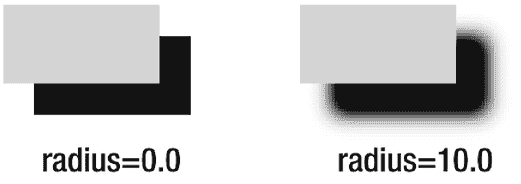
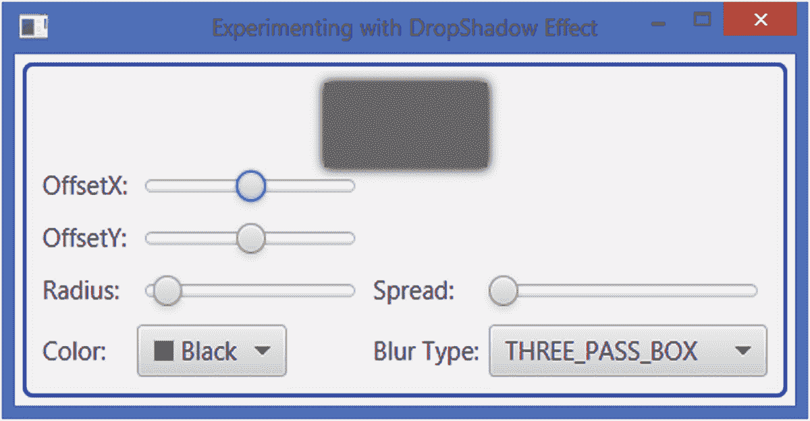
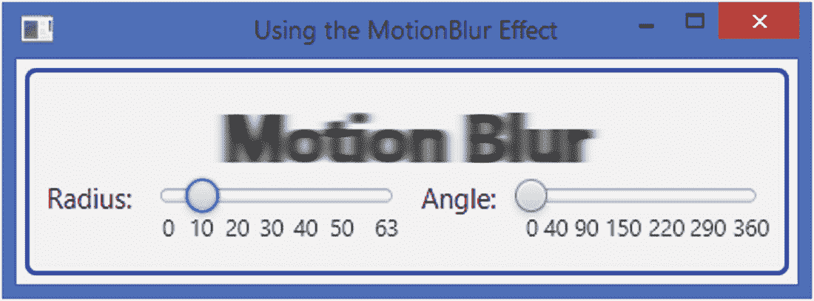
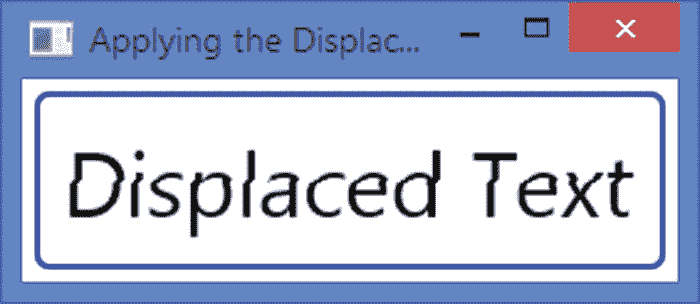
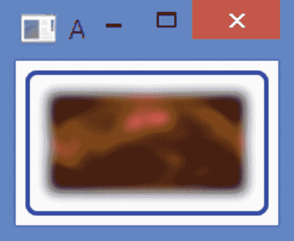
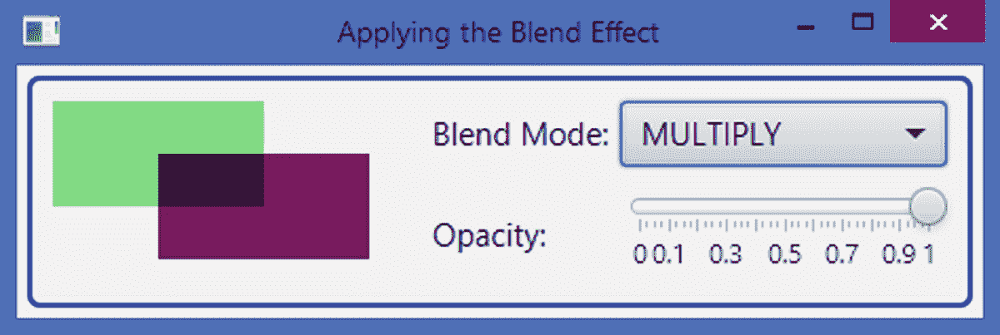
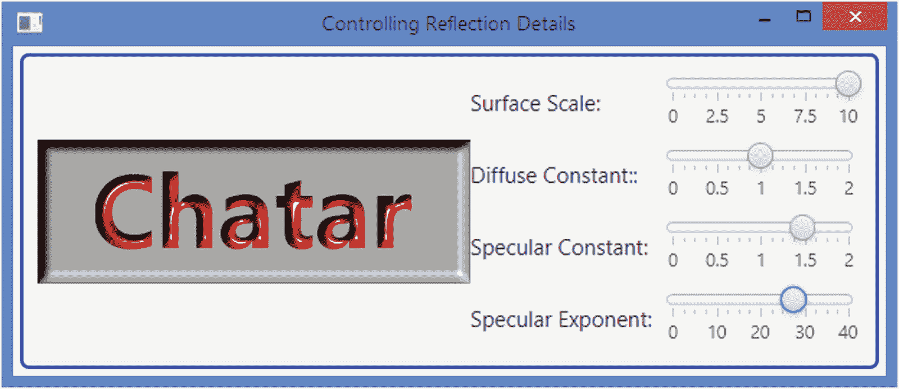
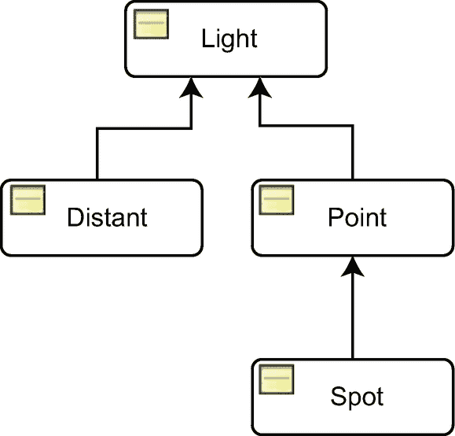
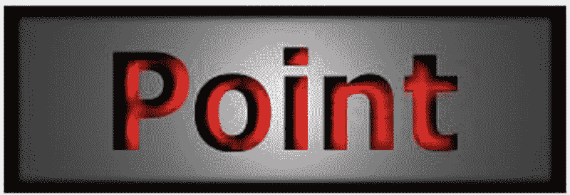

# 十七、应用效果

在本章中，您将学习:

*   这是什么效果

*   如何链接效果

*   有哪些不同类型的效果

*   如何使用透视变换效果

本章的例子在`com.jdojo.effect`包中。为了让它们工作，您必须在`module-info.java`文件中添加相应的一行:

```java
...
opens com.jdojo.effect to javafx.graphics, javafx.base;
...

```

## 什么是效果？

效果是接受一个或多个图形输入、对输入应用算法并产生输出的过滤器。通常，将效果应用于节点以创建视觉上吸引人的用户界面。效果的例子有阴影、模糊、扭曲、发光、反射、混合和不同类型的照明等。JavaFX 库提供了几个与效果相关的类。效果是有条件的特征。它们应用于节点，如果它们在平台上不可用，将被忽略。图 17-1 显示了使用投影、模糊、发光和高光效果的四个`Text`节点。


图 17-1

`Text`具有不同效果的节点

`Node`类包含一个`effect`属性，指定应用于节点的效果。默认情况下，是`null`。下面的代码片段将投影效果应用于一个`Text`节点:

```java
Text t1 = new Text("Drop Shadow");
t1.setFont(Font.font(24));
t1.setEffect(new DropShadow());

```

`Effect`类的一个实例代表一种效果。`Effect`类是所有效果类的抽象基础。所有效果类都包含在`javafx.scene.effect`包中。

清单 17-1 中的程序创建`Text`节点并对它们应用效果。这些节点如图 17-1 所示。我将在随后的章节中解释不同类型的效果及其用法。

```java
// EffectTest.java
package com.jdojo.effect;

import javafx.application.Application;
import javafx.scene.Scene;
import javafx.scene.effect.Bloom;
import javafx.scene.effect.BoxBlur;
import javafx.scene.effect.DropShadow;
import javafx.scene.effect.Glow;
import javafx.scene.layout.HBox;
import javafx.scene.layout.StackPane;
import javafx.scene.paint.Color;
import javafx.scene.shape.Rectangle;
import javafx.scene.text.Font;
import javafx.scene.text.FontWeight;
import javafx.scene.text.Text;
import javafx.stage.Stage;

public class EffectTest extends Application {
        public static void main(String[] args) {
                Application.launch(args);
        }

        @Override

        public void start(Stage stage) {
                Text t1 = new Text("Drop Shadow!");
                t1.setFont(Font.font(24));
                t1.setEffect(new DropShadow());

                Text t2 = new Text("Blur!");
                t2.setFont(Font.font(24));
                t2.setEffect(new BoxBlur());

                Text t3 = new Text("Glow!");
                t3.setFont(Font.font(24));
                t3.setEffect(new Glow());

                Text t4 = new Text("Bloom!");
                t4.setFont(Font.font("Arial", FontWeight.BOLD, 24));
                t4.setFill(Color.WHITE);
                t4.setEffect(new Bloom(0.10));

                // Stack the Text node with bloom effect over a
                     // Reactangle
                Rectangle rect = new Rectangle(100, 30, Color.GREEN);
                StackPane spane = new StackPane(rect, t4);

                HBox root = new HBox(t1, t2, t3, spane);
                root.setSpacing(20);
                root.setStyle("""
                         -fx-padding: 10;
                   -fx-border-style: solid inside;
                   -fx-border-width: 2;
                   -fx-border-insets: 5;
                   -fx-border-radius: 5;
                   -fx-border-color: blue;""");

                Scene scene = new Scene(root);
                stage.setScene(scene);
                stage.setTitle("Applying Effects");
                stage.show();
        }

}

Listing 17-1Applying Effects to Nodes

```

Tip

应用于`Group`的效果会应用于它的所有子对象。也可以链接多个效果，其中一个效果的输出成为链中下一个效果的输入。节点的布局边界不受应用于它的效果的影响。但是，局部边界和父边界会受到效果的影响。

## 连锁效应

当按顺序应用某些效果时，它们可以与其他效果链接在一起。第一个效果的输出成为第二个效果的输入，以此类推，如图 17-2 所示。


图 17-2

应用于节点的效果链

允许链接的效果类包含一个`input`属性来指定它前面的效果。如果`input`为`null`，则该效果应用于设置该效果的节点，而不是应用于之前的输入效果。默认情况下，`input`是`null`。以下代码片段在`Text`节点上创建了两个效果链，如图 17-3 所示:


图 17-3

用一个`Reflection`效果链接一个`DropShadow`效果

```java
// Effect Chain: Text >> Reflection >> Shadow
DropShadow dsEffect = new DropShadow();
dsEffect.setInput(new Reflection());
Text t1 = new Text("Reflection and Shadow");
t1.setEffect(dsEffect);

// Effect Chain: Text >> Shadow >> Reflection
Reflection reflection = new Reflection();
reflection.setInput(new DropShadow());
Text t2 = new Text("Shadow and Reflection");
t2.setEffect(reflection);

```

在图 17-3 中，一个`Reflection`效果后跟一个`DropShadow`应用于左边的文本；一个跟随有`Reflection`效果的`DropShadow`被应用到右边的文本。请注意，效果的顺序对输出产生了影响。第二个效果链产生更高的输出，因为反射也包括阴影。

如果一个效果允许链接，它将有一个`input`属性。在随后的部分中，我将列出效果类的输入属性，但不讨论它。

## 阴影效应

阴影效果绘制阴影并将其应用于输入。JavaFX 支持三种类型的阴影效果:

*   `DropShadow`

*   `InnerShadow`

*   `Shadow`

### *阴影*效果

`DropShadow`效果在输入后面画了一个阴影(模糊的图像)，所以输入看起来是凸起的。它给输入一个 3D 的外观。输入可以是效果链中的一个节点或一个效果。

一个`DropShadow`类的实例代表一个`DropShadow`效果。效果的大小、位置、颜色和质量由`DropShadow`类的几个属性控制:

*   `offsetX`

*   `offsetY`

*   `color`

*   `blurType`

*   `radius`

*   `spread`

*   `width`

*   `height`

*   `input`

`DropShadow`类包含几个构造器，允许您指定属性的初始值:

*   `DropShadow()`

*   `DropShadow(BlurType blurType, Color color, double radius, double spread, double offsetX, double offsetY)`

*   `DropShadow(double radius, Color color)`

*   `DropShadow(double radius, double offsetX, double offsetY, Color color)`

`offsetX`和`offsetY`属性控制阴影相对于输入的像素位置。默认情况下，它们的值为零。`offsetX`和`offsetY`的正值分别在 x 轴和 y 轴的正方向移动阴影。负值会使阴影反向移动。

下面的代码片段创建了一个具有 10px 的`offsetX`和`offsetY`的`DropShadow`对象。图 17-4 中左起第三个矩形显示了使用相同的矩形和不同的 x 和 y 偏移的效果。对于左数第四个矩形，阴影位于矩形的右下角，因为矩形大小(50，25)与偏移量(50，25)匹配。


图 17-4

`offsetX`和`offsetY`属性对`DropShadow`效果的影响

```java
DropShadow dsEffect = new DropShadow();
dsEffect.setOffsetX(10);
dsEffect.setOffsetY(10);

Rectangle rect = new Rectangle(50, 25, Color.LIGHTGRAY);
rect.setEffect(dsEffect);

```

属性指定了阴影的颜色。默认是`Color.BLACK`。下面的代码将颜色设置为红色:

```java
DropShadow dsEffect = new DropShadow();
dsEffect.setColor(Color.RED);

```

阴影中的模糊可以使用不同的算法来实现。属性指定阴影的模糊算法的类型。它的值是`BlurType`枚举的下列常量之一:

*   `ONE_PASS_BOX`

*   `TWO_PASS_BOX`

*   `THREE_PASS_BOX`

*   `GAUSSIAN`

`ONE_PASS_BOX`使用单遍框滤镜来模糊阴影。这两个`_PASS_BOX`使用两个盒子过滤器来模糊阴影。`THREE_PASS_BOX`使用三次盒式滤镜来模糊阴影。`GAUSSIAN`使用高斯模糊内核来模糊阴影。阴影的模糊质量在`ONE_PASS_BOX`中最少，在`GAUSSIAN`中最好。默认是`THREE_PASS_BOX`，质量上非常接近`GAUSSIAN`。以下代码片段设置了`GAUSSIAN`模糊类型:

```java
DropShadow dsEffect = new DropShadow();
dsEffect.setBlurType(BlurType.GAUSSIAN);

```

`radius`属性指定阴影在源像素的每一侧扩散的距离。如果半径为零，阴影会有锐利的边缘。它的值可以在 0 到 127 之间。默认值为 10。阴影区域外的模糊是通过混合阴影颜色和背景颜色实现的。模糊颜色在距离边缘的半径距离上逐渐消失。

图 17-5 显示了一个矩形两次带有`DropShadow`效果。左边的一个使用 0.0 的`radius`，这导致了阴影的锐利边缘。右边的一个使用默认的半径 10.0，在边缘周围散布 10px 的阴影。以下代码片段生成了图形中第一个具有清晰阴影边缘的矩形:



图 17-5

`DropShadow`效果的半径属性的效果

```java
DropShadow dsEffect = new DropShadow();
dsEffect.setOffsetX(10);
dsEffect.setOffsetY(10);
dsEffect.setRadius(0);

Rectangle rect = new Rectangle(50, 25, Color.LIGHTGRAY);
rect.setEffect(dsEffect);

```

属性指定了半径的部分，它和阴影有相同的颜色。半径剩余部分的颜色由模糊算法决定。其值介于 0.0 和 1.0 之间。默认值为 0.0。

假设你有一个`radius`为 10.0、`spread`值为 0.60 的`DropShadow`，阴影颜色为黑色。在这种情况下，源像素周围的模糊颜色将高达 6px。它将从第七个像素到第十个像素开始淡出。如果将“扩散”值指定为 1.0，则阴影不会模糊。图 17-6 显示了三个带`DropShadow`的矩形，半径为 10.0。三种`DropShadow`效果使用不同的扩散值。0.0 的扩散沿半径完全模糊。0.50 的扩散在半径的前半部分扩散阴影颜色，并模糊后半部分。1.0 的扩散沿半径完全扩散阴影颜色，没有模糊。以下代码片段产生了图 17-6 中的中间矩形:


图 17-6

`DropShadow`效果的扩展属性的效果

```java
DropShadow dsEfefct = new DropShadow();
dsEfefct.setOffsetX(10);
dsEfefct.setOffsetY(10);
dsEfefct.setRadius(10);
dsEfefct.setSpread(.50);

Rectangle rect = new Rectangle(50, 25, Color.LIGHTGRAY);
rect.setEffect(dsEfefct);

```

`width`和`height`属性分别指定从源像素到阴影颜色扩散处的水平和垂直距离。它们的值介于 0 和 255 之间。设置它们的值相当于设置`radius`属性，所以它们等于(2 *半径+ 1)。它们的默认值是 21.0。当您更改半径时，如果`width`和`height`属性未绑定，则使用公式对其进行调整。但是，设置`width`和`height`会改变半径值，因此`width`和`height`的平均值等于(2 *半径+ 1)。图 17-7 显示了四个带`DropShadow`效果的矩形。它们的`width`和`height`属性被设置，如每个矩形下所示。它们的`radius`属性被自动调整。左数第四个矩形是使用以下代码片段生成的:


图 17-7

设置`DropShadow`的宽度和高度的效果

```java
DropShadow dsEffect = new DropShadow();
dsEffect.setOffsetX(10);
dsEffect.setOffsetY(10);
dsEffect.setWidth(20);
dsEffect.setHeight(20);

Rectangle rect = new Rectangle(50, 25, Color.LIGHTGRAY);
rect.setEffect(dsEffect);

```

清单 17-2 中的程序让你试验`DropShadow`效果的属性。显示如图 17-8 所示的窗口。更改属性以查看它们的实际效果。



图 17-8

允许您在运行时更改`DropShadow`效果属性的窗口

```java
// DropShadowTest.java
// ...find in the book's download area.

Listing 17-2Experimenting with DropShadow Properties

```

### *内影*效果

`InnerShadow`效果与`DropShadow`效果非常相似。它在输入的边缘内绘制输入的阴影(模糊图像)，因此输入看起来具有深度或 3D 效果。输入可以是效果链中的一个节点或一个效果。

一个`InnerShadow`类的实例代表一个`InnerShadow`效果。效果的大小、位置、颜色和质量由`InnerShadow`类的几个属性控制:

*   `offsetX`

*   `offsetY`

*   `color`

*   `blurType`

*   `radius`

*   `choke`

*   `width`

*   `height`

*   `input`

`InnerShadow`类的属性数量等于`DropShadow`类的属性数量。`DropShadow`类中的`spread`属性被`InnerShadow`类中的`choke`属性替换，其工作方式类似于`DropShadow`类中的`spread`属性。有关这些属性的详细描述和示例，请参考上一节“阴影效果”。

`DropShadow`类包含几个构造器，允许您指定属性的初始值:

*   `InnerShadow()`

*   `InnerShadow(BlurType blurType, Color color, double radius, double choke, double offsetX, double offsetY)`

*   `InnerShadow(double radius, Color color)`

*   `InnerShadow(double radius, double offsetX, double offsetY, Color color)`

清单 17-3 中的程序创建了一个`Text`节点和两个`Rectangle`节点。一个`InnerShadow`应用于所有三个节点。图 17-9 显示了这些节点的结果。请注意，阴影没有扩散到节点的边缘之外。你需要设置`offsetX`和`offsetY`属性才能看到明显的效果。


图 17-9

使用`InnerShadow`效果的一个`Text`和两个`Rectangle`节点

```java
// InnerShadowTest.java
// ...find in the book's download area.

Listing 17-3Using the InnerShadow Class

```

### *阴影*效果

`Shadow`效果创建一个边缘模糊的阴影。与`DropShadow`和`InnerShadow`不同，它修改原始输入本身，将其转换为阴影。通常，`Shadow`效果会与原始输入相结合，以创建更高级别的阴影效果:

*   您可以将带有亮色的`Shadow`效果应用到节点上，并将其叠加到原始节点的副本上，以创建发光效果。

*   您可以创建一个深色的`Shadow`效果，并将其放在原始节点的后面，以创建一个`DropShadow`效果。

一个`Shadow`类的实例代表一个`Shadow`效果。效果的大小、颜色和质量由`Shadow`类的几个属性控制:

*   `color`

*   `blurType`

*   `radius`

*   `width`

*   `height`

*   `input`

这些属性的工作方式与它们在`DropShadow`中的工作方式相同。有关这些属性的详细描述和示例，请参考“阴影*T2 效果”一节。*

`Shadow`类包含几个构造器，允许您指定属性的初始值:

*   `Shadow()`

*   `Shadow(BlurType blurType, Color color, double radius)`

*   `Shadow(double radius, Color color)`

清单 17-4 中的程序演示了如何使用`Shadow`效果。它创建了三个`Text`节点。阴影将应用于所有三个节点。显示第一个阴影的输出。第二个阴影的输出叠加在原始节点上，以实现光晕效果。第三个阴影的输出放在它的原始节点后面，以达到一个`DropShadow`效果。图 17-10 显示了这三个节点。


图 17-10

对一个`Text`节点应用阴影，并创建`Glow`和`DropShadow`效果

```java
// ShadowTest.java
// ...find in the book's download area.

Listing 17-4Using a Shadow Effect and Creating High-Level Effects

```

## 模糊效果

模糊效果产生输入的模糊版本。JavaFX 允许您应用不同类型的模糊效果，它们在用于创建这些效果的算法上有所不同。

### *框模糊*效果

`BoxBlur`效果使用一个方框滤镜内核来产生模糊效果。`BoxBlur`类的一个实例代表一种`BoxBlur`效果。可以使用类的这些属性来配置效果的大小和质量:

*   `width`

*   `height`

*   `iterations`

*   `input`

`width`和`height`属性分别指定效果的水平和垂直尺寸。想象一个由输入像素中心的宽度和高度定义的框。在模糊过程中，像素的颜色信息在框内扩散。这些属性的值介于 0.0 和 255.0 之间。默认值为 5.0。小于或等于 1.0 的值不会在相应方向上产生模糊效果。

`iterations`属性指定应用模糊效果的次数。值越高，模糊质量越好。它的值可以在 0 到 3 之间。默认值为 1。值为 3 会产生与高斯模糊相当的模糊质量，这将在下一节中讨论。零值根本不会产生模糊。

`BoxBlur`类包含两个构造器:

*   `BoxBlur()`

*   `BoxBlur(double width, double height, int iterations)`

无参数构造器用 5.0 像素的`width`和`height`以及 1 像素的`iterations`创建一个`BoxBlur`对象。另一个构造器允许您为`width`、`height`和`iterations`属性指定初始值，如下面的代码部分所示:

```java
// Create a BoxBlur with defaults: width=5.0, height=5.0, iterations=1
BoxBlur bb1 = new BoxBlur();

// Create a BoxBlur with width=10.0, height=10.0, iterations=3
BoxBlur bb2 = new BoxBlur(10, 10, 3);

```

下面的代码片段创建了四个`Text`节点，并应用了各种质量的`BoxBlur`效果。图 17-11 显示了这些`Text`节点的结果。注意，最后一个`Text`节点没有任何模糊效果，因为`iterations`属性被设置为零。


图 17-11

具有不同质量效果的文本节点

```java
Text t1 = new Text("Box Blur");
t1.setFont(Font.font(24));
t1.setEffect(new BoxBlur(5, 10, 1));

Text t2 = new Text("Box Blur");
t2.setFont(Font.font(24));
t2.setEffect(new BoxBlur(10, 5, 2));

Text t3 = new Text("Box Blur");
t3.setFont(Font.font(24));
t3.setEffect(new BoxBlur(5, 5, 3));

Text t4 = new Text("Box Blur");
t4.setFont(Font.font(24));
t4.setEffect(new BoxBlur(5, 5, 0)); // Zero iterations = No blurring

```

### 高斯-布朗效应

`GaussianBlur`效果使用高斯卷积内核产生模糊效果。`GaussianBlur`类的一个实例代表一种`GaussianBlur`效果。可以使用类的两个属性来配置该效果:

*   `radius`

*   `input`

`radius`属性控制模糊在源像素中的分布。该值越大，模糊效果越明显。其值可以在 0.0 和 63.0 之间。默认值为 10.0。半径为 0 像素不会产生模糊效果。

`GaussianBlur`类包含两个构造器:

*   `GaussianBlur()`

*   `GaussianBlur(double radius)`

无参数构造器创建一个默认半径为 10.0px 的`GaussianBlur`对象。另一个构造器允许您指定半径的初始值，如以下代码所示:

```java
// Create a GaussianBlur with a 10.0 pixels radius
GaussianBlur gb1 = new GaussianBlur();

// Create a GaussianBlur with a 20.0 pixels radius
GaussianBlur gb2 = new GaussianBlur(20);

```

下面的代码片段创建了四个`Text`节点，并应用了不同半径值的`GaussianBlur`效果。图 17-12 显示了这些`Text`节点的结果。注意，最后一个`Text`节点没有任何模糊效果，因为`radius`属性被设置为零。


图 17-12

具有不同大小的`GaussianBlur`效果的文本节点

```java
Text t1 = new Text("Gaussian Blur");
t1.setFont(Font.font(24));
t1.setEffect(new GaussianBlur(5));

Text t2 = new Text("Gaussian Blur");
t2.setFont(Font.font(24));
t2.setEffect(new GaussianBlur(10));

Text t3 = new Text("Gaussian Blur");
t3.setFont(Font.font(24));
t3.setEffect(new GaussianBlur(15));

Text t4 = new Text("Gaussian Blur");
t4.setFont(Font.font(24));
t4.setEffect(new GaussianBlur(0)); // radius = 0 means no blur

```

### *运动模糊*效果

`MotionBlur`效果通过运动产生模糊效果。输入看起来就像你看到它在移动。高斯卷积核与指定的角度一起使用来产生效果。`MotionBlur`类的一个实例代表一种`MotionBlur`效果。可以使用类的三个属性来配置该效果:

*   `radius`

*   `angle`

*   `input`

如前一节所述，`radius`和`input`属性的工作方式与`GaussianBlur`类各自的属性相同。`angle`属性以度为单位指定运动的角度。默认情况下，角度为零。

`MotionBlur`类包含两个构造器:

*   `MotionBlur()`

*   `MotionBlur(double angle, double radius)`

无参数构造器创建一个默认半径为 10.0px、角度为 0.0 度的`MotionBlur`对象。另一个构造器允许您指定角度和半径的初始值，如以下代码所示:

```java
// Create a MotionBlur with a 0.0 degrees angle and a 10.0 pixels radius
MotionBlur mb1 = new MotionBlur();

// Create a MotionBlur with a 30.0 degrees angle and a 20.0 pixels radius
MotionBlur mb1 = new MotionBlur(30.0, 20.0);

```

清单 17-5 中的程序展示了如何在`Text`节点上使用`MotionBlur`效果，结果如图 17-13 所示。这两个滑块允许您更改`radius`和`angle`属性。



图 17-13

具有不同大小的`GaussianBlur`效果的文本节点

```java
// MotionBlurTest.java
// ...find in the book's download area.

Listing 17-5Using the MotionBlur Effect on a Text Node

```

## ***绽放*** 效果

`Bloom`效果为亮度大于或等于指定限制的输入像素添加光晕。请注意，不是所有的像素在一个`Bloom`效果中都会发光。

一个`Bloom`类的实例代表一个`Bloom`效果。它包含两个属性:

*   `threshold`

*   `input`

`threshold`属性是一个介于 0.0 和 1.0 之间的数字。其默认值为 0.30。输入中亮度大于或等于`threshold`属性的所有像素都会发光。像素的亮度由其发光度决定。光度为 0.0 的像素一点都不亮。光度为 1.0 的像素是 100%明亮。默认情况下，亮度大于或等于 0.3 的所有像素都会发光。阈值为 0.0 会使所有像素发光。阈值为 1.0 时，几乎没有像素发光。

`Bloom`类包含两个构造器:

*   `Bloom()`

*   `Bloom(double threshold)`

无参数构造器创建一个默认阈值为 0.30 的`Bloom`对象。另一个构造器让您指定`threshold`值，如以下代码所示:

```java
// Create a Bloom with threshold 0.30
Bloom b1 = new Bloom();

// Create a Bloom with threshold 0.10 - more pixels will glow.
Bloom b2 = new Bloom(0.10);

```

图 17-14 显示了具有不同阈值的`Bloom`效果的四个`Text`节点。使用一个`StackPane`将一个`Text`节点放置在一个矩形上。请注意，阈值越低，高光溢出效果越高。以下代码片段创建了图 17-14 中左起的第一个`Text`节点和`Rectangle`对:


图 17-14

具有`Bloom`效果的文本节点

```java
Text t1 = new Text("Bloom");
t1.setFill(Color.YELLOW);
t1.setFont(Font.font(null, FontWeight.BOLD, 24));
t1.setEffect(new Bloom(0.10));
Rectangle r1 = new Rectangle(100, 50, Color.GREEN);
StackPane sp1 = new StackPane(r1, t1);

```

## ***发光*** 效果

`Glow`效果使输入的亮像素更亮。`Glow`类的一个实例代表一种`Glow`效果。它包含两个属性:

*   `level`

*   `input`

属性指定了效果的强度。它是一个介于 0.0 和 1.0 之间的数字，默认值为 0.30。级别 0.0 不添加任何光晕，级别 1.0 添加最大光晕。

`Glow`类包含两个构造器:

*   `Glow()`

*   `Glow(double level)`

无参数构造器创建一个默认级别为 0.30 的`Glow`对象。另一个构造器允许您指定级别值，如下面的代码所示:

```java
// Create a Glow with level 0.30
Glow g1 = new Glow();

// Create a Glow with level 0.90 - more glow.
Glow g2 = new Glow(0.90);

```

图 17-15 显示了具有不同等级值的`Glow`效果的四个`Text`节点。使用一个`StackPane`将一个`Text`节点放置在一个矩形上。请注意，级别值越高，发光效果就越高。以下代码片段创建了图 17-15 中左起的第一个`Text`节点和`Rectangle`对:


图 17-15

具有`Glow`效果的文本节点

```java
Text t1 = new Text("Glow");
t1.setFill(Color.YELLOW);
t1.setFont(Font.font(null, FontWeight.BOLD, 24));
t1.setEffect(new Glow(0.10));
Rectangle r1 = new Rectangle(100, 50, Color.GREEN);
StackPane sp1 = new StackPane(r1, t1);

```

## ***倒影*** 效果

`Reflection`效果在输入下方添加了输入的反射。`Reflection`类的一个实例代表一种反射效果。反射的位置、大小和不透明度由各种属性控制:

*   `topOffset`

*   `fraction`

*   `topOpacity`

*   `bottomOpacity`

*   `input`

`topOffset`指定输入底部和反射顶部之间的像素距离。默认情况下，它是 0.0。属性指定在反射中可见的输入高度的分数。它是从底部测量的。其值可以在 0.0 和 1.0 之间。值为 0.0 表示没有反射。值为 1.0 意味着整个输入在反射中可见。值为 0.25 意味着来自底部的 25%的输入在反射中可见。默认值为 0.75。`topOpacity`和`bottomOpacity`属性指定了顶部和底部反射的不透明度。它们的值可以在 0.0 和 1.0 之间。`topOpacity`的默认值为 0.50，`bottomOpacity`的默认值为 0.0。

`Reflection`类包含两个构造器:

*   `Reflection()`

*   `Reflection(double topOffset, double fraction, double topOpacity, double bottomOpacity)`

无参数构造器创建一个`Reflection`对象，其属性使用默认的初始值。另一个构造器允许您指定属性的初始值，如下面的代码所示:

```java
// Create a Reflection with default values
Reflection g1 = new Reflection();

// Create a Reflection with topOffset=2.0, fraction=0.90,
// topOpacity=1.0, and bottomOpacity=1.0
Reflection g2 = new Reflection(2.0, 0.90, 1.0, 1.0);

```

图 17-16 显示了四个`Text`节点，具有不同配置的`Reflection`效果。下面的代码片段创建了左起第二个`Text`节点，它将完整的输入显示为反射:


图 17-16

具有`Reflection`效果的文本节点

```java
Text t2 = new Text("Chatar");
t2.setFont(Font.font(null, FontWeight.BOLD, 24));
t2.setEffect(new Reflection(0.0, 1.0, 1.0, 1.0));

```

## ***乌贼墨*** 效果

棕褐色是一种红棕色。棕褐色调色是在黑白照片上进行的，目的是使照片具有更温暖的色调。一个`SepiaTone`类的实例代表一个`SepiaTone`效果。它包含两个属性:

*   `level`

*   `input`

属性指定了效果的强度。它是一个介于 0.0 和 1.0 之间的数字。其默认值为 1.0。0.0 的`level`不添加棕褐色色调，1.0 的`level`添加最大棕褐色色调。

`SepiaTone`类包含两个构造器:

*   `SepiaTone ()`

*   `SepiaTone (double level)`

无参数构造器创建一个默认为 1.0 的`level`对象。另一个构造器让您指定`level`值，如下面的代码所示:

```java
// Create a SepiaTone with level 1.0
SepiaTone g1 = new SepiaTone ();

// Create a SepiaTone with level 0.50
SepiaTone g2 = new SepiaTone(0.50);

```

以下代码片段创建了两个`Text`节点，结果如图 17-17 所示。请注意，色阶值越高，棕褐色调色效果就越高:


图 17-17

具有`SepiaTone`效果的文本节点

```java
Text t1 = new Text("SepiaTone");
t1.setFill(Color.WHITE);
t1.setFont(Font.font(null, FontWeight.BOLD, 24));
1.setEffect(new SepiaTone(0.50));
Rectangle r1 = new Rectangle(150, 50, Color.BLACK);
r1.setOpacity(0.50);
StackPane sp1 = new StackPane(r1, t1);

Text t2 = new Text("SepiaTone");
t2.setFill(Color.WHITE);
t2.setFont(Font.font(null, FontWeight.BOLD, 24));
t2.setEffect(new SepiaTone(1.0));
Rectangle r2 = new Rectangle(150, 50, Color.BLACK);
r2.setOpacity(0.50);
StackPane sp2 = new StackPane(r2, t2);

```

## ***位移贴图*** 效果

`DisplacementMap`效果移动输入中的每个像素以产生输出。这个名字有两部分:“位移”和“地图。”第一部分意味着该效果移动了输入中的像素。第二部分意味着置换是基于为输出中的每个像素提供置换因子的映射。

`DisplacementMap`类的一个实例代表一个`DisplacementMap`。该类包含几个用于配置效果的属性:

*   `mapData`

*   `scaleX`

*   `scaleY`

*   `offsetX`

*   `offsetY`

*   `wrap`

*   `input`

`mapData`属性是`FloatMap`类的实例。一个`FloatMap`是一个数据结构，它为矩形区域中的每个点存储多达四个值，由它的`width`和`height`属性表示。例如，您可以使用`FloatMap`为二维矩形中的每个像素存储颜色的四个分量(红色、绿色、蓝色和 alpha)。与`FloatMap`中的一对数字相关联的四个值中的每一个都位于编号为 0、1、2 和 3 的带中。每个区带中值的实际含义取决于上下文。以下代码提供了设置`FloatMap`宽度和高度的示例:

```java
// Create a FloatMap (width = 100, height = 50)
FloatMap map = new FloatMap(100, 50);

```

现在您需要用每对数字的波段值填充`FloatMap`。您可以使用`FloatMap`类的以下方法之一来填充数据:

*   `setSample(int x, int y, int band, float value)`

*   `setSamples(int x, int y, float s0)`

*   `setSamples(int x, int y, float s0, float s1)`

*   `setSamples(int x, int y, float s0, float s1, float s2)`

*   `setSamples(int x, int y, float s0, float s1, float s2, float s3)`

`setSample()`方法为指定的(x，y)位置设置指定波段中的指定`value`。`setSamples()`方法在由方法调用中值的位置决定的范围内设置指定的值。也就是说，第一个值设置为波段 0，第二个值设置为波段 1，依此类推:

```java
// Set 0,50f for band 0 and band 1 for each point in the map
for (int i = 0; i < 100; i++) {
        for (int j = 0; j < 50; j++) {
                map.setSamples(i, j, 0.50f, 0.50f);
        }
}

```

`DisplacementMap`类要求您将`mapData`属性设置为一个`FloatMap`，其中包含输出中每个像素的波段 0 和波段 1 的值。

`scaleX`、`scaleY`、`offsetX`和`offsetY`是双精度属性。它们被用在等式中(稍后描述)来计算像素的位移。`scaleX`和`scaleY`属性的默认值为 1.0。`offsetX`和`offsetY`属性的默认值为 0.0。

以下等式用于计算输出中(x，y)坐标处的像素。等式中的缩写`dst`和`src`分别代表目的地和源:

```java
dst[x,y] = src[x + (offsetX + scaleX * mapData[x,y][0]) * srcWidth,
               y + (offsetY + scaleY * mapData[x,y][1]) * srcHeight]

```

如果前面的等式看起来非常复杂，不要被吓倒。事实上，一旦你阅读了下面的解释，这个等式是非常简单的。等式中的`mapData[x,y][0]`和`mapData[x,y][1]`部分分别指(x，y)位置的`FloatMap`中波段 0 和波段 1 的值。

假设您想要获得输出中(x，y)坐标的像素，也就是说，您想要知道输入中的哪个像素将被移动到输出中的(x，y)。首先，确保你的出发点是正确的。重复一下，该等式从输出中的点(x，y)开始，并在输入中找到(x1，y1)处的像素，该像素将移动到输出中的(x，y)。

Tip

许多人会认为从输入中的一个像素开始，然后在输出中找到它的位置，从而得出错误的等式。这不是真的。这个等式反过来适用。它在输出中选取一个点(x，y ),然后找到输入中的哪个像素将移动到这个点。

以下是完整解释该等式的步骤:

*   您希望找到输入中将要移动到输出中的点(x，y)的像素。

*   从`mapData`获取(x，y)的值(波段 0 和波段 1)。

*   将`mapData`值乘以刻度(x 坐标为`scaleX`，y 坐标为`scaleY`)。

*   将相应的偏移值添加到上一步计算的值中。

*   将前面的步长值乘以相应的输入尺寸。这为您提供了从输出(x，y)沿 x 和 y 坐标轴的偏移值，输入中的像素将从该处移动到输出中的(x，y)。

*   将上一步中的值添加到输出中点的 x 和 y 坐标中。假设这些值是(x1，y1)。输入中(x1，y1)处的像素移动到输出中的点(x，y)。

如果您在理解像素移位逻辑方面仍有问题，您可以将前面的等式分成两部分:

```java
x1 = x + (offsetX + scaleX * mapData[x,y][0]) * srcWidth
y1 = y + (offsetY + scaleY * mapData[x,y][1]) * srcHeight

```

您可以将这些等式理解为“输出中(x，y)处的像素是通过将输入中(x1，y1)处的像素移动到(x，y)获得的。”

如果将比例和偏移值保留为默认值

*   在波段 0 中使用正值将输入像素向左移动。

*   在波段 0 中使用负值将输入像素向右移动。

*   在波段 1 中使用正值将输入像素上移。

*   在波段 1 中使用负值将输入像素下移。

清单 17-6 中的程序创建了一个`Text`节点，并为该节点添加了一个`DisplacementMap`效果。在`mapData`中，它设置值，因此输入的上半部分的所有像素向右移动 1 个像素，输入的下半部分的所有像素向左移动 1 个像素。`Text`节点将如图 17-18 所示。



图 17-18

具有`DisplacementMap`效果的`Text`节点

```java
// DisplacementmapTest.java

// ...find in the book's download area.

Listing 17-6Using the DisplacementMap Effect

```

`DisplacementMap`类包含一个`wrap`属性，默认设置为 false。输出中的像素是移动到新位置的输入中的像素。需要移动到新位置的像素在输入中的位置由以下等式计算得出。对于输出中的某些位置，输入中可能没有可用的像素。假设你有一个 100 像素宽 50 像素高的矩形，你应用了一个`DisplacementMap`效果来将所有像素向左移动 50 像素。输出中 x = 75 的点将获得输入中 x = 125 的像素。输入只有 100 像素宽。因此，对于输出中的所有点 x > 50，输入中将没有可用像素。如果`wrap`属性设置为 true，当输入中要移动的像素的位置在输入边界之外时，通过取它们与输入的相应维度(沿 x 轴的宽度和沿 y 轴的高度)的模数来计算位置。在示例中，x = 125 将减少到 125 % 100，即 25，输入中 x = 25 处的像素将移动到输出中 x = 75 处。如果`wrap`属性为假，输出中的像素保持透明。

图 17-19 显示了具有`DisplacementMap`效果的两个`Text`节点。两个节点中的像素都向左移动 100 像素。顶部的`Text`节点的`wrap`属性设置为 false，而底部的`Text`节点的`wrap`属性设置为 true。注意，底部节点的输出是通过包装输入来填充的。清单 17-7 中的程序用于应用包裹效果。


图 17-19

在`DisplacementMap`中使用`wrap`属性的效果

```java
// DisplacementMapWrap.java
// ...find in the book's download area.

Listing 17-7Using the wrap Property in the DisplacementMap Effect

```

## *颜色输入*效果

`ColorInput`效果是一个简单的效果，用指定的颜料填充(泛光)一个矩形区域。通常，它被用作另一个效果的输入。

`ColorInput`类的一个实例代表了`ColorInput`效果。该类包含定义矩形区域的位置、大小和绘制的五个属性:

*   `x`

*   `y`

*   `width`

*   `height`

*   `paint`

创建一个`ColorInput`对象类似于创建一个用`ColorInput`的颜料填充的矩形。`x`和`y`属性指定矩形区域左上角在本地坐标系中的位置。属性`width`和`height`指定了矩形区域的大小。x、y、宽度和高度的默认值为 0.0。`paint`属性指定填充油漆。`paint`的默认值为`Color.RED`。

您可以使用以下构造器来创建一个`ColorInput`类的对象:

*   `ColorInput()`

*   `ColorInput(double x, double y, double width, double height, Paint paint)`

以下代码片段创建了一个`ColorInput`效果，并将其应用于一个矩形。应用效果后的矩形如图 17-20 所示。请注意，当您将`ColorInput`效果应用到一个节点时，您看到的只是由`ColorInput`效果生成的矩形区域。如前所述，`ColorInput`效果不会直接应用于节点。相反，它被用作另一个效果的输入。


图 17-20

应用于矩形的`ColorInput`效果

```java
ColorInput effect = new ColorInput();
effect.setWidth(100);
effect.setHeight(50);
effect.setPaint(Color.LIGHTGRAY);

// Size of the Rectangle does not matter to the rectangular area
// of the ColorInput
Rectangle r1 = new Rectangle(100, 50);
r1.setEffect(effect);

```

## ***ColorAdjust*** 效果

`ColorAdjust`效果按指定的增量调整像素的色调、饱和度、亮度和对比度。通常，该效果用于一个`ImageView`节点来调整图像的颜色。

`ColorAdjust`类的一个实例代表了`ColorAdjust`效果。该类包含定义矩形区域的位置、大小和绘制的五个属性:

*   `hue`

*   `saturation`

*   `brightness`

*   `contrast`

*   `input`

`hue`、`saturation`、`brightness`和`contrast`属性指定所有像素的这些分量的调整增量。范围从–1.0 到 1.0。它们的默认值为 0.0。

清单 17-8 中的程序展示了如何在图像上使用`ColorAdjust`效果。它显示一个图像和四个滑块来改变`ColorAdjust`效果的属性。使用滑块调整它们的值以查看效果。如果程序没有找到图像，它会打印一条消息，并显示一个`Text`节点覆盖了一个`StackPane`中的矩形，该效果会应用到`StackPane`。

```java
// ColorAdjustTest.java

// ...find in the book's download area.

Listing 17-8Using the ColorAdjust Effect to Adjust the Color of Pixels in an Image

```

## *图像输入*效果

`ImageInput`效果的工作原理类似于`ColorInput`效果。它将给定的图像作为输入传递给另一个效果。这种效果不会修改给定的图像。通常，它用作另一个效果的输入，而不是直接应用于节点的效果。

`ImageInput`类的一个实例代表了`ImageInput`效果。该类包含三个定义图像位置和来源的属性:

*   `x`

*   `y`

*   `source`

`x`和`y`属性指定图像左上角在最终应用效果的内容节点的本地坐标系中的位置。它们的默认值为 0.0。`source`属性指定了要使用的`Image`对象。

您可以使用以下构造器来创建一个`ColorInput`类的对象:

*   `ImageInput()`

*   `ImageInput(Image source)`

*   `ImageInput(Image source, double x, double y)`

清单 17-9 中的程序展示了如何使用`ImageInput`效果。它将一个`ImageInput`作为输入传递给一个`DropShadow`效果，该效果应用于一个矩形，如图 17-21 所示。



图 17-21

将`DropShadow`效果应用于矩形的`ImageInput`效果

```java
// ImageInputTest.java
// ...find in the book's download area.

Listing 17-9Using an ImageInput Effect As an Input to a DropShadow Effect

```

## ***融合*** 效果

混合将两个输入中相同位置的两个像素组合起来，在输出中生成一个复合像素。`Blend`效果采用两种输入效果，并混合输入的重叠像素以产生输出。两个输入的混合由混合模式控制。

`Blend`类的一个实例代表了`Blend`效果。该类包含指定的属性

*   `topInput`

*   `bottomInput`

*   `mode`

*   `opacity`

`topInput`和`bottomInput`属性分别指定顶部和底部效果。他们默认是`null`。属性指定了混合模式，这是在`BlendMode`枚举中定义的常量之一。默认为`BlendMode.SRC_OVER`。JavaFX 提供了 17 种预定义的混合模式。表 17-1 列出了`BlendMode`枚举中的所有常量，并对每个常量进行了简要描述。所有混合模式都使用`SRC_OVER`规则来混合 alpha 组件。`opacity`属性指定在应用混合之前应用于顶部输入的不透明度。`opacity`默认为 1.0。

表 17-1

`BlendMode`枚举中的常量及其描述

<colgroup><col class="tcol1 align-left"> <col class="tcol2 align-left"></colgroup> 
| 

BlendMode Enum 常量

 | 

描述

 |
| --- | --- |
| `ADD` | 它将顶部和底部输入中的像素的颜色(红色、绿色和蓝色)和 alpha 值相加，以获得新的分量值。 |
| `MULTIPLY` | 它将两个输入的颜色分量相乘。 |
| `DIFFERENCE` | 它从任何一个输入中减去另一个输入中较亮颜色分量中的较暗颜色分量，以获得结果颜色分量。 |
| `RED` | 它用顶部输入的红色分量替换底部输入的红色分量，使所有其他颜色分量不受影响。 |
| `BLUE` | 它用顶部输入的蓝色分量替换底部输入的蓝色分量，使所有其他颜色分量不受影响。 |
| `GREEN` | 它用顶部输入的绿色分量替换底部输入的绿色分量，使所有其他颜色分量不受影响。 |
| `EXCLUSION` | 它将两个输入的颜色分量相乘，并将结果加倍。从底部输入的颜色分量的总和中减去由此获得的值，以获得结果颜色分量。 |
| `COLOR_BURN` | 它将底部输入颜色分量的倒数除以顶部输入颜色分量，并将结果反转。 |
| `COLOR_DODGE` | 它将底部输入颜色分量除以顶部输入颜色的倒数。 |
| `LIGHTEN` | 它使用两个输入中较亮的颜色分量。 |
| `DARKEN` | 它使用两个输入中较暗的颜色分量。 |
| `SCREEN` | 它反转来自两个输入的颜色分量，将它们相乘，然后反转结果。 |
| `OVERLAY` | 根据底部输入颜色，它会倍增或筛选输入颜色分量。 |
| `HARD_LIGHT` | 根据顶部输入颜色，它会倍增或筛选输入颜色分量。 |
| `SOFT_LIGHT` | 根据顶部输入颜色，它会使输入颜色分量变暗或变亮。 |
| `SRC_ATOP` | 它为非重叠区域保留底部输入，为重叠区域保留顶部输入。 |
| `SRC_OVER` | 顶部输入绘制在底部输入之上。因此，重叠区域显示顶部输入。 |

清单 17-10 中的程序创建了两个相同大小的`ColorInput`效果。它们的`x`和`y`属性以重叠的方式设置。这两个效果被用作`Blend`效果的顶部和底部输入。提供了一个组合框和一个滑块来选择顶部输入的混合模式和不透明度。图 17-22 显示了运行该代码产生的窗口。运行程序，尝试选择不同的混合模式，看看`Blend`的效果。



图 17-22

`Blend`效应

```java
// BlendTest.java
// ...find in the book's download area.

Listing 17-10Using the Blend Effect

```

## ***灯光*** 效果

`Lighting`效果，顾名思义，模拟光源照射在场景中的指定节点上，给节点一个 3D 的外观。一个`Lighting`效果使用一个光源来产生效果，这个光源是`Light`类的一个实例。有不同类型的可配置灯可用。如果不指定光源，效果将使用默认光源。

一个`Lighting`类的实例代表一个`Lighting`效果。该类包含两个构造器:

*   `Lighting()`

*   `Lighting(Light light)`

无参数构造器使用默认光源。另一个构造器让你指定一个光源。

将`Lighting`效果应用到一个节点可能是一个简单或复杂的任务，这取决于您想要实现的效果类型。让我们看一个简单的例子。下面的代码片段将一个`Lighting`效果应用到一个`Text`节点，给它一个 3D 的外观，如图 17-23 所示:


图 17-23

使用默认光源的具有`Lighting`效果的`Text`节点

```java
// Create a Text Node
Text text = new Text("Chatar");
text.setFill(Color.RED);
text.setFont(Font.font(null, FontWeight.BOLD, 72));
HBox.setMargin(text, new Insets(10));

// Set a Lighting effect to the Text node
text.setEffect(new Lighting());

```

在前面的例子中，添加`Lighting`效果就像创建一个`Lighting`类的对象并将其设置为`Text`节点的效果一样简单。后面我会讨论一些复杂的`Lighting`效果。`Lighting`类包含几个属性来配置效果:

*   `contentInput`

*   `surfaceScale`

*   `bumpInput`

*   `diffuseConstant`

*   `specularConstant`

*   `specularExponent`

*   `light`

如果使用效果链，`contentInput`属性指定了`Lighting`效果的输入效果。在前面讨论的所有其他效果中，此属性被命名为输入。在本节中，我不会进一步讨论这个属性。有关如何使用该属性的更多详细信息，请参考“链接效果”一节。

### 自定义表面纹理

`surfaceScale`和`bumpInput`属性用于为 2D 表面提供纹理，使其看起来像 3D 表面。基于像素的不透明度，像素看起来或高或低，以赋予表面纹理。透明像素看起来很低，不透明像素看起来很高。

`surfaceScale`属性允许您控制表面粗糙度。其值的范围从 0.0 到 10.0。默认值为 1.5。对于更高的`surfaceScale`，表面看起来更粗糙，给它一个更 3D 的外观。

您可以使用`bumpInput`属性将`Effect`作为输入传递给`Lighting`效果。使用`bumpInput`中像素的不透明度来获得光照表面像素的高度，然后应用`surfaceScale`来增加粗糙度。如果`bumpInput`为`null`，来自应用效果的节点的像素的不透明度用于生成表面的粗糙度。默认情况下，半径为 10 的`Shadow`效果被用作`bumpInput`。您可以使用`ImageInput`、模糊效果或任何其他效果作为`bumpInput`的`Lighting`效果。

清单 17-11 中的程序显示了一个带有`Lighting`效果的`Text`节点。将`bumpInput`设置为`null`。它提供了一个复选框来设置一个`GaussianBlur`效果作为`bumpInput`和一个滑块来调整`surfaceScale`值。图 17-24 显示了两个截图:一个没有凹凸输入，另一个有凹凸输入。请注意表面纹理的差异。


图 17-24

`surfaceScale`和`bumpInput`对`Lighting`的影响对`Text`节点的影响

```java
// SurfaceTexture.java
// ...find in the book's download area.

Listing 17-11Using the surfaceScale and bumpInput Properties

```

### 理解反射类型

当光落在不透明的表面上时，一部分光被吸收，一部分被透射，一部分被反射。3D 外观是通过显示部分表面较亮部分较暗来实现的。你会看到表面反射的光。3D 外观因光源和节点曲面反射光线的方式而异。微观级别的表面结构定义了反射的细节，例如强度和方向。在几种反射类型中，这里有两种类型值得一提:漫反射和镜面反射。

在*漫反射*中，表面以多个角度反射入射光线。也就是说，漫反射通过向所有方向反射光线来散射光线。完美的漫反射将光线均匀地反射到各个方向。使用漫反射的表面从各个方向看起来都一样亮。这并不意味着整个漫反射表面都是可见的。漫反射曲面上某个区域的可见性取决于灯光的方向和曲面的方向。表面的亮度取决于表面类型本身和光线的强度。通常，粗糙的表面，例如衣服、纸张或灰泥墙，使用漫反射来反射光线。表面在肉眼看来可能是光滑的，例如纸或衣服，但在微观层面上它们是粗糙的，并且它们漫反射光。

在镜面反射中，表面只向一个方向反射光线。也就是说，一条入射光线只有一条反射光线。微观层面的光滑表面，例如镜子或磨光的大理石，会产生镜面反射。一些光滑的表面在微观水平上可能不是 100%光滑的，它们也可能漫反射部分光。与漫反射相比，镜面反射会产生更亮的表面。图 17-25 描绘了光在漫反射和镜面反射中的反射方式。


图 17-25

漫反射和镜面反射类型

`Lighting`类的三个属性用于控制反射的大小和强度:

*   `diffuseConstant`

*   `specularConstant`

*   `specularExponent`

这些属性是 double 类型的。`diffuseConstant`用于漫反射。`specularConstant`和`specularExponent`用于镜面反射。`diffuseConstant`属性指定漫反射强度的倍数。其值范围为 0.0 到 2.0，默认值为 1.0。值越高，表面越亮。`specularConstant`属性指定镜面反射应用到的光的比例。其值范围为 0.0 到 2.0，默认值为 0.30。更高的值意味着更大尺寸的镜面高光。`specularExponent`指定表面的光泽度。较高的值意味着反射更强烈，表面看起来更亮。`specularExponent`范围从 0.0 到 40.0，默认值为 20.0。

清单 17-12 包含一个实用程序类的代码，它将`Lighting`类的属性绑定到一些控件，这些控件将用于控制后面讨论的例子中的属性。

```java
// LightingUtil.java
// ...find in the book's download area.

Listing 17-12A Utility Class That Creates a Set of Controls Bound to the Properties of a Lighting Instance

```

清单 17-13 中的程序使用工具类将`Lighting`效果的属性绑定到 UI 控件。显示如图 17-26 所示的窗口。使用滑块更改反射属性以查看其效果。



图 17-26

反射属性对照明节点的影响

```java
// ReflectionTypeTest.java
// ...find in the book's download area.

Listing 17-13Controlling Reflection’s Details

```

### 了解光源

JavaFX 提供了三种内置光源:远光、点光和聚光灯。*远光*也称为*定向光*或*线性光*。远光源在整个表面上均匀地发出*特定方向*的平行光线。太阳是地球上被照亮物体表面的一个完美的远距离光源的例子。光源离被照亮的物体很远，所以光线几乎是平行的。远光源均匀地照亮一个表面，而不考虑它离表面的距离。这并不意味着整个物体都被照亮。例如，当你站在阳光下，不是你身体的所有部分都被照亮。然而，你身体被照亮的部分有均匀的光。物体被照亮的部分取决于光源发出的光的方向。图 17-27 显示了一束远光照射到一个物体表面的某个部分。请注意，看到的是光线，而不是光源本身，因为对于远光来说，只有光的方向才是重要的，而不是光源与被照亮物体的距离。


图 17-27

打在物体表面的远光

*点*光源从 3D 空间中一个极小的点向各个方向发出光线。理论上，光源是没有维度的。它均匀地向各个方向发光。因此，与远光不同，点光源相对于被照亮物体的方向并不重要。裸露的灯泡、星星(不包括太阳，它像一个遥远的光)和烛光都是点光源的例子。撞击表面的点光源的强度随着表面和点光源之间距离的平方而减小。如果点光源非常靠近曲面，它会创建一个热点，这是曲面上非常亮的点。为了避免热点，你需要将光源从表面移开一点。例如，使用点的 x、y 和 z 坐标，在 3D 空间中的特定点处定义点光源。图 17-28 显示了向各个方向辐射光线的点光源。物体表面上最靠近灯光的点将被照亮最多。


图 17-28

打在物体表面的点光源

点光源是一种特殊类型的点光源。像点光源一样，它从三维空间中一个极小的点放射出光线。与点光源不同，光线的辐射被限制在一个圆锥体定义的区域内——位于圆锥体顶点的光源向其底部发出光线，如图 17-29 所示。聚光灯的例子有汽车前灯、手电筒、聚光灯和带灯罩的台灯。聚光灯瞄准曲面上的一点，该点是曲面上圆锥体轴所在的点。圆锥轴是连接圆锥顶点和圆锥底面中心的线。在图 17-29 中，锥轴用虚线箭头表示。聚光灯的效果由圆锥体顶点的位置、圆锥体角度和圆锥体旋转来定义。圆锥体的旋转决定了曲面上与圆锥体轴相交的点。圆锥体的角度控制着照明区域的面积。聚光灯的强度沿圆锥轴最高。如果将聚光灯“拉远”，可以使用聚光灯模拟远光，这样到达表面的光线是平行的。


图 17-29

聚光灯打在物体表面

光源是抽象`Light`类的一个实例。灯光有颜色，这是通过使用`Light`类的`color`属性来指定的。例如，使用红色`Light`将使白色填充的`Text`节点看起来是红色的。

`Light`类有三个子类来代表特定类型的光源。子类是`Light`类的静态内部类:

*   `Light.Distant`

*   `Light.Point`

*   `Light.Spot`

代表光源的类的类图如图 17-30 所示。`Light.Spot`类继承自`Light.Point`类。类定义属性来配置特定类型的光源。



图 17-30

代表光源的类的类图

Tip

当你没有为灯光效果提供光源时，会使用远光，这是`Light.Distant`类的一个实例。

#### 使用远处的光源

`Light.Distant`类的一个实例代表一个远处的光源。该类包含两个指定光源方向的属性:

*   `azimuth`

*   `elevation`

这两个属性都是 double 类型。它们的值以度为单位。这两个属性一起用于在 3D 空间中以特定方向定位光源。默认情况下，它们的值为 45 度。它们没有最大值和最小值。它们的值是使用模 360 计算的。例如，方位角值 400 实际上是 40 (400 模 360 = 40)。

`azimuth`属性指定 XY 平面中的方向角。顺时针测量正值，逆时针测量负值。方位角的 0°值位于 3 点钟位置，6 点钟位置为 90°，9 点钟位置为 180°，12 点钟位置为 270°，3 点钟位置为 360°。–90°的方位角将位于 12 点钟方向。图 17-31 显示了不同方位角值下远光在 XY 平面上的位置。


图 17-31

使用方位角值确定远光在 XY 平面中的方向

`elevation`属性指定光源在 YZ 平面上的方向角。`elevation`属性值为 0 和 180 使光源停留在 XY 平面上。仰角为 90 时，光源位于场景前方，整个场景被照亮。大于 180°小于 360°的仰角会将光源放在场景后面，使场景看起来很暗(没有灯光)。

`Light.Distant`类包含两个构造器:

*   `Light.Distant()`

*   `Light.Distant(double azimuth, double elevation, Color color)`

无参数构造器使用 45.0 度作为`azimuth`、`elevation`和`Color.WHITE`的光色。另一个构造器允许您指定这些属性。

清单 17-14 中的程序显示了如何使用`Light.Distant`灯。它显示一个窗口，让您设置照射在矩形和`Text`节点上的远光的方向。图 17-32 显示了一个带有远光的文本和矩形的例子。


图 17-32

一束远光照亮了一个`Text`节点和一个矩形

```java
// DistantLightTest.java
// ...find in the book's download area.

Listing 17-14Using a Distant Light Source

```

#### 使用点光源

类的一个实例代表一个点光源。该类包含三个属性来指定光源在空间中的位置:`x`、`y`和`z`。`x`、`y`和`z`属性是点光源在空间中所在点的 x、y 和 z 坐标。如果你将`z`属性设置为 0.0，光源将在场景的平面上显示为一个非常小的亮点，照亮一个非常小的区域。随着`z`值的增加，光源远离场景平面，照亮场景中更多的区域。负值的`z`会将光源移动到场景后面，使其没有光线，场景看起来会完全黑暗。

`Light.Point`类包含两个构造器:

*   `Light.Point()`

*   `Light.Point(double x, double y, double z, Color color)`

无参数构造器将点光源放置在(0，0，0)处，并为光源使用`Color.WHITE`颜色。另一个构造器让您指定光源的位置和颜色。

清单 17-15 中的程序显示了如何使用`Light.Point`灯。它会显示一个底部带有滑块的窗口，用于更改点光源的位置。随着点光源远离场景，场景中的某些区域会比其他区域更亮。图 17-33 显示了一个覆盖在矩形上的`Text`节点被点光源照亮的例子。



图 17-33

点光源照亮一个`Text`节点和一个矩形

```java
// PointLightTest.java
// ...find in the book's download area.

Listing 17-15Using a Point Light Source

```

#### 使用点光源

`Light.Spot`类的一个实例代表一个点光源。该类继承自`Light.Point`类。从`Light.Point`类继承的属性(`x`、`y`和`z`)指定了光源的位置，它与圆锥体的顶点重合。`Light.Spot`类包含四个属性来指定光源在空间中的位置:

*   `pointsAtX`

*   `pointsAtY`

*   `pointsAtZ`

*   `specularExponent`

`pointsAtX`、`pointsAtY`和`pointsAtZ`属性指定空间中的一个点来设置光线的方向。从(`x`、`y`、`z`)开始，向(`pointsAtX`、`pointsAtY`、`pointsAtZ`)方向走的一条线就是锥轴，也是光线的方向。默认情况下，它们被设置为 0.0。`specularExponent`属性定义了光线的焦点(圆锥体的宽度)，范围从 0.0 到 4.0。默认值为 1.0。`specularExponent`的值越高，圆锥体越窄，场景上聚焦的光线越多。

`Light.Spot`类包含两个构造器:

*   `Light.Spot()`

*   `Light.Spot(double x, double y, double z, double specularExponent, Color color)`

无参数构造器将光线放置在(0，0，0)处，并为光线使用`Color.WHITE`颜色。因为`pointsAtX`、`pointsAtY`和`pointsAtZ`的默认值是 0.0，所以光线没有方向。另一个构造器让您指定光源的位置和颜色。圆锥轴将从指定的(x，y，x)到(0，0，0)。

清单 17-16 中的程序显示了如何使用`Light.Spot`灯。它会显示一个窗口，允许您使用底部的滑块配置灯光的位置、方向和焦点。图 17-34 显示了一个`Light.Spot`光几乎聚焦在矩形中间的例子。


图 17-34

聚光灯照亮一个`Text`节点和一个矩形

```java
// SpotLightTest.java
// ...find in the book's download area.

Listing 17-16Using a Spot Light Source

```

## *透视变换*效果

通过将角映射到不同的位置，一个`PerspectiveTransform`效果给了 2D 节点一个 3D 的外观。原始节点中的直线保持笔直。然而，原始节点中的平行线不一定保持平行。

一个`PerspectiveTransform`类的实例代表一个`PerspectiveTransform`效果。该类包含八个属性，用于指定四个角的 x 和 y 坐标:

*   `ulx`

*   `uly`

*   `urx`

*   `ury`

*   `lrx`

*   `lry`

*   `llx`

*   `lly`

属性名称中的第一个字母(u 或 l)表示 upper 和 lower。属性名中的第二个字母(l 或 r)表示左和右。属性名(x 或 y)中的最后一个字母表示角点的 x 或 y 坐标。例如，`urx`表示右上角的 x 坐标。

Tip

`PerspectiveTransform`类还包含一个 input 属性，用于指定效果链中的输入效果。

`PerspectiveTransform`类包含两个构造器:

*   `PerspectiveTransform()`

*   `PerspectiveTransform(double ulx, double uly, double urx, double ury, double lrx, double lry, double llx, double lly)`

无参数构造器创建一个`PerspectiveTransform`对象，所有新的角都在(0，0)处。如果将对象设置为节点的效果，节点将缩小为一个点，您将看不到该节点。另一个构造器允许您为节点的四个角指定新的坐标。

清单 17-17 中的程序创建了两组`Text`节点和一个矩形。它将两个集合添加到两个不同的组。它对第二组应用了一个`PerspectiveTransform`效果。两组如图 17-35 所示。左边的组显示原始节点；右边的组应用了效果。


图 17-35

具有`PerspectiveTransform`效果的`Text`和`Rectangle`节点

```java
// PerspectiveTransformTest.java
// ...find in the book's download area.

Listing 17-17Using the PerspectiveTransform Effect

```

## 摘要

效果是接受一个或多个图形输入、对输入应用算法并产生输出的过滤器。通常，将效果应用于节点以创建视觉上吸引人的用户界面。效果的例子有阴影、模糊、扭曲、发光、反射、混合和不同类型的照明。JavaFX 库提供了几个与效果相关的类。效果是有条件的特征。如果应用于节点的效果在平台上不可用，将被忽略。`Node`类包含一个`effect`属性，指定应用于节点的效果。默认情况下，是`null`。`Effect`类的一个实例代表一种效果。`Effect`类是所有效果类的抽象基础。所有效果等级都包含在`javafx.scene.effect`包中。

一些效果可以与其他效果链接在一起。效果是按顺序应用的。第一个效果的输出成为第二个效果的输入，依此类推。允许链接的效果类包含一个`input`属性来指定它前面的效果。如果`input`属性为`null`，效果将应用于设置了该效果的节点。默认情况下，`input`属性为`null`。

阴影效果绘制阴影并将其应用于输入。JavaFX 支持三种类型的阴影效果:`DropShadow`、`InnerShadow`和`Shadow`。

模糊效果产生输入的模糊版本。JavaFX 允许您应用不同类型的模糊效果，这些效果使用不同的算法来创建效果。三种类型的模糊效果是`BoxBlur`、`GaussianBlur`和`MotionBlur`。

`Bloom`效果为亮度大于或等于指定限制的输入像素添加光晕。请注意，不是所有的像素在一个`Bloom`效果中都会发光。一个`Bloom`类的实例代表一个`Bloom`效果。

`Glow`效果使输入的亮像素更亮。`Glow`类的一个实例代表一种`Glow`效果。

`Reflection`效果在输入下方添加了输入的反射。`Reflection`类的一个实例代表一种`reflection`效果。

棕褐色是一种红棕色。棕褐色调色是在黑白照片上进行的，目的是使照片具有更温暖的色调。一个`SepiaTone`类的实例代表一个`SepiaTone`效果。

`DisplacementMap`效果移动输入中的每个像素以产生输出。名字有两部分:位移和地图。第一部分意味着该效果移动了输入中的像素。第二部分意味着置换是基于为输出中的每个像素提供置换因子的映射。`DisplacementMap`类的一个实例代表一个`DisplacementMap`。

`ColorInput`效果是一个简单的效果，用指定的颜料填充(泛光)一个矩形区域。通常，它被用作另一个效果的输入。`ColorInput`类的一个实例代表了`ColorInput`效果。

`ImageInput`效果的工作原理类似于`ColorInput`效果。它将给定的图像作为输入传递给另一个效果。这种效果不会修改给定的图像。通常，它用作另一个效果的输入，而不是直接应用于节点的效果。`ImageInput`类的一个实例代表了`ImageInput`效果。

混合将两个输入中相同位置的两个像素组合起来，在输出中生成一个复合像素。`Blend`效果采用两种输入效果，并混合输入的重叠像素以产生输出。两个输入的混合由混合模式控制。JavaFX 提供了 17 种预定义的混合模式。`Blend`类的一个实例代表了`Blend`效果。

`Lighting`效果，顾名思义，模拟光源照射在场景中的指定节点上，给节点一个 3D 的外观。一个`Lighting`效果使用一个光源来产生效果，这个光源是`Light`类的一个实例。

通过将角映射到不同的位置，一个`PerspectiveTransform`效果给了 2D 节点一个 3D 的外观。原始节点中的直线保持笔直。然而，原始节点中的平行线不一定保持平行。`PerspectiveTransform`类的一个实例代表一种`PerspectiveTransform`效果。

下一章将讨论如何对节点应用不同类型的转换。