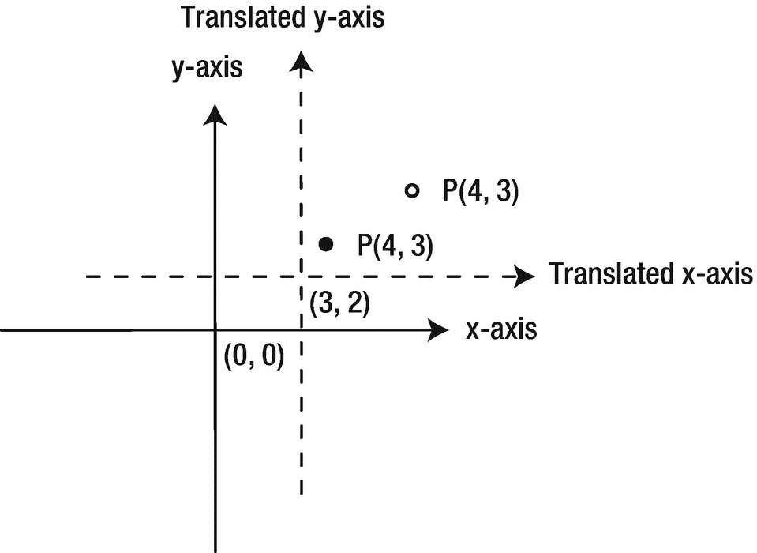
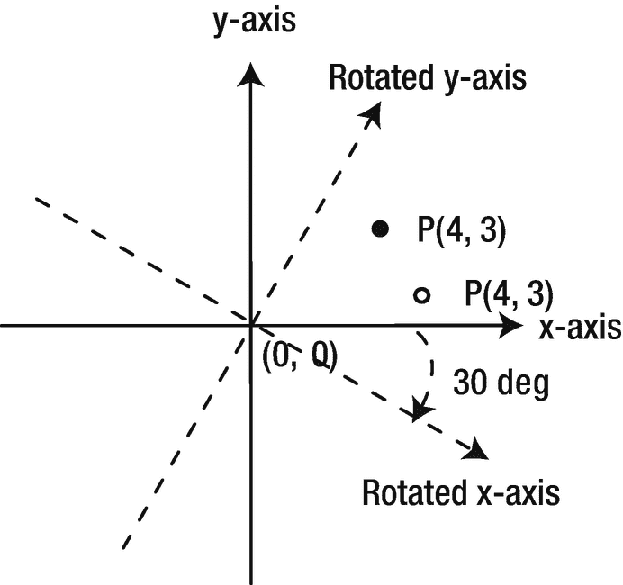
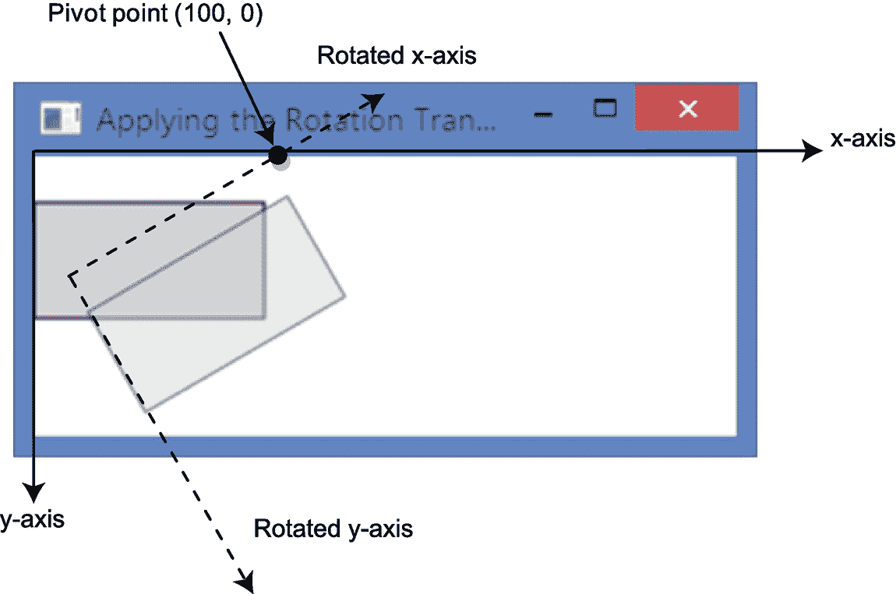
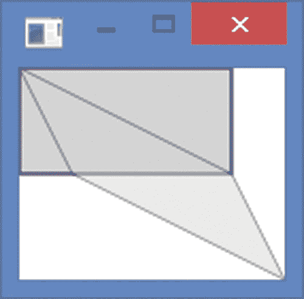
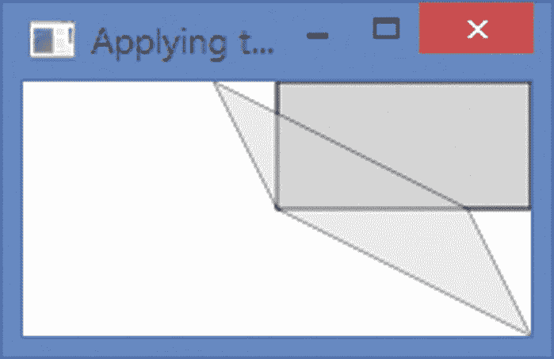

# 十八、理解变换

在本章中，您将学习:

*   什么是转变

*   什么是平移、旋转、缩放和剪切变换，以及如何将它们应用于节点

*   如何对一个节点应用多个变换

本章的例子在`com.jdojo.transform`包中。为了让它们正常工作，您必须在`module-info.java`文件中添加相应的一行:

```java
...
opens com.jdojo.transform to javafx.graphics, javafx.base;
...

```

## 什么是转型？

变换是坐标空间中的点到同一坐标空间中的点的映射，保留一组几何属性。几种类型的变换可以应用于坐标空间中的点。JavaFX 支持以下类型的变换:

*   翻译

*   循环

*   大剪刀

*   规模

*   姻亲

抽象`Transform`类的一个实例表示 JavaFX 中的一个变换。`Transform`类包含节点上所有类型变换使用的公共方法和属性。它包含创建特定类型变换的工厂方法。图 18-1 显示了代表不同类型变换的类的类图。该类的名称与该类提供的变换类型相匹配。所有的课程都在`javafx.scene.transform`包里。


图 18-1

与变换相关的类的类图

仿射变换是一种广义变换，它保留了点的数量和唯一性、直线的直线性以及点在平面中表现出的特性。平行线(和平面)在变换后保持平行。它可能不会保留线之间的角度或点之间的距离。但是，直线上各点之间的距离比保持不变。平移、缩放、相似变换、相似变换、反射、旋转、剪切等等都是仿射变换的例子。

`Affine`类的一个实例代表一个仿射变换。这个类对于初学者来说不容易使用。它的使用需要先进的数学知识，如矩阵。如果您需要特定类型的变换，请使用特定的子类，如`Translate`、`Shear`等等，而不要使用通用的`Affine`类。您也可以组合多个单独的变换来创建一个更复杂的变换。我们不会在本书中讨论这个类。

使用变换很容易。然而，有时它可能看起来令人困惑，因为有多种方法来创建和应用它们。

创建`Transform`实例有两种方法:

*   使用`Transform`类的工厂方法之一——例如，创建`Translate`对象的`translate()`方法，创建`Rotate`对象的`rotate()`方法，等等。

*   使用特定的类来创建特定类型的变换，例如，`Translate`类用于平移，`Rotate`类用于旋转，等等。

以下两个`Translate`对象代表相同的翻译:

```java
double tx = 20.0;
double ty = 10.0;

// Using the factory method in the Transform class
Translate translate1 = Transform.translate(tx, ty);

// Using the Translate class constructor
Translate translate2 = new Translate(tx, ty);

```

有两种方法可以将变换应用到节点:

*   使用`Node`类中的特定属性。例如，使用`Node`类的`translateX`、`translateY`和`translateZ`属性将翻译应用于节点。请注意，不能以这种方式应用剪切变换。

*   使用节点的`transforms`序列。`Node`类的`getTransforms()`方法返回一个`ObservableList<Transform>`。用所有的`Transform`对象填充这个列表。`Transforms`将按顺序应用。只能使用这种方法应用剪切变换。

应用`Transforms`的两种方法工作起来有些不同。当我们讨论变换的具体类型时，我们将讨论这些差异。有时，可以使用上述两种方法来应用变换，在这种情况下，`transforms`序列中的变换在节点属性的变换集之前应用。

以下代码片段对矩形应用了三种变换:剪切、缩放和平移:

```java
Rectangle rect = new Rectangle(100, 50, Color.LIGHTGRAY);
// Apply transforms using the transforms sequence of the Rectangle
Transform shear = Transform.shear(2.0, 1.2);
Transform scale = Transform.scale(1.1, 1.2);
rect.getTransforms().addAll(shear, scale);
// Apply a translation using the translatex and translateY
// properties of the Node class
rect.setTranslateX(10);
rect.setTranslateY(10);

```

使用`transforms`序列应用剪切和缩放。使用`Node`类的`translateX`和`translateY`属性来应用翻译。在`transforms`序列中的变换，剪切和缩放，在平移之后依次应用。

## 翻译变换

平移会将节点的每个点相对于其父坐标系沿指定方向移动固定距离。这是通过将节点的局部坐标系的原点移动到新的位置来实现的。计算点的新位置很容易——只需在 3D 空间中每个点的坐标上添加一组数字。在 2D 空间中，给每个点的坐标加上一对数字。

假设您想通过(tx，ty，tz)将平移应用于 3D 坐标空间。如果一个点在平移之前具有坐标(x，y，z ),那么平移之后它的坐标将是(x + tx，y + ty，z + tz)。

图 18-2 显示了一个平移变换的例子。变换前的轴用实线表示。变换后的轴用虚线表示。注意，点 P 的坐标在变换后的坐标空间中保持不变(4，3)。但是，该点相对于原始坐标空间的坐标在变换后会发生变化。原始坐标空间中的点以纯黑色填充颜色显示，而在变换后的坐标空间中，该点没有填充颜色。坐标系的原点(0，0)已移动到(3，2)。点 P(移动的点)在原始坐标空间中的坐标变为(7，5)，其计算为(4+3，3+2)。



图 18-2

翻译变换的示例

`Translate`类的一个实例代表一个翻译。它包含三个属性:

*   `x`

*   `y`

*   `z`

这些属性指定变换后节点的本地坐标系的新原点的 x、y 和 z 坐标。这些属性的默认值为 0.0。

`Translate`类提供了三个构造器:

*   `Translate()`

*   `Translate(double x, double y)`

*   `Translate(double x, double y, double z)`

无参数构造器用默认的`x`、`y`和`z`属性值创建一个`Translate`对象，这实际上表示没有翻译。另外两个构造器允许您指定沿三个轴的平移距离。对`Group`的变换被应用于`Group`中的所有节点。

比较`Node`类的`layoutX`和`layoutY`属性与`translateX`和`translateY`属性的使用。`layoutX`和`layoutY`属性在其局部坐标系中定位节点，而不变换局部坐标系，而`translateX`和`translateY`属性通过移动原点来变换节点的局部坐标系。通常，`layoutX`和`layoutY`用于在场景中放置节点，而平移用于在动画中移动节点。如果您为一个节点设置了这两个属性，它的局部坐标系将使用平移进行变换，然后，该节点将使用其`layoutX`和`layoutY`属性放置在新的坐标系中。

清单 18-1 中的程序创建了三个矩形。默认情况下，它们被放置在(0，0)处。它对第二个和第三个矩形应用平移。图 18-3 显示了平移后的矩形。


图 18-3

带平移的矩形

```java
// TranslateTest.java
package com.jdojo.transform;

import javafx.application.Application;
import javafx.scene.Scene;
import javafx.scene.layout.Pane;
import javafx.scene.paint.Color;
import javafx.scene.shape.Rectangle;
import javafx.scene.transform.Translate;
import javafx.stage.Stage;

public class TranslateTest extends Application {
        public static void main(String[] args) {
                Application.launch(args);
        }

        @Override
        public void start(Stage stage) {
                Rectangle rect1 =
                         new Rectangle(100, 50, Color.LIGHTGRAY);
                rect1.setStroke(Color.BLACK);

                Rectangle rect2 = new Rectangle(100, 50, Color.YELLOW);
                rect2.setStroke(Color.BLACK);

                Rectangle rect3 =
                         new Rectangle(100, 50, Color.STEELBLUE);
                rect3.setStroke(Color.BLACK);

                // Apply a translation on rect2 using the transforms
                     // sequence
                Translate translate1 = new Translate(50, 10);
                rect2.getTransforms().addAll(translate1);

                // Apply a translation on rect3 using the translateX
                // and translateY properties
                rect3.setTranslateX(180);
                rect3.setTranslateY(20);

                Pane root = new Pane(rect1, rect2, rect3);
                root.setPrefSize(300, 80);
                Scene scene = new Scene(root);
                stage.setScene(scene);
                stage.setTitle(
                         "Applying the Translation Transformation");
                stage.show();
        }
}

Listing 18-1Applying Translations to Nodes

```

## 旋转变换

在旋转变换中，轴围绕坐标空间中的轴心点旋转，并且点的坐标被映射到新的轴。图 18-4 显示了旋转 30 度角的 2D 平面中的坐标系轴。旋转轴是 z 轴。原始坐标系的原点用作旋转的轴心点。原始轴用实线表示，旋转后的轴用虚线表示。原始坐标系中的点 P 以黑色填充显示，而在旋转后的坐标系中没有填充。



图 18-4

旋转变换的一个例子

`Rotate`类的一个实例代表一个旋转变换。它包含五个描述旋转的属性:

*   `angle`

*   `axis`

*   `pivotX`

*   `pivotY`

*   `pivotZ`

`angle`属性以度为单位指定旋转的角度。默认值为 0.0 度。顺时针测量`angle`的正值。

`axis`属性指定枢轴点的旋转轴。它的值可以是在`Rotate`类中定义的常量`X_AXIS`、`Y_AXIS`和`Z_AXIS`之一。默认旋转轴为`Rotate.Z_AXIS`。

`pivotX`、`pivotY`和`pivotZ`属性是轴心点的 x、y 和 z 坐标。这些属性的默认值为 0.0。

`Rotate`类包含几个构造器:

*   `Rotate()`

*   `Rotate(double angle)`

*   `Rotate(double angle, double pivotX, double pivotY)`

*   `Rotate(double angle, double pivotX, double pivotY, double pivotZ)`

*   `Rotate(double angle, double pivotX, double pivotY, double pivotZ, Point3D axis)`

*   `Rotate(double angle, Point3D axis)`

无参数构造器创建一个身份旋转，它对变换后的节点没有任何影响。其他构造器允许您指定细节。

清单 18-2 中的程序创建了两个矩形并将它们放在相同的位置。第二个矩形的不透明度设置为 0.5，这样我们就可以看透它了。第二个矩形的坐标系以原点为支点顺时针旋转 30 度。图 18-5 为旋转后的矩形。


图 18-5

使用旋转变换的矩形

```java
// RotateTest.java
package com.jdojo.transform;

import javafx.application.Application;
import javafx.scene.Scene;
import javafx.scene.layout.Pane;
import javafx.scene.paint.Color;
import javafx.scene.shape.Rectangle;
import javafx.scene.transform.Rotate;
import javafx.stage.Stage;

public class RotateTest extends Application {
        public static void main(String[] args) {
                Application.launch(args);
        }

        @Override
        public void start(Stage stage) {
                Rectangle rect1 =
                         new Rectangle(100, 50, Color.LIGHTGRAY);
                rect1.setStroke(Color.BLACK);

                Rectangle rect2 =
                         new Rectangle(100, 50, Color.LIGHTGRAY);
                rect2.setStroke(Color.BLACK);
                rect2.setOpacity(0.5);

                // Apply a rotation on rect2\. The rotation angle is
                     // 30 degree clockwise
                // (0, 0) is the pivot point
                Rotate rotate = new Rotate(30, 0, 0);
                rect2.getTransforms().addAll(rotate);

                Pane root = new Pane(rect1, rect2);
                root.setPrefSize(300, 80);
                Scene scene = new Scene(root);
                stage.setScene(scene);
                stage.setTitle("Applying the Rotation Transformation");
                stage.show();
        }
}

Listing 18-2Using a Rotation Transformation

```

当轴心点是节点的局部坐标系的原点，并且节点的左上角也位于原点时，很容易看到旋转的效果。让我们考虑下面的代码片段，它旋转一个矩形，如图 18-6 所示:



图 18-6

使用枢轴点而不是局部坐标系的原点旋转矩形

```java
Rectangle rect1 = new Rectangle(100, 50, Color.LIGHTGRAY);
rect1.setY(20);
rect1.setStroke(Color.BLACK);
Rectangle rect2 = new Rectangle(100, 50, Color.LIGHTGRAY);
rect2.setY(20);
rect2.setStroke(Color.BLACK);
rect2.setOpacity(0.5);
// Apply a rotation on rect2\. The rotation angle is 30 degree anticlockwise
// (100, 0) is the pivot point.
Rotate rotate = new Rotate(-30, 100, 0);
rect2.getTransforms().addAll(rotate);

```

矩形左上角的坐标被设置为(0，20)。(100，0)处的点用作旋转第二个矩形的枢轴点。轴心点位于矩形的 x 轴上。第二个矩形的坐标系固定在(100，0)，然后逆时针旋转 30 度。请注意，第二个矩形在旋转后的坐标空间中保持其位置(0，20)。

您还可以使用`Node`类的`rotate`和`rotationAxis`属性对节点应用旋转。`rotate`属性以度为单位指定旋转角度。`rotationAxis`属性指定旋转轴。节点的未变换布局边界的中心被用作轴心点。

Tip

在`transforms`序列中使用的默认枢轴点是节点的本地坐标系的原点，而`Node`类的`rotate`属性使用节点的未变换布局边界的中心作为枢轴点。

清单 18-3 中的程序创建了两个类似于清单 18-2 中的矩形。它使用`Node`类的`rotate`属性将矩形旋转 30 度。图 18-7 为旋转后的矩形。比较图 18-5 和 18-7 中旋转后的矩形。前者以局部坐标系的原点为支点，后者以矩形的中心为支点。


图 18-7

使用 Node 类的 rotate 属性旋转的矩形

```java
// RotatePropertyTest.java
package com.jdojo.transform;

import javafx.application.Application;
import javafx.scene.Scene;
import javafx.scene.layout.Pane;
import javafx.scene.paint.Color;
import javafx.scene.shape.Rectangle;
import javafx.stage.Stage;

public class RotatePropertyTest extends Application {
        public static void main(String[] args) {
               Application.launch(args);
        }

        @Override
        public void start(Stage stage) {
               Rectangle rect1 = new Rectangle(100, 50, Color.LIGHTGRAY);
               rect1.setStroke(Color.BLACK);

               Rectangle rect2 = new Rectangle(100, 50, Color.LIGHTGRAY);
               rect2.setStroke(Color.BLACK);
               rect2.setOpacity(0.5);

               // Use the rotate property of the node class
               rect2.setRotate(30);

               Pane root = new Pane(rect1, rect2);
               root.setPrefSize(300, 80);
               Scene scene = new Scene(root);
               stage.setScene(scene);
               stage.setTitle("Applying the Rotation Transformation");
               stage.show();
        }
}

Listing 18-3Using the rotate Property of the Node Class to Rotate a Rectangle

```

## 规模变换

缩放变换通过缩放因子沿坐标系的轴缩放测量单位。这将导致节点的尺寸沿轴按指定的比例因子变化(拉伸或收缩)。沿轴的尺寸乘以沿该轴的比例因子。变换应用于变换后坐标保持不变的轴心点。

`Scale`类的一个实例代表一个比例变换。它包含以下六个描述变换的属性:

*   `x`

*   `y`

*   `z`

*   `pivotX`

*   `pivotY`

*   `pivotZ`

`x`、`y`和`z`属性指定沿 x 轴、y 轴和 z 轴的比例因子。默认情况下，它们是 1.0。

`pivotX`、`pivotY`和`pivotZ`属性是轴心点的 x、y 和 z 坐标。这些属性的默认值为 0.0。

`Scale`类包含几个构造器:

*   `Scale()`

*   `Scale(double x, double y)`

*   `Scale(double x, double y, double z)`

*   `Scale(double x, double y, double pivotX, double pivotY)`

*   `Scale(double x, double y, double z, double pivotX, double pivotY, double pivotZ)`

无参数构造器创建一个标识比例变换，它对变换后的节点没有任何影响。其他构造器允许您指定比例因子和轴心点。

您可以使用`Scale`类的对象或`Node`类的`scaleX`、`scaleY`和`scaleZ`属性来应用缩放变换。默认情况下，`Scale`类使用的枢轴点位于(0，0，0)。`Node`类的属性使用节点的中心作为轴心点。

清单 18-4 中的程序创建了两个矩形。两者被放置在相同的位置。其中一个是缩放的，另一个不是。未缩放矩形的不透明度设置为 0.5，所以我们可以透过它看。图 18-8 显示了矩形。缩放后的矩形更小。第二个矩形的坐标系沿 x 轴缩放 0.5，沿 y 轴缩放 0.50。`scaleX`和`scaleY`属性用于应用变换，该变换使用矩形的中心作为枢轴点，使矩形收缩，但保持在同一位置。


图 18-8

使用缩放变换的两个矩形

```java
// ScaleTest.java
package com.jdojo.transform;

import javafx.application.Application;

import javafx.scene.Scene;
import javafx.scene.layout.Pane;
import javafx.scene.paint.Color;
import javafx.scene.shape.Rectangle;
import javafx.stage.Stage;

public class ScaleTest extends Application {
        public static void main(String[] args) {
                Application.launch(args);
        }

        @Override
        public void start(Stage stage) {
                Rectangle rect1 =
                         new Rectangle(100, 50, Color.LIGHTGRAY);
                rect1.setStroke(Color.BLACK);
                rect1.setOpacity(0.5);

                Rectangle rect2 =
                         new Rectangle(100, 50, Color.LIGHTGRAY);
                rect2.setStroke(Color.BLACK);

                // Apply a scale on rect2\. Center of the Rectangle is
                     // the pivot point.
                rect2.setScaleX(0.5);
                rect2.setScaleY(0.5);

                Pane root = new Pane(rect1, rect2);
                root.setPrefSize(150, 60);
                Scene scene = new Scene(root);
                stage.setScene(scene);
                stage.setTitle("Applying the Scale Transformation");
                stage.show();
        }
}

Listing 18-4Using Scale Transformations

```

如果轴心点不是节点的中心，缩放变换可能会移动节点。清单 18-5 中的程序创建了两个矩形。两者被放置在相同的位置。其中一个是缩放的，另一个不是。未缩放矩形的不透明度设置为 0.5，所以我们可以透过它看。图 18-9 显示了矩形。缩放后的矩形更小。带有`transforms`序列的`Scale`对象用于应用变换，它使用矩形的左上角作为枢轴点，使矩形收缩，但将其向左移动，以保持其左上角的坐标在变换后的坐标系中相同(150，0)。缩放后的矩形在两个方向上缩小一半(缩放因子= 0.50)，并向左移动一半的距离。


图 18-9

使用缩放变换的两个矩形

```java
// ScalePivotPointTest.java
package com.jdojo.transform;
import javafx.application.Application;
import javafx.scene.Scene;
import javafx.scene.layout.Pane;
import javafx.scene.paint.Color;
import javafx.scene.shape.Rectangle;

import javafx.scene.transform.Scale;
import javafx.stage.Stage;

public class ScalePivotPointTest extends Application {
        public static void main(String[] args) {
                Application.launch(args);
        }

        @Override
        public void start(Stage stage) {
                Rectangle rect1 =
                         new Rectangle(100, 50, Color.LIGHTGRAY);
                rect1.setX(150);
                rect1.setStroke(Color.BLACK);
                rect1.setOpacity(0.5);

                Rectangle rect2 =
                         new Rectangle(100, 50, Color.LIGHTGRAY);
                rect2.setX(150);
                rect2.setStroke(Color.BLACK);

                // Apply a scale on rect2\. The origin of the local
                     // coordinate system of rect4 is the pivot point
                Scale scale = new Scale(0.5, 0.5);
                rect2.getTransforms().addAll(scale);

                Pane root = new Pane(rect1, rect2);
                root.setPrefSize(300, 60);
                Scene scene = new Scene(root);
                stage.setScene(scene);
                stage.setTitle("Applying the Scale Transformation");
                stage.show();
        }
}

Listing 18-5Using Scale Transformations

```

## 剪切变换

剪切变换会围绕枢轴点旋转节点的局部坐标系的轴，因此这些轴不再垂直。变换后，矩形节点变成了平行四边形。

`Shear`类的一个实例表示一个剪切变换。它包含四个描述变换的属性:

*   `x`

*   `y`

*   `pivotX`

*   `pivotY`

`x`属性指定了一个乘数，通过该乘数，点的坐标沿着正 x 轴移动该点的 y 坐标的一个因子。默认值为 0.0。

`y`属性指定一个乘数，通过该乘数，点的坐标沿着正 y 轴移动该点的 x 坐标的一个因子。默认值为 0.0。

`pivotX`和`pivotY`属性是发生剪切的枢轴点的 x 和 y 坐标。它们的默认值为 0.0。支点不会因剪切而移动。默认情况下，轴心点是未变换坐标系的原点。

假设在一个节点内有一个点(x1，y1)，通过剪切变换，该点移动到(x2，y2)。您可以使用以下公式来计算(x2，y2):

```java
x2 = pivotX + (x1 - pivotX) + x * (y1 - pivotY)
y2 = pivotY + (y1 - pivotY) + y * (x1 - pivotX)

```

前面公式中的所有坐标(x1、y1、x2 和 y2)都在节点的未变换局部坐标系中。注意，如果(x1，y1)是枢轴点，则上述公式计算移动的点(x2，y2)，这与(x1，y1)相同。也就是说，轴心点没有移动。

`Shear`类包含几个构造器:

*   `Shear()`

*   `Shear(double x, double y)`

*   `Shear(double x, double y, double pivotX, double pivotY)`

无参数构造器创建一个恒等式剪切变换，它对变换后的节点没有任何影响。其他构造器允许您指定剪切乘数和轴心点。

Tip

您可以仅使用`transforms`序列中的`Shear`对象对节点应用剪切变换。与其他类型的变换不同，`Node`类不包含允许你应用剪切变换的属性。

清单 18-6 中的程序将一个`Shear`应用于一个矩形，如图 18-10 所示。还显示了原始矩形。沿两个轴使用乘数 0.5。请注意，轴心点是(0，0)，这是默认值。



图 18-10

使用(0，0)作为轴心点进行剪切变换的矩形

```java
// ShearTest.java
package com.jdojo.transform;

import javafx.application.Application;
import javafx.scene.Group;
import javafx.scene.Scene;
import javafx.scene.paint.Color;
import javafx.scene.shape.Rectangle;
import javafx.scene.transform.Shear;
import javafx.stage.Stage;

public class ShearTest extends Application {
        public static void main(String[] args) {
                Application.launch(args);
        }

        @Override
        public void start(Stage stage) {
                Rectangle rect1 =
                         new Rectangle(100, 50, Color.LIGHTGRAY);
                rect1.setStroke(Color.BLACK);

                Rectangle rect2 =
                         new Rectangle(100, 50, Color.LIGHTGRAY);
                rect2.setStroke(Color.BLACK);
                rect2.setOpacity(0.5);

                // Apply a shear on rect2\. The x and y multipliers are
                     // 0.5 and (0, 0) is the pivot point.
                Shear shear = new Shear(0.5, 0.5);
                rect2.getTransforms().addAll(shear);

                Group root = new Group(rect1, rect2);
                Scene scene = new Scene(root);
                stage.setScene(scene);
                stage.setTitle("Applying the Shear Transformation");
                stage.show();
        }
}

Listing 18-6Using the Shear Transformation

```

让我们使用(0，0)以外的枢轴点进行`Shear`变换。考虑以下代码片段:

```java
Rectangle rect1 = new Rectangle(100, 50, Color.LIGHTGRAY);
rect1.setX(100);
rect1.setStroke(Color.BLACK);
Rectangle rect2 = new Rectangle(100, 50, Color.LIGHTGRAY);
rect2.setX(100);
rect2.setStroke(Color.BLACK);
rect2.setOpacity(0.5);

// Apply a shear on rect2\. The x and y multipliers are 0.5 and
// (100, 50) is the pivot point.
Shear shear = new Shear(0.5, 0.5, 100, 50);
rect2.getTransforms().addAll(shear);

```

代码类似于清单 18-6 中所示的代码。矩形的左上角放置在(100，0)处，因此我们可以完全看到剪切的矩形。我们使用矩形左下角的(100，50)作为枢轴点。图 18-11 显示了变换后的矩形。请注意，变换没有移动轴心点。



图 18-11

使用(100，50)作为轴心点进行剪切变换的矩形

让我们应用我们的公式来验证右上角的坐标，它最初相对于矩形的未变换坐标系位于(200，0):

```java
x1 = 200
y1 = 0
pivotX = 100
pivotY = 50
x = 0.5
y = 0.5

x2 = pivotX + (x1 - pivotX) + x * (y1 - pivotY)
   = 100 + (200 - 100) + 0.5 * (0 - 50)
   = 175

y2 = pivotY + (y1 - pivotY) + y * (x1 - pivotX)
   = 50 + (0 -50) + 0.5 * (200 - 100)
   = 50

```

因此，(175，50)是矩形的未变换坐标系中右上角的移动位置。

## 应用多重变换

您可以对一个节点应用多个变换。如前所述，`transforms`序列中的变换是在节点属性的变换集之前应用的。当使用`Node`类的属性时，将依次应用平移、旋转和缩放。当使用`transforms`序列时，变换按照它们在序列中的存储顺序被应用。

清单 18-7 中的程序创建了三个矩形并将它们放置在相同的位置。它以不同的顺序对第二个和第三个矩形应用多个变换。图 18-12 显示了结果。第一个矩形显示在其原始位置，因为我们没有对它应用任何变换。请注意，两个矩形在不同的位置结束。如果如下所示更改第三个矩形的变换顺序，两个矩形将重叠:


图 18-12

具有多重变换的矩形

```java
// MultipleTransformations.java
package com.jdojo.transform;

import javafx.application.Application;
import javafx.scene.Group;
import javafx.scene.Scene;
import javafx.scene.layout.Pane;
import javafx.scene.paint.Color;
import javafx.scene.shape.Rectangle;
import javafx.scene.transform.Rotate;
import javafx.scene.transform.Scale;
import javafx.scene.transform.Translate;
import javafx.stage.Stage;

public class MultipleTransformations extends Application {
        public static void main(String[] args) {
                Application.launch(args);
        }

        @Override
        public void start(Stage stage) {
                Rectangle rect1 =
                         new Rectangle(100, 50, Color.LIGHTGRAY);
                rect1.setStroke(Color.BLACK);

                Rectangle rect2 =
                         new Rectangle(100, 50, Color.LIGHTGRAY);
                rect2.setStroke(Color.BLACK);
                rect2.setOpacity(0.5);

                Rectangle rect3 =
                         new Rectangle(100, 50, Color.LIGHTCYAN);
                rect3.setStroke(Color.BLACK);
                rect3.setOpacity(0.5);

                // apply transformations to rect2
                rect2.setTranslateX(100);
                rect2.setTranslateY(0);
                rect2.setRotate(30);
                rect2.setScaleX(1.2);
                rect2.setScaleY(1.2);

                // Apply the same transformation as on rect2, but in a
                     // different order
                rect3.getTransforms().addAll(
                         new Scale(1.2, 1.2, 50, 25),
                   new Rotate(30, 50, 25),
                   new Translate(100, 0));

                Group root = new Group(rect1, rect2, rect3);
                Scene scene = new Scene(root);
                stage.setScene(scene);
                stage.setTitle("Applying Multiple Transformations");
                stage.show();
        }
}

Listing 18-7Using Multiple Transformations on a Node

```

```java
rect3.getTransforms().addAll(
    new Translate(100, 0),
   new Rotate(30, 50, 25),
   new Scale(1.2, 1.2, 50, 25));

```

## 摘要

变换是坐标空间中的点到同一坐标空间中的点的映射，保留一组几何属性。几种类型的变换可以应用于坐标空间中的点。JavaFX 支持以下类型的变换:平移、旋转、剪切、缩放和仿射。

抽象`Transform`类的一个实例表示 JavaFX 中的一个变换。`Transform`类包含节点上所有类型变换使用的公共方法和属性。它包含创建特定类型变换的工厂方法。所有的变换类都在`javafx.scene.transform`包中。

仿射变换是一种广义变换，它保留了点的数量和唯一性、直线的直线性以及点在平面上表现出的特性。平行线(和平面)在变换后保持平行。仿射变换可能不会保留线之间的角度和点之间的距离。但是，直线上各点之间的距离比保持不变。平移、缩放、相似变换、相似变换、反射、旋转和剪切都是仿射变换的例子。`Affine`类的一个实例代表一个仿射变换。

有两种方法可以将变换应用到节点:使用`Node`类中的特定属性和使用节点的`transforms`序列。

平移会将节点的每个点相对于其父坐标系沿指定方向移动固定距离。这是通过将节点的局部坐标系的原点移动到新的位置来实现的。`Translate`类的一个实例代表一个翻译。

在旋转变换中，轴围绕坐标空间中的轴心点旋转，并且点的坐标被映射到新的轴。`Rotate`类的一个实例代表一个旋转变换。

缩放变换通过缩放因子沿坐标系的轴缩放测量单位。这将导致节点的尺寸沿轴按指定的比例因子变化(拉伸或收缩)。沿轴的尺寸乘以沿该轴的比例因子。变换应用于变换后坐标保持不变的轴心点。`Scale`类的一个实例代表一个比例变换。

剪切变换会围绕枢轴点旋转节点的局部坐标系的轴，因此这些轴不再垂直。变换后，矩形节点变成了平行四边形。`Shear`类的一个实例表示一个剪切变换。

您可以对一个节点应用多个变换。`transforms`序列中的变换在节点属性上的变换集之前应用。当使用`Node`类的属性时，将依次应用平移、旋转和缩放。当使用`transforms`序列时，变换按照它们在序列中的存储顺序被应用。

下一章将讨论如何将动画应用到节点上。