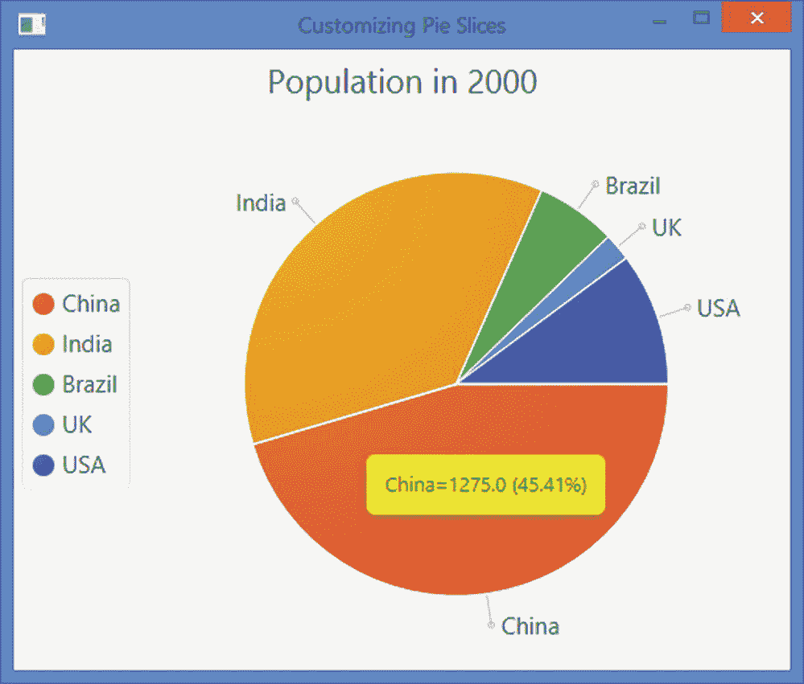
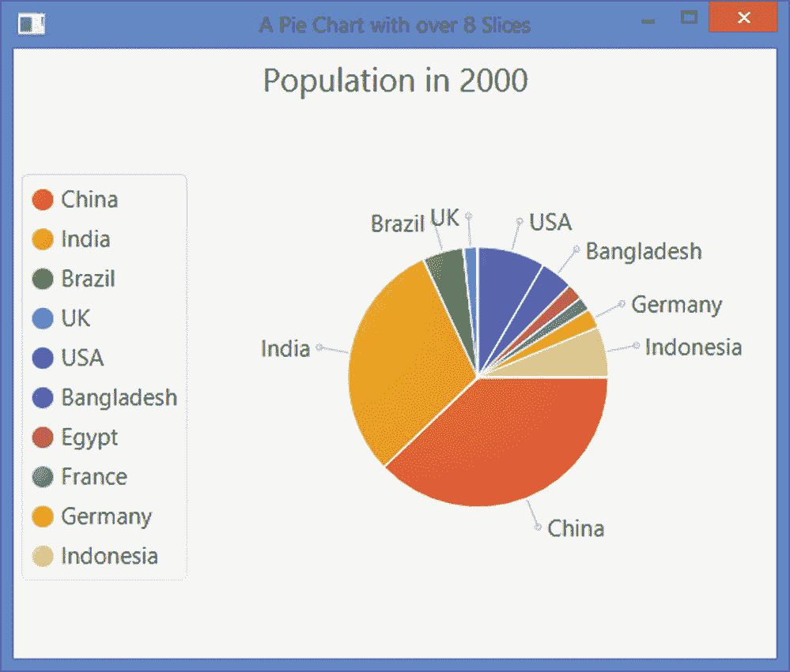
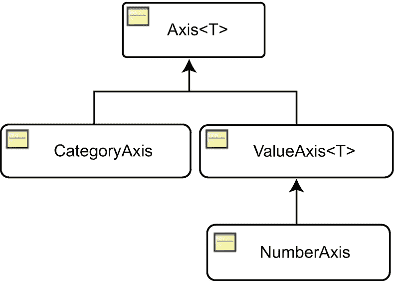
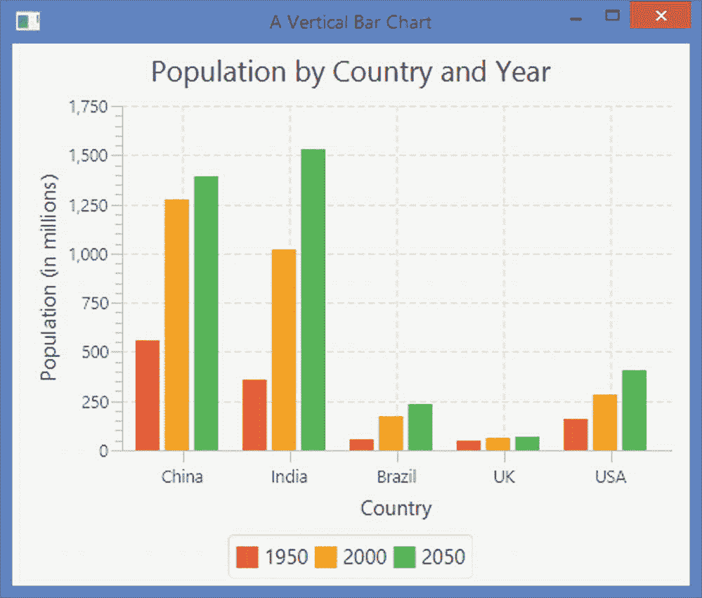
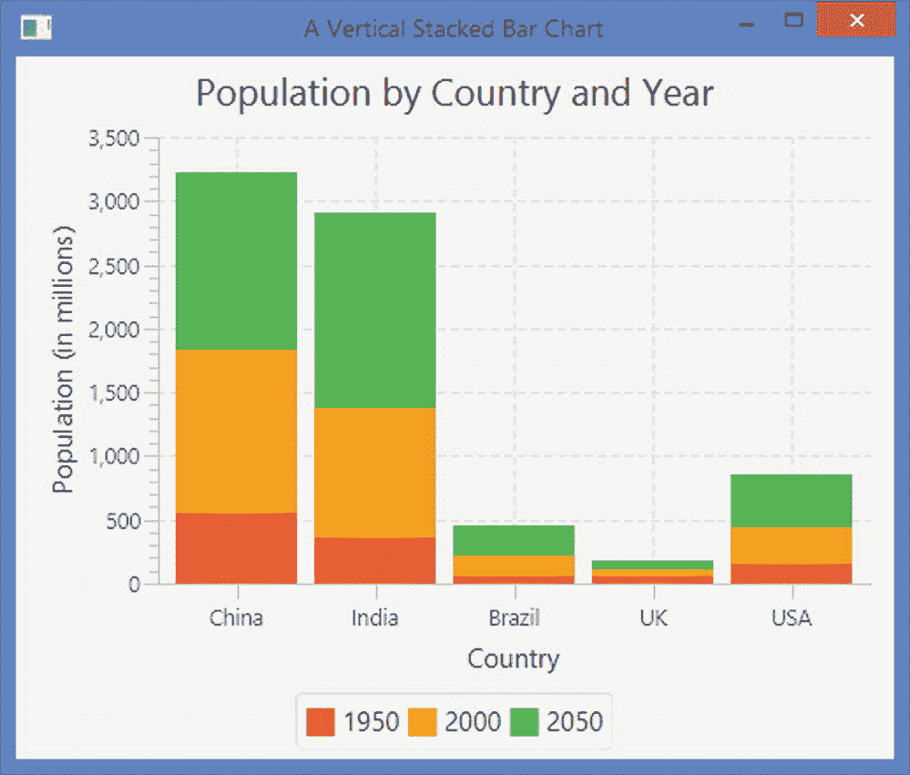
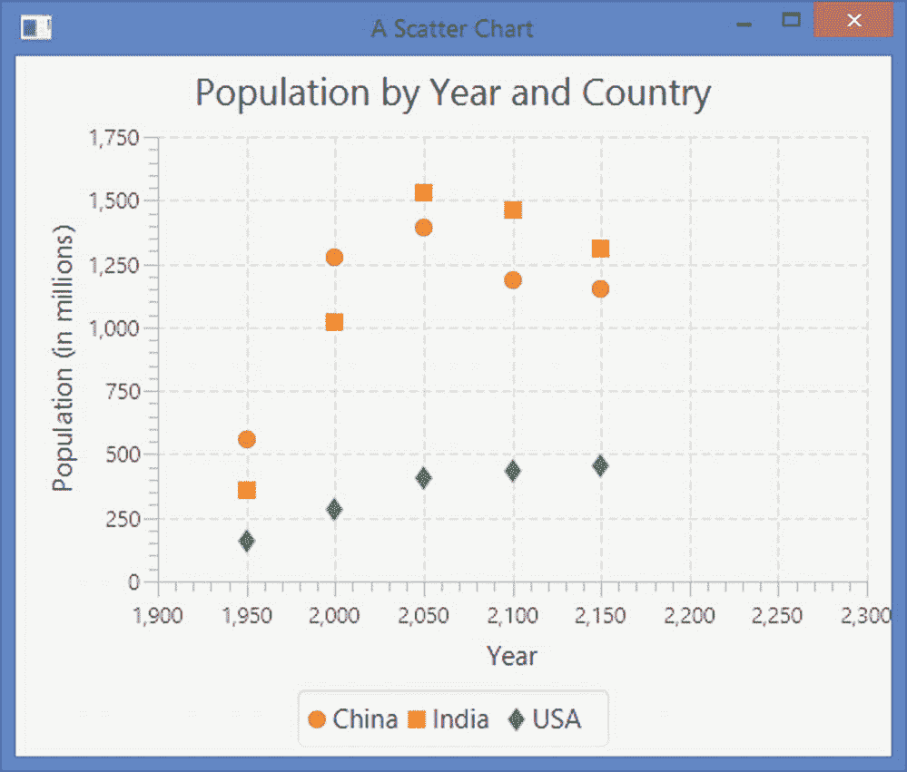
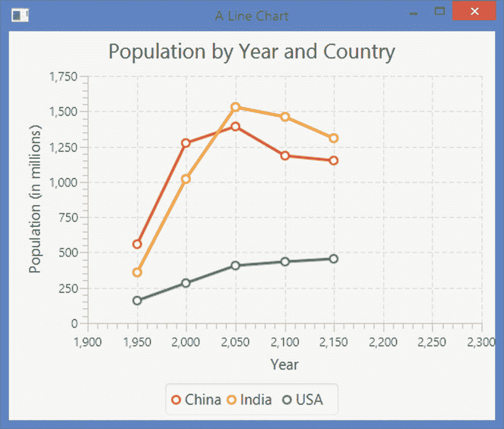
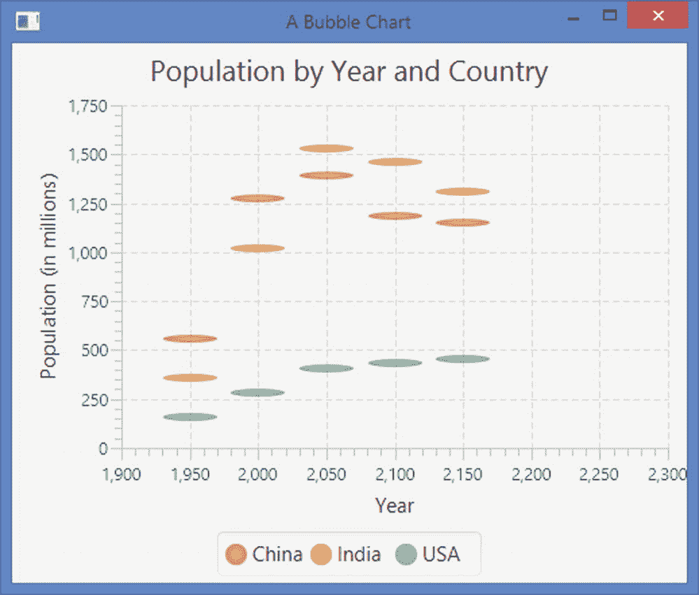
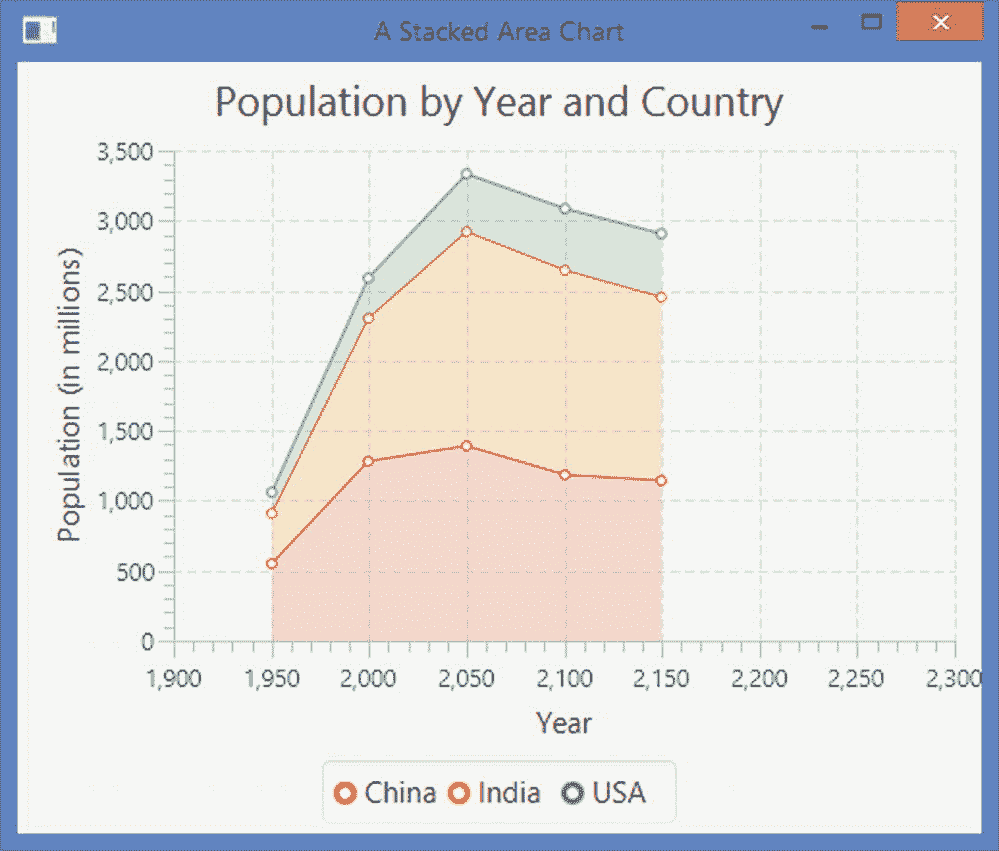
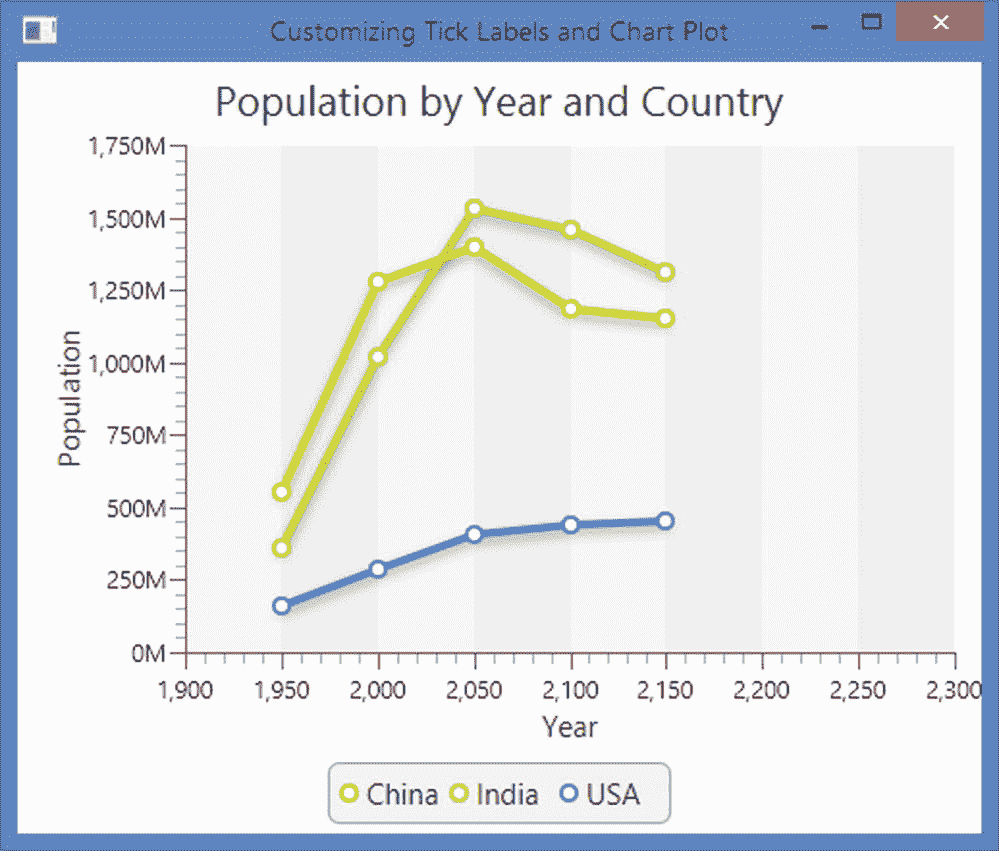

# 二十、理解图表

在本章中，您将学习:

*   什么是图表

*   JavaFX 中的图表 API 是什么

*   如何使用图表 API 创建不同类型的图表

*   如何用 CSS 设计图表样式

本章的例子在`com.jdojo.chart`包中。为了让它们工作，您必须在`module-info.java`文件中添加相应的一行:

```java
...
opens com.jdojo.chart to javafx.graphics, javafx.base;
...

```

## 什么是图表？

图表是数据的图形表示。图表为可视化分析大量数据提供了一种更简单的方法。通常，它们用于监控和报告目的。存在不同类型的图表。它们表示数据的方式不同。并非所有类型的图表都适合分析所有类型的数据。例如，折线图适合于了解数据的比较趋势，而条形图适合于比较不同类别的数据。

JavaFX 支持图表，通过编写几行代码就可以将图表集成到 Java 应用程序中。它包含一个全面的、可扩展的图表 API，为几种类型的图表提供内置支持。

## 了解图表 API

图表 API 由`javafx.scene.chart`包中许多预定义的类组成。图 20-1 显示了代表不同类型图表的类的类图。


图 20-1

JavaFX 中表示图表的类的类图

抽象`Chart`是所有图表的基类。它继承了`Node`类。图表可以添加到场景图中。它们也可以像其他节点一样使用 CSS 样式。我将在讨论特定图表类型的章节中讨论图表样式。`Chart`类包含所有类型图表通用的属性和方法。

JavaFX 将图表分为两类:

*   没有轴的图表

*   具有 x 轴和 y 轴的图表

`PieChart`类属于第一类。它没有轴，是用来画饼图的。

`XYChart`类属于第二类。它是所有有两个轴的图表的抽象基类。它的子类，例如，`LineChart`，`BarChart`等。，表示特定类型的图表。

JavaFX 中的每个图表都有三个部分:

*   一个标题

*   传奇

*   内容(或数据)

不同类型的图表对数据的定义不同。`Chart`类包含以下所有类型图表共有的属性:

*   `title`

*   `titleSide`

*   `legend`

*   `legendSide`

*   `legendVisible`

*   `animated`

属性指定了图表的标题。属性指定了标题的位置。默认情况下，标题位于图表内容的上方。它的值是`Side`枚举的常量之一:`TOP`(默认)、`RIGHT`、`BOTTOM`和`LEFT`。

通常，图表使用不同类型的符号来表示不同类别的数据。图例列出了符号及其说明。`legend`属性是一个`Node`，它指定了图表的图例。默认情况下，图例位于图表内容的下方。`legendSide`属性指定了图例的位置，它是`Side`枚举的常量之一:`TOP`、`RIGHT`、`BOTTOM`(默认)和`LEFT`。`legendVisible`属性指定图例是否可见。默认情况下，它是可见的。

`animated`属性指定图表内容的变化是否以某种类型的动画显示。默认情况下，这是真的。

## 用 CSS 设计图表样式

您可以设置所有类型图表的样式。`Chart`类定义了所有类型图表共有的属性。图表的默认 CSS 样式类名是*图表*。您可以为 CSS 中的所有图表指定`legendSide`、`legendVisible`和`titleSide`属性，如下所示:

```java
.chart {
        -fx-legend-side: top;
        -fx-legend-visible: true;
        -fx-title-side: bottom;
}

```

每个图表定义两个子结构:

*   `chart-title`

*   `chart-content`

`chart-title`是一个`Label`，`chart-content`是一个`Pane`。以下样式将所有图表的背景色设置为黄色，标题字体设置为 Arial 16px 粗体:

```java
.chart-content {
        -fx-background-color: yellow;
}

.chart-title {
        -fx-font-family: "Arial";
        -fx-font-size: 16px;
        -fx-font-weight: bold;
}

```

图例的默认样式类名称是*图表图例*。以下样式将图例背景色设置为浅灰色:

```java
.chart-legend {
        -fx-background-color: lightgray;
}

```

每个图例都有两个子结构:

*   `chart-legend-item`

*   `chart-legend-item-symbol`

`chart-legend-item`是一个`Label`，它代表图例中的文本。`chart-legend-item-symbol`是一个`Node`，代表标签旁边的符号，默认为圆形。以下样式将图例中标签的字体大小设置为 10px，并将图例符号设置为箭头:

```java
.chart-legend-item {
        -fx-font-size: 16px;
}

.chart-legend-item-symbol {
        -fx-shape: "M0 -3.5 v7 l 4 -3.5z";
}

```

Note

本章中的许多例子使用外部资源，如 CSS 文件。您需要确保`ResourceUtil`类指向`resources`目录(随书提供的源代码包的一部分)。从 [`www.apress.com/source-code`](http://www.apress.com/source-code) 下载源码。

## 图表示例中使用的数据

我将很快讨论不同类型的图表。图表将使用表 20-1 中的数据，其中有世界上一些国家的实际和估计人口。数据摘自联合国在 [`www.un.org`](http://www.un.org) 发表的报告。人口数值已经四舍五入。

表 20-1

世界上一些国家目前和估计的人口(百万)

<colgroup><col class="tcol1 align-left"> <col class="tcol2 align-left"> <col class="tcol3 align-left"> <col class="tcol4 align-left"> <col class="tcol5 align-left"> <col class="tcol6 align-left"> <col class="tcol7 align-left"> <col class="tcol8 align-left"> <col class="tcol9 align-left"></colgroup> 
|   | 

One thousand nine hundred and fifty

 | 

Two thousand

 | 

Two thousand and fifty

 | 

Two thousand one hundred

 | 

Two thousand one hundred and fifty

 | 

Two thousand two hundred

 | 

Two thousand two hundred and fifty

 | 

Two thousand three hundred

 |
| --- | --- | --- | --- | --- | --- | --- | --- | --- |
| **中国** | Five hundred and fifty-five | One thousand two hundred and seventy-five | One thousand three hundred and ninety-five | One thousand one hundred and eighty-two | One thousand one hundred and forty-nine | One thousand two hundred and one | One thousand two hundred and forty-seven | One thousand two hundred and eighty-five |
| **印度** | Three hundred and fifty-eight | One thousand and seventeen | One thousand five hundred and thirty-one | One thousand four hundred and fifty-eight | One thousand three hundred and eight | One thousand three hundred and four | One thousand three hundred and forty-two | One thousand three hundred and seventy-two |
| **巴西** | Fifty-four | One hundred and seventy-two | Two hundred and thirty-three | Two hundred and twelve | Two hundred and two | Two hundred and eight | Two hundred and sixteen | Two hundred and twenty-three |
| **英国** | Fifty | Fifty-nine | Sixty-six | Sixty-four | Sixty-six | sixty-nine | Seventy-one | Seventy-three |
| **美国** | One hundred and fifty-eight | Two hundred and eighty-five | Four hundred and nine | Four hundred and thirty-seven | Four hundred and fifty-three | Four hundred and seventy | Four hundred and eighty-three | Four hundred and ninety-three |

## 了解饼图

饼图由一个圆组成，该圆被分成不同圆心角的扇形。通常，馅饼是圆形的。扇区也被称为*饼图块*或*饼图片*。圆圈中的每个扇形代表某种数量。扇形面积的圆心角与它所代表的量成正比。图 20-2 显示了五个国家在 2000 年的人口饼图。


图 20-2

显示 2000 年五个国家人口的饼图

`PieChart`类的一个实例代表一个饼图。该类包含两个构造器:

*   `PieChart()`

*   `PieChart(ObservableList<PieChart.Data> data)`

无参数构造器创建一个没有内容的饼图。您可以稍后使用其`data`属性添加内容。第二个构造器创建一个以指定数据为内容的饼图。

```java
// Create an empty pie chart
PieChart chart = new PieChart();

```

饼图中的一个扇区被指定为`PieChart.Data`类的一个实例。一个切片有一个名称(或标签)和一个饼图值，分别由`PieChart.Data`类的`name`和`pieValue`属性表示。以下语句为饼图创建一个切片。切片名称为“China”，饼图值为 1275:

```java
PieChart.Data chinaSlice = new PieChart.Data("China", 1275);

```

饼图的内容(所有切片)在`ObservableList<PieChart.Data>`中指定。下面的代码片段创建了一个`ObservableList<PieChart.Data>`,并向其中添加了三个饼图切片:

```java
ObservableList<PieChart.Data> chartData = FXCollections.observableArrayList();
chartData.add(new PieChart.Data("China", 1275));
chartData.add(new PieChart.Data("India", 1017));
chartData.add(new PieChart.Data("Brazil", 172));

```

现在，您可以使用第二个构造器通过指定图表内容来创建饼图:

```java
// Create a pie chart with content
PieChart charts = new PieChart(chartData);

```

您将使用 2050 年不同国家的人口作为我们所有饼图的数据。清单 20-1 包含一个实用程序类。它的`getChartData()`方法返回一个`PieChart.Data`的`ObservableList`作为饼图的数据。您将在本节的示例中使用这个类。

```java
// PieChartUtil.java
package com.jdojo.chart;

import javafx.collections.FXCollections;
import javafx.collections.ObservableList;
import javafx.scene.chart.PieChart;

public class PieChartUtil {
        public static ObservableList<PieChart.Data> getChartData() {
               ObservableList<PieChart.Data> data =
                        FXCollections. observableArrayList();
               data.add(new PieChart.Data("China", 1275));
               data.add(new PieChart.Data("India", 1017));
               data.add(new PieChart.Data("Brazil", 172));
               data.add(new PieChart.Data("UK", 59));
               data.add(new PieChart.Data("USA", 285));
               return data;
        }
}

Listing 20-1A Utility Class to Generate Data for Pie Charts

```

`PieChart`类包含几个属性:

*   `data`

*   `startAngle`

*   `clockwise`

*   `labelsVisible`

*   `labelLineLength`

`data`属性指定了`ObservableList<PieChart.Data>.`中图表的内容

`startAngle`属性指定第一个饼图扇区开始的角度，以度为单位。默认情况下，它是零度，对应于三点钟的位置。逆时针测量为正`startAngle`。例如，90 度的`startAngle`将从 12 点钟位置开始。

`clockwise`属性指定切片是否从`startAngle`开始顺时针放置。默认情况下，这是真的。

`labelsVisible`属性指定切片的标签是否可见。切片的标签显示在切片附近，并放置在切片外部。使用`PieChart.Data`类的 name 属性指定切片的标签。在图 20-2 中，“中国”、“印度”、“巴西”等。是切片的标签。

标签和切片通过直线连接。属性指定了这些线的长度。其默认值为 20.0 像素。

清单 20-2 中的程序使用饼图显示五个国家在 2000 年的人口。该程序创建一个空的饼图并设置其标题。图例位于左侧。之后，它为图表设置数据。数据是在`getChartData()`方法中生成的，该方法返回一个`ObservableList<PieChart.Data>`,其中包含作为饼图扇区标签的国家名称和作为饼图值的人口。程序显示如图 20-2 所示的窗口。

```java
// PieChartTest.java
package com.jdojo.chart;

import javafx.application.Application;
import javafx.collections.ObservableList;
import javafx.geometry.Side;
import javafx.scene.Scene;
import javafx.scene.chart.PieChart;
import javafx.scene.layout.StackPane;
import javafx.stage.Stage;

public class PieChartTest extends Application {
        public static void main(String[] args) {
               Application.launch(args);
        }

        @Override
        public void start(Stage stage) {
               PieChart chart = new PieChart();
               chart.setTitle("Population in 2000");

               // Place the legend on the left side
               chart.setLegendSide(Side.LEFT);

               // Set the data for the chart
               ObservableList<PieChart.Data> chartData =
                        PieChartUtil.getChartData();
               chart.setData(chartData);

               StackPane root = new StackPane(chart);
               Scene scene = new Scene(root);

               stage.setScene(scene);
               stage.setTitle("A Pie Chart");
               stage.show();
        }
}

Listing 20-2Using the PieChart Class to Create a Pie Chart

```

### 自定义饼图扇区

每个饼图切片数据由一个`Node`表示。使用`PieChart.Data`类的`getNode()`方法可以获得对`Node`的引用。将切片添加到饼图时，会创建`Node`。因此，在将切片添加到图表中之后，必须对代表切片的`PieChart.Data`调用`getNode()`方法。否则返回`null`。清单 20-3 中的程序定制了一个饼图的所有饼图扇区，为它们添加了一个工具提示。工具提示显示切片名称、饼图值和百分比饼图值。`addSliceTooltip()`方法包含访问切片`Nodes`和添加工具提示的逻辑。您可以自定义饼图切片来制作动画，让用户使用鼠标将它们从饼图中拖出，等等。见图 20-3 。



图 20-3

显示工具提示及其饼图值和占总饼图百分比的饼图扇区

```java
// PieSliceTest.java
// ...find in the book's download area.

Listing 20-3Adding Tool Tips to Pie Slices

```

### 用 CSS 样式化饼图

除了在`PieChart`类中定义的`data`属性之外，所有属性都可以使用 CSS 进行样式化，如下所示:

```java
.chart {
        -fx-clockwise: false;
        -fx-pie-label-visible: true;
        -fx-label-line-length: 10;
        -fx-start-angle: 90;
}

```

添加到饼图中的每个饼图扇区都添加了四个样式类:

*   `chart-pie`

*   `data<i>`

*   `default-color<j>`

*   `negative`

样式类名`data<i>`中的`<i>`是切片索引。第一片有阶级`data0`，第二片`data1`，第三片`data2`等等。

样式类名`default-color<j>`中的`<j>`是该系列的颜色索引。在饼图中，您可以将每个切片视为一个系列。默认 CSS (Modena.css)定义了八种系列颜色。如果您的饼图扇区超过八个扇区，扇区颜色将会重复。当我在下一节讨论双轴图表时，图表中系列的概念会更加明显。

只有当切片的数据为负时，才会添加*负*样式类。

如果您希望将样式应用于所有饼图扇区，请为*图表饼图*样式类名称定义样式。以下样式将为所有饼图切片设置一个带有 2px 背景插入的白色边框。当您设置 2px 插入时，它将在两个切片之间显示更宽的间隙:

```java
.chart-pie {
        -fx-border-color: white;
        -fx-background-insets: 2;
}

```

您可以使用以下样式定义饼图扇区的颜色。它只为五个切片定义颜色。超过第六个的切片将使用默认颜色:

```java
.chart-pie.default-color0 {-fx-pie-color: red;}
.chart-pie.default-color1 {-fx-pie-color: green;}
.chart-pie.default-color2 {-fx-pie-color: blue;}
.chart-pie.default-color3 {-fx-pie-color: yellow;}
.chart-pie.default-color4 {-fx-pie-color: tan;}

```

#### 使用超过八种系列颜色

一个图表中很可能有八个以上的系列(饼图中的切片),并且您不希望这些系列的颜色重复。我们将针对饼图讨论这种技术。但是，它也可以用于双轴图表。

假设您想使用一个显示十个国家人口的饼图。如果您使用此饼图的代码，第九个和第十个扇区的颜色将分别与第一个和第二个扇区的颜色相同。首先，您需要定义第九个和第十个切片的颜色，如清单 20-4 所示。

```java
/* additional_series_colors.css */
.chart-pie.default-color8 {
        -fx-pie-color: gold;
}

.chart-pie.default-color9 {
        -fx-pie-color: khaki;
}

Listing 20-4Additional Series Colors

```

饼图扇区和图例符号将被分配样式类名称，如`default-color0`、`default-color2` … `default-color7`。您需要识别与索引大于 7 的数据项相关联的切片和图例符号的节点，并用新的名称替换它们的`default-color<j>`样式类名称。例如，对于第九个和第十个切片，样式类名称是`default-color0`和`default-color1`，因为颜色系列号被指定为(`dataIndex % 8)`)。你将用`default-color9`和`default-color10`来代替它们。

清单 20-5 中的程序显示了如何改变切片和图例符号的颜色。它向饼图添加十个扇区。`setSeriesColorStyles()`方法替换第九个和第十个切片的切片节点的样式类名称及其相关的图例符号。图 20-4 为饼状图。注意“德国”和“印度尼西亚”的颜色是 CSS 中设置的金色和卡其色。注释`start()`方法中的最后一条语句，它是对`setSeriesColorStyles()`的调用，您会发现“德国”和“印度尼西亚”的颜色与“中国”和“印度”的颜色相同



图 20-4

使用超过八种切片颜色的饼图

```java
// PieChartExtraColor.java
// ...find in the book's download area.

Listing 20-5A Pie Chart Using Color Series Up to Index 10

```

#### 为饼图扇区使用背景图像

您也可以在饼图切片中使用背景图像。以下样式定义了第一个饼图扇区的背景图像:

```java
.chart-pie.data0 {
        -fx-background-image: url("china_flag.jpg");
}

```

清单 20-6 包含一个名为 pie_slice.css 的 CSS 文件的内容。它定义了指定用于饼图扇区的背景图像、图例符号的首选大小以及连接饼图扇区及其标签的线的长度的样式。

```java
// pie_slice.css
/* Set a background image for pie slices */
.chart-pie.data0 {-fx-background-image: url("china_flag.jpg");}
.chart-pie.data1 {-fx-background-image: url("india_flag.jpg");}
.chart-pie.data2 {-fx-background-image: url("brazil_flag.jpg");}
.chart-pie.data3 {-fx-background-image: url("uk_flag.jpg");}
.chart-pie.data4 {-fx-background-image: url("usa_flag.jpg");}

/* Set the preferred size for legend symbols */
.chart-legend-item-symbol {
        -fx-pref-width: 100;
        -fx-pref-height: 30;
}

.chart {
        -fx-label-line-length: 10;
}

Listing 20-6 A CSS for Customizing Pie Slices

```

清单 20-7 中的程序创建了一个饼图。它使用的数据与您在前面的示例中使用的数据相同。不同的是，它设置了一个在 *pie_slice.css* 文件中定义的 CSS:

```java
// Set a CSS for the scene
scene.getStylesheets().addAll("resources/css/pie_slice.css");

```

产生的窗口如图 20-5 所示。请注意，切片和图例符号显示了国家的国旗。请记住，您已经将图表数据的索引和 CSS 文件中的索引进行了匹配，以匹配国家及其国旗，这一点很重要。


图 20-5

使用背景图像作为其切片的饼图

Tip

还可以设置饼图中连接饼图扇区及其标签、饼图扇区标签和图例符号的线条形状的样式。

```java
// PieChartCustomSlice.java
// ...find in the book's download area.

Listing 20-7Using Pie Slices with a Background Image

```

## 了解 xy 图表

抽象类`XYChart<X,Y>`的具体子类的实例定义了一个双轴图表。通用类型参数`X`和`Y`分别是沿 x 轴和 y 轴绘制的值的数据类型。

### 在 xy 图表中表示坐标轴

抽象类`Axis<T>`的具体子类的一个实例定义了`XYChart`中的一个轴。图 20-6 显示了代表轴的类的类图。



图 20-6

在 xy 图表中表示轴的类的类图

抽象的`Axis<T>`类是所有表示轴的类的基类。通用参数`T`是沿轴绘制的值的类型，例如`String`、`Number`等。坐标轴显示刻度和刻度标签。`Axis<T>`类包含定制刻度和刻度标签的属性。一个轴可以有一个标签，在`label`属性中指定。

具体的子类`CategoryAxis`和`NumberAxis`分别用于绘制沿轴的`String`和`Number`数据值。它们包含特定于数据值的属性。例如，`NumberAxis`继承了`ValueAxis<T>`的`lowerBound`和`upperBound`属性，它们指定了绘制在轴上的数据的下限和上限。默认情况下，坐标轴上的数据范围是根据数据自动确定的。您可以通过将`Axis<T>`类中的`autoRanging`属性设置为 false 来关闭这个特性。以下代码片段创建了`CategoryAxis`和`NumberAxis`的实例，并设置了它们的标签:

```java
CategoryAxis xAxis = new CategoryAxis();
xAxis.setLabel("Country");
NumberAxis yAxis = new NumberAxis();
yAxis.setLabel("Population (in millions)");

```

Tip

使用`CategoryAxis`沿轴绘制`String`值，使用`NumberAxis`沿轴绘制数值。

### 向 xy 图表添加数据

`XYChart`中的数据代表由 x 轴和 y 轴定义的 2D 平面中的点。使用 x 和 y 坐标来指定 2D 平面中的点，这两个坐标分别是沿 x 轴和 y 轴的值。`XYChart`中的数据被指定为命名序列的`ObservableList`。一个序列由多个数据项组成，这些数据项是 2D 平面上的点。点的呈现方式取决于图表类型。例如，散点图显示一个点的符号，而条形图显示一个点的条形。

嵌套的静态`XYChart.Data<X,Y>`类的一个实例代表一个系列中的一个数据项。类别会定义下列属性:

*   `XValue`

*   `YValue`

*   `extraValue`

*   `node`

`XValue`和`YValue`分别是数据项沿 x 轴和 y 轴的值。它们的数据类型需要与图表的 x 轴和 y 轴的数据类型相匹配。`extraValue`是一个`Object`，可以用来存储数据项的任何附加信息。其用途取决于图表类型。如果图表不使用该值，您可以将它用于任何其他目的:例如，存储数据项的工具提示值。`node`为图表中的数据项指定要呈现的节点。默认情况下，图表将根据图表类型创建合适的节点。

假设一个`XYChart`的两个轴都绘制数值。以下代码片段为图表创建了一些数据项。数据项是 1950 年、2000 年和 2050 年的中国人口:

```java
XYChart.Data<Number, Number> data1 = new XYChart.Data<>(1950, 555);
XYChart.Data<Number, Number> data2 = new XYChart.Data<>(2000, 1275);
XYChart.Data<Number, Number> data3 = new XYChart.Data<>(2050, 1395);

```

嵌套静态`XYChart.Series<X,Y>`类的一个实例代表一系列数据项。类别会定义下列属性:

*   `name`

*   `data`

*   `chart`

*   `node`

`name`是系列的名称。`data`是`XYChart.Data<X,Y>`的一个`ObservableList`。`chart`是对系列所属图表的只读引用。`node`是该系列要显示的`Node`。默认节点是根据图表类型自动创建的。以下代码片段创建一个系列，设置其名称，并向其中添加数据项:

```java
XYChart.Series<Number, Number> seriesChina = new XYChart.Series<>();
seriesChina.setName("China");
seriesChina.getData().addAll(data1, data2, data3);

```

`XYChart`类的`data`属性代表图表的数据。它是一架`XYChart.Series`级的`ObservableList`。假设数据系列`seriesIndia`和`seriesUSA`存在，以下代码片段为`XYChart`图表创建并添加数据:

```java
XYChart<Number, Number> chart = ...
chart.getData().addAll(seriesChina, seriesIndia, seriesUSA);

```

系列数据项的显示方式取决于特定的图表类型。每种图表类型都有区分不同系列的方法。

您将多次重用代表某些国家某些年份人口的同一系列数据项。清单 20-8 有一个实用程序类的代码。该类由两个静态方法组成，它们生成并返回`XYChart`数据。`getCountrySeries()`方法返回系列列表，该列表沿 x 轴绘制年份，沿 y 轴绘制相应的人口。`getYearSeries()`方法返回一个系列列表，该列表沿 x 轴绘制国家，沿 y 轴绘制相应的人口。在后面的章节中，您将调用这些方法来为我们的`XYCharts`获取数据。

```java
// XYChartDataUtil.java
// ...abbreviated, find the full listing in the book's download area.
package com.jdojo.chart;

import javafx.collections.FXCollections;
import javafx.collections.ObservableList;
import javafx.scene.chart.XYChart;

@SuppressWarnings("unchecked")
public class XYChartDataUtil {
    public static
    ObservableList<XYChart.Series<Number, Number>> getCountrySeries() {
        XYChart.Series<Number, Number> seriesChina =
            new XYChart.Series<>();
        seriesChina.setName("China");
        seriesChina.getData().addAll(
            new XYChart.Data<>(1950, 555),
            new XYChart.Data<>(2000, 1275),
            ...
        );

        ...
        ObservableList<XYChart.Series<Number, Number>> data =
          FXCollections.<XYChart.Series<Number, Number>>observableArrayList();
        data.addAll(seriesChina, seriesIndia, seriesUSA);
        return data;
    }

    ...
}

Listing 20-8A Utility Class to Generate Data Used in XYCharts

```

## 了解条形图

条形图将数据项呈现为水平或垂直的矩形条。条形的长度与数据项的值成比例。

`BarChart`类的一个实例代表一个条形图。在条形图中，一个轴必须是`CategoryAxis`，另一个轴必须是`ValueAxis` / `NumberAxis`。根据`CategoryAxis`是 x 轴还是 y 轴，垂直或水平绘制条形。

`BarChart`包含两个属性来控制一个类别中两个条形之间的距离和两个类别之间的距离:

*   `barGap`

*   `categoryGap`

默认值是`barGap`的 4 个像素和`categoryGap`的 10 个像素。

`BarChart`类包含三个构造器，通过指定轴、数据和两个类别之间的间距来创建条形图:

*   `BarChart(Axis<X> xAxis, Axis<Y> yAxis)`

*   `BarChart(Axis<X> xAxis, Axis<Y> yAxis, ObservableList<XYChart.Series<X,Y>> data)`

*   `BarChart(Axis<X> xAxis, Axis<Y> yAxis, ObservableList<XYChart.Series<X,Y>> data, double categoryGap)`

请注意，在创建条形图时，必须至少指定轴。以下代码片段创建了两个轴和一个包含这些轴的条形图:

```java
CategoryAxis xAxis = new CategoryAxis();
xAxis.setLabel("Country");

NumberAxis yAxis = new NumberAxis();
yAxis.setLabel("Population (in millions)");

// Create a bar chart
BarChart<String, Number> chart = new BarChart<>(xAxis, yAxis);

```

当类别轴作为 x 轴添加时，图表中的条形将垂直显示。您可以使用其`setData()`方法用数据填充图表:

```java
// Set the data for the chart
chart.setData(XYChartDataUtil.getYearSeries());

```

清单 20-9 中的程序显示了如何创建和填充如图 20-7 所示的垂直条形图。



图 20-7

垂直条形图

```java
// VerticalBarChart.java
// ...find in the book's download area.

Listing 20-9Creating a Vertical Bar Chart

```

清单 20-10 中的程序显示了如何创建和填充如图 20-8 所示的水平条形图。程序需要在`XYChart.Series<Number,String>`的`ObservableList`中向图表提供数据。`XYChartDataUtil`类中的`getYearSeries()`方法返回`XYChart.Series<String,Number>`。程序中的`getChartData()`方法根据需要将系列数据从`<String,Number>`转换为`<Number,String>`格式，以创建水平条形图。


图 20-8

水平条形图

```java
// HorizontalBarChart.java
// ...find in the book's download area.

Listing 20-10Creating a Horizontal Bar Chart

```

Tip

条形图中的每个条形都用一个节点表示。通过向表示数据项的节点添加事件处理程序，用户可以与条形图中的条形进行交互。请参考饼图上的部分，查看为饼图扇区添加工具提示的示例。

### 用 CSS 设计条形图的样式

默认情况下，`BarChart`被赋予样式类名称:*图表*和*条形图*。

以下样式将所有条形图的`barGap`和`categoryGap`属性的默认值设置为 0px 和 20px。同一类别中的条形将彼此相邻放置:

```java
.bar-chart {
        -fx-bar-gap: 0;
        -fx-category-gap: 20;
}

```

您可以为每个系列或系列中的每个数据项自定义条形图的外观。`BarChart`中的每个数据项由一个节点表示。该节点获得五个默认的样式类名称:

*   `chart-bar`

*   `series<i>`

*   `data<j>`

*   `default-color<k>`

*   `negative`

在`series<i>`中，`<i>`是数列指标。例如，第一个系列的样式类名称为`series0`，第二个系列的样式类名称为`series1`，依此类推。

在`data<j>`中，`<j>`是数据项在一个序列中的索引。例如，每个系列中的第一个数据项的样式类名称为`data0`，第二个为`data1`，依此类推。

在`default-color<k>`中，`<k>`是系列颜色索引。例如，第一个系列中的每个数据项将获得一个样式类名称`default-color0`，第二个系列中的每个数据项将获得一个样式类名称`default-color1`，依此类推。默认的 CS 仅定义八种系列颜色。`<k>`的值等于(`i%8`，其中`i`是序列索引。也就是说，如果条形图中有八个以上的系列，系列颜色将会重复。请参考饼图部分，了解如何对指数大于 8 的系列使用独特的颜色。逻辑将类似于饼图中使用的逻辑，不同之处在于，这一次，您将在一个系列中查找`bar-legend-symbol`，而不是`pie-legend-symbol`。

如果数据值为负，则添加`negative`类。

条形图中的每个图例项都有以下样式类名称:

*   `chart-bar`

*   `series<i>`

*   `bar-legend-symbol`

*   `default-color<j>`

在`series<i>`中，`<i>`是数列指标。在`default-color<j>`中，`<j>`是系列的颜色指数。如果系列数超过八个，图例颜色将重复，就像条形颜色一样。

以下样式定义了序列索引为 0、8、16、24 等的所有数据项的条形颜色。，为蓝色:

```java
.chart-bar.default-color0 {
        -fx-bar-fill: blue;
}

```

## 了解堆积条形图

堆积条形图是条形图的变体。在堆积条形图中，类别中的条形是堆积的。除了条形的位置之外，它的工作方式与条形图相同。

`StackedBarChart`类的一个实例表示一个堆积条形图。这些条可以水平或垂直放置。如果 x 轴是一个`CategoryAxis`，则条形垂直放置。否则，它们会水平放置。和`BarChart`一样，其中一个轴必须是`CategoryAxis`，另一个必须是`ValueAxis` / `NumberAxis`。

`StackedBarChart`类包含一个`categoryGap`属性，该属性定义相邻类别中条形之间的间距。默认间隙为 10px。与`BarChart`类不同，`StackedBarChart`类不包含`barGap`属性，因为一个类别中的条总是堆叠的。

`StackedBarChart`类的构造器类似于`BarChart`类的构造器。它们允许您指定坐标轴、图表数据和类别间距。

为`BarChart`和`StackedBarChart`创建`CategoryAxis`有一个显著的区别。`BarChart`从数据中读取类别值，而您必须显式地将所有类别值添加到`StackedBarChart`的`CategoryAxis`中:

```java
CategoryAxis xAxis = new CategoryAxis();
xAxis.setLabel("Country");

// Must set the categories in a StackedBarChart explicitly. Otherwise,
// the chart will not show bars.
xAxis.getCategories().addAll("China," "India," "Brazil," "UK," "USA");

NumberAxis yAxis = new NumberAxis();
yAxis.setLabel("Population (in millions)");

StackedBarChart<String, Number> chart = new StackedBarChart<>(xAxis, yAxis);

```

清单 20-11 中的程序展示了如何创建一个垂直堆积条形图。图表如图 20-9 所示。要创建水平堆积条形图，使用`CategoryAxis`作为 y 轴。



图 20-9

垂直堆积条形图

```java
// VerticalStackedBarChart.java
// ...find in the book's download area.

Listing 20-11Creating a Vertical Stacked Bar Chart

```

### 用 CSS 样式化 StackedBarChart

默认情况下，`StackedBarChart`被赋予样式类名称:*图表*和*堆积条形图*。

以下样式将所有堆积条形图的`categoryGap`属性的默认值设置为 20px。类别中的条形将彼此相邻放置:

```java
.stacked-bar-chart {
        -fx-category-gap: 20;
}

```

在堆积条形图中，分配给表示条形图和图例项的节点的样式类名称与条形图的名称相同。更多细节请参考章节"*用 CSS 样式化条形图"*。

## 了解散点图

条形图将数据项呈现为符号。一个序列中的所有数据项都使用相同的符号。数据项符号的位置由数据项沿 x 轴和 y 轴的值决定。

`ScatterChart`类的一个实例表示一个散点图。x 轴和 y 轴可以使用任何类型的`Axis`。该类不定义任何附加属性。它包含允许您通过指定轴和数据来创建散点图的构造器:

*   `ScatterChart(Axis<X> xAxis, Axis<Y> yAxis)`

*   `ScatterChart(Axis<X> xAxis, Axis<Y> yAxis, ObservableList<XYChart.Series<X,Y>> data)`

回想一下，默认情况下，`Axis`的`autoRanging`被设置为 true。如果您在散点图中使用数值，请确保将`autoRanging`设置为 false。适当设置数值范围以在图表中获得均匀分布的点是很重要的。否则，这些点可能密集地分布在一个小区域内，很难看清图表。

清单 20-12 中的程序展示了如何创建和填充如图 20-10 所示的散点图。两个轴都是数字轴。x 轴是定制的。自动排列被设置为 false 设定合理的下限和上限。刻度单位设置为 50。如果您不自定义这些属性，`ScatterChart`将自动确定它们，并且图表数据将难以读取:

```java
NumberAxis xAxis = new NumberAxis();
xAxis.setLabel("Year");
xAxis.setAutoRanging(false);
xAxis.setLowerBound(1900);
xAxis.setUpperBound(2300);
xAxis.setTickUnit(50);

```



图 20-10

散点图

```java
// ScatterChartTest.java
package com.jdojo.chart;

import javafx.application.Application;
import javafx.collections.ObservableList;
import javafx.scene.Scene;
import javafx.scene.chart.NumberAxis;
import javafx.scene.chart.ScatterChart;
import javafx.scene.chart.XYChart;
import javafx.scene.layout.StackPane;
import javafx.stage.Stage;

public class ScatterChartTest extends Application {
        public static void main(String[] args) {
               Application.launch(args);
        }

        @Override

        public void start(Stage stage) {
               NumberAxis xAxis = new NumberAxis();
               xAxis.setLabel("Year");

               // Customize the x-axis, so points are scattered uniformly
               xAxis.setAutoRanging(false);
               xAxis.setLowerBound(1900);
               xAxis.setUpperBound(2300);
               xAxis.setTickUnit(50);

               NumberAxis yAxis = new NumberAxis();
               yAxis.setLabel("Population (in millions)");

               ScatterChart<Number,Number> chart =
                        new ScatterChart<>(xAxis, yAxis);
               chart.setTitle("Population by Year and Country");

               // Set the data for the chart
               ObservableList<XYChart.Series<Number,Number>> chartData =
                   XYChartDataUtil.getCountrySeries();
               chart.setData(chartData);

               StackPane root = new StackPane(chart);
               Scene scene = new Scene(root);
               stage.setScene(scene);
               stage.setTitle("A Scatter Chart");
               stage.show();
        }
}

Listing 20-12Creating a Scatter Chart

```

Tip

您可以使用数据项的`node`属性来指定`ScatterChart`中的符号。

### 用 CSS 设计散点图的样式

除了*图表*之外，`ScatterChart`没有被赋予任何额外的样式类名称。

您可以自定义每个系列或系列中每个数据项的符号外观。`ScatterChart`中的每个数据项由一个节点表示。该节点获得五个默认的样式类名称:

*   `chart-symbol`

*   `series<i>`

*   `data<j>`

*   `default-color<k>`

*   `negative`

关于这些样式类名称中的`<i>`、`<j>`和`<k>`的含义，请参考“用 CSS 样式化条形图”一节。

散点图中的每个图例项都有以下样式类名称:

*   `chart-symbol`

*   `series<i>`

*   `data<j>`

*   `default-color<k>`

以下样式将第一个系列中的数据项显示为填充蓝色的三角形。注意，仅定义了八个颜色系列。之后，颜色会按照饼图中详细讨论的内容重复出现。

```java
.chart-symbol.default-color0 {
        -fx-background-color: blue;
        -fx-shape: "M5, 0L10, 5L0, 5z";
}

```

## 了解折线图

折线图通过用线段连接数据项来显示一系列数据项。可选地，数据点本身可以由符号表示。您可以将折线图视为散点图，其中的符号由直线段连接成一系列。通常，折线图用于查看一段时间内或一个类别中的数据变化趋势。

`LineChart`类的一个实例代表一个折线图。该类包含一个`createSymbols`属性，默认设置为 true。它控制是否为数据点创建符号。将其设置为 false 将只显示连接系列中数据点的直线。

`LineChart`类包含两个通过指定轴和数据来创建折线图的构造器:

*   `LineChart(Axis<X> xAxis, Axis<Y> yAxis)`

*   `LineChart(Axis<X> xAxis, Axis<Y> yAxis, ObservableList<XYChart.Series<X,Y>> data)`

清单 20-13 中的程序显示了如何创建和填充如图 20-11 所示的折线图。该程序与使用散点图的程序相同，只是它使用了`LineChart`类。图表将圆圈显示为数据项的符号。创建折线图后，可以使用以下语句删除符号:



图 20-11

折线图

```java
// LineChartTest.java
// ...find in the book's download area.

Listing 20-13Creating a Line Chart

```

```java
// Do not create the symbols for the data items
chart.setCreateSymbols(false);

```

### 用 CSS 设计折线图的样式

除了*图表*之外，`LineChart`没有被赋予任何额外的样式类名称。下面的样式指定`LineChart`不应该创建符号:

```java
.chart {
        -fx-create-symbols: false;
}

```

`LineChart`创建一个`Path`节点来显示连接一个系列的所有数据点的线条。为系列的线条分配以下样式类名称:

*   `chart-series-line`

*   `series<i>`

*   `default-color<j>`

这里，`<i>`是系列索引，`<j>`是系列的颜色索引。

如果`createSymbols`属性设置为 true，则为每个数据点创建一个符号。每个符号节点都被指定了以下样式类名称:

*   `chart-line-symbol`

*   `series<i>`

*   `data<j>`

*   `default-color<k>`

这里，`<i>`是系列索引，`<j>`是系列内的数据项索引，`<k>`是系列的颜色索引。

每个系列都分配有一个图例项，该图例项获得以下样式类名称:

*   `chart-line-symbol`

*   `series<i>`

*   `default-color<j>`

以下样式将系列颜色索引 0 的线条笔触设置为蓝色。该系列的符号也以蓝色显示:

```java
.chart-series-line.default-color0 {
        -fx-stroke: blue;
}

.chart-line-symbol.default-color0 {
        -fx-background-color: blue, white;
}

```

## 了解 BubbleChart

气泡图与散点图非常相似，只是它能够表示一个数据点的三个值。气泡用于表示一个系列中的一个数据项。您可以设置气泡的半径来表示数据点的第三个值。

`BubbleChart`类的一个实例代表一个气泡图。该类不定义任何新属性。气泡图使用`XYChart.Data`类的`extraValue`属性来获取气泡的半径。气泡是一个椭圆，其半径根据轴使用的比例进行缩放。如果 x 轴和 y 轴的比例几乎相等，气泡看起来更像一个圆(或在一个方向上拉伸得更少)。

Tip

默认情况下设置气泡半径，并使用轴的比例因子进行缩放。如果轴的比例因子非常小，您可能看不到气泡。要查看气泡，请将数据项中的`extraValue`设置为较高的值，或者沿轴使用较高的比例因子。

`BubbleChart`类定义了两个构造器:

*   `BubbleChart(Axis<X> xAxis, Axis<Y> yAxis)`

*   `BubbleChart(Axis<X> xAxis, Axis<Y> yAxis, ObservableList<XYChart.Series<X,Y>> data)`

清单 20-14 中的程序展示了如何创建如图 20-12 所示的气泡图。图表数据被传递给`setBubbleRadius()`方法，该方法将所有数据点的`extraValue`显式设置为 20px。如果你想用气泡的半径来表示另一个维度的数据，你可以相应地设置`extraValue`。



图 20-12

气泡图

```java
// BubbleChartTest.java
// ...find in the book's download area.

Listing 20-14Creating a Bubble Chart

```

### 用 CSS 样式化 BubbleChart

除了*图表*之外，`BubbleChart`没有被赋予任何额外的样式类名称。

您可以为每个系列或系列中的每个数据项自定义气泡的外观。`BubbleChart`中的每个数据项由一个节点表示。该节点获得四个默认的样式类名称:

*   `chart-bubble`

*   `series<i>`

*   `data<j>`

*   `default-color<k>`

这里，`<i>`是系列索引，`<j>`是系列内的数据项索引，`<k>`是系列的颜色索引。

每个系列都分配有一个图例项，图例项具有以下样式类名称:

*   `chart-bubble`

*   `series<i>`

*   `bubble-legend-symbol`

*   `default-color<k>`

这里，`<i>`和`<k>`的含义与前面描述的相同。

以下样式将系列颜色索引 0 的填充颜色设置为蓝色。第一个系列中数据项的气泡和图例符号将以蓝色显示。对于系列索引 8、16、24 等，颜色会重复出现。

```java
.chart-bubble.default-color0 {
        -fx-bubble-fill: blue;
}

```

## 了解面积图

面积图是折线图的变体。它绘制连接系列中所有数据项的线条，此外，还填充线条和 x 轴之间的绘制区域。不同的颜色用于绘制不同系列的区域。

`AreaChart`的一个实例代表一个面积图。像`LineChart`类一样，该类包含一个`createSymbols`属性来控制是否在数据点绘制符号。默认情况下，它被设置为 true。该类包含两个构造器:

*   `AreaChart(Axis<X> xAxis, Axis<Y> yAxis)`

*   `AreaChart(Axis<X> xAxis, Axis<Y> yAxis, ObservableList<XYChart.Series<X,Y>> data)`

清单 20-15 中的程序显示了如何创建如图 20-13 所示的面积图。程序中没有什么新东西，除了您已经使用了`AreaChart`类来创建图表。请注意，一个系列的区域覆盖了前一个系列的区域。


图 20-13

面积图

```java
// AreaChartTest.java
// ...find in the book's download area.

Listing 20-15Creating an Area Chart

```

### 用 CSS 样式化面积图

除了*图表*之外，`AreaChart`没有被赋予任何额外的样式类名称。下面的样式指定`AreaChart`不应该创建表示数据点的符号:

```java
.chart {
        -fx-create-symbols: false;
}

```

一个`AreaChart`中的每个序列由一个包含两个`Path`节点的`Group`表示。一个`Path`代表连接系列中所有数据点的线段，另一个`Path`代表系列覆盖的区域。代表系列线段的`Path`节点被赋予以下样式类名称:

*   `chart-series-area-line`

*   `series<i>`

*   `default-color<j>`

这里，`<i>`是系列索引，`<j>`是系列的颜色索引。

代表系列区域的`Path`节点被赋予以下样式类名称:

*   `chart-series-area-fill`

*   `series<i>`

*   `default-color<j>`

这里，`<i>`是系列索引，`<j>`是系列的颜色索引。

如果`createSymbols`属性设置为 true，则为每个数据点创建一个符号。每个符号节点都被指定了以下样式类名称:

*   `chart-area-symbol`

*   `series<i>`

*   `data<j>`

*   `default-color<k>`

这里，`<i>`是系列索引，`<j>`是系列内的数据项索引，`<k>`是系列的颜色索引。

每个系列都分配有一个图例项，该图例项获得以下样式类名称:

*   `chart-area-symbol`

*   `series<i>`

*   `area-legend-symbol`

*   `default-color<j>`

这里，`<i>`是系列索引，`<j>`是系列的颜色索引。

以下样式将系列颜色索引 0 的区域填充颜色设置为不透明度为 20%的蓝色。确保为区域填充设置透明颜色，因为区域在`AreaChart`中重叠:

```java
.chart-series-area-fill.default-color0 {
        -fx-fill: rgba(0, 0, 255, 0.20);
}

```

以下样式将蓝色设置为系列颜色索引 0 的符号、线段和图例符号的颜色:

```java
/* Data point symbols color */
.chart-area-symbol.default-color0\. {
        -fx-background-color: blue, white;
}

/* Series line segment color */
.chart-series-area-line.default-color0 {
        -fx-stroke: blue;
}

/* Series legend symbol color */
.area-legend-symbol.default-color0 {
        -fx-background-color: blue, white;
}

```

## 了解堆叠面积图

堆积面积图是面积图的变体。它通过为每个系列绘制一个区域来绘制数据项。与面积图不同，系列的面积不会重叠；它们堆叠在一起。

`StackedAreaChart`的一个实例代表一个堆积面积图。像`AreaChart`类一样，该类包含一个`createSymbols`属性。该类包含两个构造器:

*   `StackedAreaChart` `(Axis<X> xAxis, Axis<Y> yAxis)`

*   `StackedAreaChart(Axis<X> xAxis, Axis<Y> yAxis, ObservableList<XYChart.Series<X,Y>> data)`

清单 20-16 中的程序展示了如何创建如图 20-14 所示的堆积面积图。该程序与创建一个`AreaChart`的程序相同，除了您已经使用了`StackedAreaChart`类来创建图表。



图 20-14

堆积面积图

```java
// StackedAreaChartTest.java
// ...find in the book's download area.

Listing 20-16Creating a Stacked Area Chart

```

### 用 CSS 样式化 StackedAreaChart

设计一个`StackedAreaChart`和设计一个`AreaChart`是一样的。更多细节请参考“用 CSS 样式化区域图”一节。

## 自定义 XYChart 外观

您已经看到了如何应用特定于图表的 CSS 样式来自定义图表的外观。在本节中，您将看到更多定制`XYChart`图和轴的方法。`XYChart`类包含几个布尔属性来改变图表绘图的外观:

*   `alternativeColumnFillVisible`

*   `alternativeRowFillVisible`

*   `horizontalGridLinesVisible`

*   `verticalGridLinesVisible`

*   `horizontalZeroLineVisible`

*   `verticalZeroLineVisible`

图表区分为由列和行组成的网格。穿过 y 轴上的主要刻度绘制水平线，组成行。穿过构成列的 x 轴上的主要记号绘制垂直线。

### 设置交替行/列填充

`alternativeColumnFillVisible`和`alternativeRowFillVisible`控制是否填充网格中的交替列和行。默认情况下，`alternativeColumnFillVisible`设置为假，`alternativeRowFillVisible`设置为真。

在撰写本文时，设置`alternativeColumnFillVisible`和`alternativeRowFillVisible`属性在 JavaFX 8 中没有任何效果，Java FX 8 默认使用 Modena CSS。有两种解决方案。您可以使用以下语句将 Caspian CSS 用于您的应用程序:

```java
Application.setUserAgentStylesheet(Application.STYLESHEET_CASPIAN);

```

另一个解决方案是在您的应用程序 CSS 中包含以下样式:

```java
.chart-alternative-column-fill {
        -fx-fill: #eeeeee;
        -fx-stroke: transparent;
        -fx-stroke-width: 0;
}

.chart-alternative-row-fill {
        -fx-fill: #eeeeee;
        -fx-stroke: transparent;
        -fx-stroke-width: 0;
}

```

这些样式取自里海 CSS。这些样式将 Modena CSS 中的`fill`和`stroke`属性设置为`null`。

### 显示零线轴

图表的坐标轴不能包含零线。是否包含零线取决于轴所代表的下限和上限。`horizontalZeroLineVisible`和`verticalZeroLineVisible`控制零线是否可见。默认情况下，它们是可见的。请注意，轴的零线仅在轴有正负数据要绘制时才可见。如果 y 轴上有负值和正值，则会出现一个额外的水平轴，指示 y 轴上的零值。同样的规则也适用于 x 轴上的值。如果使用轴的下限和上限显式设置轴的范围，则零线的可见性取决于零是否落在该范围内。

### 显示网格线

`horizontalGridLinesVisible`和`verticalGridLinesVisible`指定水平和垂直网格线是否可见。默认情况下，两者都设置为 true。

### 格式化数字刻度标签

有时，您可能想要格式化显示在数轴上的值。出于不同的原因，您希望格式化数值轴的标签:

*   您想要为记号标签添加前缀或后缀。例如，您可能希望将数字 100 显示为$100 或 100 万。

*   您可能正在提供图表刻度数据，以获得轴的适当刻度值。例如，对于实际值 100，您可能向图表提供 10。在这种情况下，您希望显示标签的实际值 100。

`ValueAxis`类包含一个`tickLabelFormatter`属性，它是一个`StringConverter`，用于格式化刻度标签。默认情况下，数字轴的刻度标签使用默认格式化程序进行格式化。默认格式化程序是静态内部类`NumberAxis.DefaultFormatter`的一个实例。

在我们的`XYChart`示例中，您已经将 y 轴的标签设置为“人口(百万)”，以表示该轴上的刻度值以百万为单位。您可以使用标签格式化程序将“M”附加到刻度值，以表示相同的含义。以下代码片段将完成这一任务:

```java
NumberAxis yAxis = new NumberAxis();
yAxis.setLabel("Population");

// Use a formatter for tick labels on y-axis to append
// M (for millions) to the population value
yAxis.setTickLabelFormatter(new StringConverter<Number>() {
        @Override
        public String toString(Number value) {
               // Append M to the value
               return Math.round(value.doubleValue()) + "M";
        }

        @Override
        public Number fromString(String value) {
               // Strip M from the value
               value = value.replaceAll("M", "");
               return Double.parseDouble(value);
        }
});

```

`NumberAxis.DefaultFormatter`更适合为记号标签添加前缀或后缀。该格式化程序与轴的`autoRanging`属性保持同步。您可以向构造器传递前缀和后缀。下面的代码片段与前面的代码片段实现了相同的功能:

```java
NumberAxis yAxis = new NumberAxis();
yAxis.setLabel("Population");
yAxis.setTickLabelFormatter(new NumberAxis.DefaultFormatter(yAxis, null, "M"));

```

您可以定制一个`Axis`的几个视觉方面。更多细节请参考`Axis`类及其子类的 API 文档。

清单 20-17 中的程序显示了如何定制折线图。图表如图 20-15 所示。它格式化 y 轴上的刻度标签，将“M”追加到标签值。它隐藏网格线并显示替代的列填充。



图 20-15

带有格式化刻度标签和自定义绘图的折线图

```java
// CustomizingCharts.java
// ...find in the book's download area.

Listing 20-17Formatting Tick Labels and Customizing Chart Plot

```

## 摘要

图表是数据的图形表示。图表为可视化分析大量数据提供了一种更简单的方法。通常，它们用于报告目的。存在不同类型的图表。它们表示数据的方式不同。并非所有类型的图表都适合分析所有类型的数据。例如，折线图适合于了解数据的比较趋势，而条形图适合于比较不同类别的数据。

JavaFX 支持图表，通过编写几行代码就可以将图表集成到 Java 应用程序中。它包含一个全面的、可扩展的图表 API，为几种类型的图表提供内置支持。图表 API 由`javafx.scene.chart`包中许多预定义的类组成。这些级别中有几个是`Chart`、`XYChart`、`PieChart`、`BarChart`和`LineChart`。

抽象`Chart`是所有图表的基类。它继承了`Node`类。图表可以添加到场景图中。它们也可以像其他节点一样使用 CSS 样式。JavaFX 中的每个图表都有三个部分:标题、图例和数据。不同类型的图表对数据的定义不同。`Chart`类包含处理标题和图例的属性。

图表可以是动画的。`Chart`类中的`animated`属性指定图表内容的变化是否以某种类型的动画显示。默认情况下，是`true`。

饼图由一个圆组成，该圆被分成不同圆心角的扇形。通常，馅饼是圆形的。扇区也被称为*饼图*或*饼图*。圆圈中的每个扇形代表某种数量。扇形面积的圆心角与它所代表的量成正比。`PieChart`类的一个实例代表一个饼图。

条形图将数据项呈现为水平或垂直的矩形条。条形的长度与数据项的值成比例。`BarChart`类的一个实例代表一个条形图。

堆积条形图是条形图的变体。在堆积条形图中，类别中的条形是堆积的。除了条形的位置之外，它的工作方式与条形图相同。`StackedBarChart`类的一个实例表示一个堆积条形图。

散点图将数据项呈现为符号。一个序列中的所有数据项都使用相同的符号。数据项符号的位置由数据项沿 x 轴和 y 轴的值决定。`ScatterChart`类的一个实例表示一个散点图。

折线图通过用线段连接数据项来显示一系列数据项。可选地，数据点本身可以由符号表示。您可以将折线图视为散点图，其中的符号由直线段连接成一系列。通常，折线图用于查看一段时间内或一个类别中的数据变化趋势。`LineChart`类的一个实例代表一个折线图。

气泡图与散点图非常相似，只是它能够表示一个数据点的三个值。气泡用于表示一个系列中的一个数据项。您可以设置气泡的半径来表示数据点的第三个值。`BubbleChart`类的一个实例代表一个气泡图。

面积图是折线图的变体。它绘制连接系列中所有数据项的线条，此外，还填充线条和 x 轴之间的绘制区域。不同的颜色用于绘制不同系列的区域。`AreaChart`的一个实例代表一个面积图。

堆积面积图是面积图的变体。它通过为每个系列绘制一个区域来绘制数据项。与面积图不同，系列的面积不会重叠；它们堆叠在一起。`StackedAreaChart`的一个实例代表一个堆积面积图。

除了使用 CSS 自定义图表的外观之外，Chart API 还提供了一些属性和方法来自定义图表的外观，例如添加替代的行/列填充、显示零线轴、显示网格线以及格式化数字刻度标签。

下一章将讨论如何使用 Image API 在 JavaFX 中处理图像。