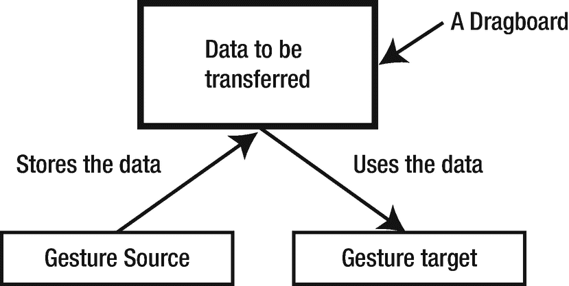
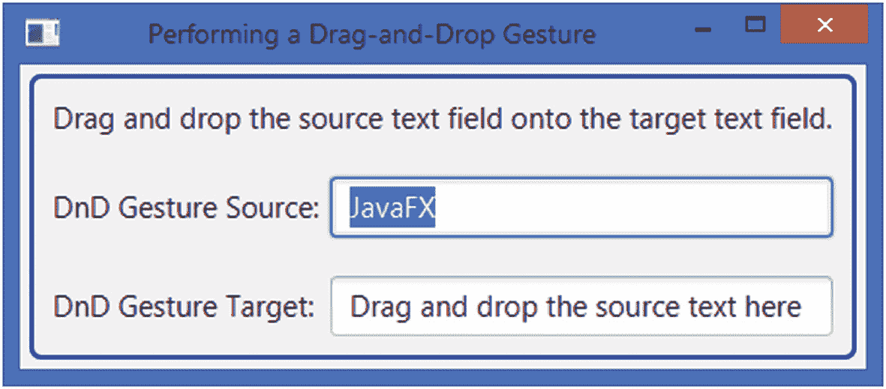
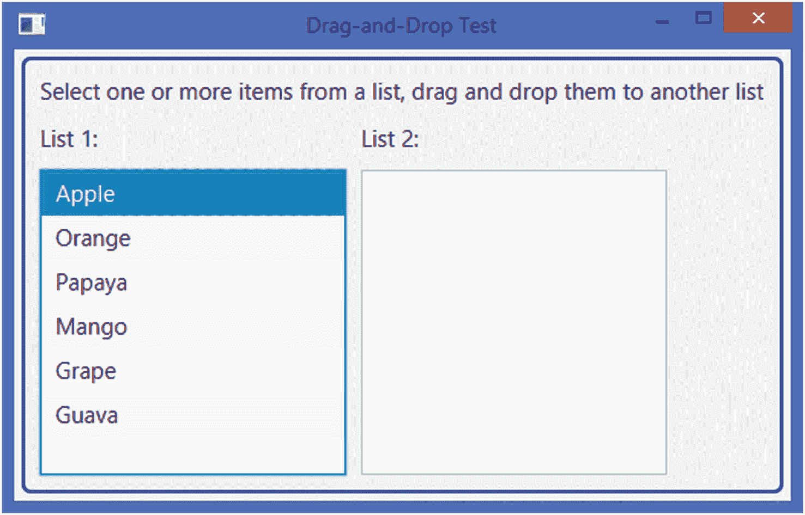

# 二十三、理解拖放

在本章中，您将学习:

*   什么是按下-拖动-释放手势

*   如何使用拖板来促进数据传输

*   如何启动和检测拖放动作

*   如何使用拖放动作将数据从源传输到目标

*   如何使用拖放手势传输图像

*   如何使用拖放动作在源和目标之间传输自定义数据

本章的例子在`com.jdojo.dnd`包中。为了让它们工作，您必须在`module-info.java`文件中添加相应的一行:

```java
...
opens com.jdojo.dnd to javafx.graphics, javafx.base;
...

```

## 什么是按下-拖动-释放手势？

按下-拖动-释放手势是按下鼠标按钮、用按下的按钮拖动鼠标并释放按钮的用户动作。手势可以在场景或节点上启动。几个节点和场景可以参与单个按压-拖动-释放手势。该手势能够生成不同类型的事件，并将这些事件传递给不同的节点。生成的事件和接收事件的节点的类型取决于手势的目的。可以出于不同的目的拖动节点:

*   您可能希望通过拖动节点的边界来更改节点的形状，或者通过将其拖动到新位置来移动节点。在这种情况下，手势只涉及一个节点:启动手势的节点。

*   您可能希望将一个节点拖放到另一个节点上，以某种方式连接它们，例如，在流程图中用符号连接两个节点。在这种情况下，拖动手势涉及多个节点。当源节点被放到目标节点上时，会发生一个动作。

*   您可以将一个节点拖放到另一个节点上，将数据从源节点传输到目标节点。在这种情况下，拖动手势涉及多个节点。当源节点断开时，会发生数据传输。

JavaFX 支持三种类型的拖动手势:

*   简单的按下-拖动-释放手势

*   完全按下-拖动-释放手势

*   拖放手势

本章将主要关注第三种手势:拖放手势。要全面了解拖放手势，理解前两种手势是非常重要的。我将简要讨论前两种类型的手势，每种类型都有一个简单的例子。

### 简单的按下-拖动-释放手势

简单的按下-拖动-释放手势是默认的拖动手势。当拖动笔势只涉及一个节点(笔势在其上启动的节点)时使用。在拖动手势过程中，所有的`MouseDragEvent`类型——鼠标拖动输入、鼠标拖动结束、鼠标拖动退出、鼠标和鼠标拖动释放——都只传递给手势源节点。在这种情况下，当按下鼠标按钮时，会选取最顶层的节点，所有后续的鼠标事件都会传递到该节点，直到松开鼠标按钮。当鼠标被拖动到另一个节点上时，手势开始所在的节点仍然在光标下，因此，在释放鼠标按钮之前，没有其他节点接收事件。

清单 23-1 中的程序演示了一个简单的按压-拖动-释放手势的例子。它向场景添加了两个`TextFields`:一个称为源节点，另一个称为目标节点。事件处理程序被添加到这两个节点中。目标节点添加了`MouseDragEvent`处理程序来检测其上的任何鼠标拖动事件。运行程序，在源节点上按下鼠标按钮，将其拖到目标节点上，最后，释放鼠标按钮。下面的输出显示源节点接收所有鼠标拖动的事件。目标节点不接收任何鼠标拖动事件。这是简单的按下-拖动-释放手势的情况，其中启动拖动手势的节点接收所有鼠标拖动事件。

```java
// SimplePressDragRelease.java
package com.jdojo.dnd;

import javafx.application.Application;
import javafx.scene.Scene;
import javafx.scene.control.Label;
import javafx.scene.control.TextField;
import javafx.scene.layout.GridPane;
import javafx.stage.Stage;

public class SimplePressDragRelease extends Application {
        TextField sourceFld = new TextField("Source Node");
        TextField targetFld = new TextField("Target node");

        public static void main(String[] args) {
                Application.launch(args);
        }

        @Override
        public void start(Stage stage) {
                // Build the UI
                GridPane root = getUI();

                // Add event handlers
                this.addEventHandlers();

                Scene scene = new Scene(root);
                stage.setScene(scene);
                stage.setTitle("A simple press-drag-release gesture");
                stage.show();
        }

        private GridPane getUI() {
                GridPane pane = new GridPane();
                pane.setHgap(5);
                pane.setVgap(20);
                pane.addRow(0, new Label("Source Node:"), sourceFld);
                pane.addRow(1, new Label("Target Node:"), targetFld);
                return pane;
        }

        private void addEventHandlers() {
                // Add mouse event handlers for the source
                sourceFld.setOnMousePressed(e ->
                         print("Source: pressed"));
                sourceFld.setOnMouseDragged(e ->
                         print("Source: dragged"));
                sourceFld.setOnDragDetected(e ->
                         print("Source: dragged detected"));
                sourceFld.setOnMouseReleased(e ->
                         print("Source: released"));

                // Add mouse event handlers for the target
                targetFld.setOnMouseDragEntered(e ->
                         print("Target: drag entered"));
                targetFld.setOnMouseDragOver(e ->
                         print("Target: drag over"));
                targetFld.setOnMouseDragReleased(e ->
                         print("Target: drag released"));
                targetFld.setOnMouseDragExited(e ->
                         print("Target: drag exited"));
        }

        private void print(String msg) {
                System.out.println(msg);
        }
}

Source: Mouse pressed
Source: Mouse dragged
Source: Mouse dragged detected
Source: Mouse dragged
Source: Mouse dragged
...
Source: Mouse released

Listing 23-1Demonstrating a Simple Press-Drag-Release Gesture

```

请注意，拖动鼠标后会生成一次检测到拖动事件。`MouseEvent`对象有一个`dragDetect`标志，可以在鼠标按下和鼠标拖动事件中设置。如果设置为 true，则生成的后续事件是检测到拖动事件。默认情况下是在鼠标拖动事件之后生成它。如果您想在鼠标按下事件之后生成它，而不是鼠标拖动事件之后，您需要修改事件处理程序:

```java
sourceFld.setOnMousePressed(e -> {
        print("Source: Mouse pressed");

        // Generate drag detect event after the current mouse pressed event
        e.setDragDetect(true);
});

sourceFld.setOnMouseDragged(e -> {
        print("Source: Mouse dragged");

        // Suppress the drag detected default event generation after mouse
          // dragged
        e.setDragDetect(false);
});

```

### 完全按下-拖动-释放手势

当拖动手势的源节点接收到检测到拖动事件时，您可以通过调用源节点上的`startFullDrag()`方法来启动一个*全按-拖动-释放*手势。`startFullDrag()`方法存在于`Node`和`Scene`类中，允许你为一个节点和一个场景启动一个完整的按下-拖动-释放手势。在这次讨论中，我将只使用术语节点。

Tip

只能从检测到拖动的事件处理程序中调用`startFullDrag()`方法。从任何其他地方调用这个方法都会抛出一个`IllegalStateException`。

您需要再做一次设置才能看到完整的按下-拖动-释放手势。拖动动作的源节点仍将接收所有鼠标拖动的事件，因为它在发生拖动时位于光标之下。您需要将手势源的`mouseTransparent`属性设置为 false，这样它下面的节点将被选取，鼠标拖动的事件将被传递到该节点。在鼠标按下事件中将此属性设置为 true，在鼠标释放事件中将它设置回 false。

清单 23-2 中的程序演示了一个完整的按下-拖动-释放手势。该程序类似于清单 23-1 中所示的程序，除了以下几点:

*   在源节点的鼠标按下事件处理程序中，源节点的`mouseTransparent`属性被设置为 false。它在释放鼠标的事件处理程序中被设置回 true。

*   在检测到拖动的事件处理程序中，在源节点上调用`startFullDrag()`方法。

运行程序，在源节点上按下鼠标按钮，将其拖到目标节点上，最后，释放鼠标按钮。下面的输出显示，当鼠标被拖动到其边界内时，目标节点接收到鼠标拖动事件。这是完全按下-拖动-释放手势的情况，其中发生鼠标拖动的节点接收鼠标拖动事件。

```java
// FullPressDragRelease.java
// ...find in the book's download area.

Source: Mouse pressed
Source: Mouse dragged
Source: Mouse dragged
Source: Mouse dragged detected
Source: Mouse dragged
Source: Mouse dragged
Target: drag entered
Target: drag over
Source: Mouse dragged
Target: drag over
Target: drag released
Source: Mouse released
Target: drag exited

Listing 23-2Demonstrating a Full Press-Drag-Release Gesture

```

### 拖放手势

第三种类型的拖动手势称为*拖放*手势，这是一种结合了鼠标移动和按下鼠标按钮的用户动作。用于将数据从*手势源*传输到*手势目标*。拖放动作允许将数据从

*   一个节点到另一个节点

*   场景的节点

*   一幕接一幕

*   场景到节点

源和目标可以在同一个 Java 或 JavaFX 应用程序中，也可以在两个不同的 Java 或 JavaFX 应用程序中。JavaFX 应用程序和本机应用程序也可以参与手势，例如:

*   您可以将文本从 Microsoft Word 应用程序拖到 JavaFX 应用程序来填充`TextArea`，反之亦然。

*   您可以将图像文件从 Windows 资源管理器中拖放到 JavaFX 应用程序中的`ImageView`上。`ImageView`可以显示图像。

*   您可以从 Windows 资源管理器中拖放一个文本文件到 JavaFX 应用程序中的`TextArea`上。`TextArea`将读取文件并显示其内容。

执行拖放动作涉及几个步骤:

*   在节点上按下了鼠标按钮。

*   按住按钮拖动鼠标。

*   该节点接收拖动检测事件。

*   通过调用`startDragAndDrop()`方法在节点上启动拖放动作，使节点成为动作源。来自源节点的数据放在一个 dragboard 中。

*   一旦系统切换到拖放手势，它就停止传送`MouseEvents`并开始传送`DragEvents`。

*   手势源被拖到潜在的手势目标上。潜在的手势目标检查它是否接受放置在 dragboard 中的数据。如果它接受数据，它可能成为实际的手势目标。节点指示它是否接受它的一个`DragEvent`处理程序中的数据。

*   用户释放手势目标上按下的按钮，向其发送拖放事件。

*   手势目标使用来自 dragboard 的数据。

*   drag-done 事件被发送到手势源，指示拖放手势完成。

我将在接下来的小节中详细讨论所有这些步骤。支持拖放手势的类包含在`javafx.scene.input`包中。

## 了解数据传输模式

在拖放手势中，数据可以通过三种模式传输:

*   复制

*   移动

*   环

*复制*模式表示数据将从手势源复制到手势目标。您可以将一个`TextField`拖放到另一个`TextField`上。后者获得前者中包含的文本的副本。

*移动*模式表示数据将从手势源移动到手势目标。您可以将一个`TextField`拖放到另一个`TextField`上。前者中的文本随后被移到后者中。

*链接*模式表示手势目标将创建一个链接(或引用)到正在传输的数据。“链接”的实际含义取决于应用。您可以在链接模式下将 URL 拖放到`WebView`中。然后，`WebView`加载 URL 内容。

三种数据传输模式由`TransferMode`枚举中的以下三个常量表示:

*   `TransferMode.COPY`

*   `TransferMode.MOVE`

*   `TransferMode.LINK`

有时，您可能需要三种传输模式的组合。`TransferMode`枚举包含三个方便的静态字段，它们是枚举常量的数组:

*   `TransferMode[] ANY`

*   `TransferMode[] COPY_OR_MOVE`

*   `TransferMode[] NONE`

`ANY`字段是一个由`COPY`、`MOVE`和`LINK`枚举常量组成的数组。`COPY_OR_MOVE`字段是`COPY`和`MOVE`枚举常量的数组。`NONE`常量是一个空数组。

每个拖放动作都包括使用`TransferMode`枚举常量。手势源指定其支持的数据传输模式。手势目标指定它接受数据传输的模式。

## 了解*拖板*

在拖放数据传输中，手势源和手势目标彼此不认识。事实上，它们可能属于两个不同的应用程序:两个 JavaFX 应用程序，或者一个 JavaFX 和一个 native。如果手势源和目标彼此不认识，它们之间的数据传输是如何发生的？在现实世界中，需要一个中介来促进两个未知方之间的交易。在拖放手势中，也使用中介来促进数据传输。

拖板充当手势源和手势目标之间的中介。拖板是保存正在传输的数据的存储设备。手势源将数据放入拖板中；dragboard 可供手势目标使用，因此它可以检查可用于传输的内容类型。当手势目标准备好传输数据时，它从 dragboard 获取数据。图 23-1 显示了拖板所扮演的角色。



图 23-1

拖放手势中的数据传输机制

`Dragboard`类的一个实例代表一个 dragboard。该类继承自`Clipboard`类。一个`Clipboard`类的实例代表一个操作系统剪贴板。通常，操作系统在剪切、复制和粘贴操作中使用剪贴板来存储数据。使用`Clipboard`类的静态`getSystemClipboard()`方法可以得到操作系统通用剪贴板的引用:

```java
Clipboard systemClipboard = Clipboard.getSystemClipboard();

```

您可以将数据放在系统剪贴板中，系统中的所有应用程序都可以访问这些数据。您可以读取放置在系统剪贴板中的数据，这些数据可以由任何应用程序放置在那里。剪贴板可以存储不同类型的数据，例如，RTF 文本、纯文本、HTML、URL、图像或文件。该类包含几个方法来检查剪贴板中是否有特定格式的数据。如果特定格式的数据可用，这些方法返回`true`。例如，如果剪贴板包含一个普通字符串，`hasString()`方法返回`true`；`hasRtf()`方法为富文本格式的文本返回`true`。该类包含以特定格式检索数据的方法。例如，`getString()`方法以纯文本格式返回数据；`getHtml()`返回 HTML 文本；`getImage()`返回图像；等等。`clear()`方法清除剪贴板。

Tip

您不能直接创建`Clipboard`类的实例。剪贴板是为了存储一个概念上的项目。概念一词意味着剪贴板中的数据可能以不同的格式存储，表示同一项。例如，您可以存储 RTF 文本及其纯文本版本。在这种情况下，剪贴板有相同项目的两个不同格式的副本。

剪贴板不限于仅存储固定数量的数据类型。任何可序列化的数据都可以存储在剪贴板上。存储在剪贴板上的数据具有相关联的数据格式。`DataFormat`类的一个实例代表一种数据格式。`DataFormat`类包含六个静态字段来表示常用的数据格式:

*   `FILES`

*   `HTML`

*   `IMAGE`

*   `PLAIN_TEXT`

*   `RTF`

*   `URL`

`FILES`表示一列`java.io.File`对象。`HTML`代表一个 HTML 格式的字符串。`IMAGE`表示特定于平台的图像类型。`PLAIN_TEXT`代表一个纯文本字符串。`RTF`代表一个 RTF 格式的字符串。`URL`表示一个编码为字符串的 URL。

您可能希望将剪贴板中的数据存储为不同于前面列出的格式。您可以创建一个`DataFormat`对象来表示任意格式。您需要为您的数据格式指定一个 mime 类型列表。以下语句创建一个将`jdojo/person`和`jdojo/personlist`作为 mime 类型的`DataFormat`:

```java
DataFormat myFormat = new DataFormat("jdojo/person", "jdojo/person");

```

`Clipboard`类提供了以下方法来处理数据及其格式:

*   `boolean setContent(Map<DataFormat,Object> content)`

*   `Object getContent(DataFormat dataFormat)`

剪贴板的内容是一个以`DataFormat`为键，以数据为值的映射。如果剪贴板中没有特定数据格式的数据，则`getContent()`方法返回`null`。以下代码片段存储 HTML 和纯文本版本的数据，并在以后检索这两种格式的数据:

```java
// Store text in HTML and plain-text formats in the system clipboard
Clipboard clipboard = Clipboard.getSystemClipboard();

Map<DataFormat,Object> data = new HashMap<>();
data.put(DataFormat.HTML, "<b>Yahoo!</b>");
data.put(DataFormat.PLAIN_TEXT, "Yahoo!");
clipboard.setContent(data);
...

// Try reading HTML text and plain text from the clipboard
If (clipboard.hasHtml()) {
        String htmlText = (String)clipboard.getContent(DataFormat.HTML);
        System.out.println(htmlText);
}

If (clipboard.hasString()) {
        String plainText = (String)clipboard.getContent(DataFormat.PLAIN_TEXT);
        System.out.println(plainText);
}

```

准备存储在剪贴板中的数据需要编写一点臃肿的代码。`ClipboardContent`类的一个实例表示剪贴板的内容，它使得使用剪贴板数据变得更加容易。该类继承自`HashMap<DataFormat,Object>`类。它以`putXxx()`和`getXxx()`的形式为常用的数据类型提供了方便的方法。下面的代码片段重写了前面的逻辑，将数据存储到剪贴板中。检索数据的逻辑保持不变:

```java
Clipboard clipboard = Clipboard.getSystemClipboard();
ClipboardContent content = new ClipboardContent();
content.putHtml("<b>Yahoo!</b>");
content.putString("Yahoo!");
clipboard.setContent(content);

```

`Dragboard`类继承了`Clipboard`类中所有可用的公共方法。它添加了以下方法:

*   `Set<TransferMode> getTransferModes()`

*   `void setDragView(Image image)`

*   `void setDragView(Image image, double offsetX, double offsetY)`

*   `void setDragViewOffsetX(double offsetX)`

*   `void setDragViewOffsetY(double offsetY)`

*   `Image getDragView()`

*   `Double getDragViewOffsetX()`

*   `double getDragViewOffsetY()`

`getTransferModes()`方法返回手势目标支持的传输模式集。`setDragView()`方法将图像设置为拖动视图。拖动手势源时会显示图像。偏移量是光标在图像上的 x 和 y 位置。其他方法包括获取拖动视图图像和光标偏移量。

Tip

dragboard 是一种用于拖放动作的特殊系统剪贴板。您不能显式创建 dragboard。每当需要使用 dragboard 时，它的引用将作为方法的返回值或事件对象的属性提供。例如，`DragEvent`类包含一个`getDragboard()`方法，该方法返回包含被传输数据的`Dragboard`的引用。

## 示例应用程序

在接下来的部分中，我将详细讨论拖放动作的步骤，并且您将构建一个示例应用程序。应用程序将有两个`TextFields`显示在一个场景中。一个文本字段称为源节点，另一个称为目标节点。用户可以将源节点拖放到目标节点上。完成手势后，来自源节点的文本被传输(复制或移动)到目标节点。我将在讨论中提到这些节点。它们声明如下:

```java
TextField sourceFld = new TextField("Source node");
TextField targetFld = new TextField("Target node");

```

### 启动拖放手势

拖放手势的第一步是将简单的按下-拖动-释放手势转换为拖放手势。这是在手势源的鼠标拖动检测事件处理程序中完成的。在手势源上调用`startDragAndDrop()`方法会启动一个拖放手势。该方法在`Node`和`Scene`类中可用，因此一个节点和一个场景可以是拖放手势的手势源。方法签名是

```java
Dragboard startDragAndDrop(TransferMode... transferModes)

```

该方法接受笔势源支持的传输模式列表，并返回一个 dragboard。手势源需要用它想要传输的数据填充 dragboard。下面的代码片段启动一个拖放动作，将源`TextField`文本复制到 dragboard，并使用该事件。拖放手势仅在`TextField`包含文本时启动:

```java
sourceFld.setOnDragDetected((MouseEvent e) -> {
        // User can drag only when there is text in the source field
        String sourceText = sourceFld.getText();
        if (sourceText == null || sourceText.trim().equals("")) {
                e.consume();
                return;
        }

        // Initiate a drag-and-drop gesture
        Dragboard dragboard =
              sourceFld.startDragAndDrop(TransferMode.COPY_OR_MOVE);

        // Add the source text to the Dragboard
        ClipboardContent content = new ClipboardContent();
        content.putString(sourceText);
        dragboard.setContent(content);

        e.consume();
});

```

### 检测拖动手势

一旦启动了拖放手势，您就可以将手势源拖到任何其他节点上。手势源已经将数据放入 dragboard，声明它支持的传输模式。现在是潜在的手势目标声明它们是否接受手势源提供的数据传输的时候了。请注意，可能有多个潜在的手势目标。当手势源放在其中一个目标上时，它将成为实际的手势目标。

潜在手势目标接收几种类型的拖动事件:

*   当手势源进入它的边界时，它接收一个拖动输入事件。

*   当在它的边界内拖动手势源时，它接收一个拖动事件。

*   当笔势源退出其边界时，它接收一个拖动退出事件。

*   当通过释放鼠标按钮将手势源放在它上面时，它接收一个拖放事件。

在拖动事件处理程序中，潜在的手势目标需要通过调用`DragEvent`的`acceptTransferModes(TransferMode... modes)`方法来声明它打算参与拖放手势。通常，潜在目标在声明是否接受传输模式之前会检查 dragboard 的内容。下面的代码片段实现了这一点。目标`TextField`检查 dragboard 中的纯文本。它包含纯文本，因此目标声明它接受`COPY`和`MOVE`传输模式:

```java
targetFld.setOnDragOver((DragEvent e) -> {
        // If drag board has a string, let the event know that the
           // target accepts copy and move transfer modes
        Dragboard dragboard = e.getDragboard();

        if(dragboard.hasString()) {
                e.acceptTransferModes(TransferMode.COPY_OR_MOVE);
        }

        e.consume();
});

```

### 将源放到目标上

如果潜在手势目标接受手势源支持的转移模式，则手势源可被放到目标上。当手势源仍在目标上方时，通过释放鼠标按钮来完成放下。当手势源放到目标上时，该目标成为实际的手势目标。实际的手势目标接收拖放事件。您需要为手势目标添加一个拖放事件处理程序，它在其中执行两个任务:

*   它访问 dragboard 中的数据。

*   它调用`DragEvent`对象的`setDropCompleted(boolean isTransferDone)`方法。

将 true 传递给方法指示数据传输成功。传递 false 表示数据传输不成功。调用此方法后，无法访问 dragboard。

以下代码片段执行数据传输并设置适当的完成标志:

```java
targetFld.setOnDragDropped((DragEvent e) -> {
        // Transfer the data to the target
        Dragboard dragboard = e.getDragboard();
        if(dragboard.hasString()) {
                String text = dragboard.getString();
                targetFld.setText(text);

                // Data transfer is successful
                e.setDropCompleted(true);
        } else {
                // Data transfer is not successful
                e.setDropCompleted(false);
        }

        e.consume();
});

```

### 完成拖放动作

放下手势源后，它会收到一个 drag-done 事件。`DragEvent`对象包含一个`getTransferMode()`方法。当从 drag-done 事件处理程序调用它时，它返回用于数据传输的传输模式。根据传输模式，您可以清除或保留手势源的内容。例如，如果传输模式是`MOVE`，最好清除源内容，让用户真正感受到数据移动。

您可能想知道是什么决定了数据传输模式。在这个例子中，手势源和目标都支持`COPY`和`MOVE`。当目标在拖放事件中从 dragboard 访问数据时，它没有设置任何传输模式。系统根据某些键的状态以及源和目标来确定数据传输模式。例如，当您将一个`TextField`拖放到另一个`TextField`上时，默认的数据传输模式是`MOVE`。当按住 Ctrl 键执行相同的拖放操作时，会使用`COPY`模式。

如果`getTransferMode()`方法返回`null`或`TransferMode.ONE`，则表明没有发生数据传输。下面的代码片段处理源`TextField`的拖动完成事件。如果数据传输模式是`MOVE`，源文本被清除:

```java
sourceFld.setOnDragDone((DragEvent e) -> {
        // Check how the data transfer happened. If it was moved, clear the
           // text in the source.
        TransferMode modeUsed = e.getTransferMode();

        if (modeUsed == TransferMode.MOVE) {
                sourceFld.setText("");
        }

        e.consume();
});

```

这就完成了对拖放手势的处理。如果你需要更多关于参与拖放动作的各方的信息，请参考`DragEvent`类的 API 文档。例如，使用`getGestureSource()`和`getGestureTarget()`方法分别获取手势源和目标的引用。

## 提供视觉线索

有几种方法可以在拖放动作中提供视觉线索:

*   在拖动手势期间，系统会在光标下提供一个图标。图标会根据系统确定的传输模式以及拖动目标是否是拖放手势的潜在目标而变化。

*   您可以通过更改潜在目标的可视外观，为其拖动进入和拖动退出事件编写代码。例如，在拖动输入的事件处理程序中，如果允许数据传输，您可以将潜在目标的背景颜色更改为绿色，如果不允许，则更改为红色。在拖动退出事件处理程序中，您可以将背景颜色改回正常颜色。

*   您可以在手势的 drag-detected 事件处理程序中的 dragboard 中设置拖动视图。拖动视图是一个图像。例如，您可以拍摄被拖动的节点或部分节点的快照，并将其设置为拖动视图。

## 一个完整的拖放示例

清单 23-3 中的程序有这个例子的完整源代码。显示如图 23-2 所示的窗口。您可以拖动手势源`TextField`并将其放到目标`TextField`上。源中的文本将被复制或移动到目标中。传输模式取决于系统。例如，在 Windows 上，在放下时按下 Ctrl 键将复制文本，在没有按下 Ctrl 键的情况下放下将移动文本。请注意，在拖动动作过程中，拖动图标会发生变化。当您放下信号源时，图标会提示您将会发生何种数据传输。例如，当您将源拖到不接受源提供的数据传输的目标上时，会显示一个“不允许”图标，即一个带有斜实线的圆圈。



图 23-2

允许使用拖放手势将文本从一个`TextField`转移到另一个的场景

```java
// DragAndDropTest.java
// ...find in the book's download area.

Listing 23-3Performing a Drag-and-Drop Gesture

```

## 传输图像

拖放手势允许您传输图像。图像可以放在拖板上。您也可以在拖板上放置一个指向图像位置的 URL 或文件。让我们开发一个简单的应用程序来演示图像数据传输。要传输图像，用户可以将以下内容拖放到场景中:

*   图像

*   图像文件

*   指向图像的 URL

清单 23-4 中的程序打开一个窗口，有一条文本消息、一个空的`ImageView`和一个按钮。`ImageView`将显示拖放的图像。使用按钮清除图像。

整个场景都是拖放动作的潜在目标。为场景设置了一个拖动事件处理程序。它检查拖板是否包含图像、文件列表或 URL。如果它在 dragboard 中找到这些数据类型中的一种，它将报告它将接受任何数据传输模式。在场景的拖放事件处理程序中，程序尝试按顺序读取图像数据、文件列表和 URL。如果是文件列表，那么查看每个文件的 mime 类型，看文件名是否以`image/`开头。您使用带有图像 mime 类型的第一个文件，忽略其余的文件。如果它是一个 URL，您只需尝试从它创建一个`Image`对象。您可以用不同的方式使用该应用程序:

*   运行程序并在浏览器中打开 HTML 文件`drag_and_drop.html`。该文件包含在`src/resources/html`目录中。HTML 文件包含两个链接:一个指向本地图像文件，另一个指向远程图像文件。将链接拖放到场景中。该场景将显示链接所引用的图像。从网页中拖放图像。场景将显示图像。(图像的拖放在 Mozilla 和 Google Chrome 浏览器中运行良好，但在 Windows 资源管理器中就不行了。)

*   打开文件资源管理器，例如 Windows 上的 Windows 资源管理器。选择一个图像文件，并将该文件拖放到场景中。场景将显示文件中的图像。您可以放下多个文件，但是场景将只显示其中一个文件的图像。

您可以通过允许用户将多个文件拖到场景中并在一个`TilePane`中显示它们来增强应用程序。您还可以添加更多关于拖放动作的错误检查和反馈给用户。

```java
// ImageDragAndDrop.java
// ...find in the book's download area.

Listing 23-4Transferring an Image Using a Drag-and-Drop Gesture

```

## 传输自定义数据类型

如果数据是`Serializable`，您可以使用拖放手势传输任何格式的数据。在这一节中，我将演示如何传输自定义数据。你要转一个`ArrayList<Item>`。`Item`级如清单 23-5 所示；是`Serializable`。这个类非常简单。它包含一个私有字段及其 getter 和 setter 方法。

```java
// Item.java
package com.jdojo.dnd;

import java.io.Serializable;

public class Item implements Serializable {
        private String name = "Unknown";

        public Item(String name) {
                this.name = name;
        }

        public String getName() {
                return name;
        }

        public void setName(String name) {
                this.name = name;
        }

        @Override
        public String toString() {
                return name;
        }
}

Listing 23-5Using a Custom Data Type in Data Transfer

```

清单 23-6 中的程序展示了如何在拖放动作中使用自定义数据格式。显示如图 23-3 所示的窗口。该窗口包含两个`ListViews`。最初，只有一个`ListViews`填充了一个项目列表。两个`ListViews`都支持多选。您可以选择一个`ListView`中的项目，并将其拖放到另一个`ListView`中。将根据系统确定的传输模式复制或移动选定的项目。例如，在 Windows 上，默认情况下会移动项目。如果您在拖放时按下 Ctrl 键，项目将被复制。



图 23-3

在两个`ListViews`之间传送所选项目的列表

```java
// CustomDataTransfer.java

// ...find in the book's download area.

Listing 23-6Transferring Custom Data Using a Drag-and-Drop Gesture

```

大部分程序和你以前看过的差不多。区别在于如何在 dragboard 中存储和检索`ArrayList<Item>`。

您为该数据传输定义了一个新的数据格式，因为该数据不符合任何作为`DataFormat`类中的常量的类别。您必须将数据定义为常量，如以下代码所示:

```java
// Our custom Data Format
static final DataFormat ITEM_LIST = new DataFormat("jdojo/itemlist");

```

现在，您已经为数据格式给出了一个惟一的 mime 类型`jdojo/itemlist`。

在 drag-detected 事件中，您需要将选定项目的列表存储到 dragboard 上。下面的代码片段在`dragDetected()`方法中存储作业。请注意，在拖板上存储数据时，您使用了新的数据格式:

```java
ArrayList<Item> selectedItems = this.getSelectedItems(listView);
ClipboardContent content = new ClipboardContent();
content.put(ITEM_LIST, selectedItems);
dragboard.setContent(content);

```

在拖过事件中，如果`ListView`没有被拖过自身，并且拖板包含`ITEM_LIST`数据格式的数据，`ListView`声明它接受`COPY`或`MOVE`传输。下面的代码片段在`dragOver()`方法中完成了这项工作:

```java
Dragboard dragboard = e.getDragboard();
if (e.getGestureSource() != listView && dragboard.hasContent(ITEM_LIST)) {
        e.acceptTransferModes(TransferMode.COPY_OR_MOVE);
}

```

最后，当源拖放到目标上时，您需要从 dragboard 中读取数据。您需要使用 dragboard 的`getContent()`方法，将`ITEM_LIST`指定为数据格式。返回的结果需要被强制转换为`ArrayList<Item>`。下面的代码片段在`dragDropped()`方法中完成了这项工作:

```java
Dragboard dragboard = e.getDragboard();
if(dragboard.hasContent(ITEM_LIST)) {
        ArrayList<Item> list =
              (ArrayList<Item>)dragboard.getContent(ITEM_LIST);
        listView.getItems().addAll(list);

        // Data transfer is successful
        dragCompleted = true;
}

```

最后，在用`dragDone()`方法实现的拖动完成事件处理程序中，如果将`MOVE`用作传输模式，则从源`ListView`中移除选定的项目。注意，您已经使用了一个`ArrayList<Item>`，因为`ArrayList`和`Item`类都是可序列化的。

## 摘要

按下-拖动-释放手势是按下鼠标按钮、用按下的按钮拖动鼠标并释放按钮的用户动作。手势可以在场景或节点上启动。几个节点和场景可以参与单个按压-拖动-释放手势。该手势能够生成不同类型的事件，并将这些事件传递给不同的节点。生成事件的类型和接收事件的节点取决于手势的目的。

JavaFX 支持三种类型的拖动手势:简单的按下-拖动-释放手势、完全按下-拖动-释放手势和拖放手势。

简单的按下-拖动-释放手势是默认的拖动手势。当拖动笔势只涉及一个节点(笔势在其上启动的节点)时使用。在拖动手势过程中，所有的`MouseDragEvent`类型——鼠标拖动输入、鼠标拖动结束、鼠标拖动退出、鼠标和鼠标拖动释放——都只传递给手势源节点。

当拖动手势的源节点接收到检测到拖动的事件时，您可以通过调用源节点上的`startFullDrag()`方法来启动一个完整的按下-拖动-释放手势。`startFullDrag()`方法存在于`Node`和`Scene`类中，允许你为一个节点和一个场景启动一个完整的按下-拖动-释放手势。

第三种类型的拖动手势称为拖放手势，这是一种将鼠标移动与按下鼠标按钮相结合的用户动作。它用于将数据从手势源传输到手势目标。在拖放动作中，数据可以通过三种模式传输:复制、移动和链接。复制模式表示数据将从手势源复制到手势目标。移动模式表示数据将从手势源移动到手势目标。链接模式指示手势目标将创建到正在传输的数据的链接(或引用)。“链接”的实际含义取决于应用。

在拖放数据传输中，手势源和手势目标彼此不认识，它们甚至可能属于两个不同的应用程序。dragboard 充当手势源和手势目标之间的中介。dragboard 是保存正在传输的数据的存储设备。手势源将数据放在拖板上；dragboard 可供手势目标使用，因此它可以检查可用于传输的内容类型。当手势目标准备好传输数据时，它从 dragboard 获取数据。

使用拖放手势，数据传输分三步进行:由源发起拖放手势，由目标检测拖动手势，以及将源放到目标上。在该手势期间，为源节点和目标节点生成不同类型的事件。您还可以通过在拖放动作中显示图标来提供视觉线索。只要数据是可序列化的，拖放动作支持传输任何类型的数据。

下一章讨论如何在 JavaFX 中处理并发操作。