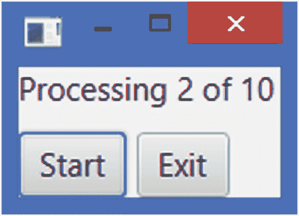
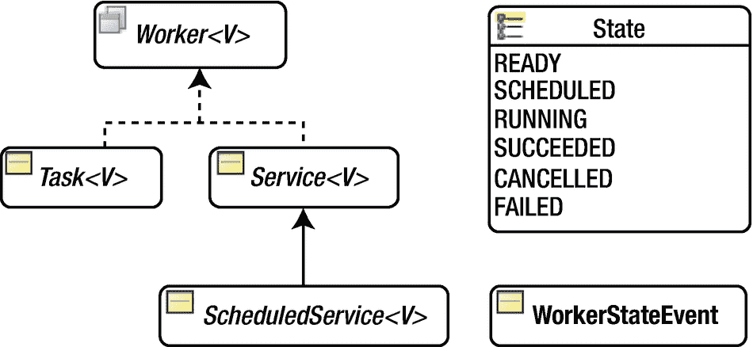
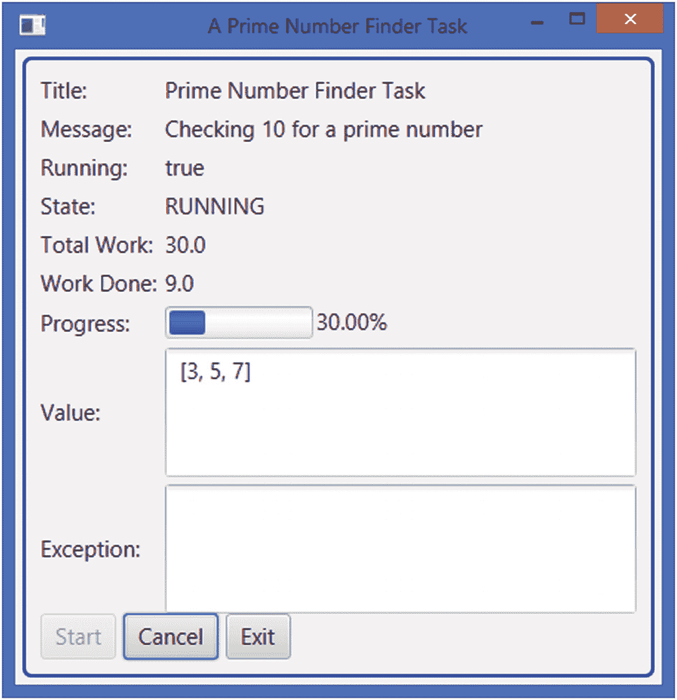
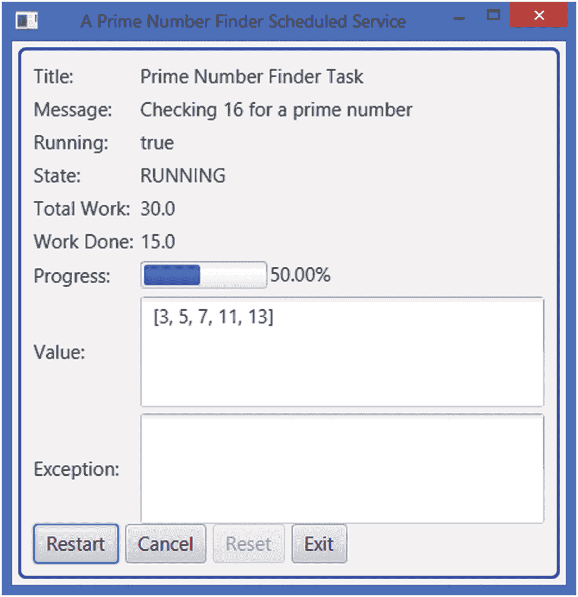
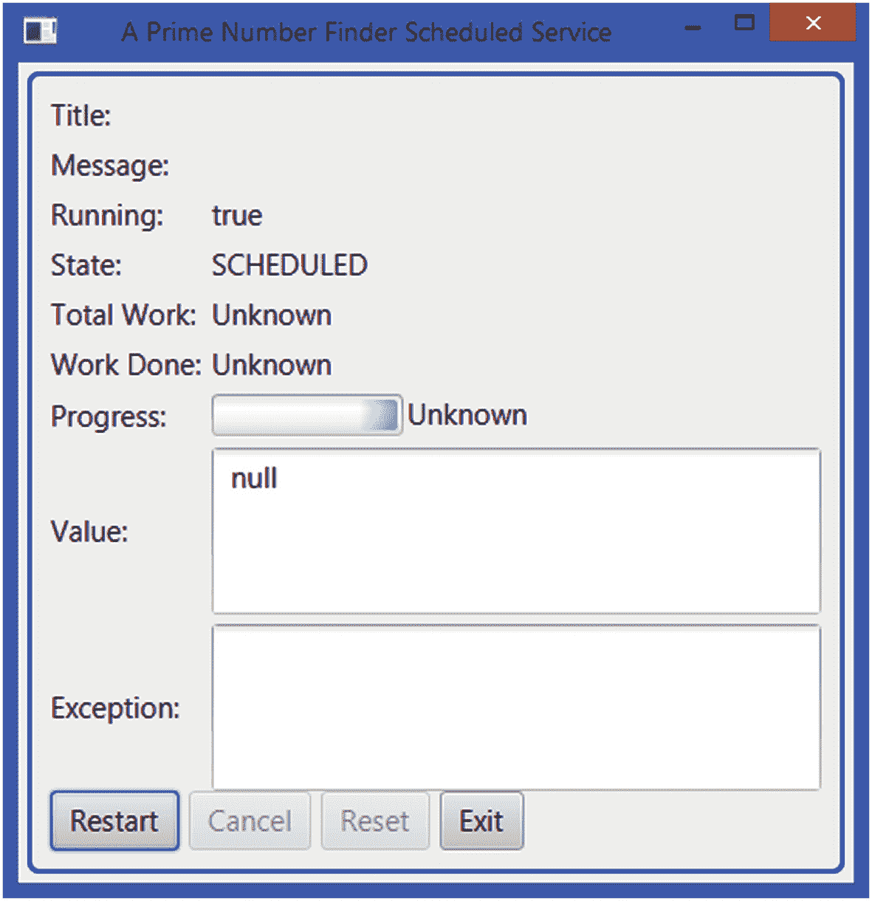

# 二十四、理解 JavaFX 中的并发性

在本章中，您将学习:

*   为什么在 JavaFX 中需要一个并发框架

*   `Worker<V>`接口如何表示并发任务

*   如何运行一次性任务

*   如何运行可重用任务

*   如何运行计划任务

本章的例子在`com.jdojo.concurrent`包中。为了让它们工作，您必须在`module-info.java`文件中添加相应的一行:

```java
...
opens com.jdojo.concurrent to javafx.graphics, javafx.base;
...

```

## 对并发框架的需求

Java(包括 JavaFX) GUI(图形用户界面)应用程序本质上是多线程的。多个线程执行不同的任务，以保持 UI 与用户操作同步。与 Swing 和 AWT 一样，JavaFX 使用一个称为 JavaFX 应用程序线程的线程来处理所有 UI 事件。场景图中表示 UI 的节点不是线程安全的。设计非线程安全的节点有利也有弊。它们更快，因为不涉及同步。缺点是需要从单个线程访问它们，以避免处于非法状态。JavaFX 设置了一个限制，即只能从一个线程(JavaFX 应用程序线程)访问实时场景图形。这个限制间接地强加了另一个限制，即 UI 事件不应该处理长时间运行的任务，因为它会使应用程序没有响应。用户将得到应用程序被挂起的印象。

清单 24-1 中的程序显示如图 24-1 所示的窗口。它包含三个控件:


图 24-1

无响应的用户界面示例

*   显示任务进度的`Label`

*   一个*启动*按钮来启动任务

*   一个*退出*按钮，用于退出应用程序

```java
// UnresponsiveUI.java
package com.jdojo.concurrent;

import javafx.application.Application;
import javafx.scene.Scene;
import javafx.scene.control.Button;
import javafx.scene.control.Label;
import javafx.scene.layout.HBox;
import javafx.scene.layout.VBox;
import javafx.stage.Stage;

public class UnresponsiveUI extends Application {
        Label statusLbl = new Label("Not Started...");
        Button startBtn = new Button("Start");
        Button exitBtn = new Button("Exit");

        public static void main(String[] args) {
                Application.launch(args);
        }

        @Override
        public void start(Stage stage) {
                // Add event handlers to the buttons
                startBtn.setOnAction(e -> runTask());
                exitBtn.setOnAction(e -> stage.close());

                HBox buttonBox = new HBox(5, startBtn, exitBtn);
                VBox root = new VBox(10, statusLbl, buttonBox);
                Scene scene = new Scene(root);
                stage.setScene(scene);
                stage.setTitle("An Unresponsive UI");
                stage.show();
        }

        public void runTask() {
                for(int i = 1; i <= 10; i++) {
                   try {
                     String status = "Processing " + i + " of " + 10;
                     statusLbl.setText(status);
                     System.out.println(status);
                     Thread.sleep(1000);
                   }
                   catch (InterruptedException e) {
                     e.printStackTrace();
                   }
                }
        }
}

Listing 24-1Performing a Long-Running Task in an Event Handler

```

程序很简单。当你点击*开始*按钮时，一个持续十秒钟的任务开始。任务的逻辑在`runTask()`方法中，该方法简单地运行一个循环十次。在循环内部，任务让当前线程(JavaFX 应用程序线程)休眠一秒钟。这个程序有两个问题。

点击*开始*按钮，并立即尝试点击*退出*按钮。点击*退出*按钮，直到任务完成才生效。一旦你点击*开始*按钮，你就不能在窗口上做任何其他事情，除了等待十秒钟任务完成。也就是说，应用程序在十秒钟内没有响应。这就是你将这个类命名为`UnresponsiveUI`的原因。

在`runTask()`方法的循环中，程序在标准输出中打印任务的状态，并在窗口的`Label`中显示。您会在标准输出中看到更新的状态，但不会在`Label`中看到。

反复强调 JavaFX 中的所有 UI 事件处理程序都运行在一个线程上，这个线程就是 JavaFX 应用程序线程。当点击 *Start* 按钮时，在 JavaFX 应用线程中执行`runTask()`方法。当任务正在运行时点击 *Exit* 按钮时，会为 *Exit* 按钮生成一个`ActionEvent`事件，并在 JavaFX 应用程序线程上排队。作为*开始*按钮的`ActionEvent`处理程序的一部分，在线程完成运行`runTask()`方法之后，*退出*按钮的`ActionEvent`处理程序在同一线程上运行。

场景图形更新时会生成脉冲事件。脉冲事件处理程序也在 JavaFX 应用程序线程上运行。在循环内部，`Label`的`text`属性被更新了十次，这产生了脉冲事件。然而，场景图没有被刷新以显示`Label`的最新文本，因为 JavaFX 应用程序线程忙于运行任务，它没有运行脉冲事件处理程序。

这两个问题都是因为只有一个线程来处理所有的 UI 事件处理程序，而您在*开始*按钮的`ActionEvent`处理程序中运行了一个长时间运行的任务。

解决办法是什么？你只有一个选择。您不能更改处理 UI 事件的单线程模型。不得在事件处理程序中运行长时间运行的任务。有时，作为用户操作的一部分，业务需要处理大型作业。解决方案是在一个或多个后台线程中运行长时间运行的任务，而不是在 JavaFX 应用程序线程中。

清单 24-2 中的程序是你第一次错误地尝试提供解决方案。`Start`按钮的`ActionEvent`处理程序调用`startTask()`方法，这将创建一个新线程并在新线程中运行`runTask()`方法。

```java
// BadUI.java
package com.jdojo.concurrent;

import javafx.application.Application;
import javafx.scene.Scene;
import javafx.scene.control.Button;
import javafx.scene.control.Label;
import javafx.scene.layout.HBox;
import javafx.scene.layout.VBox;
import javafx.stage.Stage;

public class BadUI extends Application {
        Label statusLbl = new Label("Not Started...");
        Button startBtn = new Button("Start");
        Button exitBtn = new Button("Exit");

        public static void main(String[] args) {
                Application.launch(args);
        }

        @Override

        public void start(Stage stage) {
                // Add event handlers to the buttons
                startBtn.setOnAction(e -> startTask());
                exitBtn.setOnAction(e -> stage.close());

                HBox buttonBox = new HBox(5, startBtn, exitBtn);
                VBox root = new VBox(10, statusLbl, buttonBox);
                Scene scene = new Scene(root);
                stage.setScene(scene);
                stage.setTitle("A Bad UI");
                stage.show();
        }

        public void startTask() {
                // Create a Runnable
                Runnable task = () -> runTask();

                // Run the task in a background thread
                Thread backgroundThread = new Thread(task);

                // Terminate the running thread if the application exits
                backgroundThread.setDaemon(true);

                // Start the thread
                backgroundThread.start();
        }

        public void runTask() {
            for(int i = 1; i <= 10; i++) {
              try {
                String status = "Processing " + i + " of " + 10;
                statusLbl.setText(status);
                System.out.println(status);
                Thread.sleep(1000);
              }
              catch (InterruptedException e) {
                e.printStackTrace();
              }
            }
        }

}

Listing 24-2A Program Accessing a Live Scene Graph from a Non-JavaFX Application Thread

```

运行程序，点击*开始*按钮。引发运行时异常。异常的部分堆栈跟踪如下:

```java
Exception in thread "Thread-4" java.lang.IllegalStateException:
Not on FX application thread; currentThread = Thread-4
  at com.sun.javafx.tk.Toolkit.checkFxUserThread(Toolkit.java:209)
  at com.sun.javafx.tk.quantum.QuantumToolkit.checkFxUserThread(
      QuantumToolkit.java:393)...
   at com.jdojo.concurrent.BadUI.runTask(BadUI.java:47)...

```

`runTask()`方法中的以下语句生成了异常:

```java
statusLbl.setText(status);

```

JavaFX 运行时检查是否必须从 JavaFX 应用程序线程访问实时场景。`runTask()`方法在一个新线程上运行，名为 Thread-4，如堆栈跟踪所示，它不是 JavaFX 应用程序线程。上述语句从 JavaFX 应用程序线程之外的线程为作为实时场景图一部分的`Label`设置了`text`属性，这是不允许的。

如何从 JavaFX 应用程序线程之外的线程访问实时场景图？简单的答案是你不能。复杂的答案是，当一个线程想要访问一个实时场景图时，它需要运行 JavaFX 应用程序线程中访问场景图的那部分代码。`javafx.application`包中的`Platform`类提供了两个静态方法来处理 JavaFX 应用程序线程:

*   `public static boolean isFxApplicationThread()`

*   `public static void runLater(Runnable runnable)`

如果调用此方法的线程是 JavaFX 应用程序线程，则`isFxApplicationThread()`方法返回 true。否则，它返回 false。

`runLater()`方法调度指定的`Runnable`在未来某个未指定的时间在 JavaFX 应用程序线程上运行。

Tip

如果您有使用 Swing 的经验，那么 JavaFX 中的`Platform.runLater()`就是 Swing 中的`SwingUtilities.invokeLater()`的对等物。

让我们来解决`BadUI`应用程序中的问题。清单 24-3 中的程序是访问现场图形逻辑的正确实现。图 24-2 显示了程序显示窗口的快照。



图 24-2

在后台线程中运行任务并正确更新实时场景图形的 UI

```java
// ResponsiveUI.java
package com.jdojo.concurrent;

import javafx.application.Application;
import javafx.application.Platform;
import javafx.scene.Scene;
import javafx.scene.control.Button;
import javafx.scene.control.Label;
import javafx.scene.layout.HBox;
import javafx.scene.layout.VBox;
import javafx.stage.Stage;

public class ResponsiveUI extends Application {
        Label statusLbl = new Label("Not Started...");
        Button startBtn = new Button("Start");
        Button exitBtn = new Button("Exit");

        public static void main(String[] args) {
                Application.launch(args);
        }

        @Override

        public void start(Stage stage) {
                // Add event handlers to the buttons
                startBtn.setOnAction(e -> startTask());
                exitBtn.setOnAction(e -> stage.close());

                HBox buttonBox = new HBox(5, startBtn, exitBtn);
                VBox root = new VBox(10, statusLbl, buttonBox);
                Scene scene = new Scene(root);
                stage.setScene(scene);
                stage.setTitle("A Responsive UI");
                stage.show();
        }

        public void startTask() {
                // Create a Runnable
                Runnable task = () -> runTask();

                // Run the task in a background thread
                Thread backgroundThread = new Thread(task);

                // Terminate the running thread if the application exits
                backgroundThread.setDaemon(true);

                // Start the thread
                backgroundThread.start();
        }

        public void runTask() {
          for(int i = 1; i <= 10; i++) {
            try {
              String status = "Processing " + i + " of " + 10;

              // Update the Label on the JavaFx Application Thread
              Platform.runLater(() -> statusLbl.setText(status));
              System.out.println(status);
              Thread.sleep(1000);
            }
            catch (InterruptedException e) {
              e.printStackTrace();
            }
          }
        }

}

Listing 24-3A Responsive UI That Runs Long-Running Tasks in a Background Thread

```

程序会替换语句

```java
statusLbl.setText(status);

```

在`BadUI`类中用语句

```java
// Update the Label on the JavaFx Application Thread
Platform.runLater(() -> statusLbl.setText(status));

```

现在，为`Label`设置`text`属性发生在 JavaFX 应用程序线程上。 *Start* 按钮的`ActionEvent`处理程序在后台线程中运行任务，从而释放 JavaFX 应用程序线程来处理用户动作。任务的状态会定期在`Label`中更新。在任务处理过程中，您可以点击*退出*按钮。

您是否克服了 JavaFX 的事件调度线程模型带来的限制？答案是有也有没有，你用了一个微不足道的例子来论证这个问题。你已经解决了这个小问题。然而，在现实世界中，在 GUI 应用程序中执行长时间运行的任务并不那么简单。例如，您的任务运行逻辑和 UI 紧密耦合，因为您在`runTask()`方法中引用了`Label`，这在现实世界中是不可取的。您的任务不返回结果，也没有可靠的机制来处理可能发生的错误。您的任务不能被可靠地取消、重新启动或安排在将来运行。

JavaFX 并发框架可以回答所有这些问题。该框架提供了在一个或多个后台线程中运行任务并在 GUI 应用程序中发布任务的状态和结果的可靠方式。该框架是本章讨论的主题。我花了几页来说明 JavaFX 中的并发框架。如果您理解了本节中提出的问题的背景，那么理解框架就很容易了。

## 了解并发框架 API

Java 通过`java.util.concurrent`包中的库包含了一个全面的 Java 编程语言并发框架。JavaFX 并发框架非常小。它构建在 Java 语言并发框架之上，记住它将在 GUI 环境中使用。图 24-3 显示了 JavaFX 并发框架中的类的类图。



图 24-3

JavaFX 并发框架中的类的类图

该框架由一个接口、四个类和一个枚举组成。

接口的一个实例代表一个需要在一个或多个后台线程中执行的任务。任务的状态可以从 JavaFX 应用程序线程中观察到。

`Task`、`Service`和`ScheduledService`类实现了`Worker`接口。它们代表不同类型的任务。它们是抽象类。`Task`类的一个实例代表一个一次性任务。A `Task`不能重复使用。`Service`类的一个实例代表一个可重用的任务。`ScheduledService`类继承自`Service`类。一个`ScheduledService`是一个可以被安排在指定的时间间隔后重复运行的任务。

`Worker.State`枚举中的常量代表了`Worker`的不同状态。

`WorkerStateEvent`类的一个实例表示当`Worker`的状态改变时发生的一个事件。您可以将事件处理程序添加到所有三种类型的任务中，以监听它们的状态变化。

## 了解 Worker <v>接口</v>

`Worker<V>`接口为 JavaFX 并发框架执行的任何任务提供了规范。`Worker`是在一个或多个后台线程中执行的任务。通用参数`V`是`Worker`结果的数据类型。如果`Worker`没有产生结果，使用`Void`作为通用参数。任务的状态是可观察的。任务的状态在 JavaFX 应用程序线程上发布，使任务能够与场景图通信，这是 GUI 应用程序中通常需要的。

### 员工的状态转换

在生命周期中，`Worker`会经历不同的状态。`Worker.State`枚举中的常量代表了`Worker`的有效状态:

*   `Worker.State.READY`

*   `Worker.State.SCHEDULED`

*   `Worker.State.RUNNING`

*   `Worker.State.SUCCEEDED`

*   `Worker.State.CANCELLED`

*   `Worker.State.FAILED`

图 24-4 显示了一个`Worker`可能的状态转换，其中`Worker.State`枚举常量代表状态。


图 24-4

工人可能的状态转换路径

当一个`Worker`被创建时，它处于`READY`状态。在开始执行之前，它转换到`SCHEDULED`状态。当它开始运行时，它处于`RUNNING`状态。成功完成后，`Worker`从`RUNNING`状态转换到`SUCCEEDED`状态。如果`Worker`在执行过程中抛出异常，它将转换到`FAILED`状态。使用`cancel()`方法可以取消`Worker`。它可以从`READY`、`SCHEDULED`和`RUNNING`状态转换到`CANCELLED`状态。这些是单触发`Worker`的正常状态转换。

可重用的`Worker`可以从`CANCELLED`、`SUCCEEDED`和`FAILED`状态转换到图中虚线所示的`READY`状态。

### 工人的属性

`Worker`接口包含九个只读属性，代表任务的内部状态:

*   `title`

*   `message`

*   `running`

*   `state`

*   `progress`

*   `workDone`

*   `totalWork`

*   `value`

*   `exception`

当您创建一个`Worker`时，您将有机会指定这些属性。这些属性也可以随着任务的进行而更新。

属性表示任务的标题。假设一个任务产生素数。你可以给这个任务一个标题“质数生成器”

`message`属性表示任务处理过程中的详细消息。假设一个任务产生几个素数；您可能希望定期或在适当的时候向用户提供反馈信息，比如“生成 X 个质数，共 Y 个质数”

`running`属性告知`Worker`是否正在运行。当工人处于`SCHEDULED`或`RUNNING`状态时，这是真的。否则就是假的。

`state`属性指定`Worker`的状态。它的值是`Worker.State`枚举的常量之一。

`totalWork`、`workDone`和`progress`属性代表任务的进度。`totalWork`是要完成的总工作量。`workDone`是已经完成的工作量。`progress`是`workDone`和`totalWork`的比值。如果它们的值未知，则设置为–1.0。

属性表示任务的结果。只有当`Worker`成功到达`SUCCEEDED`状态时，它的值才为非空。有时，任务可能不会产生结果。在这些情况下，通用参数`V`将是`Void`，而`value`属性将总是`null`。

任务可能会因引发异常而失败。`exception`属性表示在任务处理过程中抛出的异常。只有当`Worker`的状态为`FAILED`时才不为空。它属于`Throwable`类型。

通常，当任务正在进行时，您希望在场景图中显示任务的详细信息。并发框架确保在 JavaFX 应用程序线程上更新`Worker`的属性。因此，可以将场景图中 UI 元素的属性绑定到这些属性。您还可以将`Invalidation`和`ChangeListener`添加到这些属性中，并从这些侦听器中访问现场图。

在随后的章节中，您将讨论`Worker`接口的具体实现。让我们创建一个可重用的 GUI，在所有的例子中使用。GUI 基于一个`Worker`来显示其属性的当前值。

### 示例的实用程序类

让我们创建程序的可重用 GUI 和非 GUI 部分，以便在后续部分的示例中使用。清单 24-4 中的`WorkerStateUI`类构建了一个`GridPane`来显示一个`Worker`的所有属性。它与一个`Worker<ObservableList<Long>>`一起使用。它通过 UI 元素向它们显示一个`Worker`的属性。通过向构造器传递一个`Worker`或者调用`bindToWorker()`方法，可以将`Worker`的属性绑定到 UI 元素。

```java
// WorkerStateUI.java
package com.jdojo.concurrent;

import javafx.beans.binding.When;
import javafx.collections.ObservableList;
import javafx.concurrent.Worker;
import javafx.scene.control.Label;
import javafx.scene.control.ProgressBar;
import javafx.scene.control.TextArea;
import javafx.scene.layout.GridPane;
import javafx.scene.layout.HBox;

public class WorkerStateUI extends GridPane {
        private final Label title = new Label("");
        private final Label message = new Label("");
        private final Label running = new Label("");
        private final Label state = new Label("");
        private final Label totalWork = new Label("");
        private final Label workDone = new Label("");
        private final Label progress = new Label("");
        private final TextArea value = new TextArea("");
        private final TextArea exception = new TextArea("");
        private final ProgressBar progressBar = new ProgressBar();

        public WorkerStateUI() {
                addUI();
        }

        public WorkerStateUI(Worker<ObservableList<Long>> worker) {
                addUI();
                bindToWorker(worker);
        }

        private void addUI() {
                value.setPrefColumnCount(20);
                value.setPrefRowCount(3);
                exception.setPrefColumnCount(20);
                exception.setPrefRowCount(3);
                this.setHgap(5);
                this.setVgap(5);
                addRow(0, new Label("Title:"), title);
                addRow(1, new Label("Message:"), message);
                addRow(2, new Label("Running:"), running);
                addRow(3, new Label("State:"), state);
                addRow(4, new Label("Total Work:"), totalWork);
                addRow(5, new Label("Work Done:"), workDone);
                addRow(6, new Label("Progress:"),
                         new HBox(2, progressBar, progress));
                addRow(7, new Label("Value:"), value);
                addRow(8, new Label("Exception:"), exception);
        }

        public void bindToWorker(final Worker<ObservableList<Long>> worker) {
                // Bind Labels to the properties of the worker
                title.textProperty().bind(worker.titleProperty());
                message.textProperty().bind(worker.messageProperty());
                running.textProperty().bind(
                         worker.runningProperty().asString());
                state.textProperty().bind(
                         worker.stateProperty().asString());
                totalWork.textProperty().bind(
                         new When(worker.totalWorkProperty().isEqualTo(-1))
                    .then("Unknown")
                    .otherwise(worker.totalWorkProperty().asString()));
                workDone.textProperty().bind(
                         new When(worker.workDoneProperty().isEqualTo(-1))
                    .then("Unknown")

                    .otherwise(worker.workDoneProperty().asString()));
                progress.textProperty().bind(
                         new When(worker.progressProperty().isEqualTo(-1))
                    .then("Unknown")
                    .otherwise(worker.progressProperty().multiply(100.0)
                            .asString("%.2f%%")));
                progressBar.progressProperty().bind(
                         worker.progressProperty());
                value.textProperty().bind(
                         worker.valueProperty().asString());

                // Display the exception message when an exception occurs
                     // in the worker
                worker.exceptionProperty().addListener(
                         (prop, oldValue, newValue) -> {
                        if (newValue != null) {
                            exception.setText(newValue.getMessage());
                        } else {
                            exception.setText("");
                        }
                });
        }
}

Listing 24-4A Utility Class to Build UI Displaying the Properties of a Worker

```

清单 24-5 中的`PrimeUtil`类是一个实用程序类，用于检查一个数是否是质数。

```java
// PrimeUtil.java
package com.jdojo.concurrent;

public class PrimeUtil {
        public static boolean isPrime(long num) {
            if (num <= 1 || num % 2 == 0) {
                    return false;
            }

            int upperDivisor = (int)Math.ceil(Math.sqrt(num));
            for (int divisor = 3; divisor <= upperDivisor; divisor += 2) {
                    if (num % divisor == 0) {
                            return false;
                    }
            }
            return true;
        }

}

Listing 24-5A Utility Class to Work with Prime Numbers

```

## 使用任务<v>类</v>

`Task<V>`类的一个实例代表一个一次性任务。一旦任务完成、取消或失败，就不能重新启动。`Task<V>`类实现了`Worker<V>`接口。因此，`Worker<V>`接口指定的所有属性和方法在`Task<V>`类中都是可用的。

`Task<V>`类继承自`FutureTask<V>`类，后者是 Java 并发框架的一部分。`FutureTask<V>`实现了`Future<V>`、`RunnableFuture<V>`和`Runnable`接口。所以一个`Task<V>`也实现了所有这些接口。

### 创建任务

如何创建一个`Task<V>`？创建一个`Task<V>`很容易。您需要子类化`Task<V>`类，并为抽象方法`call()`提供一个实现。`call()`方法包含执行任务的逻辑。下面的代码片段展示了一个`Task`实现的框架:

```java
// A Task that produces an ObservableList<Long>
public class PrimeFinderTask extends Task<ObservableList<Long>> {
        @Override
        protected ObservableList<Long>> call() {
                // Implement the task logic here...
        }
}

```

### 更新任务属性

通常，您会希望随着任务的进行更新其属性。必须在 JavaFX 应用程序线程上更新和读取这些属性，这样才能在 GUI 环境中安全地观察它们。`Task<V>`类提供了特殊的方法来更新它的一些属性:

*   `protected void updateMessage(String message)`

*   `protected void updateProgress(double workDone, double totalWork)`

*   `protected void updateProgress(long workDone, long totalWork)`

*   `protected void updateTitle(String title)`

*   `protected void updateValue(V value)`

您向`updateProgress()`方法提供了`workDone`和`totalWork`属性的值。`progress`属性将被设置为`workDone/totalWork`。如果`workDone`大于`totalWork`或者两者都小于–1.0，该方法抛出运行时异常。

有时，您可能希望在其`value`属性中发布任务的部分结果。为此使用了`updateValue()`方法。任务的最终结果是其`call()`方法的返回值。

所有的`updateXxx()`方法都在 JavaFX 应用程序线程上执行。它们的名称表示它们更新的属性。从`Task`的`call()`方法中调用它们是安全的。如果您想直接从`call()`方法中更新`Task`的属性，您需要将代码包装在一个`Platform.runLater()`调用中。

### 监听任务转换事件

`Task`类包含以下属性，允许您为其状态转换设置事件处理程序:

*   `onCancelled`

*   `onFailed`

*   `onRunning`

*   `onScheduled`

*   `onSucceeded`

下面的代码片段添加了一个`onSucceeded`事件处理程序，当任务转换到`SUCCEEDED`状态时会调用该处理程序:

```java
Task<ObservableList<Long>> task = create a task...
task.setOnSucceeded(e -> {
        System.out.println("The task finished. Let us party!")
});

```

### 取消任务

使用以下两种`cancel()`方法之一取消任务:

*   `public final boolean cancel()`

*   `public boolean cancel(boolean mayInterruptIfRunning)`

第一个版本从执行队列中删除任务或停止其执行。第二个版本让您指定运行任务的线程是否被中断。确保在`call()`方法中处理`InterruptedException`。一旦您检测到这个异常，您需要快速完成`call()`方法。否则，对`cancel(true)`的调用可能无法可靠地取消任务。可以从任何线程调用`cancel()`方法。

当`Task`到达一个特定的状态时，它的以下方法被调用:

*   `protected void scheduled()`

*   `protected void running()`

*   `protected void succeeded()`

*   `protected void cancelled()`

*   `protected void failed()`

它们在`Task`类中的实现是空的。它们应该被子类覆盖。

### 运行任务

一个`Task`是`Runnable`也是一个`FutureTask`。要运行它，您可以使用一个后台线程或一个`ExecutorService`:

```java
// Schedule the task on a background thread
Thread backgroundThread = new Thread(task);
backgroundThread.setDaemon(true);
backgroundThread.start();

// Use the executor service to schedule the task
ExecutorService executor = Executors.newSingleThreadExecutor();
executor.submit(task);

```

### 主要查找器任务示例

是时候看看`Task`的行动了。清单 24-6 中的程序是`Task<ObservableList<Long>>`的一个实现。它检查指定的`lowerLimit`和`upperLimit`之间的质数。它返回该范围内的所有数字。请注意，任务线程在检查一个数字是否为质数之前会休眠一小段时间。这样做是为了给用户一个长期运行任务的印象。在现实世界的应用程序中不需要它。如果作为取消请求的一部分，任务被中断，`call()`方法处理一个`InterruptedException`并结束任务。

对方法`updateValue()`的调用几乎不需要解释:

```java
updateValue(FXCollections.<Long>unmodifiableObservableList(results));

```

每次找到一个质数，结果列表就会更新。上述语句将结果列表包装在一个不可修改的可观察列表中，并将其发布给客户端。这使得客户端可以访问任务的部分结果。这是发布部分结果的一种快速而肮脏的方式。如果`call()`方法返回一个原始值，那么可以重复调用`updateValue()`方法。

Tip

在这种情况下，每当您找到一个新的质数时，您就在创建一个新的不可修改的列表，出于性能原因，这在生产环境中是不可接受的。发布部分结果的有效方法是为`Task`声明一个只读属性；在 JavaFX 应用程序线程上定期更新只读属性；让客户端绑定到只读属性以查看部分结果。

```java
// PrimeFinderTask.java
// ...find in the book's download area.

Listing 24-6Finding Prime Numbers Using a Task<Long>

```

清单 24-7 中的程序包含了使用你的`PrimeFinderTask`类构建 GUI 的完整代码。图 24-5 显示任务运行时的窗口。您需要点击*开始*按钮来开始任务。点击*取消*按钮取消任务。任务一旦完成，就被取消或失败；您不能重启它，并且`Start`和`Cancel`按钮都被禁用。请注意，当任务找到一个新的质数时，它会立即显示在窗口上。



图 24-5

使用质数查找器任务的窗口

```java
// OneShotTask.java
// ...find in the book's download area.

Listing 24-7Executing a Task in a GUI Environment

```

## 使用服务<v>类</v>

`Service<V>`类是`Worker<V>`接口的一个实现。它封装了一个`Task<V>`。它通过允许启动、取消、重置和重启来使`Task<V>`可重用。

### 创建服务

记住一个`Service<V>`封装了一个`Task<V>`。因此，你需要一个`Task<V>`来拥有一个`Service<V>`。`Service<V>`类包含一个返回`Task<V>`的抽象保护`createTask()`方法。要创建一个服务，您需要子类化`Service<V>`类并为`createTask()`方法提供一个实现。

下面的代码片段创建了一个封装了您之前创建的`PrimeFinderTask`的`Service`:

```java
// Create a service
Service<ObservableList<Long>> service = new Service<ObservableList<Long>>() {
        @Override
        protected Task<ObservableList<Long>> createTask() {
                // Create and return a Task
                return new PrimeFinderTask();
        }

};

```

每当服务启动或重启时，都会调用服务的`createTask()`方法。

### 更新服务属性

`Service`类包含所有属性(`title`、`message`、`state`、`value`等)。)表示一个`Worker`的内部状态。它添加了一个`executor`属性，这是一个`java.util.concurrent.Executor`。该属性用于运行`Service`。如果没有指定，就会创建一个守护线程来运行`Service`。

与`Task`类不同，`Service`类不包含用于更新其属性的`updateXxx()`方法。它的属性被绑定到底层`Task<V>`的相应属性。当`Task`更新其属性时，这些变化会自动反映到`Service`和客户端。

### 监听服务转换事件

`Service`类包含所有用于设置状态转换监听器的属性，就像`Task`类所包含的一样。它增加了一个`onReady property`。该属性指定了一个状态转换事件处理程序，当`Service`转换到`READY`状态时会调用该处理程序。请注意，`Task`类不包含`onReady`属性，因为`Task`在创建时处于`READY`状态，并且它再也不会转换到`READY`状态。然而，一个`Service`可以多次处于`READY`状态。当`Service`被创建、复位和重启时，它会转换到`READY`状态。`Service`类还包含一个受保护的`ready()`方法，该方法将被子类覆盖。当`Service`转换到`READY`状态时，调用`ready()`方法。

### 取消服务

使用`cancel()`方法取消一个`Service`:该方法将`Service`的`state`设置为`CANCELLED`。

### 正在启动服务

调用`Service`类的`start()`方法会启动一个`Service`。该方法调用`createTask()`方法获得一个`Task`实例并运行`Task`。当调用其`start()`方法时，服务必须处于`READY`状态:

```java
Service<ObservableList<Long>> service = create a service
...
// Start the service
service.start();

```

### 重置服务

调用`Service`类的`reset()`方法重置`Service`。重置会将所有的`Service`属性恢复到初始状态。`state`被设置为`READY`。仅当`Service`处于`SUCCEEDED`、`FAILED`、`CANCELLED`或`READY`中的一种结束状态时，才允许复位`Service`。如果`Service`处于`SCHEDULED`或`RUNNING`状态，调用`reset()`方法会抛出运行时异常。

### 重新启动服务

调用`Service`类的`restart()`方法重启一个`Service`。如果任务存在，它会取消任务，重置服务，然后启动它。它依次调用服务对象上的三个方法:

*   `cancel()`

*   `reset()`

*   `start()`

### Prime Finder 服务示例

清单 24-8 中的程序展示了如何使用`Service`。`Service`对象被创建并存储为一个实例变量。这个`Service`对象管理一个`PrimeFinderTask`对象，这是一个`Task`来寻找两个数之间的质数。增加了四个按钮:*启动/重启*、*取消*、*复位*、*退出*。第一次启动`Service`后*启动*按钮标记为重启。这些按钮的功能和它们的标签一样。当您无法调用按钮时，它们会被禁用。图 24-6 为点击*开始*按钮后的窗口截图。


图 24-6

使用服务查找质数的窗口

```java
// PrimeFinderService.java
// ...find in the book's download area.

Listing 24-8Using a Service to Find Prime Numbers

```

## 使用 ScheduledService <v>类</v>

`ScheduledService<V>`是一个`Service<V>`，自动重启。它可以在成功完成或失败时重新启动。故障重启是可配置的。`ScheduledService<V>`类继承自`Service<V>`类。`ScheduledService`适用于使用轮询的任务。例如，你可以用它每十分钟刷新一次比赛的比分或互联网上的天气预报。

### 创建 ScheduledService

创建一个`ScheduledService`的过程与创建一个`Service`的过程相同。您需要子类化`ScheduledService<V>`类，并为`createTask()`方法提供一个实现。

下面的代码片段创建了一个封装了您之前创建的`PrimeFinderTask`的`ScheduledService`:

```java
// Create a scheduled service
ScheduledService<ObservableList<Long>> service =
    new ScheduledService <ObservableList<Long>>() {
        @Override
        protected Task<ObservableList<Long>> createTask() {
                // Create and return a Task
                return new PrimeFinderTask();
        }
};

```

在手动或自动启动或重启服务时，调用服务的`createTask()`方法。请注意，`ScheduledService`会自动重启。您可以通过调用`start()`和`restart()`方法来手动启动和重启它。

Tip

启动、取消、重置和重启`ScheduledService`的工作方式与`Service`上的这些操作相同。

### 更新 ScheduledService 属性

`ScheduledService<ScheduledService>`类继承了`Service<V>`类的属性。它添加了以下可用于配置服务计划的属性:

*   `lastValue`

*   `delay`

*   `period`

*   `restartOnFailure`

*   `maximumFailureCount`

*   `backoffStrategy`

*   `cumulativePeriod`

*   `currentFailureCount`

*   `maximumCumulativePeriod`

一个`ScheduledService<V>`被设计成运行多次。服务计算的当前值没有太大意义。您的类添加了一个新属性`lastValue`，它的类型是`V`，它是服务计算的最后一个值。

`delay`是一个`Duration`，它指定了服务启动和开始运行之间的延迟。服务在指定的延迟时间内保持在`SCHEDULED`状态。仅当手动调用`start()`或`restart()`方法启动服务时，延迟才会生效。当服务自动重新启动时，是否接受 delay 属性取决于服务的当前状态。例如，如果服务在其定期计划之后运行，它将立即重新运行，忽略 delay 属性。默认延迟为零。

`period`是一个`Duration`，它指定了上一次运行和下一次运行之间的最短时间。默认周期为零。

`restartOnFailure`指定服务失败时是否自动重启。默认情况下，它被设置为 true。

`currentFailureCount`是定期服务失败的次数。当计划服务手动重新启动时，它将重置为零。

`maximumFailureCount`指定了服务在转换到`FAILED`状态之前可以失败的最大次数，并且不会自动重新启动。请注意，您可以随时手动重新启动计划服务。默认情况下，它被设置为`Integer.MAX_VALUE`。

`backoffStrategy`是一个`Callback<ScheduledService<?>,Duration>`，它计算`Duration`以添加到每次故障的周期中。通常，如果服务失败，您希望在重试之前减慢速度。假设服务每 10 分钟运行一次。如果第一次失败，您可能希望在 15 分钟后重新启动它。如果第二次失败，您希望将重新运行时间增加到 25 分钟，依此类推。`ScheduledService`类提供了三个内置的退避策略作为常量:

*   `EXPONENTIAL_BACKOFF_STRATEGY`

*   `LINEAR_BACKOFF_STRATEGY`

*   `LOGARITHMIC_BACKOFF_STRATEGY`

重新运行间隔是根据非零时段和当前故障计数计算的。连续失败运行之间的时间在指数`backoffStrategy`中呈指数增长，在线性`backoffStrategy`中呈线性增长，在对数`backoffStrategy`中呈对数增长。`LOGARITHMIC_BACKOFF_STRATEGY`是默认设置。当`period`为零时，使用以下公式。计算的持续时间以毫秒为单位:

*   `Exponential` : `Math.exp(currentFailureCount)`

*   `Linear: currentFailureCount`

*   `Logarithmic: Math.log1p(currentFailureCount)`

以下公式用于非空值`period`:

*   `Exponential: period + (period * Math.exp(currentFailureCount)`

*   `Linear: period + (period * currentFailureCount)`

*   `Logarithmic: period + (period * Math.log1p(currentFailureCount))`

`cumulativePeriod`是一个`Duration`，它是当前运行失败和下一次运行之间的时间。它的值是使用`backoffStrategy`属性计算的。它会在计划服务成功运行时重置。它的值可以使用`maximumCumulativePeriod`属性来限定。

### 监听计划服务转换事件

`ScheduledService`与`Service`经历相同的转换状态。成功运行后，它会自动经过`READY`、`SCHEDULED`和`RUNNING`状态。根据计划服务的配置方式，它可能会在运行失败后自动经历相同的状态转换。

您可以监听状态转换并覆盖与转换相关的方法(`ready()`、`running()`、`failed()`等)。)为一个`Service`就可以了。当您在`ScheduledService`子类中覆盖与转换相关的方法时，确保调用 super 方法来保持您的`ScheduledService`正常工作。

### Prime Finder 计划服务示例

让我们将`PrimeFinderTask`与`ScheduledService`一起使用。一旦开始，`ScheduledService`将永远继续运行。如果失败五次，它将通过转换到`FAILED`状态退出。您可以随时手动取消并重新启动该服务。

清单 24-9 中的程序展示了如何使用`ScheduledService`。该程序与清单 24-8 中显示的程序非常相似，除了两个地方。服务是通过子类化`ScheduledService`类创建的:

```java
// Create the scheduled service
ScheduledService<ObservableList<Long>> service = new ScheduledService<ObservableList<Long>>() {
        @Override
        protected Task<ObservableList<Long>> createTask() {
                return new PrimeFinderTask();
        }
};

```

在`start()`方法的开头配置`ScheduledService`，设置`delay`、`period,`和`maximumFailureCount`属性:

```java
// Configure the scheduled service
service.setDelay(Duration.seconds(5));
service.setPeriod(Duration.seconds(30));
service.setMaximumFailureCount(5);

```

图 24-7 、 24-8 和 24-9 显示了`ScheduledService`未启动时、在`SCHEDULED`状态下观察延迟时间时以及运行时的状态。使用*取消*和`Reset`按钮取消和重置服务。一旦服务被取消，您可以通过点击`Restart`按钮手动重启。



图 24-9

ScheduledService 已启动并正在运行



图 24-8

ScheduledService 第一次启动，它正在观察延迟时间


图 24-7

ScheduledService 未启动

```java
// PrimeFinderScheduledService.java
// ...find in the book's download area.

Listing 24-9Using a ScheduledService to Run a Task

```

## 摘要

Java(包括 JavaFX) GUI 应用程序本质上是多线程的。多个线程执行不同的任务，以保持 UI 与用户操作同步。与 Swing 和 AWT 一样，JavaFX 使用一个称为 JavaFX 应用程序线程的线程来处理所有 UI 事件。场景图中表示 UI 的节点不是线程安全的。设计非线程安全的节点有利也有弊。它们更快，因为不涉及同步。缺点是需要从单个线程访问它们，以避免处于非法状态。JavaFX 设置了一个限制，即只能从一个线程(JavaFX 应用程序线程)访问实时场景图形。这个限制间接地强加了另一个限制，即 UI 事件不应该处理长时间运行的任务，因为它会使应用程序没有响应。用户将得到应用程序被挂起的印象。JavaFX 并发框架构建在 Java 语言并发框架之上，记住它将在 GUI 环境中使用。该框架由一个接口、四个类和一个枚举组成。它提供了一种设计多线程 JavaFX 应用程序的方法，该应用程序可以在工作线程中执行长时间运行的任务，保持 UI 的响应性。

接口的一个实例代表一个需要在一个或多个后台线程中执行的任务。任务的状态可以从 JavaFX 应用程序线程中观察到。`Task`、`Service`和`ScheduledService`类实现了`Worker`接口。它们代表不同类型的任务。它们是抽象类。

`Task`类的一个实例代表一个一次性任务。A `Task`不能重复使用。

`Service`类的一个实例代表一个可重用的任务。

`ScheduledService`类继承自`Service`类。一个`ScheduledService`是一个可以被安排在指定的时间间隔后重复运行的任务。

`Worker.State`枚举中的常量代表了`Worker`的不同状态。`WorkerStateEvent`类的一个实例表示当`Worker`的状态改变时发生的一个事件。您可以将事件处理程序添加到所有三种类型的任务中，以监听它们的状态变化。

下一章将讨论如何在 JavaFX 应用程序中加入音频和视频。