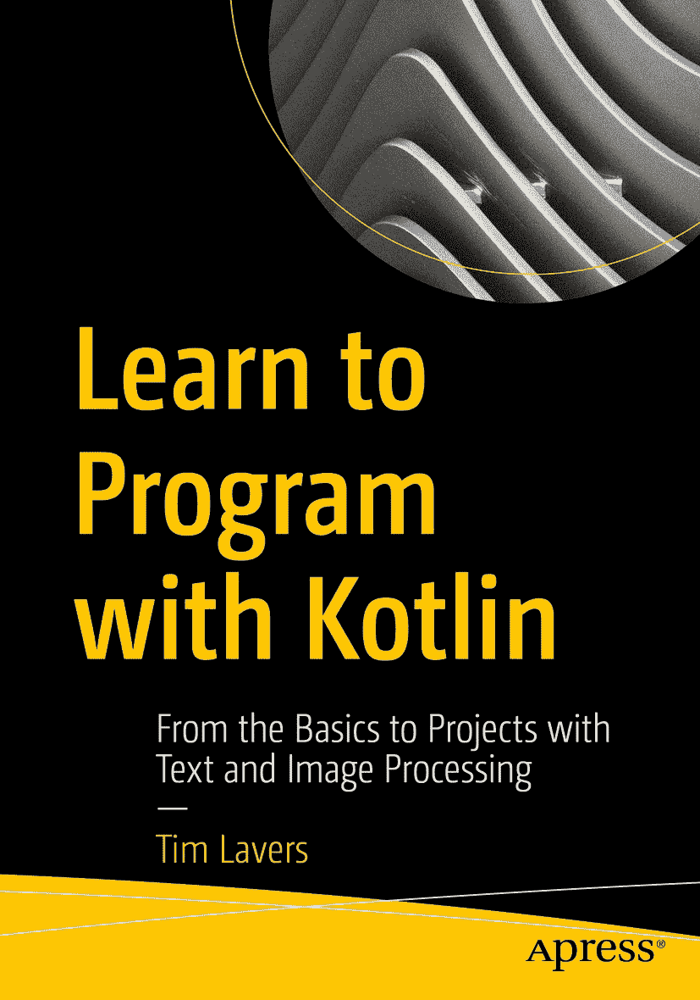

ISBN 978-1-4842-6814-8e-ISBN 978-1-4842-6815-5 [`doi.org/10.1007/978-1-4842-6815-5`](https://doi.org/10.1007/978-1-4842-6815-5) © Tim Lavers 2021 本作品受版权保护。所有权利均由出版商独家许可，涉及材料的全部或部分内容，特别是翻译、重印、重用插图、朗诵、广播、以缩微胶片或任何其他物理方式复制、传输或信息存储与检索、电子改编、计算机软件，或使用目前已知或未来开发的类似或不同方法。本出版物中使用的一般描述性名称、注册商标、商标、服务标志等，即使没有明确声明，也不意味着这些名称免于相关保护法律和法规的约束，因此可供一般使用。出版商、作者和编辑假定本书中的建议和信息在出版之日是真实准确的。出版商、作者或编辑均不对本文所含材料或可能存在的任何错误或遗漏提供明示或暗示的保证。出版商对已出版地图中的管辖权主张和机构归属保持中立。

本 Apress 印记由注册公司 APress Media, LLC（Springer Nature 的一部分）出版。

注册公司地址为：1 New York Plaza, New York, NY 10004, U.S.A.

前言

本书适合任何想学习计算机编程的人。

无论您是绝对的初学者，还是对 JavaScript、R、Python 或其他编程语言有经验，本书都是您清晰理解软件工程专业人士使用的重要基础概念，并获得在有趣且实际的项目中实现这些概念的技能的途径。

我在 25 岁左右开始学习编程，那是 25 年多以前，此后一直担任软件工程师。基于这一经验，我认为学习编码的最佳方式就是大量实践。

本书为您提供了获得这种必要练习的机会。同时，您将处理诸如文本分析、图像处理和计算机视觉等引人入胜的程序。这些程序通过一系列小步骤逐步推进，由您（读者）来实现。每一步都是对现有程序的简单修改，这样您就不会超出自己的舒适区，学习成为一种乐趣。每一步都提供了完整的解决方案。

本书分为四个部分，如下所示：在第一部分中，您将设置所需的工具，运行第一个程序，然后学习足够的语法，以便开始处理项目。第二部分专注于文本分析和文字游戏的软件。这引入了面向对象编程和单元测试的概念，这是现代软件工程的两大基石。第三部分涉及图像处理，并以一个 CGI（计算机生成图像）程序结束。通过完成这个项目，您将学习函数式编程，这是现代计算机语言的一个极其重要的特性。最后，在第四部分中，您将通过开发一个读取速度标志的计算机视觉系统来巩固您的技能。

在整本书中，您将使用与全球专业软件工程师相同的语言和工具。Kotlin 语言非常现代，其语法比当今使用的几乎所有其他语言都更简单。Kotlin 不仅是一种优美而强大的语言，而且广泛应用于各种场景，从极其复杂的商业软件到网络编程、数据科学，再到 Android 应用。您在这里学到的技能将适用于这些领域中的任何一个。

Kotlin 程序使用一个编辑器编写，该编辑器能高亮显示错误，并在大多数情况下提供真正有用的修正。通过使用专业级工具，您应该会感到兴奋，因为您正在处理的程序达到了行业标准。如果您遇到困难，庞大而活跃的 Kotlin 用户社区可以帮助您。

当您完成本书中的项目并转向自己的程序时，您将拥有成功所需的所有技能，并对我在 25 年专业软件工程生涯中使用过的最佳编程语言之一有实用的知识。祝编程愉快！

> 2021 年 1 月

> *蒂姆·拉弗斯*

关于作者 关于技术审校

