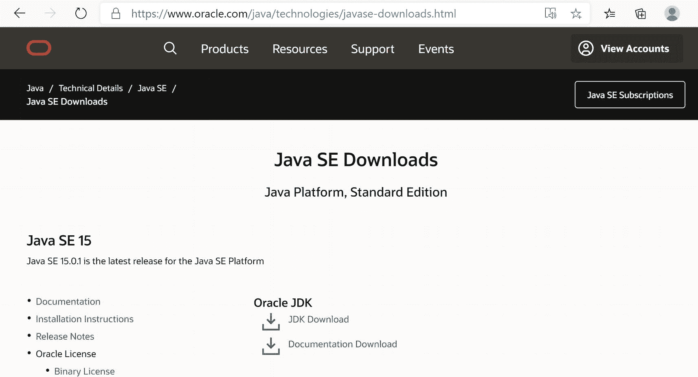
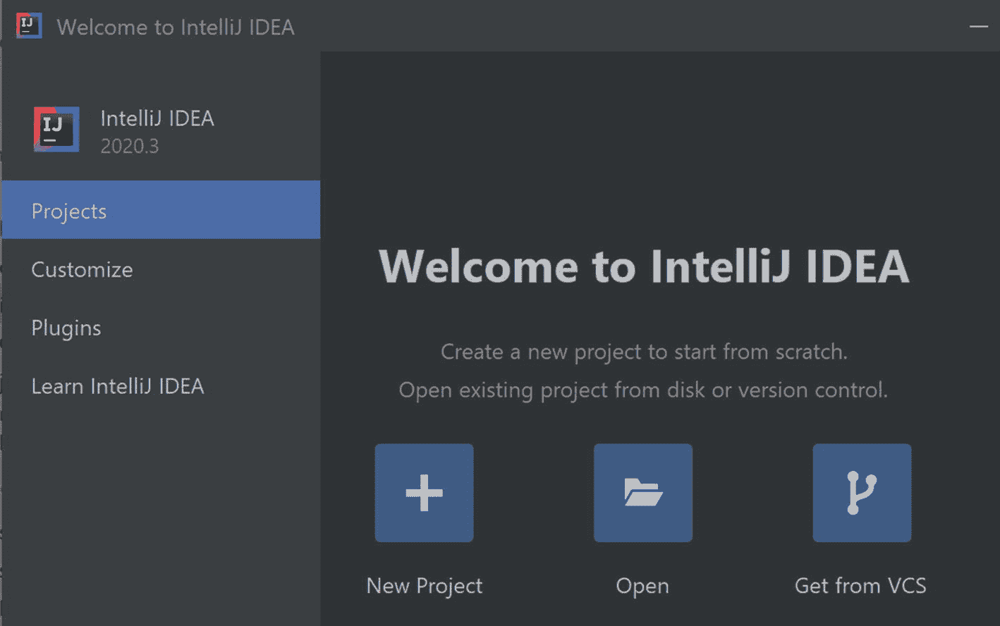
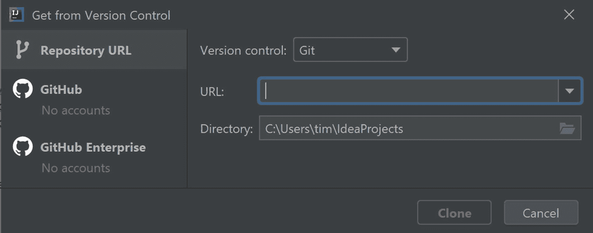
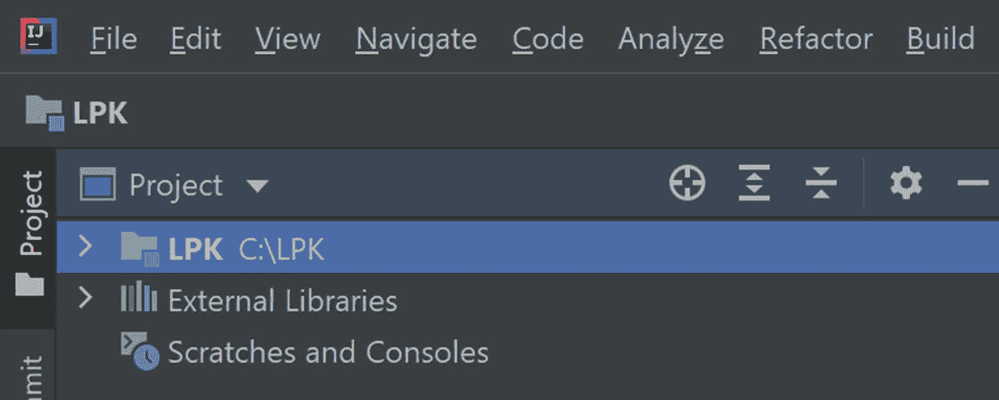
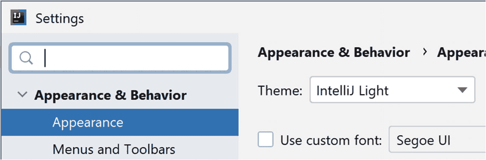
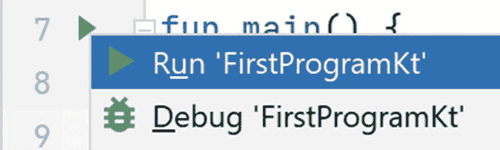
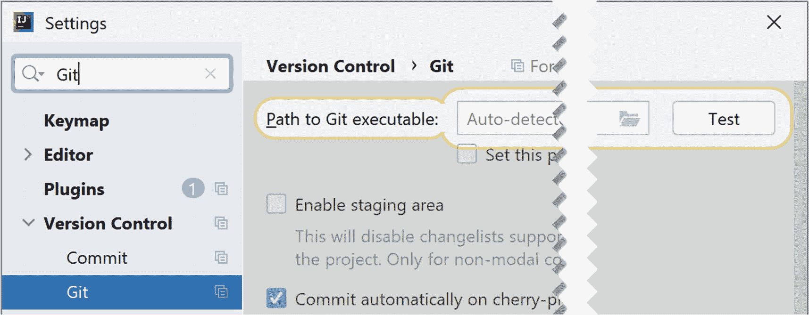
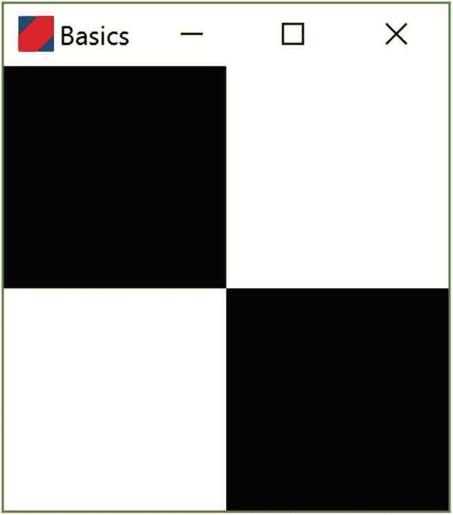

# 1. 入门

在本章中，我们设置编程环境并运行第一个程序。

## 1.1 什么是编程？

计算机程序是一组指令，告诉计算机执行诸如显示图像或打印文本之类的操作。

这些指令使用特殊的单词和符号集编写，称为编程语言。在本书中，我们将使用一种名为 Kotlin 的语言。Kotlin 相当新，与另一种名为 Java 的语言密切相关，Java 在全球工业界和大学中非常流行。虽然 Java 是一种优秀的语言，但它已有 20 多年的历史，这在计算领域算是古老的。此外，自 Java 首次开发以来，编程领域有了许多改进，Kotlin 利用了这些改进。这些改进意味着 Kotlin 程序通常比其 Java 等效程序更简单，并且许多错误来源被直接避免。

与人类不同，计算机不理解模糊的指令，也无法超越我们容易犯的简单打字错误。这可能会使编程变得非常令人沮丧，因为即使是微小的错误，比如缺少逗号，也可能使一个原本完美的程序无法运行。为了避免这些问题，一些入门编程书籍使用非常简单的语言，甚至使用乐高风格的视觉编程工具，在这些工具中不可能出现语法错误。

我们决定在本书中坚持使用 Kotlin，因为通过学习它，您将掌握一种语言技能，这种语言是成千上万其他程序员的首选，并且可用于编程多种不同类型的设备，例如个人电脑（显然）、Android 设备、微型计算机等。此外，还可以找到大量解决特定问题的代码示例。

为了处理全功能语言复杂性带来的问题，我们将通过使用代码编辑器修改现有程序来工作，该编辑器会高亮显示错误并提供合理的修正。

## 1.2 安装 Java

如前所述，Kotlin 与一种较老的语言 Java 有关。实际上，为了编写和运行 Kotlin 程序，我们需要安装 Java 的编程工具。这些工具被打包为所谓的*Java 开发工具包*或*Java 平台*，或*JDK*，可从 Oracle 网站免费下载，网址为[`www.oracle.com/java/technologies/javase-downloads.html`](https://www.oracle.com/java/technologies/javase-downloads.html)。在此页面上，如图 1-1 所示，点击“JDK Download”链接。这将带您进入一个为各种操作系统提供下载链接的页面。选择适合您系统的版本，下载并安装该软件。



图 1-1

Java 下载网站。点击“JDK Download”链接


## 1.3 安装 Git

Git 是一个用于在程序员之间共享源代码的程序。本书中的所有代码都可以通过 Git 获取。这非常方便，但缺点是我们需要额外安装一个软件。首先，请访问 [`https://git-scm.com/`](https://git-scm.com/)。在此网站上下载适用于您操作系统的版本。运行安装程序的过程相当漫长，因为会有许多屏幕显示不同的设置选项。只需在每个屏幕上接受默认选项即可。

## 1.4 安装 IntelliJ

一个好的代码编辑器对于避免和纠正程序中的错误非常有帮助。IntelliJ 是 Kotlin 的最佳代码编辑器，深受专业程序员的欢迎。我们将使用该工具的“社区版”，该版本对非商业用途免费。IntelliJ 可以从 JetBrains 网站 [`www.jetbrains.com/idea/`](https://www.jetbrains.com/idea/) 下载，安装过程简单且文档齐全。

## 1.5 我们的第一个程序

我们的第一个程序可以从一个 Git 仓库获取，该仓库可以用 IntelliJ 打开。用于打开 Git 仓库的 IntelliJ 工具可以从图 1-2 所示的“欢迎使用 IntelliJ IDEA”屏幕中找到。



图 1-2

IntelliJ 欢迎屏幕

要获取第一个程序：



图 1-3

用于获取 Git 仓库的 IntelliJ 对话框

1.  点击 **从版本控制获取** 按钮。

2.  等待图 1-3 所示的“从版本控制获取”对话框出现。

3.  将此地址 [`https://github.com/Apress/learn-to-program-w-kotlin-basics.git`](https://github.com/Apress/learn-to-program-w-kotlin-basics.git) 复制到 **URL** 字段中。

4.  创建一个新目录（在 Windows 中也称为“文件夹”），并将该路径复制到 **目录** 字段中。

5.  点击 **克隆** 按钮。

一段时间后（取决于您的网络连接和计算机速度），IntelliJ 将显示下载好的项目，如图 1-4 所示。在右下角，可能会弹出一个窗口（此处未显示），询问是否将文件添加到 Git。只需点击 **不再询问** 选项。



图 1-4

IntelliJ 中的项目。IntelliJ 用户界面的这一部分称为项目树。它包含我们程序的源文件

此屏幕的左上角是所谓的项目树。稍后我们将使用它来定位并运行我们的第一个程序。可以通过同时按下 `Alt` 和 `1` 键来显示或隐藏项目树。如果由于某种原因项目树没有显示，请使用此组合键将其显示出来。如果这不起作用，请使用菜单 `窗口` ➤ `恢复默认布局` 来恢复正常。

## 1.6 更改 IntelliJ 的外观

与许多程序一样，IntelliJ 的外观是可配置的。这是通过选择视觉“主题”来完成的。默认主题使用前面截图中可以看到的深色——实际上，这个主题叫做“Darcula”。要更改主题，请使用菜单 `文件` ➤ `设置` 来显示设置对话框。然后在设置屏幕左侧的树中选择 **外观**。**主题** 下拉菜单中有许多内置主题，您可以选择一个喜欢的，如图 1-5 所示。为了生成更清晰的截图，从现在开始我将使用“IntelliJ Light”主题，如图所示。



图 1-5

设置视觉主题

## 1.7 故障排除

如果在安装 Git 之前安装了 IntelliJ，您可能会收到一条错误消息，提示找不到 Git 可执行文件的路径。通常可以通过在 IntelliJ 中设置路径来解决此问题。为此，请选择 `文件` ➤ `设置`，然后在 `版本控制` 标题下选择 `Git`，如图 1-6 所示。可以使用右上角的 **测试** 按钮来检查 IntelliJ 是否知道 Git 的安装位置。如果此测试失败，您可能需要通过更改 **Git 可执行文件路径** 的值来调整 IntelliJ 中的设置。



图 1-7

通过点击绿色三角形来运行程序



图 1-6

在 IntelliJ 中配置 Git

## 1.8 运行我们的第一个程序

通过点击项目树中的文件夹图标（它们看起来像 > 符号），您应该能够导航到 `FirstProgram.kt` 文件。双击该文件以在主编辑窗格中打开它。要运行程序，请点击程序文本第 7 行的绿色小三角形。将出现一个弹出窗口，其中包含选项 **运行 'FirstProgramKt'**。选择此选项。

大约半分钟的后台活动后，您应该会看到一个带有黑白方块图案的应用程序窗口。恭喜！您已经成功运行了第一个程序！如果您点击右上角的小叉号，显示窗口将关闭，程序将终止。



图 1-8

我们的第一个程序显示了一个简单的黑白瓷砖图案


## 1.9 我们程序的源代码

作为本章的收尾，让我们快速浏览一下程序的代码，以便更熟悉 Kotlin 代码的样貌。这里的目标仅仅是理解程序的大致轮廓，细节将在后续章节中展开。

```
1   package lpk.basics

3   import javax.swing.ImageIcon
4   import javax.swing.JFrame
5   import javax.swing.SwingUtilities

7   fun main() {
8       SwingUtilities.invokeLater { FirstProgram().doLaunch() }
9   }
10   class FirstProgram {

12       fun tileColors() : Array> {
13           return arrayOf(
14                   arrayOf(0, 255),
15                   arrayOf(255, 0)
16           )
17       }

19       fun doLaunch() {
20           val frame = JFrame("Basics")
21           frame.defaultCloseOperation = JFrame.EXIT_ON_CLOSE
22           frame.iconImage = ImageIcon("./src/lpk/basics/icon.png").image
23           frame.add(TilePanel(tileColors()))
24           frame.pack()
25           frame.isVisible = true
26       }
27   }
```

请注意，某些 `import` 语句（第 3 至 5 行）可能不会直接显示。相反，它们可能显示为一个可折叠的代码块，点击 + 号即可展开。


图 1-9

`import` 语句可能隐藏在一个可折叠的代码块中

即使是这个简短的程序，也包含了许多对于初次接触编程的人来说完全无法理解的细节。别担心！你不需要立刻理解所有内容。程序的主要部分可以通过以下几点来理解：

1.  第一行告诉系统我们的程序属于哪个 `package`。程序的完整名称包含其包名，就像街道名称加上其他详细信息构成唯一的邮政地址一样。

2.  `import` 语句让系统知道我们的代码中需要哪些其他程序。所有执行稍微复杂操作（例如显示用户界面）的软件，都会使用预构建的组件。`import` 语句用于将这些组件提供给我们的代码使用。

3.  包含 `tileColors()` 的代码块设置了一个颜色值网格。我们将在接下来的几章中详细研究它。

4.  第 19 至 26 行告诉系统如何将颜色块转换为可以在屏幕上绘制的用户界面元素。

5.  第 7 行名为 `main` 的函数是系统启动程序的入口点。

在下一章中，我们将开始修改这段代码以生成新的图案。

