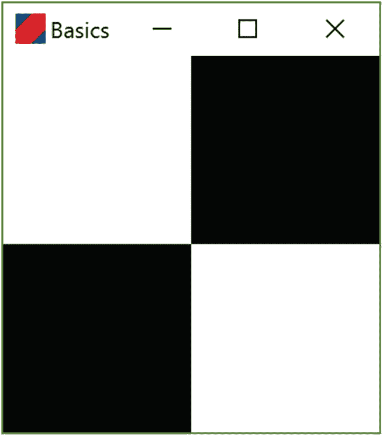
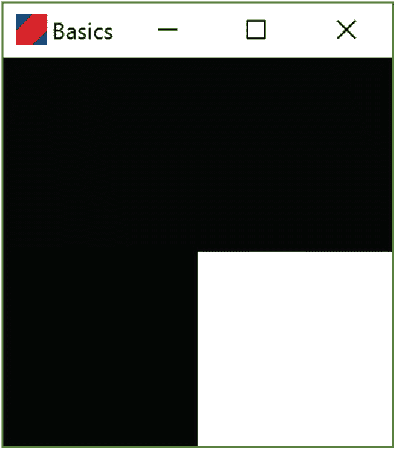
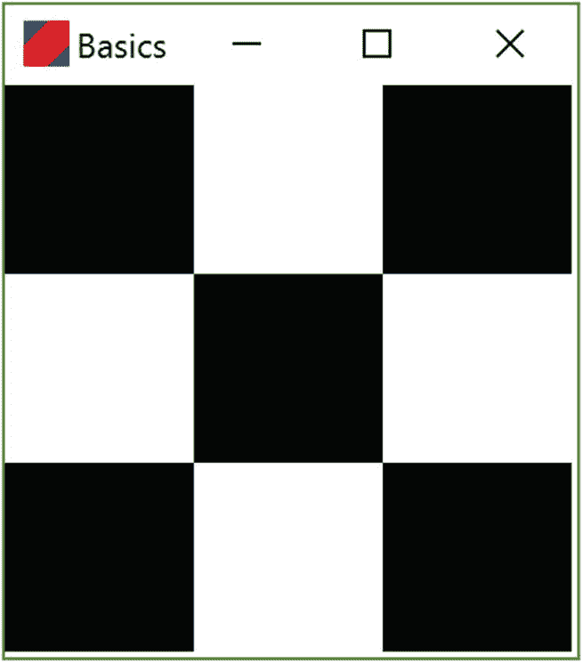
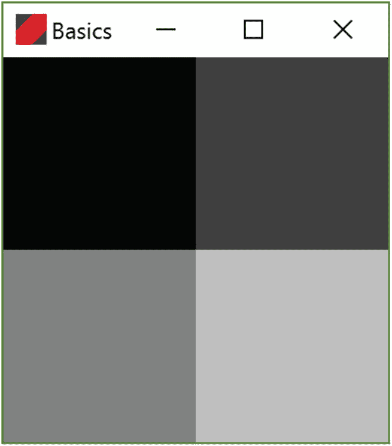

# 2. 简单图案

在本章中，我们将了解如何在 Kotlin 中表示黑色、白色以及其他灰度。这将使我们能够修改上一章的程序，以显示不同的方块图案。在进行这些修改的过程中，我们将熟悉 Kotlin 的基本语法和编程环境。

## 2.1 灰度

软件工程是关于使用简单的数学结构（如数字）来对现实世界的各个方面（如颜色、形状、声音等）进行建模。目前，我们处理的是灰度，在计算机程序中表示灰度有很多种方法，例如：

1.  为特定的灰度命名，例如 `black`、`white`、`light gray`、`dark gray` 等。

2.  用 `0` 表示黑色，`1` 表示白色，介于两者之间的数值表示中间灰度。

3.  用 `0` 表示黑色，`255` 表示白色，介于两者之间的每个整数表示一种中间灰度。

如果程序中只使用少数几种灰度，第一种方法是不错的。实际上，编写网页时也采用了类似的方法。第二种方法在许多应用中使用，但可能会令人困惑，因为 `0` 和 `1` 之间有无限多个数字，而计算机屏幕上只能显示有限的一组灰度，因此不同的小数最终可能会产生相同的灰度。第三种方法允许 256 种不同的灰度，这大概与大多数人能分辨的灰度数量相当，每个数字代表一种不同的灰度，并且有一种相当简单的方法来估算某个数值对应的灰度。这就是我们在程序中使用的模型。

我们程序中设置要显示的方块颜色的部分如下：

```
1   fun tileColors() : Array> {
2       return arrayOf(
3               arrayOf(0, 255),
4               arrayOf(255, 0)
5       )
6   }
```

这段代码是所谓*函数*的一个例子，函数是完成一项任务的代码块，可以从程序中的一个或多个位置调用。让我们详细看看这个函数。

1.  关键字 `fun` 标识这是一个函数。

2.  `tileColors` 是函数的名称。当我们想使用它时，就通过这个名称来调用它。

3.  空括号 `()` 标志着函数名称的结束，并意味着该函数没有输入。函数的输入通常被称为*参数*（在讨论函数定义时）或*实参*（在讨论实际调用函数时）。

4.  复杂的部分 `Array<Array<Int>>` 描述了函数的输出。这个特定的函数产生了一个所谓的 `Array`。数组就是一个事物的列表。我们的函数产生了一个数组，其中的对象本身也是数组，而这些内部数组保存的是表示颜色的整数。因此，该函数返回一个由 `Int` 类型的 `Array` 组成的 `Array`。尖括号是这些数组中可以包含什么内容的精确规范的一部分。我们将在后面的章节中详细讨论它们。

5.  左花括号 `{` 是函数体的开始，函数体是实现函数逻辑的一组指令。

6.  单词 `return` 定义了函数的输出或结果是什么。

7.  第 2 行的单词 `arrayOf` 是对另一个名为 `arrayOf` 的函数的调用，该函数根据传入的内容生成一个数组。

8.  第 2 行末尾的左括号 `(` 是我们传递给 `arrayOf` 函数的参数列表的开始。这个左括号与第 5 行的右括号匹配。

9.  在第 3 行和第 4 行，我们正在设置第 2 行对 `arrayOf` 函数调用的参数。我们传入了两个参数，一个来自第 3 行，一个来自第 4 行。第 3 行末尾的逗号将它们分隔开。

10. 第 3 行创建了一个包含两个 `Int` 的 `Array`。这是通过调用 `arrayOf` 函数完成的。此调用中的参数是 `0` 和 `255`。

11. 第 4 行创建了一个数组，其第一个位置是 `255`，第二个位置是 `0`。

12. 第 6 行的右花括号 `}` 结束了这个函数。

这里有很多细节。不要让它们压垮你！通过编写代码（并犯错误），你会逐渐熟悉这种语法。现在，让我们对这个程序做一些修改。


## 2.2 修改图案

现在轮到你来编写代码了！通过修改上一节代码块中第 3 行和第 4 行的数字，你可以改变第 1 章的程序，从而生成不同的瓷砖图案。

如果出现错误，你可以使用菜单序列 `Edit` ➤ `Undo Typing` 恢复到之前可运行的程序版本。你也可以使用组合键 `Ctrl + z` 来撤销更改。

提示

这些挑战的解决方案在本章末尾。

编程挑战 2.1

修改程序，使其生成如下图案：



编程挑战 2.2

修改程序，使其生成：



编程挑战 2.3

修改程序，使其生成如下 3×3 图案：



编程挑战 2.4

如果我们将 `getTileColors` 函数修改为：

```
fun tileColors() : Array> {
return arrayOf(
arrayOf(0, 64),
arrayOf(128, 192)
)
}
```

我们会得到如下图案：



再次修改代码，使其生成：


## 2.3 挑战题解答

对于每个挑战，我们只需要修改 `getTileColors` 函数的实现。具体修改如下。

解答 2.1

左上角和右下角的瓷砖需要设置为 `255` 色度，而其他瓷砖为黑色，因此值为 `0`：

```
fun tileColors() : Array> {
return arrayOf(
arrayOf(255, 0),
arrayOf(0, 255)
)
}
```

解答 2.2

在这个图案中，唯一的白色瓷砖位于右下角。这对应于第二个数组中的第二个元素：

```
fun tileColors() : Array> {
return arrayOf(
arrayOf(0, 0),
arrayOf(0, 255)
)
}
```

解答 2.3

这个图案有三行三列，因此我们需要三个数组，每个数组包含三个元素：

```
fun tileColors() : Array> {
return arrayOf(
arrayOf(0, 255, 0),
arrayOf(255, 0, 255),
arrayOf(0, 255, 0)
)
}
```

解答 2.4

在以下代码中，我们使用 `192` 表示最亮的瓷砖，然后使用 `128` 和 `64` 表示深灰色瓷砖。使用略有不同的值也会生成与所示图案相似的图案。

```
fun tileColors() : Array> {
return arrayOf(
arrayOf(0, 64),
arrayOf(128, 192)
)
}
```

