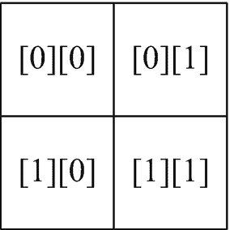
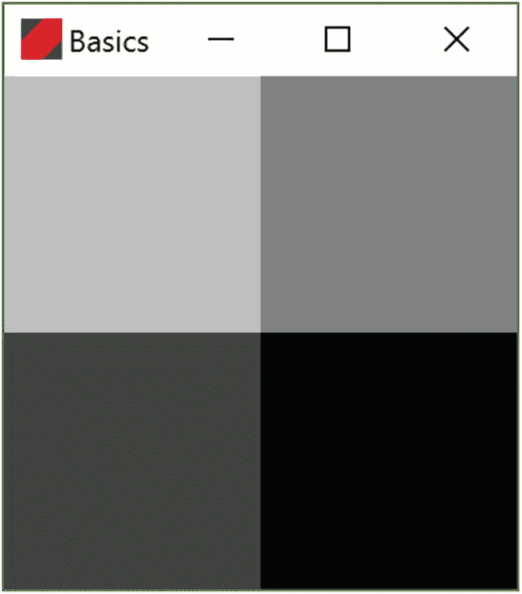
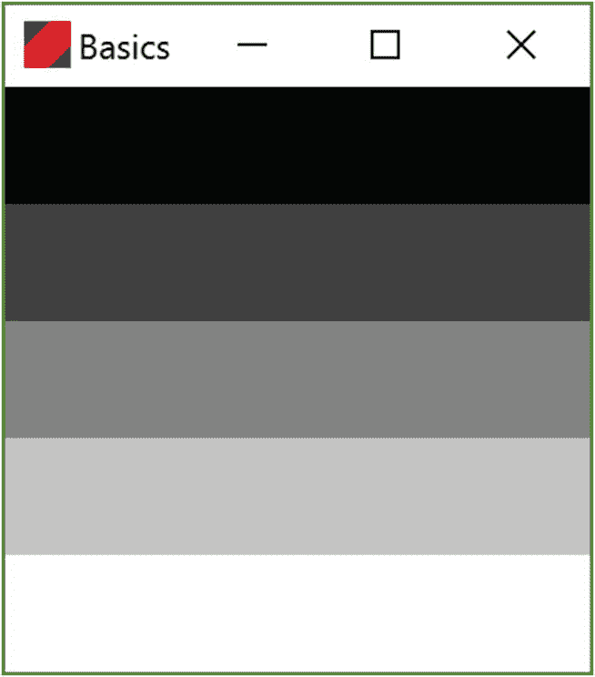
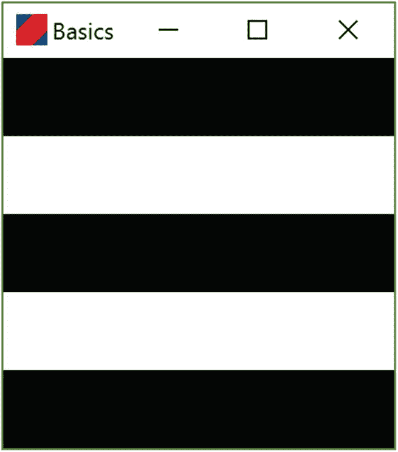
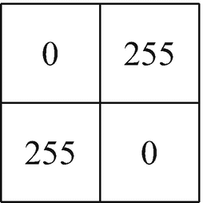
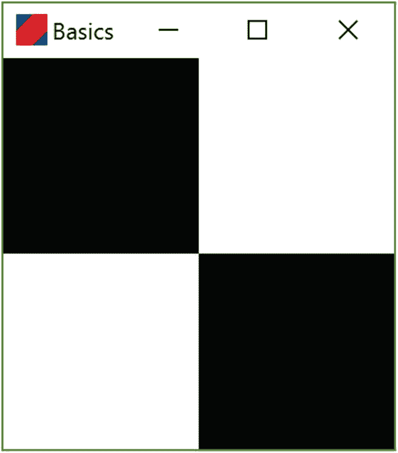
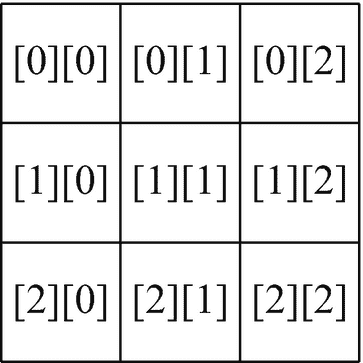
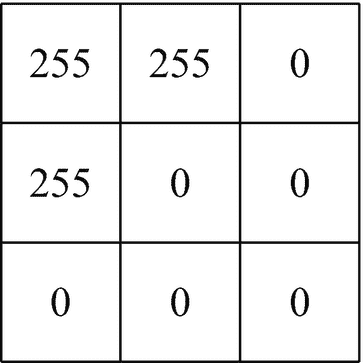
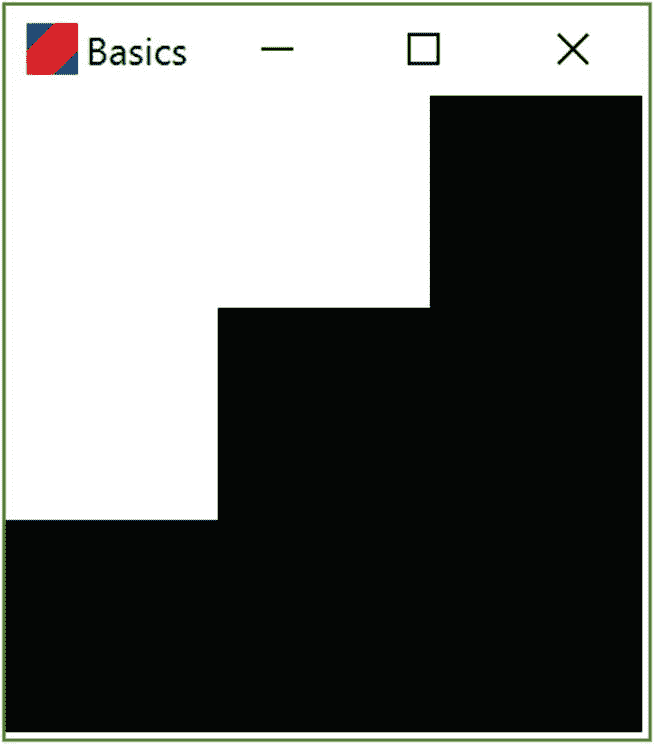

# 3. 数组与循环

在上一章中，我们编写了一个程序，该程序构建了与方形数组元素对应的黑白瓷砖图案。在本章中，我们将介绍一种强大的语法，它允许我们用更简短的程序构建更大的图案。

## 3.1 数组索引

回顾第 2 章，数组是一个值的列表。数组的数组实际上就是一个网格，我们之前的程序都使用它来表示黑白瓷砖的矩形图案。在这些程序中，我们使用了库函数 `arrayOf` 来创建数组。然而，我们也可以从头开始创建数组，例如：

```
1   fun tileColors(): Array> {
2       val shades = Array(2) {
3           Array(2) { 0 }
4       }
5       shades[0][0] = 192
6       shades[0][1] = 128
7       shades[1][0] = 64
8       shades[1][1] = 0
9       return shades
10   }
```

这个版本的 `tileColors` 工作原理如下。在第 2 到第 4 行，我们设置了一个数组的数组，包含两行，每行有两列，每个值都为 `0`。暂时不必过于担心其中的细节；我们稍后会再讨论。现在值得关注的是接下来的四行。在这些行中，我们使用行和列索引来引用数组中的值，就像查看地图网格一样。然后使用等号设置这些值，等号的含义是“被设置为”，例如：

```
shades[1][0] = 64
```

意思是“位于第 1 行第 0 列的数组值被设置为 64。”

在这个网格系统中，我们从上到下操作，第一行的索引为 `0`。在每一行内，我们从左到右操作，第一列的索引为 `0`。图 3-1 展示了数组索引与瓷砖阵列中方格的对应关系。



图 3-1

数组的行索引和列索引

参照前面的代码清单，左上角的方格，其网格坐标为 `[0][0]`，被赋予值 `192`。右上角的方格，其网格坐标为 `[0][1]`，被赋予值 `128`。左下角的方格坐标为 `[1][0]`，被赋予值 `64`。最后，右下角的方格坐标为 `[1][1]`，被赋予值 `0`。请记住，数值越高，灰色越浅，因此左上角是浅灰色，而右下角是黑色。实际上，如果我们运行这段代码，会得到如图 3-2 所示的图案。



图 3-2

由我们第一个代码清单生成的图案

这种构建数组的方法比我们在第 2 章中习惯的方法更繁琐，但它将允许我们使用循环和其他结构来构建更有趣的图案。在继续之前，让我们先练习一下数组表示法。

编程挑战 3.1

考虑以下版本的 `tileColors`：

```
fun tileColors(): Array> {
val shades = Array(2) {
Array(2) { 0 }
}
shades[0][0] = 0
shades[0][1] = 255
shades[1][0] = 255
shades[1][1] = 0
return shades
}
```

请手动绘制一个两行两列的方格网格。在每个单元格中，写入分配的值。然后根据这些值对单元格进行着色。最后，运行程序，并将你手绘的图片与程序显示的结果进行对比。

提示

为了节省纸质版书籍读者的大量输入工作，本章的代码片段可在项目树中的 `chapter3_code_to_copy.txt` 文件中找到。

编程挑战 3.2

现在考虑另一个不同版本的 `tileColors`：

```
fun tileColors(): Array> {
val shades = Array(3) {
Array(3) { 0 }
}
shades[0][0] = 255
shades[0][1] = 255
shades[0][2] = 0
shades[1][0] = 255
shades[1][1] = 0
shades[1][2] = 0
shades[2][0] = 0
shades[2][1] = 0
shades[2][2] = 0
return shades
}
```

将会有多少行和多少列瓷砖？绘制一个网格并写出网格坐标。哪些方格是黑色的，哪些是白色的？运行程序来检查你的答案。


## 3.2 循环

假设我们想要生成一个如图 3-3 所示的平铺图案。面对如此多的单元格，在 `getTileColors` 函数中逐个设置每个单元格的颜色会非常繁琐。然而，我们可以利用每一行内所有单元格颜色相同这一事实，来自动化设置行内颜色的过程。为此，我们需要使用一种称为 `for` 循环的编程结构。



图 3-3

我们将使用 `for` 循环来生成此图案

生成图案的第一步是初始化一个数组，我们将其命名为 `shades`，包含五行五列：

```
val shades = Array(5) {
Array(5) { 0 }
}
```

创建数组后，我们可以使用 `for` 循环设置第一行的颜色：

```
//将第 0 行的每个单元格设置为黑色
for (col in 0..4) {
shades[0][col] = 0
}
```

我们使用的 `for` 循环结构如下：

```
for (COUNTER in RANGE) {
循环体：可能使用计数器的代码
}
```

在我们前面的 `for` 循环中，计数器名为 `col`。它代表列索引，因此取值范围为 `0` 到 `4`。在 Kotlin 中，连续数字的列表由所谓的*区间*表示。在 Kotlin 中定义区间有多种方式。这里我们使用了表达式 `0..4`。（实际上，Kotlin 中的区间也可以是非连续的数字，但我们不需要用到那些。）循环体仅设置对应列的单元格颜色：

```
shades[0][col] = 0
```

请注意，该行中的每个单元格都获得相同的值 `0`。

为了生成完整的图案，我们对每一行使用类似的循环，但使用逐渐变浅的灰色阴影：

```
fun tileColors(): Array<Array<Int>> {
val shades = Array(5) {
Array(5) { 0 }
}
//将第 0 行的每个单元格设置为黑色
for (col in 0..4) {
shades[0][col] = 0
}
//第 1 行为深灰色。
for (col in 0..4) {
shades[1][col] = 65
}
//第 2 行为灰色。
for (col in 0..4) {
shades[2][col] = 130
}
//第 3 行为浅灰色。
for (col in 0..4) {
shades[3][col] = 195
}
//第 4 行为白色。
for (col in 0..4) {
shades[4][col] = 255
}
return shades
}
```

将上述代码复制到你的程序中并运行，以验证它是否生成了之前展示的图案。

编程挑战 3.3

修改上述代码，使其生成如下黑白条纹图案：



## 3.3 嵌套循环

我们已经看到，`for` 循环可以轻松地将一行中的所有单元格设置为相同颜色。假设我们想要将图案中*所有*的瓦片都设置为相同颜色。为此，我们可以编写一系列几乎相同的循环，每行一个。更好的方法是循环遍历行，并在循环体内再嵌套一个循环来设置行内的值。这种在一个循环内部嵌套另一个循环的模式在编程中非常常见，被称为*嵌套循环*。以下是一个将每个单元格设置为白色的嵌套循环：

```
fun tileColors(): Array<Array<Int>> {
val shades = Array(5) {
Array(5) { 0 }
}
for (row in 0..4) {
for (col in 0..4) {
shades[row][col] = 255
}
}
return shades
}
```

编程挑战 3.4

运行上述代码。然后修改它，使其生成一个每个瓦片都是灰色（值为 `128`）的图案。

## 3.4 总结与挑战题解答

在本章中，我们了解了数组索引如何像地图参考一样，允许我们设置和读取特定值。我们还学习了 `for` 循环，它提供了一种便捷的语法来批量设置数组值。在下一章中，我们将看到如何构建嵌套循环，以依赖于行和列值的方式设置数组值，从而生成更有趣的图案。

解答 3.1

值的网格为：



这将生成一个图案，其左上角和右下角为黑色瓦片，对应值为 `0`：



解答 3.2

有三行三列。网格引用为：



网格单元格的值为：



对应的图像为：



解答 3.3

代码形式与文本中的示例相同，区别在于我们将一行中的所有单元格都赋值为 `0` 或 `255`：

```
fun tileColors(): Array<Array<Int>> {
val shades = Array(5) {
Array<Int>(5) { 0 }
}
//将第 0 行的每个单元格设置为黑色
for (col in 0..4) {
shades[0][col] = 0
}
//第 1 行为白色。
for (col in 0..4) {
shades[1][col] = 255
}
//第 2 行为黑色
for (col in 0..4) {
shades[2][col] = 0
}
//第 3 行为白色。
for (col in 0..4) {
shades[3][col] = 255
}
//第 4 行为黑色。
for (col in 0..4) {
shades[4][col] = 0
}
return shades
}
```

解答 3.4

代码如下：

```
fun tileColors(): Array<Array<Int>> {
val shades = Array(5) {
Array(5) { 0 }
}
for (row in 0..4) {
for (col in 0..4) {
shades[row][col] = 128
}
}
return shades
}
```

