# 4. 二元选择

在上一章中，我们学习了如何使用 `for` 循环遍历数组的元素。这使我们能够自动为瓦片着色，而不是逐个设置颜色。现在，我们将学习如何根据计算结果为 `true` 或 `false` 的表达式在代码中做出选择。结合循环，这将使我们能够用很少的代码行生成复杂的瓦片图案。


## 4.1 If-Else 语句

观察图 4-1 中的图案。共有八行八列，瓷砖要么是黑色，要么是白色。所有白色瓷砖都位于从左上角到右下角的对角线下方。

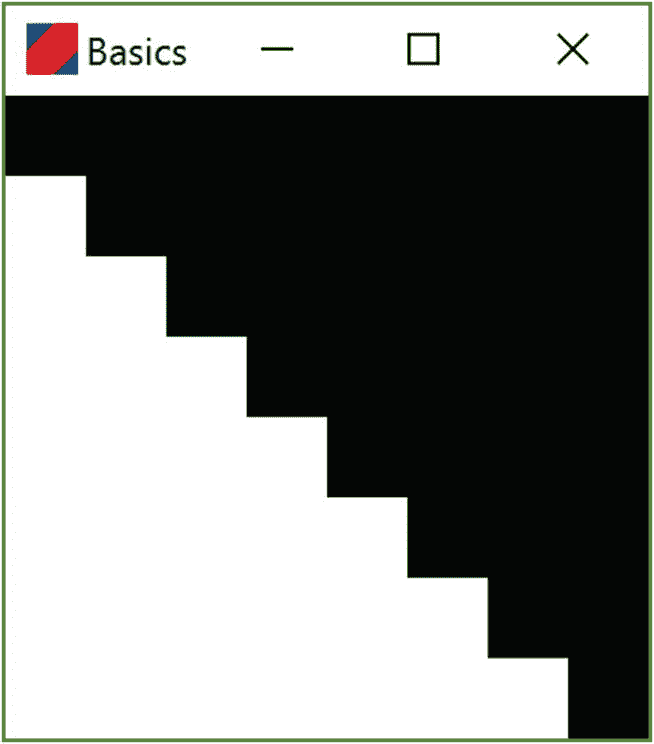

图 4-1

使用 if-else 逻辑生成的图案

对应的 `getTileColors` 代码可能是什么样的？大概是这样的：

```
fun getTileColors() : Array> {
初始化一个 8x8 数组的代码
对于每一行
对于每一列
如果在对角线下方
shades[row][column] = WHITE
否则
shades[row][column] = BLACK
返回数组
}
```

要实现这个算法，我们需要能够判断任意一个单元格是否位于从左上到右下的对角线下方。考虑一个坐标为 `[row][column]` 的单元格。如果 `row` 和 `column` 相等，则该单元格位于对角线上。如果 `column` 大于 `row`，则该单元格位于对角线的右侧和上方。然而，如果 `row` 大于 `column`，则该单元格位于对角线的下方和左侧。你可以通过查看图像中的实际单元格来验证这些说法。例如，单元格 `[5][3]` 在哪里？单元格 `[3][5]` 在哪里？利用这个事实，我们可以将算法重写为：

```
fun getTileColors() : Array> {
初始化一个 8x8 数组的代码
对于每一行
对于每一列
if (row > column) {
shades[row][column] = WHITE
} else {
shades[row][column] = BLACK
}
返回数组
}
```

要将其转换为 Kotlin 代码，我们需要：

1.  实现初始化数组的代码
2.  将 `FOR EACH` 伪代码替换为 `for` 循环
3.  使用正确的白色和黑色值
4.  编写正确的 `return` 语句

结果如下：

```
fun tileColors(): Array> {
val shades = Array(8) {
Array(8) { 0 }
}
for (row in 0..7) {
for (column in 0..7) {
if (row > column) {
shades[row][column] = 255
} else {
shades[row][column] = 0
}
}
}
return shades
}
```

提示

与上一章一样，项目树中有一个文件：`chapter4_code_to_copy.txt`，可以从中复制此代码及其他代码。

编程挑战 4.1

修改程序，使其生成与上述图案相反的图案：

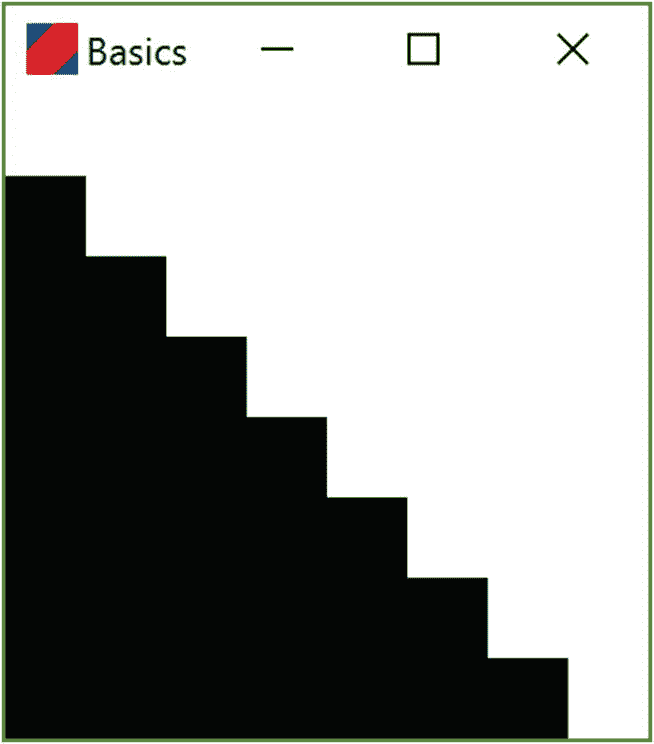

编程挑战 4.2

要检查两个值是否相同，我们使用 `==`（两个等号）运算符。例如，要在 `if` 语句中检查行和列是否具有相同的值，我们会使用 `if (row == column)`。使用此操作，你能修改前面的代码，使其生成在主左上到右下对角线上有黑色瓷砖的图案吗？

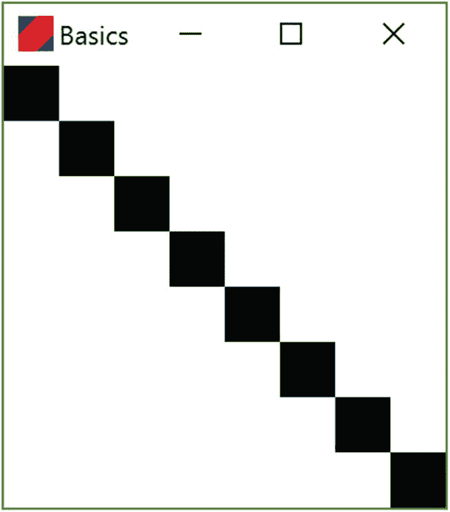

编程挑战 4.3

通过仅根据列索引选择颜色，我们可以生成垂直条纹。看看你是否能生成这个图案：

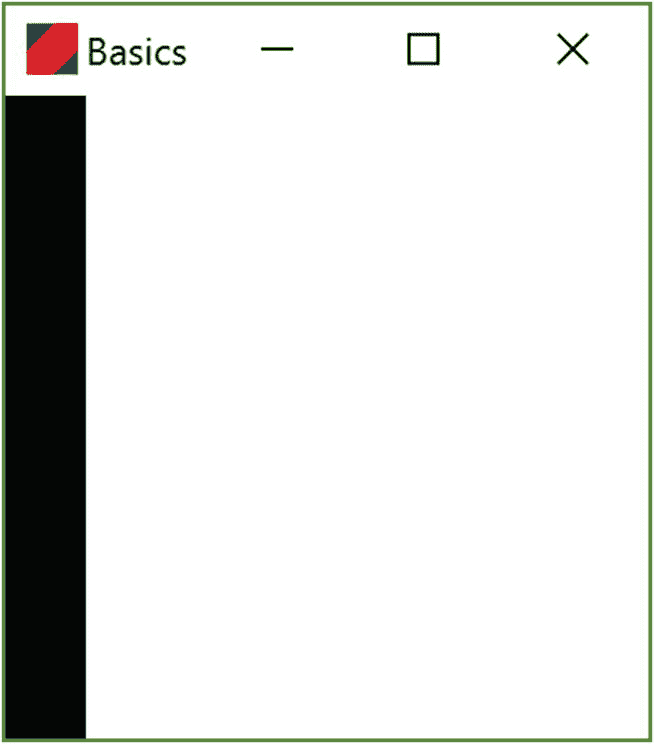

## 4.2 或运算符

假设我们想要生成一个瓷砖图案，其中第 0 列和第 2 列完全由黑色瓷砖填充，如图 4-2 所示。如果我们的 `if` 语句体是这样的，我们就可以生成这个图案：

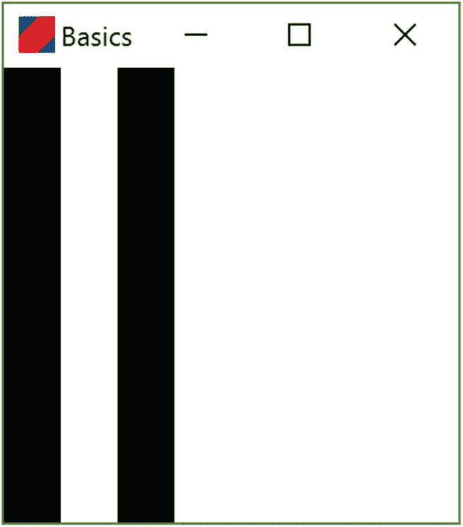

图 4-2

使用 `or` 运算生成的图案

```
if (column == 0 OR column == 2) ....
```

事实上，这是可行的，但 Kotlin 使用两个竖线字符而不是单词 `OR`：

```
if (column == 0 || column == 2) ....
```

以下是生成该图案的 `getTileColors` 版本：

```
fun tileColors(): Array> {
val shades = Array(8) {
Array(8) { 0 }
}
for (row in 0..7) {
for (column in 0..7) {
if (column == 0 || column == 2) {
shades[row][column] = 0
} else {
shades[row][column] = 255
}
}
}
return shades
}
```

编程挑战 4.4

可以在单个语句中使用多个 `||` 运算符：`a || b || c || d` 表示“`a 或 b 或 c 或 d`”。使用此方法修改代码，使其生成此图案：

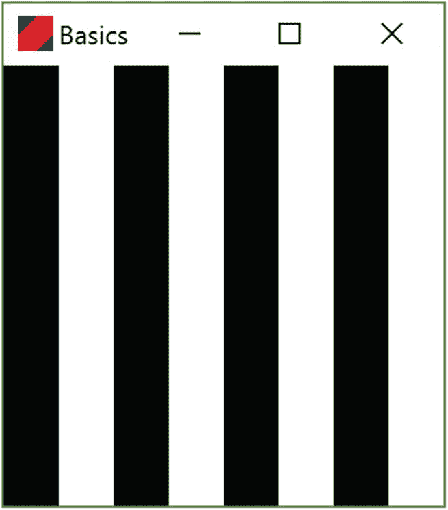

编程挑战 4.5

修改代码，使其生成此图案：

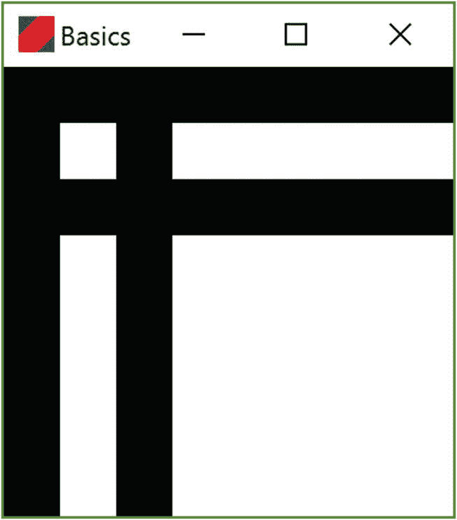

## 4.3 与运算符

假设我们想要生成一个只有一个黑色瓷砖的图案，该瓷砖位于位置 `[1][1]`，如图 4-3 所示。这是 `row == 1` *且* `column == 1` 同时成立的唯一数组位置。要表达两个条件都为真的需求，我们使用 *与* 运算符，它写作两个与符号：`&&`。以下是 `tileColors` 的一个版本，它在 `if` 语句中使用 `&&` 来生成该图案：

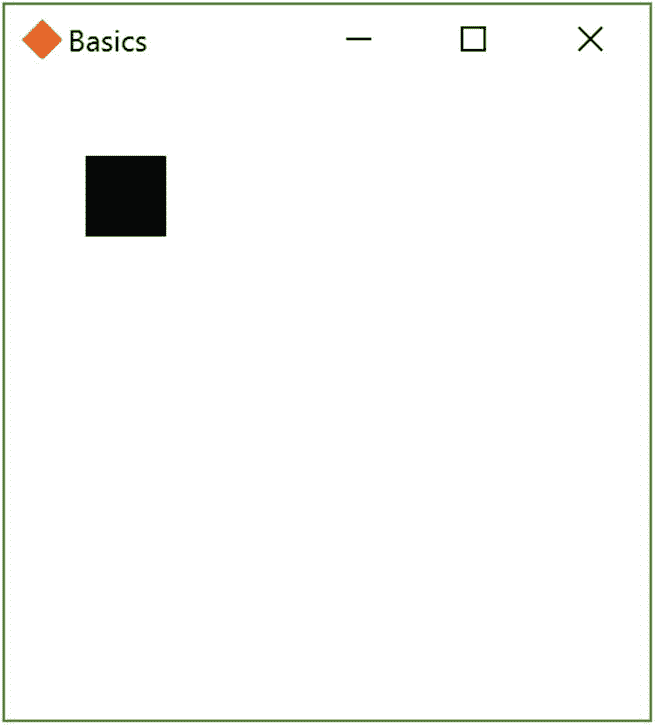

图 4-3

使用 `and` 运算符生成的图案

```
fun tileColors(): Array> {
val shades = Array(8) {
Array(8) { 0 }
}
for (row in 0..7) {
for (column in 0..7) {
if (row == 1 && column == 1) {
shades[row][column] = 0
} else {
shades[row][column] = 255
}
}
}
return shades
}
```

编程挑战 4.6

要测试一个数是否大于另一个数，我们可以使用 `>` 运算符。例如，如果 `row` 是 `3, 4, 5,` …，则 `row > 2` 将返回值 `true`；如果 `row` 是 `0`、`1` 或 `2`，则返回 `false`。对行和列都使用 `>` 运算符会生成此图案：

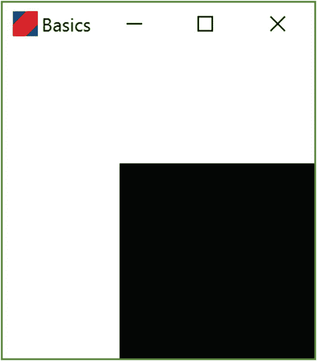

编程挑战 4.7

前面的图案也可以使用 `||` 运算符生成。对于哪些 `row` 值，单元格是白色的？对于哪些 `column` 值？

**注意** 你可能想使用“小于”运算符 `<` 来表达行和列上的条件。

## 4.4 If-Else-If 语句

通过扩展 `if-else` 语法，可以做出更复杂的选择，其中 `else` 部分本身就是一个 `if-else` 语句。例如，假设我们想要生成图 4-4 中的“两点”图案。我们可以使用 `if-else-if` 组合来实现：

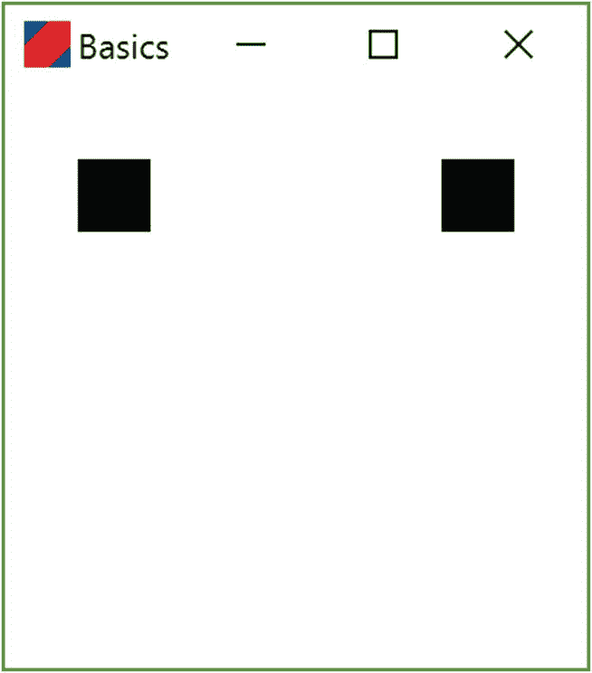

图 4-4

使用 `if-else-if` 逻辑生成的图案

```
fun tileColors(): Array> {
val shades = Array(8) {
Array(8) { 0 }
}
for (row in 0..7) {
for (column in 0..7) {
if (row == 1 && column == 1) {
shades[row][column] = 0
} else if (row == 1 && column == 6) {
shades[row][column] = 0
} else {
shades[row][column] = 255
}
}
}
return shades
}
```

编程挑战 4.8

看看你是否能生成这个图案：

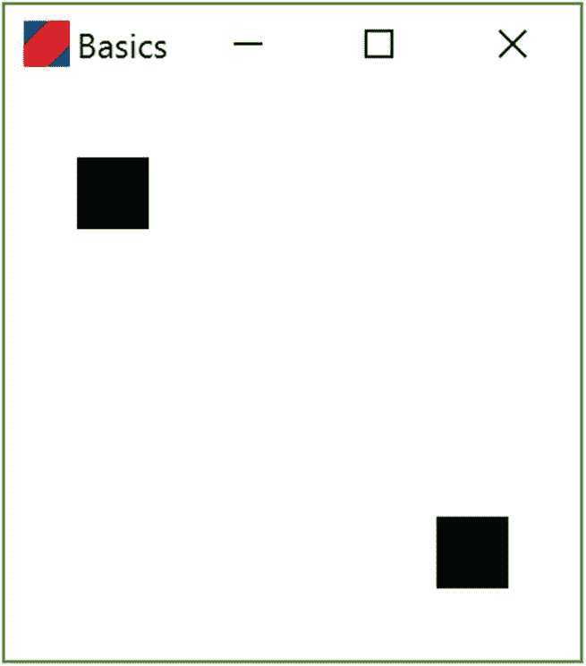

编程挑战 4.9

可以有重复的 `else-if` 块。看看你是否能生成这个图案：

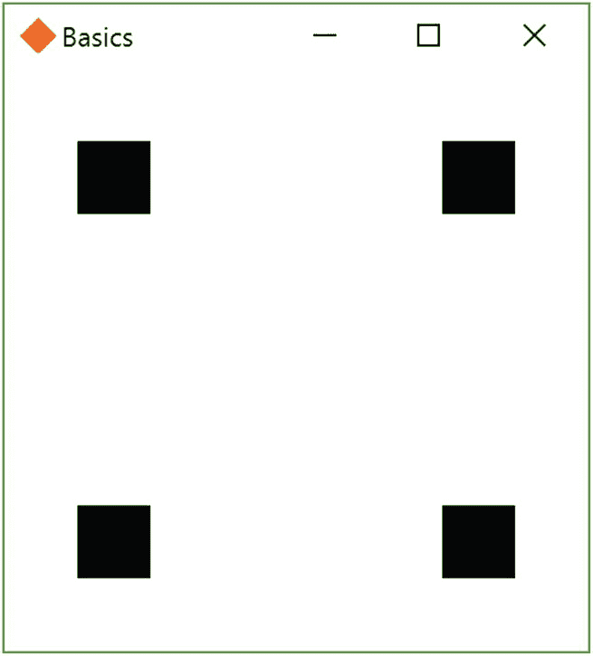


## 4.5 本章小结与编程挑战解答

在本章中，我们学习了如何将逻辑选择表达为代码。我们还学习了如何使用 `&&` 和 `||` 运算符编写复杂的逻辑条件。这些概念是编程中最重要的部分之一，我们几乎会在编写的每一个程序中使用它们。

解答 4.1

```
fun tileColors(): Array<Array<Int>> {
    val shades = Array(8) {
        Array(8) { 0 }
    }
    for (row in 0..7) {
        for (column in 0..7) {
            if (row > column) {
                shades[row][column] = 0
            } else {
                shades[row][column] = 255
            }
        }
    }
    return shades
}
```

解答 4.2

```
fun tileColors(): Array<Array<Int>> {
    val shades = Array(8) {
        Array(8) { 0 }
    }
    for (row in 0..7) {
        for (column in 0..7) {
            if (row == column) {
                shades[row][column] = 0
            } else {
                shades[row][column] = 255
            }
        }
    }
    return shades
}
```

解答 4.3

```
fun tileColors(): Array<Array<Int>> {
    val shades = Array(8) {
        Array(8) { 0 }
    }
    for (row in 0..7) {
        for (column in 0..7) {
            if (column == 0) {
                shades[row][column] = 0
            } else {
                shades[row][column] = 255
            }
        }
    }
    return shades
}
```

解答 4.4

```
fun tileColors(): Array<Array<Int>> {
    val shades = Array(8) {
        Array(8) { 0 }
    }
    for (row in 0..7) {
        for (column in 0..7) {
            if (column == 0 || column == 2 || column == 4 || column == 6) {
                shades[row][column] = 0
            } else {
                shades[row][column] = 255
            }
        }
    }
    return shades
}
```

解答 4.5

```
fun tileColors() : Array<Array<Int>> {
    val shades = Array(8) {
        Array(8) { 0 }
    }
    for (row in 0..7) {
        for (column in 0..7) {
            if (column == 0 || column == 2 || row == 0 || row == 2) {
                shades[row][column] = 0
            } else {
                shades[row][column] = 255
            }
        }
    }
    return shades
}
```

解答 4.6

```
fun tileColors(): Array<Array<Int>> {
    val shades = Array(8) {
        Array(8) { 0 }
    }
    for (row in 0..7) {
        for (column in 0..7) {
            if (row > 2 && column > 2) {
                shades[row][column] = 0
            } else {
                shades[row][column] = 255
            }
        }
    }
    return shades
}
```

解答 4.7

```
fun tileColors(): Array<Array<Int>> {
    val shades = Array(8) {
        Array(8) { 0 }
    }
    for (row in 0..7) {
        for (column in 0..7) {
            if (row < 3 || column < 3) {
                shades[row][column] = 255
            } else {
                shades[row][column] = 0
            }
        }
    }
    return shades
}
```

解答 4.8

```
fun tileColors(): Array<Array<Int>> {
    val shades = Array(8) {
        Array(8) { 0 }
    }
    for (row in 0..7) {
        for (column in 0..7) {
            if (row == 1 && column == 1) {
                shades[row][column] = 0
            } else if (row == 6 && column == 6) {
                shades[row][column] = 0
            } else {
                shades[row][column] = 255
            }
        }
    }
    return shades
}
```

解答 4.9

```
fun tileColors(): Array<Array<Int>> {
    val shades = Array(8) {
        Array(8) { 0 }
    }
    for (row in 0..7) {
        for (column in 0..7) {
            if (row == 1 && column == 1) {
                shades[row][column] = 0
            } else if (row == 6 && column == 1) {
                shades[row][column] = 0
            } else if (row == 1 && column == 6) {
                shades[row][column] = 0
            } else if (row == 6 && column == 6) {
                shades[row][column] = 0
            } else {
                shades[row][column] = 255
            }
        }
    }
    return shades
}
```

