# 5. 整数

像 1、2、0、-1、-194 这样的整数被称为*整数*。我们之前已经使用它们作为瓦片图案的行和列索引，也用来定义灰度值。在本章中，我们将学习如何使用熟悉的算术运算符来组合整数，此外还会介绍一些你可能之前没见过的运算符。

## 5.1 加法、减法和乘法

在 Kotlin 中，将两个整数值相加使用 `+` 运算符，减法使用 `-`。星号 `*` 用于乘法。

为了演示 Kotlin 算术运算符的实际应用，让我们编写一个新程序，进行一些计算并打印结果。在项目树中，右键单击 `lpk.basics` 项。会弹出一个菜单。从中选择 `New` ➤ `Kotlin File/Class`。会弹出一个对话框，要求输入文件的名称和类型。输入“Arithmetic”作为名称，并选择 **File** 作为类型，如图 5-2 所示。按回车后，文件将被创建。你可能会看到一个对话框，询问是否要将新文件添加到 Git 仓库。如果是，请点击 **Cancel** 按钮。

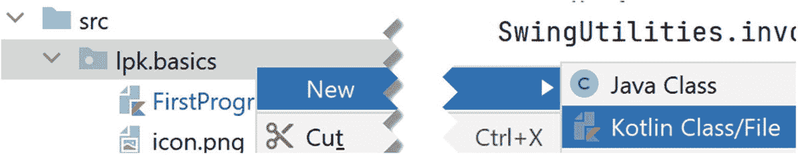

图 5-1

右键菜单

新文件将包含一个包声明和一条关于文件创建时间的注释。删除所有这些文本，并用以下代码替换：

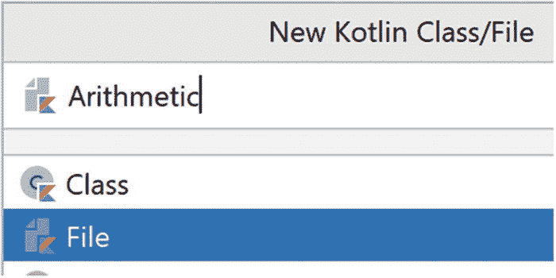

图 5-2

创建一个新的 Kotlin 文件

```
package lpk.basics
fun main() {
    val x = 7 + 5
    println(x)
}
```

完成此操作后，你应该会在 `main` 函数的左侧看到一个绿色三角形。右键单击它，然后选择 `Run`... 选项，就像前几章运行程序一样。IntelliJ 屏幕底部应该会显示一个面板，其中包含一些输出，包括数字 `12`。

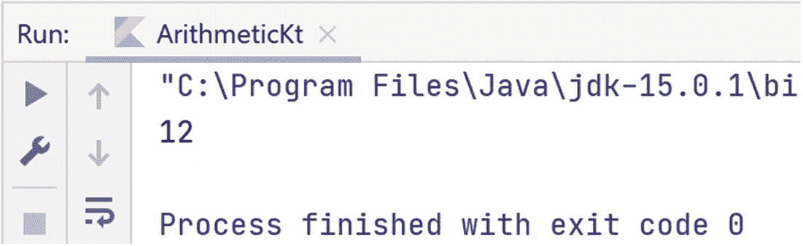

图 5-3

运行程序后的输出

程序的工作原理如下。在第 1 行，我们声明它位于 `lpk.basics` 包中，这与之前的程序相同。`main` 函数是程序的入口点，在第 3 行声明。第 4 行是执行算术运算的地方。我们使用关键字 `val` 定义了一个名为 `x` 的值。等号将 `x` 设置为等于 `5 + 7`，结果当然是 `12`。在第 5 行，我们调用库函数 `println` 来打印 `x`。

编程挑战 5.1

修改程序，使其打印出 `7` 减去 `5` 的结果。

编程挑战 5.2

键盘上没有 × 符号，因此对于乘法，程序员使用星号。修改程序，使其打印出 `7 * 5` 的结果。

编程挑战 5.3

让我们重写程序，使其打印出 7 的乘法表。为此，我们需要一个循环，其值从 `1` 到 `10`。循环体将打印出 `7` 乘以循环变量的值。以下是带有循环框架的程序：

```
package lpk.basics
fun main() {
    for (i in 1..10) {
        //循环体写在这里
    }
}
```

将 `//循环体写在这里` 注释替换为以下代码：

1.  声明一个变量 `x`，其值为 `7` 乘以 `i`

2.  打印 `x`

上一个挑战打印出了 7 的倍数列表。我们可以做一些更花哨的事情。将程序修改为以下内容：

```
package lpk.basics
fun main() {
    for (i in 1..10) {
        val x = 7 * i
        println("7 times $i is $x")
    }
}
```

当你运行程序时，应该会看到如图 5-4 所示的输出。

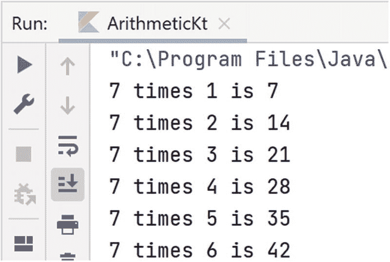

图 5-4

打印乘法表

在第 6 行，我们打印的是一个称为 `String` 的内容，而不仅仅是一个数字。我们将在后面的章节中更多地使用 `String`。目前，只需将 `String` 理解为字母、数字和其他字符的混合体即可。Kotlin 有一个很棒的特性，允许我们将变量值插入到 `String` 中。这是通过第 6 行的美元符号实现的：`$i` 表示“`i` 的当前值”，`$x` 同理。这被称为*字符串插值*。


通过用符号替换单词，可以使输出更紧凑。我们还会在每个组之间放置一个制表符而不是换行符。为此，我们将打印行替换为

```
print("7*$i=$x\t")
```

在这段代码中，我们调用了 `print` 而不是 `println`。后者会打印其参数，然后打印一个换行符（类似于按下回车键）。此外，我们使用了“反斜杠 t”组合，它表示“打印一个制表符”。（制表符是一种特殊的不可见字符，用于在打印一系列长度略有不同的项目时调整间距。）经过这些修改，打印结果如图 5-5 所示。

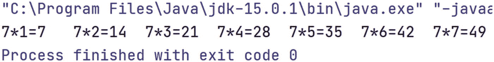

图 5-5

单行显示的乘法表

让我们修改程序，使其打印出从 `1` 到 `10` 的所有乘法表。我们需要对从 `1` 到 `10` 的每个数字，执行当前对数字 `7` 所做的操作。粗略来说，我们的程序形式如下

```
1   package lpk.basics

3   fun main() {
4       for (s in 1..10) {
5           //打印 s 的乘法表
6           println()
7       }
8   }
```

注意，在第 6 行我们打印了一个空行，以便每个内层循环都在单独的一行上打印。打印 `s` 乘法表的代码是一个循环，与我们之前在七的乘法表程序中使用的基本相同。因此，所需程序的更完整框架是

```
package lpk.basics
fun main() {
for (s in 1..10) {
for (i in 1..10) {
//定义 x 为 s 乘以 i
//打印 s、i 和结果
}
println()
}
}
```

编程挑战 5.4

你能做出最终修改来完成这个程序吗？

当你运行它时，输出应该以如下内容开始：

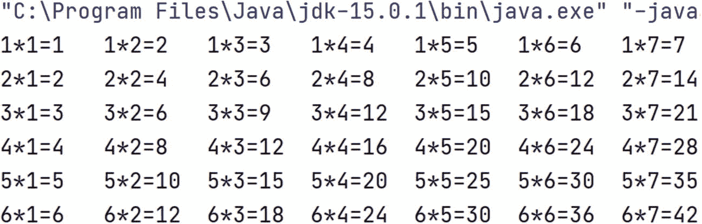

## 5.2 除法

通过加法、减法和乘法，我们可以简单地将两个整数组合起来得到另一个整数。除法则更复杂，因为一个数并不总能被另一个数整除。除以 0 是未定义的。而且，我们如何将 13 除以 4 来得到另一个整数呢？在编程中，整数的除法由两个操作处理：`/` 和 `%`。

`x / y` 表示 `y` 能完整地包含在 `x` 中的次数。例如，`8/3` 是 `2`，`8/4` 也是 `2`。

`x` `%` `y` 表示 `x` 除以 `y` 后的余数。例如，`8 % 3` 是 `2`，`8 % 4` 是 `0`。要查看这些操作的实际效果，请运行以下程序：

```
1   package lpk.basics

3   fun main() {
4       for (i in 1..20) {
5           val div = i / 5
6           val rem = i % 5
7           println("i: $i, div: $div, rem: $rem")
8       }
9   }
```

第 4 行设置了一个 `for` 循环，变量 `i` 从 `1` 到 `20`。在第 5 行，我们定义了一个名为 `div` 的 `val`，它被设置为 `i` 除以 `5` 的整数部分。下一行定义了一个名为 `rem` 的 `val`，它是 `i` 除以 `5` 后的余数。在第 7 行，我们打印出 `i` 和这两个 `val`。我们程序的结果以如下内容开始：

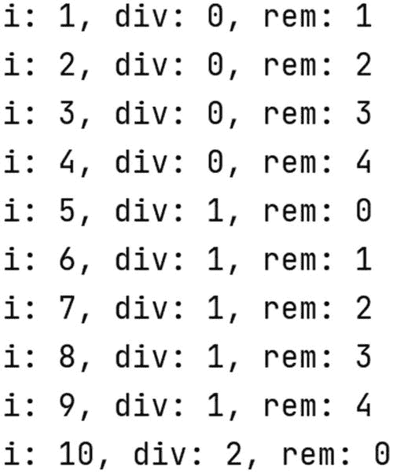

## 5.3 使用算术生成图案

我们可以修改瓦片程序，使用算术运算来生成图案。例如，让我们将 `FirstProgram` 中的 `getTileColors` 函数改为

```
1   fun tileColors(): Array> {
2       val shades = Array(16) {
3           Array(16) { 0 }
4       }
5       for (row in 0..15) {
6           for (col in 0..15) {
7               shades[row][col] = row * col
8           }
9       }
10       return shades
11   }
```

我们得到了如图 5-6 所示的图案。注意，它包含 16 行和 16 列。

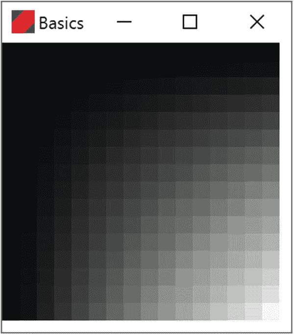

图 5-6

一种图案，其中瓦片颜色通过将其行索引乘以列索引得到

这些维度在第 2 行和第 3 行设置。该图案关于左上角到右下角的对角线对称。这是因为单元格在此对角线上的反射会交换行和列坐标。例如，考虑行 5 列 3 的单元格。该单元格在对角线上的反射是行 3 列 5。由于 5 乘以 3 等于 3 乘以 5，这些单元格将具有相同的灰色阴影。第一行和第一列上的单元格都是黑色的，因为 0 乘以任何其他数都等于 0。

现在让我们使用取余操作 `%` 来构建如图 5-7 所示的交替黑白行图案。


图 5-7

一种图案，其中瓦片颜色为黑色或白色，取决于行索引除以 `2` 的余数

生成此图案的代码如下

```
1   fun tileColors(): Array> {
2       val shades = Array(16) {
3           Array(16) { 0 }
4       }
5       for (row in 0..15) {
6           for (col in 0..15) {
7               val remainder = row % 2
8               if (remainder == 0) {
9                   shades[row][col] = 0
10               } else {
11                   shades[row][col] = 255
12               }
13           }
14       }
15       return shades
16   }
```

编程挑战 5.5

修改 `tileColors` 函数，使其生成交替黑白列的图案：

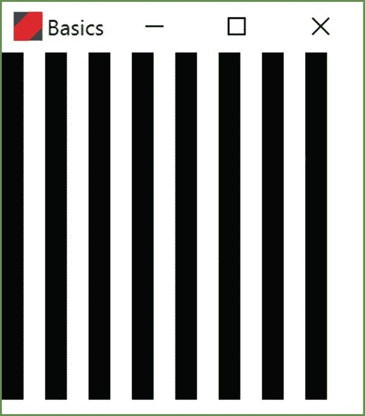

编程挑战 5.6

你能修改 `tileColors` 函数，使其生成交替黑白方块的图案吗？

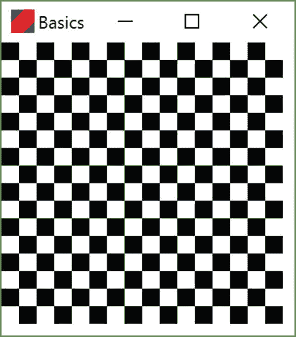

编程挑战 5.7

你能生成一个棋盘图案吗？它与上一个挑战中的图案相同，但只有八行八列，并且左上角到右下角的对角线上的格子为白色。

编程挑战 5.8

考虑这个 `getTileColors` 的实现：

```
fun tileColors(): Array> {
val shades = Array(7) {
Array(7) { 0 }
}
for (row in 0..6) {
for (col in 0..6) {
val remainder = (row * col) % 2
if (remainder == 0) {
shades[row][col] = 255
} else {
shades[row][col] = 0
}
}
}
return shades
}
```

这个图案将有多少行和多少列？

单元格 `(0, 0)`、`(1, 4)`、`(3, 2)` 和 `(5, 5)` 将是什么颜色？

一般来说，如果一个单元格位于偶数列，我们能得出什么结论？

对于位于偶数行的单元格，我们能得出什么结论？

哪些单元格会是白色的？

你认为这个图案看起来像什么？运行代码亲自看看吧。


## 5.4 本章小结与挑战题解答

现在我们已经了解了如何在 Kotlin 中进行整数运算，包括整除和取余。

解答 5.1

```
package lpk.basics
fun main() {
val x = 7 - 5
println(x)
}
```

解答 5.2

```
package lpk.basics
fun main() {
val x = 7 * 5
println(x)
}
```

解答 5.3

```
package lpk.basics
fun main() {
for (i in 1..10) {
val x = 7 * i
println(x)
}
}
```

解答 5.4

```
package lpk.basics
fun main() {
for (s in 1..10) {
for (i in 1..10) {
val x = s * i
print("$s*$i=$x\t")
}
println()
}
}
```

解答 5.5

```
fun tileColors(): Array> {
val shades = Array(16) {
Array(16) { 0 }
}
for (row in 0..15) {
for (col in 0..15) {
val remainder = col % 2
if (remainder == 0) {
shades[row][col] = 0
} else {
shades[row][col] = 255
}
}
}
return shades
}
```

解答 5.6

```
fun tileColors(): Array> {
val shades = Array(16) {
Array(16) { 0 }
}
for (row in 0..15) {
for (col in 0..15) {
val remainder = (row + col) % 2
if (remainder == 0) {
shades[row][col] = 0
} else {
shades[row][col] = 255
}
}
}
return shades
}
```

解答 5.7

```
fun tileColors(): Array> {
val shades = Array(8) {
Array(8) { 0 }
}
for (row in 0..7) {
for (col in 0..7) {
val remainder = (row + col) % 2
if (remainder == 0) {
shades[row][col] = 255
} else {
shades[row][col] = 0
}
}
}
return shades
}
```

解答 5.8

共有七行七列。

如果某个单元格的行索引与列索引的乘积为偶数，则该单元格为白色。这意味着任何行索引或列索引为偶数的单元格都是白色的。

只有行和列均为奇数的单元格才是黑色的。

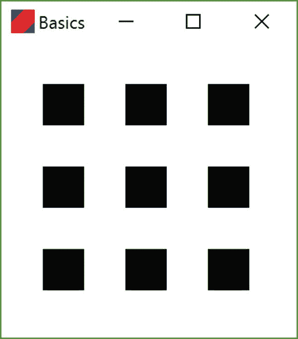

