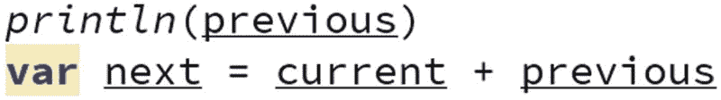
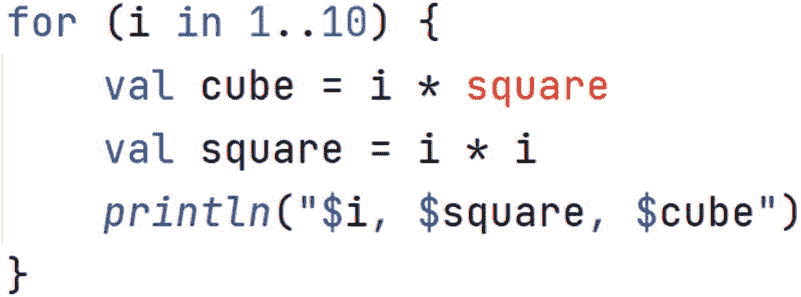
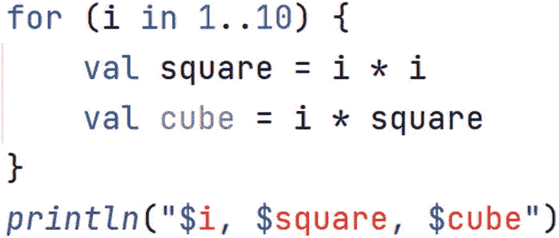

# 6. 值与变量

在编写程序时，我们可能会有一段信息需要在程序的其他地方引用。*值*和*变量*就是为此而生的。它们分别使用关键字 `val` 和 `var` 来定义。我们可以把 `val` 和 `var` 想象成存放数据项的盒子。`var` 是一个可以取出数据并替换为其他数据项的盒子。而对于 `val`，数据项一旦设定就永远无法替换。

## 6.1 使用 `var`

`var` 的一个常见用途是存储计算的中间结果。例如，如果我们想编写一个程序来计算从 `1` 到 `10` 所有数字的和，我们可以：

*   创建一个名为 `sum` 的 `var`，初始值为 `0`。
*   定义一个循环，计数器 `i` 从 `1` 开始，到 `10` 结束。
*   在循环的每一步中，将 `i` 加到 `sum` 上。

以下是将该算法转换为代码的形式：

```
1   package lpk.basics

3   fun main() {
4       var sum = 0
5       for (i in 1..10) {
6           sum = sum + i
7       }
8       print(sum)
9   }
```

将这段代码复制到上一章使用的 `Arithmetic.kt` 文件中。运行它，检查是否打印出了数字 `55`。

代码的工作原理如下。在第 4 行，我们定义了一个名为 `sum` 的 `var`。这行代码中的等号实际上表示“将 `sum` 盒子中的数据设置为 `0`”。第 6 行乍一看可能令人困惑，因为等号两边都出现了 `sum`。但和第 4 行一样，等号实际上表示“将值设置为”。因此，第 6 行实际上被解释为“用当前内容加上 `i` 的结果替换 `sum` 盒子中的内容”。

使用变量时最棘手的事情之一就是使用 `=` 来设置它们的值。有些编程语言使用 `:=` 来完成这项工作，这样就不那么容易混淆。请记住，要测试两个对象是否相等，我们使用 `==`。

编程挑战 6.1

修改上述程序，使其计算从 `1` 到 `100` 所有数字的和。

然后修改它，使其计算从 `11` 到 `20` 所有数字的和。

编程挑战 6.2

现在修改程序，使其计算从 `1` 到 `10` 所有数字的平方和。（一个数的平方就是该数乘以自身。记住使用 `*` 表示乘法。）

编程挑战 6.3

通过使用 `if` 语句，我们可以只将偶数加到 `sum` 变量上。看看你是否能计算出 `0` 到 `10` 之间所有偶数的和。

编程挑战 6.4

一个数的*阶乘*定义如下：

*   1 的阶乘是 1
*   2 的阶乘是 2 × 1
*   3 的阶乘是 3 × 2 × 1

以此类推。修改用于求和的程序，使其计算 5 的阶乘。


## 6.2 使用 `val`

如前所述，我们可以将 `val` 视为一个包含数据项的盒子，且该数据项不能被替换。你可能会问：“何必这么麻烦？为什么不全用 `var`？它们能做更多事，不是更好吗？”事实上，许多语言并没有 `val`，只有 `var`。`var` 的问题在于，由于其内容可以被替换，追踪其中存储的内容会变得非常困难。这种困难在两种情况下会变得尤为重要。

首先，对于非常复杂的程序，我们人类很难追踪每个 `var` 中存储的内容。这使得编写和维护大量使用 `var` 的大型程序变得困难。

`var` 的第二个问题是，现代软件中有大量事情是同时发生的。如果一个计算机活动试图检索某个 `var` 的内容，但其他活动正在更改这些内容，就可能导致不可预测的行为。编写多个独立活动同时更改共享数据的软件非常困难。在“过去”，即 2005 年之前，能够同时执行多项任务的计算机非常罕见，而现在，几乎找不到没有至少两个所谓处理核心的计算机。因此，像 Kotlin 这样的现代语言区分了 `val` 和 `var`。

在后续章节中，我们会大量使用 `val`。现在，让我们先编写一个在临时变量中使用 `val` 的程序。*斐波那契*数列是 1, 1, 2, 3, 5, 8，依此类推。数列中的每个数字都是前两个数字之和。下面是一个打印前十来个斐波那契数的程序框架：

```
1   package lpk.basics

3   fun main() {
4       var current = 1
5       var previous = 1
6       for (i in 1..10) {
7           //打印 previous
8           //计算下一个数
9           //将 previous 重新赋值为 current
10           //将 current 重新赋值为 next
11       }
12   }
```

在第 4 行和第 5 行，我们定义了 `var` 来保存当前和上一个斐波那契数。这些 `var` 被初始化为数列的前两个元素，并将在循环中被更改，以在计算过程中保存数列的后续元素。

在循环内部，我们要做的第一件事是打印 `previous`。因此，第 7 行可以改为：

```
println(previous)
```

在第 8 行，我们需要计算下一个数。斐波那契规则指出，这是 `previous` 和 `current` 的和。我们可以将这个和存储在一个 `val` 中，不妨称之为 `next`。因此，第 8 行变为：

```
val next = current + previous
```

现在我们已经计算出了下一个数，原来的当前数就变成了上一个数。所以第 9 行可以改为：

```
previous = current
```

请记住，这应理解为“取出 `current` 的内容，并将其放入 `previous`”。

最后，我们需要将 `current` 的内容切换为包含 `next` 的内容：

```
current = next
```

编程挑战 6.5

实现这些更改并运行程序。

这个程序如果将 `next` 定义为 `var` 而不是 `val` 也能工作，但只要能用 `val`，我们就应该使用。注意，在 IntelliJ 中，`var` 会带有一个略微烦人的下划线。这是一个微妙的提示，提示我们尽可能使用 `val`。如果你将 `next` 从 `val` 改为 `var`，那么 IntelliJ 会用一个令人不适的黄色背景来显示 `var`，如图 6-1 所示。这是一个不那么微妙的提示，表明我们可以做得更好。



图 6-1

IntelliJ 提示使用 `val`

## 6.3 作用域

考虑以下程序：

```
1   package lpk.basics

3   fun main() {
4       for (i in 1..10) {
5           val square = i * i
6           val cube = i * square
7           println("$i, $square, $cube")
8       }
9   }
```

这里有三个 `val`：循环计数器 `i`；在第 5 行定义的 `square`；以及在第 6 行定义的 `cube`。这些 `val` 在 `for` 循环体内有意义，即在第 4 行末尾的左大括号与第 8 行匹配的右大括号之间。如果我们将第 7 行复制并粘贴到第 8 行的大括号之后，那么 `i`、`square` 和 `cube` 的引用就没有意义了，因此我们会得到错误，如图 6-2 所示。在像 Kotlin 这样的语言中，符号在其定义所在的那对大括号内具有意义，而在外部则没有意义或具有其他意义。在一对大括号内，符号不能被定义它的那一行之上的代码行引用。例如，我们不能在 `square` 被定义之前使用它，如图 6-3 尝试的那样。`val` 或 `var` 具有意义的代码段被称为其*作用域*。



图 6-3

我们不能在符号定义之前使用它



图 6-2

IntelliJ 将超出作用域的符号显示为错误

作用域的规则非常符合常识，而且 IntelliJ 会在出现问题时明确提示，所以不必过于担心这个问题。

有一件事可能会让人困惑：前面被描述为 `val` 的循环计数器，似乎在循环的每次迭代中都被重新赋值。实际上，情况并非如此。像这样的循环：

```
for (i in 1..3) {
val square = i * i
println("$i, $square")
}
```

会被 Kotlin 转换成类似于下面的代码：

```
val i1 = 1
val square1 = i1 * i1
println("$i1, $square1")
val i2 = 2
val square2 = i2 * i2
println("$i2, $square2")
val i3 = 3
val square3 = i3 * i3
println("$i3, $square3")
```

## 6.4 总结与挑战题解答

要编写复杂的程序，我们需要存储信息，我们通过 `val` 和 `var` 来实现这一点。

解答 6.1

通过更改循环的界限即可实现。计算从 `1` 到 `100` 的和使用以下代码：

```
package lpk.basics
fun main() {
var sum = 0
for (i in 1..100) {
sum = sum + i
}
print(sum)
}
```

结果应为 `5050`。

计算从 `11` 到 `20` 的和使用以下代码：

```
package lpk.basics
fun main() {
var sum = 0
for (i in 11..20) {
sum = sum + i
}
print(sum)
}
```

结果应为 `155`。

解答 6.2

```
package lpk.basics
fun main() {
var sum = 0
for (i in 1..10) {
sum = sum + i * i
}
print(sum)
}
```

在表达式 `sum + i * i` 中，乘法先于加法执行。在 Kotlin 中，与标准数学符号一样，乘法优先级高于加法。

解答 6.3

```
package lpk.basics
fun main() {
var sum = 0
for (i in 1..10) {
if (i % 2 == 0) {
sum = sum + i
}
}
print(sum)
}
```

解答 6.4

这与计算和类似，但我们从 `1` 开始，并在循环体内乘以部分结果：

```
package lpk.basics
fun main() {
var factorial = 1
for (i in 1..5) {
factorial = factorial * i
}
print(factorial)
}
```

阶乘序列增长得非常快。事实上，如果你尝试使用类似上面的代码计算像 `30` 这样的数的阶乘，你会得到一个离谱的答案。这是因为 Kotlin 中分配给存储 `Int` 的内存有限。虽然可以处理更大的数字，但本书不会涉及。

解答 6.5

```
package lpk.basics
fun main() {
var current = 1
var previous = 1
for (i in 1..10) {
println(previous)
val next = current + previous
previous = current
current = next
}
}
```


