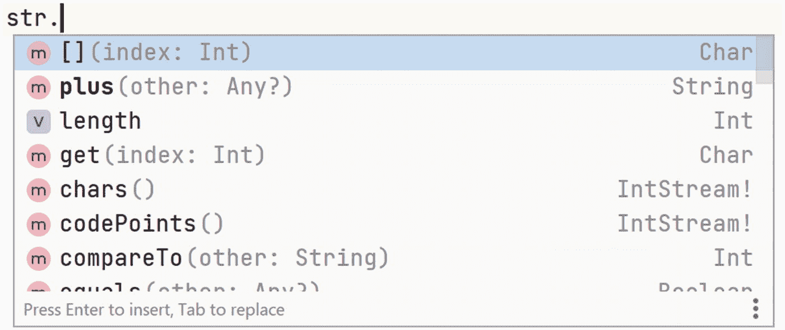
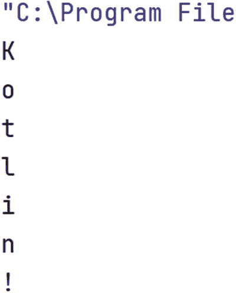
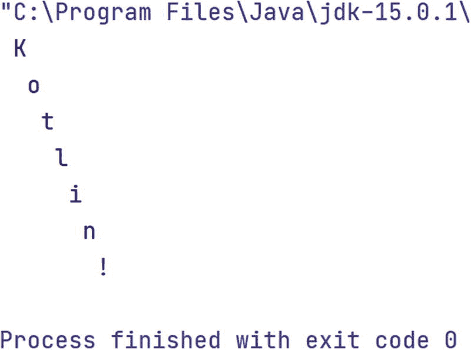

# 7. 字符串

许多软件都以某种形式处理文本，Kotlin 为此提供了几种数据类型。

`Char` 用于表示字母、数字和标点符号等符号。我们可以将字符写在单引号之间来定义一个 `Char`，例如 `'a'`。字符的大写和小写版本由不同的 `Char` 表示。除了大多数计算机键盘上所谓的拉丁字符外，`Char` 还可以表示带重音的字母、世界各地的语言符号以及数学符号。

`String` 用于表示单词、句子，甚至整本书。我们通过将文本写在双引号之间来定义 `String`，就像我们在之前的一些程序中所做的那样。如果我们想要一个空的 `String`，只需写两个双引号：`""`。在本章的代码中，我们会经常看到这种用法。

## 7.1 字符串作为对象

如前所述，编程是一个使用计算机可执行的指令列表来模拟现实世界的过程。`String` 数据类型用于模拟文本。如果我们有一些文本，我们可能会关心诸如它有多少个字符之类的问题，例如，为了找出打印它需要多少行。在 Kotlin 以及许多其他语言中，信息是通过“询问”数据项自身来获取的。我们使用一种特殊的“点”符号来“询问”数据项。下面是一个例子：

```
1   fun main() {
2       val str = "Hello World!"
3       val l = str.length
4       println("Length: $l" )
5   }
```

在第 2 行，我们定义了一个名为 `str` 的 `val`，它是一个值为 "Hello World!" 的 `String`。在下一行，我们定义了一个名为 `l` 的 `val`，使其等于 `str` 的 `length`。这个值是使用以下符号获取的：

```
str.length
```

请注意，在第 4 行，我们打印出了 `String`：

```
"Length: $l"
```

Kotlin 通过将文本：

```
$l
```

替换为 `l` 的值来解释这一点，因此打印出来的结果是：

```
Length: 12
```

这又是字符串插值。它在 Kotlin 编程中经常使用，你很快就会习惯它。

提示

和往常一样，项目树中有一个文件，本章的所有代码示例都可以从中复制：

`chapter7_code_to_copy.txt`

这在本章中尤其有用，因为有些代码示例无法从电子版书籍中正确复制。

让我们多练习一下这种点符号。按照第 5 章的说明，创建一个名为 `Strings.kt` 的文件。然后将以下代码复制到新文件中：

```
1   package lpk.basics

3   fun main() {
4       val str = "Hello World!"
5       val l = str.length
6       println("Length: $l")
7       val upperCase = str.toUpperCase()
8       println(upperCase)
9       val lowerCase = str.toLowerCase()
10       println(lowerCase)
11   }
```

当你运行这个程序时，你应该会看到类似这样的输出：

```
Length: 12
HELLO WORLD!
hello world!
```

在这个程序的第 7 行，我们通过使用 `toUpperCase` 函数询问 `str` “你的大写版本是什么？”来创建一个 `val`。类似地，在第 9 行，我们向 `str` 询问它的小写版本。

我们如何知道可以向 `String` 询问哪些问题？在过去，程序员花费大量时间学习不同数据类型可用的所有函数，这些知识是他们技能的重要组成部分。如今，像 IntelliJ 这样的工具将这些信息放在我们的指尖。如果我们输入代码：

```
str.
```

然后同时按下 `Ctrl` 键和空格键，就会弹出一个窗口，其中包含可用函数的列表，如图 7-1 所示。我们将大量练习使用这些“点”函数，并定义我们自己的数据类型，这将大大简化事情！现在，请放心，IntelliJ 会在我们编写代码时为我们完成许多繁重的工作。



图 7-1

IntelliJ 列出了可以在数据类型上调用的函数

## 7.2 **字符串**迭代

对 `String` 最常见的操作之一就是*迭代*，或者说循环遍历其中的 `Char`，一个接一个，从第一个到最后一个，就像我们对 `Array` 的元素所做的那样。为了了解这是如何工作的，请将以下代码复制到你的 `Strings.kt` 文件中：

```
1   package lpk.basics

3   fun main() {
4       val str = "Kotlin!"
5       for (c in str) {
6           println(c)
7       }
8   }
```

第 4 行定义了一个名为 `str` 的 `val`，就像我们在之前的程序中看到的那样。下一行引入了一个 `for` 循环，其中有一个名为 `c` 的循环 `val`。循环体（这里只是一个 `println` 调用）会为 `str` 中的每个 `Char` 执行一次。如果我们运行这个程序，`"Kotlin!"` 的字符会被打印出来，每行一个，如图 7-2 所示。



图 7-2

通过遍历 `String` 中的字符，我们可以垂直打印它

编程挑战 7.1

假设我们将前面代码清单中的循环体改为 `print` 语句而不是 `println` 语句。你认为运行程序的结果会是什么？

编程挑战 7.2

考虑这个程序的变体：

```
fun main() {
val str = "Kotlin!"
var numberOfSpaces = 0
for (c in str) {
for (n in 0..numberOfSpaces) {
print(" ")
}
println(c)
numberOfSpaces = numberOfSpaces + 1
}
}
```

注意第 3 行定义的名为 `numberOfSpaces` 的 `var`。每次执行循环体时，它都会在循环体的最后一条语句（第 9 行）处递增。

当循环 `val c` 为 `'K'` 时，`numberOfSpaces` 的值是多少？

当 `c` 为 `'o'` 时，值是多少？

第 5 到 7 行的内层循环有什么作用？

你认为程序的结果会是什么？

迭代（循环）遍历 `String` 的一个常见原因是在其中查找特定的 `Char`。例如，下面是一个使用循环计算 `String` 中空格数量的程序：

```
1   package lpk.basics

3   fun main() {
4       val str = "How long is a piece of string?"
5       var spaceCount = 0
6       for (c in str) {
7           if (c == ' ') {
8               spaceCount = spaceCount + 1
9           }
10       }
11       println("Number of spaces: $spaceCount")
12   }
```

在第 5 行，我们定义了一个 `var` 来保存到目前为止看到的空格数。第 6 行设置了一个 `for` 循环，它将遍历 `String` 中的 `Char`，循环 `val` 名为 `c`。在第 7 行，`val c` 与表示空格的 `Char` 进行比较。如果比较结果为 `true`，则在第 8 行递增 `spaceCount`。最后，在第 11 行，循环结束后打印出计数。

编程挑战 7.3

从文件复制前面的代码：

`chapter7_code_to_copy.txt`

你能修改代码来计算字母 `'a'` 出现的次数吗？

你能计算 `'a'` 或 `'e'` 出现的次数吗？

现在修改程序，计算元音字母出现的次数。


## 7.3 构建新的**字符串**

在编程中，我们经常需要自动生成文本——例如，给用户的消息——而在 Kotlin 中这非常容易，因为我们可以使用与数字相加相同的 `+` 运算符来拼接 `String`：

```
1   fun main() {
2       val msg = "Hello" + " " + "World!"
3       println(msg)
4   }
```

第 2 行的 `val msg` 通过拼接三个 `String` 定义，其中中间那个只是一个空格，从而生成单个 `String "Hello World!"`。

我们可以通过循环遍历文本，并在遍历过程中将想要保留的字母添加到一个结果 `var` 中，从而从文本中移除某些 `Char`。例如，假设我们想要从一个 `String` 中移除空格。我们可以查看 `String` 中的每个 `Char`，如果它不是空格，就将其添加到结果 `var` 中。检查 `Char c` *不是*空格 `Char` 的方法是使用“不等于”运算符，写作 `!=`：

```
1   if (c != ' ') {
2       // 添加它
3   }
```

以下是完整的程序：

```
fun main() {
val str = "There is a bunker!"
var noSpaces = ""
for (c in str) {
if (c != ' ') {
noSpaces = noSpaces + c
}
}
println(noSpaces)
}
```

编程挑战 7.4

从文件 `chapter7_code_to_copy.txt` 中复制上述代码。

修改程序，从 `String "Can you understand this?"` 中移除所有元音字母。

编程挑战 7.5

（超级困难。）在某些排版程序中，当单词之间有多个空格时，格式化后的文本会看起来“有间隙”。编写一个程序，将单词之间的所有多个空格压缩为单个空格字符。例如，给定输入：

```
"Mind the   gap!"
```

输出应为：

```
"Mind the gap!"
```

**注意** 如果你从本文档复制文本，三个空格可能会被转换为一个空格。

**提示** 这与移除空格的程序类似，但我们需要一个 `var` 来记住前一个 `Char` 是否是空格。这个 `var` 可以命名为 `previousCharWasSpace`。它的值要么是 `true`，要么是 `false`。它的初始值是 `false`。值为 `true` 或 `false` 的类型称为布尔型。

## 7.4 关于**字符串**迭代的更多内容

考虑这个简单的程序：

```
package lpk.basics
fun main() {
val str = "abc"
for (c in str) {
println(c)
}
}
```

Kotlin 系统将其视为如下写法：

```
package lpk.basics
fun main() {
val str = "abc"
val c_0 = 'a'
println(c_0)
val c_1 = 'b'
println(c_1)
val c_2 = 'c'
println(c_2)
}
```

这就是为什么我们可以在循环中将 `c` 视为一个 `val`，例如：

```
for (c in str) {
// 循环体。这里的 c 是一个 val。
}
```

编程挑战 7.6

考虑这个程序：

```
package lpk.basics
fun main() {
val str = "back"
var result = ""
for (c in str) {
result = result + c
}
println(result)
}
```

编写一个不使用循环的等效“长格式”版本。

编程挑战 7.7

上一个挑战的解决方案是一个程序，其中名为 `result` 的 `var` 被初始化为空 `String`，然后被重置了四次。对于每次重置，在纸上写出重置前后的值。

每次重置的形式如下：

```
result = result + c_0
```

如果我们在 `+` 操作中交换 `String` 的顺序会发生什么？也就是说，如果我们将它们改为将下一个 `Char` 放在 `result` 之前：

```
result = c_0 + result
```

用这些交换后的重置，写出 `result` 的“之前”和“之后”值。

利用这些见解，将上一个挑战的程序转换为一个使用循环来反转 `String` 的程序。

## 7.5 总结与挑战题解答

本章介绍了极其重要的 `String` 数据类型。对 `String` 最常见的操作之一就是遍历其字符，就像对数组所做的那样。将此类循环展开为等效的代码块（每个 `String` 元素对应一个代码块），可以让我们深入了解循环变量的本质。

解答 7.1

输出将只是单行上的 “Kotlin!”。

解答 7.2

当 `c` 为 `'K'` 时，`numberOfSpaces` 为 `0`。

当 `c` 为 `'o'` 时，`numberOfSpaces` 为 `1`。

内层循环在单行上依次打印出 `numberOfSpaces` 个空格。

运行程序会在对角线上打印出 “Kotlin!”：



解答 7.3

统计 `'a'` 的数量：

```
package lpk.basics
fun main() {
val str = "How long is a piece of string?"
var count = 0
for (c in str) {
if (c == 'a') {
count = count + 1
}
}
println("Count: $count")
}
```

要统计 `'a'` 和 `'e'` 的数量，我们可以在比较中使用 `or`：

```
package lpk.basics
fun main() {
val str = "How long is a piece of string?"
var count = 0
for (c in str) {
if (c == 'a' || c == 'e') {
count = count + 1
}
}
println("Count: $count")
}
```

另一种方法是使用两个 `if` 语句：

```
package lpk.basics
fun main() {
val str = "How long is a piece of string?"
var count = 0
for (c in str) {
if (c == 'a') {
count = count + 1
}
if (c == 'e') {
count = count + 1
}
}
println("Count: $count")
}
```

要统计元音字母，我们可以在 `if` 语句中列出所有元音：

```
package lpk.basics
fun main() {
val str = "How long is a piece of string?"
var count = 0
for (c in str) {
if (c == 'a' || c == 'e' || c == 'i'|| c == 'o'|| c == 'u') {
count = count + 1
}
}
println("Count: $count")
}
```

实际上，这是不正确的，因为它没有考虑大写元音字母。为了解决这个问题，我们可以插入一个 `val`，它是 `c` 的小写版本，并针对它进行比较。要获取 `Char` 的小写版本，我们调用它的 `toLowerCase` “点”函数。（这个函数在 `Char` 和 `String` 上都有定义。）以下是修正后的代码：

```
package lpk.basics
fun main() {
val str = "Are we there yet?"
var count = 0
for (c in str) {
val l = c.toLowerCase()
if (l == 'a' || l == 'e' || l == 'i'|| l == 'o'|| l == 'u') {
count = count + 1
}
}
println("Count: $count")
}
```

（实际上，这仍然没有将 `"y"` 在充当元音时（例如在单词 “rhythm” 中）计入。）

解答 7.4

```
package lpk.basics
fun main() {
val str = "Can you understand this?"
var result = ""
for (c in str) {
val l = c.toLowerCase()
if (l != 'a' && l != 'e' && l != 'i' && l != 'o' && l != 'u') {
result = result + l
}
}
println(result)
}
```

解答 7.5

```
package lpk.basics
fun main() {
val str = "Mind the gap!"
var compacted = ""
var previousCharWasASpace = false
for (c in str) {
if (c == ' ') {
if (!previousCharWasASpace) {
compacted = compacted + c
}
previousCharWasASpace = true
} else {
compacted = compacted + c
previousCharWasASpace = false
}
}
println(compacted)
}
```

解答 7.6

以下是一个没有循环的版本：

```
package lpk.basics
fun main() {
val str = "back"
var result = ""
val c_0 = 'b'
result = result + c_0
val c_1 = 'a'
result = result + c_1
val c_2 = 'c'
result = result + c_2
val c_3 = 'k'
result = result + c_3
println(result)
}
```

解答 7.7

`result` 依次取值为 `b`、`ba`、`bac` 和 `back`。

当加号两侧的符号交换后，`result` 依次取值为 `b`、`ab`、`cab` 和 `kcab`。以下是一个字符串反转程序：

```
package lpk.basics
fun main() {
val str = "That's weird!"
var reversed = ""
for (c in str) {
reversed = c + reversed
}
println(reversed)
}
```

