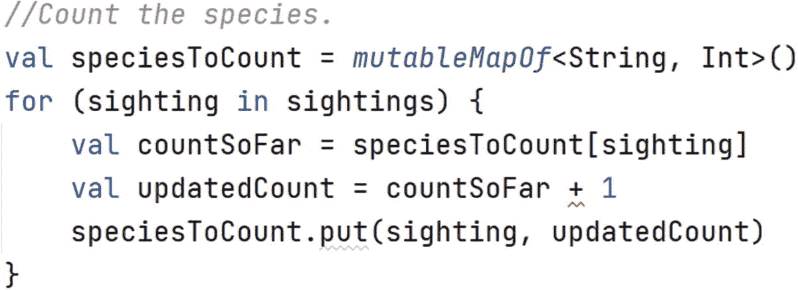

# 8. 数据结构

假设我们去观鸟探险，并希望记录我们看到的鸟类。我们可能想回答以下问题：

*   我们看到了哪些种类的鸟？

*   我们按什么顺序看到它们的？

*   不同物种被看到了多少次？

在本章中，我们将研究 Kotlin 为回答这类问题提供的工具。


## 8.1 列表

`List` 是一个对象集合，它会跟踪对象被添加的顺序。下面是我们如何创建一个包含 `String` 类型对象的 `List`：

```
val stringList = mutableListOf()
```

这行代码声明了一个名为 `stringList` 的 `val`，它包含调用 `mutableList` 函数返回的值。看起来有点奇怪的 `<String>` 术语被称为*类型参数*。它告诉 Kotlin 系统这个 `List` 将存放哪种类型的对象。对于一个包含 `Int` 类型对象的 `List`，调用方式如下：

```
val intList = mutableListOf()
```

假设在我们的观鸟之旅中，我们看到了：

*   一只鸸鹋
*   一只喜鹊
*   一只粉红凤头鹦鹉
*   另一只鸸鹋

以下代码记录了这些目击事件，然后回答了一些关于所见鸟类的问题：

```
1   package lpk.basics

3   fun main() {
4       val sightings = mutableListOf()
5       sightings.add("emu")
6       sightings.add("magpie")
7       sightings.add("galah")
8       sightings.add("emu")

10       println("Number of bird sightings: " + sightings.size)
11       if (sightings.contains("emu")) {
12           println("Saw an emu!")
13       }
14       if (sightings.contains("brolga")) {
15           println("Saw a brolga!")
16       }
17       println("Third sighting: " + sightings[2])
18   }
```

请注意，我们使用代码 `birds[2]` 来查找看到的第三只鸟。与 `Array` 一样，`List` 使用基于零的索引。

编程挑战 8.1

创建一个名为 `DataStructures.kt` 的新 Kotlin 文件，并将上述代码复制进去。运行该程序。你会得到什么输出？

假设在第二次旅行中，你看到了一只 `pee-wee`、一只 `cockatoo`、一只 `thick-knee`，然后是一只 `brolga`。修改上述代码的第 5 到第 8 行来记录这些目击事件。

## 8.2 集合

`Set` 是一个对象集合，其中任意两个对象都不相同。`Set` 不记录对象添加到其中的顺序。要创建一个 `Set`，我们可以使用 `mutableSetOf` 函数。与 `mutableListOf` 函数一样，我们需要传入一个类型参数。因此，要创建一个包含 `String` 类型对象的 `Set`，我们使用：

```
val stringList = mutableSetOf()
```

编程挑战 8.2

将“列表”挑战中的代码修改为以下内容：

```
package lpk.basics
fun main() {
val birds = mutableSetOf()
birds.add("emu")
birds.add("magpie")
birds.add("galah")
birds.add("emu")
println("Number of bird species: " + birds.size)
if (birds.contains("emu")) {
println("Saw an emu!")
}
if (birds.contains("brolga")) {
println("Saw a brolga!")
}
}
```

运行该程序。你会得到什么输出？

请注意，没有调用任何方法来查找看到的“第三种”物种。这是因为 `Set` 的元素是无序的，所以我们不能像使用 `List` 和 `Array` 那样访问特定位置的元素。

## 8.3 映射

我们使用 `Map` 来记录关于对象的信息，例如，俱乐部成员的年龄。我们存储信息的对象被称为*键*。对于映射中的每个键，恰好有一个*值*。与 `List` 和 `Set` 一样，我们指定要存储在 `Map` 中的对象类型。但是，我们需要为键指定一个类型，同时为值指定一个类型。

如果我们想要一个 `Map` 来存储人们的年龄，我们可能会使用他们的名字（`String` 类型）作为键，并使用 `Int` 类型作为他们的年龄。要创建具有这些类型参数的 `Map`，我们使用以下代码：

```
val nameToAge = mutableMapOf()
```

要在 `Map` 中存储一个键及其对应的值，我们使用 `put` 函数，它有两个参数：一个用于键，一个用于值。要获取特定键的值，我们使用方括号表示法，类似于获取 `Array` 和 `List` 中特定索引项的方法。让我们看看这些操作的实际应用。

编程挑战 8.3

运行以下代码：

```
package lpk.basics
fun main() {
val nameToAge = mutableMapOf()
nameToAge.put("Harry", 15)
nameToAge.put("Luna", 16)
nameToAge.put("Snape", 36)
println("Harry's age: " + nameToAge["Harry"])
println("Luna's age: " + nameToAge["Luna"])
println("Snape's age: " + nameToAge["Snape"])
}
```

你会得到什么输出？

如果映射中某个键的值需要更新，我们再次调用 `put`，传入该键和新的值。这只会覆盖该键之前的值。如果我们不再关心某个键的值，可以使用 `remove` 函数从映射中移除该键。另一个有用的操作是遍历映射中的所有键。

编程挑战 8.4

考虑以下代码：

```
package lpk.basics
fun main() {
val nameToAge = mutableMapOf()
nameToAge.put("Harry", 15)
nameToAge.put("Luna", 16)
nameToAge.put("Snape", 36)
nameToAge.put("Luna", 17)//生日快乐！
nameToAge.remove("Snape")//再见斯内普！
for (name in nameToAge.keys) {
val age = nameToAge[name]
println("$name is $age years old")
}
}
```

你期望得到什么输出？


## 8.4 **null** 对象

考虑以下代码：

```
1   package lpk.basics

3   fun main() {
4       //记录观察到的鸟类。
5       val sightings = mutableListOf()
6       sightings.add("emu")
7       sightings.add("magpie")
8       sightings.add("galah")
9       sightings.add("emu")

11       //统计物种数量。
12       val speciesToCount = mutableMapOf()
13       for (sighting in sightings) {
14           val countSoFar = speciesToCount[sighting]
15           val updatedCount = countSoFar + 1
16           speciesToCount.put(sighting, updatedCount)
17       }

19       //打印物种计数。
20       for (species in speciesToCount.keys) {
21           val count = speciesToCount[species]
22           println("Number of $species sightings: $count")
23       }
24   }
```

在第 5 到 9 行，我们将观察到的鸟类记录在一个 `List` 中，这很直接。接下来的代码块（第 12 到 17 行）尝试使用一个映射来统计物种数量，其中键是物种，值是观察到的次数。最后一个代码块打印物种计数，就像我们在上一个挑战中打印年龄一样。

如果我们在 IntelliJ 中查看这段代码，会看到第 15 行的加号下方有一条红色波浪线，表示存在错误，如图 8-1 所示。要理解问题所在，需要记住第 13 到 17 行的 `for` 循环等价于一系列代码块，如下所示：



图 8-1

此处使用 `+` 存在问题

```
1   val sighting_0 = "emu"
2   val countSoFar_0 = speciesToCount[sighting_0]
3   val updatedCount_0 = countSoFar_0 + 1
4   speciesToCount.put(sighting_0, updatedCount_0)

6   val sighting_1 = "magpie"
7   val countSoFar_1 = speciesToCount[sighting_1]
8   val updatedCount_1 = countSoFar_1 + 1
9   speciesToCount.put(sighting_1, updatedCount_1)

11   val sighting_2 = "galah"
12   val countSoFar_2 = speciesToCount[sighting_2]
13   val updatedCount_2 = countSoFar_2 + 1
14   speciesToCount.put(sighting_2, updatedCount_2)

16   val sighting_3 = "emu"
17   val countSoFar_3 = speciesToCount[sighting_3]
18   val updatedCount_3 = countSoFar_3 + 1
19   speciesToCount.put(sighting_3, updatedCount_3)
```

现在考虑这个展开代码中第 2 行的 `countSoFar_0` 声明。我们试图将这个 `val` 设置为映射 `speciesToCount` 与键 `sighting_0` 关联的值。在程序的这个时刻，`speciesToCount` 中没有任何值，因此

```
speciesToCount[sighting_0]
```

将返回一个名为 `null` 的特殊值。这个 `null` 值不是 `Int`，因此 `+` 运算符无法应用于它。

在第 7 行，程序试图获取 `speciesToCount` 与 `magpie` 关联的值。此时，映射中有一个键 `emu` 对应的值，但没有我们这位黑白朋友的，因此 `countSoFar_1` 也被设置为 `null`。

第 17 行略有不同，因为此时键 (`emu`) 确实有一个值 (`1`)，所以第 18 行实际上是在将两个 `Int` 相加。然而，编译器不够智能，无法知道这一点，因此这一行也会报错。

为了解决这个问题，我们使用一种特殊的语法，意思是“用 `0` 代替 `null`”。这是使用所谓的 *Elvis 运算符* 编写的：`"``?:` `"`。

以下是程序的修正版本：

```
1   package lpk.basics

3   fun main() {
4       //记录观察到的鸟类。
5       val sightings = mutableListOf()
6       sightings.add("emu")
7       sightings.add("magpie")
8       sightings.add("galah")
9       sightings.add("emu")

11       //统计物种数量。
12       val speciesToCount = mutableMapOf()
13       for (sighting in sightings) {
14           val countSoFar = speciesToCount[sighting] ?: 0
15           val updatedCount = countSoFar + 1
16           speciesToCount.put(sighting, updatedCount)
17       }

19       //打印物种计数。
20       for (species in speciesToCount.keys) {
21           val count = speciesToCount[species]
22           println("Number of $species sightings: $count")
23       }
24   }
```

编程挑战 8.5

你期望这个程序输出什么？运行并查看结果。

你可能想知道为什么 Kotlin 在从映射中获取未知键的值时会返回 `null`。为什么不返回 `0`？嗯，在很多情况下，`0` 是*不*正确的，代码随后需要检查 `0`，这会很烦人且容易出错。通过可能返回 `null`，Kotlin 迫使我们思考可能出错的地方。Kotlin 执行的严格规则实际上允许系统检测到程序员在其他语言中需要手动测试的错误。事实上，有些语言非常宽松，对于它们来说，`0`、`false` 和 `null` 都是一回事。这使得它们易于学习，但从长远来看，很难知道发生了什么，从而导致有缺陷的软件。

## 8.5 总结与挑战解答

本章是对编程中一个广泛领域的非常简短的介绍。然而，我们现在已经掌握了足够的数据结构知识来编写一些复杂的程序，我们将在本书的下一部分开始编写。

解答 8.1

输出为

```
Number of bird sightings: 4
Saw an emu!
Third sighting: galah
```

第二次旅行的代码是

```
package lpk.basics
fun main() {
val sightings = mutableListOf()
sightings.add("pee-wee")
sightings.add("cockatoo")
sightings.add("thick-knee")
sightings.add("brolga")
println("Number of bird sightings: " + sightings.size)
if (sightings.contains("brolga")) {
println("Saw a brolga!")
}
println("Third sighting: " + sightings[2])
}
```

解答 8.2

```
Number of bird species: 3
Saw an emu!
```

解答 8.3

```
Harry's age: 15
Luna's age: 16
Snape's age: 36
```

解答 8.4

```
Harry is 15 years old
Luna is 17 years old
```

这些行的打印顺序可能会有所不同，因为映射的键没有特定的顺序。

解答 8.5

```
Number of emu sightings: 2
Number of magpie sightings: 1
Number of galah sightings: 1
```

这些行的打印顺序可能会有所不同。

