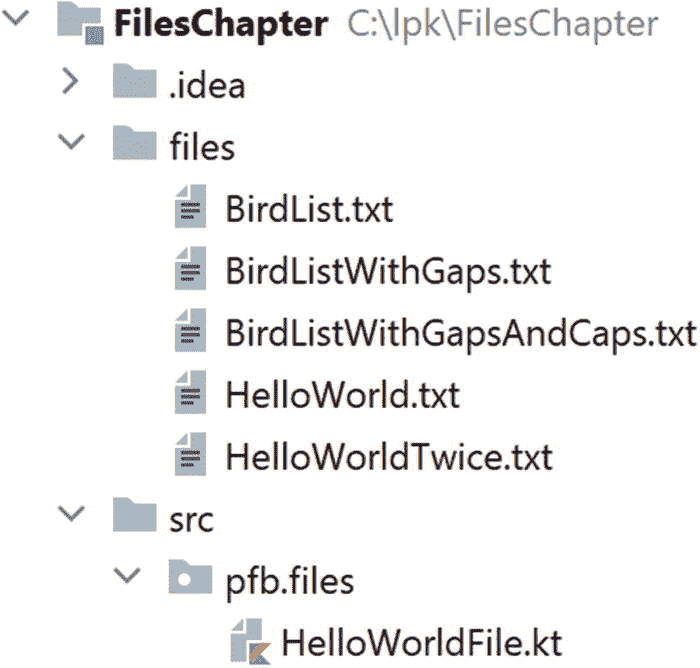
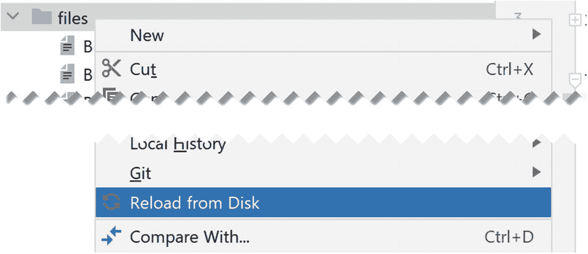
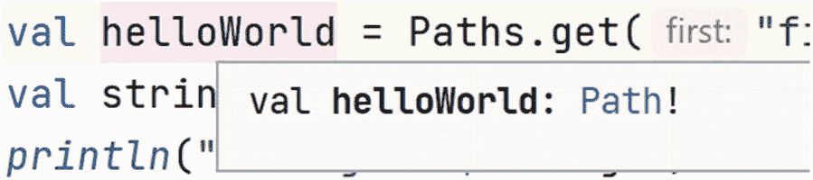
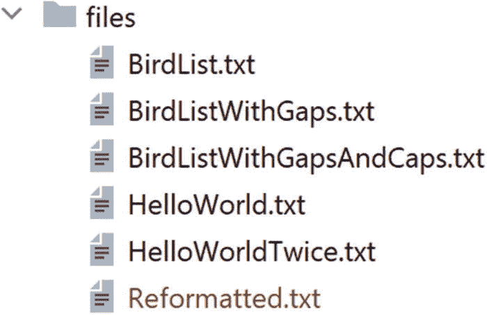

# 9. 文件系统

计算机可以在各种硬件上存储信息，例如磁盘、U 盘、光驱等。为了使程序员不必为每种存储设备编写特定的代码，操作系统提供了一种称为*文件系统*的抽象。反过来，Kotlin 为我们提供了探索计算机上的文件以及读写信息所需的工具。在本章中，我们将使用其中一些工具来读写文本文件。

在本章中，我们将在 IntelliJ 中使用一个新项目。要下载它，请使用菜单序列 `File` ➤ `New` ➤ `Project from Version Control` ➤ `Git`。与第 1 章一样，应该会显示一个**克隆仓库**对话框。将地址 [`https://github.com/Apress/learn-to-program-w-kotlin-files.git`](https://github.com/Apress/learn-to-program-w-kotlin-files.git) 复制到 **Git Repository URL** 字段中，选择一个目标目录，然后单击 **Clone** 按钮。

同样，与第 1 章一样，你可能会看到一个几乎完全空白的屏幕。如果是这样，请按照第 6 页上的相同技巧来显示项目文件树。除了一个名为 `HelloWorldFile.kt` 的 Kotlin 程序外，还应该有几个文本文件，如图 9-1 所示。



图 9-1

本章的项目除了一个 Kotlin 文件外，还包含文本文件


## 9.1 读取

文件 `HelloWorldFile.kt` 包含以下代码：

```
1   package lpk.files

3   import java.nio.file.Files
4   import java.nio.file.Paths

6   fun main() {
7       val helloWorld = Paths.get("files/HelloWorld.txt")
8       val strings = Files.readAllLines(helloWorld)
9       println("strings = $strings")
10   }
```

和往常一样，第一行命名了该程序所在的包。在本章中，我们将在名为 `lpk.files` 的包中工作。在包定义之后，我们有一系列 `import` 语句。如第 1 章所述，这些是特殊指令，用于告诉 Kotlin 我们的代码将依赖哪些已有的程序。在我们处理 `String`、`List` 等对象的程序中，我们一直在使用那些几乎总是需要的类，因此它们默认可用。随着我们编写更复杂的程序，我们将大量依赖其他代码库，因此几乎总是会使用 `import` 语句。

第 7 行定义了一个名为 `helloWorld` 的 `val`，其值为函数 `Paths.get` 的返回值。这个函数定义在一个用 Java 编写的代码库中（请记住 Java 是 Kotlin 的前身），这就是为什么我们需要在函数名中包含文件名 (`Paths`)。我们之前使用的函数，例如 `mutableListOf`，是“Kotlin 原生”的，因此使用起来稍微简单一些。

你可能想知道 `helloWorld` 的数据类型是什么。它是 `Int` 吗？是 `String` 吗？还是其他类型？问得好！实际上，它是一个 `Path`。我们可以通过将光标放在 `"helloWorld"` 这个词上或附近，然后同时按下 `Ctrl` 和 `q` 来得知这一点。当我们这样做时，会显示一个小弹出窗口，提供关于该 `val` 的信息，包括其数据类型，如图 9-2 所示。`Path` 是一个用于模拟计算机文件系统的类。本质上，一个 `Path` 对象代表一个文件或目录（文件夹）。



图 9-3

重新加载 `files` 目录



图 9-2

类型信息弹出窗口

在定义位置时，我们可以使用“绝对”或“相对”术语。绝对路径类似于

`C:\lpk\FilesChapter\files\HelloWorld.txt`

它精确地定义了机器文件系统中的一个位置。相对路径则需要根据当前位置进行解释。这就像定义地理位置一样。例如，如果有人问我们“邦迪海滩在哪里？”，而他们实际上就在邦迪，我们可以回答“在坎贝尔大道上”。但是，如果他们在雅加达，我们可能会回答“在澳大利亚悉尼邦迪的坎贝尔大道上”。在第 7 行，我们定义了一个相对于 `FilesChapter` 目录的 `Path`，该目录是在 IntelliJ 中运行程序时的“当前位置”。

在第 8 行，`val helloWorld` 作为参数传递给名为 `Files.readAllLines` 的函数。这是另一个来自 Java 库的函数，这就是为什么在调用它时需要使用包含 `"File"` 的全名。该函数读取由其参数描述的位置处的文件，并返回一个 `String` 的 `List`，文件中的每一行对应列表中的一个条目。

和往常一样，我们可以通过右键单击 `main` 函数旁边的绿色三角形，从弹出的菜单中运行程序。当我们这样做时，会得到以 `String` 形式打印的行列表。实际上只有一行，打印输出为

```
strings = [Hello world!]
```

编程挑战 9.1

你可以通过双击在 IntelliJ 中打开文本文件。打开文件 `HelloWorldTwice.txt`。里面有多少行文本？修改程序以读取并打印此文件的内容。你期望打印出什么？

编程挑战 9.2

文件 `BirdList.txt` 包含一位游客在澳大利亚内陆地区看到的鸟类物种列表。

修改程序以读取此文件。

然后添加代码来创建一个 `<String>` 的 `Set`。最后，添加一个 `for` 循环，遍历列表并将每个列表条目添加到 `Set` 中。

看到了多少种鸟类？

编程挑战 9.3

文件 `BirdListWithGaps.txt` 是由一个粗心的打字员编译的，其中包含空行。

你能修改你的程序来忽略这些空行吗？你可以使用以下代码测试一个 `String`（`str`）是否不为空：

```
if (bird != "") {
//将其添加到集合中
}
```

如果不忽略这些行，会发生什么？

## 9.2 写入

为了存储信息，我们可以使用函数 `Files.write`。这需要一个参数用于存储位置，以及一个参数用于要写入的数据。以下程序读取一个鸟类目击列表，将其转换为无空行的列表，然后将过滤后的列表写入 `files` 目录中一个名为 `Reformatted.txt` 的文件：

```
package lpk.files
import java.nio.file.Files
import java.nio.file.Paths
fun main() {
val helloWorld = Paths.get("files/BirdListWithGaps.txt")
val sightings = Files.readAllLines(helloWorld)
val noGaps = mutableListOf()
for (sighting in sightings) {
if (sighting != "") {
noGaps.add(sighting)
}
}
val reformatted = Paths.get("files/Reformatted.txt")
Files.write(reformatted, noGaps)
}
```

如果我们运行修改后的程序，将在 `files` 目录中创建一个新文件。要查看此文件，请右键单击该目录，然后选择**从磁盘重新加载**，如图 9-3 所示。然后该文件将如图 9-4 所示出现。如果你双击此文件，IntelliJ 将打开它，你可以检查它是否不包含空行。



图 9-4

新写入的文件在 IntelliJ 中以红色显示

编程挑战 9.4

在文件 `BirdListWithGapsAndCaps.txt` 中，我们有一个人的观察记录，他不仅留下了一些空行，而且对几次目击过于兴奋，并用大写字母记录了它们。修改程序，以便移除空行并将所有文本转换为小写。


## 9.3 本章小结与挑战题解答

在本章中，我们学习了如何读取和写入计算机的文件系统。

解答 9.1

文件中有两行，因此我们期望列表中有两个元素。要修改程序以读取此文件，我们只需将第 7 行改为指向 `HelloWorldTwice.txt` 文件即可：

```
package lpk.files
import java.nio.file.Files
import java.nio.file.Paths
fun main() {
val helloWorld = Paths.get("files/HelloWorldTwice.txt")
val strings = Files.readAllLines(helloWorld)
println("strings = $strings")
}
```

结果应为：

```
strings = [Hello world!, And hello again!]
```

解答 9.2

```
package lpk.files
import java.nio.file.Files
import java.nio.file.Paths
fun main() {
val file = Paths.get("files/BirdList.txt")
val sightings = Files.readAllLines(file)
val birdTypes = mutableSetOf()
for (bird in sightings) {
birdTypes.add(bird)
}
val numberOfTypes = birdTypes.size
println("Number of species = $numberOfTypes")
}
```

共有六种鸟类。

解答 9.3

```
package lpk.files
import java.nio.file.Files
import java.nio.file.Paths
fun main() {
val file = Paths.get("files/BirdListWithGaps.txt")
val sightings = Files.readAllLines(file)
val birdTypes = mutableSetOf()
for (bird in sightings) {
if (bird != "") {
birdTypes.add(bird)
}
}
val numberOfTypes = birdTypes.size
println("Number of species = $numberOfTypes")
}
```

如果不进行此过滤，计数会错误地将空行也算作一种鸟类。鸟类总数为六种。

解答 9.4

```
package lpk.files
import java.nio.file.Files
import java.nio.file.Paths
fun main() {
val original = Paths.get("files/BirdListWithGapsAndCaps.txt")
val sightings = Files.readAllLines(original)
val noGaps = mutableListOf()
for (sighting in sightings) {
if (sighting != "") {
noGaps.add(sighting.toLowerCase())
}
}
val reformatted = Paths.get("files/Reformatted.txt");
Files.write(reformatted, noGaps)
}
```

