# 10. 奥斯汀项目

前几章已经为我们提供了足够的基础技能，可以开始我们的第一个编程项目了。本项目的目标是对简·奥斯汀的小说进行统计分析。对于奥斯汀的每一部主要作品，我们将计算：

*   书中的单词数量
*   不重复单词的集合
*   单词使用频率的直方图

本项目将介绍现代软件工程的两大基石：*面向对象编程*和*单元测试*。

## 10.1 面向对象编程

面向对象编程（OOP）是过去三十年占主导地位的软件开发方法。当我们使用 OOP 开发软件时，我们会编写一组称为*类*的程序。这些是用于建模软件所解决的真实世界问题不同方面的数据类型。实际上，我们已经在使用 OOP 的一些方面了：`String` 是一个预构建的类，用于表示现实世界中的文本，而 `List`、`Set` 和 `Map` 则用于建模数据集合。

如前所述，我们将分析简·奥斯汀的书籍。我们如何将一本书视为对象的集合呢？答案取决于我们的软件试图解决什么问题。如果我们正在为图书分销商编写库存系统，我们将需要类来表示作者、出版商、主题等。如果我们正在编写一个控制印刷过程的程序，我们将需要类来描述书籍的版式和文本，以及纸张和装订的细节。

在奥斯汀项目中，我们将从书籍的文本文件开始，我们的目的是从中提取单词计数信息。我们从第 9 章了解到如何将文本文件读取到 `String` 的 `List` 中，每个元素对应书籍的一行。我们可以将此任务封装到一个数据类型中。

书籍的各行需要被拆分成单个单词，这可能不是一项容易的工作。这种预期的困难表明，为拆分行而创建一个类可能是值得的。

最后，我们可能还需要一个类来收集统计数据本身。综合以上考虑，以下是我们对奥斯汀项目所需类的初步猜测：

*   `Histogram`：记录一本书中单词使用情况的统计数据
*   `Line`：将 `String` 拆分为单个单词，以便记录到 `Histogram` 中
*   `Book`：从 `File` 中读取 `Line`，并填充 `Histogram`

软件的一大优点就是易于修改，因此我们无需为立即设计出完美的类而苦恼。在开发软件的过程中，我们会不断产生关于如何实现系统的新想法，并且可以轻松地对其进行重构，而不会造成太大损失。事实上，软件的持续重写是现代编程中如此重要的一部分，以至于它有一个专门的名称：*重构*。

## 10.2 单元测试

软件易于修改的缺点是我们很容易引入错误。我们对此的防御措施是*单元测试*。类的单元测试是一个程序，它创建该类的实例，对其调用函数，并检查这些调用的输出。这实际上非常简单，我们稍后编写的单元测试将使这些概念变得非常清晰。

有多种程序可以帮助我们编写和运行测试，我们将使用一个名为 JUnit 的程序，它是一个行业标准，并且与 IntelliJ 集成得非常好。

## 10.3 项目结构与设置

首先，通过克隆此仓库在 IntelliJ 中创建一个新项目：[`https://github.com/Apress/learn-to-program-w-kotlin-projectausten.git`](https://github.com/Apress/learn-to-program-w-kotlin-projectausten.git)。（如果您忘记了如何操作，请查看第 1 章或第 9 章。）项目结构如图 10-1 所示，比我们之前看到的要稍微复杂一些。`src` 目录有两个子目录：`main` 和 `test`。我们的程序将放入 `main` 目录，而它们的单元测试将放入 `test` 目录。

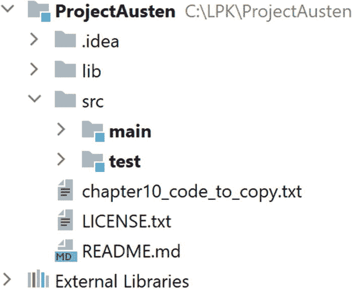

图 10-1

奥斯汀项目的结构

展开 `main` 目录，我们看到两个目录，一个名为 `kotlin`，另一个名为 `resources`，如图 10-2a 所示。`kotlin` 目录包含我们将要处理的代码。其中有我们确定的三个类的文件，它们被放在一个名为 `lpk.austen` 的包中。目前，这些 Kotlin 文件只是存根：还没有编写真正的代码。`resources` 目录包含奥斯汀四本书各自的文本文件。这些文件是从古腾堡计划下载的。

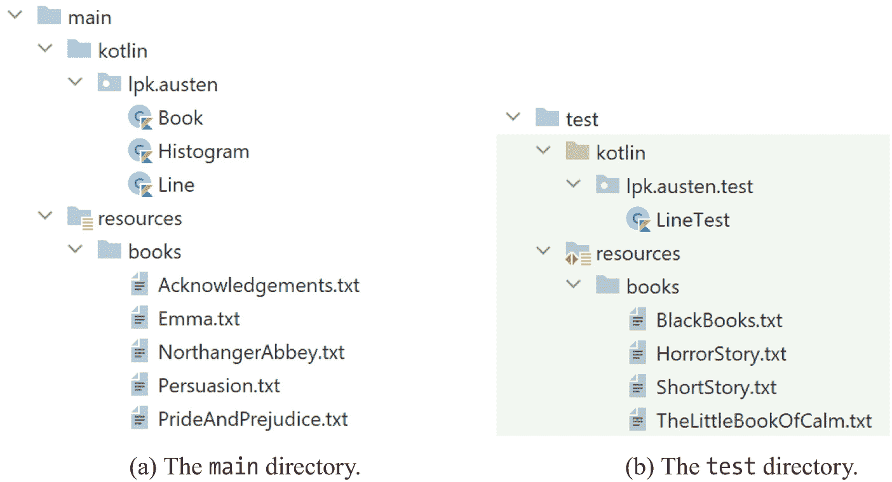

图 10-2

展开的项目树

`test` 目录的结构与 `main` 目录平行，如图 10-2b 所示。在 `kotlin` 子目录中，有一个名为 `LineTest` 的单个文件，位于名为 `lpk.austen.test` 的包中。这是 `Line` 单元测试的存根。在 `resources` 目录中，有一些非常短的书籍（不是奥斯汀的！），这些将用于我们编写 `Book` 类时对其进行的单元测试。


## 10.4 LineTest 与 Line

目前，`Line` 桩类（stub class）仅包含一条注释：

```
package lpk.austen
/**
* 表示从书籍中读取的一行文本。
*/
class Line
```

而 `LineTest` 则稍微有趣一些：

```
1   package lpk.austen.test

3   import org.junit.Test

5   class LineTest {
6       @Test
7       fun test1() {

9       }
10   }
```

这里有几个新知识点：

1.  在第 3 行，我们导入了 `org.junit.Test`，这是一种特殊的类，称为**注解**（`annotation`）。它们被用作代码中的标签。

2.  在第 6 行和第 7 行，我们声明了一个名为 `test1` 的函数，并使用第 3 行导入的 `@Test` 注解对其进行了标记。这个标签使得 JUnit 框架能够将 `test1` 识别为一个测试，并让 Kotlin 运行它。

3.  `test1` 的函数体目前是空的，因为 `Line` 中还没有可供测试的代码。

我们可以使用 IntelliJ 运行 `test1`，方法是点击代码左侧出现的绿色小三角形，如图 10-3a 所示。图 10-3b 展示了测试运行后 IntelliJ 的 **运行** 选项卡。测试通过了，因为它没有进行任何断言。

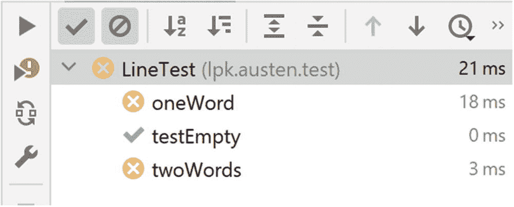

图 10-4

两个单元测试失败

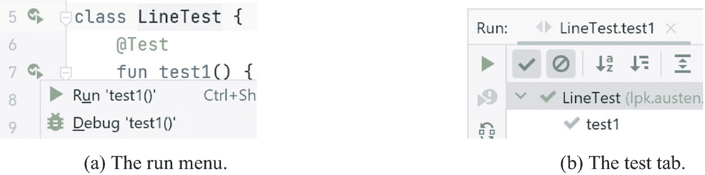

图 10-3

从 IntelliJ 运行 JUnit 测试

现在我们已经有了基本的框架，可以开始实现和测试 `Line` 了。我们知道需要从 `String`（书籍中的文本行）创建 `Line`。为了在代码中表达这一点，我们将 `Line.kt` 的内容修改为以下代码：

```
1   package lpk.austen

3   /**
4    * 表示从书籍中读取的一行文本。
5    */
6   class Line(line : String) {

8   }
```

这里的主要变化是将简单的声明 `Line` 替换为：

```
Line(line : String)
```

这就是所谓的**构造函数**。目前，构造函数什么也不做；我们只是在勾勒代码的轮廓。

我们还需要一个函数来检索文本行中包含的单词。这个函数需要返回一个 `String` 的 `List`，不妨命名为 `words`。在 Kotlin 中，这表示为：

```
fun words() : List
```

你可以将其理解为“有一个名为 `words` 的函数，它返回一个 `String` 的 `List`”。最后，为了让我们的代码能够编译，我们需要添加一个函数体。最简单的方法是返回一个空的 `List`：

```
1   fun words() : List {
2       return mutableListOf()
3   }
```

这里有趣的一点是，我们不需要在此代码片段第 2 行包含类型参数 `<String>`。原因是 Kotlin 编译器非常聪明，它能够根据第 1 行的返回类型推断出第 2 行需要哪种 `List`。这被称为类型推断，也是使 Kotlin 成为一种高效且令人愉悦的编程语言的原因之一。

到目前为止，我们的 `Line` 类几乎什么也没做，但这已经足够让我们编写一些有意义的测试了。最好尽早编写测试，因为这能帮助我们理清对正在处理的类的思考。

项目步骤 10.1

实现上述代码更改。完成后，`Line.kt` 应如下所示：

```
package lpk.austen
/**
* 表示从书籍中读取的一行文本。
*/
class Line(line : String) {
fun words(): List {
return mutableListOf()
}
}
```

现在检查单元测试是否仍然通过。

接下来，让我们为 `Line` 考虑一些非常简单的测试。首先，如果我们用一个空 `String` 创建一个 `Line`，那么应该期望这个 `Line` 的单词列表为空。我们可以用以下代码替换什么都不做的 `test1`：

```
1   @Test
2   fun testEmpty() {
3       val line = Line("")
4       Assert.assertEquals(0, line.words().size)
5   }
```

这里的第 3 行从一个空 `String` 创建了一个 `Line`。下一行调用了 JUnit 提供的名为 `Assert.assertEquals` 的函数。该函数接受两个参数并比较它们是否相等。如果不相等，测试将失败。因此，第 4 行检查 `0` 是否等于由 `line`（从空 `String` 创建）返回的 `words` 的 `size`。

如果你继续将 `test1` 更改为上面的 `testEmpty` 代码，IntelliJ 会显示一些错误，因为我们需要添加几个 `import` 语句。对于第 4 行，我们需要导入 `org.junit.Assert` 类。不太明显的是，我们还需要导入 `lpk.austen.Line` 类。需要导入它的原因是我们在 `lpk.austen.test` 包中工作，而这个包“不知道” `lpk.austen` 或任何其他包中的类。

项目步骤 10.2

使用正确的 `import` 语句和 `testEmpty` 的实现，`LineTest.kt` 应如下所示：

```
package lpk.austen.test
import org.junit.Test
import org.junit.Assert
import lpk.austen.Line
class LineTest {
@Test
fun testEmpty() {
val line = Line("")
Assert.assertEquals(0, line.words().size)
}
}
```

将代码复制到 `ListTest.kt` 中。运行测试并检查它是否通过。

第二个最简单的测试是检查：如果一个 `Line` 是从一个只包含一个单词的 `String` 创建的，那么 `words` 函数返回的恰好就是那个单词：

```
1   @Test fun oneWord() {
2       val line = Line("hello")
3       val words = line.words()
4       Assert.assertEquals(1, words.size)
5       Assert.assertEquals("hello", words[0])
6   }
```

这个测试从 `String "hello"` 创建了一个 `Line`。然后，这个对象的 `words List` 被提取为一个 `val`。在第 4 行，我们开始对提取的 `List` 进行断言。我们的第一个断言是它恰好包含一个元素。接下来，我们断言这个唯一的元素等于 `hello`。

项目步骤 10.3

将这个新测试复制到 `ListTest` 中，然后运行它并检查测试是否失败。

在我们返回处理 `Line` 之前，让我们再编写一个测试，因为这将真正帮助我们思考如何继续。这个测试是检查：从一个包含两个单词的 `String` 构造的 `Line`，其单词列表应包含这些单词，顺序正确，且没有其他单词。以下是这样一个测试的实现：

```
@Test fun twoWords() {
val line = Line("hello there")
val words = line.words()
Assert.assertEquals(2, words.size)
Assert.assertEquals("hello", words[0])
Assert.assertEquals("there", words[1])
}
```

我们可以通过点击 `LineTest` 单词左侧的绿色小三角形并选择 `运行 'LineTest'` 选项来一次性运行所有三个测试。当我们这样做时，测试报告应显示一个测试通过，两个测试失败。

项目步骤 10.4

将 `twoWords` 测试复制到 `LineTest` 中，并检查你是否得到与之前相同的测试报告。

现在让我们转向 `List` 的实现。为此，我们需要引入**字段**或**实例变量**的概念。这只是对类中所有函数都可用的 `val` 或 `var` 的一个花哨称呼。（即使字段是 `val`，实际上不会变化，它仍然被称为实例变量。这个术语在 Kotlin 之前就已存在。）字段通常在构造函数之后声明。我们的 `Line` 类将有一个 `String` 的 `List` 作为字段，该字段将由 `words` 函数返回。以下是包含这些更改的 `Line`：

```
1   package lpk.austen

3   /**
4    * 表示从书籍中读取的一行文本。
5    */
6   class Line(line : String) {
7       val words = mutableListOf()

9       fun words(): List {
10           return words
11       }
12   }
```


代码中仍然缺少一个关键部分，即第 6 行传入构造函数的参数`line`与第 7 行声明的字段`words`之间的连接。我们需要以某种方式从`line`中提取信息并将其放入`words`中。为此，我们使用所谓的*初始化块*或`init`块。其语法如下：

```
init {
//初始化代码...
}
```

通常将其放在字段声明和函数之间。

`init`代码有多种可能的实现方式。以下是一种相当简单的方法：

1.  声明一个名为`currentWord`的`var`变量，用于在构建每个单词时存储其`Char`字符。

2.  遍历`line`中的`Char`字符。对于每个字符：
    1.  如果是字母，则将其添加到`currentWord`中。

2.  如果是空格，则单词构建完成。将其添加到单词列表并重置`currentWord`。

3.  当遍历完`line`中的所有`Char`字符后，需要记得将`currentWord`添加到单词列表中。

在代码中，这表现为：

```
1   package lpk.austen

3   /**
4    * 表示从书中读取的一行文本。
5    */
6   class Line(line : String) {
7       val words = mutableListOf()

9       init {
10           var currentWord = ""
11           for (c in line) {
12               if (c == ' ') {
13                   words.add(currentWord)
14                   currentWord = ""
15               } else {
16                   currentWord = currentWord + c
17               }
18           }
19           words.add(currentWord)
20       }

22       fun words(): List {
23           return words
24       }
25   }
```

如果我们现在运行单元测试，会发现`oneWord`和`twoWords`都通过了，但`testEmpty`失败了。这是一个单元测试保护我们免受编码错误的例子。

项目步骤 10.5

将代码复制到`List`中，并验证两个测试通过，但`testEmpty`失败。

我们代码的一个问题在于第 19 行将`currentWord`添加到`words`的方式。此时`currentWord`可能为空，这种情况下我们不应该添加它。我们可以通过将第 19 行包裹在`if`块中来防止这种情况：

```
if (currentWord != "") {
words.add(currentWord)
}
```

项目步骤 10.6

进行此代码更改，然后检查所有单元测试是否都通过。

## 10.5 对`Line`的进一步测试

我们对`Line`的最后一次修改使所有三个测试都通过了，但实际上仍然存在一个问题。旧版本的代码会将空`String`添加到`words`字段。我们通过添加一个忽略空`String`的`if`语句来防止了这种情况。但还有另一个地方我们将`String`添加到了`words`中：在循环内部。如果输入的`String`包含多个空格，那么连续的两个`Char`字符都会满足第 12 行`if`语句的条件。这将导致添加一个空单词。让我们通过一个测试来证明这一点。

项目步骤 10.7

将以下新测试添加到`LineTest`中：

```
@Test fun doubleSpace() {
val line = Line("a  b")
val words = line.words()
Assert.assertEquals(2, words.size)
Assert.assertEquals("a", words[0])
Assert.assertEquals("b", words[1])
}
```

然后确认测试失败。*如果测试没有失败，很可能是因为"a b"中的双空格没有正确复制。与所有章节一样，项目树中有一个文件，可以从中复制所有必需的代码——请使用该文件。*

解决这个问题的一种方法是将第 8 行包裹在`if`语句中，就像第 14 行一样。如果我们这样做，就会在两个地方重复完全相同的逻辑，这几乎总是一件坏事。相反，我们将创建一个新函数来将`String`添加到单词列表，并在两个地方使用这个函数。

项目步骤 10.8

在`Line`中创建以下新函数：

```
fun addWord(str: String) {
if (str != "") {
words.add(str)
}
}
```

然后修改`init`块以使用新函数：

```
package lpk.austen
/**
* 表示从书中读取的一行文本。
*/
class Line(line: String) {
val words = mutableListOf()
init {
var currentWord = ""
for (c in line) {
if (c == ' ') {
addWord(currentWord)
currentWord = ""
} else {
currentWord = currentWord + c
}
}
addWord(currentWord)
}
fun words(): List {
return words
}
fun addWord(str: String) {
if (str != "") {
words.add(str)
}
}
}
```

确认所有四个单元测试现在都通过。

到目前为止，我们的测试只使用了小写文本。我们是否希望将大写单词与相同单词的小写版本区别对待？不。让我们确保`List`中的单词始终转换为小写。同样，我们从单元测试开始。

项目步骤 10.9

将以下内容添加到`ListTest`中：

```
@Test fun wordsAreLowerCase() {
val line = Line("Hello THERE")
val words = line.words()
Assert.assertEquals(2, words.size)
Assert.assertEquals("hello", words[0])
Assert.assertEquals("there", words[1])
}
```

检查测试是否失败。思考我们如何修改`Line`以使测试通过：`String`是在哪里添加到`words`中的，以及我们如何将它们转换为小写？

修复`List`的一种方法是修改`addWord`，在添加之前将输入的`String`转换为小写：

```
fun addWord(str: String) {
if (str != "") {
words.add(str.toLowerCase())
}
}
```

在这里，“不重复自己”的策略得到了回报。如果我们在两个地方调用了`words.add`，那么我们就需要在两个实例中都添加`toLowerCase`调用。很容易忘记其中一个。

项目步骤 10.10

修复代码中的`addWord`函数，并检查所有测试是否通过。


## 10.6 HistogramTest 与 Histogram

至此，我们已经有了 `Line` 的基本实现以及一个基本的单元测试类。与其继续完善这些，不如将注意力转向 `Histogram`。根据之前的讨论，我们对其所需的功能已经有了相当清晰的认识。我们需要能够：

*   记录某个单词已出现
*   检索已记录单词的 `Set` 集合
*   获取任意单词被记录的次数

我们可以为相应的函数提供桩代码，然后开始测试。

项目步骤 10.11

按如下方式修改 `Histogram`：

```
package lpk.austen
/**
* 收集单词使用数据。
*/
class Histogram {
    fun record(word: String) {}
    fun allWords(): Set<String> {
        return mutableSetOf()
    }
    fun numberOfTimesGiven(word: String): Int {
        return 0
    }
}
```

要创建一个单元测试，在项目树中右键点击 `lpk.austen.test`，然后选择新建 Kotlin 文件的选项，如图 10-5 所示。当 **New Kotlin File/Class** 对话框出现时，输入 `"HistogramTest"` 作为文件名。创建好用于存放测试的文件后，我们来思考一些测试用例。在设计单元测试时，一个好的起点是考虑“小型”测试对象会发生什么。所谓“小型”取决于具体问题。对于 `HistogramTest`，我们可以从一个空的 `Histogram` 开始，然后记录零个、一个或两个单词。这种方法能让我们立刻得到几个场景：

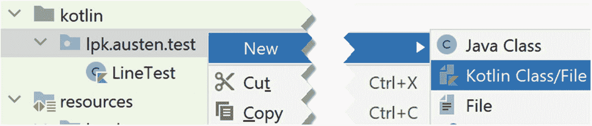

图 10-5

创建 `HistogramTest`

| 场景 | 描述 |
| --- | --- |
| 空直方图 | 首次创建 `Histogram` 时，其中没有任何单词。 |
| 未知单词 | 如果查询一个未记录单词的计数，我们会得到 0。 |
| 一个单词 | 如果只记录一个单词，那么 `allWords` 的 `Set` 集合将只包含该单词，且其计数为 1。 |
| 同一单词两次 | 如果记录同一个单词两次，那么它的计数将为 2。 |
| 两个单词 | 如果记录两个不同的单词，那么它们都会出现在 `allWords` 中，且每个单词的 `count` 都为 1。 |

项目步骤 10.12

让我们实现第一个测试场景。将 `HistogramTest.kt` 中的内容替换为以下代码：

```
package lpk.austen.test
import org.junit.Assert
import org.junit.Test
import lpk.austen.Histogram
public class HistogramTest {
    @Test
    fun emptyToStartWith() {
        val histogram = Histogram()
        Assert.assertEquals(0, histogram.allWords().size)
    }
}
```

为什么会有 `Histogram` 的 `import` 语句？

你认为这个测试会通过还是失败？

运行它并找出答案。

未知单词的测试也很容易编写。当 `Histogram` 首次创建时，任何单词对它来说都是未知的。因此，测试可以通过创建一个 `Histogram` 对象，然后以任意 `String` 作为参数调用 `numberOfTimesGiven` 来实现。我们期望这个调用的结果是 0。

项目步骤 10.13

以下是前面描述的测试的框架：

```
@Test
fun unknownWord() {
}
```

添加一行代码来创建一个名为 `histogram` 的 `Histogram`。

现在添加一行代码，创建一个名为 `given` 的 `val`，其值为调用

```
histogram.numberOfTimesGiven("xylophone")
```

的结果。

最后，添加一行断言代码，验证 `given` 等于 0。你完成的测试应该类似于这样：

```
@Test
fun unknownWord() {
    val histogram = Histogram()
    val given = histogram.numberOfTimesGiven("xylophone")
    Assert.assertEquals(0, given)
}
```

你期望这个测试通过还是失败？

运行它并查看结果。

项目步骤 10.14

现在让我们编写一个测试，检查记录一个单词后 `Histogram` 的状态。以下代码创建了一个 `Histogram`，记录了单个单词 `"piano"`，然后将 `allWords` 的结果提取为一个名为 `words` 的 `val`：

```
@Test
fun recordOneWord() {
    val histogram = Histogram()
    histogram.record("piano")
    val words = histogram.allWords()
}
```

将此代码复制到 `HistogramTest` 中。


你期望 `words` 包含多少个元素？

添加一行代码来检查（断言）这一点。

`Assert.assertTrue` 函数可用于检查某个语句是否为 `true`。添加以下代码行，用于检查 `words` 是否包含 `"piano"`：

```
Assert.assertTrue(words.contains("piano"))
```

这两行代码共同精确地检查了 `words` 中的内容：我们检查了它只有一个元素，并且检查了该元素是什么。

最后，添加一行代码，检查对 `"piano"` 应用 `numberOfTimesGiven` 的结果是否为 1。

完整的测试应如下所示：

```
@Test
fun recordOneWord() {
val histogram = Histogram()
histogram.record("piano")
val words = histogram.allWords()
Assert.assertEquals(1, words.size)
Assert.assertTrue(words.contains("piano"))
Assert.assertEquals(1, histogram.numberOfTimesGiven("piano"))
}
```

项目步骤 10.15

我们接下来要考察的测试场景是同一个单词被记录两次的情况。以下是此场景的设置代码：

```
@Test
fun recordOneWordTwice() {
val histogram = Histogram()
histogram.record("piano")
histogram.record("piano")
val words = histogram.allWords()
}
```

你期望 `words` 包含什么？请记住这是一个 `Set`。添加断言来检查这一点。

`histogram.numberOfTimesGiven("piano")` 的值应该是什么？为此添加一个断言。

完整的测试应如下所示：

```
@Test
fun recordOneWordTwice() {
val histogram = Histogram()
histogram.record("piano")
histogram.record("piano")
val words = histogram.allWords()
Assert.assertEquals(1, words.size)
Assert.assertTrue(words.contains("piano"))
Assert.assertEquals(2, histogram.numberOfTimesGiven("piano"))
}
```

项目步骤 10.16

让我们测试记录两个不同单词时会发生什么。创建一个名为 `recordTwoWords` 的测试函数。

在测试函数中，创建一个名为 `histogram` 的 `Histogram`。添加记录单词 `"piano"` 和 `"violin"` 的代码行。创建一个名为 `words` 的 `val`，其值为在 `histogram` 上调用 `allWords` 返回的结果。

`words` 应该包含多少个元素？为此添加一个断言。

添加一行代码，检查 `words` 是否包含 `"piano"`。

添加一行代码，检查 `words` 是否包含 `"violin"`。

添加代码行，检查每个单词都被记录了一次。

完整的测试应如下所示：

```
@Test
fun recordTwoWords() {
val histogram = Histogram()
histogram.record("piano")
histogram.record("violin")
val words = histogram.allWords()
Assert.assertEquals(2, words.size)
Assert.assertTrue(words.contains("piano"))
Assert.assertTrue(words.contains("violin"))
Assert.assertEquals(1, histogram.numberOfTimesGiven("piano"))
Assert.assertEquals(1, histogram.numberOfTimesGiven("violin"))
}
```

有了这些测试，我们就可以实现 `Histogram` 了。实现方式有很多种，我们可以自由选择任何能让测试通过的实现。一种方法是使用 `Map<String,Int>` 来记录单词计数，就像我们在第 8 章中使用 `Map` 记录鸟类计数一样。`Map` 需要能被 `Histogram` 中的所有函数访问，因此我们将其声明为一个字段，命名为 `counter`。

项目步骤 10.17

将 `Histogram` 修改为：

```
1   package lpk.austen

3   /**
4    * 收集单词使用数据。
5    */
6   class Histogram {

8       val counter = mutableMapOf()

10       fun record(word: String) {
11       }

13       fun allWords(): Set {
14           return counter.keys
15       }

17       fun numberOfTimesGiven(word: String): Int {
18           return counter[word] ?: 0
19       }
20   }
```

第 8 行声明了我们的 `counter` 字段。该字段在第 14 行的 `allWords` 实现中被使用。`Map<String, Int>` 的 `keys` 是所有 `Map` 中包含 `Int` 值的 `String`。

在第 18 行，我们直接从 `Map` 中获取某个 `String` 的计数。你还记得我们为什么使用 Elvis 运算符吗？如果不记得，请查看第 97 页的解释。

关于前面列出的代码，你可能想知道为什么没有构造函数和 `init` 块。与 `Line` 不同，创建 `Histogram` 不需要任何信息，因此无需添加构造函数。至于没有 `init` 块，唯一需要的字段初始化已在字段声明中完成。

`Histogram` 中唯一剩余需要实现的部分是 `record` 函数。如前所述，我们已经见过类似的内容。

项目步骤 10.18

让我们实现 `record`。它有三行代码。第一行，我们检索传入参数 `word` 的当前计数：

```
val currentCount = counter[word] ?: 0
```

接下来，我们定义一个新的 `val`，它是旧计数加 1：

```
val newCount = currentCount + 1
```

最后，我们将 `newCount` 以键 `word` 放入 `counter`：

```
counter.put(word, newCount)
```

进行这些更改，然后重新运行单元测试。现在它们应该全部通过。

如果你遇到了问题，可以使用以下 `Histogram.kt` 代码：

```
package lpk.austen
/**
* 收集单词使用数据。
*/
class Histogram {
val counter = mutableMapOf()
fun record(word: String) {
val currentCount = counter[word] ?: 0
val newCount = currentCount + 1
counter.put(word, newCount)
}
fun allWords(): Set {
return counter.keys
}
fun numberOfTimesGiven(word: String): Int {
return counter[word] ?: 0
}
}
```


## 10.7 BookTest 与 Book

从我们之前简短的设计讨论可知，`Book` 由文本文件创建，并包含一个 `Histogram` 对象，用于记录书中的单词。文本文件可作为构造函数参数传入，其信息提取工作可在 `init` 块中完成。以下是 `Book` 的部分实现：

```
package lpk.austen
import java.nio.file.Files
import java.nio.file.Path
import java.nio.file.Paths
/**
* 从文本文件读取书籍并生成单词使用信息。
*/
class Book(bookFile : Path) {
val histogram = Histogram()
init {
//此处编写读取书籍的代码。
}
}
```

项目步骤 10.19

将此代码粘贴到 `Book.kt` 中，替换该文件中的现有内容。

我们对 `Book` 的单元测试将通过从 `test/resources/books` 目录中的短文本文件创建 `Book` 对象来进行。这些文件都非常小，我们可以轻松统计其中的单词数量，单元测试会将我们的统计结果与代码返回的值进行比较。让我们开始吧！

项目步骤 10.20

在其他单元测试文件旁边创建一个空文件 `BookTest.kt`。用以下代码替换该文件中的内容：

```
package lpk.austen.test
import org.junit.Assert
import org.junit.Test
import lpk.austen.Book
import java.nio.file.Paths
class BookTest {
@Test fun shortStory() {
val book = Book(Paths.get(
"src/test/resources/books/ShortStory.txt"))
val allWords = book.histogram.allWords()
}
}
```

这段代码中比较繁琐的部分是 `ShortStory.txt` 文件的路径，但这只是我们在第 9 章中遇到的那种 `Path` 构造方式。现在双击 `ShortStory.txt` 文件并查看文本内容。其中有多少个不同的单词？它们分别是什么？

项目步骤 10.21

在测试函数 `shortStory` 中添加一个断言，检查是否有四个单词。

针对 `ShortStory.txt` 中的每个单词，在测试中添加一行，检查该单词是否在 `Set` 中。

针对 `ShortStory.txt` 中的每个单词，在测试中添加一行，检查 `book.histogram` 对该单词的计数是否正确。

完成此步骤后，你的测试代码应如下所示：

```
@Test fun shortStory() {
val book = Book(Paths.get(
"src/test/resources/books/ShortStory.txt"))
val allWords = book.histogram.allWords()
Assert.assertEquals(4, allWords.size)
Assert.assertTrue(allWords.contains("the"))
Assert.assertTrue(allWords.contains("beginning"))
Assert.assertTrue(allWords.contains("middle"))
Assert.assertTrue(allWords.contains("end"))
Assert.assertEquals(3, book.histogram.numberOfTimesGiven("the"))
Assert.assertEquals(1, book.histogram.numberOfTimesGiven("beginning"))
Assert.assertEquals(1, book.histogram.numberOfTimesGiven("middle"))
Assert.assertEquals(1, book.histogram.numberOfTimesGiven("end"));
}
```

当然，这个测试会失败，因为我们还没有实现 `Book` 的 `init` 块。

我们可以通过让 `Line` 和 `Histogram` 类协同工作来记录 `Book` 中的所有单词，从而实现 `init` 块。书籍文件的行将被转换为 `Line` 对象，然后这些 `Line` 对象将提供单词，由 `Histogram` 进行记录：

```
1   init {
2       val lines = Files.readAllLines(bookFile)
3       for (str in lines) {
4           val line = Line(str)
5           for (word in line.words()) {
6               histogram.record(word)
7           }
8       }
9   }
```

我们来详细分析一下这段代码，因为它有点复杂。在第 2 行，我们从构造函数中读取 `bookFile` 到一个名为 `lines` 的 `val` 中。与第 92 页的鸟类目击示例一样，`lines` 是一个 `String` 类型的 `List`，文本文件的每一行对应一个条目。在第 3 行，我们遍历 `lines` 中的元素。第 4 行根据循环 `val` 当前表示的文本行创建一个名为 `line` 的 `Line` 实例。由于 `line` 是 `Line` 类型，它提供了“点”函数 `words`。在第 5 行，我们遍历 `line.words` 中的元素，并在第 6 行将当前 `word` 添加到我们的 `histogram` 字段中。

项目步骤 10.22

将此代码复制到 `Book` 中，并检查单元测试是否通过。

项目步骤 10.23

在 `BookTest` 中添加一个使用 `HorrorStory.txt` 的测试。该测试应如下所示：

```
@Test fun horrorStory() {
val book = Book(Paths.get(
"src/test/resources/books/HorrorStory.txt"))
val allWords = book.histogram.allWords()
Assert.assertEquals(7, allWords.size)
Assert.assertTrue(allWords.contains("it"))
Assert.assertTrue(allWords.contains("was"))
Assert.assertTrue(allWords.contains("a"))
Assert.assertTrue(allWords.contains("and"))
Assert.assertTrue(allWords.contains("stormy"))
Assert.assertTrue(allWords.contains("night"))
Assert.assertTrue(allWords.contains("dark"))
Assert.assertEquals(1, book.histogram.numberOfTimesGiven("it"))
Assert.assertEquals(1, book.histogram.numberOfTimesGiven("was"))
Assert.assertEquals(1, book.histogram.numberOfTimesGiven("a"))
Assert.assertEquals(1, book.histogram.numberOfTimesGiven("dark"));
Assert.assertEquals(1, book.histogram.numberOfTimesGiven("and"));
Assert.assertEquals(1, book.histogram.numberOfTimesGiven("stormy"));
Assert.assertEquals(1, book.histogram.numberOfTimesGiven("night"));
}
```

运行测试。它应该能通过。

项目步骤 10.24

在 IntelliJ 中打开 `TheLittleBookOfCalm.txt` 文件。这段文本比 `ShortStory` 或 `HorrorStory` 稍微复杂一些，因为它包含一个空行，并且句子以句号结尾。在 `BookTest` 中添加一个基于此文本文件的测试。它应如下所示：

```
1   @Test
2   fun littleBookOfCalmTest() {
3       val book = Book(Paths.get(
4        "src/test/resources/books/TheLittleBookOfCalm.txt"))
5       //这本书有两行，包含几个重复的单词。
6       //还有一个空行。
7       //两个非空行以句号结尾。
8       val histogram = book.histogram
9       Assert.assertEquals(2, histogram.numberOfTimesGiven("this"))
10       Assert.assertEquals(1, histogram.numberOfTimesGiven("is"))
11       Assert.assertEquals(1, histogram.numberOfTimesGiven("a"))
12       Assert.assertEquals(3, histogram.numberOfTimesGiven("very"))
13       Assert.assertEquals(2, histogram.numberOfTimesGiven("short"))
14       Assert.assertEquals(2, histogram.numberOfTimesGiven("book"))
15       Assert.assertEquals(1, histogram.numberOfTimesGiven("we"))
16       Assert.assertEquals(1, histogram.numberOfTimesGiven("hope"))
17       Assert.assertEquals(1, histogram.numberOfTimesGiven("that"))
18       Assert.assertEquals(1, histogram.numberOfTimesGiven("you"))
19       Assert.assertEquals(1, histogram.numberOfTimesGiven("find"))
20       Assert.assertEquals(1, histogram.numberOfTimesGiven("calming"))
21   }
```

运行此测试。它应该会失败。

为什么 `TheLittleBookOfCalm.txt` 没有被正确处理？为了调查原因，我们可以在测试中添加一行，在做出任何断言之前打印出 `histogram` 中的单词。在 `littleBookOfCalmTest` 的第 8 行之后添加以下语句：

```
print(histogram.allWords())
```

然后再次运行此测试。它仍然会失败，但也会打印出类似这样的内容：

```
[a, very, calming., book, this, is, hope, we, that, find, short, book., you]
```

这揭示了问题所在：我们没有去除句号，因此同时得到了 `"book"` 和 `"book."` 的条目。此外，还有一个 `"calming."` 的条目，而不是 `"calming"`。这是 `Line` 中的一个 bug（错误）。


## 10.8 回到 `LineTest` 和 `Line`

我们之前对 `Line` 的实现是有缺陷的，因为它没有处理句号。实际上，它也没有处理逗号、分号、冒号、引号或任何其他标点符号 `Char`。如果我们查看 `PrideAndPrejudice.txt` 的前 30 行左右，会发现其中还使用了下划线字符。因此，让我们在 `LineTest` 中添加对这些字符的检查。

项目步骤 10.25

将以下测试函数复制到 `LineTest` 中：

```
@Test
fun ignorePunctuation() {
val line = Line("Hello. Goodbye! Yes? No, no.")
val words = line.words()
Assert.assertEquals(5, words.size)
Assert.assertEquals("hello", words[0])
Assert.assertEquals("goodbye", words[1])
Assert.assertEquals("yes", words[2])
Assert.assertEquals("no", words[3])
Assert.assertEquals("no", words[4])
}
@Test fun morePunctuation() {
val line = Line("Hello; _Goodbye_! X: 5")
val words = line.words()
Assert.assertEquals(4, words.size)
Assert.assertEquals("hello", words[0])
Assert.assertEquals("goodbye", words[1])
Assert.assertEquals("x", words[2])
Assert.assertEquals("5", words[3])
}
```

运行它们并确认测试失败。

我们还没有为其编写测试的一个内容是双引号字符。我们使用双引号来*界定*（定义开始和结束）`String`，因此不能简单地将一个双引号放入 `String` 中并期望它能正常工作。我们需要做的是，在 `String` 中想要表示字面意义的双引号前面加上一个反斜杠 `Char`。这被称为*转义*字符。

项目步骤 10.26

将以下针对双引号的测试添加到 `LineTest` 中：

```
@Test
fun doubleQuotes() {
val line = Line("\"It's not.\"")
val words = line.words()
Assert.assertEquals(2, words.size)
Assert.assertEquals("it's", words[0])
Assert.assertEquals("not", words[1])
}
```

该测试将会失败。

以下是 `Line` 中的 `init` 块：

```
1   init {
2       var currentWord = ""
3       for (c in line) {
4           if (c == ' ') {
5               addWord(currentWord)
6               currentWord = ""
7           } else {
8               currentWord = currentWord + c
9           }
10       }
11       addWord(currentWord)
12   }
```

第 4 行是一个 `if` 语句，当条件为 `true` 时，会分支执行中断当前正在构建的单词的代码。这个 `if` 语句只考虑了空格 `Char`。我们可以通过使用 `||` 运算符来修复这个问题：

```
if (c == ' ' || c == ',' || c == '.' || ...) {
```

然而，这将会变成一行非常复杂的代码，因为可能有太多标点符号字符可以终止一个单词。相反，我们将创建一个函数，该函数接收一个 `Char` 作为输入，并根据该 `Char` 是否应该中断一个单词来返回 `true` 或 `false`。具有 `true` 和 `false` 值的数据类型称为 `Boolean`，这将是我们的新函数的返回类型。我们将不再在第 4 行将 `c` 与空格 `Char` 进行比较，而是调用这个名为 `isWordTerminator` 的新函数。

项目步骤 10.27

用这个新版本替换 `Line` 的现有代码：

```
package lpk.austen
/**
* 表示从书中读取的一行文本。
*/
class Line(line: String) {
val words = mutableListOf()
init {
var currentWord = ""
for (c in line) {
if (isWordTerminator(c)) {
addWord(currentWord)
currentWord = ""
} else {
currentWord = currentWord + c
}
}
addWord(currentWord)
}
fun words(): List {
return words
}
fun addWord(str: String) {
if (str != "") {
words.add(str.toLowerCase())
}
}
fun isWordTerminator(c: Char): Boolean {
if (c == ' ') return true
if (c == '.') return true
if (c == ',') return true
if (c == '!') return true
if (c == '?') return true
if (c == '\"') return true
if (c == '_') return true
if (c == ';') return true
if (c == ':') return true
return false
}
}
```

检查 `Line` 的所有单元测试现在是否都通过了。

## 10.9 使用真实数据进行测试

在对 `Line` 进行这些修正之后，`Book` 的所有单元测试应该都能通过了。为了确保我们的代码是正确的，我们应该编写一个使用奥斯汀作品实际文本的测试。

在 IntelliJ 中，找到 `PrideAndPrejudice.txt` 文件并打开它。复制前 32 行文本。右键单击 `test` 目录的 `resources` 中的 `books` 目录（确保是 `test` 目录），如图 10-6 所示，然后选择 **New** ➤ **File** 选项。将出现一个对话框，要求输入文件名。在其中输入 `Page1.txt` 并按 `Enter` 键。打开新文件（它甚至可能自动打开），并粘贴从 `PrideAndPrejudice.txt` 复制的文本。

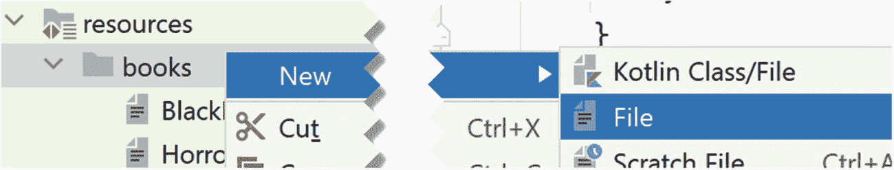

图 10-6

添加新的测试数据文件

项目步骤 10.28

将以下内容添加到 `BookTest` 中：

```
@Test
fun prideAndPrejudice() {
val book = Book(Paths.get(
"src/test/resources/books/Page1.txt"))
//来自《傲慢与偏见》开头的 32 行
val histogram = book.histogram
//检查一些我们使用文本编辑器统计过的单词
Assert.assertEquals(1, histogram.numberOfTimesGiven("pride"))
Assert.assertEquals(5, histogram.numberOfTimesGiven("it"))
Assert.assertEquals(3, histogram.numberOfTimesGiven("and"))
Assert.assertEquals(3, histogram.numberOfTimesGiven("bennet"))
//检查一些后面跟着标点符号的单词是否被正确统计
Assert.assertEquals(3, histogram.numberOfTimesGiven("you"))
Assert.assertEquals(2, histogram.numberOfTimesGiven("she"))
}
```

检查测试是否通过。

我们刚刚添加的基于真实数据的测试，应该能让我们对代码充满信心。


## 10.10 接近完成

为了分析 `main/resources/books` 目录下的文件，我们需要为 `Book` 添加一个 `main` 函数。回顾第 1 章，`main` 函数是 Kotlin 程序的入口点。

项目步骤 10.29

将以下代码复制到 `Book.kt` 中，紧跟在 `import` 语句之后：

```
fun main() {
val book = Book(Paths.get(
"src/main/resources/books/PrideAndPrejudice.txt"))
val histogram = book.histogram
val allWords = histogram.allWords()
for (word in allWords) {
val count = histogram.numberOfTimesGiven(word)
println("$word $count")
}
}
```

图 10-7 展示了 `main` 函数在文件中的位置。

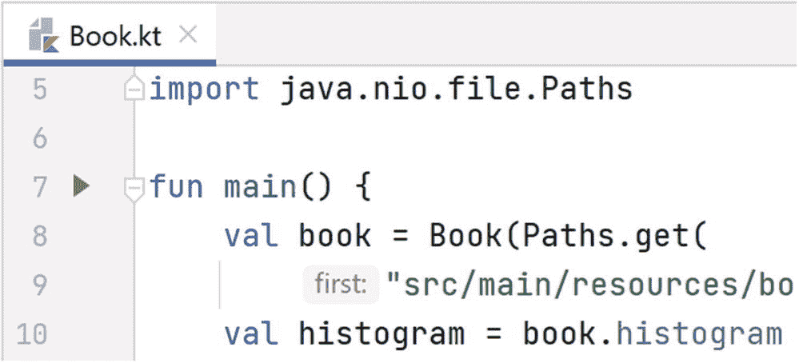

图 10-7

添加 `main` 函数

`main` 函数的左侧会显示一个绿色三角形。右键点击该绿色三角形即可运行程序。

输出结果应有几千行。如果滚动到顶部，我们会看到类似下面的内容：

```
pride 45
and 3527
prejudice 6
by 634
jane 260
austen 1
chapter 61
1 1
it 1520
is 859
a 1939
truth 27
universally 3
acknowledged 20
```

单词的实际顺序可能与这里显示的不同，因为我们没有在数据结构中指定顺序。如果我们继续向下滚动列表，会发现几个小问题。

首先，有一些 `Char` 字符本应作为单词分隔符，但却被附加到了单词上。例如，右括号没有被分离，因此 `"early)"` 被计为一个单词。

其次，我们看到单引号显然被当作单词使用了 17 次。如果我们在文本中搜索单引号，就会明白原因：当一个角色在说话并引用另一个人的话时，单引号被用来界定嵌套的引语，然后可能会与其他标点符号混淆。以下是这种嵌套引用的一个例子：

```
"... if ... a friend were to say, 'Bingley, you had better
stay till next week,' you would probably do it ..."
```

我们的代码将 `"week,"` 后面的单引号标记计为一个单词。

这些问题说明了使用真实世界的数据进行编程是多么混乱。处理这类异常情况可能需要大量的工作。

项目步骤 10.30

将以下测试添加到 `LineTest` 中：

```
@Test
fun brackets() {
val line = Line("(left, right)")
val words = line.words()
Assert.assertEquals(2, words.size)
Assert.assertEquals("left", words[0])
Assert.assertEquals("right", words[1])
}
```

运行它并检查测试是否失败。

项目步骤 10.31

你能修复 `Line` 中的 `isWordTerminator` 函数吗？尝试一下，看看新添加的测试是否通过。

以下是该函数的一个修复版本：

```
fun isWordTerminator(c: Char): Boolean {
if (c == ' ') return true
if (c == '.') return true
if (c == ',') return true
if (c == '!') return true
if (c == '?') return true
if (c == '\"') return true
if (c == '_') return true
if (c == ';') return true
if (c == ':') return true
if (c == '(') return true
if (c == ')') return true
return false
}
```

项目步骤 10.32

将以下测试添加到 `LineTest` 中：

```
@Test
fun singleQuoteAfterComma() {
val line = Line("week,' you")
val words = line.words()
Assert.assertEquals(2, words.size)
Assert.assertEquals("week", words[0])
Assert.assertEquals("you", words[1])
}
```

这会检查字符串 `"week,' you"` 是否被分割成两个单词（而不是三个）。当然，这个测试会失败。

我们当前的 `List` 实现包含以下用于添加单词的代码：

```
1   fun addWord(str: String) {
2       if (str != "") {
3           words.add(str.toLowerCase())
4       }
5   }
```

在这个函数的第 2 行，我们使用了一个 `if` 语句来过滤掉空单词。让我们重构这段代码，以便能够轻松过滤掉所有无意义的单词。

项目步骤 10.33

添加以下函数：

```
fun isWord(str: String) : Boolean {
if (str == "") return false
return true
}
```

到 `Line` 中。然后修改 `addWord`，在其 `if` 语句中调用这个新函数。

如果此时运行 `Line` 的单元测试，`singleQuoteAfterComma` 将会失败。但是，其他测试应该仍然通过。这些单元测试正在检查我们的重构至少没有让情况变得更糟。

项目步骤 10.34

你能修改 `isWord` 来过滤掉单引号标记吗？

以下是其中一种实现方式：

```
fun isWord(str: String) : Boolean {
if (str == "") return false
if (str == "'") return false
return true
}
```

通过这次对 `Line` 的最新修改，我们所有的单元测试都应该通过了。我们提取出 `isWord` 函数的一个好处是，我们可以轻松地修改它来检查其他非单词。例如，在第 144 页的 `main` 函数输出中，我们看到数字 `1` 被包含在单词列表中。现在，有些人可能会认为这是书中的一个单词，而另一些人则持相反意见。`addWord` 函数可以根据个人对此事的看法进行修改，以包含或排除数字。目前，我们暂时保留数字。

## 10.11 统计单词数量

我们还没有兑现确定本书最终单词数的承诺。为了获取单词数量，我们将向 `Histogram` 添加一个名为 `totalWords` 的新函数。这个函数不接受任何参数，并返回一个 `Int` 类型，因此一个可能的桩函数是：

```
fun totalWords() : Int {
return 0
}
```

项目步骤 10.35

将 `totalWords` 函数添加到 `Histogram` 中。

对于单元测试，我们可以从一个空的 `Histogram` 开始，向其中添加单词，并在过程中检查总数：

```
@Test
fun totalNumberOfWords() {
val histogram = Histogram()
Assert.assertEquals(0, histogram.totalWords())
histogram.record("piano")
Assert.assertEquals(1, histogram.totalWords())
histogram.record("piano")
Assert.assertEquals(2, histogram.totalWords())
histogram.record("cello")
Assert.assertEquals(3, histogram.totalWords())
histogram.record("guitar")
Assert.assertEquals(4, histogram.totalWords())
histogram.record("guitar")
Assert.assertEquals(5, histogram.totalWords())
}
```

项目步骤 10.36

将新的测试函数复制到 `HistogramTest` 中。你预计单元测试中的哪一行会失败？运行测试来找出答案。

至少有两种方法可以实现 `totalWords`：

*   累加存储在 `Histogram` 中的每个单词的计数。
*   使用一个 `Int` 字段，每次调用 `record` 时都递增它。

第一种方法的优点是我们不需要一个额外的“活动部件”来与另一个字段保持同步。第二种方法的优点是效率更高，因为它不涉及任何计算。我们将选择第一种方法，因为它更简单，并且我们不需要担心这个函数的效率问题，因为它只会被调用几次。

项目步骤 10.37

用以下实现替换 `totalWords` 的桩函数：

```
fun totalWords() : Int {
var result = 0
for (key in counter.keys) {
val count = counter[key] ?: 0
result = result + count
}
return result
}
```

检查所有单元测试是否都通过。

项目步骤 10.38

将 `Book` 的 `main` 函数修改为：

```
fun main() {
val book = Book(Paths.get(
"src/main/resources/books/PrideAndPrejudice.txt"))
val totalWords = book.histogram.totalWords()
println("Total word count: $totalWords")
}
```

运行修改后的函数。*傲慢与偏见* 中有多少个不同的单词？


## 10.12 整理排序

我们创建的直方图包含了所总结书籍的大量信息，但并非以立即可用的形式呈现。我们可以滚动浏览单词列表及其频率，但无法轻松找到最常用的单词，也无法按字母顺序查看单词。

我们可以直接编写代码来实现这些需求，但更好的解决方案是将数据写入一个文件，该文件可以在 Microsoft Excel 或 Google Sheets 等电子表格应用程序中打开。

这些程序以及许多其他程序都可以导入所谓的逗号分隔值（CSV）格式的数据。在 CSV 中，电子表格数据的每一行都写在一行上。在行内，逗号分隔各列的值，例如：

```
wickham's,32
permit,1
suitable,3
```

项目步骤 10.39

以下导入语句应放在 `Histogram` 中，紧跟在第一行之后：

```
import java.nio.file.Path
```

如果缺少此语句（IntelliJ 有时会重新格式化代码，并在此过程中删除未使用的导入语句），则添加它。然后在类体内，在其他函数之间添加此函数存根：

```
fun toCSV(file : Path) {
}
```

为了测试此函数，我们需要创建一个 `Histogram`，用一些数据填充它，以某个已知文件作为参数调用该函数，然后检查文件的内容。以下是测试的部分实现，仅完成设置工作：

```
@Test
fun toCSVTest() {
val histogram = Histogram()
histogram.record("piano")
histogram.record("piano")
histogram.record("violin")
val csvFile = Paths.get("HistogramTest.csv")
histogram.toCSV(csvFile)
}
```

现在让我们思考一下可以对导出的文件做出哪些断言。首先，它应该有两行，因为 `Histogram` 中有两个条目。我们不知道也不关心文件中行的顺序，但其中一行应包含信息 `piano,2`，另一行应显示 `violin` 出现一次。以下代码执行这些检查：

```
val lines = Files.readAllLines(csvFile)
Assert.assertEquals(2, lines.size)
Assert.assertTrue(lines.contains("piano,2"))
Assert.assertTrue(lines.contains("violin,1"))
```

项目步骤 10.40

前面的测试需要几个 `import` 语句。将这些行添加到 `HistogramTest` 中的其他导入语句中：

```
import java.nio.file.Paths
import java.nio.file.Files
```

现在添加这个完整的测试实现：

```
@Test
fun toCSVTest() {
val histogram = Histogram()
histogram.record("piano")
histogram.record("piano")
histogram.record("violin")
val csvFile = Paths.get("HistogramTest.csv")
histogram.toCSV(csvFile)
val lines = Files.readAllLines(csvFile)
Assert.assertEquals(2, lines.size)
Assert.assertTrue(lines.contains("piano,2"))
Assert.assertTrue(lines.contains("violin,1"))
}
```

运行测试。你应该会看到一些可怕的错误，表明文件 `HistogramTest.csv` 不存在。

有了测试之后，让我们考虑如何实现 `toCSV`。有一个有用的库函数 `Files.write`，用于将 `String` 列表写入文件。因此，如果我们能以 `String` 的 `List` 形式获取所需信息，那么几乎就大功告成了。我们可以通过遍历 `Histogram` 中的单词，获取该单词的计数，然后根据单词及其计数构建一个 `String` 来生成这样一个 `List`。以下代码实现了此算法：

```
fun toCSV(file : Path) {
val csvLines = mutableListOf()
for (word in allWords()) {
val timesGiven = numberOfTimesGiven(word)
val line = "$word,$timesGiven"
csvLines.add(line)
}
Files.write(file, csvLines)
}
```

项目步骤 10.41

如果 `Histogram` 中还没有此导入语句，请添加：

```
import java.nio.file.Files
```

然后使用上述代码实现 `toCSV`。运行 `toCSVTest` 并检查它现在是否通过。

运行测试后，你应该会在 IntelliJ 项目树中看到一个名为 `HistogramTest.csv` 的文件，如图 10-8 所示。如果双击此文件，它将在 IntelliJ 中打开，你可以检查内容是否确实符合预期。

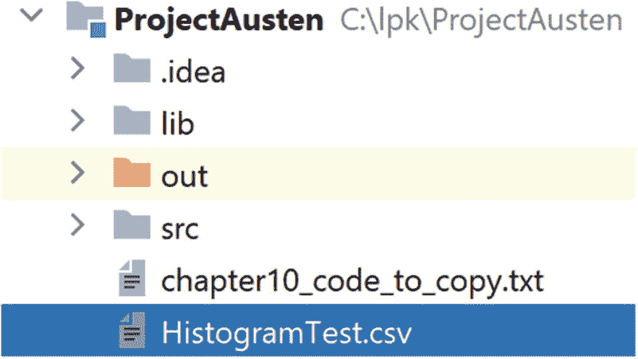

图 10-8

项目树中的 CSV 文件

现在 `Histogram` 已经“能够导出自身”（这是程序员在谈论面向对象系统中的类时使用的语言），我们可以增强 `main` 函数来生成 CSV 文件。

项目步骤 10.42

将 `Book` 的 `main` 函数更改为：

```
fun main() {
val book = Book(Paths.get(
"src/main/resources/books/PrideAndPrejudice.txt"))
val totalWords = book.histogram.totalWords()
println("Total word count: $totalWords")
val file = Paths.get("PandPWords.csv")
book.histogram.toCSV(file)
}
```

运行这个新版本的 `main` 后，我们得到一个名为 `PandPWords.csv` 的文件，该文件可以在项目树中看到，与图 10-8 中显示的 `HistogramTest.csv` 并列。当导入到 Google Sheets 时，它看起来会类似于图 10-9 所示。如果我们点击 **A** 列，那么 `Data` 菜单会显示一个按字母顺序排序数据的选项；见图 10-10。当我们这样做时，我们发现实际上排序后的数据的前 64 行左右由数字和几个符号组成。这些来自文本中的章节标题，当然可以通过对软件进行相当简单的增强来消除。

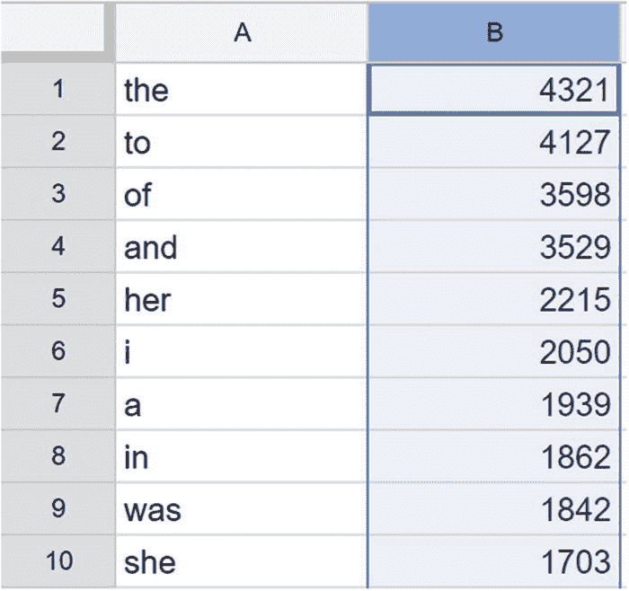

图 10-11

《傲慢与偏见》中使用频率最高的十个单词

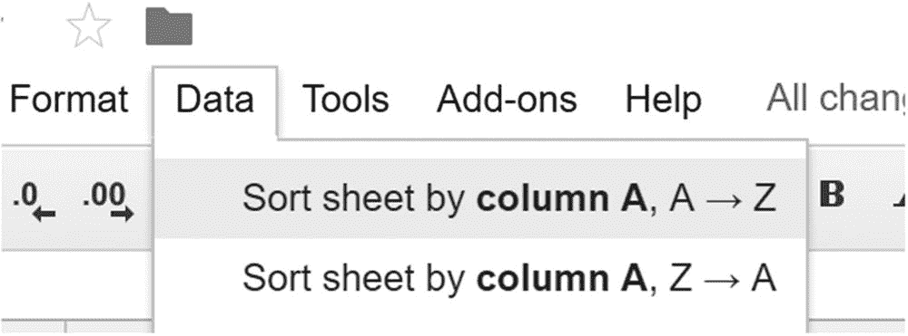

图 10-10

数据可以按字母顺序排序

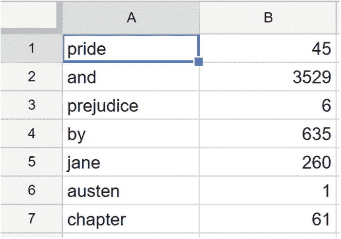

图 10-9

导出到 CSV 的直方图，在 Google Sheets 中显示

我们还可以按 **B** 列排序，这揭示了英语中单音节词的主导地位（同时也显示了该语言的日耳曼语源）。


## 10.13 进一步探索

如果你在完成本项目的任何步骤时遇到困难，或者代码混乱不堪，可以从 [`https://github.com/Apress/learn-to-program-w-kotlin-projectausten-complete.git`](https://github.com/Apress/learn-to-program-w-kotlin-projectausten-complete.git) 下载完整版本。利用这个版本（或你自己的代码），你可以通过以下几种方式进一步拓展项目。首先，你可以使用提供的文本文件来分析奥斯汀的其他小说。此外，你还可以从古腾堡计划下载大量其他书籍，并比较不同作者的用词习惯。

如果你想消除章节编号污染数据的问题，可以收紧单词的定义，并对 `Line` 进行相应修改。例如，你可以检测单词中的第一个 `Char`，如果它不是字母，则拒绝该单词。要判断一个 `Char` 是否为字母，可以使用 `Character.isLetter` 函数。

我们分析的一个不足之处在于，它将具有相同词根的单词视为独立实体。示例请参见图 10-12。按词根对单词进行分类的方法称为*词干提取*。英语和其他语言都有可免费下载的*词库*，可用于此类分析。当你读完本书时，应该能够利用词库按词根汇总单词使用统计信息。

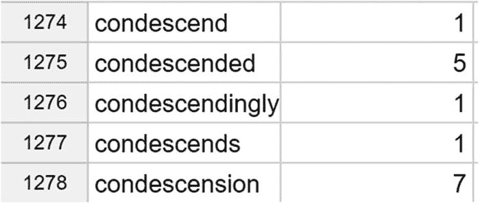

图 10-12

具有相同词根的单词

## 10.14 本章小结

本章内容非常丰富。我们涵盖了一些非常重要且困难的主题，例如面向对象设计，并编写了一个虽小但精密的文本分析系统。我们编写的程序质量很高，因为我们为所有代码都编写了单元测试。

本章涵盖的大量内容为我们后续章节中更多与文本相关的编程打下了坚实的基础。

