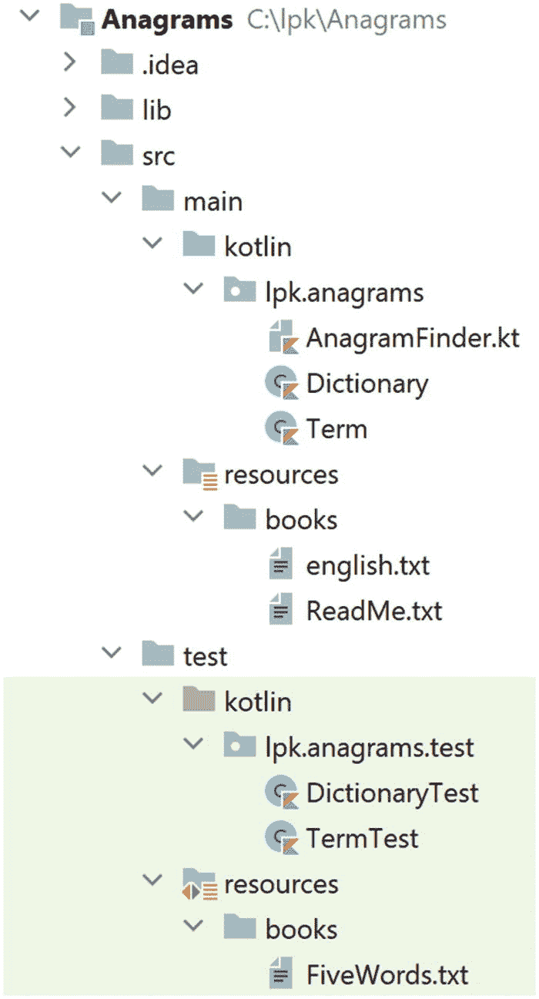

# 11. 变位词

本章建立在第 10 章使用的面向对象编程和单元测试技术之上，并引入了一种新的编程技术——*递归*。我们要解决的问题是：给定任意一个英文单词，它的所有变位词有哪些？

## 11.1 主要类

假设我们要找出某个给定单词的所有变位词。一种方法如下：首先，计算出该单词中字母的所有不同排列方式，然后对照已知的英语单词列表检查每种排列。不在列表中的组合将被丢弃，剩下的排列就是变位词。例如，假设我们从单词 `rat` 开始。该单词中字母的不同排列有：

```
art
atr
rat
rta
tar
tra
```

其中在字典中实际存在的三个单词是 `art`、`rat` 和 `tar`。

基于这种解决问题的方法，我们想到了两个主要类。第一个类我们称之为 `Term`，它封装了查找所有字母排列（排列组合）的算法。第二个类称为 `Dictionary`，负责进行核对。

首先，在 IntelliJ 中克隆此仓库：

[`https://github.com/Apress/learn-to-program-w-kotlin-anagrams.git`](https://github.com/Apress/learn-to-program-w-kotlin-anagrams.git)

展开后的项目结构应如图 11-1 所示。主要部分包括：



图 11-1

变位词项目的结构

*   `lib` 目录，包含 JUnit 所需的文件。
*   `src/main/kotlin/lpk/anagrams` 中的三个 Kotlin 文件：这些是前面描述的两个类的存根，以及第三个类 `AnagramFinder`，它将包含 `main` 函数。
*   `src/test/kotlin/lpk/anagrams/test` 目录中 `Term` 和 `Dictionary` 的测试存根。
*   主分支资源目录中的 `english.txt` 文件：该文件包含韦氏 1913 年词典中的所有单词（来自古腾堡计划）。
*   `FiveWords.txt` 文件，这是一个非常小的字典文件，用于测试。
*   一个名为 `.idea` 的目录，由 IntelliJ 使用。

`AnagramFinder` 已经包含了主要算法的框架：

```
/**
* 查找并打印一个单词的变位词。
*/
fun main() {
//从 resources/books 中的 "english.txt" 创建一个字典
//从我们的初始英文单词创建一个 Term
//获取该单词中字母的所有排列
//对于每个排列，
//...如果它在字典中
//...则打印它。
}
```

我们的实现计划是编写 `Dictionary` 和 `Term` 类，使它们能够提供上述代码框架中所需的函数。在开发 `Dictionary` 和 `Term` 时，我们将遵循在“奥斯汀项目”中使用的“测试优先”方法。


## 11.2 **字典**类

首次获取项目时，`Dictionary` 类应如下所示：

```
1   package lpk.anagrams

3   import java.nio.file.Files
4   import java.nio.file.Path

6   /**
7    * 根据从文件中读取的单词列表检查单词，
8    * 文件中每行一个单词。
9    */
10   class Dictionary(pathToFile: Path) {

12       fun contains(string: String): Boolean {
13           return false
14       }
15   }
```

和往常一样，第一行指定了该类所属的 `package`。第 3 行和第 4 行导入了读取字典文件所需的代码。在第 10 行，指令

```
(pathToFile: Path)
```

意味着可以通过一个 `Path` 对象来构造 `Dictionary`，并且该对象将在 `init` 块中以 `pathToFile` 的名称使用。

`contains` 函数将用于检查单词的有效性。让我们从测试它开始。首次获取项目时，有一个现成的测试类，其中包含一些必要的导入和一个测试桩：

```
package lpk.anagrams.test
import org.junit.Assert
import org.junit.Test
import java.nio.file.Paths
import lpk.anagrams.Dictionary
class DictionaryTest {
@Test
fun containsTest() {
}
}
```

项目步骤 11.1

我们可以通过从测试资源目录中的 `FiveWords.txt` 文件构造一个 `Dictionary` 来开始测试。

将以下代码复制到 `containsTest` 中：

```
val path = Paths.get("src/test/resources/books/FiveWords.txt")
val dictionary = Dictionary(path)
```

此测试中尚无断言，因此它应该通过。

`FiveWords.txt` 文件名副其实。它恰好包含以下几行：

```
aardvark
bat
cat
dog
eel
```

我们可以通过检查对每个单词调用 `contains` 时返回值是否为 `true`，来为测试增加一些意义。

项目步骤 11.2

将以下代码行添加到 `containsTest` 中：

```
Assert.assertTrue(dictionary.contains("aardvark"));
```

确认测试现在失败。

为字典文件中的其他四个单词添加等效的行。

除了检查字典中包含的内容，我们还应该检查不包含的内容。否则，我们可能会有一个总是返回 `true` 的 `contains` 实现。即使有这样的糟糕实现，当前编写的测试也会通过。

项目步骤 11.3

将以下两行添加到测试中：

```
Assert.assertFalse(dictionary.contains("aardwolf"));
Assert.assertFalse(dictionary.contains("zebra"));
```

此时，我们的测试应包含五个肯定断言和两个否定断言：

```
@Test
fun containsTest() {
val path = Paths.get("src/test/resources/books/FiveWords.txt")
val dictionary = Dictionary(path)
Assert.assertTrue(dictionary.contains("aardvark"))
Assert.assertTrue(dictionary.contains("bat"))
Assert.assertTrue(dictionary.contains("cat"))
Assert.assertTrue(dictionary.contains("dog"))
Assert.assertTrue(dictionary.contains("eel"))
Assert.assertFalse(dictionary.contains("aardwolf"))
Assert.assertFalse(dictionary.contains("zebra"))
}
```

有了完整的测试，我们现在可以考虑实现 `Dictionary`。和往常一样，有很多方法可以实现。一种简单的方法如下：

*   拥有一个 `Set<String>` 字段，其中包含字典文件中的确切单词。
*   通过返回 `Set` 的 `contains` 值来实现 `contains`。
*   在 `init` 块中，逐行读取字典文件，并将每一行添加到 `Set` 中。

项目步骤 11.4

添加一个名为 `words` 的字段，它是一个 `mutableSetOf<String>()`。

项目步骤 11.5

将 `contains` 的桩实现替换为：

```
fun contains(string: String): Boolean {
return words.contains(string)
}
```

`Dictionary` 剩下的唯一工作就是编写 `init` 块。

项目步骤 11.6

你还记得将文件内容作为 `List<String>` 获取的代码吗？

（我们在 Austen 项目的 `Book` 构造函数中使用过它。）

为 `Dictionary` 编写一个 `init` 块。代码应将 `pathToFile` 读取为 `List<String>`，然后遍历此 `List` 并将每个项目添加到 `words` 中。

如果最后三个步骤中的每一步都正确实现，单元测试应该通过。你可以将你的代码与此代码进行比较：

```
package lpk.anagrams
import java.nio.file.Files
import java.nio.file.Path
/**
* 根据从文件中读取的单词列表检查单词，
* 文件中每行一个单词。
*/
class Dictionary(pathToFile: Path) {
val words = mutableSetOf()
init {
val lines = Files.readAllLines(pathToFile)
for (line in lines) {
words.add(line)
}
}
fun contains(string: String): Boolean {
return words.contains(string)
}
}
```

## 11.3 `Term` 类

一个 `Term` 对象表示任意 `Char` 的排列。该排列可能是也可能不是可以在字典中找到的真实“术语”。以下是首次打开项目时 `Term` 的代码：

```
1   package lpk.anagrams

3   /**
4    * 字符的排列，可能
5    * 是也可能不是一个英文单词。
6    */
7   data class Term(val text: String) {

9       fun permutations(): Set {
10           val result = mutableSetOf()
11           return result
12       }
13   }
```

这里有一些我们之前没见过的东西。注意，在第 7 行的中间，构造函数是

```
val text: String
```

构造函数参数被标记为 `val`，并且没有显式的 `init` 块。这是 Kotlin 的简写，表示存在一个名为 `text` 的字段，其类型为 `String`，并且被设置为传递给构造函数的那个值。

还要注意，第 7 行以关键字 `data` 开头。这使得 `Term` 成为一个所谓的*数据类*，Kotlin 会自动添加代码，允许我们使用 `==` 运算符比较 `Term`。

项目步骤 11.7

为了看到实际效果，打开 `TermTest` 类并添加以下内容：

```
1   @Test
2   fun equalsTest() {
3       val cat = Term("cat")
4       val feline = Term("cat")
5       val dog = Term("dog")
6       Assert.assertTrue(cat == feline)
7       Assert.assertFalse(cat == dog)
8   }
```

在第 3 行和第 4 行，我们声明了 `Term` 实例，分别命名为 `cat` 和 `feline`，它们的 `word` 都是 `String "cat"`。在第 6 行，我们使用 `==` 运算符比较它们，并期望比较结果为 `true`。

确认此测试通过。

确认如果从 `Term` 类的声明中移除 `data` 关键字，测试会失败。

确保将 `data` 关键字放回去！

## 11.4 排列

*排列*就是重新排列。我们可以排列 `String` 中的 `Char` 来生成其他 `String`。例如，从 `"ab"` 中，我们可以得到 `"ab"` 本身以及 `"ba"`。从 `"abc"` 中，我们可以得到六种排列：`"abc"`、`"acb"`、`"bca"`、`"bac"`、`"cab"` 和 `"cba"`。如果一个 `String` 包含重复的 `Char`，那么某些重新排列会与其他排列相同。我们只关心不同的排列。因此，从 `"aab"` 中，我们得到 `"aab"`、`"aba"` 和 `"baa"`。

所谓 `Term` 的 `permutations`，是指根据其 `text` 的重新排列构建的 `Term` 的 `Set`。


## 11.5 **permutations** 函数

`Term` 类预置了 `permutations` 函数的桩代码。这意味着我们可以直接编写单元测试，从而帮助我们正确实现该函数。（我们需要函数桩代码才能编写单元测试。为不存在的函数编写测试很麻烦，因为 IntelliJ 会显示大量错误。不过，有些程序员甚至在编写函数桩代码之前就会编写单元测试。）

项目步骤 11.8

正如我们所见，`"ab"` 有两种排列。以下测试函数用于检查对由 `"ab"` 构造的 `Term` 调用 `permutations` 函数所返回的 `Set<Term>`：

```
@Test
fun permutationsAB() {
val ab = Term("ab")
val permutations = ab.permutations()
Assert.assertEquals(2, permutations.size)
Assert.assertTrue(permutations.contains(Term("ab")))
Assert.assertTrue(permutations.contains(Term("ba")))
}
```

将此代码复制到 `TermTest` 中。运行它并检查测试是否失败。

项目步骤 11.9

基于 `"ab"` 的测试，编写一个测试来检查 `Term("abc")` 返回的 `permutations`。

项目步骤 11.10

为包含重复 `Char` 的 `String` 构造的 `Term` 编写一个 `permutations` 测试会很有帮助。

你能编写一个测试来检查 `Term("aab")` 返回的 `permutations` 吗？

项目步骤 11.11

我们应该确保 `permutations` 函数（在实现后！）能够处理短 `String`。

将以下函数复制到 `TermTest` 中：

```
@Test
fun permutationsA() {
val ab = Term("a")
val permutations = ab.permutations()
Assert.assertEquals(1, permutations.size)
Assert.assertTrue(permutations.contains(Term("a")))
}
```

项目步骤 11.12

像获取单个 `Char` 的 `Term` 的 `permutations` 这类情况被称为*边界情况*。更极端的边界情况是从空 `String` 构造的 `Term` 获取 `permutations`。空 `String` 只有一种排列，即空 `String` 本身。

将以下代码复制到 `TermTest` 中：

```
@Test fun permutationsWhenEmpty() {
val empty = Term("")
val permutations = empty.permutations()
Assert.assertEquals(1, permutations.size)
Assert.assertTrue(permutations.contains(Term("")))
}
```

在这些项目步骤中编写的测试为实现 `permutations` 函数奠定了非常坚实的基础。包括之前创建的 `equalsTest`，我们的 `TermTest` 类现在应该如下所示：

```
package lpk.anagrams.test
import org.junit.Assert
import org.junit.Test
import lpk.anagrams.Term
class TermTest {
@Test
fun equalsTest() {
val cat = Term("cat")
val feline = Term("cat")
val dog = Term("dog")
Assert.assertTrue(cat == feline)
Assert.assertFalse(cat == dog)
}
@Test fun permutationsWhenEmpty() {
val empty = Term("")
val permutations = empty.permutations()
Assert.assertEquals(1, permutations.size)
Assert.assertTrue(permutations.contains(Term("")))
}
@Test
fun permutationsA() {
val ab = Term("a")
val permutations = ab.permutations()
Assert.assertEquals(1, permutations.size)
Assert.assertTrue(permutations.contains(Term("a")))
}
@Test
fun permutationsAB() {
val ab = Term("ab")
val permutations = ab.permutations()
Assert.assertEquals(2, permutations.size)
Assert.assertTrue(permutations.contains(Term("ab")))
Assert.assertTrue(permutations.contains(Term("ba")))
}
@Test
fun permutationsABC() {
val ab = Term("abc")
val permutations = ab.permutations()
Assert.assertEquals(6, permutations.size)
Assert.assertTrue(permutations.contains(Term("abc")))
Assert.assertTrue(permutations.contains(Term("acb")))
Assert.assertTrue(permutations.contains(Term("bac")))
Assert.assertTrue(permutations.contains(Term("bca")))
Assert.assertTrue(permutations.contains(Term("cab")))
Assert.assertTrue(permutations.contains(Term("cba")))
}
@Test
fun permutationsAAB() {
val ab = Term("aab")
val permutations = ab.permutations()
Assert.assertEquals(3, permutations.size)
Assert.assertTrue(permutations.contains(Term("aab")))
Assert.assertTrue(permutations.contains(Term("aba")))
Assert.assertTrue(permutations.contains(Term("baa")))
}
}
```


## 11.6 生成**项**的排列

作为实现 `Term` 的 `permutations` 函数的起点，让我们思考如何找出 `"abc"` 的所有可能排列。

有些排列会将 `Char a` 放在第一个位置。有多少种？它们分别是什么？当 `a` 被使用后，我们剩下 `b` 和 `c`。排列这两个字母只有两种方式：`"bc"` 和 `"cb"`。由此可知，`"abc"` 中 `a` 位于第一个位置的排列恰好有两种：`"abc"` 和 `"acb"`。

那么 `a` 位于第二个位置的排列呢？这些排列是通过在 `"bc"` 排列的第一个和第二个字母之间插入 `a` 生成的。这样得到 `"bac"` 和 `"cab"`。

最后，`"abc"` 中 `a` 出现在第三个位置的排列，是通过生成 `"bc"` 的两个排列并在末尾添加 `a` 得到的，即 `"bca"` 和 `"cba"`。

项目步骤 11.13

让我们计算 `"xabc"` 的排列。最好在文本编辑器中使用等宽字体进行，这样文本列能够对齐。

在一行中写出 `"abc"` 的所有排列。应该有六个。

现在将此列表复制三次，得到四行相同的内容，每行都包含 `"abc"` 的六个排列。

对于第一行中的每个项，在开头添加一个 `x`。

对于第二行中的每个项，在第一个和第二个字母之间插入一个 `x`。

对于第三行，在每个项的第二个和第三个字母之间插入一个 `x`。

对于最后一行，在每个项的末尾添加一个 `x`。

现在应该有 `"xabc"` 的 24 个不同排列，分布在四行中。

以下是我们计算 `Term` 排列的算法：

*   如果 `Term` 只有一个字符，那么只有一个排列，即该 `Term` 本身，因此只需返回一个包含原始 `Term` 的 `Set`。

*   对于长度大于 1 的 `Term`，移除第一个字母。得到的 `Term` 比原始 `Term` 少一个字母。计算修剪后 `Term` 的排列。

*   对于其中的每一个排列，通过将原始 `Term` 的第一个字母插入到该 `Term` 的每个可能位置，创建新的 `Term`。

该算法的第二步实际上调用了算法本身。这被称为*递归*，是编程中极其重要的技术。

我们如何知道这个算法最终会停止？因为：

*   递归调用使用的输入比原始输入更短。

*   对于长度为 1 的输入，我们不进行递归调用，而是直接返回结果。

为了实现这个算法，我们需要两个“辅助”函数。第一个函数是通过移除现有 `Term` 的第一个字母来创建一个新的 `Term`。我们将此函数命名为 `tail`。和往常一样，我们的步骤是提供一个桩代码，然后编写测试，最后实现功能。以下是该函数的桩代码：

```
fun tail(): Term {
return Term("")
}
```

项目步骤 11.14

将此函数复制到 `Term` 中。

这个函数相当直接，但有几个边界情况需要仔细测试。

项目步骤 11.15

目前尚不清楚我们应该如何处理空 `Term` 的 `tail`。我们决定直接返回该 `Term` 本身。为了锁定此行为，请将以下内容添加到 `TermTest` 中：

```
@Test
fun tailEmpty() {
val empty = Term("")
Assert.assertEquals(empty, empty.tail())
}
```

第二个边界情况是处理长度为 1 的 `Term`。

项目步骤 11.16

将以下代码复制到 `TermTest` 中：

```
@Test
fun tailOne() {
val a = Term("a")
Assert.assertEquals(Term(""), a.tail())
}
```

我们还应该为更常规的 `Term` 编写一个测试。

项目步骤 11.17

添加此单元测试：

```
@Test
fun tailTest() {
val anaconda = Term("anaconda")
Assert.assertEquals(Term("naconda"), anaconda.tail())
}
```

`String` 数据类型具有从现有字符串的一部分创建新字符串的函数。其中一个名为 `substring` 的函数接受一个 `Int` 参数，该参数标记字符串的切割位置。返回的 `String` 是原始字符串中从该索引 `Char` 开始（包括该字符）之后的部分。（请记住 `String` 索引从 `0` 开始。）我们可以使用 `substring` 来实现 `tail`。

项目步骤 11.18

将 `tail` 的桩代码实现替换为以下代码：

```
fun tail(): Term {
if (text == "") {
return Term("")
}
return Term(text.substring(1))
}
```

检查 `tail` 的三个测试现在是否通过。

我们需要的第二个辅助函数是，将一个 `Char` 插入到 `Term` 的指定位置，从而生成一个新的 `Term`。例如，如果我们从 `"xyz"` 开始并调用 `insert(a, 1)`，我们应该得到 `"xayz"`。

项目步骤 11.19

将以下桩代码函数添加到 `Term` 中：

```
fun insert(newChar: Char, position: Int): Term {
return Term("")
}
```

与 `tail` 函数一样，我们应该实现三个测试：针对短 `Term` 的两个边界情况和一个常规示例。

项目步骤 11.20

如果我们从一个空的 `Term` 开始，只有一个位置适合进行插入：`0`。生成的 `Term` 应该只包含插入的 `Char`。

将此针对“空”场景的测试复制到 `TermTest` 中：

```
@Test
fun insertIntoEmpty() {
val empty = Term("")
Assert.assertEquals(Term("a"), empty.insert('a', 0))
}
```

项目步骤 11.21

对于长度为 1 的 `Term`，我们可以在位置 `0` 或位置 `1` 插入一个 `Char`。以下是针对这些选项的测试：

```
@Test
fun insertIntoLengthOneTerm() {
val x = Term("x")
Assert.assertEquals(Term("ax"), x.insert('a', 0))
Assert.assertEquals(Term("xa"), x.insert('a', 1))
}
```

将其复制到 `TermTest` 中。

项目步骤 11.22

以下是使用较长 `Term` 的测试：

```
@Test
fun insertTest() {
val x = Term("xy")
Assert.assertEquals(Term("axy"), x.insert('a', 0))
Assert.assertEquals(Term("xay"), x.insert('a', 1))
Assert.assertEquals(Term("xya"), x.insert('a', 2))
}
```

将其添加到 `TermTest` 中。

我们之前使用的 `String` 的 `substring` 函数实际上有两种形式。我们已经使用了单参数版本，但还有一个接受两个 `Int` 参数的版本。此函数返回的 `String` 包含由这些参数指示的位置之间的文本。我们可以通过使用这两个版本的 `substring` 来实现 `insert`。

项目步骤 11.23

将 `insert` 的桩代码实现替换为以下代码：

```
fun insert(newChar: Char, position: Int): Term {
val before = text.substring(0, position)
val after = text.substring(position)
return Term(before + newChar + after)
}
```

检查此函数的测试现在是否通过。

有了这两个辅助函数，我们终于可以实现 `permutations` 了。首先，让我们将桩代码实现替换为一个使用注释勾勒出算法框架的实现：

```
1   fun permutations(): Set {
2       //创建一个结果集合，排列将被添加到其中。

4       //如果 Term 的长度为 0 或 1，则 Term 本身
5       //就是唯一的排列，
6       //因此将其添加到结果中并返回。

8       //此时我们知道长度至少为 2。
9       //将 Term 分解为单个 Char（头部），
10       //以及一个少一个 Char 的 Term（尾部）。

12       //应用递归来获取尾部的排列。

14       //对于每个可能的插入位置，

16       //对于尾部排列中的每个 Term，

18       //通过在该位置插入头部 Char
19       //创建一个新的 Term，

21       //并将其添加到结果中。

23       //返回结果。
24   }
```

项目步骤 11.24

将此代码复制到 `Term` 中，作为 `permutations` 的新实现（即用此代码替换现有代码）。

项目步骤 11.25

在第 3 行，添加一个名为 `result` 的 `val`，并使用 `mutableSetOf<Term>()` 函数调用进行初始化。


好的，作为高级文档工程师和翻译员，我将严格遵循您提供的注意事项和示例格式，将给定的英文文本翻译成中文。


在第 23 行之后添加代码以返回这个 `result`。

项目步骤 11.26

我们可以使用一个 `if` 块来判断调用此函数的 `Term` 的长度是 `0` 还是 `1`：

```
if (text.length <= 1) {
}
```

在第 7 行放置这样一个块。在我们刚刚添加的 `if` 块内部，我们处理的是当前操作的 `Term` 为空或仅包含单个 `Char` 的情况。从单元测试中我们知道，这样的 `Term` 只有一个排列，即该 `Term` 本身。因此，我们希望将调用 `permutations` 函数的 `Term` 添加到 `result` 中。有一个特殊的关键字用于指代当前对象，即 `this`。在 `if` 块内添加以下代码行：

```
result.add(this)
return result
```

完成后，处理单字符和空 `Term` 的单元测试应该能通过。

项目步骤 11.27

在第 11 行，创建一个名为 `head` 的 `val`，并将其初始化为 `text` 中的第一个 `Char`。

项目步骤 11.28

在刚刚添加的代码行之后，创建一个名为 `tail` 的 `val`，并将其初始化为调用 `tail` 函数的结果。

项目步骤 11.29

我们刚刚创建的 `val` 是一个 `Term`，因此我们可以对其调用 `permutations`。在第 13 行，创建一个名为 `tailPermutations` 的 `val`，并将其初始化为对 `tail` 调用 `permutations` 的返回值。

我们刚刚实现了算法的递归步骤。此时，我们的代码应该如下所示：

```
1   fun permutations(): Set {
2       //创建一个结果集，用于添加排列结果。
3       val result = mutableSetOf()
4       //如果 Term 的长度为 0 或 1，则该 Term 本身
5       //就是唯一的排列，
6       //因此将其添加到结果中并返回。
7       if (text.length <= 1) {
8           result.add(this)
9           return result
10       }
11       //至此，我们知道长度至少为 2。
12       //将 Term 分解为一个单独的 Char（即 head）
13       //和一个少一个 Char 的 Term（即 tail）。
14       val head = text[0]
15       val tail = tail()
16       //应用递归来获取 tail 的排列。
17       val tailPermuations = tail.permutations()
18       //对于每个可能的插入位置，

20       //对于 tail 排列中的每个 Term，

22       //通过将 head Char 插入到该位置
23       //来创建一个新的 Term，

25       //并将其添加到结果中。

27       //返回结果。
28       return result
29   }
```

函数的最后一部分是从 `head` 和 `tailPermutations` 中的 `Term` 创建新单词。`tailPermutations` 中的每个元素的长度都是

```
text.length - 1
```

因此可能的插入位置是 `0`、`1`，依此类推。

项目步骤 11.30

粘贴此循环代码：

```
for (i in 0..text.length - 1) {
```

到第 19 行，并在第 26 行放置一个右花括号。执行此操作时，IntelliJ 可能会自动缩进中间的代码行。

项目步骤 11.31

我们可以在第 21 行使用一个 `for` 循环。

将以下代码复制到该位置：

```
for (tailPermutation in tailPermuations) {
```

并再次在第 26 行添加一个右花括号。

有了这些循环，我们的函数应该如下所示：

```
1   fun permutations(): Set {
2       //创建一个结果集，用于添加排列结果。
3       val result = mutableSetOf()
4       //如果 Term 的长度为 0 或 1，则该 Term 本身
5       //就是唯一的排列，
6       //因此将其添加到结果中并返回。
7       if (text.length <= 1) {
8           result.add(this)
9           return result
10       }
11       //至此，我们知道长度至少为 2。
12       //将 Term 分解为一个单独的 Char（即 head）
13       //和一个少一个 Char 的 Term（即 tail）。
14       val head = text[0]
15       val tail = tail()
16       //应用递归来获取 tail 的排列。
17       val tailPermuations = tail.permutations()
18       //对于每个可能的插入位置，
19       for (i in 0..text.length - 1) {
20           //对于 tail 排列中的每个 Term，
21           for (tailPermutation in tailPermuations) {
22               //通过将 head Char 插入到该位置
23               //来创建一个新的 Term，

25               //并将其添加到结果中。

27           }
28       }
29       //返回结果。
30       return result
31   }
```

在上面的代码清单的第 24 行，我们有一个插入位置 `i` 和一个 `Term`（`tailPermutation`），需要将 `Char head` 插入其中。

项目步骤 11.32

在第 24 行，编写代码创建一个名为 `newTerm` 的 `val`。

这应该使用 `tailPermutation`、`head` 和 `i`。

然后，在第 26 行，编写一行代码，将 `newTerm` 添加到 `result` 中。

至此，`permutations` 的实现就完成了。所有测试现在都应该通过。

## 11.7 整合所有内容

随着 `Dictionary` 和 `Term` 的实现，我们可以回到 `AnagramFinder` 中的 `main` 函数。以下是该文件的存根：

```
1   package lpk.anagrams

3   import java.nio.file.Paths

5   /**
6    * 查找并打印一个单词的变位词。
7    */
8   fun main() {
9       //从 resources/books 中的 "english.txt" 创建一个字典

11       //从我们的初始英文单词创建一个 Term。

13       //获取该单词中所有字母的重排。

15       //对于每一个重排，

17       //...如果它在字典中

19       //...打印它。
20   }
```

项目步骤 11.33

在第 10 行添加以下代码：

```
val path = Paths.get("src/main/resources/books/english.txt")
val dictionary = Dictionary(path)
```

项目步骤 11.34

让我们找出 `"regal"` 的变位词。在第 12 行添加以下代码：

```
val word = Term("regal")
```

项目步骤 11.35

下一条注释要求获取 `word` 的排列，这很容易实现：

```
val anagrams = word.permutations()
```

项目步骤 11.36

注释“对于每一个重排，”被翻译成一个 `for` 循环：

```
for (w in anagrams) {
```

将此代码粘贴到第 16 行，并在第 19 行之后立即添加一个右花括号。

项目步骤 11.37

要测试一个 `Term w` 是否代表字典中的一个单词，我们可以使用

```
if (dictionary.contains(w.text)) {
```

添加此行，然后在第 19 行之后立即添加一个右花括号。

项目步骤 11.38

最后，在第 18 行添加一个打印语句。

完成的代码如下所示：

```
package lpk.anagrams
import java.nio.file.Paths
/**
* 查找并打印一个单词的变位词。
*/
fun main(args: Array) {
//从 resources/books 中的 "english.txt" 创建一个字典
val path = Paths.get("src/main/resources/books/english.txt")
val dictionary = Dictionary(path)
//从我们的初始英文单词创建一个 Term。
val word = Term("regal")
//获取该单词中所有字母的重排。
val anagrams = word.permutations()
//对于每一个重排，
for (w in anagrams) {
//...如果它在字典中
if (dictionary.contains(w.text)) {
//...打印它。
println(w)
}
}
}
```

运行代码。应该会得到五个变位词：

```
large, glare, ergal, regal, lager
```

这些单词可能以不同的顺序出现，因为它们被放入了一个 `Set` 中，而 `Set` 是一个无序集合。

## 11.8 总结

在这个项目中，我们使用了递归，这是编程中最有趣且概念上最困难的思想之一。我们还继续提高了我们在面向对象设计和测试方面的技能，并解决了一个非常有趣的语言学问题。

本章的完整代码可从 [`https://github.com/Apress/learn-to-program-w-kotlin-anagrams-complete.git`](https://github.com/Apress/learn-to-program-w-kotlin-anagrams-complete.git) 获取。


