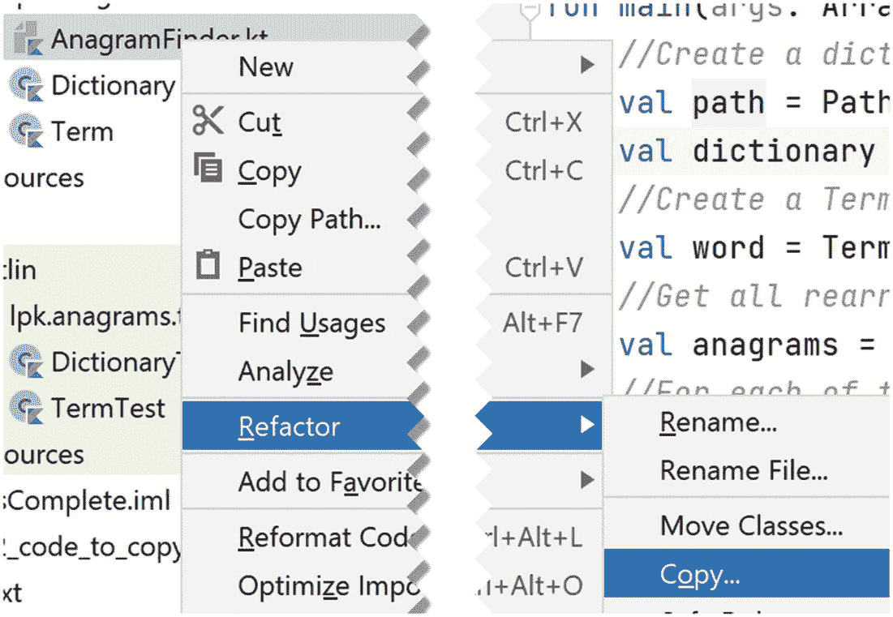

# 12. 回文

回文是指正反书写都相同的单词，例如 "kayak"。在本章中，我们将找出所有英语回文单词。这将让我们进一步练习面向对象编程、单元测试和递归。

我们在前一章开发的类是这个项目的绝佳起点。我们的实现策略将基于在 `Term` 类中添加一个 `isPalindrome` 函数。然后，我们将编写一个 `main` 函数，遍历字典中的单词，从中创建 `Term` 对象，再使用 `isPalindrome` 对这些对象进行筛选。

首先，使用 IntelliJ 检出第 11 章的完整代码，该代码可从 [`https://github.com/Apress/learn-to-program-w-kotlin-anagrams-complete.git`](https://github.com/Apress/learn-to-program-w-kotlin-anagrams-complete.git) 获取。

## 12.1 反转一个 **Term**

要实现 `isPalindrome`，我们需要编写反转 `Term` 的代码。像往常一样，我们会先添加一个函数桩，编写测试，然后再回头正确实现它。

项目步骤 12.1

将这段桩代码复制到 `Term` 中：

```
fun reverse() : Term {
returnTerm("")
}
```

项目步骤 12.2

以下测试验证了将 `reverse` 应用于 `"ab"` 会得到结果 `"ba"`：

```
@Test
fun reverseTest() {
Assert.assertEquals(Term("ba"), Term("ab").reverse())
}
```

这是一个单元测试的良好开端，但我们还应该添加几行代码来验证反转以下内容时的结果：

*   一个空的 `Term`
*   只有一个字母的 `Term`
*   包含三个或四个字母的 `Term`
*   包含一些重复字母的 `Term`

看看你是否能为这些测试添加相应的代码行。

完成此步骤后，`TermTest` 应包含一个类似如下的测试函数：

```
@Test
fun reverseTest() {
Assert.assertEquals(Term(""), Term("").reverse())
Assert.assertEquals(Term("a"), Term("a").reverse())
Assert.assertEquals(Term("ba"), Term("ab").reverse())
Assert.assertEquals(Term("cba"), Term("abc").reverse())
Assert.assertEquals(Term("aabb"), Term("bbaa").reverse())
}
```

当然，你也可以为每个断言编写单独的测试，或者采用其他不同的写法。

第 7 章中的一个编程挑战是反转 `String`，我们可以使用那段代码来实现 `reverse`：

```
fun reverse() : Term {
var result =""
for (c in text) {
result = c + result
}
returnTerm(result)
}
```

项目步骤 12.3

用上面显示的代码替换桩实现。确认此更改后，单元测试能够通过。

项目步骤 12.4

实际上，`String` 反转有一个库函数。将你的 `reverse` 实现替换为以下代码：

```
fun reverse() : Term {
returnTerm(text.reversed())
}
```

确认单元测试仍然通过。

我们已经有了两个不同的 `reverse` 实现；现在我们将研究一个递归实现，因为这是练习这种基本编程技巧的好方法。

反转 Term 的递归方法从两个基础步骤开始：

*   空 `Term` 的反转是其本身。
*   只有一个字母的 `Term` 的反转是其本身。

我们的单元测试实际上已经验证了这些步骤。现在考虑一个更长的单词，例如 `"abcde"`。这个单词可以分解为三个部分：

*   第一个字符 `Char`，即 `a`
*   最后一个字符 `Char`，即 `e`
*   中间长度为三的单词，即 `"bcd"`

要形成反转，我们从 `e` 开始，然后加上中间部分的反转，最后加上 `a`。如何得到中间部分的反转？通过应用递归！

项目步骤 12.5

将当前版本的 `reverse` 替换为以下代码：

```
1   fun reverse() : Term {
2       val length = text.length
3       //如果单词为空或只有一个字母，
4       //则其反转就是它本身。
5       if (length < 2) {
6           return this
7       }
8       //获取第一个和最后一个字符，以及
9       //由中间字母组成的内部单词。
10       val first = text[0]
11       val last = text[length - 1]
12       val inner = Term(text.substring(1, length - 1))
13       //使用递归获取内部单词的反转。
14       val reverseOfInner = inner.reverse().text
15       //将三个部分组合起来形成结果。
16       val newText = last + reverseOfInner + first
17       return Term(newText)
18   }
```

确认单元测试仍然通过。

关于这段代码，有几点值得注意。首先，在第 2 行，我们引入了一个名为 `length` 的 `val`，它存储了 `Term` 的 `text` 的长度。这是一种便利做法，这样我们就不需要在第 4、10 和 11 行重复调用 `text.length`。其次，在第 11 行，我们使用了 `String` 的 `substring` 函数来获取文本的内部部分。

项目步骤 12.6

为了观察递归的实际运行过程，在 `reverse` 的第一行添加以下打印语句：

```
println(text)
```

现在添加一个新的测试函数：

```
@Test
fun abcdeTest() {
Assert.assertEquals(Term("edcba"), Term("abcde").reverse())
}
```

当你运行这个测试时，应该会看到以下输出：

```
text = 'abcde'
text = 'bcd'
text = 'c'
```

第一个输出来自对 `reverse` 的初始调用，随后是两个递归调用的输出。对 `Term "c"` 调用 `reverse` 不会导致进一步的递归调用，因为这个单词只有一个字母。

现在使用输入 `"abcdef"` 创建一个测试。你期望看到什么输出？使用这个输入时，递归是如何结束的？

运行完这些测试后，请务必删除打印语句！

## 12.2 检测回文

有了 `reverse` 函数，添加一个仅当 `Term` 是回文时才返回 `true` 的函数就非常简单了。事实上，它简单到我们可以立即实现：

```
fun isPalindrome(): Boolean {
returnequals(reverse())
}
```

项目步骤 12.7

将此函数添加到 `Term` 中。

项目步骤 12.8

即使是简单的函数也应该有测试。将以下代码添加到 `TermTest` 中：

```
@Test
fun isPalindromeTest() {
Assert.assertTrue(Term("").isPalindrome())
Assert.assertTrue(Term("a").isPalindrome())
Assert.assertTrue(Term("aa").isPalindrome())
Assert.assertTrue(Term("aaa").isPalindrome())
Assert.assertTrue(Term("madam").isPalindrome())
Assert.assertFalse(Term("ab").isPalindrome())
}
```

至此，我们对 `Term` 所需的修改就完成了。你可以保留 `reverse` 的递归版本（但请确保已删除打印语句），或者将其改回其他实现之一。函数可以有不同实现这一事实是面向对象编程的关键特性之一。实现细节隐藏在方法内部，因此我们可以自由地更改方法，而不会对使用该函数的类产生任何意外影响。


## 12.3 综合运用

现在，我们已掌握实现目标所需的工具——在资源目录的 `english.txt` 文件中找出所有回文词。我们已有读取该文件并从中创建 `Dictionary` 的程序，因此先复制该程序。

在项目树中，右键点击 `AnagramFinder.kt` 文件。在弹出的菜单中，选择 `重构` ➤ `复制`，如图 12-1 所示。系统会弹出对话框，要求输入新文件名。将其设为 `PalindromeFinder.kt`。完成后，IntelliJ 将打开新文件。



图 12-1

使用右键菜单复制 `AnagramFinder.kt`

项目步骤 12.9

将 `main` 函数编辑为如下内容：

```
1   fun main() {
2       //从 resources/books 目录下的 "english.txt" 创建字典
3       val path = Paths.get("src/main/resources/books/english.txt")
4       val dictionary = Dictionary(path)
5       //遍历字典中的每个字符串...

7           //...从该字符串创建 Term 对象

9           //...测试该单词是否为回文词...

11               //...如果是，则打印它。
12   }
```

项目步骤 12.10

将第 6 行空行替换为遍历 `dictionary.allWords` 的 `for` 循环。循环变量命名为 `"str"`。循环体应包含第 7 至 11 行。

项目步骤 12.11

将第 8 行空行替换为使用 `str`（循环变量）构造新 `Term` 的代码。新变量命名为 `"word"`。

项目步骤 12.12

将第 10 行空行替换为包含第 11 行注释的 `if` 代码块。`if` 应检查 `word` 是否为回文词。

项目步骤 12.13

在第 11 行之后添加一条打印 `word` 的语句。

此时，你应该能够运行该程序。如果无法运行，请用以下代码检查你的 `PalindromeFinder.kt` 版本：

```
package lpk.anagrams
import java.nio.file.Paths
/**
* 查找并打印英语回文词。
*/
fun main() {
//从 resources/books 目录下的 "english.txt" 创建字典
val path = Paths.get("src/main/resources/books/english.txt")
val dictionary = Dictionary(path)
//遍历字典中的每个字符串...
for (str in dictionary.words) {
//...从该字符串创建 Term 对象
val word = Term(str)
//...测试该单词是否为回文词...
if (word.isPalindrome()) {
//...如果是，则打印它
println(word)
}
}
}
```

打印出的单词列表应包含所有字母，以及一些两字母和三字母单词，还有一些更有趣的单词。我个人最喜欢的是“rotator”，因为它具有自描述性，以及“malayalam”因其长度而有趣。

如果你想进一步探索，可以修改代码以排除短单词。

## 12.4 总结

通过基于之前 Anagram 项目的工作，我们成功找出了 1913 年版韦氏词典中列出的所有回文词。这个简短的项目让我们进一步练习了面向对象编程、单元测试以及递归算法的使用。

本章的完整代码可从 [`https://github.com/Apress/learn-to-program-w-kotlin-palindromes-complete.git`](https://github.com/Apress/learn-to-program-w-kotlin-palindromes-complete.git) 获取。

