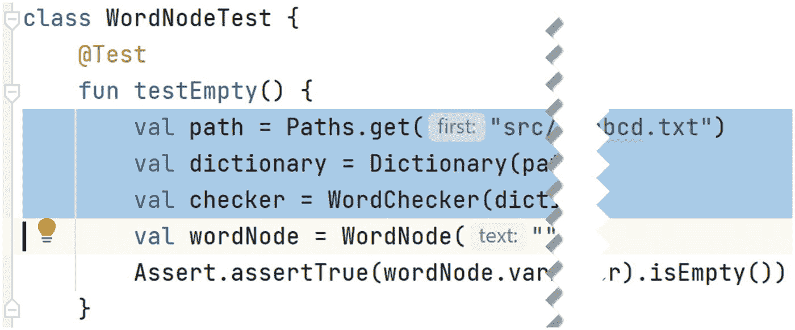
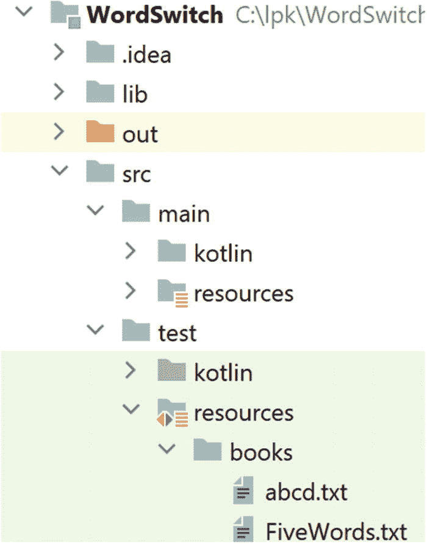
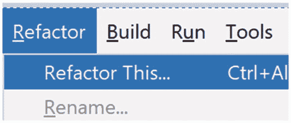
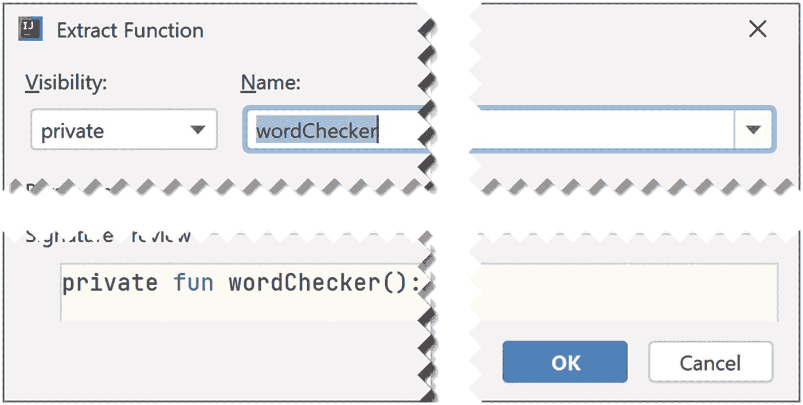
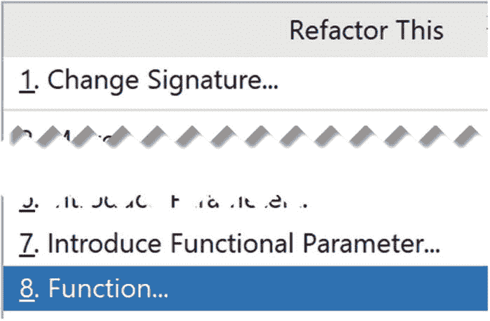
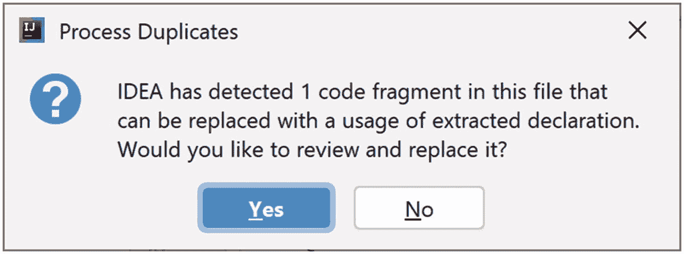
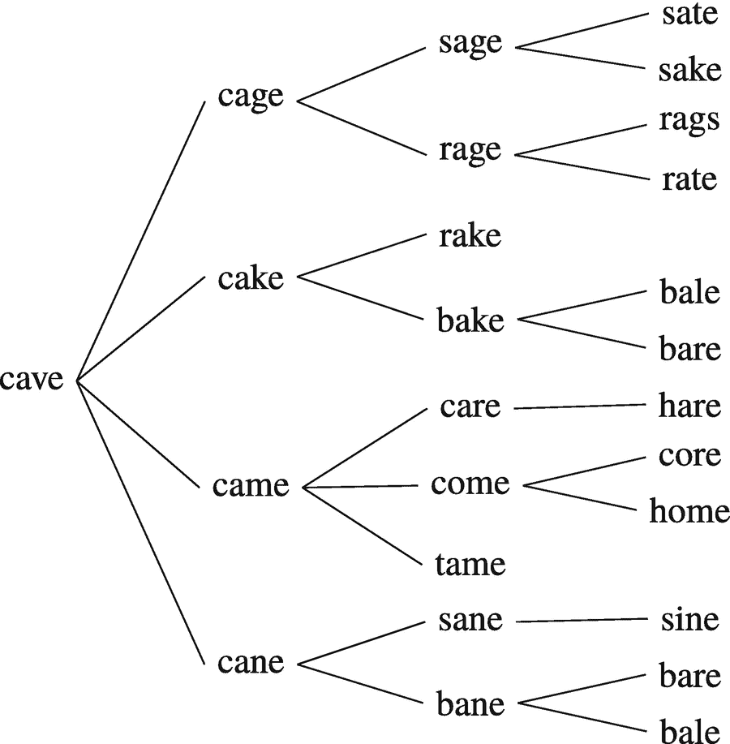

# 13. 单词转换

如何将“cave”变成“home”？一种方法如下：

```
cave → came → come → home.
```

这就是*单词转换*游戏：选择两个单词，然后看能否通过每次改变一个字母，将其中一个单词转换成另一个，且每次改变后得到的都是有效单词。

在本章中，我们将编写软件来解决任意两个单词的单词转换问题——如果存在解决方案——并在无解时告知用户。这既是一个有趣的问题，也能让我们进一步练习面向对象编程和单元测试，同时我们还将构建一种新的数据结构，它实际上是递归的。

## 13.1 算法

解决此问题的一种方法是创建单词的“代”，每一代由上一代通过单字母替换生成，并注意记录已生成过的单词。当发现某一代包含目标单词时，过程成功结束。当某一代仅包含之前各代已出现的单词时，过程失败结束。最好通过示例来理解。假设起始单词是 `fight`，目标单词是 `argue`。

### 13.1.1 第一代

通过改变 `fight` 中任意一个字母可以得到的单词有：

```
bight, dight, eight, hight, light, might,
night, pight, right, sight, tight, wight
```

这些单词都是新的，但都不是目标单词，因此我们用它们来构建新一代。

### 13.1.2 第二代

第一代中的每个单词都可以变回 `fight`，但那是我们的起始单词，所以已经出现过。除此之外：

*   从 `bight` 可以得到 `bigot` 和 `bigha`。

*   从 `dight` 可以得到 `digit`。

*   从 `eyght` 可以得到 `eight`。

*   `night` 生成 `noght`。

*   `tight` 生成 `toght`。

因此第二代中的新单词是：

```
bigot, bigha, digit, eyght, noght, toght
```

### 13.1.3 第三代

在第二代创建的单词中，只能创建两个新单词：`bigot` 生成 `begot`，`digit` 可以变成 `dimit`。

### 13.1.4 第四代

从第三代的新单词中，我们从 `begot` 得到 `besot`、`beget` 和 `begod`，从 `dimit` 得到 `limit` 和 `demit`。

### 13.1.5 算法成功终止

经过多代之后，找到了目标单词 `argue`。生成它的单词是 `argus`。生成 `argus` 的单词是 `argas`，依此类推，逆向追溯，直到 `bigot`，然后到 `bight`，最后到起始单词 `fight`。完整的单词链是：

```
fight, bight, bigot, begot, beget, reget, revet, levet,
lever, laver, lager, eager, egger, agger, anger, angor,
algor, algol, argol, argal, argas, argus, argue
```

### 13.1.6 算法失败终止

同样值得看一个算法未找到目标单词而终止的示例。假设起始单词是 `viola`，目标单词是 `cello`。第一代只包含两个新单词：`villa` 和 `viole`。从 `villa` 可以得到 `viola`（当然）以及新单词 `zilla` 和 `villi`，但 `viole` 无法变成新单词。因此我们有：

```
起始单词: viola
第一代: villa, viole
第二代: zilla, villi
```

然而，`zilla` 和 `villi` 都无法变成新单词，因此第三代为空，算法终止。

## 13.2 主要类与项目设置

如示例所示，我们的算法包含三个关键过程。首先，是从现有单词生成新单词的任务。我们将有一个名为 `WordNode` 的类来执行此操作。其次，`WordNode` 创建的单词需要检查是否有效以及是否之前出现过。这项工作将由名为 `WordChecker` 的类完成。最后，如果找到目标单词，我们需要构建从起始单词到目标单词的“路径”。我们的 `WordNode` 类除了创建新单词外，还将负责这项工作。

还需要另外两个类。前几章的 `Dictionary` 将被 `WordChecker` 用来测试潜在新单词的有效性。最后，一个名为 `WordSwitch` 的类将提供 `main` 函数并实现单词转换算法。

`WordChecker`、`WordNode` 和 `WordSwitch` 的桩代码及其单元测试已经创建，我们使用与前几章相同的 `Dictionary` 类和测试。要开始，请打开项目 [`https://github.com/Apress/learn-to-program-w-kotlin-wordswitch.git`](https://github.com/Apress/learn-to-program-w-kotlin-wordswitch.git)。


## 13.3 `WordChecker` 类

首次打开项目时，`WordChecker` 类应如下所示：

```
1   package lpk.words

3   /**
4    * 检查潜在的新单词是否在词典中
5    * 且之前未被见过。
6    */
7   class WordChecker(val dictionary: Dictionary) {

9       val wordsSoFar = mutableSetOf()

11       fun isPreviouslyUnseenValidWord(string: String): Boolean {
12           return false
13       }
14   }
```

从第 7 行可以看出，`WordChecker` 有一个 `Dictionary` 类型的字段，该字段通过构造函数传入。

目前只有一个函数 `isPreviouslyUnseenValidWord`，它被赋予了一个始终返回 `false` 的桩实现。我们的第一个编程任务是为这个函数编写一个单元测试，以便我们可以安全地用正确的实现替换这个桩。有几个测试用例浮现在脑海中：

*   如果某个 `String` 不在 `Dictionary` 中，该函数应返回 `false`。

*   对于在 `Dictionary` 中的 `String`，第一次见到该单词时，函数应返回 `true`，但后续调用都应返回 `false`。

在编写单元测试时，我们可以像上一个项目那样创建一个包含五个单词的词典，然后基于此创建一个 `WordChecker`。

项目步骤 13.1

在 IntelliJ 中打开 `WordCheckerTest`，并将这个部分实现的测试函数复制到该类中：

```
@Test
fun notInDictionaryTest() {
val path = Paths.get("src/test/resources/books/FiveWords.txt")
val dictionary = Dictionary(path)
val checker = WordChecker(dictionary)
}
```

在此函数中添加一行，检查单词“aardwolf”是否不是一个之前未见过的有效单词。

考虑到 `isPreviouslyUnseenValidWord` 的桩实现，你预期这个测试会通过还是失败？

提示

此项目步骤及其他项目步骤的解决方案位于本章末尾。

实现此项目步骤后，`WordCheckerTest` 应如下所示：

```
package lpk.words.test
import org.junit.Assert
import org.junit.Test
import lpk.words.Dictionary
import lpk.words.WordChecker
import java.nio.file.Paths
class WordCheckerTest {
@Test
fun notInDictionaryTest() {
val path = Paths.get("src/test/resources/books/FiveWords.txt")
val dictionary = Dictionary(path)
val checker = WordChecker(dictionary)
Assert.assertFalse(checker.isPreviouslyUnseenValidWord("aardworlff"))
}
}
```

请注意，你的导入语句可能略有不同，但只要没有错误提示，就没有问题。现在让我们实现第二个测试场景。

项目步骤 13.2

将以下部分测试函数添加到 `WordCheckerTest` 中：

```
@Test
fun validWordTest() {
val path = Paths.get("src/test/resources/books/FiveWords.txt")
val dictionary = Dictionary(path)
val checker = WordChecker(dictionary)
}
```

添加一个断言，检查“bat”是一个之前未见过的有效单词。

然后添加一个断言，检查它不再是（因为该单词在你添加的第一行中已被见过）。

正如测试所暗示的，`isPreviouslyUnseenValidWord` 的实现应：

*   如果单词不在词典中，则返回 `false`，并且不记录它
*   记录一个新的有效单词，然后返回 `true`
*   如果单词已被记录，则返回 `false`

项目步骤 13.3

注意，`WordChecker` 的桩已经包含了一个 `Dictionary` 和一个 `Set<String>`。利用这些，实现该函数，然后检查测试是否通过。

## 13.4 `WordNode` 类

`WordNode` 将由一个 `String` 创建，并具有一个函数来生成其有效的单字母变体。下载的项目文件应包含 `WordNode` 的以下桩：

```
package lpk.words
/**
* 生成一个单词的单字母变体。
*/
data class WordNode(val text: String) {
fun variantsByOneLetter(checker: WordChecker): List {
val result = mutableListOf()
return result
}
}
```

`variantsByOneLetter` 函数是我们的算法将用来生成新单词的函数。像往常一样，思考这个函数在一些简单情况下如何工作是非常有用的。

*   如果我们从一个空单词开始，不会生成任何变体。
*   从一个单字母单词开始，我们得到词典中所有其他可能的单字母单词。
*   从单词 `ab` 开始，我们可以得到所有形如 `a_` 的单词（其中 `_` 代表除 `b` 之外的任何字母）且存在于词典中，再加上所有形如 `_b` 的单词（其中 `_` 代表除 `a` 之外的任何字母）且存在于词典中。

在将这些场景转化为单元测试时，我们面临一个问题：实际上并不知道词典中有哪些单词。对于单字母单词，这并不难发现。然而，对于双字母单词，这将是一个真正的挑战。我们必须编写一个程序来在词典中搜索它们，这会耗费大量工作。考虑到我们可能还需要在某个阶段涉及三字母和四字母单词的测试，我们需要找到另一种方法。

我们可以做的是创建另一个只包含少量单词的词典，并从这个受限词典中创建测试中使用的 `WordChecker`。

实际上，一个名为 `abcd.txt` 的词典文件已经创建好，并位于项目的测试资源中，如图 13-1 所示。该文件仅包含以下条目：



图 13-2

要开始解决重复代码的问题，请高亮其中一个重复的代码块



图 13-1

词典文件 `abcd.txt`

```
a, b, c, d, aa, ab, ac, ad, ba, bb, bc,
bd, ca, cb, cc, cd, da, db, dc, dd
```

项目步骤 13.4

`WordNode` 已经有一个空的单元测试类。将以下代码复制到其中：

```
@Test
fun testEmpty() {
val path = Paths.get("src/test/resources/books/abcd.txt")
val dictionary = Dictionary(path)
val checker = WordChecker(dictionary)
val wordNode = WordNode("")
}
```

在测试中添加一行，检查 `variantsByOneLetter` 是否返回一个空列表。考虑到该函数的桩实现，你预期这个测试会通过还是失败？

项目步骤 13.5

现在让我们考虑单字母单词的场景。将以下部分实现的测试函数添加到 `WordNodeTest` 中：

```
@Test
fun testOneLetterWord() {
val path = Paths.get("src/test/resources/books/abcd.txt")
val dictionary = Dictionary(path)
val checker = WordChecker(dictionary)
val nodeA = WordNode("a")
val generated = nodeA.variantsByOneLetter(checker)
}
```

根据我们之前的分析，`val generated` 应包含三个单词。它们是哪些？

你能添加断言来检查这一点吗？


## 13.5 重构 **WordNodeTest**

`WordNodeTest` 中的两个测试函数包含若干行完全相同的代码。最好能避免这种重复，因为视觉上的杂乱会使测试难以阅读。此外，如果对 `WordChecker` 的创建方式做出任何更改，则需要在两个地方进行相应的修改。为了解决这个问题，我们可以将公共代码提取为一个函数，并在重复代码的位置调用该函数。IntelliJ 对此提供了强大的支持。首先，高亮选中 `testEmpty` 的前三行，如图 13-2 所示。

选中代码块后，选择菜单 **Refactor**，然后选择子菜单 `Refactor This...`，如图 13-3 所示。



图 13-3

重构菜单

将出现一个包含多个选项的小窗口，如图 13-4 所示。在这些选项中，选择 `Function`。将显示一个相当复杂的对话框，其中包含各种选项以及更改的预览，如图 13-5 所示。只需点击 **OK**。



图 13-5

函数提取工具



图 13-4

重构工具对话框

IntelliJ 现在将弹出一个选项，用于重构第二个代码块，如图 13-6 所示。点击 **Yes**。现在，测试函数应该被重构，以调用 `wordChecker` 函数来替代重复的代码块。目前，在空间和复杂性上的节省并不显著，但随着我们添加更多函数，我们刚刚完成的工作（或者说让 IntelliJ 为我们完成的工作！）肯定会带来回报。



图 13-6

IntelliJ 提供重构其他匹配代码块的选项

## 13.6 对 `WordNode` 的进一步测试

现在代码已经简化，我们可以回到测试场景，实现那些涉及从两个字母的单词生成新单词的测试。如果我们从单词 `ab` 开始，那么通过改变第一个字母，我们可以得到 `bb`、`cb`、`db`、`eb`、`fb` 等等。其中，只有前三个在我们这些测试所使用的字典中。通过改变 `ab` 的第二个字母，我们可以生成有效单词 `aa`、`ac` 和 `ad`。因此，我们总共有六个变体：

```
aa, ac, ad, bb, cb, db
```

项目步骤 13.6

复制并粘贴整个函数 `testOneLetterWord`。

将复制的函数重命名为 `testTwoLetterWord`。

然后按如下方式修改函数体：

*   不要从 `"a"` 创建 `WordNode`，而是从 `"ab"` 创建。
*   添加一个断言，确认 `generated` 有六个元素。
*   不要断言 `generated` 包含 `WordNode("b")` 等，而是检查它是否包含前面列出的元素。

## 13.7 实现 `WordNode`

我们已经有了 `WordNode` 的桩代码。现在，有了几个测试，我们可以填充 `variantsByOneLetter` 的细节。我们的桩代码已经让这个函数创建了一个 `List<WordNode>` 并返回它。我们需要做的是编写填充这个列表的代码。这可以通过遍历单词中的每个位置，并添加通过更改该位置的字母所产生的变体来实现。

项目步骤 13.7

用以下代码替换 `variantsByOneLetter`：

```
1   fun variantsByOneLetter(checker: WordChecker): List {
2       val result = mutableListOf()
3       //对于单词中的每个位置...
4       for (i in 0..text.length - 1) {
5           //...添加通过仅更改
6           //该位置的字母而产生的变体。

8       }
9       return result
10   }
```

这段代码中当前为空的第 7 行需要一些思考。此时，作用域内的对象有：需要添加新变体的 `result`、用于测试可能单词的 `checker`、字母位置 `i`，当然还有在类构造函数中声明的字段 `word`。

在为这类棘手问题开发算法时，思考一个具体的例子非常有用。因此，假设我们的 `WordNode` 对应 `"bolt"`，并且 `i` 是 `2`。我们想知道通过替换 `"l"` 可以得到哪些单词。在 `"l"` 之前，我们有 `"bo"`，在它之后我们有 `"t"`。这些片段创建了一个模板 `"bo_t"`。对于字母表中的每个字母，我们可以用该字母替换下划线字符，并使用 `checker` 测试生成的 `String`。因此，我们询问：

*   “`boat`” 是否有效，
*   “`bobt`” 是否有效，
*   “`boct`” 是否有效，
*   依此类推，直到
*   “`bozt`” 是否有效？

例外情况是，我们不需要询问 `"bolt"`，因为这是我们正在处理的单词。作为一个算法，这相当于：

*   获取位置之前的文本
*   获取位置之后的文本
*   对于字母表中的每个字母
    *   如果该字母与我们的单词中的字母不同，则使用它创建一个新单词。
    *   如果新单词有效，则添加它。

由于这个逻辑非常复杂，我们将把它放入一个专用函数中，并在 `variantsByOneLetter` 的第 7 行使用它。

项目步骤 13.8

将此函数复制到 `WordNode` 中：

```
private fun addVariantsAtPosition(position: Int, nodes: MutableList, checker: WordChecker) {
val textBeforePosition = text.substring(0, position)
val textAfterPosition = if (text.length > 1) text.substring(position + 1, text.length) else ""
val originalLetter = text[position]
for (fromAlphabet in "abcdefghijklmnopqrstuvwxyz") {
if (originalLetter != fromAlphabet) {
val variant = textBeforePosition + fromAlphabet + textAfterPosition
if (checker.isPreviouslyUnseenValidWord(variant)) {
nodes.add(WordNode(variant))
}
}
}
}
```

将函数中的代码行与前面给出的算法步骤进行比较。

然后，将项目步骤 13.7 中空的第 7 行替换为对这个新函数的调用：

```
addVariantsAtPosition(i, result, checker)
```

检查一下，通过这些更改，测试现在是否通过了。


## 13.8 `WordSwitch` 类

我们的 `WordChecker` 和 `WordNode` 类实现了单词转换算法的关键部分。为了协调这两个类的活动，我们将使用第三个类，名为 `WordSwitch`。这个类已经部分实现了。如果你在 IntelliJ 中打开它，应该会看到以下代码：

```
1   package lpk.words

3   import java.nio.file.Paths

5   /**
6    * 实现单词转换算法。
7    */
8   class WordSwitch(dictionary: Dictionary, start: String, val target: String) {

10       val startNode: WordNode
11       val checker: WordChecker

13       init {
14           startNode = WordNode(start)
15           checker = WordChecker(dictionary)
16       }

18       fun lookForTarget(): WordNode? {
19           //声明一个变量来保存每一代中产生的新单词。
20           //用起始单词生成的单词来初始化它。

23           //只要这些新单词中包含新词且未找到目标，
24           //就循环创建新的一代。

26           return null
27       }
28   }
```

第 8 行的构造函数显示有一个名为 `target` 的字段，类型为 `String`。另外两个构造函数参数分别是 `Dictionary` 和 `String`，搜索从该字符串开始。这两个参数在 `init` 块中用于初始化两个字段。这两个字段分别是：一个 `WordNode`（搜索算法由此启动）和一个 `WordChecker`。

第 18 行引入了一个函数 `lookForTarget`，它将实际执行搜索。如果能够到达目标，此函数将返回一个包含目标单词的 `WordNode`，否则返回 `null`（“空”对象）。`null` 的可能性意味着返回类型是 `WordNode?` 而不是 `WordNode`。

当然，在尝试填充此函数的细节之前，我们会编写单元测试。在这些单元测试中，我们将重用 `WordCheckerTest` 中的 “abcd” 字典。以下是一些可能的测试用例：

*   如果起始单词是 `ab`，目标单词是 `abc`，那么将无法到达目标，因为它的长度与起始单词不同。

*   单词 `ae` 无法到达，因为它不在字典中。

*   单词 `b` 应该可以从 `a` 到达，`bb` 应该可以从 `aa` 到达，`bbb` 应该可以从 `aaa` 到达，以此类推。

项目步骤 13.9

打开 `WordSwitchTest` 并将这两个测试函数复制到类的正文中：

```
@Test
fun noPathDifferentLengths() {
val path = Paths.get("src/test/resources/books/abcd.txt")
val dictionary = Dictionary(path)
val wordSwitch = WordSwitch(dictionary, "ab", "abc")
Assert.assertNull(wordSwitch.lookForTarget())
}
@Test
fun noPathTargetNotInDictionary() {
val path = Paths.get("src/test/resources/books/abcd.txt")
val dictionary = Dictionary(path)
val wordSwitch = WordSwitch(dictionary, "aa", "ae")
Assert.assertNull(wordSwitch.lookForTarget())
}
```

运行这些测试。它们为什么能通过？

项目步骤 13.10

注意，两个测试函数都以相同的前两行开头。你能让 IntelliJ 重构这段重复的代码吗？

项目步骤 13.11

重构后，你的代码应该类似于项目步骤 13.8 的解决方案。在这段代码中，两个测试函数各自声明并创建了一个 `Dictionary`，该字典仅在下一行作为参数传递给 `WordSwitch` 构造函数调用，例如：

```
1   @Test
2   fun noPathDifferentLengths() {
3       val dictionary = dictionary()
4       val wordSwitch = WordSwitch(dictionary, "ab", "abc")
5       Assert.assertNull(wordSwitch.lookForTarget())
6   }
```

这可以进一步简化：将第 4 行 `WordSwitch` 构造函数中使用的 `dictionary` 参数替换为对 `dictionary()` 的调用，然后删除第 3 行：

```
@Test
fun noPathDifferentLengths() {
val wordSwitch = WordSwitch(dictionary(), "ab", "abc")
Assert.assertNull(wordSwitch.lookForTarget())
}
```

对另一个测试函数执行相同的重构。这种重构称为*内联*。

现在测试代码已经清理得差不多了，让我们看看其他一些测试场景。我们想要实现的一个测试是，如果从 `a` 开始，那么我们可以到达 `b`。我们通过从 `a` 创建一个 `WordNode` 来开始对此的测试：

```
val wordSwitch = WordSwitch(dictionary(), "a", "b")
```

然后运行 `lookForTarget` 并将结果赋值给一个 `val`：

```
val result = wordSwitch.lookForTarget()
```

现在我们需要检查 `result` 内部的 `text` 是否等于 `b`。也就是说，我们希望进行如下调用：

```
Assert.assertEquals("b", result.text)
```

然而，这段代码是错误的，因为 `result` 的类型不是 `WordNode`；而是 `WordNode?`。也就是说，它可能是 `null`。这非常不方便，因为我们知道它不应该是 `null`：它应该是一个 `text` 等于 `"b"` 的 `WordNode`。幸运的是，Kotlin 有一种解决这个问题的方法。可以添加一个特殊的运算符，称为*非空断言*，写作 `!!`，然后我们就可以将 `result` 视为真正的 `WordNode`：

```
Assert.assertEquals("b", result!!.text)
```

现在我们有了测试从 `a` 到 `b` 所需的全部要素。

项目步骤 13.12

在 `WordSwitchTest` 中创建一个函数，测试 `"a"` 能否转换为 `"b"`。将该函数命名为 `a_to_b`。

项目步骤 13.13

复制测试函数 `a_to_b` 并修改它，以检查单词 `"ab"` 能否转换为 `"ba"`。


## 13.9 `lookForTarget` 的实现

我们已经有了一个带注释的 `lookForTarget` 存根，并且还有一些测试用例可以指导我们实现并验证其正确性。现在让我们开始填补空白。回顾第 209 页 `WordSwitch` 的代码清单，我们首先需要一个 `var` 来存放新生成的单词，并用从 `startNode` 派生出的单词进行初始化：

```
var currentGeneration = startNode.variantsByOneLetter(checker)
```

代码的下一部分需要一个变量来存放目标节点，初始值为 `null`。通常，Kotlin 能够根据声明推断 `var` 的类型，但如果初始值为 `null`，则无法推断。其类型可能是 `String?`、`Int?` 或其他类型。在这种情况下，我们必须通过在声明中包含类型来帮助 Kotlin：

```
var targetNode : WordNode? = null
```

我们的代码会反复从当前代创建新的一代单词。只要还能创建新单词且尚未找到目标，我们就需要继续搜索。这可以通过一种称为 `while` 循环的结构来表达：

```
while (currentGeneration.isNotEmpty() && targetNode == null) {
//这是循环体。
//计算在此进行。
}
```

我们之前见过对列表或数组元素进行循环的写法。`while` 循环的工作方式不同。循环体中的代码会重复执行，直到循环条件为假时才停止。我们的循环条件是 `currentGeneration` 不为空且 `targetNode` 为 `null`。换句话说，如果 `targetNode` 被赋值为非 `null` 值，或者 `currentGeneration` 为空，循环就会停止。

在循环体内，我们创建一个变量来存放从 `currentGeneration` 生成的单词：

```
val nextGeneration = mutableListOf()
```

为了实际生成新单词，我们需要遍历 `currentGeneration` 中的每个单词：

```
for (wordNode in currentGeneration) {
//处理这个 wordNode。
}
```

循环变量 `val wordNode` 代表当前代中的一个单词。它有可能就是目标。让我们检查这种可能性：

```
if (wordNode.text == target) {
targetNode = wordNode
}
```

同样在循环内，我们需要从 `wordNode` 生成新单词，并将它们添加到下一代中：

```
nextGeneration.addAll(wordNode.variantsByOneLetter(checker))
```

一旦 `currentGeneration` 中的所有单词都用于生成新单词，就需要用 `nextGeneration` 替换 `currentGeneration`：

```
currentGeneration = nextGeneration
```

综合以上所有内容，我们实现了主要的搜索算法：

```
fun lookForTarget(): WordNode? {
//声明一个变量来存放每一代中创建的新单词。
//用起始单词生成的单词进行初始化。
var currentGeneration = startNode.variantsByOneLetter(checker)
//只要这些代中包含新单词且未找到目标，就循环创建新的一代。
var targetNode: WordNode? = null
while (currentGeneration.isNotEmpty() && targetNode == null) {
//创建一个 val 来存放将要生成的单词。
val nextGeneration = mutableListOf()
//对于当前代中的每个单词...
for (wordNode in currentGeneration) {
//...检查它是否是目标...
if (wordNode.text == target) {
targetNode = wordNode
}
//...并从中生成所有新单词。
nextGeneration.addAll(wordNode.variantsByOneLetter(checker))
}
//处理完当前代后，
//用其生成的单词替换它。
currentGeneration = nextGeneration
}
return targetNode
}
```

项目步骤 13.14

用上述代码替换 `lookForTarget` 的现有代码，然后检查测试是否通过。

这是一个*超级困难*的算法，包含嵌套循环，所以像往常一样，不必担心一次就能完全理解。事实上，这是本书最难的部分。

## 13.10 寻找路径

此时，我们的 `WordSwitch` 程序可以判断一个单词是否能转换为另一个单词，但它无法告诉我们转换过程中的单词序列。为了获取这些信息，我们将为每个 `WordNode` 提供其派生来源的 `WordNode`。然后我们可以从目标 `WordNode` 反向追溯到原始节点，从而得到反向的转换序列。



图 13-7

从 `cave` 派生的 `WordNode` 树的一部分

例如，考虑从 `cave` 到 `home` 的转换。我们的起始 `WordNode` 是 `cave`。它没有前驱节点，因为它是起始节点。`cave` 的变体包括 `cage`、`cake`、`came`、`cane` 等。对于这些 `WordNode` 中的每一个，我们将 `cave` 设置为父节点。在下一代中，我们可以从 `cake` 派生出 `bake` 和 `rake`，从 `cage` 派生出 `rage` 和 `sage`，以此类推。通过这种方式，我们可以形成一个以 `cave` 为*根*节点的 `WordNode` 树状结构。

为了在软件中表示这种结构，我们只需向 `WordNode` 添加一个新的实例变量，不妨称之为 `parent`。我们将修改构造函数来设置该变量。

项目步骤 13.15

将 `WordNode` 的声明改为：

```
data class WordNode(val text: String, val parent: WordNode? = null)
```

这个构造函数的新部分是：

```
val parent: WordNode? = null
```

这段代码的含义是：

*   有一个名为 `parent` 的字段。
*   它是一个 `val`（而非 `var`）。
*   它的类型是 `WordNode?`。
*   调用构造函数时，可以省略 `parent`，此时其值将为 `null`。

最后这个属性（参数可以省略）是 Kotlin 一个非常方便的特性。我们称之为*可选参数*。

当创建一个 `WordNode` 作为现有 `WordNode` 的变体时，新节点应将旧节点作为 `parent`。让我们测试一下。在 `WordNodeTest` 中，我们目前有以下测试函数：

```
1   @Test
2   fun testOneLetterWord() {
3       val path = Paths.get("src/test/resources/books/abcd.txt")
4       val dictionary = Dictionary(path)
5       val checker = WordChecker(dictionary)
6       val nodeA = WordNode("a")
7       val generated = nodeA.variantsByOneLetter(checker)
8       Assert.assertEquals(3, generated.size)
9       Assert.assertTrue(generated.contains(WordNode("b")))
10       Assert.assertTrue(generated.contains(WordNode("c")))
11       Assert.assertTrue(generated.contains(WordNode("d")))
12   }
```

需要修改此测试，以检查第 9、10 和 11 行的 `WordNode` 是否将 `nodeA` 作为 `parent`。

项目步骤 13.16

将第 9-11 行改为：

```
Assert.assertTrue(generated.contains(WordNode("b", nodeA)))
Assert.assertTrue(generated.contains(WordNode("c", nodeA)))
Assert.assertTrue(generated.contains(WordNode("d", nodeA)))
```

然后对 `testTwoLetterWord` 进行等效修改。

这些修改后的测试应该会失败，因为在 `addVariantsAtPosition` 函数中创建变体时，我们没有将 `WordNode` 作为 `parent` 添加到其变体中。在该函数的第 26 行（如第 207 页所列），我们创建了 `WordNode` 变体：

```
nodes.add(WordNode(variant))
```

必须修改构造函数调用，以包含对运行该函数的 `WordNode` 的引用。回想一下，有一个关键字 `this` 指向当前对象。

项目步骤 13.17

将该行代码改为：

```
nodes.add(WordNode(variant, this))
```

检查 `WordNodeTest` 中的所有测试现在是否都通过。

这个变量将使我们能够计算从任意 `WordNode` 回溯到原始 `WordNode` 的 `WordNode` 序列。这个序列被称为通往根节点的*路径*。

项目步骤 13.18

向 `WordNode` 添加以下存根函数：

```
fun rootPath() : List {
val result = mutableListOf()
return result
}
```

以下是此函数的一些测试用例：


*   如果创建一个 `parent` 为 `null` 的 `WordNode`，则假定它为根节点，因此该函数应返回一个仅包含该 `WordNode` 的列表。

*   如果创建一个名为 `a` 且 `parent` 为 `null` 的 `WordNode`，然后将其作为父节点来创建第二个节点 `b`，那么从 `b` 到根节点的路径包含 `b` 和 `a`。

*   接上例，如果我们创建一个 `WordNode` `c`，其父节点为 `b`，那么从 `c` 到根节点的路径将是 `c, b, a`。

项目步骤 13.19

将以下代码复制到 `WordNodeTest` 中：

```
@Test
fun testPathFromRootWithNullParent() {
val a = WordNode("a", null)
val path = a.rootPath()
Assert.assertEquals(1, path.size)
Assert.assertEquals(a, path.get(0))
}
```

确认测试失败。

项目步骤 13.20

以下是第二个场景的测试函数：

```
@Test
fun testPathFromRootLengthTwo() {
val a = WordNode("a", null)
val b = WordNode("b", a)
val path = b.rootPath()
Assert.assertEquals(2, path.size)
Assert.assertEquals(a, path.get(0))
Assert.assertEquals(b, path.get(1))
}
```

将其复制到 `WordNodeTest` 中，并确认测试失败。

项目步骤 13.21

你能为第三个场景添加一个测试吗？

`rootPath` 的实现非常简单。首先从一个空列表开始。然后，如果 `WordNode` 有 `parent`，则添加 `parent` 的路径。最后，添加 `WordNode` 本身。这个算法用代码表示如下。请注意，在第 5 行，我们使用了 `addAll` 函数，该函数将一个 `List` 中的所有元素插入到另一个 `List` 中。

```
1   fun rootPath() : List {
2       val result = mutableListOf()
3       if (parent != null) {
4           val parentRootPath = parent.rootPath()
5           result.addAll(parentRootPath)
6       }
7       result.add(this)
8       return result
9   }
```

项目步骤 13.22

用上述代码替换 `rootPath` 的桩实现。

确认测试现在通过。

一个 `WordNode` 包含另一个 `WordNode` 这一事实使其成为*递归数据结构*。`rootPath` 函数实际上是递归的，因为前面第 4 行调用了 `parent.rootPath`。

## 13.11 整合所有内容

现在，我们拥有了解决单词转换问题所需的所有部分。`WordSwitch` 类有一个函数，用于在可能的情况下，通过真实单词的单字母转换，从原始单词找到目标 `WordNode`。如果目标 `WordNode` 不为 `null`，那么它可以为我们提供转换过程中的单词列表。

项目步骤 13.23

将以下 `main` 函数添加到 `WordSwitch.kt` 文件中，位于类声明之上：

```
fun main() {
//加载字典。
val path = Paths.get("src/main/resources/books/english.txt")
val dictionary = Dictionary(path)
//创建一个 WordSwitch 来查找
//从 "swine" 到 "whale" 的路径。
val wordSwitch = WordSwitch(dictionary, "swine", "whale")
//计算目标节点。
val target = wordSwitch.lookForTarget()
if (target == null) {
//如果目标为 null，则打印出无法到达该单词的信息。
println("Could not reach target.")
} else {
//否则，检索从根节点到目标节点的路径并打印出来。
val fromRoot = target.rootPath()
for (wordNode in fromRoot) {
println(wordNode.text)
}
}
}
```

通过点击 `main` 函数旁边出现的绿色三角形来运行 `main` 函数。输出应显示：

```
swine, shine, whine, while, whale
```

要计算不同的单词搜索，只需将 `"swine"` 和 `"whale"` 更改为你想要的任何单词。

## 13.12 总结与步骤详情

我们构建了一个递归数据结构来解决一个难题。这实际上是相当复杂的编程，如果你理解了大部分代码，那做得很好；如果你有点困惑，也不必担心——这是非常高级的编码，可能需要一些时间才能消化。将问题分解为不同的类让我们更多地练习了面向对象编程。像往常一样，我们非常强调单元测试。此外，还有一些新的语法：我们学习了 `while` 循环。最后，我们进行了一些重构以减少代码重复，这是一项非常重要的编程技能。

这确实是一个庞大的章节。接下来的内容会变得更简单（也更多彩！）。

### 13.12.1 项目步骤 13.1 的详情

测试通过是因为它检查是否返回了 `false`，而在我们的函数桩实现中，它总是返回 `false`。我们进行测试的原因是为了防止将来出现错误。

### 13.12.2 项目步骤 13.2 的详情

以下是完整实现的测试：

```
@Test
fun validWordTest() {
val path = Paths.get("src/test/resources/books/FiveWords.txt")
val dictionary = Dictionary(path)
val checker = WordChecker(dictionary)
Assert.assertTrue(checker.isPreviouslyUnseenValidWord("bat"))
Assert.assertFalse(checker.isPreviouslyUnseenValidWord("bat"))
}
```

### 13.12.3 项目步骤 13.3 的详情

该函数的一种可能实现如下：

```
fun isPreviouslyUnseenValidWord(string: String): Boolean {
if (!dictionary.contains(string)) {
return false
}
if (wordsSoFar.contains(string)) {
return false
}
wordsSoFar.add(string)
return true
}
```

### 13.12.4 项目步骤 13.4 的详情

以下是完整的测试函数：

```
@Test
fun testEmpty() {
val path = Paths.get("src/test/resources/books/abcd.txt")
val dictionary = Dictionary(path)
val checker = WordChecker(dictionary)
val wordNode = WordNode("")
Assert.assertTrue(wordNode.variantsByOneLetter(checker).isEmpty())
}
```

即使使用我们的桩实现，这个测试也能通过，因为它总是返回一个空列表。尽管拥有这样的测试似乎毫无意义，但它可以保护我们免受未来可能包含错误的代码更改的影响。

### 13.12.5 项目步骤 13.5 的详情

完成的测试是：

```
@Test
fun testOneLetterWord() {
val path = Paths.get("src/test/resources/books/abcd.txt")
val dictionary = Dictionary(path)
val checker = WordChecker(dictionary)
val nodeA = WordNode("a")
val generated = nodeA.variantsByOneLetter(checker)
Assert.assertEquals(3, generated.size)
Assert.assertTrue(generated.contains(WordNode("b")))
Assert.assertTrue(generated.contains(WordNode("c")))
Assert.assertTrue(generated.contains(WordNode("d")))
}
```

请注意，`generated` 是一个 `List<WordNode>`，*而不是* `List<String>`，这就是为什么我们使用：

```
Assert.assertTrue(generated.contains(WordNode("b")))
```

*而不是*：

```
Assert.assertTrue(generated.contains("b"))
```

还要注意，我们正在检查 `generated` 是否包含三个特定的 `WordNode`，并且其大小为 3。大小检查确保 `generated` 中没有我们未检查的其他 `WordNode`。

### 13.12.6 项目步骤 13.6 的详情

以下是测试：

```
@Test
fun testTwoLetterWord() {
val checker = wordChecker()
val nodeAB = WordNode("ab")
val generated = nodeAB.variantsByOneLetter(checker)
Assert.assertEquals(6, generated.size)
Assert.assertTrue(generated.contains(WordNode("aa")))
Assert.assertTrue(generated.contains(WordNode("ac")))
Assert.assertTrue(generated.contains(WordNode("ad")))
Assert.assertTrue(generated.contains(WordNode("bb")))
Assert.assertTrue(generated.contains(WordNode("cb")))
Assert.assertTrue(generated.contains(WordNode("db")))
}
```

### 13.12.7 项目步骤 13.9 的详情

测试通过是因为它们测试的是返回 `null`，而这正是桩实现所做的。像往常一样，这些测试是为了确保在我们编写函数体之后，这种情况仍然会发生。

实际上，这些测试也起到了文档的作用，使其他程序员更容易理解这个类。在过去十年左右的时间里，有一种趋势是将单元测试用作类行为的文档。由于测试实际上是可执行的，因此它们保证是最新的，而其他类型的文档（例如代码注释）往往会很快过时。大多数软件开发人员讨厌编写文档。


### 13.12.8 项目步骤 13.10 的细节

以下是重构后的代码，提取出的函数被移到了文件末尾：

```
1   class WordSwitchTest {
2       @Test
3       fun noPathDifferentLengths() {
4           val dictionary = dictionary()
5           val wordSwitch = WordSwitch(dictionary, "ab", "abc")
6           Assert.assertNull(wordSwitch.lookForTarget())
7       }

9       @Test
10       fun noPathTargetNotInDictionary() {
11           val dictionary = dictionary()
12           val wordSwitch = WordSwitch(dictionary, "aa", "ae")
13           Assert.assertNull(wordSwitch.lookForTarget())
14       }

16       private fun dictionary(): Dictionary {
17           val path = Paths.get("src/test/resources/books/abcd.txt")
18           val dictionary = Dictionary(path)
19           return dictionary
20       }
21   }
```

请注意，第 4 行和第 11 行有些令人困惑，因为它们都声明了一个名为 `dictionary` 的 `val`，并将其设置为包含同样名为 `dictionary` 的*函数*的返回值，但使用了括号来表示函数调用。这种混淆可以通过内联代码来消除，这将在本章后面部分完成。

### 13.12.9 项目步骤 13.12 的细节

测试代码如下：

```
@Test
fun a_to_b() {
val wordSwitch = WordSwitch(dictionary(), "a", "b")
val result = wordSwitch.lookForTarget()
Assert.assertEquals("b", result!!.text)
}
```

### 13.12.10 项目步骤 13.13 的细节

测试代码如下：

```
@Test
fun ab_to_ba() {
val wordSwitch = WordSwitch(dictionary(), "ab", "ba")
val result = wordSwitch.lookForTarget()
Assert.assertEquals("ba", result!!.text)
}
```

### 13.12.11 项目步骤 13.16 的细节

具体细节如下：

```
@Test
fun testTwoLetterWord() {
val checker = wordChecker()
val nodeAB = WordNode("ab")
val generated = nodeAB.variantsByOneLetter(checker)
Assert.assertEquals(6, generated.size)
Assert.assertTrue(generated.contains(WordNode("aa", nodeAB)))
Assert.assertTrue(generated.contains(WordNode("ac", nodeAB)))
Assert.assertTrue(generated.contains(WordNode("ad", nodeAB)))
Assert.assertTrue(generated.contains(WordNode("bb", nodeAB)))
Assert.assertTrue(generated.contains(WordNode("cb", nodeAB)))
Assert.assertTrue(generated.contains(WordNode("db", nodeAB)))
}
```

### 13.12.12 项目步骤 13.21 的细节

测试函数如下：

```
@Test
fun testPathFromRootLengthThree() {
val a = WordNode("a", null)
val b = WordNode("b", a)
val c = WordNode("c", b)
val path = c.rootPath()
Assert.assertEquals(3, path.size)
Assert.assertEquals(a, path.get(0))
Assert.assertEquals(b, path.get(1))
Assert.assertEquals(c, path.get(2))
}
```

