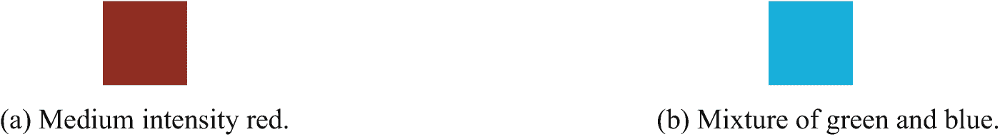
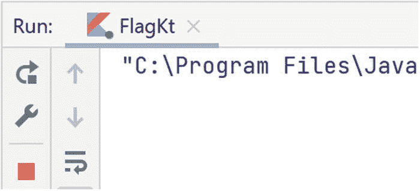
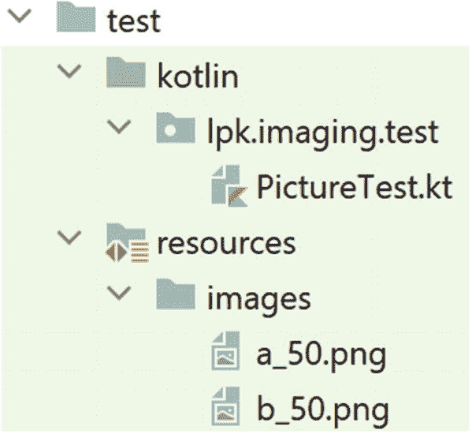
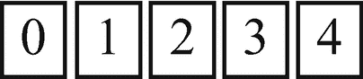
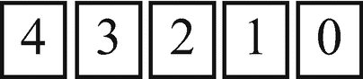

# 14. 彩色图片

在本章中，我们将回到显示图像的程序。我们将首先展示简单的颜色模式，例如国旗。然后，我们将学习如何加载图像文件，例如照片。最后，我们将编写执行简单图像处理的代码，例如沿垂直轴翻转图像。

## 14.1 颜色建模

计算机屏幕通过产生大量称为*像素*的微小彩色点来显示图像。（“像素”一词是“图像单元”的缩写。）在许多现代屏幕上，这些点小到肉眼无法看见，但在大型电视屏幕上通常可见。

如果你有机会观察一个像素相对较大的屏幕，你可能会看到每个像素本身由微小的红色、绿色和蓝色子像素组成。（如果手机屏幕上有雨滴充当放大镜，你可以在某些手机屏幕上看到这些子像素。）由于这些屏幕会发光，它们可以通过组合不同强度的红色、绿色和蓝色值来产生任何颜色。在下一页的图 14-1 中，图 14-1a 是低强度的纯红色，而图 14-1b 是等量绿色和蓝色的混合，两者均为高强度。



图 14-1

组合红色、绿色和蓝色以创建不同的颜色

编程挑战 14.1

对于以下每个方块，请粗略指示（低、中或高）所使用的红色、绿色和蓝色的强度。


为了对现实世界的颜色进行建模，我们将使用一个名为 `java.awt.Color` 的类。在这个模型中，一种颜色由三个介于 `0` 和 `255` 之间的 `Int` 值表示，分别对应红色、绿色和蓝色分量。在图 14-1a 所示的锈红色图像中，红色值为 `127`，绿色和蓝色值均为 `0`。蓝绿色图像的红色值为 `0`，绿色和蓝色值均为 `255`。我们可以通过传入相应的红色、绿色和蓝色分量来构造 `Color` 对象。例如，锈红色是 `Color(127, 0, 0)`，蓝绿色是 `Color(0, 255, 255)`。如果红色、绿色和蓝色值相同，我们会得到一种灰色调。在一个极端情况下，所有值都为 `0`，这就是黑色。白色是 `Color(255, 255, 255)`。

顺便提一下，标准 Java 库中有两个 `"Color"` 类：`java.awt.Color` 和 `javafx.scene.paint.Color`。包名确实很重要，如果你的程序无法编译，有可能是因为 `import` 语句引入了错误的 `Color` 类。


## 14.2 图片建模

我们将把一张图片建模为一个由像素行组成的数组，而每一行像素则被建模为一个`Color`对象的数组。这样就得到了一个由`Color`对象组成的数组的数组，即一个二维数组。在代码中，其形式如下：

```
1   package lpk.imaging

3   import java.awt.Color

5   class Picture(val pixels: Array>) {
6       fun height(): Int {
7           return pixels.size
8       }

10       fun width(): Int {
11           return pixels[0].size
12       }

14       fun pixelByRowColumn(row: Int, column: Int): Color {
15           return pixels[row][column]
16       }
17   }
```

第 5 行显示，`Picture`是由`Color`对象的二维数组构造的，并且传入构造函数的这个二维数组在类内部是可访问的。也就是说，它是一个字段。`height`函数返回二维数组中元素的数量，也就是作为行的`Color`对象数组的数量。`width`函数返回第一行中`Color`对象的数量。（我们假设所有行都具有相同数量的像素。）`pixelByRowColumn`函数让我们能够访问图像中的任意特定像素。

要开始使用这段代码，请使用 IntelliJ 下载项目 [`https://github.com/Apress/learn-to-program-w-kotlin-ch14.git`](https://github.com/Apress/learn-to-program-w-kotlin-ch14.git)。签出的项目应该具有现在已熟悉的目录结构，包含`main`和`test`目录。除了`Picture.kt`之外，还有`PicturePanel.kt`、`Flag.kt`、`PhotoDisplayer.kt`和`PictureDisplayer.kt`文件。`Flag`类将用于创建和显示代表国旗的`Picture`对象——生成这些国旗是数组操作中一个非常好的练习。`PhotoDisplayer`目前大部分是空的。我们将在本章末尾使用它。

`Flag.kt`文件包含以下代码：

```
1   package lpk.imaging

3   import java.awt.Color

5   fun main() {
6       Flag().show()
7   }

9   class Flag : PictureDisplayer() {

11       fun createPictureOfFlag(): Picture {
12           val height = 300
13           val width = 450

15           val pixels = Array(height) {
16               Array(width) { Color(255, 255, 255) }
17           }
18           for (row in 0..height - 1) {
19               for (column in 0..width - 1) {
20                   if (row < height / 2) {
21                       pixels[row][column] = Color(255, 0, 0)
22                   } else {
23                      pixels[row][column] = Color(255, 255, 255)
24                   }
25               }
26           }
27           return Picture(pixels)
28       }

30       //不要更改以下任何内容。
31       override fun createPicture(): Picture {
32           return createPictureOfFlag()
33       }

35       fun show() {
36           doLaunch()
37       }
38   }
```

其中的要点如下：

*   第一行是代码所属包的声明。

*   第 3 行导入了`java.awt.Color`类，我们用它来表示像素。

*   在第 5 行，声明了一个`main`函数，我们稍后将运行它。

*   第 9 行是`Flag`类的声明。`" : PictureDisplayer()"`这部分意味着`Flag`是一种`PictureDisplayer`。实际上，这赋予了`Flag`类`PictureDisplayer`的属性，例如显示自身的能力。这被称为*继承*，是面向对象编程的一个重要方面，尽管本书不会花太多篇幅讨论它。

*   在第 11 行，我们有一个创建`Picture`对象的函数。我们稍后会回到这里。

*   其余代码支持`Flag`从`PictureDisplayer`的继承。

我们感兴趣的代码部分是创建`Picture`对象的那部分：

```
1   fun createPictureOfFlag(): Picture {
2       val height = 300
3       val width = 450

5       val pixels = Array(height) {
6           Array(width) { Color(255, 255, 255) }
7       }
8       for (row in 0..height - 1) {
9           for (column in 0..width - 1) {
10               if (row < height / 2) {
11                   pixels[row][column] = Color(255, 0, 0)
12               } else {
13                  pixels[row][column] = Color(255, 255, 255)
14               }
15           }
16       }
17       return Picture(pixels)
18   }
```

其中部分内容应该与第 3 章非常相似。第 5 到 7 行定义了一个`Color`对象的二维数组，并将每个元素初始化为`Color(255, 255, 255)`，即白色。第 8 行的`for`循环遍历各行。第 9 行的一个内部（或嵌套）循环遍历当前行中的像素。在内部循环中（第 10 到 14 行），根据像素位于`Picture`的上半部分还是下半部分，将行中的元素设置为`Color(255, 255, 255)`或`Color(255, 0, 0)`。如果你运行`main`函数（应该有一个可点击的绿色箭头），你应该会看到印度尼西亚国旗的图像，如图 14-2 所示。要停止程序，请点击 IntelliJ 运行窗格中的红色方形按钮，如图 14-3 所示。



图 14-3

可以通过点击红色按钮来停止`Flag`程序


图 14-2

该代码应显示印度尼西亚国旗的近似图像。此处，它显示在黑色背景上，从而呈现出边框效果

构建`pixels`二维数组的代码分为两部分：首先，我们设置数组并用值`Color(255, 255, 255)`填充它；然后，我们通过循环遍历这些值并根据行号应用条件来调整它们。实际上，这两个操作可以合并，如下面重写的函数版本所示：

```
1   fun createPictureOfFlag(): Picture {
2       val height = 300
3       val width = 450

5       val pixels = Array(height) { row ->
6           if (row  Color(255, 0, 0) }
8           } else {
9               Array(width) { column -> Color(255, 255, 255) }
10           }
11       }
12       return Picture(pixels)
13   }
```

修改`Flag`以使用新版本的函数，并检查是否仍然显示正确的图像。

这段新代码的工作原理如下。在第 4 行，`val pixels`被创建为一个具有`height`行的数组。第 5 行有语法`"row ->"`，这是 Kotlin 中表示“考虑特定行”的简写。紧随其后的代码指定了在该行要执行的操作。如果该行位于上半部分，我们应用以下代码：

```
Array(width) { column -> Color(255, 0, 0) }
```

这行代码创建了一个具有`width`个元素的`Color`对象数组，然后应用规则：

```
column -> Color(255, 0, 0)
```

这意味着“对于任何列，都使用`Color(255, 0, 0)`”。需要一些练习才能习惯这种新语法，但在本书的其余部分我们会大量使用它。

编程挑战 14.2

乌克兰国旗与印度尼西亚国旗的比例相同，但上半部分是蓝色，下半部分是黄色。蓝色近似为`Color(51, 102, 255)`，黄色近似为`Color(254, 203, 0)`。修改`createPictureOfFlag`，使其显示乌克兰国旗。

编程挑战 14.3

德国国旗的高宽比为 3:5，从上到下有三条等宽的色带，颜色分别为黑色、红色和金色。

如果我们绘制一个有 300 行的国旗，每行应该有多少列？

你能修改`createPictureOfFlag`来生成德国国旗的图像吗？提示：金色使用`Color(255, 212, 0)`。


迪拜国旗靠近旗杆处有一条白色垂直条纹，其余部分为红色。其比例相当独特：宽高比为 17:8。白色条纹的宽度占国旗宽度的十七分之五。图 14-4 展示了黑色背景下的这面国旗。


图 14-4

黑色背景（作为边框）下的迪拜国旗

以下是生成这面国旗的 `createPictureOfFlag` 函数版本：

```
1   fun createPictureOfFlag(): Picture {
2       val height = 160
3       val width = 340
4       val pixels = Array(height) {
5               row ->
6           Array(width) {
7                   column ->
8               if (column < 100) {
9                   Color(255, 255, 255)
10               } else {
11                   Color(255, 0, 0)
12               }
13           }
14       }
15       return Picture(pixels)
16   }
```

请记住，第 5 行表示“对于任意行，应用以下代码”。第 6 行为该行创建一个数组，然后第 7 行表示“对于任意列，应用以下代码”。随后执行的代码（第 8 至 12 行）会根据像素距离左边缘的远近，创建红色或白色的像素。

编程挑战 14.4

意大利国旗的宽高比为 3:2，从左到右有三条垂直条纹，分别是深绿色、白色和中等红色。你能修改 `createPictureOfFlag` 来生成这面国旗的图像吗？对于绿色，请使用 `Color(0, 145, 69)`；对于红色，请使用 `Color(207, 43, 56)`。

现在假设我们要生成一个边长为 400 的正方形，它有厚度为 80 的红色边框，中心为白色，如图 14-5 所示。首先，让我们看看能否只生成顶部边框。这包括所有行索引小于 80 的像素。因此，像下面这样的代码可以工作：


图 14-5

中心为白色的红色方框。我们将修改它以生成瑞士国旗

```
fun createPictureOfFlag(): Picture {
val height = 400
val width = 400
val pixels = Array(height) {
row ->
if (row 
Color(255, 0, 0)
}
} else {
Array(width) {
column ->
Color(255, 255, 255)
}
}
}
return Picture(pixels)
}
```

请确认这段代码确实生成了一个带有红色顶部边框的白色正方形。现在我们来添加左侧边框。我们可以通过修改 `else` 块来实现，根据 `column` 的值决定返回红色还是白色像素。如果 `column < 80`，像素应为红色，否则为白色。因此，我们的代码变为：

```
1   fun createPictureOfFlag(): Picture {
2       val height = 400
3       val width = 400
4       val pixels = Array(height) {
5               row ->
6           if (row 
9                   Color(255, 0, 0)
10               }
11           } else {
12               Array(width) {
13                       column ->
14                   if (column < 80) {
15                       Color(255, 0, 0)
16                   } else {
17                       Color(255, 255, 255)
18                   }
19               }
20           }
21       }
22       return Picture(pixels)
23   }
```

这段代码可以工作（运行确认一下），但它变得非常混乱。问题之一是我们第 9 行和第 15 行有相同的构建红色像素的代码。这可以通过将所需的 `Color` 提取为 `Flag` 的字段来解决。第二个问题是我们有复杂的代码来遍历二维数组，并且在其中混合了决定数组条目颜色的逻辑。我们可以将颜色选择逻辑从循环中提取出来，如下所示：

```
1   val white = Color(255, 255, 255)
2   val red = Color(255, 0, 0)

4   fun createPictureOfFlag(): Picture {
5       val height = 400
6       val width = 400
7       val pixels = Array(height) {
8               row ->
9           Array(width) {
10                   column ->
11               colorForLocation(row, column)
12           }
13       }
14       return Picture(pixels)
15   }

17   fun colorForLocation(row: Int, column: Int): Color {
18       if (row < 80) {//顶部
19           return red
20       } else {
21           if (column < 80) {//左侧
22               return red
23           } else {
24               return white
25           }
26       }
27   }
```

这是一种改进，但 `colorForLocation` 函数实际上可以变得更简洁：

```
fun colorForLocation(row: Int, column: Int): Color {
if (row < 80) return red//顶部
if (column < 80) return red//左侧
return white//其他情况
}
```

这是因为在 Kotlin 中，`if` 语句内的单行代码块可以放在 `'if'` 的同一行。使用这种格式的代码，很容易修改以添加底部和右侧边框：

```
fun colorForLocation(c: Int, r: Int): Color {
if (r  320) return red//底部
if (c  320) return red//右侧
return white//其他情况
}
```

编程挑战 14.5

请确认通过这些修改，生成了红色方框。

此时 `Flag.kt` 的完整代码已在挑战的解答中给出，因此如果你在编辑时出错，可以查阅那里寻求帮助。

编程挑战 14.6

通过修改 `colorForLocation`，你能生成图 14-6 所示的瑞士国旗图像吗？**提示** 在红色方框代码中为红色的任何像素，此处仍应为红色，并且还有四个新的红色区域。首先尝试只生成包含其中一个区域的方框，如图 14-7 所示。



图 14-8

`test` 目录下的 `resources` 子目录包含可用于测试的简单图像


图 14-7

将红色方框转换为瑞士国旗的第一步


图 14-6

瑞士国旗


## 14.3 照片

计算机上有多种文件格式用于存储图像。JPEG 和 PNG 是最常用的两种格式。给定一个这两种格式之一的文件，我们如何将其转换为一个 `Picture`？图像处理是一项非常重要的任务，因此有现成的库类可以提供帮助。事实上，有一个名为 `javax.imageio.ImageIO` 的类可以为我们完成大部分工作。将 `Picture.kt` 中的所有代码替换为以下内容：

```
package lpk.imaging
import java.awt.Color
import java.io.File
import javax.imageio.ImageIO
fun loadPictureFromFile(imageFile: File): Picture {
val image = ImageIO.read(imageFile)
val width = image.width
val height = image.height
val pixels = Array(height) { row ->
Array(width) { column ->
Color(image.getRGB(column, row))
}
}
return Picture(pixels)
}
class Picture(val pixels: Array>) {
fun height(): Int {
return pixels.size
}
fun width(): Int {
return pixels[0].size
}
fun pixelByRowColumn(row: Int, column: Int): Color {
return pixels[row][column]
}
}
```

这个新版本的文件导入了读取图像文件所需的库。然后有一个 `loadPictureFromFile` 函数，其工作方式如下。该函数的唯一参数是一个包含图像数据的 `File`。函数的第一行将文件读入一个名为 `image` 的 `val` 中。这个 `val` 可以为我们提供图像的高度和宽度，这些信息用于创建一个像素的二维数组。我们可以使用 `getRGB` 函数获取特定位置的像素，该函数用于初始化这个二维数组。

重要的是不要过于纠结于这个函数的细节。在我们完成了编写类似代码来生成旗帜的所有艰苦工作之后，数组初始化的代码应该看起来很熟悉。然而，我们应该通过编写一个测试来确保代码是正确的。我们正在处理的项目中已经包含了一个几乎为空的 `PictureTest` 类，并且有一些图像文件可以用作测试数据，如图 14-8 所示。

`images` 目录中的文件 `green_h50_w100.png` 是一个绿色矩形，有 50 行和 100 列。让我们编写一个测试，使用 `loadPictureFromFile` 从这个文件创建一个图像，然后检查：

*   `Picture` 有 50 行。
*   它有 100 列。
*   每个像素都是绿色的。

将 `PictureTest.kt` 的当前内容替换为以下代码：

```
1   package lpk.imaging.test

3   import org.junit.Assert
4   import org.junit.Test
5   import lpk.imaging.Picture
6   import lpk.imaging.loadPictureFromFile
7   import java.awt.Color
8   import java.nio.file.Paths

10   private val IMAGES = "src/test/resources/images/"

12   class PictureTest {
13       @Test
14       fun loadPictureFromFileTest() {
15           val file = Paths.get(IMAGES + "green_h50_w100.png").toFile()
16           val loaded = loadPictureFromFile(file)
17           Assert.assertEquals(loaded.height(), 50)
18           Assert.assertEquals(loaded.width(), 100)
19           val green = Color(0, 255, 0)
20           for (row in 0..49) {
21               for (column in 0..99) {
22                   Assert.assertEquals(loaded.pixelByRowColumn(row, column), green)
23               }
24           }
25       }
26   }
```

第 14 行和第 15 行将图像文件定义为一个变量，然后将其作为参数传递给 `loadPictureFromFile`，并将返回的 `Picture` 保存在名为 `loaded` 的 `val` 中。测试的其余部分包含关于名为 `loaded` 的对象的各种断言。第 16 行检查它是否具有正确的行数。下一行检查宽度。接下来是一个代码块，它逐行逐列地遍历像素，并检查它们是否都是绿色的。将这段代码复制到 `PictureTest` 中后，运行它并检查测试是否通过。

**编程挑战 14.7**

有一个名为 `yellow_h80_w30.png` 的测试文件。编写一个该测试的变体，检查这个文件是否被正确加载。预期的 `Color` 是 `Color(255, 255, 0)`。

有了这些测试，我们可以相当确信一切运行正常，那么让我们实际显示一张照片。我们的项目中有一个名为 `PhotoDisplayer.kt` 的 Kotlin 文件，目前几乎是空的。将文件中的内容替换为以下代码：

```
package lpk.imaging
import java.nio.file.Paths
fun main() {
PhotoDisplayer().show()
}
class PhotoDisplayer : PictureDisplayer() {
private val IMAGES = "src/main/resources/images/"
override fun createPicture() : Picture {
val file = Paths.get(IMAGES + "bay.png").toFile()
return loadPictureFromFile(file)
}
//不要编辑以下任何内容。
fun show() {
doLaunch()
}
}
```

`main` 函数旁边应该会出现一个 Kotlin 符号，允许你运行这个类。当你这样做时，应该会出现一张海湾的照片，如图 14-9 所示。


图 14-9

运行 `PhotoDisplayer` 的结果


## 14.4 翻转图像

我们现在已有代码能够：

*   读取图像文件
*   将其转换为`Picture`对象
*   显示`Picture`

在显示`Picture`之前，我们先对其进行修改。首先，让我们沿垂直轴翻转图像。第一列的像素将移至最后一列，第二列与倒数第二列交换，以此类推。我们将在`Picture`中添加一个名为`flipInVerticalAxis`的函数，该函数返回调用它的`Picture`的翻转版本。

编程挑战 14.8

将以下代码复制到`Picture`类中。它应该是`Picture`的一个函数，类似于`width`和`height`，而不是像`loadPictureFromFile`那样仅与`Picture`位于同一文件中的函数。

```
fun flipInVerticalAxis(): Picture {
val pixels = Array(height()) { row ->
Array(width()) { column ->
Color(0, 0, 0)
}
}
return Picture(pixels)
}
```

这只是一个我们想要实现的函数的存根。

此函数返回的`Picture`的尺寸是多少？

像素的颜色是什么？

项目测试资源中包含图像`blue_red.png`和`red_blue.png`，如图 14-10 和 14-11 所示。这两张图互为翻转版本，因此我们可以将它们用作`flipInVerticalAxis`测试的基础。该测试将按照以下思路进行：


图 14-11

`red_blue.png`


图 14-10

`blue_red.png`

*   将`blue_red.png`加载为`Picture`，命名为`blueRed`。
*   将`red_blue.png`加载为`Picture`，命名为`redBlue`。
*   检查`blueRed.flipInVerticalAxis`是否与`redBlue`具有相同的像素。

对于最后一步，我们需要一种逐像素比较两个`Picture`的方法。

编程挑战 14.9

将以下函数添加到`PictureTest`中：

```
1   fun checkPicture(picture: Picture, expected: Picture) {
2       Assert.assertEquals(picture.height(), expected.height())
3       Assert.assertEquals(picture.width(), expected.width())
4       for (row in 0..picture.height() - 1) {
5           for (column in 0..picture.width() - 1) {
6               val actualPixel = picture.pixelByRowColumn(row, column)
7               val expectedPixel = expected.pixelByRowColumn(row, column)
8               Assert.assertEquals(actualPixel, expectedPixel)
9           }
10       }
11   }
```

第 2 行检查了什么？

第 3 行检查了什么？

你能用一句话描述从第 4 行开始的代码块的作用吗？

利用这个函数，我们可以为`Picture`翻转函数编写一个测试：

```
@Test
fun flipInVerticalAxisTest() {
val fileBR = Paths.get(IMAGES + "blue_red.png").toFile()
val blueRed = loadPictureFromFile(fileBR)
val fileRB = Paths.get(IMAGES + "red_blue.png").toFile()
val redBlue = loadPictureFromFile(fileRB)
val flipped = blueRed.flipInVerticalAxis()
checkPicture(flipped, redBlue)
}
```

将此代码复制到`PictureTest`中并运行。当然，此时它应该会失败。

有了单元测试的支持，我们可以完成函数的实现了。我们已有的代码正在创建一个尺寸正确的`Picture`。但是，它将每个像素都设置为黑色。我们需要做的是找出一个公式，对于任何`row`和`column`，都能给出新`Picture`中该像素的`Color`。由于我们是沿垂直轴翻转，像素在翻转前后处于同一行。因此，我们只需考虑单行中的像素。考虑一行有五个像素的情况：



其翻转版本为：



规律是，结果中的像素`i`对应原始图像中的像素`4 - i`。当然，这里的`4`来自宽度减`1`。因此，在`flipInVerticalAxis`中，我们不应在位置`(row, column)`创建黑色像素，而应返回

```
pixelByRowColumn(row, width() - 1 - column)
```

编程挑战 14.10

看看你是否能用这行代码替换当前`flipInVerticalAxis`版本中的`Color(0, 0, 0)`调用。检查单元测试现在是否通过。

为了实际翻转照片，我们回到`PhotoDisplayer`类，并添加一个调用来翻转它从文件读取的`Picture`：

```
override fun createPicture() : Picture {
val file = Paths.get(IMAGES + "bay.png").toFile()
return loadPictureFromFile(file).flipInVerticalAxis()
}
```

当你运行`PhotoDisplayer`的`main`函数时，图像应显示为沿垂直轴翻转，如图 14-12 所示。


图 14-12

图像沿其垂直轴翻转

当然，我们现在想要沿水平中线翻转图像。复制函数`flipInVerticalAxis`，并将复制的函数重命名为`flipInHorizontalAxis`。

编程挑战 14.11

项目的测试资源目录中包含文件`red_green.png`和`green_red.png`，它们互为翻转版本。编写一个`flipInHorizontalAxis`的单元测试，并使用这些文件。

编程挑战 14.12

现在正确实现该函数，并检查你的测试是否通过。

编程挑战 14.13

修改`PhotoDisplayer`，使其显示倒置的海湾照片。然后显示同时进行水平和垂直翻转的图像。


## 14.5 本章小结与挑战题解答

在本章中，我们开发了一个基础类，用于创建图像并对其进行简单操作。在接下来的章节中，我们将基于此继续深入。我们还引入了一些创建双数组的简写符号，并在绘制国旗图片时大量使用了它。随着本书的推进，我们将频繁使用这种符号及相关概念，因为它们构成了 Kotlin 及其他现代编程语言中非常重要的一部分。

**解答 14.1**

第一张图像包含中等强度的红色和蓝色，不含绿色。第二张图像包含低强度的红色、绿色和蓝色。第三张图像包含高强度的红色和绿色，不含蓝色。

**解答 14.2**

乌克兰国旗：

```
fun createPictureOfFlag(): Picture {
val height = 300
val width = 450
val pixels = Array(height) {
row ->
if (row  Color(51, 102, 255) })
} else {
Array(width, { column -> Color(254, 203, 0) })
}
}
return Picture(pixels)
}
```

**解答 14.3**

德国国旗：

```
fun createPictureOfFlag(): Picture {
val height = 300
val width = 500
val pixels = Array(height) {
row ->
if (row  Color(0, 0, 0) })
} else if (row  Color(255, 0, 0) })
} else {
Array(width, { column -> Color(255, 212, 0) })
}
}
return Picture(pixels)
}
```

**解答 14.4**

意大利国旗：

```
fun createPictureOfFlag(): Picture {
val height = 200
val width = 300
val pixels = Array(height) {
row ->
Array(width) {
column ->
if (column < 100) {
Color(0, 145, 69)
} else if (column < 200) {
Color(255, 255, 255)
} else {
Color(207, 43, 56)
}
}
}
return Picture(pixels)
}
```

**解答 14.5**

以下是经过所有重构后 `Flag.kt` 的完整代码：

```
package lpk.imaging
import java.awt.Color
fun main() {
Flag().show()
}
class Flag : PictureDisplayer() {
val white = Color(255, 255, 255)
val red = Color(255, 0, 0)
fun createPictureOfFlag(): Picture {
val height = 400
val width = 400
val pixels = Array(height) {
row ->
Array(width) {
column ->
colorForLocation(row, column)
}
}
return Picture(pixels)
}
fun colorForLocation(c: Int, r: Int): Color {
if (r  320) return red//底部
if (c  320) return red//右侧
return white//其他情况
}
//请勿修改以下内容。
override fun createPicture(): Picture {
return createPictureOfFlag()
}
fun show() {
doLaunch()
}
}
```

**解答 14.6**

只需修改 `colorForLocation` 函数：

```
fun colorForLocation(r: Int, c: Int): Color {
if (c = 320) return red//右侧
if (r = 320) return red//底部
if (c  240 && r  240) return red
if (c > 240 && r > 240) return red
return white
}
```

**解答 14.7**

```
@Test
fun loadYellowPicture() {
val file = Paths.get(IMAGES + "yellow_h80_w30.png").toFile()
val loaded = loadPictureFromFile(file)
Assert.assertEquals(loaded.height(), 80)
Assert.assertEquals(loaded.width(), 30)
val yellow = Color(255, 255, 0)
for (row in 0..79) {
for (column in 0..29) {
Assert.assertEquals(loaded.pixelByRowColumn(row, column), yellow)
}
}
}
```

**解答 14.8**

返回的 `Picture` 与原图具有相同的高度和宽度。每个像素均为黑色。

**解答 14.9**

第 2 行检查两个 `Picture` 的高度是否相同。
第 3 行检查它们的宽度是否相同。
其余代码检查被测试的 `Picture` 中每个位置的像素是否与预期 `Picture` 中对应位置的像素相同。

**解答 14.10**

```
fun flipInVerticalAxis(): Picture {
val pixels = Array(height()) {
row ->
Array(width()) {
column ->
Color(0, 0, 0)
}
}
return Picture(pixels)
}
```

**解答 14.11**

```
@Test
fun flipInHorizontalAxisTest() {
val fileGR = Paths.get(IMAGES + "green_red.png").toFile()
val greenRed = loadPictureFromFile(fileGR)
val fileRG = Paths.get(IMAGES + "red_green.png").toFile()
val redGreen = loadPictureFromFile(fileRG)
val flipped = greenRed.flipInHorizontalAxis()
checkPicture(flipped, redGreen)
}
```

**解答 14.12**

```
fun flipInHorizontalAxis(): Picture {
val pixels = Array(height()) { row ->
Array(width()) { column ->
pixelByRowColumn(height() - 1 - row, column)
}
}
return Picture(pixels)
}
```

**解答 14.13**

以下代码将图像同时进行垂直和水平翻转：

```
override fun createPicture() : Picture {
val file = Paths.get(IMAGES + "bay.png").toFile()
return loadPictureFromFile(file).
flipInVerticalAxis().
flipInHorizontalAxis()
}
```

