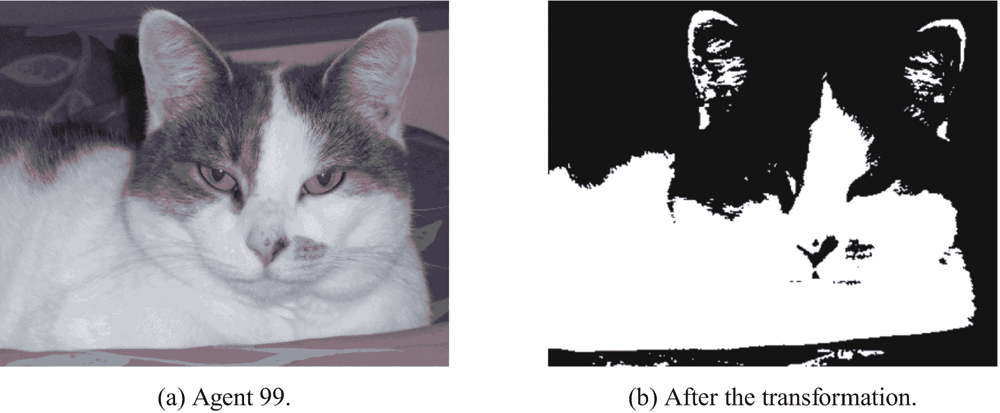
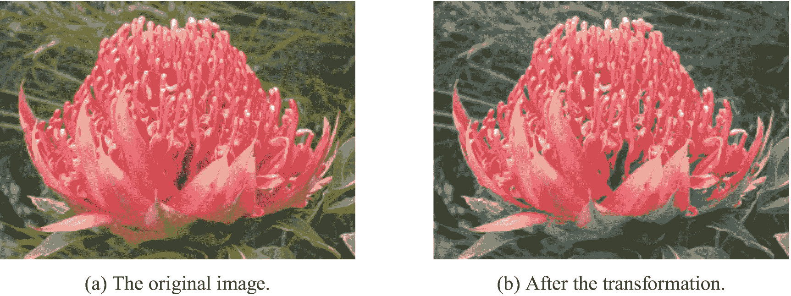
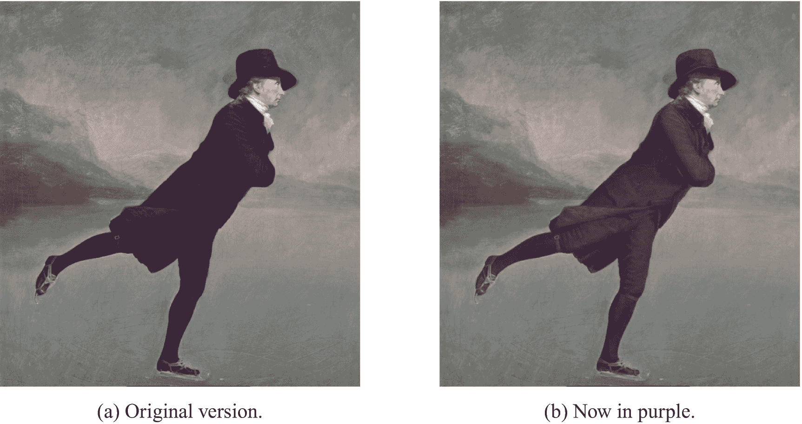
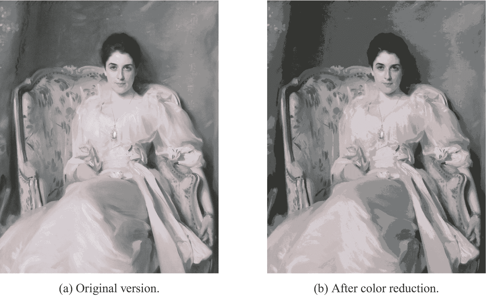
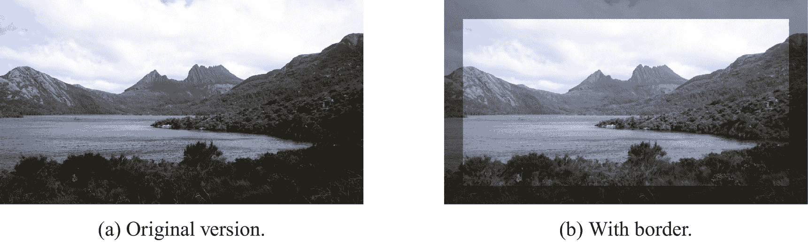

# 15. 像素变换

在上一章中，我们介绍了一个屏幕图像模型，该模型允许我们从文件加载图像，并通过移动像素来改变图像。在本章中，我们将通过改变单个像素的颜色来修改图像。

首先，从以下仓库在 IntelliJ 中创建一个新项目：[`https://github.com/Apress/learn-to-program-w-kotlin-ch15.git`](https://github.com/Apress/learn-to-program-w-kotlin-ch15.git)。下载的代码与上一章末尾的代码基本相同，但增加了一些额外的图像文件，并且移除了 `Flag` 类。


## 15.1 血色日落

如果我们通过将每个像素转换为其“仅红色”版本来改变照片中的颜色，会发生什么？我们可以使用以下公式，从现有颜色创建一个新的 `Color` 来实现这一点：

```
newColor = Color(oldColor.red, 0, 0)
```

让我们在一个名为 `makeRed` 的函数中实现这个公式，该函数用于创建 `Picture` 的仅红色版本。将以下代码添加到 `Picture` 类中：

```
1   fun makeRed(): Picture {
2       val pixelsRed = Array(height()) { row ->
3           Array(width()) { column ->
4               val pixel = pixelByRowColumn(row, column)
5               Color(pixel.red, 0, 0)
6           }
7       }
8       return Picture(pixelsRed)
9   }
```

编程挑战 15.1

修改 `PhotoDisplayer` 中的 `createPicture` 函数，使得在显示图像之前调用 `makeRed`。然后运行 `PhotoDisplayer` 的 `main` 函数。

修改后的图片将呈现出一幅令人不安的红色日落图像，如图 15-1 所示。


图 15-1

使用 `makeRed` 转换后的效果

现在假设我们不想把图像变成红色，而是想把它变成蓝色。我们可以添加一个实现此功能的函数：

```
1   fun makeBlue(): Picture {
2       val pixelsBlue = Array(height()) { row ->
3           Array(width()) { column ->
4               val pixel = pixelByRowColumn(row, column)
5               Color(0, 0, pixel.blue)
6           }
7       }
8       return Picture(pixelsBlue)
9   }
```

编程挑战 15.2

将此函数复制到 `Picture` 中，然后在 `PhotoDisplayer` 中调用它，而不是 `makeRed`。

编写一个 `makeGreen` 函数，并使用它来更改图像。

如果我们比较 `makeRed` 和 `makeBlue` 函数（以及 `makeGreen`），我们会注意到它们除了第 7 行（实现像素转换逻辑的部分）之外完全相同。这种转换逻辑可以被视为一个函数，它接收一个 `Color` 并将其转换为另一个 `Color`：

*   (*Color*) → (*Color*)

实际上，我们可以重新组织 `makeRed`，使其具有以下形式：

*   创建一个 `Color` 转换函数。
*   将其应用于每个像素。

重新组织后的 `makeRed` 版本如下：

```
fun makeRed(): Picture {
val makePixelRed = { it: Color -> Color(it.red, 0, 0) }
val pixelsRed = Array(height()) { row ->
Array(width()) { column ->
val pixel = pixelByRowColumn(row, column)
makePixelRed(pixel)
}
}
return Picture(pixelsRed)
}
```

现在让我们更进一步，将数组循环代码提取为一个函数，该函数可以接收一个转换函数作为参数：

```
fun transform(pixelTransformation: (Color) -> (Color)): Picture {
val transformed = Array(height()) { row ->
Array(width()) { column ->
val pixel = pixelByRowColumn(row, column)
pixelTransformation(pixel)
}
}
return Picture(transformed)
}
```

然后，`makeRed` 函数可以重写为：

```
fun makeRed() : Picture {
val makePixelRed = {it : Color -> Color(it.red, 0, 0)}
return transform(makePixelRed)
}
```

编程挑战 15.3

按照前面重写 `makeRed` 的方式，重构 `makeBlue`（以及 `makeGreen`）。

编程挑战 15.4

通过交换 `Picture` 中像素的红色、绿色和蓝色分量，我们可以得到一些有趣的结果。按如下方式定义一个 `makeMess` 函数：

```
fun makeMess() : Picture {
val mess = { it : Color -> Color(it.green, it.blue, it.red)}
return transform(mess)
}
```

然后显示应用了此转换的海湾照片。

编程挑战 15.5

考虑以下用于更改像素的代码：

```
val function = {it : Color ->
val average = (it.red + it.green + it.blue)/3
Color(average, average, average)
}
```

这将如何改变一个 `Picture`？

编写一个调用此函数的函数，并在显示 `Picture` 之前应用它。

## 15.2 单元测试

我们在上一节中开发的 `transform` 函数是一种强大的方法，可以逐个像素地修改图像。在进一步深入之前，我们应该对其进行测试。以下单元测试加载了一张每个像素都是绿色的图像（第 5 行）。然后，它创建了一个从 `Color` 到 `Color` 的函数，名为 `toRed`，该函数简单地将任何输入的 `Color` 更改为红色（第 8 行）。将 `transform` 函数应用于绿色图像，并以 `toRed` 作为参数（第 12 行）。转换的结果应该是一张与原始图像大小相同，但每个像素都是红色的图像，这正是检查的内容（第 15 至 20 行）。

```
1   @Test
2   fun transformTest() {
3       //从一张所有像素都是绿色的图像开始。
4       val file = Paths.get(IMAGES + "green_h50_w100.png").toFile()
5       val loaded = loadPictureFromFile(file)
6       //创建一个转换函数，
7       //将每个像素变为红色。
8       val red = Color(255, 0, 0)
9       val toRed = { it: Color -> red }
10      //调用 transform 函数，
11      //使用红色转换。
12      val changed = loaded.transform(toRed)

14      //对于结果中的每一行...
15      for (row in 0..49) {
16          //对于行中的每个像素...
17          for (column in 0..99) {
18              Assert.assertEquals(changed.pixelByRowColumn(row, column), red)
19          }
20      }
21   }
```

将此测试函数复制到 `PictureTest` 中，并检查它是否通过。


## 15.3 条件变换

`transform` 函数可用于创建各种艺术效果。例如，让我们将一张图像转换为纯粹的黑白，根据输入像素的亮度选择黑色或白色。首先，修改 `PhotoDisplayer` 类以显示资源目录中的图片 `agent99.png`：

```
override fun createPicture(): Picture {
val file = Paths.get(IMAGES + "agent99.png").toFile()
return loadPictureFromFile(file)
}
```

如果你运行 `PhotoDisplayer` 的 `main` 函数，你应该会看到一张猫的照片。

让我们通过将每个像素更改为黑色或白色来变换这张猫的图像。所有“亮”像素将变为白色，所有“暗”像素将变为黑色。我们所说的“亮”和“暗”是什么意思？如果我们把 `Color` 的红色、绿色和蓝色分量相加，然后除以三，就得到了等效的灰度像素，正如我们在挑战 15.1 中看到的那样。我们不妨这样定义：如果这个平均值大于 128，则该像素为亮色，应变为白色；否则应变为黑色。代码如下：

```
val makeBW = { it: Color ->
val brightness = (it.red + it.green + it.blue) / 3
if (brightness > 128) {
Color(255, 255, 255)
} else {
Color(0, 0, 0)
}
}
```

这段代码定义了一个名为 `makeBW` 的 `val`，其类型为 `(Color) -> (Color)`，也就是说，它是一个从输入 `Color` 返回一个 `Color` 的函数。在显示猫的照片之前，可以将这样的函数传递给 `Picture` 的 `transform` 函数：

```
override fun createPicture(): Picture {
val file = Paths.get(IMAGES + "agent99.png").toFile()
val makeBW = { it: Color ->
val brightness = (it.red + it.green + it.blue) / 3
if (brightness > 128) {
Color(255, 255, 255)
} else {
Color(0, 0, 0)
}
}
return loadPictureFromFile(file).transform(makeBW)
}
```

如果你运行这个版本的 `PhotoDisplayer`，你应该会看到猫照片的“墨迹”版本，如图 15-2 所示。通过根据强度级别对像素进行分类，并为每个级别使用单一颜色来减少图像中颜色数量的过程称为*阈值处理*。



图 15-2

“墨迹”变换

**编程挑战 15.6**

images 目录包含一个文件 `waratah.jpg`，这是一张红火球帝王花花朵的照片。修改 `createPicture` 中的代码以加载此文件。然后修改变换函数，使得对于 `Color` 类型的 `it`，返回值为：

*   如果 `it.red` 大于 `180`，则返回 `it` 本身。
*   否则返回 `it` 的灰度版本。

对于像素的灰度版本，你可以使用：

```
val average = (it.red + it.green + it.blue) / 3
Color(average, average, average)
```

原始图像和修改后的图像如图 15-3a 和 15-3b 所示。



图 15-3

图像中像素的选择性灰度化

**编程挑战 15.7**

images 目录中的文件 `skatingminister.png` 是亨利·雷本的作品《罗伯特·沃克牧师在达丁斯顿湖上滑冰》的副本，如图 15-4a 所示。让我们看看能否将他深色的衣服改成更鲜艳的颜色，如图 15-4b 所示。



图 15-4

对深色像素重新着色

变换过程有两个步骤：识别他衣服中的像素，然后将这些像素更改为紫色调。牧师衣服（包括帽子、冰鞋和长袜）中的像素都比图像中任何其他像素暗得多。通过实验，我发现所有这些像素（且仅这些像素）具有以下属性：

```
it.red + it.green + it.blue < 140
```

要将这些像素之一更改为紫色，我们可以这样做：

```
val halfGreen = it.green / 2
Color(it.red + halfGreen, 0, it.blue + halfGreen)
```

这个公式产生一种只包含红色和蓝色的颜色，因此它是紫色的一种色调。复杂之处在于提取绿色分量，并将其一半分别添加到输出中的红色和蓝色分量中。我们这样做的原因是为了保持变换后像素的整体亮度。综合起来，我们得到以下变换函数：

```
val makeBlackPurple = { it: Color ->
if (it.red + it.green + it.blue < 140) {
val halfGreen = it.green / 2
Color(it.red + halfGreen, 0, it.blue + halfGreen)
} else {
it
}
}
```

你能修改 `Picture.createPicture` 来加载 `skatingminister.png` 文件，然后将变换应用于加载的图像吗？

我们的下一个变换是对计算机算术的一个很好的复习。回想一下，对于整数 `x`，`x / y` 是 `y` 能完整整除 `x` 的次数。例如，`235 / 32` 等于 `7`。如果我们将此结果乘以 `32`，得到 `224`，这接近但不完全等于原始值 `235`。总结如下：

*   (235/32) * 32 = 224

实际上：

*   (224/32) * 32 = 224
*   (225/32) * 32 = 224
*   (226/32) * 32 = 224

依此类推，直到 `32` 的下一个倍数。我们可以利用这一点来变换颜色，如下所示：

```
override fun createPicture(): Picture {
val file = Paths.get(IMAGES + "ladyagnew.png").toFile()
val approximater = { it: Color ->
Color((it.red / 32) * 32,
(it.green / 32) * 32,
(it.blue / 32) * 32
)
}
return loadPictureFromFile(file).transform(approximater)
}
```

**编程挑战 15.8**

计算将 `approximater` 应用于以下颜色的结果：

*   `Color(224, 67, 160)`
*   `Color(239, 89, 172)`
*   `Color(255, 97, 204)`

将此变换应用于图像中的每个像素会产生什么效果？

**编程挑战 15.9**

images 目录中的文件 `ladyagnew.png` 是约翰·辛格·萨金特的肖像画《洛赫瑙的阿格纽夫人》，如图 15-5a 所示。修改 `PhotoDisplayer.createPicture` 以加载此文件，然后应用变换。结果应如图 15-5b 所示。



图 15-5

颜色缩减的效果

在 0 到 255 之间，32 的倍数有 8 个：0、32、64、96、128、160、192 和 224，并且此变换产生的颜色的红色、绿色和蓝色分量可以是其中任何一个。这意味着将映射应用于图像总共可以产生：

*   8 × 8 × 8 = 512

种颜色。使用较少的颜色，图像可以存储在比原始文件更小的文件中，而原始文件可以拥有：

*   256 × 256 × 256 = 16,777,216

种不同的颜色。


## 15.4 基于位置的变换

到目前为止，我们看到的变换都具有以下签名：

```
(Color) -> (Color)
```

也就是说，它们接收一个输入的 `Color`，并将其转换为一个输出的 `Color`。观察图 15-6 中摇篮山的两幅图像。原始图像经过一个使边缘像素变暗的函数变换。这种变换的公式不仅需要原始的 `Color`，还需要像素的位置，即其 `row` 和 `column` 坐标。一个可能的签名是：



图 15-6

根据像素位置进行的变换

```
((Color), (Int), (Int)) -> (Color)
```

此签名中的 `Color` 参数是位于给定 `row` 和 `column` 处的像素。这实际上可以从图像本身获取，因此是冗余信息。也就是说，我们可以使用一个具有以下签名的函数来实现如图 15-6b 所示的边缘效果：

```
((Int), (Int)) -> (Color)
```

让我们看看如何实现。

将以下代码复制到 `Picture` 类中：

```
fun transformByPosition(
pixelTransformation: ((Int), (Int)) ->
(Color)
): Picture {
val transformed = Array(height()) { row ->
Array(width()) { column ->
pixelTransformation(row, column)
}
}
return Picture(transformed)
}
```

此函数构建一个 `Color` 的二维数组，表示变换后的像素。数组中的值通过作为参数传入的函数 `pixelTransformation` 来设置。立即应用这段新代码将有助于我们理解它。与其尝试真正复杂的功能，不如先看看我们能否将图像的顶部改为黑色条带。将以下代码复制到 `Picture` 中：

```
1   fun blackBar(): Picture {
2       val blackAtTop = { row: Int, column: Int
3           ->
4           val originalPixel = pixelByRowColumn(row, column)
5           if (row < 50) {
6               Color(0, 0, 0)
7           } else {
8               originalPixel
9           }
10       }
11       return transformByPosition(blackAtTop)
12   }
```

然后将 `PhotoDisplayer` 中的 `createPicture` 函数改为：

```
override fun createPicture(): Picture {
val file = Paths.get(IMAGES + "cradlemt.png").toFile()
return loadPictureFromFile(file).blackBar()
}
```

运行 `PhotoDisplayer` 应该会显示摇篮山的图像，顶部有一条黑色条带。`blackBar` 函数的工作原理如下：在第 2 行，我们声明了一个 `val`，即我们的变换函数。它有两个 `Int` 参数，分别是 `row` 和 `column`。在第 4 行，我们获取当前 `row` 和 `column` 处正在被变换的图像像素。第 5 行判断该像素是否位于图像的前 50 行内。如果是，则使用 `Color(0, 0, 0)`（第 6 行）；否则，使用原始像素值。

编程挑战 15.10

修改 `blackBar` 函数，使得只有图像的左侧边缘变为全黑。

编程挑战 15.11

左侧的单条黑色条带看起来很难看。尝试修改代码，在左侧和右侧边缘都添加黑色条带。

我们希望生成如图 15-6b 所示的图像，其边框是背景的略微变暗版本，而不仅仅是黑色。实际上，有一个库函数可以为我们执行这种重新着色。该函数名为 `darker`，我们可以按如下方式应用它：

```
1   fun darkBorder(): Picture {
2       val borderWidth = 50
3       val darkSides = { row: Int, column: Int
4           ->
5           val originalPixel = pixelByRowColumn(row, column)
6           val isInBorder = column < borderWidth || width() - column <
7                   borderWidth
8           if (isInBorder) {
9               originalPixel.darker()
10           } else {
11               originalPixel
12           }
13       }
14       return transformByPosition(darkSides)
15   }
```

第 6 行计算一个像素是否位于左侧或右侧边框区域内。如果是，则在第 8 行应用 `darker` 函数。`darker` 函数根据输入的 `Color` 返回一个 `Color`。

编程挑战 15.12

修改 `PhotoDisplayer.createPicture` 函数，使其在显示摇篮山照片之前调用 `darkBorder`。

如果你运行 `PhotoDisplayer`，你会注意到边缘的暗条不如图 15-6b 中那么暗。要解决这个问题，我们可以将 `darkBorder` 的第 8 行改为调用两次 `darker`：

```
originalPixel.darker().darker()
```

要添加上边框，我们需要修改 `isInBorder` 的定义，使其包含前 `borderWidth` 行的像素：

```
val isInBorder = row < borderWidth || column < borderWidth || width() - column < borderWidth
```

编程挑战 15.13

你能修改上面的代码行，使得靠近下边缘的像素也被包含在边框内吗？

使用挑战 15.13 解决方案中的 `darkBorder` 函数，显示的图像最终应该符合我们的要求。


## 15.5 章节总结与挑战题解答

在本章中，我们编写了将一种`Color`转换为另一种`Color`的函数。通过将这些函数作为参数传递给遍历图像中所有像素的函数，我们以多种有趣的方式修改了图像。这种将函数本身作为参数传递给其他函数的编程风格被称为*函数式编程*。自计算诞生之初，函数式编程语言就已存在。然而，函数式编程是在过去十年左右才变得非常流行。许多现代语言，如 Kotlin，都结合了函数式和面向对象的特性。

解答 15.1

以下代码在显示图像之前调用了`makeRed`：

```
override fun createPicture(): Picture {
val file = Paths.get(IMAGES + "bay.png").toFile()
return loadPictureFromFile(file).makeRed()
}
```

解答 15.2

这是一个将图像变为绿色的函数：

```
fun makeGreen(): Picture {
val pixelsRed = Array(height()) { row ->
Array(width()) { column ->
val pixel = pixelByRowColumn(row, column)
Color(0, pixel.green, 0)
}
}
return Picture(pixelsRed)
}
```

解答 15.3

以下是`makeBlue`函数：

```
fun makeBlue() : Picture {
val makePixelBlue = {it : Color -> Color(0, 0, it.blue)}
return transform(makePixelBlue)
}
```

解答 15.4

要应用`makeMess`函数，请在`PhotoDisplayer`中对`createPicture`进行如下修改：

```
override fun createPicture(): Picture {
val file = Paths.get(IMAGES + "bay.png").toFile()
return loadPictureFromFile(file).makeMess()
}
```

你应该会得到一张看起来像图 15-7 的图像。


图 15-7

应用了`makeMess`的海湾

解答 15.5

该变换将`Picture`转换为灰度图。我们可以通过将其封装在一个函数中来使用它：

```
fun makeGray() : Picture {
val function = {it : Color ->
val average = (it.red + it.green + it.blue)/3
Color(average, average, average)
}
return transform(function)
}
```

然后在`PhotoDisplayer`中应用它：

```
override fun createPicture(): Picture {
val file = Paths.get(IMAGES + "bay.png").toFile()
return loadPictureFromFile(file).makeGray()
}
```

有趣的是，“工业级”的灰度算法会使用不同比例的红色、绿色和蓝色，因为我们的眼睛天生对某些颜色比其他颜色更敏感。

解答 15.6

代码如下：

```
override fun createPicture(): Picture {
val file = Paths.get(IMAGES + "waratah.jpg").toFile()
val keepRed = { it: Color ->
if (it.red > 180) {
it
} else {
val average = (it.red + it.green + it.blue) / 3
Color(average, average, average)
}
}
return loadPictureFromFile(file).transform(keepRed)
}
```

解答 15.7

完整的函数如下：

```
override fun createPicture(): Picture {
val file = Paths.get(IMAGES + "skatingminister.png").toFile()
val makeBlackPurple = { it: Color ->
if (it.red + it.green + it.blue < 140) {
val halfGreen = it.green / 2
Color(it.red + halfGreen, 0, it.blue + halfGreen)
} else {
it
}
}
return loadPictureFromFile(file).transform(makeBlackPurple)
}
```

解答 15.8

变换如下：

*   `Color(224, 67, 160)` → `Color(224, 64, 160)`

*   `Color(239, 89, 172)` → `Color(224, 64, 160)`

*   `Color(255, 97, 204)` → `Color(224, 96, 196)`

这种变换减少了图像中使用的颜色数量。

解答 15.9

代码如下：

```
override fun createPicture(): Picture {
val file = Paths.get(IMAGES + "ladyagnew.png").toFile()
val approximater = { it: Color ->
Color((it.red / 32) * 32,
(it.green / 32) * 32,
(it.blue / 32) * 32
)
}
return loadPictureFromFile(file).transform(approximater)
}
```

解答 15.10

将黑条放在左侧：

```
fun blackBar(): Picture {
val blackAtSide = { row: Int, column: Int
->
val originalPixel = pixelByRowColumn(row, column)
if (column < 50) {
Color(0, 0, 0)
} else {
originalPixel
}
}
return transformByPosition(blackAtSide)
}
```

解答 15.11

将黑条放在两侧：

```
fun blackBar(): Picture {
val borderWidth = 50;
val blackAtSide = { row: Int, column: Int
->
val originalPixel = pixelByRowColumn(row, column)
val color = if (column < borderWidth ||
width() - column < borderWidth
) {
Color(0, 0, 0)
} else {
originalPixel
}
color
}
return transformByPosition(blackAtSide)
}
```

解答 15.12

代码如下：

```
override fun createPicture(): Picture {
val file = Paths.get(IMAGES + "cradlemt.png").toFile()
return loadPictureFromFile(file).darkBorder()
}
```

解答 15.13

要获得非常暗的边框：

```
fun darkBorder(): Picture {
val borderWidth = 50
val darkSides = { row: Int, column: Int
->
val originalPixel = pixelByRowColumn(row, column)
val isInBorder =
row  height() - borderWidth ||
column < borderWidth ||
width() - column < borderWidth
if (isInBorder) {
originalPixel.darker().darker()
} else {
originalPixel
}
}
return transformByPosition(darkSides)
}
```

