# 16. 裁剪与调整图像大小

在前两章中，我们通过重新排列像素或应用颜色变换来转换图像。现在，我们将研究改变图像大小的操作，无论是通过提取子图像，还是通过合并像素来生成原始图像的压缩版本。我们还将学习如何将变换后的图像保存到文件。本章的代码可以从[`https://github.com/Apress/learn-to-program-w-kotlin-ch16.git`](https://github.com/Apress/learn-to-program-w-kotlin-ch16.git)获取。此代码包含我们熟悉的`Picture`类，但移除了前几章引入的变换。


## 16.1 裁剪

从图像中截取一部分并生成新图像的操作称为*裁剪*。图 16-1 展示了一个示例。要裁剪一个`Picture`，我们需要指定截取`Picture`的起始行和列，以及它包含的行数和列数。每个参数都是`Int`类型。该函数的一个合适名称是`cropTo`，本章下载代码中的`Picture`类已经包含了一个存根实现：

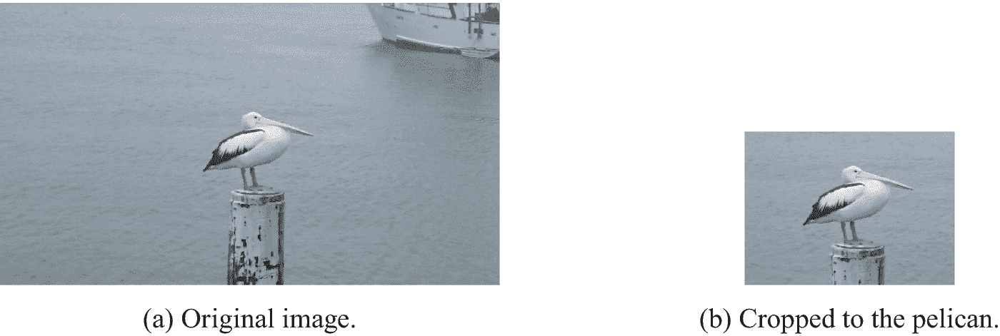

图 16-1

一张照片及其裁剪版本

```
1   fun cropTo(rowAt: Int, columnAt: Int, h: Int, w: Int): Picture {
2       val cropArray = Array(1) {
3           row ->
4           Array(1) {
5               column ->
6               Color(0, 0, 0)
7           }
8       }
9       return Picture(cropArray)
10   }
```

让我们快速浏览一下这段代码，以回顾我们对 Kotlin 语法的理解：

*   第 1 行定义了函数名（`cropTo`）、参数列表（四个`Int`）和返回类型（`Picture`）。
*   在第 2 行，我们定义了一个名为`cropArray`的`val`，它是一个包含`1`行的数组。
*   在第 4 行，我们将`cropArray`的第一行（也是唯一一行）定义为一个仅包含一个元素的`Array`。
*   在第 6 行，我们将这个单一元素定义为一个黑色的`Color`对象。
*   在第 9 行，我们根据这个二维数组构建了一个`Picture`并返回它。
*   第 3 行和第 5 行定义了初始化函数的参数。箭头语法`row ->`定义了一个函数，该函数接收任意行索引作为输入，并返回第 4 行构建的数组。类似地，`column ->`定义了一个函数，该函数接收任意列索引，并返回第 6 行创建的黑色像素。当我们像这样用箭头指向代码块来定义函数时，我们使用的是所谓的*lambda 表示法*。

因此，这个存根实现生成一个由单个黑色像素组成的`Picture`。

在用正确的实现替换这个存根之前，我们将编写一个测试。我们的测试使用一个简单的`Picture`，它可以被裁剪成易于描述的`Picture`子图。图 16-2a 显示了测试图像。它有 100 行和 100 列。如果我们在位置`(0, 0)`裁剪此图像，裁剪后的图像有 50 行和 50 列，那么结果应该是一个边长为 50 的红色正方形。如果我们在位置`(50, 10)`裁剪它，`h = 10`且`w = 20`，那么结果应该是一个高 10、宽 20 的蓝色矩形。最后，如果我们在位置`(25, 25)`裁剪它，并将`h`和`w`都设为`50`，那么结果应该是原始图像的 50x50 版本，如图 16-2b 所示。

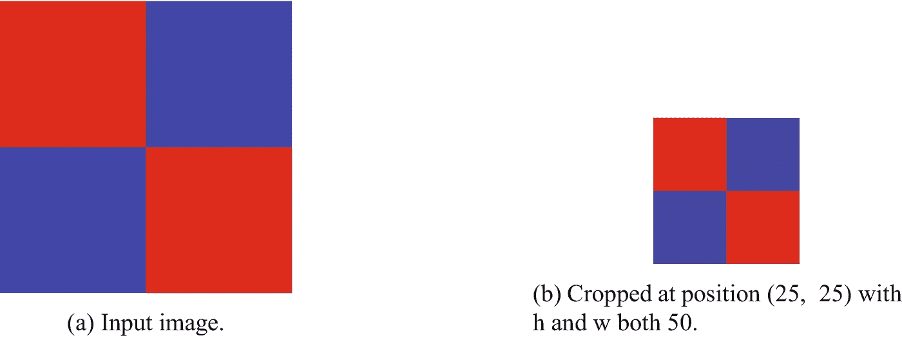

图 16-2

测试图像

这些场景中的第一个对应于以下测试函数，该函数已存在于`PictureTest`中：

```
1   @Test
2   fun cropToRedSquare() {
3       val tiles100 = load("red_blue_tiles_50.png")
4       val cropped = tiles100.cropTo(0, 0, 50, 50)
5       val expectedColor = Color(255, 0, 0)
6       Assert.assertEquals(cropped.height(), 50)
7       Assert.assertEquals(cropped.width(), 50)
8       for (row in 0..49) {
9           for (column in 0..49) {
10               Assert.assertEquals(cropped.pixelByRowColumn(row, column), expectedColor)
11           }
12       }
13   }
```

这段代码的第 1 行使用`PictureTest`中的`load`函数将图像加载到一个名为`tiles100`的`val`中。在第 4 行，调用了`cropTo`函数，其中`row`和`column`均为`0`，`h`和`w`均为`50`。此函数调用的返回值被赋给一个名为`cropped`的`val`。测试的其余部分包含关于`cropped`的断言：第 6 行检查其高度是否正确，第 7 行检查宽度，从第 8 行开始的双重循环检查每个像素是否为红色。

编程挑战 16.1

让我们编写一个对应于蓝色矩形场景的测试。

*   复制函数`cropToRedSquare`，并将复制的函数重命名为`cropToBlueRectangle`。
*   修改对`cropTo`的调用，使起始点的行号为`50`，列号为`10`，并且裁剪后的图像有`10`行和`20`列。
*   将`expectedColor`改为蓝色而不是红色。
*   检查裁剪后图像的高度是否为`10`。
*   检查裁剪后图像的宽度是否为`20`。
*   将外层循环改为从`0`运行到`9`。
*   对内层循环进行类似的修改。

当你运行这个新测试时，它应该会失败。

第三个场景，即在中心位置应用`cropTo`，已经在`PictureTest`中编写为一个测试函数：

```
@Test
fun cropCenter() {
val tiles100 = load("red_blue_tiles_50.png")
val cropped = tiles100.cropTo(25, 25, 50, 50)
val expected = load("red_blue_tiles_25.png")
checkPicture(expected, cropped)
}
```

这个测试加载了我们熟悉的平铺图案图像，然后在点`(25, 25)`处将其裁剪成一个边长为`50`的正方形。然后测试加载一个预先准备好的图像，该图像就是裁剪后应有的样子。测试的最后一行是使用`PictureTest`中名为`checkPicture`的函数将预期图像与实际图像进行比较。

编程挑战 16.2

查看一下`checkPicture`。

第一行做了什么？

第二行做了什么？

函数的最后一部分由嵌套循环组成。这段代码做了什么？

为了帮助我们理解图像裁剪，脑海中有一个具体的例子是非常有用的。我们将使用以下多色正方形作为工作示例。这个正方形每边有七个像素，并且在位置`row=2,column=3`处进行裁剪。（请记住，行和列的索引是从零开始的，正方形的左上角是`(0,0)`。）子图像有两行三列：`height=2,width=3`。

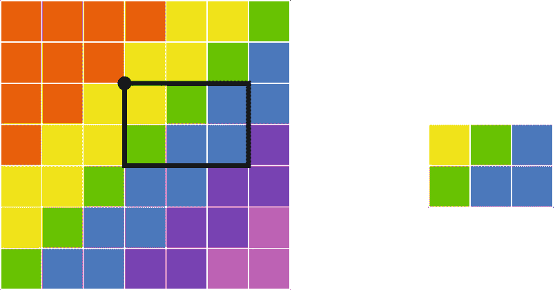

裁剪后的图像显示在正方形的右侧。让我们看看这个图像中的一些像素，并找出它们在原始图像中对应的像素。

| **像素** | **在结果中的位置** | **在原始图像中的位置** |
| --- | --- | --- |
| 左上角的黄色 | `row=0, column=0` | `row=2, column=3` |
| 第一行的绿色 | `row=0, column=1` | `row=2, column=4` |
| 第二行的绿色 | `row=1, column=0` | `row=3, column=3` |

用代码表示，其模式如下。如果我们在位置`(rowAt, columnAt)`处裁剪，那么结果中给定`row`和`column`处的像素在原始图像中的位置是：

```
pixelByRowColumn(rowAt + row, columnAt + column)
```

编程挑战 16.3

让我们修复`cropTo`的存根实现。

在第一行，我们当前创建了一个包含`1`行的数组。裁剪后的图片应该有多少行？将`1`改为这个值。

第三行创建了一个包含`1`列的数组。修正这个值。

用前面给出的公式替换当前的第六行。

完成这些更改后，三个测试应该都能通过。如果未通过，请使用本挑战的解决方案来修正你的代码。


## 16.2 改进单元测试

在编写 `cropTo` 的第二个单元测试时，我们复制了一个现有测试，然后稍微修改了代码。既然 `cropTo` 的实现已经可以正常工作，我们应该回过头来修复这种代码重复问题。

`cropToRedSquare` 和 `cropToBlueRectangle` 的最后七行代码本质上是相同的。它们检查图像的高度和宽度，然后检查每个像素是否为 `expectedColor`。下面这个函数正好执行这些检查：

```
fun checkSingleColorPicture(picture: Picture, expectedColor: Color, expectedHeight: Int, expectedWidth: Int) {
Assert.assertEquals(picture.height(), expectedHeight)
Assert.assertEquals(picture.width(), expectedWidth)
for (row in 0..expectedHeight - 1) {
for (column in 0..expectedWidth - 1) {
Assert.assertEquals(picture.pixelByRowColumn(row, column), expectedColor)
}
}
}
```

将这段代码复制到 `PictureTest` 中，然后修改 `cropToRedSquare` 以使用它：

```
@Test
fun cropToRedSquare() {
val tiles100 = load("red_blue_tiles_50.png")
val cropped = tiles100.cropTo(0, 0, 50, 50)
val expectedColor = Color(255, 0, 0)
checkSingleColorPicture(cropped, expectedColor, 50, 50)
}
```

编程挑战 16.4

对 `cropToBlueRectangle` 进行类似的修改。

经过这些修改，我们的代码简洁了许多，也更容易理解和维护。你可能会问，为什么我们不在复制 `cropToRedSquare` 之前就提取出 `checkSingleColorPicture` 函数，从而从一开始就避免重复？原因在于，编程中正确的抽象并不总是立即显现的，但一旦我们找到了它们，重构代码就很容易了。

## 16.3 缩小图像

假设我们有一张图像，包含 200 行像素，每行有 300 个像素，我们想将其缩小 2 倍。结果将包含 100 行，每行 150 个像素。原始图像中的像素块会合并成较小图像中的单个像素。在本节中，我们将描述并实现用于缩小 `Picture` 的算法。

作为一个工作示例，考虑下面这张在绿色背景上有一只友好的黑色狗的 `Picture`。这张图片有 9 行和 12 列像素。

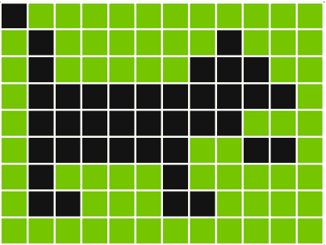

将图像缩小 2 倍的第一步是将其分解为 2×2 的块：

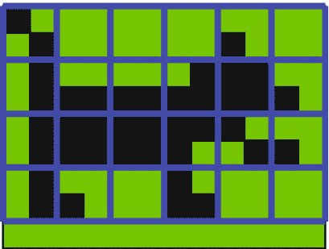

底行的像素将被丢弃，因为它们无法组成完整的块。缩小后的图像中，每个块对应一个像素，该像素的颜色是块中所有像素颜色的平均值：

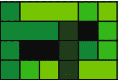

现在考虑一个特定的像素块：

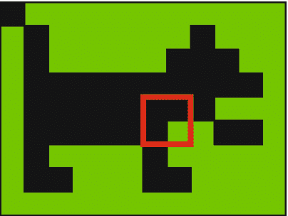

这个块只是一个 `Color` 的二维数组，即一个 `Picture`，可以通过应用我们在第 16.1 节中开发的 `cropTo` 函数来获取。

要应用 `cropTo`，我们需要知道块左上角的位置。它距离左侧三个块，因此列号为 3 × 2 = 6，因为每个块是 2×2 的。该块距离顶部两个块，因此行号为 2 × 2 = 4。`cropTo` 所需的其他参数是子 `Picture` 的宽度和高度，这两个参数都是 `2`。因此，红色块可以通过以下调用的返回值获得：

```
cropTo(2 * 2, 3 * 2, 2, 2)
```

编程挑战 16.5

请记住，`height` 函数告诉我们 `Picture` 中的像素行数。如果我们将一个 `Picture` 分解为边长为 `sideLength` 的方形块，那么会有多少行块？

每行块中有多少列块？

考虑位于 `blockRow` 行和 `blockColumn` 列的块。我们如何使用 `cropTo` 函数将其作为 `Picture` 获取？

前一个挑战的解答为我们提供了将 `Picture` 分解为块的函数的基本要素：

```
fun chopIntoSquares(sideLength: Int): Array> {
val resultRows = height() / sideLength
val resultColumns = width() / sideLength
val result = Array(resultRows) { blockRow ->
Array(resultColumns) { blockColumn ->
cropTo(
blockRow * sideLength, blockColumn * sideLength,
sideLength, sideLength
)
}
}
return result
}
```

将此函数复制到 `Picture` 中。

编程挑战 16.6

测试资源目录中的文件 `red_blue_green.png` 如图 16-3 所示。红色和蓝色方块是 50×50 像素的，右侧和底部的绿色边框宽 8 像素。

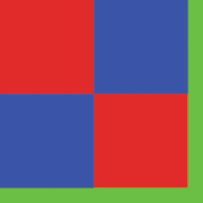

图 16-3

`chopIntoSquares` 的测试图像

假设我们将其分解为 10×10 的块。

会有多少行块？

会有多少列块？

是否有任何绿色像素包含在某个块中？

描述这些块的颜色。

这个挑战中的思路构成了以下测试的基础：


```kotlin
@Test
fun chopIntoSquaresTest() {
val original = load("red_blue_green.png")
val blocks = original.chopIntoSquares(10)
Assert.assertEquals(10, blocks.size)//10 行
Assert.assertEquals(10, blocks[0].size)//10 列
val red = Color(255, 0, 0)
val blue = Color(0, 0, 255)
for (row in 0..4) {
for (column in 0..4) {
checkSingleColorPicture(blocks[row][column], red, 10, 10)
}
for (column in 5..9) {
checkSingleColorPicture(blocks[row][column], blue, 10, 10)
}
}
for (row in 5..9) {
for (column in 0..4) {
checkSingleColorPicture(blocks[row][column], blue, 10, 10)
}
for (column in 5..9) {
checkSingleColorPicture(blocks[row][column], red, 10, 10)
}
}
}
```

将此函数复制到 `PictureTest` 中，并检查其是否通过测试。

计算 `Picture` 中像素平均 `Color` 的函数相对简单。将以下存根代码复制到 `Picture` 中：

```
fun averageColor(): Color {
return Color(0, 0, 0)
}
```

为了测试此函数，我们将使用测试资源目录中的图像文件 `red10.png`、`green10.png` 和 `blue10.png`。这些文件分别代表由红色、绿色和蓝色像素组成的 `Picture`。

**编程挑战 16.7**

以下是使用文件 `red10.png` 对 `averageColor` 进行的测试：

```
@Test
fun averageColorTest() {
val red10 = load("red10.png")
Assert.assertEquals(Color(255, 0, 0), red10.averageColor())
}
```

将此函数复制到 `PictureTest` 中，并检查其是否失败。

然后在测试中添加使用 `green10.png` 和 `blue10.png` 的代码段。

我们还应该对包含多种 `Color` 的 `Picture` 进行测试。考虑图 16-2 中显示的图像 `red_blue_tiles_50.png`。你认为该图像中像素的平均 `Color` 是多少？

在测试中添加一个使用此图像的代码段。

为了实现 `averageColor`，我们将定义用于红色、绿色和蓝色总值（total red, green, and blue values）的变量。然后遍历像素，将每个像素的红、绿、蓝值累加到对应的总值中。最后，构造一个新的 `Color`，其红色分量等于红色总值除以像素总数，绿色和蓝色分量同理。

**编程挑战 16.8**

在前面描述的算法中，假设 `totalRed` 是红色值总和的变量。它应该被定义为 `val` 还是 `var`？

我们可以按如下方式遍历像素：

```
1   for (row in 0..height() - 1) {
2       for (column in 0..width() - 1) {
3           val pixel = pixelByRowColumn(row, column)

5       }
6   }
```

你能写出一个表达式放在第 4 行，用于将 `pixel` 的红色分量添加到 `totalRed` 中吗？

`Picture` 中有多少个像素？

结果中的红色分量是多少？

**编程挑战 16.9**

根据上一个挑战，我们可以编写以下 `averageColor` 的不完整实现：

```
fun averageColor(): Color {
var totalRed = 0
for (row in 0..height() - 1) {
for (column in 0..width() - 1) {
val pixel = pixelByRowColumn(row, column)
totalRed = totalRed + pixel.red
}
}
val count = height() * width()
return Color(totalRed / count, 0, 0)
}
```

你能完成这个实现吗？检查测试现在是否通过。

最后，我们准备实现一个缩放函数。

**编程挑战 16.10**

将以下函数添加到 `Picture` 中：

```
fun scaleDown(factor: Int) : Picture {
return this
}
```

你能解释一下这个函数的签名及其作用吗？

在存根代码就位后，以下测试应该能够编译通过：

```
@Test
fun scaleDownTest() {
val image1 = load("red_blue_green.png")
val scaled1 = image1.scaleDown(10)
val expected1 = load("red_blue_tiles_5.png")
checkPicture(scaled1, expected1)
val image2 = load("green_black_large.png")
val scaled2 = image2.scaleDown(3)
val expected2 = load("green_black_small.png")
checkPicture(scaled2, expected2)
}
```

第一部分将图 16-3 中显示的 `Picture` 缩小，并将结果与图 16-2 中图像的 10×10 版本进行比较。测试的第二部分进行了类似的比较，但使用了对称性较低且包含不同颜色的 `Picture`。

在准备好几个测试后，我们可以安全地实现 `scaleDown`。将存根代码替换为以下内容：

```
fun scaleDown(factor: Int) : Picture {
//首先将其分解为
//factor×factor 方形子图片的二维数组。
val blocks = chopIntoSquares(factor)
//使用这些块初始化一个像素数组。
val newPixels = Array>(blocks.size) {
blocksRow ->
Array(blocks[blocksRow].size) {
blocksColumn ->
//每个像素是对应块的平均颜色。
blocks[blocksRow][blocksColumn].averageColor()
}
}
return Picture(newPixels)
}
```

检查使用此实现后，单元测试是否通过。要查看函数的效果，请将 `PhotoDisplayer` 中的 `createPicture` 更改为：

```
override fun createPicture(): Picture {
val file = Paths.get(IMAGES + "ladyagnew.png").toFile()
return loadPictureFromFile(file).scaleDown(5)
}
```

尝试使用不同的缩放因子值运行程序。

## 16.4 存储图像

我们已经在第 14 章中了解了如何从文件读取图像。现在我们将添加一个函数，用于将 `Picture` 保存为文件。该函数有点技术性，其核心工作由对内置库函数的调用完成：

```
fun saveTo(file: File) {
val image = BufferedImage(width(), height(), BufferedImage.TYPE_INT_RGB)
val width = width()
val height = height()
for (row in 0..height - 1) {
for (column in 0..width - 1) {
image.setRGB(column, row, pixelByRowColumn(row, column).rgb)
}
}
ImageIO.write(image, "png", file)
}
```

为了测试此函数，我们将加载一个测试图像作为 `Picture`，然后调用 `saveTo` 将其写入文件，再将该文件作为 `Picture` 加载并检查其像素：

```
@Test
fun saveToTest() {
val picture = load("green_black_small.png")
val temp = Paths.get("temp.png").toFile()
picture.saveTo(temp)
val reloaded = loadPictureFromFile(temp)
Assert.assertEquals(20, reloaded.height())
Assert.assertEquals(40, reloaded.width())
val green = Color(0, 255, 0)
val black = Color(0, 0, 0)
for (row in 0..9) {
for (column in 0..39) {
val pixel = reloaded.pixelByRowColumn(row, column)
Assert.assertEquals(green, pixel)
}
}
for (row in 10..19) {
for (column in 0..39) {
val pixel = reloaded.pixelByRowColumn(row, column)
Assert.assertEquals(black, pixel)
}
}
}
```

此测试包含大量用于检查 `reloaded` 像素的代码。另一种选择是直接使用 `checkPicture` 比较 `picture` 和 `reloaded`。但如果 `load` 函数存在缺陷，即使 `saveTo` 有问题，这样的测试也可能通过。因此，最好让 `saveToTest` 像这里一样自成一体。
```


## 16.5 本章小结与挑战题解答

在本章中，我们编写了用于裁剪和缩小`Picture`的函数。我们利用裁剪函数实现了缩小功能，这极大地简化了原本非常复杂的算法。此外，我们还添加了一个将`Picture`写入文件的函数。在下一章中，我们将使用该函数来保存变换后的图像。

解答 16.1

以下是测试代码：

```
@Test
fun cropToBlueRectangle() {
val tiles100 = load("red_blue_tiles_50.png")
val cropped = tiles100.cropTo(50, 10, 10, 20)
val expectedColor = Color(0, 0, 255)
Assert.assertEquals(cropped.height(), 10)
Assert.assertEquals(cropped.width(), 20)
for (row in 0..9) {
for (column in 0..19) {
Assert.assertEquals(cropped.pixelByRowColumn(row, column), expectedColor)
}
}
}
```

解答 16.2

第一行比较了`actual`和`expected Picture`的高度。

第二行比较了它们的宽度。

接下来是一个遍历图片行索引的循环，其中嵌套了一个遍历列索引的循环。在内层循环中，提取并比较了`(row, column)`对应的实际像素和期望像素。

解答 16.3

```
fun cropTo(rowAt: Int, columnAt: Int, h: Int, w: Int): Picture {
val cropArray = Array>(h) {
row ->
Array(w) {
column ->
pixelByRowColumn(rowAt + row, columnAt + column)
}
}
return Picture(cropArray)
}
```

解答 16.4

```
@Test
fun cropToBlueRectangle() {
val tiles100 = load("red_blue_tiles_50.png")
val cropped = tiles100.cropTo(50, 10, 10, 20)
val expectedColor = Color(0, 0, 255)
checkSingleColorPicture(cropped, expectedColor, 10, 20)
}
```

解答 16.5

共有

```
height() / sideLength
```

行和

```
width() / sideLength
```

列。位于第`blockRow`行、第`blockColumn`列的块的`Picture`可以通过以下方式获取：

```
cropTo(blockRow * sideLength, blockColumn * sideLength, sideLength, sideLength)
```

解答 16.6

将会有十行十列的块。没有任何绿色像素会被包含在任何块中。每个块只包含一种颜色的像素。前五行中的前五个块都是红色的。后五行中的后五个块也都是红色的。所有其他块都是蓝色的。

解答 16.7

以下是完整的测试函数：

```
@Test
fun averageColorTest() {
val red10 = load("red10.png")
Assert.assertEquals(Color(255, 0, 0), red10.averageColor())
val green10 = load("green10.png")
Assert.assertEquals(Color(0, 255, 0), green10.averageColor())
val blue10 = load("blue10.png")
Assert.assertEquals(Color(0, 0, 255), blue10.averageColor())
val redblue = load("red_blue_tiles_50.png")
Assert.assertEquals(Color(127, 0, 127), redblue.averageColor())
}
```

注意，红色和蓝色的平均值是`Color(127, 0, 127)`，*而不是*`Color(128, 0, 128)`，因为在整数运算中

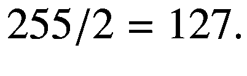

解答 16.8

变量`totalRed`需要声明为`var`，因为它的值会发生变化。

在第 4 行，我们可以这样写：

```
totalRed = totalRed + pixel.red
```

`Picture`中的像素数量为：

```
val count = height() * width()
```

对于结果中的红色分量，我们可以使用`totalRed/count`。

解答 16.9

```
fun averageColor(): Color {
var totalRed = 0
var totalGreen = 0
var totalBlue = 0
for (row in 0..height() - 1) {
for (column in 0..width() - 1) {
val pixel = pixelByRowColumn(row, column)
totalRed = totalRed + pixel.red
totalGreen = totalGreen + pixel.green
totalBlue = totalBlue + pixel.blue
}
}
val count = height() * width()
return Color(totalRed / count, totalGreen / count, totalBlue / count)
}
```

解答 16.10

该函数名为`scaleDown`。它有一个参数，是一个名为`factor`的`Int`类型。该函数返回一个`Picture`。当前的实现只是简单地返回调用该函数的`Picture`对象本身。

# 17. 项目：恐龙

我们将通过编写一个 CGI（计算机生成图像）程序来结束本书的这一部分，该程序将使用前三章开发的代码。我们的程序将创建一张恐龙站在塔斯马尼亚州鸽子湖中的图片，如图 17-1 所示。除了实现一个非常有趣的算法外，这个项目还将展示软件工程师如何在技术上完美的实现与适合目的且工作量更少的实现之间找到平衡。为了获得一张好的图像，我们需要解决很多问题，其中一些解决方案是非技术性的。这在应用编程中很典型。

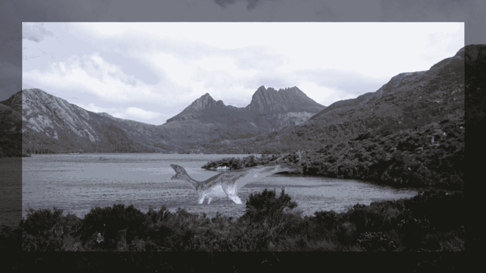

图 17-1

最终图像

我们将使用的基本算法称为“绿幕”。它在电影和电视中应用广泛。其技巧在于，在由单一颜色（且该颜色不存在于恐龙身上）构成的背景前拍摄恐龙照片，然后将风景照片与恐龙照片合并，方法是将所有屏幕颜色的像素替换为风景照片中的像素。

本章的源代码包含风景和恐龙照片，但您也可以轻松使用自己的照片。我们 CGI 项目的主要步骤如下：

*   制作拍摄恐龙所需的屏幕背景。这使用了第 14 章的技术。

*   拍摄恐龙照片，然后使用第 15 章的阈值处理算法来纠正各种错误。

*   编写一个执行选择性叠加的函数。

*   缩小图像并显示它。

首先，从 [`https://github.com/Apress/learn-to-program-w-kotlin-ch17.git`](https://github.com/Apress/learn-to-program-w-kotlin-ch17.git) 下载代码。

## 17.1 制作屏幕

我们将使用的恐龙涂有混合颜色，其中包含绿色。这意味着使用某种绿色调作为屏幕颜色是行不通的——恐龙的某些部分会被背景替换掉。相反，我们将使用洋红色。最好屏幕本身是一个光源，这样当我们在屏幕前拍摄恐龙时就不会有阴影。电脑屏幕就很好。如果我们可以将屏幕平放，那么我们就可以将恐龙放在屏幕上，这样很容易将整个模型都拍进照片里。

要将电脑屏幕变成洋红色，我们可以修改第 14 章的`Flag`程序，使其显示一个巨大的该颜色矩形。以下代码（位于项目源代码的`Flag.kt`文件中）展示了如何实现。请注意，标志的尺寸必须与屏幕匹配。如果矩形太大，程序可能会崩溃。

```
package lpk.imaging
import java.awt.Color
fun main() {
Flag().doLaunch()
}
class Flag : PictureDisplayer() {
val magenta = Color(255, 0, 255)
fun createPictureOfFlag(): Picture {
val height = 2000//请使用您的屏幕
val width = 3000//分辨率！
val pixels = Array(height) {
Array(width) {
magenta
}
}
return Picture(pixels)
}
//不要更改下面的任何内容。
override fun createPicture(): Picture {
return createPictureOfFlag()
}
}
```


## 17.2 拍摄恐龙照片

当屏幕变为洋红色后，我们可以将恐龙模型对准屏幕并拍摄照片。结果可能如图 17-2 所示，随着我们远离屏幕中心，背景颜色会发生变化。这很可能是因为边缘的像素相对于相机而言比中心像素更“侧向”，因此我们看到的蓝色子像素多于红色子像素。无论具体问题是什么，我们都可以通过阈值处理来解决：我们将编写一个程序，将任何接近洋红色的像素精确地变为洋红色。（这也是为什么背景色与恐龙模型颜色之间需要存在强烈对比的另一个原因。）


图 17-2

原始恐龙照片

保存你的恐龙照片，并将其粘贴到项目的 `src/images` 目录中，如图 17-3 所示。

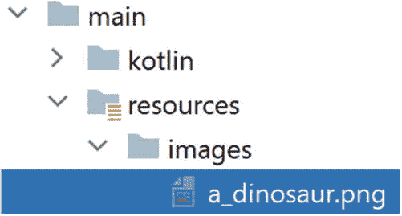

图 17-3

恐龙在洋红色屏幕前的照片需保存在 `images` 目录中

现在我们可以编写一个程序，将该文件作为 `Picture` 加载，应用阈值处理函数，然后保存修改后的 `Picture`。在 `lpk.imaging` 目录中创建一个名为 `Thresholder.kt` 的新文件，并将以下代码粘贴进去。请注意，代码假设恐龙图像名为 `"a_dinosaur.png"`。你需要使用自己照片的文件名。

```
package lpk.imaging
import java.awt.Color
import java.nio.file.Paths
fun main() {
val IMAGES = "src/main/resources/images/"
val dinoFile = Paths.get(IMAGES + "a_dinosaur.png").toFile()
val dino = loadPictureFromFile(dinoFile)
val magenta = Color(255, 0, 255)
val makeMagenta : ((Color) -> (Color)) = {
color ->
if (color.red > 150 && color.green  150) {
magenta
} else {
color
}
}
val transformed = dino.transform(makeMagenta)
val dinoFileFixed = Paths.get(IMAGES, "a_dinosaur_fixed.png").toFile()
transformed.saveTo(dinoFileFixed)
}
```

运行此代码后，`images` 目录中应出现一个新文件。在 IntelliJ 中打开该文件，检查背景是否已均匀变为洋红色。你可能需要调整阈值才能实现这一点。我的第一次尝试产生了如图 17-4 所示的图像。第二次尝试则遗漏了屏幕中间的一些像素，这些像素实际上比纯洋红色更白。我不确定这些像素为何存在。无论如何，前面列出的代码解决了所有问题。

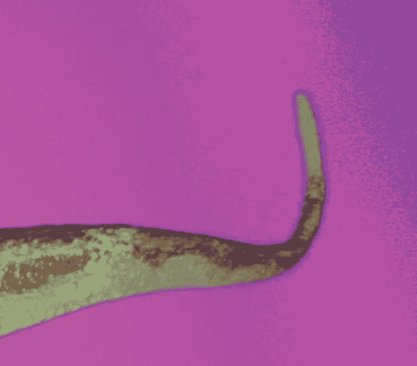

图 17-4

部分成功解决视差问题的尝试

## 17.3 首次叠加尝试

像素交换的算法相当复杂，所以我们先从更简单的开始：生成一张图片，将恐龙照片简单地放置在背景的左上角，不进行条件像素交换。在首次尝试中，我们将使用 `images` 目录中的 `cliffs.png`。这是一张在澳大利亚乌兰河拍摄的 3840×2160 照片。当然，你也可以使用自己的照片。为此，请将其粘贴到 `images` 目录中。无论如何，首先将 `PhotoDisplayer.createPicture()` 中的代码替换为以下内容：

```
override fun createPicture(): Picture {
val backgroundFile = Paths.get(IMAGES + "cliffs.png").toFile()
val background = loadPictureFromFile(backgroundFile)
val dinoFile = Paths.get(IMAGES +
"a_dinosaur_fixed.png").toFile()
val dino = loadPictureFromFile(dinoFile)
val dinoWidth = dino.width()
val dinoHeight = dino.height()
val newPixels = Array(background.height()) {
row ->
Array(background.width()) {
column ->
if (row >= dinoHeight) {
background.pixelByRowColumn(row, column)
} else if (column >= dinoWidth) {
background.pixelByRowColumn(row, column)
} else {
dino.pixelByRowColumn(row, column)
}
}
}
return Picture(newPixels).scaleDown(5)
}
```

该函数后半部分的循环代码就是进行像素交换的地方。

第一个 `if` 语句表示，对于大于或等于前景图像高度的 `row`，使用背景像素。

第二个 `if` 语句表示，对于大于或等于前景图像宽度的 `column`，也使用背景像素。

对于任何其他位置（实际上只剩下左上角），则使用前景像素。请注意，在最后一行，我们在显示图像之前对其进行了缩小。如果你运行此代码，应该会看到类似图 17-5 的结果。

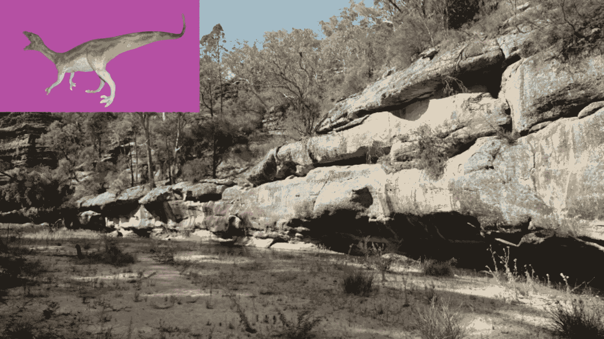

图 17-5

图像叠加的第一步

现在让我们尝试将恐龙放置得更好一些。我们将添加名为 `rowOffset` 和 `columnOffset` 的 `val`，它们表示恐龙前景图片左上角在背景图片中的位置。假设我们想将恐龙图像向下移动 500 像素，向右移动 400 像素，因此：

```
val rowOffset = 500
val columnOffset = 400
```

现在考虑特定 `row` 和 `column` 位置的像素。如果 `row` 小于 500，或者大于等于 `500 + dinoHeight`，则使用背景像素。如果 `column` 小于 400，或者大于等于 `400 + dinoWidth`，则也使用背景像素。对于任何其他位置，则使用前景像素。

综合以上，我们可以将实现替换为：

```
override fun createPicture(): Picture {
val backgroundFile = Paths.get(
IMAGES + "cliffs.png").toFile()
val background = loadPictureFromFile(backgroundFile)
val dinoFile = Paths.get(
IMAGES + "a_dinosaur_fixed.png").toFile()
val dino = loadPictureFromFile(dinoFile)
val dinoWidth = dino.width()
val dinoHeight = dino.height()
val rowOffset = 500
val columnOffset = 400
val newPixels = Array(background.height()) { row ->
Array(background.width()) { column ->
if (row = rowOffset + dinoHeight) {
background.pixelByRowColumn(row, column)
} else if (column =
columnOffset + dinoWidth
) {
background.pixelByRowColumn(row, column)
} else {
dino.pixelByRowColumn(
row - rowOffset, column - columnOffset
)
}
}
}
return Picture(newPixels).scaleDown(5)
}
```

如果运行此代码，你应该会看到前景图像被向右下方向推移，如图 17-6 所示。

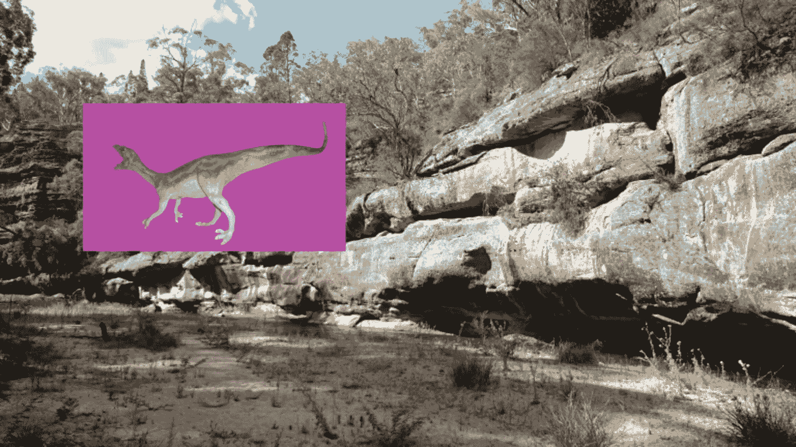

图 17-6

前景已被偏移


## 17.4 让背景透出来

现在我们已经知道如何移动前景图像，接下来尝试让前景中品红色像素所在的位置透出背景。当前实现的循环代码如下：

```
1   val newPixels = Array(background.height()) { row ->
2       Array(background.width()) { column ->
3           if (row = rowOffset + dinoHeight) {
4               background.pixelByRowColumn(row, column)
5           } else if (column =
6               columnOffset + dinoWidth
7           ) {
8               background.pixelByRowColumn(row, column)
9           } else {
10               dino.pixelByRowColumn(
11                   row - rowOffset, column - columnOffset
12               )
13           }
14       }
15   }
```

我们需要将第 10 行替换为：

```
1   val foregroundPixel = dino.pixelByRowColumn(
2       row - rowOffset,column - columnOffset)
3   if (foregroundPixel == Color(255, 0, 255)) {
4       background.pixelByRowColumn(row, column)
5   } else {
6       foregroundPixel
7   }
```

完成此操作后，合并后的图像如图 17-7 所示。


图 17-7

前景切换的首次尝试

效果看起来不错，接下来我们稍微移动图片，让恐龙至少能站在地面上。这可以通过调整偏移量来实现。使用以下数值：

```
val rowOffset = 950
val columnOffset = 1300
```

可以得到不错的效果，如图 17-8 所示。恐龙在这张图片中看起来有点迷失，部分原因是它颜色较深的头部叠加在了背景图像的暗色区域上。我们可以尝试一些巧妙的方法，比如通过编程方式提亮恐龙的头部，但更简单的解决方案是将恐龙垂直翻转，如图 17-9 所示：

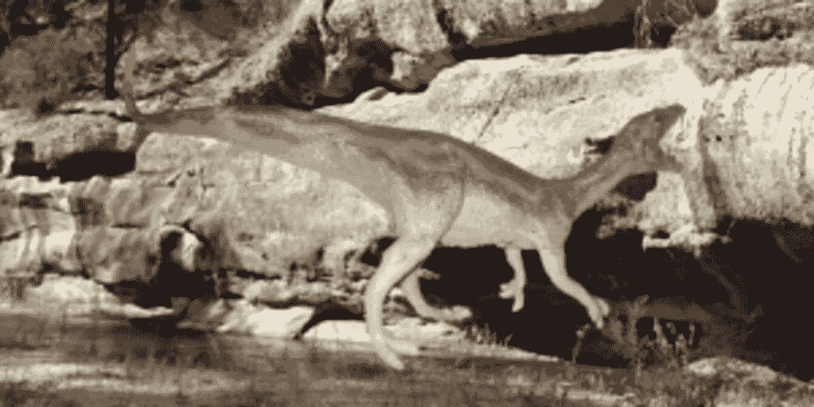

图 17-9

恐龙可以在显示前进行翻转


图 17-8

将恐龙移动到最终位置

```
val dino = loadPictureFromFile(dinoFile).flipInVerticalAxis()
```

经过以上所有修改，并对多次调用背景图像像素获取的代码进行重构后，`createPicture()` 函数如下：

```
override fun createPicture(): Picture {
val backgroundFile = Paths.get(IMAGES + "cliffs.png").toFile()
val background = loadPictureFromFile(backgroundFile)
val dinoFile = Paths.get(IMAGES +
"a_dinosaur_fixed.png").toFile()
val dino = loadPictureFromFile(dinoFile).flipInVerticalAxis()
val dinoWidth = dino.width()
val dinoHeight = dino.height()
val rowOffset = 950
val columnOffset = 1300
val newPixels = Array(background.height()) {
row ->
Array(background.width()) {
column ->
val backgroundPixel = background.pixelByRowColumn(row,
column)
if (row = rowOffset + dinoHeight) {
backgroundPixel
} else if (column =
columnOffset + dinoWidth) {
backgroundPixel
} else {
val foregroundPixel = dino.pixelByRowColumn(row -
rowOffset, column - columnOffset)
if (foregroundPixel == Color(255, 0, 255)) {
backgroundPixel
} else {
foregroundPixel
}
}
}
}
return Picture(newPixels).scaleDown(5)
}
```

## 17.5 隐藏脚部

如果我们仔细观察恐龙的脚部，会发现脚趾带有不自然的品红色调。绿幕技术在图像的细节部分效果最差，因为部分像素最终会混合屏幕颜色和目标对象的颜色。我们可以尝试各种编程改进方法来解决这个问题。例如，检测边缘像素并减少其中的品红色成分。然而，有时寻找非技术性的解决方案更为明智。我们的做法是将背景图像替换为包含湖泊的图像，让恐龙站在湖中，从而隐藏脚趾。我们可以使用第 15 章中的摇篮山图像作为新背景。

需要进行的修改如下：

*   将 `backgroundFile` 的值设置为：

```
val backgroundFile = Paths.get(IMAGES + "cradlemtbig.jpg").toFile()
```

（注意，该文件扩展名为“jpg”）。

*   移除对 `flipInVerticalAxis` 的调用。

*   将偏移量设置为：

```
val rowOffset = 1100
val columnOffset = 1200
```

这些修改的结果如图 17-10 所示。

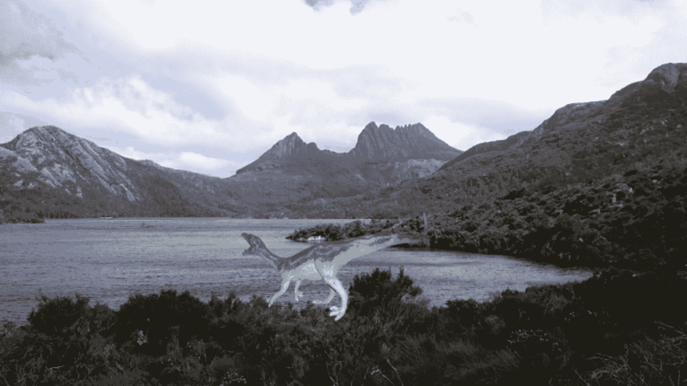

图 17-10

选择更合适的背景

为了营造脚部浸入水中的效果，我们可以使用前景图像下半部分的背景像素。移除最后 200 行可以得到相当不错的效果。这可以通过将关于行的 `if` 语句修改为：

```
if (row = rowOffset + dinoHeight - 200) {
```

作为最后的细节处理，我们可以在图像缩放后调用 `darkBorder` 来加深合成图像的边框。`createPicture` 的完整代码如下：

```
override fun createPicture(): Picture {
val backgroundFile = Paths.get(IMAGES +
"cradlemtbig.jpg").toFile()
val background = loadPictureFromFile(backgroundFile)
val dinoFile = Paths.get(IMAGES +
"a_dinosaur_fixed.png").toFile()
val dino = loadPictureFromFile(dinoFile)
val dinoWidth = dino.width()
val dinoHeight = dino.height()
val rowOffset = 1100
val columnOffset = 1200
val newPixels = Array(background.height()) {
row ->
Array(background.width()) {
column ->
val backgroundPixel = background.pixelByRowColumn(row,
column)
if (row = rowOffset + dinoHeight -
200) {
backgroundPixel
} else if (column =
columnOffset + dinoWidth) {
backgroundPixel
} else {
val foregroundPixel = dino.pixelByRowColumn(row -
rowOffset, column - columnOffset)
if (foregroundPixel == Color(255, 0, 255)) {
backgroundPixel
} else {
foregroundPixel
}
}
}
}
return Picture(newPixels).scaleDown(5).darkBorder()
}
```

这样就得到了本章开头所示的图像。

这里值得注意的一点是，恐龙被放置在一片暗色的水域中，因此不会产生阴影。绿幕图像中缺少阴影是导致其看起来不够真实的原因之一。我们没有通过编程方式生成阴影，而是完全避免了这个问题。

## 17.6 总结

我们仅使用前几章开发的代码就实现了相当不错的绿幕效果。对于初学者程序员来说，这是一个了不起的成果！在多种情况下，我们选择绕开问题，而不是尝试复杂的技术修复。这正是专业软件工程师经常做出的务实决策。

# 第四部分 视觉

视觉

在第四部分中，我们将运用之前学到的所有编程技能，创建能够读取限速标志的软件。


# 18. 概述

*计算机视觉*是指利用软件从图像中提取信息的技术。这是一个重要的课题，在医学（发现肿瘤）、天文学（发现行星）和安全领域（发现罪犯）等方面都有应用。在本书的最后一部分，我们将解决读取限速标志的问题，这对于自动驾驶汽车来说是必不可少的。

我们的软件将要读取的限速标志由红色圆圈内的黑色数字组成，背景为白色。到本书结束时，我们将编写出能够在一张照片中找到限速标志并读取其内容的软件。

我们的软件将通过两个主要步骤完成这一任务。首先，定位图像中包含标志的部分，并将其分割成子图像。这一过程的输出将是一个`Picture`列表，每个`Picture`代表限速的一个数字。第二步是确定这些图像代表什么数字。

该软件的实现分布在接下来的四章中，具体如下。在本章中，我们将增强第三部分中的`Picture`类，使其能够进行定位图像重要特征所需的切片操作。在下一章中，这些新函数将被应用于限速标志照片，以提取数字子图像。在第 20 章中，我们将开发能够接收黑白图像并确定其代表哪个数字的代码。最后，在本书的最后一章中，我们将把所有这些部分整合起来，生成一个真正非常复杂的程序。

## 18.1 更多 Kotlin 知识

在我们开始编写计算机视觉代码之前，需要学习几个概念。我们将使用一个名为 Kotlin REPL（读取-求值-打印循环）的工具来学习，该工具是 IntelliJ 的一部分。通过菜单 `Tools` ➤ `Kotlin` ➤ `Kotlin` `REPL` 可以启动 REPL。该工具本身是 Kotlin 的一种命令行界面，如图 18-1 所示。

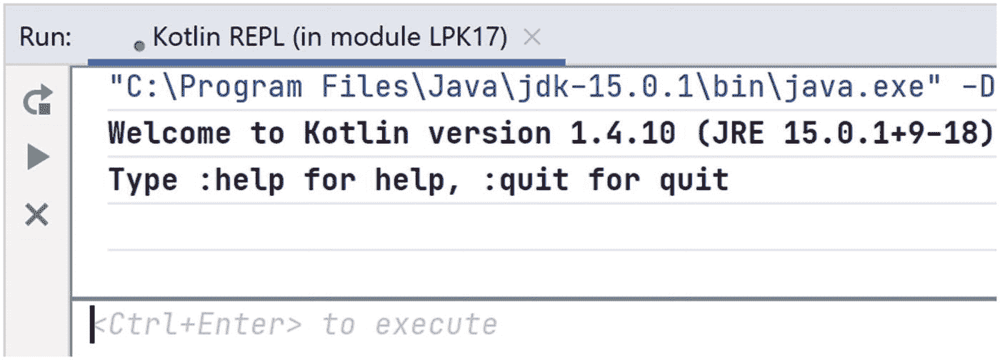

图 18-1

Kotlin REPL

在第 20 章中，我们将需要讨论比例，即分数，例如“.65”。在 Kotlin 中，可以使用名为`Float`的类来建模。如果我们想使用普通算术（而非整数算术）来除两个`Int`，我们需要先将它们转换为`Float`。例如，如果在 Kotlin REPL 中输入表达式

```
1.toFloat() / 3.toFloat()
```

则会输出答案 `0.33333334`。关于`Float`其实没什么好说的，它们非常容易使用。通常，只有当我们忘记在除法之前将`Int`转换为`Float`时才会出现问题，例如：

```
(1/3).toFloat()
```

会得到结果 `0.0`，因为 `1/3` 是 `Int 0`，然后被转换为 `Float 0.0`。

我们需要掌握的第二个新编程概念是*过滤*，即对`List`中的元素应用某种决策过程，保留重要的元素，丢弃其余的元素。为了演示其用法，让我们过滤 `1` 到 `10` 之间的整数，只保留偶数。为此，在 REPL 中输入

```
(1..10).filter { i -> i % 2 == 0 }
```

然后按 `Ctrl+Enter`。你应该会看到输出：

```
[2, 4, 6, 8, 10]
```

表达式

```
i -> i % 2 == 0
```

是一个从 `Int` 类型到 `Boolean` 类型的函数。如果 `i` 除以 `2` 的余数等于 `0`，即 `i` 是偶数，则该函数返回 `true`。回顾上一章，这被称为 lambda 函数。事实上，像这样的 lambda 函数非常有用，以至于 Kotlin 允许一种简写形式，将表达式中的 `i -> i` 部分替换为 `it`，这是对“我们正在迭代的集合中的任何元素”的一个很好的简写。使用这个简写，我们可以写成

```
(1..10).filter { it % 2 == 0 }
```

`filter` 函数将此 lambda 应用于原始列表中的所有元素，并构建一个新列表，其中包含那些使函数返回 `true` 的元素。我们可以使用过滤来回答诸如“大于 1000 的 41 的最小倍数是多少？”这样的问题：

```
(1001..1100).filter{it % 41 == 0}.first()
```

我们将在第 19 章中使用过滤，届时我们将把图像切片成子图像列表，并且需要丢弃那些太小而不值得关注的子图像。

## 18.2 项目结构

本章的代码可以从 [`https://github.com/Apress/learn-to-program-w-kotlin-ch18.git`](https://github.com/Apress/learn-to-program-w-kotlin-ch18.git) 下载。其中包含前几章的`Picture`类（已移除一些不必要的函数）、`PictureTest`以及一个测试图像目录。


## 18.3 图像切片

我们需要做的第一批图像切片是将一个`Picture`拆分为包含红色像素的`Picture`列表。为此，我们需要识别包含红色像素的行和列。将以下函数添加到`Picture`中：

```
fun columnContainsRedPixel(column: Int): Boolean {
for (row in 0..height() - 1) {
if (pixelByRowColumn(row, column) == Color.RED) {
return true
}
}
return false
}
```

注意`if`语句中的`Color.RED`。为了尽可能少引入新语法，我们之前都是按需创建`Color`对象，但实际上最常用的`Color`都有对应的常量，从现在开始我们将使用这些常量。测试函数使用了预置的图像：

```
@Test
fun columnContainsRedPixelTest() {
val allBlue = load("blue10.png")
for (column in 0..9) {
Assert.assertFalse(allBlue.columnContainsRedPixel(column))
}
val allRed = load("red10.png")
for (column in 0..9) {
Assert.assertTrue(allRed.columnContainsRedPixel(column))
}
//100 行，200 列，除一个 50x50 的红色方块外全黑
//该方块左上角位于第 50 行、第 100 列
val someRed = load("red_in_black.png")
for (column in 0..99) {
Assert.assertFalse(someRed.columnContainsRedPixel(column))
}
for (column in 100..149) {
Assert.assertTrue(someRed.columnContainsRedPixel(column))
}
for (column in 150..199) {
Assert.assertFalse(someRed.columnContainsRedPixel(column))
}
}
```

将这些函数分别复制到`Picture`和`PictureTest`中，并确认测试通过。

项目步骤 18.1

添加一个用于检查某行是否包含红色像素的函数。

为此添加一个测试，并确认测试通过。

要将`Picture`垂直切分成包含红色像素的片段，可以按以下步骤操作。从左侧开始，寻找第一个包含红色像素的列。找到后，再开始寻找一个不包含红色像素的列。这两列之间的部分就构成了第一个切片。我们将这个切片转换为`Picture`并添加到结果（一个`List<Picture>`）中。然后重新开始，寻找下一个包含红色像素的列，依此类推。

通过一个例子可以更好地理解这个过程。考虑下面的`Picture`，它有 4 行 13 列像素。

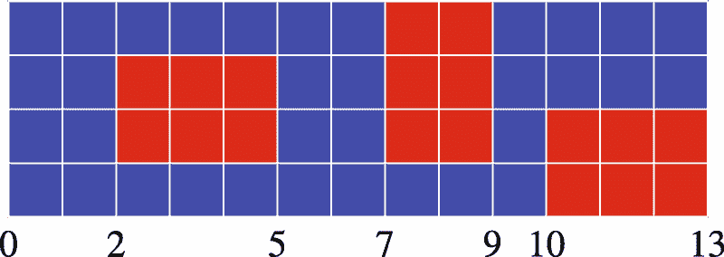

定义名为`leftLimit`和`rightLimit`的变量。它们表示`Picture`中每一列都包含红色像素的区段的起始列和结束列。初始时，这两个变量都包含值`-1`。我们从第 0 列开始，按如下方式操作：

| 列 | 包含红色？ | `leftLimit` | `rightLimit` | 操作 |
| --- | --- | --- | --- | --- |
| `0` | `false` | `-1` | `-1` |   |
| `1` | `false` | `-1` | `-1` |   |
| `2` | `true` | `2` | `2` |   |
| `3` | `true` | `2` | `3` |   |
| `4` | `true` | `2` | `4` |   |
| `5` | `false` | `-1` | `-1` | 将`Picture`添加到结果 |
| `6` | `false` | `-1` | `-1` |   |
| ⋮ | ⋮ | ⋮ | ⋮ |   |

项目步骤 18.2

看看你是否能完成上表。

当包含红色像素的列后面紧跟着不包含红色像素的列时，`Picture`会被添加到结果中。这种情况发生在第 5 列和第 7 列。另外，在第 12 列也会添加一个`Picture`，因为这是最后一列。添加的`Picture`包含所有红色像素所在列的全部像素，而不仅仅是红色像素本身。如图 18-2 所示。

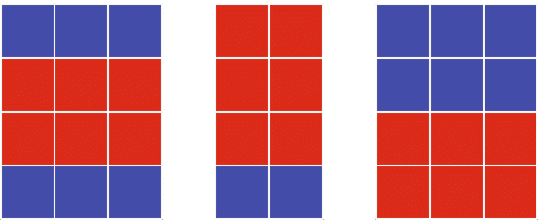

图 18-2

切片之后

以下是该算法的一种实现：

```
fun sliceVerticallyIntoPicturesContainingRed(): List {
val result = mutableListOf()
var leftLimit = -1
var rightLimit = -1
for (i in 0..width() - 1) {
if (columnContainsRedPixel(i)) {
if (leftLimit == -1) {
leftLimit = i
}
rightLimit = i
} else {
//这是一个间隙
if (leftLimit >= 0) {
//当前子图片已完成
val columnsInCurrentPiece = rightLimit - leftLimit + 1
val piece = cropTo(0, leftLimit, height(), columnsInCurrentPiece)
result.add(piece)
//重置标记
leftLimit = -1
rightLimit = -1
}
}
}
//可能还有一块延伸到图片边缘的剩余部分
//如果存在，则将其添加
if (leftLimit >= 0) {
val columnsInCurrentPiece = rightLimit - leftLimit + 1
val piece = cropTo(0, leftLimit, height(), columnsInCurrentPiece)
result.add(piece)
}
return result
}
```

这段代码非常复杂，但有两件事可以帮助我们理解它。首先，我们可以尝试用前面例子中的值来逐步执行代码。其次，我们可以将这段代码与第 10 章中`Line`的`init`块进行比较。实际上它们是相同的算法，对比如下：

|   | `Line.init` | `Picture`切片 |
| --- | --- | --- |
| 被分割的对象 | 一个`String` | 一个`Picture`（在一维上） |
| 边界 | 空格 | 不含红色像素的列 |
| 输出 | `List<String>` | `List<Picture>` |

两种情况下算法的通用形式相同，都包含一个主循环，随后调用一个函数来添加任何剩余的部分。

当然，单元测试总能帮助我们更好地理解代码。切片函数的测试使用了图 18-3 所示的测试图像。该测试将图像垂直分割，检查是否得到三个片段，然后将每个片段与预期的测试图像进行比较。

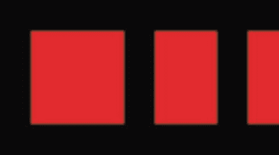

图 18-3

测试图像

```
@Test
fun sliceVerticallyIntoPicturesContainingRedTest() {
val picture = load("slice_test_v.png")
val slices = picture.sliceVerticallyIntoPicturesContainingRed()
Assert.assertEquals(3, slices.size)
checkPicture(load("v0.png"), slices[0])
checkPicture(load("v1.png"), slices[1])
checkPicture(load("v2.png"), slices[2])
}
```

将函数和测试分别复制到`Picture`和`PictureTest`中，并确认测试通过。

项目步骤 18.3

复制垂直切片函数并修改为水平切片。不必担心代码重复，我们稍后会进行重构。

注意 使用`cropTo`的行需要小心处理，因为这些行会稍有变化。

为其创建一个单元测试，使用测试图像`slice_test_h.png`以及三个小图像`h0.png`、`h1.png`和`h2.png`。

## 18.4 总结与步骤详情

在本章中，我们使用 Kotlin REPL 实验了一些新语法。我们还为`Picture`添加了一些函数，这些函数将按照检测限速标志所需的方式对图像进行切片，我们很快就会看到这一点。

### 18.4.1 项目步骤 18.1 详情

以下是函数：

```
fun rowContainsRedPixel(row: Int): Boolean {
for (column in 0..width() - 1) {
if (pixelByRowColumn(row, column) == Color.RED) {
return true
}
}
return false
}
```

以下是测试：

```
@Test
fun rowContainsRedPixelTest() {
val allBlue = load("blue10.png")
for (row in 0..9) {
Assert.assertFalse(allBlue.rowContainsRedPixel(row))
}
val allRed = load("red10.png")
for (row in 0..9) {
Assert.assertTrue(allRed.rowContainsRedPixel(row))
}
val someRed = load("red_in_black.png")
for (row in 0..49) {
Assert.assertFalse(someRed.rowContainsRedPixel(row))
}
for (row in 50..99) {
Assert.assertTrue(someRed.rowContainsRedPixel(row))
}
}
```

### 18.4.2 项目步骤 18.2 详情

表格继续：

| 列 | 包含红色？ | **leftLimit** | **rightLimit** | 操作 |
| --- | --- | --- | --- | --- |
| `7` | `true` | `7` | `7` |   |
| `8` | `true` | `7` | `8` |   |
| `9` | `false` | `-1` | `-1` | 将`Picture`添加到结果 |
| `10` | `true` | `10` | `10` |   |
| `11` | `true` | `10` | `11` |   |
| `12` | `true` | `10` | `12` | 将`Picture`添加到结果 |


### 18.4.3 项目步骤 18.3 的细节

以下是用于水平切分的函数：

```
fun sliceHorizontallyIntoPicturesContainingRed(): List {
val result = mutableListOf()
var upperLimit = -1
var lowerLimit = -1
for (i in 0..height() - 1) {
if (rowContainsRedPixel(i)) {
if (upperLimit == -1) {
upperLimit = i
}
lowerLimit = i
} else {
//这是一个间隙。
if (upperLimit >= 0) {
//当前子图片已完整。
val rowsInCurrentPiece = lowerLimit - upperLimit + 1
val piece = cropTo(upperLimit, 0, rowsInCurrentPiece, width())
result.add(piece)
//重置标记。
upperLimit = -1
lowerLimit = -1
}
}
}
//可能还有一块延伸到图片边缘的碎片。
//如果存在，则将其添加。
if (upperLimit >= 0) {
val rowsInCurrentPiece = lowerLimit - upperLimit + 1
val piece = cropTo(upperLimit, 0, rowsInCurrentPiece, width())
result.add(piece)
}
return result
}
```

以下是测试代码：

```
@Test
fun sliceHorizontallyIntoPicturesContainingRedTest() {
val picture = load("slice_test_h.png")
val slices = picture.sliceHorizontallyIntoPicturesContainingRed()
Assert.assertEquals(3, slices.size)
checkPicture(load("h0.png"), slices[0])
checkPicture(load("h1.png"), slices[1])
checkPicture(load("h2.png"), slices[2])
}
```

# 19. 寻找数字

在本章中，我们将编写一个类，给定包含限速标志的 `Picture`，提取出代表标志中各个数字的 `Picture` 列表。首先，打开 [`https://github.com/Apress/learn-to-program-w-kotlin-ch19.git`](https://github.com/Apress/learn-to-program-w-kotlin-ch19.git)。

## 19.1 DigitFinder

除了 `Picture` 之外，项目中还包含一个名为 `DigitFinder` 的类：

```
1   package lpk.imaging

3   import java.awt.Color

5   class DigitFinder(val input : Picture) {
6       fun digits() : List {
7           val result = mutableListOf()
8           result.add(input)
9           return result
10       }
11   }
```

`DigitFinder` 的目的是接收包含限速标志的输入图像，并生成一个 `Picture` 列表，每个元素对应标志中的一个数字。上述实现仅将 `input` 图像添加到 `result` 列表中，并未进行任何分析。

此外还有一个名为 `DigitFinderTest` 的类。这并非真正的测试，而是一种便捷的代码运行方式，以便我们找到最佳阈值和切分技术。目前我们只处理一张图像。

以下是 `DigitFinderTest` 的完整代码（不含 `package` 和 `import` 语句）：

```
1   val SIGNS = "src/test/resources/images/signs/"

3   fun loadSign(name: String): DigitFinder {
4       val file = Paths.get(SIGNS + name).toFile()
5       return DigitFinder(loadPictureFromFile(file))
6   }
7   fun saveInTempDir(picture: Picture, name: String) {
8       val tempDir = File("temp")
9       tempDir.mkdirs()
10       val file = File(tempDir, name)
11       picture.saveTo(file)
12   }
13   class DigitFinderTest {
14       @Test
15       fun analyse() {
16           val s80 = loadSign("80.png")
17           val digitPictures = s80.digits()
18           saveInTempDir(digitPictures[0], "p0.png")
19       }
20   }
```

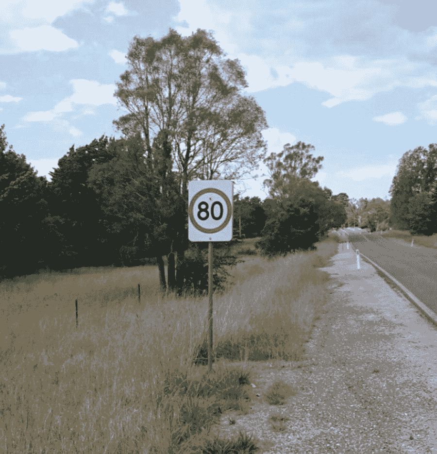

图 19-1

限速标志

在第 16 行，我们为图 19-1 所示的标志创建了一个 `DigitFinder`。接着，调用 `digits` 函数获取 `DigitFinder` 发现的 `Picture` 列表。到本章结束时，列表中应包含两个元素，但目前只有一个。在第 18 行，我们将此图像保存到临时位置，以便查看并检查阈值。

运行 `DigitFinderTest` 中的 `analyse` 函数时，会创建一个名为 `temp` 的目录，并在其中写入一个名为 `p0.png` 的文件，如图 19-2 所示。我们可以在 IntelliJ 中打开它，当然，目前它显示的只是原始输入图像。

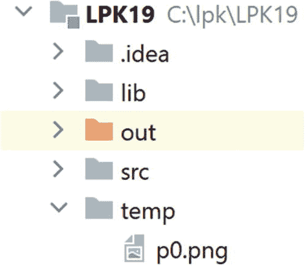

图 19-2

项目布局，提取的图像（目前只有一张）已写入 `temp` 目录


## 19.2 对标志图像进行阈值处理

`Picture` 类具有可将实例切片为包含红色分量的功能。限速标志最显著的特征之一就是环绕数字的红色圆圈。我们的计划是对限速标志图像进行切片，以获取包含红色圆圈的切片。当然，限速标志并不包含纯色，但我们可以通过阈值处理来克服这个问题。这可以通过创建一个函数来实现：

```
(Color) -> (Color)
```

然后将此函数作为参数传递给 `Picture` 的 `transform` 函数。该阈值处理函数应将像素映射到与其最接近的红色、白色或黑色。

因此，对于大致呈白色的 `Color`，应返回 `Color.WHITE`；对于接近 `Color.RED` 的 `Color`，应返回该颜色；否则应返回 `Color.BLACK`。为此，将 `DigitFinder` 修改为：

```
class DigitFinder(val input : Picture) {
val blackWhitRedThresholder: ((Color) -> (Color)) = {
if (it.red > 196 && it.green > 196 && it.blue > 196) {
Color.WHITE
} else if (it.red > 196) {
Color.RED
} else {
Color.BLACK
}
}
fun digits() : List {
val result = mutableListOf()
val blackWhitRedVersion = input.transform(blackWhitRedThresholder)
result.add(blackWhitRedVersion)
return result
}
}
```

在这个新版本的类中，有一个名为 `blackWhiteThresholder` 的 `val` 来执行阈值处理。然后应用此函数生成输入图像的新版本，并将这个经过阈值处理的版本添加到结果中。

完成这些更改后，运行测试。你应该会看到阈值处理的效果并不理想。如图 19-3 所示，几乎所有的内容都是黑色的，包括标志上本应为白色的部分。要理解发生了什么，最好在绘图程序中打开原始图像，查看其中的实际颜色。结果发现，标志的“白色”背景的红色值约为 185，低于我们阈值处理中的 196。更令人惊讶的是，“红色”圆圈中的像素的红色值约为 155，蓝色值约为 80。它们距离纯红色还很远。

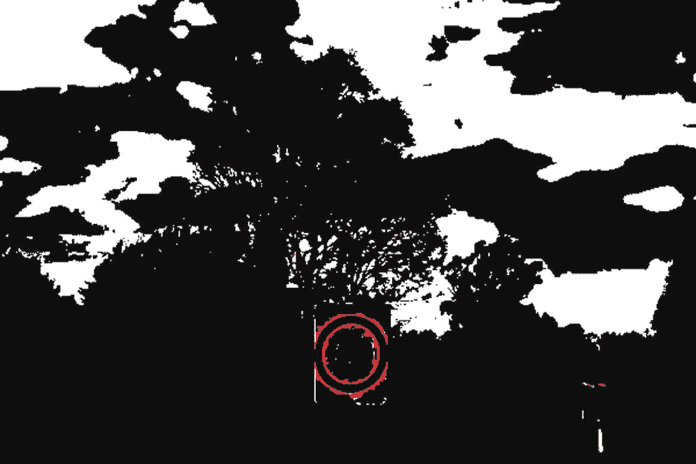

图 19-3

第一次阈值处理尝试

第二次尝试，让我们尝试将 `blackWhitRedThresholder` 修改为：

```
val blackWhitRedThresholder: ((Color) -> (Color)) = {
if (it.red > 128 && it.green > 128 && it.blue > 128) {
Color.WHITE
} else if (it.red > 128) {
Color.RED
} else {
Color.BLACK
}
}
```

这得到了更好的结果，但图片中的棕色部分（例如草地）被变成了红色，如图 19-4 所示。这将使我们难以找到标志。

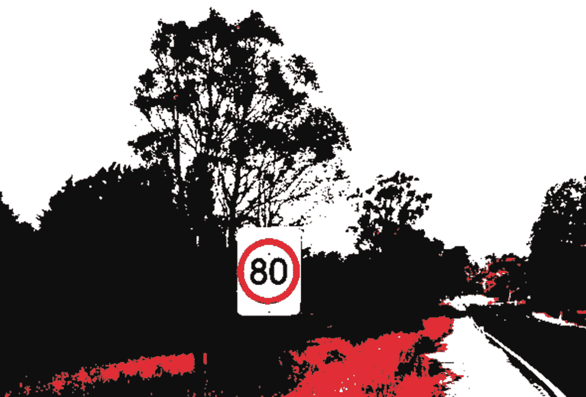

图 19-4

第二次尝试

第三次尝试，让我们改变重点，思考图像中的哪些信息对我们的目标最重要。标志中的数字才是我们真正最感兴趣的。它们在照片中非常暗。因此，我们只将那些确实非常暗的像素改为黑色。其次重要的是圆圈中的红色像素。从第二次尝试中我们了解到，红色值高但绿色或蓝色值也高的像素不应改为红色。其他所有内容都可以改为白色，而不会丢失真正重要的信息。因此，让我们尝试将阈值处理修改为：

```
val blackWhitRedThresholder: ((Color) -> (Color)) = {
if (it.red  128 && it.green < 96 && it.blue < 96) {
Color.RED
} else {
Color.WHITE
}
}
```

结果如图 19-5 所示，终于得到了一个我们可以处理的结果。

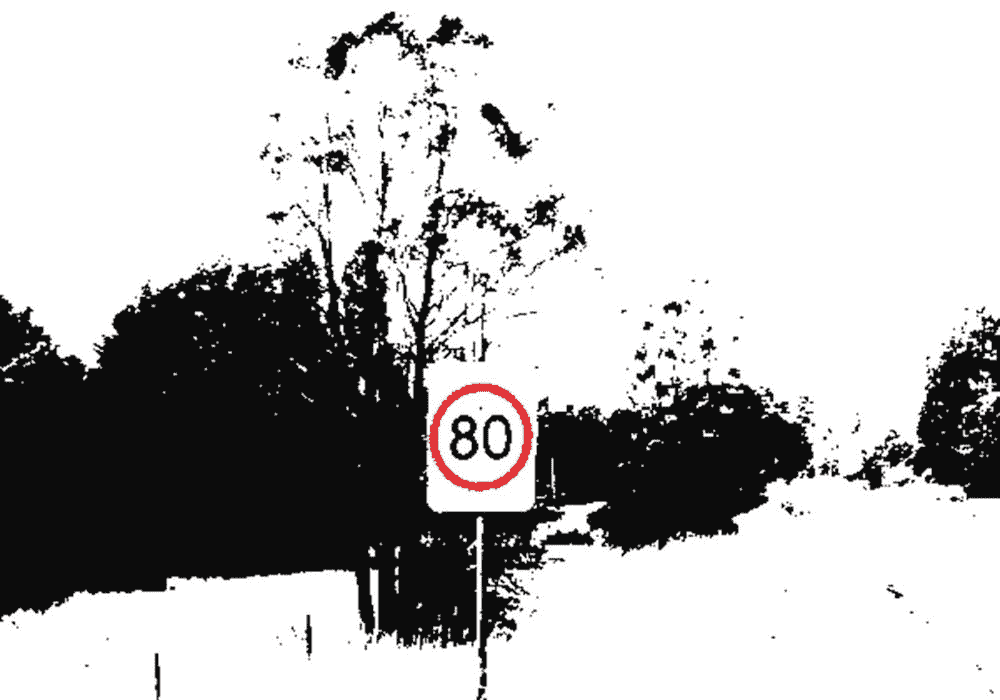

图 19-5

第三次尝试

## 19.3 对阈值处理后的图像进行切片

有了经过良好阈值处理的 `Picture`，我们现在可以找到包含限速标志的水平切片。我们可以通过将 `digits` 函数修改为以下内容来实现：

```
fun digits(): List {
val result = mutableListOf()
val blackWhitRedVersion = input.transform(blackWhitRedThresholder)
val slicesH = blackWhitRedVersion.
sliceHorizontallyIntoPicturesContainingRed()
val sliceH0 = slicesH.first()
result.add(sliceH0)
return result
}
```

请注意，我们只从水平切片函数生成的列表中取第一个 `Picture`。我们稍后会对此进行整理。使用新代码，我们只得到阈值处理图像的一个狭窄部分，如图 19-6 所示。

这里仍然有很多不是标志的图像部分。我们可以通过对该图像进行垂直切片来去除多余部分。为此，将 `digits` 修改为：

```
fun digits(): List {
val result = mutableListOf()
val blackWhitRedVersion = input.transform(blackWhitRedThresholder)
val slicesH = blackWhitRedVersion.
sliceHorizontallyIntoPicturesContainingRed()
val sliceH0 = slicesH.first()
val slicesV = sliceH0.
sliceVerticallyIntoPicturesContainingRed()
val sliceV0 = slicesV.first()
result.add(sliceV0)
return result
}
```

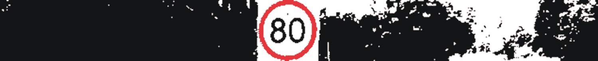

图 19-6

阈值处理后进行水平切片

结果是一个修剪得当的限速标志，仅包含三种颜色，如图 19-7 所示。

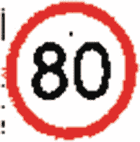

图 19-7

垂直切片之后


## 19.4 更通用的切片函数

为了获取图 19-7 中经过阈值处理和两次切片后的限速标志内的实际数字，我们需要去除数字周围的红色圆圈和空白区域。我们可以通过更多切片操作来实现这一点！如果我们将切片函数修改为能匹配任意指定的颜色，那么我们就可以先水平切片，再垂直切片，从而获得修剪到仅包含数字的纯黑白图像。

首先，删除函数 `rowContainsRedPixel`，并用一个接受待查找 `Color` 作为参数的新函数替换它：

```
fun rowContainsPixelMatching(row: Int, toMatch: Color): Boolean {
for (column in 0..width() - 1) {
if (pixelByRowColumn(row, column) == toMatch) {
return true
}
}
return false
}
```

这样做会带来一些问题。首先，在 `Picture` 中，`sliceHorizontallyIntoPicturesContainingRed` 函数体内对 `rowContainsMatchingPixel` 的调用需要改为：

```
if (rowContainsPixelMatching(i, Color.RED)) {
```

其次，针对被删除函数的单元测试需要替换为以下内容：

```
@Test
fun rowContainsPixelMatchingTest() {
val allBlue = load("blue10.png")
for (row in 0..9) {
Assert.assertTrue(allBlue.rowContainsPixelMatching(row, Color.BLUE))
Assert.assertFalse(allBlue.rowContainsPixelMatching(row, Color.RED))
}
val allRed = load("red10.png")
for (row in 0..9) {
Assert.assertTrue(allRed.rowContainsPixelMatching(row, Color.RED))
Assert.assertFalse(allRed.rowContainsPixelMatching(row, Color.BLUE))
}
val someRed = load("red_in_black.png")
for (row in 0..49) {
Assert.assertFalse(someRed.rowContainsPixelMatching(row, Color.RED))
}
for (row in 50..99) {
Assert.assertTrue(someRed.rowContainsPixelMatching(row, Color.RED))
}
}
```

项目步骤 19.1

对 `columnContainsRedPixel` 及其测试进行类似的修改。

现在让我们来看看切片函数本身。我们可以将水平切片函数重命名为 `sliceHorizontallyIntoPicturesContaining`，并引入一个 `Color` 参数，这样函数开头就变成：

```
fun sliceHorizontallyIntoPicturesContaining(toMatch: Color): List {
val result = mutableListOf()
var upperLimit = -1
var lowerLimit = -1
for (i in 0..height() - 1) {
if (rowContainsPixelMatching(i, toMatch)) {
...
```

注意，`if` 语句中对 `rowContainsPixelMatching()` 的调用现在使用了参数 `toMatch`，而不是 `Color.RED`。

我们需要修改 `DigitFinder` 中对这个函数的调用，传入 `Color.RED` 作为参数。同时，我们也应该将测试修改为：

```
@Test
fun sliceHorizontallyIntoPicturesContainingTest() {
val picture = load("slice_test_h.png")
val slices = picture.sliceHorizontallyIntoPicturesContaining(Color.RED)
Assert.assertEquals(3, slices.size)
checkPicture(load("h0.png"), slices[0])
checkPicture(load("h1.png"), slices[1])
checkPicture(load("h2.png"), slices[2])
val slicesBlack = picture.sliceHorizontallyIntoPicturesContaining(Color.BLACK)
Assert.assertEquals(1, slicesBlack.size)
checkPicture(load("slice_test_h.png"), slicesBlack[0])
}
```

注意，我们添加了代码来检查当函数参数为红色以外的颜色时是否正常工作。

项目步骤 19.2

对 `sliceVerticallyIntoPicturesContainingRed` 及其测试进行类似的修改。

## 19.5 过滤切片

使用我们更通用的切片函数，我们可以尝试从限速标志中提取数字。我们的策略是先水平切片，获取包含黑色像素的部分。这应该能移除数字上方和下方的图像部分。然后对剩余部分进行垂直切片，以获取单个数字。让我们先修改代码以执行水平切片：

```
fun digits(): List {
val result = mutableListOf()
val blackWhitRedVersion = input.transform(blackWhitRedThresholder)
val slicesH = blackWhitRedVersion
.sliceHorizontallyIntoPicturesContaining(Color.RED)
val signSlice = slicesH.first()
val slicesV = signSlice.sliceVerticallyIntoPicturesContaining(Color.RED)
val sign = slicesV.first()
val slices2H = sign.sliceHorizontallyIntoPicturesContaining(Color.BLACK)
val digitsSlice = slices2H.first()
result.add(digitsSlice)
return result
}
```

运行这段代码会产生一个奇怪的输出：一个非常窄的 `Picture`，不放大几乎无法看清。在放大镜下，问题就显而易见了。图像中有一个黑点，包含该黑点的行被当成了一个切片，如图 19-8 所示。

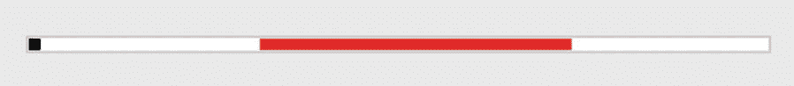

图 19-8

检索到的切片是“噪声”

我们需要忽略这种“噪声”。我们在第 18 章中看到的 `List` 过滤功能提供了一种很好的方法。我们需要一个函数：

```
(Picture) -> (Boolean)
```

该函数可用于选择尺寸足够大、具有重要性的 `Picture`。以下函数可以完成这项工作：

```
val sizeAtLeast20: ((Picture) -> (Boolean)) = {
it.width() > 20 && it.height() > 20
}
```

项目步骤 19.3

将 `sizeAtLeast20 val` 添加到 `DigitFinder` 中。然后使用它来过滤切片：

```
val slices2H = sign.
sliceHorizontallyIntoPicturesContaining(Color.BLACK).
filter(sizeAtLeast20)
val digitsSlice = slices2H.first()
```

经过这些修改，输出被很好地修剪了，如图 19-9 所示。仔细观察这个输出，可以看到左侧有一个孤立的黑色像素。当我们垂直切片这个图像时，需要将其过滤掉。然而，数字本身非常窄（显示的输出已被放大），因此使用尺寸为 20 的过滤条件将不起作用。让我们添加一个比水平切片所用过滤条件更精细的过滤器，并将其应用于垂直切片。以下是包含这些修改的 `DigitFinder` 版本：

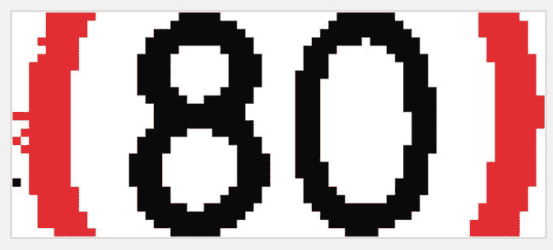

图 19-9

过滤掉极薄切片之后

```
class DigitFinder(val input: Picture) {
val blackWhitRedThresholder: ((Color) -> (Color)) = {
if (it.red  128 && it.green  (Boolean)) = {
it.width() > 20 && it.height() > 20
}
val sizeAtLeast10: ((Picture) -> (Boolean)) = {
it.width() > 10 && it.height() > 10
}
fun digits(): List {
val blackWhitRedVersion = input.transform(blackWhitRedThresholder)
val slicesH = blackWhitRedVersion.
sliceHorizontallyIntoPicturesContaining(Color.RED)
val signSlice = slicesH.first()
val slicesV = signSlice.
sliceVerticallyIntoPicturesContaining(Color.RED)
val sign = slicesV.first()
val slices2H = sign.
sliceHorizontallyIntoPicturesContaining(Color.BLACK).
filter(sizeAtLeast20)
val digitsSlice = slices2H.first()
return digitsSlice.
sliceVerticallyIntoPicturesContaining(Color.BLACK).
filter(sizeAtLeast10)
}
}
```

我们现在期望输出中包含两个 `Picture`，因此让我们修改测试函数以保存它们两个：

```
@Test
fun analyse() {
val s80 = loadSign("80.png")
val digitPictures = s80.digits()
saveInTempDir(digitPictures[0], "p0.png")
saveInTempDir(digitPictures[1], "p1.png")
}
```

运行这段代码会在 `temp` 目录中生成两个文件。它们只是黑白图像，并且被整齐地修剪到仅包含数字，如图 19-10 所示。

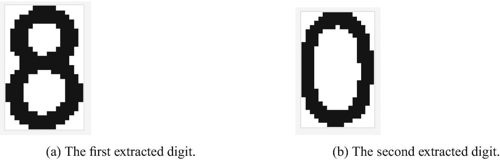

图 19-10

从包含限速标志的图像中提取出的两个代表单个数字的图像

## 19.6 总结与步骤详情

我们现在有了一个程序，它可以拍摄包含限速标志的照片，并将其分解成一个由单个数字的 `Picture` 组成的 `List`。在下一章中，我们将编写能够确定这些图像所代表数字的代码。


### 19.6.1 项目步骤 19.1 的细节

重构后的函数为

```
fun columnContainsPixelMatching(column: Int, toMatch: Color): Boolean {
for (row in 0..height() - 1) {
if (pixelByRowColumn(row, column) == toMatch) {
return true
}
}
return false
}
```

测试可以修改为

```
@Test
fun columnContainsPixelMatchingTest() {
val allBlue = load("blue10.png")
for (column in 0..9) {
Assert.assertFalse(allBlue.columnContainsPixelMatching(column, Color.RED))
Assert.assertTrue(allBlue.columnContainsPixelMatching(column, Color.BLUE))
}
val allRed = load("red10.png")
for (column in 0..9) {
Assert.assertTrue(allRed.columnContainsPixelMatching(column, Color.RED))
Assert.assertFalse(allRed.columnContainsPixelMatching(column, Color.BLUE))
}
//100 行，200 列，除一个 50x50 的方块外全黑
//该方块左上角位于第 50 行、第 100 列
val someRed = load("red_in_black.png")
for (column in 0..99) {
Assert.assertFalse(someRed.columnContainsPixelMatching(column, Color.RED))
}
for (column in 100..149) {
Assert.assertTrue(someRed.columnContainsPixelMatching(column, Color.RED))
}
for (column in 150..199) {
Assert.assertFalse(someRed.columnContainsPixelMatching(column, Color.RED))
}
}
```

### 19.6.2 项目步骤 19.2 的细节

重构后的测试为

```
@Test
fun sliceVerticallyIntoPicturesContainingTest() {
val picture = load("slice_test_v.png")
val slices = picture.sliceVerticallyIntoPicturesContaining(Color.RED)
Assert.assertEquals(3, slices.size)
checkPicture(load("v0.png"), slices[0])
checkPicture(load("v1.png"), slices[1])
val slicesBlack =
picture.sliceVerticallyIntoPicturesContaining(Color.BLACK)
Assert.assertEquals(1, slicesBlack.size)
checkPicture(load("slice_test_v.png"), slicesBlack[0])
}
```

### 19.6.3 项目步骤 19.3 的细节

`DigitFinder` 的新版本为

```
package pfb.imaging
import java.awt.Color
class DigitFinder(val input: Picture) {
val blackWhitRedThresholder: ((Color) -> (Color)) = {
if (it.red  128 && it.green  (Boolean)) = {
it.width() > 20 && it.height() > 20
}
fun digits(): List {
val blackWhitRedVersion = input.transform(blackWhitRedThresholder)
val slicesH = blackWhitRedVersion.
sliceHorizontallyIntoPicturesContaining(Color.RED)
val signSlice = slicesH.first()
val slicesV = signSlice.
sliceVerticallyIntoPicturesContaining(Color.RED)
val sign = slicesV.first()
val slices2H = sign.
sliceHorizontallyIntoPicturesContaining(Color.BLACK).
filter(sizeAtLeast20)
return slices2H
}
}
```

# 20. 解析图像

在上一章中，我们完成了一个名为 `DigitFinder` 的程序，它能够加载限速标志的照片，并从中提取出各个数字的黑白图像列表。在本章中，我们将编写代码来确定这些提取出的图像所代表的数字。

将 `DigitFinder` 应用于不同的限速标志，会得到如下所示的输出图像：

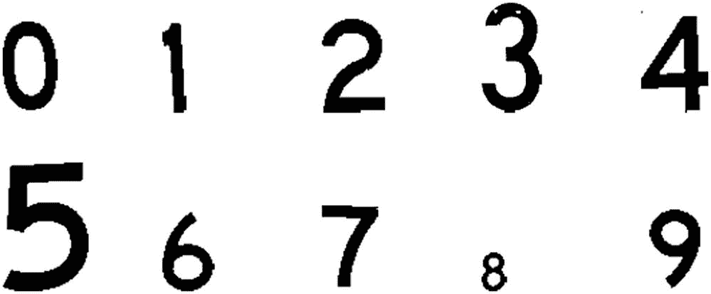

为了确定一幅图像代表哪个数字，我们的软件将构建该图像的描述，然后根据描述做出判断。例如，如果图像“非常窄”，它将被归类为“1”。如果图像“中心为白色”，则会被归类为“0”。由于我们分类的图像在大小和呈现角度上各不相同，并且偶尔会缺失黑色像素，因此我们的软件在判断图像代表哪个数字时，只能使用相当宽泛的描述，例如“窄”或“中心为白色”。

我们将主要利用图像不同部分黑色像素的密度信息来描述它。一个名为 `Regions` 的类将识别像素位于图像的哪个区域。一个名为 `PictureSummary` 的类将遍历图像中的像素，并借助该图像的 `Regions` 对象，收集关于黑色像素位置的统计数据。这些信息将被总结为诸如 `hasCenterBlank`、`hasCenterDark` 等属性。最后，在名为 `DigitReader.kt` 的文件中，一个名为 `read` 的函数将包含决策逻辑，该逻辑使用来自 `PictureSummary` 的信息来决定图像代表哪个数字。

本章的目标是开发 `Regions`、`PictureSummary` 和 `DigitReader.kt` 这些类及其测试，达到能够通过编程区分“0”、“1”、“2”、“5”和“7”的程度。执行此操作的代码可以轻松扩展以处理其余数字。我们不会解释所有细节，而是直接展示完成的类，作为下一章的起点。

## 20.1 术语

我们所有的数字图像都是矩形的。如前所述，我们将通过描述矩形内黑色像素的区域密度来总结一幅图像。图像的大小各不相同，因此我们只能使用相对术语。

*左*、*右*、*上*和*下*指的是图像在这些位置的四分之一区域。我们关注的是图像中所有黑色像素位于这些区域的比例。例如，考虑图 20-1。忽略红色边框，位于左四分之一区域的黑色像素比例为 0.5，位于上四分之一区域的比例为 0.25。


图 20-1

一半的黑色像素位于左四分之一区域

图像的*中心*是被这些四分之一区域包围的部分。*顶部条带*是图像顶部七分之一的部分，*底部条带*是底部七分之一的部分。对于中心和条带，我们关注的是*在这些区域中*所有像素里黑色像素的比例。下表给出了我们将使用的一些术语示例。

| 术语 | 含义 | 示例 |
| --- | --- | --- |
| `hasCenterBlank` | 中心区域最多 10% 的像素为黑色 | “0” |
| `hasDarkCenter` | 中心区域至少 65% 的像素为黑色 | “4” |
| `hasTopBar` | 顶部七分之一区域至少 75% 为黑色 | “5” |
| `hasBottomBar` | 底部七分之一区域至少 75% 为黑色 | “2” |

## 20.2 项目结构

本章的代码可以从 [`https://github.com/Apress/learn-to-program-w-kotlin-ch20.git`](https://github.com/Apress/learn-to-program-w-kotlin-ch20.git) 下载。`Picture` 和 `DigitFinder` 类与我们上一章结束时留下的版本一致。此外，还有 `PictureSummary`、`Regions` 和 `DigitReader` 的基本版本及其测试。

新增了两个测试数据目录。`summary` 目录包含我们将在 `PictureSummary` 单元测试中使用的图像。`digits` 目录包含本章开头显示的图像，这些图像将用于测试 `DigitReader`。另一个变化是，`signs` 测试数据目录现在包含覆盖所有数字的标志。`DigitFinderTest` 已得到增强，可以处理此目录中的所有文件，而不仅仅是 `80.png`，`digits` 目录中的图像正是通过这种方式创建的。


## 20.3 识别数字“1”

新下载的代码中已包含一个能识别数字“1”的 `DigitReader` 版本。要了解其工作原理，最简便的方式是从测试用例反向推导：

```
1   val DIGITS = "src/test/resources/images/digits"

3   class DigitReaderTest {
4       @Test
5       fun readTest() {
6           Assert.assertEquals(1, read(loadSummary("1.png")))
7       }

9       fun loadSummary(name: String): PictureSummary {
10           val file = Paths.get(DIGITS + "/" + name).toFile()
11           return PictureSummary(loadPictureFromFile(file))
12       }
13   }
```

这段代码的第一行是一个常量，用于标识相关的测试数据目录。第 9 行定义了一个函数，它接收图像文件名，将其加载为 `Picture` 对象，然后创建一个 `PictureSummary`。该函数在第 6 行的测试函数中被调用。这行代码对摘要应用 `read` 函数，并检查其返回值是否为 `1`。

现在我们来看 `read` 函数本身，它位于名为 `DigitReader.kt` 的文件中。可以看到，该函数仅通过检查图像的高宽比（该比值从 `PictureSummary` 获取）来进行判断：

```
fun read(summary : PictureSummary) : Int {
if (summary.heightToWidth > 3.0) return 1
return -1
}
```

接下来，我们查看 `PictureSummary`：

```
1   package lpk.imaging

3   import java.awt.Color

5   class PictureSummary(picture: Picture) {
6       val heightToWidth: Float
7       val hasBottomBar : Boolean
8       val proportionBlackRight : Float

10       init {
11           heightToWidth = picture.height().toFloat() / picture.width().toFloat()
12           val regions = Regions(picture.height(), picture.width())
13           var rightQuarterBlack = 0
14           var bottomBarBlack = 0
15           var black = 0
16           for (row in 0..picture.height() - 1) {
17               for (column in 0..picture.width() - 1) {
18                   val isBlack = picture.pixelByRowColumn(row, column) == Color.BLACK
19                   if (isBlack) {
20                       black++
21                       if (regions.isInBottomBar(row)) bottomBarBlack++
22                       if (regions.isInRightQuarter(column)) rightQuarterBlack++
23                   }
24               }
25           }
26           proportionBlackRight = rightQuarterBlack.toFloat() / black.toFloat()
27           val bottomBarRatio = bottomBarBlack.toFloat() / regions.bottomBarArea().toFloat()
28           hasBottomBar = bottomBarRatio > .75
29       }
30   }
```

第 5 行显示，`PictureSummary` 是通过一个 `Picture` 对象创建的。`PictureSummary` 中有三个 `val` 属性。我们已经看到 `heightToWidth` 用于识别数字“1”。`hasBottomBar` 和 `proportionBlackRight` 这两个 `val` 属性则汇总了黑色像素的位置信息。从第 10 行开始的 `init` 代码块负责计算这些 `val` 属性。

乍看之下，`init` 代码块非常复杂。让我们详细分析一下。第 11 行将 `heightToWidth` 设置为图像的高宽比。第 12 行创建了一个 `Regions` 实例，用于判断像素在图像中的位置。第 13 至 15 行设置了三个用于统计黑色像素数量的 `var` 变量。第 16 和 17 行定义了一个遍历图像像素的双重循环。我们之前已经见过这种行列双重循环的结构。

在循环内部，第 18 行检查当前像素是否为黑色。如果是黑色像素，我们就需要记录其统计信息。这通过在第 20 至 22 行递增相应的计数器来实现。为了增加计数器，我们使用了 `++` 符号，其中 `c++` 是 `c = c + 1` 的简写形式。在第 21 和 22 行，我们使用 `Regions` 对象来决定是否递增之前设置的区域特定计数器。

像素迭代的双重循环结束后，计数器值被用于设置 `proportionBlackRight` 和 `hasBottomBar`。请注意，在进行除法运算之前，我们将整数计数转换为了浮点数。另外，对于 `proportionBlackHigh`，我们是用该区域内的黑色像素数除以图像中的总黑色像素数；而对于 `hasBottomBar`，我们则是用底部七分之一区域内的黑色像素数除以该区域的总像素数。

`PictureSummary` 的单元测试会从 `summary` 目录加载文件，这些文件经过特殊准备，使得感兴趣区域内的黑色像素比例易于计算。例如，以下是 `proportionBlackRightTest` 测试：

```
@Test
fun proportionBlackRightTest() {
Assert.assertEquals(0.0F, summary("bwbw_v.png").proportionBlackRight)
Assert.assertEquals(0.5F, summary("wbwb_v.png").proportionBlackRight)
Assert.assertEquals(0.25F, summary("bwbw_h.png").proportionBlackRight)
Assert.assertEquals(0.25F, summary("wbwb_h.png").proportionBlackRight)
}
```

第一个断言使用了第 350 页图 20-1 所示的图像。

`Regions` 类同样看起来比实际复杂：

```
1   package lpk.imaging

3   class Regions(val rows: Int, val columns: Int) {
4       val seventhHeight: Int
5       val sixSeventhsHeight: Int
6       val quarterWidth: Int
7       val threeQuarterWidth: Int
8       val quarterHeight: Int
9       val threeQuarterHeight: Int

11       init {
12           seventhHeight = rows / 7
13           sixSeventhsHeight = rows - seventhHeight
14           quarterWidth = columns / 4
15           threeQuarterWidth = columns - quarterWidth
16           quarterHeight = rows / 4
17           threeQuarterHeight = rows - quarterHeight
18       }

20       fun isInRightQuarter(column: Int): Boolean {
21           return column >= threeQuarterWidth
22       }

24       fun isInBottomBar(row: Int): Boolean {
25           if (row >= sixSeventhsHeight) return true
26           return false
27       }

29       fun bottomBarArea(): Int {
30           return columns * seventhHeight
31       }
32   }
```

第 3 行的构造函数将 `rows` 和 `columns` 声明为 `val` 属性。这意味着它们在整个类代码中均可访问，第 4 至 9 行声明的其他 `val` 属性也是如此。这些其他 `val` 属性是根据构造函数参数计算得出的，计算过程在 `init` 代码块中完成。该类中的函数不言自明，并且有相应的单元测试进一步阐明其含义。

为了验证到目前为止这些类是否正确，我们可以运行单元测试。`readTest` 测试通过的事实表明，我们的代码确实能够从图像中读取数字“1”。

## 20.4 识别数字“2”

使用当前版本的 `PictureSummary` 也可以识别数字“2”，因为“2”是唯一包含底部横杠的数字。首先，我们在 `readTest` 中添加一行测试代码：

```
@Test
fun readTest() {
Assert.assertEquals(1, read(loadSummary("1.png")))
Assert.assertEquals(2, read(loadSummary("2.png")))
}
```

对 `read` 函数本身的修改也只需添加一行代码：

```
fun read(summary: PictureSummary): Int {
if (summary.heightToWidth > 3.0) return 1
if (summary.hasBottomBar) return 2
return -1
}
```

使用此版本的 `read` 函数，修改后的测试用例能够通过。


## 20.5 识别“5”和“7”

为了识别“5”和“7”，我们需要在 `PictureSummary` 中实现 `hasTopBar` 概念。

项目步骤 20.1

向 `Regions` 添加一个 `isInTopBar` 函数。

同时，在 `RegionsTest` 中为此添加一个测试。

项目步骤 20.2

向 `PictureSummary` 添加一个 `hasTopBar` 属性，并在 `init` 块中计算它。你可以通过复制并修改与 `hasBottomBar` 相关的每一行代码来实现。

对于图像而言，顶部条和底部条的面积相同。因此，在计算 `topBarRatio` 时，直接使用 `regions.bottomBarArea`。

对于测试，复制并修改 `hasBottomBarTest`。`images` 目录中已包含 `topbar.png` 和 `notopbar.png` 文件，供此测试使用。

项目步骤 20.3

向 `readTest` 添加几行代码，用于检查“5”和“7”是否可以被识别。检查测试是否失败。

有了这些基础，编写识别“5”和“7”的代码就相当容易了。一张有顶部条的图片只能代表这两个数字之一。为了区分它们，我们查看右侧像素的比例。对于“7”，这个比例非常低，而对于“5”，则大约是四分之一。用代码表示，我们可以将 `read` 修改为：

```
fun read(summary: PictureSummary): Int {
if (summary.heightToWidth > 3.0) return 1
if (summary.hasBottomBar) return 2
if (summary.hasTopBar) {
if (summary.proportionBlackRight < .2) {
return 7
}
return 5
}
return -1
}
```

完成这些修改后，测试应该能通过，这样我们就又识别出两个数字了！

## 20.6 识别“0”

零的特征是中心区域为空，因此如果我们能增强 `PictureSummary` 类来指示这一点，就能处理“0”了。

项目步骤 20.4

向 `Regions` 添加以下三个新函数：`isInLeftQuarter`、`isInTopQuarter` 和 `isInBottomQuarter`。

这些函数应与 `isInRightQuarter` 非常相似。

同时，添加相应的测试。

利用这些新函数，我们可以向 `Regions` 添加一个 `isInCenter` 函数：

```
fun isInCenter(row: Int, column: Int): Boolean {
if (isInTopQuarter(row)) return false
if (isInBottomQuarter(row)) return false
if (isInLeftQuarter(column)) return false
if (isInRightQuarter(column)) return false
return true
}
```

项目步骤 20.5

为此函数添加一个测试，使用一个由 `40` 行和 `60` 列创建的 `Regions` 对象。

要了解一个区域中黑色像素的密度，我们需要知道该区域的总像素数。

项目步骤 20.6

根据我们对中心区域的定义，矩形中有多大比例位于此区域？

对于这类问题，我总是画图来解决。

为此添加一个函数，命名为 `centerPixelCount`。

同时，添加一个测试，假设使用通常的测试区域，即 `40` 行和 `60` 列。

让我们向 `PictureSummary` 添加一个名为 `hasCenterBlank` 的属性。为了初始化它，我们在 `init` 块中添加一个名为 `centerBlack` 的计数器。如果某个黑色像素位于中心区域，则计数器递增：

```
if (regions.isInCenter(row, column)) centerBlack++
```

遍历完所有像素后，在 `init` 块的末尾，我们可以按如下方式设置 `val hasCenterBlank`：

```
val centerRatio = centerBlack.toFloat() /
regions.centerPixelCount().toFloat()
hasCenterBlank = centerRatio < .1
```

现在，让我们在数字识别代码中使用这个新属性。首先，我们添加一个测试。

项目步骤 20.7

将以下行添加到 `readTest` 中：

```
Assert.assertEquals(0, read(loadSummary("0.png")))
```

为了让这个测试通过，我们可以在 `read` 函数中添加以下行：

```
if (summary.hasCenterBlank) return 0
```

## 20.7 总结与步骤详情

我们的代码现在能够从图像中识别数字“0”、“1”、“2”、“5”和“7”。在下一章中，我们将使用此代码的扩展版本来识别所有数字。

### 20.7.1 项目步骤 20.1 详情

新函数为：

```
fun isInTopBar(row: Int): Boolean {
if (row < seventhHeight) return true
return false
}
```

测试为：

```
@Test
fun isInTopBarTest() {
val regions = Regions(70, 60)
for (i in 0..9) {
Assert.assertTrue(regions.isInTopBar(i))
}
for (i in 10..69) {
Assert.assertFalse(regions.isInTopBar(i))
}
}
```

### 20.7.2 项目步骤 20.2 详情

为了在 `init` 块中计算 `hasTopBar`，我们添加一个计数器：

```
var topBarBlack = 0
```

对于位于顶部条的黑色像素，该计数器递增：

```
if (regions.isInTopBar(row)) topBarBlack++
```

该计数用于确定顶部条区域中黑色像素的比例，进而设置 `hasTopBar`：

```
val topBarRatio = topBarBlack.toFloat() /
regions.bottomBarArea().toFloat()
hasTopBar = topBarRatio > .75
```

以下是测试：

```
@Test
fun hasTopBarTest() {
Assert.assertTrue(summary("bwbw_h.png").hasTopBar)
Assert.assertTrue(summary("topbar.png").hasTopBar)
Assert.assertFalse(summary("wbwb_h.png").hasTopBar)
Assert.assertFalse(summary("notopbar.png").hasTopBar)
}
```

### 20.7.3 项目步骤 20.3 详情

增强后的测试为：

```
@Test
fun readTest() {
Assert.assertEquals(1, read(loadSummary("1.png")))
Assert.assertEquals(2, read(loadSummary("2.png")))
Assert.assertEquals(5, read(loadSummary("5.png")))
Assert.assertEquals(7, read(loadSummary("7.png")))
}
```

### 20.7.4 项目步骤 20.4 详情

新函数为：

```
fun isInTopQuarter(row: Int): Boolean {
return row < quarterHeight
}
fun isInBottomQuarter(row: Int): Boolean {
return row >= threeQuarterHeight
}
fun isInLeftQuarter(column: Int): Boolean {
return column < quarterWidth
}
```

相应的测试为：

```
@Test
fun isInTopQuarterTest() {
val regions = Regions(40, 60)
for (i in 0..9) {
Assert.assertTrue(regions.isInTopQuarter(i))
}
for (i in 10..39) {
Assert.assertFalse(regions.isInTopQuarter(i))
}
}
@Test
fun isInBottomQuarterTest() {
val regions = Regions(40, 60)
for (i in 0..29) {
Assert.assertFalse(regions.isInBottomQuarter(i))
}
for (i in 30..39) {
Assert.assertTrue(regions.isInBottomQuarter(i))
}
}
@Test
fun isInLeftQuarterTest() {
val regions = Regions(40, 60)
for (i in 0..14) {
Assert.assertTrue(regions.isInLeftQuarter(i))
}
for (i in 15..59) {
Assert.assertFalse(regions.isInLeftQuarter(i))
}
}
```

### 20.7.5 项目步骤 20.5 详情

测试为：

```
@Test
fun isInCenterTest() {
val regions = Regions(40, 60)
for (i in 0..39) {
for (j in 0..59) {
if (i >= 10 && i < 30 && j >= 15 && j < 45) {
Assert.assertTrue(regions.isInCenter(i, j))
} else {
Assert.assertFalse(regions.isInCenter(i, j))
}
}
}
}
```

### 20.7.6 项目步骤 20.6 详情

当我们移除两侧的四分之一区域后，图像剩余一半。接着，再移除顶部和底部的四分之一区域。这个过程结束后，原始矩形剩余的部分为：

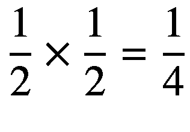

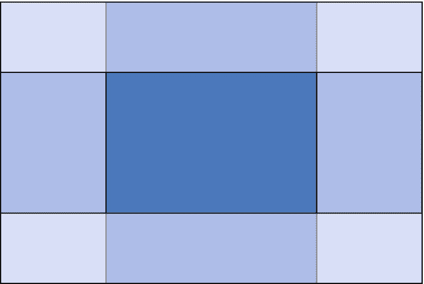

因此：

```
fun centerPixelCount() : Int {
return columns * rows / 4
}
```

测试为：

```
@Test
fun centerPixelCountTest() {
val regions = Regions(40, 60)
Assert.assertEquals(600, regions.centerPixelCount())
}
```

# 21. 读取限速标志

在本章中，我们将整合前几章的代码，完成我们的标志读取软件。起点是第 20 章代码的增强版本。该版本可从 [`https://github.com/Apress/learn-to-program-w-kotlin-ch21.git`](https://github.com/Apress/learn-to-program-w-kotlin-ch21.git) 下载。新的代码库比上一章结束时更完整：

*   `Regions` 和 `PictureSummary` 包含了用于确定图像其他部分（例如顶部四分之一区域）像素密度的代码。
*   `DigitReader.kt` 中的 `read` 函数现在能正确识别所有数字。
*   为新函数提供了测试。
*   `Picture` 中的切片函数已重构，以消除代码重复。


## 21.1 SpeedReader

除了前面列出的更改外，还新增了一个名为 `SpeedReader` 的类及其测试。该测试包含对测试数据目录中每个限速标志图像的检查。以下是代码，省略了 `package` 和 `import` 语句：

```
val SPEED_SIGNS ="src/test/resources/images/signs/"
classSpeedReaderTest {
@Test
fun readTest() {
Assert.assertEquals(5, reader("5.png").speed())
Assert.assertEquals(10, reader("10.png").speed())
Assert.assertEquals(20, reader("20.png").speed())
Assert.assertEquals(40, reader("40.png").speed())
Assert.assertEquals(60, reader("60.png").speed())
Assert.assertEquals(70, reader("70.png").speed())
Assert.assertEquals(80, reader("80.png").speed())
Assert.assertEquals(90, reader("90.png").speed())
Assert.assertEquals(130, reader("130.png").speed())
}
fun reader(name: String): SpeedReader {
val file = Paths.get(SPEED_SIGNS +"/"+ name).toFile()
returnSpeedReader(file)
}
}
```

这段代码中名为 `reader` 的函数接收一个限速标志文件名，从中创建一个 `File` 对象，然后将其用作创建 `SpeedReader` 的参数。测试函数中的断言检查 `SpeedReader` 返回的数字是否正确。

`SpeedReader` 类仅部分实现：

```
classSpeedReader(signImageFile : File) {
val digits = mutableListOf()
init {
}
fun speed() :Int {
return-1
}
}
```

名为 `digits` 的 `val` 是一个 `Int` 类型的 `List`。该列表的元素将是传入构造函数的限速标志图像文件中读取的各个数字。这需要在 `init` 块中完成，而该块尚未编写。另一项待完成的工作是编写 `speed` 函数，该函数将把数字列表转换为一个 `Int`。

## 21.2 十进制数

我们首先来处理 `speed` 的实现。`digits` 变量包含一个 `Int` 类型的 `List`。我们如何将它们转换为一个数字？如果列表中的数字是 `a`、`b` 和 `c`，那么它们所代表的数字就是十进制展开式：

*a* × 100 + *b* × 10 + *c* × 1

列表中可能只有一两个数字，因此我们的转换代码会相当复杂。为了能够测试代码，我们将其放入一个辅助函数中，该函数接收任意 `Int` 类型的 `List` 并将其转换为一个数字。

项目步骤 21.1

将以下函数添加到 `SpeedReader.kt` 文件中。该函数应放在 `class SpeedReader....` 这一行之前。

```
fun convertDigits(digits: List) : Int {
return-1
}
```

然后将 `speed` 的实现更改为：

```
fun speed(): Int {
return convertDigits(digits)
}
```

项目步骤 21.2

将以下测试函数添加到 `SpeedReaderTest` 中：

```
@Test
fun convertDigitsTest() {
val list1 = mutableListOf(1)
Assert.assertEquals(1, convertDigits(list1))
val list45 = mutableListOf(4,5)
Assert.assertEquals(45, convertDigits(list45))
val list150 = mutableListOf(1, 5, 0)
Assert.assertEquals(150, convertDigits(list150))
}
```

粘贴代码后，IntelliJ 应会显示导入 `convertDigits` 函数的建议，如图 21-1 所示。按照建议，同时按下 `Alt` 和 `Enter` 键。然后你应该会看到以下行：

```
import lpk.imaging.convertDigits
```

被添加到其他 `import` 语句中。

确认此测试失败。

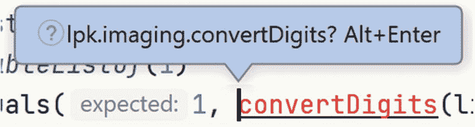

图 21-1

IntelliJ 提供导入新函数的选项

实现 `convertDigits` 的一种方法如下：

*   设置一个名为 `total` 的累加变量。
*   设置一个名为 `multiplier` 的 `var`，它将始终是 10 的幂。
*   反向遍历列表，在每一步中：
    *   将当前数字乘以 `multiplier`。
    *   将结果加到 `total` 上。
    *   将 `multiplier` 扩大十倍，为下一个数字做准备。

项目步骤 21.3

看看你是否能实现上述算法。

我们在这里所做的重构——将关键逻辑实现为一个易于测试的“辅助”函数——在软件工程中非常常见。

## 21.3 整合所有内容

剩下的工作就是填充 `init` 块。这比数字转换容易得多。代码需要将图像文件转换为数字，并将这些数字添加到 `digits` 字段中。以下是实现方法：

*   从 `File` 创建一个 `Picture`。
*   从 `Picture` 创建一个 `DigitFinder`。
*   从 `DigitFinder` 获取一个数字图像列表。
*   对于每个数字图像：
    *   创建一个 `PictureSummary`。
    *   将 `PictureSummary` 传递给 `read` 函数，以获取一个 `Int`。
    *   将该 `Int` 添加到 `digits` 中。

项目步骤 21.4

在 `SpeedReader` 的 `init` 块中实现上述算法。确认 `SpeedReader` 的所有测试均通过。

至此，项目完成——测试证明我们的软件能够成功读取限速标志。这是一项了不起的成就。干得好！

你可能想知道“工业级”图像识别软件是如何编写的。其大部分代码与我们实现的代码基本相同。主要区别之一在于，我们的 `read` 函数（具有精心选择的阈值和特定的数字选择顺序）被稳健的统计模型所取代，这些模型是通过分析数千张图像的过程（称为“机器学习”）构建的。

## 21.4 总结

通过阅读本书，尤其是完成挑战和项目步骤，你将学到进行严肃编程所需的基本技能：

*   使用面向对象软件对现实世界进行建模
*   单元测试
*   函数式编程
*   代码重构

此外，你还将获得使用 Git 和 IntelliJ 等专业工具的经验。最后，你已学习了优美语言 Kotlin 的基本语法。祝你未来的编程之旅一切顺利！

## 21.5 项目步骤

### 21.5.1 项目步骤 21.1 的详细信息

`SpeedReader.kt` 的新版本如下：

```
packagelpk.imaging
importjava.io.File
fun convert(digits: List): Int {
return-1
}
classSpeedReader(signImageFile: File) {
val digits = mutableListOf()
init {
}
fun speed(): Int {
returnconvert(digits)
}
}
```

### 21.5.2 项目步骤 21.3 的详细信息

以下是实现代码：

```
fun convertDigits(digits: List): Int {
var total = 0
var multiplier = 1
val n = digits.size
for(i in 0..n - 1) {
val digit = digits[n - i - 1]
total = total + digit * multiplier
multiplier = multiplier * 10
}
return total
}
```


### 21.5.3 项目步骤 21.4 的细节

以下是所有组件如何协同工作来读取标志的：

```
init {
val sign = loadPictureFromFile(signImageFile)
val digitImages = DigitFinder(sign).digits()
digitImages.forEach {
digitImage ->
val pictureSummary = PictureSummary(digitImage)
val digit = read(pictureSummary)
digits.add(digit)
}
}
```

索引 符号 && !! ?: * > < / % + ++ - != == $ A 加法 变位词 与运算符 注解 参数 数组 arrayOf B 布尔值 C 字符 构造函数 数据 字段 初始化 实例变量 列 循环 逗号分隔变量格式 构造函数 D 数据类型 除法 E 边界情况 艾维斯运算符 等于 F 字段 文件系统 读取 写入 过滤 for 循环 函数 函数式编程 G, H 绿幕 I 行/列 if-else-if 语句 图像 裁剪 缩放 阈值化 import 语句 继承 init 初始化块 内联 实例变量 J Java 开发工具包 K Kotlin REPL L Lambda 表达式 列表 过滤 第一个 循环 嵌套 M 映射 键 键集 值 乘法 N 嵌套循环 非空断言运算符 不等于运算符 空值 O 面向对象编程 可选参数 或运算符 P, Q 回文 参数 可选 路径 绝对 相对 排列 编程语言 R 范围 读取-求值-输出循环 递归 递归数据结构 重构 树的根 S 作用域 集合 词干提取 字符串 构建 分隔符 空 转义 迭代 插值 + 子串 减法 T @Test 此函数 阈值化 树 类型推断 类型参数 U 单元测试 V val var W, X, Y, Z while 循环
