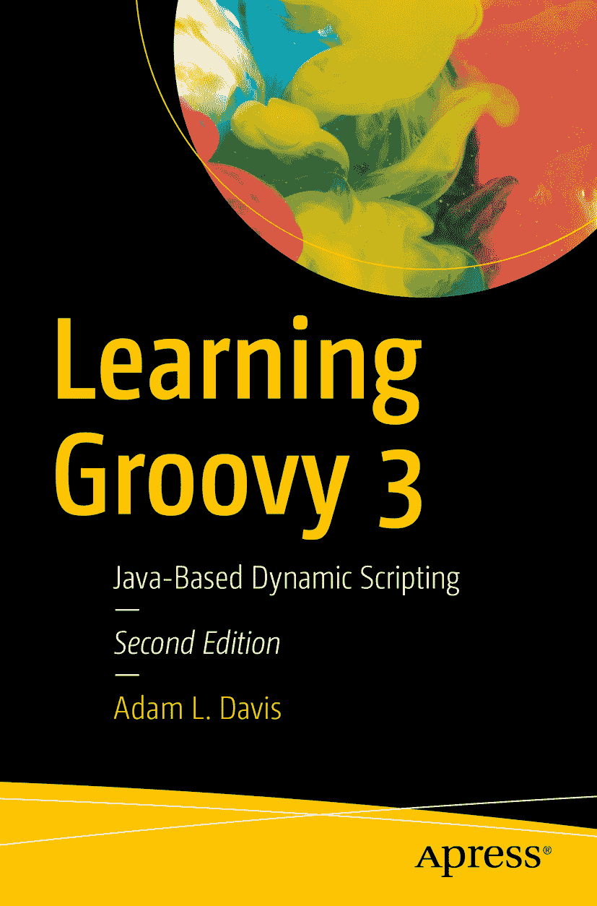

ISBN 978-1-4842-5057-0 e-ISBN 978-1-4842-5058-7 [`doi.org/10.1007/978-1-4842-5058-7`](https://doi.org/10.1007/978-1-4842-5058-7) © Adam L. Davis 2019 本作品受版权保护。出版商保留所有权利，无论是涉及材料的全部或部分，特别是翻译、重印、重用插图、朗诵、广播、以缩微胶卷或任何其他物理方式复制，以及传输或信息存储与检索、电子改编、计算机软件，或通过目前已知或今后开发的类似或不同方法进行使用的权利。本书中可能出现商标名称、标识和图像。我们仅在编辑风格中使用商标名称、标识和图像，以利于商标所有者，并无意侵犯商标权，而非在每次出现商标名称、标识或图像时都使用商标符号。本出版物中对商品名称、商标、服务标志及类似术语的使用，即使未明确标识，也不应被视为对其是否受专有权利保护的表达意见。尽管本书中的建议和信息在出版时被认为是真实准确的，但作者、编辑和出版商均不对可能存在的任何错误或遗漏承担法律责任。出版商对本书所含材料不作任何明示或暗示的保证。本书通过 Springer Science+Business Media New York 在全球图书贸易中发行，地址：233 Spring Street, 6th Floor, New York, NY 10013。电话：1-800-SPRINGER，传真：(201) 348-4505，电子邮件：orders-ny@springer-sbm.com，或访问 www.springeronline.com。Apress Media, LLC 是一家加利福尼亚有限责任公司，其唯一成员（所有者）是 Springer Science + Business Media Finance Inc (SSBM Finance Inc)。SSBM Finance Inc 是一家特拉华州公司。

*致我的父母，无论大小，我的一切都归功于你们。*

*致我的孩子们，你们是我的整个世界。*

*致我的妻子，感谢你对我的包容和支持。*

关于本书

本书按章节组织，从最基本的概念开始。如果你已经理解某个概念，可以放心地进入下一章。虽然本书主要关注 Groovy，但也涉及其他语言，例如 Java、Scala 和 JavaScript。

正如书名所示，本书旨在学习 Groovy，但也会涵盖相关技术，例如构建工具和 Web 框架。

## 前提假设

本书假设读者已经熟悉 Java 语法和基本的编程思想。

## 图标

###  提示

如果你看到这样样式的文本，它是你可能觉得有用的额外信息。

###  信息

这样样式的文本通常是为好奇的读者提供的额外信息参考。

###  警告

这样的文本是对谨慎读者的提醒——许多人在计算机编程的道路上跌倒过。

###  练习

这是一个练习。我们通过实践来学习。强烈建议完成这些练习。

致谢

感谢以下人士，没有他们，本书不可能完成：我的妻子，感谢她容忍我再次投入另一本书的写作；我的编辑们，感谢他们所有必要的编辑工作；以及我的技术审阅者 Manual Jordan Elera，感谢他为确保本书内容准确无误所做的至关重要的工作。感谢所有 Groovy 及本书中提及的相关项目的开发者：Paul King、Cédric Champeau、Daniel Sun 以及 Groovy 团队的其他成员；Spock 的创建者 Peter Niederwieser；Luke Daley 以及 Ratpack 的其他贡献者；Adam Murdoch 以及 Gradle 的其他开发者；Graeme Rocher 以及 Grails 和 Micronaut 团队的其他成员；以及任何我遗漏的人。没有这些出色的工具和框架（以及社区的开放、乐于助人和友好），编程将远没有那么令人愉快。

### 关于作者和技术审阅者

### 关于作者

### 关于技术审阅者

