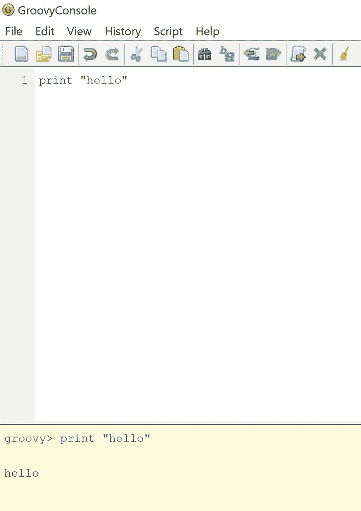

# 1. 需要安装的软件

在开始编程之前，你需要安装一些基本工具。

## Java/Groovy

对于 Java 和 Groovy，你需要安装以下软件：

*   JDK（Java 开发工具包），例如 JDK 11

*   IDE（集成开发环境），例如 IntelliJ IDEA 或 NetBeans

*   Groovy

###  安装 Java 和 IDE

下载并安装 Java JDK 11^(¹) 和 IntelliJ IDEA。^(²)

###  安装 Groovy

前往安装 Groovy^(³) 3。

你可以从 [`https://groovy-lang.org`](https://groovy-lang.org) 下载 Groovy 并进行安装。如果你手动安装，可能需要将 `JAVA_HOME` 环境变量设置为你的 Java 安装位置，并将 `GROOVY_HOME` 设置为你的 Groovy 安装位置。

为了更轻松，你可以选择使用 SDKMAN，在命令行中通过 “sdk install java” 和 “sdk install groovy” 来安装 Java 和 Groovy。请访问 sdkman.io 进行下载。

### 尝试一下

安装 Groovy 后，你应该用它来尝试编码。打开命令提示符，输入 `groovyConsole` 并按回车键开始。

 在 Groovy 控制台中，输入以下内容，然后按 Ctrl+R 运行代码，按 Ctrl+W 清除输出：

`1   print "hello"`

你应该保持 Groovy 控制台打开，并用它来尝试本书中的所有示例。

## 其他软件

安装完上述软件后，你可能还应该安装以下软件：

*   SDKMAN^(⁴)——软件开发工具包管理器

*   Git^(⁵)——一个版本控制程序

*   Gradle^(⁶)——构建工具

*   Grails^(⁷)——单体式 Web 框架

如果你有兴趣，就去安装这些吧——我会等你。

## GitHub 上的代码

本书中的大量代码可在 [`https`:`//github.com/adamldavis/learning-groovy`](https://github.com/adamldavis/learning-groovy) 获取。^(⁸) 你可以随时前往该地址，配合本书进行学习。

脚注 1   2   3   4   5   6   7   8

