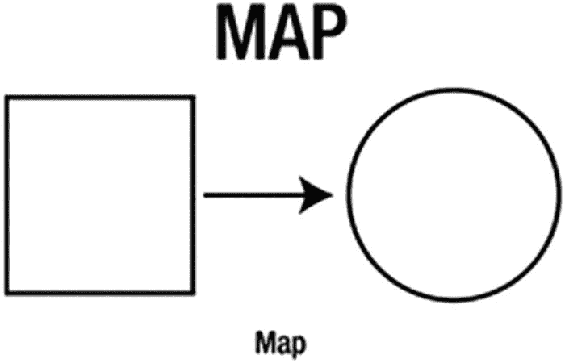
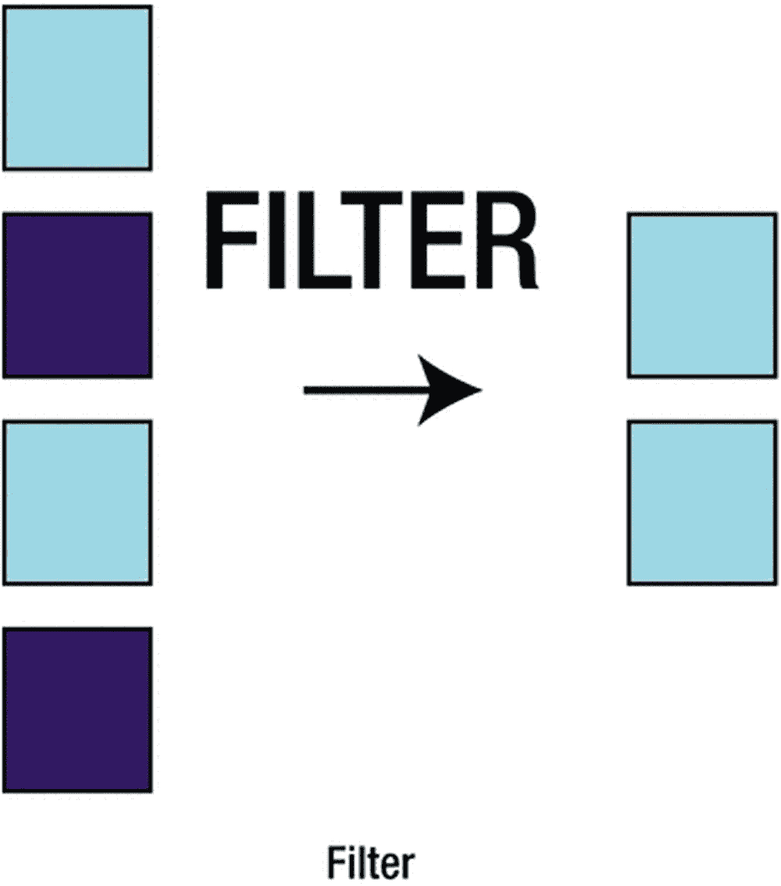
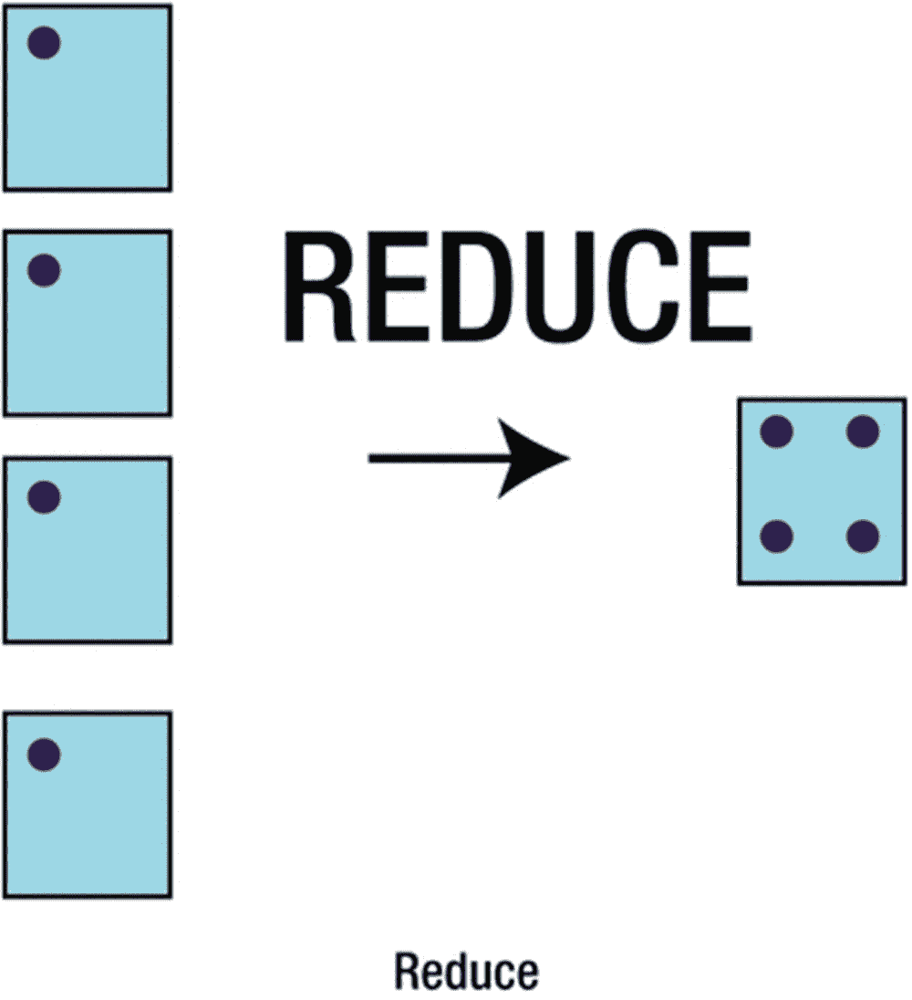
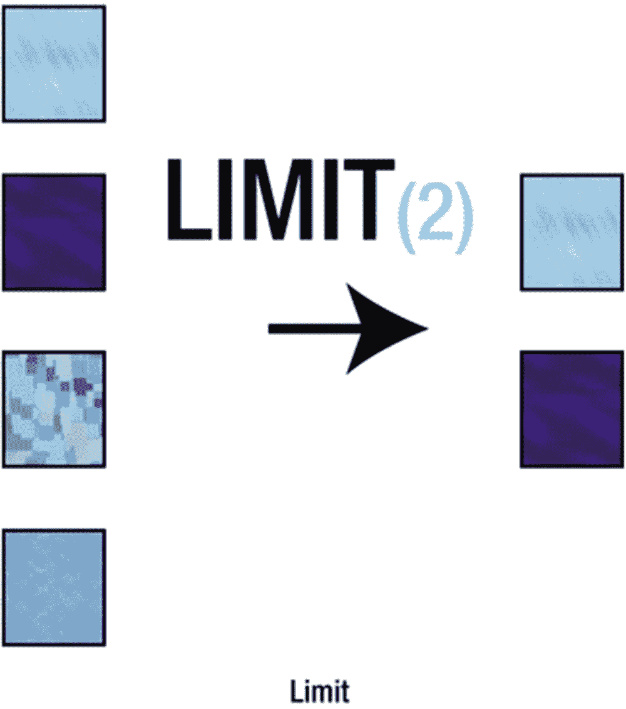
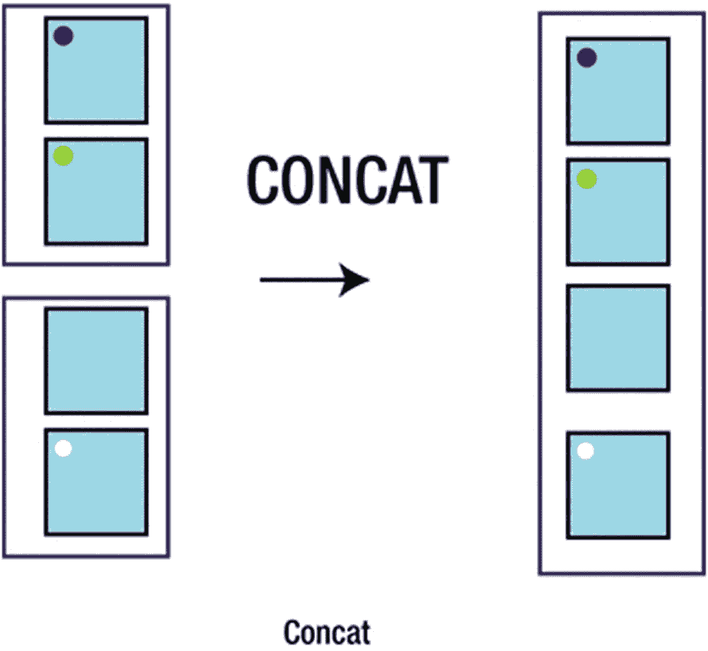

# 9. 函数式编程

*函数式编程*（FP）是一种专注于函数并最小化状态变化（使用不可变数据结构）的编程风格。它更接近于用数学方式表达解决方案，而非逐步指令。

在 FP 中，函数应当是“无副作用的”（函数外部没有任何改变），并且是*引用透明的*（给定相同参数时，函数每次都返回相同值）。

FP 可被视为更常见的*命令式编程*的替代方案，后者更接近于告诉计算机要执行的步骤。

尽管在 Java 8 之前也能实现函数式编程，^(¹⁸) 但 Java 8 通过 lambda 表达式和*函数式接口*提供了语言层面的 FP 支持。

Java 8、JavaScript、Groovy 和 Scala 都支持函数式编程风格，尽管它们并非严格的 FP 语言。

## 函数与闭包

你可能知道，“函数作为一等特性”是函数式编程的基础。*一等特性*意味着函数可以在任何值能使用的地方使用。

例如，在 JavaScript 中，你可以将函数赋值给一个变量并调用它：

```
1   var func = function(x) { return x + 1; }
2   var three = func(2); //3
```

虽然 Groovy 没有一等函数，但它有非常相似的东西：闭包。正如你所学的，闭包就是用花括号包裹的代码块，参数定义在 `->`（箭头）左侧。例如：

```
1   def  closr = {x -> x + 1}
2   println( closr(2) ); //3
```

如果闭包只有一个参数，在 Groovy 中可以用 `it` 来引用它。例如：

```
1   def  closr = {it + 1}
```

### 提示

在 Groovy 中，如果返回值是最后一个表达式，则可以省略 `return` 关键字。

### 使用闭包

如前所述，当闭包是方法的最后一个参数时，它可以放在括号外面；如果它是唯一参数，则可以完全省略括号。例如，下面定义了一个方法，它接受一个列表和一个用于过滤元素的闭包：

```
1   def  find(list, tester) {
2       for (item in list)
3           if (tester(item)) return item
4   }
```

该方法返回列表中第一个使闭包返回 true 的元素。以下是一个使用简单闭包调用该方法的示例：

```
1   find([1,2]) { it > 1 }
```

## Map/Filter 等操作

一旦掌握了函数，你很快就会意识到需要对数据集合（或序列、流）执行操作。

由于这些是常见操作，人们发明了*序列操作*，例如 `map`、`filter`、`reduce` 等。

在本节中，我们将使用一个 `Person` 对象列表来进行所有操作（见图 9-1 至 9-5），定义如下：



图 9-1

Map（collect）：将输入元素转换或改变为其他内容

```
class Person {
String name
int age
String toString() { name }
}
def persons = [new Person(name:'Bob',age:20),
new Person(name:'Tom',age:15)]
```



图 9-2

Filter（findAll）：返回元素的子集（即某个谓词函数返回 true 的元素）

```
1   def names = persons.collect { person -> person.name }
// 结果: ['Bob', 'Tom']
```



图 9-3

Reduce（inject）：对元素执行归约操作（返回一个结果，例如总和）

```
1   def adults = persons.findAll { person -> person.age >= 18 }
// 结果: [Bob]
```

```
1   def totalAge = persons.inject(0) {total, p -> return total+p.age } //结果: 35
```

为此，我们使用 `inject` 方法，它会遍历值并返回单个值（相当于 Scala 中的 `foldRight`）。`startValue`（此处为 0）是赋给 `total` 的初始值。对于列表中的每个元素，我们加上该人的年龄。



图 9-4

Limit（[0..n-1]）：只返回前 N 个元素



图 9-5

Concat（+）：将两个不同的元素集合合并

```
1   def a = [3,2,1]
2   def  firstTwo = a[0..1] // 结果: [3,2]
```

```
1   def a = [1,2,3]
2   def b = [4,5]
3   a+b
4   // 结果: [1, 2, 3, 4, 5]
```


## 不可变性

不可变性与函数式编程就像花生酱和果冻一样相得益彰。虽然并非必需，但它们确实配合得天衣无缝。

在纯函数式语言中，其核心理念是每个函数在自身之外不产生任何影响——即没有副作用。这意味着每次调用函数时，只要输入相同，它就会返回相同的值。

为了适应这种行为，就有了*不可变*的数据结构。不可变数据结构无法被直接修改，而是每次操作都返回一个新的数据结构。

例如，Scala 默认的 `Map` 就是不可变的：

```
1   val map =  Map("Smaug" -> "deadly")
2   val  map2 =  map + ("Norbert" -> "cute")
3   println(map2) // Map(Smaug -> deadly, Norbert -> cute)
```

因此在这段代码中，`map` 将保持不变。

每种语言都有用于定义不可变变量（值）的关键字。Java 使用 `final` 关键字来声明不可变变量，Groovy 也遵循这一规则。

```
1   public class Centaur {
2       final String name
3       public  Centaur(name) {this.name=name}
4   }
5   Centaur c = new  Centaur("Bane");
6   println(c.name) // Bane
7   c.name = "Firenze" //groovy.lang.ReadOnlyPropertyException...
```

除了 `final` 关键字，Groovy 还包含 `@Immutable annotation`^(¹⁹) 用于声明整个类为不可变。它还会添加一个默认构造函数（与 `@TupleConstructor` 相同，后者会添加一个用于初始化每个字段的参数）、`hashCode`、`equals` 和 `toString` 方法。例如（在 Groovy 中）：

```
1   import groovy.transform.Immutable
2   @Immutable
3   public class Dragon  {
4       String name
5       int scales
6   }
7   Dragon smaug = new  Dragon('Smaug', 499)
8   println smaug
9   // 输出: Dragon(Smaug, 499)
```

这对于简单的引用和基本类型（如数字和字符串）有效，但对于列表和映射等类型，情况则更为复杂。针对这些情况，已经开发了开源不可变库——例如，用于 Java 和 Groovy 的 Guava^(²⁰)。要使用现有的不可变类，你可以通过 `knownImmutableClasses` 属性来设置它们。例如（在将 Guava 添加到 Gradle 构建依赖项后，使用 `compile "com.google.guava:guava:27.0-jre"` 或类似方式），请参见以下内容：

```
1  import com.google.common.collect.ImmutableList
2  import groovy.transform.CompileStatic
3  import groovy.transform.Immutable
4  /** Groovy Guava List: 内部包含 ImmutableList。 */
5  @Immutable(knownImmutableClasses = [ImmutableList])
6  @CompileStatic
7  class GroovyGuavaList {
8      final ImmutableList list
9  }
```

### 练习

运用前几章学到的技能，创建你自己的 `GroovyGuavaList` 类，该类重写运算符并以 Guava 的 `ImmutableList` 作为后端支持。然后使用 Category 或 Extension 模块向 `java.util.List` 添加一个名为 `toGList()` 的方法，该方法将列表转换为 `GroovyGuavaList`。

## Groovy 流畅 GDK

在 Groovy 中，`findAll` 和其他方法可用于每个对象，但它们对于列表、集合和范围尤其有用。除了 `findAll`、`collect` 和 `inject` 之外，Groovy 中还使用了以下方法名：

*   `each`——使用给定的闭包遍历值
*   `eachWithIndex`——使用两个参数进行遍历：一个值和索引
*   `find`——查找第一个匹配闭包的元素
*   `findIndexOf`——查找第一个匹配闭包的元素并返回其索引

例如，`collect` 使得对值列表执行操作并将结果收集到新列表中变得非常简单：

```
1   def  list = ['foo','bar']
2   def newList = []
3   list.collect( newList ) { it.substring(1) }
4   println newList //  [oo, ar]
```

再举一个例子，假设 `dragons` 是使用之前定义的龙对象列表：

```
1   def dragons = [new Dragon('Smaug', 499), new Dragon('Norbert', 488)]
2   String longestName = dragons.
3       findAll { it.name != null }.
4       collect { it.name }.
5       inject("") { n1, n2 -> n1.length() > n2.length() ? n1 : n2 }
```

结果应该是 `Norbert`。这段代码查找所有非空的名称，收集这些名称，然后将名称列表缩减为最长的那个。

### 提示

请记住，Groovy 中的 **it** 可用于引用闭包的单个参数。

### 练习

以上述代码为起点，找出鳞片最多的龙。

## Groovy 柯里化

`curry` 方法允许你为闭包的参数预定义值。它可以接受任意数量的参数，并按预期从左到右替换参数。例如，给定一个 `concat` 闭包，你可以轻松地创建一个 `burn` 闭包和一个 `inate` 闭包，如下所示：

```
1   def  concat = { x, y -> return  x + y }
2   // 闭包
3   def  burn = concat.curry("burn")
4   def inate = concat.curry("inate")
```

由于你只提供了第一个参数，这些闭包会前置它们给定的文本：`burn` 前置 `"burn"`，`inate` 前置 `"inate"`。例如：

```
1   burn(" wood") // == burn wood
```

然后你可以使用另一个名为 `composition` 的闭包将这两个函数应用于一个输入。

```
1   def composition = { f, g, x -> return f(g(x)) }
2   def burninate = composition.curry(burn, inate)
3   def  trogdor = burninate(' all the people')
4   println "Trogdor: ${trogdor}"
5   // Trogdor: burninate all the people
```

函数组合是函数式编程中的一个重要概念。它允许你将函数组合在一起，用简单的构建块创建复杂的算法。

## 方法句柄

方法句柄允许你引用实际方法，就像它们是闭包一样。它们类似于 Java 方法引用，不同之处在于它们提供了闭包固有的额外功能，例如前面描述的 `curry` 方法。当你想要使用现有方法而不是闭包，或者只是想要一种闭包的替代语法时，这非常有用。例如，给定一个方法：

```
1   def breathFire(name) { println "Burninating $name!" }
```

稍后你可以执行以下操作，使用指向该方法的句柄（在定义了 `breathFire` 的同一个类中）：

```
1   ['the country side', 'all the people'].each(this.&breathFire)
```

这会将 `breathFire` 方法作为闭包传递给 `each` 方法，从而打印出以下内容：

```
1   Burninating the country side!
2   Burninating all the people!
```

### 练习

创建一个具有多个参数的方法，并尝试使用方法句柄调用它。它是否按预期工作？


## 尾递归

在 Groovy 1.8 中，为闭包引入了 `trampoline` 方法以使用尾递归优化。这使得闭包调用可以顺序执行，而不是堆叠起来，从而避免 `StackOverFlowError` 并提升性能。

从 Groovy 2.3 开始，你可以对递归方法使用 `trampoline`，但 `@TailRecursive` AST 转换使用起来更简单。只需用 `@TailRecursive` 注解一个尾递归方法，剩下的工作交给 Groovy 即可。例如：

```
1   import   groovy.transform.*
2   @TailRecursive
3   long  totalPopulation(list, total = 0) {
4     if (list.size() == 0)
5       total
6     else
7       totalPopulation(list.tail(), total + list.first().population)
8   }
```

### 信息

在 Groovy 列表中，`tail` 方法返回移除第一个元素后的列表，而 `first` 仅返回第一个元素。

该方法会接收一个包含 `population` 属性的对象列表，并计算这些属性的总和。例如，我们创建一个 `City` 类，使用一个范围生成多个实例，然后调用 `totalPopulation` 方法：

```
1   @Canonical class City {int population}
2   def cities = (10..1000).collect{new City(it)}
3   totalPopulation(cities)
4   // 500455
```

这展示了如何以函数式风格使用尾递归作为迭代的替代方案。

### 信息

尾递归与不可变性配合良好，因为在尾递归中无需直接修改变量。

## 总结

在本章中，你学习了以下内容：

*   函数作为一等公民，即闭包

*   映射/过滤/归约，即 `collect/findAll/inject`

*   不可变性及其与函数式编程的关系

*   Groovy 中支持函数式编程的各种特性

*   Groovy 中的方法句柄

*   尾递归优化

脚注 1   2   3

