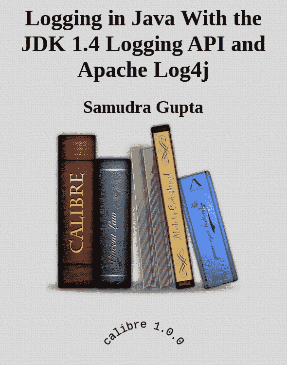
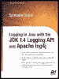

|  |  |  

| 使用 JDK 1.4 日志 API 和 Apache log4j 进行 Java 日志记录 |
| 作者：Samudra Gupta | ISBN:1590590996 |
| Apress 出版社 © 2003 (336 页) |
| 这是一本关于使用 Java 语言开发应用程序所需的日志相关信息和技术的手册。 |
|  |

|
|  |

| 目录 |
|  | <description>使用 JDK 1.4 日志 API 和 Apache log4j 进行 Java 日志记录</description> |
|  | <description>前言</description> |
|  | 第 1 章 | - | <description>应用程序日志简介</description> |
|  | 第 2 章 | - | <description>JDK 1.4 日志 API</description> |
|  | 第 3 章 | - | <description>格式化 JDK 1.4 日志信息</description> |
|  | 第 4 章 | - | <description>扩展日志框架</description> |
|  | 第 5 章 | - | <description>理解 Apache log4j</description> |
|  | 第 6 章 | - | <description>在 log4j 中格式化日志信息</description> |
|  | 第 7 章 | - | <description>使用 log4j 进行高级日志记录</description> |
|  | 第 8 章 | - | <description>扩展 log4j 以创建自定义日志组件</description> |
|  | 第 9 章 | - | <description>使用 Apache 日志标签库</description> |
|  | 第 10 章 | - | <description>最佳实践</description> |
|  | <description>索引</description> |
|  | <description>插图列表</description> |
|  | <description>表格列表</description> |
|  | <description>代码清单列表</description> |

封底

| *《使用 JDK 1.4 日志 API 和 Apache log4j 进行 Java 日志记录》* 是第一本讨论两大主流日志 API 的书籍：面向应用程序开发人员的 JDK 1.4.0 日志 API 和 Apache log4j 1.2.6 日志 API。本书对每个 API 的内部机制进行了详尽、深入的考察、对比和比较。程序员将在此找到在其他地方（甚至互联网上）都无法获得的丰富信息。每个解释的概念都附有 Java 语言编写的代码示例。本书还提供了扩展现有日志框架以满足特定应用程序需求的指南。这是一本关于使用 Java 语言开发应用程序所需的日志相关信息和技术的必备手册。**关于作者** Samudra Gupta 拥有印度全印管理协会的信息技术与管理研究生学位，并在设计和开发从研究项目到电子商务应用程序的基于 Web 的应用程序方面拥有超过 6 年的经验。他的职业生涯始于印度坎普尔印度理工学院的研究工程师，目前在英国担任独立 Java 顾问，负责架构和开发多个基于电子商务的应用程序、内容管理系统软件和基于零售的软件。Samudra 还为 *JavaWorld* 和 *Java Developer's Journal* 撰稿。 |

