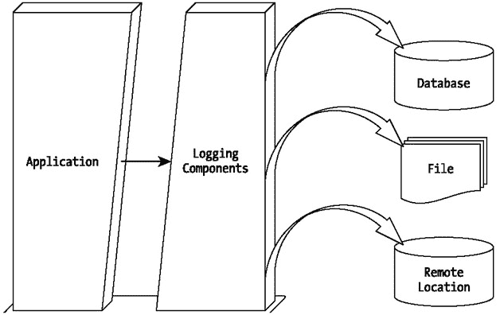

# 第 1 章：应用程序日志记录简介

## 概述

想象一下，夜深人静时你还在忙着调试应用程序。更糟的是——你正在调试别人的代码！你对系统出了什么问题毫无头绪。你不确定问题出在哪里。你找不到任何错误踪迹。你不知道该怎么办，但你知道接下来会发生什么——愤怒的经理、焦虑的客户，而要在毫无运行踪迹的情况下调试一段代码仍需耗费时间。

问题出在哪里？众所周知，没有软件是完全没有错误的。因此，我们需要假设应用程序模块可能会时不时出现故障，并且需要某种机制来追踪问题所在。这正是应用程序日志记录的作用。任何商业应用程序都需要日志记录能力。在没有日志踪迹的情况下调试应用程序既耗时又成本高昂。间接地，难以调试的应用程序会失去其市场价值。事实上，良好控制的应用程序日志记录具有多层次的影响。它能提高所生成代码的质量，增强应用程序的可维护性，而这一切都意味着产品能获得更大的市场。

在本章中，我们将了解什么是应用程序日志记录及其好处，并探讨几种可用的基于 Java 语言的日志 API。我们将从日志记录更详细的定义及其价值开始。

## 什么是日志记录？

任何应用程序中的日志记录通常意味着某种在运行时指示系统状态的方式。然而，我们在开发过程中都会使用日志记录来调试和测试模块。在开发阶段进行的日志记录活动在部署阶段通常没有价值，通常我们在成功测试模块后会移除这些日志踪迹。在部署阶段应作为应用程序一部分的日志记录活动则需要更多的思考和关注。我们几乎总是希望生成信息丰富且有效，但投入最少的日志记录。

考虑到所有这些要点，让我们以如下方式定义应用程序日志记录：

> 日志记录是一种以人类可读方式表示应用程序状态的系统化、受控的方式。

关于日志记录需要注意的一个重要点是，它并不等同于应用程序中的调试踪迹。日志信息可能提供的远不止单纯的调试信息。然而，其有用性完全取决于我们如何在应用程序中应用日志记录。日志信息在分析应用程序性能方面可能具有巨大价值。此外，我们可以将应用程序的内部状态打包到日志信息中，并以结构化方式存储这些信息，以便将来重用。

日志记录的这个定义强调了以下重要几点：

*   它是系统化的。
*   它是受控的。
*   它表示应用程序的状态。

在接下来的章节中，我们将逐一审视这些特性。

### 日志记录是系统化的

日志记录应该是一种系统化的方法，而不是随意生成信息的方式。很多时候，我们需要为日志记录活动定义一种策略。我们需要事先决定记录哪些信息，但这些决策并不总是容易的。我们应该从多个角度审视这个问题。通常，我们需要为应用程序的调试和日常维护生成日志。我们可能还需要为监控系统性能的系统管理员生成详细日志。同样，我们可能需要将日志信息分发到各个远程位置，以方便应用程序的远程管理。问题层出不穷。因此，在开始编写应用程序之前，我们需要制定日志记录策略。

### 日志记录是受控的

记录我们所需信息的方法只有一种：我们必须在应用程序中编写一些日志记录代码。日志记录代码需要经历与主应用程序代码相同的控制流程。就像每一段应用程序代码一样，日志记录代码可以写得很好，也可以写得很差。请记住，日志记录是为了支持和提高所编写应用程序的质量。因此，日志记录代码的编写方式应使其对系统整体性能的影响最小。

此外，我们需要对日志信息的存储位置和格式进行一些控制。日志信息需要结构化，以便易于阅读，并且将来能以最小的投入进行处理。一个例子是优先使用 XML 格式的日志，而不是纯文本格式。虽然在开发阶段文本格式的日志可能更可取，但当应用程序部署时，XML 格式的可重用性和可移植性要高得多。在其他情况下，我们可能需要将日志信息存储在数据库中，以维护所生成日志的历史记录。

### 日志信息表示应用程序状态

如果在记录什么内容上不够谨慎，生成的日志信息可能毫无用处。为了使日志记录活动最有效，我们应该力求在需要时表示系统的内部状态，并清晰地呈现应用程序处于哪个控制阶段以及正在做什么。如果你能将系统视为由多个执行若干相关且顺序任务的独立组件组成的集合，那么你可能需要在每个任务执行前后记录系统的状态。

## 日志记录的优势

软件开发中的几乎所有项目都遵循严格的时间表。在此背景下，在应用程序中集成日志记录代码需要额外的时间和精力。同样，所有软件项目都旨在成功并产出优质的最终产品。为了满足这些标准，任何应用程序都必须实施某种日志记录方法。在应用程序中集成强大的日志记录功能所带来的好处，使得提前规划这一能力成为一项值得投入的工作。

简而言之，在应用程序中进行日志记录可以带来以下好处：

*   *问题诊断：* 无论我们的代码编写得多么出色，其中都可能隐藏着一些问题。一旦触发条件出现，隐藏的问题就会浮出水面。如果我们的应用程序拥有记录系统内部状态的优秀日志代码，我们将能够精确、快速地检测到问题。

*   *快速调试：* 一旦问题易于诊断，我们就确切地知道如何解决它。日志跟踪应旨在精确显示问题所在位置，这意味着我们能够用更少的时间调试应用程序。通过精心规划和编写的日志代码，应用程序的整体调试成本将大大降低。

*   *易于维护：* 与没有类似日志记录功能的应用程序相比，具有良好日志记录功能的应用程序易于调试，因此也易于维护。日志信息通常包含比调试跟踪更多的信息。

*   *历史记录：* 应用程序中良好的日志记录功能能够将日志信息以结构化方式保存在所需位置。该位置可以是文件、数据库或远程机器。所有这些都使系统管理员能够通过查阅日志历史，在将来某个日期检索日志信息。

*   *节省成本和时间：* 如前所述，编写良好的日志代码提供了快速调试、易于维护以及应用程序运行时信息的结构化存储。这使得安装、日常维护和调试过程在成本和时间上都更加高效。

## 日志记录的缺点

在上一节中，我们讨论了日志记录的好处。实际上，这些好处并非没有代价。一些缺点源于日志记录活动本身，而另一些则可能源于日志记录的不当使用。无论哪种情况，通常任何日志记录过程都可能出现以下缺点：

*   由于生成日志信息以及与发布日志信息相关的设备 I/O，日志记录会增加运行时开销。

*   由于需要额外的代码来生成日志信息，日志记录会增加编程开销。日志记录过程会增加代码量。

*   质量低劣的日志信息可能会造成混淆。

*   编写糟糕的日志代码会严重影响应用程序的性能。

*   最后但同样重要的是，日志记录需要提前规划，因为在开发后期添加日志代码是很困难的。

然而，考虑到所涉及的好处和缺点，日志记录被认为是生产高质量应用程序的基本要素之一。精心规划和编写良好的日志代码通常会消除一些缺陷，而这些缺陷在编程拙劣的日志代码中可能会非常突出。

## 日志记录的工作原理

在前面的章节中，我们讨论了日志记录的过程、好处以及一些缺点。我们都希望编写一个具有精心设计的日志记录功能的应用程序。但问题是如何实现一个有效的日志记录机制。

你可能熟悉最常见的 Java 语法 `System.out.println()`，同样，你可能也知道像 C 语言中著名的 `printf()`。这些函数会生成一条信息并打印到控制台，它们代表了可以嵌入到应用程序中的最原始的日志记录类型。这些语句会以简洁明了的方式生成我们想要的内容。但它们违背了受控日志记录的目的，因为我们无法关闭这些语句中的任何一个。

你可能会想，既然你计划并投入了这么多精力来包含日志记录语句，为什么还需要关闭它们呢？一个复杂的应用程序可能具有复杂的日志记录活动。日志记录的一个目标可能是生成足够多的关于系统内部状态和运行的信息。另一个目标可能是生成足够多的细节，以便在发生故障时能够快速检测和调试问题。在一切顺利的日子里，当应用程序正常运行没有任何问题时，任何出现在日志跟踪中的与调试相关的日志信息都可能妨碍日志信息保持清晰和易于理解。因此，我们需要某种机制来关闭与调试相关的日志跟踪。在不太顺利的日子里，我们可能希望打开与调试相关的日志记录，以确切地查看哪里出了问题。

普通的 `System.out.println()` 风格的日志记录方法无法提供这种灵活性，因为它无法提供一种方式来修改静态日志代码的行为。即使我们接受我们总是想看到我们生成的内容，另一个问题是很难将日志消息按不同的优先级进行分离。当然，与数据库操作问题相关的消息比与方法进入和退出相关的消息更为关键。

本质上，一个健壮的日志记录框架意味着消息应根据其严重性进行分类。此外，我们应该能够切换到任何严重性级别，仅查看该严重性级别的消息。但这种灵活性不应意味着更改源代码。我们需要通过一些配置参数来实现这种灵活性。因此，一个好的日志记录系统需要具有高度可配置性。

同样重要的是，我们应该能够将日志信息重定向到选定的目标，例如数据库、文件等，以便我们可以重用这些信息。基于控制台的日志记录活动非常有限，因为它是易失性的。一个健壮的日志记录框架应在日志记录目标和消息格式方面提供灵活性。

虽然一个好的日志记录 API 会提供一个灵活、健壮且功能丰富的日志记录环境，但它也要求适当且高效地使用所有这些日志记录功能。在本书中，在我们研究了使用 JDK 1.4 日志记录 API 和 Apache log4j 的基本日志记录技术之后，我们将在第 10 章中重点介绍使用这些日志记录 API 的最佳实践。

从架构的角度来看，软件应用程序模块和日志记录组件位于两个独立的层中。应用程序调用日志层中的日志记录组件，并将日志记录责任委托给这些组件。日志记录组件接收日志记录请求，并将日志信息发布到首选目标。图 1-1 展示了软件模块及其日志记录组件的协作关系。

图 1-1：应用程序日志记录过程

如图所示，日志记录组件可以自由地将日志信息发布到任何选定的目标，例如文件、控制台、数据库或远程位置。日志记录组件反过来可以利用任何其他可用技术来实现本地化和分布式日志记录。

## 评估日志记录包

在大型开发过程中，实施恰当的日志记录机制至关重要。无论我们是内部开发日志记录组件，还是使用任何第三方日志记录组件，都需要依据某些标准对其进行评估。简而言之，我们可以将以下标准总结为一个优秀日志记录包的特性：

*   *配置：* 日志记录组件可能支持基于编程和基于文件的配置。后者更好，因为它允许我们避免更改源代码来切换到不同类型的日志记录行为。此外，日志记录包应支持动态配置，而非静态配置。动态配置使我们无需关闭应用程序即可更改日志记录行为。

*   *灵活性：* 日志记录包应在记录什么内容以及记录到何处方面提供灵活性。同时，我们应该能够根据信息的重要程度对日志信息进行优先级排序。我们需要一个支持多个日志记录器和多种消息级别，并且能够将日志消息发布到各种目标的日志记录包。

*   *输出：* 日志信息能够以何种方式输出到首选目标，对于任何日志记录包的成功都至关重要。我们必须仔细考虑日志记录包在输出格式和目标方面的灵活性。

*   *易用性：* 无论日志记录包的设计多么出色，如果它不易使用，那么任何参与或使用该应用程序的人很可能都不会使用它。因此，我们需要从易用性的角度来评估任何日志记录包。

## 流行的基于 Java 的日志记录 API

经验告诉人们应用程序日志记录的重要性，以及如何编写设计良好的日志记录代码。一旦日志记录概念被证明是成功的，它们就被用作通用的日志记录 API。市场上有一些基于 Java 的日志记录 API。其中一些是专有的，一些是开源的。在所有可用的 API 中，以下是在 Java 社区中最流行的。

### JDK 1.4 日志记录 API

JDK 1.4 版本在其 `java.util.logging` 包中拥有自己的日志记录 API。此 API 源于 JSR 47。JDK 1.4 日志记录 API 本质上是 log4j（在下一节中讨论）的精简版本。此 API 中捕获的日志记录概念涉及日志级别以及不同的日志记录目标和格式。JDK 1.4 日志记录 API 非常适合具有简单日志记录需求的简单应用程序。尽管有一些限制，但此 API 提供了生成有效日志信息所需的所有基本功能。第 2 章 到第 4 章 涵盖了 JDK 1.4 日志记录 API。

### Apache log4j

Apache log4j 是来自 Apache 的一个开源日志记录 API。此 API 源自 E.U. SEMPER 项目，是 Java 中流行的日志记录包。它允许对日志语句的粒度进行出色的控制。此 API 的一个主要优点是它可以在运行时通过外部配置文件进行高度配置。它根据不同的优先级级别来看待日志记录过程，并提供将日志信息定向到各种目标的机制，例如数据库、文件、控制台、Windows NT 事件日志、UNIX Syslog、Java 消息服务 (JMS) 等。它还允许应用程序开发人员从各种格式化样式中进行选择，例如 XML、HTML 等。

总的来说，log4j 是一个功能丰富、设计良好、可扩展的日志记录框架，并且提供了比 JDK 1.4 日志记录 API 更多的功能。例如，log4j 的配置比 JDK 1.4 日志记录 API 灵活得多。JDK 1.4 日志记录 API 只能通过属性样式的配置文件进行配置，但 log4j 同时支持属性和 XML 样式的配置。

在本书中，第 5 章 到第 9 章 专门讨论 log4j。

### Commons Logging API

Commons Logging API 是 Apache 的另一个日志记录成果。此 API 的目标是提供从一个日志记录 API 到另一个的无缝过渡。根据类路径中是否存在日志记录框架，Commons Logging API 将尝试使用可用的 API 来执行应用程序日志记录。Commons Logging API 运行自己的发现过程来找出类路径中可用的日志记录 API。它倾向于提供任意两个日志记录 API 的最小公分母。例如，在 log4j 和 JDK 1.4 日志记录 API 之间，它将为两者共有的功能提供无缝过渡——因此我们会错过 log4j 中使用的任何额外功能。

在操作方面，Commons Logging API 为日志记录 API 中的所有对象创建一个包装器。自动发现和包装器生成是重量级的过程，往往会降低整体性能。这是一个更复杂的日志记录框架，因为此 API 试图结合多个日志记录 API 的功能。实际上，它提供了在不更改源代码的情况下在不同日志记录 API 之间切换的灵活性。但在使用它之前，请确定您是否需要这种灵活性来换取因 Commons Logging API 的重量级特性而增加的复杂性和性能下降。

Commons Logging API 是为日志记录提供通用接口的一项伟大努力，因为它使应用程序能够切换到不同的日志记录 API，而无需更改应用程序代码。一旦您理解并领会了 JDK 1.4 日志记录 API 和 Apache log4j 所采用的方法，就很容易理解 Commons Logging API 背后的理念。因此，本书将不再进一步讨论 Commons Logging API。

## 未来之路

有了这些介绍，我们现在将看到上一节中提到的两个日志记录 API，即 JDK 1.4 日志记录 API 和 Apache log4j，如何为基于 Java 的应用程序实现一个健壮的日志记录框架。本书将分别讨论这两个不同的日志记录 API。Apache log4j 的演进速度比本书章节的编写速度要快，因此我们将重点介绍 log4j 的 1.2.6 版本。后续版本将具有相同的基础，因此本书可以作为使用它们的一个良好起点。读完本书后，您将能够自行比较并决定在下一个项目中使用哪个日志记录 API。

