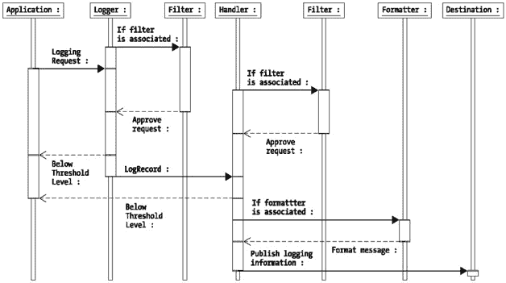
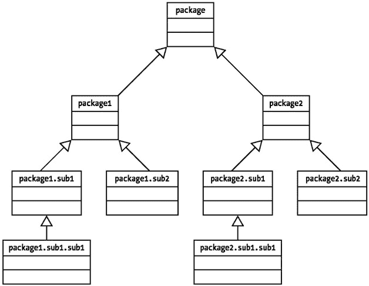
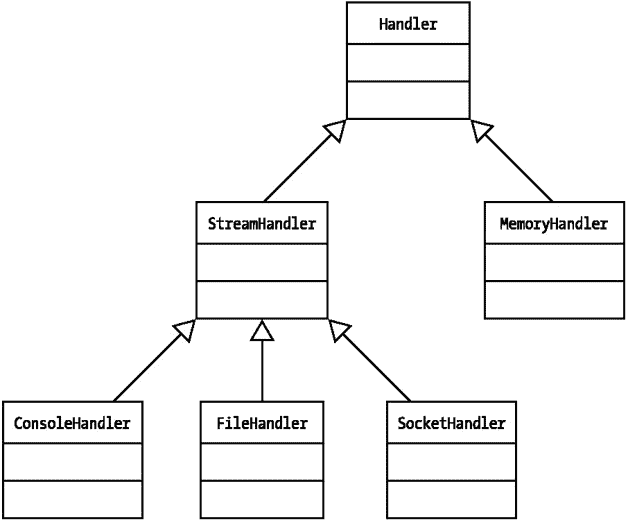
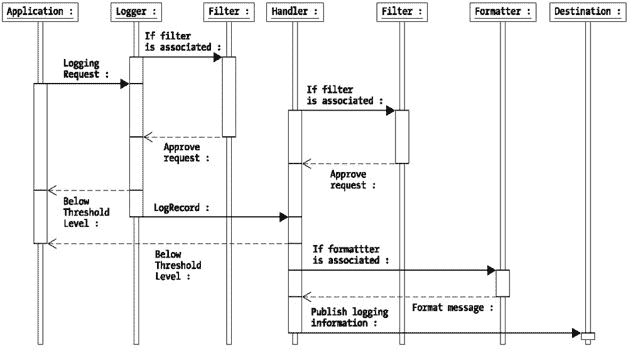
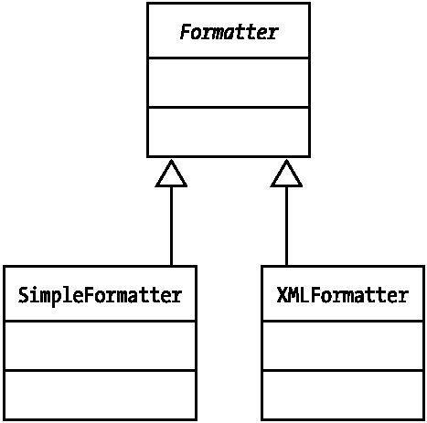
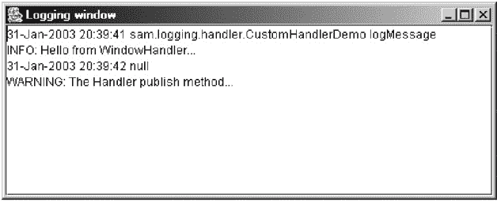
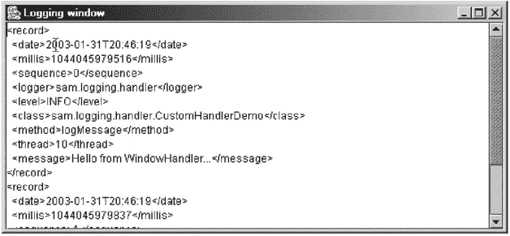
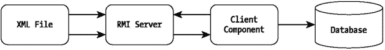
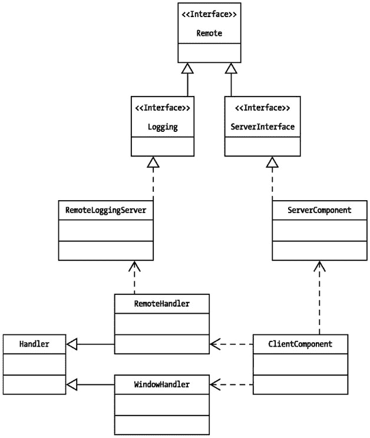

# 第 2 章：JDK 1.4 日志记录 API

## 要点

JDK 1.4 版本的 `java.util.logging` 包中包含的日志记录 API 提供了一种从应用程序内部管理日志信息的全面方法。此 API 为我们提供了不同级别和样式的日志记录，这对于调试和审计任何应用程序都至关重要。JDK 1.4 日志记录机制的概念围绕不同的日志级别、可配置的日志参数、为各种目标生成日志信息的灵活性以及日志消息对不同格式化样式的适应性。

JDK 1.4 日志记录 API 高度可配置的架构提供了一些巨大的好处，例如能够根据项目的不同阶段打开和关闭日志记录活动。这使得发布后的软件可以轻松配置以生成详细的日志消息，从而使调试应用程序更快、成本更低。此外，可以利用此日志记录 API 的灵活性根据需要改变日志消息的详细程度。

在本章中，我们将首先概述 JDK 1.4 日志记录 API 的架构，并详细检查 API 中的不同对象如何相互交互以完成日志记录活动。


## JDK 1.4 日志 API 概述

JDK 1.4 日志 API（下文简称日志 API）由多个对象组成，这些对象负责捕获日志信息，处理并将预期的日志信息发布到任意首选目标位置。日志框架主要包含以下核心对象：

*   `LogManager`：`java.util.logging.LogManager` 对象是一个单例，负责管理日志记录器的命名空间层次结构。该类会读取一个系统范围的配置文件，为日志框架设置初始属性。

|  | 注意 | *单例*是指在应用程序的每个 Java 虚拟机（JVM）实例中仅存在一次的类。 |

*   `Logger`：`java.util.logging.Logger` 对象负责执行日志记录活动。该对象提供了许多日志记录方法来发布日志信息。

*   `LogRecord`：`java.util.logging.LogRecord` 对象封装了所有日志信息。通常，它包含日志消息的日期和时间戳、日志记录活动的来源，以及日志消息的粒度和优先级级别。

*   `Handler`：`java.util.logging.Handler` 对象负责将日志信息发布到各种目标位置——文件、控制台、内存缓冲区等。

*   `Filter`：`java.util.logging.Filter` 对象被 `Logger` 对象用来决定日志信息是应该传递给 `Handler` 进行处理，还是应该被忽略。`Handler` 对象也可以使用 `Filter` 对象，在将日志请求发布到最终目标位置之前对其执行更多检查。

*   `Formatter`：`java.util.logging.Formatter` 对象负责为正在发布的日志信息提供所需的结构。如果配置了相应的设置，格式化器还会对日志信息进行本地化处理。

日志 API 从一个系统范围的配置文件中获取各种配置参数。JDK 1.4 提供了一个默认的配置文件，位于 "/jre/lib/logging.properties" 文件中。它也可以使用任何其他用户指定的配置文件，以实现更强的控制，最重要的是，支持以编程方式控制日志框架的行为。

日志 API 的基本架构定义了多个日志信息级别。这些级别描述了日志请求的优先级，并且日志框架可以被调整，以显示与特定级别相关的日志信息。所定义的级别可以按优先级降序排列如下：

*   *SEVERE（最高）：* 此级别用于记录关于对应用程序至关重要且需要立即关注以进行纠正的问题的消息。

*   *WARNING：* 此级别用于记录指示应用程序存在潜在问题的消息。

*   *INFO：* 此级别是日志 API 使用的默认级别。以此级别发布的日志消息通常是普通的调试语句，在应用程序的开发阶段和日常维护中很有帮助。

*   *CONFIG：* 此级别指定与应用程序配置阶段相关的日志消息。例如，在应用程序启动时，我们可以使用此级别来打印与配置相关的信息。

*   *FINE/FINER/FINEST（最低）：* 这些级别表示日志消息的详细程度，从不太详细到非常详细。使用这些日志级别将导致大量日志信息被发布到日志目标位置。

*   *ALL：* 此级别表示应记录所有消息。

上述所有级别都在 `java.util.logging.Level` 类中定义为 `static final int` 原始类型，并且每个定义的级别都关联一个唯一的整数值。如果我们想定义自己的级别，可以通过扩展 `java.util.logging.Level` 类并声明一个带有唯一整数值的级别来实现。

日志框架中最基本的组件是 `Logger` 对象。`Logger` 对象用于记录特定于应用程序或应用程序组件的消息。它捕获指定的日志消息并创建一个 `LogRecord` 对象，该对象封装了与日志请求相关的所有信息。日志 API 提供了一个根日志记录器，它作为默认日志记录器存在，没有关联命名空间。根日志记录器能够将日志信息打印到应用程序的控制台。与 `Logger` 对象关联的默认级别是 INFO。日志记录器可以发布的信息量取决于与该日志记录器关联的级别。

每个 `Logger` 对象还可以关联一个或多个 `Handler` 对象，这些对象负责将日志信息发布到不同的目标位置，例如控制台、文件、流、套接字等。`Handler` 对象反过来可能关联一个 `Formatter` 对象。`Formatter` 对象负责以各种格式构建日志信息，并在需要时对日志信息进行本地化。`Handler` 对象在发布日志消息之前，会使用关联的 `Formatter` 对象对其进行格式化。同样值得注意的是，`Logger` 和 `Handler` 对象可以关联一个或多个 `Filter` 对象，以帮助决定是否记录或忽略任何特定的日志请求。过滤决策可以基于任何预定义的标准，例如与日志消息关联的级别，或任何其他特定于应用程序的过滤标准。

框架的整体控制流程如 图 2-1 中的 UML 时序图所示。


图 2-1：JDK 1.4 日志 API 时序图

整个框架的工作方式如下：

1.  应用程序组件调用 `Logger` 对象中可用的某个日志记录方法，并将日志信息传递给它。

2.  `Logger` 对象将消息关联的级别与其自身分配的级别进行比较。如果传入日志消息的级别等于或高于其级别，则 `Logger` 对象会在内部创建一个 `LogRecord` 对象，并使用与其关联的任何 `Filter` 对象来确定是处理该请求还是忽略它。`Logger` 将拒绝任何基于通过关联的 `Filter` 对象定义的过滤标准，或者消息级别低于与 `Logger` 关联的级别的日志请求。

3.  如果决定处理该消息，`Logger` 随后会将内部创建的 `LogRecord` 对象传递给关联的 `Handler` 对象。`Handler` 对象反过来会将 `LogRecord` 对象的级别与其自身分配的级别进行比较。

4.  如果级别条件满足，该记录将被传递给与 `Handler` 对象关联的任何 `Filter` 对象。如果关联的 `Filter` 对象批准了该记录，则消息将被传递给附加到该特定 `Handler` 的相应 `Formatter` 对象。

5.  `Formatter` 对象随后进行本地化（如果需要），并将格式化后的日志信息返回给 `Handler`。最后，`Handler` 将日志信息打印到与其关联的首选目标位置。

请注意，如 图 2-1 所示的 `Filter` 和 `Formatter` 对象对于框架是可选的。通常，如果未指定这些对象，框架会使用默认的 `Filter` 和 `Formatter` 对象。JDK 1.4 日志 API 的默认配置指定 `SimpleFormatter` 对象作为要使用的默认 `Formatter`，并且根日志记录器未使用任何 `Filter` 对象。日志 API 唯一的默认过滤活动是基于级别的过滤。


在接下来的几个小节中，我们将探讨日志 API 中涉及的不同对象，首先从 `LogManager` 开始。在第 3 章中，我们将深入探讨 `Formatter` 对象，因为日志信息的结构化方式极大地影响着日志信息的可复用性。

## LogManager 对象

想象一个大型系统，其中有多个日志记录器协同工作，将日志消息记录到各种目标位置，例如套接字、内存、文件、控制台、自定义日志窗口等。每个日志记录器可能都关联着独立的过滤器、处理器、格式化程序和级别。管理如此多日志记录器的所有配置和执行问题可能相当复杂。日志 API 通过 `java.util.logging.LogManager` 类提供了一种集中管理所有这些配置问题的方式。

`LogManager` 类以单例对象的形式运行，每个 Java 虚拟机实例只有一个实例在运行。我们通过 `LogManager.getLogManager()` 静态方法获取对 `LogManager` 的引用。`LogManager` 对象通过在类初始化时读取系统范围的配置文件来创建，因此之后无法更改。

默认情况下，`LogManager` 类具有以下职责：

*   它在一个 `java.util.logging.Hashtable` 对象中，以键值对的形式管理一个位于分层命名空间中的日志记录器池。每当请求一个日志记录器引用时，如果该引用已存在，`LogManager` 会返回现有实例；否则，它会创建一个新实例，将其返回给调用方应用程序，并将新创建的实例存储在池中。

*   它还管理一个全局 `Handler` 对象池。

`LogManager` 类提供了用于添加、移除和获取 `Logger` 对象的方法，以及用于读取配置属性和移除从任何配置参数源获取的默认设置的方法。以下静态方法返回 `LogManager` 对象的单例引用：

```
public static LogManager getLogManager()
```

下一个方法将一个命名日志记录器添加到由 `LogManager` 类维护的日志记录器命名空间层次结构中：

```
public boolean addLogger(Logger logger)
```

如果该命名日志记录器已存在，则返回 `false`。使用该命名日志记录器的应用程序负责保留其自身的 `Logger` 对象本地引用，以避免干扰 `LogManager` 类的垃圾回收。

以下方法获取命名日志记录器的引用：

```
public Logger getLogger(String name)
```

请注意，此方法不是静态的，不能直接调用。`Logger` 类在内部使用此方法来获取现有命名 `Logger` 实例的引用。

下一个方法检查当前应用程序上下文是否具有修改任何 `LogManager` 属性所需的权限：

```
public void checkAccess()
```

目前，在默认安全管理器中，只定义了一个名为 "control" 的日志记录权限级别。因此，任何尝试修改 `LogManager` 属性的应用程序都必须具有 `LoggingPermission`(`"control")`。如果尝试修改 `LogManager` 属性的应用程序没有所需的权限，则会抛出 `java.lang.SecurityException`。

以下方法获取命名属性的值：

```
public String getProperty(String name)
```

如果未找到命名属性，则返回 null。

下一个方法通过读取启动时指定的配置文件来读取并初始化配置参数：

```
public void readConfiguration()
```

此方法在调用时会触发一个 `java.beans.PropertyChangeEvent`，该事件由内部定义的 `PropertyChangeListener` 处理，以更新配置信息。如果读取配置文件时出现问题，则会抛出 `java.io.IOException`。如果调用方应用程序没有指示日志记录框架读取任何配置文件所需的权限，则会抛出 `java.lang.SecurityException`。

以下方法从 `java.io.InputStream` 源读取配置信息：

```
public void readConfiguration(InputStream inStream)
```

如果读取输入流时出现问题，则会抛出 `java.io.IOException`；如果存在权限问题，则会抛出 `java.lang.SecurityException`。一旦从给定的输入流中读取了属性，就会触发一个 `java.beans.PropertyChangeEvent`。

以下方法移除并最终关闭所有与命名日志记录器关联的 `Handler` 对象：

```
public void reset()
```

`reset()` 方法受日志 API 的默认 `SecurityManager` 保护，如果调用该方法的调用方没有所需的权限，则会抛出 `java.lang.SecurityException`。它将任何命名日志记录器关联的级别设置为 null，并将根日志记录器的级别设置为 Level.INFO。然后，我们可以创建自己的 `Logger`，并通知 `LogManager` 来管理这些创建的日志记录器。当应用程序需要重新定义新的日志记录组件并摆脱旧的组件时，这通常很有用。

`LogManager` 类在启动时通过查找 `java.util.logging.manager` 系统属性来定位。`LogManager` 类的初始配置文件定义在 "JAVA_HOME" 目录下的 "/jre/lib/logging.properties" 文件中。可以通过更改配置文件来改变日志记录框架的行为。我们将在第 4 章中详细探讨 `LogManager` 的配置问题。

## LogRecord 对象

`Logger` 对象将传递给它的消息字符串以及任何其他相关信息（如级别等）封装在一个 `LogRecord` 对象中。`LogRecord` 对象是日志记录框架的信息池。一旦创建了 `LogRecord` 对象，对其进行的任何修改都可能导致意外的日志记录行为。`LogRecord` 对象是*可序列化*的，这意味着它可以通过远程方法调用 (RMI) 传输到远程组件。`LogRecord` 对象的这一特性使得日志记录框架具有分布式能力。我们将在第 4 章中探讨 `LogRecord` 类与 RMI 的序列化。

`LogRecord` 类包含以下元素：

*   日志记录消息字符串

*   日志记录器名称

*   日志记录器级别

*   日志记录活动的时间戳

*   源类名和源方法名

*   唯一的序列号

*   生成 `LogRecord` 对象的线程 ID

*   可选的参数对象（这些对象可以被 `Filter` 对象用来对日志记录过程做出进一步决策）

*   用于本地化的可选 `java.util.ResourceBundle` 对象

*   可选的 `java.lang.Throwable` 对象实例，用于指示应用程序中的任何错误状况

当没有显式的源类名和源方法名附加到 `LogRecord` 对象时，`Logger` 对象会尝试通过分析堆栈跟踪来确定此信息。然而，这不是一种可靠的技术，并且在编译器使用可能完全移除任何堆栈跟踪的优化技术时，可能无法产生正确的结果。


## Logger 对象

`Logger` 对象是日志记录框架的基础。要记录一条消息，我们总是需要显式或隐式地获取一个 `Logger` 对象。`Logger` 对象提供了多种日志记录方法，这些方法以不同的方式发布日志信息。此外，`Logger` 对象可以附加一个 `java.util.ResourceBundle`，用于日志信息的本地化。

要使用日志记录 API 记录消息，首先需要获取一个 `Logger` 对象的引用。日志记录框架不允许我们自行实例化 `Logger` 对象。相反，我们使用一个名为 `getLogger()` 的工厂方法来获取 `Logger` 对象的引用。`getLogger()` 方法要么创建一个新的 `Logger` 对象，要么通过从 `LogManager` 中获取来返回一个现有的实例。`getLogger(String name)` 工厂方法为系统中具有指定名称的不同日志记录器创建一个分层命名空间。通常，`Logger` 对象的名称是包名或类名，但理论上可以是任意字符串。获取 `Logger` 对象的引用相当简单。

```
Logger logger = Logger.getLogger("my.package");
```

这段代码将获取一个命名空间为 "my.package" 的 `Logger` 对象的引用。

我们可以获取另一个命名空间为 "my.package.io" 的 `Logger` 实例。这使我们能够自由地分别管理来自两个包的日志记录。然而，也可以创建一个不附加任何命名空间的匿名日志记录器。

```
Logger anoLogger = Logger.getAnonymousLogger();
```

这段代码将获取一个匿名日志记录器。

匿名日志记录器对象不存储在日志记录器命名空间中。它们可以在不受任何日志记录层次结构影响的情况下运行。当我们希望在同一个应用程序的不同类之间共享同一个日志记录器时，它们变得特别有用。我们可以创建一个匿名日志记录器，将其存储在一个中心位置，然后从每个类中引用同一个日志记录器。这适用于日志记录需求不太复杂的小型应用程序。但对于大型应用程序，我们通常需要维护不同的日志记录器集合，将不同的信息记录到不同的目标位置。在这种情况下，我们需要使用多个命名日志记录器来识别和隔离日志信息。通常，带命名空间的 `Logger` 对象在框架内按命名空间层次结构组织，这几乎类似于 Java 语言的包层次结构。图 2-2 描述了命名 `Logger` 对象的层次结构。


图 2-2：Logger 对象层次结构

图 2-2 中显示的父子层次结构表示在同一应用程序中运行的不同日志记录器之间的依赖关系和分离。值得注意的是，顶层的根日志记录器对象没有关联的命名空间。日志记录器的层次关系还意味着子日志记录器会从父日志记录器继承多个属性。通常，子日志记录器会从其父日志记录器继承以下属性：

*   `level`：当子日志记录器没有显式指定级别或级别为 null 时，它会继承其直接父日志记录器的级别，或者递归向上查找树，直到找到合适的级别为止。

*   `handler`：每个日志记录器都可以显式指定一个 `Handler` 对象。如果某个特定的日志记录器没有指定处理程序，那么它会从其直接父日志记录器或递归向上查找树来获取合适的 `Handler`。

*   `ResourceBundle`：如果日志记录器没有显式附加任何 `ResourceBundle`，它会递归向上使用其父日志记录器关联的 `ResourceBundle`。`ResourceBundle` 用于日志消息的本地化，我们将在第 3 章中讨论。

|  | 注意 | 由于这种层次关系，需要注意的是，当子日志记录器隐式使用其父日志记录器的属性时，更改父日志记录器的上述任何属性都可能影响子日志记录器。 |


### 一个基本的 JDK 1.4 日志记录示例

实际上，使用 JDK 1.4 日志记录 API 编写日志记录代码相当简单。我们来看下面的例子。清单 2-1 `BasicLogging.java` 演示了使用 JDK 1.4 日志记录 API 进行日志记录的最基本用法。

清单 2-1: BasicLogging.java

| **** |

```
package sam.logging;

import java.util.logging.*;
import java.io.*;
public class BasicLogging
{
    private static Logger logger = Logger.getLogger("MyLogger");
    private ConsoleHandler console = null;
    private FileHandler file = null;
    public BasicLogging()
    {
        //创建一个新的处理器用于写入控制台
        console = new ConsoleHandler();
        //创建一个新的处理器用于写入指定文件
        try
        {
            file = new FileHandler("basicLogging.out");
        }catch(IOException ioe)
        {
            logger.warning("无法创建文件...");
        }

//将处理器添加到日志记录器
        logger.addHandler(console);
        logger.addHandler(file);
    }

public void logMessage()
    {
      //记录一条消息
      logger.info("我正在记录测试消息..");
    }

public static void main(String args[])
  {
      BasicLogging demo = new BasicLogging();
      demo.logMessage();
  }
}
```

| **** |

|  |

如前几节所述，日志记录活动的核心是 `Logger` 对象。在程序开始时，我们获取一个名为 `MyLogger` 的 `Logger` 对象实例。在获取 `Logger` 实例时，有一个重要的注意事项需要牢记：尽量在程序中只获取一次，并在整个程序范围内重用该 `Logger` 实例。无论您尝试获取特定命名日志记录器的实例多少次，JDK 日志记录框架都将返回该命名日志记录器的单一实例。然而，多次尝试获取同一个命名日志记录器会使您的程序效率低下，因为每次都需要使用 JDK 日志记录框架来确定该命名日志记录器的现有实例并将其返回。

在构造函数中，我们创建了 `ConsoleHandler` 和 `FileHandler` 对象的实例。我们将这些 `Handler` 对象添加到命名日志记录器中。该命名日志记录器附加了两个独立的 `Handler` 对象。一个将信息记录到控制台，另一个记录到名为 "basicLogging.out" 的文件。

`doLogging()` 方法简单地调用了 `Logger` 对象上的 `info()` 方法。`info()` 方法旨在发布级别为 INFO 的消息。我们将在相关章节详细讨论不同的日志记录方法。一旦我们执行该程序，将看到以下消息打印到控制台：

```
18-Dec-2002 20:39:18 sam.logging.BasicLogging logMessage
INFO: I am logging test message..
18-Dec-2002 20:39:18 sam.logging.BasicLogging logMessage
INFO: I am logging test message..
```

此外，在执行程序的目录中会创建一个名为 "basicLogging.out" 的文件。该文件（如下代码片段所示）将采用 XML 格式，并包含与控制台打印的相同的日志记录信息。

```
<?xml version="1.0" encoding="windows-1252" standalone="no"?>
<!DOCTYPE log SYSTEM "logger.dtd">
<log>
<record>
  <date>2002-12-18T20:39:18</date>
  <millis>1040243958817</millis>
  <sequence>0</sequence>
  <logger>MyLogger</logger>
  <level>INFO</level>
  <class>sam.logging.BasicLogging</class>
  <method>logMessage</method>
  <thread>10</thread>
  <message>I am logging test message..</message>
</record>
</log>
```

至此，我们已经了解了如何使用 `Logger` 和 `Handler` 对象将信息发布到我们选择的不同目标。在接下来的章节中，我们将研究框架内部的工作原理，并提供更多与 JDK 1.4 日志记录 API 中不同对象使用相关的示例。

### 日志记录器关系示例

在前面的章节中，我们已经看到，对于给定的应用程序实例，`Logger` 对象存在于一个命名空间层次结构中。现在，我们将了解如何开发一个示例程序，该程序将说明 `Logger` 对象的父子关系。清单 2-2 `ParentLogger.java` 展示了一个包含名为 `sam.logging` 的包的程序，其中包含一个名为 `aMethod()` 的方法，该方法将日志记录信息打印到控制台。

清单 2-2: ParentLogger.java

| **** |

```
package sam.logging;
import java.util.logging.*;

public class ParentLogger
{
  private Logger logger = Logger.getLogger("sam.logging");
  private Level level = null;
  public ParentLogger()
  {
    level = Level.SEVERE;
    //将级别设置为 SEVERE
    logger.setLevel(level);
  }

public void aMethod()
  {
    logger.log(level, "来自父日志记录器的严重消息");
  }
}
```

| **** |

|  |

该程序获取了一个命名空间为 "sam.logging" 的 `Logger` 对象的引用。它还将 SEVERE 指定为日志记录级别，这意味着此日志记录器将仅记录优先级为 SEVERE 的消息。所有其他日志记录请求将被丢弃，因为 SEVERE 是最高级别。当我们实例化 `ParentLogger` 类并调用 `aMethod()` 方法时，它将把日志记录信息打印到控制台。

```
22-Aug-2002 23:08:28 sam.logging.ParentLogger aMethod
SEVERE: 来自父日志记录器的严重消息
```

显而易见，日志记录信息包含日志记录活动的日期和时间戳，以及调用日志记录的类和方法的名称。下一行包含日志记录级别和日志记录消息本身的信息。我们将在第 3 章中进一步探讨日志记录信息的格式化。

在清单 2-3 所示的示例代码中，我们将了解如何开发一个名为 `ChildLogger.java` 的程序。该程序被打包在 `sam.logging.child` 中。该程序与 `ParentLogger.java` 类似，不同之处在于 `ParentLogger` 类中获取的 `Logger` 对象现在将成为 `ChildLogger` 类中获取的 `Logger` 对象的父日志记录器。这是因为命名空间 "sam.logging.child" 位于命名空间 "sam.logging" 之下。

清单 2-3: ChildLogger.java

| **** |

```
package sam.logging.child;

import java.util.logging.*;
import sam.logging.ParentLogger;
public class ChildLogger
{
    private Logger logger = Logger.getLogger("sam.logging.child");

private Level level = null;
    public ChildLogger()
    {
        //level = Level.INFO;
        //设置此子日志记录器的级别，如果未指定，它将使用父日志记录器的级别
        logger.setLevel(level);
    }

public void aMethod()
    {
        logger.log(Level.INFO, "来自子日志记录器的信息消息");
        logger.log(Level.SEVERE, "来自子日志记录器的严重消息");
    }
}
```

| **** |

|  |

在构造函数中，我们将与获取的 `Logger` 对象关联的级别指定为 INFO。在 `aMethod()` 中，我们打印两条日志记录消息，一条级别为 INFO，另一条级别为 SEVERE。清单 2-4 `LoggingMonitor.java` 同时使用了 `ParentLogger` 和 `ChildLogger`。

清单 2-4: LoggingMonitor.java

| **** |

```
 package sam.logging;
import java.util.logging.*;
import sam.logging.child.ChildLogger;

public class LoggingMonitor
{
    public static void main(String[] args)
    {
        ParentLogger pLogger = new ParentLogger();
        ChildLogger cLogger = new ChildLogger();
        cLogger.aMethod();
    }
}
```

| **** |

|  |

执行上述程序会将两条消息都打印到控制台。


```
26-Aug-2002 19:05:42 sam.logging.child.ChildLogger aMethod
INFO: Info message from Child Logger
26-Aug-2002 19:05:42 sam.logging.child.ChildLogger aMethod
SEVERE: Severe message from Child Logger
```

有趣的是，如果我们在`ChildLogger`类的构造函数中注释掉对级别的设置，根据包结构，`ChildLogger`类中的日志记录器将尝试使用父包`sam.logging`中`ParentLogger`类定义的`Logger`及其关联级别。在这种情况下，父日志记录器关联的级别是 SEVERE。

执行清单 2-4 中的程序时，如果`ChildLogger`类中的`Logger`对象没有附加级别，则只会打印级别为 SEVERE 的消息。

```
26-Aug-2002 19:08:22 sam.logging.child.ChildLogger aMethod
SEVERE: Severe message from Child Logger
```

这个例子突出了`Logger`对象之间的父子关系如何影响应用程序内的日志记录。通常，出于自身目的，你会发现这种关系并不理想，并且会使用`Logger`类中的`setUseParentHandlers()`方法将父日志记录器及其关联的`Handler`的使用设置为`false`。然而，在某些情况下，可以明智地利用这种父子关系将同一条日志消息记录到两个不同的目标。例如，假设日志记录器`sam.logging`被设计为将日志消息写入文件。程序`ChildLogger`需要将信息同时写入控制台和文件。在这种情况下，子日志记录器`sam.logging.child`可以使用`ConsoleHandler`写入控制台，而日志记录请求将自动委托给父日志记录器`sam.logging`。父日志记录器会将相同的信息记录到文件中。

这个例子也突出了一个事实，即父日志记录器配置的更改会影响子日志记录器的行为。因此，这种父子关系的使用是特定于具体情况的，在使用之前我们需要考虑这一方面。

### 使用 Logger 对象记录日志信息

每个`Logger`都提供了许多不同的日志记录方法。不同日志记录方法的设计受以下事实支配：一个`LogRecord`可以包含一条简单的文本消息和一些其他日志记录参数。`Filter`和`Formatter`对象可以使用这些附加参数进行任何日志记录决策或本地化信息；或者，如果日志记录旨在突出显示某些错误条件，则日志信息可能携带有关异常的信息。`log()`方法的`Object`参数通常由`Filter`对象使用，以实现对信息的细粒度控制。然后，`Filter`对象可以分析`Object`参数，并根据应用程序设置并在`Filter`对象内定义的任何标准，决定是否应记录该信息。`Object`参数可以是任何 Java 类型，默认情况下它总是扩展`java.lang.Object`。

`Logger`类中提供的方法可以分为以下几节讨论的类别。

#### 基本日志记录方法

以下方法允许我们指定日志记录级别、消息字符串、可选的日志记录参数以及包含任何错误和异常详细信息的`java.lang.Throwable`实例。此类别中的最后一个方法接受一个`LogRecord`对象，并处理附加到该`LogRecord`对象的任何信息。

```
public void log(Level level, String message);
public void log(Level level, String message, Object param1);
public void log(Level level, String message, Object[]params);
public void log(Level level, String message, Throwable thrown);
public void log(LogRecord record);
```

如前所述，日志记录方法的可选`Object`参数可以被`Filter`对象使用。例如，如果我们想记录金额超过 100 美元的订单信息，我们可以将一个`Order`对象作为可选参数传递给日志记录方法。任何与`Handler`或`Logger`对象关联的`Filter`对象随后都可以检查订单值，并相应地接受或拒绝日志记录请求。

#### 精确日志记录方法

以下方法与基本日志记录方法相同，只是它们显式指定了源类名和源方法名。表面上，这似乎是日志记录信息的一个简单方面，但在日志记录中可能是一个非常重要的问题。JDK 1.4 日志记录 API 默认尝试通过分析堆栈跟踪来确定任何特定日志记录请求的位置信息。这是一个 CPU 密集型操作，其结果通常不可信。因此，无论何时你希望源类和源方法名称成为日志记录信息的一部分，都应该使用精确日志记录方法。

```
public void logp(Level level, String sourceClass, String sourceMethod,
Stringmessage);
public void logp(Level level, String sourceClass,
String sourceMethod, String message, Object param1);
public void logp(Level level, String sourceClass,
String sourceMethod, String message, Object[] params);
public void logp(Level level, String sourceClass,
String sourceMethod, String message, Throwable thrown);
```

#### 使用 ResourceBundle 进行日志记录

以下方法与精确日志记录方法相同，只是它们接受一个`ResourceBundle`名称，该名称将由`Formatter`对象用于本地化目的。

`java.util.ResourceBundle`是一种使我们的程序与语言无关的技术。使用这种技术，在最简单的层面上，我们在程序中使用某些键。这些键映射到某些消息（值），并在属性文件中定义。`ResourceBundle`属性文件是特定于区域设置的。例如，我们可以在两个独立的属性文件“MyResources_en.properties”和“MyResources_de.properties”中定义英语和德语消息。在程序中，我们可以使用名称为`MyResource.properties`的`ResourceBundle`对象。在需要德语区域设置的情况下，我们的程序将自动选取名为`MyResources_de.properties`的资源。

在`Logger`类的基于`ResourceBundle`的日志记录方法中，消息参数用作资源包的键，以定位本地化的消息值。

```
 public void logrb(Level level, String sourceClass,
String sourceMethod, String bundleName, String message);
public void logrb(Level level, String sourceClass,
String sourceMethod, String bundleName, String message,
Object param1);
public void logrb(Level level, String sourceClass,
String sourceMethod, String bundleName,
String message, Object[] params);
public void logrb(Level level, String sourceClass,
String sourceMethod, String bundleName, String message,
Throwable thrown);
```


#### 基于级别的日志记录

`Logger` 类提供了使用特定日志级别的日志记录方法。本节将讨论属于此类别的方法。

以下方法使用 `Level.INFO` 日志级别打印消息参数：

```
public void info(String message);
```

以下一组方法使用 `Level.FINE`、`Level.FINER` 和 `Level.FINEST` 日志级别打印消息。这些方法之间的唯一区别在于日志消息的粒度。

```
public void fine(String message);
public void finer(String message);
public void finest(String message);
```

以下方法使用 `Level.CONFIG` 日志级别打印消息，通常用于打印与配置相关的信息：

```
public void config(String message);
```

以下方法使用 `Level.WARNING` 日志级别打印消息。此类消息通常包含任何关于系统潜在风险的信息，这些风险应立即处理。

```
public void warning(String message);
```

以下方法使用 `Level.SEVERE` 日志级别打印消息。这些消息通常包含对系统极为关键的信息，涉及可能导致系统故障的问题。

```
 public void severe(String message);
```

然而，完全取决于应用程序开发人员来决定使用哪个级别来记录特定信息。通常，一个好的做法是确定应该用于发布某些类别信息的级别。例如，指示与数据库访问操作相关问题的消息对系统至关重要。这类消息可以使用 `SEVERE` 级别发布。另一方面，应用程序内部的调试跟踪可以使用 `INFO` 级别发布。

在应用程序的部署阶段，消息级别的适当划分会变得非常有益。您可以配置日志记录器，使其仅以 `SEVERE` 或 `WARNING` 级别发布对系统至关重要的消息。但是，您可能会将提供详细调试信息的日志记录器配置为较低的级别。

#### 与方法相关的日志记录

以下是用于跟踪方法级活动（例如任何方法的进入和退出）的便捷方法。

```
public void entering(String sourceClass, String sourceMethod);
public void entering(String sourceClass, String sourceMethod, Object param1);
public void entering(String sourceClass, String sourceMethod, Object params[]);
public void exiting(String sourceClass, String sourceMethod);
public void exiting(String sourceClass, String sourceMethod, Object param);
public void exiting(String sourceClass, String sourceMethod, Object[] params);
```

这些方法内部使用 `Level.FINER` 日志级别来记录消息，因此应仅用于创建调试跟踪。

#### 日志记录器示例

如前几节所述，`Logger` 类提供了各种用于日志记录的便捷方法。应用程序开发人员可以根据应用程序内的各种其他条件选择使用任何方法。清单 2-5 `LogMethods.java` 将演示 `Logger` 类中不同日志记录方法的使用。

清单 2-5: LogMethods.java

| **** |

```
 package sam.logging;

import java.util.logging.*;
import java.io.IOException;
public class LogMethods
{
    private static Logger logger = Logger.getLogger("sam.logging");
    public LogMethods()
    {
        //首先获取日志管理器实例
        LogManager manager = LogManager.getLogManager();
        //移除与此管理器关联的所有处理器
        manager.reset();
        //为日志记录器创建一个新的处理器，用于将消息写入控制台
        ConsoleHandler ch = new ConsoleHandler();
        ch.setLevel(Level.FINEST);

//设置日志记录器级别和处理器
        logger.setLevel(Level.FINEST);
        logger.addHandler(ch);

}

/**
     * 此方法演示基本的日志记录方法
     */
    public void printBasicMethods()
    {
        logger.log(Level.INFO, "这是信息级别消息");

//自行创建日志记录
        LogRecord record = new LogRecord(Level.SEVERE, "我们自己的日志记录对象");

//记录日志记录对象
        logger.log(record);
    }

/**
     * 此方法演示精确的日志记录方法
     */

public void printPreciseMethods()
    {
        logger.logp(Level.INFO, "LogMethods", "printPreciseMethods",
"精确方法..");
    }

/**
     * 此方法演示基于级别的日志记录方法
     */
    public void printLevelMethods()
    {

logger.fine("这是一条精细级别消息");
        logger.finer("这是一条更精细级别消息");
        logger.finest("这是一条最精细级别消息");
        logger.config("这是配置级别消息");
    }
    /**
     *此方法演示方法级别的日志记录方法
     */
    public void printMethod()
    {

logger.entering("LogMethods", "printMethod");
        logger.exiting("LogMethods", "printMethod");
    }

public static void main(String[] args)
    {
        LogMethods lm = new LogMethods();
        lm.printBasicMethods();
        lm.printPreciseMethods();
        lm.printLevelMethods();
        lm.printMethod();
    }
}
```

| **** |

|  |

此程序演示了日志记录框架在实际中如何工作的一些重要概念。默认情况下，日志记录框架会设置一个始终存在的默认根日志记录器。根日志记录器关联了一个 `ConsoleHandler` 对象作为默认处理器，能够将信息打印到 `System.err`。应用程序可以获取任何其他命名或匿名的 `Logger` 实例，然后可以潜在地将任何其他 `Handler` 对象附加到该 `Logger`。如果没有显式地将 `Handler` 对象附加到 `Logger` 实例，并且启用了父级处理器的使用，那么 `Logger` 将使用与其父级日志记录器关联的 `Handler` 对象。

与 `ConsoleHandler` 关联的默认级别是 `Level.INFO`，这意味着此处理器将忽略任何级别更低的消息。在这种情况下，诸如 `log.fine()`、`log.finer()` 等日志记录方法将不会打印任何消息。为了避免此问题，我们可以通过编程方式移除与当前 Java VM 实例的 `LogManager` 关联的任何处理器，并为日志记录器分配我们自己的 `Handler` 对象，并为其关联适当的日志级别。


在清单 2-5 中，我们首先获取了一个名为`sam.logging`的`Logger`实例。在构造函数中，我们通过调用`LogManager`类的`reset()`方法，移除了所有与`LogManager`实例关联的预设`Handler`和`Formatter`对象。我们创建了一个`ConsoleHandler`实例，该实例默认将日志信息输出到`System.err`。我们将`Handler`和`Logger`对象的级别设置为最低级别`Level.FINEST`。

|  | 注意 | 示例中展示了`reset()`方法的使用，以说明其功能。您必须记住，该方法具有重置整个日志框架的全局效果。若要禁用与特定日志记录器关联的根日志记录器或任何父日志记录器，最佳实践是使用`setUseParentHandlers(false)`方法。`LogManager`类的`reset()`方法在全局层面也能达到同样的效果，但使用此方法还会影响应用程序中任何其他希望使用父日志记录器的日志记录器。 |

经过这样一番调整，我们就能看到所有消息被打印到控制台。请注意，基本级别的日志记录方法会自动确定源类名和源方法名。精确的日志记录方法则会打印传递给日志记录方法的源类名和源方法名。尽管基本级别的日志记录方法能够确定源类名和源方法名，但这并不可靠。值得再次提及的是，编译器使用的多种优化技术可能会完全移除堆栈跟踪，在这种情况下，日志记录器将无法识别源类和源方法，或者可能完全识别错误。因此，建议在需要的地方显式指定源类和源方法名。

执行清单 2-5 中的示例程序后，控制台将打印以下输出：

```
 07-Oct-2002 19:06:04 sam.logging.LogMethods printBasicMethods
INFO: THIS IS INFO LEVEL MESSAGE
07-Oct-2002 19:06:04 sam.logging.LogMethods printBasicMethods
SEVERE: OUR OWN LOGRECORD OBJECT
07-Oct-2002 19:06:04 LogMethods printPreciseMethods
INFO: PRECISE METHODS..
07-Oct-2002 19:06:04 sam.logging.LogMethods printLevelMethods
FINE: THIS IS A FINE LEVEL MESSAGE
07-Oct-2002 19:06:04 sam.logging.LogMethods printLevelMethods
FINER: THIS IS A FINER LEVEL MESSAGE
07-Oct-2002 19:06:04 sam.logging.LogMethods printLevelMethods
FINEST: THIS IS A FINEST LEVEL MESSAGE
07-Oct-2002 19:06:04 sam.logging.LogMethods printLevelMethods
CONFIG: THIS IS CONFIG LEVEL MESSAGE
07-Oct-2002 19:06:04 LogMethods printMethod
FINER: ENTRY
07-Oct-2002 19:06:04 LogMethods printMethod
FINER: RETURN
```

看起来`Logger`对象本身似乎能够通过其便捷方法发布日志信息；但实际上，它是通过其关联的`Handler`对象来实现的，我们将在下一节中讨论这些对象。

`Logger`对象可以通过`addHandler()`方法与任意数量的首选`Handler`关联。如果未指定`Handler`，它将使用默认的`Handler`，根据 JDK 配置文件中指定的默认参数，该默认`Handler`是一个`ConsoleHandler`。需要注意的是，`Logger`不仅使用自己的`Handler`，还会使用其父日志记录器注册的任何`Handler`，并将`LogRecord`传递给父日志记录器。可以通过日志记录器的`setUseParentHandlers()`方法控制父日志记录器的使用。

|  | 注意 | 在前面的示例中，我们没有禁用父日志记录器的使用。但是，通过对`LogManager`使用`reset()`方法，我们从父日志记录器（此处为根日志记录器）中移除了所有关联的默认`Handler`对象。因此，日志信息不会在控制台中重复输出。有关父子日志记录器关系的更多详细信息，请参阅“日志记录器关系示例”一节。 |

## Handler

`Handler`对象主要负责将日志信息发布到各种目标位置。它从`Logger`接收`LogRecord`对象，并将其发送到适当的目标位置。目标位置可以是文件、控制台、流等，具体取决于所使用的处理器类型。每个`Handler`对象都有自己的默认日志级别设置，以及`Filter`和`Formatter`对象。日志级别、`Filter`和`Formatter`对象的默认值由`LogManager`通过读取配置文件获取的属性决定。每个`Handler`可能根据其类型具有不同的默认设置。

在日志记录 API 中，根据日志信息的目标位置，定义了以下五类`Handler`对象：

*   `java.util.logging.FileHandler`：将日志信息写入文件。
*   `java.util.logging.ConsoleHandler`：将日志信息打印到控制台或命令行外壳。
*   `java.util.logging.StreamHandler`：将日志信息写入任何特定的流。
*   `java.util.logging.MemoryHandler`：将日志信息写入内存缓冲区。
*   `java.util.logging.SocketHandler`：将日志信息写入使用 TCP/IP 监听特定端口的服务器组件。

上述所有类型的`Handler`对象基本上都继承自一个名为`Handler`的`abstract`类。该类定义了用于发布封装在`LogRecord`对象中的日志信息、以及关闭和刷新`Handler`用于发布日志消息的任何流的`abstract`方法。任何`Logger`对象都会在内部调用其注册的`Handler`的重写方法`publish(LogRecord record)`来发布日志信息。重要的是要知道，所有`Handler`中的`publish()`方法都是同步的。这使得日志记录活动是线程安全的。我们也可以编写自己的自定义`Handler`对象；为此，我们必须从抽象类`Handler`继承我们的`Handler`对象，并重写上述方法。我们将在第 4 章中讨论如何开发自定义`Handler`。

日志记录 API 中不同`Handler`对象之间的关系如图 2-3 中的 UML 类图所示。


图 2-3：Handler 类层次结构


### StreamHandler

`StreamHandler` 类作为所有基于流的处理程序（handler）的基类。可以向 `StreamHandler` 指定一个 `java.io.OutputStream` 对象，这样 `StreamHandler` 就会将日志信息打印到指定的 `OutputStream` 中。`StreamHandler` 的默认配置属性通过 `LogManager` 的配置属性进行初始化。

在默认的 JDK 1.4 设置下，`StreamHandler` 会获取以下初始化属性：

*   `level`：读取 `java.util.logging.StreamHandler.level` 属性，默认值为 Level.INFO。
*   `filter`：读取 `java.util.logging.StreamHandler.filter` 属性，默认值为无过滤器。
*   `formatter`：读取 `java.util.logging.StreamHandler.formatter` 属性，默认值为 `java.util.logging.SimpleFormatter`。
*   `encoding`：读取 `java.util.logging.StreamHandler.encoding` 属性，默认值为平台相关的编码方式。

`StreamHandler` 对象可以向任何类型的 `OutputStream` 对象（包括 `System.out`）写入数据。在 清单 2-6 所示的 `StreamHandlerDemo.java` 中，我们将借助 `StreamHandler` 将日志信息发布到 `System.out`。

清单 2-6：StreamHandlerDemo.java

| **** |

```
package sam.logging;
import java.util.logging.*;
import java.io.*;

public class StreamHandlerDemo
{
    private StreamHandler handler = null;
    private OutputStream outStream = null;
    private static Logger logger = Logger.getLogger("sam.logging");
    public StreamHandlerDemo()
    {
        //创建一个输出流作为 System.out
        outStream = System.out;

//创建一个流处理程序
        handler = new StreamHandler(outStream, new SimpleFormatter());
        //将处理程序设置给日志记录器
        logger.addHandler(handler);
        //将使用父日志记录器的选项设为 false
        logger.setUseParentHandlers(false);
    }

/**
     *此方法演示了流处理程序的日志记录能力
     */
    public void logMessage()
    {
        //发布日志信息
        logger.info("StreamHandler 正在工作…");
    }

public static void main(String[] args)
    {
        StreamHandlerDemo demo = new StreamHandlerDemo();
        demo.logMessage();
    }
}
```

| **** |

|  |

在此示例中，我们首先获取一个命名的 `Logger` 实例 `sam.logging`。在构造函数中，我们通过传递一个对 `System.out` 的引用来创建一个 `StreamHandler` 对象。这作为写入日志信息的输出流，同时我们还传递了一个 `SimpleFormatter` 对象实例来格式化日志消息。我们将 `StreamHandler` 对象作为处理程序分配给日志记录器。值得注意的是，我们将使用父日志记录器的选项设置为 `false`。这将阻止日志记录请求被转发给父日志记录器。另一方面，如果启用了使用父日志记录器的选项，则日志消息会根据与特定日志记录器关联的父日志记录器数量，在输出中出现多次。

在 `logMessage()` 方法中，我们调用 `Logger` 类的 `info()` 方法并传入日志消息。需要注意的是，`StreamHandler` 对象的级别应等于或高于 `Logger` 对象所使用的级别。默认情况下，`StreamHandler` 的级别为 INFO。如果级别低于 `StreamHandler` 的阈值级别，日志消息将被忽略。最后，我们使用 `Logger` 类的 `info()` 方法发布日志消息。

执行 清单 2-6 中的程序将在控制台产生以下输出：

```
07-Aug-2002 18:42:30 sam.logging.StreamHandlerDemo logMessage
INFO: StreamHandler is working...
```

然而，`StreamHandler` 对象很少单独使用。`FileHandler`、`ConsoleHandler` 和 `SocketHandler` 是 `StreamHandler` 的子类，它们为基于流的日志记录提供了更丰富的功能。

### ConsoleHandler

`ConsoleHandler` 是 JDK 1.4 日志记录 API 中的一个内置处理程序。它用于将日志信息打印到 `System.err`（而不是 `System.out`），因此它扩展了 `StreamHandler` 类。当没有为 `Logger` 对象显式定义处理程序时，`ConsoleHandler` 是该对象使用的默认处理程序之一。

默认情况下，`ConsoleHandler` 对象通过读取 `LogManager` 对象的配置属性进行初始化。当未显式设置属性时，它会获取以下默认属性：

*   `level`：读取 `java.util.logging.ConsoleHandler.level` 属性，默认值为 Level.INFO。
*   `filter`：读取 `java.util.logging.ConsoleHandler.filter` 属性，默认值为无过滤器。
*   `formatter`：读取 `java.util.logging.ConsoleHandler.formatter` 属性，默认值为 `java.util.logging.SimpleFormatter`。
*   `encoding`：读取 `java.util.logging.ConsoleHandler.encoding` 属性，默认值为平台相关的编码方式。

有趣的是，`ConsoleHandler` 重写的 `close()` 方法仅将任何缓冲区刷新到 `System.err` 流，但保持 `System.err` 处于打开状态。


### FileHandler

`FileHandler` 是 JDK 1.4 日志 API 中提供的一个非常有用的 `Handler` 对象。它将日志信息写入文件。它扩展了 `StreamHandler` 对象，并重写了必要的方法以实现基于文件的日志记录。`FileHandler` 具有一些有用的特性，用于管理记录日志信息的文件，并以独立于操作系统的方式在文件系统中定位该文件。作为一个功能丰富的基于文件的处理器，它具有以下特点：

*   它可以将日志信息写入单个文件，也可以写入一组轮换的文件。当某个特定文件达到最大大小限制时，日志信息会继续写入另一个文件。日志文件的历史记录通过一个顺序编号方案来维护，例如在基本文件名后添加 "0, 1, 2 …"。

*   可以通过使用模式而不是指定绝对路径来指定日志文件。该模式是一个字符串，可以包含表 2-1 中所示的表达式。

表 2-1：FileHandler 中的模式

| 表达式 | 含义 |
| --- | --- |
| `/` | 本地操作系统的路径分隔符 |
| `%t` | 适合存储临时日志文件的目录，例如操作系统的临时目录 |
| `%h` | 适合在系统中存储用户特定数据的目录，例如 "user.home" 位置 |
| `%g` | 用于轮换日志文件的日志生成编号 |
| `%u` | 用于使日志文件唯一以避免任何冲突的编号 |
| `%%` | 字面百分号 |

`FileHandler` 将使用模式字符串按以下方式解析日志文件的名称和位置：

*   如果模式表达式包含 `/` 或 `%t`，则日志文件的位置要么是当前工作目录，要么是特定于操作系统的临时文件目录。例如，如果模式是 `%t/logging/info.out`，那么在 Solaris 操作系统中，它将被解析为 "/var/tmp/logging/info.out"，而在 Windows 中，它将被解析为 "c:/temp/logging/info.out"。

*   如果模式包含表达式 `%t/logging/info%g.out`，则日志信息将被写入 "/var/tmp/logging/info0.out"，并轮换到 "/var/tmp/logging/info1.out" 等。

*   `%u` 是一个唯一的标识号，用于解决与日志文件的任何冲突。如果 `FileHandler` 尝试打开一个文件并发现它已被另一个进程使用，那么它会倾向于使用 `%u` 生成一些唯一编号，并将该编号添加到基本文件名的末尾（在点号之后）。例如，模式 `%t/logging/info%u.%g.out`，计数为 2，可能会生成诸如 "/var/tmp/logging/info0.0.out"、"/var/tmp/logging/info0.1.out" 和 "/var/tmp/logging/info0.2.out" 之类的日志文件名。如果 "info0.2.out" 产生冲突，日志信息将被轮换到 "info1.2.out"。

与其他 `Handler` 对象一样，`FileHandler` 对象也使用 `LogManager` 属性进行初始化。默认情况下，`FileHandler` 获取以下属性：

*   `level`：读取 `java.util.logging.FileHandler.level` 属性，默认为 Level.ALL。

*   `filter`：读取 `java.util.logging.FileHandler.filter` 属性，默认为无过滤器。

*   `formatter`：读取 `java.util.logging.FileHandler.formatter` 属性，默认为 `java.util.logging.XMLFormatter` 格式化样式。

*   `encoding`：读取 `java.util.logging.FileHandler.encoding` 属性，默认为特定于平台的编码样式。

*   `limit`：读取 `java.util.logging.FileHandler.limit` 属性。`limit` 属性指定要写入文件的大致数据量（以字节为单位）。如果设置为零，则对数据大小没有限制。此属性默认为无限制。需要注意的是，限制是以字节为单位指定的，*而不是*以千字节或兆字节或其他任何单位。如果数据超过文件大小限制属性，则文件会被轮换。

*   `count`：读取 `java.util.logging.FileHandler.count` 属性，表示要循环使用的输出文件数量。默认为 1。

*   `pattern`：读取 `java.util.logging.FileHandler.pattern` 属性。默认为 `%h/java%u.log`。

*   `append`：读取 `java.util.logging.FileHandler.append` 属性。默认为 `false`。如果设置为 `true`，则日志消息将追加到日志文件中，直到达到限制。否则，日志信息将被覆盖写入文件。

`FileHandler` 类提供了以下构造函数来创建对象：

*   `public FileHandler()`：这是默认构造函数，完全使用 `LogManager` 属性进行初始化。

*   `public FileHandler(String pattern)`：使用指定模式的构造函数。文件大小限制设置为无，文件计数设置为 1。将只创建一个文件来写入日志消息。`append` 属性设置为 `false`。

*   `public FileHandler(String pattern, Boolean append)`：使用指定模式的构造函数，如果 `append` 属性设置为 `true`，则追加到日志文件。

*   `public FileHandler(String pattern, int limit, int count)`：指定模式、每个日志文件的大小限制以及为轮换而创建的文件数量的构造函数。一旦写入完整日志信息所需的文件数量超过指定的计数，日志消息将轮换回第一个文件。计数值必须至少为 1。

*   `public FileHandler(String pattern, int limit, int count, Boolean append)`：与前面的构造函数相同，只是包含了一个特定的追加指令。

清单 2-7 `FileHandlerDemo.java` 演示了如何在 `FileHandler` 类中使用模式。

清单 2-7：FileHandlerDemo.java

| **** |

```
package sam.logging;

import java.util.logging.*;
import java.io.IOException;

public class FileHandlerDemo
{
    private FileHandler handler = null;
    private static Logger logger = Logger.getLogger("sam.logging");

public FileHandlerDemo(String pattern)
    {
        try
        {
            //创建一个文件处理器对象，每个文件限制为 1000 字节
            //计数为 2
            handler = new FileHandler(pattern,1000, 2);
            //将处理器添加到日志记录器
            logger.addHandler(handler);
        }catch(IOException ioe) {
            ioe.printStackTrace();
        }
    }

/**
     * 此方法使用 FileHandler 记录消息
     */
    public void logMessage()
    {
        LogRecord record = new LogRecord(Level.INFO, "Logged in a file..22.");
        logger.log(record);
        handler.flush();
        handler.close();
    }

public static void main(String[] args)
    {
        FileHandlerDemo demo = new FileHandlerDemo("%h/log%g.out");
        demo.logMessage();
    }
}
```

| **** |

|  |

在这个例子中，我们使用了带有模式、每个日志文件大小和文件计数的构造函数。我们将模式指定为 `%h/log%g.out`。根据表 2-1，`%h` 表示 `user.home` 系统属性。一旦我们进入相同的位置，就会发现日志文件已被创建。如果我们超过了每个文件的限制（一种方法是在循环中多次运行清单 2-7 中的程序），那么日志文件将被轮换；在这种情况下，由于计数指定为 2，我们将得到文件 "log0.out" 和 "log1.out"。

`FileHandler` 默认使用 `XMLFormatter` 对象来写入日志信息。我们将在第 3 章中详细查看 `XMLFormatter` 对象。但简而言之，日志信息将被格式化为 XML，并且 XML 数据将被记录到日志文件中。对于上述应用程序，日志文件将包含以下日志信息：


```
<?xml version="1.0" encoding="windows-1252" standalone="no"?>
<!DOCTYPE log SYSTEM "logger.dtd">
<log>
<record>
  <date>2002-08-30T22:19:02</date>
  <millis>1030742342998</millis>
  <sequence>0</sequence>
  <level>INFO</level>
  <thread>10</thread>
  <message>Logged in a file...</message>
</record>
</log>
```

XML 日志信息是结构化数据，因此可以成为维护日志信息以供进一步处理的一种非常有用的方式。例如，任何其他自定义的错误管理器都可以解析 XML 数据，并向应用程序用户生成用户友好且有意义的错误消息。还可以通过使用 `setFormatter()` 方法，为 `FileHandler` 对象指定任何其他格式化样式。我们可以使用 JDK 1.4 日志 API 中任何现有的 `Formatter` 对象，也可以创建自己的格式化程序并将其附加到 `FileHandler`。

`FileHandler` 在各种情况下都能证明其有用性。借助模式的概念，可以在不指定绝对路径的情况下指定位置，这有助于以独立于操作系统的方式实现基于文件的日志记录系统。可以说，这些信息可以配置，但这意味着每次日志记录平台更改时，我们都需要更改配置文件。因此，`FileHandler` 读取系统属性并确定日志文件位置的方式可能非常有用。

### MemoryHandler

想象一种场景：你只想在达到某个触发条件时才记录消息，并丢弃任何不满足触发条件的日志信息。`MemoryHandler` 就是针对这类日志记录活动的解决方案。`MemoryHandler` 对象将数据写入内存中的循环缓冲区。默认情况下，`MemoryHandler` 本身无法将信息发布到任何目标，它会关联另一个 `Handler` 对象作为目标 `Handler`。当达到触发条件时，日志信息会被传递给目标 `Handler` 对象进行进一步处理。

默认情况下，`MemoryHandler` 通过使用 `LogManager` 属性获取以下默认属性：

*   `level`：读取 `java.util.logging.MemoryHandler.level` 属性，默认为 Level.ALL。
*   `filter`：读取 `java.util.logging.MemoryHandler.filter` 属性，默认为无过滤器。
*   `size`：读取 `java.util.logging.MemoryHandler.size` 属性，该属性定义了内存缓冲区的大小，默认为 1000 字节。
*   `pushLevel`：读取 `java.util.logging.MemoryHandler.pushLevel` 属性。该属性定义了 `MemoryHandler` 将其缓冲区释放到指定目标 `Handler` 对象时，相对于日志级别的触发条件。
*   `target`：读取 `java.util.logging.MemoryHandler.target` 属性，并定义用于发布日志信息的目标 `Handler`。

有趣的是，`MemoryHandler` 没有关联任何 `Formatter` 对象。相反，它使用与其目标 `Handler` 对象关联的 `Formatter` 对象。除了默认构造函数外，`MemoryHandler` 对象还有以下构造函数：

```
public MemoryHandler(Handler target, int size, Level pushLevel)
```

此构造函数使用指定的目标 `Handler`、要缓冲的 `LogRecord` 数量以及推送级别创建一个 `MemoryHandler`。请注意，`size` 参数与内存缓冲区的长度无关。这些值将覆盖日志配置文件中指定的任何默认值。此外，`MemoryHandler` 对象还为我们提供了各种便捷方法来控制内存缓冲区和关联的目标 `Handler` 对象。

以下方法将任何缓冲的输出推送到关联的目标 `Handler`：

```
public void push()
```

下一个方法刷新关联 `Handler` 使用的任何输出缓冲区：

```
public void flush()
```

需要注意的是，`MemoryHandler` 本身没有输出流可供写入，它使用关联的目标 `Handler` 来打开任何流并写入日志信息。

以下方法关闭关联的目标 `Handler` 对象使用的任何输出流：

```
public void close()
```

它最终会关闭关联的 `Handler` 及其所有资源。

`MemoryHandler` 会尝试将其缓冲内容释放到关联的目标 `Handler` 对象的情况有三种：

*   当传入的 `LogRecord` 对象的级别高于 `MemoryHandler` 对象的推送级别时。这里的级别匹配就是触发条件。
*   当任何外部类调用 `MemoryHandler` 对象的 `push()` 方法时。
*   当 `MemoryHandler` 对象的任何子类重写 `publish(LogRecord record)` 方法，检查某些条件并决定释放缓冲内容时。

清单 2-8 `MemoryHandlerDemo.java` 演示了 `MemoryHandler` 的使用。

清单 2-8：MemoryHandlerDemo.java

| **** |

```
package sam.logging;
import java.util.logging.*;

public class MemoryHandlerDemo
{
    private ConsoleHandler handler = null;
    private MemoryHandler mHandler = null;
    private static Logger logger = Logger.getLogger("sam.logging");
```


public MemoryHandlerDemo(int size, Level pushLevel) {
        handler = new ConsoleHandler();
        //使用指定的大小、推送级别以及一个 ConsoleHandler 作为目标处理器来实例化 MemoryHandler 对象
        mHandler = new MemoryHandler(handler, size, pushLevel);
        //将内存处理器添加到日志记录器
        logger.addHandler(mHandler);
        //将使用父日志记录器的属性设置为 false
        logger.setUseParentHandlers(false);
    }
    /**
     *此方法用于发布日志消息
     */
    public void logMessage() {
        LogRecord record1 = new LogRecord(Level.SEVERE, "这是一条
严重级别的消息");
        LogRecord record2 = new LogRecord(Level.WARNING, "这是一条
警告级别的消息");

logger.log(record1);
        logger.log(record2);
        //这段代码最初被注释掉了。将在下面的讨论中解释这段代码的用途。
        /*
        //强制处理两条记录的序列
        logger.log(record2);
        logger.log(record1);

//根据大小会丢弃一条记录的序列
        logger.log(record2);
        logger.log(record2);
        logger.log(record1);
        */
    }

public static void main(String args[]) {
        //创建一个 MemoryHandler 对象，大小限制为 1000 字节
        // 并且推送级别为 Level.SEVERE
        MemoryHandlerDemo demo = new MemoryHandlerDemo(2, Level.SEVERE);
        demo.logMessage();
    }
}
```

| **** |

|  |

这个程序看起来非常简单。本质上，我们创建了一个 `MemoryHandler` 对象，指定要记录的 `LogRecord` 对象数量为 2，推送级别为 Level.SEVERE。在构造函数中，我们分配了一个 `ConsoleHandler` 对象作为目标 `Handler` 对象。在 `logMessage()` 方法中，我们创建了两个 `LogRecord` 对象，record1 和 record2，它们具有两个不同的日志记录级别：Level.SEVERE 和 Level.WARNING。然后我们尝试发布这些记录对象。

`MemoryHandler` 对象会在内部将每条记录的级别与指定的推送级别进行比较。如果记录的级别大于或等于推送级别，则该记录会被传递给关联的目标 `Handler` 对象（在此示例中为 `ConsoleHandler` 对象）。执行上述程序后，我们只会看到级别为 SEVERE 的记录被打印到控制台。

```
31-Aug-2002 17:48:50 null
SEVERE: 这是一条严重级别的消息
```

这一切看起来很简单，但消息传递的顺序很重要。如果我们尝试颠倒记录对象的顺序，那么我们将得到以下输出：

```
31-Aug-2002 17:53:11 null
WARNING: 这是一条警告级别的消息
31-Aug-2002 17:53:11 null
SEVERE: 这是一条严重级别的消息
```

这并不令人意外。重要的是消息的顺序。当我们颠倒发布记录的顺序为：

```
//发布日志信息
logger.log(record2);
logger.log(record1);
```

record2 的级别是 Level.WARNING，而 record1 的级别是 Level.SEVERE。当 `MemoryHandler` 处理 record2 的发布请求时，它发现该级别低于推送级别（Level.SEVERE），因此决定不将其传递给目标 `Handler` 对象。但是，当它处理 record1 对象的发布请求时，它发现该级别等于推送级别，因此决定将其传递给目标 `Handler` 对象。此时，它会遍历内部存储中所有已发出发布请求的 `LogRecord` 对象，并将所有 `LogRecord` 对象传递给目标 `Handler`。然后，目标 `Handler` 对象将所有记录打印到目标位置。这就是为什么在颠倒日志记录顺序后，级别为 WARNING 和 SEVERE 的两条消息都会出现在控制台中的原因。

最后要讨论的是 `MemoryHandler` 对象构造函数中 size 参数的作用。如前所述，size 参数限制了内存中要记录的 `LogRecord` 的数量。在我们之前的示例中，我们将要缓冲的日志记录数量指定为 2。当触发条件满足时，例如某条日志记录的级别大于或等于 `MemoryHandler` 的推送级别，那么 `MemoryHandler` 会尝试释放指定 size 参数范围内的所有先前日志记录。如果我们尝试按以下顺序打印日志记录：

```
//根据大小会丢弃一条记录的序列
logger.log(record2);
logger.log(record2);
logger.log(record1);
```

我们将看到以下输出：

```
31-Aug-2002 18:27:13 null
WARNING: 这是一条警告级别的消息
31-Aug-2002 18:27:13 null
SEVERE: 这是一条严重级别的消息
```

由于 size 参数被指定为 2，因此只有一条 record2 对象与 record3 对象一起被打印出来。如果现在将 size 参数改为 3，我们将看到所有消息都被打印出来。


### SocketHandler

在分布式计算场景中，应用程序的多个组件通常通过网络在不同位置运行。尽管组件是分布式的，但我们倾向于集中管理这些组件。在这种情况下，需要将每个组件的日志信息传输到中心位置。`SocketHandler` 旨在通过 TCP/IP 协议将消息发送到监听特定端口的服务器组件。`SocketHandler` 是一个基于网络的非常简单的 `Handler`，它继承了 `StreamHandler` 类。其构造函数如下：

```
public SocketHandler(String host, int port)
```

如果主机或端口不可达，则会抛出 `java.io.IOException`。如果指定的主机或端口号无效，则会抛出 `java.lang.IllegalArgumentException`。默认情况下，`SocketHandler` 使用 `LogManager` 属性进行初始化，并获取以下属性：

*   `level`：读取 `java.util.logging.SocketHandler.level` 属性，默认值为 Level.ALL。
*   `filter`：读取 `java.util.logging.SocketHandler.filter` 属性，默认无过滤器。
*   `formatter`：读取 `java.util.logging.SocketHandler.formatter` 属性，默认值为 `java.util.logging.XMLFormatter`。
*   `encoding`：读取 `java.util.logging.SocketHandler.encoding` 属性，默认值为平台特定的编码。
*   `host`：读取 `java.util.logging.SocketHandler.host` 属性。它指定了要连接以传递日志信息的主机。
*   `port`：读取 `java.util.logging.SocketHandler.port` 属性。它指定了要连接的特定主机的端口号。

`SocketHandler` 执行的 I/O 操作是带缓冲的，但每次写入 `LogRecord` 对象后都会刷新缓冲区。清单 2-9 `SocketHandlerDemo.java` 和清单 2-10 `LoggingServer.java`（稍后在本节中展示）演示了 `SocketHandler` 对象的使用。

清单 2-9：SocketHandlerDemo.java

| **** |

```
package sam.logging;
import java.util.logging.*;
import java.io.IOException;

public class SocketHandlerDemo
{
    private SocketHandler handler = null;
    private static Logger logger = Logger.getLogger("sam.logging");

public SocketHandlerDemo(String host, int port)
    {
        try {
            //使用给定的主机和端口实例化一个 SocketHandler
            handler = new SocketHandler(host, port);
            //将处理器添加到日志记录器
            logger.addHandler(handler);
        }catch(IOException ioe) {
            ioe.printStackTrace();
        }
    }
    /**
     * 此方法记录日志信息
     */
    public void logMessage()
    {
        logger.warning("SocketHandler is working...");
    }

public static void main(String args[]) {
        //使用本地主机和 2020 端口创建一个 SocketHandlerDemo
        SocketHandlerDemo demo = new SocketHandlerDemo("localhost", 2020);
        demo.logMessage();
    }
}
```

| **** |

|  |

该程序本质上获取了一个名为 `sam.logging` 的 `Logger` 实例，创建了一个 `SocketHandler` 对象实例，并将其分配为该 `Logger` 实例的 `Handler`。在 `logMessage()` 方法中，它将日志消息发送到服务器。请注意，我们并未禁用新获取的 `Logger` 实例对父级日志记录器属性的使用。这只是为了确保我们也能在客户端看到日志信息。为了避免在客户端打印日志消息，我们可以通过包含 `setUseParentHandlers(false)` 来禁用对父级日志记录器的使用。

清单 2-10 `LoggingServer.java` 展示了用于接受此日志请求的服务器端程序。

清单 2-10：LoggingServer.java

| **** |

```
package sam.logging;

import java.net.*;
import java.util.logging.*;
import java.io.*;

public class LoggingServer
{
  private ServerSocket serverSocket = null;
  private Socket socket = null;
  public LoggingServer(int port)
  {
    try
    {
      serverSocket = new ServerSocket(port);
      socket = serverSocket.accept();
    }catch(IOException ioe)
    {
      ioe.printStackTrace();
    }
  }
  /**
   *此方法开始接收消息
   */
  public void acceptMessage()
  {
    try
    {
      //获取接收到的套接字的输入流
      InputStream inStream = socket.getInputStream();
      BufferedReader reader =new BufferedReader(new InputStreamReader(inStream));
      String str = null;
      while( (str = reader.readLine()) !=null) {
        System.out.println(str);
      }
    }catch(IOException ioe)
    {
      ioe.printStackTrace();
    }
  }

public static void main(String args[])
  {
    LoggingServer server = new LoggingServer(2020);
    server.acceptMessage();
  }
}
```

| **** |

|  |

在此程序中，我们启动了一个监听端口 2020 的服务器。`java.net.ServerSocket` 对象上的 `accept()` 方法为我们提供了已打开套接字连接的 `InputStream`。然后，我们使用获取到的 `InputStream` 构造一个 `java.io.BufferedReader` 对象来读取内容。

客户端程序 `SocketHandlerDemo` 使用相同的端口号创建了一个 `java.util.logging.SocketHandler`，连接到名为 "localhost" 的主机（默认情况下是当前机器）。然后，它创建一个 `LogRecord` 对象并通过网络发布它。

正在运行的服务器程序监听请求并接收传递过来的 `LogRecord` 对象。收到输入后，它会将信息打印到控制台。由于 `SocketHandler` 默认使用 `XMLFormatter` 对象，我们会在控制台看到以下消息：

```
<?xml version="1.0" encoding="windows-1252" standalone="no"?>
<!DOCTYPE log SYSTEM "logger.dtd">
<log>
<record>
  <date>2002-08-31T20:48:47</date>
  <millis>1030823327564</millis>
  <sequence>0</sequence>
  <level>WARNING</level>
  <thread>10</thread>
  <message>Socket handler is working</message>
</record>
</log>
```

我们将在第 3 章中详细讨论 `java.util.logging.XMLFormatter` 的格式化风格。`SocketHandler` 以 XML 格式写入日志信息这一事实使其在服务器端特别可重用。从套接字读取输入流并解析传入的 XML 数据更容易，然后可以将这些数据组织成不同的 Java 对象，以便在应用程序中用于各种目的。需要注意的是，在日志记录传递给监听服务器后，需要关闭 `SocketHandler` 对象。如果连接到指定的主机和端口号时出现问题，则会抛出 `java.io.IOException`。


## 过滤器对象

当我们希望对日志记录进行更细粒度的控制时，`java.util.logging.Filter` 对象就非常有用。我们已经了解到，日志信息会根据其关联的日志级别进行过滤。但在某些情况下，我们需要在最终决定是否记录某条日志之前，先对日志记录进行分析，这时就需要实现独立的 `Filter` 对象。`Filter` 可以附加到 `Logger` 对象和 `Handler` 对象上。在记录日志之前，每个对象都可以对特定的 `LogRecord` 应用独立的 `Filter` 对象。可以通过 `setFilter()` 方法以编程方式设置 `Filter` 对象，也可以在配置文件中指定它们。

按照规则，`Filter` 对象必须实现 `java.util.logging.Filter` 接口，该接口定义了一个单一方法 `isLoggable(LogRecord record)`，返回一个布尔值。在 `Logger` 将 `LogRecord` 对象传递给其关联的 `Handler` 之前，它会调用任何已附加 `Filter` 上的 `isLoggable()` 方法，并且仅当 `Filter` 批准时，才将 `LogRecord` 传递给 `Handler`。类似地，`Handler` 对象在将日志发送到最终目的地之前，也会调用其关联 `Filter` 上的 `isLoggable()` 方法。清单 2-11 `Person.java` 定义了一个 `Person` 对象，而清单 2-12 `AgeFilter.java` 创建了一个能够根据人的年龄做出一些日志记录决策的 `Filter`。

清单 2-11: Person.java

| **** |

```
package sam.logging;

public class Person
{
  private String name = null;
  private int age;

public Person(String name, int age)
  {
   this.name = name;
   this.age = age;
  }

public void setName(String name)
  {
   this.name = name;
  }

public String getName()
  {
   return name;
  }

public void setAge(int age)
  {
   this.age = age;
  }

public int getAge()
  {
   return age;
  }
}
```

| **** |

|  |

清单 2-12 `AgeFilter.java` 实现了 `java.util.logging.Filter` 接口，并为 `public boolean isLoggable(LogRecord record)` 方法提供了实现。为简单起见，我们假设传递给它的 `LogRecord` 对象只关联了一个 `Person` 对象。然后我们从 `Person` 对象中获取并检查年龄，如果年龄大于 30 则返回 `true`；否则返回 `false`。如果返回值为 `true`，则 `LogRecord` 对象被传递给链中的下一个处理器，否则 `LogRecord` 对象被丢弃。

清单 2-12: AgeFilter.java

| **** |

```
package sam.logging;

import java.util.logging.*;

public class AgeFilter implements Filter {
    public AgeFilter() {
    }
    /**
     * 这是从 Filter 接口重写的方法。
     * 它检查与 LogRecord 关联的 Person 对象，
     * 检查年龄是否 > 30，并返回 true。
     * @param record LogRecord 对象
     * @return boolean true/false
     */
    public boolean isLoggable(LogRecord record) {
        boolean result = false;
        // 从记录中获取 Person 对象
        Object[] objs = record.getParameters();
        Person person = (Person)objs[0];

// 检查 person 是否不为 null
        if(person !=null) {
            // 获取年龄
            int age = person.getAge();
            if(age>30)
                result = true;
            else
                result = false;
        }
        return result;
    }
}
```

| **** |

|  |

一旦基础设施准备就绪，我们接下来在清单 2-13 `FilterDemo.java` 中创建程序，该程序将使用 `AgeFilter`。在构造函数中，我们获取一个具有 `sam.logging` 包结构的 `Logger` 对象。然后实例化一个 `AgeFilter` 对象，并将该 `Filter` 分配给 `Logger`。现在我们将创建两个年龄分别为 32 和 29 的 `Person` 对象，并尝试通过传递各自创建的 `Person` 对象的引用来使用 `logger.log()` 方法记录一些消息。

清单 2-13: FilterDemo.java

| **** |

```
package sam.logging;

import java.util.logging.*;

public class FilterDemo
{
  private Logger logger = null;
  private AgeFilter filter = null;

public FilterDemo()
  {
    // 获取一个 logger 对象
    logger = Logger.getLogger("sam.logging");
    // 创建一个 AgeFilter 对象
    filter = new AgeFilter();
    // 将过滤器附加到 logger
    logger.setFilter(filter);
  }

/**
   * 此方法记录消息
   */
  public void logMessage(Person person)
  {
    // 使用 Person 对象作为参数记录消息
    logger.log(Level.INFO, "Person has age "+person.getAge(), person);
  }

public static void main(String args[])
  {
    FilterDemo demo = new FilterDemo();
    // 创建 Person 对象
    Person person1 = new Person("Paul", 32);
    Person person2 = new Person("sam", 29);
    // 使用每个 Person 对象进行日志记录
    demo.logMessage(person1);
    demo.logMessage(person2);
  }
}
```

| **** |

|  |

清单 2-13 中的 `Logger` 对象附加了 `AgeFilter`，该过滤器只允许记录年龄大于 30 的 `Person` 对象。因此，执行此程序将在控制台打印以下日志信息：

```
01-Sep-2002 13:01:06 sam.logging.FilterDemo logMessage
INFO: Person has age 32
```

上面的清单是一个非常简单的示例，说明了在日志记录框架中使用 `Filter` 对象。您可以很容易地看出 `Filter` 对象在极大地减少发布的日志消息数量方面有多么有用，以及它们如何帮助仅记录所需的信息。当您需要在调试时只打印选定的日志信息时，`Filter` 对象会变得非常有益。


## 基于文件的配置

在前几节的示例中，我们已经了解了如何通过不同对象中可用的方法，以编程方式配置 JDK 1.4 日志记录 API。然而，编程式配置并不灵活。每当您决定更改配置（例如特定日志记录器的级别）时，都需要返回源代码并进行必要的修改。

JDK 1.4 日志记录 API 支持通过配置文件进行配置。该配置文件支持以键值对格式定义配置参数。例如，回顾清单 2-9 中的示例 `SocketHandlerDemo.java`。我们可以通过在配置文件中定义所需的配置，重写该程序，而无需在程序内为 `Logger` 提供任何配置。

清单 2-14 中的 `ConfigDemo.java` 重写了 `SocketHandlerDemo`，但移除了配置代码。

清单 2-14：ConfigDemo.java

| **** |

```
 package sam.logging;

import java.util.logging.Logger;
import java.util.logging.SocketHandler;

public class ConfigDemo
{
    private static Logger logger = Logger.getLogger("sam.logging");
    public ConfigDemo()
    {
        try
        {
            logger.addHandler(new SocketHandler());
        }catch(Exception e)
        {
            e.printStackTrace();
        }
    }
    /**
     * This method logs the logging information
     */
    public void logMessage()
    {
        logger.warning("SocketHandler is working...");
    }

    public static void main(String args[]) {
        //creating a SocketHandlerDemo with localhost and 2020 port
        ConfigDemo demo = new ConfigDemo();
        demo.logMessage();
    }
}
```

| **** |

|  |

现在我们可以创建一个配置文件，与 `ConfigDemo` 配合使用。清单 2-15 中的 "config.properties" 是一个示例配置文件。

清单 2-15：config.properties

| **** |

```
 #define the logger level
sam.logging.level=INFO

#define the properties for the SocketHandler
java.util.logging.SocketHandler.level=INFO
java.util.logging.SocketHandler.host=localhost
java.util.logging.SocketHandler.port=2020
```

| **** |

|  |

请注意，我们在配置文件中（而非应用程序中）为 `SocketHandler` 定义了主机、端口和级别配置。这使我们能够在不更改源代码的情况下更改任何配置。

使用以下命令执行清单 2-14 中的程序：

```
java -Djava.util.logging.config.file=config.properties sam.logging.ConfigDemo
```

按照清单 2-10 示例中的说明运行服务器程序后，我们将在服务器的控制台上看到以下 XML 格式的输出：

```
<?xml version="1.0" encoding="windows-1252" standalone="no"?>
<!DOCTYPE log SYSTEM "logger.dtd">
<log>
<record>
  <date>2002-12-22T15:47:22</date>
  <millis>1040572042929</millis>
  <sequence>0</sequence>
  <logger>sam.logging</logger>
  <level>WARNING</level>
  <class>sam.logging.ConfigDemo</class>
  <method>logMessage</method>
  <thread>10</thread>
  <message>SocketHandler is working...</message>
</record>
</log>
```

开个玩笑，让我们通过添加以下行来更改配置文件，以便在 `SocketHandler` 中使用 `SimpleFormatter`：

```
java.util.logging.SocketHandler.formatter=java.util.logging.SimpleFormatter
```

我们将看到以下输出：

```
22-Dec-2002 15:59:49 sam.logging.ConfigDemo logMessage
WARNING: SocketHandler is working...
```

这就是通过配置文件指定配置的优势所在。我们将在第 4 章中更详细地讨论配置。

## 格式化器对象

`Handler` 对象能够过滤日志记录请求并将其打印到不同的目标位置。在最终打印日志信息之前，`Handler` 对象会使用 `Formatter` 对象将日志信息转换为不同的人类可读表示形式。`Formatter` 对象有助于以对应用程序有用的任何格式样式来组织数据。以结构良好且有意义的方式呈现日志信息也至关重要，以便用于未来的分析。我们将在第 3 章中详细讨论 `Formatter` 对象。

## 结论

在本章中，我们研究了 JDK 1.4 日志记录 API 中的各种对象。我们讨论了框架中不同对象如何相互交互。我们还看到了每个对象的使用示例。现在，您应该对日志记录 API 的工作原理有了适当的理解。在下一章中，我们将探讨 API 中可用的 `Formatter` 对象所使用的不同格式化样式，并开发我们自己的自定义 `Formatter` 对象。

# 第 3 章：格式化 JDK 1.4 日志信息

JDK 1.4 日志记录 API 的目标是提供一种在适当的详细级别封装日志信息的方法。在上一章中，我们探讨了用于捕获日志信息的各种对象，如何告知日志记录 API 应执行的日志记录活动的详细级别，以及如何在运行时更改并向 API 传递不同的配置参数以控制日志信息。然而，任何日志记录机制的另一个重要方面是日志的生成和维护方式。对于应用程序来说，构建和生成可供后续分析和处理的日志信息至关重要。为了实现日志记录的这方面功能，必须能够以不同格式生成日志信息。JDK 1.4 日志记录 API 提供了两种基本机制来生成人类可读且适用于任何未来处理的日志信息。完成以不同格式生成日志信息任务的对象称为 `Formatter` 对象。在本章中，我们将研究 API 中提供的默认 `Formatter` 对象，并探讨如何编写新的 `Formatter` 对象。


## 默认格式化器对象

在详细讨论`Formatter`对象之前，了解 JDK 1.4 日志 API 的架构非常重要，因此我们先简要回顾一下。我们在上一章中已经看到，该框架的核心是`Logger`对象。`Logger`对象在内部创建一个`LogRecord`对象。`LogRecord`对象封装了日志信息。`Logger`对象关联着一个`Handler`对象，该对象负责管理日志消息的分发。每个`Handler`对象都会关联一个`Formatter`对象，该对象负责以适当的格式样式格式化日志消息。如果没有为`Handler`对象显式指定`Formatter`，它将使用与相应`Handler`对象关联的默认`Formatter`对象，或与父级`Handler`对象关联的任何其他`Formatter`对象。

图 3-1 展示了日志框架内不同对象的协作关系。


图 3-1: JDK 1.4 日志对象的序列图

除了以不同结构生成日志消息外，`Formatter`对象还负责数据的本地化。日志信息的本地化是通过将`java.util.ResourceBundle`对象附加到`LogRecord`对象上来完成的。`Formatter`对象使用与每个`LogRecord`对象关联的`ResourceBundle`，大部分格式化和本地化工作都在`Formatter`对象的`formatMessage()`方法中完成。大多数日志记录方法都使用消息字符串作为参数。此消息参数也可以表示本地化键。如果`LogRecord`对象关联了`ResourceBundle`，并且该`ResourceBundle`包含消息字符串的映射，则消息字符串将被替换为本地化值。如果在`ResourceBundle`中未找到映射，则消息字符串本身将用作输出消息。

`Formatter`对象通常使用`java.text.MessageFormat`风格的格式化。`Formatter`对象首先尝试使用活动线程的`ContextClassLoader`定位指定的`ResourceBundle`对象。如果`ContextClassLoader`为`null`，则它会尝试使用`SystemClassLoader`定位`ResourceBundle`。我们将在本章后面看到如何开发一个本地化示例。

JDK 1.4 日志 API 中定义了两类`Formatter`对象：

*   `java.util.logging.SimpleFormatter`：生成日志信息的简要、人类可读摘要。
*   `java.util.logging.XMLFormatter`：以结构化的 XML 格式生成日志信息。

图 3-2 展示了 JDK 1.4 日志 API 中两个默认`Formatter`对象的类层次结构。


图 3-2: JDK 1.4 日志 API 中 Formatter 对象的类层次结构

我们将在以下章节中更详细地讨论这些内容。

### SimpleFormatter 对象

`SimpleFormatter`类代表了以人类可读格式呈现日志信息的最简单方式。它以一至两行信息的形式输出结果。代码清单 3-1 `BasicLogging.java`是一个旨在生成非常基本的日志信息的简单程序。

代码清单 3-1: BasicLogging.java

| **** |

```
package sam.logging;
import java.util.logging.*;

public class BasicLogging
{

 public static void main(String args[])
 {
   Logger logger = Logger.getLogger("current.package");
   logger.info("简单格式化的消息..");
 }
}
```

| **** |

|  |

执行此程序将在控制台产生以下输出——一个遵循`SimpleFormatter`模式的日志消息示例：

```
12-Aug-2002 21:16:23 sam.logging.BasicLogging main
INFO: 简单格式化的消息..
```

第一行显示日志活动的日期和时间戳，以及发布日志的类的完全限定名和方法名。第二行显示日志级别和日志消息。信息的结构分为表 3-1 中显示的各个部分。

表 3-1: 使用 SimpleFormatter 的消息结构

| 时间戳 | 类名 | 方法名 | 级别和消息 |
| --- | --- | --- | --- |
| `12-Aug-2002 22:51:50` | `sam.logging.BasicLogging` | `main` | `INFO: 简单格式化的消息` |

`SimpleFormatter`类继承自`abstract Formatter`类，并为`abstract String format(LogRecord record)`方法提供了实现。它格式化给定的`LogRecord`对象并返回格式化后的字符串。`SimpleFormatter`类中`format()`方法的实现是`synchronized`的。`format()`方法内部使用`StringBuffer`对象来构建和格式化日志消息。通过将此方法声明为`synchronized`，确保了`StringBuffer`构建过程的线程安全。`SimpleFormatter`通过分别调用`LogRecord`对象的`getSourceClassName()`和`getSourceMethodName()`方法，获取调用日志记录的源类和源方法的运行时信息，并将这些信息包含在要生成的日志信息中。该对象使用`java.text.MessageFormat`风格来输出日志消息。

`SimpleFormatter`对象的格式化风格特别适用于将日志消息输出到控制台或单独的日志应用程序（如日志窗口），在这些场景中我们可能只想显示一些非常基本的日志信息。如果某个应用程序特别需要通过记录不同的方法入口和退出来追踪程序流程的控制，那么`SimpleFormatter`是最合适的格式化器。我们最有可能将`SimpleFormatter`对象与任何旨在将日志输出到控制台的`Handler`对象一起使用。JDK 1.4 日志 API 中提供的`ConsoleHandler`使用`SimpleFormatter`对象将日志信息输出到控制台。可以通过扩展该类并重写其`format()`方法来更改与`SimpleFormatter`对象关联的格式化样式。


### XMLFormatter 对象

`XMLFormatter` 对象以标准 XML 格式生成日志信息。格式化后的 XML 编码日志信息可以存储在外部文件中，或输出到控制台等其他设备。在格式化日志消息时，`XMLFormatter` 对象使用 Java 日志规范中指定的默认文档类型定义（DTD）。指定的 DTD 可在 URL `http://java.sun.com/j2se/1.4.1/docs/guide/util/logging/overview.html` 中找到。XML 数据的顶级元素是 `<log>` 元素。`<log>` 元素的直接子元素是 `<record>` 元素，它包含了日志信息的主体部分。

`<record>` 元素由多个子元素组成，其中 `<date>`、`<millis>`、`<sequence>`、`<level>`、`<thread>` 和 `<message>` 是必填项，并且始终会出现在通过 `XMLFormatter` 对象格式化的日志信息中。其他可选元素则根据特定情况构建，我们将在后面讨论。`XMLFormatter` 对象推荐的字符编码是 UTF-8，但理论上可以使用任何字符编码方案。

在 清单 3-2 所示的示例程序 `XMLLogging.java` 中，我们将看到如何将 XML 格式的输出发送到文件，以及如何将 `ConsoleHandler` 对象与 `XMLFormatter` 对象结合使用，在控制台上生成输出。这里我们使用 `ConsoleHandler` 来生成与可能发生的任何异常相关的消息，因为 `ConsoleHandler` 类默认将输出写入 `System.err` 流。

清单 3-2: XMLLogging.java

| **** |

```
package sam.logging;
import java.util.logging.*;
import java.io.*;

public class XMLLogging
{
    private     ConsoleHandler ch ;
    private     XMLFormatter formatter ;
    private     FileHandler handler = null;

/**
     * 构造函数
     */
    public XMLLogging() {
        ch = new ConsoleHandler();
        formatter = new XMLFormatter();
    }

/**
     * 此方法演示使用 XMLFormatter 进行日志记录，
     * 如果出现异常，异常信息将通过 ConsoleHandler 记录到控制台，
     * 并使用 XMLFormatter 进行格式化。
     */

public void logMessage()
    {
        // 创建一个包含级别和消息的 LogRecord 对象
        LogRecord record = new LogRecord(Level.INFO, "XML 消息..");

try
        {
            // 创建一个 StreamHandler 对象，用于将 XML 消息输出到文件
            handler = new FileHandler("newxml.xml");
            handler.setFormatter(formatter);

// 将日志消息发布到文件并刷新缓冲区
            handler.publish(record);
            handler.flush();
        }catch(Exception e) {
            // 创建一个包含 WARNING 级别和异常消息的 LogRecord 对象
            LogRecord rec = new LogRecord(Level.WARNING, e.toString());

// 将 ConsoleHandler 的格式化程序设置为 XMLFormatter 并发布消息
            ch.setFormatter(formatter);
            ch.publish(rec);
        }
    }
    public static void main(String args[]) {
        XMLLogging logging = new XMLLogging();
        logging.logMessage();
    }
}
```

| **** |

|  |

|  | 注意  | 尽管上述程序使用了 `Handler` 对象及其 `publish()` 方法来打印日志信息，但这并非推荐的日志记录方式。应用程序应使用 `Logger` 对象来打印日志信息。本示例采用非标准方式的原因是为了演示日志输出的差异，这将在后续章节中解释。 |

该程序的主要工作由 `XMLLogging` 类的 `logMessage()` 方法完成。它首先创建一个 `LogRecord` 对象，包含日志级别和要发布的消息，然后实例化一个 `FileHandler` 对象，并将 "newxml.xml" 作为输出文件名。接着，它将 `XMLFormatter` 对象实例设置为 `FileHandler` 关联的 `Formatter` 对象。最后，它调用 `FileHandler` 类的 `publish()` 方法来记录消息。

类似地，在异常处理块中，我们创建一个新的 `LogRecord` 对象，其日志消息包含异常信息。我们将 `XMLFormatter` 对象实例设置为与 `ConsoleHandler` 对象关联的 `Formatter`。如果抛出任何异常，`ConsoleHandler` 会将异常信息发布到控制台。

如果我们希望类名和方法名成为 `LogRecord` 对象的一部分，那么我们必须使用 `LogRecord` 类中定义的 setter 方法显式指定它们。如果没有设置源类名或源方法名，这些信息将从日志消息中省略。

也许你注意到，在之前的 `SimpleFormatter` 对象示例（清单 3-1）中，我们使用了 `Logger` 对象及其 `info()` 方法来生成简单格式化的日志信息。即使我们从未显式指定，它也会显示源类名和方法名，这是因为日志框架通过分析应用程序的堆栈跟踪来查找调用类和调用方法。然而，这种方式并不可靠，因为它受 Java 虚拟机所执行的优化级别影响，在某些情况下，优化可能会完全移除堆栈跟踪，从而使日志框架无法确定调用日志记录的源类和方法。为了可靠地将此信息作为日志消息的一部分包含进来，我们必须将源类和方法名显式传递给 `LogRecord` 对象。

接下来，我们创建一个 `StreamHandler` 对象，它负责将 XML 格式的数据写入 `java.io.OutputStream` 对象。在构造函数中，我们定义并传递一个指向 "logmessage.xml" 文件作为目标的 `java.io.FileOutputStream` 对象，并向其传递一个默认的 `XMLFormatter` 对象。每个 `Handler` 对象都继承自一个名为 `Handler` 的抽象超类，该类有一个名为 `publish(LogRecord)` 的 `abstract` 方法。`StreamHandler` 类提供了该方法的基于流的实现，并将 `LogRecord` 对象写入目标。最后，我们需要调用 `flush()` 方法，它会刷新所有缓冲的消息。"logmessage.xml" 文件将包含以下 XML 数据：

```
<?xml version="1.0" encoding="windows-1252" standalone="no"?>
<!DOCTYPE log SYSTEM "logger.dtd">
<log>
<record>
  <date>2002-08-15T20:40:38</date>
  <millis>1029440438292</millis>
  <sequence>0</sequence>
  <level>INFO</level>
  <thread>10</thread>
  <message>XML 消息..</message>
</record>
</log>
```

我们还定义了一个 `ConsoleHandler` 对象，以演示如何将 XML 格式的日志发送到控制台。由于 `ConsoleHandler` 对象默认将日志信息写入 `System.err` 流，我们利用它来记录程序中生成的任何异常。如果我们仅将用于构造 `FileOutputStream` 对象的文件名指定为 "" 或 null，那么我们将模拟一个错误情况，并会抛出一个异常。`ConsoleHandler` 将使用传递的 `XMLFormatter` 对象在将日志消息打印到控制台之前对其进行格式化，如下所示：


```
<?xml version="1.0" encoding="windows-1252" standalone="no"?>
<!DOCTYPE log SYSTEM "logger.dtd">
<log>
<record>
  <date>2002-08-15T21:19:09</date>
  <millis>1029442749165</millis>
  <sequence>1</sequence>
  <level>WARNING</level>
  <thread>10</thread>
  <message>java.io.FileNotFoundException: (The system cannot find the path
specified)</message>
</record>
</log>
```

上述示例程序演示了如何有意地将 `XMLFormatter` 与不同的 `Handler` 对象结合使用。API 提供了另一个便捷的处理器，名为 `FileHandler`，它默认使用 `XMLFormatter` 对象来格式化与其关联的日志消息。清单 3-3 中的程序 `AlternateXML.java` 演示了 `FileHandler` 的用法及其输出。

清单 3-3: AlternateXML.java

| **** |

```
package sam.logging;

import java.util.logging.*;

public class AlternateXML
{

public static void main(String args[])
 {
  try
  {
    FileHandler handler = new FileHandler("alterxml.xml");
    Logger logger = Logger.getLogger("sam.logging");
    logger.addHandler(handler);
    logger.log(Level.INFO, "alternative xml");
  }catch(Exception e)
  {
    e.printStackTrace();
  }
 }
}
```

| **** |

|  |

`FileHandler` 的使用很简单。然而，比较第一个程序和第二个程序最终生成的 XML 输出之间的差异会很有趣。`AlternateXMLLogging` 类将 XML 输出写入 "alterxml.xml" 文件，如下所示：

```
<?xml version="1.0" encoding="windows-1252" standalone="no"?>
<!DOCTYPE log SYSTEM "logger.dtd">
<log>
<record>
  <date>2002-08-16T20:23:20</date>
  <millis>1029525800176</millis>
  <sequence>0</sequence>
  <logger>current.package</logger>
  <level>INFO</level>
  <class>AlternateXML</class>
  <method>main</method>
  <thread>10</thread>
  <message>alternative xml</message>
</record>
</log>
</record>
```

`XMLLogging.java` 和 `AlternateXML.java` 生成的输出之间存在一个细微但非常重要的差异。包含 `FileHandler` 对象以及 `Logger` 对象来生成日志消息的 `AlternateXML.java` 示例（清单 3-3）包含了日志活动的源类名和源方法名。而 `XMLLogging.java` 程序（清单 3-2）生成的 XML 则省略了源类和源方法名的信息。这是由于日志框架在未明确指定源类和源方法名时，其确定方式所致。

`LogRecord` 类仅在堆栈跟踪中找到 `java.util.logging.Logger` 类实例时，才会确定调用者类和调用者方法名。在清单 3-2 的示例中，我们通过包含 `StreamHandler` 和 `XMLFormatter` 类来避免使用 `Logger` 类，因此日志框架在堆栈跟踪中不会遇到 `java.util.logging.Logger` 类，也就不会尝试确定调用者的源类和源方法。在清单 3-3 的示例中，我们包含了 `Logger` 类，因此框架会尝试确定调用者的源类和源方法。

## 日志消息的本地化

本地化是 Java 中用于适应不同语言而无需更改源代码的一种技术。日志消息的本地化是通过使用 Java 的 `ResourceBundle` 技术实现的。我们将日志消息以键值对格式定义在适当的属性文件中，并将该属性文件传递给 Java 运行时。日志 API 中的大多数 logger 方法都接受一个消息参数。如果指定了 `ResourceBundle` 名称，`Logger` 对象将尝试根据传入的消息字符串（作为键）查找映射的文本。Logger 会首先在线程的 `ContextClassLoader` 中查找指定的 `ResourceBundle`。如果找不到，则会在 `SystemClassLoader` 中查找 `ResourceBundle`。一旦找到 `ResourceBundle` 并且其中包含消息字符串的映射，则消息字符串将被替换为本地化的值；否则，将直接打印消息字符串。清单 3-4 中的 `LocalizeLogging.java` 演示了如何使用 JDK 1.4 日志 API 进行本地化。

清单 3-4: LocalizeLogging.java

| **** |

```
package sam.logging;
import java.util.logging.*;
import java.io.*;
import java.util.ResourceBundle;

public class LocalizeLogging
{
    private static Logger logger = Logger.getLogger("sam.logging");
    private String rbName = null;

    public LocalizeLogging(String rbName)
    {
        this.rbName = rbName;

    }

    public void logMessage()
    {
        logger.logrb(Level.INFO, "LocalizeLogging", "logMessage", rbName,
"success");
    }

    public static void main(String args[]) {
        //collect the name of the resource bundle
        String rbName = args[0];
        LocalizeLogging lLogging = new LocalizeLogging(rbName);
        lLogging.logMessage();
    }
}
```

| **** |

|  |

我们创建了两个 `ResourceBundle` 属性文件，分别命名为 "localizeText.properties"（用于英文消息）和 "localizeText_fr.properties"（用于法文消息），如下所示：

| localizeText.properties | localizeText_fr.properties |
| --- | --- |
| `progress = "Progressing"` | `progress = "Tres Bein"` |
| `success = "Done"` | `success = "Fini"` |

清单 3-4 中的应用程序接受 `ResourceBundle` 的名称作为命令行参数或来自其他配置源。应用程序获取一个名为 `sam.logging` 的 `Logger` 实例，然后设置 `ResourceBundle` 名称。接着，它调用 `Logger` 类的 `logrb()` 方法，并传入日志消息和 `ResourceBundle` 名称。日志消息字符串将被视为本地化键，而 `ResourceBundle` 文件中对应的值将作为日志消息显示。

使用法文文本版本执行上述应用程序将在控制台产生以下输出消息：

```
>> java sam.logging.LocalizeLogging localizeText_fr
16-Aug-2002 22:33:12 LocalizeLogging logMessage
INFO: "Fini"
```


## 编写自定义格式化器

虽然使用 JDK 1.4 日志记录 API 中提供的默认 `Formatter` 对象非常有用，但不同的应用程序可能需要以更特定于应用程序的方式生成日志消息。针对这些情况，可以定义自定义的 `Formatter` 对象。要编写自定义的 `Formatter` 对象，我们只需扩展 `java.util.logging.Formatter` 类并重写其中的 `format()` 方法即可。例如，假设有一个应用程序需要以 Java 属性文件格式存储不同的方法入口以及这些方法调用中使用的日志消息。为了实现这一点，我们将设计一个非常简单的自定义 `Formatter` 对象，该对象将格式化消息并将其返回给应用程序正在使用的相应 `Handler` 对象。清单 3-5 中的 `CustomFormatter.java` 展示了如何为此场景开发自定义的 `Formatter` 对象。

清单 3-5: CustomFormatter.java

| **** |

```
package sam.logging;
import java.util.logging.*;
public class CustomFormatter extends Formatter
{

public CustomFormatter()
  {
  }

/**
 此方法以 Java 属性文件样式格式化给定的日志记录
 */
  public synchronized String format(LogRecord record)
  {
    String methodName = record.getSourceMethodName();
    String message = record.getMessage();
    StringBuffer buffer = new StringBuffer(50);
    buffer.append(methodName);
    buffer.append("=");
    buffer.append(message);
    return buffer.toString();
  }
}
```

| **** |

|  |

清单 3-5 中定义的 `CustomFormatter` 对象重写了父类 `Formatter` 的 `abstract format(LogRecord record)` 方法。它简单地构造一个键值格式的字符串并返回给父处理器。从代码中可以看出，它完全依赖 `LogRecord` 对象来获取调用日志记录的方法名称，并且该对象不会尝试从堆栈跟踪中确定源方法。因此，使用此自定义 `Formatter` 对象的用户有责任将源方法名称作为 `LogRecord` 对象的一部分提供。当然，我们可以编写更复杂的格式化器，它可能执行更复杂的格式化活动。

清单 3-6 中的客户端程序 `CustomFormatterTest.java` 使用了 `CustomFormatter` 对象。它尝试将信息写入属性文件，以便 Java 程序稍后可以在 `java.util.Properties` 对象中获取这些信息。客户端应用程序首先获取一个名为 `sam.logging` 的命名日志记录器实例。然后，它创建一个 `FileHandler` 对象以写入给定文件，并将 `CustomFormatter` 对象的新实例分配为与 `FileHandler` 实例关联的 `Formatter` 对象。最后，`Logger` 调用 `info()` 方法来记录任何日志消息。

清单 3-6: CustomFormatterTest.java

| **** |

```
package sam.logging;
import java.util.logging.*;
import java.io.*;

public class CustomFormatterTest
{
    private static Logger logger = Logger.getLogger("sam.logging");
    private String fileName = null;

public CustomFormatterTest(String fileName)
    {
        this.fileName = fileName;
        try
        {
            FileHandler fh = new FileHandler(fileName);
            CustomFormatter formatter = new CustomFormatter();
            fh.setFormatter(formatter);

logger.addHandler(fh);
        }catch(IOException ioe)
        {
            ioe.printStackTrace();
        }
    }
    /**
     * 此方法执行日志记录活动
     */

public void logMessage()
    {
        logger.info("log this message");

}

public static void main(String args[]) {
        CustomFormatterTest test = new CustomFormatterTest(args[0]);
        test.logMessage();
    }
}
```

| **** |

|  |

执行此客户端应用程序会将日志信息输出到命令行指定的文件中。

```
>>java sam.logging.CustomFormatterTest custom.properties
```

最终获得的属性文件 "custom.properties" 包含键值对格式的方法名称和消息。

```
CustomFormatterTest.logMessage=log this message
```

## 结论

在本章中，我们了解了不同的 `Formatter` 对象如何工作、它们的内部机制，以及如何编写自定义的 `Formatter` 对象并使用它们。我们还探讨了日志消息的本地化方面。现在是时候开始在实际应用程序中使用这个日志记录框架了。我们经常会发现需要一个根据应用程序需求定制的自定义日志记录框架。在下一章中，我们将研究如何扩展现有的日志记录 API 框架以满足更多特定于应用程序的需求。

# 第 4 章：扩展日志记录框架

## 概述

在前面的章节中，我们详细讨论了 JDK 1.4 日志记录 API 中可用的不同对象及其操作方式。我们还分析了可以随日志记录框架一起应用的不同格式化技术，并开发了我们自己的 `Formatter` 对象。该 API 已经提供了大量足以满足小型应用程序的日志记录功能。通过有效使用日志记录框架，可以增强任何应用程序的可维护性。

然而，在其他更复杂的情况下，JDK 1.4 日志记录 API 的默认功能可能稍显不足。这时，我们需要扩展框架以满足我们的需求——毕竟，一个好的面向对象 API 意味着一个始终可扩展的框架。

在本章中，我们将首先讨论涉及 JDK 1.4 日志记录 API 的配置问题，并开发自定义的 `Handler` 对象。之后，我们将探索使用 JDK 1.4 日志记录 API 进行远程日志记录，并查看一个实际示例来演示日志记录框架的实际应用。

## 配置日志记录框架

在第 2 章中，我们了解了如何以编程方式配置 JDK 1.4 日志记录 API。通过使用日志记录 API 中不同对象公开的不同方法，我们可以配置单独的 `Logger` 和 `Handler` 对象。编程式配置的主要缺点是，如果不更改源代码，就无法更改配置。为了避免此类瓶颈，JDK 1.4 日志记录 API 还支持通过配置文件进行配置。通常，JDK 1.4 日志记录 API 的配置可以通过以下方式实现：

*   通过使用 API 中可用的不同方法
*   通过在配置文件中定义配置参数
*   通过编写一个单独的配置类，负责配置日志记录组件

到目前为止，您已经熟悉了第一种选项——即如何以编程方式配置日志记录组件。在接下来的章节中，我们将探讨配置 JDK 1.4 日志记录 API 的其他两种选项。


好的，作为一名高级文档工程师和翻译员，我将严格遵循您提供的注意事项和示例，将给定的英文文本翻译成中文。


### 基于文件的配置

日志框架中的 `java.util.logging.LogManager` 类是核心类，负责读取配置文件并使用定义的配置参数初始化不同的对象。日志 API 依赖于从标准配置文件传递给它的配置信息。`LogManager` 类使用 `java.util.logging.config.file` 系统属性从配置文件中读取初始配置信息。

如果在启动时未将此属性传递给日志框架，默认情况下，`LogManager` 会读取位于 `JAVA_HOME/jre/lib/logging.properties` 文件中的配置文件。此配置文件定义了日志框架运行所需的默认配置参数。我们可以通过向 Java 运行时传递命令行选项来覆盖默认位置并指定我们自己的配置文件，如下所示：

```
java -Djava.util.logging.config.file=configuration file name
```

配置文件中的日志配置分为两部分。一部分保存全局配置信息，另一部分包含特定于 `Handler` 对象的配置信息。全局配置属性在 Java VM 启动时加载，而特定于 `Handler` 的配置属性在相应的 `Handler` 对象初始化时加载。定义的每个属性前面都带有 `Handler` 类的完全限定名称（例如，`java.util.logging.FileHandler.formatter`）。我们将在接下来的章节中详细探讨日志配置的这两个部分。

#### 全局配置

全局配置只需定义两个参数：要加载的全局 `Handler` 对象和日志记录的全局级别。这些参数定义如下：

```
handlers= java.util.logging.ConsoleHandler
.level= INFO
```

`handlers` 属性定义了要加载的全局 `Handler` 对象。虽然默认配置将 `java.util.logging.ConsoleHandler` 对象定义为唯一要初始化的 `Handler`，但我们可以定义多个 `Handler` 对象进行初始化，以逗号分隔的列表形式提供。例如，以下行可以加载 `java.util.logging.ConsoleHandler` 和 `java.util.logging.FileHandler` 对象作为默认的全局 `Handler`：

```
handlers= java.util.logging.FileHandler, java.util.logging.ConsoleHandler
```

这意味着根记录器现在将使用两个独立的 `Handler` 对象将日志信息写入两个独立的目标，例如控制台和文件。

|  | 注意 | 定义的全局 `Handler` 对象类需要位于系统类路径中。在 JVM 启动时，类文件会在类路径中被定位并加载到 VM 中，并且会使用为全局 `Handler` 对象定义的任何配置参数创建该类的一个新实例。 |

`level` 属性定义了要使用的全局日志记录级别。此级别作为已定义的全局 `Handler` 对象的阈值级别，并会阻止任何级别较低的消息。

全局的 `level` 配置会被同一应用程序实例中的所有 `Logger` 对象继承。但是，可以为应用程序中使用的每个单独的 `Logger` 对象进行配置。例如，以下行为名为 `com.abc.myapp` 的 `Logger` 定义了级别：

```
com.abc.myapp.level=INFO
```

需要注意的是，`com.abc.myapp` 的任何子包，如果未单独配置，都将继承此级别。

#### 配置顺序

同一配置文件中不同 `Logger` 对象的配置顺序必须是顺序的。换句话说，父记录器必须在子记录器之前配置。在 JDK 1.4 日志 API 中，父配置始终会覆盖子配置。这对于具有父子关系的 `Logger` 对象至关重要。

例如，以下配置**不会**按我们期望的方式配置 `Logger` 对象：

```
com.abc.myapp.net.level=INFO
com.abc.myapp.level=SEVERE
```

此配置顺序不会将记录器 `com.abc.myapp.net` 的级别设置为 INFO。这是因为父记录器 `com.abc.myapp` 稍后被分配了级别 SEVERE。记录器 `com.abc.myapp.net` 也将具有级别 SEVERE。

#### 特定于处理器的配置

JDK 1.4 日志 API 中提供的不同 `Handler` 对象都具有以下通用属性：

*   `level`
*   `filter`

除了上述所有 `Handler` 共有的属性外，特定的 `Handler`（例如 `java.util.logging.FileHandler`）可以使用其他一些属性（例如 `pattern`、`limit` 等）来发布日志信息。

以下是记录器 `com.abc.io` 的示例配置文件。假设该记录器使用 `SocketHandler`。配置文件首先定义了记录器的级别。接下来，定义了 `SocketHandler` 的配置参数：

```
#设置记录器的级别
com.abc.io.level=INFO

#设置处理器属性
java.util.logging.SocketHandler.level=INFO
java.util.logging.SocketHandler.formatter=java.util.logging.SimpleFormatter
java.util.logging.SocketHandler.filter=com.apress.logging.AgeCheckFilter
java.util.logging.SocketHandler.host=localhost
java.util.logging.SocketHandler.port=2020
```

上述针对 `SocketHandler` 的配置定义了基本属性，例如 `level`、`formatter` 和 `filter`。此外，它还定义了用于连接信息的自身参数，例如 `host` 和 `port`。

一旦为 `Handler` 定义了参数，`LogManager` 类就会将配置键和配置值存储在 `java.util.Properties` 对象中。当应用程序初始化每个 `Handler` 时，会从 `LogManager` 类中提取相应的配置信息，并在特定的 `Handler` 类中使用。如果缺少任何配置参数，则将使用父处理器的属性。

|  | 注意 | 我们需要确保指定的所有值都有效，否则它们将被忽略，并使用父属性。 |

接下来，我们将在接下来的几个小节中探讨每个 `Handler` 对象可用的配置选项。

##### ConsoleHandler 参数

`java.util.logging.ConsoleHandler` 具有在 表 4-1 中定义的可配置属性。

表 4-1：ConsoleHandler 配置参数

| 属性 | 含义 | 默认值 |
| --- | --- | --- |
| `encoding` | 要使用的字符编码 | 默认的平台特定编码 |
| `filter` | 要附加的过滤器 | 无过滤器 |
| `formatter` | 日志信息的格式化 | `java.util.logging.SimpleFormatter` |
| `level` | 日志记录级别 | Level.INFO |

`ConsoleHandler` 的示例配置可能如下所示：

```
#ConsoleHandler 的配置
java.util.logging.ConsoleHandler.level = INFO
java.util.logging.ConsoleHandler.formatter =java.util.logging.SimpleFormatter
```

此配置将 `ConsoleHandler` 的阈值级别设置为 Level.INFO，并且与 `ConsoleHandler` 关联的格式化程序是一个 `SimpleFormatter` 对象。任何级别等于或高于 Level.INFO 的消息都将以 `SimpleFormatter` 格式发布到 `System.err`（`ConsoleHandler` 的默认目标）。


##### FileHandler 参数

`java.util.logging.FileHandler` 具有表 4-2 中定义的可配置属性。

表 4-2：FileHandler 配置参数

| 属性 | 含义 | 默认值 |
| --- | --- | --- |
| `append` | 是否追加到现有文件 | `false` |
| `count` | 轮换文件的数量 | 默认为 1 |
| `encoding` | 使用的字符编码 | 默认平台特定编码 |
| `filter` | 要附加的任何过滤器 | 无过滤器 |
| `formatter` | 日志信息的格式 | `java.util.logging.XMLFormatter` |
| `level` | 日志级别 | Level.ALL |
| `limit` | 写入单个文件的大致最大字节数 | 无限制（如果设置为零，则表示无限制。） |
| `pattern` | 生成输出文件名的模式 | `%h/java%u.log` |

以下是 `FileHandler` 的示例配置文件：

```
#FileHandler 的配置
java.util.logging.FileHandler.pattern = %h/java%u.log
java.util.logging.FileHandler.limit = 5000
java.util.logging.FileHandler.count = 1
java.util.logging.FileHandler.formatter = java.util.logging.SimpleFormatter
```

我们已经在第 2 章中讨论了与 `FileHandler` 相关的模式。上面为 `FileHandler` 对象显示的默认配置参数将日志输出文件的位置定义为“/user-home”目录，并且每个日志文件将在其基本名称后添加一个唯一编号进行命名，例如“java0.log”、“java1.log”等。`limit` 属性定义了每个文件的大小限制，设置为 5000 字节。超出此限制将强制使用 `pattern` 配置属性中定义的模式创建一个新的日志文件。`count` 属性定义了要记录的 `LogRecord` 对象的数量，而 `formatter` 属性将 `SimpleFormatter` 定义为 `FileHandler` 的默认 `Formatter` 对象。

##### SocketHandler 参数

`java.util.logging.SocketHandler` 具有表 4-3 中定义的可配置属性。

表 4-3：SocketHandler 配置参数

| 属性 | 含义 | 默认值 |
| --- | --- | --- |
| `encoding` | 使用的字符编码 | 默认平台特定编码 |
| `filter` | 要附加的过滤器 | 无过滤器 |
| `formatter` | 日志信息的格式 | `java.util.logging.XMLFormatter` |
| `host` | 要连接的主机 | 无默认值 |
| `level` | 日志级别 | Level.ALL |
| `port` | 要连接的端口 | 无默认值 |

以下是 `SocketHandler` 的示例配置文件：

```
#SocketHandler 的配置
java.util.logging.SocketHandler.level=INFO
java.util.logging.SocketHandler.formatter=java.util.logging.SimpleFormatter
java.util.logging.SocketHandler.filter=com.apress.logging.AgeCheckFilter
java.util.logging.SocketHandler.host=localhost
java.util.logging.SocketHandler.port=2020
```

此配置将一个名为 `AgeCheckFilter` 的 `Filter` 设置为 `SocketHandler` 配置的一部分。这意味着此 `SocketHandler` 实例将向 `Filter` 验证其是否可以继续记录信息。目标主机和端口也在配置文件中定义。在定义的主机上运行并监听定义端口的服务器程序将从此 `Handler` 实例接收日志信息。

##### MemoryHandler 参数

`java.util.logging.MemoryHandler` 具有表 4-4 中定义的可配置属性。

表 4-4：MemoryHandler 配置参数

| 属性 | 含义 | 默认值 |
| --- | --- | --- |
| `filter` | 要附加的过滤器 | 无过滤器 |
| `level` | 日志级别 | Level.ALL |
| `push` | 触发释放缓冲区的推送级别 | Level.SEVERE |
| `size` | 缓冲区大小 | 1000 条记录 |
| `target` | 要使用的目标 `Handler` | 无默认值 |

以下是 `MemoryHandler` 的示例配置文件：

```
#MemoryHandler 的配置
java.util.logging.MemoryHandler.level=INFO
java.util.logging.MemoryHandler.size=2000
java.util.logging.MemoryHandler.push=WARN
java.util.logging.MemoryHandler.target=java.util.logging.ConsoleHandler
```

我们已经在第 2 章中详细讨论了 `MemoryHandler`。根据我们对 `MemoryHandler` 的了解，此配置有一个有趣的方面。`level` 和 `push` 属性都定义了 `MemoryHandler` 工作的级别。然而，微妙的区别在于，`level` 属性是 `MemoryHandler` 自身的级别，任何级别低于它的日志消息都将被忽略。另一方面，`push` 属性定义了消息被推送到关联的 `Handler` 对象进行发布的级别标准。

除了默认的 `Handler` 对象之外，如果我们开发了一些新的自定义 `Handler` 对象，并希望为这些 `Handler` 定义初始化参数，我们可以在默认的“logging.properties”文件中，或在启动时指定的任何自定义配置文件中，以与其他 `Handler` 相同的方式进行定义。我们将在本章后面看到一个这样的示例。


### 基于类的配置

在 JDK 1.4 日志 API 中，`LogManager` 类能够读取位于本机上的配置文件。但借助此日志 API，也可以从任何数据源（如文件或数据库）加载位于远程机器上的配置信息。为此，我们需要一个自定义配置类，负责从相关数据源读取配置信息，并填充日志框架所需的配置参数。需要注意的是，指定的配置类仅由 `LogManager` 加载和实例化，而不会尝试调用配置类中的任何其他方法。因此，所有初始化工作都必须在类实例化的范围内完成。

如果我们希望将初始化推迟到配置类的其他方法中执行，则必须重写 `LogManager` 的功能，以便在配置类实例化后调用该方法。请注意，这完全没有必要，甚至可能有些过度设计，因为我们通常只在配置类的构造函数中执行初始化操作。要使用自定义配置类，可以在命令行中将其名称作为系统属性传递，如下所示：

```
java -Djava.util.logging.config.class=MyClass
```

其中 `myClass` 是负责从相关数据源读取配置信息的类。例如，假设配置文件位于远程位置——http://www.XYZ.com/config.properties。

清单 4-1 `RemoteConfigReader.java` 是一个示例程序，它将通过 HTTP 从远程位置读取配置信息，并填充 `LogManager` 类的初始化参数。

清单 4-1：RemoteConfigReader.java

| **** |

```
package sam.logging.config;

import java.util.logging.LogManager;
import java.net.URL;
import java.net.URLConnection;
import java.net.MalformedURLException;
import java.io.InputStream;
import java.io.IOException;

public class RemoteConfigReader
{
 private String urlString = "http://www.xyz.com/config.properties";
 private URL url = null;
 private URLConnection urlConn = null;
 private InputStream inStream = null;
 private LogManager manager = null;
 /**
  * 构造函数获取与 urlString 对象中指定 URL 的连接，
  * 获取该 URL 上的 InputStream，
  * 并调用 LogManager 类的 readConfiguration(InputStream) 方法执行初始化
  */
 public RemoteConfigReader()
 {
  try
  {
   url = new URL(urlString);
   urlConn = url.openConnection();
   inStream = urlConn.getInputStream();
   manager = LogManager.getLogManager();
   manager.readConfiguration(inStream);
  }catch(MalformedURLException mue)
  {
   System.out.println("无法打开 URL: "+urlString);
  }catch(IOException ioe)
  {
   System.out.println("读取时发生 IOException: "+urlString);
  }catch(SecurityException se)
  {
   System.out.println("类 RemoteConfigLoader 中发生安全异常");
  }
 }
}
```

| **** |

|  |

这个类很简单，它根据指定远程配置文件位置的 `urlString` 构造一个 `URL` 对象。它打开一个指向远程位置的 `java.net.URLConnection` 对象，并从该 `URLConnection` 对象获取一个 `java.io.InputStream` 对象。然后，它将 `InputStream` 对象传递给 `LogManager` 类的 `readConfiguration(InputStream)` 方法以执行初始化。

位于远程位置 http://www.XYZ.com/config.properties 的 `config.properties` 文件将 `ConsoleHandler` 类的级别定义为 Level.WARNING。假设配置文件中有这样一行：

```
java.util.logging.ConsoleHandler.level = WARNING
```

`LogManager` 将使用上述属性进行初始化。现在，启动一个应用程序，将系统属性 `java.util.logging.config.class` 设置为 `sam.logging.config.RemoteConfigReader`，并打印 `java.util.logging.ConsoleHandler` 类的 `level` 属性，如下所示：

```
public class RemoteLoaderTest
{
    public static void main(String args[])
    {
        LogManager manager = LogManager.getLogManager();
        String level =
        manager.getProperty("java.util.logging.ConsoleHandler.level");
        System.out.println("ConsoleHandler 级别: "+level);
    }
}
```

如果我们使用以下命令运行上述程序：

```
java -Djava.util.logging.config.class=sam.logging.config.RemoteConfigReader
 RemoteLoaderTest
```

我们将看到打印出的级别为 WARNING。这表明初始化参数是从远程 HTTP 位置获取的，而不是默认的 JDK 位置。

## 编写自定义处理器

JDK 1.4 日志 API 提供的默认 `Handler` 对象能够将信息打印到控制台、文件、任何流以及套接字。在大多数应用程序中，日志活动都定向到这些目标之一。但在复杂的应用程序中，有时日志活动的要求超出了 API 提供的默认 `Handler` 对象的能力。

想象一个场景：你正在进行一些分布式计算，需要将日志信息发送到远程位置进行记录。在这种情况下，你可能希望使用 Java RMI 将日志信息传递到远程位置。但这要求封装日志信息的对象必须是 `可序列化` 的，以便通过 RMI 传输。在 JDK 1.4 日志 API 中，唯一 `可序列化` 的对象是 `LogRecord` 对象。因此，一种解决方案是每次需要记录某些信息时，使用 `LogRecord` 对象并将其序列化到某个 Java RMI 组件。这在应用程序开发过程中很容易成为一个大麻烦，并可能将重点转移到编写日志活动的代码上，而不是专注于应用程序编码。

在这种情况下，通常建议开发一个自定义的 `Handler` 对象来满足此类需求。然后，我们可以将自定义的 `Handler` 对象关联到获取的 `Logger` 对象，并继续执行正常的日志活动，而无需担心底层的 RMI 日志实现。在复杂的应用程序场景中，开发一个自定义的 `Handler` 对象是值得投入时间的，并且通常是一种良好的设计实践。

编写自定义的 `Handler` 对象可能是一项相当简单的任务，具体取决于我们希望 `Handler` 对给定的 `LogRecord` 对象执行什么操作。本质上，我们只需要继承 `abstract Handler` 类并重写 `Handler` 基类中定义的 `abstract` 方法。

在 JDK 1.4 日志 API 中，接下来讨论的方法在 `Handler` 基类中被声明为 `abstract`。

以下方法完成了将 `LogRecord` 对象中封装的日志信息发布到 `Handler` 对象内定义的目标的主要工作：

```
public abstract void publish(LogRecord record)
```

下一个方法关闭 `Handler` 并释放所有获取的资源：

```
public abstract void close()
```

以下方法刷新与 `Handler` 对象关联的任何流中的缓冲输出：

```
public abstract void flush()
```

自定义的 `Handler` 类可以继承基类 `Handler` 中的所有其他方法。

|  | 注意  | 需要强调的是，基类 `Handler` 中的几个方法被实现为 `synchronized`，以使 `Handler` 线程安全。重写的 `publish()` 方法必须特别使用 `synchronized`，以避免多个线程同时操作该方法，这可能导致发布的消息序列混乱。 |


### 自定义窗口处理器

假设你想创建一个应用程序，能够将所有日志信息打印到一个小窗口中。为了实现这一目标，本节将介绍如何开发一个自定义的 `Handler` 对象。清单 4-2 `LogWindow.java` 是一个示例程序，它创建了一个用于显示日志信息的小型 Java 窗口。该程序使用了一个 `javax.swing.JFrame` 对象，并将消息显示在附加的 `javax.swing.JTextArea` 对象上。

清单 4-2: LogWindow.java

| **** |

```
package sam.logging.handler;

import javax.swing.JFrame;
import javax.swing.JTextArea;
import javax.swing.JScrollPane;

public class LogWindow extends JFrame
{
 private int width;
 private int height;
 private JTextArea textArea = null;
 private JScrollPane pane = null;

public LogWindow(String title, int width, int height)
 {
  super(title);
  setSize(width, height);
  textArea = new JTextArea();
  pane = new JScrollPane(textArea);
  getContentPane().add(pane);
  setVisible(true);
 }
 /**
  * 此方法将数据追加到文本区域。
  *@param data 日志信息数据
  */
 public void showInfo(String data)
 {
  textArea.append(data);
  this.getContentPane().validate();
 }
}
```

| **** |

|  |

`LogWindow` 是一个继承自 `javax.swing.JFrame` 类的简单组件。它通过构造函数定义了窗口的 `title`（标题）和 `dimension`（尺寸）。它还定义了一个包含 `javax.swing.JTextArea` 对象的 `javax.swing.JScrollPane` 实例。日志信息将包含在定义的 `JTextArea` 中。`showInfo()` 方法将日志信息作为 `String` 参数接收，并将其追加到 `JTextArea` 中的现有数据之后。每次写入数据后，都会对窗口的内容面板进行验证。

有了这个简单的输出设备，我们现在来看看如何开发一个 `WindowHandler` 类，它将日志信息打印到 `LogWindow` 中。清单 4-3 `WindowHandler.java` 是一个自定义的 `Handler` 对象，它使用日志窗口并将日志信息打印到该窗口。

清单 4-3: WindowHandler.java

| **** |

```
package sam.logging.handler;

import java.util.logging.*;

public class WindowHandler extends Handler
{
 //执行日志记录的窗口
 private LogWindow window = null;
 private Formatter formatter = null;
 private Level level = null;
 //单例实例
 private static WindowHandler handler = null;

/**
  * 私有构造函数，防止初始化
  */
 private WindowHandler()
 {
  configure();
  if(window == null)
   window = new LogWindow("日志窗口",500,200);
 }
 /**
  * getInstance 方法返回 WindowHandler 对象的单例实例。
  * 该方法已同步，以防止两个线程同时尝试创建实例。
  * @return WindowHandler 对象
  */

public static synchronized WindowHandler getInstance()
 {

if(handler == null)
  {
   handler = new WindowHandler();
  }
  return handler;
 }
 /**
  * 此方法借助 LogManager 类从 JDK 级别的配置文件中加载配置属性。
  * 然后设置其 level、filter 和 formatter 属性。
  */
 private void configure()
 {
  LogManager manager = LogManager.getLogManager();
  String className = this.getClass().getName();
  String level = manager.getProperty(className+".level");
  String filter = manager.getProperty(className+".filter");
  String formatter =
manager.getProperty(className+".formatter");

//访问父类方法以设置参数
  setLevel(level !=null ? Level.parse(level):Level.INFO);
  setFilter(makeFilter(filter));
  setFormatter(makeFormatter(formatter));

}
 /**
  * 私有方法，使用过滤器名称构造一个 Filter 对象。
  *@param filterName 过滤器的名称
  *@return Filter 对象
  */
 private Filter makeFilter(String filterName)
 {
  Class c = null;
  Filter f = null;
   try
   {
    c = Class.forName(filterName);
    f = (Filter)c.newInstance();
   }catch(Exception e)
   {
    System.out.println("加载过滤器类时出现问题: "+filterName);
   }
   return f;
  }
  /**
   *私有方法，使用格式化器名称创建一个 Formatter 对象。如果未指定名称，
   *则返回一个 SimpleFormatter 对象。
   *@param formatterName 格式化器的名称
   *@return Formatter 对象
   */
  private Formatter makeFormatter(String formatterName)
  {
   Class c = null;
   Formatter f = null;

try
   {
    c = Class.forName(formatterName);
    f = (Formatter)c.newInstance();
   }catch(Exception e)
   {
    f = new SimpleFormatter();
   }
   return f;
  }
  /**
   *这是抽象父类 Handler 中重写的 publish 方法。
   * 此方法将日志信息写入关联的 Java 窗口。
   *此方法已同步以保证线程安全。如果出现问题，
   * 它会通过 ErrorManager 报告问题，仅报告一次，并静默忽略其他问题。
   *@record LogRecord 对象
   *
   */
  public synchronized void publish(LogRecord record)
  {
   String message = null;
   //检查记录是否可记录
   if( !isLoggable(record))
    return;
   try
   {
    message = getFormatter().format(record);
   }catch(Exception e)
   {
    reportError(null, e, ErrorManager.FORMAT_FAILURE);
   }

try
   {
    window.showInfo(message);
   }catch(Exception ex)
   {
    reportError(null, ex, ErrorManager.WRITE_FAILURE);
   }

}

public void close()
  {
  }

public void flush()
  {
  }
}
```

| **** |

|  |

按照前面描述的编写自定义 `Handler` 对象的步骤，`WindowHandler` 类继承了 `java.util.logging.Handler` 类并重写了 `abstract`（抽象）方法。值得注意的是，它将 `publish()` 方法定义为 `synchronized`（同步的），以确保日志记录的线程安全。`WindowHandler` 对象的设计和实现受以下因素指导：

*   它使用 `LogWindow` 对象实例来发布消息。

*   在应用程序上下文中，我们需要且仅需要一个 `LogWindow` 实例处于活动状态。因此，在创建 `LogWindow` 实例之前，`WindowHandler` 对象会检查 `LogWindow` 实例是否为 `null`。

*   `LogWindow` 类的实例化是在 `WindowHandler` 的构造函数中执行的。因此，每次创建实例时，都有可能创建一个独立的 `LogWindow` 实例；这可能导致在应用程序生命周期内存在多个 `LogWindow` 实例的问题，最终会显示多个日志窗口。

*   为了避免这个问题，我们将 `WindowHandler` 对象设为单例。因此，在一个应用程序上下文中，只有一个 `WindowHandler` 对象实例可用。

*   由于 `publish()` 方法是 `synchronized`（同步的），我们安全地避免了发布顺序错误消息的风险。

*   另一种方法是将 `LogWindow` 实例设为单例。但在某些情况下，这可能不够充分，例如当我们决定创建两个 `LogWindow` 实例来显示来自两个不同 `Handler` 的消息时，这两个 `Handler` 都需要在基于窗口的输出屏幕上显示日志信息的功能。

|  | 注意  | 单例实例意味着每个 JVM 实例中，所讨论的类只有一个实例。因此，每个 JVM 实例中只有一个 `WindowHandler` 实例可用。 |


`WindowHandler` 类有一个 `private configure()` 方法，该方法从位于 "/jre/lib/logging.properties" 的默认 JDK 日志配置文件中读取此特定 `Handler` 的配置信息。它借助 `java.util.logging.LogManager` 类读取配置信息。`WindowHandler` 类依赖以下配置属性：

*   `level`

*   `filter`

*   `formatter`

这些属性应以如下键值对的形式定义在配置文件中：

```
sam.logging.handler.WindowHandler.level = some value
sam.logging.handler.WindowHandler.filter = some value
sam.logging.handler.WindowHandler.formatter = some value
```

|  | 注意 | `WindowHandler` 并非必须从默认 JDK 配置文件中读取配置。实际上，我们可以将配置定义在单独的配置文件中，并在运行时将其传递给程序。我们在“基于文件的配置”一节中探讨过这个概念。此处旨在说明，我们也可以修改默认配置文件来容纳我们自己的配置。在这种情况下，请务必保留备份！！！ |

如果未定义任何配置信息，则 `level` 属性会被设置为 `Level.INFO`，作为此 `Handler` 的阈值级别。只有级别大于或等于 `WindowHandler` 级别的 `LogRecord` 对象才会被处理。如果未定义 `filter` 属性，则 `filter` 设置会被设置为无过滤器；如果未设置 `formatter` 属性，则默认格式化器会被设置为 `java.util.logging.SimpleFormatter`。

`abstract` 方法 `close()` 和 `flush()` 被实现为空操作的方法，因为此 `WindowHandler` 对象没有关联任何流。在 `publish()` 方法内部，我们通过调用 `Formatter` 类的 `format()` 方法，获取由关联的 `Formatter` 对象格式化后的日志信息。该方法执行日志信息的格式化以及任何所需的本地化处理，并将格式化后的日志信息返回给 `WindowHandler` 类。然后，`WindowHandler` 类调用 `LogWindow` 类的 `showInfo()` 方法，将消息打印到输出窗口。

另外两个你应该了解的有趣方法是 `makeFilter()` 和 `makeFormatter()`。`makeFilter()` 方法尝试加载并实例化配置中指定的 `Filter`。如果失败，它会在控制台打印一条失败消息。`makeFormatter()` 方法尝试加载并实例化配置文件中指定的任何 `Formatter`。如果失败，它会将 `SimpleFormatter` 设置为默认的 `Formatter`。

清单 4-4 `CustomHandlerDemo.java` 是一个演示程序，它将使用 `WindowHandler` 对象发布日志信息。

清单 4-4: CustomHandlerDemo.java

| **** |

```
 package sam.logging.handler;
import java.util.logging.*;

public class CustomHandlerDemo
{
 private WindowHandler handler = null;
 private Logger logger = null;

public CustomHandlerDemo()
 {
  handler = WindowHandler.getInstance();
  //obtaining a logger instance and setting the handler
  logger = Logger.getLogger("sam.logging.handler");
  logger.addHandler(handler);
 }
 /**
  *This method publishes the log message
  */
 public void logMessage()
 {
  logger.info("Hello from WindowHandler...");
 }

public static void main(String args[])
 {
  //logging with the help of a logger
  CustomHandlerDemo demo = new CustomHandlerDemo();
  demo.logMessage();
  //using the handler.publish() to log
  WindowHandler h = WindowHandler.getInstance();
  LogRecord r = new LogRecord(Level.WARNING, "The Handler
publish method...");
  h.publish(r);
 }
}
```

| **** |

|  |

此演示程序展示了 `WindowHandler` 的两种用法。首先，它获取一个包名为 `sam.logging.handler` 的 `Logger` 实例，将与 `Logger` 关联的 `Handler` 对象设置为 `WindowHandler` 实例，然后使用 `Logger` 的 `info()` 方法记录消息。`Logger` 会在内部创建一个包含给定消息且级别为 `Level.INFO` 的 `LogRecord` 对象（因为调用的方法是 `logger.info()`），并将该 `LogRecord` 对象传递给 `WindowHandler` 进行发布。

第二种方式是获取 `WindowHandler` 对象的单例引用，创建一个具有适当级别的 `LogRecord` 对象，然后调用 `WindowHandler` 的 `publish()` 方法将消息打印到窗口。上述程序将按照图 4-1 所示的顺序将消息打印到输出窗口。


图 4-1: 自定义日志窗口

|  | 警告 | 虽然创建 `LogRecord` 对象并直接调用 `Handler` 类的 `publish()` 方法完全可行，但这并非最佳实践。建议使用 `Logger` 对象来发布任何日志信息。 |

要改变 `WindowHandler` 对象的行为，我们可以通过修改配置文件或以编程方式设置参数来更改 `WindowHandler` 对象的参数。例如，如果我们将 `formatter` 属性更改为 `java.util.logging.XMLFormatter`，那么日志窗口中的输出将是 XML 格式的。图 4-2 显示了 XML 格式的输出。


图 4-2: XML 格式的日志输出

## 远程日志记录

在客户端-服务器应用场景中，日志信息通常需要分布到不同的机器上。想象一下，你在不同的机器上运行着几个不同的 RMI 组件。每个应用可以有独立的消息日志，但你可能希望将所有日志信息集中到一个中心位置，以便更好地管理系统。在这种情况下，你需要将日志信息从客户端或组件机器来回传递到中心位置。

理想情况下，对于基于 Java 的应用，中心日志记录位置也会运行一个 Java RMI 应用，接收来自不同组件的不同日志信息，以适当的格式记录它们，并将它们发送到期望的目标位置。使用 JDK 1.4 日志记录 API，只有通过使用 `java.util.logging.LogRecord` 对象（它是 `serializable` 的）才能实现这种灵活性。

有两种可能的方式使用 `serializable LogRecord` 对象来实现远程日志记录。首先，应用中的不同组件需要将日志信息封装在 `LogRecord` 对象中，并将它们序列化到所需远程位置上监听的 RMI 组件。其次，我们可以开发一个自定义的 `Handler` 对象，负责日志记录的 RMI 部分。通过将此自定义 `Handler` 附加到应用组件中获取的 `Logger` 对象上，我们可以实现所需的远程日志记录。借助以下各节中的示例程序，我们将了解远程日志记录机制如何在 JDK 1.4 日志记录框架内工作。


### 远程日志服务器

清单 4-5 中的 `RemoteLoggingServer.java` 是一个基于 Java RMI 的远程日志服务器组件，它监听所有传入的日志记录请求，然后在服务器机器上记录日志。

清单 4-5：RemoteLoggingServer.java

| **** |

```
package sam.logging.rmi;
import java.rmi.RemoteException;
import java.rmi.server.UnicastRemoteObject;
import java.rmi.Naming;
import java.util.logging.LogManager;
import java.util.logging.LogRecord;
import java.util.logging.Logger;
import java.util.logging.Level;
import java.util.logging.FileHandler;
public class RemoteLoggingServer extends UnicastRemoteObject
implements Logging {
    private Logger logger = null;
    private FileHandler handler = null;
    private String defaultPattern = null;
    private String defaultAppend = null;
    private String defaultLevel = null;
    private LogManager manager = LogManager.getLogManager();;

public RemoteLoggingServer() throws RemoteException {
        super();

defaultPattern =
manager.getProperty("java.util.logging.FileHandler.pattern");
        defaultAppend =
manager.getProperty("java.util.logging.FileHandler.append");
        setLoggerConfig(defaultPattern, new
Boolean(defaultAppend).booleanValue());
    }
    /**
     * 带有文件处理器模式和追加模式的构造函数
     */
    public RemoteLoggingServer(String pattern, boolean append) throws
RemoteException {
        super();
        setLoggerConfig(pattern, append);
    }

private void setLoggerConfig(String pattern, boolean append) {
        try {
            //获取一个包特定的日志记录器
            logger = Logger.getLogger("sam.logging.rmi");
            //使用给定的模式创建文件处理器
            handler = new FileHandler(pattern, append);
            //将处理器与日志记录器关联
            logger.addHandler(handler);

//通过远程处理器属性设置日志记录器的级别
            defaultLevel =
manager.getProperty(RemoteLoggingServer.class.getName()+".level");

logger.setLevel(Level.parse(defaultLevel!=null?defaultLevel:"INFO"));
            //调试消息
            logger.info("started with logging level: "+logger.getLevel());

}catch(Exception e) {
            System.out.println(e.toString());
            System.exit(1);
        }
    }

/**
     * 此方法是核心方法，用于将日志信息发布到目标文件。
     */
    public void logMessage(LogRecord record) throws RemoteException {
        try {
            //记录消息
            logger.log(record);
        }catch(Exception e) {
            throw new RemoteException(e.toString());
        }
    }

public static void main(String args[]) {
        //模式，用于将日志存储在当前目录的 log0.out、log1.out 等文件中
        String pattern = "log%u.out";
        boolean append = true;
        RemoteLoggingServer server = null;
        try {
            server = new RemoteLoggingServer();
            Naming.bind("rmi://oemcomputer/LoggingServer", server);
            System.out.println("Server started...");
        }catch(Exception re) {
            re.printStackTrace();
        }
    }
}
```

| **** |

|  |

`RemoteLoggingServer` 组件是一个简单的 RMI 服务器端组件，它实现了一个名为 `Logging` 的接口，该接口声明如下：

```
package sam.logging.rmi;

import java.rmi.Remote;
import java.rmi.RemoteException;
import java.util.logging.LogRecord;

public interface Logging extends Remote
{
  public void logMessage(LogRecord record) throws RemoteException;
}
```

`RemoteLoggingServer` 类提供了 `logMessage()` 远程方法的实现，该方法主要通过关联的 `Handler` 对象将日志信息发布到指定的目标位置。附加到 `RemoteLoggingServer` 组件的 `Handler` 对象是一个 `java.util.logging.FileHandler` 对象。`FileHandler` 使用默认的 `append` 属性来决定是否将日志信息追加到指定的日志文件中；它还使用默认的 `pattern` 属性 `%h/java%u.log`，这意味着日志信息将以一系列顺序文件的形式存储在系统的 "user.home" 目录中，例如 "java0.log"、"java1.log" 等。日志文件的位置和结构可以在启动时通过从组件的 `main()` 方法向 `RemoteLoggingServer` 组件的构造函数传递不同的模式来更改。`RemoteLoggingServer` 组件通过读取 `sam.logging.rmi.RemoteLoggingServer.level` 属性从配置文件中获取 `level` 属性。启动时，该组件以名称 "LoggingServer" 绑定到注册表，并监听 RMI 默认端口 1099：

```
Naming.bind("rmi://oemcomputer/LoggingServer", server);
```

其中 `oemcomputer` 是远程机器的名称。作为正常的 RMI 开发流程，请确保生成 `RemoteLoggingServer` 组件的 `Stubs` 和 `Skeletons`，并设置 classpath 环境变量以包含所有必需的类。

根据 Java 2 的要求，`RMISecurityManager` 需要一个策略文件传递给 Java 运行时。此策略文件描述了类访问某些远程对象的权限。我们将定义一个策略文件 "myPolicy.txt"，以授予所有类权限。

```
grant
{
 //允许所有权限
      permission java.security.AllPermission;
};
```

此时，我们需要启动 `rmiregistry`，然后使用以下命令启动 `RemoteLoggingServer`：

```
java -Djava.security.policy=myPolicy.txt sam.logging.rmi.RemoteLoggingServer
```

|  | 注意  | 根据 Java 2 的要求，需要正确配置 SecurityManager 才能对任何远程机器执行 RMI 操作。实现此目的的最简单方法是编写一个自定义策略文件并将其传递给 Java 运行时。例如，本示例中使用的示例策略文件 "myPolicy.txt" 授予所有请求权限。理论上，授予所有请求权限并非最佳实践。您需要查阅 RMI 相关书籍以了解更多关于策略文件的信息。目前，我们暂时授予所有请求权限。 |

`RemoteLoggingServer` 组件现已启动并运行，可以接收任何日志记录请求。


### 远程日志处理器

代码清单 4-6 中的 `RemoteHandler.java` 创建了一个自定义的 `Handler` 对象，用于将日志记录活动委托给代码清单 4-5 中开发的远程日志服务器。

代码清单 4-6：RemoteHandler.java

| **** |

```
package sam.logging.handler;

import java.util.logging.*;
import java.rmi.Naming;
import java.rmi.Remote;
import java.rmi.RemoteException;
import sam.logging.rmi.*;

public class RemoteHandler extends Handler {
    private static RemoteHandler handler = null;
    private Logging remoteLogger = null;
    private LogManager manager = null;
    private RemoteHandler(String serverName) {
        config();
        try {
            //获取远程服务器引用
            remoteLogger = (Logging)Naming.lookup(serverName);
        }catch(Exception re) {
            re.printStackTrace();
            System.exit(1);
        }
    }

    private void config() {
        manager = LogManager.getLogManager();

setLevel(Level.parse(
manager.getProperty("sam.logging.handler.RemoteHandler.level")));
    }

    /**
     * 此方法返回当前 Handler 对象的单例实例。
     *@param serverName 远程服务器的名称
     *@return RemoteHandler 对象
     */
    public static synchronized RemoteHandler getInstance(String serverName) {
        if(handler ==null) {
            handler = new RemoteHandler(serverName);
        }
        return handler;
    }
    /**
     * 这是重写的 publish() 方法
     */
    public synchronized void publish(LogRecord record) {
        try {
          remoteLogger.logMessage(record);
        }catch(RemoteException re) {
          reportError(null, re, ErrorManager.WRITE_FAILURE);
        }
    }
    //重写的 close() 和 publish() 方法
    public void close(){ };
    public void flush(){ };
}
```

| **** |

|  |

代码清单 4-6 中描述的 `RemoteHandler` 对象是一个单例。我们需要确保只获取一次 `RemoteLoggingServer` 组件的引用，并在整个应用程序上下文中使用相同的引用来执行远程日志记录。对 `RemoteLoggingServer` 的远程引用是在 `RemoteHandler` 类的 `private` 构造函数中获取的。该程序的客户端被禁止直接调用构造函数来创建它的新实例。相反，`RemoteHandler` 提供了以下 `static` 方法：

```
public static synchronized RemoteHandler getInstance(String serverName)
```

该方法返回一个已存在的 `RemoteHandler` 对象实例，或者创建一个新实例并返回。构造函数调用一个 `private` 方法 `config()`，通过 `LogManager` 读取日志配置文件属性，来配置 `Handler` 的初始化参数。

`RemoteHandler` 类继承了 `abstract` 基类 `java.util.logging.Handler`。`RemoteHandler` 类重写的 `publish()` 方法使用 `RemoteLoggingServer` 对象的远程引用，并将 `LogRecord` 对象传递给远程的 `logMessage()` 方法来发布日志信息。`RemoteHandler` 的 `publish()` 方法是 `synchronized` 的，以确保其线程安全。

### 远程日志客户端

代码清单 4-7 中的 `RemoteLoggingDemo` 是一个客户端程序，它使用代码清单 4-6 中开发的 `RemoteHandler` 对象来实现远程日志记录。该应用程序利用 `RemoteHandler` 对象将日志信息记录到远程机器上。

代码清单 4-7：RemoteHandlerDemo.java

| **** |

```
package sam.logging.handler;

import java.util.logging.*;
public class RemoteHandlerDemo
{
 private Logger logger = null;
 private RemoteHandler handler = null;

 public RemoteHandlerDemo()
 {
  logger = Logger.getLogger("sam.logging.handler");
  handler = RemoteHandler.getInstance("LoggingServer");
  logger.addHandler(handler);
 }

 public void logMessage()
 {
  LogRecord record = new LogRecord(Level.SEVERE, "Severe
 message....");
  logger.log(record);
 }
 public static void main(String args[])
 {
  RemoteHandlerDemo demo = new RemoteHandlerDemo();
  demo.logMessage();
 }
}
```

| **** |

|  |

`RemoteHandlerDemo` 类是一个非常简单的类，它获取一个特定包的日志记录器，获取一个 `RemoteHandler` 对象的实例，并将 `RemoteHandler` 作为首选的 `Handler` 附加到该日志记录器上。然后，它创建一个简单的 `LogRecord` 对象，并将消息记录到远程位置。尽管日志记录活动是远程执行的，但应用程序*无需*了解远程对象或具体实现方式的任何细节。从这个意义上说，应用程序继续使用正常的日志记录活动，而自定义的 `RemoteHandler` 负责处理其余部分。

## 日志记录实践

让我们考虑一个应用场景，其中多个组件分布在不同机器上，以实现一个员工数据管理系统。假设其中一个组件是一个 Java RMI 组件，它读取存储在运行 RMI 程序的机器本地文件中的 XML 员工数据。还有一个 RMI 程序的应用程序组件客户端，它从 RMI 组件获取 XML 格式的员工信息，解析数据，并将数据插入到数据库中。

被访问并存储到数据库中的信息对于员工管理系统的运行至关重要。我们需要维护用户与数据交互的痕迹，并记录整个过程中的每一次成功和失败。此外，向用户提供有关其活动的信息也很有用。客户端程序在完全不同的机器上、独立的 JVM 环境中执行，与 RMI 组件和数据库进行交互。因此，要求客户端程序在客户端环境中生成其活动的痕迹。为了实现集中控制系统，关键的日志信息也需要传递给远程日志组件，该组件会将信息记录到预定义的目标位置。

图 4-3 中的图表展示了系统的整体架构。


图 4-3：员工数据管理架构

简而言之，实现的系统将执行以下操作：

*   RMI 服务器组件将读取 XML 员工数据。

*   服务器组件实现一种日志记录机制，将日志信息存储到预定义的目标位置。

*   客户端组件将通过调用 RMI 服务器组件上的远程方法来获取员工数据。

*   客户端组件将通过 JDBC 将数据存储到数据库中。

*   客户端组件将生成自己的调试跟踪信息，显示在一个小型 Java 窗口中。客户端组件还将把关键的日志信息传递给远程日志服务器。

*   远程日志服务器是一个独立的 RMI 组件，它将日志信息以 XML 格式存储。

整个系统中涉及的不同组件如下：

*   `Employee` 对象

*   远程服务器接口

*   远程服务器组件

*   远程日志服务器

*   RMI 管理器组件

*   客户端组件

图 4-4 展示了这些组件的 UML 图。该图解释了这些组件如何相互关联以及对象如何交互。


图 4-4：组件的 UML 图


### 员工对象

清单 4-8 中的 `Employee.java` 是一个代表员工数据的业务对象。该类是一个 Java Bean。由于 `Employee` 对象用于 RMI，它实现了 `java.io.Serializable` 接口，以便能够通过 RMI 协议传输日志信息。

清单 4-8: Employee.java

| **** |

```
package com.apress.business;

public class Employee implements java.io.Serializable{

    /** Holds value of property name. */
    private String name;

    /** Holds value of property age. */
    private int age;

    /** Holds value of property department. */
    private String department;

    /** Holds value of property code. */
    private int code;

    /** Creates a new instance of Employee */
    public Employee() {
    }

    /** Getter for property name.
     * @return Value of property name.
     */
    public String getName() {
        return this.name;
    }

    /** Setter for property name.
     * @param name New value of property name.
     */
    public void setName(String name) {
        this.name = name;
    }

    /** Getter for property age.
     * @return Value of property age.
     */
    public int getAge() {
        return this.age;
    }

    /** Setter for property age.
     * @param age New value of property age.
     */
    public void setAge(int age) {
        this.age = age;
    }

    /** Getter for property department.
     * @return Value of property department.
     */
    public String getDepartment() {
        return this.department;
    }

    /** Setter for property department.
     * @param department New value of property department.
     */
    public void setDepartment(String department) {
        this.department = department;
    }

    /** Getter for property code.
     * @return Value of property code.
     */
    public int getCode() {
        return this.code;
    }

    /** Setter for property code.
     * @param code New value of property code.
     */
    public void setCode(int code) {
        this.code = code;
    }

}
```

| **** |

|  |

### 远程服务器接口

清单 4-9 中的 `ServerInterface.java` 定义了负责读取 XML 员工数据的服务器组件的远程接口。它定义了一个远程方法 `readDocument(String docId)`。根据 Java RMI 规范，如果出现问题，定义的方法会抛出 `java.rmi.RemoteException`。

清单 4-9: ServerInterface.java

| **** |

```
package com.apress.server;
import java.rmi.Remote;
import java.rmi.RemoteException;
import java.util.List;
public interface ServerInterface extends Remote
{
    public List readDocument(String docId) throws RemoteException
        }
```

| **** |

|  |

### 远程服务器组件

清单 4-10 中的 `ServerComponent.java` 是远程 `ServerInterface` 的实现，并为唯一声明的远程方法 `readDocument(String docID)` 提供了实现。它解析指定的 XML 文件，创建一个 `Employee` 对象的 `java.util.List`，并将该 `List` 对象返回给调用者。它还启用了自身的日志记录功能——通过获取一个命名空间为 "com.apress.server" 的独立 `Logger`，并使用 `FileHandler` 来发布日志信息。`FileHandler` 使用模式 `%h/employeeLog%g.out` 进行初始化，这意味着日志文件将在 "user.home" 目录下创建，文件名为 "employeeLog(n).out"，其中 "n" 代表唯一 ID。

清单 4-10: ServerComponent.java

| **** |

```
package com.apress.server;

import java.rmi.server.UnicastRemoteObject;
import java.rmi.Naming;
import java.rmi.RemoteException;
import java.io.File;
import java.util.Vector;
import java.util.List;
import java.util.Iterator;
import java.io.IOException;
import org.jdom.Document;
import org.jdom.input.SAXBuilder;
import org.jdom.JDOMException;
import org.jdom.Element;
import java.util.logging.*;
import com.apress.business.Employee;

public class ServerComponent extends UnicastRemoteObject
implements ServerInterface{

private Document doc = null;
    private SAXBuilder builder = null;
    private Vector empList = null;
    private Logger logger = null;
    private FileHandler handler = null;
    /** Creates a new instance of ServerComponent */
    public ServerComponent() throws RemoteException {
        super();
        builder = new SAXBuilder();
        empList = new Vector();

try {
            //obtain a logger instance
            logger = Logger.getLogger("com.apress.server");
            //creating a FileHandler object with pattern
            handler = new FileHandler("%h/employeeLog%g.out");
            //setting the handler to the logger
            logger.addHandler(handler);
        }catch(IOException ioe) {
            ioe.printStackTrace();
        }
    }
    /**
     * This method reads the specified XML document from the current working
     * directory. It creates a list of Employee objects out of the XML data
     * file and returns it to the caller.
     * @param docId the name of the XML document file
     * @return the list of the Employee object
     * @exception RemoteException in case there is a problem in
     * reading the file
     */
    public List readDocument(String docId) throws RemoteException {
        logger.entering("com.apress.server.ServerComponent", "readDocument");
        String name= null;
        String code=null;
        String dept = null;
        String age = null;
        try {
            //obtaining a DOM instance from the document
            doc = builder.build(new File(docId));
            //finding the root element
            Element root = doc.getRootElement();
            //getting all the children
            List list = root.getChildren();
            Iterator iterator = list.iterator();
            //iterating through the records and creating the Employee objects
            while(iterator.hasNext()) {
                Element element = (Element)iterator.next();
                name = element.getChildText("name");
                code = element.getChildText("code");
                dept = element.getChildText("dept");
                age = element.getChildText("age");
                Employee emp = new Employee();
                emp.setName(name);
                emp.setCode(Integer.parseInt(code));
                emp.setAge(Integer.parseInt(age));
                emp.setDepartment(dept);
                empList.add(emp);
            }
        }catch(JDOMException jdome) {
         logger.severe("Exception in parsing the
XML file: "+jdome.toString());
        }
        logger.exiting("com.apress.server.ServerComponent", "readDocument");

return empList;
    }
}
```

| **** |

|  |

### 远程日志服务器

在本例中，我们将使用在清单 4-5 中开发的远程日志服务器组件。我们将把上一节中开发的数据读取器 RMI 组件和远程日志服务器视为一个组合实体。因此，我们将创建一个 RMI 管理器服务来管理这两个 RMI 组件。


### RMIManager

清单 4-11 `RMIManager.java` 是一个简单的实用工具，用于管理 `RemoteLoggingServer` 和 `ServerComponent` 这两个远程服务。它可以根据传递给它的命令行参数是 "start" 还是 "stop"，通过将服务绑定到 `rmiregistry` 来启动服务，或通过从 `rmiregistry` 解绑来停止服务。

清单 4-11: RMIManager.java

| **** |

```
package com.apress.server;

import java.rmi.registry.*;
import java.rmi.Naming;
import sam.logging.rmi.RemoteLoggingServer;
public class RMIManager {

    /** 创建 RMIManager 的新实例 */
    public RMIManager() {
    }

    /**
     * @param args 命令行参数
     */
    public static void main(String[] args) {
        try {
            if(args[0].equalsIgnoreCase("start")) {
                // 通过创建注册表来绑定服务
                // 默认端口为 1099
                Registry reg = LocateRegistry.createRegistry(1099);
                Naming.rebind("rmi://oemcomputer/AppServer",
new ServerComponent());
                Naming.rebind("rmi://oemcomputer/LoggingServer",
new RemoteLoggingServer());
                System.out.println("AppServer 已启动...");
            }else if(args[0].equalsIgnoreCase("stop")) {
                // 解绑服务
                Naming.unbind("rmi://oemcomputer/AppServer");
                Naming.unbind("rmi://oemcomputer/LoggingServer");
                System.exit(1);
            }

        }catch(Exception e) {
            System.out.println(e.toString());
        }
    }
}
```

| **** |

|  |

### 客户端组件

清单 4-12 `ClientComponent.java` 是客户端程序，它将使用 RMI 组件接收员工数据并将所需信息写入数据库。它主要负责以下工作：

*   首先，它获取远程服务器组件的引用，并获取要插入数据库的 `Employee` 对象的 `List`。
*   它获取到指定数据库的 JDBC 连接，并将数据插入到数据库表中。
*   它从作为命令行参数传递给 Java 运行时的配置文件中获取数据库配置参数。
*   它获取远程日志服务器组件的引用，该组件负责接收日志信息并将其发布到指定的目标位置。
*   它还将客户端的日志信息发布到一个小型 Java 窗口中。

清单 4-12: ClientComponent.java

| **** |

```
 package com.apress.db;

import java.sql.*;
import java.util.Properties;
import java.io.FileInputStream;
import java.io.FileNotFoundException;
import java.io.IOException;
import java.util.List;
import java.util.Iterator;
import java.util.logging.*;
import java.rmi.Naming;
import java.rmi.NotBoundException;
import java.rmi.RemoteException;
import com.apress.business.Employee;
import com.apress.server.ServerInterface;
import sam.logging.handler.RemoteHandler;
import sam.logging.handler.WindowHandler;

public class ClientComponent {

private String driverName = null;
    private String jdbcURL = null;
    private String userName = null;
    private String password = null;
    private Properties props = null;
    private Logger logger = null;
    private RemoteHandler remoteHandler = null;
    private WindowHandler windowHandler = null;
    private ServerInterface server = null;

/** 创建 ClientComponent 的新实例 */
    public ClientComponent(String propFile) {
        props = new Properties();
        try {
            props.load(new FileInputStream(propFile));
            driverName = props.getProperty("DriverName");
            jdbcURL = props.getProperty("URL");
            userName = props.getProperty("userName");
            password = props.getProperty("Password");
            System.out.println("驱动名称: "+driverName);
            System.out.println("URL: "+jdbcURL);
            System.out.println("用户名: "+userName);
            System.out.println("密码: "+password);
            // 获取 rmi 服务器的引用
            server= (ServerInterface)
Naming.lookup("rmi://oemcomputer/AppServer");
            // 获取日志记录器的实例

logger = Logger.getLogger("com.apress.db");
            // 获取远程处理程序的实例
            // 与名为 LoggingServer 的日志服务器通信
            remoteHandler=
RemoteHandler.getInstance("rmi://oemcomputer/LoggingServer");
            // 获取窗口处理程序的实例
            windowHandler = WindowHandler.getInstance();
            // 将远程处理程序添加到日志记录器
            logger.addHandler(remoteHandler);
            // 将窗口处理程序添加到日志记录器
            logger.addHandler(windowHandler);
            // 将日志记录器级别设置为与处理程序级别相同
            logger.setLevel(remoteHandler.getLevel());

//配置完成
            logger.config("客户端配置完成...");
        }catch(FileNotFoundException fnfe) {
            fnfe.printStackTrace();
            System.out.println("找不到属性文件: "+propFile);
            System.exit(1);
        }catch(IOException ioe) {
            ioe.printStackTrace();
            System.out.println("读取属性文件时出现问题: "+propFile);
            System.exit(1);
        }catch(NotBoundException re)
        {
            logger.severe("名为 AppServer 的服务器未绑定 "+re.toString());
        }
    }
    // 用于获取连接的私有辅助方法
    private Connection makeConnection()throws SQLException {
        Connection conn = null;
        try {
            Class.forName(driverName);
            conn = DriverManager.getConnection(jdbcURL, userName, password);
        }catch(ClassNotFoundException cnfe) {
            System.out.println("未找到类: "+driverName);
            System.exit(1);
        }catch(SQLException sqle) {
            throw sqle;
        }
        System.out.println("评估结果: "+(logger.getLevel().intValue()<Level.INFO.intValue()));
        logger.info("获取到的连接为: "+conn);
        return conn;
    }

//用于关闭连接的私有方法
    private void closeConnection(Connection conn) {
        try {
            if(conn !=null)
                conn.close();
        }catch(SQLException sqle) {
            //警告
            logger.warning("无法关闭连接..");
        }
        logger.info("连接已关闭..");
    }

/**
     * 这是一个私有方法，负责将
     * 员工对象数据写入数据库。
     * @param conn Connection 对象
     * @param employee Employee 对象
     * @exception SQLException 如果出现问题则抛出
     */
    private void insertData(Connection conn, Employee employee)
throws SQLException {
        logger.entering(ClientComponent.class.getName(), "insertData()");
        Statement stmt =null;
        StringBuffer queryString = new StringBuffer("INSERT INTO
EMPLOYEE VALUES(");
        try {
            stmt = conn.createStatement();
            queryString.append(employee.getCode());
            queryString.append(",'");
            queryString.append(employee.getName());
            queryString.append("','");
            queryString.append(employee.getDepartment());
            queryString.append("',");
            queryString.append(employee.getAge());
            queryString.append(")");

logger.info("查询字符串为: "+queryString.toString());
            stmt.execute(queryString.toString());
            logger.fine("数据已插入..");
            conn.commit();
            stmt.close();
        }catch(SQLException sqle) {
            throw sqle;
        }

logger.exiting(ClientComponent.class.getName(), "insertData()");
    }


/**
     * 此方法负责从指定文件中获取员工数据并将其写入数据库。
     * @param docId 远程位置中包含 XML 数据的文档名称。
     */
    public void setEmployeeData(String docId) throws SQLException {
        Connection conn = null;
        List empList = null;
        Iterator iterator = null;
        logger.entering(ClientComponent.class.getName()
    , "setEmployeeData()");
        try {
            conn = makeConnection();
            empList = server.readDocument(docId);
            iterator = empList.iterator();
            while(iterator.hasNext())
            {
                Employee emp = (Employee)iterator.next();
                insertData(conn, emp);
            }
            logger.info("Job done...");
        }catch(SQLException sqle) {
            logger.severe("SQL problem: "+sqle.toString());
        }catch(RemoteException re)
        {
            logger.severe("Remote exception in invoking the
method readDocument() "+re.toString());
        }finally {
            closeConnection(conn);
        }
        logger.exiting(ClientComponent.class.getName(), "setEmployeeData()");
    }
    /**
     * @param args 命令行参数
     */
    public static void main(String[] args) {
        String propFile = args[0];
        String fileName = args[1];
        ClientComponent comp = new ClientComponent(propFile);
        try {
            comp.setEmployeeData("employee.xml");
        }catch(SQLException sqle) {
            sqle.printStackTrace();
        }
    }
}
```

| **** |

|  |

`ClientComponent` 获取其自身命名的日志记录器，命名空间为 "com.apress.client"，并附加两个独立的 `Handler`，用于将日志信息记录到远程位置和客户端机器上的一个小型 Java 窗口中。

### 创建员工数据文件

现在，我们准备运行这个小型演示应用程序。让我们创建一个小的 XML 文件，如清单 4-13 所示，其中包含员工数据。

清单 4-13: employee.xml

| **** |

```
<record>
<employee>
  <code>100</code>
  <name>Sam</name>
  <dept>Dev</dept>
  <age>22</age>
</employee>
<employee>
  <code>101</code>
  <name>paul</name>
  <dept>Dev</dept>
  <age>38</age>
</employee>
<employee>
  <code>102</code>
  <name>derek</name>
  <dept>Sales</dept>
  <age>43</age>
</employee>
</record>
```

| **** |

|  |

### 配置数据库

前面的程序需要在数据库中定义一个名为 EMPLOYEE 的表。以下 SQL 命令将创建此表，并将 "CODE" 设为主键。

```
CREATE TABLE EMPLOYEE("CODE" NUMBER NOT NULL,"NAME" VARCHAR(10)
NOT NULL,"DEPT" VARCHAR(10) NOT NULL, "AGE" NUMBER NOT NULL,
PRIMARY KEY("CODE"));
```

以下配置文件 "db.properties" 将在启动时将数据库连接参数传递给 `ClientComponent`：

```
 DriverName=sun.jdbc.odbc.JdbcOdbcDriver
URL=jdbc:odbc:dbdef
userName=system
Password=manager
```

由于我们在此简单示例中使用 JDBC-ODBC 驱动程序，因此需要创建一个名为 "dbdef" 的数据源名称 (DNS)，并将其配置为指向正确的数据源。

### 启动服务器

我们需要为服务器组件生成 `Stub` 和 `Skeleton` 类。这可以通过以下命令完成：

```
rmic com.apress.server.ServerComponent
```

我们可以通过执行 `RMIManager` 类来启动服务器组件：

```
java com.apress.server.RMIManager start
```

### 运行客户端

您可能已经注意到，我们使用了在第 2 章中开发的 `RemoteHandler` 和 `WindowHandler` 对象。这两个 `Handler` 都能够从通过命令行选项 `-Djava.util.logging.config.file` 指定的配置文件或默认的 JDK "logging.properties" 配置文件中读取初始化参数。我们可以设计一个自定义配置文件，其中包含以下条目，用于设置 `RemoteHandler` 和 `WindowHandler` 使用的级别：

```
############################################################
