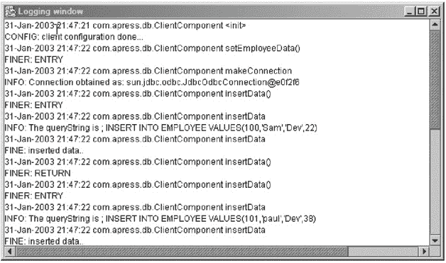
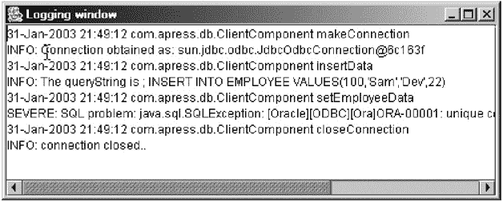
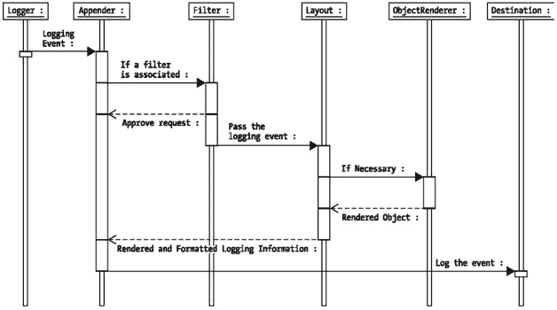

# 这是一个自定义处理器，用于将日志信息传递到基于 Java 的日志窗口
#############################################################

sam.logging.handler.WindowHandler.level = FINEST
```

`ClientComponent` 被设计为从配置文件中获取数据库连接属性，并从命令行选项中获取远程服务器中员工数据 XML 文件的名称。前面指定的 "db.properties" 文件定义了数据库连接属性，我们将 "employee.xml" 作为远程文件的名称传递，以从中获取员工数据。

```
Java -Djava.util.logging.config.file=/your-path/config.properties
com.apress.db.ClientComponent /your-path/db.properties employee.xml
```

与 `ClientComponent` 相关的日志信息将显示在一个小型 Java 窗口中，如图 4-5 所示。


图 4-5：客户端日志窗口中的日志信息

在服务器端，`ServerComponent` 将存储其自身的日志信息以及从 `ClientComponent` 传递过来的日志信息。如前所述，`ServerComponent` 自身启用了日志记录，并使用了一个 `FileHandler` 对象，该对象具有固定模式 `%h/employeeLog%g.out`。因此，`ServerComponent` 的日志信息将位于 "user.home" 目录下，文件名分别为 `employeeLog0.out`、`employeeLog1.out` 等。另一方面，`RemoteLoggingServer` 负责配置任何使用 `RemoteHandler` 的客户端应用程序所启用的远程日志信息的位置。如果未使用 `RemoteLoggingServer` 指定模式，则使用默认的 `FileHandler` 模式。

我们可以通过更改与 `Handler` 关联的级别来限制任何日志目标中打印的信息量。例如，在 `ClientComponent` JVM 中，如果我们将 `WindowHandler` 的级别更改为 Level.INFO，那么我们将看到如图 4-6 所示的日志信息。


图 4-6：客户端日志窗口中的日志信息

显然，更改级别减少了信息量。日志现在更易读了。但请注意，我们仅仅通过更改配置文件就实现了这一点——这正是拥有像 JDK 1.4 日志 API 这样可配置的日志 API 的美妙之处。

## 结论

在前面的章节中，我们研究了 JDK 1.4 日志 API 的架构、使用和扩展。我们还看到了一个实际示例，展示了日志 API 如何在跟踪和调试应用程序中非常有用。在需要时发布日志消息的灵活性以及我们选择的粒度，对应用程序开发人员和管理员来说意义重大。从下一章开始，我们将以类似的详细程度探讨 log4j，这是 Apache 提供的另一个基于 Java 的流行日志 API。

# 第 5 章：理解 Apache log4j


## 概述

Apache log4j 实现是一个高度可扩展、健壮且多功能的日志记录框架。该 API 简化了应用程序中日志记录代码的编写，同时允许通过外部配置文件灵活控制日志记录活动。它还允许我们根据适合每个应用程序的日志信息详细程度，将日志信息发布到所需的粒度。

我们可以定制适合应用程序开发阶段或部署阶段的日志记录活动粒度，而无需更改源代码。只需更改几个配置参数，即可切换到不同的日志记录行为。

Apache log4j 还能够将日志信息发布到各种目标，例如文件、控制台和 NT 事件日志。此外，日志信息甚至可以通过 Java 消息服务（JMS）或 JDBC 进行分发，或者输出到 TCP/IP 套接字。该 API 允许我们获取日志信息，并以人类可读且可供任何错误处理和解析程序在未来重用的不同格式和布局进行发布或打印。log4j 的可扩展性使开发人员能够通过创建新的日志记录目标以及独特的格式和布局来增强日志记录能力，这可以通过扩展现有框架来实现。

尽管 log4j 框架的应用很简单，但为了获得最佳效果，需要采用特定的方法和实践。在本章中，我们将讨论 log4j 框架的整体架构以及 API 中涉及的不同对象，并详细检查核心日志记录对象的应用和用法。本章以 Apache log4j 1.2.6 版本为基础，介绍本文中的概念和示例。尽管 log4j 的后续版本将包含更多功能，但本书讨论的基本概念将保持不变，并且对于掌握任何后续版本都将非常有用。

## 安装 log4j

Apache log4j 是 Apache 集团的一个开源项目。要成功安装和使用 log4j，您需要满足以下条件：

*   从 [`jakarta.apache.org`](http://jakarta.apache.org) 获取最新版本的 log4j 二进制发行版。本书中的示例和概念基于 log4j 1.2.6 版本。您可以获取任何可用的 log4j 更新版本，并且仍然能够遵循本书中的示例。

*   Apache log4j 兼容 JDK 1.1.x。请确保您的机器上已下载了合适的 JDK 版本。

*   您需要一个兼容 JAXP 的 XML 解析器来使用 log4j。请确保您的机器上已安装 "Xerces.jar"。

*   log4j 中基于电子邮件的日志记录功能需要在您的机器上安装 Java Mail API（"mail.jar"）。Apache log4j 已针对 Java Mail API 1.2 版本进行了测试。

*   Java Mail API 还需要在您的机器上安装 JavaBeans Activation Framework（"activation.jar"）。

*   log4j 的 JMS 兼容功能要求您的机器上同时安装 JMS 和 JNDI。

一旦您获取并安装了所有必需的 .jar 文件，您必须确保所有这些资源在 Java 运行时的类路径中可用。

## log4j 架构概述

log4j API 的架构是分层的。每一层由执行不同任务的不同对象组成。顶层捕获日志信息，中间层负责分析和授权日志信息，底层负责格式化日志信息并将其发布到目标位置。本质上，log4j 包含三种主要类型的对象：

*   `Logger`：`Logger` 对象（在 log4j 1.2 之前的版本中称为 `Category` 对象）负责捕获日志信息。`Logger` 对象存储在一个命名空间层次结构中。

*   `Appender`：`Appender` 对象负责将日志信息发布到各种首选目标。每个 `Appender` 对象至少有一个与之关联的目标位置。例如，`ConsoleAppender` 对象能够将日志信息打印到控制台。

*   `Layout`：`Layout` 对象用于以不同样式格式化日志信息。`Appender` 对象在发布日志信息之前会使用 `Layout` 对象。`Layout` 对象在以人类可读且可重用的方式发布日志信息方面发挥着重要作用。

上述核心对象是 log4j 架构的核心。除此之外，还有几个辅助对象，它们可以即插即用到 API 的任何一层。这些对象有助于管理应用程序中处于活动状态的不同 `Logger` 对象，并微调日志记录过程。

接下来，让我们回顾一下 log4j 框架中在日志记录框架中起关键作用的主要辅助对象：

*   `Level`：`Level` 对象，以前称为 `Priority` 对象，定义了任何日志信息的粒度和优先级。每条日志信息都附带其相应的 `Level` 对象，该对象告知 `Logger` 对象该信息的优先级。API 中定义了七个日志记录级别：OFF、DEBUG、INFO、ERROR、WARN、FATAL 和 ALL。每个定义的级别都有一个与之关联的唯一整数值。

*   `Filter`：`Filter` 对象用于分析日志信息，并进一步决定该信息是否应该被记录。在 log4j 上下文中，`Appender` 对象可以有多个与之关联的 `Filter` 对象。如果日志信息被传递给某个特定的 `Appender` 对象，则与该 `Appender` 关联的所有 `Filter` 对象都需要批准该日志信息，然后才能将其发布到与该 `Appender` 关联的首选目标。`Filter` 对象在根据任何特定于应用程序的标准过滤掉不需要的日志信息方面非常有用。

*   `ObjectRenderer`：`ObjectRenderer` 对象专门用于为传递给日志记录框架的不同对象提供 `String` 表示形式。更准确地说，当应用程序将自定义 `Object` 传递给日志记录框架时，日志记录框架将使用相应的 `ObjectRenderer` 来获取所传递 `Object` 的 `String` 表示形式。`Layout` 对象使用它来准备最终的日志信息。

*   `LogManager`：`LogManager` 对象执行日志记录框架的管理工作。它负责从系统范围的配置文件或配置类中读取初始配置参数。在应用程序中使用命名空间创建的每个 `Logger` 实例都由 `LogManager` 存储在命名空间层次结构中。当我们尝试获取命名记录器的引用时，`LogManager` 类会返回已创建的实例，否则会创建一个新的命名记录器实例，将其存储在存储库中以供将来引用，并将新实例返回给调用应用程序。


现在我们已经了解了 log4j 的核心组件，是时候简要讨论一下它们如何相互交互了。log4j 框架的核心部分是 `Logger` 对象。应用程序实例化一个命名的 `Logger` 实例，并向其传递不同的日志信息。`Logger` 对象有一个与之关联的指定 `Level` 对象。`Logger` 对象提供了多种日志记录方法，能够记录按不同级别分类的信息。

一个 `Logger` 只会记录 `Level` 等于或大于其指定 `Level` 的消息，否则会拒绝日志记录请求。一旦满足 `Level` 条件，`Logger` 对象会将日志信息传递给所有与其关联的 `Appender` 对象，以及递归地传递给其父 `Logger` 关联的所有 `Appender` 对象，直至日志层次结构的顶层。

与 `Logger` 对象类似，`Appender` 对象也可以附加阈值 `Level`。日志信息会根据 `Appender` 附加的阈值 `Level` 进行验证。如果日志消息的 `Level` 等于或大于阈值 `Level`，则日志消息会传递到下一阶段。然后，`Appender` 对象会查找与其关联的任何 `Filter` 对象。如果存在，日志信息会依次通过链中的所有 `Filter` 对象。一旦消息被所有 `Filter` 对象批准，`Appender` 就会利用与其关联的任何 `Layout` 对象来格式化消息，最后将日志信息发布到首选目标。图 5-1 以 UML 时序图的形式描述了 log4j 日志架构的整体流程。


图 5-1：log4j 框架概述

如果你已经阅读过第 2 章到第 4 章中关于 JDK 1.4 日志 API 的讨论，你可能会好奇这两种日志 API 之间的异同。从表面上看，这两种 API 的架构惊人地相似。然而，这两种 API 之间存在着微妙但至关重要的差异，我们将在第 10 章中讨论这些差异。

## 配置 log4j

在应用程序中使用 log4j 之前，我们需要以特定于应用程序的方式配置 log4j。配置 log4j 通常涉及分配 `Level`、定义 `Appender` 和指定 `Layout` 对象。配置信息通常以键值对的形式定义在属性文件中。也可以使用 XML 格式定义 log4j 配置，我们将在本节后面讨论。默认情况下，`LogManager` 类会在用于加载 log4j 类的类路径中查找名为 "log4j.properties" 的文件。

使用外部配置文件作为控制日志行为的手段是一个特别有用的特性，因为切换到完全不同的日志方案无需更改源代码。

清单 5-1 展示了一个简单的 log4j 配置。它定义了根日志记录器的级别和附加器。

清单 5-1：示例 log4j 配置文件

| **** |

```
