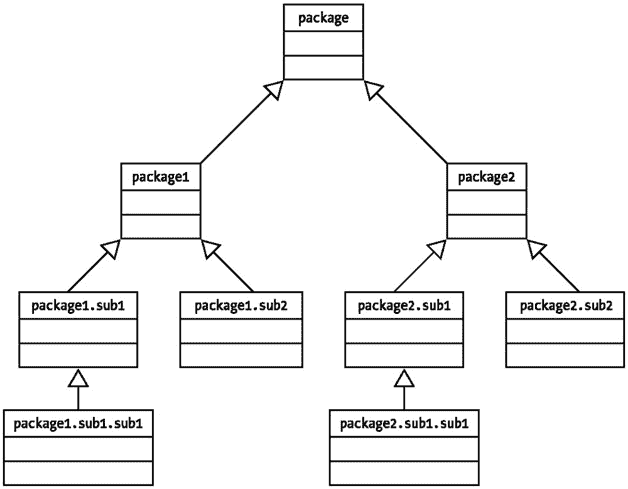
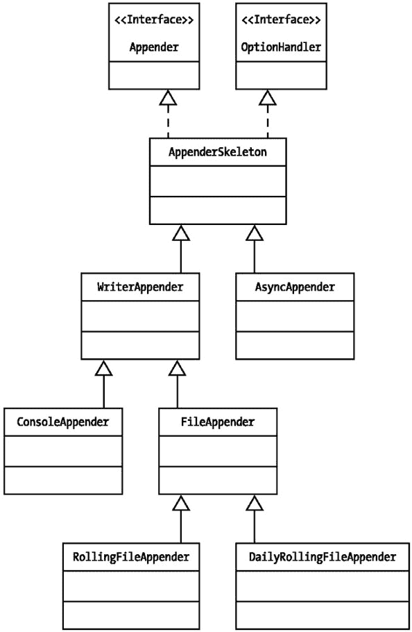
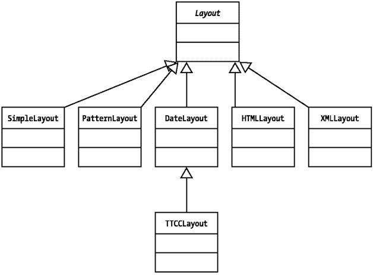

# 为附加器 X 设置布局
log4j.appender.X.layout=org.apache.log4j.PatternLayout
log4j.appender.X.layout.conversionPattern=%p-%m%n
```

| **** |

|  |

在此配置文件中，我们定义了自己的日志记录器 `com.apress.logging.log4j`，并为其分配了级别 DEBUG 和附加器 `X`。附加器 `X` 又被定义为 `org.apache.log4j.ConsoleAppender`，其转换模式为 `%m%n`，这意味着日志消息后跟一个换行符，并打印到其默认输出流 `System.out`。`%p` 符号将把日志消息的级别作为输出的一部分打印出来。

清单 5-4 中的程序 `SimpleLogging.java` 旨在打印一条简单的调试消息。需要掌握的重点是，`Logger` 将通过前面清单 5-3 中定义的 "log4j.properties" 文件进行配置。

清单 5-4: SimpleLogging.java

| **** |

```
package com.apress.logging.log4j;

import org.apache.log4j.*;

public class SimpleLogging {
    /** 创建 SimpleLogging 的一个新实例 */
    public SimpleLogging() {
    }

    /**
     * @param args 命令行参数
     */
    public static void main(String[] args) {
        Logger logger =
Logger.getLogger(SimpleLogging.class.getPackage().getName());
        logger.info("你好，这是一条信息消息");
    }
}
```

| **** |

|  |

在这个简单程序中需要注意的一个重要事项是我们如何获取 `Logger` 对象引用。我们创建了一个命名空间与类包名相同的日志记录器，在本例中为 `com.apress.logging.log4j`。创建日志记录器命名空间的策略将在后面的 "Logger 对象" 部分详细讨论。目前，只需注意在配置文件中，我们也创建了一个与 `SimpleLogging` 类的包名（`com.apress.logging.log4j`）同名的日志记录器。一旦获取了日志记录器，我们就在 `Logger` 对象上调用 `info()` 方法来打印消息。

#### 运行程序

我们现在准备运行这个程序。确保类路径系统变量包含所有类以及 "log4j.properties" 文件非常重要。然后，我们可以使用以下命令运行程序，将要加载的配置文件名作为系统参数传递：

```
java -Dlog4j.configuration=log4j.properties com.apress.logging.log4j.SimpleLogging
```

附加到所获取日志记录器的附加器是 `org.apache.log4j.ConsoleAppender`。因此，清单 5-4 中的程序将向控制台打印以下消息：

```
INFO-你好，这是一条信息消息
INFO-你好，这是一条信息消息
```

你可能会好奇为什么相同的信息被打印了两次。这引出了关于 `Logger` 对象层次结构的另一个有趣点，我们将在 `Logger` 部分详细讨论。简单的答案是，消息被打印两次是因为该消息被传播到命名的日志记录器，同时也被传播到根日志记录器进行处理。两个日志记录器都通过它们各自的附加器打印了该消息。

Apache log4j 还允许我们以编程方式配置日志框架，而无需指定任何系统属性。如前所述，属性样式的配置文件由 `org.apache.log4j.PropertyConfigurator` 对象解析；我们可以在应用程序中使用同一个对象来读取和解析配置文件。例如，在清单 5-4 的程序中，我们可以使用以下代码来配置日志框架：

```
public static void main(String args[])
  {
    PropertyConfigurator.configure(args[0]);
  }
```

其中 `args[0]` 是作为命令行参数提供的配置文件名。这也会通过读取指定的任何配置文件来正确配置框架。关于此方法唯一需要注意的重要事项是，理想情况下，配置应在应用程序的入口点（例如 `main()` 方法）加载。否则，应用程序可能会多次加载配置信息，从而降低性能。

在更简单的情况下，`Logger` 对象可以通过 `org.apache.log4j.BasicConfigurator` 类采用非常基本的配置。

```
 BasicConfigurator.configure()
```

此指令将根日志记录器配置为 DEBUG 级别，并将 `org.apache.log4j.ConsoleAppender` 分配为默认附加器，其转换模式为 `%-4r[%t]%-5p%c%x - %m%n`。默认情况下，log4j 被配置为将日志请求沿日志记录器层次结构向上传播。如果我们在应用程序中使用默认设置，并且获取了自己的命名日志记录器，但未使用任何外部配置文件对其进行配置，那么它将自动继承并使用由 `BasicConfigurator` 设置的根日志记录器的属性。


### 配置的动态加载

如果使用外部配置文件来配置日志框架，一个令人沮丧的问题是每次修改属性文件后都需要重启应用程序。为了避免这种情况，`PropertyConfigurator` 和 `DOMConfigurator` 类都可以实现配置文件的动态加载。这在两个配置类的以下方法中得到了演示：

```
public void configureAndWatch(String filename, long delay);
public void configureAndWatch(String filename);
```

这些方法使用另一个辅助类 `org.apache.log4j.helpers.FileWatchDog`，该类用于判断配置文件是否存在。如果文件存在，它会创建一个单独的线程，并在指定的时间间隔（或默认的 60 秒间隔）后检查文件是否被修改。如果配置文件被修改，则会重新读取配置以配置日志框架。

在基于服务器的应用程序中，此特性非常有用，因为在这些场景下，我们可能不希望关闭任何网站，但又需要更改应用程序的日志配置。

|  | 注意 | 从现在开始，本章后续所有示例都将使用清单 5-3 中列出的 "log4j.properties" 配置文件。这是因为我们将在所有示例中使用相同的包结构，从而使用同名的日志记录器。除非另有说明，否则相关章节（例如我们关于附加不同附加器的讨论）中提到的任何额外配置信息都必须包含在 "log4j.properties" 中。 |

### 使用 Servlet 配置 log4j

log4j 的使用并不局限于独立应用程序，它可以广泛应用于任何类型的应用程序部署环境。最常见的基于服务器的部署环境之一是 Web 服务器和 Servlet 环境。清单 5-5 `LoggingServlet.java` 展示了一个简单的 Servlet，用于演示在 Web 服务器环境中使用 log4j。

|  | 注意 | 要编译 Java Servlet 程序，你需要在类路径中包含 1.x 版本的 servlet.jar。如果你像本例中那样使用 Tomcat，你可以在 Tomcat 安装目录的 /lib 目录下找到 "servlet.jar"。 |

清单 5-5: LoggingServlet.java

| **** |

```
import javax.servlet.*;
import javax.servlet.http.*;
import java.io.PrintWriter;
import java.io.IOException;
import org.apache.log4j.*;

public class LoggingServlet extends HttpServlet {
    private static Logger logger =
Logger.getLogger(LoggingServlet.class);

    public void doPost(HttpServletRequest req, HttpServletResponse res)
                       throws IOException, ServletException
    {
        logger.info("invoked the LoggingServlet...");
        PrintWriter writer = res.getWriter();
        writer.println("Check your web server console...");
        writer.flush();
        writer.close();
    }
}
```

| **** |

|  |

接下来，我们将编写一个简单的 HTML 文件来调用这个 Servlet：

```
 <html>
<body>
<h1>Please enter value and press submit</h1>
<form method="POST"
action="http://localhost:8080/logdemo/servlet/LoggingServlet">
<input type=submit value=Invoke>
</bodY>
</html>
```

请注意，名为 "action" 的表单指向 `LoggingServlet`，该 Servlet 在名为 "localhost" 的主机上执行，并监听 8080 端口。这是 HTTP 请求的默认端口。

在 Servlet 内部，我们获取一个 `Logger` 实例，并在 `doPost()` 方法中使用 `Logger.info()` 方法打印日志信息。为了使日志记录正常工作，我们需要为我们所使用的 Web 服务器环境配置 log4j。我们将在下一节中以 Tomcat Web 服务器配置为例，介绍如何执行此操作。

### 设置 Tomcat

在本节中，我们将演示在 Windows 操作系统下使用 Tomcat 3.2.1 Web 服务器配置。你可以很容易地找出 UNIX 环境中用于配置 Tomcat 的相应文件。

|  | 注意 | Tomcat 是 Apache 的一个开源 Servlet 引擎，而不是一个全功能的 Web 服务器。Tomcat 也可以与 Apache Web 服务器集成。虽然我们在本书的示例中使用 Tomcat，但你也可以尝试其他支持 Java Servlet 的 Web 服务器。 |

首先，将示例 Servlet 和 HTML 文件构建成一个 .war 文件，并将该 Servlet 部署到 Tomcat 默认目录下名为 "logdemo" 的文件夹中。成功部署 Servlet 后，你应该能够在浏览器窗口中输入 Web 服务器 URL（例如 `http://localhost:8080/logdemo/logging.html`）来查看你的 HTML 文件。

|  | 注意 | 要构建 .war 文件，我们需要使用带有自定义构建脚本的 ANT。.war 文件，即 Web 应用程序归档文件，是 .jar 文件的一种变体，Tomcat 使用它来进行 Web 应用程序部署。有关使用 ANT 构建应用程序的详细信息，请查阅 ANT 文档。创建 .war 文件后，我们需要将其放入 Tomcat 安装目录的 "/webapps" 文件夹中。一旦我们重启 Tomcat，它会自动从 .war 文件中提取文件。 |

基本上有两种方法可以配置 log4j 以使其与 Tomcat 协同工作，下面将介绍这两种方法。

#### 通过系统参数配置

在 Tomcat 环境中配置 log4j 并不困难。按照此处描述的步骤，我们可以设置 Tomcat 以使用 log4j：

1.  我们可以将 "log4j.properties" 文件作为系统变量传递给 Tomcat 的执行环境。

2.  转到 "%TOMCAT_HOME%\bin" 目录下的 "tomcat.bat" 文件。

3.  添加一个条目，将 CLASSPATH 变量设置为指向包含 "log4j.properties" 文件的目录。例如，在以下示例配置中：

    `set CP=%CP%;C:\Jakarta-tomcat-3.2.1\webapps\logdemo\`

4.  我们将在 "tomcat.bat" 文件中添加如下条目：

    ```
    set TOMCAT_OPTS=-Dlog4j.configuration=log4j.properties
    ```

5.  启动 Tomcat，它将加载 "log4j.properties" 文件并使用它来打印 log4j 日志信息。

#### 通过 Servlet 初始化配置

Apache log4j 可以在 Servlet 初始化时进行配置，方法是通过特定于应用程序的 "web.xml" 文件传递属性文件的名称。

1.  转到 Tomcat 的 "logdemo/WEB-INF" 文件夹。

2.  打开 "web.xml" 文件并输入以下 Servlet 配置：

    ```
     <servlet>
          <servlet-name>LoggingServlet</servlet-name>
          <servlet-class>LoggingServlet.class</servlet-class>

          <init-param>
          <param-name>log4j-conf</param-name>
          <param-value>log4j.properties</param-value>
          </init-param>

          <load-on-startup>1</load-on-startup>
        </servlet>
    ```

3.  在 `LoggingServlet` 中重写 `init()` 方法，如下所示：

    ```
     public void init()throws ServletException
          {
            super.init();
            String configFile = getInitParameter("log4j-conf");
            PropertyConfigurator.configure(configFile);
          }
    ```

4.  启动 Tomcat，`LoggingServlet` 将通过 "log4j.properties" 文件进行配置。

一旦我们从 HTML 页面调用 `LoggingServlet`，我们就可以在 Tomcat 控制台中看到以下输出：

```
invoked the LoggingServlet...
```

|  | 注意 | 我们可以通过更改 log4j 配置文件，将日志信息重定向到任何我们想要的地方。 |

至此，我们已经了解了配置 log4j 的各个方面。从下一节开始，我们将详细探讨不同的 log4j 对象。


## Level 对象

`org.apache.log4j.Level` 对象取代了 log4j 旧版本中的 `org.apache.log4j.Priority` 对象。它表示与日志消息关联的优先级或严重性。`Logger` 和 `Appender` 可以关联阈值级别。日志消息会根据其级别与 `Logger` 和 `Appender` 对象的级别比较结果进行过滤。因此，通过更改与 `Logger` 和这些对象关联的级别，可以开启或关闭特定级别的日志记录。`Level` 类定义了以下级别：

*   *ALL（最低）：* 此级别具有最低的可能等级，并开启所有日志信息的记录。

*   *DEBUG：* 此级别用于打印在开发阶段有帮助的调试信息。

*   *INFO：* 此级别用于打印有助于我们确定应用程序内控制流程的信息性消息。

*   *ERROR：* 此级别用于打印与错误相关的消息。

*   *WARN：* 此级别用于打印与系统某些错误和意外行为相关的信息，这些行为需要立即关注以防止应用程序发生故障。

*   *FATAL：* 此级别用于打印关于导致应用程序崩溃的问题的系统关键信息。

*   *OFF（最高）：* 这是最高级别，使用此级别将关闭所有日志信息的打印。

这些级别具有与之关联的唯一整数值，并且可以按从最低到最高的值排列如下：

ALL<DEBUG<INFO<WARN<ERROR<FATAL<OFF

## Logger 对象

`Logger` 对象是应用程序开发者用于记录任何消息的主要对象。一旦日志信息传递给记录器，其余工作就在后台完成。`Logger` 对象仅封装日志消息，不了解这些消息的目标位置或格式。这就是 `Appender` 和 `Layout` 对象发挥作用的地方，我们将在本章后面看到。

在特定应用程序实例中运行的 `Logger` 对象遵循父子层次结构。为了说明这个概念，请参考图 5-2。


图 5-2：Logger 对象的父子关系

层次结构的顶部存在一个根记录器。根记录器存在于我们可能提出的任何自定义记录器层次结构范围之外。它始终作为所有可能记录器层次结构的根记录器存在，并且没有命名空间。所有其他特定于应用程序的 `Logger` 对象都是根记录器的子对象。记录器的父子关系表明了在同一应用程序中运行的记录器的依赖性和分离性。这意味着子记录器可以递归地向上继承其父记录器的属性。通常，子记录器将从其父记录器继承以下属性：

*   `Level`：如果子记录器没有指定显式的树级别，它将使用其直接父级的级别，或者递归向上在层次结构中找到的第一个合适的级别。

*   `Appender`：如果没有附加到记录器的追加器，则它使用其直接父记录器的追加器，或者递归向上在树中找到的第一个追加器。

*   `ResourceBundle`：`ResourceBundle` 是用于日志消息本地化的键值对模式属性文件。子记录器也会继承其父记录器指定的任何 `ResourceBundle`。

这种层次关系还意味着，当子记录器使用其父记录器的属性时，对父记录器属性的任何更改都会影响子记录器的行为。另一方面，对子记录器属性的更改不会影响父记录器。这种父子关系由 log4j 上下文中的 `additivity` 属性决定。

默认情况下，`Logger` 对象的 `additivity` 标志设置为 `true`。可以通过将 `additivity` 标志设置为 `false` 来禁用子记录器的 `additivity` 属性，在这种情况下，它将不会继承父记录器的任何属性。这由 `Logger` 对象中的以下方法控制：

```
public boolean setAdditivity(boolean value)
```

或者通过将配置设置为：

```
log4j.logger.loggerName.additivity=false
```

我们可以使用 `Logger` 对象的各种便捷方法来创建新的命名记录器、获取现有的命名记录器，以及在不同优先级级别记录消息。`Logger` 类不允许我们实例化一个新的 `Logger` 实例，而是提供了两个用于获取 `Logger` 对象实例的 `static` 方法：

```
public static Logger getRootLogger();
public static Logger getLogger(String name);
```

这些方法中的第一个返回应用程序实例的根记录器。如前所述，根记录器始终存在并且没有名称。任何其他命名的 `Logger` 对象实例都通过第二个方法传入记录器的名称来获取。记录器的名称可以是任意字符串。为了使应用程序日志记录更有效且不言自明，记录器的命名起着重要作用。通常，`Logger` 对象应被赋予一个与其所属包相对应的名称，或者创建 `Logger` 实例的完全限定类名。同样，此名称可以强类型化为包含包名或类名的字符串。但更灵活的做法如下例所示（该例也曾在清单 5-4 中给出）：

```
Logger logger = Logger.getLogger(SimpleLogging.class.getPackage().getName());
```

这种方法在重构方面是安全的，因为将来如果我们出于任何原因决定更改包结构，日志记录代码无需更改。显然，与强类型化记录器名称相比，您可以看到这种方法的好处，强类型化不太可能为应用程序带来太多好处。

|  | 注意 | *重构* 是在不影响代码外部行为的情况下改进代码内部设计的过程。 |

当创建一个新的 `Logger` 实例时，`LogManager` 将该实例存储在命名空间存储中，并以命名空间作为键。如果在应用程序运行过程中我们尝试再次创建相同的 `Logger` 实例，则会返回现有的实例。在实际应用程序中，我们可能*不会*使用根记录器，而是获取我们自己的命名记录器。所有命名记录器默认递归地从根记录器继承属性。

### 记录日志信息

一旦我们获得了一个命名记录器的实例，就可以使用记录器的多种方法来记录消息。`Logger` 类有以下用于打印日志信息的方法。我们必须记住，`Logger` 类从之前的 `Category` 类继承了所有这些方法。从 `Category` 类继承的方法有时会引用另一个历史类 `Priority`，它现在已被 `Level` 类取代。我们可以互换使用 `Category` 与 `Logger`，以及 `Priority` 与 `Level`，而不会影响任何应用程序的完整性。

|  | 注意 | 由于 `Logger` 对象已取代了之前的 `Category` 对象，因此 `Category` 对象中的某些方法也已被弃用。我们在使用这些方法时必须谨慎，并尽可能避免直接使用 `Category` 类中的任何方法。 |


#### 基于级别的日志记录方法

表 5-1 中列出的方法均为基于级别的日志记录方法，即每个方法都会为被记录的日志消息分配一个特定级别。

表 5-1：Logger 类中的日志记录方法

| 方法 | 描述 |
| --- | --- |
| `public void debug(Object message);` | 此方法以 Level.DEBUG 级别打印消息。 |
| `public void error(Object message);` | 此方法以 Level.ERROR 级别打印消息。 |
| `public void fatal(Object message);` | 此方法以 Level.FATAL 级别打印消息。 |
| `public void info(Object message);` | 此方法以 Level.INFO 级别打印消息。 |
| `public void warn(Object message);` | 此方法以 Level.WARN 级别打印消息。 |

存在一组类似的方法，它们接受消息和一个`java.lang.Throwable`对象实例。`Throwable`对象表示需要记录的错误状况，并包含应用程序的堆栈跟踪信息。`Throwable`实例可以为`null`。这组方法帮助我们记录应用程序中出现的任何特定错误情况，而堆栈跟踪则使我们能够确定错误的确切位置。

#### 本地化日志记录

Java 语言之所以如此灵活，其本地化特性功不可没。Apache log4j 利用此特性发布本地化的日志消息，这意味着应用程序日志记录变得与语言无关。这是通过`java.util.ResourceBundle`对象以及将特定于语言环境的独立消息属性文件附加到应用程序来实现的。

`java.util.ResourceBundle`是一种使程序语言无关化的技术。在最简单的层面上，我们在程序中使用特定的键。这些键映射到特定的消息（值），并在属性文件中定义。`ResourceBundle`属性文件是特定于语言环境的。例如，我们可以在两个独立的属性文件"MyResources_en.properties"和"MyResources_de.properties"中分别定义英文和德文的消息。在程序中，我们可以使用名为`MyResource.properties`的`ResourceBundle`对象。当语言环境需要德语时，我们的程序将自动选取名为`MyResources_de.properties`的资源。

通过调用`Logger.setResourceBundle(ResourceBundle name)`方法来指定`ResourceBundle`。也可以通过配置文件进行设置，如下所示：

```
log4j.logger.loggerName.resourceBundle=resourceBundle name
```

`ResourceBundle`加载包含消息键和本地化消息值的特定于语言环境的属性文件，应用程序使用这些文件来发布消息。`Logger`类提供了以下用于本地化日志记录的方法，它们接受日志消息的`Priority`或`Level`对象、本地化键以及一个`Throwable`实例：

```
public void 17dlog(Priority p, String key, Throwable t);
public void 17dlog(Priority p, String key, Object params[], Throwable t);
```

第一个方法很直接。它使用"key"作为本地化键来查找本地化消息。如果该键无法从`ResourceBundle`中获取任何值，则键本身将被用作消息字符串。第二个方法接受一个`Object`数组，其中包含所有需要本地化的参数。获取与键匹配的格式化模式，并使用`java.text.MessageFormat.format(String, Object[])`方法对数组中传递的所有参数进行本地化。

#### 通用日志记录

`Logger`类还允许我们在日志级别未预定义的情况下使用通用日志记录方法。以下方法集是通用日志记录方法：

```
public void log(Priority p, Object message);
public void log(Priority p, Object message, Throwable t);
public void log(String fqcn, Priority p, Object message, Throwable t);
```

前两个方法很直观，它们接受日志级别和消息对象作为参数，并可选择接受一个`java.lang.Throwable`实例。最后一个方法是最通用的，它接受一个额外的参数`fqcn`，即调用者类的完全限定名称。通用日志记录方法很少直接从应用程序中使用。但是，`Logger`类中的任何包装类都可能倾向于在内部使用这些通用方法来打印日志信息。

上述所有方法都接受一个`java.lang.Object`作为参数，该参数是要打印的消息。这可以代表任何任意对象。`Logger`对象将此对象传递给关联的`Appender`对象，而`Appender`对象又将消息传递给`Layout`对象。`Layout`对象将解释该对象并将其呈现为人类可读的格式。我们将在第 6 章中借助`org.apache.log4j.or.ObjectRenderer`来讨论此过程。

### 配置方法

`Logger`类提供了几个方法来配置`Logger`实例。这些方法可以添加或删除`Appender`，并可以设置`Logger`实例的`Level`。

```
public void addAppender(Appender appender)
public void removeAppender(Appender appender)
public void removeAppender(String name)
public void removeAllAppenders()
public void setLevel(Level level)
```

所有这些方法都一目了然。在使用这些方法时必须小心，因为它们会覆盖默认配置。

|  | 注意  | 不应直接使用这些方法来设置配置信息，因为这样做会将配置参数硬编码到源代码中。更好的方法是使用外部配置文件来配置`Logger`。 |

### 成功记录日志的条件

使用日志记录方法并不能保证日志信息一定会被发布。正如您可能从"log4j 架构概述"部分的讨论中回忆的那样，日志信息在打印到首选目标之前会经过多个层的过滤。对于`Logger`而言，主要的过滤发生在日志级别。如前所述，一个日志记录器将拥有自己的级别，或者递归地继承其直接父级在日志记录器层次结构中的级别。任何日志信息只有当且仅当与日志消息关联的级别 *p* 大于或等于分配给日志记录器的级别 *q* 时，才会被日志记录器批准。换句话说，如果满足 *p* >= *q*，日志记录器将批准该消息并将其传递给关联的`Appender`对象。

因此，如果一个`Logger`的默认级别是 WARN，那么任何使用`info()`方法进行日志记录的尝试都不会产生任何日志信息。


### 日志记录器示例

清单 5-6 中的程序`LoggerDemo.java`将演示基本的日志记录方法，并尝试对日志信息进行本地化。

清单 5-6：LoggerDemo.java

| **** |

```
package com.apress.logging.log4j;

import org.apache.log4j.*;

/** 此类演示了 Logger 类方法的基本用法
 */
public class LoggerDemo {

private static Logger logger =
Logger.getLogger(LoggerDemo.class.getPackage().getName());
/** 创建 LoggerDemo 的新实例 */
public LoggerDemo(String rbName) {
        //将父级处理器的使用设置为 false
        logger.setAdditivity(false);
        logger.debug("将父级可加性设置为 false...");
        logger.setResourceBundle(java.util.ResourceBundle.getBundle(rbName));
        logger.debug("设置资源包...");
    }

/** 演示基于基本级别的日志记录方法
     * @param name 要问候的名称
     */
    public void doLogging(String name) {
        logger.debug("进入 doLogging 方法..");
        String str = "Hello ";
        String output = null;

if(name == null) {
            output = "Anonymous";
            logger.warn("未传入名称，设置为匿名...");
        }else {
            output = str.concat(name);
            logger.info("构建了字符串对象..."+output);
        }

logger.info("打印消息...");
        logger.debug("退出 doLogging 方法...");
    }

/** 演示本地化的日志记录方法
     */
    public void doLocalizedLogging() {

logger.l7dlog(Level.DEBUG, "Entry", null);
        logger.l7dlog(Level.DEBUG, "Exit", null);
    }

public static void main(String args[]) {
        String name = args[0];
        String rbName = args[1];
        LoggerDemo demo = new LoggerDemo(rbName);
        demo.doLogging(name);
        demo.doLocalizedLogging();
    }
}
```

| **** |

|  |

要执行此程序，我们使用清单 5-3 中描述的同一个"log4j.properties"文件。首先，我们获取一个`Logger`实例，其名称为`LoggerDemo`类所在包的包名，并将其作为类变量。在构造函数中，我们将此日志记录器的`additivity`属性设置为`false`，这意味着此日志记录器不会将任何日志记录请求转发给其直接父级日志记录器。接下来，我们为此日志记录器设置`ResourceBundle`，该资源包将用于日志信息的本地化。`doLogging()`方法使用了`Logger`类中的几个日志记录方法。严重性较低的日志信息通过`debug()`方法打印，其他重要消息则通过`Logger`类的`info()`和`warn()`方法打印。

`doLocalizedLogging()`方法仅打印两条消息，以演示如何将传递给日志记录方法的消息解释为本地化键，并打印相应的消息值。考虑以下包含本地化键和值的"logging_fr.properties"文件：

```
Entry=Entrer
Exit=Sortir
```

当通过分别传递消息"Entry"和"Exit"来调用`17dlog()`方法时，log4j 框架会查找"logging_fr.properties"文件，并打印相应的值作为日志信息。

如果我们使用以下命令执行程序：

```
 java -Dlog4j.configuration=log4j.properties
com.apress.logging.log4j.LoggerDemo sam logging_fr
```

我们将在控制台中看到打印出以下信息：

```
DEBUG - Set the parent additivity to false...
DEBUG - Set the resource bundle...
DEBUG - Entered the doLogging method..
INFO - Constructed the string object...Hello sam
INFO - printing the message...
DEBUG - Exiting the doLogging method...
DEBUG - Entrer
DEBUG - Sortir
```

请注意，日志消息的最后两行是作为本地化消息打印的。级别为 DEBUG 的信息仅用于在开发期间打印，以便更好地理解应用程序的控制流程。我们可以通过更改"log4j.properties"文件中的级别来轻松关闭 DEBUG 级别的消息，如下所示：

```
log4j.logger.com.apress.logging.log4j=INFO, X
```

将新级别设置为 INFO 后，日志记录器将仅打印优先级等于或高于 INFO 的消息。如果我们使用上述设置重新执行程序，将在控制台中看到以下输出：

```
INFO - Constructed the string object...Hello sam
INFO - printing the message...
```

请注意，这次省略了 DEBUG 级别的消息。

## LogManager 对象

`org.apache.log4j.LogManager`类管理从应用程序内部创建的每个命名日志记录器的创建和存储。它在内部使用另一个辅助类`org.apache.log4j.Hierarchy`来存储所创建的每个`Logger`对象的引用。这种层次结构使得每个创建的子日志记录器都有一个指向其父级日志记录器的指针，但父级日志记录器不会有任何对其子日志记录器的引用。此外，log4j 不限制应用程序开发人员在实例化父级日志记录器之前实例化子日志记录器。在这种情况下，子日志记录器实例会被创建，并在`Hierarchy`类中存储，同时为其预留一个空节点，以便将来在创建父级日志记录器时进行分配。

应用程序开发人员通常不必关心`Hierarchy`类的使用。相反，他们使用`LogManager`和`Logger`类提供的便捷方法来创建和获取任何命名日志记录器。同样值得注意的是，当我们更改任何现有命名日志记录器的属性时，永远不会创建新实例。而是从`Hierarchy`类中获取现有引用，并将属性更改应用到该引用。这就是为什么`Logger`类中的方法（例如

```
public void addAppender(Appender appender)
```

是`synchronized`（同步）的，以确保两个线程不会同时操作同一个命名日志记录器的实例。

`LogManager`类提供了表 5-2 中描述的有用方法。

表 5-2：LogManager 类中的方法

| 方法 | 描述 |
| --- | --- |
| `public static Enumeration getCurrentLoggers();` | 此方法返回现有命名日志记录器的枚举。 |
| `public static Logger exists(String name);` | 此方法检查特定命名日志记录器是否存在。 |
| `public static Logger getLogger(String name);` | 此方法获取一个现有的命名日志记录器。 |

在下一节中，我们将探讨 log4j 的其他方面，这些方面有助于我们处理特定于客户端的日志信息。


## 嵌套诊断上下文 (NDC)

日志记录在复杂的分布式应用中最为有用。大多数现实中的复杂分布式系统都是多线程的。一个很好的例子是使用 Java Servlet 技术编写的 Web 应用。每个 Servlet 同时处理多个客户端，但 Servlet 内编写的日志代码却是相同的。几乎总是需要将某个客户端的日志输出与其他客户端区分开来。一种方法是为每个客户端执行不同的日志线程。但这种解决方案可能并不总是理想的。另一种更简单的方法可能是用一些特定于客户端的信息来唯一标记每个日志输出。这就是*嵌套诊断上下文* (NDC) 发挥作用的地方。

log4j 中的 `NDC` 类拥有 表 5-3 中列出的方法来管理 `NDC` 堆栈中的信息。

表 5-3：NDC 类中的方法

| 方法 | 描述 |
| --- | --- |
| `public static void pop();` | 在退出某个上下文时调用此方法。 |
| `public static void push(String message);` | 此方法为当前线程添加诊断上下文。 |
| `public static void remove();` | 在退出线程时调用此方法。它会移除特定线程的诊断上下文。 |

请注意，`NDC` 类中的所有方法都是 `static` 的。`NDC` 在每个线程中作为上下文信息的堆栈进行管理。确保在退出线程的 `run()` 方法时调用 `NDC` 的 `remove()` 方法非常重要。这可以确保线程的垃圾回收。有趣的是，一个线程可以通过调用 `NDC` 类的 `inherit(Stack stack)` 方法从另一个线程继承 `NDC`。当我们想要比较两个不同线程的上下文信息时，这非常有用。

## 消息诊断上下文 (MDC)

*消息诊断上下文* (MDC) 是一种使用 `java.util.Map` 格式存储客户端特定数据的机制。此 `Map` 的键可以在与附加器一起使用的 `Layout` 对象指定的转换模式中替换为其值。`MDC` 类提供了 表 5-4 中的方法来操作存储在 `Map` 中的键和值。

表 5-4：MDC 类中的方法

| 方法 | 描述 |
| --- | --- |
| `public static Object get(String key);` | 此方法检索存储在该键下的 `Object`。 |
| `public static void put(String key, Object o);` | 此方法将 `Object o` 存储在该键下。 |
| `public static void remove(String key)` | 此方法移除任何 `Object` 与该键的映射。 |

下面的示例将有助于更清晰地说明与 `MDC` 和 `NDC` 对象相关的概念。假设我们有一个多线程且同时处理多个客户端的 Java Servlet 程序。我们可能希望用一些特定于客户端的信息（例如客户端的 IP 地址）来标记每个日志输出。让我们修改 `LoggingServlet.java`（之前展示在 代码清单 5-5 中），以使用 `MDC` 和 `NDC` 来分离每个客户端请求的日志输出。首先，在 `doPost()` 方法中插入以下代码：

```
 public void doPost(HttpServletRequest req, HttpServletResponse res)
                       throws IOException, ServletException
    {
        String remoteAddress = req.getRemoteAddr();
        String remoteHost = req.getRemoteHost();

        //推送到 NDC
        NDC.push(remoteHost);
        //在 MDC 中映射
        MDC.put("remoteAddress", remoteAddress);
        logger.info("invoked the LoggingServlet...");
        PrintWriter writer = res.getWriter();
        writer.println("Check your web server console...");
        writer.flush();
        writer.close();
    }
```

在上面的代码片段中，我们获取了远程主机名和远程主机地址。`NDC` 包含远程主机名，而 `MDC` 包含远程主机地址。现在我们将按如下方式修改 "log4j.properties" 文件，以更改附加器使用的转换模式，从而显示 `MDC` 和 `NDC` 信息：

```
log4j.appender.X.layout.conversionPattern=%x -%X{remoteAddress} %m%n
```

`%x` 显示 `NDC` 信息，`%X{variable name}` 显示 `MDC` 信息。请注意，在 `MDC` 模式中指定的变量名必须与代码中分配的变量名匹配。现在日志输出将包含 `NDC` 和 `MDC` 信息，如下所示：

```
hostname1 - host address1 invoked the LoggingServlet...
hostname2 - host address2 invoked the LoggingServlet...
```

很明显，尽管打印的是相同的信息，但 `NDC` 和 `MDC` 信息对于区分日志输出是多么有用。

## Appender 对象

过滤日志信息以及在 `Logger` 类中使用不同方法的能力对于应用程序开发者来说是一个很棒的特性。但 `Logger` 本身并不能打印日志消息。它需要借助 `Appender` 对象来完成。`Appender` 对象主要负责将日志消息打印到不同的目标，例如控制台、文件、套接字、NT 事件日志等。有时，`Appender` 对象可以关联 `Filter` 对象，以便对特定消息的日志记录做出进一步的决定。

将信息写入附加到任何特定附加器的首选目标可以是同步的或异步的，这取决于应用程序开发者如何使用附加器。`Appender` 对象在日志信息的目标方面非常灵活，这是一个主要优势。可以创建 `Appender` 对象来写入数据库和 JMS，以实现分布式日志记录框架。我们将在本节讨论能够在同一 JVM 上下文中处理日志信息的常规 `Appender` 对象；相关的分布式日志记录 `Appender` 对象将在后面的第 7 章 中介绍。在 log4j 的上下文中，图 5-3 中的类图描述了 `Appender` 对象的关系以及它们的组织方式。


图 5-3：log4j 中的 Appender 类层次结构

每个 `Appender` 对象都有与之关联的不同属性，这些属性指示了该对象的行为。通常，`Appender` 对象将具有以下属性：

*   `layout`：每个 `Appender` 对象需要知道如何格式化传递给它的日志信息。它使用 `Layout` 对象及其关联的转换模式来格式化日志信息。

*   `target`：每个 `Appender` 对象都会有一个与之关联的目标目的地。目标可以是控制台、文件或其他项目，具体取决于附加器。

*   `level`：每个 `Appender` 对象都可以有一个与之关联的阈值 `Level`。日志信息会与阈值级别进行比较，如果日志请求级别等于或大于此阈值，则进一步处理日志信息；否则忽略。

*   `filter`：可以将 `Filter` 对象附加到 `Appenders`。`Filter` 对象可以分析超出级别匹配的日志信息，并决定日志请求应由特定的 `Appender` 处理还是忽略。

根据 `Appender` 对象的类型，每个 `Appender` 可以具有其他特殊属性。我们将在接下来的章节中讨论每个 `Appender` 对象，但首先我们将了解如何将 `Appender` 对象添加到 `Logger` 对象。


### 为日志记录器添加附加器

`Logger` 对象需要关联一个或多个 `Appender` 对象，才能将日志信息打印到特定目标。我们可以通过以下方法为 `Logger` 添加 `Appender` 对象：

```
public void addAppender(Appender appender);
```

或者在配置文件中包含以下设置：

```
log4j.logger.loggerName.appender=appenderName
```

`addAppender()` 方法会向 `Logger` 对象添加一个 `Appender`。可以为同一个日志记录器添加多个 `Appender` 对象，每个对象将日志信息打印到不同的目标。但关于为日志记录器添加 `Appender`，有一个重要点需要注意：`Appender` 具有累加性。每个发送给日志记录器的日志请求，都会被转发给与其关联的所有 `Appender` 对象，同时也会转发给其父日志记录器（在日志记录器层级结构中向上）所关联的所有 `Appender` 对象。

如果你还记得“Logger 对象”一节中关于日志记录器层级结构的讨论，你可能已经想到，可以通过将 `additivity` 标志设置为 `false` 来关闭累加特性，这可以通过调用 `setAdditivity(Boolean flag)` 方法实现。如果 `additivity` 标志被设置为 `false`，日志信息将只会被转发给与特定 `Logger` 对象关联的 `Appender` 对象。

#### 为日志记录器添加附加器的更好方法

虽然使用 `Logger` 类的 `addAppender()` 方法来添加 `Appender` 对象是完全可行的，但这会将 `Logger` 和 `Appender` 的关系硬编码在代码中；因此，未来对此关系的任何更改都意味着需要修改代码、重新编译并重新部署。为了避免这种不理想的情况，建议你通过配置属性来将 `Appender` 与 `Logger` 关联起来。

回顾一下“log4j.properties”配置文件（清单 5-1），注意我们为根日志记录器附加了一个 `ConsoleAppender`。在实际应用中，这种方法更加灵活且易于维护，因为可以在需要时更改配置而无需修改代码（如果我们使用了 `Configurator` 类中的 `ConfigureAndWatch`，甚至无需重新部署应用程序）。

### 日志记录器与附加器的协作

到目前为止，我们已经了解了 `Logger` 对象如何封装日志信息，以及不同的 `Appender` 对象如何将日志信息打印到不同的目标。但是，`Logger` 对象是如何将日志信息传递给 `Appender` 对象的呢？创建一个名为 `LoggingEvent` 的中间链接对象就能实现这一目的。`org.apache.log4j.spi.LoggingEvent` 类封装了所有相关的日志信息，例如调用者类的完全限定名、日志消息的级别、消息本身、`Logger` 实例、时间戳，以及可选的 `java.lang.Throwable` 实例。在将日志请求移交给任何关联的 `Appender` 之前，`Logger` 会使用与日志相关的信息创建一个 `LoggingEvent` 对象实例。

然后，`Logger` 对象会调用 `Appender` 对象的 `doAppend(LoggingEvent event)` 方法。从前面图 5-3 所示的 `Appender` 类图中可以注意到，所有 `Appender` 对象都继承自基类 `AppenderSkeleton`。`doAppend()` 方法实际上是在 `AppenderSkeleton` 类中实现的，并被所有其他 `Appender` 对象继承。需要注意的是，`doAppend()` 方法是 `synchronized` 的，这意味着日志事件的发布是以同步方式进行的。因此，log4j 是线程安全的。

`doAppend()` 方法会对日志请求执行一些关键检查，例如将请求的日志级别与 `Logger` 关联的任何 `Appender` 的阈值级别进行比较，检查 `Appender` 是否已打开，以及检查与 `Appender` 关联的任何 `Filter` 对象。如果发现 `Filter` 对象，它会调用该 `Filter` 对象来对日志请求做出进一步决策。一旦获得批准，关联的子类 `Appender` 对象的 `append()` 方法就会接管并发布日志信息。

### WriterAppender

`WriterAppender` 是一个高级 `Appender` 对象，它扩展了 `org.apache.log4j.AppenderSkeleton` 对象，并根据使用此附加器的应用程序开发者是将目标设置为 `Writer` 对象还是 `OutputStream` 对象，将日志信息写入 `java.io.Writer` 对象或 `java.io.OutputStream` 对象。`WriterAppender` 类可以具有以下属性：

*   `immediateFlush`：此属性指示每次有写入特定日志信息的请求时，是否应该刷新输出流。默认情况下，此选项设置为 `true`。如果该标志设置为 `false`，则底层流可以将日志信息的写入推迟到稍后的时间点再写入物理介质。

*   `encoding`：可以使用任何编码方案来写入日志信息。默认情况下，`WriterAppender` 使用系统特定的编码方案。

*   `threshold`：这表示 `WriterAppender` 的日志记录截止级别。任何级别低于此级别的日志请求都将被忽略。默认情况下没有设置阈值级别，这意味着对于此 `Appender` 对象，级别过滤未激活。

*   `target`：指定任何 `java.io.Writer` 对象或 `java.io.OutputStream` 对象。

|  | 注意 | 每次日志请求都刷新流的开销很大，可能会使性能降低 10% 到 20%，但它能保证所有信息都被记录下来。如果 `immediateFlush` 属性设置为 `false`，那么当应用程序意外退出或崩溃时，某些日志信息可能会丢失。 |

`WriterAppender` 类具有表 5-5 中所示的构造函数。

表 5-5：WriterAppender 类中的构造函数

| 构造函数 | 描述 |
| --- | --- |
| `public WriterAppender();` | 这是默认构造函数。 |
| `public WriterAppender(Layout layout, OutputStream os)` | 此构造函数接受给定的 `Layout`，并使用给定的 `OutputStream` 构造一个 `OutputStreamWriter` 对象。 |
| `public WriterAppender(Layout layout, Writer writer)` | 此构造函数接受给定的 `Layout` 并将输出目标指定为 `Writer` 对象。 |

`WriterAppender` 类中的主要方法是：

```
public void append(LoggingEvent event);
```

这作为此 `WriterAppender` 的入口点。每当通过 `append()` 方法发出日志请求时，它会调用 `protected boolean checkEntryConditions ()` 方法来检查日志记录的条件是否有效。它还会检查是否设置了输出目标以及是否附加了布局。如果这些条件不满足，则写入操作返回并将相应的错误消息打印到控制台。请记住，在请求被委托给任何特定的 `Appender` 对象之前，基类 `AppenderSkeleton` 已经完成了阈值级别检查以及通过任何关联的 `Filter` 对象对日志请求进行的过滤。否则，如果一切正常，它会继续将日志信息写入关联的目标。

`WriterAppender` 还有两个子类：`ConsoleAppender` 和 `FileAppender`，它们分别写入控制台和任何文件对象。在实际应用中，我们几乎不会直接使用 `WriterAppender`。相反，我们会使用接下来描述的子类之一。


### ConsoleAppender

`org.apache.log4j.ConsoleAppender` 是一个非常简单的类，旨在将日志信息写入 `System.out` 或 `System.err`。它继承了 `org.apache.log4j.WriterAppender` 类。任何打算将日志信息打印到控制台的日志应用程序都应使用此 `Appender`。有趣的是，它重写了其父类 `WriterAppender` 中的 `closeWriter()` 方法，并且不执行任何操作，因为控制台流不应被关闭。它具有以下属性：

*   `immediateFlush`：此标志默认设置为 `true`，这会导致每次日志输出请求时刷新控制台流。

*   `encoding`：可以使用任何字符编码方案，但默认是平台特定的编码方案。

*   `threshold`：这是日志记录的截止级别。任何级别低于此阈值的日志请求都将被忽略。未指定默认阈值级别。

*   `target`：日志输出的目标位置——`System.out` 或 `System.err`。默认值为 `System.out`。

### FileAppender

`org.apache.log4j.FileAppender` 继承了 `org.apache.log4j.WriterAppender` 类，并提供了将日志信息写入文件的功能。`FileAppender` 在信息如何记录到目标文件方面非常灵活。它可以启用缓冲写入、追加或覆盖同一文件中的信息，并根据日期和时间滚动文件名。它具有以下属性：

*   `immediateFlush`：此标志默认设置为 `true`，这会导致每次追加操作时刷新到文件的输出流。

*   `encoding`：可以使用任何字符编码方案，但默认是平台特定的编码方案。

*   `threshold`：这是日志记录的截止级别。任何级别低于此阈值的日志请求都将被忽略。未指定默认阈值级别。

*   `fileName`：将写入日志信息的文件名。文件名可以使用 UNIX 风格的变量名指定，例如 `${user.home}/log.out`，这意味着文件 "log.out" 的位置应在系统特定的 "user.home" 目录中。

*   `fileAppend`：此标志默认设置为 `true`，这会导致日志信息被追加到同一文件的末尾。

*   `bufferedIO`：此标志指示是否需要启用缓冲写入。默认设置为 `false`。

*   `bufferSize`：如果启用了 `bufferedI/O`，则此参数指示缓冲区大小。

表 5-6 列出了 `FileAppender` 类的构造函数。

表 5-6：FileAppender 类中的构造函数

| 构造函数 | 描述 |
| --- | --- |
| `public FileAppender()` | 默认构造函数 |
| `public FileAppender(Layout layout, String fileName);` | 包含布局信息和文件名的构造函数 |
| `public FileAppender(Layout layout, String fileName, boolean append);` | 与上一个构造函数相同，但增加了一个用于追加模式的布尔标志。 |
| `public FileAppender(Layout layout, String fileName, boolean append, boolean bufferedIO, int bufferSize);` | 设置所有参数的构造函数 |

`FileAppender` 将日志信息的打印委托给其父类 `WriterAppender`。有趣的是，它将 `WriterAppender` 的 `Writer` 对象设置为一个自定义写入器 `org.apache.log4j.helpers.QuietWriter`。`QuietWriter` 是一个普通的 `java.io.Writer`，不同之处在于，如果 I/O 操作出现问题，它不会抛出任何异常。相反，它会将问题传递给一个 `org.apache.log4j.spi.ErrorHandler` 类型的对象。`ErrorHandler` 被声明为一个接口；该接口的一个具体实现是 `org.apache.log4j.helpers.OnlyOnceErrorHandler`。`OnlyOnceErrorHandler` 仅将第一条错误消息记录到 `System.err`，并静默忽略其余错误。这有助于避免错误消息淹没日志记录目标。

`FileAppender` 类的配置参数可以通过从 `AppenderSkeleton` 类继承的方法进行设置。然而，如前所述，这会将代码与配置信息耦合在一起。建议将配置信息与源代码分离，并通过配置文件设置来指定这些信息。例如，配置文件可以通过以下方式设置 `FileAppender` 特定的配置信息：

```
 log4j.appender.dest = org.apache.log4j.FileAppender
#设置文件名
log4j.appender.dest.File=${user.home}/log.out
#设置立即刷新为 true（默认值）
log4j.appender.dest.ImmediateFlush=true
#设置阈值
log4j.appender.dest.Threshold=ERROR
#设置追加为 false，即覆盖
log4j.appender.dest.Append=false
```

此配置文件配置了一个名为 `dest` 的 appender。appender `dest` 被设置为一个 `FileAppender` 对象。然后，配置文件为此 `FileAppender` 对象设置了不同的属性。


### RollingFileAppender

`org.apache.log4j.RollingFileAppender` 继承自 `FileAppender` 类。它将日志信息写入指定文件，但当主文件达到特定大小时，会写入（即*滚动*）到辅助文件。除了从 `FileAppender` 类继承的所有属性外，`RollingFileAppender` 还具有以下属性。

*   `maxFileSize`：这是触发文件滚动的临界大小。默认最大文件大小为 10MB。

*   `maxBackupIndex`：此属性表示要创建的备份文件数量。默认值为一个备份文件。

`RollingFileAppender` 类具有表 5-7 中列出的构造函数。

表 5-7：RollingFileAppender 类中的构造函数

| 构造函数 | 描述 |
| --- | --- |
| `public RollingFileAppender()` | 这是默认构造函数，内部调用 `FileAppender` 类的默认构造函数。 |
| `public RollingFileAppender(Layout layout, String fileName) throws IOException` | 此构造函数使用给定的文件名实例化 `FileAppender` 对象。默认情况下，它会将日志信息追加到给定文件。 |
| `public RollingFileAppender(Layout layout, String fileName, boolean append) throws IOException` | 此构造函数接受 `Layout`、文件名和 `append` 属性。如果 `append` 属性为 `true`，它会将日志信息追加到文件，直到达到最大大小。 |

`RollingFileAppender` 类有几个有用的方法来控制其行为，这些方法列在表 5-8 中。

表 5-8：RollingFileAppender 类中的方法

| 方法 | 描述 |
| --- | --- |
| `public void rollOver()` | 此方法执行常规的滚动操作。当达到最大文件大小时，滚动操作被激活，或者应用程序开发人员可以在操作的任何阶段强制进行。调用时：如果 `maxBackupIndex` > 0，则文件 "log.1" 被重命名为 "log.2"，依此类推以保留备份。然后关闭 "log.1" 文件，并打开一个新文件 "log.2" 以记录下一条信息。如果 `maxBackupIndex` = 0，则一旦达到最大文件大小，日志文件就会被截断，并且不会创建备份文件。 |
| `public void setMaxBackupIndex(int maxBackupIndex)` | 此方法接受一个正值，设置最大备份索引，超过该索引后最旧的备份文件将被删除。如果设置为零，则不会创建备份文件。 |
| `public void setMaxFileSize(long size)` | 此方法与上一个方法相同，只是它接受一个 `long` 类型的文件大小。 |
| `public void setMaxFileSize(String size)` | 此方法接受最大文件大小，超过该大小后文件将滚动。我们可以使用后缀 "KB"、"MB" 等来指定文件大小，以表示千字节和兆字节。例如，我们可以使用 "20MB" 指定 20 兆字节的文件大小。 |
| `public void subAppend(LoggingEvent event)` | 这是从父类 `WriterAppender` 重写的方法，它实现了向滚动文件写入的大部分功能。 |

以下属性文件演示了如何配置 `RollingFileAppender` 属性：

```
 log4j.appender.dest = org.apache.log4j.RollingFileAppender
#设置文件名
log4j.appender.dest.File=${user.home}/log.out
#设置立即刷新为 true（默认）
log4j.appender.dest.ImmediateFlush=true
#设置阈值
log4j.appender.dest.Threshold=ERROR
#设置追加为 false，即覆盖
log4j.appender.dest.Append=false
#设置滚动前的最大文件大小
log4j.appender.dest.MaxFileSize=10KB
#设置备份索引
log4j.appender.dest.MaxBackupIndex=2
```

此配置文件定义了一个名为 `dest` 的 `RollingFileAppender`。然后，它为此 appender 设置了其他配置参数。

### DailyRollingFileAppender

基于大小的日志文件滚动对于管理大量日志数据并将其分散到多个文件中非常有用。但在实际生活中，当应用程序日复一日地运行时，我们需要实现一些基于日期的日志记录能力。`org.apache.log4j.DailyRollingFileAppender` 对象为我们实现了这一点。它扩展了 `FileAppender` 类并继承了其所有属性。文件的滚动通过 `DatePattern` 配置参数完成。`DatePattern` 指示何时滚动文件以及要遵循的命名约定。例如，配置了 `DatePattern ‘.’ yyyy-MM-dd` 的 `DailyRollingFileAppender` 将在 2002 年 9 月 17 日午夜将日志文件重命名为 "log.out-2002-09-17"，并继续向名为 "log.out" 的文件记录日志。

`DatePattern` 遵循 `java.text.SimpleDateFormat` 对象的格式化风格。可以通过 `DatePattern` 定义文件滚动的确切日期和时间。表 5-9 演示了如何使用 `DatePattern` 来控制滚动计划，假设日志文件名设置为 "log.out"。

表 5-9：DatePattern 约定

| DatePattern | 滚动计划 | 示例 |
| --- | --- | --- |
| `‘.’ yyyy-MM` | 在每个月末和下个月初滚动 | 日志文件将在 2002 年 5 月 31 日滚动到 "log.out-2002-05"，类似地，将在 2002 年 9 月 30 日滚动到 "log.out.2002-09"。 |
| `‘.’ yyyy-MM-dd` | 每天午夜滚动 | 在 2002 年 9 月 30 日午夜，"log.out" 文件将滚动到 "log.out.2002-09-30"。 |
| `‘.’ yyyy-MM-dd-a` | 每天中午和午夜滚动 | 在 2002 年 9 月 30 日中午，"log.out" 文件将滚动到 "log.out-2002-09-30-AM"，并在午夜该文件将依次滚动到 "log.out.2002-09-30-PM"。 |
| `‘.’ yyyy-MM-dd-HH` | 每小时整点滚动。 | 在 2002 年 9 月 30 日 10:00:000 时，"log.out" 文件将滚动到 "log.out.2002-09-30-09"。请注意，它以前一个小时为前缀。 |
| `‘.’ yyyy-MM-dd-HH-mm` | 每分钟滚动。 | 在 2002 年 9 月 30 日 10:20:000 时，"log.out" 文件将滚动到 "log.out.2002-09-30-10-19"。 |
| `‘.’ yyyy-ww` | 根据区域设置，在每周的第一天滚动 | 如果一周的第一天是星期一，那么在 12 月 28 日（星期日）午夜，"log.out" 文件将滚动到 "log.out.2002-52"。 |

|  | 注意  | 不要在 `DatePattern` 中的任何地方使用 ":"。":" 字符用于指定协议，这与我们处理日期格式的意图不完全一致。 |

`DailyRollingFilteAppender` 有两个构造函数。第一个是不执行任何操作的默认构造函数：

```
public void DailyRollingFileAppender()
```

第二个，如下代码行所示，接受用于滚动的 `Layout`、文件名和 `DatePattern`：

```
public void DailyRollingFileAppender(Layout layout, String fileName,
String datePattern)
```

`subAppend(LoggingEvent event)` 方法是从 `WriterAppender` 类重写的，它实现了每日滚动活动。

正如我们所见，`DailyRollingFileAppender` 是一种非常强大的机制，可以精细控制日志记录过程。在实际生活中，日志信息的组织方式与记录哪些信息同等重要。`DailyRollingFileAppender` 在按小时、天和月发布日志信息方面非常有用，这有助于在很大程度上分析应用程序性能，而无需处理过多或过旧的信息。

以下属性文件演示了如何配置 `DailyRollingFileAppender`：


```
log4j.appender.dest = org.apache.log4j.DailyRollingFileAppender
#设置文件名
log4j.appender.dest.File=${user.home}/log.out
#设置立即刷新为 true（默认值）
log4j.appender.dest.ImmediateFlush=true
#设置阈值
log4j.appender.dest.Threshold=ERROR
#设置追加模式为 false，即覆盖写入
log4j.appender.dest.Append=false
#设置日期模式
log4j.appender.dest.DatePattern='.' yyyy-MM-dd
```

该配置文件定义了`DailyRollingFileAppender`对象的配置参数。`DatePattern`转换模式将遵循表 5-9 中定义的约定。

### 基于文件的日志记录示例

本节稍后展示的程序`FileBasedLoggingDemo.java`将演示不同的基于文件的`Appender`对象如何处理日志信息。我们已经了解到，基于文件的`Appender`对象可以将数据写入文件，并每天或每隔指定时间滚动日志输出文件。为了演示不同文件的滚动方式，在以下示例中，我们将看到如何创建一个线程，以重复方式将日志消息记录到文件中。我们还将看到如何创建一个配置文件，定义所有必需的日志记录器、附加器和布局信息。属性文件"file_logging.properties"（见清单 5-7）定义了此基于文件的日志记录示例所需的属性。

清单 5-7：file_logging.properties

| **** |

```
#将根日志记录器的级别设置为 DEBUG（最低级别）
#并设置其附加器名为 DEBUG 和 CONSOLE
log4j.rootLogger = DEBUG, CONSOLE

#设置自定义日志记录器
log4j.logger.com.apress.logging.log4j=DEBUG, FILE, ROLLING, DAILY

#设置附加器 CONSOLE
log4j.appender.CONSOLE=org.apache.log4j.ConsoleAppender

#设置附加器 FILE
log4j.appender.FILE=org.apache.log4j.FileAppender
log4j.appender.FILE.File=${user.home}/out.log

#设置附加器 ROLLING
log4j.appender.ROLLING=org.apache.log4j.RollingFileAppender
log4j.appender.ROLLING.File=${user.home}/rolling.log
log4j.appender.ROLLING.MaxFileSize=1KB

#设置附加器 DAILY
log4j.appender.DAILY=org.apache.log4j.DailyRollingFileAppender
log4j.appender.DAILY.File=${user.home}/daily.log
log4j.appender.DAILY.DatePattern='.' yyyy-MM-dd-HH-mm

#为附加器设置布局
log4j.appender.CONSOLE.layout=org.apache.log4j.PatternLayout
log4j.appender.CONSOLE.layout.conversionPattern=%p - %m%n

log4j.appender.FILE.layout=org.apache.log4j.PatternLayout
log4j.appender.FILE.layout.conversionPattern=%p - %m%n

log4j.appender.ROLLING.layout=org.apache.log4j.PatternLayout
log4j.appender.ROLLING.layout.conversionPattern=%p - %m%n

log4j.appender.DAILY.layout=org.apache.log4j.PatternLayout
log4j.appender.DAILY.layout.conversionPattern=%p - %m%n
```

| **** |

|  |

目标文件在配置文件"file_logging.properties"中定义，文件位置由`${user.home}`指定，这意味着日志文件将创建在`user.home`系统属性所定义的位置。

现在我们已经了解了基于文件的日志记录示例所需的属性，接下来看看清单 5-8 中展示的`FileBasedLoggingDemo.java`。

清单 5-8：FileBasedLoggingDemo.java

| **** |

```
package com.apress.logging.log4j;

import org.apache.log4j.*;

public class FileBasedLoggingDemo implements Runnable{

private static Logger logger =
Logger.getLogger(FileBasedLoggingDemo.class.getPackage().getName());
    /** 创建 FileBasedLoggingDemo 的新实例 */
    public FileBasedLoggingDemo()
    {
    }

/** 此方法由应用程序调用。该方法创建一个新线程来开始日志记录
     */
    public void doLogging()
    {
        Thread t = new Thread(this);
        t.start();
    }

/** 线程的 run()方法，以 60 秒的间隔重复进行日志记录
     */
    public void run()
    {
        int count=1;
        while(true) {
            //记录信息
            try {
                logger.debug("正在记录信息..."+count);
                Thread.sleep(60*1000);
                count++;
            }catch(Exception e) {
                logger.warn("发生异常", e);
            }
        }
    }
    /** 主方法
     */
    public static void main(String args[])
    {
        FileBasedLoggingDemo demo = new FileBasedLoggingDemo();
        demo.doLogging();
    }
}
```

| **** |

|  |

该程序将通过三个不同的附加器——`FILE`、`ROLLING`和`DAILY`——将日志信息发布到三个不同的文件："out.log"、"rolling.log"和"daily.log"。`DailyRollingFileAppender`被配置为每分钟记录信息并滚动一次。所有附加器的`append`属性都设置为`true`，在达到滚动条件之前，它们会将所有日志消息追加到同一个文件中。执行时，该程序将在`user.home`系统属性定义的位置创建如下文件：

| 文件名 | 描述 |
| --- | --- |
| daily.log. 2002-09-30-21-35 | 记录于 2002 年 9 月 30 日 21:35 |
| daily.log. 2002-09-30-21-36 | 记录于 2002 年 9 月 30 日 21:36 |
| out.log | 普通日志文件 |
| rolling.log | 初始滚动文件 |
| rolling.log.1 | 达到最大文件大小后的滚动文件 |


### AsyncAppender

当应用程序产生大量日志信息时，异步生成日志消息可能至关重要，这能显著提升性能。正如我们在之前讨论`Appender`对象时提到的，`doAppend()`方法是`synchronized`的。当数千个`Logger`对象试图使用同一个`Appender`对象打印日志信息时，这可能会降低性能。`AsyncAppender`对象使用一个有界缓冲区来存储日志事件。一旦缓冲区大小达到上限，日志事件就会被分发到特定的`Appender`对象。可以将多个`Appender`对象附加到`AsyncAppender`上。`AsyncAppender`对象会为缓冲区中的每个`LoggingEvent`对象使用一个独立的线程。

`org.apache.log4j.AsyncAppender`类继承自`org.apache.log4j.AppenderSkeleton`类，并实现了`org.apache.log4j.spi.AppenderAttachable`接口。`AppenderAttachable`接口定义了一组方法，任何接受`Appender`对象的类都应实现这些方法。这组方法包括向该类附加和移除`Appender`对象的方法。默认情况下，`AsyncAppender`的缓冲区大小可容纳 128 个`LoggingEvent`对象。在 log4j 1.2.6 版本之前，`AsyncAppender`只能通过`DOMConfigurator`使用 XML 风格的配置文件进行配置。

清单 5-9 展示了`AsyncAppender`的 XML 配置文件。该配置定义了一个`ConsoleAppender`作为所定义`AsyncAppender`的目标`Appender`。`ConsoleAppender`被赋予一个`PatternLayout`，并带有转换模式来格式化日志消息。名为`com.apress.logging.log4j`的记录器和根记录器都使用名为`ASYNC`的附加器来实现异步日志记录。

清单 5-9: async.xml

| **** |

```
<?xml version="1.0" encoding="UTF-8"?>
<!DOCTYPE log4j:configuration SYSTEM "log4j.dtd">

<log4j:configuration xmlns:log4j="http://jakarta.apache.org/log4j/"
debug="true">

<appender name="ASYNC" class="org.apache.log4j.AsyncAppender">
        <appender-ref ref="CONSOLE"/>
</appender>

<appender name="CONSOLE" class="org.apache.log4j.ConsoleAppender">
 <layout class="org.apache.log4j.PatternLayout">
        <param name="ConversionPattern"
                           value="%d %-5p [%t] - %m%n"/>
 </layout>
</appender>
    <logger name="com.apress.logging.log4j" additivity="false">
         <level value="debug"/>
         <appender-ref ref="ASYNC"/>
    </logger>
 <root>
  <priority value="debug"/>
  <appender-ref ref="ASYNC"/>
 </root>
</log4j:configuration>
```

| **** |

|  |

清单 5-10 中的程序`AsyncLogging.java`使用清单 5-9 中定义的"async.xml"文件作为其配置源。此示例简单地将所使用的`AsyncAppender`的缓冲区大小设置为 4。只要日志事件数量小于缓冲区大小，`AsyncAppender`就不会打印任何消息。一旦日志事件数量超过缓冲区大小，缓冲区就会被刷新，所有消息都会被打印出来。

清单 5-10: AsyncLogging.java

| **** |

```
package com.apress.logging.log4j;

import org.apache.log4j.*;
import org.apache.log4j.xml.DOMConfigurator;
public class AsyncLogging
{

//private static Logger logger
    Logger.getLogger(AsyncLogging.class.getPackage().getName());
        private AsyncAppender asyncAppender = null;
    private ConsoleAppender consoleAppender = null;

/** Creates a new instance of AsyncLogging */
    public AsyncLogging()
    {
        try {
            logger.setAdditivity(false);
            asyncAppender =
(AsyncAppender)logger.getRootLogger().getAppender("ASYNC");
            asyncAppender.setBufferSize(4);
        }catch(Exception e) {
            System.out.println("error: "+e.toString());
        }

}

/** This method simply logs the messages
     */ 
    public void doLogging()
    {
        logger.debug("Hello 1");
        logger.debug("Hello 2");
        logger.debug("Hello 3");
        //logger.debug("Hello 4");
        //logger.debug("Hello 5");
    }

/** the main method
     */
    public static void main(String args[])
    {
        AsyncLogging demo = new AsyncLogging();
        demo.doLogging();
    }
}
```

| **** |

|  |

执行此程序不会产生任何日志消息，因为`AsyncAppender`的缓冲区大小设置为 4，而我们只记录了 3 个事件。如果我们取消注释另外两个编号为 4 和 5 的日志事件，就会在控制台中看到这些消息被打印出来，如下所示：

```
2002-10-13 14:05:34,198 DEBUG [main] - Hello 1
2002-10-13 14:05:34,218 DEBUG [main] - Hello 2
2002-10-13 14:05:34,218 DEBUG [main] - Hello 3
2002-10-13 14:05:34,218 DEBUG [main] - Hello 4
2002-10-13 14:05:34,218 DEBUG [main] - Hello 5
```


## 过滤器对象

对每条日志请求是否打印相关信息进行决策的过程称为过滤。在整个日志记录过程中，可以在多个阶段决定接受或拒绝特定的日志请求。通常，应用程序开发者可以决定记录某些信息并拒绝其余信息。从 log4j 的角度来看，日志请求的过滤可以基于级别或任何其他特定于应用程序的标准。

`Filter` 对象通过分析封装在 `LoggingEvent` 对象中的信息来帮助过滤日志请求。`org.apache.log4j.spi.Filter` 是一个 `abstract` 类，也是 log4j 框架中所有其他 `Filter` 对象的基类。它定义了一个 `abstract` 方法 `public int decide(LoggingEvent event)`，所有 `Filter` 子类都会重写该方法。`decide()` 方法对 `LoggingEvent` 对象进行分析，并返回一个表示分析结果的整数值。`Filter` 对象以顺序方式组织成线性链，并按顺序被调用。可以从链中添加或移除任何 `Filter` 对象。

log4j 中的过滤过程通常遵循以下步骤：

1.  应用程序通过调用 `Logger` 对象的某个日志记录方法来发起日志请求。
2.  `Logger` 对象通过封装日志消息和其他日志相关信息，在内部构造一个 `LoggingEvent` 对象。
3.  然后，`Logger` 对象将 `LoggingEvent` 对象传递给与其关联的任何 `Appender` 对象。
4.  `Appender` 对象随后将 `LoggingEvent` 对象传递给与其关联的任何 `Filter` 对象。
5.  `Filter` 对象根据任何预定义标准决定日志请求的有效性，并返回一个表示分析结果的整数值。每个 `Filter` 对象可能返回三个整数值：

    *   如果返回整数值 DENY，则日志请求被停止，不会传递给链中的任何其他 `Filter` 对象。
    *   如果返回整数值 ACCEPT，则日志请求被接受，并且日志信息会被发布，无需咨询链中的任何其他 `Filter`。
    *   如果返回整数值 NEUTRAL，则会咨询链中的下一个 `Filter`。

6.  如果链中没有更多的 `Filter` 对象，则记录该日志事件。

`Filter` 对象只能通过 `DOMConfigurator` 进行配置。然而，`PropertyConfigurator` 对象目前不支持 `DOMConfigurator`，这意味着这些对象只能通过 XML 配置文件进行配置，而不能使用属性风格的配置文件。但是，可以实例化一个 `Filter` 对象，并使用任何 `Appender` 对象的 `addFilter(Filter filter)` 方法将其添加到过滤器链中。

在“一个完整示例”部分，我们将看到一个在实际应用中使用 log4j 的示例。在该示例中，我们还将看到如何有效地使用自定义 `Filter` 对象来实现所需的日志记录活动。

## 布局对象

正如我们在前面章节中学到的，`Logger` 对象和 `Appender` 对象是 log4j 框架的核心和灵魂。这些对象捕获日志请求并封装日志信息，并且能够将日志输出发送到各种目标。但是，为了将日志信息转换为任何人类可读的格式，`Appender` 对象使用 `Layout` 对象来格式化日志信息。考虑到未来对这些信息的分析，日志信息的布局非常重要。我们将在第 6 章中详细讨论 log4j 中可用的不同 `Layout` 对象。

## ObjectRenderer

我们打算发布的日志信息可以有多种类型和多种格式。通常，在一个多个对象持有数据并相互交互的面向对象应用程序中，我们往往需要以人类可读的格式发布整个对象及其内容。检查对象的当前状态以及特定对象持有的属性值，可以更容易地理解该对象如何响应发送给它的特定消息，并有可能在对象行为不当时定义所需的纠正措施。

在 log4j 的上下文中，`Logger` 类有多个日志记录方法，所有这些方法都可以接受一个 `Object` 参数作为日志消息。这个 `Object` 参数可以是一个简单的 `String`，代表我们希望发布的确切文本信息，也可以是一个自定义的 `Object`，例如 `Customer`、`Person` 等。当我们传递一个自定义 `Object` 进行记录时，目的是发布该对象的状态和内容。`org.apache.log4j.or.ObjectRenderer` 接口定义了将任何 `ObjectRenderer` 与任何 `Object` 关联，并获取对象内容的 `String` 表示形式的方式。

`Layout` 对象在尝试格式化传递给 `Logger` 的 `Object` 参数之前，会调用 `ObjectRenderer` 来获取 `Object` 内容的 `String` 表示形式。如果传递给 `Logger` 的消息参数是一个 `String`，则不需要 `ObjectRenderer` 来转换消息，`Layout` 对象会直接处理该消息。

`ObjectRenderer` 对象只能通过 `DOMConfigurator` 进行配置，因此可以在 XML 风格的配置文件中定义。`ObjectRenderer` 的配置信息定义了渲染类（即 `org.apache.log4j.or.ObjectRenderer` 接口的实现），以及被渲染类（即需要被渲染为 `String` 表示形式的自定义 `Object`）。“一个完整示例”部分将演示自定义 `ObjectRenderer` 的使用。


## 完整的 log4j 示例

为了巩固我们目前讨论的概念，让我们考虑一个处理多个客户订单的应用程序。该应用程序处理订单并向客户发送相应的响应。系统处理的所有订单都会被记录，并可用于将来参考。我们还假设系统在日志记录方面需要灵活性，以便能够决定只记录产品代码在特定范围内的订单。应用程序通常会将要打印的订单信息传递给日志记录框架。从设计的角度来看，应用程序需要保持日志记录方法的通用性，并具有可配置的附加器、过滤器和布局等。

该应用程序将使用某些 `Logger(s)`，每个日志记录器都有自己的附加器、过滤器和布局集。通过切换所使用的 `Logger` 或更改相关的附加器、过滤器和布局，可以完全改变日志记录行为。这种设计将为系统提供更高的灵活性和可维护性。从日志记录的角度来看，该系统需要具备以下对象：

*   `CustomerOrder`：此对象将保存每个客户所下订单的基本信息。

*   `OrderRenderer`：此对象能够将 `CustomerOrder` 对象渲染为 `String` 表示形式。

*   `ProductFilter`：此对象能够根据预定义的产品代码范围过滤日志信息。

清单 5-11 `CustomerOrder.java` 表示保存客户订单信息的业务对象。

清单 5-11：CustomerOrder.java

| **** |

```
 package com.apress.business;

public class CustomerOrder {

/** 保存属性 productName 的值。 */
    private String productName;

/** 保存属性 productCode 的值。 */
    private int productCode;

/** 保存属性 productPrice 的值。 */
    private int productPrice;

/** 创建 CustomerOrder 的新实例 */
    public CustomerOrder() {
    }

public CustomerOrder(String name, int code, int price)
    {
        this.productCode = code;
        this.productPrice = price;
        this.productName = name;
    }

/** 属性 productName 的获取器。
     * @return 属性 productName 的值。
     */
    public String getProductName() {
        return this.productName;
    }

/** 属性 productName 的设置器。
     * @param productName 属性 productName 的新值。
     */
    public void setProductName(String productName) {
        this.productName = productName;
    }

/** 属性 productCode 的获取器。
     * @return 属性 productCode 的值。
     */
    public int getProductCode() {
        return this.productCode;
    }

/** 属性 productCode 的设置器。
     * @param productCode 属性 productCode 的新值。
     */
    public void setProductCode(int productCode) {
        this.productCode = productCode;
    }

/** 属性 productPrice 的获取器。
     * @return 属性 productPrice 的值。
     */
    public int getProductPrice() {
        return this.productPrice;
    }

/** 属性 productPrice 的设置器。
     * @param productPrice 属性 productPrice 的新值。
     */
    public void setProductPrice(int productPrice) {
        this.productPrice = productPrice;
    }
}
```

| **** |

|  |

清单 5-12 `ProductFilter.java` 中的程序演示了自定义的 `Filter` 对象。`ProductFilter` 对象重写了 `Filter` 类中的 `decide(LoggingEvent event)` 方法，并检查 `CustomerOrder` 的产品代码。如果产品代码大于 100，`ProductFilter` 接受日志记录请求，否则拒绝。如果传递给 `ProductFilter` 的对象不是 `CustomerOrder` 的实例，则保持中立，并允许框架调用链中的下一个过滤器。

清单 5-12：ProductFilter.java


| **** |

```
package com.apress.logging.log4j.filter;

import org.apache.log4j.spi.Filter;
import org.apache.log4j.spi.LoggingEvent;
import com.apress.business.CustomerOrder;

public class ProductFilter extends Filter
{
    /** Creates a new instance of ProductFilter */
    public ProductFilter() {
    }

public int decide(LoggingEvent event)
    {
        int result=this.ACCEPT;
        //obtaining the message object passed through Logger
        Object message = event.getMessage();
        //checking if the message object is of correct type
        if(message instanceof CustomerOrder)
        {
            CustomerOrder order = (CustomerOrder)message;
            int productCode = order.getProductCode();
            //checking for the product code greater than 100 only
            if(productCode<100)
            {
                result = this.DENY;
            }
        }else
        {
            //this filter can ignore this, pass to next filter
            result = this.NEUTRAL;
        }

return result;
    }
}
```

| **** |

|  |

一旦`ProductFilter`批准了日志记录请求，日志事件就会被传递给关联的`Appender`对象。然后，`Appender`对象会将事件传递给关联的`Layout`对象，该对象会尝试将日志消息对象渲染为`String`表示形式，然后根据任何转换模式对其进行格式化。为了使`Layout`对象能够成功渲染消息，我们需要为`CustomerOrder`对象提供一个`ObjectRenderer`。清单 5-13 中的程序`OrderRenderer.java`实现了`ObjectRenderer`接口，并提供了`doRender(Object obj)`方法的实现。为简化示例，它返回一个由连字符分隔的`CustomerOrder`对象属性值列表。

清单 5-13：OrderRenderer.java

| **** |

```
 package com.apress.logging.log4j.renderer;

import org.apache.log4j.or.ObjectRenderer;
import com.apress.business.CustomerOrder;

public class OrderRenderer implements ObjectRenderer
{
    private static final String separator = "-";

/** Creates a new instance of OrderRenderer */
    public OrderRenderer() {
    }

public String doRender(Object obj)
    {
        StringBuffer buffer = new StringBuffer(50);
        CustomerOrder order = null;
        String productName = null;
        int productCode = 0;
        int productPrice = 0;
        //check if the instance is of correct type CustomerOrder
        if(obj instanceof CustomerOrder)
        {
            order = (CustomerOrder)obj;
            productName = order.getProductName();
            productCode = order.getProductCode();
            productPrice = order.getProductPrice();

buffer.append(productName);
            buffer.append(separator);
            buffer.append(new Integer(productCode).toString());
            buffer.append(separator);
            buffer.append(new Integer(productPrice).toString());
        }

return buffer.toString();
    }
}
```

| **** |

|  |

现在，一旦我们准备好了所有对象，就需要将对象层次结构传递给 log4j 框架。如前所述，`ObjectRenderer`只能通过`DOMConfigurator`进行配置，我们将通过一个 XML 风格的配置文件来定义日志记录器配置。清单 5-14 展示了本例中使用的配置文件"filter_properties.xml"。

清单 5-14：filter_properties.xml

| **** |

```
<?xml version="1.0" encoding="UTF-8"?>
<!DOCTYPE log4j:configuration SYSTEM "log4j.dtd">

<log4j:configuration xmlns:log4j="http://jakarta.apache.org/log4j/">

<renderer renderedClass="com.apress.business.CustomerOrder"
renderingClass="com.apress.logging.log4j.renderer.OrderRenderer">
 </renderer>

<appender name="A1" class="org.apache.log4j.ConsoleAppender">

<layout class="org.apache.log4j.PatternLayout">
     <param name="ConversionPattern" value="%t %-5p %c{2} - %m%n"/>
   </layout>
   <filter class="com.apress.logging.log4j.filter.ProductFilter"/>
 </appender>

<logger name="com.apress.logging.log4j">
   <level value="debug"/>
   <appender-ref ref="A1"/>
 </logger>
</log4j:configuration>
```

| **** |

|  |

最后，清单 5-15 展示了一个示例应用程序，用于演示日志消息的过滤和`CustomerOrder`对象的渲染。

清单 5-15：ProductFilterDemo.java

| **** |

```
package com.apress.logging.log4j;

import org.apache.log4j.Logger;
import com.apress.business.CustomerOrder;
import com.apress.logging.log4j.filter.ProductFilter;
import com.apress.logging.log4j.renderer.OrderRenderer;
public class ProductFilterDemo
{
    private static Logger logger =
Logger.getLogger(ProductFilterDemo.class.getPackage().getName());

/** Creates a new instance of ProductFilterDemo */
    public ProductFilterDemo() {
    }

public void processOrder(CustomerOrder order)
    {
        logger.info(order);
    }

public static void main(String args[])
    {
        CustomerOrder order1 = new CustomerOrder("Beer", 101, 20);
        CustomerOrder order2 = new CustomerOrder("Lemonade", 95, 10);
        CustomerOrder order3 = new CustomerOrder("Chocolate", 223, 5);

ProductFilterDemo demo = new ProductFilterDemo();
        demo.processOrder(order1);
        demo.processOrder(order2);
        demo.processOrder(order3);
    }
}
```

| **** |

|  |

该应用程序创建了三个不同的`CustomerOrder`对象，它们具有不同的产品名称、产品代码和产品价格。`processOrder()`方法只是记录传递给它的`CustomerOrder`对象。在配置了`ProductFilter`对象的情况下，执行清单 5-15 中的应用程序将打印出以下日志消息，排除了所有产品代码低于 100 的消息：

```
main INFO logging.log4j - Beer-101-20
main INFO logging.log4j - Chocolate-223-5
```

## 结论

在本章中，我们研究了 log4j 框架中的各种关键对象，并探讨了这些对象如何交互以捕获、过滤日志信息并将其输出到不同的目标。除了关键对象之外，log4j 还涉及许多辅助对象，这些对象有助于处理日志信息。在下一章中，我们将了解 log4j 中不同的`Layout`对象。

# 第 6 章：在 log4j 中格式化日志信息


## 概述

在上一章中，我们讨论了 log4j API 中的核心对象，并了解了它们如何相互交互以生成灵活的日志消息。我们看到，日志记录过程的启动始于 `Logger` 对象。封装后的日志信息被传递给 `Appender` 对象，而 `Appender` 对象则使用 `Layout` 对象将日志信息格式化为人类可读的形式，然后再将日志信息发布到目标位置。

日志信息的结构非常重要。在实际应用中，日志信息不仅仅包含调试消息——它还可能包含关于软件模块、模块间交互方式以及其他有用信息的关键数据。这些信息可被重复用于维护和调试应用程序模块。通常，可能需要将日志信息发布到远程机器上运行的另一个错误处理程序。在这种情况下，就日志信息的结构达成一致变得至关重要。这正是 `Layout` 对象发挥作用的地方。

Apache log4j 提供了多种 `Layout` 对象，每种对象都能根据不同的布局格式化日志数据。此外，还可以创建特定于应用程序的 `Layout` 对象，以特定于应用程序的方式格式化日志数据。在本章中，我们将研究 log4j 中的各种 `Layout` 对象，并学习如何在应用程序中使用它们。

## 布局层次结构

日志信息的结构在消息内容、内容类型以及信息呈现方式上可能有所不同。但抽象来说，所有日志信息都可以组织为页眉、正文和页脚。页眉可能呈现消息的引言；正文包含日志信息；页脚部分可以包含关于消息内容的一些提示。你可以看到这与人们日常处理的物理文档何其相似。基于这一理念，log4j 提供了一个名为 `Layout` 的 `abstract` 类，它为所有常见操作提供了骨架实现。所有其他单独的 `Layout` 对象本质上都是这个 `abstract` 超类的子类型。

各个 `Layout` 对象在格式化传递给它们的日志信息时所使用的样式有所不同。这些单独的 `Layout` 对象从其 `abstract` 超类继承所有常见操作，并实现自己的格式化方法。它们可以选择性地重写基类中的任何方法，并提供自己的实现。图 6-1 展示了 log4j API 中不同 `Layout` 对象的类图。


图 6-1：Layout 对象层次结构

所有 `Layout` 对象都从 `Appender` 对象接收一个 `LoggingEvent` 对象。然后，`Layout` 对象从 `LoggingEvent` 中检索消息参数，并应用适当的 `ObjectRenderer` 来获取消息的 `String` 表示形式，如上一章所述。

## log4j 中的 Layout 对象

层次结构中的顶层类是 `abstract` 类 `org.apache.log4j.Layout`。这是 log4j API 中所有其他 `Layout` 类的基类。该类为所有其他 `Layout` 对象的常见操作提供了骨架实现，并声明了两个 `abstract` 方法，列于表 6-1 中，专门供子类重写。

表 6-1：Layout 类中的抽象方法

| 方法 | 描述 |
| --- | --- |
| `public abstract boolean ignoresThrowable()` | 此方法指示日志信息是否处理作为日志事件一部分传递给它的任何 `java.lang.Throwable` 对象。如果 `Layout` 对象处理 `Throwable` 对象，则 `Layout` 对象不会忽略它，并返回 `false`。 |
| `public abstract String format(LoggingEvent event)` | 各个布局子类将实现此方法以进行特定于布局的格式化。 |

除了这些 `abstract` 方法之外，`Layout` 类还为表 6-2 中列出的方法提供了具体实现。

表 6-2：Layout 类中的其他方法

| 方法 | 描述 |
| --- | --- |
| `public String getContentType()` | 返回 `Layout` 对象使用的内容类型。基类返回 text/plain 作为默认内容类型。 |
| `public String getFooter()` | 指定日志消息的页脚信息。 |
| `public String getHeader()` | 指定日志消息的页眉信息。 |

每个子类可以通过重写这些方法的具体实现来返回特定于类的信息。

由于 `Layout` 类在应用程序中被定义为 `abstract`，我们从不直接使用此类；相反，我们使用其子类。

### SimpleLayout 对象

`org.apache.log4j.SimpleLayout` 为日志消息提供了非常基础的结构。它仅包含日志信息的级别和日志消息本身。正如我们在上一章中所见，`LoggingEvent` 对象可以包含与日志活动相关的其他信息，例如时间、线程、位置信息等，而生成所有这些信息可能会使日志输出变得杂乱。

从日志事件中包含的大量信息中筛选出必要信息可能是一个繁琐的过程。在这种情况下，`SimpleLayout` 对于发布快速的调试风格消息非常有用。

简而言之，`SimpleLayout` 对象执行以下操作：

*   它通过仅包含级别信息和消息来格式化 `LoggingEvent` 对象，并忽略所有其他信息。

*   它不处理通过日志事件传递的 `java.lang.Throwable` 实例，并且 `ignoresThrowable()` 方法返回 `true`。

使用 `SimpleLayout` 格式化的示例消息可能如下所示：

```
INFO - "A Message"
```

格式化的结构是级别信息，后跟连字符 (-)，然后是日志消息。

|  | 注意  | 由于 `SimpleLayout` 是一个封闭系统，此布局没有配置参数。此对象始终以相同的方式、相同的样式格式化日志信息。 |


### TTCCLayout 对象

`TTCCLayout` 在多用户环境中的效率远高于其他 `Layout` 对象。在继续介绍 log4j API 中可用的其他 `Layout` 对象之前，我们先来看看 log4j 如何通过 `TTCCLayout` 处理多用户日志记录环境。

`SimpleLayout` 对象采用的格式化风格非常简单。在某些情况下它可能很有用，但在其他情况下，我们可能希望发布关于日志事件的更详细信息。特别是在多线程应用程序中，当多个客户端访问同一个应用程序模块时，发布日志记录的时间、活动线程等信息对于区分两个独立的客户端活动至关重要。另一种区分每个客户端的技术是*嵌套诊断上下文* (NDC)。所有这些信息都可以在传递给 `Layout` 对象之前放入 `LoggingEvent` 对象中。

`org.apache.log4j.TTCCLayout` 负责呈现日志事件的详细信息。它扩展了 `org.apache.log4j.helpers.DateLayout` 类。通常，它包含以下信息作为日志消息的一部分：

*   *线程：* 发起调用的线程。
*   *时间：* 自应用程序启动以来经过的毫秒数。
*   *类别：* 用于创建此日志事件的类别或记录器。
*   *上下文：* `NDC` 信息。此信息不会自动包含在 `LoggingEvent` 对象中。我们必须按照上一章中的说明，有意将此信息包含在 `LoggingEvent` 中。因此，此参数是 `TTCCLayout` 的可选输出，因为它可能不显示任何 `NDC` 数据，尽管如果 `LoggingEvent` 不包含任何 `NDC` 数据，`NDC` 设置也会启用。

|  | 注意 | `TTCCLayout` 对象会忽略传递给 `LoggingEvent` 的任何 `java.lang.Throwable` 实例。 |

现在，我们将了解如何编写一个简单的程序来说明 `TTCCLayout` 对象提供的格式化功能。为了完整性，我们首先以编程方式配置此示例中使用的记录器，然后在本节后面通过配置文件进行配置。

为了执行编程配置，我们将获取一个命名 `Logger` 的实例，并将一个 `ConsoleAppender` 附加到该记录器实例。为了格式化日志消息，我们还将把一个 `TTCCLayout` 对象附加到 `ConsoleAppender`。在此示例中，我们将使用 `yyyy-MM-dd` 日期模式实例化一个 `TTCCLayout` 对象。这将导致日期被格式化为例如 "2002-10-20"。在 `computeSquareRoot()` 方法中，我们将创建一个 `NDC`，并将 `double` 参数的 `String` 值传递给它。计算平方根后，我们将使用 `logger.info()` 方法打印平方根值。现在我们已经讨论了演示 `TTCCLayout` 的示例的细节，让我们看一下清单 6-1 `LayoutDemo.java` 中呈现的代码。

清单 6-1: LayoutDemo.java

| **** |

```
package com.apress.logging.log4j;

import org.apache.log4j.Logger;
import org.apache.log4j.ConsoleAppender;
import org.apache.log4j.TTCCLayout;
import org.apache.log4j.NDC;
public class LayoutDemo
{
     private static Logger logger =
Logger.getLogger(LayoutDemo.class.getPackage().getName());
    private ConsoleAppender appender = null;
     private TTCCLayout layout = null;

/** 创建 LayoutDemo 的新实例 */
     public LayoutDemo()
     {
         //将父级可加性设置为 false
         logger.setAdditivity(false);

//初始化布局
         layout = new TTCCLayout("yyyy-MM-dd");

//使用布局初始化控制台附加器
         appender = new ConsoleAppender(layout,"System.out");

//将控制台附加器添加到记录器
         logger.addAppender(appender);
     }

public void computeSquareRoot(double number)
     {
         NDC.push(new Double(number).toString());
         double sqrt = Math.sqrt(number);
         logger.info("平方根值: "+sqrt);
         NDC.pop();
     }

public static void main(String args[])
     {
         LayoutDemo demo = new LayoutDemo();
         demo.computeSquareRoot(22);
         demo.computeSquareRoot(44);
     }
}
```

| **** |

|  |

|  | 注意 | 请注意在 `computeSquareRoot()` 方法开头使用了 `NDC.push()`，并在离开 `computeSquareRoot()` 方法之前使用了 `NDC.pop()`。 |

执行此程序将在控制台的 `System.out` 中产生以下输出：

```
2002-10-17 [main] INFO com.apress.logging.log4j 44.0 - 平方根值:
6.6332495807108
```

输出可以分为表 6-3 中描述的部分。

表 6-3: TTCCLayout 格式化结构

| 信息 | 含义 |
| --- | --- |
| `2002-10-17` | 日志活动的日期（也可以显示从应用程序启动开始经过的时间） |
| `[main]` | 发起日志请求的线程 |
| `INFO` | 日志级别 |
| `com.apress.logging.log4j` | 记录器的名称 |
| `44.00` | NDC 值 |
| `-` | 分隔符 |
| `平方根值`… | 日志消息 |

从日志信息的结构可以明显看出，`TTCCLayout` 为其发布的日志信息包含七个组成部分。每个组成部分在最终日志信息中的出现取决于该信息是否已作为 `LoggingEvent` 对象的一部分提供给 `TTCCLayout` 对象。`TTCCLayout` 对象通过表 6-4 中列出的 bean 属性来控制日志消息不同部分的显示。

表 6-4: TTCCLayout 类中的 Bean 属性

| Bean 属性 | 方法 | 描述 | 默认值 |
| --- | --- | --- | --- |
| `categoryPrefixing` | `setCategoryPrefixing(boolean)` | 指定类别或记录器的名称是否应作为日志信息的一部分 | 默认为 `true` |
| `contextPrinting` | `setContextPrinting(boolean)` | 指定 `NDC` 是否应作为日志信息的一部分 | 默认为 `true` |
| `threadPrinting` | `setThreadPrinting(boolean)` | 指定线程信息是否应作为日志信息的一部分 | 默认为 `true` |

由于 `TTCCLayout` 类是 `DateLayout` 的直接子类，因此它也从 `DateLayout` 类继承了表 6-5 中列出的 bean 属性。

表 6-5: 从 DateLayout 继承的 Bean 属性

| Bean 属性 | 方法 | 描述 | 默认值 |
| --- | --- | --- | --- |
| `dateFormat` | `setDateFormat(String)` | 设置要使用的日期格式，采用 Java `SimpleDateFormat` 样式（例如 `yyyy-MM-dd`）或字符串 NULL、RELATIVE、DATE、ABSOLUTE 或 ISO8601 之一 | 默认为 RELATIVE |
| `timeZone` | `setTimeZone(String)` | 在 `java.util.TimeZone. getTimeZone(String)` 方法中指定的时区（例如 GMT-8:00） | 默认为空 |

log4j `Layout` 对象也可以通过配置文件进行配置，方法是设置 bean 属性值。例如，清单 6-2 演示了如何在此示例中使用配置文件 "ttcc.properties" 来重新创建在清单 6-1 中以编程方式创建的记录器和布局配置。

清单 6-2: ttcc.properties

| **** |

```
#配置根记录器
log4j.rootLogger=DEBUG, CONSOLE

#配置命名记录器
log4j.logger.com.apress.logging.log4j=DEBUG, CONSOLE

#配置附加器 CONSOLE
log4j.appender.CONSOLE=org.apache.log4j.ConsoleAppender
log4j.appender.CONSOLE.layout=org.apache.log4j.TTCCLayout


