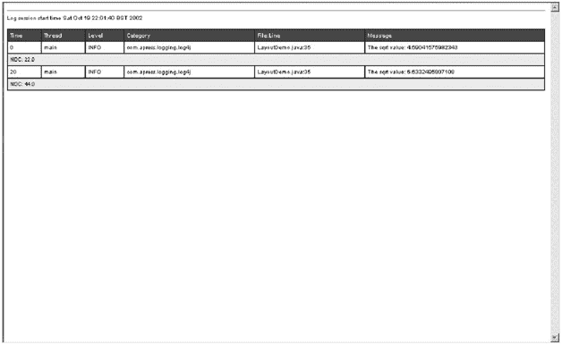
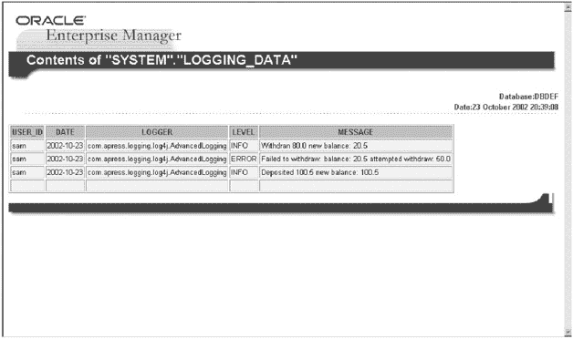
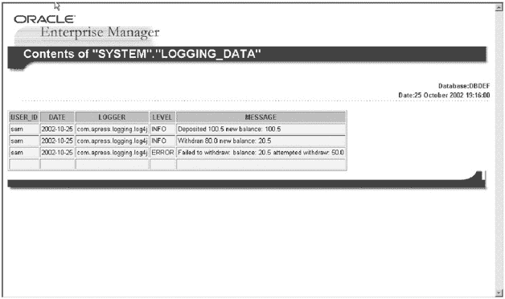
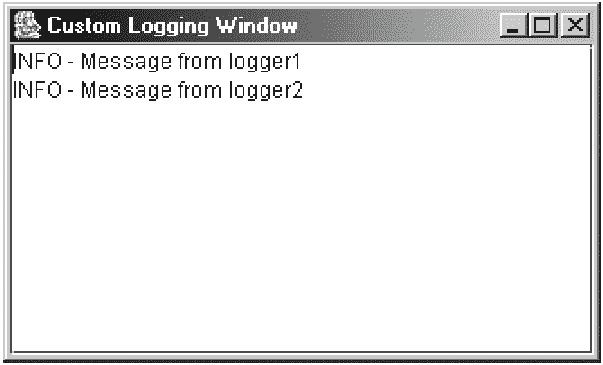
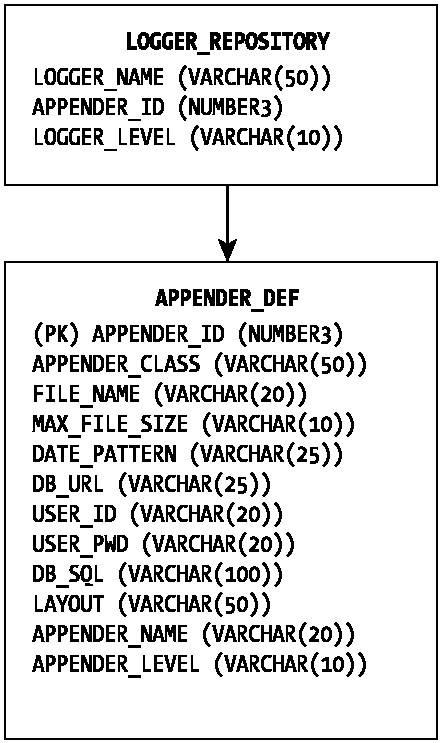
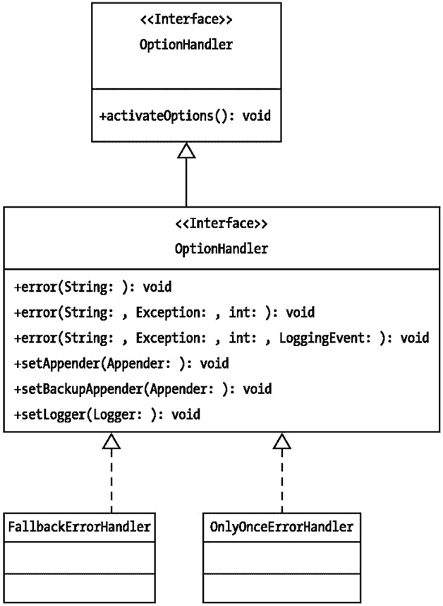
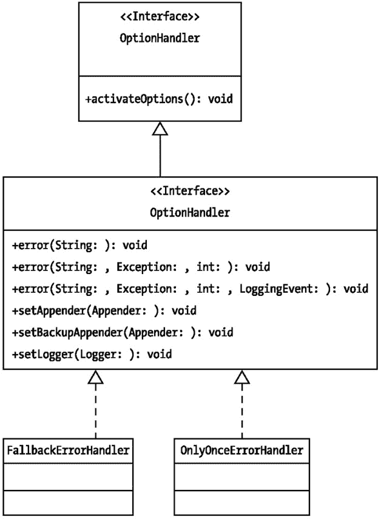

# 配置 TTCCLayout 布局
log4j.appender.CONSOLE.layout.ThreadPrinting=false
log4j.appender.CONSOLE.layout.ContextPrinting=false
log4j.appender.CONSOLE.layout.CategoryPrefixing=false
log4j.appender.CONSOLE.layout.DateFormat=RELATIVE
```

| **** |

|  |

|  | 注意  | 使用此配置文件执行程序时，请记得关闭程序构造函数中的配置代码。在两个地方进行相同的配置是没有意义的。 |

在此配置中，我们禁用了 `ThreadPrinting` 和 `ContextPrinting` bean 属性。如表 6-5 所述，`DateFormat` bean 属性默认为 `RELATIVE`，这意味着该程序将打印自程序启动以来经过的毫秒时间。

使用此配置文件执行清单 6-1 中的示例程序，将在控制台中显示以下日志信息：

```
40 INFO 22.0 - The sqrt value: 4.69041575982343
50 INFO 44.0 - The sqrt value: 6.6332495807108
```

请注意，由于我们禁用了 `ContextPrinting` 属性，线程和 `NDC` 信息现在不再作为日志信息的一部分显示。

|  | 警告  | 不要在两个不同的 `Appender` 对象中使用同一个 `TTCCLayout` 实例。这不是线程安全的。 |

### DateLayout 对象

正如我们在上一节中所见，`TTCCLayout` 类使用另一个类 `DateLayout` 来格式化其日期和时间戳相关信息。`DateLayout` 是一个 `abstract` 类，它扩展了 `org.apache.log4j.Layout` 类。它也是一个用于处理所有日期相关格式化任务的便捷类，它接受一个 `LoggingEvent` 对象和一个日期格式，用于格式化 `LoggingEvent` 对象中包含的时间戳。

`DateLayout` 类具有表 6-6 中列出的 bean 属性，用于设置日期相关格式化任务的参数。

表 6-6：DateLayout 类中的 Bean 属性

| Bean 属性 | 方法 | 描述 | 默认值 |
| --- | --- | --- | --- |
| `dateFormat` | `setDateFormat(String)` | 设置日期格式，使用 Java `SimpleDateFormat` 样式（例如 `yyyy-MM-dd`）或字符串 NULL、RELATIVE、DATE、ABSOLUTE 或 ISO8601 之一 | 默认为 RELATIVE |
| `timeZone` | `setTimeZone(String)` | 以 `java.util.TimeZone.getTimeZone(String)` 方法指定的时区（例如 GMT-8:00） | 默认为空 |

与 `DateLayout` 一起使用的日期格式具有表 6-7 中列出的属性。

表 6-7：DateLayout 类中的日期格式

| 日期格式 | 含义 |
| --- | --- |
| NULL | 不显示任何日期或时间。 |
| RELATIVE | 显示应用程序启动后经过的时间。 |
| DATE | 使用 `dd MMM YYYY HH:mm:ss, SSS` 模式格式化日期——例如，2002 年 10 月 10 日 15:30:39,450。最后的 `SSS` 表示应用程序启动后经过的时间。 |
| ABSOLUTE | 使用 `HH:mm:ss, SSS` 模式格式化日期——例如，10:49:33,459。最后的 `SSS` 表示应用程序启动后经过的时间。 |
| ISO8601 | 使用 `YYYY-mm-dd HH:mm:ss, SSS` 模式格式化日期——例如，2002-10-20 10:49:33,459。 |

任何我们想要格式化和发布与日志相关的日期和时间戳信息的 `Layout` 对象，都可能使用此类来格式化此类信息。

### HTMLLayout 对象

一个设计良好的系统的目标是让用户对信息的呈现方式感到舒适。在这方面，您的应用程序可能需要以漂亮的 HTML 格式文件生成日志信息。`org.apache.log4j.HTMLLayout` 是一个专门用于以 HTML 格式格式化日志信息的对象。

`HTMLLayout` 类扩展了 `abstract org.apache.log4j.Layout` 类，并重写了其基类中的 `format()` 方法以提供 HTML 样式的格式化。这是一个非常简单的 `Layout` 对象，具有表 6-8 中列出的可配置 bean 属性。

表 6-8：HTMLLayout 中的 Bean 属性

| Bean 属性 | 方法 | 描述 | 默认值 |
| --- | --- | --- | --- |
| `contentType` | `setContentType(String)` | 设置 HTML 内容的内容类型。 | 默认为 "text/html" |
| `locationInfo` | `setLocationInfo(String)` | 设置日志事件的位置信息。 | 默认为 `false` |
| `title` | `setTitle(String)` | 设置 HTML 内容的标题。 | 默认为 "Log4j Log Messages" |

`HTMLLayout` 对象在其显示的日志信息中包含以下内容：

*   从应用程序启动到生成特定日志事件之前经过的时间
*   调用日志请求的线程名称
*   与此日志请求关联的级别
*   日志记录器的名称
*   程序文件和调用此日志的行号的可选位置信息
*   日志消息
*   `NDC` 信息
*   应用程序中生成并需要记录的任何异常（这是因为该对象能够处理 `java.lang.Throwable` 实例。）

为了演示 `HTMLLayout` 对象的格式化能力，我们将使用清单 6-1 中提供的相同程序，但传递一个不同的配置文件来使用 `HTMLLayout` 配置日志记录器。清单 6-3 描述了此配置文件 "html.properties"。

清单 6-3：html.properties

| **** |

```
#配置自定义日志记录器
log4j.logger.com.apress.logging.log4j=DEBUG, FILE

log4j.appender.FILE=org.apache.log4j.FileAppender
log4j.appender.FILE.File=htmlLayout.html

log4j.appender.FILE.layout=org.apache.log4j.HTMLLayout
log4j.appender.FILE.layout.Title=HTML 布局演示
log4j.appender.FILE.layout.LocationInfo=true
```

| **** |

|  |

在配置文件中，我们为 `FileAppender` 对象分配了文件名 "htmlLayout.html"，日志信息将写入此文件。该文件将在您运行应用程序的路径中创建。`FileAppender` 反过来使用 `HTMLLayout` 来格式化日志信息。`HTMLLayout` 对象的 bean 属性 `LocationInfo` 设置为 `true`，`Title` 设置为 "HTML 布局演示"。

使用此配置文件执行程序将创建包含所有日志信息的 "htmlLayout.html" 文件。图 6-2 显示了此 HTML 文件。


图 6-2：使用 HTMLLayout 生成的 HTML 文件


#### 关于使用 HTMLLayout 的注意事项

我们对 `HTMLLayout` 的讨论尚未完全结束，还需要快速审视一下上一个示例中生成的源文件可能存在的问题。如果打开该文件，我们将看到清单 6-4 中所示的 HTML 代码。

**清单 6-4：HTMLLayout 生成的 HTML 源代码**

| **** |

```
 <!DOCTYPE HTML PUBLIC "-//W3C//DTD HTML 4.01 Transitional//EN"
"http://www.w3.org/TR/html4/loose.dtd">
<html>
<head>
<title>Log4J 日志消息</title>
<style type="text/css">
<!--
body, table {font-family: arial, sans-serif; font-size: x-small;}
th {background: #336699; color: #FFFFFF; text-align: left;}
-->
</style>
</head>
<body bgcolor="#FFFFFF" topmargin="6" leftmargin="6">
<hr size="1" noshade>
日志会话开始时间 2002 年 10 月 19 日 星期六 22:01:40 BST<br>
<br>
<table cellspacing="0" cellpadding="4" border="1" bordercolor="#224466"
width="100%">
<tr>
<th>时间</th>
<th>线程</th>
<th>级别</th>
<th>类别</th>
<th>文件:行号</th>
<th>消息</th>
</tr>

<tr>
<td>0</td>
<td title="主线程">main</td>
<td title="级别">INFO</td>
<td title="com.apress.logging.log4j 类别">com.apress.logging.log4j</td>
<td>LayoutDemo.java:35</td>
<td title="消息">平方根值: 4.69041575982343</td>
</tr>
<tr><td bgcolor="#EEEEEE" style="font-size : xx-small;" colspan="6"
title="嵌套诊断上下文">NDC: 22.0</td>xs</tr>
<tr>
<td>20</td>
<td title="主线程">main</td>
<td title="级别">INFO</td>
<td title="com.apress.logging.log4j 类别">com.apress.logging.log4j</td>
<td>LayoutDemo.java:35</td>
<td title="消息">平方根值: 6.6332495807108</td>
</tr>
<tr><td bgcolor="#EEEEEE" style="font-size : xx-small;" colspan="6"
title="嵌套诊断上下文">NDC: 44.0</td></tr>
```

| **** |

|  |

请注意，头部信息包含 `<html>` 和 `<body>` 标签，但 `</body>` 和 `</html>` 标签的尾部信息完全缺失。显然，这不是一个格式良好的 HTML 文件。某些浏览器可能允许使用这种风格的 HTML 源代码，但有些则可能不允许。问题是，为什么尾部信息（即结束标签）会缺失呢？

答案在于 `HTMLLayout` 的 `getFooter()` 方法被调用的时机。按照 log4j 1.2.6 版本的当前实现，任何 `Layout` 对象的 `getFooter()` 方法都是在相关 `Appender` 对象的 `close()` 方法被调用时才会被调用。这可能是 API 中的一个小错误，也可能不是，具体取决于应用程序执行日志记录活动的方式。

想象一个作为服务器组件、处理多个客户端调用的应用程序模块。对于每次调用，我们都希望将日志信息写入一个 HTML 文件。我们希望头部信息仅在 `HTMLLayout` 对象初始化时包含一次。这已在初始化时通过 `HTMLLayout` 的 `setWriter()` 方法完成。现在的问题是我们何时写入尾部信息。当然不是在每条日志信息追加到文件之后。等等——如果我们希望每次日志请求都打开一个新文件并在日志记录结束后关闭文件，那么可能确实需要这样做。在这种情况下，如果在每次日志请求格式化后调用 `getFooter()` 方法，那将完全没问题。但在正常情况下，如果我们希望将所有日志信息包含在一个文件中，或者更严格地说，该文件包含多个日志请求的日志信息，我们就不能每次都追加尾部信息。

显然，调用 `getFooter()` 的最佳时机是当 `Appender` 对象本身不再需要时。在这种情况下，当我们退出服务器组件（例如 servlet 中的 `destroy()` 方法）时，我们会调用 `LogManager.shutdown()` 方法来关闭所有 `Appender` 对象。这确保了尾部信息被写入生成的 HTML 文件的末尾。

在这个特定示例中，在 `computeSquareRoot()` 方法中，就在离开该方法之前，如果我们调用

```
LogManager.shutDown()
```

我们会看到尾部信息被包含在最终的 HTML 文件中。这可能不是理想的情况，但这就是我们目前必须处理的方式。

### XMLLayout 对象

HTML 格式的日志信息友好且易于阅读，但不易于重用。数据是结构化的，但*并非*以描述性的方式呈现。HTML 风格的日志信息无法在多个应用程序模块之间移植。为了以可移植的 XML 格式呈现日志信息，log4j 提供了 `org.apache.log4j.xml.XMLLayout` 对象。

`XMLLayout` 对象可以在最终输出中包含来自 `LoggingEvent` 的以下项目：

*   日志记录器名称
*   时间戳
*   与日志请求关联的级别
*   调用线程名称
*   日志消息
*   `NDC` 信息
*   `LoggingEvent` 中包含的 `java.lang.Throwable` 实例
*   日志请求的位置信息（默认情况下，位置信息功能是关闭的）

`XMLLayout` 遵循 "log4j.dtd" 文件中包含的文档类型定义来创建 XML 输出。需要注意的是，最终输出*不是*一个格式良好的 XML 文件。这听起来可能令人惊讶，但此对象的目的是将日志信息生成为一系列 `<log4j:event>` 元素。然后，最终输出可以作为实体被另一个正确的 XML 文件引用。

|  | 注意 | 请参考 Apache log4j 二进制发行版附带的 "log4j.dtd" 文件。 |

为了说明这个概念，让我们再次重用清单 6-1 中的程序，并使用清单 6-5 中定义的 `XMLLayout` 配置文件 "xml.properties"。

**清单 6-5：xml.properties**

| **** |

```
#配置自定义日志记录器
log4j.logger.com.apress.logging.log4j=DEBUG, FILE

log4j.appender.FILE=org.apache.log4j.FileAppender
log4j.appender.FILE.File=xmlLayout.xml

log4j.appender.FILE.layout=org.apache.log4j.xml.XMLLayout
log4j.appender.FILE.layout.LocationInfo=true
```

| **** |

|  |

该配置使用 `FileAppender` 和 `XMLLayout` 来格式化日志信息。

使用此配置文件执行程序会将格式化后的日志信息写入 "xmlLayout.xml" 文件。该文件的内容类似于以下内容：

```
<log4j:event logger="com.apress.logging.log4j" timestamp="1035061552691"
level="INFO" thread="main">
<log4j:message><![CDATA[平方根值: 4.69041575982343]]></log4j:message>
<log4j:NDC><![CDATA[22.0]]></log4j:NDC>
<log4j:locationInfo class="com.apress.logging.log4j.LayoutDemo"
method="computeSquareRoot" file="LayoutDemo.java" line="35"/>
</log4j:event>

<log4j:event logger="com.apress.logging.log4j" timestamp="1035061552711"
level="INFO" thread="main">
<log4j:message><![CDATA[平方根值: 6.6332495807108]]></log4j:message>
<log4j:NDC><![CDATA[44.0]]></log4j:NDC>
<log4j:locationInfo class="com.apress.logging.log4j.LayoutDemo"
method="computeSquareRoot" file="LayoutDemo.java" line="35"/>
</log4j:event>
```

显而易见，XML 输出是一系列 `<log4j:event>` 元素，其中包含其他子元素来呈现日志信息。下面描述的代码片段展示了如何将此信息包含在一个格式良好的 XML 文件中：

```
 <?xml version="1.0" ?>

<!DOCTYPE log4j:eventSet SYSTEM "log4j.dtd" [<!ENTITY logEntity SYSTEM
"xmlLayout.xml">]>

<log4j:eventSet version="1.2" xmlns:log4j="http://jakarta.apache.org/log4j/">
 &logEntity;
</log4j:eventSet>
```

乍一看，这可能会令人困惑。但其背后的原理是，它使得将日志消息渲染为 XML 格式的 `Layout` 对象和使用此 `Layout` 的 `Appender` 对象彼此独立。


为了进一步说明，假设你正在编写一个自定义的附加器（appender）。你希望该附加器在每次日志输出时都包含公司信息头，并且希望日志信息以 XML 格式发布。在这种情况下，你需要在自定义附加器中重写 `doAppend()` 方法，将日志信息写入 XML 文件。同时，你可以包含一个包含公司信息的标准头部，并仍然使用现有的 `XMLLayout` 对象，以其自身的风格格式化日志信息。然后，你可以在整个 XML 文件中，将 `XMLLayout` 对象生成的文件引用为外部 `ENTITY`。显然，你实现了将 `XMLLayout` 对象生成的 XML 日志信息作为任何其他 XML 内容的 `ELEMENT` 包含进来的灵活性。

### PatternLayout 对象

格式化任何信息片段意味着赋予它一种能被某些外部实体理解和识别的模式。通过为日志信息提供一种模式，该信息将被人类或程序识别。模式进一步意味着，如果产生日志信息的模块和接收信息的模块事先就某种模式达成一致，那么该信息就可以被处理。这就是 `PatternLayout` 发挥作用的地方。

`org.apache.log4j.PatternLayout` 扩展了基础的 `abstract` 类 `Layout`，并重写了 `format()` 方法，以根据提供的模式来结构化日志信息。我们可以通过配置文件或编程方式提供该模式。`PatternLayout` 对象具有表 6-9 中列出的 bean 属性。

表 6-9：PatternLayout 中的 Bean 属性

| Bean 属性 | 方法 | 描述 | 默认值 |
| --- | --- | --- | --- |
| `conversionPattern` | `setConversionPattern()` | 设置转换模式 | 默认为 `%r [%t] %p %c %x - %m%n` |

`PatternLayout` 可以在最终消息中包含 `LoggingEvent` 对象中的所有信息。它可以处理的项目列表见表 6-10。注意，`java.lang.Throwable` 实例是例外情况。

表 6-10：PatternLayout 的转换字符

| 转换字符 | 含义 |
| --- | --- |
| `c` | 用于调用此日志请求的 `Logger`。它可以选择性地接受一个精度说明符。例如，在我们的示例中，Logger 名称是 `com.apress.logging.log4`。使用精度说明符 `c{2}`，logger 将被打印为 "logging.log4j"。注意，最终输出中只包含从右侧算起的相应数量的元素。 |
| `C` | 调用此日志请求的 `Logger` 的完全限定名称。它也可以接受如转换字符 `c` 所述的精度说明符。生成 logger 的完全限定名称可能非常慢。 |
| `d` | 日志请求的日期。它也可以接受一个可选的日期说明符。例如，`%d{yyyy-MM-dd}` 将以年-月-日格式打印日期。如果未指定日期格式，则使用 log4j 内部定义的 ISO8601 格式。由于 `java.text.SimpleDateFormat` 的性能较差，为了获得更好的结果，请使用 log4j API 提供的 `DateFormat` 对象。 |
| `F` | 发出日志请求的文件名。 |
| `l` | 位置信息。在处理任何异常堆栈跟踪时，此信息非常有用。但是，使用 log4j 生成此信息可能非常慢。在使用此功能之前需要权衡利弊。 |
| `L` | 发出日志请求的程序文件中的行号。 |
| `m` | 日志消息。 |
| `M` | 发出日志请求的程序中的方法。 |
| `n` | 平台相关的行分隔符。 |
| `p` | 与日志请求关联的级别。 |
| `r` | 相对日期格式，显示从应用程序启动到发出此日志请求所经过的毫秒数。 |
| `t` | 调用线程。 |
| `x` | `NDC` 信息。 |
| `X` | `MDC` 信息。`X` 转换字符后跟 `MDC` 的键。例如，`X{clientIP}` 将打印存储在 `MDC` 中键为 `clientIP` 的信息。 |
| `%` | 字面百分号。`%%` 将打印一个 % 符号。 |

`PatternLayout` 根据给定的模式格式化日志信息。提供的模式主要规定了以下项目：

*   格式化信息由*格式修饰符*决定。
*   要显示的信息由*转换字符*决定。

表 6-10 显示了所有可与 `PatternLayout` 一起使用的转换字符。

与 `PatternLayout` 一起使用的格式修饰符在表 6-11 中描述。

表 6-11：PatternLayout 中使用的格式修饰符

| 修饰符 | 左对齐 | 最小宽度 | 最大宽度 | 含义 |
| --- | --- | --- | --- | --- |
| `%10c` | 否 | 10 个字符 | 无 | 显示 logger 名称。如果名称少于 10 个字符，则在左侧填充空格。 |
| `%-10c` | 是 | 10 个字符 | 无 | 显示 logger 名称。如果名称少于 10 个字符，则在右侧填充空格。 |
| `%.20c` | 否 | 无 | 20 个字符 | 显示 logger 名称。如果名称超过 20 个字符，则从开头截断。 |
| `%20.30c` | 否 | 20 个字符 | 30 个字符 | 显示 logger 名称。如果名称小于最小宽度（20 个字符），则在左侧填充空格；如果名称超过 30 个字符，则从开头截断。 |
| `%-20.30c` | 是 | 20 个字符 | 30 个字符 | 显示 logger 名称。如果名称短于 20 个字符，则在右侧填充空格以保持左对齐。如果名称长于 30 个字符，则从开头截断。 |

为了说明转换模式的能力，让我们尝试使用 `LayoutDemo.java`（清单 6-1）并向其传递以下配置文件。该配置将指定 `PatternLayout` 作为与 `ConsoleAppender` 一起使用的 `Layout` 对象，并且我们将向 `PatternLayout` 传递一个适当的转换模式。

```
#配置自定义 logger
log4j.logger.com.apress.logging.log4j=DEBUG, CONSOLE

log4j.appender.CONSOLE=org.apache.log4j.ConsoleAppender

log4j.appender.CONSOLE.layout=org.apache.log4j.PatternLayout
log4j.appender.CONSOLE.layout.ConversionPattern=%d{yyyy-MM-dd}-%t-%x-%-5p-%-
10c:%m%n
```

使用此配置文件执行程序将向控制台产生以下输出：

```
2002-10-20-main-22.0-INFO -com.apress.logging.log4j:The sqrt value:
4.69041575982343
2002-10-20-main-44.0-INFO -com.apress.logging.log4j:The sqrt value:
6.6332495807108
```

既然你已经理解了转换模式，你应该能够看出转换模式 `%r [%t] %p %c %x - %m%n` 实际上就是 `TTCCLayout`。

## 结论

在本章中，我们详细讨论了每个 `Layout` 对象的行为方式，以及如何通过配置文件配置这些对象。log4j API 提供了一套全面的 `Layout` 对象，足以满足大多数应用程序的需求。如果你的应用程序需要更复杂的 `Layout` 对象，则需要自己创建一个。我们将在第 8 章中了解如何编写一个新的 `Layout` 对象。在下一章中，我们将继续讨论 log4j，探讨如何在分布式计算领域交付日志信息。

# 第 7 章：使用 log4j 进行高级日志记录


## 概述

本章专门介绍使用 log4j API 进行日志记录的高级主题。将日志信息写入控制台或文件在灵活性和可重用性方面存在局限。打印到控制台的日志信息相当短暂，一旦应用程序退出当前运行实例，这些信息很可能会消失。因此，基于控制台的日志信息更适合开发阶段的调试消息。

另一方面，将日志信息打印到系统本地文件效率低下，因为其他可能使用相同日志信息的应用程序很难访问它。要使这些信息对其他应用程序模块可访问，将需要额外的工作。

尽管日志记录的一个重要方面是支持应用程序模块的远程调试和套接字管理，但使日志数据可被远程应用程序模块访问也同样重要。有时，日志数据的性质是敏感的，可能需要在数据库中维护日志信息的历史记录。在其他场景中，当我们想要实时处理任何敏感的日志数据时，我们可能希望通过 TCP/IP 套接字将数据发布到另一个准备响应发送给它的信息的服务器组件。此外，我们可能需要维护一个订单处理系统，其中某些特定于客户的日志信息会通过电子邮件发送给相应的客户。这些只是我们可能希望用日志信息实现的众多可能性中的一小部分。

可以说，在大多数正常的应用场景中，基于文件的日志记录就足够了。然而，在分布式计算场景中，可能会出现我们需要分布式日志记录功能的情况。在这种情况下，log4j 的强大功能使我们能够充分利用其日志记录特性。

log4j API 通过提供不同的 `Appender` 对象来处理所讨论的许多情况。这个列表可能并不详尽，也可能无法满足不同应用程序可能出现的所有特定情况，但对于大多数常见的应用场景来说已经足够了。如果应用程序需要不同的功能，该 API 提供了灵活的设计，使我们能够在 API 中集成自定义对象，或扩展现有框架以满足应用程序的特定需求。

在本章中，我们将讨论如何通过以下方式分发和存储日志数据：

*   将日志信息写入数据库
*   使用 Java 消息服务 (JMS) 分发日志数据
*   通过简单邮件传输协议 (SMTP) 分发日志数据
*   通过 TCP/IP 套接字发送日志数据
*   使用 Telnet 协议将日志数据上传到远程机器
*   将日志数据存储在特定于操作系统的事件日志中

在接下来的几节中，我们将逐一讨论 log4j API 中提供的不同 `Appender` 对象，以及它们如何完成管理和分发日志数据的任务。

## 一个高级日志记录示例应用

我们将首先创建一个简单的程序，在本章中我们将使用它来演示不同高级 `Appender` 对象的功能。该程序获取一个命名的日志记录器实例 `com.apress.logging.log4j`。`deposit()` 和 `withdraw()` 方法分别向账户存入和取出一些金额。存入的金额会加到余额中。`withdraw()` 方法仅在资金充足时才允许取款，然后从当前余额中扣除取出的金额。如果余额不足，该程序将向用户打印一条消息。

该应用程序为这两个方法记录活动，并使用用户名作为 `NDC` 信息。该应用程序还记录每个操作的成功和失败。清单 7-1 `AdvancedLogging.java` 是所描述业务过程的一个示例实现。

清单 7-1: AdvancedLogging.java

| **** |

```
package com.apress.logging.log4j;

import org.apache.log4j.Logger;
import org.apache.log4j.NDC;
public class AdvancedLogging
{
    private static Logger logger =
Logger.getLogger(AdvancedLogging.class.getPackage().getName());
    private String userName = null;
    private double balance;

    /** 创建 AdvancedLogging 的一个新实例 */
    public AdvancedLogging(String user)
    {
        this.userName = user;
    }
    /**
     *存入一些金额
     */
    public void deposit(double amount)
    {
        NDC.push(userName);
        balance += amount;
        logger.info("存入 "+amount+" 新余额: "+balance);
        NDC.pop();
    }
    /**
     *取出一些金额
     */
    public void withdraw(double amount)
    {
        NDC.push(userName);
        if(balance>=amount)
        {
            balance -= amount;
            logger.info("取出 "+amount+" 新余额: "+balance);
        }else
        {
            System.out.println("余额不足");
            logger.error("取款失败: 余额: "+balance+" 尝试取款: "+amount);
        }
        NDC.pop();
    }
    public static void main(String args[])
    {
        AdvancedLogging demo = new AdvancedLogging("sam");
        demo.depositBalance(100.50);
        demo.withDraw(80);
        demo.withDraw(50);
    }
}
```

| **** |

|  |


## 使用 JDBCAppender 将日志记录到数据库

将所需的日志数据存储在数据库中通常是一种良好的实践。这有两个目的：第一，数据得以持久化；第二，位于被记录日志的应用程序域之外的其他应用程序可以访问和分析这些数据。

log4j API 提供了 `org.apache.log4j.jdbc.JDBCAppender` 对象，它能够将日志信息放入指定的数据库。它执行一些简单的任务，例如通过读取传递给它的 JDBC 连接参数来打开数据库连接，按照指定的 SQL 语句将数据写入一个或多个表，然后关闭连接。我们可以扩展 `JDBCAppender` 对象的功能以满足我们的需求。目前，`JDBCAppender` 按以下方式运行：

*   它具有缓冲实现。传递给它的日志事件存储在一个预定义大小的缓冲区中。一旦达到缓冲区的最大大小，缓冲区就会被刷新，并按照指定的 SQL 语句将数据写入表中。

*   它会打开一个到数据库的单一连接，并保持该连接直到 appender 被关闭。

*   由于针对特定记录的 SQL 操作可以是 INSERT、UPDATE 或 DELETE，`JDBCAppender` 巧妙地使用了 `java.sql.Statement` 对象的 `executeUpdate()` 方法。这提供了执行任何类型 SQL 语句的灵活性。是否插入、更新或删除特定日志记录的决定由应用程序开发者决定，并通过配置文件中的 SQL 语句指定。`JDBCAppender` 不会对 SQL 语句的性质做出任何决定。它仅仅执行传递给它的 SQL 语句。

*   尽管 `JDBCAppender` 不决定要执行的 SQL 语句的性质，但它负责维护正在记录的日志事件的完整性。`JDBCAppender` 中的方法不是 `synchronized` 的，以保持其性能不受影响。这可能会产生数据完整性问题。在缓冲区中的所有元素被写入数据库之前，可能会有另一个日志请求到达。缓冲区会追加新的日志事件。`JDBCAppender` 识别到缓冲区中的这个新数据后，会再次尝试遍历缓冲区，将其中的所有元素写入数据库。这可能导致尝试在数据库中写入重复数据，这必然会导致数据库错误。

*   为了避免刚才提到的问题，在缓冲区的每个元素被写入数据库后，`JDBCAppender` 会将其存储在一个二级缓冲区中。最后，它会比较主缓冲区与二级缓冲区中的元素，并从主缓冲区中移除所有存在于二级缓冲区中的元素。这确保了主缓冲区中不会保留重复的元素。

*   `JDBCAppender` 提供了一个 `close()` 方法来释放任何获取到的数据库资源。理论上，`close()` 方法可以在应用程序生命周期的任何时候被调用。此外，当应用程序通过调用 `LogManager.shutdown()` 方法终止时，系统中所有活跃的 appender 的 `close()` 方法都会被调用。如果在 `JDBCAppender` 实例完成其写入操作之前调用了 `close()` 方法，这可能会导致数据丢失。为了确保数据不丢失，`JDBCAppender` 中的 `close()` 方法会刷新主缓冲区，以确保缓冲区中已有的数据被写入数据库。

### 配置 JDBCAppender

在我们进入 `JDBCAppender` 的实际示例之前，首先理解如何配置 `JDBCAppender` 对象非常重要。`JDBCAppender` 具有 表 7-1 中列出的可配置 bean 属性。

表 7-1：JDBCAppender 类中的 Bean 属性

| Bean 属性 | 方法 | 描述 | 默认值 |
| --- | --- | --- | --- |
| `bufferSize` | `setBufferSize(int)` | 设置缓冲区大小 | 默认大小为 1。 |
| `driver` | `setDriver(String)` | 将驱动程序类设置为指定的字符串 | 如果未指定驱动程序类，则默认为 "sun.jdbc.odbc.JdbcOdbcDriver"。 |
| `layout` | `setLayout(String)` | 设置要使用的布局 | 默认为 `org.apache.log4j.PatternLayout`。 |
| `password` | `setPassword(String)` | 根据指定的用户名设置密码以获取数据库连接 | 用户必须指定一个有效的密码才能访问数据库。 |
| `URL` | `setURL(String)` | 设置 JDBC URL | 默认为某个任意值。用户必须指定一个正确的 JDBC URL。 |
| `user` | `setUser(String)` | 设置用于获取指定数据库连接的用户名 | 用户必须指定一个有效的用户名才能访问数据库。 |

### 创建用于存储日志信息的表

清单 7-2 描述了用于创建名为 LOGGING_DATA 的表以存储日志信息的 SQL 语句。

清单 7-2：创建 LOGGING_DATA 表的 SQL

| **** |

```
CREATE TABLE LOGGING_DATA
("USER_ID" VARCHAR2(10) NOT NULL,
"DATE" VARCHAR2(10) NOT NULL,
"LOGGER" VARCHAR2(50) NOT NULL,
"LEVEL" VARCHAR2(10) NOT NULL,
"MESSAGE" VARCHAR2(1000) NOT NULL)
```

| **** |

|  |

### 与 JDBCAppender 配合使用的配置文件

清单 7-3 "jdbc.properties" 描述了我们将用于将消息记录到数据库表的配置文件。

清单 7-3：jdbc.properties

| **** |

```
#配置自定义日志记录器
log4j.logger.com.apress.logging.log4j=DEBUG, DB

log4j.appender.DB=org.apache.log4j.jdbc.JDBCAppender
log4j.appender.DB.URL=jdbc:odbc:dbdef
log4j.appender.DB.user=system
log4j.appender.DB.password=manager
log4j.appender.DB.sql=INSERT INTO LOGGING_DATA VALUES('%x','%d{yyyy-MM-
dd}','%C','%p','%m')
```

| **** |

|  |

在配置文件中，我们为名为 `com.apress.logging.log4j` 的日志记录器分配了 DEBUG 级别和一个 `JDBCAppender`。`JDBCAppender` 对象被赋予以下配置参数：

*   要连接的数据库 URL 是 `jdbc:odbc:dbdef`，其中 `dbdef` 是我们正在连接的数据库名称。

*   连接数据库的用户 ID 是 `system`，密码是 `manager`。

*   要执行的 SQL 是一个 INSERT 语句，表名为 LOGGING_DATA，以及要插入表中的值。请注意，这些值是按照 `PatternLayout` 指定的（有关 `PatternLayout` 对象的详细信息，请参阅上一章）。指定的值遵循与表列相同的顺序，并插入 `NDC`、日志日期、日志记录器的完全限定名称、日志级别，最后是日志消息本身。

使用 "jdbc.properties" 文件作为配置文件执行此程序会将数据写入数据库。图 7-1 展示了存储在 LOGGING_DATA 表中的数据的 HTML 报告。


图 7-1：LOGGING_DATA 表

也许您已经注意到，无需进行任何 JDBC 编程即可将数据写入数据库。这一切都在 `JDBCAppender` 内部完成。此外，请注意，此示例展示了 log4j 的强大功能，即只需更改传递给它的配置文件即可更改日志信息的目标位置，而无需更改任何代码。


### 扩展 JDBCAppender

`JDBCAppender` 足以执行简单的 SQL 操作。它从配置文件中读取 SQL 查询和其他与 JDBC 相关的参数，并执行 SQL 操作。SQL 优化的一个关键因素是能够执行动态 SQL 查询。在 Java 语言中，动态 SQL 通过 `java.sql.PreparedStatement interface` 类型的对象来处理。如果你熟悉 JDBC 编程，就会知道如何使用 `PreparedStatement` 对象。`JDBCAppender` 本身并*不*使用 `PreparedStatement` 对象来处理与数据库相关的操作。

可以通过创建 `JDBCAppender` 的子类来扩展其功能。我们将看一个自定义 `JDBCAppender` 的示例，使其能够灵活地与 `PreparedStatement` 对象一起工作。除了 `JDBCAppender` 标准配置参数外，我们将在初始化时接受以下配置参数：

*   `sqlString`：表示动态 SQL 结构的 SQL 字符串。这与 JDBC 中 `PreparedStatement` 对象使用的结构类似。

*   `values`：构建 `PreparedStatement` 对象后，我们需要为不同的列设置值。这些值将以 `PatternLayout` 结构的形式包含日志信息的不同方面。例如，`%p-%m` 将被转换为 LEVEL-MESSAGE 格式的字符串。

|  | 注意 | 在接下来的示例中，我们将重用清单 7-2 中描述的数据库表 LOGGING_DATA。 |

现在，我们将编写一个执行 JDBC 操作的自定义 `Appender` 对象示例。启动时，此 `Appender` 对象将通过传递给 log4j 运行时的配置文件中指定的 bean 属性值进行初始化。`CustomJDBCAppender` 对象从其基类 `JDBCAppender` 继承所有属性和一些方法。具体来说，它仅覆盖了 `JDBCAppender` 类中的以下方法：

*   `execute(String sql)`：重写此方法以使用 `PreparedStatement` 对象。

*   `doAppend(LoggingEvent event)`：重写此方法以执行正常的 appender 活动。

`CustomJDBCAppender` 提供了自己的方法来设置和检索其特定的 bean 属性。这里需要注意的一点是，我们使用 `PatternLayout` 来转换日志信息，并且需要告诉 `PatternLayout` 要处理的模式。在此上下文中，我们希望通过 `PatternLayout` 转换通过 `CustomJDBCAppender` 的 `values` bean 属性传递的信息。因此，在 `setValues()` 方法中，我们使用 `values` bean 属性中包含的信息创建一个 `PatternLayout`。最后，我们将创建的 `PatternLayout` 对象设置为 `CustomJDBCAppender` 的布局。

重写的 `execute()` 方法执行以下工作：

1.  它通过调用 `CustomJDBCAppender` 的 `private` 方法 `getPreparedStatement()` 来获取 `PreparedStatement` 对象的实例。

2.  然后，此方法将格式化的日志信息进行分词，每个分词代表表中每一列的值。

3.  值的提供顺序必须与表列的顺序相同。这个条件可能不理想，但有助于简化此示例。

4.  然后，它使用 `PreparedStatement` 对象的 `setString(int, Object)` 方法为每一列设置值。同样，这段代码假设表中的所有列都是 VARCHAR 类型，这对于我们在此示例中使用的表来说是成立的。但在现实中，列类型可以是任何类型，程序需要能够处理这种情况。

5.  最后，通过调用 `PreparedStatement` 的 `executeUpdate()` 方法来执行 SQL 操作。

清单 7-4 `CustomJDBCAppender.java` 是一个自定义 `JDBCAppender` 的实现示例。

清单 7-4：CustomJDBCAppender.java

| **** |

```
package com.apress.logging.log4j.appender;

import org.apache.log4j.jdbc.JDBCAppender;
import java.sql.PreparedStatement;
import java.sql.Connection;
import java.sql.SQLException;
import org.apache.log4j.spi.LoggingEvent;
import org.apache.log4j.PatternLayout;
import java.util.StringTokenizer;

public class CustomJDBCAppender extends JDBCAppender {

/** 保存属性 values 的值。 */
    private String values;

/** prepared statement 对象 **/
    private PreparedStatement stmt = null;

/** 保存属性 preparedSQL 的值。 */
    private String preparedSQL;

/** 创建 CustomJDBCAppender 的新实例 */
    public CustomJDBCAppender() {
    }

public void doAppend(LoggingEvent event) {
        buffer.add(event);
        if(buffer.size()>=bufferSize) {
          flushBuffer();
        }
    }

/**
     * 从 JDBCAppender 重写的方法。此方法在执行语句之前
     * 设置 prepared statement 的参数
     **/
    public void execute(String sql) throws SQLException {
        PreparedStatement stmt = getPreparedStatement();
        StringTokenizer tokenizer = new StringTokenizer(sql, ",");
        int i=1;
        while(tokenizer.hasMoreTokens()) {
            String token = tokenizer.nextToken();
            stmt.setString(i, token);
            i++;
        }
        stmt.executeUpdate();

}

/**
     * 此方法获取 prepared statement 对象
     **/
    private PreparedStatement getPreparedStatement() throws SQLException {
        // 重用父类中的 getConnection() 方法
        Connection conn = getConnection();
        if(stmt==null) {
            stmt = conn.prepareStatement(getPreparedSQL());
        }
        return stmt;
    }

/** 属性 values 的 getter 方法。
     * @return 属性 values 的值。
     */
    public String getValues() {
        return this.values;
    }

/** 属性 values 的 setter 方法。
     * @param values 属性 values 的新值。
     */
    public void setValues(String values) {
        PatternLayout layout = new PatternLayout(values);
        this.setLayout(layout);
        this.values = values;
    }

/** 属性 preparedSQL 的 getter 方法。
     * @return 属性 preparedSQL 的值。
     */
    public String getPreparedSQL() {
        return this.preparedSQL;
    }

/** 属性 preparedSQL 的 setter 方法。
     * @param preparedSQL 属性 preparedSQL 的新值。
     */
    public void setPreparedSQL(String preparedSQL) {
        this.preparedSQL = preparedSQL;
    }
}
```

| **** |

|  |

清单 7-5 `customjdbc.properties` 描述了此示例的配置文件。请注意，除了 `JDBCAppender` 使用的 bean 属性外，它还定义了 `CustomJDBCAppender` 使用的自定义 bean 属性。

清单 7-5：customjdbc.properties

| **** |

```
#配置自定义日志记录器
log4j.logger.com.apress.logging.log4j=DEBUG, DB

#log4j.appender.DB=org.apache.log4j.jdbc.JDBCAppender
log4j.appender.DB=com.apress.logging.log4j.appender.CustomJDBCAppender

#配置自定义 jdbc appender
log4j.appender.DB.URL=jdbc:odbc:dbdef
log4j.appender.DB.user=system
log4j.appender.DB.password=manager
log4j.appender.DB.preparedSQL=INSERT INTO LOGGING_DATA VALUES(?,?,?,?,?)
log4j.appender.DB.values=%x,%d{yyyy-MM-dd},%c,%p,%m
log4j.appender.DB.bufferSize=3
```

| **** |

|  |

使用 `customjdbc.properties` 配置文件执行此程序将导致数据照常插入到数据库中。唯一的区别是程序现在使用了带有 `PreparedStatement` 对象的动态 SQL。图 7-2 展示了 LOGGING_DATA 表中的结果数据。


图 7-2：通过 CustomJDBCAppender 存储在 LOGGING_DATA 表中的数据


|  | 注意 | 使用默认的 `JDBCAppender` 和 `CustomJDBCAppender` 对象存储的日志信息是相同的。前述示例（清单 7-1 和清单 7-4）的区别在于 SQL 语句的执行方式。使用 `CustomJDBCAppender` 时，SQL 语句会被预编译一次，并存储在数据库中以便复用。然而，使用普通的 `JDBCAppender` 对象时，SQL 语句每次都会被预编译。使用 `CustomJDBCAppender` 的主要优势在于，通过引入 `PreparedStatement` 对象来执行动态 SQL，从而提升性能。 |

最后，您可以看到，这个示例只是 `JDBCAppender` 所能实现功能的简化版本。在数据库相关编程中，最关键的问题之一是连接池。如今大多数 Java 程序员都熟悉连接池，并且可能自己实现过一两个。与其一起逐步讲解如何使用 `JDBCAppender` 实现连接池的示例，不如将其作为练习留给您自行实现，以巩固您目前学到的关于 log4j 的知识。

## 使用 JMSAppender 实现基于 JMS 的日志记录

在上一章中，我们讨论了将日志信息写入应用程序运行所在本地机器的 `Appender` 对象。这些 `Appender` 对象大多是*同步*的。上一节提到 `JDBCAppender` 具有缓冲实现，这意味着调用方应用程序在将日志事件提交给 `JDBCAppender` 后即可收回控制权，无需等待实际写入数据库的操作完成。

但在现实世界中，我们可能希望实现完全的*异步*日志记录活动——也就是说，日志记录应用程序可以发送一条日志消息，然后完全不再关心它。接收方应用程序可以在稍后时间拾取该日志消息，并在其自己的时间内处理该消息。这正是面向消息的软件的核心所在。Apache log4j 利用这一消息传递概念，结合 Java 消息服务（JMS）来实现面向消息的日志记录。

对于基于文件的日志记录等本地化日志记录概念，日志信息分散在单个应用程序组件所在的各个位置。当我们希望从各种分布式组件收集日志信息并集中存储时，基于 JMS 的日志记录就变得非常有用。

### 什么是 JMS？

由于对 JMS 的详细讨论超出了本书的范围，我们只讨论 log4j 如何融入 JMS 范式。JMS 允许应用程序开发人员创建、发送、接收和读取消息。从这个意义上说，JMS 或任何消息传递 API 的重要特性如下：

*   **异步：** 发送消息的应用程序模块和接收消息的应用程序模块可以彼此独立运行，无需了解对方的可用接口。发送方和接收方应用程序无需同时启动并运行。

*   **可靠：** JMS 确保消息只发送一次且仅一次。

面向消息的 JMS 实现在消息发布方式、消息消费方式以及发送方和接收方之间的时间依赖性方面可能有所不同。在接下来的两节中，我们将探讨 JMS 实现的两种最流行的消息传递域。

#### 点对点消息传递

点对点消息传递围绕消息、队列、发送者和接收者这些概念构建。它具有以下特性：

*   发送者将消息发送到队列。
*   队列保留消息，直到它们被消费。
*   队列中的每条消息有且仅有一个消费者（接收者）。
*   发送者和接收者之间没有时间依赖性。即使接收者在消息发送时未运行，它也可以获取消息。
*   接收者或消费者确认收到消息。

#### 发布-订阅消息传递

发布-订阅消息传递围绕消息、主题、发布者和订阅者这些概念展开。它具有以下特性：

*   发送者将消息发布到一个主题。
*   每条消息可以有零个或多个订阅者。
*   系统负责将消息分发给订阅者。
*   发布者和订阅者之间存在时间依赖性。订阅者只有在消息发布到主题时处于启动并运行状态，才能订阅该消息。
*   主题仅在将消息分发给订阅同一主题的订阅者所需的时间内保留消息。

### JMS 与 log4j

Apache log4j 提供了 `org.apache.log4j.net.JMSAppender` 对象来执行基于 JMS 的日志记录活动。`JMSAppender` 使用发布-订阅消息传递域将日志事件相关消息发送到指定的主题。任何对发布到指定主题的日志事件感兴趣的应用程序都必须订阅同一主题，并监听到达的消息以进行处理。

要连接到 JMS 主题，`JMSAppender` 对象必须执行以下步骤：

*   它必须获取到 JMS 提供者的连接。
*   它必须订阅目标主题。
*   成功获取到提供者和主题的连接后，它需要创建一个会话来与提供者和主题进行交互。

JMS 提供者自行管理 `Connection` 和 `Topic` 对象，而不是由应用程序控制它们。这些被称为“受管对象”。由于不同的提供者以不同的方式管理 `Connection` 和其他核心对象，因此最好由提供者自身来管理这些对象。应用程序模块通过可移植接口访问这些对象，并且不受提供者底层技术的影响。

每当应用程序需要引用受管对象时，它通过检索 `JNDIContext` 对象来实现。`JNDIContext` 对象的检索方式同样因提供者而异。为了说明这一点，让我们看两个场景：使用默认的 J2EE 提供者和 BEA WebLogic 应用服务器。

#### 使用 J2EE 的 JNDIContext

J2EE 环境提供了一个默认的 "jndi.properties" 文件，其中包含检索 JNDI 上下文所需的所有信息。如果您使用的是 J2EE 轻量级应用服务器，则需要使用以下命令来获取 JNDI 上下文：

```
InitialContext jndiContext = new InitialContext();
```

使用无参构造函数将使用在所使用的任何 JMS API 本地的 "jndi.properties" 文件中指定的默认属性来初始化上下文。对于其他 JMS 提供者，您需要传递多个其他配置参数才能获取初始上下文。

|  | 注意 | 对于 J2SDKEE 1.3.1，"jndi.properties" 文件捆绑在 "j2ee.jar" 中。 |

#### 使用 WebLogic 的 JNDIContext

正如我们在前几节中讨论的，`Connection` 和 `Topic` 等受管对象的底层技术因供应商而异。因此，为了从提供者获取初始 JNDI 上下文，我们需要向其传递不同的配置属性。例如，要从 WebLogic 获取初始上下文，我们将使用以下代码：

```
Properties env = new Properties( );
env.put(Context.INITIAL_CONTEXT_FACTORY,"weblogic.jndi.WLInitialContextFactory);
env.put(Context.PROVIDER_URL, "t3://localhost:7001");
InitialContext jndiContext = new InitialContext(env);
```

其他 JMS 提供者（如 JBoss）将需要向其传递不同的配置参数。


#### 配置 JMSAppender

`JMSAppender` 通过可配置的 Bean 属性收集所有必要参数，以获取 JMS 连接，这些属性如表 7-2 所示。

表 7-2：JMSAppender 中的可配置 Bean 属性

| Bean 属性 | 方法 | 描述 | 默认值 |
| --- | --- | --- | --- |
| `initialContextFactoryName` | `setInitialContextFactoryName (String)` | 设置初始上下文工厂名称 | 无 |
| `locationInfo` | `setLocationInfo(Boolean)` | 若为 true，则包含调用者的位置信息 | false |
| `password` | `setPassword(String)` | 设置使用 JMS 连接的密码 | 无 |
| `providerURL` | `setProviderURL(String)` | 指定提供者的 URL（不同提供者各不相同） | 无 |
| `securityCredentials` | `setSecurityCredentials(String)` | 设置少数 JMS 提供者所需的安全凭证属性 | 无 |
| `securityPrincipalName` | `setSecurityPrincipalName (String)` | 设置特定提供者的安全主体名称 | 无 |
| `topicBindingName` | `setTopicBindingName(String)` | 设置要连接的 Topic 名称 | 无 |
| `topicConnectionFactory-BindingName` | `setTopicConnectionFactory-BindingName(String)` | 设置用于获取 Topic 连接的连接工厂对象名称 | 无 |
| `URLPkgPrefixes` | `setURLPkgPrefixes(String)` | 设置包前缀属性 | 无 |
| `userName` | `setUserName(String)` | 设置用于获取提供者连接的用户名 | 无 |

并非所有配置参数都是我们可能使用的每个 JMS 提供者所必需的。`JMSAppender` 力求满足市场上大量 JMS 提供者的需求。


### 使用 JMSAppender 的示例

为了演示 `JMSAppender` 的工作方式，我们复用清单 7-1 中的示例。要将日志信息定向到 JMS 目的地，我们只需更改传递给 log4j 运行时的配置文件。清单 7-6 "jms.properties" 展示了我们将用于配置 `JMSAppender` 的示例配置文件。

清单 7-6: jms.properties

| **** |

```
#配置自定义日志记录器
log4j.logger.com.apress.logging.log4j=DEBUG, JMS

#配置 JMS 附加器
log4j.appender.JMS=org.apache.log4j.net.JMSAppender
log4j.appender.JMS.topicConnectionFactoryBindingName=TopicConnectionFactory
log4j.appender.JMS.topicBindingName=loggingTopic
```

| **** |

|  |

在此示例中，我们使用由 J2EE 1.3.1 实现的 JMS 提供程序。为了与 J2EE 配合使用，`JMSAppender` 对象只需通过以下代码行创建一个默认的 `JNDIContext` 对象：

```
InitialContext jndiContext = new InitialContext();
```

这就是我们无需将其他配置信息传递给 `JMSAppender` 的原因。我们传递给 `JMSAppender` 的唯一配置项是 `topicConnectionFactoryBindingName` 和 `topicBindingName`。请注意，我们使用的主题名称是 `loggingTopic`。

通过这种最小配置，我们就能在示例应用程序中使用 `JMSAppender`。我们还需要一个订阅者应用程序，用于读取发布到名为 `loggingTopic` 的主题中的消息。我们将创建一个 JMS 示例程序，该程序监听名为 `loggingTopic` 的主题，并将相关信息打印到控制台。它执行以下步骤来订阅指定的 JMS 主题，然后读取发送到该主题的消息：

1.  程序首先获取一个初始的 JNDI 上下文。

2.  它创建一个名为 `TopicConnectionFactory` 的连接工厂对象。

3.  然后，程序使用在启动时通过命令行传递的主题名称，并创建一个主题对象。

4.  它获取到该主题的连接，并以 `AUTO_ACKNOWLEDGE` 模式打开一个会话。这意味着订阅者将自动确认收到消息。一旦发送此确认，主题将不再保留该消息。

5.  程序订阅该主题。

6.  一个自定义的消息监听器对象 `LogMessageListener` 被附加到使用主题会话创建的订阅者对象上。

7.  订阅者现在已准备好监听该主题的任何消息。

清单 7-7 `JMSLogSubscriber.java` 是一个 JMS 订阅者的示例实现。

清单 7-7: JMSLogSubscriber.java

| **** |

```
package com.apress.logging.log4j;

import javax.jms.*;
import javax.naming.*;

public class JMSLogSubscriber {

    /** 创建 JMSLogSubscriber 的新实例 */
    public JMSLogSubscriber() {
    }

    public static void main(String args[]) {
        Context ctx;
        Topic topic;
        TopicSubscriber topicSubscriber;
        TextMessage message;
        TopicConnectionFactory topicFactory;
        TopicConnection topicConnection;
        TopicSession topicSession;
        //从命令行收集主题名称
        String topicName = args[0];
        try {
            //创建默认的 J2EE 初始上下文
            ctx = new InitialContext();
            //获取主题连接工厂
            topicFactory =
(TopicConnectionFactory)ctx.lookup("TopicConnectionFactory");
            //创建主题
            topic = (Topic)ctx.lookup(topicName);
            //打开一个主题连接
            topicConnection = topicFactory.createTopicConnection();
            //创建一个会话以自动确认收到消息
            topicSession = topicConnection.createTopicSession(false,
            Session.AUTO_ACKNOWLEDGE);
            //订阅主题
            topicSubscriber = topicSession.createSubscriber(topic);
            //自定义监听器，用于监听主题的任何消息并进行处理
            LogMessageListener listener = new LogMessageListener();
            //将监听器添加到此订阅者
            topicSubscriber.setMessageListener(listener);
            //启动会话
            topicConnection.start();
        }catch(Exception e) {
            System.out.println(e.toString());
        }
    }
}
```

| **** |

|  |

该程序使用一个自定义监听器对象来监听主题的任何消息。还有一种替代技术。订阅者可以调用 `receive()` 方法从主题获取任何消息。然而，这是一种*同步*的接收和处理消息模式。`receive()` 方法显式地从主题获取消息。此方法可能会阻塞直到消息到达，或者如果在指定时间限制内没有消息到达则会超时。通过将 `MessageListener` 对象附加到订阅者，订阅者可以*异步*接收消息。一旦消息到达，JMS 提供程序将通过调用其 `onMessage()` 方法来通知 `MessageListener`。

清单 7-8 `LogMessageListener.java` 是一个用于监听主题的 `MessageListener` 实现。它提供了 `onMessage()` 方法的实现。在 `onMessage()` 方法内部，它检查消息类型。`JMSAppender` 将 `LoggingEvent` 对象作为 `ObjectMessage` 类型发布到主题。因此，`LogMessageListener` 检查 `ObjectMessage`，将其强制转换回 `LoggingEvent` 对象，并从 `LoggingEvent` 对象中获取所有信息。

清单 7-8: LogMessageListener.java

| **** |

```
package com.apress.logging.log4j;

import javax.jms.*;
import org.apache.log4j.spi.LoggingEvent;

public class LogMessageListener implements MessageListener{

    /** 创建 LogMessageListener 的新实例 */
    public LogMessageListener() {
    }

    /**
     * 此方法监听发送到订阅主题的任何消息，
     * 检查类型是否正确
     * 并打印内容。
     ***/
    public void onMessage(Message message) {
        TextMessage msg = null;
        try {
            if(message instanceof ObjectMessage){
            System.out.println("收到消息: ");
            ObjectMessage obj = (ObjectMessage)message;
            LoggingEvent event = (LoggingEvent)obj.getObject();
            System.out.println("日志记录器名称:
"+event.getLoggerName());
            System.out.println("消息:
"+event.getMessage().toString());
        }else {

            System.out.println("错误类型的消息: " +
            message.getClass().getName());
        }
    } catch (JMSException e) {
        System.out.println("onMessage() 中的 JMSException: " +
        e.toString());
        } catch (Throwable t) {
            System.out.println("onMessage() 中的异常:" +
            t.getMessage());
        }
    }
}
```

| **** |

|  |

`LogMessageListener` 仅打印日志记录器名称和封装在 `LoggingEvent` 对象中的消息。可以说，它可以提取 `LoggingEvent` 对象中的所有信息，并以它想要的方式进行处理。此示例保持简单，以演示 JMS 如何与 log4j 协同工作。

#### 执行基于 JMS 的日志记录示例

要查看实际运行中的示例，我们需要按照接下来几节中介绍的步骤进行操作。


##### 启动 J2EE JMS 提供者

首先，我们必须确保 `j2ee.jar` 已包含在类路径中。现在，使用以下命令启动 J2EE 应用服务器：

```
j2ee -verbose
```

|  | 注意 | 请记得设置 J2EE_HOME 环境变量，使其指向 j2ee 的安装位置。 |

##### 创建主题

接下来，我们创建一个名为 `loggingTopic` 的新主题，并使用以下命令将其添加到 JMS 目标中：

```
j2eeadmin --addJmsDestination loggingTopic topic
```

##### 运行订阅者

将主题添加到 JMS 目标后，我们使用以下命令启动 `JMSLogSubscriber`：

```
 java -Djms.properties=%J2EE_HOME%config/jms_client.properties
com.apress.logging.log4j.JMSLogSubscriber loggingTopic
```

请注意，我们将主题名称 `loggingTopic` 作为命令行参数传递给程序。同时，我们通过 J2EE 自带的 `jms_client.properties` 文件向 J2EE 运行时提供 JMS 配置参数。

##### 运行客户端

现在，我们准备执行示例程序。我们将 `jms.properties` 文件作为 log4j 配置文件传递给运行时。同时，我们通过 J2EE 自带的 `jms_client.properties` 文件向 J2EE 运行时提供 JMS 配置参数。

```
java -Dlog4j.configuration=jms.properties -
Djms.properties=%J2EE_HOME%config/jms_client.properties
com.apress.logging.log4j.AdvancedLogging
```

执行此程序会将所有日志信息发布到名为 `loggingTopic` 的主题。在订阅者控制台中，我们将看到以下消息到达：

```
Message received...
Message received:
The logger name: com.apress.logging.log4j
The message: Deposited 100.5
new balance: 100.5 Message received...
Message received:
The logger name: com.apress.logging.log4j
The message: Withdrawn 80.0 new balance: 20.5
Message received...
Message received:
The logger name: com.apress.logging.log4j
The message: Failed to withdraw: balance: 20.5 attempted withdraw: 50.0
```

请注意，所有日志消息都会打印在控制台中，并且即使在日志消息传递到主题后，应用程序也不会终止。这是因为主题连接仅在 `JMSAppender` 的 `close()` 方法中关闭。如果我们在完成后显式调用 `JMSAppender` 的 `close()` 方法或调用 `LogManager.shutdown()` 方法，主题连接将被关闭，控制台将被释放。

这就是你需要了解的关于 `JMSAppender` 的全部内容。如你所见，令人印象深刻的是，无需对应用程序进行任何代码更改即可轻松实现。只需一个不同的配置文件，我们就大功告成了！

|  | 注意 | 基于 JMS 的日志记录能确保将日志信息传递给接收者，但不保证时间顺序。传递给接收者的日志信息可能不是按时间顺序排列的。解决此问题的一种方法是为每个日志请求使用带有每个发送者时间戳的 `NDC` 信息。不过，具体采用哪种最佳方式来处理此问题，取决于你的特定情况。 |

## 使用 SocketAppender

当我们希望将日志信息从一台机器传输到另一台机器时，就构成了分布式日志记录场景。我们已经了解了 `JMSAppender` 在将分布式应用程序组件的日志信息传递到中心位置方面非常有用。也可以使用基于 TCP/IP 的原始套接字连接将日志信息从一个位置传递到另一个位置。

在选择使用基于 JMS 还是基于套接字的机制来将日志信息从一台机器传输到另一台机器时，可能会有些棘手。尽管任何分布式架构的底层实现都是基于 TCP/IP 的，但区别在于它们的运行方式。选择基于 JMS 还是原始套接字的通信方式来传输日志信息，或多或少取决于应用程序本身的架构。当你在决定是使用基于 JMS 还是基于套接字的日志记录时，以下几点可能会对你有所帮助：

*   当应用程序采用分布式架构时，应使用基于 JMS 的日志记录。请记住，支持客户端-服务器技术的应用程序不一定是分布式的。真正的分布式架构会拥有分布在多个不同位置的服务器端组件，供客户端使用。在这种情况下，基于 JMS 的日志记录更有效。

*   在真正的分布式应用程序场景中，你总会有一个正在运行的应用服务器。基于 Java 的应用服务器通常都带有 JMS 支持。因此，如果你的应用程序使用了任何应用服务器（出于某些正当理由），请考虑使用基于 JMS 的日志记录。

*   基于套接字的日志记录适用于普通的客户端-服务器场景，即许多客户端与同一个服务器组件通信。如果你作为应用程序的一部分需要编写服务器组件，那么使用基于套接字的日志记录可能会更容易。请记住，在不使用分布式计算的情况下采用基于 JMS 的解决方案，将需要额外部署一个 JMS 提供者的成本。

*   在任何你想要实现异步日志记录机制的应用程序场景中，基于 JMS 的解决方案都是理想且易于实现的。如果你不需要异步机制，那么基于套接字的日志记录机制可能会优于 JMS，前提是满足前面讨论的其他条件。

`org.apache.log4j.net.SocketAppender` 提供了一种通过 TCP/IP 将日志信息传输到远程服务器的方法。它基本上是将序列化后的 `LoggingEvent` 对象通过 TCP/IP 发送到远程日志服务器。`SocketAppender` 对象具有以下相关特性：

*   远程日志记录是*非侵入式的*。时间戳、`NDC` 信息和位置信息都会根据生成日志请求的客户端进行保留。

*   `SocketAppender` 对象不使用任何 `Layout` 对象来格式化其数据。这是可以理解的，因为它以序列化形式将 `LoggingEvent` 对象传输到服务器端。

*   日志事件由原生 TCP 实现自动缓冲。

### 容错性

`SocketAppender` 的实现具有容错性。它可以处理或尝试解决不同的网络相关问题，例如链路断开或链路速度慢。通常，在出现故障时，`SocketAppender` 会尝试执行以下操作：

*   如果服务器可达，日志事件最终会到达服务器。

*   如果远程服务器宕机且不可达，日志事件将被丢弃。但一旦服务器恢复，日志记录活动就会透明地重新开始。这种透明连接是通过一个连接器线程实现的，该线程会定期尝试连接到远程服务器。

*   如果与服务器的连接速度较慢，但快于日志事件的生成速率，客户端将受益于原生 TCP/IP 缓冲实现，并且不会受到链路速度的影响。

*   如果链路速度慢于日志事件的生成速率，客户端将受到影响，因为它只能以网络速度运行。

*   如果网络链路正常但服务器宕机，客户端不会被阻塞，但日志事件会因服务器不可用而丢失。

*   如果网络链路断开但服务器仍在运行，客户端将被阻塞，直到超时（正常的 TCP/IP 超时）或网络链路恢复。

*   `SocketAppender` 不会自动被垃圾回收。在退出应用程序之前，务必显式调用 `SocketAppender` 的 `close()` 方法或 `LogManager.shutdown()` 方法，以确保 `SocketAppender` 被关闭。但是，如果在 `SocketAppender` 能够正常关闭之前 JVM 就退出了，管道中可能存在未传输的数据，这些数据可能会丢失。


### 配置 SocketAppender

`SocketAppender` 具有表 7-3 中列出的可配置 Bean 属性。

表 7-3: SocketAppender 中的可配置 Bean 属性

| Bean 属性 | 方法 | 描述 | 默认值 |
| --- | --- | --- | --- |
| `locationInfo` | `setLocationInfo(boolean)` | 将位置信息参数设置为 `true` 或 `false` | `false` |
| `port` | `setPort(int)` | 设置要连接的端口号 | 4560 |
| `reconnectionDelay` | `setReconnectionDelay(int)` | 连接器线程在服务器宕机后尝试重新连接服务器之前的等待毫秒数 | 30,000 毫秒 |
| `remoteHost` | `setRemoteHost(String)` | 设置远程主机名 | 无 |

### SocketAppender 示例

将日志事件数据写入远程服务器很容易——`SocketAppender` 会为我们完成这项工作。我们只需将主机名、端口等作为可配置 Bean 属性的一部分传递给它。在另一端，我们需要一个服务器程序，该程序能够接受由 `SocketAppender` 打开的套接字连接并处理传入的数据。代码清单 7-9 `LoggingServer.java` 是一个示例服务器端程序，用于接受发送给它的数据。它监听任意端口 1000。在从套接字连接接收到数据后，它会将数据转换为约定的 `LoggingEvent` 对象，并从中提取所有数据。

代码清单 7-9: LoggingServer.java

| **** |

```
package com.apress.logging.log4j;

import java.net.ServerSocket;
import java.net.Socket;
import java.io.ObjectInputStream;
import java.io.BufferedInputStream;

import org.apache.log4j.spi.LoggingEvent;

public class SocketServer implements Runnable{

    private String portNumber = null;
    private ServerSocket serverSocket = null;
    private Socket socket = null;
    private ObjectInputStream inStream = null;
    private LoggingEvent event = null;
    /** Creates a new instance of SocketServer */
    public SocketServer(String portNumber) {
        this.portNumber = portNumber;
        try {
            //listen to the port specified
            serverSocket = new ServerSocket(Integer.parseInt(portNumber));
            socket = serverSocket.accept();
            //creating a ObjectInputStream from the socket input stream
            inStream = new ObjectInputStream(new
            BufferedInputStream(socket.getInputStream()));
            new Thread(this).start();
        }catch(Exception e) {
            System.out.println("Error: "+e.toString());
        }
    }
    public void run() {
        try {

            while(true) {

                //cast back to the LoggingEvent object
                event = (LoggingEvent)inStream.readObject();
                //print the message and logger name in this logging event
                System.out.println("THE LOGGER NAME: "+event.getLoggerName());
                System.out.println("THE MESSAGE: "+event.getMessage().toString());
            }
        }catch(Exception e) {
            System.out.println("Error: here"+e.toString());
        }
    }

    public static void main(String args[]) {
        String port = args[0];
        new SocketServer(port);
    }
}
```

| **** |

|  |

请注意，`SocketServer` 是一个基于线程的程序，在 `run()` 方法中，它持续监听端口以接收任何传入的消息。一旦有消息到达，它就能打印出消息的内容。

代码清单 7-10 `socket.properties` 展示了从代码清单 7-1 中的示例程序发送日志信息所需的配置文件。

代码清单 7-10: socket.properties

| **** |

```
#configuring the custom logger
log4j.logger.com.apress.logging.log4j=DEBUG, SOCKET

#configuring the SOCKET appender
log4j.appender.SOCKET=org.apache.log4j.net.SocketAppender
log4j.appender.SOCKET.remoteHost=oemcomputer
log4j.appender.SOCKET.port=1000
```

| **** |

|  |

### 运行 SocketAppender 示例程序

要查看 `SocketAppender` 的实际运行效果，我们需要首先运行 `SocketServer` 程序，并让它监听与 `socket.properties` 中指定的相同端口（即 1000）。确保 `SocketServer` 和 `SocketAppender` 都使用同一个端口进行通信。本示例中的主机是一台名为 `oemcomputer` 的机器，`ServerSocket` 程序正在其上运行。

使用以下命令启动服务器程序：

```
java com.apress.logging.log4j.SocketServer 1000
```

现在，尝试运行客户端程序，并将 `socket.properties` 作为配置文件传递给它。

```
java -Dlog4j.configuration=socket.properties
com.apress.logging.log4j.AdvancvedLogging
```

我们将在服务器端控制台中看到以下消息：

```
THE LOGGER NAME: com.apress.logging.log4j
THE MESSAGE: Deposited 100.5 new balance: 100.5
THE LOGGER NAME: com.apress.logging.log4j
THE MESSAGE: Withdrawn 80.0 new balance: 20.5
THE LOGGER NAME: com.apress.logging.log4j
THE MESSAGE: Failed to withdraw: balance: 20.5 attempted withdraw: 50.0
```

## 使用 NTEventLogAppender 记录到 Windows NT 事件日志

对于执行系统级操作的程序，我们可能需要将日志信息发送到特定操作系统的**事件日志**。在 Java 中，我们可以通过 Java 本地接口（JNI）与操作系统进行交互。`org.apache.log4j.net.NTEventLogAppender` 为我们提供了实现此功能的灵活性。

由于 log4j API 是用 Java 编写的，为了访问 Windows NT 事件日志，它使用 JNI 与 `NTEventLogAppender.dll` 文件进行通信。该文件与 Windows NT 事件日志交互，并将日志信息写入其中。

`NTEventLogAppender` 对象使用起来非常简单，并具有表 7-4 中所示的可配置 Bean 属性。

表 7-4: NTEventLogAppender 中的可配置 Bean 属性

| Bean 属性 | 方法 | 描述 | 默认值 |
| --- | --- | --- | --- |
| `layout` | `SetLayout(String)` | 设置此附加器使用的布局 | 默认布局为 `TTCCLayout`。 |
| `source` | `setSource(String)` | 设置此事件日志的源名称 | 默认源名称设置为 `Log4j`。 |

我们将重用代码清单 7-1 中的程序，以查看日志信息如何存储在 NT 事件日志中。我们还将使用代码清单 7-11 `nt.properties` 中的配置文件来配置此示例中使用的记录器和附加器。

代码清单 7-11: nt.properties

| **** |

```
#configuring the custom logger
log4j.logger.com.apress.logging.log4j=DEBUG, NT

#configuring the NT appender
log4j.appender.NT=org.apache.log4j.nt.NTEventLogAppender
log4j.appender.NT.layout=org.apache.log4j.SimpleLayout
```

| **** |

|  |

此示例配置文件为 `NTEventLogAppender` 提供了一个 `SimpleLayout` 对象。只需使用此配置文件执行示例程序即可。完成后，如果打开 Windows NT/Windows 2000/Windows XP 系统的**事件查看器**，我们将在应用程序日志部分看到针对源名称 `Log4j` 记录的事件。在每个事件中，我们都会找到存储的日志信息。


## 通过 SMTPAppender 分发日志信息

上一章提到，像 log4j 这样的日志 API 最大的特点在于，它不将日志活动局限于简单的调试跟踪。此外，正如我们从对几个 `Appender` 对象的讨论中所看到的，这些对象构成了一个强大的功能，可以将日志信息分发到各种组件，例如数据库、NT 事件日志、套接字等。可以利用这一有用的功能来实现数据分发能力，而无需编写单独的应用程序模块来完成相同的工作。

这一强大功能的一个例子是 `SMTPAppender`。想象一下，你正在编写一个订单处理应用程序，在收到每个订单后，客户会收到所收到订单的详细信息更新。解决此问题的一种传统方法是收集订单信息，并将其传递给一个单独的邮件应用程序，以便通过电子邮件发送给用户。借助 `SMTPAppender`，我们甚至无需编写一行额外的代码就能做到这一点。

`org.apache.log4j.net.SMTPAppender` 是一个强大的 `Appender` 对象，能够使用简单邮件传输协议 (SMTP) 发送日志信息。`SMTPAppender` 对象具有表 7-5 中所示的可配置 Bean 属性。

表 7-5：SocketAppender 中的可配置 Bean 属性

| Bean 属性 | 方法 | 描述 | 默认值 |
| --- | --- | --- | --- |
| `bufferSize` | `setBufferSize(int)` | 设置存储日志事件的循环缓冲区的大小 | 默认为 512 个事件 |
| `evaluatorClass` | `setEvaluatorClass(String)` | 设置用于检查任何触发条件的评估器类的名称 | 默认为内部类 `DefaultEvaluator` |
| `from` | `setFrom(String)` | 设置发件人的电子邮件地址 | 无 |
| `layout` | `setLayout(String)` | 设置用于格式化日志信息的布局 | 无 |
| `locationInfo` | `setLocationInfo(boolean)` | 指定是否应在日志信息中包含位置信息 | `false` |
| `SMTPHost` | `setSMTPHost(String)` | 设置用于发送电子邮件的 SMTP 主机名称 | 无 |
| `subject` | `setSubject(String)` | 设置电子邮件的主题 | 无 |
| `to` | `setTo(String)` | 设置收件人的电子邮件地址 | 无 |

表 7-5 中的最后一个配置参数值得讨论。`SMTPAppender` 可以附加一个评估器类。此评估器类可以评估每个日志事件，并决定一个触发条件来告知 `SMTPAppender` 触发电子邮件发送活动。触发条件可以是任何特定于应用程序的条件，例如当日志事件的消息级别为 ERROR 时。`SMTPAppender` 使用的默认评估器类是一个名为 `DefaultEvaluator` 的内部类。`DefaultEvaluator` 类仅检查与日志事件关联的级别是否大于或等于级别值 ERROR。

如果不满足触发条件，则该事件将存储在一个默认大小为 512 个事件的循环缓冲区中。一旦有满足触发条件的日志事件到达，缓冲区中的所有事件都会被检索出来并通过电子邮件发送给收件人。

要查看 `SMTPAppender` 的实际运行示例，我们将重用清单 7-1 中的程序，并使用清单 7-12 "smtp.properties" 中所示的配置文件。`SMTPAppender` 的配置使用 `smtp.mail.yahoo.com` 作为 SMTP 服务器。你可以将其替换为你正在使用的任何其他 SMTP 服务器。`to` 属性定义收件人的电子邮件地址，`from` 定义发件人的电子邮件地址。`subject` 属性定义电子邮件的主题，最后我们分配一个 `org.apache.log4j.SimpleLayout` 对象来格式化日志信息，使其显示在电子邮件的正文中。

清单 7-12：smtp.properties

| **** |

```
#配置自定义日志记录器
log4j.logger.com.apress.logging.log4j=DEBUG, SMTP

#配置 SMTP 附加器
log4j.appender.SMTP=org.apache.log4j.net.SMTPAppender
log4j.appender.SMTP.SMTPHost=smtp.mail.yahoo.com
log4j.appender.SMTP.to=clientname@mailserver.com
log4j.appender.SMTP.subject=测试附加器
log4j.appender.SMTP.from=yourname@mailserver.com
log4j.appender.SMTP.layout=org.apache.log4j.SimpleLayout
```

| **** |

|  |

使用此配置文件，执行示例程序。请记住，`SMTPAppender` 依赖于 Java Mail API（"mail.jar"）和 Java Activation API（"activation.jar"）。确保这两个 .jar 文件与 log4j 特定的 .jar 文件一起位于你的类路径中。

一旦执行，我们将看到消息被发送到客户端电子邮件地址。在我们的示例程序中，有一条级别为 ERROR 的消息满足触发条件，因此 `SMTPAppender` 会将包含所有日志事件的电子邮件发送到指定的客户端电子邮件地址。

## 通过 TelnetAppender 使消息可通过 Telnet 获取

在某些情况下，我们可能希望允许远程用户访问我们从应用程序生成的日志信息。当我们想要远程管理应用程序时，这一点尤其重要。在这种情况下，我们在本地发布日志数据，并希望向远程用户提供只读访问权限。最好的方法是使用现有的 Telnet 协议。远程用户可以使用 Telnet 协议登录到本地机器，并读取我们希望他们看到的日志信息。

log4j API 提供了 `org.apache.log4j.net.TelnetAppender` 来启用此功能。`TelnetAppender` 将数据写入一个只读套接字。`TelnetAppender` 是一个多线程程序，它打开一个服务器套接字连接到某个端口，并监听对该同一端口的任何连接。一旦连接信号到达，它会将连接源信息添加到一个缓冲区中。接下来，每当有日志请求到达 `TelnetAppender` 时，它会将数据写入所有活动的连接套接字。

`TelnetAppender` 对象使用默认的 Telnet 端口 23。也可以选择指定任何其他端口。它可以同时处理的最大连接数为 20。`TelnetAppender` 需要一个特定的布局来相应地格式化日志数据。

一个非常适合使用 `TelnetAppender` 的场景是与 Servlet 结合使用。Servlet 在某个时间点处理多个客户端连接。此外，将 `TelnetAppender` 用于服务器日志活动允许多个远程管理员实时获取日志信息。当应用程序的远程管理至关重要时，这非常有用。

这里不包含将 `TelnetAppender` 与 Servlet 结合使用的示例，而是将其留作练习供你实现。请记住，`TelnetAppender` 并没有什么神奇之处。你只需要配置你的 `Logger` 对象来使用 `TelnetAppender` 即可。


## 结论

在本章中，我们讨论了 log4j 的一些高级日志记录概念。现在，我们已经看到了 log4j API 在实现分布式日志记录活动方面的强大能力。当应用程序规模庞大、分布广泛，并且与多个其他自定义或遗留应用程序交互时，这一点尤为重要。通过远程管理和查看日志跟踪，应用程序的远程管理变得更加容易。这使我们能够更好地控制应用程序的日常维护。

正如我们所见，log4j 的大部分日志记录框架都是可配置的。在我们所有的示例中，只需将应用程序指向不同的配置文件，就能改变日志记录行为。毫无疑问，您能够体会到 log4j 的强大之处，并从中受益，将其应用于您自己的应用程序中。

在下一章中，我们将探讨如何利用 log4j 的现有框架，并对其进行扩展，以编写特定于应用程序的组件。

# 第 8 章：扩展 log4j 以创建自定义日志记录组件

## 概述

在前几章中，我们介绍了 log4j 的核心框架。我们讨论了 `Logger`、`Appender`、`Layout` 和 `Filter` 对象如何相互交互，并将日志信息发布到首选目标。Apache log4j 提供了大量的 `Appender` 对象。这些对象使我们能够将日志数据发布到本地机器，并通过网络分发日志数据。此外，log4j 灵活且高度可配置的特性允许我们仅通过更改配置文件就能完全改变日志记录行为。

这一切都非常出色且实用。尽管如此，在某些情况下，log4j 的默认功能可能无法完全满足应用程序的需求。这种限制更多是由于应用程序本身的复杂性，而非 log4j 的设计问题。在这种情况下，我们必须扩展 log4j 框架，设计自己的日志记录组件，以满足应用程序的需求。

在本章中，我们将讨论如何扩展 log4j 框架以创建特定于应用程序的组件。本文讨论的主题和提供的示例将作为开发特定于应用程序的自定义日志记录组件的指南。

## 创建自定义 WindowAppender

在本节中，让我们探讨如何创建我们自己的 `Appender` 对象。在应用程序中，我们可能需要基于 Java 窗口的日志记录。通过某种 GUI 控件（例如一个小窗口）来监控日志信息是一个常见的应用程序需求。这意味着应用程序中的 `Logger` 对象应配置为将日志信息发送到 Java 窗口。为了实现这一点，我们可以创建一个名为 `WindowAppender` 的自定义附加器，它能够将所有日志信息打印到一个基于 Java 的小窗口中。

### 自定义 WindowAppender 的特性

正如在第 5 章中讨论 log4j API 中可用的几个 `Appender` 对象时提到的，这些对象都继承自一个名为 `AppenderSkeleton` 的基类。我们想要创建的任何自定义 `Appender` 对象都必须遵循这个附加器层次结构。log4j 框架在调用任何指定的附加器之前会检查此条件，并忽略任何不遵循附加器层次结构的附加器。

遵循附加器层次结构使得编写自定义 `Appender` 对象变得相当容易。在本例中，我们将创建一个 `WindowAppender` 对象。在编写 `WindowAppender` 对象的代码之前，让我们先看看我们将包含的特性：

*   `WindowAppender` 将创建一个基于 Java `Frame` 的小窗口。
*   该窗口将在可滚动区域中显示日志信息。
*   窗口的 `title`、`width` 和 `height` 属性应可通过 bean 属性进行配置。

这看起来很简单，但我们必须意识到这个 `WindowAppender` 存在一些瓶颈。我们需要决定任何应用程序中的不同 `Logger` 对象将如何访问 `WindowAppender`。在创建 `WindowAppender` 对象之前，以下几点是需要考虑的重要因素：

*   一个应用程序可能有多个 `Logger` 对象，每个对象都可能尝试使用 `WindowAppender` 对象来记录信息。
*   我们需要确保对于所有创建的 `WindowAppender` 实例，只有一个窗口是活动的。
*   如果每个使用 `WindowAppender` 对象的 `Logger` 对象都创建一个单独的日志窗口，系统很快就会充满日志窗口，这是不可取的。

### 自定义 WindowAppender 的架构

考虑到我们需要提供的特性以及应该注意的瓶颈，我们需要找到一种方法来创建日志窗口的单个实例，并使其对所有 `WindowAppender` 实例可用。创建日志窗口的最佳时机是在附加器初始化时。

为了理解这一点，让我们回顾一下附加器的初始化过程：

*   如果附加器配置在配置文件中指定，log4j 框架将从该文件中读取附加器配置。
*   log4j 框架首先通过调用指定附加器类的默认构造函数来创建该类的实例。
*   如果配置文件中指定了其他 bean 属性，则会调用相应 bean 属性的 `set()` 方法来设置属性值。
*   最后，调用指定附加器类的 `activateOptions()` 方法来初始化附加器的任何可选配置。此方法对于任何附加器都是可选的，因此特定 `Appender` 对象中可能存在也可能不存在。

现在回到 `WindowAppender`，初始化日志窗口的最佳位置在哪里？因为我们有用于设置日志窗口 `title`、`height` 和 `width` 属性的 bean 属性，所以我们不能在初始化过程设置这些 bean 属性之前创建日志窗口的实例。因此，在 bean 属性设置之后创建日志窗口实例的最佳位置是在 `activateOptions()` 方法中。

此外，我们需要确保不会创建超过一个日志窗口实例。因此，我们应该将日志窗口的创建和实例化移到一个 `synchronized` 方法中，以返回日志窗口的 `static` 单例实例。


### 自定义 WindowAppender 的实现

清单 8-1 展示了 `WindowAppender.java`，这是一个基于窗口的自定义 `Appender` 对象。

清单 8-1：WindowAppender.java

| **** |

```
package com.apress.logging.log4j.appender;

import org.apache.log4j.AppenderSkeleton;
import org.apache.log4j.spi.LoggingEvent;
import javax.swing.JFrame;
import javax.swing.JTextArea;
import javax.swing.JScrollPane;

/** 这是一个自定义的 Appender 对象，用于将日志信息发布到 Java 窗口。
 * 该日志 Java 窗口是该 Appender 对象所有实例共享的单例实例。
 */
public class WindowAppender extends AppenderSkeleton{

private static JFrame frame = null;
    private static JTextArea area = null;
    private static JScrollPane pane = null;

/** 保存 title 属性的值。 */
    private static String title;

/** 保存 height 属性的值。 */
    private static int height;

/** 保存 width 属性的值。 */
    private static int width;

/** 创建 WindowAppender 的新实例 */
    public WindowAppender() {
    }
    /**
     * 此方法作为 appender 初始化过程的一部分被调用
     */
    public void activateOptions() {
        getWindowInstance();
    }
    /**
     * 用于初始化日志窗口的私有方法
     */
    private synchronized JFrame getWindowInstance() {
        area = new JTextArea();
        pane = new JScrollPane(area);
        if(frame == null) {
            frame = new JFrame(title);
            frame.setSize(width, height);
            frame.getContentPane().add(pane);
            frame.setVisible(true);
        }
        return frame;
    }

/** 此方法重写自父类，并将日志消息打印到日志窗口。
     * 注意：如果没有为此 Appender 指定布局，则不会显示任何消息。
     * 日志信息将根据指定的布局和转换模式进行格式化。
     * @param loggingEvent 封装日志信息。
     */
    protected void append(LoggingEvent loggingEvent) {
        // 简单地提取消息并显示
        JScrollPane pane =
(JScrollPane)frame.getContentPane().getComponent(0);
        JTextArea area = (JTextArea)pane.getViewport().getView();
        if(this.layout !=null) {
            area.append(this.layout.format(loggingEvent));
        }
    }

/** 此方法重写自父类，并释放日志窗口。
     */
    public void close() {
        frame.dispose();
    }

/** 此方法重写自父类，始终返回 true，以表明此 appender 需要 Layout。
     * 如果在配置文件中未指定，则不会在日志窗口中打印任何消息。
     */
    public boolean requiresLayout() {
        return true;
    }

/** title 属性的 getter 方法。
     * @return title 属性的值。
     */
    public String getTitle() {
        return this.title;
    }

/** title 属性的 setter 方法。
     * @param title title 属性的新值。
     */
    public void setTitle(String title) {
        this.title = title;
    }

/** height 属性的 getter 方法。
     * @return height 属性的值。
     */
    public int getHeight() {
        return this.height;
    }

/** height 属性的 setter 方法。
     * @param height height 属性的新值。
     */
    public void setHeight(int height) {
        this.height = height;
    }

/** width 属性的 getter 方法。
     * @return width 属性的值。
     */
    public int getWidth() {
        return this.width;
    }

/** width 属性的 setter 方法。
     * @param width width 属性的新值。
     */
    public void setWidth(int width) {
        this.width = width;
    }
}
```

| **** |

|  |

正如我们在 `WindowAppender` 中所见，`getWindowInstance()` 是一个 `private synchronized` 方法，负责使用指定的 `title`、`width` 和 `height` bean 属性创建 `JFrame` 实例。我们提供了一个重写的 `append()` 方法，该方法将日志数据写入嵌入在 `JScrollPane` 中的 `JTextArea`，而 `JScrollPane` 则附加到 `JFrame` 上。每次有日志请求到达时，日志消息都会被打印到 `JTextArea`。请注意，`WindowAppender` 中的 `requiresLayout()` 方法返回 `true`。这意味着 `WindowAppender` 需要一个 `Layout` 对象与之关联，并且在显示消息之前，它会使用该 `Layout` 对象来格式化日志事件。如果未指定 `Layout` 对象，则窗口中不会显示任何日志消息。`activateOptions()` 方法会调用 `getWindowInstance()` 方法，该方法会创建一个新的日志窗口 `JFrame` 实例，或者返回一个已存在的实例。

如果以编程方式进行配置，我们必须显式调用 `activateOptions()` 方法来创建日志窗口。由于 `getWindowInstance()` 方法是 `synchronized` 的，并且只返回一个且仅一个 `JFrame` 对象实例，因此它可以防止多个程序同时调用 `WindowAppender` 的 `activateOptions()` 方法。无论配置方式如何，每个应用程序实例始终只会获得一个日志窗口实例。


### 测试自定义 WindowAppender

为了测试 `WindowAppender`，我们将使用 `WindowAppender` 对象作为两个不同应用类文件中出现的两个独立 `Logger` 对象的附加器。这些文件如清单 8-2 和清单 8-3 所示。

清单 8-2 `AnotherClass.java` 创建了一个名为 `Logger1` 的命名日志记录器，而清单 8-3 `WindowAppenderDemo` 创建了另一个名为 `Logger2` 的命名日志记录器。这两个类都执行一些简单的日志记录活动。

清单 8-2: AnotherClass.java

| **** |

```
package com.apress.logging.log4j.appender;

import org.apache.log4j.Logger;

public class AnotherClass {
    private static Logger logger = Logger.getLogger("Logger2");

    /** 创建 AnotherClass 的新实例 */
    public AnotherClass() {
    }

    public void logAnotherMessage()
    {
        logger.info("来自 Another 类的消息..");
    }
}
```

| **** |

|  |

清单 8-3: WindowAppenderDemo.java

| **** |

```
 package com.apress.logging.log4j.appender;

import org.apache.log4j.Logger;

public class WindowAppenderDemo {

    private static Logger logger1 = Logger.getLogger("Logger1");
    private static Logger logger2 = Logger.getLogger("Logger2");

    /** 创建 WindowAppenderDemo 的新实例 */
    public WindowAppenderDemo() {
    }

    public void doLogging()
    {
        logger1.info("来自 logger1 的消息");
        logger2.info("来自 logger2 的消息");
    }

    /**
     * @param args 命令行参数
     */
    public static void main(String[] args) {
        WindowAppenderDemo demo = new WindowAppenderDemo();
        demo.doLogging();
        AnotherClass anc = new AnotherClass();
        anc.logAnotherMessage();
    }
}
```

| **** |

|  |

我们将编写一个小的配置文件 "customappender.properties" 来配置这两个类中使用的两个 `Logger` 对象。该文件如清单 8-4 所示，展示了此示例使用的配置。

清单 8-4: customappender.properties

| **** |

```
#配置自定义日志记录器
log4j.logger.Logger1=DEBUG, WINDOW
log4j.logger.Logger2=DEBUG, WINDOW

#配置 WINDOW 附加器
log4j.appender.WINDOW=com.apress.logging.log4j.appender.WindowAppender
log4j.appender.WINDOW.layout=org.apache.log4j.SimpleLayout
log4j.appender.WINDOW.title=自定义日志窗口
log4j.appender.WINDOW.width=200
log4j.appender.WINDOW.height=200
```

| **** |

|  |

在此配置文件中，我们为 `WindowAppender` 传递了 `title`、`width` 和 `height` 的值。我们还指定了 `SimpleLayout` 作为 `WindowAppender` 使用的布局。

执行清单 8-3 中的程序，我们将看到一个小型日志窗口出现，其中显示日志消息，如图 8-1 所示。


图 8-1: WindowAppender 生成的日志信息

## 从数据库配置 log4j

正如我们之前讨论过的，log4j 最重要的特性之一是其高度可配置性。我们可以定义特定于应用程序的配置文件，可以是属性样式，也可以是 XML 样式。此外，配置文件可以位于远程位置，只要资源可以通过 URL 访问，我们仍然可以加载配置信息。

日志行为可以通过配置文件控制这一事实，使得无需修改源代码即可轻松更改日志记录风格，只需更改配置信息或将应用程序指向一组不同的配置文件即可。

在某些应用场景中，我们可能更倾向于从中央数据库控制 log4j 配置信息。这使我们能够将集中控制的日志记录风格应用于不同的应用程序组件。在这种场景下，我们很可能认为应用程序中的所有组件都采用特定的日志记录风格。`Logger`、`Appender`、`Level`、`Layout` 和 `Filter` 对象共同定义了一种日志记录风格。这些日志记录元素的不同组合将产生另一种日志记录风格。如果我们决定所有应用程序组件共同采用一种特定的日志记录风格，并且当它们切换到另一种日志记录风格时也共同切换，那么将配置信息以关系方式存储在数据库中可能是一个解决方案。这意味着每个应用程序组件无需维护和加载自己的配置信息，在数据库中集中更改配置信息即可控制日志记录行为。

能够如此轻松地更改日志记录行为固然很好，但实际中我们多久需要这样做一次呢？通常，我们事先知道需要记录哪些信息来维护应用程序。几乎总是如此：在开发和测试阶段我们需要更多的日志信息，而在部署阶段只需要某些特定的日志信息。log4j 的强大之处不在于我们可以随时更改应用程序的日志记录行为，而在于我们可以在应用程序中隐藏生成不同级别日志信息的能力，并在需要时将其展现出来。只有当我们进入需要更多或更少信息的阶段时，我们才会切换到不同的日志记录风格。

### 用于存储日志配置的数据库表设计

回想一下，我们在整个 log4j 讨论中使用的配置文件和 XML 配置文件的结构是基于键值对的。要从数据库配置 log4j，需要在数据库中复制相同的信息结构。在实际情况下，可能需要花费整个下午来决定采用何种数据库结构。但为了本示例的考虑，我们将使用一个相当简单的结构，包含两个表：`LOGGER_REPOSITORY` 和 `APPENDER_DEF`，它们分别包含关于日志记录器和附加器的信息。

图 8-2 显示了我们将用于此示例的表的简单模式图。


图 8-2: log4j 配置模式图

这个结构非常简单，排除了诸如 `Filter` 对象和 `Renderer` 对象等元素。我们可以看到 `APPENDER_DEF` 表包含了与不同 `Appender` 对象相关的可能属性，尽管为了保持示例简单，它并未包含所有 `Appender` 对象。目前它可以包含三个附加器对象：`ConsoleAppender`、`DailyRollingFileAppender` 和 `JDBCAppender`。


### 通过配置加载器从数据库读取配置信息

在数据库表中定义了配置信息后，我们需要某种机制来读取这些信息。现在我们将开发一个小程序，用于从数据库中读取配置数据。该程序还会创建一个 `java.util.Properties` 对象，其中包含所有 log4j 配置信息的键和值，并将其返回给调用者。一旦数据被读取并加载到 `Properties` 对象中，与数据库的连接就会被关闭。

您可能会疑惑为什么需要将数据加载到 `Properties` 对象中。等我们看完这个示例，原因就会变得清晰。目前，您只需要知道我们想利用现有的 `org.apache.log4j.PropertyConfigurator` 类来完成实际的配置工作。`PropertyConfigurator` 类能够根据 `Properties` 对象来配置 log4j 框架。

请注意，从数据库中检索配置数据的 SQL 语句是硬编码在 `DBConfigLoader` 类中的。我们还通过引用表中的列名来检索数据。这样做是为了保持示例的简洁性；您可以随意改进这个程序，在任何您认为合适的地方修改其基础架构。

清单 8-5 `DBConfigLoader.java` 是一个从数据库读取配置信息的示例实现。

清单 8-5：DBConfigLoader.java

| **** |

```
 package com.apress.logging.log4j;

import java.util.Properties;
import java.sql.Connection;
import java.sql.DriverManager;
import java.sql.Statement;
import java.sql.ResultSet;
import java.sql.SQLException;

public class DBConfigLoader
{
    private Connection conn = null;
    private String dbUrl = null;
    private String dbDriver = null;
    private String dbUser = null;
    private String dbPwd = null;

/**
     * 构造函数，初始化数据库访问参数
     */
    public DBConfigLoader()
    {
        this.setDbDriver("sun.jdbc.odbc.JdbcOdbcDriver");
        this.setDbUrl("jdbc:odbc:dbdef");
        this.setDbUser("system");
        this.setDbPwd("manager");
    }

/**
     * 设置数据库访问的驱动类
     */
    private void setDriver()
    {
        try
        {
            //加载驱动
            Class.forName(dbDriver);
        } catch (ClassNotFoundException cnfe)
        {
            System.out.println("无法找到驱动类 " +
dbDriver);
        }
    }

/**
     * 获取数据库连接的方法
     * @return Connection 对象
     * @throws SQLException
     */
    private Connection getConnection() throws SQLException
    {
        System.out.println("连接参数: ");
        System.out.println("驱动: " + dbDriver);
        System.out.println("URL: " + dbUrl);
        System.out.println("用户: " + dbUser);
        System.out.println("密码: " + dbPwd);
        //加载驱动
        setDriver();
        //获取连接
        conn = DriverManager.getConnection(dbUrl, dbUser, dbPwd);

return conn;
    }

/**
     * 从数据库获取配置数据
     * @param sql 用于获取数据的 SQL 语句
     * @return 包含数据的 ResultSet 对象
     * @throws SQLException
     */
    private ResultSet getConfigData(String sql) throws SQLException
    {
        //获取数据库连接
        conn = getConnection();
        //创建用于执行查询的 Statement 对象
        Statement stmt = conn.createStatement();
        //执行查询以获取结果集
        ResultSet rs = stmt.executeQuery(sql);
        return rs;
    }

/**
     * 构造要执行的 SQL 语句
     * @return String SQL 语句
     */
    private String getSQL()
    {
        StringBuffer buffer = new StringBuffer("SELECT * FROM APPENDER_DEF
AD, LOGGER_REPOSITORY LR WHERE ");
        buffer.append(" LR.APPENDER_ID=AD.APPENDER_ID");
        System.out.println("SQL 语句: " + buffer.toString());
        return buffer.toString();
    }

/**
     * 将所有配置数据加载到 Properties 对象中
     * 并将 Properties 对象返回给调用者
     */
    public Properties getConfigData()
    {
        //用于存储配置数据的 Properties 对象
        Properties props = new Properties();
        String loggerName = null;
        String loggerLevel = null;
        String appenderName = null;
        String appenderClass = null;
        String appenderLevel = null;
        String fileName = null;
        String maxFileSize = null;
        String jdbcURL = null;
        String jdbcUser = null;
        String jdbcPwd = null;
        String jdbcSQL = null;
        String layout = null;

//获取用于获取配置数据的 SQL 语句
        String sql = getSQL();
        try
        {
            //获取结果集
            ResultSet rs = getConfigData(sql);
            while (rs.next())
            {
                //获取 appender 类
                appenderClass = rs.getString("APPENDER_CLASS");
                //获取文件名属性（可能为 null）
                fileName = rs.getString("FILE_NAME");
                //获取最大文件大小（可能为 null）
                maxFileSize = rs.getString("MAX_FILE_SIZE");
                //获取 JDBC URL（可能为 null）
                jdbcURL = rs.getString("DB_URL");
                //获取 JDBC 用户 ID（可能为 null）
                jdbcUser = rs.getString("USER_ID");
                //获取 JDBC 密码（可能为 null）
                jdbcPwd = rs.getString("USER_PWD");
                //获取 SQL 字符串
                jdbcSQL = rs.getString("DB_SQL");
                //获取布局信息
                layout = rs.getString("LAYOUT");
                //获取 appender 名称
                appenderName = rs.getString("APPENDER_NAME");
                //获取 appender 的级别
                appenderLevel = rs.getString("APPENDER_LEVEL");

//获取 logger 名称
                loggerName = rs.getString("LOGGER_NAME");
                //获取 logger 级别
                loggerLevel = rs.getString("LOGGER_LEVEL");

//使用键和值构造属性
                String loggerKey = "log4j.logger." + loggerName;
                String appenderKey = "log4j.appender." + appenderName;

//logger 级别和 appender 的属性
                props.put(loggerKey, loggerLevel + "," + appenderName);
                props.put(getKey(appenderKey, null), appenderClass);

if (fileName != null)
                {
                    props.put(getKey(appenderKey, "File"), fileName);
                }
                if (maxFileSize != null)
                {
                    props.put(getKey(appenderKey, "MaxFileSize"),
                }
                if (jdbcURL != null)
                {
                    props.put(getKey(appenderKey, "URL"), jdbcURL);
                }
                if (jdbcUser != null)
                {
                    props.put(getKey(appenderKey, "user"), jdbcUser);
                }
                if (jdbcPwd != null)
                {
                    props.put(getKey(appenderKey, "password"), jdbcPwd);
                }
                if (layout != null)
                {
                    props.put(getKey(appenderKey, "layout"), layout);
                }
            }
        } catch (SQLException sqle)
        {
            System.out.println("获取配置数据失败: " +
sqle.toString());
            sqle.printStackTrace();


} finally
        {
            closeConnection();
        }

return props;
    }

/**
     * 构造属性对象的键
     * @param prefix 键的前缀
     * @param suffix 键的后缀
     * @return
     */
    private String getKey(String prefix, String suffix)
    {
        StringBuffer buffer = new StringBuffer(prefix);

if (suffix != null)
        {
            buffer.append(".");
            buffer.append(suffix);
        }
        //System.out.println("returning key....."+buffer.toString());
        return buffer.toString();
    }

private void closeConnection()
    {
        try
        {
            if (conn != null)
            {
                conn.close();
            }
        } catch (SQLException sqle)
        {
            System.out.println("Problem closing the connection..");
        }
    }

/**
     * 返回数据库用户名
     * @return 数据库用户
     */

public String getDbUser()
    {
        return dbUser;
    }

/**
     * 设置数据库用户名
     * @param dbUser 数据库用户名
     */
    public void setDbUser(String dbUser)
    {
        this.dbUser = dbUser;
    }

/**
     * 返回数据库访问密码
     * @return 数据库密码
     */
    public String getDbPwd()
    {
        return dbPwd;
    }

/**
     * 设置数据库访问密码
     * @param dbPwd 数据库密码
     */
    public void setDbPwd(String dbPwd)
    {
        this.dbPwd = dbPwd;
    }

/**
     * 返回数据库驱动
     * @return 数据库驱动
     */
    public String getDbDriver()
    {
        return dbDriver;
    }

/**
     * 设置数据库驱动
     * @param dbDriver 数据库驱动
     */
    public void setDbDriver(String dbDriver)
    {
        this.dbDriver = dbDriver;
    }

/**
     * 返回数据库地址
     * @return 数据库地址
     */
    public String getDbUrl()
    {
        return dbUrl;
    }

/**
     * 设置数据库地址
     * @param dbUrl 数据库地址
     */
    public void setDbUrl(String dbUrl)
    {
        this.dbUrl = dbUrl;
    }
}
```

| **** |

|  |

### 编写配置类

从数据库加载 log4j 配置信息后，我们需要某种方式来访问这些信息并配置 log4j。为此，我们必须编写一个自定义配置类，从数据库读取数据并配置 log4j 框架。log4j API 已经提供了两个用于配置的类：`BasicConfigurator`（能够为 log4j 框架提供非常基础的配置）和 `DOMConfigurator`（能够从 XML 文件加载配置信息）。我们可以编写自己的配置类，从数据库配置 log4j 框架。在开始之前，我们先看看配置在 log4j 框架内部是如何进行的。

图 8-3 展示了 log4j 初始化的序列。每次我们通过调用 `Logger.getLogger(loggerName)` 获取 `Logger` 时，`LogManager` 类都会被初始化。`LogManager` 收集并检查从命令行提供给 log4j 的系统属性。请记住，这是在 `LogManager` 的类加载时，在一个 `static` 块中发生的，并且只发生一次。`LogManager` 检测通过命令行系统属性指定的配置文件，然后调用 `OptionConverter` 辅助类来解析文件中包含的信息。`OptionConverter` 类实例化一个合适的 `Configurator` 类，并调用 `doConfigure()` 方法来完成配置过程。


图 8-3：log4j 配置过程

log4j 的当前状态依赖于这样一个事实：配置信息应在一个可通过 URL 访问的配置文件中指定。如果没有指定配置资源文件，它会在应用程序的类路径中查找默认配置文件 "log4j.properties"。

|  | 注意  | 从版本 1.2.7 开始，log4j 会在类路径中查找 "log4j.xml" 或 "log4j.properties" 文件。 |

如果无法找到任何配置文件，log4j 将退出，应用程序日志记录将不再工作。可以通过编写一个自定义配置类，从网络上的某个位置读取配置文件，来覆盖配置的方式。但这仅限于 `java.net.URL` 对象支持的协议。

我们编写的任何自定义配置类都必须实现 log4j 中名为 `Configurator` 的接口。`Configurator` 接口定义了一个方法 `doConfigure(URL, LoggerRepository)`，配置过程就在这个方法中完成。

我们已经看到 log4j 框架使用基于 URL 的配置。在我们的示例中，我们希望从数据库读取配置信息来配置 log4j。显然，这里存在利益冲突。但我们可以巧妙地利用现有框架来完成工作。我们将使用一个配置文件，其中包含获取数据库连接的相关信息。`DBConfigurator` 将解析这个配置文件，并使用 `DBConfigLoader` 类从数据库读取配置信息。然后，它从 `DBConfigLoader` 获取包含所有配置信息的 `java.util.Properties` 对象。接着，`DBConfigurator` 类使用 `org.apache.log4j.PropertyConfigurator` 类，通过向其传递 `Properties` 对象来实际配置 log4j。

清单 8-6 `DBConfigurator.java` 展示了我们将用于配置 log4j 框架的自定义配置类。

清单 8-6：DBConfigurator.java

| **** |

```
package com.apress.logging.log4j;

import org.apache.log4j.spi.Configurator;
import org.apache.log4j.spi.LoggerRepository;
import org.apache.log4j.PropertyConfigurator;
import org.apache.log4j.helpers.LogLog;

import java.net.URL;
import java.util.Properties;


public class DBConfigurator implements Configurator
{
    private String dbURL = null;
    private String dbUser = null;
    private String dbPwd = null;
    private String dbDriver = null;
    private DBConfigLoader configLoader = null;
    private Properties log4jProps = null;

public DBConfigurator()
    {
        configLoader = new DBConfigLoader();
    }

public void doConfigure(URL url, LoggerRepository repos)
    {
        Properties props = new Properties();
        try
        {
        //从配置文件中收集数据库访问信息
        props.load(url.openStream());
        dbURL = (String)props.get("DB_URL");
        dbUser = (String)props.get("DB_USER");
        dbPwd = (String)props.get("DB_PWD");
        dbDriver = (String)props.get("DB_DRIVER");
        //配置配置加载器
        configLoader.setDbDriver(dbDriver);
        configLoader.setDbUrl(dbURL);
        configLoader.setDbUser(dbUser);
        configLoader.setDbPwd(dbPwd);

//获取 log4j 属性
        log4jProps = configLoader.getConfigData();
        //使用 PropertyConfigurator 进行配置
        PropertyConfigurator.configure(log4jProps);
        }catch(Exception e)
        {
            LogLog.error("无法加载配置 ", e);
        }
    }
}

| **** |

|  |

`DBConfigurator` 实现了 `Configurator` 接口。一旦配置类被指定为 `DBConfigurator`，`LogManager` 类就会将配置类的名称传递给 `OptionConverter`。然后 `OptionConverter` 会创建一个 `DBConfigurator` 的新实例，并调用其中的 `doConfigure()` 方法。当控制权进入 `DBConfigurator` 类后，`DBConfigurator` 使用 `DBConfigLoader` 获取配置数据，然后使用 `PropertyConfigurator` 执行实际的 log4j 配置。

理论上，我们可以通过在 `DBConfigLoader` 类内部直接调用 `PropertyConfigurator` 来配置 log4j。但这意味着在应用程序中，我们必须显式地实例化并调用 `DBConfigLoader` 的配置方法来进行配置，这并非理想情况。如果将来需要使用不同的配置类，你将不得不修改应用程序的源代码。实现 `DBConfigurator` 类解决了这个问题，并将 `DBConfigLoader` 的使用集成到了 log4j 框架中。反过来，你可能会认为 `DBConfigLoader` 在 `DBConfigurator` 类中被硬编码了。确实如此，但我们可以轻松地扩展 `DBConfigurator`，使其读取一个系统参数来指示它应该使用的数据库访问类，或者我们也可以在配置文件中指定该参数。

### 使用基于数据库的配置的示例

现在我们已经准备好了从数据库配置 log4j 的基础设施。让我们来看一个小型演示程序 `LoggingDemo.java`，如清单 8-7 所述。该类仅包含一个方法，用于写入两条不同级别的日志消息，级别分别为 ERROR 和 INFO。

清单 8-7: LoggingDemo.java

| **** |

```
 package com.apress.logging.log4j;
import org.apache.log4j.Logger;

public class LoggingDemo
{
    private static Logger logger = Logger.getLogger("APPLICATION1");
    public LoggingDemo()
    {
    }

    public void doLogging()
    {
        logger.info("信息消息...");
        logger.error("错误消息...");
    }

    public static void main(String args[])
    {
        LoggingDemo demo = new LoggingDemo();
        demo.doLogging();
    }
}
```

| **** |

|  |

#### 在数据库中创建配置数据

在这个示例程序中，我们尝试使用一个名为 `APPLICATION1` 的 `Logger` 对象。我们需要在数据库中为这个命名记录器创建一个样式。以下 SQL 脚本将为名为 `APPLICATION1` 的记录器插入一条记录，并插入相应的附加器记录：

```
INSERT INTO LOGGER_REPOSITORY VALUES ('APPLICATION1,'1,'ERROR');
```

现在，我们将在 APPENDER_DEF 表中创建一些附加器配置数据。以下脚本将为 ID 为 1 的 `Appender` 对象插入数据。

```
INSERT INTO APPENDER_DEF VALUES
(1,'org.apache.log4j.ConsoleAppender', 'org.apache.log4j. SimpleLayout',
'CONSOLE', 'DEBUG');
```

名为 `APPLICATION1` 的记录器现在将具有 ERROR 级别，并将使用 APPENDER_DEF 表中 APPENDER_ID 为 1 所定义的 `Appender`。参照我们放入 APPENDER_DEF 表的数据，ID 值为 1 的 `Appender` 是一个 `ConsoleAppender`。因此，来自此应用程序的任何日志都将打印到控制台。我们可以随时切换 LOGGER_REPOSITORY 表中的条目，将 `Appender` 指向 ID 2，这将使用 `JDBCAppender` 对象将日志数据写入数据库。

#### 配置文件

我们还需要一个定义数据库访问参数的配置文件。清单 8-8 "dbConfig.properties" 是本示例的配置文件。

清单 8-8: dbConfig.properties

| **** |

```
DB_DRIVER=sun.jdbc.odbc.JdbcOdbcDriver
DB_URL=jdbc:odbc:dbdef
DB_USER=system
DB_PWD=manager
```

| **** |

|  |

#### 执行基于数据库的配置程序

现在，我们需要以如下方式执行程序 `LoggingDemo`，并将所有必需的系统参数传递给它：

```
java -Dlog4j.configuration=dbConfig.properties -
Dlog4j.configuratorClass=com.apress.logging.log4j.DBConfigurator
com.apress.logging.log4j.LoggingDemo
```

请注意，只有级别为 ERROR 的消息被打印到控制台。将表中的记录器级别更改为 INFO，则两条消息都会被打印。

## 自定义日志框架

假设在一个应用程序中，我们希望在代码优化阶段跟踪每个方法的进入和退出。此外，我们希望这类消息的级别低于 log4j 的 DEBUG 级别，因为我们不希望这些消息在代码优化阶段结束后被发布。使用 DEBUG 级别来处理这类消息有些不合适，因为将来可能需要开启 DEBUG 级别的消息来调试应用程序。在这种情况下，与方法进入和退出相关的消息更有可能使日志跟踪变得混乱。考虑到所有这些因素，我们决定在应用程序中引入一个新的级别：TRACE。


### 创建自定义级别类

接下来我们将探讨如何编写自定义级别类。如第 5 章所述，每个级别基本上对应一个`static final`的唯一整数值。我们需要为要创建的自定义 TRACE 级别分配一个唯一的整数值。此外，log4j 能够通过`SysLogAppender`将日志消息委托给 UNIX Syslog。在此背景下，每个定义的日志级别还需要定义对应的 Syslog 级别。Syslog 规范中定义了用于 Syslog 的常量整数值。例如，来自 UNIX 实现的一个示例"syslog.h"文件包含以下为不同日志级别定义的 Syslog 常量：

```
#define LOG_EMERG 0 /* 系统不可用 */
#define LOG_ALERT 1 /* 必须立即采取行动 */
#define LOG_CRIT 2 /* 严重状况 */
#define LOG_ERR 3 /* 错误状况 */
#define LOG_WARNING 4 /* 警告状况 */
#define LOG_NOTICE 5 /* 正常但重要状况 */
#define LOG_INFO 6 /* 信息性 */
#define LOG_DEBUG 7 /* 调试级别消息 */
```

TRACE 级别应对应于 Syslog 实现中的 LOG_DEBUG 级别，该级别的`sysLogEquivalent`应为 7。最后，`CustomLevel`类需要提供方法来返回适当的`Level`对象，并根据给定的`int`或`String`值创建 TRACE 级别。

清单 8-9 `CustomLevel.java`演示了如何实现自定义`Level`类。

清单 8-9：CustomLevel.java

| **** |

```
package com.apress.logging.log4j;

import org.apache.log4j.Level;

public class CustomLevel extends Level {

  static public final int TRACE_INT = Level.DEBUG_INT - 1;
  private static String TRACE_STR = "TRACE";
  public static final CustomLevel TRACE = new CustomLevel(TRACE_INT,
TRACE_STR, 7);

  protected CustomLevel(int level, String strLevel, int syslogEquiv) {
    super(level, strLevel, syslogEquiv);
  }

  public static Level toLevel(String sArg) {
    return (Level) toLevel(sArg, CustomLevel.TRACE);
  }

  public static Level toLevel(String sArg, Level defaultValue) {

    if(sArg == null) {
      return defaultValue;
    }
    String stringVal = sArg.toUpperCase();

    if(stringVal.equals(TRACE_STR)) {
      return CustomLevel.TRACE;
    }
    return Level.toLevel(sArg, (Level) defaultValue);
  }

  public static Level toLevel(int i) {
    switch(i) {
    case TRACE_INT: return CustomLevel.TRACE;
    }
    return Level.toLevel(i);
  }
}
```

| **** |

|  |

在这个`CustomLevel`对象中，我们定义了一个新级别 TRACE，其唯一整数值比与 DEBUG 级别关联的唯一整数值小 1，以保持该级别的优先级低于 DEBUG。这表明 TRACE 级别应使用在优先级最低的场景中。在 Syslog 上下文中，我们为其分配 Syslog 等效值 7，以对应 Syslog 实现中的 LOG_DEBUG。

### 创建自定义日志记录器

一旦我们定义了代表 TRACE 级别的`CustomLevel`对象，就需要一个自定义的`Logger`对象来使用该级别。`Logger`对象本质上承担两项职责：通过将日志请求委托给具有适当级别的不同`Appender`对象来生成日志消息，以及向调用应用程序返回命名`Logger`对象的实例。在 log4j 讨论中提供的示例中，我们一直使用包名来命名日志记录器。实际上，日志记录器的名称可以是任何内容，用于标识在预定义目标中生成日志跟踪的日志记录器。

在复杂的应用场景中，我们可能会决定创建多个自定义`Logger`类。根据指定的日志记录器名称，我们将向调用应用程序返回适当的`Logger`对象。此外，我们还可以考虑使用工厂对象来决定返回哪个`Logger`对象。判断标准同样可以是日志记录器的名称。

清单 8-10 `CustomLogger.java`展示了一个自定义`Logger`对象，其中包含一个生成 TRACE 级别消息的方法。它还使用`CustomLoggerFactory`对象来创建并返回适当的自定义`Logger`对象。

清单 8-10：CustomLogger.java

| **** |

```
package com.apress.logging.log4j;

import org.apache.log4j.Logger;
import com.apress.logging.log4j.CustomLevel;

public class CustomLogger extends Logger {
    private String FQCN = CustomLogger.class.getName()+".";
    private static CustomLoggerFactory factory = new CustomLoggerFactory();
    public CustomLogger(String name) {
        super(name);
    }

    public void trace(Object message) {
        //调用父类的 log 方法，并将 throwable 实例设为 null
        super.log(FQCN, CustomLevel.TRACE, message, null);
    }
    public static Logger getLogger(String name) {
        return Logger.getLogger(name, factory);
    }
}
```

| **** |

|  |

这个`CustomLogger`示例引入了一个新方法，用于将 TRACE 级别的消息发布到通过与此`Logger`关联的任何`Appender`对象指定的目标。

### 生成自定义日志记录器工厂

继续我们关于编写自定义`Logger`对象的讨论，清单 8-11 `CustomLoggerFactory.java`是生成自定义日志记录器工厂对象的代码。如果你想知道为什么需要工厂对象，答案将在本节末尾揭晓。`CustomLoggerFactory`类实现了`LoggerFactory`接口，并提供了`makeNewLoggerInstance(String name)`方法的实现。该示例实现展示了工厂对象如何用于返回不同类型的日志记录器对象的框架。

清单 8-11：CustomLoggerFactory.java

| **** |

```
package com.apress.logging.log4j;

import org.apache.log4j.spi.LoggerFactory;
import org.apache.log4j.Logger;

public class CustomLoggerFactory implements LoggerFactory {
    public Logger makeNewLoggerInstance(String name) {
        return new CustomLogger(name);
    }
}
```

| **** |

|  |

`CustomLoggerFactory`根据传递给它的`Logger`对象的名称返回一个单独的`CustomLogger`实例。这是最简单的场景。拥有工厂对象的优势在于，我们可以控制`Logger`对象如何提供给调用应用程序。


### 使用自定义日志组件

接下来我们将通过一个小示例，演示如何使用前几节创建的自定义级别、日志记录器和工厂对象。与往常一样，使用日志机制的应用程序将获取一个`CustomLogger`类的实例。然后，应用程序可以通过`CustomLogger`类提供的`trace()`方法，使用自定义级别 TRACE 生成消息。

清单 8-12 `CustomLoggerDemo.java` 演示了`CustomLogger`类的使用。请注意，`CustomLogger`类的`getLogger(String)`方法实际上返回的是`Logger`类的一个实例。因此，在应用程序中，我们需要将返回的实例强制转换为`CustomLogger`。

清单 8-12：CustomLoggerDemo.java

| **** |

```
package com.apress.logging.log4j;

import org.apache.log4j.Logger;

public class CustomLoggerDemo {
    private static CustomLogger logger =
(CustomLogger)CustomLogger.getLogger(CustomLoggerDemo.class.getPackage()
.getName());

/** 创建 CustomLoggerDemo 的新实例 */
    public CustomLoggerDemo()
    {
    }

public void doLogging()
    {
        logger.trace("这是一条 TRACE 级别的消息...");
    }

public static void main(String args[])
    {
        CustomLoggerDemo demo = new CustomLoggerDemo();
        demo.doLogging();
    }
}
```

| **** |

|  |

`doLogging()`方法使用获取到的`CustomLogger`实例，并通过`CustomLogger`类的`trace()`方法生成一条 TRACE 级别的消息。

这一切都简洁明了。但我们仍需解决一些关于使用自定义级别、日志记录器和工厂对象的配置设置问题。当 log4j 初始化时，框架倾向于使用`DefaultCategoryFactory`对象来配置日志记录器。这个`DefaultCategory`对象会返回一个`Logger`类的命名实例。为了使用`CustomLoggerFactory`类，我们需要在配置文件中指定`CustomLoggerFactory`类作为框架内使用的工厂类。如果框架使用了`DefaultCategoryFactory`类，那么在调用应用程序中尝试将获取到的日志记录器实例强制转换为`CustomLogger`时，将会抛出`ClassCastException`异常。

此外，由于我们使用了自定义级别 TRACE，配置要求也必须定义该级别的实现类。自定义级别应以`level#classname`格式定义。否则，框架将无法使用任何超出标准 log4j 定义级别范围之外的级别。

清单 8-13 "customlogger.properties" 是清单 8-12 中示例的配置文件。

清单 8-13：customlogger.properties

| **** |

```
# 配置 log4j 使用 CustomLoggerFactory 作为工厂对象
log4j.loggerFactory=com.apress.logging.log4j.CustomLoggerFactory

# 设置级别为 TRACE，附加器为 ConsoleAppender
log4j.logger.com.apress.logging.log4j=TRACE#com.apress.logging.log4j
.CustomLevel, CONSOLE

# 定义附加器
log4j.appender.CONSOLE=org.apache.log4j.ConsoleAppender
log4j.appender.CONSOLE.layout=org.apache.log4j.SimpleLayout
```

| **** |

|  |

该示例的等效 XML 风格配置如下面的清单 8-14 所示。

清单 8-14：customlogger.xml

| **** |

```
<?xml version="1.0" encoding="UTF-8"?>
<!DOCTYPE log4j:configuration SYSTEM "log4j.dtd">

<log4j:configuration xmlns:log4j="http://jakarta.apache.org/log4j/">

<appender name="A1" class="org.apache.log4j.ConsoleAppender">

<layout class="org.apache.log4j.PatternLayout">
     <param name="ConversionPattern" value="%t %-5p %c{2} - %m%n"/>
   </layout>

</appender>

<logger name="com.apress.logging.log4j">
   <level value="TRACE" class="com.apress.logging.log4j.CustomLevel"/>
   <appender-ref ref="A1"/>
 </logger>

<categoryFactory class="com.apress.logging.log4j.CustomLoggerFactory"/>

</log4j:configuration>
```

| **** |

|  |

请注意自定义`Level`和自定义`LoggerFactory`类是如何配置的。

|  | 警告  | 目前，log4j 1.2.6 版本存在一个错误，即`DOMConfigurator`完全忽略了`<categoryFactory>`元素。因此，在 XML 风格配置下，无法同时使用自定义日志记录器和自定义日志记录器工厂。希望这个错误能尽快得到修复。 |

我们已经看到，通过创建新的级别和`Logger`类，我们能够自定义日志消息的优先级。

|  | 警告  | log4j 的创建团队强烈不鼓励使用自定义日志记录器和自定义日志记录器工厂对象。 |


### 使用自定义级别的更简单方法

在上一节中，我们了解了如何扩展现有的 `Logger` 类来创建我们自己的自定义 `Logger` 类。子类化 `Logger` 类的主要动机之一，是引入一个使用自定义级别 TRACE 的新日志记录方法。为了使用扩展后的 `Logger` 类，我们需要创建并向 log4j 框架提供一个自定义的 `LoggerFactory` 类。毫无疑问，对于像向现有 `Logger` 类添加一个新方法这样简单的事情，这一切看起来都有些复杂。

一种更简单的方法是围绕现有的 `Logger` 类编写一个包装类。包装类可以提供计划用于新日志记录功能的所需日志记录方法。例如，清单 8-15 `LoggerWrapper.java` 是一个经典示例，展示了我们如何在不陷入子类化 `Logger` 类的复杂性的情况下，仍然使用自定义级别 TRACE。

清单 8-15: LoggerWrapper.java

| **** |

```
package com.apress.logging.log4j;

import org.apache.log4j.Logger;
import org.apache.log4j.Level;

public class LoggerWrapper
{
  private final String name;
  private Logger log;
  protected LoggerWrapper(String name)
  {
      this.name = name;
      log = Logger.getLogger(name);
  }

public String getName()
  {
      return name;
  }

public boolean isTraceEnabled()
  {
      if(!log.isEnabledFor(CustomLevel.TRACE))
          return false;
      else
          return
          CustomLevel.TRACE.isGreaterOrEqual(log.getEffectiveLevel());
  }

public void trace(Object message)
  {
      log.log(CustomLevel.TRACE, message);
  }

public void trace(Object message, Throwable t)
  {
      log.log(CustomLevel.TRACE, message, t);
  }

public boolean isDebugEnabled()
  {
      Level p = Level.DEBUG;
      if(!log.isEnabledFor(p))
          return false;
      else
          return p.isGreaterOrEqual(log.getEffectiveLevel());
  }

public void debug(Object message)
  {
      log.log(Level.DEBUG, message);
  }

public void debug(Object message, Throwable t)
  {
      log.log(Level.DEBUG, message, t);
  }

public boolean isInfoEnabled()
  {
      Level p = Level.INFO;
      if(!log.isEnabledFor(p))
          return false;
      else
          return p.isGreaterOrEqual(log.getEffectiveLevel());
  }

public void info(Object message)
  {
      log.log(Level.INFO, message);
  }

public void info(Object message, Throwable t)
  {
      log.log(Level.INFO, message, t);
  }

public void warn(Object message)
  {
      log.log(Level.WARN, message);
  }

public void warn(Object message, Throwable t)
  {
      log.log(Level.WARN, message, t);
  }

public void error(Object message)
  {
      log.log(Level.ERROR, message);
  }

public void error(Object message, Throwable t)
  {
      log.log(Level.ERROR, message, t);
  }

public void fatal(Object message)
  {
      log.log(Level.FATAL, message);
  }

public void fatal(Object message, Throwable t)
  {
      log.log(Level.FATAL, message, t);
  }

public void log(Level p, Object message)
  {
      log.log(p, message);
  }

public void log(Level p, Object message, Throwable t)
  {
      log.log(p, message, t);
  }

public static LoggerWrapper getLogger(String name)
  {
      LoggerWrapper logger = new LoggerWrapper(name);
      return logger;
  }

public static LoggerWrapper getLogger(Class clazz)
  {
      LoggerWrapper logger = new LoggerWrapper(clazz.getName());
      return logger;
  }
}
```

| **** |

|  |

这个实现非常直接。它只是使用了 `org.apache.log4j.Logger` 类的一个内部成员。它还模仿了 `Logger` 类的所有方法。在内部，它将方法调用委托给 `Logger` 类的实例。值得注意的是，它提供了一个使用自定义 TRACE 级别的方法，并且还提供了 `isTraceEnabled()` 方法来检查 TRACE 级别是否对任何特定的日志记录器实例启用。

清单 8-16 `LoggerWrapperDemo.java` 演示了我们刚刚实现的包装类的一个非常简单的用法。

清单 8-16: LoggerWrapperDemo.java

| **** |

```
 package com.apress.logging.log4j;

public class LoggerWrapperDemo
{
    private static LoggerWrapper logger =
LoggerWrapper.getLogger(LoggerWrapperDemo.class.getPackage().getName());
    public LoggerWrapperDemo()
    {

}

public void doLogging(String message)
    {
        logger.trace(message);
    }

public static void main(String args[])
    {
        LoggerWrapperDemo demo = new LoggerWrapperDemo();
        demo.doLogging("USING LOGGER WRAPPER TO DISPLAY TRACE LEVEL
        MESSAGE");
    }
}
```

| **** |

|  |

要执行这个示例程序，我们需要使用与清单 8-13 中描述的几乎相同的配置文件，只是此示例不需要使用日志记录器工厂。修改后的配置文件应如清单 8-17 "loggerWrapper.properties" 所示。

清单 8-17: loggerWrapper.properties

| **** |

```
#将级别设置为 TRACE，并将附加器设置为 ConsoleAppender
log4j.logger.com.apress.logging.log4j=
TRACE#com.apress.logging.log4j.CustomLevel, CONSOLE

#定义附加器
log4j.appender.CONSOLE=org.apache.log4j.ConsoleAppender
log4j.appender.CONSOLE.layout=org.apache.log4j.SimpleLayout
```

| **** |

|  |

使用此配置文件执行清单 8-16 中的示例程序，将在控制台打印以下 TRACE 级别消息：

```
TRACE - USING LOGGER WRAPPER TO DISPLAY TRACE LEVEL MESSAGE
```

通过为日志记录器编写一个简单的包装类，我们避免了编写自定义 `Logger` 和自定义 `LoggerFactory` 类的复杂性。这是一种非常有用的技术，可以在保留默认 `Logger` 类常规功能的同时，为自定义 `Logger` 类添加自定义功能。


## 关于过滤的更多内容

设计良好的日志代码的一个重要方面，在于控制最终生成的日志信息。在大型应用场景中，日志信息量巨大是常有的事。此时，基于级别的常规过滤可能不足以将日志信息精确限制到分析系统所需的类型。这时，`Filter` 对象就变得非常有用。`Filter` 对象能够根据某些特定于应用、更贴近业务逻辑的复杂标准来过滤日志信息。Apache log4j 提供了将任意特定于应用的 `Filter` 对象附加到框架的灵活性。有了这些 `Filter` 对象，我们就能以更贴近应用和业务的方式控制生成的日志信息。

过滤日志请求有两种方式。一种是执行基于级别的检查，另一种是将 `Filter` 对象附加到 `Appender` 对象上。基于级别的检查仅限于将日志请求的级别与相应 `Logger` 和 `Appender` 对象的指定级别进行比较。而 `Filter` 对象则可以根据任何特定于应用的标准来检查日志请求。我们在第 5 章中讨论过 `Filter` 对象，并了解了如何开发自定义的 `Filter` 对象。我们可以编写任意类型的 `Filter` 对象，并将其添加到 `Appender` 对象的过滤器链中。过滤器在链中按顺序执行，根据对日志请求的批准或拒绝，日志消息会被相应处理。

由 `Logger` 和 `Appender` 对象应用的基于级别的过滤，其原理很简单。如果日志请求的级别低于 `Logger` 和 `Appender` 对象的级别，该日志请求就会被丢弃。这很有用。但如果我们遇到只想打印属于某些级别的日志消息，而丢弃其余消息的情况，该怎么办？例如，我们可能只想打印级别在 DEBUG 和 WARN 之间的消息。如果我们将记录器级别设置为 DEBUG，记录器会打印直到 FATAL 级别的所有消息。这时，`org.apache.log4j.varia.LevelRangeFilter` 就派上用场了。

### 使用 LevelRangeFilter

借助 `LevelRangeFilter`，我们可以指定日志框架应批准的日志级别下限和上限。`LevelRangeFilter` 具有表 8-1 中列出的可配置 Bean 属性。

表 8-1：LevelRangeFilter 中的 Bean 属性

| Bean 属性 | 方法 | 描述 | 默认值 |
| --- | --- | --- | --- |
| `LevelMin` | `setLevelMin(Level)` | 设置要考虑进行日志记录的最低级别。 | 无 |
| `LevelMax` | `setLevelMax(Level)` | 设置应处理日志请求的最高级别。 | 无 |
| `acceptOnMatch` | `setAcceptOn-Match(boolean)` | 如果为 `true`，过滤器返回 `ACCEPT`，并且链中的后续过滤器将不被考虑。 | `false` |

`Filter` 对象目前可通过 XML 配置文件进行配置。清单 8-18 "customFilter.xml" 是一个使用 `LevelRangeFilter` 的示例配置文件。

清单 8-18：customFilter.xml

| **** |

```
<?xml version="1.0" encoding="UTF-8"?>
<!DOCTYPE log4j:configuration SYSTEM "log4j.dtd">

<log4j:configuration xmlns:log4j="http://jakarta.apache.org/log4j/">

<appender name="A1" class="org.apache.log4j.ConsoleAppender">

<layout class="org.apache.log4j.PatternLayout">
   <param name="ConversionPattern" value="%t %-5p %c{2} - %m%n"/>
  </layout>

<filter class="org.apache.log4j.varia.LevelRangeFilter">
    <param name="LevelMin" value="DEBUG"/>
    <param name="LevelMax" value="WARN"/>
    <param name="acceptOnMatch" value="true"/>

</filter>
 </appender>

<logger name="com.apress.logging.log4j">
  <level value="debug"/>
  <appender-ref ref="A1"/>
 </logger>

</log4j:configuration>
```

| **** |

|  |

请注意，在此配置文件中，我们为 `ConsoleAppender` 对象分配了一个 `PatternLayout`。`ConsoleAppender` 还使用了 `LevelRangeFilter` 对象，其最低日志级别设置为 DEBUG，最高日志级别设置为 WARN。`acceptOnMatch` 属性设置为 `true`。这意味着，如果事件的级别在指定范围内，该事件将立即被记录，而无需咨询链中的任何其他 `Filter` 对象。如果 `acceptOnMatch` 设置为 `false`，则意味着即使事件级别在指定范围内，也会返回 Filter.NEUTRAL。这为链中的其他 `Filter` 对象提供了检查该事件的机会。

现在，我们将编写一个简单的程序来演示 `LevelRangeFilter` 的工作原理。清单 8-19 `FilterDemo.java` 是一个示例程序，它会打印所有级别的日志消息。借助 `LevelRangeFilter`，我们将过滤掉任何不在 DEBUG 和 WARN 级别范围内的消息。

清单 8-19：FilterDemo.java

| **** |

```
package com.apress.logging.log4j;

import org.apache.log4j.Logger;
public class FilterDemo
{
    private static Logger logger =
Logger.getLogger(FilterDemo.class.getPackage().getName());

public FilterDemo()
    {
    }
    public void doLogging()
    {
        logger.debug("DEBUG MESSAGE..");
        logger.info("INFO MESSAGE..");
        logger.error("ERROR MESSAGE..");
        logger.warn("WARN MESSAGE..");
        logger.fatal("FATAL MESSAGE...");
    }

public static void main(String args[])
    {
        FilterDemo demo = new FilterDemo();
        demo.doLogging();
    }
}
```

| **** |

|  |

执行此程序将把所有消息打印到控制台，但级别为 ERROR 和 FATAL 的消息除外，因为它们超出了指定的范围。

```
main DEBUG logging.log4j - DEBUG MESSAGE..
main INFO logging.log4j - INFO MESSAGE..
main WARN logging.log4j - WARN MESSAGE..
```

|  | 注意  | 请回忆，日志级别顺序为 ALL<DEBUG<INFO<WARN<ERROR<FATAL<OFF。 |

如我们所见，为 `Logger` 对象分配级别以及为 `Appender` 对象分配阈值级别，始终可以限制级别的下限。`LevelRangeFilter` 仅在我们想要限制级别的上限时才变得有用。


### 使用 SelectedLevelFilter

我们已经了解了 `LevelRangeFilter` 如何帮助我们为日志级别设置上下限。在另一种场景下，我们可能希望有一个 `Filter` 只允许指定级别的消息出现在目标位置。这比指定一个级别范围更加精确。例如，在某个场景中，我们可能只想打印级别为 FATAL 和 INFO 的消息。一个直接的解决方案是编写一个自定义的 `Filter` 对象来处理这种情况。

现在，我们将探索一个示例 `Filter` 对象，它旨在根据特定级别过滤消息。`SelectedLevelFilter` 类继承了 `abstract` 类 `org.apache.log4j.spi.Filter`，并实现了 `abstract` 方法 `decide(LoggingEvent event)` 来判断某个日志事件。

`SelectedLevelFilter` 定义了两个可配置的 bean 属性：`acceptOnMatch` 和 `levelsToMatch`。`acceptOnMatch` 属性定义了当找到匹配条件时，过滤器是否应接受此请求。如果 `acceptOnMatch` 设置为 `true`，`SelectedLevelFilter` 在找到级别匹配时返回 Filter.ACCEPT，否则返回 Filter.NEUTRAL。如果未找到匹配，则返回 Filter.DENY。`levelsToMatch` 属性接受一个以逗号分隔的字符串，表示我们想要匹配的级别。例如，如果我们想查找级别为 DEBUG 和 FATAL 的消息，我们会将 `levelsToMatch` 定义为 "DEBUG, FATAL"。这里的顺序无关紧要。

在初始化时，`SelectedLevelFilter` 对象会将 `levelsToMatch` 参数中指定的所有级别存储在一个内部的 `java.util.ArrayList` 对象中。当日志事件到达时，它会将其级别与 `levelsToMatch` 中指定的所有级别进行比较。然后，`SelectedLevelFilter` 根据比较结果和 `acceptOnMatch` 的值返回一个适当的返回值——Filter.ACCEPT、Filter.DENY 或 Filter.NEUTRAL。

清单 8-20 `SelectedLevelFilter.java` 展示了本节讨论的自定义 `Filter` 对象的示例实现。

清单 8-20: SelectedLevelFilter.java

| **** |

```
package com.apress.logging.log4j;

import org.apache.log4j.spi.Filter;
import org.apache.log4j.spi.LoggingEvent;
import org.apache.log4j.Level;
import org.apache.log4j.helpers.OptionConverter;
import java.util.ArrayList;
import java.util.Iterator;
import java.util.StringTokenizer;

public class SelectedLevelFilter extends Filter {
    private ArrayList levels = new ArrayList();
    private boolean acceptOnMatch;
    private String levelsToMatch;

public SelectedLevelFilter() {
    }

public int decide(LoggingEvent event)
    {
        if(levels.size() == 0)
        {
            return Filter.NEUTRAL;
        }
        Level eventLevel = event.getLevel();
        Iterator iterator = levels.iterator();
        boolean matchFound = false;

while(iterator.hasNext())
        {
            Level level = (Level)iterator.next();
            if(level.equals(eventLevel))
            {
                matchFound = true;
                break;
            }
        }
        if(matchFound)
        {
            if(acceptOnMatch)
            {
                return Filter.ACCEPT;
            }else
            {
                return Filter.NEUTRAL;
            }
        }else
        {
            return Filter.DENY;
        }
    }

public boolean getAcceptOnMatch() {
        return this.acceptOnMatch;
    }

public void setAcceptOnMatch(boolean acceptOnMatch) {
        this.acceptOnMatch = acceptOnMatch;
    }

public String getLevelsToMatch() {
        return this.levelsToMatch;
    }

public void setLevelsToMatch(String levelsToMatch) {
        this.levelsToMatch = levelsToMatch;
        if(levelsToMatch !=null)
        {
            StringTokenizer tokenizer = new StringTokenizer(levelsToMatch,
",");
            while(tokenizer.hasMoreTokens())
            {
                String token = tokenizer.nextToken().trim();
                Level level = OptionConverter.toLevel(token, null);
                levels.add(level);
            }
        }
    }
}
```

| **** |

|  |

让我们复用清单 8-19 中的程序 `FilterDemo.java` 来演示 `SelectedLevelFilter` 的应用。由于 `Filter` 对象只能通过 XML 配置文件进行配置，我们也将复用清单 8-18 中显示的配置文件 "customFilter.xml"。对 XML 文件中的 `<filter>` 属性进行以下更改，以将 `SelectedLevelFilter` 指定为所定义日志记录器的指定过滤器：

```
<filter class="com.apress.logging.log4j.SelectedLevelFilter">
    <param name="LevelsToMatch" value="FATAL, INFO"/>
    <param name="acceptOnMatch" value="true"/>
</filter>
```

在 `levelsToMatch` 属性中，我们将级别 FATAL 和 INFO 指定为要发布消息的所需级别。现在使用更改后的配置文件执行 `FilterDemo` 程序。只有级别为 FATAL 和 INFO 的消息才会打印到控制台。

```
main INFO logging.log4j - INFO MESSAGE..
main FATAL logging.log4j - FATAL MESSAGE…
```

### 过滤器链

Apache log4j API 提供了许多针对不同目的的 `Filter` 对象。正如我们所见，如果某个特定的 `Filter` 对象返回 Filter.NEUTRAL 值，则会考虑链中的下一个过滤器。这被称为过滤器链。通过将多个 `Filter` 对象链接起来，我们可以针对多个过滤条件比较特定的日志请求。有时，这可以作为编写自定义 `Filter` 对象的替代方案，以组合不同 `Filter` 对象提供的功能。例如，之前仅过滤级别为 INFO 和 FATAL 的消息的示例，可以通过链接两个 `LevelMatchFilter` 实例来实现。让我们看看当我们将 XML 配置文件更改为用以下条目替换 `SelectedLevelFilter` 时会发生什么：

```
<filter class="org.apache.log4j.varia.LevelMatchFilter">
    <param name="levelToMatch" value="FATAL"/>
    <param name="acceptOnMatch" value="true"/>
</filter>
<filter class="org.apache.log4j.varia.LevelMatchFilter">
    <param name="levelToMatch" value="INFO"/>
    <param name="acceptOnMatch" value="true"/>
</filter>
<filter class="org.apache.log4j.varia.DenyAllFilter"/>
```

`LevelMatchFilter` 有两个配置属性：`levelToMatch` 和 `acceptOnMatch`。我们使用两个 `LevelMatchFilter` 实例来仅过滤级别为 FATAL 和 INFO 的消息。链中最后一个过滤器是最重要的条目。`DenyAllFilter` 用于拒绝所有之前由链中其他附加器处理并返回 Filter.NEUTRAL 值的日志请求。如果 `acceptOnMatch` 属性设置为 `true`，`LevelMatchFilter` 对象在未找到匹配时返回 Filter.NEUTRAL。如果找到匹配，则返回 Filter.ACCEPT，并且日志事件被记录。所有不匹配的日志事件最终都会到达 `DenyAllFilter`，它会消耗所有这些不匹配的事件而不打印它们。

类似地，我们可以使用 `org.apache.log4j.varia.StringMatchFilter` 对象来记录仅包含 "Hello" 或 "World" 的消息。不要忘记在链的末尾添加 `DenyAllFilter`，以忽略所有其他不匹配条件的消息。


## 错误处理

无论应用程序的代码多么健壮，实际上都不可能预测并处理所有潜在的错误情况。一个优秀的系统取决于其弹性以及处理错误情况的效率。到目前为止，我们已经了解了如何记录应用程序运行实例内部状态的信息。通过 log4j，我们看到日志信息可以发送到本地或网络上的各种目标。这些操作在发布日志信息的过程中，很有可能会产生一些错误情况。

问题是，当日志组件之一遇到问题时应该怎么办。以下是一些建议：

*   主应用程序本身不应仅仅因为日志活动出现问题而崩溃。

*   用 Java 的术语来说，这意味着日志组件应在内部处理错误，而不要将错误或异常抛回给调用方应用程序。这使调用方应用程序无需担心日志组件。

*   日志组件应允许应用程序开发人员在这种错误情况下灵活地选择处理方式。

Apache log4j 是一个具有弹性的日志框架。它处理了我们之前讨论的涉及错误日志情况的所有方面。默认情况下，log4j 的 `Appender` 对象使用 `OnlyOnceErrorHandler` 对象，该对象仅向 `System.err` 输出一次错误消息，然后忽略后续的错误消息。这是一种优雅的错误处理方式，因为它不会导致主应用程序崩溃，并且管理员可以看到产生的错误消息并尝试及时修复问题。

图 8-4 展示了 log4j 中不同的错误处理对象及其关系。请注意，所有错误处理对象都实现了一个公共接口 `org.apache.log4j.spi.ErrorHandler`。该接口定义了错误处理方法，这些方法随后在特定的错误处理对象中实现。


图 8-4: ErrorHandler 类图

除了错误处理方法之外，`ErrorHandler` 接口还定义了一些其他方法。这些方法如表 8-2 所示。

表 8-2: ErrorHandler 接口中的方法

| 方法 | 描述 |
| --- | --- |
| `error(String)` | 通过发布传递给它的消息来处理错误 |
| `error(String, Exception, int)` | 通过发布错误信息来处理错误，包括抛出的 Java 异常和描述问题的整数错误代码 |
| `error(String, Exception, int, LoggingEvent)` | 通过发布错误消息、异常、整数错误代码以及生成错误的日志事件来处理错误 |
| `setLogger(Logger)` | 设置可能附加了失败 appender 的日志记录器的引用 |
| `setAppender(Appender)` | 设置为其处理错误的 appender |
| `setBackupAppender(Appender)` | 设置在主 appender 失败时回退使用的备用 appender |

Apache log4j 默认提供两个错误处理对象：

*   `org.apache.log4j.helpers.OnlyOnceErrorHandler`：这是 log4j 的 `Appender` 对象中使用的默认错误处理器。它仅向 `System.err` 打印一次来自 appender 的错误消息，然后忽略后续的错误消息。

*   `org.apache.log4j.varia.FallbackErrorHandler`：此错误处理器也会向 `System.err` 打印错误消息。此外，它可以配置一个辅助 appender，作为所有使用此 appender 的日志记录器的备用 appender。这实质上意味着，当第一个错误到达时，它会遍历与定义为 `FallbackErrorHandler` 配置一部分的主 appender 相关联的所有日志记录器引用。对于找到的每个 `Logger` 对象，它会移除它们的主 appender，并将备用 appender 设置为主 appender。这确保了对于这些日志记录器，后续的日志记录请求将定向到备用 appender。这也确保了不会因 appender 操作而产生进一步的错误情况。

对于你自己的应用程序，你可能不会总是对默认的 log4j 错误处理感到满意。例如，当你真正希望将所有日志事件重定向到使用不同的 appender 以将信息发送到辅助目标时，你可能不希望将错误消息输出到控制台。假设你正在使用 `JDBCAppender` 将日志信息记录到数据库，而数据库在你的应用程序仍在运行时宕机了。你现在想做什么？你可能希望记录错误报告，然后继续将日志信息记录到文件中。如何实现这一点？你可以编写自己的自定义错误处理器来完成这项工作，并配置 log4j 使用你的自定义错误处理器。

### ErrorCode 接口

为了系统地识别错误，log4j 为不同类型的错误分配了错误代码。这些错误代码封装在 `ErrorCode` 接口中。错误代码在 `Appender` 对象内部使用，用于将生成的错误传递给附加到该 `Appender` 的相应 `ErrorHandler` 类。如果需要，我们可以扩展此接口来定义我们自己的错误代码。

### 编写自定义 ErrorHandler

让我们编写一个自定义的错误处理器对象。我们希望这个自定义错误处理器实现以下目标：

*   错误处理器必须实现 `ErrorHandler` 接口。

*   必须为错误处理器提供一个日志记录器引用。

*   必须为错误处理器提供一个 appender 引用。

*   appender 引用标识了将处理错误情况的备用 appender。日志记录器引用标识了指定 `Appender` 所附加到的日志记录器。

*   错误处理器将保留对所有指定为与主 `Appender` 对象关联的日志记录器的引用。

*   在错误情况下，错误处理器将从指定的日志记录器中移除主 appender，并将备用 appender 对象设置为主 appender。

清单 8-21 `CustomErrorHandler.java` 旨在完成前面几点中列出的工作。这是一个非常简单的错误处理器。`error(message, exception, errorCode, LoggingEvent)` 的实现是完成大部分工作的方法。

清单 8-21: CustomErrorHandler.java

| **** |

```
package com.apress.logging.log4j;

import org.apache.log4j.spi.ErrorHandler;
import org.apache.log4j.spi.LoggingEvent;
import org.apache.log4j.Logger;
import org.apache.log4j.Appender;

import java.util.Vector;

public class CustomErrorHandler implements ErrorHandler
{
    private Appender primary;
    private Appender backup;
    private Vector loggers = new Vector();

    public CustomErrorHandler()
    {

    }

    public void activateOptions()
    {

    }

    public void setLogger(Logger logger)
    {
        if (logger != null)
        {
            loggers.add(logger);
        }
    }

    public void error(String message, Exception e, int errorCode)
    {
        error(message, e, errorCode, null);
    }

    public void error(String message)
    {
        error(message, null, 0, null);
    }

    public void error(String message, Exception e, int errorCode,
LoggingEvent event)
    {
        for (int i = 0; i < loggers.size(); i++)
        {
            Logger l = (Logger) loggers.elementAt(i);
            l.removeAppender(primary);
            l.addAppender(backup);
            l.error(message, e);
        }
    }

    public void setAppender(Appender appender)
    {
        this.primary = appender;
    }

    public void setBackupAppender(Appender appender)
    {
        this.backup = appender;
    }
}
```

| **** |

|  |


### 配置 ErrorHandler

目前，在 log4j 中，错误处理器只能通过 XML 风格的配置文件或编程方式进行配置。此处我们将使用 XML 风格的配置，因为它比硬编码的编程配置更灵活。清单 8-22 "errorHandler.xml" 展示了示例配置文件的代码。

清单 8-22: errorHandler.xml

| **** |

```
 <?xml version="1.0" encoding="UTF-8"?>
<!DOCTYPE log4j:configuration SYSTEM "log4j.dtd">

<log4j:configuration xmlns:log4j="http://jakarta.apache.org/log4j/">

 <appender name="FILE" class="org.apache.log4j.FileAppender">
    <param name="file" value="${user.home}/backup.log"/>
    <param name="append" value="true"/>

    <layout class="org.apache.log4j.SimpleLayout"/>

 </appender>

 <appender name="JDBC" class="org.apache.log4j.jdbc.JDBCAppender">

    <errorHandler class="com.apress.logging.log4j.CustomErrorHandler">
     <logger-ref ref="com.apress.logging.log4j"/>
     <appender-ref ref="FILE"/>
    </errorHandler>

  <param name="URL" value="jdbc:odbc:dbdef"/>
  <param name="user" value="system"/>
  <param name="password" value="manager"/>
  <param name="sql" value="INSERT INTO LOGGING_DATA VALUES('%x','%d{yyyy-MM- dd}','%C','%p','%m')"/>

 </appender>

 <logger name="com.apress.logging.log4j">
  <level value="debug"/>
  <appender-ref ref="JDBC"/>
 </logger>
</log4j:configuration>
```

| **** |

|  |

`errorHandler` 元素被定义为 `JDBC` appender 元素的子元素。这意味着定义的错误处理器将与名为 `JDBC` 的 appender 关联使用。`JDBC` appender 通过使用定义的配置参数将数据写入数据库。

在此示例配置中，错误处理器被设置为自定义错误处理器 `com.apress.logging.log4j.CustomErrorHandler`。`CustomErrorHandler` 被定义为 `JDBC` appender 的子元素。这意味着 `CustomErrorHandler` 的主 appender 被设置为 `JDBC` appender。

`logger-ref` 元素定义了正在使用 `JDBC` appender 的记录器。`appender-ref` 元素定义了 `JDBC` appender 的备用 appender。在此示例中，备用 appender 是名为 `FILE` 的 appender。而 `FILE` appender 又被配置为 `org.apache.log4j.FileAppender`。

最后，`FILE` appender 的配置表明日志信息将被定向到 "user.home" 目录下的 "backup.log" 文件中。

### 运行示例

运行示例非常简单。要观察 `CustomErrorHandler` 的工作情况，请将配置文件 "errorHandler.xml"（清单 8-22）中的数据库配置参数更改为一些无效值。这将导致 `JDBCAppender` 失败。此时，`CustomErrorHandler` 将接管并执行备份工作。最后，前往 "user.home" 目录检查 "backup.log" 文件中写入了什么内容。

## 结论

在本章中，我们研究了如何扩展现有的 log4j 框架来编写我们自己的特定于应用程序的日志记录组件。log4j 即插即用的特性使其易于将自定义组件集成到现有框架中。log4j 的默认功能非常通用，能够满足日志记录活动中的大多数常规需求。然而，如果你确实需要，也可以尝试扩展现有框架。本章为实现与 log4j 配合使用的自定义日志记录组件提供了指导。

在下一章中，我们将学习如何在 Java 服务器页面（JSP）的上下文中使用 log4j。我们将研究 Apache 的一个新的 JSP 标签库 `Log (1.1)`，并了解如何将其应用于在 JSP 中使用 log4j。此外，我们还将探讨一些将 log4j 与企业 Java Bean（EJB）结合使用的思路。

