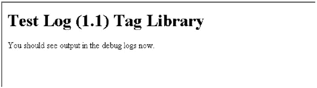
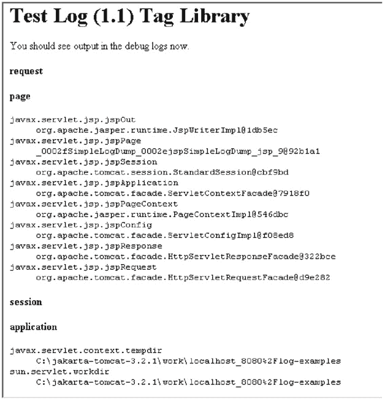

# 第 9 章：使用 Apache Log 标签库

## 概述

像 Apache log4j 这样强大的日志记录框架的众多优势之一，是它不受限于任何特定的应用场景。Apache log4j 是一个健壮且可扩展的日志记录框架，可以根据任何特定应用的需求进行定制。使这个日志记录框架如此健壮的一个特性是 `Log` 标签库，它是 Apache TagLibs 项目的一部分。

`Log` 标签库允许开发者在 Java 服务器页面（JSP）中嵌入基于 log4j 的日志记录活动。本质上，它提供了与 log4j 声明的所有日志级别相关的标签，并使用配置文件来配置执行日志记录活动所需的 log4j 框架。

在本章中，我们将研究 `Log` 标签库的使用，并了解如何扩展它以合并我们自己的日志记录标签。

## 安装 Log 标签库

在 JSP 中安装和使用 `Log` 非常简单。请按照以下步骤在 Web 应用程序中设置和使用 `Log`：

1.  首先，从 Apache 网站 ([`jakarta.apache.org/taglibs/doc/log-doc/intro.html`](http://jakarta.apache.org/taglibs/doc/log-doc/intro.html)) 获取 `Log (1.1)` 的二进制发行版。

2.  将归档文件解压到本地机器。

3.  将标签库描述符文件 "taglibs-log.tld" 复制到应用程序特定的 "/WEB-INF" 子目录。

4.  将 "taglibs-log.jar" 文件复制到 Web 应用程序的 "/WEB-INF/lib" 子目录。

5.  在 Web 应用程序的 "web.xml" 文件中添加一个 `<taglib>` 元素，以指定标签库描述符的位置，如下所示：

    ```
    <taglib>
      <taglib-uri>http://jakarta.apache.org/taglibs/log-1.0</taglib-uri>
      <taglib-location>/WEB-INF/log.tld</taglib-location>
    </taglib>
    ```

这就是在 Web 应用程序中使用 `Log` 所需做的全部工作。现在，我们将看到一个在 JSP 中使用 `Log` 的简单示例。

|  | 注意  | 本节描述的安装过程特定于 Apache Tomcat Web 服务器环境。要与其他 Web 服务器一起使用 `Log (1.1)`，你需要根据所使用的 Web 服务器进行特定配置。 |


## 使用日志标签库的简单示例

首先，让我们看一个简单的示例，演示如何在 JSP 中使用 `Log` 标签库通过 log4j 执行日志记录。清单 9-1 `SimpleLog.jsp` 是一个简单的 JSP，它使用 `Log` 标签库将日志信息打印到 Web 服务器的控制台。本示例使用 Tomcat 3.2.1 进行演示。

清单 9-1：SimpleLog.jsp

| **** |

```
<html>
<%@ taglib uri="http://jakarta.apache.org/taglibs/log-1.0" prefix="log" %>
<BODY>
<h1>测试日志标签库</h1>
<log:debug>嵌入在开闭标签之间的消息。</log:debug>
<log:debug message="作为属性传递给标签的消息" />
<log:info category="test">使用 category 属性。</log:info>
现在您应该在调试日志中看到输出。
</BODY>
</html>
```

| **** |

|  |

如您所见，这个 JSP 虽然非常简单，但足以展示 `Log` 标签库的工作方式。在此示例中，我们使用 `<debug>` 和 `<info>` 标签来打印日志信息。`Log` 标签库提供了与 log4j 中定义的所有日志级别相关的标签。本章稍后我们将看到 `Log` 提供的所有可用标签。现在，让我们探讨在 JSP 中使用 `Log` 的基础知识：

*   首先，我们需要在 JSP 中导入 `Log` 标签库，以使这些标签在页面上下文中可用。这通过 JSP 中的以下代码行实现：

    ```
    <%@ taglib uri=http://jakarta.apache.org/taglibs/log-1.0
      prefix="log" %>
    ```

    这行代码从指定位置导入标签库，并将 `log` 设置为库中标签的标签名前缀。实际上，此前缀可以是任何唯一的文本。

*   `Log` 标签库中的标签需要以导入标签库到页面时定义的前缀开头。在本示例中，标签以 `log` 为前缀。

*   这些标签接受可选属性，并且每个标签都需要开闭标签。

有了对使用 `Log` 标签库的简单理解，让我们来看看此示例的配置要求。

### 日志标签库的配置文件

`Log` 标签库使用 log4j 将日志信息打印到所需位置。如第 5 章所述，log4j 不对应用程序环境做任何假设。为了以所需格式和位置获取日志信息，log4j 需要一个配置文件，指定有关日志信息格式和目标的全部信息。

`Log` 提供了一个名为 "log4j.properties" 的默认配置文件。清单 9-2 描述了随 `Log` 发行版附带的默认 log4j 配置文件。

清单 9-2：log4j.properties，Log 的默认配置文件

| **** |

```
# 用于初始化 log4j 的示例属性
log4j.rootCategory=debug, stdout

log4j.appender.stdout=org.apache.log4j.ConsoleAppender
log4j.appender.stdout.layout=org.apache.log4j.PatternLayout

# 用于输出调用者文件名和行号的模式。
log4j.appender.stdout.layout.ConversionPattern=%5p [%t] (%F:%L) - %m%n

log4j.appender.R=org.apache.log4j.RollingFileAppender
log4j.appender.R.File=logtags.log

log4j.appender.R.MaxFileSize=100KB
# 保留一个备份文件
log4j.appender.R.MaxBackupIndex=2

log4j.appender.R.layout=org.apache.log4j.PatternLayout
log4j.appender.R.layout.ConversionPattern=%p %t %c - %m%n
```

| **** |

|  |

此配置文件非常简单。它使用 `ConsoleAppender` 和 `RollingFileAppender` 对象将日志信息输出到 Web 服务器控制台和文件。它还使用 `PatternLayout` 来格式化日志信息。指定用于打印到控制台的日志信息的模式包括级别、线程名称、文件名、位置信息和消息，后跟换行符。

写入文件的模式略有不同，包括级别、线程名称、记录器名称和消息，后跟换行符。尽管此配置文件看起来很简单，但它突出了关于 `Log` 工作方式的以下重要点：

*   `Log` 使用 log4j 根记录器（与前面示例中的 `Category` 同义）来发布日志信息。根记录器的阈值级别为 DEBUG。

*   默认情况下，`Log` 将日志信息写入 Web 服务器控制台。理论上，可以通过更改配置文件将 `Log` 配置为将日志信息发送到任何首选目标。它提供了一个示例配置，用于通过使用 `RollingFileAppender` 对象将日志信息重定向到滚动文件。

*   如果我们想使用根记录器以外的记录器，则需要在配置文件中配置 `Logger` 对象。忘记这样做可能导致日志信息不会打印到任何指定目标。

*   更改根记录器或与任何标签一起使用的其他自定义记录器的阈值级别可能会导致日志输出发生变化。

|  | 注意  | 如果没有显式地将单独的记录器（`Category`）指定为任何 `Log` 标签的属性，这些标签将依赖 log4j 的根记录器来发布日志信息。因此，即使我们在标签属性中指定了自定义记录器（`Category`）名称并在同一配置文件中单独配置它们，保留根记录器配置也始终是安全的。 |

### 设置环境

按照“安装日志标签库”部分中的说明操作后，我们已经准备好从 JSP 中使用 `Log` 标签库。在我们可以实际运行清单 9-1 中的示例 JSP 之前，我们需要按照接下来的几个步骤配置 Web 服务器以使用 JSP 和 log4j 配置文件：

1.  首先，将清单 9-1 中描述的 JSP 放入 Tomcat 安装目录下 "webapps" 目录中名为 "TestLogTags"（或您选择的任何文件夹）的文件夹中。

2.  在 Tomcat 中，任何 Web 应用程序通常都包含一个 "WEB-INF" 目录和一个 "WEB-INF/classes" 目录。将 "log4j.properties" 文件放在这些位置之一。例如，您可以决定将其放在 "WEB-INF/classes" 目录中。

3.  指定 Tomcat 可以在哪里找到上一节中显示的 log4j 配置文件。

4.  将 "log4j.properties" 文件作为系统变量传递给 Tomcat 的执行环境。

5.  转到 "%TOMCAT_HOME%\bin" 中的 "tomcat.bat" 文件。

6.  添加一个条目，将 classpath 变量设置为指向包含 "log4j.properties" 文件的目录。对于此示例，该条目可能如下所示：

    ```
    set CP=%CP%;C:\Jakarta-tomcat-3.2.1\webapps\
          TestLogTags\WEB-INF\classes
    ```

7.  将以下条目添加到 "tomcat.bat" 文件中：

    ```
    set TOMCAT_OPTS=-Dlog4j.configuration=log4j.properties
    ```

|  | 注意  | 我们也可以通过初始化 servlet 来配置 log4j。有关此主题的更多信息，请参阅第 5 章。 |

这就是我们在运行示例之前需要做的所有事情，接下来我们将看到如何运行它。


### 日志示例的实际应用

现在启动 Tomcat 并访问该 JSP 页面，如图 Figure 9-1 所示。Tomcat 将加载 "log4j.properties" 文件，而 `Log` 将使用此配置文件来打印日志信息。


图 9-1：SimpleLog.jsp 页面

如果我们现在查看 Tomcat 控制台，将会看到以下日志信息被打印出来：

```
DEBUG [Thread-11] (LoggerTag.java:109) - Message embedded within open and
close tags.
DEBUG [Thread-11] (LoggerTag.java:97) - Message passed as an attribute to
the tag
 INFO [Thread-11] (LoggerTag.java:109) - Using category attribute.
```

## 在日志标签库中使用自定义日志记录器

在 Listing 9-1 列出的 JSP 中，我们使用了 `<log:info>` 标签，并将 `category` 属性指定为 `test`。这是作为日志信息一部分生成的日志记录器的名称。如果我们更改日志信息的输出模式以包含日志记录器的信息，我们将看到类别 `test` 作为日志输出的一部分出现。指定 `category` 属性的全部意义在于能够为该类别或日志记录器包含一组不同的配置参数。

Listing 9-3 展示了一个修改后的 "log4j.properties" 文件，其中包含了名为 `test` 的类别的配置。

Listing 9-3: 修改后的 log4j.properties 文件

| **** |

```
# Sample properties to initialize log4j
log4j.rootCategory=debug, stdout
log4j.logger.test=debug, R

log4j.appender.stdout=org.apache.log4j.ConsoleAppender
log4j.appender.stdout.layout=org.apache.log4j.PatternLayout

# Pattern to output the caller's file name and line number.
log4j.appender.stdout.layout.ConversionPattern=%5p [%t] (%F:%L) - %m%n

log4j.appender.R=org.apache.log4j.RollingFileAppender
log4j.appender.R.File=logtags.log

log4j.appender.R.MaxFileSize=100KB
# Keep one backup file
log4j.appender.R.MaxBackupIndex=2

log4j.appender.R.layout=org.apache.log4j.PatternLayout
log4j.appender.R.layout.ConversionPattern=%p %t %c - %m%n
```

| **** |

|  |

此配置文件定义了日志记录器 `test` 的配置。`test` 日志记录器的阈值级别为 DEBUG，并使用 `RollingFileAppender` 对象将日志信息打印到名为 "logtags.log" 的文件中。请注意，用于格式化日志信息的 `conversionPattern` 包含了日志记录器的名称（`%c`）。

将此配置文件用于 `Log` 会将信息写入 "%TOMCAT_HOME%\bin" 目录下的 "logtags.log" 文件中。如果我们使用此修改后的配置文件执行示例 JSP，我们将在 "logtags.log" 文件中看到以下输出：

```
 DEBUG Thread-11 root - Message embedded within open and close <log> tags.
DEBUG Thread-11 root - Message passed as an attribute to the <log> tag
INFO Thread-11 test - Hello how are you?
```

这就是我们如何使用具有自定义配置的不同日志记录器来处理日志信息。如果我们在 JSP 中指定了 `category` 属性，但没有为其指定配置，`Log` 将使用根日志记录器配置来处理日志请求。

## 日志标签描述

`Log` 标签库提供了与 log4j 中声明的级别相对应的标签。Table 9-1 总结了所有 `Log` 标签库的标签及其属性。

表 9-1：日志标签汇总

| 标签名称 | 标签描述 | 属性名称 | 是否必需 |
| --- | --- | --- | --- |
| `debug` | 显示 DEBUG 级别的消息 | `category message` | 否 否 |
| `info` | 显示 INFO 级别的消息 | `category message` | 否 否 |
| `warn` | 显示 WARN 级别的消息 | `category message` | 否 否 |
| `error` | 显示 ERROR 级别的消息 | `category message` | 否~ 否 |
| `fatal` | 显示 FATAL 级别的消息 | `category message` | 否 否 |
| `dump` | 显示指定范围内的所有变量 | `scope` | 是 |

如您所见，这些 `Log` 标签的使用非常简单。除 `dump` 之外的所有标签都有两个可选属性：`category` 和 `message`。可以将日志信息指定为 `message` 属性的值，也可以将其包含在标签内。例如，我们可以通过以下两种方式使用 `error` 标签：

```
<log:error message="This is an error message"> </log:error>
<log:error>This is an error message</log:error>
```

Table 9-1 中提到的 `dump` 标签旨在打印通过 `scope` 属性指定的范围内的所有变量。Listing 9-4 `SimpleLogDump.jsp` 是 Listing 9-1 中 JSP 的修改版本，并在页面中添加了一个 `dump` 标签。

Listing 9-4: SimpleLogDump.jsp

| **** |

```
<html>
<%@ taglib uri="http://jakarta.apache.org/taglibs/log-1.0" prefix="log" %>
<BODY>
<h1>Test Log Tag Library</h1>
<log:debug>Message embedded within open and close tags.</log:debug>
<log:debug message="Message passed as an attribute to the tag" />
<log:info category="test">Using category attribute.</log:info>
You should see output in the debug logs now.
<H4>request</H4>
<log:dump scope="request" />
<H4>page</H4>
<log:dump scope="page" />
<H4>session</H4>
<log:dump scope="session" />
<H4>application</H4>
<log:dump scope="application" />
</BODY>
</html>
```

| **** |

|  |

在此 JSP 中，我们展示了 `dump` 标签在所有可能的 `scope` 属性值下的输出。Figure 9-2 显示了页面上显示的内容。


图 9-2：SimpleLogDump.jsp 页面

## 使用日志标签库创建自定义标签以使用自定义级别

在 第 8 章 中，我们了解了如何编写自定义的 `Level` 类 TRACE，并将其与 log4j 一起使用。如果我们想将 TRACE 自定义级别与 `Log` 标签库一起使用，则必须扩展 `Log` 标签库框架。通常，我们可以通过执行以下任务来实现：

*   编写一个新的 `Tag` 类来表示自定义级别 TRACE。
*   使新的 `Tag` 和 `Level` 类对应用程序可用。
*   修改 "taglib-descriptor" 文件以描述新标签。

在接下来的章节中，我们将探讨如何实现这些任务，以便将 TRACE 级别与 `Log` 标签库一起使用。


### 创建新标签

在 `Log` 标签库中，所有标签类都继承自 `abstract` 类 `LoggerTag`。`LoggerTag` 类本身是 `BodyTagSupport` 类的子类，负责处理与标签相关的所有操作。它还定义了一个 `abstract` 方法 `getPriority()`，该方法在 `LoggerTag` 类的所有其他子类中实现。所有其他标签类，如 `ErrorTag`、`InfoTag` 等，都是 `LoggerTag` 的子类，并为 `getPriority()` 方法提供实现。因此，要定义一个新标签，我们只需扩展 `LoggerTag` 类，并提供一个返回自定义级别 TRACE 的 `getPriority()` 方法实现。清单 9-5 `TraceTag.java` 演示了如何使用自定义级别 TRACE 编写自定义标签。

清单 9-5: TraceTag.java

| **** |

```
package com.apress.logging.log4j.customtag;

import org.apache.taglibs.log.LoggerTag;
import org.apache.log4j.Priority;
import com.apress.logging.log4j.CustomLevel;

public class TraceTag extends LoggerTag
{
    protected Priority getPriority()
    {
        return CustomLevel.TRACE;
    }
}
```

| **** |

|  |

要开发这个自定义标签，我们复用了第 8 章中开发的自定义级别 TRACE（参见清单 8-9）。如您所见，创建一个使用新级别的新标签非常简单。清单 9-6 显示了需要添加到现有 "taglibs-log.tld" 文件中的标签库描述。（该文件随 `Log` 发行版一起提供。）

清单 9-6: 自定义 Trace 标签的标签描述

| **** |

```
 <tag>
    <name>trace</name>
    <tagclass>com.apress.logging.log4j.customtag.TraceTag</tagclass>
    <attribute>
      <name>category</name>
      <required>false</required>
      <rtexprvalue>true</rtexprvalue>
    </attribute>
    <attribute>
      <name>message</name>
      <required>false</required>
      <rtexprvalue>true</rtexprvalue>
    </attribute>
</tag>
```

| **** |

|  |

|  | 注意  | 标签的名称指定为 `trace`。因此，在 JSP 中，我们需要使用名称 `trace` 来访问此标签。 |

### 自定义 Trace 标签的实际应用

一旦我们准备好了用于级别 TRACE 的标签类，并修改了 "taglibs-log.tld" 文件以包含新 `trace` 标签的定义，我们就可以开始在 JSP 中使用它了。为了设置 Tomcat 以使用这个新标签，我们需要执行以下步骤：

1.  将所需的新 `TraceTag` 和 `CustomLevel` 类复制到 Web 应用程序中适当的目录结构下。例如，如果 Web 应用程序目录是 "TestLogTags"，则需要在 "TestLogTags\WEB-INF\classes" 目录下创建相应的包结构。

2.  编辑 "Tomcat.bat" 文件，将 "taglibs-log.jar" 文件包含到 classpath 中。

3.  修改 "log4j.properties" 文件，将阈值级别设置为 TRACE。根日志记录器的默认阈值级别是 DEBUG，它高于 TRACE 级别。因此，在默认配置下，TRACE 级别的消息将不会被发布。清单 9-7 展示了为使用 TRACE 级别而修改后的 "log4j.properties" 文件。

清单 9-7: 为使用 TRACE 级别修改后的 log4j.properties 文件

| **** |

```
log4j.rootCategory=trace#com.apress.logging.log4j.CustomLevel, stdout

log4j.appender.stdout=org.apache.log4j.ConsoleAppender
log4j.appender.stdout.layout=org.apache.log4j.PatternLayout

# 输出调用者文件名和行号的模式。
log4j.appender.stdout.layout.ConversionPattern=%5p [%t] (%F:%L) - %m%n

log4j.appender.R=org.apache.log4j.RollingFileAppender
log4j.appender.R.File=logtags.log

log4j.appender.R.MaxFileSize=100KB
# 保留一个备份文件
log4j.appender.R.MaxBackupIndex=2

log4j.appender.R.layout=org.apache.log4j.PatternLayout
log4j.appender.R.layout.ConversionPattern=%p %t %c - %m%n
```

| **** |

|  |

完成这些设置后，执行清单 9-8 中展示的 JSP。该 JSP 包含一条 TRACE 级别的消息。

清单 9-8: SimpleLogTrace.jsp

| **** |

```
<html>
<%@ taglib uri="http://jakarta.apache.org/taglibs/log-1.0" prefix="log" %>
<BODY>
<h1>测试日志标签库</h1>
<log:trace>Trace 级别消息。</log:trace>
您现在应该在调试日志中看到输出。
</BODY>
</html>
```

| **** |

|  |

执行此 JSP 将在 Web 服务器控制台中产生以下带有 TRACE 级别的消息：

```
TRACE [Thread-11] (LoggerTag.java:109) - Trace 级别消息。
```

## 结论

在本章中，我们讨论了 Apache 新发布的标签库 `Log`，用于在 JSP 中使用 log4j 执行日志记录。这解决了长期以来在 JSP 内部进行可控日志记录的问题。通过更改配置，可以将日志信息重定向到任何首选目标，并以任何期望的格式输出。但是，在将 CPU 密集型日志记录操作（例如将日志数据写入数据库）包含到 Web 应用程序中之前，需要仔细考虑，因为这可能会影响该应用程序的性能。

至此，log4j 的讨论就结束了。第 5 章 到第 9 章 中解释的所有主题应该能帮助您理解 log4j 的内部机制以及如何在实际应用中使用它。提供的小示例应该能让您掌握所介绍的概念，并快速看到结果，从而更好地理解 log4j 的使用。更广泛的示例应该能帮助您将 log4j 的使用与实际应用程序联系起来。

关于任何主题，总有一些东西需要学习。但我们创建了一个框架并赋予了它形状，现在您已经具备了在此基础上进行构建的能力。不过，在结束之前，我们肯定需要在下一章中探讨一些涉及使用不同日志记录 API 的最佳实践。

