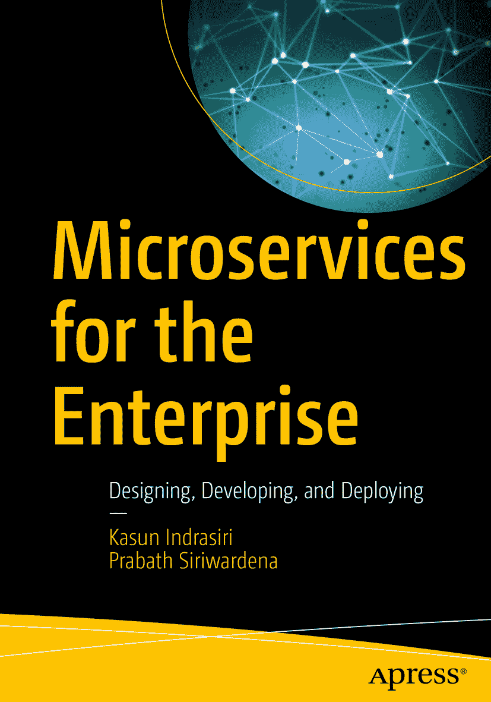

ISBN 978-1-4842-3857-8e-ISBN 978-1-4842-3858-5 [`doi.org/10.1007/978-1-4842-3858-5`](https://doi.org/10.1007/978-1-4842-3858-5) 美国国会图书馆控制号：2018962968 © Kasun Indrasiri 与 Prabath Siriwardena 2018 本作品受版权保护。出版商保留所有权利，涉及材料的全部或部分内容，特别是翻译、重印、重用插图、朗诵、广播、以缩微胶片或任何其他物理形式复制，以及传输或信息存储与检索、电子改编、计算机软件，或现在已知或以后开发的类似或不同方法的权利。本书中可能出现商标名称、标识和图像。我们仅在编辑风格下使用商标名称、标识和图像，以利于商标所有者，并无意侵犯商标权，而非在每次出现时都使用商标符号。本出版物中使用的商品名称、商标、服务标志及类似术语，即使未明确标识，也不应被视为对其是否受专有权利约束的意见表达。尽管本书中的建议和信息在出版时被认为是真实准确的，但作者、编辑和出版商均不对可能存在的任何错误或遗漏承担法律责任。出版商对本书所含内容不作任何明示或暗示的保证。本书通过 Springer Science+Business Media New York 在全球图书贸易中发行，地址：233 Spring Street, 6th Floor, New York, NY 10013。电话：1-800-SPRINGER，传真：(201) 348-4505，电子邮件：orders-ny@springer-sbm.com，或访问 www.springeronline.com。Apress Media, LLC 是加利福尼亚州的有限责任公司，其唯一成员（所有者）是 Springer Science + Business Media Finance Inc (SSBM Finance Inc)。SSBM Finance Inc 是特拉华州的一家公司。

## 引言

微服务架构已成为企业软件架构领域最流行的架构风格之一。由于其带来的诸多好处，大多数企业正在将其现有的单体应用转型为基于微服务架构的应用。因此，对于任何软件架构师或软件工程师而言，理解微服务架构的关键架构概念，以及如何在实际中运用这些架构原则来解决真实的业务用例，都至关重要。

在本书中，我们为读者提供对微服务架构原则的全面理解，并讨论如何在真实场景中运用这些概念。同时，我们不局限于特定技术或框架，而是涵盖了一系列广泛的技术和框架，这些技术和框架最适合微服务架构的特定方面。

本书的另一个关键区别在于，它解决了在企业架构环境中构建微服务时面临的一些基本挑战，例如服务间通信、无集中式企业服务总线（ESB）的服务集成、将微服务作为 API 暴露以避免集中式 API 网关、确定微服务的范围与大小，以及利用微服务安全模式。本书中解释的所有概念都配有真实用例，并附带了读者可以尝试的示例。这些用例大多受 Netflix 和 Google 等现有微服务实现，以及作者在旧金山湾区参加各种聚会和会议的启发。

本书涵盖了一些在实现微服务架构中广泛使用且前沿的技术和模式，例如容器原生部署技术（Docker、Kubernetes、Helm）、消息传递标准与协议（gRPC、HTTP2、Kafka、AMQP、OpenAPI、GraphQL 等）、响应式与主动式微服务集成、服务网格（Istio 和 Linkerd）、微服务弹性模式（断路器、超时、舱壁等）、安全标准（OAuth 2、JWT 和证书）、使用 API、事件和流与微服务结合，以及通过日志记录、指标和追踪构建可观测的微服务。

## 致谢

我们首先要感谢 Apress 的助理编辑总监 Jonathan Gennick，他评估并接受了我们关于本书的提案。然后，Apress 的协调编辑 Jill Balzano 在整个出版过程中对我们极为耐心和宽容。非常感谢你，Jill。Apress 的开发编辑 Laura Berendson 也在后期给予了我们帮助。谢谢 Laura！Alp Tunc 担任了技术审校。谢谢 Alp 的高质量审阅。

WSO2 的创始人兼首席架构师 Dr. Sanjiva Weerawarana 是我们长期的导师。我们衷心感谢 Dr. Sanjiva 的指导、教诲和支持。我们还要感谢 WSO2 的首席执行官 Tyler Jewel 和首席技术官 Paul Fremantle 的指引，这帮助我们探索了微服务领域。最后，我们要感谢我们的家人和父母；没有他们，一切皆不可能！

### 关于作者与技术审校

### 关于作者

### 关于技术审校

