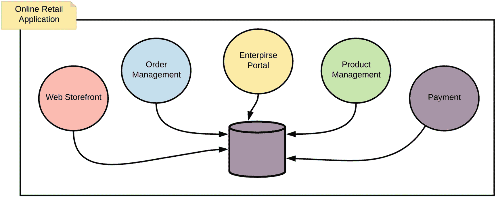
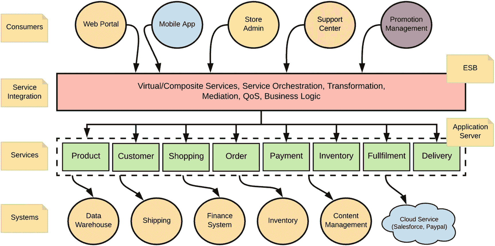
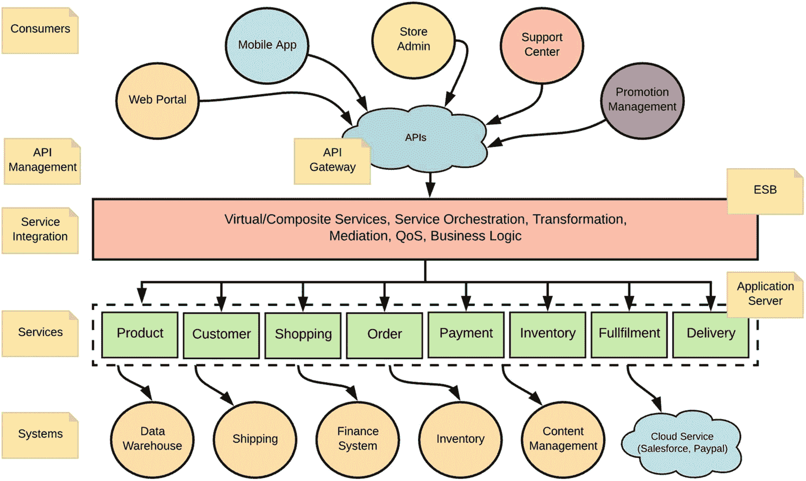
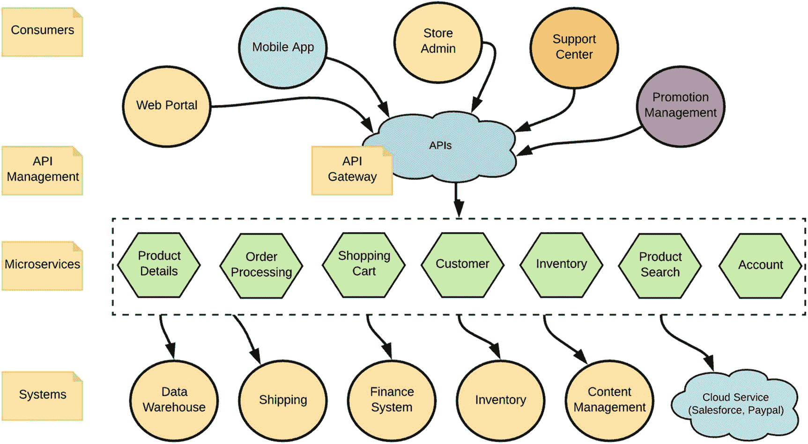

# 1. 微服务的理由

由于技术领域的范式转变以及寻求以快速且可靠的方式构建应用程序的更好方法的愿望，企业软件架构总是随着新的架构风格而演变。

微服务架构已被广泛采用为一种架构风格，它允许你快速且安全地构建软件应用程序。微服务架构提倡将软件系统构建为一组独立自治的服务（独立开发、部署和扩展），这些服务之间松散耦合。通过集成所有这些服务及其他系统，这些服务形成一个单一的软件应用程序。

在本章中，我们将探讨什么是微服务、微服务的特征（附有真实示例），以及微服务在企业软件架构背景下的优缺点。

为了更好地理解什么是微服务，我们需要回顾微服务之前使用的一些架构风格，以及企业架构是如何演变以接纳微服务架构的。

## 从单体架构到微服务架构

探索企业架构从单体应用到微服务的演变，是理解微服务关键动机和特征的好方法。让我们从单体应用的讨论开始。

### 单体应用

企业级软件应用旨在满足众多业务需求。在单体架构风格中，所有业务功能都被打包进一个单一的单体应用中，并作为一个整体单元进行构建。

我们来看一个现实世界的例子，以便进一步理解单体应用。图 1-1 展示了一个采用单体架构风格构建的在线零售应用。

图 1-1

采用单体架构开发的在线零售应用

整个零售应用由多个组件组成，例如订单管理、支付、产品管理等。每个组件都提供广泛的业务功能。由于其单体特性，为某个组件添加或修改功能的成本极其高昂。此外，为了满足整体业务需求，这些组件之间必须相互通信。这些组件间的通信通常建立在专有协议和标准之上，并采用点对点的通信方式。因此，修改或替换某个特定组件也相当复杂。例如，如果零售企业希望在保留其他组件的同时切换到新的订单管理系统，那么这样做也需要对现有的其他组件进行大量修改。

我们可以将单体应用的常见特征概括如下：

*   作为一个单一单元进行设计、开发和部署。
*   对于大多数现实世界的业务用例来说，极其复杂，这导致在维护、升级和添加新功能方面如同噩梦。
*   难以实践敏捷开发和交付方法论。由于应用必须作为一个单一单元构建，它所提供的大部分业务能力无法拥有自己的生命周期。
*   要更新应用的任何部分，都必须重新部署整个应用。
*   随着单体应用的增长，其启动时间可能会越来越长，从而增加了总体成本。
*   它必须作为一个单一应用进行扩展，并且很难在资源需求冲突的情况下进行扩展。（例如，由于单体应用提供多种业务能力，一种能力可能需要更多 CPU，而另一种则需要更多内存。很难满足这些能力的个性化需求。）
*   一个不稳定的服务可能导致整个应用宕机。
*   很难采用新技术和框架，因为所有功能都必须基于同质化的技术/框架构建。（例如，如果你正在使用 Java，那么所有新项目都必须基于 Java，即使存在更好的替代技术。）

作为对单体应用架构某些局限性的解决方案，面向服务架构（SOA）和企业服务总线（ESB）应运而生。

### SOA 与 ESB

SOA 试图通过将单体应用的功能分离成可重用、松耦合的实体（称为*服务*）来应对大型单体应用的挑战。这些服务通过网络调用进行访问。

*   服务是对一个定义明确的业务功能的独立实现，可通过网络访问。SOA 中的应用是基于服务构建的。
*   服务是具有定义明确的接口的软件组件，这些接口与实现无关。SOA 的一个重要方面是将服务接口（做什么）与其实现（怎么做）分离开来。
*   消费者只关心服务接口，而不关心其实现。
*   服务是自包含的（执行预定义的任务）且松耦合的（以实现独立性）。
*   服务可以被动态发现。消费者通常不需要知道服务的具体位置和其他细节。他们可以通过服务元数据仓库或服务注册中心来发现服务的元数据。当服务元数据发生变化时，服务可以在服务注册中心更新其元数据。
*   复合服务可以由其他服务的聚合体构建而成。

在 SOA 范式中，每个业务功能都被构建为一个（粗粒度的）服务（通常实现为 Web 服务），其中包含若干子功能。这些服务部署在应用服务器内部。在消费业务功能时，我们通常需要集成/连接多个这样的服务（并创建复合服务）以及其他系统。企业服务总线（ESB）用于集成这些服务、数据和系统。消费者使用从 ESB 层暴露出来的复合服务。因此，ESB 被用作连接所有这些服务和系统的集中式总线（见图 1-2）。

图 1-2

基于 SOA/ESB 风格的在线零售系统

例如，让我们回到在线零售应用的用例。图 1-2 展示了使用 SOA/Web 服务实现在线零售应用的情况。这里我们定义了多个 Web 服务，以满足各种业务能力，如产品、客户、购物、订单、支付等。在 ESB 层，我们可能会集成这些业务能力并创建复合业务能力，然后暴露给消费者。或者，ESB 层可能只是原样暴露这些功能，并附加一些横切特性，例如安全性。因此，显然 ESB 层也包含了整个应用相当一部分的业务逻辑。其他横切关注点，如安全、监控和分析，也可能在 ESB 层实施。ESB 层是一个单体实体，所有开发人员共享同一个运行时来开发/部署他们的服务集成。

### API

将业务功能作为托管服务或 API 公开已成为现代企业架构的关键需求。然而，由于 Web 服务相关技术（如 SOAP（服务间通信的消息格式）、WS-Security（保障服务间消息安全）、WSDL（定义服务契约）等）的复杂性，以及缺乏围绕 API 构建生态系统（如自助服务等）的特性，Web 服务/SOA 并非满足此类需求的理想方案。

因此，大多数组织会在现有 SOA 实现之上增加一个新的 API 管理/API 网关层。这一层被称为*API 外观层*，它为特定业务功能提供简单的 API，并隐藏 ESB/Web 服务层的所有内部复杂性。API 层还用于安全、限流、缓存和货币化。

例如，图 1-3 在 ESB 层之上引入了一个 API 网关。我们的在线零售应用提供的所有业务能力现在都以托管 API 的形式公开。API 管理层不仅将功能作为托管 API 公开，还能构建一个包含业务能力及其消费者的完整生态系统。

图 1-3
通过 API 网关层将业务功能作为托管 API 公开

随着对复杂业务能力需求的增长，单体架构已无法满足现代企业软件应用开发的需求。单体应用的集中式特性导致应用无法独立扩展、应用间依赖阻碍独立开发与部署、集中式架构带来的可靠性问题，以及应用开发技术选型的局限性。为了克服这些限制并满足现代、复杂且去中心化的应用需求，必须构思一种新的架构范式。

微服务架构作为一种更优的架构范式应运而生，旨在克服 ESB/SOA 架构以及传统单体应用架构的缺陷。

## 什么是微服务？

微服务架构的基础在于将单个应用开发为一组小型独立服务的集合，这些服务运行在各自的进程中，并可独立开发和部署。

如图 1-4 所示，通过将单体应用层拆分为独立且面向业务功能的服务，在线零售软件应用可以转变为微服务架构。同时，我们通过将中央 ESB 的功能分解到各个服务中，从而摆脱了中央 ESB，使服务自行处理服务间通信和组合逻辑。

图 1-4
使用微服务架构构建的在线零售应用

因此，微服务层中的每个微服务都提供定义明确的业务能力（最好范围较小），这些服务可独立设计、开发、部署和管理。

尽管其通信的 ESB 和服务层发生了变化，但 API 管理层基本保持不变。API 网关和管理层将业务功能作为托管 API 公开；我们还可以选择将网关细分为基于每个 API 的独立运行时。

既然您已对微服务架构有了基本了解，我们可以深入探讨微服务的主要特性。

### 面向业务能力

微服务架构的关键概念之一是，服务必须基于业务能力进行设计，以便特定服务服务于特定业务目的，并具有明确定义的职责集合。特定服务应专注于只做一件事，并把它做好。

理解粗粒度服务（例如在 SOA 上下文中开发的 Web 服务）或细粒度服务（未映射到业务能力）并不适合微服务架构，这一点至关重要。相反，服务的规模应完全基于范围和业务功能来确定。同时请记住，将服务划分得过于细小（即面向映射到业务能力的细粒度特性）被视为一种反模式。

在示例场景中，我们在 SOA/Web 服务实现中拥有粗粒度服务，如`Product`、`Order`等（见图 1-3）。当转向微服务时，我们识别出一组更细粒度但仍面向业务能力的服务，例如`Product Details`、`Order Processing`、`Product Search`、`Shopping Cart`等。

服务的规模绝不取决于代码行数或参与该服务开发的人数。单一职责原则（SRP）、康威定律、十二要素应用、领域驱动设计（DDD）等概念，对于识别和设计微服务的范围与功能非常有用。我们将在第 2 章“设计微服务”中讨论围绕业务能力设计微服务的这些关键概念和基础。

### 自主性：独立开发、部署与扩展

拥有自主服务很可能是实现微服务架构最重要的驱动力。微服务作为独立实体进行开发、部署和扩展。与 Web 服务或单体应用架构不同，服务不共享相同的执行运行时。相反，它们通过利用容器等技术，作为隔离的运行时进行部署。容器及容器管理技术（如 Docker、Kubernetes 和 Mesos）的成功与日益普及，对于实现服务自主性至关重要，并共同促进了微服务架构整体的成功。我们将在第 8 章“部署与运行微服务”中深入探讨微服务的部署方面。

自主服务确保了整个系统的弹性，因为我们通过服务隔离实现了故障隔离。这些服务通过网络上的服务间通信，通过消息传递进行松耦合。服务间通信可以构建在各种交互风格和消息格式之上（我们将在第 3 章“服务间通信”中详细讨论这些内容）。它们通过与技术无关的服务契约暴露其 API，消费者可以使用这些契约与该服务协作。此类服务也可以通过 API 网关作为托管 API 暴露。

服务的独立部署提供了独立扩展服务的内在能力。随着业务功能消耗的变化，我们可以扩展获得更多流量的微服务，而无需扩展其他服务。

我们可以在电子商务应用案例中观察到这些微服务特性，如图 1-3 所示。粗粒度服务（如`Product`、`Order`等）与 SOA/Web 服务方法一样，共享相同的应用服务器运行时。因此，其中某个服务发生故障（如内存不足或 CPU 占用过高）可能导致整个应用服务器运行时崩溃。此外，在许多情况下，产品搜索等功能可能比其他功能使用得更频繁。采用单体方法，你无法独立扩展产品搜索功能，因为它与其他服务共享相同的应用服务器运行时（你只能共享整个应用服务器运行时）。如图 1-4 所示，将这些粗粒度服务拆分为微服务，使它们能够独立部署，将故障隔离到每个服务级别，并允许你根据特定微服务的消耗情况独立扩展它。

### 无中心 ESB：智能端点与哑管道

微服务架构提倡消除企业服务总线（ESB）。ESB 曾是 SOA/基于 Web 服务架构中大部分智能逻辑的所在之处。微服务架构引入了一种新的服务集成风格，称为*智能端点和哑管道*，以取代 ESB。正如本章前面所讨论的，大多数业务功能都是通过集成或连接底层服务和系统，在 ESB 层面实现的。采用*智能端点和哑管道*，所有业务逻辑（包括服务间通信逻辑）都驻留在每个微服务层面（它们是*智能端点*），所有这些服务都连接到一个原始的消息传递系统（一个*哑管道*），该系统不包含任何业务逻辑。

大多数天真的微服务采用者认为，只需将系统转变为微服务架构，就能简单地摆脱集中式 ESB 架构的所有复杂性。然而，现实情况是，采用微服务架构后，ESB 的集中式能力被分散到所有微服务中。ESB 曾经提供的能力现在必须在微服务层面实现。

因此，这里的关键点是，ESB 的复杂性并不会消失。相反，它会被分散到你开发的所有微服务中。微服务编排（使用同步或异步风格）、通过不同通信协议进行的服务间通信、应用断路器等弹性模式、与其他应用程序、SaaS（例如 Salesforce）、API、数据和专有系统的集成，以及集成服务的可观测性，都需要作为你开发的微服务的一部分来实现。事实上，由于在微服务架构中你需要处理大量服务（服务因网络上的服务间通信而更容易出错），创建编排和服务间通信的复杂性可能更具挑战性。

大多数早期的微服务采用者（如 Netflix）都是从零开始实现这些能力中的大部分。然而，如果我们要用微服务架构完全取代 ESB，我们必须选择特定的技术，在我们的微服务层面构建这些 ESB 的能力，而不是从头重新实现它们。

我们将在第 3 章“服务间通信”和第 7 章“集成微服务”中详细审视所有这些需求，并讨论一些可用于实现它们的技术。

### 容错性

如前所述，由于服务数量及其网络通信的激增，微服务更容易发生故障。一个给定的微服务应用是多个细粒度服务的集合，因此，其中一个或多个服务的故障不应导致整个应用崩溃。因此，我们应该优雅地处理微服务的特定故障，使其对应用的业务功能影响最小。以容错方式设计微服务，需要在设计、开发和部署阶段采用所需的技术。

例如，在零售示例中，假设`Product Details`微服务对电商应用的功能至关重要。因此，我们需要应用所有与弹性相关的能力，例如断路器、灾难恢复、负载均衡、故障转移以及基于流量模式的动态扩展，这些内容我们将在第 7 章“集成微服务”中详细讨论。

在服务开发和测试过程中，使用诸如 Netflix 的 Chaos Monkey 等工具来模拟所有此类可能的故障非常重要。给定的服务实现也应负责所有与弹性相关的活动；此类行为将作为 CICD（持续集成、持续交付）流程的一部分自动验证。

容错性的另一个方面是能够观察在生产环境中运行的微服务的行为。检测或预测服务故障并恢复此类服务至关重要。例如，假设在在线零售应用示例中，你为所有微服务启用了监控、追踪、日志记录等功能。然后你观察到`Product Search`服务存在显著的延迟和较低的 TPS（每秒事务数）。这预示着该服务未来可能发生故障。如果微服务是可观测的，你应该能够分析当前症状的原因。因此，即使在开发阶段采用了混沌测试，为所有微服务建立强大的可观测性基础设施以实现容错性也至关重要。我们将在第 13 章“可观测性”中详细讨论可观测性技术。

我们将在第 7 章“集成微服务”和第 8 章“部署和运行微服务”中详细讨论容错性技术和最佳实践。

### 去中心化数据管理

在单体架构中，应用将数据存储在单一、集中的逻辑数据库中，以实现应用的各种功能/能力。在微服务架构中，功能分散在多个微服务中。如果我们使用相同的集中式数据库，微服务将不再相互独立（例如，如果一个微服务更改了数据库模式，将会破坏其他多个服务）。因此，每个微服务必须拥有自己的数据库和数据库模式。

每个微服务可以拥有一个私有数据库，用于持久化实现其业务功能所需的数据。一个给定的微服务只能访问其专用的私有数据库，而不能访问其他微服务的数据库。

在某些业务场景中，你可能需要为单个事务更新多个数据库。在这种情况下，只能通过相应的服务 API 来更新其他微服务的数据库（不允许直接访问数据库）。

去中心化数据管理为你提供了完全解耦的微服务，以及选择不同数据管理技术（SQL 或 NoSQL 等，为每个服务选择不同的数据库管理系统）的自由。我们将在第 5 章“数据管理”中详细探讨微服务架构的数据管理技术。

### 服务治理

SOA 治理是 SOA 成功运营的关键驱动力之一；它促进了组织中不同实体（开发团队、服务消费者等）之间的合作与协调。尽管它作为 SOA 治理的一部分定义了一套全面的理论概念，但实践中只有少数概念被积极使用。当我们转向微服务架构时，大多数有用的治理概念被抛弃，微服务中的治理被解释为一个去中心化的过程，允许每个团队/实体按照自己的偏好管理其领域。去中心化治理适用于服务开发、部署和执行过程，但其内涵远不止于此。因此，我们有意没有使用*去中心化治理*这个术语。

我们可以识别出治理的两个关键方面：服务的设计时治理（选择技术、协议等）和运行时治理（服务定义、服务注册与发现、服务版本控制、服务运行时依赖、服务所有权与消费者、QoS 执行以及服务可观测性）。

微服务中的设计时治理主要是一个去中心化的过程，每个服务所有者都可以自由地设计、开发和运行他们的服务。然后他们可以为工作选择合适的工具，而不是在单一技术平台上标准化。然而，我们应该定义一些适用于整个组织的通用标准（例如，无论使用何种开发语言，所有代码都应经过审查流程并自动合并到主分支）。

微服务的运行时治理方面在各个层面实施，在微服务上下文中，我们通常不称之为*运行时治理*（服务注册与发现就是这样一个在微服务架构中极其有用的流行概念）。因此，与其将这些概念作为一组离散的概念来学习，不如从运行时治理的角度来理解它们更容易。

运行时治理在微服务架构中绝对至关重要（甚至比 SOA 运行时治理更重要），这仅仅是因为我们需要处理大量的微服务。运行时治理的实施通常作为一个集中式组件来完成。例如，假设我们需要在我们的在线零售应用场景中发现服务端点和元数据。那么所有服务都必须调用一个集中式的注册服务（它可以有自己的扩展能力，但逻辑上是一个集中式组件）。类似地，如果我们想通过集中限流来应用 QoS（服务质量）强制措施（如安全），我们需要一个像 API 管理器/网关这样的中心位置来实现。事实上，一些运行时治理方面也在 API 网关层实现。

我们将在第 6 章“微服务治理”中详细探讨微服务治理方面，并在第 10 章“API、事件和流”中探讨 API 管理。

### 可观测性

服务可观测性可视为监控、分布式日志、分布式追踪以及服务运行时行为与依赖关系可视化的结合。因此，可观测性也可被视为运行时治理的一部分。随着细粒度服务的激增，观察服务运行时行为的能力变得至关重要。可观测性组件通常是微服务实现中的集中式组件，每个服务将数据推送到这些组件中（更准确地说，是可观测性运行时从服务中拉取数据）。可观测性有助于在生产环境中识别和调试潜在问题，也可用于业务功能目的（例如货币化）。我们将在第 13 章“可观测性”中讨论构建可观测服务的各种工具和技术。

## 微服务：优势与劣势

与任何架构或技术一样，微服务架构既有优势也有劣势。既然你已经对微服务的关键特性有了很好的理解，现在是讨论它们的好时机。让我们从微服务的优势开始。

### 优势

微服务架构流行的主要原因之一，是它相对于传统软件架构模式所提供的优势。让我们仔细看看微服务架构的关键优势。

#### 业务功能的敏捷与快速开发

微服务架构倾向于自治的服务开发，这有助于我们实现业务功能的敏捷与快速开发。在传统架构中，将业务功能转化为可投入生产的软件应用功能需要多个周期，这主要是由于系统、代码库和依赖关系的规模所致。通过自治服务开发，你只需关注服务的接口和功能（而非整个系统的功能，后者要复杂得多），因为所有其他服务仅通过服务接口进行网络调用通信。

#### 可替换性

由于其自治特性，微服务也是*可替换的*。由于我们将服务构建为独立的实体，通过网络调用和定义的 API 进行通信，我们可以轻松地用另一个更好的实现来替换该功能。专注于特定功能、拥有有限的范围和规模、并在独立运行时中部署，所有这些都使得构建可替换的服务变得更加容易。

#### 故障隔离与可预测性

可替换性也有助于我们实现故障隔离和预测。如前所述，基于微服务的应用不会像传统的单体应用那样，因为任何给定组件或服务的故障而崩溃。拥有适当的可观测性功能也有助于我们识别或预测潜在的故障。

#### 敏捷部署与可扩展性

易于部署和扩展很可能是微服务最重要的价值主张。借助现代基于云的容器原生基础设施，轻松部署服务并动态扩展的能力正变得微不足道。由于我们将能力构建为自治服务，我们可以轻松利用所有此类容器和云原生技术来促进敏捷部署和可扩展性。

#### 与组织结构对齐

由于微服务以业务能力为导向，它们可以很好地与组织/团队结构对齐。通常，一个给定的组织是以交付业务能力的方式构建的。因此，每个服务的所有权可以轻松地分配给拥有该业务功能的团队。因此，鉴于微服务专注于特定的业务功能，你可以选择一个相对较小的团队来拥有该微服务。这对开发团队有积极影响，因为给定服务的范围简单且定义明确。这样，团队可以完全拥有服务的整个生命周期。

### 劣势

微服务架构的大部分劣势主要源于你需要应对的服务激增。

#### 服务间通信

服务间通信的复杂性可能比实际服务的实现更具挑战性。如前所述，智能端点和哑管道的概念迫使我们在微服务中包含服务间通信逻辑。服务开发者必须花费大量时间将微服务连接起来，以创建复合业务功能。

#### 服务治理

通过网络进行通信的大量服务也*使服务的治理和可观测性方面变得复杂*。如果没有适当的治理和可观测性工具，识别服务依赖关系和检测故障将是一场噩梦。例如，服务生命周期管理、测试、发现、监控、服务质量以及各种其他服务治理能力，在微服务架构下将变得更加复杂。

#### 严重依赖部署方法

部署和扩展微服务的成功在很大程度上取决于容器和容器编排系统的采用。如果你没有这样的基础设施，你将需要投入时间和精力（并且不要指望在没有容器的情况下成功实施微服务架构）。最终，成功的微服务架构也取决于团队和人员。服务的所有权、考虑使服务轻量化和容器原生、没有集中点来集成服务等，都需要组织层面的工程文化变革。

#### 分布式数据与事务管理的复杂性

由于微服务架构提倡将数据本地化到特定服务，分布式数据管理将相当令人生畏。分布式事务也是如此。实现跨越多个微服务的事务边界将非常具有挑战性。

## 如何以及何时使用微服务

我们讨论了微服务架构如何从传统的集中式企业架构演变而来，涵盖了其关键特性，并讨论了使用它的优缺点。然而，我们需要一套坚实的指导方针，来明确何时使用微服务架构，何时应避免使用。

*   当你当前的企业架构需要模块化时，微服务架构是理想的选择。

*   如果你试图用软件应用解决的业务问题非常简单，你可能根本不需要微服务（通常，一个简单的单体 Web 应用加一个数据库就足够了）。

*   你的软件应用必须采用基于容器的部署。

*   如果你的系统过于复杂而无法分割成微服务，你应该识别出那些可以以最小影响引入微服务的领域。然后，开始在微服务上实现一个小型用例，并围绕它构建所需的生态系统组件。

*   理解业务能力对于设计微服务至关重要。在服务实现之前，理解微服务设计技术（如第 2 章“设计微服务”所述）是必不可少的。

*   对于每个特定的微服务领域（如数据管理、服务间通信、安全性等），我们将在后续章节中详细讨论最佳实践和反模式。

## 摘要

本章的主要目标是让你了解企业架构的当前状态，以及微服务如何融入其中。在本章中，我们讨论了企业架构如何从单体应用演进到微服务。我们还讨论了当我们转向微服务时，ESB 和 API 网关的角色发生了怎样的变化。此外，我们还探讨了微服务架构的关键特征及其优缺点，这将为理解本书后续内容奠定基础。

