# 2. 设计微服务

史蒂夫·乔布斯认为，设计不仅关乎事物的外观和感觉，更在于它如何运作。一个微服务在内部如何工作以及如何与其他微服务交互，高度依赖于其设计。大多数关于微服务的架构概念和设计原则并不仅仅与微服务相关。它们已经存在了一段时间，甚至在 SOA（面向服务架构）流行的早期就已出现。有些人甚至称微服务为“做对了的 SOA”！SOA 的根本问题在于人们没有把设计做对。他们陷入了炒作之中，而忽略了关键的设计原则。随着时间的推移，SOA 变成了另一个流行词，而其最初的需求却未能得到解决。微服务作为一个概念应运而生，填补了这一空白。除非你密切关注微服务的架构概念和设计原则，否则你并没有真正在做微服务！

查尔斯·安东尼·理查德·霍尔爵士是开发了快速排序算法的英国科学家。在 1980 年接受图灵奖的演讲中，他提到设计软件有两种方法：一种是让软件变得非常简单，以至于明显没有缺陷；另一种是让它变得非常复杂，以至于没有明显的缺陷——第一种方法要困难得多。在微服务设计中，你需要关注其内部和外部架构。内部架构定义了如何设计微服务本身，而外部架构则涉及它如何与其他微服务通信。除非你让这两种设计都变得简单且易于演进，否则你将会使系统容易出错，并偏离微服务的关键设计目标。在任何微服务设计的核心中，投产时间、可扩展性、复杂性本地化和弹性都是关键要素。除非你让设计变得简单，否则很难达到这些期望。

## 领域驱动设计

领域驱动设计（DDD）并不是随微服务引入的新概念，它已经存在了相当长的时间。埃里克·埃文斯在他的著作《领域驱动设计：软件核心复杂性应对之道》中创造了“领域驱动设计”这个术语。随着微服务成为主流的架构模式，人们开始意识到领域驱动设计概念在设计微服务中的适用性。这种设计在界定微服务的范围方面起着关键作用。

### 注意

对领域驱动设计的深入解释超出了本书的范围。本章重点介绍领域驱动设计在构建微服务中的应用。对领域驱动设计有浓厚兴趣的读者，建议阅读埃里克·埃文斯的著作。除了埃里克的书，我们还推荐阅读斯科特·米利特和尼克·图恩合著的《领域驱动设计模式、原理与实践》。

什么是领域驱动设计？它主要是关于对复杂业务逻辑进行建模，或者构建对复杂业务逻辑的抽象。*领域*是领域驱动设计的核心。我们开发的所有软件都与某些用户活动或兴趣相关。埃里克·埃文斯说，用户应用程序的学科领域就是软件的领域。有些领域涉及物理世界。在零售业务中，你会找到买家、卖家、供应商、合作伙伴以及许多其他实体。有些领域是无形的。例如，在加密货币领域，一个比特币钱包应用程序处理的是无形资产。无论是什么，领域都与业务相关，而不是与软件相关。当然，当你构建在软件领域内运行的软件时（例如配置管理程序），软件本身也可以成为一个领域。

在本书中，我们将使用许多例子来详细阐述这些概念。假设我们有一个正在构建电子商务应用的企业零售商。该零售商有四个主要部门：库存与订单管理、客户管理、配送以及计费与财务。每个部门可能有多个科室。库存与订单管理部门的订单处理科室接受订单，锁定库存中的商品，然后将控制权移交给计费与财务部门处理付款。一旦付款成功处理，配送部门就会准备发货。客户管理部门负责管理所有客户的个人数据以及与客户的所有交互。见图 2-1。

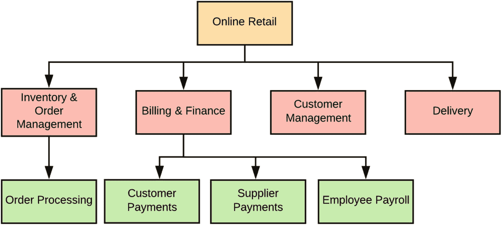

图 2-1

分而治之

领域驱动设计背后的一个关键原则是*分而治之*。在我们的例子中，零售领域是核心业务领域。每个部门可以被视为一个子领域。识别核心业务领域及其相关的子领域至关重要。这有助于我们遵循微服务架构原则为零售商构建电子商务应用。许多架构师在构建微服务架构时面临的关键挑战之一，是如何为每个服务确定合适的粒度。领域驱动设计在这方面提供了帮助。顾名思义，在领域驱动设计中，*领域*是至高无上的！

让我们退一步，看看*康威定律*。它指出，任何设计系统的组织，最终产生的设计结构都是该组织沟通结构的复制品。这证明了根据部门来识别企业中的子领域是合理的。一个特定的部门是为了某个目的而成立的。部门内部有其自身的沟通结构，部门之间也有沟通结构。甚至一个给定的部门也可以有多个科室，我们可以将每个这样的科室识别为一个子领域。详情见图 2-1。

让我们看看如何将这个领域结构映射到微服务架构中。我们或许可以开始用四个微服务来构建我们的电子商务应用（见图 2-2）：`订单处理`、`客户`、`配送`和`计费`。

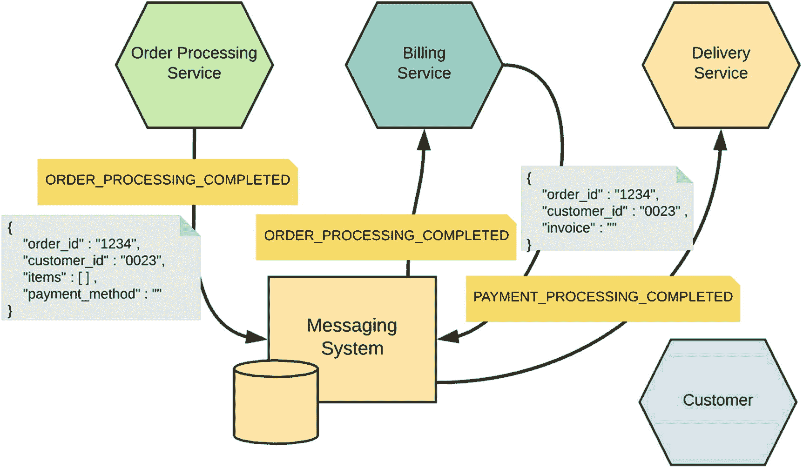

图 2-2

微服务间的通信

假设这些微服务通过以事件形式发送的消息进行相互通信。请求首先到达`订单处理`微服务，一旦它锁定库存中的商品，就会触发`ORDER_PROCESSING_COMPLETED`事件。事件是微服务之间的一种通信方式。可以有多个其他服务监听`ORDER_PROCESSING_COMPLETED`事件，一旦收到通知，它们就会相应地开始处理。如图 2-2 所示，`账单`微服务接收`ORDER_PROCESSING_COMPLETED`事件并开始处理支付。例如，亚马逊并非在下单时处理支付，而是在准备发货时才处理。与亚马逊类似，`订单处理`微服务仅在订单准备发货时才会触发`ORDER_PROCESSING_COMPLETED`事件。该事件本身包含了`账单`微服务处理支付所需的数据。在这个具体例子中，它携带了客户 ID 和支付方式。`账单`微服务在其自身的存储库中存储客户的支付选项，包括信用卡信息，因此它可以独立处理支付。

### 注意

使用事件在微服务之间进行通信是微服务间通信中常用的模式之一。它消除了微服务之间的点对点连接，通信通过消息系统进行。每个微服务在完成自身处理后，会向一个主题发布事件，而其他注册为感兴趣主题监听器的微服务，在收到通知后会相应地采取行动。微服务中使用的消息传递技术、微服务集成模式以及事件驱动消息模式将分别在第 3 章“服务间通信”、第 7 章“集成微服务”和第 10 章“API、事件与流”中介绍。

一旦`账单`微服务完成支付处理，它将触发`PAYMENT_PROCESSING_COMPLETED`事件，`配送`微服务将捕获该事件。此事件携带客户 ID、订单 ID 和发票。现在，`配送`微服务从其自身的存储库中加载客户配送地址，并准备订单进行配送。尽管图 2-2 中显示了`客户`微服务，但在订单处理流程中并未使用它。当新客户接入系统或现有客户想要更新其个人数据时，才会使用`客户`微服务。

> *当一个项目的语言支离破碎时，它就会面临严重的问题。——埃里克·埃文斯*

图 2-2 中的每个微服务都属于一个业务领域。库存和订单管理是`订单处理`微服务的领域；客户管理是`客户`微服务的领域；配送是`配送`微服务的领域；账单与财务是`账单`微服务的领域。这些领域或部门内部可以有自己的沟通结构，以及用于表示业务活动的自身术语。

每个领域都可以独立建模。一个领域越能独立于其他领域，它就越能灵活地自主演进。领域驱动设计定义了如何对给定领域进行建模的最佳实践和指导原则。它强调了使用*通用语言*来定义领域模型的必要性。通用语言是一种共享的团队语言，由领域专家和开发人员共同使用。事实上，“通用”意味着在给定的上下文（或者更准确地说，在限界上下文内，我们将在下一节讨论）中，从对话到代码，都必须使用同一种语言。这弥合了领域专家和开发人员之间的沟通鸿沟。领域专家精通自己的行话，但对软件开发中使用的技术术语了解有限或根本不了解；而开发人员知道如何用技术术语描述系统，但缺乏或仅有有限的领域专业知识。通用语言填补了这一空白，使所有人达成共识。

由通用语言定义的术语必须受相应上下文的约束。上下文与某个领域相关。例如，通用语言可用于定义一个名为*客户*的实体。库存和订单管理领域中客户实体的定义，不一定需要与客户管理领域中的定义相同。例如，库存和订单管理领域中的客户实体可能具有订单历史、未结订单和计划订单等属性，而客户管理领域中的客户实体则具有名字、姓氏、家庭地址、电子邮件地址、手机号码等属性。账单与财务领域中的客户实体可能具有信用卡号、账单地址、账单历史和计划付款等属性。任何由通用语言定义的术语，都只能在相应的上下文中进行解释。

### 注意

一个典型的软件项目仅在需求收集阶段涉及领域专家。业务分析师将业务用例转化为技术需求规格说明书。业务分析师完全拥有需求，并且没有反馈循环。模型是根据业务分析师所听到的内容开发的。领域驱动设计的一个关键方面是鼓励领域专家和开发人员之间进行更多、更长时间的沟通。这远远超出了最初的需求收集阶段，最终会构建出一个领域专家和开发人员都充分理解的领域模型。

让我们深入探讨这个例子。在我们的架构中，一个给定的微服务属于单个业务领域，微服务之间的通信通过消息传递进行。消息传递可以基于事件驱动架构，或者仅通过 HTTP 进行。从一个微服务到另一个微服务的每条消息都携带领域对象。例如，`ORDER_PROCESSING_COMPLETED`事件携带*订单*领域对象，而`PAYMENT_PROCESSING_COMPLETED`事件携带*发票*领域对象（见图 2-2）。这些领域对象的定义必须通过领域驱动设计，在领域专家和开发人员的协作下仔细推导得出。

### 注意

领域驱动设计有其固有的挑战。一个挑战是让领域专家在整个项目执行过程中参与进来。建立通用语言也需要相当长的时间，这需要领域专家和开发人员之间良好的协作。与开发跨越所有领域的单体应用不同，为给定领域构建解决方案并封装特定领域的业务逻辑，需要开发人员转变思维方式，这也具有挑战性。

### 限界上下文

正如我们之前讨论的，微服务设计中最具挑战性的部分之一就是界定微服务的范围。这正是 SOA 及其实现中范围定义不明确的地方。在 SOA 中，进行设计时，我们会考虑整个企业。它不会关注单个业务领域，而是将企业视为一个整体。它不会将库存与订单管理、计费与财务、配送与客户管理视为独立的领域，而是将整个系统视为一个企业级电子商务应用。

图 2-3 展示了一位 SOA 架构师设计的电子商务应用的分层架构。对于有 SOA 背景的人来说，这应该非常熟悉。这里我们看到的实际上是一个单体应用。尽管服务层将某些功能作为服务暴露出来，但它们之间并没有解耦。服务的范围界定并非基于它们所属的业务领域。例如，`订单处理`服务可能同时处理计费和配送。在第一章 1，“微服务的理由”中，我们讨论了这种单体架构的缺陷。

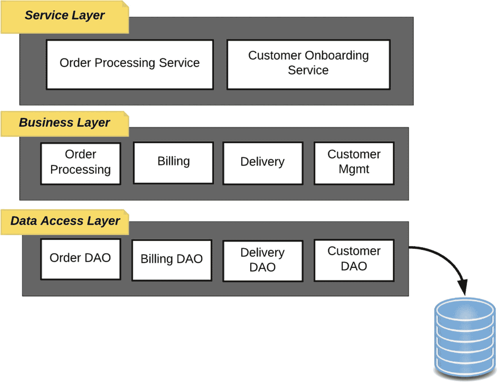

图 2-3
电子商务应用的分层架构

正如我们在上一节中讨论的，领域驱动设计有助于界定微服务的范围。微服务的范围是围绕一个*限界上下文*来界定的。限界上下文是微服务设计的核心。埃里克·埃文斯在其著作《领域驱动设计：软件核心复杂性应对之道》中首次将限界上下文作为一种设计模式引入。其理念是，任何给定的领域都由多个限界上下文组成，每个限界上下文将相关功能封装到领域模型中，并定义与其他限界上下文的集成点。换句话说，每个限界上下文都有一个明确的接口，用于定义哪些模型可以与其他上下文共享。通过明确定义应共享哪些模型，并且不共享内部表示，我们可以避免可能导致紧耦合的潜在陷阱。这些模块化的边界是微服务的绝佳候选。通常，微服务应该清晰地与限界上下文对齐。如果服务边界与相应领域的限界上下文对齐，并且微服务代表了这些限界上下文，那么这很好地表明微服务是松耦合且高内聚的。

### 注意

限界上下文是一个明确的边界，领域模型存在于该边界之内。在边界内部，通用语言的所有术语和短语都具有特定含义，并且模型精确地反映了该语言。^(¹)

让我们用限界上下文来扩展之前的例子。在那里我们确定了四个领域：库存与订单管理、计费与财务、配送以及客户管理。我们设计的每个微服务都归属于其中一个领域。尽管微服务与领域之间是一对一的关系，但我们现在知道，一个领域可以有多个限界上下文，因此也可以有多个微服务。例如，以库存与订单管理领域为例，我们有`订单处理`微服务，但基于不同的限界上下文（例如，`库存`微服务），我们也可以有多个其他微服务。要做到这一点，我们需要更仔细地审视库存与订单管理领域下提供的核心功能，并识别出相应的限界上下文。

### 注意

建议限界上下文通过各自拥有独立的团队、代码库和数据库模式来保持其分离性。

企业的库存与订单管理部门负责管理库存，并确保现有库存能够满足客户需求。它还需要知道何时向供应商订购更多库存，以优化销售和仓储设施。每当收到新订单时，它必须更新库存并锁定相应物品以供配送。一旦计费部门完成并确认付款，配送部门就必须在其仓库中定位该物品，并使其可供拣选和配送。同时，当商店中某物品的可用数量达到某个阈值时，库存与订单管理部门应联系供应商以获取更多库存，并在收到后更新库存。

领域驱动设计的一个关键亮点是领域专家与开发人员之间的协作。除非你正确理解库存管理部门在企业内部是如何运作的，否则你永远无法识别出相应的限界上下文。基于我们之前讨论的内容，凭借我们对库存管理的有限理解，我们可以识别出以下三个限界上下文。

*   *订单处理*：此限界上下文封装了与处理订单相关的功能，包括锁定订单中的库存物品、记录客户订单等。

*   *库存*：库存本身可以被视为一个限界上下文。它负责在收到供应商的物品后更新库存，并释放物品以供配送。

*   *供应商管理*：此限界上下文封装了与供应商管理相关的功能。在释放物品以供配送时，供应商管理会检查库存中是否有足够的库存，如果没有，则通知相应的供应商。

图 2-4 展示了库存与订单管理领域下的多个微服务，每个微服务代表一个限界上下文。在这里，服务边界与相应领域的限界上下文对齐。限界上下文之间的通信仅通过针对明确定义的接口传递消息来进行。如图 2-4 所示，`订单处理`微服务首先更新`库存`微服务以锁定订单中的物品，然后触发`ORDER_PROCESSING_COMPLETED`事件。监听`ORDER_PROCESSING_COMPLETED`事件的`计费`微服务执行支付处理，然后触发`PAYMENT_PROCESSING_COMPLETED`事件。监听`PAYMENT_PROCESSING_COMPLETED`事件的`供应商管理`微服务检查库存中的物品数量是否高于最低阈值，如果低于则通知供应商。监听同一事件的`配送`微服务执行其操作以查找物品（可能向仓库机器人发送指令），然后将物品分组以构建订单并使其准备好配送。完成后，`配送`微服务将触发`ORDER_DISPATCHED`事件，该事件通知`订单处理`微服务，并更新订单状态。

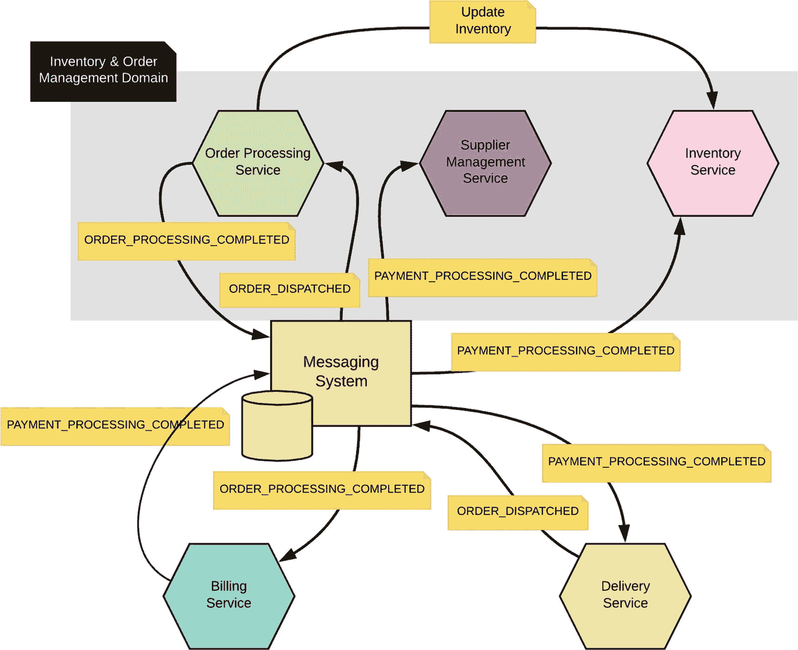

图 2-4
限界上下文之间的通信

一个好的设计会将一个微服务的范围界定为单个限界上下文。任何跨越多个限界上下文的微服务都偏离了最初的目标。当我们拥有一个微服务，它将业务逻辑封装在定义良好的接口之后，并代表一个限界上下文时，引入新的变更将对整个系统没有影响或影响极小。

正如我们之前讨论的，微服务之间的通信可以通过事件进行。在领域驱动设计下，这些事件被称为*领域事件*。领域事件是由限界上下文中的状态变化触发的。随后，其他限界上下文可以以松散耦合的方式响应这些事件。触发事件的限界上下文无需关心这些事件所引发的行为，而处理这些事件的限界上下文也无需关心事件来自何处。领域事件可以在一个领域内的限界上下文之间使用，也可以在不同领域之间使用。

### 上下文映射图

限界上下文有助于将业务逻辑封装在服务边界内，并帮助定义服务接口。当企业中的限界上下文数量增多时，要弄清楚它们之间的连接方式很容易变成一场噩梦。上下文映射图有助于可视化限界上下文之间的关系。我们之前讨论过的康威定律是构建上下文映射图的另一个原因。根据康威定律，任何设计系统的组织都会产生一种设计，其结构是该组织沟通结构的复制。换句话说，不同的团队将负责不同的限界上下文。这可能导致团队内部沟通良好，但团队之间沟通不畅。当团队之间缺乏沟通时，在相应限界上下文上做出的设计决策就无法恰当地传递给其他相关方。拥有上下文映射图有助于每个团队跟踪他们所依赖的限界上下文发生的变化。

沃恩·弗农在他的著作《实现领域驱动设计》中提出了多种表达上下文映射图的方法。更简单的方法是绘制一个图表，展示两个或多个现有限界上下文之间的映射关系，如图 2-5 所示。同时，请记住，图 2-5 中的每个限界上下文都对应一个微服务。我们在两个限界上下文之间使用一条线，并在两端各标有标识符 U 或 D，以显示相应限界上下文之间的关系。U 代表上游，D 代表下游。

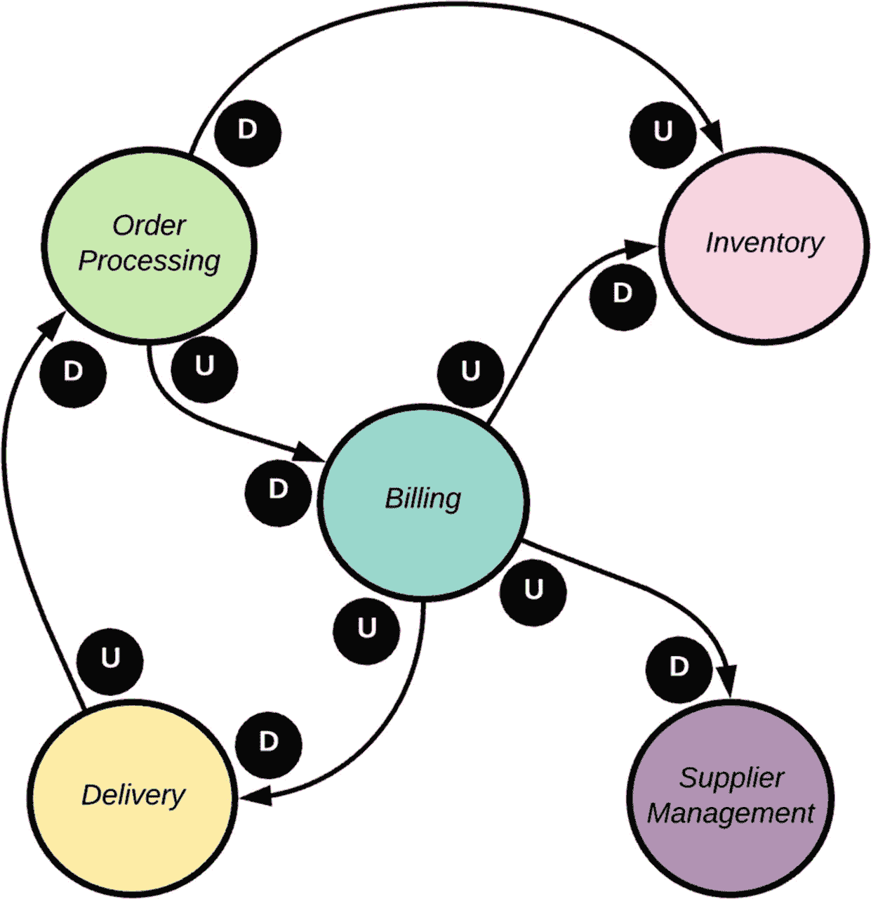

图 2-5

上下文映射图

在`订单处理`限界上下文和`计费`限界上下文的关系中，`订单处理`限界上下文是上游上下文，而`计费`是下游上下文。上游上下文对下游上下文拥有更多控制权。换句话说，上游上下文定义了在两个上下文之间传递的领域模型。下游上下文应充分了解上游上下文发生的任何变化。图 2-4 显示了这两个限界上下文之间传递的具体消息。它们之间没有直接耦合。`订单处理`限界上下文和`计费`限界上下文之间的通信通过事件机制进行。上游限界上下文（即`订单处理`限界上下文）定义了事件的结构，任何对该事件感兴趣的下游限界上下文都必须遵守该结构。

`计费`限界上下文和`供应商管理`限界上下文之间的关系与`订单处理`限界上下文和`计费`限界上下文之间的关系相同。在这里，`计费`是上游上下文，而`供应商管理`是下游上下文。这两个限界上下文之间的通信通过事件机制进行，如图 2-4 所示。`订单处理`限界上下文和`库存`限界上下文之间的通信是同步的。`库存`是上游上下文，而`订单处理`是下游上下文。换句话说，`订单处理`限界上下文和`库存`限界上下文之间通信的契约是由`库存`限界上下文定义的。图 2-5 中显示的所有关系并非都需要解释，因为它们不言自明。

让我们退一步，更深入地探讨一下`订单处理`和`库存`限界上下文。一个限界上下文拥有自己的领域模型，该模型是领域专家和开发人员经过长期实践后定义的。你可能还记得，同一个领域对象可能存在于不同的限界上下文中，并具有不同的定义。例如，`订单处理`限界上下文中的`订单`实体具有`订单 ID`、`客户 ID`、`订单项`、`送货地址`和`支付方式`等属性，而`库存`限界上下文中的`订单`实体则具有`订单 ID`和`订单项`等属性。尽管`订单处理`接口需要客户、送货地址和支付方式的引用，以维护针对该客户的所有订单历史，但`库存`并不需要这些信息。每个限界上下文都应知道如何管理此类情况，以避免其领域模型中的任何冲突。在下一节中，我们将讨论一些模式，以维护多个限界上下文之间的关系。

### 关系模式

领域驱动设计衍生出了多种促进多个限界上下文之间通信的模式。这些模式同样适用于设计与限界上下文良好对齐的微服务。这些针对限界上下文的关系模式最初由埃里克·埃文斯在其著作《领域驱动设计：软件核心复杂性应对之道》中提出。

#### 防腐层

让我们回顾一下上一节讨论的场景：在“订单处理”和“库存”这两个限界上下文中，`order` 实体有两种不同的定义。对于这两个限界上下文之间的通信，契约由“库存”限界上下文定义（见图 2-5）。当“订单处理”更新“库存”时，它必须将自己的 `order` 实体转换为“库存”限界上下文能够理解的 `order` 实体。我们使用防腐层（ACL）模式来解决这个问题。防腐层模式提供了一个转换层（见图 2-6）。

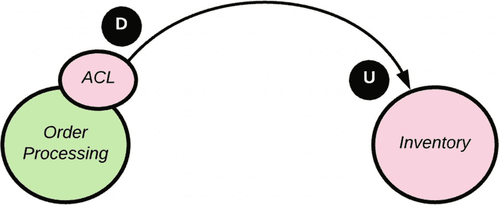

图 2-6

防腐层模式

让我们看看这种模式如何应用于企业级微服务部署。想象一个场景：你的微服务需要调用一个由单体应用暴露的服务。单体应用的设计并不关心领域驱动设计。促进微服务与单体应用之间通信的最佳方式是通过防腐层。这有助于保持微服务设计更加清晰（或者说更少受到污染）。

实现防腐层有多种方式。一种方法是将转换逻辑构建在微服务自身内部。你将使用实现微服务的同一种语言来实现防腐层。这种方法有多个缺点。微服务开发团队必须拥有防腐层的实现，因此他们需要关注单体应用侧发生的任何变更。如果我们将这个转换层实现为另一个微服务，那么我们就可以将其实现和所有权委托给另一个团队。该团队只需要理解转换逻辑，其他什么都不用管。这种方法通常被称为*边车*模式。

如图 2-7 所示，边车模式源于车辆，其中边车附着在摩托车上。如果你愿意，你可以为同一辆摩托车挂上不同的边车（不同颜色或设计），前提是两者之间的接口保持不变。这在微服务世界中同样适用，我们的微服务类似于摩托车，而转换层类似于边车。如果单体应用发生任何变化，我们只需要更改边车的实现以与之兼容——而微服务无需任何更改。

图 2-7

边车

微服务和边车之间的通信通过网络进行（不是本地进程内调用），但微服务和边车都位于同一台主机上——因此它不会通过网络路由。我们将在本书后面的第 8 章“部署和运行微服务”中讨论多种微服务部署模式。同时，请记住边车本身也是一个微服务。图 2-8 展示了如何使用边车作为防腐层。

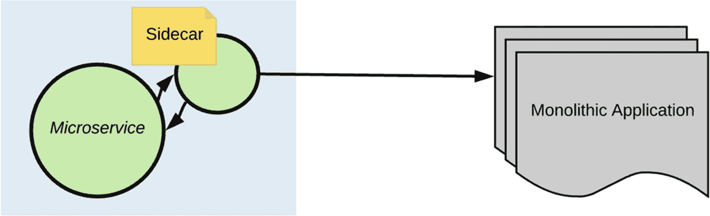

图 2-8

充当防腐层的边车

防腐层是使用边车模式的一种可能方式。它也被用于其他几种用例，例如服务网格。我们将在第 9 章“服务网格”中详细讨论什么是服务网格以及边车模式如何在服务网格中使用。

#### 共享内核

尽管我们讨论了在限界上下文之间保持清晰边界的重要性，但在某些情况下我们需要共享领域模型。当两个或多个限界上下文存在某些共同点，并且在不同的限界上下文下维护独立的对象模型会带来大量开销时，就可能出现这种情况。例如，每个限界上下文（或微服务）都必须对调用其操作的用户进行授权。不同的领域可能使用自己的授权策略，但在许多情况下，它们共享与授权服务相同的领域模型（授权服务本身就是一个微服务或一个独立的限界上下文）。在这种情况下，授权服务的领域模型充当了共享内核。由于存在共享的代码依赖（可能封装在库中），为了使共享内核模式在实践中发挥作用，所有使用共享内核的团队必须相互良好协作（见图 2-9）。

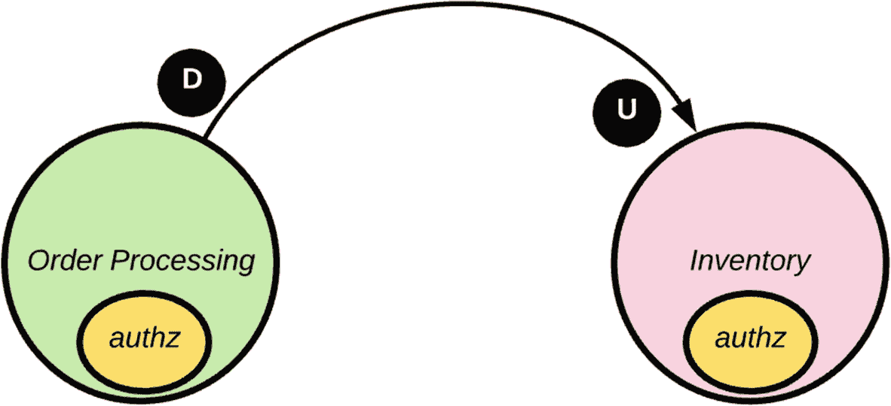

图 2-9

共享内核

#### 追随者

我们在本章中已经讨论过上游限界上下文和下游限界上下文的责任。让我们快速回顾一下。上游上下文对下游上下文拥有更多控制权。上游上下文定义了在两个上下文之间传递的领域模型。下游上下文应该充分了解上游上下文发生的任何变化。追随者模式指出，下游上下文（追随者）必须遵守上游上下文定义的契约。

追随者模式看起来与共享内核相似，两者都拥有共享的领域模型。区别在于决策制定和开发过程。共享内核是两个紧密协调的团队之间协作的结果，而追随者模式处理的是与一个对协作不感兴趣的团队的集成——可能是一个你无法控制的第三方服务。例如，你可能使用 PayPal API 来处理支付。PayPal 永远不会为了适应你而改变其 API，相反，你的限界上下文必须遵守它。如果这种集成使你的领域模型变得丑陋，你可以引入一个防腐层来将集成隔离在单一位置。

#### 客户/供应商模式

顺从模式有其自身的缺陷，即下游上下文或服务对于其与上游上下文之间的接口应如何设计没有发言权。在上下游限界上下文工作的团队之间不存在协作。客户/供应商模式是朝着在这两个团队之间建立更好沟通、并找到协作构建接口方法迈出的一步。它不像共享内核模式那样是完全的协作，而更像是一种客户/供应商关系。下游上下文是客户，上游上下文是供应商。

客户不能完全决定供应商做什么。但同样，供应商也不能完全忽视客户的反馈。一个好的供应商总会倾听客户的意见，提取积极因素，向客户提供反馈，并生产出满足其需求的最佳产品。生产对客户无用的东西毫无意义。这就是遵循客户/供应商模式的上下游上下文之间预期的协作水平。这有助于下游上下文提供建议，并请求更改两个上下文之间的接口。遵循此模式，上游上下文承担了更多责任。一个给定的上游上下文不仅要处理一个下游上下文。你需要格外小心，确保来自一个下游上下文的建议不会破坏上游上下文与另一个下游上下文之间的契约。

#### 伙伴关系模式

当我们有两个或多个团队在不同的限界上下文下构建微服务，但总体朝着相同的目标前进，并且它们之间存在显著的相互依赖关系时，伙伴关系模式是建立协作的理想方式。团队可以就技术接口、发布计划以及任何共同关心的事项进行协作决策。伙伴关系模式也适用于任何使用共享内核模式的团队。构建共享内核所需的协作可以通过伙伴关系来建立。同时请记住，伙伴关系模式的输出不一定是共享内核。它可以是任何相互依赖的服务，而无需共享具体内容。

#### 发布语言模式

遵循发布语言模式的微服务或限界上下文，应就一种发布语言达成一致以进行通信。这里的*发布*意味着该语言对可能对其感兴趣的社区是随时可用的。这可以是 XML、JSON 或与微服务所在领域相对应的任何其他语言。这里的领域指的是核心领域。例如，在金融、电子商务和许多其他领域中使用的特定领域语言。

此模式强调了使用文档完善的共享语言来表达必要的领域信息，作为通用通信媒介的重要性。图 2-10 展示了在发布语言和特定上下文语言之间如何进行转换。在`订单处理`微服务端，我们有一个 Java 到 JSON 的解析器，它知道如何从 Java 对象模型创建 JSON 文档。我们在`库存`微服务端使用 JSON 到 C# 的解析器，从 JSON 文档构建 C# 对象模型。

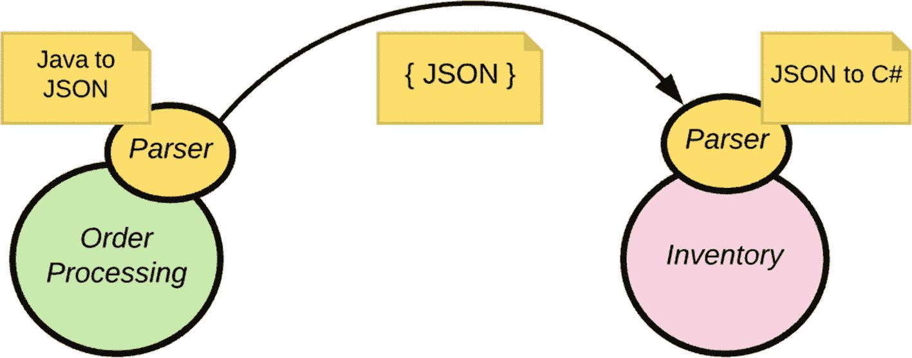

图 2-10

发布语言模式

#### 开放主机服务模式

在防腐层模式中，我们在上游和下游微服务（或限界上下文）之间有一个转换层。当我们有多个下游服务时，每个下游服务都必须处理转换，如图 2-11 所示。`配送`和`供应商管理`微服务都必须将从上游`计费`微服务获取的对象模型转换到它们各自的领域模型（见图 2-11）。如果这些下游微服务各自拥有自己的领域模型，那倒没关系。我们无法避免在每个端点进行转换。但是，如果我们有许多下游微服务都在做相同的转换，那就造成了重复劳动。开放主机服务模式提出了一种克服此问题的方法。

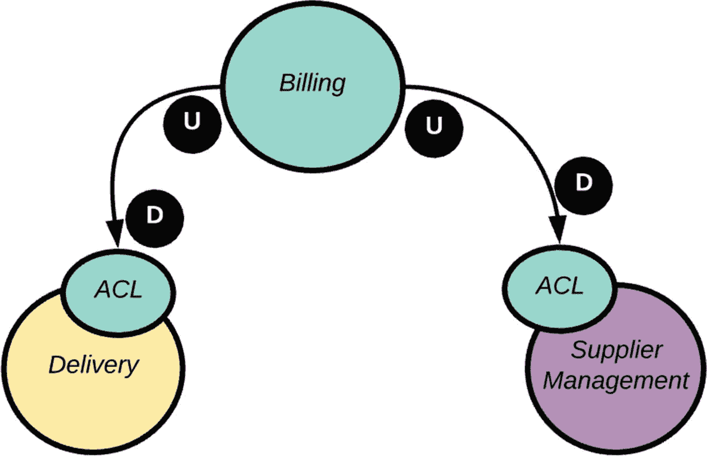

图 2-11

具有多个下游服务的防腐层模式

实现开放主机服务模式的一种方法是通过 API 暴露上游微服务功能，并由该 API 执行转换。现在，所有共享相同领域模型的下游微服务都可以与 API（而不是上游微服务）通信，并遵循顺从模式或客户/供应商模式。

图 2-12 展示了使用 API 实现开放主机服务模式。我们将在第 10 章：API、事件和流中讨论 API 网关在微服务架构中的作用。

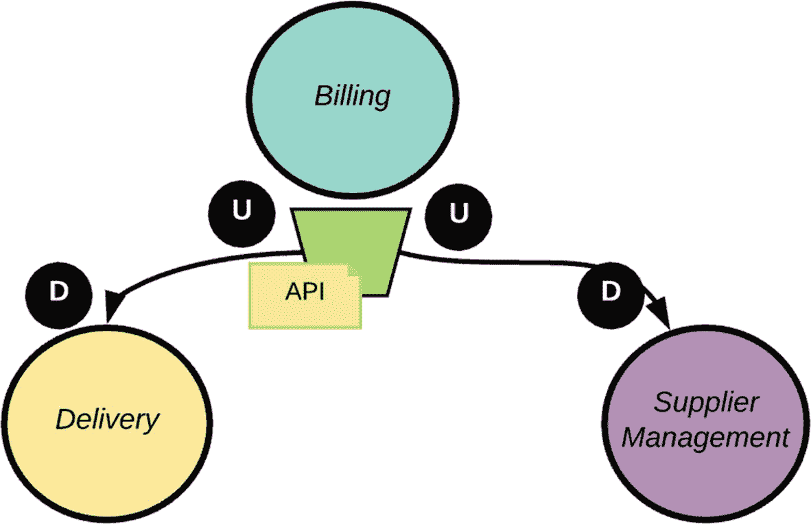

图 2-12

开放主机服务模式

#### 各自为政模式

让我们重新审视为电子商务应用所做的微服务设计。其中有一个`客户`微服务和一个`订单处理`微服务（见图 2-2）。设想一个客户门户，它与`客户`微服务通信并显示用户资料。对最终用户来说，能够在其资料数据旁边看到自己的订单历史可能很有用。但是`客户`微服务无法直接访问特定客户的订单历史；它由`订单处理`微服务控制。实现这一点的一种方法是集成`订单处理`微服务和`客户`微服务，并更改`客户`微服务的领域模型，使其在返回资料数据的同时返回订单历史，这是一种成本高昂的集成。

集成总是昂贵的，有时收益却很小。各自为政模式建议避免这种成本高昂的集成，并寻找其他方式来满足此类请求。例如，在这种特定场景下，我们可以避免`订单处理`微服务和`客户`微服务之间的集成，而是在客户门户中提供一个链接，连同资料数据一起用于检索订单历史，该链接将直接与`订单处理`微服务通信（见图 2-13）。

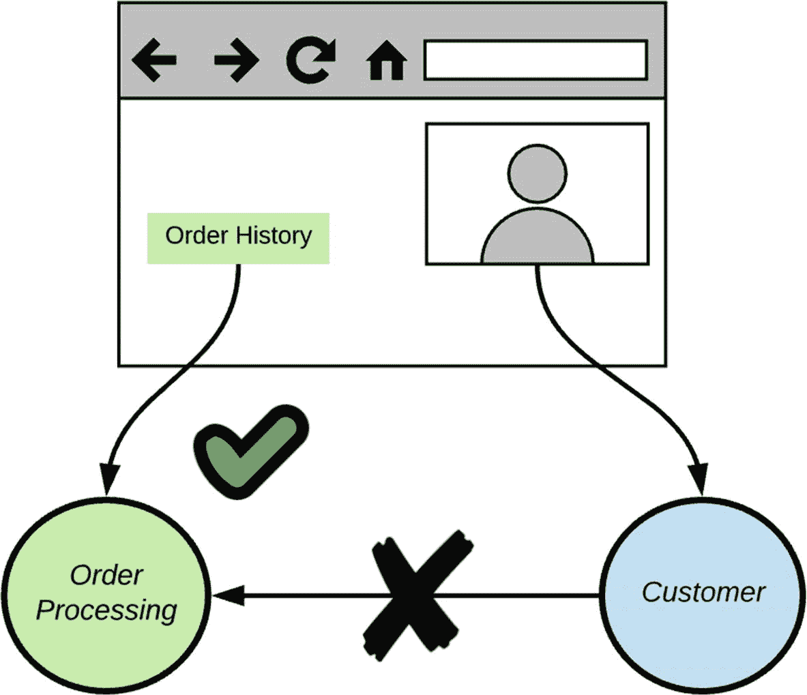

图 2-13

各自为政模式

#### 大泥球模式

大多数时候，你没有机会从事一个全新项目。你总会发现某种遗留系统，它们极难以标准方式与其他系统集成。这些系统没有清晰的边界和干净的领域模型。大泥球模式强调了识别此类系统并在特殊上下文中处理它们的必要性。我们不应尝试对这些上下文应用复杂的建模，而应找到通过 API 或某种服务接口进行集成的方法，并在下游服务端使用防腐层模式。

## 设计原则

领域驱动设计帮助我们结合限界上下文来界定微服务的范围。在任何微服务设计的核心中，上市时间、可扩展性、复杂性局部化和弹性都是关键要素。遵循以下设计原则有助于微服务实现这些设计目标。

### 高内聚与低耦合

内聚是衡量一个系统自包含程度的指标。格雷格·杨·霍尔在他的著作《*适应性代码*》中，将内聚定义为对方法内变量、类内方法、模块内类、解决方案内模块、子系统内解决方案以及系统内子系统之间上下文关系强度的度量。这种分形关系至关重要，因为任何范围内缺乏内聚都会引发问题。根据上下文关系的强弱，内聚性可分为低内聚和高内聚。在微服务架构中，如果一个微服务要解决两个或多个不相关的问题，或者换句话说，解决两个或多个上下文关系薄弱的问题，就会导致系统内聚性低。低内聚系统本质上是脆弱的。当我们构建一个微服务来处理许多其他不太相关的需求时，我们很可能需要更频繁地更改其实现。

给定两个需求，我们如何判断它们是否具有强上下文关系？这正是我们在上一节领域驱动设计中所做练习的全部意义所在。如果你的需求属于同一个限界上下文，那么它们确实具有强上下文关系。如果一个微服务的服务边界与相应领域的限界上下文对齐，那么它将产生一个高内聚的微服务。

### 注意

一个高内聚、低耦合的系统自然会遵循*单一职责原则*。单一职责原则指出，遵循该原则的组件或系统应该只有一个变更的理由。

内聚和耦合是系统设计的两个相关属性。高内聚的系统自然也是低耦合的。耦合是衡量不同系统之间（在我们的案例中，是微服务之间）相互依赖程度的指标。当微服务之间存在高度相互依赖时，将导致紧耦合系统，而低相互依赖则会产生松耦合系统。紧耦合系统会构建出脆弱的系统架构。在一个系统中进行的更改会影响所有相关系统。如果一个系统宕机，所有相关系统都将功能失常。当我们拥有高内聚系统时，我们将所有相关或相互依赖的功能分组到一个系统中（或分组到一个限界上下文内）。因此，它不需要严重依赖其他系统。

根据定义，微服务架构必须是高内聚且低耦合的。

### 韧性

韧性是衡量系统或系统中单个组件从故障中快速恢复能力的指标。换句话说，它是系统的一种属性，使其能够以不会导致整个系统崩溃的方式处理故障。微服务架构本质上是一个分布式系统。分布式系统是通过网络连接、无共享内存、对用户而言表现为单一连贯系统的计算节点集合。在分布式系统中，故障并不罕见。现在乃至永远，网络都将是不可靠的。海底光缆可能被潜艇损坏，路由器可能因过热而烧毁，负载均衡器可能开始出现故障，计算机可能耗尽内存，电源故障可能导致数据库服务器宕机，地震可能摧毁整个数据中心——出于成千上万种原因，分布式系统中的通信都可能失败。

### 注意

1994 年，时任 Sun 公司研究员的彼得·多伊奇起草了分布式系统架构师和设计者可能做出的七项假设，这些假设从长远来看被证明是错误的，并会给做出这些假设的解决方案和架构师带来各种麻烦和痛苦。1997 年，詹姆斯·高斯林又增加了这样一个谬误。这些假设现在统称为*分布式计算的八大谬误*：1. 网络是可靠的。2. 延迟为零。3. 带宽是无限的。4. 网络是安全的。5. 拓扑结构不会改变。6. 只有一个管理员。7. 传输成本为零。8. 网络是同质的。^(²)

故障是不可避免的。阿里尔·特塞特林在其 ACM 论文《*“反脆弱组织”*》^(³)中，以 Netflix 为例，探讨了如何拥抱故障以提高韧性和最大化可用性。阿里尔在论文中强调的提高系统韧性的一个方法是通过定期诱发故障来减少不确定性。Netflix 接受定期诱发故障的理念，并采取激进的方法，编写导致故障的程序并在生产环境中日常运行（Netflix 的“猿军”）。谷歌也不仅仅局限于模拟服务器故障的简单测试，作为其年度灾难恢复测试（DiRT）演习的一部分，它模拟了诸如地震等大规模灾难。

### 注意

Netflix 采取了三个重要步骤来构建更具反脆弱性的系统和组织。第一步是将每位工程师视为相应服务的运营者。第二步是将每次故障视为学习的机会。第三步是培养一种不指责的文化。

在分布式系统中对抗故障最常用的方法是通过冗余。分布式系统中的每个组件都会有一个冗余的对应组件。如果一个组件发生故障，相应的对应组件将接管。并非所有时候，系统中的每个组件都能在零停机时间的情况下从故障中恢复。除了冗余之外，拥有专注于面向恢复开发的开发者思维模式也有助于构建更具韧性的软件。以下列出了一系列最初由迈克尔·T·尼加德在其著作《*发布！*》中提出的模式，用于构建韧性软件。如今，这些模式已成为微服务开发不可或缺的一部分。许多微服务框架都为一等公民级别地实现这些模式提供了支持。接下来是对韧性通信模式的详细解释，我们将在第 7 章讨论微服务集成时再次探讨它们。届时我们将讨论如何在大多数常见的微服务开发框架中实际应用这些模式。

#### 超时

如今我们构建的几乎所有应用都会通过网络进行远程调用。这可能是对 Web 服务端点的 HTTP 请求、通过 JDBC 的数据库调用，或是对 LDAP 服务器的身份验证请求。任何网络通信都不可靠；因此，我们不应无限期地等待远程端点的响应。例如，在数据库连接中，如果我们决定无限期等待直到收到响应，那么在该等待期间，就会有一个连接从数据库连接池中被占用。如果再有几个类似的连接，应用程序的整体性能就会开始下降。

超时决定了我们愿意等待响应的时间。对于我们微服务发出的每一次远程调用，都必须设置超时。超时时间过长或过短都无济于事。找出最佳值将是一个学习过程。请确保每次连接超时时都记录一条日志。这有助于将来调整超时值。

让我们看看这在实践中是如何发生的。从我们的客户门户网站，为了根据登录用户之前的订单模式为其加载建议，我们需要调用`客户建议`微服务。该服务必须与内部数据库通信以加载建议。如果与数据库的连接超时，我们应该返回什么？如果我们以面向恢复的开发思维来构建微服务，就不应该仅仅返回一个错误，而应该返回一组默认建议，这不会破坏客户门户网站的任何功能。从业务角度来看，这可能效率不高，但从最终用户的体验角度来看，这是一个值得遵循的良好模式。

#### 断路器

断路器通过控制电流来保护电器（见图 2-14）。如果电流高于某个阈值，断路器就会切断电流，保护其后的电器免受损坏。断路器模式将这一概念引入了软件世界。如果我们的微服务对某个端点持续超时，那么至少在一段时间内，继续尝试是没有意义的。断路器模式建议将此类操作封装在一个组件中，当系统不健康时，该组件可以规避调用。该组件会维护一个故障阈值，一旦达到阈值，就会断开电路；不再对封装的操作进行任何调用。它还可能等待一段配置好的时间间隔，然后闭合电路，以检查操作是否还会返回错误；如果不再返回错误，则会为后续所有操作保持电路闭合。

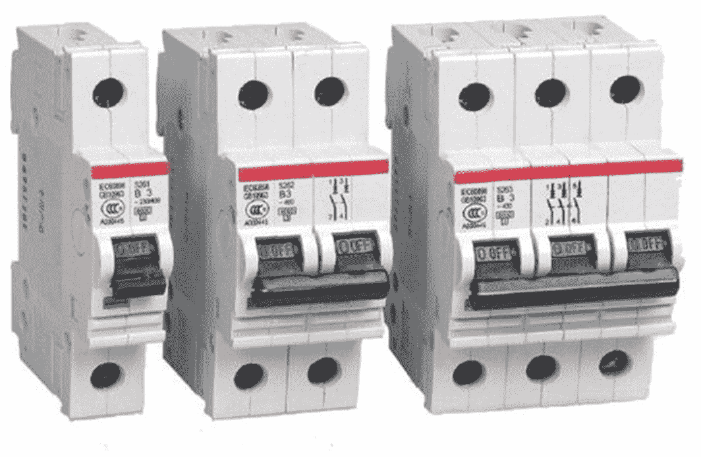

图 2-14

MCB（微型断路器），主要用于家庭

#### 隔板

隔板主要用于船舶，以建造水密隔舱，这样如果一个隔舱进水，人们可以转移到另一个隔舱以确保安全。一个隔舱的损坏不会导致整艘船沉没，因为各隔舱是相互隔离的。

隔板模式借鉴了同样的概念。该模式强调了如何分配资源，例如线程池，即用于出站连接的连接池。如果我们为所有出站端点使用一个单一的线程池，那么如果某个端点响应缓慢，将相应线程释放回池中就需要更多时间。如果这种情况持续发生，也会影响发往其他端点的请求，因为越来越多的线程正在等待那个慢速端点。遵循隔板模式，我们可以为每个端点（或者以某种逻辑方式将它们分组）设置一个线程池。这可以防止一个不良端点的问题蔓延到其他健康的端点。隔板模式通过划分容量，在发生故障时保留部分功能。

#### 稳态

稳态模式强调了遵循一种设计理念的必要性，该设计能让系统长时间稳定运行，而无需频繁干预。每次运维团队接触系统时，无论他们经验多么丰富，都会增加引入新错误的可能性。2017 年 3 月，AWS（亚马逊云服务）发生了一次大规模宕机。这次 AWS S3 系统长达四小时的宕机导致美国各地出现中断、速度减慢和加载失败错误。亚马逊后来发布^(⁴)了问题的原因，这是一个微不足道的人为错误。一名获得授权的 S3 团队成员使用既定的操作手册执行了一条命令，该命令本意是移除 S3 计费流程所使用的某个 S3 子系统中的少量服务器。不幸的是，命令的某个输入参数被错误地输入，导致移除的服务器数量远超预期。

系统的设计必须尽可能减少人为干预。从开发到部署的一切都必须自动化。这包括清理生产服务器上积累的资源。最好的例子就是日志。不断积累的日志文件很容易填满文件系统。本章稍后我们将讨论一种在微服务部署中有效管理日志的方法。

我们还习惯将临时状态和有时效的令牌存储在数据库中，这会导致数据库随着时间的推移而急剧增长。即使这些令牌和临时状态已不再有效，它们仍然留在数据库中，占用空间并拖慢系统速度。系统设计应该有一种通过自动化进程定期清理此类数据的方法。

内存缓存是另一个需要关注的领域。在运行系统中，内存是一种有限且宝贵的资源。让内存缓存无限增长会导致系统性能下降，最终系统将耗尽内存。始终建议为缓存设置一个上限（以缓存中的元素数量计），并采用 LRU（最近最少使用）策略进行清理。使用最近最少使用策略，当缓存达到上限时，最近最少使用的元素将被淘汰，为新元素腾出空间。定期刷新是另一种清理缓存的策略。

稳态模式指出，对于每个积累资源的机制，必须有另一个机制来回收该资源。

#### 快速失败

快速失败模式强调了在请求执行流程的早期就判断其是否会失败或被拒绝的必要性。例如，如果负载均衡器已经知道某个节点宕机，那么反复向其发送请求以检查其是否恢复是没有意义的。相反，在收到该节点有效的心跳信号之前，可以将其标记为故障节点。断路器模式也可以用来实现快速失败策略。通过断路器模式，我们可以隔离故障端点，任何发往此类端点的请求都可以在不重试的情况下被拒绝，直到断路器决定是时候重新检查为止。

#### 让它崩溃

在许多情况下，医生会在严重事故后决定截去病人的一条腿以挽救其生命。这有助于防止严重损伤从腿部扩散到身体其他部位。在 Erlang^(⁵) 世界中，这被称为“让它崩溃”哲学。有时，放弃一个子系统以维护整个系统的稳定性可能是有用的。这种“让它崩溃”的方法建议，在因故障导致恢复困难且不可靠时，应尽快恢复到干净的启动状态。这是微服务部署中非常常见的一种策略。一个给定的微服务只处理整个系统中的一个有限范围，将其关闭并重新启动对系统的影响很小。这种策略通过每个主机运行一个微服务并使用容器的策略得到了很好的支持。快速的服务器启动时间（可能只需几毫秒）也是使该策略成功的关键因素。

#### 握手

握手主要用于双方之间交换需求以建立通信信道。这发生在建立 TCP（传输控制协议）连接之前，通常被称为 TCP 三次握手。同样，我们在建立 TLS（传输层安全协议）连接之前也会看到一次握手。这是计算机科学中最流行的两种握手协议。握手模式建议服务器使用握手来通过限制自身工作负载来保护自己。当一个微服务位于负载均衡器后面时，它可以使用这种握手技术来告知负载均衡器它是否准备好接受更多请求。每个托管微服务的服务器都可以提供一个轻量级的健康检查端点。负载均衡器可以定期 ping 这个端点，以查看相应的微服务是否准备好接受请求。

#### 测试工具

分布式系统中的所有故障都很难捕获，无论是在开发测试还是 QA（质量保证）测试中。集成测试看起来可能是一个更好的选择，但它有其自身的局限性。大多数时候，我们根据相应服务端点提供的规范来构建集成测试。这通常涵盖了成功场景，即使在失败情况下，它也定义了确切期望的内容，例如错误码。并非所有系统在所有时候都按照规范运行。测试工具模式提出了一种集成测试方法，允许我们测试大多数故障模式，甚至超出服务规范的范围。

测试工具是另一个远程端点，它代表你的微服务需要连接的每一个远程端点。测试工具和服务端点之间的区别在于，测试工具仅用于测试故障，而不关心应用程序逻辑。测试工具必须被编写成能够生成涵盖 OSI（开放系统互连）模型所有七层的各种错误。例如，测试工具可能会发送连接被拒绝的响应、无效的 TCP 数据包、缓慢的响应、内容类型不正确（XML 而非 JSON）的响应，以及许多其他在正常情况下我们永远不会从服务端点期望的错误。

#### 卸载负载

如果我们观察 TCP（传输控制协议）的工作方式，它会为每个端口提供一个监听队列。当连接涌入某个特定端口时，所有这些连接都会被排队。每个池都有一个最大限制，当达到限制时，将不再接受新的连接。当队列满时，任何建立连接的新尝试都将被拒绝，并返回一个 ICMP RST（重置）数据包。这就是 TCP 在 TCP 层卸载负载的方式。运行在 TCP 层之上的应用程序将从 TCP 连接池中拉取请求。在实践中，大多数应用程序在 TCP 连接池达到其最大值之前就已经因连接而耗尽。卸载负载模式建议应用程序或服务也应该模仿 TCP 的模式。

当应用程序发现其运行落后于给定的 SLA（服务等级协议）时，它应该卸载负载。通常，当应用程序耗尽且运行线程被某些资源阻塞时，响应时间开始恶化。这些指标有助于显示给定的服务是否落后于 SLA。如果是这样，该模式主张卸载负载，或通知负载均衡器该服务尚未准备好接受更多请求。这可以与握手模式结合使用，以构建更好的解决方案。

### 可观测性

收集数据成本低廉，但在需要时没有数据则代价高昂。2016 年 3 月，亚马逊宕机 20 分钟，估计收入损失达 375 万美元。2017 年 1 月，达美航空发生系统故障，导致超过 170 个航班取消，估计损失达 850 万美元。在这两个案例中，如果他们收集了适当级别的数据，本可以预测到此类行为，或在事件发生时通过识别根本原因迅速恢复。我们拥有的信息越多，就能做出更好的决策。

可观测性是一种衡量标准，用于评估系统的内部状态在多大程度上可以通过其外部输出的知识来推断^(⁶)。我认识的一家公司曾经通过计算员工在前门刷卡进出时间差来监控他们的有效工作时间。只有当所有员工都支持这种监控或使自己变得可观测时，这种策略才有效。每周结束时，人力资源部（HR）会按日期向每位员工发送有效工作时间。在大多数情况下，数据是完全不正确的。原因是大多数人会成群结队地出去吃午饭或喝茶，当他们进出时，通常只有一个人会刷卡开门。尽管我们实施了监控，但由于员工不配合或不可观测，并没有产生预期的结果。

我认识的另一家公司曾经追踪员工的进出时间、他们在公司内部的工作地点（通过他们连接公司无线网络的时间以及无线接入点的位置来判断）。即使采用这种方法，我们追踪的也不是员工，而是他们的笔记本电脑。我们可以把笔记本电脑放在办公桌上，然后整天在乒乓球桌旁度过——或者去购物，然后回来把笔记本电脑带回家。这两个例子都突出了一个重要事实——只有当我们拥有一个可观测的系统时，监控才有效。

可观测性是任何微服务设计中都必须融入的最重要的方面之一。我们可能需要追踪每个微服务的吞吐量、成功/失败请求的数量、CPU、内存和其他网络资源的利用率，以及一些与业务相关的指标。第 13 章“可观测性”将详细讨论微服务的可观测性。

### 自动化

微服务架构背后的关键理念之一是缩短产品上线时间并加快反馈周期。没有自动化，我们无法实现这些目标。如果没有 DevOps 和相关自动化工具的及时进步，一个良好的微服务架构也只会是纸上谈兵（或白板上的空想）。任何想法如果出现的时机不对，都不能算是好主意。微服务之所以成为一个好主意，是因为它在开始成为主流时，已经拥有了 Docker、Ansible、Puppet、Chef 等众多工具的支持。

围绕自动化的工具大致可分为两类：持续集成工具和持续部署工具。持续集成使软件开发团队能够协同工作，而不会互相干扰。他们可以自动化构建和源代码集成，以维护源代码的完整性。他们还可以与 DevOps 工具集成，创建自动化的代码交付管道。顶级分析公司 Forrester 在其关于持续集成工具的最新报告^(⁷)中，列出了该领域的十大工具：Atlassian Bamboo、AWS CodeBuild、CircleCI、CloudBees Jenkins、Codeship、GitLab CI、IBM UrbanCode Build、JetBrains TeamCity、Microsoft VSTS 和 Travis CI。

持续交付工具将应用程序、基础设施、中间件以及支持性的安装流程和依赖项打包成发布包，这些发布包会在整个生命周期中进行流转。Forrester 关于持续交付和发布自动化的最新报告^(⁸) 重点介绍了该领域最重要的 15 家供应商：Atlassian、CA Technologies、Chef Software、Clarive、CloudBees、Electric Cloud、Flexagon、Hewlett Packard Enterprise (HPE)、IBM、Micro Focus、Microsoft、Puppet、Red Hat、VMware 和 XebiaLabs。

## 12-Factor 应用

微服务架构不仅仅围绕设计原则构建。有些人称之为一种*文化*。它是许多其他协作努力的成果。是的，设计是关键要素，但我们还需要关注开发人员与领域专家之间的协作、团队与团队成员之间的沟通、持续集成与交付以及许多其他问题。12-Factor App 是 Heroku 于 2012 年发布的一份宣言^(⁹)。这份宣言汇集了构建和维护可扩展、可维护且可移植应用程序的最佳实践和指南。尽管这些最佳实践最初源自部署在 Heroku 云平台上的应用程序，但如今它已成为任何成功微服务部署的准则。接下来讨论的这 12 个因素非常普遍且自然，因此你很可能在有意或无意中遵循着它们。

### 基准代码

基准代码因素强调了将所有源代码维护在版本控制系统中，并且每个应用程序拥有一个代码仓库的重要性。这里的应用程序可以是我们所说的微服务。每个微服务拥有一个仓库有助于其独立于其他微服务进行发布。该微服务必须从同一个仓库部署到多个环境（测试、预发布和生产）。每个服务拥有独立的仓库也有助于开发过程的治理方面。

### 依赖

*依赖*因素指出，在你的应用程序中，你应该显式声明并隔离你的依赖项，绝不应依赖隐式的系统级依赖项。在实践中，如果你正在构建一个基于 Java 的微服务，你必须使用 Maven 在 `pom.xml` 文件中或使用 Gradle 在 `build.gradle` 文件中声明所有依赖项。Maven 和 Gradle 是两个非常流行的构建自动化工具，但随着近期的发展，Gradle 似乎比 Maven 更具优势，并被 Google、Netflix、LinkedIn 和许多其他顶级公司使用。Netflix 在其微服务开发过程中，使用 Gradle 以及他们自己的构建自动化工具 Nebula^(¹⁰)。事实上，Nebula 是 Netflix 开发的一组 Gradle 插件。

微服务的依赖管理已经超越了仅仅在构建自动化工具中声明它们的范畴。如今大多数微服务部署都依赖于容器，例如 Docker。如果你不熟悉 Docker 和容器，现在不必担心；我们将在第 8 章详细讨论微服务部署模式时再介绍它们。使用 Docker，你不仅可以声明微服务运行所需的核心依赖项，还可以声明其他具有特定版本的外部依赖项，例如 MySQL 版本、Java 版本等。

### 配置

配置因素强调了将环境特定设置从代码解耦到配置中的必要性。例如，LDAP 或数据库服务器的连接 URL 涉及环境特定的参数和证书。这些设置不应硬编码到代码中。此外，即使使用配置文件，也绝不要将任何类型的凭证提交到源代码仓库中。这是一些开发人员常犯的错误；他们认为既然使用的是私有 GitHub 仓库，就只有他们自己能访问，但事实并非如此。当你将凭证提交到私有 GitHub 仓库时，即使它是私有的，这些凭证也会以明文形式存储在外部服务器上。

### 后端服务

后端服务是应用程序在正常运行期间所消费的任何类型的服务。它可以是数据库、缓存实现、LDAP 服务器、消息代理、外部服务端点或任何类型的外部服务（见图 2-15）。*后端服务*因素指出，这些后端服务应被视为可附加的资源。换句话说，它们应该是可插入到我们的微服务实现中的。我们应该能够通过编辑配置文件或设置环境变量来更改数据库、LDAP 服务器或任何外部端点。这个因素与前一个因素密切相关。

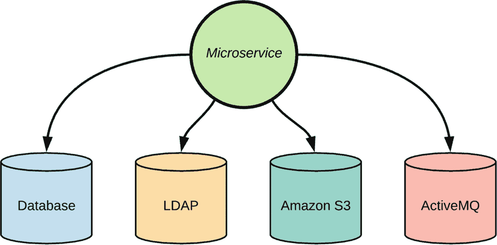

图 2-15

后端服务

### 构建、发布、运行

这是第五个因素，它强调了在应用程序的构建、发布和运行阶段之间进行清晰分离的重要性。让我们看看 Netflix 是如何构建其微服务的^(¹¹)。他们在这些阶段之间有清晰的分离（见图 2-16）。流程始于开发人员使用 Nebula 进行构建和本地测试。Nebula 是 Netflix 开发的一个构建自动化工具；实际上它是一组 Gradle 插件。然后，更改被提交到相应的 Git 仓库。接着，一个 Jenkins 任务执行 Nebula，后者会构建、测试并打包应用程序以供部署。对于不熟悉 Jenkins 的人来说，它是一个领先的开源自动化服务器，有助于实现持续集成和部署。构建准备就绪后，它会被封装到一个 Amazon 机器镜像 (AMI) 中。

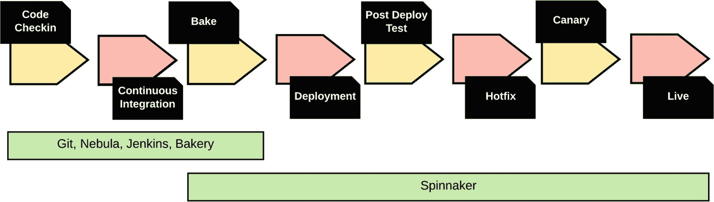

图 2-16

Netflix 构建流程

Spinnaker 是 Netflix 发布流程中使用的另一个工具。它实际上是一个持续交付平台，用于以高速度和信心发布软件变更，由 Netflix 开发，后来开源。一旦 AMI 准备好部署，Spinnaker 就使其可用于部署到数十、数百或数千个实例，并将其部署到测试环境中。从那里开始，开发团队通常会使用一组自动化集成测试来执行部署。

### 进程

第六个要素指出，进程应该是无状态的，并且应避免使用粘性会话。无状态意味着应用程序在执行操作前后，不应假设内存中存在任何数据。任何符合第六要素的微服务部署，其设计方式都应该是无状态的。在典型的企业级微服务部署中，你会发现，给定微服务的多个实例会根据其收到的负载而动态创建和销毁。如果我们要在这些微服务的内存中维护某种状态，那么在所有微服务实例间复制状态将是一个繁琐的过程，并且会增加大量复杂性。无状态微服务可以按需复制，并且在启动期间甚至运行时，各个实例之间无需协调，这引导我们走向无共享架构。

#### 无共享架构

无共享架构是分布式计算中一个成熟的原则。它指出，系统中的给定节点不应与其他节点共享磁盘或内存，这比仅仅是无状态更进一步。这有助于构建高度可扩展的系统。一个可扩展的系统，当向系统引入更多节点或资源时，应该能够针对增加的负载产生更高的吞吐量。如果我们在系统的节点之间共享资源，那么引入更多节点将会给这些共享资源带来更多负载，因此对总吞吐量的影响将会较小。

在典型的 Web 应用程序中，节点之间共享磁盘主要有两个目的。一是为了在节点之间共享一些通用的配置文件，在大多数情况下，这是通过将共享磁盘驱动器挂载到每个节点来实现的。如果无法使用共享驱动器，我们可以在这些节点之间构建某种复制机制，可能使用共享仓库。一个节点可以将其更改提交到共享的 Git 或 Subversion 仓库，其他节点则定期拉取更新。还有另一种方法，随着 DevOps 工程的新进展，这种方法如今相当普遍。我们可以使用像 Puppet^(¹²)或 Chef^(¹³)这样的配置管理工具来集中管理配置，并自动分发到系统中的所有节点。在当今的微服务部署中，我们使用类似的方法，但略有变化。不会在正在运行的服务器上进行配置更改；相反，会使用 Puppet 或 Chef 创建一个包含新配置的新容器，并将其部署到相应的服务器上。Netflix 采用的就是这种方法。

共享磁盘的第二个目的是用于数据库。在传统的 Web 应用程序以及微服务部署中，我们无法完全消除对共享数据库的需求。但为了避免可扩展性问题，我们可以有一个独立的数据库服务器，它可以独立扩展。话虽如此，即使我们在同一微服务的不同节点之间共享同一个数据库，也不鼓励在不同微服务之间共享同一个数据库。在第 5 章“数据管理”中，我们将讨论与微服务相关的不同数据共享策略。

### 端口绑定

端口绑定要素强调了拥有完全自包含应用程序的必要性。如果你拿一个传统的 Web 应用程序，比如一个 Java EE 应用程序，它通常以 WAR（Web 应用程序归档）文件的形式部署在某种 Java EE 容器中，例如 Tomcat、WebLogic 或 WebSphere 服务器。Web 应用程序不关心人们（或系统）如何访问它，使用哪种传输协议（HTTP 或 HTTPS）或哪个端口。这些决定是在 Web 容器级别（Tomcat、WebLogic 或 WebSphere 服务器配置）做出的。WAR 文件不能独立存在；它依赖底层的容器来进行传输/端口绑定。它们不是自包含的。

这第七个要素指出，你的应用程序本身必须进行端口绑定，并将其作为服务暴露出来，而不依赖于第三方容器。这在微服务部署中非常常见。例如，Spring Boot^(¹⁴)，一个流行的基于 Java 的微服务框架，允许你将微服务构建为自包含、可独立执行的 JAR 文件。还有许多其他微服务框架（Dropwizard^(¹⁵)和 MSF4J^(¹⁶)）也实现了同样的功能。第 4 章“开发服务”将介绍如何使用 Spring Boot 开发和部署微服务。

### 并发

应用程序有两种扩展方式：垂直扩展或水平扩展。要垂直扩展应用程序，你需要为每个节点增加更多资源。例如，增加更多 CPU 能力或更多内存。这种方法如今越来越不受欢迎，因为人们倾向于在通用硬件上运行软件。要水平扩展应用程序，你无需担心每个节点的资源，而是增加系统中的节点数量。第 7 个要素*并发*指出，应用程序应该能够进行水平扩展或向外扩展。

动态扩展（水平扩展）的能力是当今微服务部署的另一个重要方面。控制部署的系统会根据负载的升降来创建和销毁服务器实例，以增加/减少整个系统的吞吐量。除非每个微服务实例都能水平扩展，否则这里无法实现动态可扩展性。

### 可处置性

第 9 个要素讨论了应用程序在需要时能够快速启动并优雅关闭的能力。如果我们不能足够快地启动应用程序，那么实现动态可扩展性就非常困难。当今大多数微服务部署都依赖于容器，并期望启动时间达到毫秒级。当你设计微服务架构时，需要确保它尽可能减少对服务器启动时间的开销。遵循每个主机（容器）一个微服务的模型可以进一步促进这一点，我们将在本书后面的第 8 章中详细讨论。这与每个服务器多个单体应用程序的模型相反，后者中每个应用程序都会增加服务器启动时间，这通常是以分钟（甚至不是秒）为单位计算的。

谷歌的一切都运行在容器上。2014 年，谷歌每周启动 20 亿个容器。这意味着平均每秒钟，谷歌会启动大约 3300 个容器^(¹⁷)。

### 开发/生产环境一致性

第 10 条因素强调了确保开发、预发布和生产环境尽可能保持一致的重要性。现实中，许多公司在开发服务器上资源较少，而让预发布和生产服务器保持一致。当开发环境与预发布、生产环境的资源水平不同时，有时需要等到预发布部署才能发现问题。我们注意到，有些公司在开发环境中没有集群，后来浪费了数百个开发工时来调试预发布集群中的状态复制问题。

这不仅涉及节点数量或硬件资源，也适用于应用所依赖的其他服务。例如，如果你计划在生产环境中使用 Oracle，就不应在开发环境中使用 MySQL 数据库；如果你计划在生产环境中使用 Java 1.8，就不应在开发环境中使用 Java 1.6。如今，大多数微服务部署都依赖基于容器（例如 Docker）的部署来避免此类问题，因为所有第三方依赖项都打包在容器本身中。微服务的关键基础之一是其快速开发和部署。早期反馈循环极其重要，而遵循第 10 条因素有助于我们实现这一目标。

### 日志

第 11 条因素指出，你需要将日志视为事件流。日志在应用中扮演两个角色：它们有助于识别系统中正在发生的事情并隔离任何问题，同时也可用作审计追踪。大多数传统应用将日志推送到文件中，然后这些文件被推送到日志管理应用，如 Splunk^(¹⁸)和 Kibana^(¹⁹)。在微服务环境中管理日志颇具挑战性，因为存在大量微服务实例。为了处理单个请求，这些微服务之间可能会生成多个请求。因此，能够追踪并关联系统中所有微服务之间的特定请求至关重要。

日志聚合^(²⁰)是许多微服务部署遵循的常见模式。该模式建议引入一个集中式日志服务，用于聚合环境中所有微服务实例的日志。管理员可以从中央服务器搜索和分析日志，还可以配置在日志中出现特定消息时触发的警报。我们可以通过使用消息系统进一步改进此模式，如图 2-17 所示。这使日志服务与所有其他微服务解耦。每个微服务将日志事件（带有关联 ID）发布到消息队列，日志服务将从队列中读取。

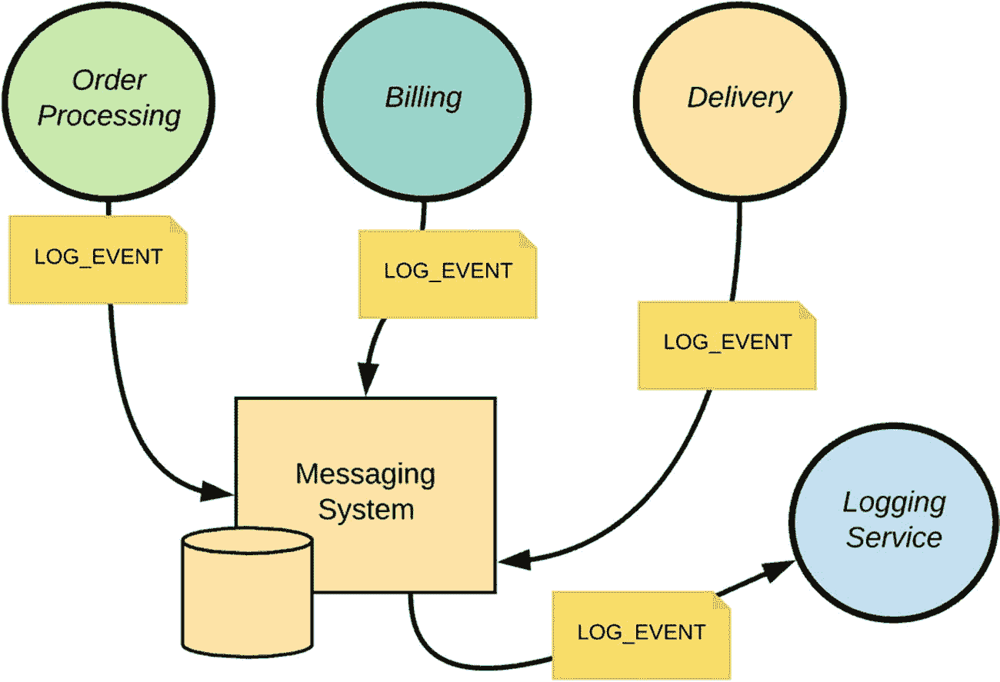

图 2-17

从多个微服务向集中式日志服务器发布日志

尽管传统应用使用基于文件系统的日志记录，但在微服务环境中强烈不推荐这样做。根据第 9 条因素，给定的微服务应在任何时刻都是可丢弃的。这引入了*不可变服务器*的概念。不可变服务器在首次启动后永远不会被修改。如果我们不修改服务器，那么就无法向其文件系统写入任何内容。遵循不可变服务器模式有助于从配置中重现相同的服务器实例，并在任何时刻将其丢弃。

### 管理进程

第 12 条因素强调了将管理任务作为一次性进程运行的必要性。这些任务可能是数据库迁移（由于应用的新版本），或是需要与应用本身一起运行的临时脚本。第 12 条因素的起源似乎对 Ruby 等解释型语言略有偏向，这些语言支持并鼓励交互式编程 shell。一旦应用启动，开发人员可以通过 SSH 登录到这些服务器，并通过这些交互式编程控制台运行某些脚本。如果我们遵循第 12 条因素，就应完全避免通过 SSH 远程执行此类管理任务，而是引入一个管理进程，并将管理任务作为其一部分。在微服务部署中，就像你在不同容器中运行微服务一样，这个管理进程也可以在其自己的容器中运行。

### 超越 12 因素应用

看到 2012 年提出的原始 12 因素（当时微服务尚未成为主流，Docker 甚至还未诞生）与如今成为主流的微服务部署如此相关，真是令人惊叹。2016 年，Pivotal 公司的 Kevin Hoffman^(²¹)在原始因素基础上引入了另外三个因素，我们接下来将讨论这些因素。

#### API 优先

任何有 SOA 背景的人都必须熟悉服务开发常用的两种方法：契约优先和代码优先。采用契约优先时，我们首先以编程语言无关的方式开发服务接口。在 SOAP 世界中，这会生成 WSDL（Web 服务描述语言），而在 REST 世界中，它可能是一个 OpenAPI^(²²)文档（以前称为 Swagger）。OpenAPI 规范是描述 RESTful API 的强大定义格式。

通过这一因素，Kevin 强调了遵循 API 优先方法开始任何应用开发的必要性，这是对契约优先方法的扩展。在多个开发团队按不同时间表处理多个微服务的环境中，首先为每个微服务定义 API，有助于所有团队根据 API 构建其微服务。这有助于提高开发过程的效率，而无需过多担心需要集成的其他微服务的实现细节。如果在准备测试时某个微服务的实现尚不可用，你可以简单地根据已发布的 API 对其进行模拟。不同编程语言下有许多工具可用于创建此类模拟实例。

#### 遥测

根据维基百科，*遥测*是一种自动化通信过程，通过该过程在远程或不可达点收集测量值和其他数据，并将其传输到接收设备进行监控。在软件方面，这对于跟踪生产服务器的健康状况和识别任何问题极为有用。Kevin Hoffman 提出了一个很好的类比来强调应用遥测的必要性。将你的应用想象成发射到太空的无人航天飞机——这个定义如此有力，无需再对遥测的重要性进行额外解释。

遥测数据可分为三类：应用性能监控、领域特定数据、健康与系统日志。HTTP 请求数量、数据库调用次数以及随时间变化处理每个请求所花费的时间，都记录在应用性能监控类别下。领域特定数据类别记录与业务功能相关的数据。例如，`订单处理`微服务将推送与正在处理的订单相关的数据，包括按日期统计的新订单数、未结订单数和已结订单数。与服务器启动、关闭、内存消耗和 CPU 利用率相关的数据则属于健康与系统日志类别。

#### 安全性

这是原始 12 要素中一个显著缺失的因素。任何应用或微服务都应在设计初期就关注安全性。保护微服务涉及多个视角。微服务背后的关键驱动力是交付速度（或上市时间）。我们应当能够对某个服务进行修改、测试，并立即部署到生产环境。为了确保不会在代码层面引入安全漏洞，我们需要制定合理的静态代码分析和动态测试计划——最重要的是，这些测试应成为持续交付（CD）流程的一部分。任何漏洞都应在开发生命周期的早期被发现，并拥有更短的反馈周期。

微服务有多种部署模式（我们将在本书第 8 章中讨论），但最常用的是每主机单服务模型。这里的“主机”不一定指物理机器——更可能是一个容器（Docker）。我们需要关注容器级别的安全性，考虑如何将一个容器与其他容器隔离，以及容器与主机操作系统之间的隔离程度。

最后但同样重要的是，我们需要关注应用级别的安全性。微服务的设计应讨论如何对用户进行身份验证和访问控制，以及如何保护微服务之间的通信通道。我们将在第 11 章“微服务安全基础”和第 12 章“保护微服务安全”中详细讨论微服务安全。

## 总结

在本章中，我们讨论了与微服务设计相关的基本概念。本章首先讨论了领域驱动设计原则，这是从业务角度建模微服务的关键要素。然后我们深入探讨了微服务设计原则，最后以 12 要素应用作为总结，这是一套用于构建和维护高度可扩展、可维护且可移植应用的最佳实践和指南。

外部方通过消息来消费任何作为微服务实现的业务功能。微服务可以根据业务用例利用同步消息和异步消息等消息传递风格。在下一章中，我们将详细讨论消息传递技术和协议。

脚注 1   2   3   4   5   6   7   8   9   10   11   12   13   14   15   16   17   18   19   20   21   22

