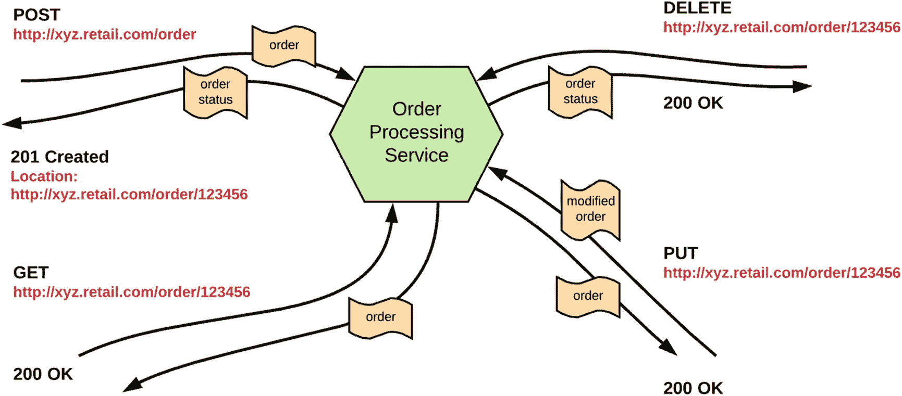
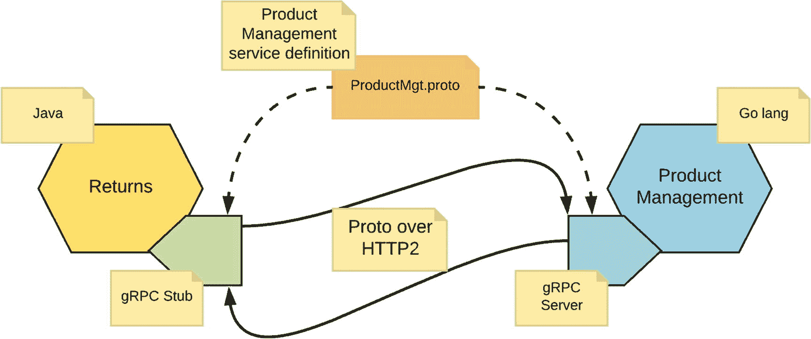
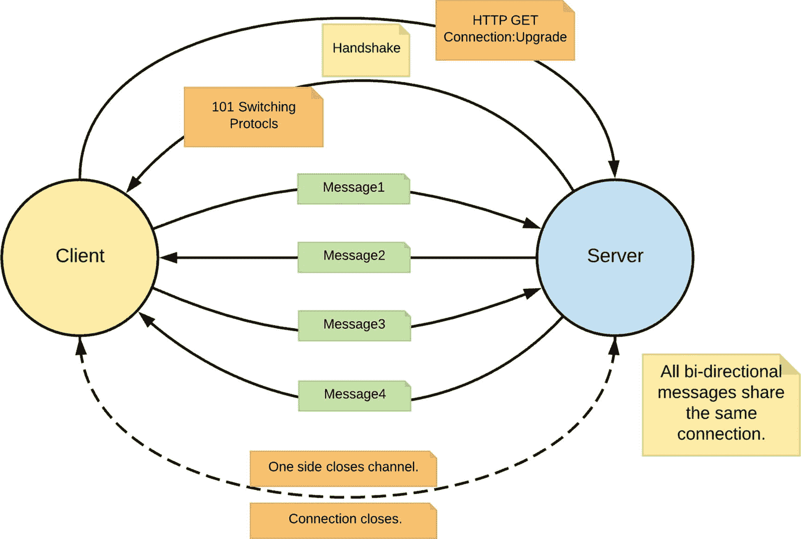
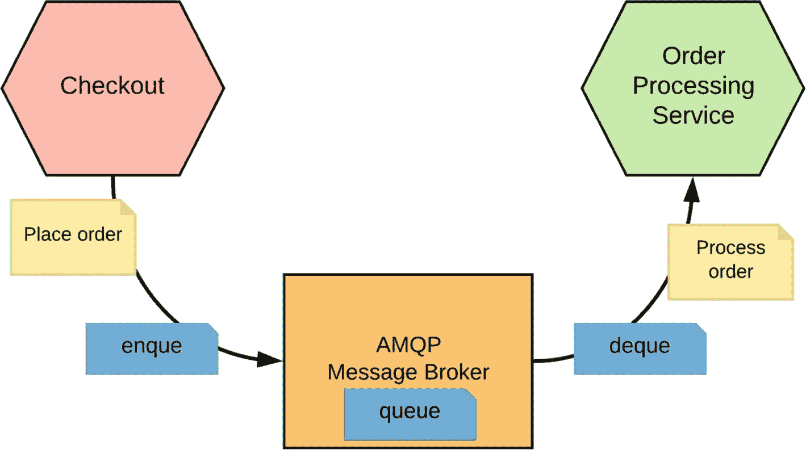
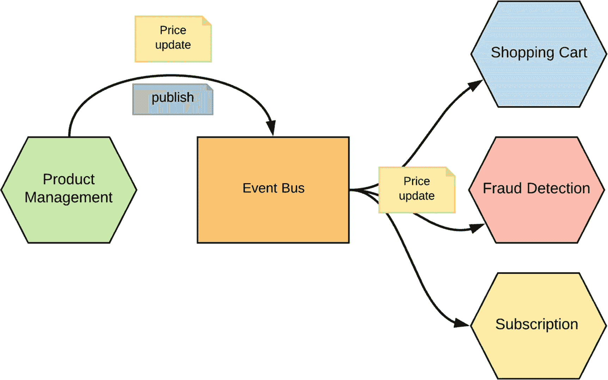
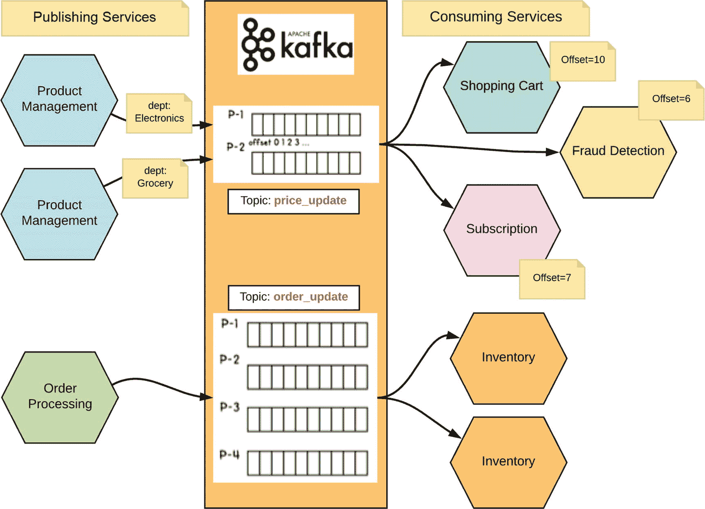

# 3. 服务间通信

在微服务架构中，服务是自治的，并通过网络进行通信以满足业务用例。一系列这样的服务构成了一个*系统*，而消费者通常与这些系统进行交互。因此，基于微服务的应用可以被视为一个分布式系统，它在不同的网络位置上运行多个服务。每个服务都在自己的进程中运行。因此，微服务使用进程间或服务间通信风格进行交互。

在本章中，我们将讨论微服务的通信风格以及用于微服务通信的标准协议。本章会对这些协议和风格进行比较和对比。然而，我们将推迟讨论微服务集成、弹性服务间通信和服务发现。这些主题将在第 6 章“微服务治理”和第 7 章“集成微服务”中详细讨论。

## 微服务通信基础

正如第一章所讨论的，服务是以业务能力为导向的，这些服务之间的交互构成了一个系统或产品，它与一组特定的业务用例相关。因此，服务间通信是微服务架构成功的关键因素。

基于微服务的应用由一套独立服务组成，这些服务通过消息传递相互通信。消息传递在分布式系统中并非新概念。在单体应用中，不同处理器/组件的业务功能是通过函数调用或语言级方法调用来调用的。在面向服务架构（SOA）中，这转向了更松耦合的 Web 服务级消息传递，它主要基于 SOAP，并运行在 HTTP、消息队列等不同协议之上。几乎所有的服务交互都是在集中式企业服务总线（ESB）层实现的。

在微服务的上下文中，没有像 SOA/Web 服务那样要求使用特定的通信模式和消息格式的限制。相反，微服务架构倾向于根据用例选择适当的服务协作机制和用于交换信息的消息格式。

微服务通信风格主要涉及服务如何从一个服务向另一个服务发送或接收数据。微服务中最常用的通信风格是同步和异步。

## 同步通信

在同步通信风格中，客户端发送请求并等待服务的响应。双方必须保持连接打开，直到客户端收到响应。客户端的执行逻辑在没有响应的情况下无法继续。而在异步通信中，客户端可以发送消息并完全完成操作，无需等待响应。

请注意，同步通信和阻塞通信是两回事。有些教科书和资源将同步通信解释为纯粹的阻塞场景，即客户端线程基本上会阻塞直到收到响应。这是不正确的。我们可以使用非阻塞 IO 实现，它在服务响应时注册一个回调函数，客户端线程可以返回而无需阻塞在特定响应上。因此，同步通信风格可以构建在非阻塞异步实现之上。


### REST

表述性状态传递（REST）是一种基于超媒体构建分布式系统的架构风格。REST 模型使用导航方案来通过网络表示对象和服务，这些对象和服务被称为资源。客户端可以使用唯一的 URI 访问资源，并返回该资源的表示形式。REST 不依赖于任何实现协议，但最常见的实现是 HTTP 应用协议。在使用 HTTP 协议访问 RESTful 资源时，资源的 URL 作为资源标识符，而 `GET`、`PUT`、`DELETE`、`POST` 和 `HEAD` 是对该资源执行的标准 HTTP 操作。REST 架构风格本质上基于同步消息传递。

为了理解如何在服务开发中使用 REST 架构风格，让我们考虑在线零售应用的订单管理场景。我们可以将订单管理场景建模为一个名为“订单处理”的 RESTful 服务。如图 3-1 所示，你可以为此服务定义资源 *order*。



图 3-1

可以在订单处理 RESTful 服务上执行的不同操作

要下新订单，你可以使用包含订单内容的 HTTP `POST` 消息，该消息发送到 URL（`http://xyz.retail.com/order`）。来自服务的响应包含一条 `HTTP 201 Created` 消息，其中 location 标头指向新创建的资源（`http://xyz.retail.com/order/123456`）。现在，你可以通过发送 HTTP `GET` 请求从该 URL 检索订单详情。类似地，你可以使用适当的 HTTP 方法更新订单和删除订单。

由于 REST 是一种风格，在实现 RESTful 服务时，我们需要确保我们的 RESTful 服务完全符合 REST 的核心原则。事实上，目前大多数 RESTful 服务都违反了核心的 REST 风格概念。为了设计一个合适的 RESTful 服务，Leonard Richardson [定义](https://www.crummy.com/writing/speaking/2008-QCon/act3.html)^(²³)了一个基于 REST 服务的成熟度模型。

#### Richardson 成熟度模型

*Richardson 成熟度模型*包含四个层级：

*   *第 0 级 –* *PoX 沼泽*：处于此级别的服务实际上不被视为 RESTful。例如，假设有一个通过 HTTP 暴露的 SOAP Web 服务来实现在线零售功能。该服务只有一个 URL（`http://xyz.retail.com/legacy/RetailService`），并根据请求的内容决定需要执行的操作（订单处理、客户管理、产品搜索等）。它使用单一的 HTTP 方法（大多数情况下是 `POST`），并且没有使用任何 HTTP 结构或概念来实现服务逻辑。一切都基于消息的内容。第 0 级服务的最佳示例是任何 SOAP Web 服务。

*   *第 1 级 –* *资源 URI*：当服务为每个资源拥有独立的 URI，但消息仍然包含操作细节时，该服务被认为处于此级别。例如，零售应用可以拥有 /orders、/products、/customers 等资源，但针对给定资源的 CRUD（创建、读取、更新、删除）操作仍然通过消息内容完成。不使用 HTTP 方法或响应状态码。

*   *第 2 级 –* *HTTP 动词*：我们可以使用 HTTP 动词来代替使用消息内容确定操作。因此，发送到 /order 上下文的 HTTP `POST` 消息可以添加一个新订单（订单详情在消息内容中给出，但现在我们没有操作细节）。此外，应该支持适当的 HTTP 状态码。例如，无效请求的响应应为状态码 500。我们在图 3-1 中展示的示例具备了所有这些能力。处于第 2 级或更高级别的 RESTful 服务被认为是合适的 REST API。

*   *第 3 级 –* *超媒体控制*：在第 3 级，服务响应包含控制客户端应用状态的链接。这个概念通常被称为 HATEOAS（超媒体作为应用状态引擎）。超媒体控制告诉我们接下来可以做什么，以及需要操作哪个资源的 URI 来完成它。我们无需知道下一步请求应该发往何处，响应中的超媒体会告诉我们如何操作。

由于 REST 主要基于 HTTP 实现（HTTP 被广泛使用、复杂性较低且对防火墙友好），REST 是微服务实现所采用的最常见的微服务通信风格。让我们考虑使用 RESTful 微服务时的一些最佳实践。

*   基于 HTTP 的 RESTful 微服务（REST 独立于实现协议，但实践中没有使用非 HTTP 的 RESTful 服务）适合面向外部的微服务（或 API），因为通过现有基础设施（如防火墙、反向代理、负载均衡器等）更容易暴露它们。

*   资源范围应该是细粒度的，以便我们可以将其直接映射到与操作相关的业务能力（例如，添加订单）。

*   使用 Richardson 成熟度模型和其他 RESTful 服务最佳实践来设计服务。

*   在适用时使用版本控制策略。（当你决定将服务作为 API 暴露时，版本控制通常在 API 网关级别实现。我们将在第 7 章详细讨论这一点。）

由于许多微服务框架将 REST 作为其事实上的风格，你可能会倾向于将其用于所有微服务实现。但你应该仅在 REST 最适合你的用例时才使用它。（请务必考虑本章讨论的其他合适风格。）

### 动手尝试

你可以在第 4 章“开发服务”中尝试一个 RESTful Web 服务示例。


### gRPC

远程过程调用（RPC）曾是分布式系统中构建客户端-服务器应用程序时流行的一种进程间通信技术。在 Web 服务和 RESTful 服务出现之前，它相当流行。RPC 的关键目标是让在远程机器上执行代码的过程，变得像调用本地函数一样简单直接。大多数传统的 RPC 实现，例如 CORBA，都存在一些缺陷，比如远程调用的复杂性以及使用 TCP 作为传输协议。大多数传统的 RPC 技术已经不再流行。所以你可能想知道，为什么我们还要讨论另一种 RPC 技术——gRPC。

gRPC^(²⁴)（gRPC 远程过程调用）最初由谷歌作为内部项目开发，名为 Stubby，专注于高性能的服务间通信技术。后来它以 gRPC 的名义开源。也有一些替代方案，比如 Thrift，它确实很快。但基于 Thrift 的通信需要开发人员做大量工作，因为它向用户暴露了底层的网络细节（它暴露了原始套接字），这给开发人员带来了困难。此外，基于 TCP 也是一个主要限制，因为它不适用于现代 Web API 和移动设备。

gRPC 支持基于异构技术构建的应用程序之间的通信。它基于这样的理念：定义一个服务，并指定可以远程调用的方法及其参数和返回类型。gRPC 试图克服传统 RPC 实现的大部分限制。

默认情况下，gRPC 使用协议缓冲区^(²⁵)，这是谷歌成熟的用于序列化结构化数据的开源机制（也可以与其他数据格式如 JSON 一起使用）。协议缓冲区是一种灵活、高效、自动化的序列化结构化数据的机制。gRPC 使用协议缓冲区（例如接口定义语言 IDL）来描述服务接口和有效载荷消息的结构。一旦使用协议缓冲区 IDL 定义了服务，服务消费者就可以创建服务器骨架，客户端则可以创建存根，以多种编程语言调用该服务。

使用 HTTP2 作为传输协议是 gRPC 成功并被广泛采用的关键原因。因此，理解 HTTP2 的优势非常有用。

#### HTTP2 概览

尽管 HTTP 1.1 被广泛采用，但它存在一些限制现代 Web 规模计算的局限性。HTTP 1.1 的主要限制包括：

*   *队头阻塞*：每个连接一次只能处理一个请求。如果当前请求被阻塞，则下一个请求将等待。因此，我们必须在客户端和服务器之间维护多个连接以支持实际用例。HTTP1.1 定义了一个管道来克服这个问题，但并未被广泛采用。

*   *HTTP 1.1 协议开销*：在 HTTP 1.1 中，许多头部在多个请求中重复出现。例如，像 User-Agent 和 Cookie 这样的头部被反复发送，这浪费了带宽。HTTP 1.1 定义了 GZIP 格式来压缩有效载荷，但这不适用于头部。

HTTP2 针对这些限制中的大部分提出了解决方案。最重要的是，HTTP2 扩展了 HTTP 的能力，使其与现有应用程序完全向后兼容。

客户端和服务器之间的所有通信都在单个 TCP 连接上执行，该连接可以承载任意数量的双向*字节流*。HTTP2 定义了*流*的概念，它是在已建立的连接内的一个双向字节流，可以承载一个或多个消息。*帧*是 HTTP2 中最小的通信单元，每个帧包含一个帧头，该帧头至少标识了该帧所属的流。*消息*是一个完整的帧序列，映射到一个逻辑上的 HTTP 消息，例如一个请求或响应，它由一个或多个帧组成。因此，基于这种方法，请求和响应可以完全多路复用，允许客户端和服务器将 HTTP 消息分解成独立的帧，交错发送，然后在另一端重新组装。

HTTP2 避免了头部重复，并引入了头部压缩以优化带宽使用。它还引入了一项新功能，即无需使用请求-响应风格的消息即可发送服务器推送消息。HTTP2 也是一种二进制协议，这提升了其性能。它还开箱即用地支持消息优先级。

#### 使用 gRPC 进行服务间通信

到现在为止，你应该已经很好地理解了 HTTP2 的优势以及它如何帮助 gRPC 表现得更好。让我们深入一个使用 gRPC 实现的完整示例。如图 3-2 所示，假设在我们的在线零售应用示例中，有一个 `Returns` 服务调用 `Product Management` 服务，用退回的商品更新产品库存。`Returns` 服务使用 Java 实现，而 `Product Management` 服务使用 Go 语言实现。`Product Management` 服务使用 gRPC，并通过 `ProductMgt.proto` 文件暴露其契约。



图 3-2

gRPC 通信

因此，`Product Management` 服务的开发者将使用 `ProductMgt.proto` 文件生成 Go 语言的服务器端骨架。基本上，开发者在其项目中使用该文件并进行编译，从而生成服务和客户端存根。为了实现该服务，我们可以使用生成的服务存根并实现该服务所需的业务逻辑。

消费者，即 `Returns` 服务，可以使用相同的 `ProductMgt.proto` 文件生成客户端存根（使用 Java）并调用该服务。`Product Management` 服务有一个添加产品的操作，它将有一个类似于以下的 `ProductMgt.proto` 定义。

```
// ProductMgt.proto
syntax = "proto3";
option java_multiple_files = true;
option java_package = "kasun.mfe.ecommerce";
option java_outer_classname = "EcommerceProto";
option objc_class_prefix = "HLW";
package ecommerce;
service ProductMgt {
rpc AddProduct (ProductRequest) returns (ProductResponse) {}
}
message ProductRequest {
string productID = 1;
string name = 2;
string description = 3;
}
message ProductResponse {
string productID = 1;
string status = 2;
}
```

在底层，当客户端调用该服务时，客户端的 gRPC 库使用 `Proto Buf` 对远程函数调用进行编组，然后通过 HTTP2 发送。在服务器端，请求被解组，并使用 `Proto Buf` 执行相应的函数调用。响应遵循从服务器到客户端的类似执行流程。


### 动手试试

你可以尝试第 4 章“开发服务”中的 gRPC 服务示例。

gRPC 支持服务器流式 RPC，即客户端向服务器发送请求，并获取一个流来读取一系列返回消息。客户端从返回的流中读取数据，直到没有更多消息为止。

```
rpc productUpdate(ProdUpdateReq) returns (stream ProdUpdateStatues){
}
```

同样，你也可以使用客户端流式 RPC，即客户端写入一系列消息，并以流的形式发送给服务器。客户端完成消息写入后，等待服务器读取这些消息并返回响应。

```
rpc productUpdate(stream productUpdates) returns (ProdUpdateStatus) {
}
```

双向流式 RPC 允许双方通过读写流发送一系列消息。这两个流独立运行，因此客户端和服务器可以按任意顺序进行读写。例如，服务器可以等待接收完所有客户端消息后再写入响应，也可以交替读取一条消息再写入一条消息，或者采用其他读写组合方式。

```
rpc productUpdate(stream productUpdates) returns (stream ProdUpdateStatuses){
}
```

gRPC 支持的认证机制包括 SSL/TLS 以及基于令牌的 Google 认证。

#### 使用 gRPC 进行错误处理

你还可以使用 gRPC 实现各种错误处理技术。如果发生错误，gRPC 会返回一个错误状态码，以及一个可选的字符串错误消息，用于提供错误的更多详细信息。

REST 和 gRPC 是微服务实现中最常用的同步消息协议。不过，还有其他几种同步消息技术偶尔也会用于微服务实现。

### GraphQL

RESTful 服务建立在资源概念之上，这些资源通过 HTTP 方法进行操作。当你开发的服务符合 REST 的基于资源的架构时，它能完美运行。但一旦偏离 RESTful 风格，服务就无法达到预期效果。

此外，在某些场景下，客户端需要同时从多个资源获取数据，这会导致通过多次服务调用来调用多个资源（或者总是发送包含冗余数据的大型响应）。

GraphQL^(²⁶) 通过为 API 提供查询语言以及利用现有数据执行这些查询的运行时，解决了传统基于 REST 的服务中的此类问题。GraphQL 提供了对 API 中数据的完整且易于理解的描述，赋予客户端精确获取所需数据（不多不少）的能力，使 API 更易于随时间演进，并支持强大的开发者工具。

客户端可以向 API 发送 GraphQL 查询，并精确获取所需内容，客户端对其获取的数据拥有完全控制权。典型的 REST API 需要从多个 URL 加载数据，而基于 GraphQL 的服务则能在单个请求中获取应用所需的所有数据。

例如，你可以向基于 GraphQL 的服务发送以下查询：

```
{
hero {
name
}
}
```

并获取如下所示的结果：

```
{
"data": {
"hero": {
"name": "R2-D2"
}
}
}
```

查询的形状与结果完全相同，服务器确切知道客户端请求了哪些字段。

GraphQL 服务器会公开一个描述 API 的 schema。这个 schema 由类型定义组成。每个类型都有一个或多个字段，每个字段接受零个或多个参数，并返回一个特定类型。一个 GraphQL schema 的示例是关于一本书和书的作者。这里我们定义了 `Book` 和 `Author` 的类型，以及操作名称。在前面的示例中，我们使用了省略了 `query` 关键字和查询名称的简写语法，但在生产应用中，包含这些内容有助于减少代码歧义。因此，在这个示例中，`query` 是操作类型，`latestBooks` 是操作名称：

```
type Book {
isbn: ID
title: String
text: String
category: String
author: Author
}
type Author {
id: ID
name: String
thumbnail: String
books: [Book]
}
# 应用的根查询
type Query {
latestBooks(count: Int, offset: Int): [Book]!
}
# 应用的根变更
type Mutation {
addBook(id: String!, title: String!, text: String!, category: String, author: Author!) : Book!
}
```

操作类型是 `query`、`mutation` 或 `subscription`，它描述了你打算执行的操作类型。除非你使用查询简写语法（这种情况下无法为操作提供名称或变量定义），否则操作类型是必需的。

每个 GraphQL 服务都有一个查询类型，并且可能有也可能没有变更类型。这些类型与常规对象类型相同，但它们很特殊，因为它们定义了每个 GraphQL 查询的入口点。与查询类似，你可以在 `mutation` 类型上定义字段，这些字段可作为根变更字段，你可以在查询中调用它们。按照惯例，任何导致写入的操作都应通过变更显式发送。

### 动手试试

你可以尝试第 4 章“开发服务”中的 GraphQL 服务示例。

### WebSockets

WebSockets^(²⁷) 协议可以简单地理解为*基于 Web 的 TCP*。它可以被视为一种传输协议，是全双工且异步的。因此，你可以在 WebSockets 之上叠加任何消息协议。

WebSockets 协议使用单个 TCP 连接进行双向流量传输，并使用 HTTP 作为初始握手协议，以便与现有基础设施兼容。它在 TCP 之上进行初始握手，之后的行为类似于原始 TCP 套接字。图 3-3 展示了使用 WebSockets 的客户端和服务器之间的交互。



图 3-3

WebSockets 通信

HTTP2 和 WebSockets 有不少相似之处，例如使用单个连接、双向消息传递、二进制消息等。但区别在于，WebSockets 允许你在其之上构建自己的消息协议（例如，你可以在 WebSockets 之上构建 MQTT 或 AMQP）。WebSockets 架构由客户端和服务器之间打开的套接字组成，用于全双工（双向）通信。因此，如果你的微服务需要这种全双工通信以及通过 Web 路由流量的能力，那么 WebSockets 是一个绝佳选择。

### Thrift

Thrift^(²⁸) 允许你在一个简单的定义文件中定义数据类型和服务接口。与 gRPC 类似，编译器使用接口定义生成代码，用于轻松构建能够跨编程语言无缝通信的 RPC 客户端和服务器。Thrift 使用 TCP 作为传输协议，以其极高的消息传递性能而闻名，但在某些互操作性需求方面有所欠缺，例如防火墙和负载均衡器，以及在开发服务时的易用性方面。


## 异步通信

在微服务架构的早期实现中，同步通信被广泛采用，成为服务间通信的事实标准。然而，微服务之间的异步通信正变得越来越流行，因为它能使服务更加自治。

在异步通信中，客户端不会即时等待响应。客户端可能根本收不到响应，或者响应会通过不同的通道异步接收。

微服务之间的异步消息传递是通过使用轻量级且无业务逻辑的消息代理来实现的。该代理不包含任何业务逻辑，是一个高可用的集中式实体。异步消息传递主要有两种类型——单接收者和多接收者。

### 单接收者

在单接收者模式下，一条给定的消息通过消息代理可靠地从生产者传递到恰好一个消费者（见图 3-4）。由于这是一种异步消息传递风格，生产者在生成消息时不会等待消费者的响应，消费者可能在线也可能不在线。这在从一个微服务向另一个微服务发送基于异步消息的命令时非常有用。鉴于微服务可以使用不同的技术实现，我们必须以与技术无关的方式实现生产者和消费者微服务之间的可靠消息传递。



图 3-4

基于 AMQP 的单接收者异步通信

高级消息队列协议（AMQP）是单接收者通信中最常用的标准。

#### AMQP

AMQP^(²⁹) 是一种处理发布者和消费者的消息协议。发布者生成消息，消费者获取并处理这些消息。消息代理的职责是确保来自发布者的消息能够到达正确的消费者。AMQP 保证了消息传递的可靠性、消息的快速可靠投递以及消息确认。

以我们的在线零售应用用例为例。假设 `Checkout` 微服务向 `Order Processing` 微服务发送一个异步命令来下单。

我们可以使用 AMQP 消息代理（例如 RabbitMQ^(³⁰) 或 ActiveMQ^(³¹)）作为无业务逻辑的消息基础设施，`Checkout` 微服务可以向代理中的特定队列生成一条消息。在独立的通道上，`Order Processing` 微服务可以作为消费者订阅该队列，并以异步方式接收消息。针对此用例，我们可以识别出以下关键组件。

*   *消息*：传输的数据内容，包括有效载荷和消息属性。
*   *AMQP 消息代理*：一个实现 AMQP 协议的中心应用程序，它接受来自生产者的连接以进行消息排队，以及来自消费者的连接以从队列中消费消息。
*   *生产者*：将消息放入队列的应用程序。
*   *消费者*：从队列中接收消息的应用程序。

生产者可以指定各种消息属性，这些属性可能对代理有用，也可能仅供消费微服务处理。

由于网络不可靠，代理与微服务之间的通信可能会在处理消息时失败。AMQP 定义了一个名为*消息确认*的概念，这对于实现消息的可靠传递非常有用。当消息被传递给消费者时，消费者会通知代理，可以是自动通知，也可以是应用程序代码决定通知时。在消息确认模式下，代理只有在收到针对该消息（或消息组）的通知时，才会完全从队列中移除该消息。此外，由于我们使用了队列，可以确保消息的有序传递和处理。AMQP 引入了一系列可靠性机制。

故障可能发生在代理、发布者和消费者之间的网络交互中，也可能发生在代理和客户端应用程序的运行过程中。

确认机制允许消费者向服务器表明它已成功接收消息。同样，代理也可以使用确认机制来通知生产者它已成功接收消息（例如，RabbitMQ 中的确认）。因此，确认信号表示消息已收到且所有权已转移，接收方将对其承担全部责任。

AMQP 0-9-1 提供了*心跳*功能，以确保应用层能够及时发现连接中断和完全无响应的对端。心跳功能也适用于可能终止空闲 TCP 连接的网络设备。

*   *代理故障*：为了处理代理故障，AMQP 标准为交换机、队列和持久化消息定义了持久性概念，要求持久化对象或持久化消息在重启后依然存在。为你所使用的代理启用集群功能。
*   *生产者故障*：在向代理生成消息时，生产者应重新发送任何未收到代理确认的消息。这里存在消息重复的可能性，因为代理可能已经发送了确认，但该确认从未到达生产者（由于网络故障等原因）。因此，消费者应用程序需要执行去重操作，或以幂等方式处理传入的消息（即，即使多次处理同一条消息，内部状态也不会改变）。

在网络故障（或运行时崩溃）的情况下，消息可能会重复，消费者必须准备好处理这些情况。如果可能，最简单的处理方式是确保你的消费者以幂等方式处理消息，而不是显式地进行去重。

在故障条件下，当消息无法路由时，消息可能会被返回给发布者、丢弃，或者如果代理实现了扩展，则会被放入所谓的“死信队列”。发布者可以通过使用特定参数发布消息来决定如何处理此类情况。

目前有多种开源消息代理解决方案，RabbitMQ 可能是最流行且使用最广泛的一种。Apache ActiveMQ、ActiveMQ Artemis 和 Apache Qpid 也很受欢迎。

AMQP 规范有多个版本，v0-9-1 是最常用的版本。最新版本是 1.0，但尚未在整个行业中被完全采用。从微服务架构的角度来看，我们不必学习 AMQP 协议的细节；对其功能和消息传递模式有基础层面的了解就足够了。AMQP 还定义了除单接收者交换之外的其他消息交换风格，例如扇出、主题和基于标头的交换。

### 重要提示

AMQP 消息代理通常被开发为单体运行时，并非专门用于微服务架构。因此，大多数代理都带有各种功能，允许你将业务逻辑放入代理内部（例如路由）。因此，在使用这些代理时必须格外谨慎，并且只能将它们用作无业务逻辑的代理。所有异步消息传递的智能逻辑都应仅存在于我们的服务逻辑中。

我们将在第 4 章中讨论一个与此处描述类似的开发用例。


### 多接收者模式

当一个生产者产生的异步消息需要发送给多个消费者时，发布-订阅或多接收者通信模式将非常有用。

以一个用例为例，假设有一个`产品管理`服务，它负责生成产品价格更新的信息。该信息需要传播到多个微服务，例如`购物车`、`欺诈检测`、`订阅`等。如图 3-5 所示，我们可以使用事件总线作为通信基础设施，`产品管理`服务可以将价格更新事件发布到特定主题。对接收价格更新事件感兴趣的服务应订阅同一主题。只有当这些感兴趣的服务在事件总线广播事件时处于可用状态，它们才会接收到订阅主题上的事件。如果底层事件总线实现支持，订阅者可以选择作为持久订阅者进行订阅，这样即使它们在事件广播时处于离线状态，也能接收到所有事件。



图 3-5

基于多接收者（发布-订阅）的异步通信

有多种消息协议支持发布-订阅消息传递。大多数基于 AMQP 的代理都支持发布-订阅，但 Kafka（拥有自己的消息协议）是微服务间多接收者/发布-订阅类型消息传递中使用最广泛的消息代理。让我们更仔细地看看 Kafka，并用 Kafka 重新审视这个实现。

#### Kafka

Apache Kafka^(³²)是一个分布式发布/订阅消息系统。它通常被描述为一个*分布式提交日志*，因为 Kafka 中的数据是持久化、有序存储的，并且可以确定性地读取。此外，数据在 Kafka 系统内分布以实现故障转移和可扩展性。

让我们更仔细地看看如何使用 Kafka 实现发布者-订阅者场景。如图 3-6 所示，我们可以使用 Kafka 作为分布式发布-订阅消息系统来构建多微服务异步消息传递场景。

Kafka 中使用的数据单元称为*消息*（一个字节数组）。与其他消息协议不同，其中包含的数据对 Kafka 没有特定的格式或含义。消息还可以包含元数据，这有助于发布或消费消息。



图 3-6

使用 Kafka 的基于多接收者（发布-订阅）的异步通信

Kafka 中的这些消息被分类到*主题*中。一个给定的主题可以选择性地拆分为多个*分区*。分区是给定主题的逻辑和物理组件化，生产者可以决定写入哪个分区。这通常使用称为*键*的消息元数据来完成。Kafka 生成键的哈希值并将其映射到特定分区（即，使用给定键生成的所有消息都位于同一分区上）。分区是 Kafka 中用于并行化消费和扩展主题以超越单节点吞吐量限制的主要机制。每个分区可以托管在不同的节点上。

每条消息都带有偏移量写入分区。*偏移量*是一个递增编号的位置，从分区开头开始为 0。

*生产者*将消息写入特定主题。默认情况下，生产者不关心特定消息写入哪个分区，并将消息均匀地分布到主题的所有分区。在某些情况下，生产者会使用消息元数据*键*将消息定向到特定分区。

*消费者*订阅一个或多个主题，并按照消息生成的顺序读取它们。消费者通过跟踪消息的*偏移量*来记录已消费的消息。给定分区中的每条消息都有一个唯一的偏移量。通过存储每个分区最后消费消息的偏移量（在 Zookeeper 或 Kafka 中），消费者可以停止并重新启动而不会丢失其位置。

消费者作为*消费者组*的一部分工作，其中一个或多个消费者协同工作来消费一个主题。该组确保一个消费者组成员只从每个分区消费消息。但是，一个给定的消费者组成员可以从多个分区消费。显然，当我们必须水平扩展对高消息量主题的消费时，消费者组的概念非常有用。

现在，让我们尝试结合图 3-6 所示的场景进一步理解这些概念。在以下基于 Kafka 的多接收者消息传递场景中，Kafka 中创建了两个主题：`price_update`和`order_update`。

有两个`产品管理`生产者（来自不同部门的微服务）发布产品价格更新信息（生产者可以显式写入给定分区，或者负载可以在分区之间均匀分布）。对于`price_update`主题，有三个不同的消费者（来自三个消费者组）。它们将独立地从 Kafka 读取消息，并维护自己的偏移量。例如，假设`订阅`服务发生故障，导致其在一段时间内无法接收价格更新。当`订阅`服务重新启动时，它可以检查当前持久化的偏移量，并拉取它在离线期间本应接收到的所有事件。

使用`order_update`主题的订单处理场景略有不同。在该场景中，我们可以假设通过订单更新通道的负载很高，我们需要扩展消费者端以更有效地处理它们。因此，我们使用一个包含两个消费者的消费者组，以便它们可以并行处理来自多个分区的订单更新事件。

单个 Kafka 服务器称为*代理*，它负责消息的发布和消费。多个 Kafka 代理可以作为单个集群运行。在集群中的多个代理中，有一个代理充当集群控制器，负责集群管理操作，例如将分区分配给代理和检测代理故障。一个分区被分配给多个代理，并且每个分区有一个领导者代理。因此，由于分区在多个代理之间复制，并且能够在现有分区领导者不可用时指定新的领导者（Kafka 使用 Zookeeper 处理大部分协调任务），Kafka 消息传递具有高可用性。

通过集群，Kafka 变得更加强大，因此您可以大规模扩展异步消息传递能力。


### 提示

我们能否在 Kafka 中实现精确一次投递？有一篇有趣的文章^(³³)介绍了如何利用 Kafka 实现精确一次投递。其核心概念大多源于本章讨论的关键 Kafka 原理，你可以轻松地在微服务中构建同等水平的投递保障。

我们仅讨论了 Kafka 在构建多接收者异步消息场景中实用的部分功能，还有大量技术细节不在本书的讨论范围内。

还有其他一些消息代理，例如 ActiveMQ 和 RabbitMQ，它们也能为简单到中等规模的异步消息场景提供相同的发布-订阅消息能力。然而，如果你需要一个完全分布式且可扩展的异步消息基础设施，那么 Kafka 是一个不错的选择。有许多基于 Kafka 构建的异步消息和事件流处理解决方案，例如 Confluent 开源平台，它们可能为你的微服务实现提供一些额外的功能。

#### 其他异步通信协议

还有不少我们未讨论的异步消息协议。MQTT^(³⁴)、STOMP^(³⁵) 和 CoAP^(³⁶) 也相当流行。如果你认为具备相关专业知识，并且其中某个协议是微服务消息传递的最佳技术选择，那么尽管使用它。我们不会详细讨论这些协议，因为它们不具备在微服务上下文中重要的显式特性。

## 同步通信与异步通信

至此，你应该对同步和异步消息传递技术有了扎实的理解。了解在微服务架构实现中何时使用这些通信风格至关重要。

同步通信与异步通信的主要区别在于，有些场景下无法在客户端和服务器之间保持连接。在这些场景中，持久的单向通信更为实用。同步通信更适合需要构建提供请求-响应式交互的服务场景。如果消息是事件驱动的，并且客户端不期望立即得到响应，那么异步通信更为合适。

然而，在许多书籍和文章中，都强调同步通信是邪恶的，我们应该只为微服务使用异步通信，因为它能实现服务自治。在很多情况下，同步与异步通信的比较被解读为：在同步通信中，给定线程会被阻塞，直到等待到响应。这完全是错误的，因为大多数同步消息实现都基于完全非阻塞的消息架构。（也就是说，客户端发送方发送请求并注册一个回调，然后线程被释放。当收到响应时，将其与原始请求关联并处理响应。）

所以，回到这些通信风格的务实使用上，我们需要根据具体用例来选择通信风格。

在需要客户端和服务以请求-响应方式进行短时交互的场景中，同步通信是必需的。例如，在我们的在线零售用例中，产品搜索服务采用同步通信方式，因为你希望提交搜索查询并立即看到搜索结果。而订单提交或处理等场景本质上是异步的。因此，异步消息风格最适合此类场景。

### 提示

在微服务之间只采用同步（例如 REST）或只采用异步消息传递，完全是一种误解。当将微服务应用于企业场景时，你可能需要混合或结合使用这两种通信风格。

## 消息格式/类型

我们已经讨论了微服务架构中常用的几种通信风格和协议。微服务之间的信息交换基于消息的传递。确定在这些场景中使用哪种消息格式非常重要。

### JSON 和 XML

在大多数基于 REST 的微服务实现中，JSON 是事实上的消息交换格式，这得益于其简洁性、可读性和性能。然而，也有一些基于 XML（而非 SOAP）的服务。但是，它们缺乏一些重要特性，例如健壮的类型处理和模式版本之间的兼容性。在大多数将服务暴露给外部消费者的场景中，我们大量使用 JSON 作为消息类型，而 XML 的使用则局限于特定的用例。作为服务开发的一部分，服务必须处理传入的 JSON 或 XML 消息，并将其映射到服务代码中使用的类型。

### Protocol Buffers

对于 gRPC 这样的通信风格，消息格式是明确定义的，并使用专用的数据交换格式，例如 protocol buffers。服务开发者无需担心以特定消息格式处理消息。在编组和解组过程中，所有必要的类型映射都会完成，用户只需处理定义明确的类型。由于数据序列化和反序列化机制灵活、高效且自动化，protocol buffers 非常适合内部服务之间的高吞吐量同步消息传递。目前，protocol buffers 在微服务通信中的应用主要通过基于 gRPC 的服务来实现。

### Avro

Apache Avro^(³⁷) 解决了大多数传统数据交换格式（如 JSON 和 XML）的关键局限性。Avro 是一个数据序列化系统，它为数据表示提供了丰富的数据结构、紧凑的格式、对多种编程语言的优秀绑定、与 JSON 的直接映射，以及用纯 JSON 定义的可扩展模式语言。

因此，Avro 在微服务实现中的大多数异步消息场景中得到了广泛应用。例如，大多数基于 Kafka 的消息系统都利用 Avro 来定义生产和消费消息的模式。

## 服务定义与契约

当你将业务能力实现为服务时，需要定义并发布服务契约。在传统的单体应用中，我们很少有这种定义应用业务能力的特性。在 SOA/Web 服务领域，WSDL 用于定义服务契约，但众所周知，WSDL 并非定义微服务契约的理想解决方案，因为它极其复杂且与 SOAP 紧密耦合。

由于我们在 REST 架构风格之上构建微服务，我们可以使用相同的 REST API 定义技术来定义微服务的契约。因此，微服务使用标准的 REST API 定义语言（例如 OpenAPIs^(³⁸)）来定义服务契约。对于不适合基于资源架构的服务，我们可以利用 GraphQL 模式。

正如你在 gRPC 部分所见，服务的 protocol buffer 定义就是基于 gRPC 的服务定义和契约（这同样适用于其他 RPC 风格，如 Thrift）。服务定义适用于同步通信；目前还没有标准的方法来为基于异步事件的服务定义契约。


## 总结

在本章中，我们讨论了微服务上下文中用于实现服务间通信的模式和协议。我们深入探讨了 REST 和 gRPC 的基础知识，这两种协议最常用于微服务之间的同步消息传递。作为异步消息传递风格，我们学习了 AMQP 协议，它是实现可靠的单消费者/点对点异步消息传递的常见选择。对于发布者-订阅者/多接收者类型的通信，Kafka 通常被用作消息传递基础设施。

然而，我们尚未讨论如何实现服务交互、组合、编排或编舞的细节。第 7 章专门讨论这些主题，并进一步探讨服务交互的通用特性，例如通过断路器、超时等实现弹性通信。此外，我们还有专门章节讨论服务治理（第 6 章）以及服务定义和 API（第 10 章，“API、事件和流”）。

脚注 1   2   3   4   5   6   7   8   9   10   11   12   13   14   15   16

