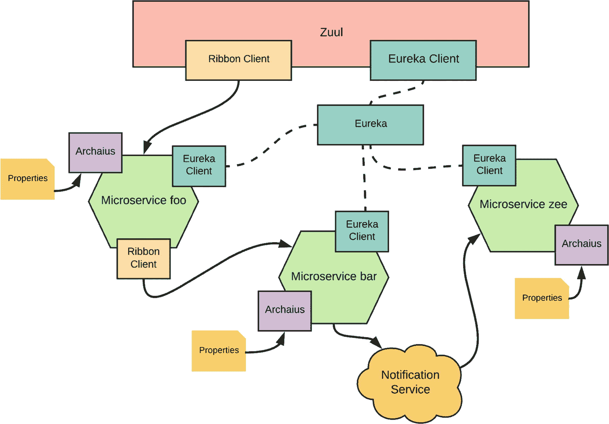
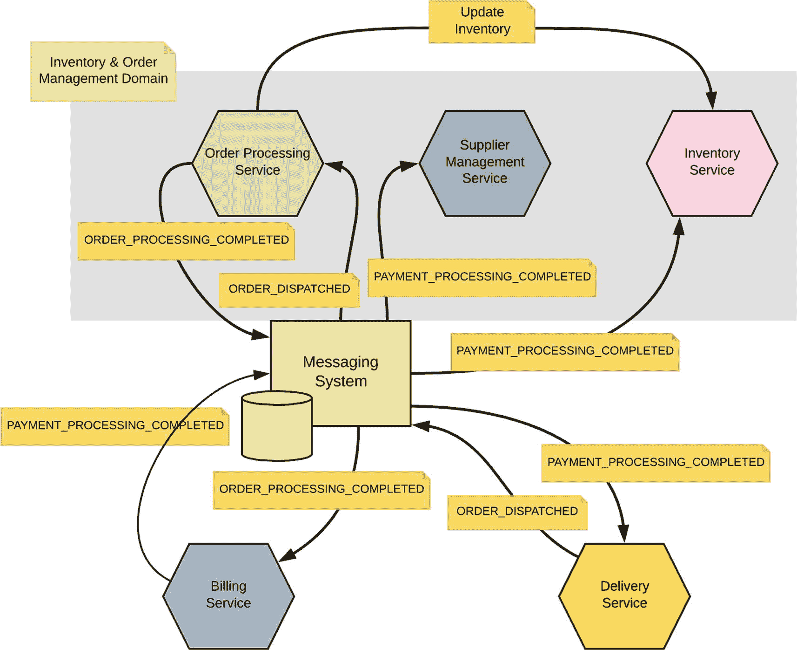
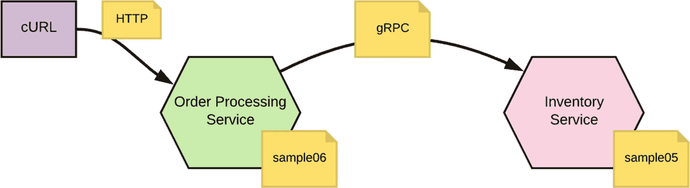
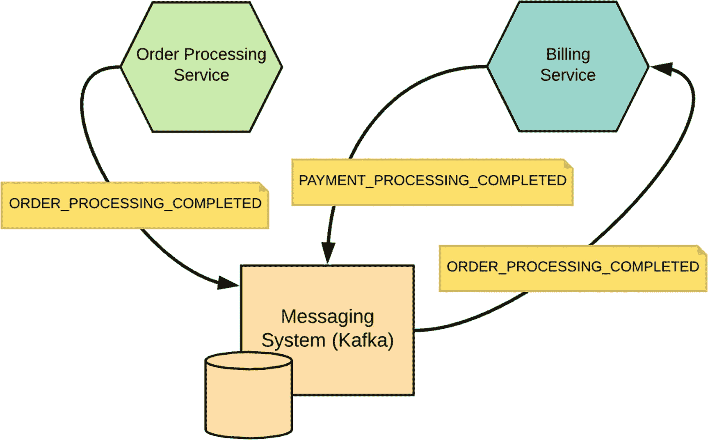

# 4. 开发服务

Netflix 采取了三个步骤来构建一个反脆弱组织^(³⁹)。第一步是将每位开发者视为相应服务的运维人员。第二步是将每次失败视为学习的机会，第三步是培养一种无指责文化。这三个小步骤帮助 Netflix 成为微服务领域的顶尖组织。许多人向 Netflix 学习如何做事以及最佳实践。事实上，Netflix 为交付速度优化了一切。正如我们在本书中已经讨论过的，在任何微服务设计的核心中，上线时间、可扩展性、复杂性本地化和弹性都是关键要素。开发者体验是实现这些目标的最重要因素之一。在微服务环境中，开发者的体验与构建单体应用截然不同。正如 Netflix 正确指出的那样，开发者的任务在将代码推送到源代码仓库后并未结束，他们不能期望 DevOps 工程师来构建并将更改推送到生产环境，或者期望支持工程师来处理生产环境中出现的任何问题。微服务开发环境要求开发者具备更广泛的技能。

### 注意

所有 Netflix 开发者都拥有 SSH 密钥，可以访问其生产服务器，而在大多数传统应用部署中，开发者从预发布环境开始就没有访问权限。

在过去几年中，已经开发了许多工具和框架来帮助和加速微服务开发。大多数流行的工具和框架都是开源的。在本章中，我们将讨论微服务开发者可用的不同选项，并了解如何从头构建一个微服务。

## 开发者工具和框架

在不同类别下，有多个工具和框架可供微服务开发者使用。我们认为，在选择合适的微服务框架之前，有几个关键要素需要考虑。最基本的要求之一是对 RESTful 服务有良好的支持。在 Java 世界中，大多数开发者会关注对 JAX-RS^(⁴⁰) 的支持程度。大多数基于 Java 的框架确实支持基于 JAX-RS 的注解，但为了扩展该功能，它们引入了自己的注解。

12 因素应用的第 7 个因素（我们在第 2 章“设计微服务”中讨论过）指出，你的应用必须进行端口绑定，并将自身暴露为服务，而无需依赖第三方应用服务器。这是任何微服务框架的另一个常见要求。无需依赖任何占用资源且需要数秒（或数分钟）才能启动的重型应用服务器，你应该能够在短短几毫秒内以自包含的方式启动一个微服务。

大多数微服务部署遵循每主机单服务模型。换句话说，一个主机上只部署一个微服务，而在大多数情况下，该主机是一个容器。每个人都在微服务框架中寻找的一个关键方面是它对容器友好。什么是容器友好（或容器原生）将在第 8 章“部署和运行微服务”中详细讨论。语言提供的安全支持水平是选择微服务框架的另一个关键区别因素。有多种方法可以保护微服务并提供微服务之间的服务到服务通信。我们将在第 11 章“微服务安全基础”中讨论微服务安全。

对遥测和可观测性的一流语言支持是微服务框架的另一个重要方面。这对于跟踪生产服务器的健康状况和识别任何问题极为有用。我们将在第 13 章“可观测性”中讨论可观测性。微服务框架的另外两个重要方面是它对事务和异步消息传递的支持。异步消息传递在第 3 章“服务间通信”中讨论过，而在第 5 章“数据管理”中，我们将讨论如何在微服务环境中处理事务。

以下部分将介绍最流行的微服务框架和工具。在本章后面，我们将通过一组使用 Spring Boot 开发的示例进行讲解，Spring Boot 是 Java 开发者最流行的微服务开发框架。

### Netflix OSS

正如我们在本章中已经讨论过的，Netflix 在微服务领域发挥着主导作用，它对微服务成为主流并被广泛采用的影响是显著的。Netflix 的美丽之处在于其对开源的承诺。Netflix 开源软件^(⁴¹) (OSS) 计划在不同类别下拥有大约 40 个开源项目（见图 4-1）。以下部分将介绍 Netflix OSS 中与微服务开发相关的一些常见工具。

#### Nebula

Nebula^(⁴²) 是一个为 Netflix 工程师构建的 Gradle 插件集合，旨在消除样板构建逻辑并提供合理的约定。Nebula 的目标是简化 Netflix 项目中常见的构建、发布、测试和打包任务。他们选择 Gradle 而非 Maven 作为构建工具，因为他们认为 Gradle 是 Java 应用的最佳选择。


#### Spinnaker

Spinnaker^(⁴³) 是一个多云持续交付平台，用于以高速度和信心发布软件变更。它结合了强大且灵活的管道管理系统，并与主流云提供商集成，包括 AWS EC2、Kubernetes、Google Compute Engine、Google Kubernetes Engine、Google App Engine、Microsoft Azure 和 OpenStack。

#### Eureka

Eureka^(⁴⁴) 是一个 RESTful 服务，主要用于 AWS 云中定位服务，以实现中间层服务器的负载均衡和故障转移。在微服务部署中，Eureka 可用作服务注册中心来发现端点。

#### Archaius

Archaius^(⁴⁵) 包含 Netflix 使用的一组配置管理 API。它允许配置在运行时动态更改，从而使生产系统无需重启即可获取配置变更。为了提供快速且线程安全的属性访问，Archaius 在配置之上添加了一个包含所需属性的缓存层。它还创建了一个配置层次结构，并以简单、快速且线程安全的方式确定最终的属性值。



图 4-1

Netflix OSS 部署

#### Ribbon

Ribbon^(⁴⁶) 是一个进程间通信（远程过程调用）库，内置软件负载均衡器（主要用于客户端负载均衡）。它主要用于支持多种序列化方案的 REST 调用。

#### Hystrix

Hystrix^(⁴⁷) 是一个延迟和容错库，旨在隔离对远程系统、服务和第三方库的访问点，阻止级联故障，并在故障不可避免的复杂分布式系统中实现弹性。Hystrix 实现了第 2 章讨论的许多弹性模式。它使用*舱壁*模式来隔离依赖项之间的相互影响，并限制对任一依赖项的并发访问；同时使用*断路器*模式主动避免与故障端点通信。Hystrix 将成功、失败、拒绝和超时报告给断路器，断路器维护一组滚动计数器来计算统计数据。它利用这些统计数据来决定何时应“跳闸”，此时它会短路所有后续请求，直到恢复期过去，之后在完成某些健康检查后再次闭合电路^(⁴⁸)。

#### Zuul

Zuul^(⁴⁹) 是一个网关服务，提供动态路由、监控、弹性、安全等功能。它充当 Netflix 服务器基础设施的前门，处理来自全球所有 Netflix 用户的流量。它还路由请求、支持开发者测试和调试、提供对 Netflix 整体服务健康状况的深入洞察、保护其免受攻击，并在 AWS 区域出现问题时将流量引导至其他云区域。

### Spring Boot

Spring Boot^(⁵⁰) 是 Java 开发者最流行的微服务开发框架。准确地说，Spring Boot 为 Spring 提供了一个有主见^(⁵¹)的运行时，消除了许多复杂性。尽管 Spring Boot 有主见，但它也允许开发者覆盖其许多默认选择。由于许多 Java 开发者熟悉 Spring，并且开发便捷性是微服务世界成功的关键因素，因此许多人采用了 Spring Boot。即使对于不使用 Spring 的 Java 开发者来说，它也是一个家喻户晓的名字。如果你使用过 Spring，肯定曾为处理庞大臃肿的 XML 配置文件而烦恼。与 Spring 不同，Spring Boot 完全信奉约定优于配置——不再有 XML 地狱！

### 注意

*约定优于配置*（也称为按约定编码）是一种软件框架使用的软件设计范式，旨在减少使用该框架的开发者需要做出的决策数量，同时又不一定丧失灵活性。^(⁵²)

Spring Cloud^(⁵³) 于 2015 年 3 月在 Spring Boot 之后推出。它为开发者提供了快速构建分布式系统中一些常见模式的工具。Spring Cloud 与 Spring Boot 一起，为微服务开发者提供了出色的开发环境。Spring Cloud 的另一个特点是，它通过自动配置以及与 Spring 环境和其他 Spring 编程模型惯用法的绑定，为 Spring Boot 应用提供 Netflix OSS 集成。只需几个简单的注解，你就可以在应用中启用和配置常见模式，并使用 Netflix OSS 组件构建大型分布式系统。提供的模式包括使用 Eureka 进行服务发现、使用 Hystrix 实现断路器、使用 Zuul 实现智能路由，以及使用 Ribbon 实现客户端负载均衡。我们将在本章后面的代码示例中使用 Spring Boot 和 Spring Cloud。

### 注意

约定优于配置最初由 David Heinemeier Hansson 引入，用于描述 Ruby on Rails Web 框架的哲学。流行的构建自动化工具 Apache Maven 遵循相同的哲学。

### Istio

Istio 是一个开放平台，提供统一的方式来连接、管理和保护微服务。它支持管理微服务之间的流量、执行访问策略以及聚合遥测数据，所有这些都无需更改微服务代码。在 Google、IBM、Lyft 等众多公司的强力支持下，Istio 是微服务领域领先的*服务网格*产品之一。我们将在第 9 章“服务网格”中详细讨论服务网格。目前，服务网格是微服务架构中的一个组件，它促进服务间的通信以及路由规则，遵循我们在第 2 章中讨论的弹性模式，例如重试、超时、断路器和舱壁。它还执行性能监控和追踪。在大多数情况下，服务网格充当边车（第 2 章），它将负责处理核心微服务实现中的横切特性。关于 Istio 的更多细节将在第 9 章中介绍。


### Dropwizard

Dropwizard 是一个广泛用于 Java 微服务开发的框架。它以少量固执己见的胶水代码而闻名，这些代码将一组库整合在一起。Dropwizard 包含 Jetty 用于处理 HTTP 请求。Jetty^(⁵⁴) 提供了一个 Web 服务器和 `javax.servlet` 容器，并支持 HTTP/2、WebSockets、OSGi、JMX、JNDI、JAAS^(⁵⁵) 以及许多其他集成。Dropwizard 中对 REST 和 JAX-RS（JSR 311 和 JSR 339）的支持是通过 Jersey 实现的。Jersey^(⁵⁶) 是 JAX-RS 的参考实现。它还集成了 Jackson^(⁵⁷) 用于 JSON 解析和构建，以及 Logback^(⁵⁸) 用于日志记录。Logback 是流行的 log4j 项目的后继者。

对指标的支持是任何微服务框架的关键特性，Dropwizard 嵌入了 Metrics^(⁵⁹) Java 库，用于收集与运行中应用程序相关的遥测数据。Dropwizard 还嵌入了 Liquibase^(⁶⁰)，这是一个开源的、与数据库无关的库，用于跟踪、管理和应用数据库模式变更。它使得跟踪数据库变更更加容易，尤其是在敏捷软件开发环境中。Dropwizard 的数据库集成是通过 Jdbi 和 Hibernate 完成的。Jdbi^(⁶¹) 构建在 JDBC 之上，旨在改进 JDBC 粗糙的接口，提供一个更自然的 Java 数据库接口，易于绑定到你的领域数据类型。与 ORM（对象关系映射）不同，它并不旨在提供一个完整的对象关系映射框架——它没有隐藏复杂性，而是提供了构建块，让你可以根据应用程序的需要构建关系与对象之间的映射。Hibernate^(⁶²) 是 Java 开发者使用的最流行的 ORM 框架。

Dropwizard 的历史比 Spring Boot 更悠久。事实上，Spring Boot 的诞生正是受到了 Dropwizard 成功的启发。它由 Coda Hale^(⁶³) 于 2011 年底在 Yammer 工作时首次发布。然而，凭借更好的开发者体验、强大的社区支持以及 Pivotal 公司的支持，Spring Boot 现在已成为比 Dropwizard 更优的选择。

### Vert.x

Vert.x^(⁶⁴) 是一个用于在 JVM（Java 虚拟机）上构建响应式^(⁶⁵) 应用程序的工具包，支持多种语言，包括 Java、JavaScript、Groovy、Ruby、Ceylon、Scala 和 Kotlin。它由 Tim Fox 于 2012 年在 Eclipse 基金会下作为开源项目启动。即使在微服务成为主流之前，Vert.x 就已经拥有构建微服务的强大技术栈。与 Dropwizard 不同，Vert.x 是一个非固执己见的工具包。换句话说，它不是一个限制性的框架或容器，不会向开发者宣扬编写应用程序的特定方式。相反，Vert.x 提供了许多有用的积木，让开发者能够按照自己想要的方式创建自己的应用程序。

与 Dropwizard 类似，Vert.x 也支持集成 Metrics，用于收集与运行中应用程序相关的遥测数据。此外，它还支持与 Hawkular^(⁶⁶) 集成，这是一组旨在为常见监控问题提供通用解决方案的开源项目。对于服务发现，Vert.x 集成了 HashiCorp Consul^(⁶⁷)。Consul 使服务能够轻松地注册自身，并通过 DNS 或 HTTP 接口发现其他服务。Vert.x 支持与多个消息代理集成——例如 Apache Kafka 和 RabbitMQ——以及多种消息协议——例如 AMQP、MQTT、JMS 和 STOMP。

总的来说，Vert.x 拥有一个强大的生态系统来构建微服务，但 Spring Boot 凭借 Spring 社区的强力支持，仍然略胜一筹。

### Lagom

Lagom^(⁶⁸) 是一个开源的、固执己见的框架，用于基于响应式原则^(⁶⁹) 使用 Java 或 Scala 构建微服务系统。Lagom 是一个瑞典语单词，意为“恰到好处”或“足够”。它构建在 Akka^(⁷⁰) 和 Play^(⁷¹) 框架之上。Akka 是一个用于构建高度并发、分布式、有弹性的消息驱动型应用程序的工具包，适用于 Java 和 Scala。Play 是一个高生产力的 Java 和 Scala Web 应用程序框架，集成了现代 Web 应用程序开发所需的组件和 API。在 Lagom 中，微服务基于以下内容：

*   *Akka Actors*——通过基于 *Actor 模型* 的共享无状态架构提供隔离性
*   *Akka Cluster*——为构成微服务的各组独立隔离的服务实例提供弹性、分片、复制、可伸缩性和负载均衡
*   *ConductR*——提供从底层硬件到微服务实例运行时的隔离和管理^(⁷²)。

Lagom 基于三个设计原则：消息驱动和异步通信、分布式持久化以及开发者生产力。它将异步通信设为默认方式，默认的持久化模型使用事件溯源和 CQRS（在第 10 章“API、事件和流”中讨论）——使用 Akka Persistence 和 Cassandra，这种方式非常易于扩展、复制，并能实现完全的弹性。

Lagom 是一个有前途但相对较新的微服务框架。

## Spring Boot 入门

在本节中，我们将了解如何从头开始使用 Spring Boot 开发微服务。我们还将看到如何在此过程中实现一些我们已学过的设计概念。要运行示例，你需要 Java 8^(⁷³) 或更高版本、Maven 3.2^(⁷⁴) 或更高版本，以及一个 Git 客户端。成功安装它们后，在命令行中运行以下两个命令以确保一切正常。如果你在设置 Java 或 Maven 时需要帮助，网上有大量资源可供参考。

```
\>java -version
java version "1.8.0_121" Java(TM) SE Runtime Environment (build 1.8.0_121-b13)
Java HotSpot(TM) 64-Bit Server VM (build 25.121-b13, mixed mode)
\>mvn -version
Apache Maven 3.5.0 (ff8f5e7444045639af65f6095c62210b5713f426; 2017-04-03T12:39:06-07:00)
Maven home: /usr/local/Cellar/maven/3.5.0/libexec
Java version: 1.8.0_121, vendor: Oracle Corporation
Java home: /Library/Java/JavaVirtualMachines/jdk1.8.0_121.jdk/Contents/Home/jre Default locale: en_US, platform encoding: UTF-8 OS name: "mac os x", version: "10.12.6", arch: "x86_64", family: "mac
```

本书中使用的所有示例均可在 [`https://github.com/microservices-for-enterprise/samples.git`](https://github.com/microservices-for-enterprise/samples.git) Git 仓库中找到。使用以下 `git` 命令进行克隆。所有与本章相关的示例都位于 `ch04` 目录中。

```
\> git clone https://github.com/microservices-for-enterprise/samples.git
\> cd samples/ch04
```

对于喜欢 Maven 的人来说，开始一个 Spring Boot 项目的最佳方式可能是使用 Maven 原型。不幸的是，这种方式已不再被支持。我们有一个选择是通过 [`https://start.spring.io/`](https://start.spring.io/) 创建一个模板项目，这被称为 *Spring Initializer*。在那里，你可以选择要创建的项目类型、选择项目依赖项、为其命名，然后下载一个 ZIP 格式的 Maven 项目。另一个选择是使用 Spring Tool Suite (STS)^(⁷⁵)。它是一个基于 Eclipse 平台构建的 IDE（集成开发环境），带有许多用于创建 Spring 项目的有用插件。然而，在本书中，我们将为你提供 Git^(⁷⁶) 仓库中所有完整编码的示例。


### 注意

如果您在构建或运行本书提供的示例时遇到任何问题，请参考 Git 仓库中对应章节下的 README 文件：[`https://github.com/microservices-for-enterprise/samples.git`](https://github.com/microservices-for-enterprise/samples.git)。我们将更新 Git 仓库中的示例和相应的 README 文件，以反映与本书使用的工具、库和框架相关的任何变更或更新。

### Hello World!

这是有史以来最简单的微服务。您可以在 `ch04/sample01` 目录下找到代码。要使用 Maven 构建项目，请使用以下命令：

```
\> cd sample01
\> mvn clean install
```

在深入探讨代码之前，我们先看看添加到 `ch04/sample01/pom.xml` 中的一些值得注意的 Maven 依赖项和插件。

Spring Boot 提供了不同的 `starter` 依赖项，用于与不同的 Spring 模块集成。`spring-boot-starter-web` 依赖项引入了 Tomcat 和 Spring MVC，并完成了组件之间的所有连接，将开发者的工作量降至最低。`spring-boot-starter-actuator` 依赖项引入了生产就绪功能，帮助您监控和管理应用程序。

```
org.springframework.boot
spring-boot-starter-web

org.springframework.boot
spring-boot-starter-actuator

```

在 `pom.xml` 文件中，我们还有 `spring-boot-maven-plugin` 插件，它允许您从 Maven 启动 Spring Boot 服务。

```
org.springframework.boot
spring-boot-maven-plugin

```

现在，让我们看看类文件 `src/main/java/com/apress/ch04/sample01/service/OrderProcessing.java` 中的 `checkOrderStatus` 方法。该方法接受一个订单 ID 并返回订单状态。以下代码中使用了三个值得注意的注解。`@RestController` 是一个类级别注解，它将相应的类标记为 REST 端点，该端点接受并生成 JSON 负载。`@RequestMapping` 注解可以在类级别和方法级别定义。类级别注解中的 `value` 属性定义了相应端点注册的路径。方法级别的相同属性会附加到类级别的路径上。花括号中的任何内容都是路径中任意变量值的占位符。例如，对 `/order/101` 和 `/order/102`（其中 101 和 102 是订单 ID）的 `GET` 请求会命中 `checkOrderStatus` 方法。实际上，`value` 属性的值是一个 URI 模板^(⁷⁷)。`@PathVariable` 注解从 `@RequestMapping` 注解的 `value` 属性定义的 URI 模板中提取提供的变量，并将其绑定到方法签名中定义的变量。

```
@RestController
@RequestMapping(value = "/order")
public class OrderProcessing {
@RequestMapping(value = "/{id}", method = RequestMethod.GET)
public String checkOrderStatus
(@PathVariable("id") String orderId)
{
return ResponseEntity.ok("{'status' : 'shipped'}");
}
}
```

另一个值得查看的重要类文件位于 `src/main/java/com/apress/ch04/sample01/OrderProcessingApp.java`。这个类负责在其自己的应用服务器（本例中为嵌入式 Tomcat）中启动我们的微服务。默认情况下，它在端口 8080 上启动，您可以通过将例如 `server.port = 9000` 添加到 `src/main/resources/application.properties` 文件来更改端口。这会将服务器端口设置为 9000。以下展示了来自 `OrderProcessingApp` 类的代码片段，该类负责启动我们的微服务。在类级别定义的 `@SpringBootApplication` 注解，是 Spring 中其他四个注解的快捷方式：`@Configuration`、`@EnableAutoConfiguration`、`@EnableWebMvc` 和 `@ComponentScan`。

```
@SpringBootApplication
public class OrderProcessingApp {
public static void main(String[] args) {
SpringApplication.run(OrderProcessingApp.class, args);
}
}
```

现在，让我们看看如何运行我们的微服务并通过 cURL 客户端与之通信。以下从 `ch04/sample01` 目录执行的命令展示了如何使用 Maven 启动我们的 Spring Boot 应用程序。

```
\> mvn spring-boot:run
```

要使用 cURL 客户端测试微服务，请在另一个命令控制台中使用以下命令。它将在初始命令之后打印如下所示的输出。

```
\> curl http://localhost:8080/order/11
{"customer_id":"101021","order_id":"11","payment_method":{"card_type":"VISA","expiration":"01/22","name":"John Doe","billing_address":"201, 1st Street, San Jose, CA"},"items": [{"code":"101","qty":1},{"code":"103","qty":5}],"shipping_address":"201, 1st Street, San Jose, CA"}
```

### Spring Boot Actuator

收集运行中微服务的遥测数据极其重要。这在第 13 章中有详细讨论。在本节中，我们将探讨 Spring Boot 通过 `actuator` 端点^(⁷⁸) 开箱即用提供的一些监控功能。`actuator` 端点背后运行着多个服务，其中大部分默认是启用的。正如上一节所讨论的，我们只需要添加对 `spring-boot-starter-actuator` 的依赖即可启用它。让我们保持上一示例中的 Spring Boot 应用程序运行，并执行一组 cURL 命令。

以下 cURL 命令对 `actuator/health` 端点执行 `GET` 请求，返回服务器状态。

```
\> curl http://localhost:8080/actuator/health
{"status":"UP"}
```

Spring Boot 通过 HTTP 和 JMX 暴露遥测数据。出于安全原因，并非所有数据都通过 HTTP 暴露，只有 `health` 和 `info` 服务。我们可以自行承担风险，看看如何通过 HTTP 启用 `httptrace` 端点。您需要将以下内容添加到 `src/main/resources/application.properties` 文件中，并重新启动 Spring Boot 应用程序。

```
management.endpoints.web.exposure.include = health,info,httptrace
```

现在，让我们多次访问我们的微服务。

```
\> curl http://localhost:8080/order/11
\> curl http://localhost:8080/order/11
\> curl http://localhost:8080/order/11
```

以下 cURL 命令将调用 `httptrace` 端点，该端点将返回 HTTP 跟踪信息。

```
\> curl http://localhost:8080/actuator/httptrace
{
"traces":[
{
"timestamp":"2018-03-29T16:42:46.235Z",
"principal":null,
"session":null,
"request":{
"method":"GET",
"uri":"http://localhost:8080/order/11",
"headers":{
"host":[
"localhost:8080"
],
"user-agent":[
"curl/7.54.0"
],
"accept":[
"*/*"
]
},
"remoteAddress":null
},
"response":{
"status":200,
"headers":{
"Content-Type":[
"text/plain;charset=UTF-8"
],
"Content-Length":[
"7"
],
"Date":[
"Thu, 29 Mar 2018 16:42:46 GMT"
]
}
},
"timeTaken":14
}
]
}
```


### 配置服务器

在第二章 2 中，关于 12 要素应用，我们讨论了*配置*要素强调了将环境特定设置从代码解耦到配置中的必要性。例如，LDAP 或数据库服务器的连接 URL 就是环境特定的参数和证书。Spring Boot 提供了一种通过配置服务器在微服务之间共享配置的方式。多个微服务实例可以连接到该服务器，并通过 HTTP 加载配置。配置服务器既可以在本地文件系统中维护配置，也可以从 Git 加载。从 Git 加载是理想的方式。配置服务器本身是另一个 Spring Boot 应用。你可以在`ch04/sample02`中找到配置服务器的代码。

让我们看看添加到`ch04/sample02/pom.xml`中的一些其他值得注意的 Maven 依赖。`spring-cloud-config-server`依赖引入了将所有组件，将 Spring Boot 应用转变为配置服务器。

```
org.springframework.cloud
spring-cloud-config-server

```

要将 Spring Boot 应用转变为配置服务器，你只需要在`src/main/java/com/apress/cho4/sample02/ConfigServerApp.java`中添加一个类级别的注解，如下代码片段所示。`@EnableConfigServer`注解将完成 Spring 模块之间的所有内部连接，从而将 Spring Boot 应用暴露为配置服务器。这是我们唯一需要的代码。

```
@SpringBootApplication
@EnableConfigServer
public class ConfigServerApp {
public static void main(String[] args) {
SpringApplication.run(ConfigServerApp.class, args);
}
}
```

在这个例子中，配置服务器从本地文件系统加载配置。你会发现以下两个属性被添加到`src/main/resources/application.properties`文件中，用于将服务器端口更改为 9000，并为配置服务器使用`native`配置文件。当使用`native`配置文件时，配置从本地文件系统加载，而不是从 Git 加载。

```
server.port=9000
spring.profiles.active=native
```

现在，我们可以在`src/main/resources`目录下为每个微服务创建属性文件。你会在`src/main/resources/sample01.properties`文件中找到以下内容，这些内容可用于定义给定微服务所需的所有配置参数。

```
database.connection = jdbc:mysql://localhost:3306/sample01
```

现在，让我们用以下命令启动我们的配置服务器。首先我们构建项目，然后通过 Maven 插件启动服务器。

```
\> cd sample02
\> mvn clean install
\> mvn spring-boot:run
```

使用以下 cURL 命令加载与`sample01`微服务相关的所有配置。

```
\> curl http://localhost:9000/sample01/default
{
"name":"sample01",
"profiles":[
"default"
],
"label":null,
"version":null,
"state":null,
"propertySources":[
{
"name":"classpath:/sample01.properties",
"source":{
"database.connection":"jdbc:mysql://localhost:3306/sample01"
}
}
]
}
```

### 消费配置

在本节中，我们将了解如何在另一个微服务中消费从外部配置加载的属性。你可以在`ch04/sample03`中找到此微服务的代码。它实际上是`sample01`的一个略微修改的版本。让我们先看看`ch04/sample03/pom.xml`中其他值得注意的 Maven 依赖。`spring-cloud-starter-config`依赖引入了将所有组件，用于将从远程配置服务器读取的属性值绑定到本地变量。

```
org.springframework.cloud
spring-cloud-starter-config

```

以下代码片段显示了修改后的`sample03/src/main/java/com/apress/ch04/sample03/service/OrderProcessing.java`类，其中`dbUrl`变量被绑定到`database.connection`属性（通过`@Value`注解），并从配置服务器读取。这些属性在启动时从配置服务器加载，因此我们需要确保在启动此微服务之前配置服务器已启动并正在运行。

```
@RestController
@RequestMapping(value = "/order")
public class OrderProcessing {
@Value("${database.connection}")
String dbUrl;
@RequestMapping(value = "/{id}", method = RequestMethod.GET)
public ResponseEntity checkOrderStatus
(@PathVariable("id") String orderId) {
// 打印 dbUrl 的值
// 该值从配置服务器加载
System.out.println("DB Url: " + dbUrl);
return ResponseEntity.ok("{'status' : 'shipped'}");
}
}
```

要设置配置服务器 URL 的值，我们需要将以下属性添加到`src/main/resources/bootstrap.properties`。

```
spring.cloud.config.uri=http://localhost:9000
```

我们还需要将`spring.application.name`属性添加到`src/main/resources/application.properties`，其值对应于配置服务器中的一个属性文件名。

```
spring.application.name=sample03
```

现在，让我们用以下命令启动我们的配置客户端。首先我们构建项目，然后通过 Maven 插件启动服务器。此外，我们需要确保我们已经运行了上一节中讨论的配置服务。

```
\> cd sample03
\> mvn clean install
\> mvn spring-boot:run
```

使用以下 cURL 命令加载与`sample03`微服务相关的所有配置。

```
\> curl http://localhost:8080/order/11
```

如果一切正常，你将在运行 Spring Boot 服务（`sample03`）的命令控制台中看到以下输出。

```
DB Url: jdbc:mysql://localhost:3306/sample03
```


### 服务间通信

在本节中，我们将了解一个微服务如何通过 HTTP 直接与另一个微服务通信。我们将扩展第 2 章中的领域驱动设计示例。如图 4-2 所示，`订单处理`微服务（`sample01`）通过 HTTP 直接与`库存`微服务（`sample04`）通信以更新库存。



图 4-2

微服务之间的通信

首先，让我们启动并运行`库存`微服务。你可以在 `ch04/sample04` 中找到该微服务的代码。这是另一个 Spring Boot 应用程序，与我们目前讨论的内容相比，并没有什么新意。让我们看一下 `src/main/java/com/apress/ch04/sample04/service/Inventory.java` 类中的 `updateItems` 方法。该方法简单地接收一个项目数组，遍历它们，并打印项目代码。在本节后面，`订单处理`微服务（`sample01`）将调用此方法来更新库存。

```
@RestController
@RequestMapping(value = "/inventory")
public class Inventory {
@RequestMapping(method = RequestMethod.PUT)
public ResponseEntity updateItems(@RequestBody Item[] items) {
if (items == null || items.length == 0) {
return ResponseEntity.badRequest().build();
}
for (Item item : items) {
if (item != null) {
System.out.println(item.getCode());
}
}
return ResponseEntity.noContent().build();
}
}
```

让我们使用以下 Maven 命令启动 `sample04` 微服务。它将在端口 9000 上启动（确保停止我们之前启动的任何微服务，并确保没有其他服务在端口 9000 上运行）。

```
\> cd sample04
\> mvn clean install
\> mvn spring-boot:run
```

现在让我们重新审视我们的 `sample01` 代码，它位于 `ch04/sample01`。其中有一个 `createOrder` 方法，该方法接收一个订单，然后与`库存`微服务（`sample04`）通信。你可以在 `src/main/java/com/apress/ch04/sample01/service/OrderProcessing.java` 类中找到相应的代码。

```
@RequestMapping(method = RequestMethod.POST)
public ResponseEntity createOrder(@RequestBody Order order) {
if (order != null) {
RestTemplate restTemplate = new RestTemplate();
URI uri = URI.create("http://localhost:9000/inventory");
restTemplate.put(uri, order.getItems());
order.setOrderId(UUID.randomUUID().toString());
URI location = ServletUriComponentsBuilder
.fromCurrentRequest().path("/{id}")
.buildAndExpand(order.getOrderId())
.toUri();
return ResponseEntity.created(location).build();
}
return ResponseEntity.status(HttpStatus.BAD_REQUEST).build();
}
```

让我们使用以下 Maven 命令启动 `sample01` 微服务。它将在端口 8080 上启动。

```
\> cd sample01
\> mvn clean install
\> mvn spring-boot:run
```

为了测试完整的端到端流程，让我们使用以下命令。

```
\> curl -v -H "Content-Type: application/json" -d '{"customer_id":"101021","payment_method":{"card_type":"VISA","expiration":"01/22","name":"John Doe","billing_address":"201, 1st Street, San Jose, CA"},"items":[{"code":"101","qty":1},{"code":"103","qty":5}],"shipping_address":"201, 1st Street, San Jose, CA"}' http://localhost:8080/order
HTTP/1.1 201
Location: http://localhost:8080/order/b3a28d20-c086-4469-aab8-befcf2ba3345
```

你还会注意到，在运行 `sample04` 微服务的控制台上打印了项目代码。

## gRPC 入门

在第 3 章中，我们讨论了 gRPC 的基础知识。在本节中，我们将了解一个微服务如何通过 gRPC 与另一个微服务通信。在上一节中，我们了解了`订单处理`微服务（`sample01`）如何通过 HTTP 直接与`库存`微服务（`sample04`）通信以更新库存。这里我们修改了 `sample01` 和 `sample04` 微服务，并构建了两个新的微服务 `sample06` 和 `sample05`。`sample05`（即`库存`微服务）充当 gRPC 服务器，而 `sample06`（即`订单处理`微服务）充当 gRPC 客户端。这两个微服务的源代码位于 `ch04/sample05` 和 `ch04/sample06` 下。图 4-3 展示了此练习的设置。



图 4-3

通过 gRPC 的微服务间通信

### 构建 gRPC 服务

首先，我们需要创建一个 IDL（接口定义语言）。你可以在 `sample05/src/main/proto/InventoryService.proto` 中找到它。稍后，我们将使用 Maven 插件从此 IDL 文件构建 Java 类，并且该插件默认会查找 `sample05/src/main/proto/` 位置。除非你想更改插件配置，否则请确保 IDL 文件位于此位置。以下代码显示了 IDL 文件的内容。

```
syntax = "proto3";
option java_multiple_files = true;
package com.apress.ch04.sample05.service;
message Item {
string code = 1;
int32 qty = 2;
}
message ItemList {
repeated Item item = 1;
}
message UpdateItemsResp {
string code = 1;
}
service InventoryService {
rpc updateItems(ItemList) returns (UpdateItemsResp);
}
```

现在让我们看看 Maven `pom.xml` 文件中有什么新内容。添加了多个依赖项，但唯一值得注意的依赖项是 `grpc-spring-boot-starter`。它负责处理 `sample05/src/main/java/com/apress/ch04/sample05/service/Inventory.java` 类中的 `@GRpcService` 注解，该类启动 Spring Boot 应用程序并通过 gRPC 暴露我们的微服务。

```
org.lognet
grpc-spring-boot-starter
0.0.6

```

我们还需要在 `pom.xml` 文件中添加一个新的扩展和一个新的 Maven 插件。`os-maven-plugin` 扩展将确定当前设置的操作系统，并将该信息传递给 `protobuf-maven-plugin` 插件。`protobuf-maven-plugin` 插件用于从 IDL 生成 Java 类。

```
………………………………

kr.motd.maven
os-maven-plugin
1.4.1.Final

………………………………

org.xolstice.maven.plugins
protobuf-maven-plugin
0.5.0
………………………………
</plugin
```

以下 Maven 命令可用于从 IDL 创建 Java 类。默认情况下，它们会创建在 `target/generated-sources/protobuf/grpc-java` 和 `target/generated-sources/protobuf/java` 目录下。

```
\> cd sample05
\> mvn package
```

现在让我们看看我们的服务代码。`Inventory`（`sample05/src/main/java/com/apress/ch04/sample05/services/Inventory.java`）类扩展了 `InventoryServiceImplBase`，这是由 Maven 插件生成的类。一旦`订单处理`微服务向`库存`微服务执行 `POST` 操作，它将简单地打印项目代码并返回。

```
@GRpcService
public class Inventory extends InventoryServiceImplBase{
@Override
public void updateItems(ItemList request,
StreamObserver
responseObserver)
{
List items = request.getItemList();
for (Item item : items) {
System.out.println(item.getCode());
}
responseObserver.onNext(UpdateItemsResp.newBuilder()
.setCode("success").build());
responseObserver.onCompleted();
}
}
```

要启动`库存`微服务并通过 gRPC 暴露它，请使用以下 Maven 命令。

```
\> cd sample05
\> mvn spring-boot:run
```

服务器启动后，它会查找以下行。默认情况下，它会在 6565 端口启动，你可以通过将属性 `grpc.port` 添加到 `application.properties` 文件并将其值设置为你需要的端口号来更改它。在我们的例子中，我们将其设置为 `7000`（`grpc.port=7000`）。

```
gRPC Server started, listening on port 7000
```


### 构建 gRPC 客户端

现在让我们看看如何构建一个 gRPC 客户端应用程序。实际上，在我们的案例中，我们构建的 gRPC 客户端是另一个微服务。与 gRPC 服务类似，首先我们需要创建一个 IDL（接口定义语言）。这与我们用于 gRPC 服务的 IDL 相同。你可以在 `sample06/src/main/proto/InventoryService.proto` 下找到它。稍后，我们将使用一个 Maven 插件从这个 IDL 文件构建 Java 类，并且该插件默认会查找 `sample06/src/main/proto/` 这个位置。

客户端 `pom.xml` 中仅有的两个新增项是 `os-maven-plugin` 扩展和 `protobuf-maven-plugin` 插件。`protobuf-maven-plugin` 插件用于从 IDL 生成 Java 类。另外，请注意我们不需要添加对 `grpc-spring-boot-starter` 的依赖。可以使用以下 Maven 命令从 IDL 创建 Java 类。默认情况下，它们会被创建在 `target/generated-sources/protobuf/grpc-java` 和 `target/generated-sources/protobuf/java` 目录下。

```
\> cd sample06
\> mvn package
```

现在让我们看看客户端代码。`Order Processing`（`sample06/src/main/java/com/apress/ch04/sample06/service/OrderProcessing.java`）微服务通过 `InventoryClient`（`com/apress/ch04/sample06/InventoryClient.java`）类调用 `Inventory` 微服务。以下是 `InventoryClient` 的源代码。它使用 `InventoryServiceBlockingStub`（一个从 IDL 生成的类）与 gRPC 服务通信。

```
public class InventoryClient {
ManagedChannel managedChannel;
InventoryServiceBlockingStub stub;
public void updateItems
(com.apress.ch04.sample06.model.Item[] items) {
ItemList itemList = null;
for (int i = 0; i  0) {
itemList = ItemList.newBuilder(itemList)
.addItem(i, item).build();
} else {
itemList = ItemList.newBuilder()
.addItem(0, item).build();
}
}
managedChannel = ManagedChannelBuilder
.forAddress("localhost", 7000)
.usePlaintext(true).build();
stub = InventoryServiceGrpc
.newBlockingStub(managedChannel);
stub.updateItems(itemList);
}
}
```

要启动 `Order Processing` 微服务（也就是我们的 gRPC 客户端），请使用以下 Maven 命令。

```
\> cd sample06
\> mvn spring-boot:run
```

为了测试完整的端到端流程，让我们使用以下命令在 `Order Processing` 微服务中创建一个订单。

```
\> curl -v -H "Content-Type: application/json" -d '{"customer_id":"101021","payment_method":{"card_type":"VISA","expiration":"01/22","name":"John Doe","billing_address":"201, 1st Street, San Jose, CA"},"items":[{"code":"101","qty":1},{"code":"103","qty":5}],"shipping_address":"201, 1st Street, San Jose, CA"}' http://localhost:8080/order
HTTP/1.1 201
Location: http://localhost:8080/order/17ff6fda-13b3-419f-9134-8abfec140e47
```

你还会注意到，在运行 `sample05` 微服务的控制台上会打印出商品代码。

## 使用 Kafka 的事件驱动微服务

在第 3 章中，我们讨论了事件驱动微服务和 Kafka 的基础知识。在本节中，我们将了解一个微服务如何通过异步消息与另一个微服务通信。按照我们在第 2 章中提出的设计，`Order Processing` 微服务（`sample07`）在处理完订单后向 Kafka 发布一个事件，而 `Billing`（`sample08`）微服务监听同一个事件，消费该消息，并在计费完成后向 Kafka 发布另一个事件。`sample07` 或 `Order Processing` 微服务充当事件发布者（或事件源），而 `sample08` 或 `Billing` 微服务充当事件消费者（或事件接收器）。这两个微服务的源代码位于 `ch04/sample07` 和 `ch04/sample08` 目录下。图 4-4 展示了微服务与消息代理（Kafka）之间的交互。



图 4-4

使用 Kafka 的事件驱动微服务

### 设置 Kafka 消息代理

在本节中，我们将讨论如何设置 Kafka 消息代理。关于生产环境部署的建议，请始终参考 Kafka 官方文档^(⁷⁹)。

首先，我们需要下载最新的 Kafka 发行版。对于本书中的示例，我们使用的是 2.11-1.1 版本。下载并解压 Kafka 发行版后，你可以运行以下命令来启动 ZooKeeper^(⁸⁰)。Kafka 使用 ZooKeeper，因此如果你还没有 ZooKeeper 服务器，需要先启动一个。你可以使用 Kafka 附带的便捷脚本来快速搭建一个单节点 ZooKeeper 实例。

```
\> cd kafka_2.11-1.1.0
\> bin/zookeeper-server-start.sh config/zookeeper.propertie
```

现在，我们可以在另一个控制台中使用以下命令来启动 Kafka 服务器。

```
\> cd kafka_2.11-1.1.0
\> bin/kafka-server-start.sh config/server.properties
```

对于我们的用例，我们需要两个主题：`ORDER_PROCESSING_COMPLETED` 和 `PAYMENT_PROCESSING_COMPLETED`。让我们使用以下命令创建这些主题。

```
\> cd kafka_2.11-1.1.0
\> bin/kafka-topics.sh --create --zookeeper localhost:2181 --replication-factor 1 --partitions 1 --topic ORDER_PROCESSING_COMPLETED
Created topic "ORDER_PROCESSING_COMPLETED"
\> bin/kafka-topics.sh --create --zookeeper localhost:2181 --replication-factor 1 --partitions 1 --topic PAYMENT_PROCESSING_COMPLETED
Created topic "PAYMENT_PROCESSING_COMPLETED"
```

你可以使用以下命令查看消息代理中所有可用的主题。

```
\> cd kafka_2.11-1.1.0
\> bin/kafka-topics.sh --list --zookeeper localhost:2181
ORDER_PROCESSING_COMPLETED
PAYMENT_PROCESSING_COMPLETED
```

### 构建发布者（事件源）

在本节中，我们将讨论如何构建 `Order Processing` 微服务，以向 `ORDER_PROCESSING_COMPLETED` 主题发布事件。让我们看看 `sample07` 内部的 `pom.xml` 文件中添加的重要依赖。这两个依赖负责处理 `sample07/src/main/java/com/apress/ch04/sample07/OrderProcessingApp.java` 类中的 `@EnableBinding` 注解以及与 Kafka 相关的所有依赖。

```
org.springframework.cloud
spring-cloud-stream

org.springframework.cloud
spring-cloud-starter-stream-kafka

```

现在让我们看看将事件发布到消息代理的代码。当 `Order Processing`（`src/main/java/com/apress/ch04/sample07/service/OrderProcessing.java`）微服务收到订单更新时，它会与 `OrderPublisher`（`src/main/java/com/apress/ch04/sample07/OrderPublisher.java`）类通信以发布事件。

```
@Service
public class OrderPublisher {
@Autowired
private Source source;
public void publish(Order order) {
source.output().send(MessageBuilder.withPayload(order).build());
}
}
```

主题名称和消息代理信息来自 `/src/main/resources/application.properties` 文件。

```
spring.cloud.stream.bindings.output.destination:ORDER_PROCESSING_COMPLETED
spring.cloud.stream.bindings.output.content-type:application/json
spring.cloud.stream.kafka.binder.zkNodes:localhost
spring.cloud.stream.kafka.binder.zkNodes.brokers: localhost
```

使用以下 Maven 命令来启动发布者微服务。

```
\> cd sample07
\> mvn spring-boot:run
```


### 构建消费者（事件接收端）

本节将讨论如何构建 `Inventory` 微服务（`sample08`），以消费发布到 `ORDER_PROCESSING_COMPLETED` 主题的消息。本示例中使用的 Maven 依赖项与之前相同，其用途也一致。我们直接来看从主题中消费消息的代码。`InventoryApp` 类（`sample08/src/main/java/com/apress/ch04/sample08/InventoryApp.java`）中的 `consumeOderUpdates` 方法仅从主题读取数据并打印订单 ID。

```
@SpringBootApplication
@EnableBinding(Sink.class)
public class InventoryApp {
public static void main(String[] args) {
SpringApplication.run(InventoryApp.class, args);
}
@StreamListener(Sink.INPUT)
public void consumeOderUpdates(Order order) {
System.out.println(order.getOrderId());
}
}
```

主题名称和消息代理信息从 `sample08/src/main/resources/application.properties` 文件中获取。

```
server.port=9000
spring.cloud.stream.bindings.input.destination:ORDER_PROCESSING_COMPLETED
spring.cloud.stream.bindings.input.content-type:application/json
spring.cloud.stream.kafka.binder.zkNodes:localhost
spring.cloud.stream.kafka.binder.zkNodes.brokers: localhost
```

使用以下 Maven 命令启动消费者微服务。

```
\> cd sample08
\> mvn spring-boot:run
```

为了测试完整的端到端流程，我们使用以下命令通过 `Order Processing` 微服务创建一个订单。

```
\> curl -v -H "Content-Type: application/json" -d '{"customer_id":"101021","payment_method":{"card_type":"VISA","expiration":"01/22","name":"John Doe","billing_address":"201, 1st Street, San Jose, CA"},"items":[{"code":"101","qty":1},{"code":"103","qty":5}],"shipping_address":"201, 1st Street, San Jose, CA"}' http://localhost:8080/order
HTTP/1.1 201
Location: http://localhost:8080/order/5f8ecb9c-8146-4021-aaad-b6b1d69fb80f
```

现在，如果你查看运行 `Inventory` 微服务（`sample08`）的控制台，会发现订单 ID 已被打印出来。

你也可以使用以下命令查看发布到 `ORDER_PROCESSING_COMPLETED` 主题的消息。

```
\> cd kafka_2.11-1.1.0
\> bin/kafka-console-consumer.sh --bootstrap-server localhost:9092 --from-beginning --topic ORDER_PROCESSING_COMPLETED
{"customer_id":"101021","order_id":"d203e371-2a8a-4a4c-a286-11e5b723f3d7","payment_method":{"card_type":"VISA","expiration":"01/22","name":"John Doe","billing_address":"201, 1st Street, San Jose, CA"},"items":[{"code":"101","qty":1},{"code":"103","qty":5}],"shipping_address":"201, 1st Street, San Jose, CA2"}
```

## 构建 GraphQL 服务

在第 3 章中，我们讨论了 GraphQL 如何用于某些 RESTful 服务架构不适用的同步消息传递场景。现在，让我们尝试使用 Spring Boot 构建一个基于 GraphQL 的服务。你可以在 `ch04/sample09` 目录下找到完整的代码。

通过将 `graphql-spring-boot-starter`^(⁸¹) 依赖项添加到项目中，你可以启动一个 GraphQL 服务器。配合 GraphQL Java Tools 库，你只需编写服务所需的代码即可。首先，我们需要确保项目中包含以下依赖项。

```
com.graphql-java
graphql-spring-boot-starter
3.6.0

com.graphql-java
graphql-java-tools
3.2.0

```

Spring Boot 会自动获取相应的依赖项并设置适当的处理器以自动工作。默认情况下，这会将 GraphQL 服务暴露在 `/graphql` 端点（在 `sample09` 下的 `/src/main/resources/application.properties` 文件中配置），并接受包含 GraphQL 负载的 `POST` 请求。GraphQL Tools 库通过处理 GraphQL 模式文件来构建正确的结构，然后将特殊的 Bean 连接到该结构。Spring Boot GraphQL Starter（`graphql-spring-boot-starter`）会自动查找这些模式文件。这些文件需要以 `.graphqls` 扩展名保存，并且可以位于类路径中的任何位置。

这里的一个强制性要求是，必须恰好有一个根查询，并且最多有一个根变更。根查询需要在 Spring 上下文中定义特殊的 Bean 来处理其中的各种字段。主要要求是这些 Bean 实现 `GraphQLQueryResolver` 接口，并且模式中根查询的每个字段在这些类中都有一个同名的方法。

```
public class Query implements GraphQLQueryResolver {
private BookDao bookDao;
public List getRecentBooks(int count, int offset) {
return bookDao.getRecentBooks(count, offset);
}
}
```

方法签名必须包含与 GraphQL 模式中每个参数相对应的参数。它还应该为 GraphQL 模式中的类型返回正确的返回类型。任何简单类型（如 `String`、`Int`、`List` 等）都可以使用等效的 Java 类型，系统会自动映射它们。

前面代码片段中的 `getRecentBooks` 方法处理针对之前定义的模式中 `recentBooks` 字段的任何 GraphQL 查询。

```
public class Book {
private String id;
private String title;
private String category;
private String authorId;
}
```

一个 Java Bean 代表 GraphQL 服务器中的每个复杂类型。GraphQL 还有一个配套工具，名为 *GraphiQL*^(⁸²)。这是一个用户界面（UI），可以与任何 GraphQL 服务器通信并对其执行查询和变更。Java Bean 内部的字段将根据字段名称直接映射到 GraphQL 响应中的字段。关于如何运行 `sample09` 的说明，可在示例 Git 仓库中 `ch04/sample09` 目录下的 README 文件中找到。


## 本章小结

在本章中，我们讨论了如何使用 Spring Boot 构建微服务。本章首先探讨了微服务开发者可用的不同工具和开发框架。随后，我们深入研究了使用四种不同通信协议（REST、gRPC、Kafka 和 GraphQL）构建微服务的方法。下一章，我们将重点讨论微服务的数据管理方面。

脚注 1   2   3   4   5   6   7   8   9   10   11   12   13   14   15   16   17   18   19   20   21   22   23   24   25   26   27   28   29   30   31   32   33   34   35   36   37   38   39   40   41   42   43   44

