# 5. 数据管理

在大多数业务用例中，服务逻辑都构建在底层持久化层之上。通常，数据库被用作持久化层，并充当给定服务的记录系统。正如我们之前讨论的，微服务是作为自治实体构建的，应该对其操作的数据层拥有控制权。这实质上意味着微服务不能依赖于由其他实体拥有或共享的数据层。因此，在构建自治服务的过程中，也需要为每个微服务提供一个隔离的持久化层。在本章中，我们将讨论将基于集中式或共享数据库的企业应用转变为基于去中心化数据库的微服务时，常用的模式和最佳实践。

## 单体应用与共享数据库

在基于单体应用和服务的企业架构背景下，通常一个（或几个）集中式数据库会被多个应用和服务共享。例如，如图 5-1 所示，零售系统的所有服务共享一个集中式数据库（零售数据库）。因此，所有与产品、客户、订单、支付等相关的信息都通过零售数据库进行集中管理。

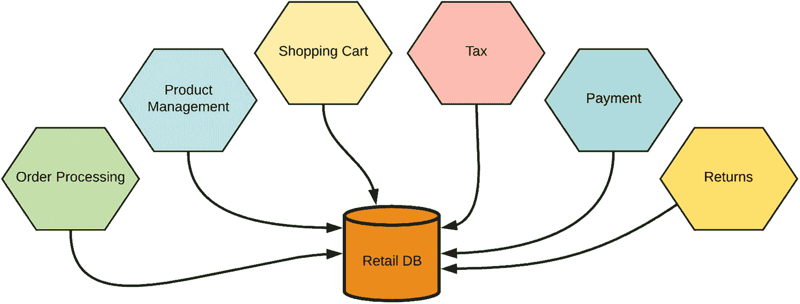

图 5-1

在线零售应用的微服务共享一个数据库

事实上，集中式的共享数据库使得应用更容易组合来自多个表的数据，并形成不同的业务表示。像 SQL 这样强大的查询语言天生就支持共享数据和构建不同数据组合所需的所有特性。例如，使用 SQL，我们可以根据各种复杂条件连接多个表，并创建不同实体的复合视图。

在处理共享业务实体时，以事务方式实现它们之间的业务交互变得非常重要。事务是一个要么失败要么成功的原子工作单元。事务的关键特性被称为 ACID，它是*原子性*（对数据的所有更改都像单个操作一样执行）、*一致性*（事务开始和结束时数据都处于一致状态）、*隔离性*（事务的中间状态对其他事务不可见）和*持久性*（事务成功完成后，对数据的更改会持久保存，即使系统发生故障也不会撤销）的首字母缩写。

集中式数据库使得跨多个实体的 ACID 事务变得异常简单。在关系型数据库中，每条 SQL 语句都必须在事务的范围内执行。因此，建模一个涉及多个表的复杂事务场景是相当简单的。大多数关系型数据库管理系统（RDBMS）都开箱即用地支持此类功能。

尽管集中式共享数据库架构有诸多优点，但它也有缺点。它是单点故障，由于大量应用流量涌入单个数据库，会造成潜在的性能瓶颈，并且由于应用共享相同的数据库表，它们之间存在紧密的依赖关系。因此，如果你使用共享的持久化层或数据库，就无法构建自治且独立的微服务。所以，使用微服务时，你需要去中心化数据管理，每个微服务必须完全拥有其操作的数据。

## 每个微服务一个数据库

微服务架构鼓励微服务拥有其操作的数据，并且数据库不应与任何其他服务共享。因此，一个给定的微服务将拥有一个隔离的数据存储，或使用一个隔离的持久化服务（例如，来自云提供商）。

每个微服务拥有一个数据库，在微服务自治方面给了我们很大的自由度。例如，微服务所有者可以根据业务需求修改数据库模式，而无需担心数据库的外部消费者。外部应用中的任何人都无法直接访问该数据库。这也让微服务开发者可以自由选择用作微服务持久化层的技术。不同的微服务可以使用不同的持久化存储技术，例如 RDBMS、NoSQL 或其他云服务。

然而，每个服务拥有一个数据库也带来了一系列新的挑战。在实现任何业务场景时，在微服务之间共享数据以及在服务边界内和跨服务边界实现事务变得相当具有挑战性。

## 微服务间的数据共享

在单体数据库中，进行任意数据组合都非常容易，因为我们共享一个单一的单体数据库。然而，在微服务上下文中，每一条数据都由单个服务（即单个*记录系统*）所拥有。任何其他服务或系统都不能直接访问记录系统（或持久层）。访问其他微服务所拥有数据的唯一途径是通过服务接口或 API。其他系统通过已发布的 API 访问数据时，或许可以使用只读本地缓存来在本地保存数据。

为了满足这些需求，我们需要提出合适的技术来实现微服务间的数据共享，因为大多数业务场景都需要它。

### 消除共享表

在多个服务/应用程序之间共享表是单体数据库中非常常见的模式。如前所述，当我们在两个或多个微服务之间共享一个表时，对该表模式的更改可能会影响所有依赖的微服务。例如，如图 5-2 所示，`订单处理`服务和`物流`服务共享同一个表`TRACKING_INFO`，该表用于跟踪订单状态。这两个服务都可能对该表进行读写操作，底层的中央数据库提供了所有必需的功能（例如 ACID 事务）。然而，如果我们需要更改`TRACKING_INFO`表的模式，那么这将同时影响`订单处理`服务和`物流`服务。此外，也无法在共享表中存放特定于某个服务（该服务不希望共享）的数据。这类共享表场景与微服务数据管理的基本原则不相容。一个服务的持久化存储/数据库应该是独立的，并且只能由一个微服务对其进行操作。因此，采用微服务架构时，我们需要消除此类共享表。

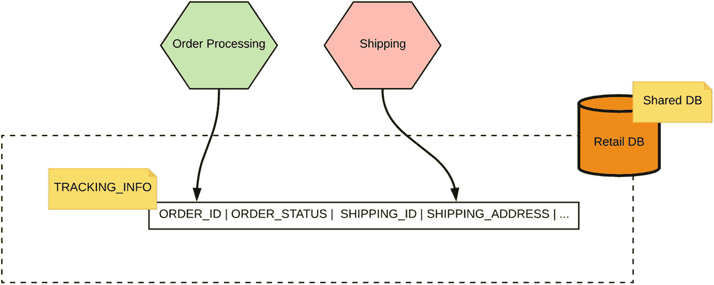

图 5-2

使用共享表的两个服务之间的数据管理

那么，我们如何消除共享表呢？如果你按照我们之前讨论的微服务数据处理原则来思考，给定的数据必须由单个服务拥有。因此，在这个例子中（如图 5-3 所示），跟踪信息应该被拆分成两个表。一个表应包含与`订单处理`微服务相关的数据，另一个表应包含与`物流`微服务相关的数据。这两个表上可以存在重复的共享数据，并且服务负责通过各自发布的 API（不直接访问数据库）来保持数据同步。我们将在本章后面详细讨论这些同步技术。

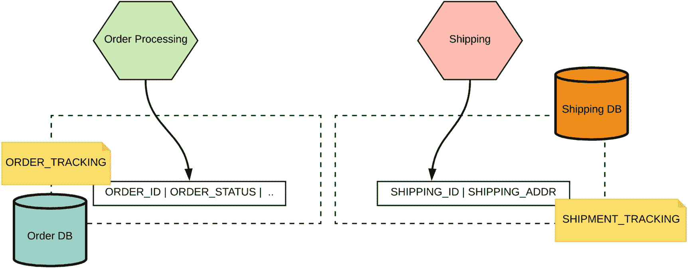

图 5-3

拆分共享数据并将其作为独立实体进行管理

共享表的另一种变体是共享数据被表示为独立的业务实体。在前面的例子中，共享数据（跟踪信息）并不代表一个业务实体。因此，让我们举一个不同的例子：在`订单处理`服务和`产品管理`服务之间共享客户数据。在这种情况下，这两个服务都在其业务逻辑中使用来自共享数据表（`CUSTOMER`表）的数据。我们现在可以识别出，客户信息不仅仅是一个表，而是一个完全不同的业务实体。我们可以简单地将其视为一个面向业务能力的实体，并将其建模为一个微服务。如图 5-4 所示，我们可以引入`客户`微服务，让它拥有客户数据，而其他服务可以通过`客户`服务暴露的 API 来消费客户数据。

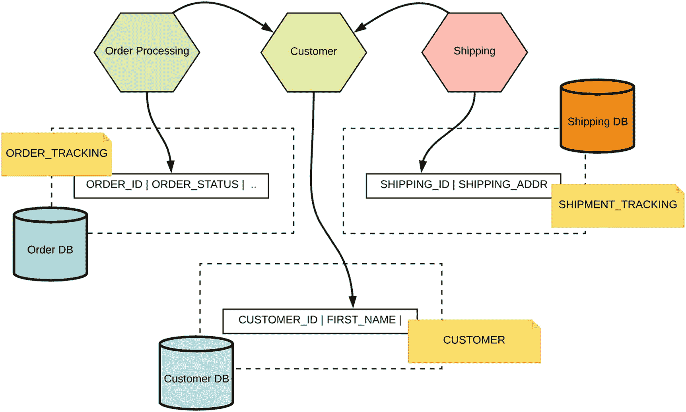

图 5-4

服务通过建立在客户数据库之上的服务共享客户信息

因此，我们可以确定消除在多个微服务之间共享数据表所涉及的关键步骤。

1.  识别共享表，并确定该共享表中存储的数据所对应的业务能力。

2.  将共享表迁移到专用数据库，并在该数据库之上，创建上一步中识别出的新服务（业务能力）。

3.  移除其他服务对所有数据库的直接访问，仅允许它们通过服务发布的 API 访问数据。

通过这种设计，我们需要为新创建的共享服务指定一个专属所有者，该所有者可以修改该服务的服务接口或模式。这也有助于我们发现这些服务之间新的业务边界，这将使我们的基于微服务的应用程序能够适应未来的任何新需求。

### 共享数据

将数据存储在多张表中并通过外键（FK）进行连接，是关系数据库中非常常见的技术。外键是一个列或列的组合，用于建立和强制两张表中数据之间的链接。你可以在创建或修改表时通过定义`FOREIGN KEY`约束来创建外键。外键实现了存储在多张表中的数据之间的参照完整性，这意味着如果外键包含一个值，则该值引用相关表中一条已存在的记录。

例如，图 5-5 展示了`订单处理`服务和`产品管理`服务，它们使用了`ORDER`表和`PRODUCT`表。一个给定的订单包含多个产品，订单表通过一个指向`PRODUCT`表主键的外键来引用这些产品。有了外键约束，你只能向`ORDER`表的外键中添加来自已存在`ORDER`实体的值。

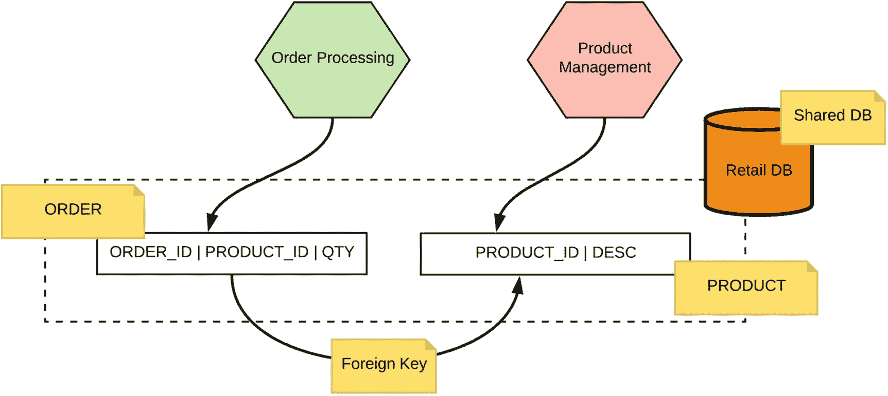

图 5-5

共享数据库 - 表之间的外键关系

对于单体共享数据库，使用外键和连接数据是相当简单的。但是，当你希望拥有独立的服务并为每个服务使用一个数据库时，拥有这种用于参照完整性的链接几乎是不可能的。因此，在微服务架构中，我们需要找到不同的方法来处理这种情况。让我们看看一些常用的技术来实现这些需求。

#### 同步查找

当每个微服务拥有专用数据库时，若某个服务需要访问其他服务的数据，只需调用该微服务已发布的 API 即可获取所需数据。例如，如图 5-6 所示，订单服务会保存指定订单中包含的商品 ID。如果`订单处理`服务需要商品的详细信息，则需在其应用逻辑中调用`商品管理`服务来获取商品信息。

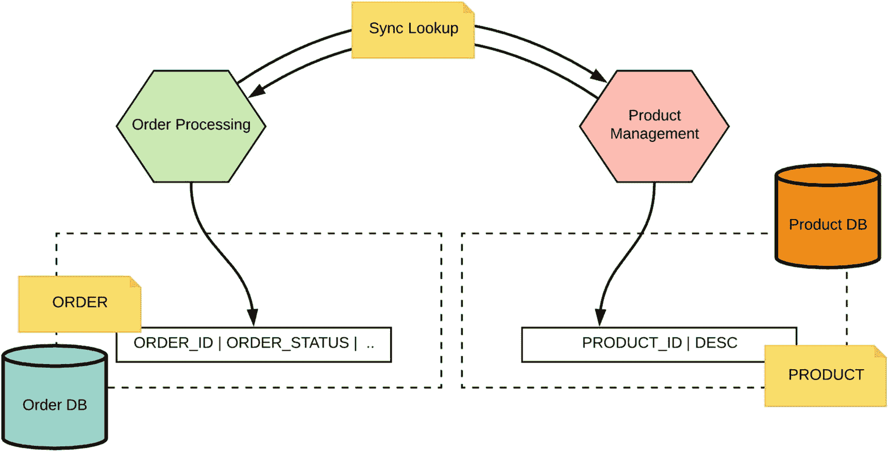

图 5-6

通过服务接口的同步查找来访问其他服务拥有的数据

这种技术非常易于理解，在实现层面，你需要编写额外的逻辑来进行外部服务调用。我们需要牢记，与数据库不同，我们不再拥有外键约束的参照完整性。这意味着服务开发者必须自行维护写入表中数据的一致性。例如，在创建订单时，你需要确保（可能通过调用商品服务）该订单引用的商品确实存在于`PRODUCT`表中。

#### 使用异步事件

在某些业务场景下，通过从其他微服务进行同步查找来共享数据可能代价高昂。作为替代方案，我们可以利用事件驱动架构（发布者-订阅者模式）在服务间共享数据。例如，针对`订单处理`和`商品管理`服务的相同场景（见图 5-7），我们可以引入一种事件驱动的通信模式，其中包含一个用作消息基础设施的事件总线。如果商品信息有更新，`商品管理`服务（发布者）会更新其商品表，并向事件总线发布一个事件。`订单处理`服务（订阅者）已订阅了感兴趣的商品更新主题，因此当`商品管理`服务向该主题发布商品更新事件时，`订单处理`服务将会接收到这些事件。然后它可以更新其本地缓存的商品信息，并使用该缓存来实现`商品管理`服务的业务逻辑。

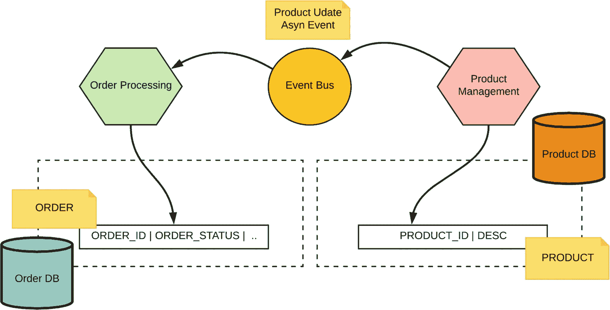

图 5-7

使用异步事件在微服务间共享数据

作为事件总线，你可以选择任何异步消息传递技术（我们在第 3 章“服务间通信”中详细讨论了异步消息传递技术），例如 Kafka 或 AMQP 代理（如 RabbitMQ），并且可以使用不同的订阅技术来确保事件能够传递给订阅者（例如持久订阅）。

通过这种方法，你可以消除服务间的同步调用，但由于我们使用了本地缓存，数据可能会过时。因此，基于异步事件的数据共享是一种最终一致性模型。最终一致性确保每个服务的数据最终会达到一致（你可能会在特定时间内获取到过时数据）。服务获取一致数据所需的时间可能被定义，也可能未被定义。因此，我们需要将此模式用于不受最终一致性特性影响的用例。

#### 共享静态数据

在存储和共享不可变的只读元数据时，通常使用传统的单体数据库，并通过共享表来共享数据。例如，美国各州、国家列表等数据常被用作共享静态数据。采用微服务方法时，由于我们不想共享数据库，需要考虑如何维护共享静态数据。

有人可能会认为，再创建一个包含静态数据的微服务就能解决这个问题，但仅仅为了获取一些不会随时间变化的静态信息而创建一个服务，未免有些大材小用。因此，共享静态数据通常通过共享库来实现。例如，如果某个服务想使用静态元数据，它需要将共享库导入到服务代码中。

### 数据组合

从多个实体组合数据并创建不同的视图是数据管理中非常常见的需求。使用单体数据库（尤其是关系型数据库管理系统），通过 SQL 语句中的 JOIN 来构建多个表的组合是轻而易举的。因此，你可以无缝地从现有实体中组合出不同的数据视图，并在服务中使用它们。

然而，在微服务上下文中，当你为每个微服务引入独立数据库时，构建数据组合变得非常复杂。你无法再使用诸如 JOIN 之类的内置结构来组合分散在不同服务所拥有的多个数据库中的数据。

让我们仔细看看一些常用的微服务数据组合技术。

#### 组合服务或客户端混搭

当你需要从多个微服务创建数据连接时，你只能访问服务 API。因此，为了从多个微服务创建数据组合，你可以在现有微服务之上创建一个组合服务。该组合服务负责调用下游服务，并对通过服务调用检索到的数据进行运行时组合。

例如，让我们考虑图 5-8 所示的示例。假设我们需要创建一个已下订单的组合，并包含下这些订单的客户的详细信息。这里我们有两个服务——`订单处理`和`客户`——它们拥有各自的数据库来存储订单和客户信息。

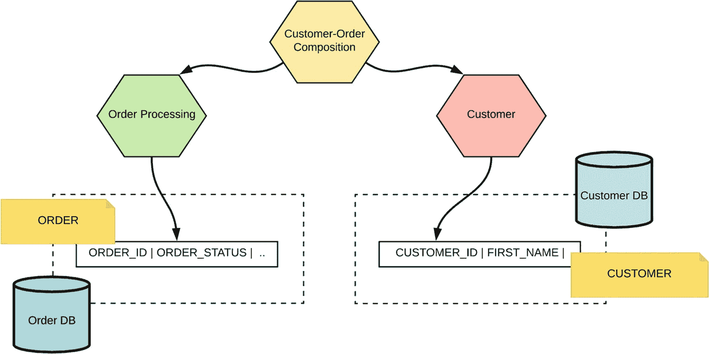

图 5-8

使用组合服务进行数据组合，该服务调用下游服务并聚合数据

我们当前的需求是创建订单和客户的连接。通过组合服务方法，我们可以创建一个新服务——`客户-订单`组合服务——并从该服务调用`订单处理`和`客户`微服务。你需要在组合服务内部实现运行时数据组合逻辑以及通信逻辑（例如，调用 RESTful 风格的`订单处理`和`客户`微服务）。

另一种替代方案是在客户端实现相同的运行时数据组合。基本上，与其使用组合服务，消费者/客户端应用程序可以直接调用所需的下游服务并自行构建组合。这通常被称为*客户端混搭*。

当你要连接的数据量相对较小时，组合服务或客户端混搭是合适的。由于这是运行时组合，如果你要将大量数据加载到内存中，组合服务的运行时将需要大量内存。因此，我们需要根据要实现的特定数据组合场景来选择这种方法。

### 提示

使用组合服务或客户端混搭进行数据组合适用于 1:m 类型的连接，即一个表中的一行可以在另一个表中有多个匹配行。

#### 使用异步事件与物化视图进行连接

在某些数据组合场景中，你需要将来自多个微服务的预连接数据物化成视图。例如，考虑图 5-9 所示的场景。这里我们有`订单处理`服务和`客户`服务，我们需要物化客户-订单连接/视图。该物化视图将用于特定的业务功能，该功能需要订单与客户之间的连接。

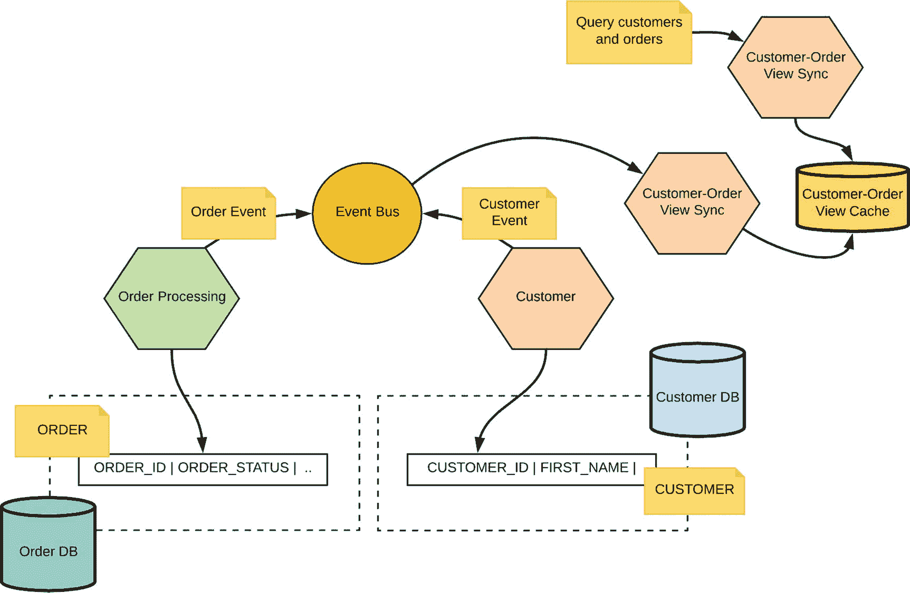

图 5-9

使用异步事件与物化视图进行连接

`订单处理`服务和`客户`服务将订单和客户更新事件发布到事件总线/代理。有一个服务订阅了这些事件，然后它物化了订单和客户的连接。该服务（`客户-订单-视图-同步`）维护了订单和客户之间的反规范化连接，这是提前完成的，而非实时进行。如图 5-9 所示，`客户-订单-视图-同步`服务还有一个组件，该组件操作于客户-订单视图缓存，为所有外部查询提供服务。

### 提示

使用物化视图进行数据组合适用于每侧都有大量行（高基数的多对多连接）的组合场景。

反规范化后的数据可以保存在缓存或其他此类存储中，并且可以被其他微服务作为只读数据存储来消费。

## 微服务中的事务

事务是软件应用程序中的一个重要概念。它们允许你将一组操作组合在一起，这些操作应在全有或全无的场景下一起执行（即，要么全部执行，要么在发生故障时全部回滚）。事务在数据库上下文中非常常见，但并不仅限于此。在本章中，我们主要关注数据库事务。

ACID（原子性、一致性、隔离性和持久性）是一组数据库事务的属性，旨在即使在发生故障时也能保证有效性。因此，满足 ACID 属性的一系列数据库操作可以被视为一个事务。

单体应用通常构建在单个集中式关系数据库之上，并使用事务来保持跨多个表的数据处于一致状态。在应用程序中使用 ACID 属性提供了启动事务以执行插入、更新和删除等更改的能力，并允许提交或回滚事务。对于单体应用和集中式数据库，启动事务、更改多行数据（可能跨多个表）并最终提交事务是相当直接的。

对于微服务，与事务相关的业务需求不会发生根本性变化。然而，与集中式数据库不同，微服务拥有自己的数据库，并且事务边界跨越多个服务和数据库。因此，实现此类事务场景不再像单体应用和集中式数据库那样直接。

### 避免使用两阶段提交的分布式事务

分布式事务是围绕使用一个称为*事务管理器*的集中式进程来编排事务步骤的概念构建的。实现分布式事务使用的主要算法称为*两阶段提交*（2PC）。让我们看看两阶段提交协议的细节。事务所需的更改被发送给每个参与者，并最初临时存储在每个事务参与者处。然后，事务管理器启动投票/提交请求阶段。

*投票/提交请求阶段*

*   事务管理器/协调器向参与给定事务的所有服务发送一个*准备*请求。

*   事务管理器将等待，直到所有服务回复“是”或“否”。

*提交阶段*

*   基于第一阶段收到的响应，如果所有服务都回复了“是”，那么事务管理器将提交该事务。

*   如果任何服务回复“否”（或根本不回复），那么事务管理器将为所有参与服务调用回滚操作。一旦收到提交消息，所有参与者实体就会持久化临时存储的更改。

分布式事务方法解决了我们之前讨论的大多数事务需求，但它带有固有的局限性，这些局限性阻碍了将带有 2PC 的分布式事务用于大多数微服务事务行为。两阶段提交方法的一些局限性包括：

*   事务管理器是单点故障。所有未决事务将永远无法完成。

*   如果某个参与者未能响应，那么整个事务将被阻塞。

*   提交可能在投票后失败。2PC 协议假设，如果某个参与者回复了“是”，那么它也一定能够提交该事务。在大多数实际场景中并非如此。

*   鉴于微服务的分布式和自治特性，使用分布式事务/两阶段提交来实现事务性业务用例是一项复杂且容易出错的任务，可能会阻碍整个系统的可扩展性。

### 提示

避免对微服务事务使用带有两阶段提交的分布式事务。

在跨多个微服务实现事务时，最好避免使用带有两阶段提交的分布式事务。然而，构建跨多个微服务的事务性业务场景的需求仍然有效。还有其他几种替代方案可供使用。

### 使用本地事务发布事件

基于异步事件的数据管理在微服务数据管理中非常常见。你可以在事件驱动架构中实现某些事务行为，从而让你实现原子性。例如，假设图 5-10 中所示的`订单处理`服务负责以事务方式更新`ORDER`表并向事件总线发布事件（即，同时更新订单并发布事件）。

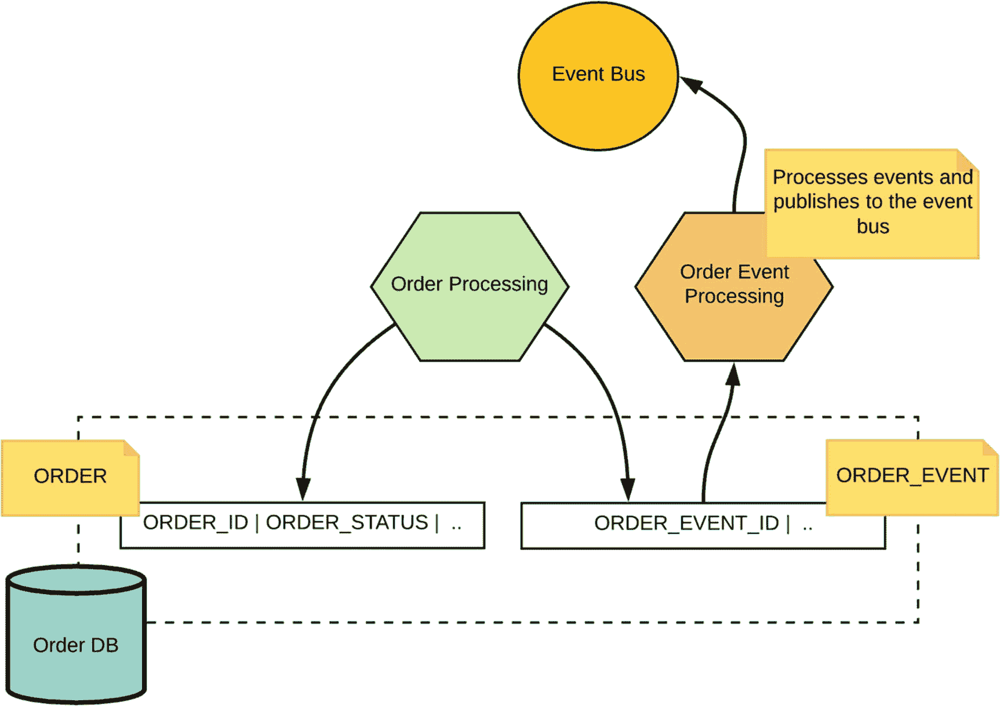

图 5-10

使用本地事务更新数据库表并创建事件

这里，我们使用了一个事件表来存储订单更新事件。因此，`订单处理`服务可以启动一个本地事务，该事务包括订单更新操作，并向`ORDER_EVENT`表添加一个事件。这两个操作将在同一个本地事务边界内执行。

有一个专门的服务/进程负责消费`ORDER_EVENT`表并将事件发布到事件总线。它也可以使用本地事务来读取事件，将它们发布到事件总线/消息代理，并更新订单事件表。事件消费者服务负责从事件总线读取事件，并在该服务的事务边界内处理它们。

这种方法避免了使用带有 2PC 的分布式事务，但它有一些局限性，例如依赖于支持事务的数据库（即，大多数 NoSQL 数据库不支持事务）。

### 数据库日志挖掘

当服务在其所拥有的数据之上执行各种数据库操作时，所有事务细节都会被记录在数据库事务或提交日志中。因此，我们可以将数据库视为单一事实来源，并从事务或提交日志中提取数据变更。例如，如图 5-11 所示，`订单处理`服务执行各种数据库操作，这些操作被记录在数据库事务日志中。`DBTransactionLogProc`应用程序可以挖掘`订单`数据库的事务日志，并创建与每个事务相匹配的事件。这些事件随后被发布到事件总线或消息代理中。

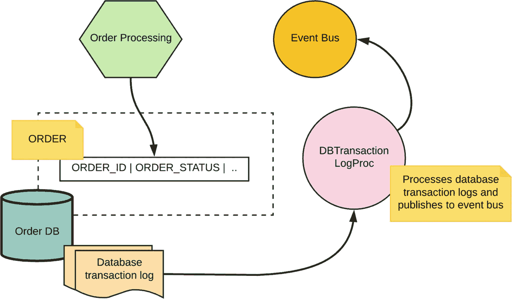

图 5-11

通过使用数据库事务日志和发布事件来实现原子性

其他应用程序可以消费这些事件，我们可以在所有服务之间维护最终一致性。

诸如*变更数据捕获*（CDC）之类的数据管理解决方案利用了数据库事务日志处理技术。例如，[Debezium](http://debezium.io/) 或 [LinkedIn Databus](https://github.com/linkedin/databus) 等解决方案就使用此技术来构建 CDC 管道。

由于我们将数据库用作单一事实来源，事务日志挖掘技术非常有效。每个成功的数据库操作都会被记录在数据库事务日志中。然而，在实现和处理方面，不同数据库的事务日志差异巨大，因为事务日志没有标准格式，每个数据库都有自己专有的事务记录方式。因此，大多数基于数据库事务日志挖掘的数据管理解决方案必须为每种数据库类型提供相应的实现。

### 事件溯源

通过使用我们之前讨论的技术（例如使用本地事务发布事件），我们可以将实体的每个状态变更事件持久化为一个事件序列。所有这些事件都存储在事件总线中，订阅者可以通过处理该实体上发生的事件序列来推导出该实体的状态。例如，如图 5-12 所示，`订单处理`服务将实体`订单`上发生的变更作为事件发布（而不是用订单状态更新数据库表）。诸如订单已创建、已更新、已支付、已发货等状态变更事件会被发布到事件总线中。

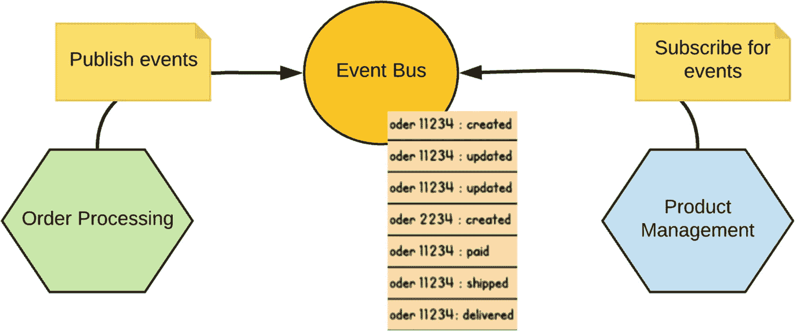

图 5-12

事件溯源

订阅者应用程序和服务可以通过简单地重放订单上发生的事件来重新创建订单的状态。例如，它可以检索与`order11234`相关的所有事件，并推导出该订单的当前状态。

### Saga

到目前为止，我们已经讨论了几种基于异步事件驱动架构的解决方案，我们可以利用它们来避免使用两阶段提交的分布式事务。对于完全同步的消息传递场景，我们可以使用*Saga*跨多个服务构建事务行为。

在深入探讨 Saga 的理论方面之前，让我们先看一个使用 Saga 的真实世界示例。（Caitie McCaffrey 也有一个关于 Saga 模式如何为真实场景设计的精彩会议演讲^(⁸³)。）考虑一个旅行社服务（见图 5-13），它允许您规划假期。旅行社服务通过旅行社应用程序获取持续时间、地点和其他详细信息，并预订航班、酒店和租车服务。航班、酒店和租车服务的预订必须以事务方式完成（要么一起预订所有三项服务，要么如果其中一项预订失败，则取消其余预订）。正如我们之前讨论的，如果旅行社服务构建在集中式数据库之上，那么使用事务来实现此场景将非常简单。

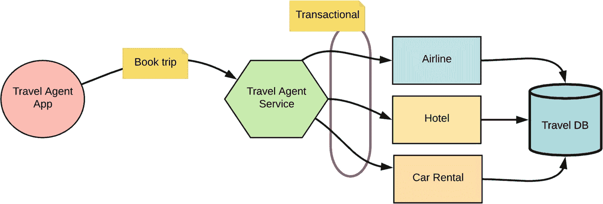

图 5-13

集中式数据库上的事务

使用微服务，构建此场景要求我们在多次服务调用之间具有事务安全性。正如您在之前章节中所看到的，使用两阶段提交的分布式事务具有固有的局限性，并且不是解决此问题的合适方法。

Saga 旨在通过将给定事务分组为一系列子事务和相应的补偿事务来解决分布式事务问题。Saga 中的所有事务要么全部成功完成，要么在发生故障时，运行补偿事务来回滚所有操作，这是作为 Saga 的一部分完成的。

### 注意

*Saga*是一个长生命周期的事务，可以编写为一系列可以交错执行的事务。序列中的所有事务要么全部成功完成，要么执行补偿事务来修正部分执行。Saga^(⁸⁴)模式是在 Hector Garcia-Molina 和 Kenneth Salem 于 1987 年发表的一篇[论文](http://www.amundsen.com/downloads/sagas.pdf)中提出的。

现在，让我们尝试在我们的旅行预订场景中使用 Saga 模式。我们可以将此用例建模（见图 5-14）为一系列子事务——预订航班、预订酒店和预订租车。这些子事务中的每一个都在单个事务边界内运行，并且每个子事务都有一个关联的补偿事务，该补偿事务可以在语义上撤销该子事务。例如，对于每个服务，我们可以列出事务和补偿事务，如下所示。

*   T1：预订航班，C1：取消航班

*   T2：预订酒店，C2：取消酒店

*   T3：预订租车，C3：取消租车

每个服务都有一个专用的事务边界，并且它将在专用数据库之上运行（尽管并非强制要求每个服务都有一个数据库）。

一个 Saga 可以表示为一个有向无环图，其中包含所有子事务和补偿事务。旅行预订 Saga 包含一组子事务和补偿事务。旅行社服务包含一个名为 Saga 执行协调器（SEC）的组件，它负责执行预订航班、预订酒店和预订租车事务。如果这些操作中的任何一个在给定步骤失败，则 SEC 通过执行相应的补偿事务来回滚整个事务。

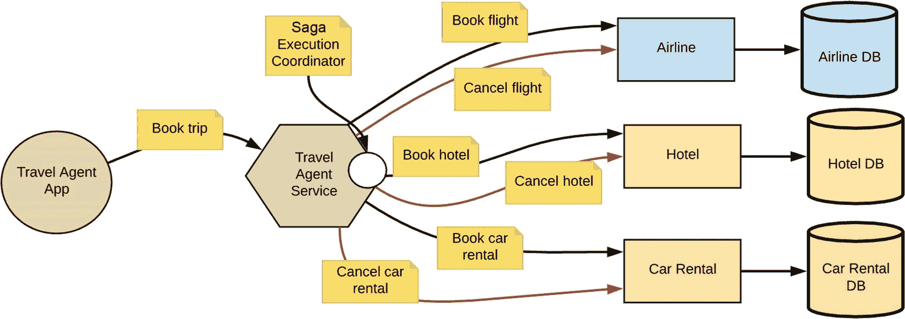

图 5-14

使用 Saga

Saga 在概念层面上非常简单，大多数集中式工作流解决方案，例如业务流程模型和表示法（BPMN）解决方案，实际上都基于相同的术语。然而，为基于微服务的系统以去中心化的方式构建 Saga 模式是相当具有挑战性的。因此，让我们更仔细地研究一下如何在微服务上下文中实现 Saga。

Saga 的实现需要一个 Saga 日志，这是一个 Saga 执行协调器与之交互的分布式日志。

#### Saga 日志

Saga 日志是一种分布式日志，用于持久化记录给定 Saga 执行过程中的每个事务/操作。从高层来看，Saga 日志包含各种状态变更操作，例如 `Begin Saga`、`End Saga`、`Abort Saga`、`Begin T-i`、`End T-i`、`Begin C-i` 和 `End C-i`。

Saga 日志通常使用分布式日志来实现，而像 Kafka 这样的系统常被用于此实现。

#### Saga 执行协调器 (SEC)

SEC 是编排整个逻辑并负责执行 Saga 的主要组件。给定 Saga 中的所有步骤都记录在 Saga 日志中，SEC 负责写入和解释 Saga 日志中的记录。它还执行子事务/操作（例如，调用酒店服务并进行预订），并在必要时执行相应的补偿事务。虽然与 Saga 相关的步骤记录在 Saga 日志中，但编排逻辑（可以表示为有向无环图）是 SEC 进程的一部分（编排可以使用您自己的自定义逻辑构建，也可以基于 BPMN 等标准构建）。

非常重要的一点是，与 2PC 中的协调器不同，SEC 并不是一个对整个执行过程拥有中央控制的特殊进程。它确实作为一个集中式运行时运行，但该运行时是“哑”的，执行逻辑保存在分布式的 Saga 日志中。然而，必须确保 SEC 始终保持运行。如果 SEC 发生故障，应基于相同的分布式 Saga 日志启动一个新的 SEC 进程。

既然您已经对 SEC 和 Saga 日志有了很好的理解，那么让我们深入探讨分布式 Saga 的执行过程。

#### 执行分布式 Saga

一个分布式 Saga 是一个有向无环图 (DAG)，SEC 的主要任务就是执行这个 DAG。假设在我们的旅行预订场景中（见图 5-15），我们将 SEC 内置于旅行社服务中。

SEC 可以开始处理记录在分布式日志中的 Saga。

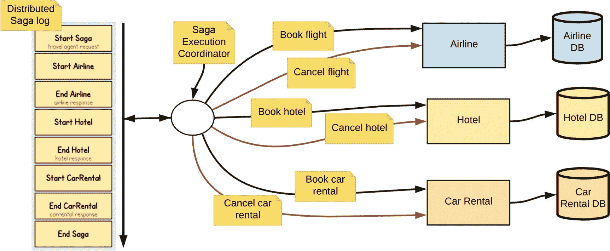

图 5-15

成功 Saga 的执行步骤

一旦旅行社服务收到旅行预订请求，SEC 就会通过向 Saga 日志写入一条 `Start Saga` 指令以及处理该 Saga 所需的任何其他元数据来启动一个 Saga。一旦该记录被持久化地提交到日志中，SEC 就可以进入下一条指令。

然后，基于 Saga 的 DAG，SEC 可以选择执行航空、酒店或租车事务中的一个（假设这三个可以并行执行）。假设首先执行航空事务。在这种情况下，SEC 会向 Saga 日志记录一条 `Start Airline` 消息。然后，SEC 执行预订航班的操作。

一旦 SEC 收到来自航空服务的响应，它就会提交 `End Airline` 消息以及来自航空服务的响应，我们可能在 Saga 的后半部分需要用到这个响应。

类似地，这一系列步骤会持续进行，直到我们成功执行了航空、酒店和租车服务上的所有三个操作。

最后，由于我们已成功完成所有操作，SEC 会将 `End Saga` 消息提交到 Saga 日志中。这是一个成功的 Saga 执行。

现在让我们来看一个失败场景下的 Saga。在图 5-16 中，我们拥有与之前讨论的相同的一系列步骤，但在本例中，租车过程失败了（例如，假设在指定日期没有可用的车辆）。

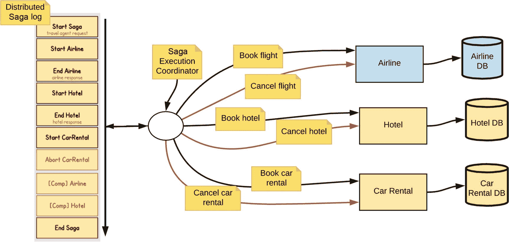

图 5-16

不成功 Saga 的执行步骤

由于我们检测到某个子事务（即租车预订）失败，我们需要回滚到目前为止已执行的所有其他子事务。因此，在 Saga 日志中，您可以找到 `Start Car Rental` 日志，而现在租车预订已失败。现在，我们必须遍历到目前为止已执行的 Saga 的逆向 DAG，并提交回滚。

当租车服务对租车预订返回错误时，SEC 会将 `Abort Car Rental` 消息提交到 Saga 日志。

由于这是一个失败场景，SEC 必须为当前 Saga 启动回滚操作。SEC 可以通过反转此 Saga 的 DAG 并反向处理 Saga 日志来回滚到目前为止已完成的所有子事务。

因此，SEC 会在 Saga 日志中查找任何包含 car、hotel 和 airline 的记录，并找到关于酒店和航空子事务的记录。SEC 将为酒店和航空执行补偿事务。它可以使用存储在 Saga 日志中的信息（例如预订号）来执行补偿事务。

成功执行补偿事务后，SEC 会将 `[Comp] Airline` 和 `[Comp] Hotel` 消息提交到 Saga 日志。

最后，SEC 可以将 Saga 完成信息提交到 Saga 日志中。

SEC 故障相对更容易处理，因为我们可以通过处理 Saga 日志来重新创建 DAG 和状态。此外，为了使 Saga 按预期运行，子事务应最多发送一次，而补偿事务至少发送一次（幂等性）。

同样重要的是要记住，在任何给定的时间点，系统可能不处于完全一致的状态，但随着时间的推移，它会达到一致的状态（最终一致性）。当我们遍历 Saga DAG 时，我们执行子事务并完成它们。但是，当我们遇到问题时，我们会回滚事务。在不成功的 Saga 示例中，我们预订了航空和酒店，然后后来取消了这两个预订。

### 注意

Saga 模式的核心概念旨在实现最终一致性。

Saga 模式不仅仅适用于数据库事务。Saga 概念在实践中被广泛用于工作流、支付处理、金融系统等解决方案中。此外，Saga 模式也适用于任何需要审批和人工交互的用例。

大多数能够在微服务环境中运行的工作流解决方案都支持用于微服务的 Saga 模式。在第 7 章“集成微服务”中，我们将探讨此类工作流和业务流程如何在微服务架构的上下文中使用。

## 多语言持久化

通过去中心化的数据管理，您可以利用最适合您用例的持久化技术。根据您的用例，一个微服务可以使用 SQL 数据库，而另一个服务可以利用 NoSQL 数据库。

例如，一个社交媒体应用的微服务可能使用关系型/SQL 数据库来存储其用户信息，而多媒体存储则基于 NoSQL 数据库。

## 缓存

作为微服务数据管理技术的一部分，缓存发挥着关键作用，因为它能提升特定微服务的可用性、可扩展性和性能。在每个微服务层面，我们都可以缓存该服务所操作的业务实体。通常，这类业务实体（或对象）不会频繁变更（例如，产品信息服务会将产品名称和详情缓存起来，这些信息在商品搜索中会被频繁使用）。这类数据通常可以按需缓存（当我们首次从底层数据存储中访问产品信息时）。此外，你还可以在服务启动时缓存任何服务级别的元数据（配置或静态数据）。

缓存最重要的一个方面是，不要使用在微服务之间共享的中央缓存层。然而，特定微服务的所有实例都具有相同的数据需求，因此在这些实例之间共享一个缓存层是合理的。

市面上有不少缓存解决方案，但 Redis^(⁸⁵)、Ehcache^(⁸⁶)、Hazelcast^(⁸⁷) 和 Coherence^(⁸⁸) 是其中较为流行的缓存实现。特别是 Redis，已在开源和容器原生微服务缓存场景中得到广泛应用。Redis 是一个开源的内存数据结构存储系统，可用作数据库、缓存和消息代理。它支持多种数据结构，如字符串、哈希、列表、集合、带范围查询的有序集合、位图、HyperLogLog 以及带半径查询的地理空间索引。虽然 Redis 在微服务上下文中主要用于缓存，但它也可以用作数据库或消息代理（发布-订阅消息）。

## 总结

在本章中，我们讨论了在微服务架构中可以使用的去中心化数据管理技术。每个微服务拥有独立数据库的模式带来了一系列优势，也带来了若干挑战。当每个微服务只能操作一个独立的私有数据库时，传统的跨多个表使用 SQL 进行数据共享、表之间的外键约束等依赖关系将不再适用。

我们讨论了几种可用于在微服务之间共享数据的技术，例如通过访问服务接口进行运行时查找、使用本地缓存进行基于异步事件的数据共享，以及通过事件驱动通信维护物化视图。

事务是微服务分布式数据管理中的主要挑战之一。由于每个服务都有专用的数据库，且服务不允许直接访问外部数据库，你无法再定义跨多个业务服务（多个表）的事务边界。由于可扩展性方面的固有限制，使用两阶段提交的分布式事务并非可行选项。Saga 为两阶段提交的分布式事务提供了一种替代方案。通过使用与相应补偿事务关联的子事务，我们可以构建跨多个微服务的事务安全业务场景。

脚注 1   2   3   4   5   6

