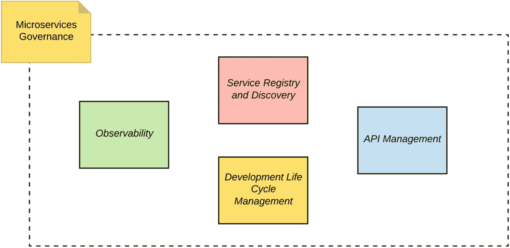
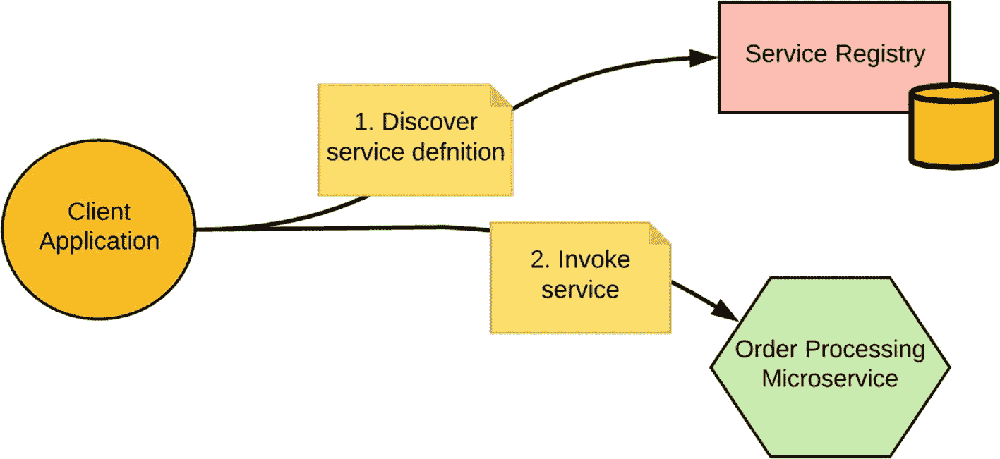
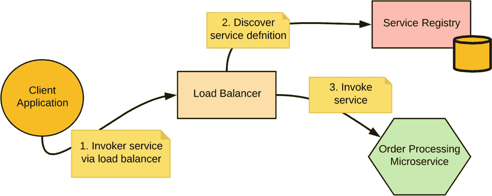
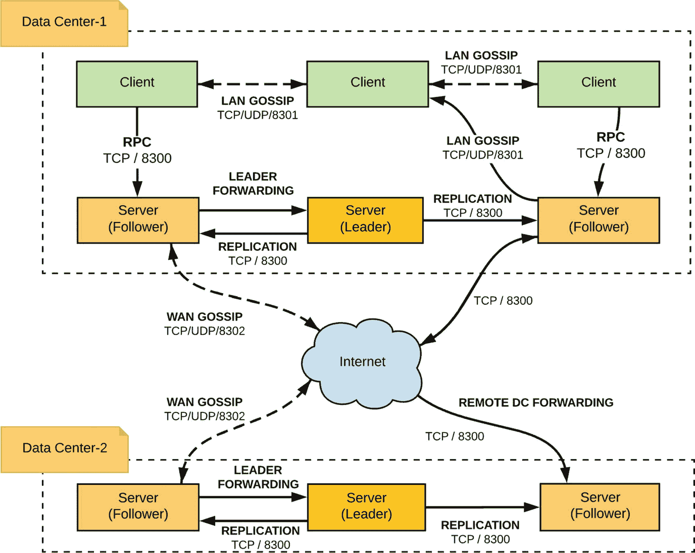
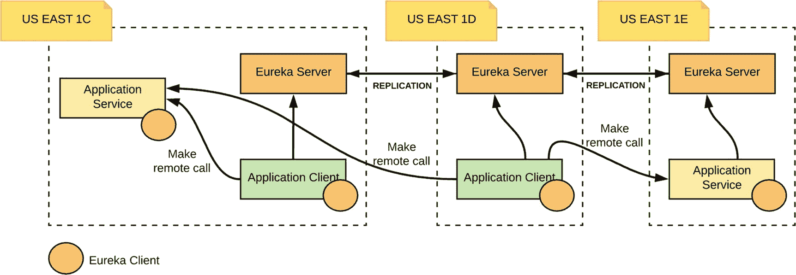

# 6. 微服务治理

微服务架构本质上需要处理数十、数百甚至数千个服务。当你在这种规模下运行时，需要建立一些治理流程。然而，使用严格的集中式治理流程会阻碍微服务架构的自主性。因此，我们需要重新思考微服务治理的策略。

在本章中，我们将梳理微服务治理的需求，并深入探讨其中的几个关键方面，例如*服务注册*和*治理*。其余治理主题将在后续章节中介绍。

## 为什么需要微服务治理？

面向服务架构（SOA）治理曾是 SOA 成功运营的关键驱动力之一，它促进了组织中不同实体（开发团队、服务消费者等）之间的协作与协调。尽管它作为 SOA 治理的一部分定义了一套全面的理论概念，但实践中只有少数概念被积极使用。

当我们转向微服务架构时，大多数有用的治理概念也被摒弃了。微服务中的治理概念仅被解释^(⁸⁹)为一个去中心化的流程，它赋予每个团队/实体按照自己偏好的方式治理自身领域的自由。去中心化治理适用于服务开发、部署和执行流程，但其内涵远不止于此。让我们更仔细地审视微服务治理的各个方面，看看如何在实践中实现它们。

## 微服务治理的各个方面

微服务治理包含多种协同实践，以实现真实世界的场景。这些概念大多并非新事物，而是我们在 SOA 治理中成功使用过的。它们在微服务架构下同样适用。

### 服务定义

我们开发的任何微服务都必须包含足够的信息，以唯一标识自身、其功能以及消费者应如何消费它。因此，必须有一种机制来指定服务定义，并且该定义应随时可供服务消费者使用。

有几种技术（在第 3 章“服务间通信”中讨论过）——例如 OpenAPI (Swagger)、GrahQL 模式、gRPC 和协议缓冲区——可以定义服务接口。这些技术允许你定义服务标识符、服务接口（即可用的服务功能）和服务消息模型（服务请求和响应的模式或消息格式）。其他服务元数据，例如服务所有权和服务级别协议（SLA），也可以成为服务定义的一部分。

服务定义通常存储在中央存储库中，消费者可以访问，服务所有者可以发布。

### 服务注册与发现

服务注册中心是存储服务定义的地方，服务提供者可以在此处使其服务可用并为消费者所知。服务消费者使用服务注册中心来定位他们想要调用的服务。服务元数据（属于服务定义的一部分，例如服务 URL、消息模型、支持的功能等）可以通过服务注册中心检索。

服务注册中心定义了一个用于发布和访问服务定义的 API。当创建或更新服务时，服务所有者应将服务定义发布到服务注册中心，消费者可以在运行时使用服务发现机制来发现服务。在本章后面，我们将更深入地了解微服务架构中最常用的服务注册中心和发现机制。


### 服务生命周期管理

微服务具有不同的生命周期阶段，包括*规划*、*设计*、*实现*、*部署*、*维护*和*退役*。鉴于微服务的去中心化特性，这些任务通常由拥有每个微服务的团队负责。在大多数实际场景中，无论业务范围以及用于开发微服务的技术如何，为微服务设定统一的生命周期阶段是很常见的。服务生命周期管理技术会集中应用于微服务架构中。这包括部署生命周期管理、如何对服务进行版本控制等。这些能力大多作为服务网格中的 API 管理或控制平面的一部分来实现。我们将在第 9 章“服务网格”和第 10 章“API、事件和流”中详细讨论它们。

### 服务质量（QoS）

在向消费者暴露服务之前，需要考虑多个服务质量（QoS）方面。服务可以作为安全服务暴露，利用各种安全协议和标准（从传输层安全、访问令牌等开始）。此外，还可以使用速率限制和节流来控制对服务的访问。缓存以及将各种钩子集成到监控和货币化中是其他一些重要的 QoS 特性。这些需求大多与微服务的治理直接相关，并且通常是集中控制的。

我们将在第 11 章“微服务安全基础”和第 12 章“保护微服务安全”中详细介绍微服务安全基础知识和用例。

### 服务可观测性

当应用程序与多个微服务交互时，为所有服务提供指标、追踪、日志记录、可视化和告警能力至关重要，这样你才能清晰了解它们的交互情况，并在出现问题时进行故障排除。所有这些需求都整合在一个概念下，称为*可观测性*。

在微服务架构中，很可能有成百上千个服务相互通信。获取服务指标、追踪消息和服务交互、获取服务日志、理解服务的运行时依赖关系、在发生故障时进行故障排除以及为异常设置告警，这些都可以归入可观测性的范畴。

大多数可观测性工具作为集中式实体运行，所有服务都可以将所需数据推送到其中，这些数据对于指标、追踪、日志记录、可视化等非常有用。由可观测性工具负责分析数据并进行处理，以便推导出所需的可观测性相关信息。我们将在第 13 章“可观测性”中讨论用于微服务可观测性的所有技术和工具。

至此，我们已经讨论了微服务治理的大部分关键方面。现在，是时候看看这些概念如何在实际中实现了。

## 实现微服务治理

我们在前面章节中讨论的微服务治理方面，是在四个关键类别下实现的（见图 6-1）。虽然微服务的设计、开发和部署并非集中治理，但这些方面是作为集中且可扩展的实体来实现的。



图 6-1

实现微服务治理的关键组件

让我们重新审视前面章节中讨论的治理方面，看看它们是如何以及在哪里针对这些组件实现的。

### 服务注册与发现

如果考虑服务定义，服务标识符、消息模型、接口等的定义是可以在没有集中治理的情况下完成的事情。然而，这些服务定义必须发布到集中式服务注册中心。服务注册中心是一个集中式组件，它还将定义一个规范模型来描述服务。所有服务所有者都应以其规范形式将服务定义发布到服务注册中心。即使服务是用截然不同的技术（例如 OpenAPI 与 gRPC）实现的，你仍然可以找到这些服务的通用元数据，并将其添加到服务注册中心。

服务注册中心还附带一个服务发现协议（或 API），可用于在运行时检索服务信息。（我们将在下一节详细讨论服务注册与发现。）

### 开发生命周期管理

服务生命周期管理通常在服务部署层面实现。例如，当某个服务必须部署到多个环境时，部署过程将处理在这些环境之间复制或迁移相同服务代码的需求。这还包括各种与 DevOps 相关的部署方法（蓝绿部署、金丝雀部署、AB 测试等），并描述了如何管理不同的环境，例如开发环境、测试环境、质量保证环境、预发布环境、生产环境等。

### API 管理/API 网关

API 管理在实现多个微服务治理方面起着关键作用。如第 1 章“微服务的理由”所述，API 管理层或 API 网关用于将微服务作为*受管*API 暴露给消费者。这包括我们在前面章节中讨论的所有服务质量方面，以及其他一些 API 管理特有的细节，例如货币化。作为 API 管理的一部分，我们可以在运行时对服务应用安全、服务版本控制、节流、缓存、货币化等。重要的是要理解，这些能力中的大多数必须集中应用于服务调用。因此，API 网关是集中治理或管理的，而这些能力的应用可以是集中式或分散式的。此外，API 网关可用于外部或内部消费者。当微服务通过内部 API 网关相互通信时，这些能力同样适用。

API 管理解决方案通常与服务注册中心协同工作，以发现服务，并将其用作 API 存储库（即，与 API 相关的信息也可以通过服务注册中心发布和发现）。当我们使用现有服务并从中创建新 API 时，这也非常有用。

另一个重要方面是，API 管理解决方案提供了丰富的 API 发现和消费能力。因此，可以利用 API 管理来管理所有微服务（而不是选择要对外暴露的服务）。

我们将把关于这些主题的详细讨论推迟到第 10 章“API、事件和流”中进行。


### 可观测性

可观测性是一种普遍适用于所有微服务的特性。每个微服务都可以使用推荐的可观测性代理，将数据推送到任意可观测性工具中。可观测性工具提供了微服务所有交互的集中视图，它们作为被动实体运行，不会干预业务消息的原始流程。API 管理解决方案或 API 网关也与可观测性工具紧密协作。我们在前几节讨论的大多数可观测性方面，通常也适用于 API。

针对可观测性的不同方面，有专门的可观测性工具，例如指标、链路追踪、日志记录、服务可视化、告警等。我们将在第 13 章深入探讨微服务可观测性。

## 服务注册与发现

当您运行成百上千个微服务时，拥有一个获取服务详情的中心位置至关重要。这就是服务注册与发现发挥作用的地方。在许多描述微服务上下文中服务注册与发现的资料中，它被解释为一种在运行时获取微服务位置的机制。然而，服务注册具有更广泛的含义，并且可以更有效地使用。

由于需要处理的服务数量众多，拥有一个可以获取所有服务信息的中心位置非常重要。正如我们在前几节讨论的，服务注册就是存储所有服务定义的地方（不仅仅是服务 URL，这与一些微服务文章的解释不同）。消费者可以通过访问服务注册中心来获取所有服务定义。而服务发现则定义了访问服务注册中心的方式。服务所有者应在服务注册中心注册服务，以便消费者能够发现它们。同时，所有者负责更新和维护服务信息。在微服务架构中，服务注册与发现最常见的用例是为服务提供可寻址的名称，使其独立于所运行的基础设施。例如，当进行服务调用时，我们使用一个带有服务逻辑引用的名称，服务发现会将该名称解析为服务的实际端点地址。因此，当实际端点地址发生变化时，外部服务或消费者无需更改其代码。

总的来说，我们可以将服务注册中心视为发布和检索微服务架构中所有服务规范定义的存储库。我们用来检索服务定义的机制称为服务发现。

接下来，让我们讨论一些常用的服务注册与发现模式。如图 6-2 所示，假设有一个场景：客户端想要调用一个服务，但服务地址未知或动态变化。在这种情况下，我们可以使用服务注册中心来存储服务定义。客户端必须通过调用服务注册中心的 API 来发现服务信息，然后使用从注册中心检索到的信息进行实际的服务调用。通常，大多数服务注册中心都提供 RESTful 接口（或 gRPC）以及专用的客户端库来满足这一需求。这种机制称为*客户端服务发现*。



图 6-2

客户端服务发现

另一种服务发现模式（见图 6-3）是将服务发现任务卸载到中间组件（如负载均衡器）上。在这种情况下，客户端使用预定义的 URL 调用服务，负载均衡器将其作为键来解析服务的实际 URL。在这种模式中，客户端并不知道服务注册中心的存在。这种模式称为*服务端服务发现*。



图 6-3

服务端服务发现

当客户端完全知晓服务注册中心的存在，并且客户端代码包含服务发现逻辑时，通常使用客户端发现。服务端发现通常与容器管理系统（如 Kubernetes 和 Docker Swarm）一起使用，在这些系统中，服务发现对客户端是透明的。

服务注册中心的实现不依赖于任何服务发现机制。事实上，在这两种情况下，无论是客户端还是中间应用程序（负载均衡器），都使用相同的服务注册中心 API。

服务注册中心通常用作服务发现的集中式组件，因此它可能成为单点故障。因此，在部署过程中确保服务注册中心的高可用性非常重要。

在接下来的几节中，我们将更详细地介绍常用的服务注册中心解决方案。


### Consul

Consul^(⁹⁰) 是一个分布式、高可用的系统，专为服务发现和配置而设计。它提供了大部分服务注册功能，使得服务可以发布服务定义，而客户端则可以使用 Consul 来发现特定服务。通过 DNS 或 HTTP，应用程序可以找到它们所依赖的服务。除了服务注册与发现功能外，Consul 还支持服务健康检查、一个可用于动态配置、功能标记、协调、领导者选举等的键值存储。

图 6-4 展示了 Consul 架构的关键组件以及它们之间的通信方式。接下来，我们来看看 Consul 服务注册与发现功能所涉及的关键步骤，以及每个 Consul 组件的职责。



图 6-4

Consul 架构

以下是使用 Consul 作为服务发现解决方案的关键步骤：

*   每个向 Consul 提供服务的节点都应运行一个 Consul 代理。

*   代理是 Consul 集群中每个成员上长期运行的守护进程。它通过运行 Consul 代理来启动。代理可以在客户端或服务器模式下运行。但是，发现服务的客户端不需要代理。

*   代理负责运行健康检查并保持服务同步。代理与一个或多个 Consul 服务器通信。

*   Consul 客户端是一种代理，它将所有 RPC 转发给服务器。客户端相对无状态，其执行的唯一后台活动是参与局域网八卦池。（八卦协议涉及通过 UDP 进行的随机节点间通信。）

*   Consul 服务器是数据存储和复制的地方。服务器选举出一个领导者。服务器负责维护集群状态、响应 RPC 查询、与其他数据中心交换广域网八卦信息，并将查询转发给领导者或远程数据中心。

*   Consul 定义了一个规范的服务定义，用于注册和发现服务。

*   可以通过提供服务定义作为配置（在 `consul.d` 目录内）或通过向 HTTP API 发出适当的调用来注册服务。

*   类似地，可以使用服务发现 REST API 来发现服务。

假设你已经安装了^(⁹¹) Consul。让我们逐步了解服务注册和发现所涉及的步骤。（你可以尝试 `ch06/sample01`，该示例位于 `samples` 仓库中。）

#### 注册服务

你可以通过在 `consul.d` 目录内创建配置文件来注册 Consul 服务，并且服务定义可以放在同一目录下的新 JSON 文件中。假设我们创建了 `consul/my_consul_config/consul.d` 目录，并将 `order_service` 定义放在 `order_service.json` 文件中，服务定义如下。

```
{"service": {"name": "order_service", "tags": ["order-mgt"], "port": 80}}
```

你可以通过指向同一个配置文件来启动 Consul，使用以下命令：

```
/consul agent -dev -config-dir= /my_home/my_consul_config/consul.d.
```

或者，你也可以通过目录 REST API^(⁹²) 来注册服务。

#### 发现服务

Consul REST API 提供了一种便捷的方式来检索服务定义。

例如，从客户端应用程序中，你可以通过向 Consul 服务目录中的指定服务发送 `GET` 请求来获取服务定义。

```
curl http://localhost:8500/v1/catalog/service/order_service
[
{
"ID": "b6de0d18-89ab-0d53-223f-1b8ac033265e",
"Node": "Kasuns-MacBook-Pro.local",
"Address": "127.0.0.1",
"Datacenter": "dc1",
"TaggedAddresses": {
"lan": "127.0.0.1",
"wan": "127.0.0.1"
},
"NodeMeta": {
"consul-network-segment": ""
},
"ServiceID": "order_service",
"ServiceName": "order_service",
"ServiceTags": [
"order-mgt"
],
"ServiceAddress": "",
"ServiceMeta": {},
"ServicePort": 80,
"ServiceEnableTagOverride": false,
"CreateIndex": 6,
"ModifyIndex": 6
}
]
```

所有这些操作也通过 DNS 接口暴露。Consul 还提供了许多其他功能，这些功能与服务注册没有直接关系，也不在本书的讨论范围内。但请记住，如果你需要一个支持协调和高可用性的键值对存储库，Consul 是一个非常适合集成到微服务架构中的解决方案。

### Eureka

Eureka^(⁹³) 是另一个服务注册与发现服务，由 Netflix 开发。在 Netflix，它被用于 AWS 云中，以定位服务，实现中间层服务器的负载均衡和故障转移（一个独立的负载均衡器封装了 Eureka，以根据多种因素提供加权负载均衡）。因此，Eureka 服务器主要充当服务注册中心，并提供发现服务的接口。Eureka 提供了一个 REST API^(⁹⁴) 和一个 Java 客户端库，可用于注册或发现服务。图 6-5 展示了 Eureka 架构的高级概览。



图 6-5

Eureka 架构

Eureka 服务器是一个可以部署到 Tomcat 中的 Web 应用程序。然后，你可以通过 Eureka 客户端或 REST API 连接到它。Eureka 客户端是一个 Java 客户端，可用于注册心跳。如图 6-5 所示，你可以将 Eureka 客户端嵌入到服务代码或客户端代码中。应用程序服务可以使用 Eureka 客户端注册服务，而应用程序客户端则可以使用它来发现服务。服务向 Eureka 注册，然后每 30 秒发送一次心跳以续租。如果客户端无法续租，则大约 90 秒后，该服务将从服务器注册表中移除。注册信息和续租操作会在集群中的所有 Eureka 节点之间复制。

每个区域（地理位置，如 us-east、us-west 等）有一个 Eureka 集群，该集群只知道其区域内的实例。每个可用区（一个区域可以有多个可用区，可视为隔离的数据中心）至少有一个 Eureka 服务器来处理可用区故障。来自任何可用区的客户端都可以查找注册信息（每 30 秒进行一次），以定位其服务（可能位于任何可用区）并进行远程调用。


#### 在 Spring Boot 中使用 Eureka

Spring Boot 原生支持将 Eureka 用作服务注册中心。让我们仔细看看如何在 Spring Boot 应用程序中使用 Eureka，并在实践中运用服务注册与发现功能。

通过一些注解，你可以在应用程序中快速启用和配置基于 Eureka 的服务注册与发现模式。Eureka 实例可以被注册，客户端则能通过 Spring 管理的 Bean 来发现这些实例。使用声明式的 Java 配置即可创建一个内嵌的 Eureka 服务器。

首先，你需要有一个正在运行的 Eureka 服务器。如 `ch06/sample02` 的示例代码所示，你可以使用 Spring Cloud 的 `@EnableEurekaServer` 注解，将 Eureka 服务注册中心作为一个 Spring 应用程序启动。因此，你的应用程序代码如下所示。

```
@EnableEurekaServer
@SpringBootApplication
public class EurekaServiceApplication {
public static void main(String[] args) {
SpringApplication.run(EurekaServiceApplication.class, args);
}
}
```

此应用程序将启动一个 Eureka 服务注册中心实例，你可以通过 `application.properties` 文件更改其各种行为。

现在，让我们尝试从另一个 Spring Boot 应用程序向该服务注册中心注册一个服务。应用程序名称从你的 Spring Boot 应用程序的 `bootstrap.properties` 中获取。

```
@EnableDiscoveryClient
@SpringBootApplication
public class EurekaClientApplication {
public static void main(String[] args) {
SpringApplication.run(EurekaClientApplication.class, args);
}
}
```

现在，你可以使用另一个 Spring Boot 应用程序来发现服务，该应用程序利用发现客户端来发现服务。

```
@RestController
class ServiceInstanceRestController {
@Autowired
private DiscoveryClient discoveryClient;
@RequestMapping("/service-instances/{applicationName}")
public List serviceInstancesByApplicationName(
@PathVariable String applicationName) {
return this.discoveryClient.getInstances(applicationName);
}
}
```

此服务从 Eureka 服务注册中心检索应用程序名称，并将其作为响应的一部分返回。

### Etcd

Etcd^(⁹⁵) 是一个通用的分布式键值存储，旨在可靠且快速地保存和提供对关键数据的访问。它通过分布式锁、领导者选举和写屏障实现可靠的分布式协调。Etcd 集群旨在实现高可用性以及永久性的数据存储和检索。因此，etcd 也被用作服务注册中心的实现。然而，它提供了远超服务注册与发现的广泛能力。etcd 提供了一个名为 `etdcctl` 的 CLI 工具和一个 gRPC API 来与之交互。

etcd v3 使用 gRPC 作为其消息协议。etcd 项目包含一个基于 gRPC 的 Go 客户端和一个命令行工具 `etcdctl`，用于通过 gRPC 与 etcd 集群通信。对于不支持 gRPC 的语言，etcd 提供了一个 JSON grpc-gateway。该网关充当一个 RESTful 代理，将 HTTP/JSON 请求转换为 gRPC 消息。

etcd 被广泛用作大多数现有注册中心和部署编排解决方案（例如 Kubernetes）的一部分。

### 使用 Kubernetes 进行服务发现

在 Kubernetes 环境中，当你从一个服务调用另一个服务时，无需担心服务的实际位置。Kubernetes 默认使用 DNS 名称来发现 Pod。因此，如果你想从 `foo` 服务调用 `bar` 服务，在 `foo` 服务的代码中，你可以直接引用 `http://bar:<port``>` 作为服务端点。Kubernetes 会将名称解析并映射到实际的端点。Kubernetes 内部使用 etcd 作为其分布式键值存储。

需要牢记的是，尽管 Kubernetes 提供了开箱即用的无缝服务发现能力，但它并非旨在作为服务开发者或消费者与之交互的存储库和接口。这时，你可能希望将此类服务定义管理在外部服务注册中心中。

我们将在第 8 章“部署和运行微服务”中详细讨论 Kubernetes，并深入探讨一个在 Kubernetes 内部使用服务发现的真实示例。

## 总结

在本章中，我们从广泛的角度讨论了微服务治理。我们并未将其仅仅抽象为一个去中心化的过程，而是详细审视了微服务治理的各个方面，例如服务定义、生命周期管理、注册与发现、服务质量以及可观测性。虽然服务设计、开发和部署可以作为一个完全去中心化的过程来完成，但有几个概念需要集中应用于你的微服务治理。在此背景下，我们介绍了微服务治理实现的关键方面——服务注册与发现、开发生命周期管理、API 管理和可观测性。我们在微服务治理的背景下为这些概念奠定了基础，并将详细讨论推迟到后续专门针对每个主题的章节中。

在本章中，我们详细讨论了微服务治理中的服务注册与发现方面。我们讨论了服务注册与发现的重要性，并介绍了几种常用的模式。然后，我们通过真实示例讨论了一些最流行的服务注册中心解决方案，例如 Consul 和 Eureka。

脚注 1   2   3   4   5   6   7

