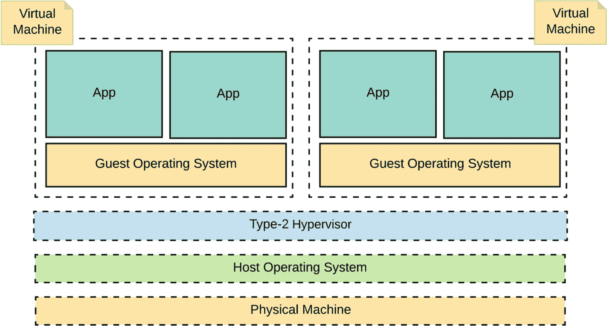
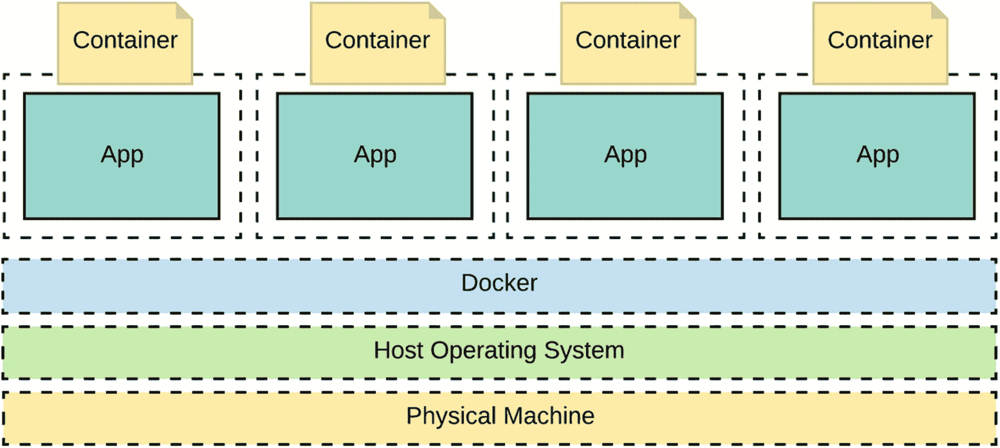
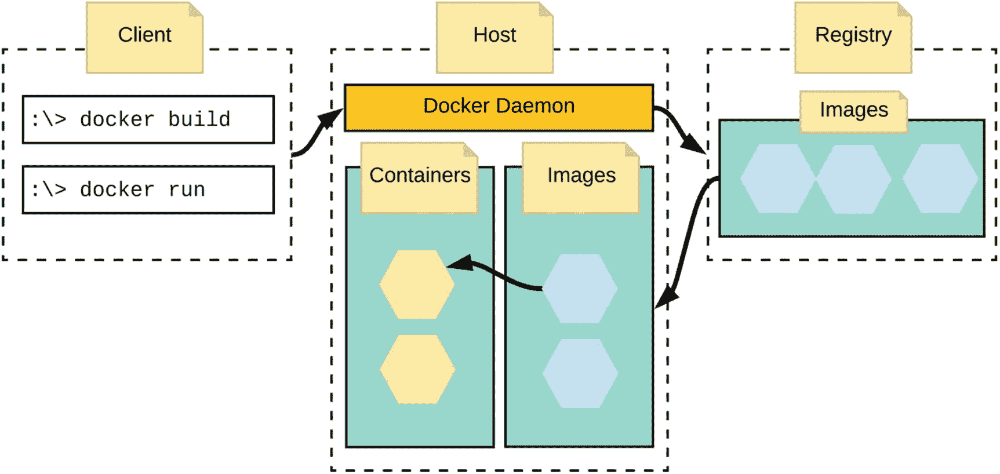
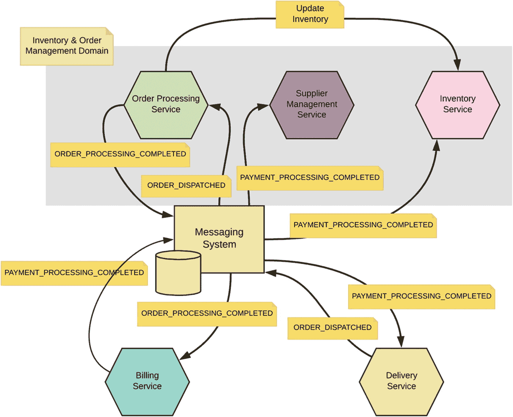
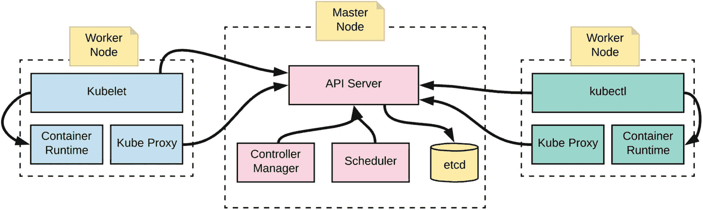
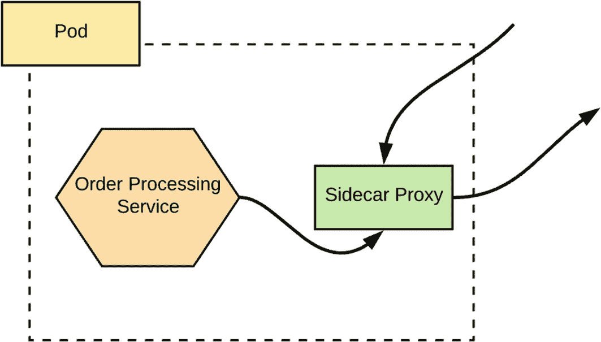
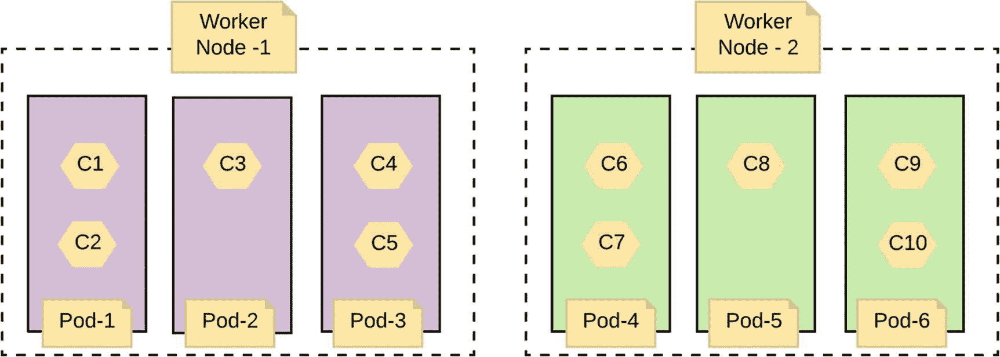
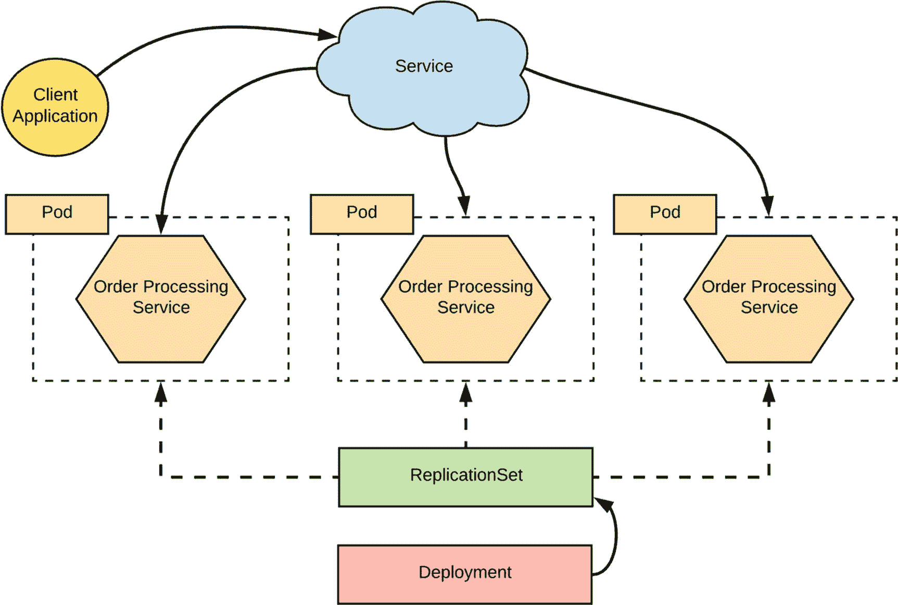
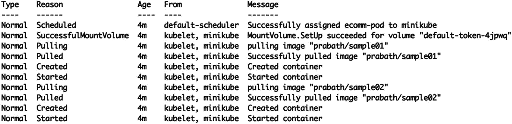

# 8. 部署与运行微服务

微服务架构的两大主要目标是快速上线和应用的演进能力。与单体应用不同，微服务的部署包含众多独立部署的个体。我们不再面对单一部署，而是成百上千个部署。如果没有自动化构建系统，管理这样的部署将是一场噩梦。自动化构建系统有助于简化部署流程，但无法解决大规模部署中的所有问题。我们还需要关注微服务及其所有依赖项的可移植性，确保开发者测试的环境与测试环境和生产环境保持一致。这有助于在开发周期早期发现任何问题，从而将生产环境中出现问题的可能性降至最低。本章将讨论不同的微服务部署模式、容器、容器编排、容器原生微服务框架，最后介绍持续交付。

## 容器与微服务

容器的主要目标是为其运行的应用程序提供容器化环境。容器化环境是一种隔离环境。一个或多个容器可以运行在同一台物理主机上，但一个容器无法感知其他容器中运行的进程。例如，如果你在容器中运行微服务，它拥有自己独立的文件系统、网络接口、进程和主机名视图。假设一个名为 *foo* 的微服务运行在 *foo* 容器中，它可以通过主机名 *localhost* 引用同一容器中的任何其他服务；而另一个名为 *bar* 的微服务运行在 *bar* 容器中，同样可以通过主机名 *localhost* 引用同一容器中的任何其他服务，尽管 *foo* 和 *bar* 容器都运行在同一台主机上^(¹⁰⁴)。

容器的概念在几年前因 Docker 而流行起来，但它有着悠久的历史。1979 年，UNIX V7 引入了 `chroot` 系统调用，用户能够更改运行进程的根目录，使其无法访问根目录之外的文件系统任何部分。1982 年，该功能被添加到 BSD 中，时至今日，`chroot` 仍被系统管理员视为在非容器化环境中运行任何进程时的最佳实践。二十多年后的 2000 年，FreeBSD 引入了一个名为 FreeBSD Jails 的新概念。通过 Jails，同一主机环境可以被划分为多个隔离环境，每个环境可以拥有自己的 IP 地址。2001 年，Linux VServer 引入了类似 FreeBSD Jails 的概念。通过 Linux VServer，主机环境可以按文件系统、网络和内存进行分区。Sun 公司在 2004 年推出了 Solaris Containers，引入了另一种进程隔离的变体。谷歌在 2006 年推出了 Process Containers，旨在对 CPU、磁盘 I/O、内存和网络进行隔离。一年后，该技术更名为控制组（control groups），并合并到 Linux 内核 2.6.24 中。

Linux 的 *cgroups* 和 *namespaces* 是我们今天所看到的容器的基础。2008 年，LXC（Linux Containers）利用 cgroups 和 namespaces 实现了 Linux 容器管理器。2011 年，CloudFoundry 推出了基于 LXC 的容器实现，名为 Warden，但后来改为自己的实现。Docker 诞生于 2013 年，与 Warden 一样，它也是基于 LXC 构建的。Docker 使容器技术变得更加易用，在接下来的章节中，我们将详细讨论 Docker。

### Docker 简介

如前所述，Docker 提供的容器化技术建立在 Linux 控制组和命名空间之上。Linux 命名空间通过让每个进程拥有独立的系统视图（包括文件、进程、网络接口、主机名等）来构建隔离。控制组（也称为 *cgroups*）则限制每个进程可以消耗的资源数量。这两者的结合可以在同一台主机上构建一个隔离环境，共享相同的 CPU、内存、网络和文件系统，而互不影响。

Docker 引入的隔离级别与我们在虚拟机中看到的截然不同。在 Docker 流行之前，虚拟机被用来复制相似的操作环境及其所有依赖项。如果你真的做过这件事，大概能体会到其中的痛苦！虚拟机镜像非常庞大。它打包了从操作系统到应用级二进制依赖项的所有内容。可移植性是一个主要问题。图 8-1 展示了虚拟机如何创建隔离。



图 8-1

使用类型 2 虚拟机监控程序的高级虚拟机架构

虚拟机运行在虚拟机监控程序上。虚拟机监控程序有两种类型。类型 1 虚拟机监控程序不需要宿主操作系统，而类型 2 虚拟机监控程序则运行在宿主操作系统之上。每个虚拟机都自带自己的操作系统。要在同一台宿主操作系统上运行多个虚拟机，你需要一台性能强大、配置高的计算机。为每个微服务使用一个虚拟机来构建隔离环境，既大材小用又浪费资源。如果你熟悉虚拟机，可以将容器视为轻量级的虚拟机。每个容器都提供一个隔离环境，但它们与宿主机共享相同的操作系统内核。图 8-2 展示了容器如何创建隔离。



图 8-2

在同一台宿主操作系统上运行多个容器

与虚拟机不同，部署在同一台宿主机上的所有容器共享相同的操作系统内核。它实际上是一个隔离的进程。启动一个容器时，无需承担启动操作系统的开销；只需运行容器内的应用程序即可。此外，由于容器不打包操作系统，你可以在同一台宿主机上运行许多容器。这些是选择容器作为部署和分发微服务最流行方式的关键驱动力。

Docker 在 Linux 内核自带的控制组和命名空间之上构建了进程隔离。即使没有 Docker，我们仍然可以使用 Linux 内核实现同样的功能。那么，为什么 Docker 会成为最流行的容器技术呢？除了进程隔离之外，Docker 还增加了若干新特性，使其对开发者社区更具吸引力。这些特性包括：使容器可移植、围绕 Docker Hub 构建生态系统、提供用于容器管理的 API 并围绕其构建工具、以及使容器镜像可复用。本章将详细讨论这些特性。


#### 安装 Docker

Docker 采用客户端-服务器架构模型，包含一个 Docker 客户端和一个 Docker 主机（也称为 *Docker 引擎*）。当你在本地机器上安装 Docker 时，客户端和主机会同时被安装。所有基于不同平台安装 Docker 的说明都可以在 Docker 官网找到^(¹⁰⁵)。在本书撰写时，Docker 支持 MacOS、Windows、CentOS、Debian、Fedora 和 Ubuntu 系统。以下命令可用于测试 Docker 是否安装成功。如果安装成功，该命令将返回相关的系统信息。

```
:\> docker info
```

以下命令将返回 Docker 客户端和引擎的版本信息。

```
:\> docker version
Client:
Version: 18.03.1-ce
API version: 1.37
Go version: go1.9.5
Git commit: 9ee9f40
Built: Thu Apr 26 07:13:02 2018
OS/Arch: darwin/amd64
Experimental: false
Orchestrator: swarm
Server:
Engine:
Version: 18.03.1-ce
API version: 1.37 (minimum version 1.08)
Go version: go1.9.5
Git commit: 9ee9f40
Built: Thu Apr 26 07:22:38 2018
OS/Arch: linux/amd64
Experimental: true
```

#### Docker 架构

图 8-3 展示了 Docker 的高层架构，其中包括 Docker 客户端、Docker 主机（或引擎）以及镜像仓库。Docker 客户端是我们将要与之交互的命令行工具。运行在 Docker 主机上的 Docker 守护进程会监听来自客户端的请求并做出相应处理。客户端可以通过 REST API、UNIX 套接字或网络接口与守护进程通信。在接下来的章节中，我们将详细解释通信的具体方式以及事件的执行顺序。



图 8-3
Docker 高层架构

#### Docker 镜像

Docker 镜像是一个包含你的微服务（或应用程序）及其所有依赖项的软件包。你的应用程序只能看到打包在 Docker 镜像中的依赖项。你可以为镜像定义文件系统，该文件系统无法访问主机的文件系统。Docker 镜像通过 Dockerfile 创建。Dockerfile 定义了构建 Docker 镜像所需的所有依赖项。

### 注意

对于希望深入探索 Docker 概念的读者，我们建议查阅 Docker 官方文档^(¹⁰⁶)。

以下代码展示了一个示例 Dockerfile 的内容。第一行表示使用名为 `openjdk:8-jdk-alpine` 的基础镜像开始构建这个新镜像。当我们使用 Docker 提供的工具从这个 Dockerfile 构建 Docker 镜像时，它会首先加载 `openjdk:8-jdk-alpine` 镜像。Docker 引擎会先检查该镜像是否存在于本地镜像仓库中，如果没有，则会从远程仓库（例如 Docker Hub）加载。此外，如果 `openjdk:8-jdk-alpine` 镜像依赖于其他 Docker 镜像，这些依赖镜像也会被拉取并存储在本地仓库中。

```
FROM openjdk:8-jdk-alpine
ADD target/sample01-1.0.0.jar /sample01-1.0.0.jar
ENTRYPOINT ["java", "-jar", "sample01-1.0.0.jar"]
```

第二行表示将 `sample01-1.0.0.jar` 从当前文件系统位置下的 `target` 目录（这实际上是我们的主机文件系统，用于创建 Docker 镜像）复制到我们要创建的镜像的文件系统根目录。第三行定义了入口点，即当有人运行此 Docker 镜像时要执行的命令。

要基于 Dockerfile 构建 Docker 镜像，我们使用以下命令*。* 本章后面会详细介绍，你现在无需尝试。此命令将生成一个 Docker 镜像，默认情况下，它会存储在本地镜像仓库中。这实际上就是 Docker 客户端。一旦我们执行该命令，运行在 Docker 引擎上的 Docker 守护进程将确保所有依赖镜像都被加载到本地，并创建新的镜像。

```
:\> docker build -t sample01 .
```

#### Docker 镜像仓库

如果你熟悉 Maven，你可能已经了解 Maven 仓库的工作原理。Docker 镜像仓库遵循类似的概念。Docker 镜像仓库是存储 Docker 镜像的仓库。它们在不同层级上运行。Docker Hub 是一个公共的 Docker 镜像仓库，任何人都可以推送和拉取镜像。在本章后面，我们将解释如何向 Docker Hub 发布镜像以及从中检索镜像。拥有一个集中式的镜像仓库有助于共享和复用镜像。这也正成为一种流行的软件分发方式。如果你的组织需要仅限员工使用的受限 Docker 镜像仓库，这也是可以实现的。

以下命令将列出存储在本地机器上的所有 Docker 镜像。这包括你在本地构建的所有镜像以及从 Docker 镜像仓库拉取的镜像。

```
:\> docker image ls
```

以下命令将列出主机上所有可用的容器及其状态。在下一节中，我们将讨论镜像和容器之间的区别。

```
:\> docker ps
```

#### 容器

容器是 Docker 镜像的一个运行实例。实际上，当镜像在 Docker 引擎上运行时，它们就变成了容器。你的本地机器上可以有许多镜像，但除非你明确让它们运行，否则它们不会一直运行。容器实际上是一个由命名空间和控制组定义的常规 Linux 容器。我们使用以下命令从 Docker 镜像启动一个 Docker 容器。这里，`sample01` 是镜像名称。此命令会首先检查 `sample01` 镜像以及所有其他基础镜像是否在本地 Docker 镜像仓库中，如果没有，它将从远程仓库拉取所有缺失的镜像。最后，一旦所有镜像就绪，容器将启动并执行在相应 Dockerfile 中设置为 `ENTRYPOINT` 的程序或命令。

```
:\> docker run sample01
```

### 使用 Docker 部署微服务

在本节中，我们将了解如何创建一个包含微服务的 Docker 镜像，运行它，并最终将其发布到 Docker Hub。首先，我们需要让微服务在本地运行。从本书的 Git 仓库下载所有示例后，你可以在 `ch08/sample01` 目录中找到与此示例相关的源代码。让我们在 `ch08/sample01` 目录下使用以下命令构建示例。

```
:\> mvn clean install
```

这将生成 `target/sample01-1.0.0.jar` 文件。这就是我们的微服务，现在我们需要用它创建一个 Docker 镜像。

### 注意

要运行本章的示例，你需要 Java 8 或更高版本、Maven 3.2 或更高版本以及一个 Git 客户端。成功安装这些工具后，你需要克隆 Git 仓库：[`https://github.com/microservices-for-enterprise/samples.git`](https://github.com/microservices-for-enterprise/samples.git) 。本章的示例位于 `ch08` 目录中。

`:\> git clone` [`https://github.com/microservices-for-enterprise/samples.git`](https://github.com/microservices-for-enterprise/samples.git)


#### 使用微服务创建 Docker 镜像

要创建 Docker 镜像，首先需要创建一个 Dockerfile。正如我们在前几节中讨论的，该文件定义了所有其他依赖镜像、其他二进制依赖项以及启动微服务的命令。以下代码列出了在 `ch08/sample01` 目录中创建的 Dockerfile 的内容。由于我们使用 Spring Boot 构建微服务，因此镜像中需要包含 Java。有两种选择。一种是从头开始获取 Java 二进制文件并将其安装到镜像中，另一种方法是找到一个已存在 Java 环境的 Docker 容器并复用。第二种方法是推荐的方法，我们在此使用。我们使用 `openjdk:8-jdk-alpine` 作为基础镜像，该镜像将在我们构建镜像时从 Docker Hub 拉取。

```
FROM openjdk:8-jdk-alpine
ADD target/sample01-1.0.0.jar /sample01-1.0.0.jar
ENTRYPOINT ["java", "-jar", "sample01-1.0.0.jar"]
```

让我们使用 `ch08/sample01` 目录中的以下命令来构建一个名为（命令中的 `-t`）`sample01` 的 Docker 镜像。如果您尚未将 `openjdk:8-jdk-alpine` 镜像加载到 Docker 引擎中，您看到的输出可能与这里显示的略有不同。

```
:\> docker build -t sample01 .
Sending build context to Docker daemon 17.45MB
Step 1/3: FROM openjdk:8-jdk-alpine
---> 83621aae5e20
Step 2/3: ADD target/sample01-1.0.0.jar /sample01-1.0.0.jar
---> f3448272e3a9
Step 3/3: ENTRYPOINT ["java", "-jar", "sample01-1.0.0.jar"]
---> Running in ec9a9f91c950
Removing intermediate container ec9a9f91c950
---> 35188a2bfb00
Successfully built 35188a2bfb00
Successfully tagged sample01:latest
```

从这个输出中可以学到一件重要的事情。你可以看到 Docker 引擎分三步执行操作。Dockerfile 中的每一行都对应一个步骤。Docker 将镜像构建为层。此操作中的每一步都会创建一个层。这些层是只读的，并且可以在多个容器之间复用。在本章后面，当我们更好地理解容器的行为后，再来重新审视这个概念。

要列出 Docker 引擎中的所有镜像，我们可以使用以下命令。

```
:\> docker image ls
```

#### 将微服务作为 Docker 容器运行

一旦我们有了微服务的 Docker 镜像，就可以使用以下命令来启动一个 Docker 容器。

```
:\> docker run -p 9000:9000 sample01
```

此命令指示 Docker 引擎从 `sample01` 镜像启动一个新的 Docker 容器，并将主机的 9000 端口映射到 Docker 容器的 9000 端口。我们这里选择 9000，因为容器中的微服务在 9000 端口上启动。除非我们将容器端口映射到主机端口，否则我们将无法与在容器中运行的微服务进行通信。

运行此命令时，您可以看到容器中运行的微服务的输出会打印在主机的控制台上。并且，如果您使用 Ctrl+C，它将终止容器。这是因为，按照我们执行此命令的方式，容器已附加到主机的终端。通过在 `docker run` 命令中使用 `-d` 选项，我们可以将容器与主机终端分离。这将返回与我们刚刚启动的容器相对应的容器 ID。

```
:\> docker run -d -p 9000:9000 sample01
9a5cd90b714fc5a27281f94622c1a0d8f1dd1a344f4f4fcc6609413db39de000
```

要测试在容器中运行的微服务，请在主机上使用以下命令。

```
:\> curl http://localhost:9000/order/11
{"customer_id":"101021","order_id":"11","payment_method":{"card_type":"VISA","expiration":"01/22","name":"John Doe","billing_address":"201, 1st Street, San Jose, CA"},"items":[{"code":"101","qty":1},{"code":"103","qty":5}],"shipping_address":"201, 1st Street, San Jose, CA"}>
```

### 提示

如果我们想查看 Docker 引擎上运行的所有容器，可以使用 `docker ps` 命令。要停止正在运行的容器，需要使用 `docker stop <container id>` 命令。另外，如果您想删除一个容器，请使用 `docker rm <container id>` 命令。删除容器后，您可以使用 `docker rmi <image name>` 命令从本地注册表中删除相应的 Docker 镜像。

#### 将 Docker 镜像发布到 Docker Hub

Docker Hub 是一个公共的 Docker 注册表，任何人都可以推送和拉取 Docker 镜像。首先，我们需要从 [`https://hub.docker.com/`](https://hub.docker.com/) 创建一个 Docker ID。例如，在下面的示例中，我们使用 Docker ID `prabath`。创建带有密码的 Docker ID 后，使用以下命令将您的 Docker ID 注册到本地运行的 Docker 客户端。

```
:\> docker login --username=prabath
```

此命令将提示您输入密码，Docker 客户端会将您的凭据存储在钥匙串中。接下来，使用以下命令查找我们之前创建的 Docker 镜像的镜像 ID，并复制与 `sample01` 镜像对应的 `IMAGE ID` 字段的值；例如，`35188a2bfb00`。

```
:\> docker images
```

现在，我们需要使用 Docker Hub 中的 Docker ID 为我们的镜像打标签，如下面的命令所示。打标签有助于为镜像创建更有意义的名称，并且由于我们计划将此镜像发布到 Docker Hub，请确保标签遵循以您的 Docker Hub 帐户名开头的约定。您需要将 `prabath` 替换为您的 Docker Hub 帐户名。

```
:\> docker tag 35188a2bfb00 prabath/sample01
```

最后，使用以下命令将镜像推送到 Docker Hub，发布后它应该会出现在您的 Docker Hub 帐户下。

```
:\> docker push prabath/sample01
```

现在，任何人都可以使用以下命令从任何地方拉取此镜像。

```
:\> docker pull prabath/sample01
```

### Docker Compose

在实践中，微服务部署中通常有多个服务，每个服务都有自己的容器。例如，在图 8-4 中，`订单处理` 微服务与 `库存` 微服务通信。此外，还可能存在一个微服务依赖于其他服务（如数据库）的情况。数据库将是另一个容器，但仍然属于同一个应用程序。Docker Compose 有助于定义和管理此类多容器环境。它是除了 Docker 客户端和 Docker 引擎（主机）之外，我们必须安装的另一个工具。


### 说明

Compose 是一款用于定义和运行多容器 Docker 应用的工具。使用 Compose 时，你可以通过一个 YAML 文件来配置应用的服务。然后，只需一条命令，就能根据配置创建并启动所有服务^(¹⁰⁷)。更多详情可参考 Docker 文档^(¹⁰⁸)。操作起来相当简单。



图 8-4

多容器微服务部署

Docker Compose 使用一个 YAML 文件来定义应用的配置。以下是一个名为 `docker-compose.yml` 的 YAML 文件示例，它启动了 `Order Processing(sample01)` 和 `Inventory(sample02)` 这两个微服务。你可以在 `ch08/sample02` 目录中找到完整的文件。

```
version: '3.3'
services:
inventory:
image: sample02
ports:
- "9090:9090"
restart: always
orderprocessing:
image: sample01
restart: always
ports:
- "9000:9000"
depends_on:
- inventory
```

这里我们定义了两个服务：`inventory` 和 `orderprocessing`。每个服务下的 `ports` 标签定义了端口转发规则（我们之前讨论过）。`image` 标签指向 Docker 镜像。`orderprocessing` 下定义的 `depends_on` 标签表明它依赖于 `inventory` 服务。你可以在 `depends_on` 标签下定义多个服务。最后，你可能注意到两个服务下的 `restart` 标签值都设置为 `always`，这指示 Docker 引擎在服务宕机时始终重启它们。

#### 为库存微服务构建 Docker 镜像

我们已经有了 `Order Processing` 微服务的 Docker 镜像。现在为 `Inventory` 微服务再创建一个。要创建 Docker 镜像，首先需要创建一个 Dockerfile。正如我们在前几节中讨论的，这个文件定义了所有其他依赖镜像、其他二进制依赖项以及启动微服务的命令。以下列出了在 `ch08/sample02` 目录中创建的 Dockerfile 的内容。

```
FROM openjdk:8-jdk-alpine
ADD target/sample02-1.0.0.jar /sample02-1.0.0.jar
ENTRYPOINT ["java", "-jar", "sample02-1.0.0.jar"]
```

让我们使用以下命令从 `ch08/sample02` 目录构建名为 `sample02` 的 Docker 镜像。在运行此命令之前，请确保你已经使用 Maven 构建了示例。

```
:\> docker build -t sample02 .
```

现在，让我们将此镜像推送到 Docker Hub。对于这个示例来说，这可能没什么用，但在本书后面，我们将直接从 Docker Hub 引用镜像。使用以下命令查找我们之前创建的 Docker 镜像的镜像 ID，并复制与 `sample02` 镜像对应的 `IMAGE ID` 字段的值；例如，`35199a2bfb00`。

```
:\> docker images
```

现在，我们需要像以下命令所示，使用 Docker Hub 中的 Docker ID 为我们的镜像打标签。最后，使用以下命令将镜像推送到 Docker Hub，发布后它应该会出现在你的 Docker Hub 账户下。同时，在执行 `docker push` 命令之前，请确保你已经使用 `docker login` 命令登录到 Docker Hub。

```
:\> docker tag 35199a2bfb00 prabath/sample02
:\> docker push prabath/sample02
```

如果你已经在运行 `Order Processing` 微服务，请停止正在运行的容器。要查找 Docker 主机中运行的所有容器，请使用以下命令，它将返回所有容器的容器 ID。找到与 `sample01` 镜像相关的容器 ID（例如 `e1039667db1a`）。

```
:\> docker ps
```

要移除一个正在运行的容器，我们必须先停止它，然后再移除。

```
:\> docker container stop e1039667db1a
:\> docker container rm e1039667db1a
```

#### 使用 Docker Compose 启动应用

我们已经准备好使用 Docker Compose 启动应用了。从 `ch08/sample02` 目录运行以下命令。这是我们之前创建 `docker-compose.yml` 文件的地方。

```
:\> docker-compose up
```

由于我们在这里以附加模式（不带 `–d` 参数）启动 `docker-compose`，你将能够在终端上看到两个容器的输出。你还会注意到，来自两个微服务的每条日志都带有 `docker-compose.yml` 文件中定义的相应服务名称的标签。

#### 使用 cURL 测试应用

现在，我们所有的微服务都在 Docker Compose 下运行。让我们首先尝试使用以下 cURL 命令测试 `Order Processing` 微服务。此调用仅访问 `Order Processing` 微服务并返回结果。

```
:\> curl http://localhost:9000/order/11
{"customer_id":"101021","order_id":"11","payment_method":{"card_type":"VISA","expiration":"01/22","name":"John Doe","billing_address":"201, 1st Street, San Jose, CA"},"items":[{"code":"101","qty":1},{"code":"103","qty":5}],"shipping_address":"201, 1st Street, San Jose, CA"}>
```

让我们尝试另一个请求，该请求发送到 `Order Processing` 微服务，同时也会调用 `Inventory` 微服务。请求先到达 `Order Processing` 微服务，然后它再调用 `Inventory` 微服务。这里我们向 `Order Processing` 微服务发送一个 JSON 请求。

```
:\> curl -v -H "Content-Type: application/json" -d '{"customer_id":"101021","payment_method":{"card_type":"VISA","expiration":"01/22","name":"John Doe","billing_address":"201, 1st Street, San Jose, CA"},"items":[{"code":"101","qty":1},{"code":"103","qty":5}],"shipping_address":"201, 1st Street, San Jose, CA"}' http://localhost:9000/order
```

现在，如果你查看连接到两个容器的终端，将会看到以下输出，这确认了请求已经到达了 `Inventory` 微服务。

```
inventory_1 | 101
inventory_1 | 103
```

#### 容器之间如何通信？

要了解在我们的上一个示例中两个微服务是如何精确连接的，我们需要查看 `Order Processing` 微服务的源代码，该代码位于 `ch08/sample01/ src/main/java/com/apress/ch08/sample01/service/OrderProcessing.java`。在那里你可以看到，我们使用的是 Inventory 微服务的服务名称（如 `docker-compose.yml` 中所定义），而不是 IP 地址或主机名：`http://inventory:9090/inventory`。

```
@RequestMapping(method = RequestMethod.POST)
public ResponseEntity createOrder(@RequestBody Order order) {
if (order != null) {
RestTemplate restTemplate = new RestTemplate();
URI uri = URI.create(
"http://inventory:9090/inventory");
restTemplate.put(uri, order.getItems());
order.setOrderId(UUID.randomUUID().toString());
URI location = ServletUriComponentsBuilder
.fromCurrentRequest().path("/{id}")
.buildAndExpand(order.getOrderId())
.toUri();
return ResponseEntity.created(location).build();
}
return ResponseEntity.status(
HttpStatus.BAD_REQUEST).build();
}
```

### 说明

默认情况下，Compose 会为你的应用设置一个单一网络。每个服务的容器都会加入默认网络，该网络上的其他容器既可以访问它们，也可以通过与其容器名称相同的主机名发现它们^(¹⁰⁹)。


## 容器编排

容器和 Docker 极大地减轻了微服务开发中的大部分痛点。如果没有 Docker，微服务今天可能不会如此流行。然而，容器只解决了大规模微服务部署中的一部分问题。如何管理容器从创建到终止的整个生命周期？如何调度容器在网络中不同的物理机上运行，跟踪其运行状态，并在给定集群的多个容器之间进行负载均衡？如何自动扩展容器以满足不断变化的请求或负载？这些都是容器编排框架所要解决的问题。Kubernetes 和 Apache Mesos 是最流行的容器编排框架。在本章中，我们只关注 Kubernetes。

### Kubernetes 简介

简而言之，Docker 抽象了机器（或计算机），而 Kubernetes 抽象了网络。谷歌于 2014 年将 Kubernetes 作为开源项目向公众推出。在 Kubernetes 之前，谷歌多年来一直致力于一个名为 Borg 的项目，以帮助其内部开发人员和系统管理员管理部署在大型数据中心上的数千个应用程序/服务。Kubernetes 是 Borg 的下一代产品。

Kubernetes 让你能够轻松地将运行在容器中的任何类型的应用程序部署并扩展到数千个节点。例如，在部署描述文件（Kubernetes 可识别）中，你可以指定需要运行多少个`订单处理`微服务的实例。

#### Kubernetes 架构

与 Docker 一样，Kubernetes 也采用基于客户端-服务器的架构。有一个 Kubernetes 主节点和一组与之连接的工作节点。主节点也称为 Kubernetes 控制平面，它控制整个 Kubernetes 集群。Kubernetes 控制平面包含四个主要组件：API 服务器、调度器、控制器管理器和 etcd。API 服务器向所有工作节点以及控制平面内的其他组件公开一组 API。调度器为应用程序的每个部署单元分配一个工作节点。应用程序实际上运行在工作节点上。



图 8-5

高级 Kubernetes 架构（一个 Kubernetes 集群）

控制器管理器负责管理和跟踪 Kubernetes 部署中的所有节点。它确保组件被正确复制和自动扩展，优雅地处理故障，并执行许多其他任务。`etcd`是一个高可用、一致性的数据存储，用于存储 Kubernetes 集群配置。

一个工作节点包含三个组件：kubelet、容器运行时和 kube-proxy。容器运行时可以基于 Docker 或 rkt。尽管 Kubernetes 容器运行时最初与 Docker 和 rkt 绑定，但现在可以通过容器运行时接口（CRI）扩展以支持任何基于开放容器倡议（OCI）的容器运行时。kubelet 的职责是通过与主节点上运行的 API 服务器通信来管理节点。它运行在每个工作节点上，并作为主节点的节点代理。Kube-proxy 或 Kubernetes 网络代理执行简单的 TCP 和 UDP 流转发，或在一组后端之间进行轮询的 TCP 和 UDP 转发。

#### 安装 Kubectl

Kubernetes 主节点可以运行在任何地方。要与主节点交互，我们需要在本地机器上安装 kubectl。kubectl 的安装说明可在[`https://kubernetes.io/docs/tasks/tools/install-kubectl/`](https://kubernetes.io/docs/tasks/tools/install-kubectl/)找到。请确保 kubectl 的版本与你的集群的次版本号相差不超过一个。

#### 安装 Minikube

Minikube 是在本地机器上开始使用 Kubernetes 的最佳方式。与生产环境的 Kubernetes 集群不同，Minikube 仅支持单节点 Kubernetes 集群。在本章中，我们使用 Minikube 来搭建一个 Kubernetes 集群。Minikube 的安装详情可在[`https://kubernetes.io/docs/tasks/tools/install-minikube/`](https://kubernetes.io/docs/tasks/tools/install-minikube/)找到。你永远不会在生产环境中使用 Minikube，但通过 Minikube 学到的 Kubernetes 概念在任何类型的 Kubernetes 发行版中仍然有效。

#### 测试 Kubernetes 设置

在本地机器上安装好 kubectl 和 Minikube 后，我们需要使用以下命令启动 Minikube 服务器。

```
:\> minikube start
minikube config set WantUpdateNotification false
Starting local Kubernetes v1.9.0 cluster...
Starting VM...
Getting VM IP address...
Moving files into cluster...
Setting up certs...
Connecting to cluster...
Setting up kubeconfig...
Starting cluster components...
Kubectl is now configured to use the cluster.
Loading cached images from config file.
```

Minikube 启动后，运行以下命令来验证 kubectl 与 Kubernetes 集群之间的通信。这将打印 kubectl 客户端和 Kubernetes 集群的版本信息。

```
:\> kubectl version
Client Version: version.Info{Major:"1", Minor:"11", GitVersion:"v1.11.0", GitCommit:"91e7b4fd31fcd3d5f436da26c980becec37ceefe", GitTreeState:"clean", BuildDate:"2018-06-27T22:30:22Z", GoVersion:"go1.10.3", Compiler:"gc", Platform:"darwin/amd64"}
Server Version: version.Info{Major:"", Minor:"", GitVersion:"v1.9.0", GitCommit:"925c127ec6b946659ad0fd596fa959be43f0cc05", GitTreeState:"clean", BuildDate:"2018-01-26T19:04:38Z", GoVersion:"go1.9.1", Compiler:"gc", Platform:"linux/amd64"}
```

此外，通过以下命令，我们可以确定 Kubernetes 集群的运行位置。

```
:\> kubectl cluster-info
Kubernetes master is running at https://192.168.99.100:8443
```

现在我们可以使用以下命令查看 Kubernetes 集群中的所有节点。由于我们运行的是 Minikube，你只会看到一个节点。

```
:\> kubectl get nodes
NAME       STATUS    ROLES     AGE       VERSION
minikube   Ready         24d       v1.9.0
```

要查找有关特定节点的更多详细信息，请使用以下命令。这将返回与该节点相关的大量元数据。

```
:\> kubectl describe nodes minikube
```

### Kubernetes 核心概念

在本节中，我们将讨论与 Kubernetes 相关的基本概念。在此之前，我们先来看看 Kubernetes 是如何与容器协同工作的。

在进行 Kubernetes 部署之前，我们需要做的第一件事是将应用程序识别并打包成容器镜像，这样在运行时，每个应用程序都将拥有自己独立的容器。然后，我们需要确定如何对这些容器进行分组。例如，有些微服务可能始终一起运行，并且只有一个微服务向外部暴露功能。在其他所有情况下，微服务之间的通信都是内部的。另一个例子是，我们有一个作为容器的数据库，它只被一个微服务使用。在这种情况下，我们可以将数据库容器和相应的微服务分组在一起。当然，有人可能会认为这是一种反模式。我们并不反对。让我们在 Kubernetes 的上下文中定义了 Pod 这个术语之后，再来重新审视我们的例子。


#### Pod

在 Kubernetes 中，我们将一组容器称为一个 Pod。*Pod* 是 Kubernetes 中最小的部署单元。你不能直接部署容器。首先需要将一个或多个容器组合成一个 Pod。由于 Pod 是 Kubernetes 中最小的部署单元，因此只能对 Pod 进行扩缩容，而不能对容器进行扩缩容。换句话说，组合成一个 Pod 的所有容器必须具有相同的扩缩容需求。回顾之前的例子，如果一组微服务具有相同的扩缩容需求，你可以将它们组合在一个 Pod 中。但将微服务和数据库组合在一个 Pod 中并不是理想的用例。通常，数据库与微服务具有不同的扩缩容需求。

Pod 的一个常见用例是让微服务自身带有一个 Sidecar 代理（见图 8-6）。在这里，所有进出微服务的请求都通过该代理。这种模型将在第 9 章“服务网格”中详细讨论。



图 8-6

将一组服务组合成一个 Pod

尽管一个 Pod 可以包含多个容器，但它们共享相同的网络接口和存储。Pod 内的容器可以使用 `localhost` 作为主机名相互通信，并且默认情况下，所有服务都不会暴露在 Pod 外部。此外，由于同一 Pod 中的所有容器共享相同的网络接口，因此不能有两个容器在同一个端口上启动服务。在将 Pod 调度到工作节点时，Kubernetes 会确保同一 Pod 中的所有容器被调度到同一台物理机器上运行（见图 8-7）。



图 8-7

同一 Pod 中的容器被调度到同一台物理机器上运行

#### 创建 Pod

让我们看看下面的部署描述文件，它用于创建一个包含 `Order Processing` 微服务和 `Inventory` 微服务的 Pod。这里我们首先将 `kind` 属性的值设置为 `Pod`，然后在 `spec` 属性下，定义需要组合到这个 Pod 中的镜像集合。

### 重要说明

这里我们假设 `Order Processing` 和 `Inventory` 微服务都适合放在一个 Pod 中，并且它们具有相同的扩缩容需求。这仅仅是我们为了使示例更直接并解释概念而做出的假设。

```
apiVersion: v1
kind: Pod
metadata:
name: ecomm-pod
labels:
app: ecommapp
spec:
containers:
- name: orderprocessing
image: prabath/sample04
ports:
- containerPort : 9000
- name: inventory
image: prabath/sample02
ports:
- containerPort : 9090
```

一旦应用程序开发人员编写好部署描述文件，他们就会通过 API 服务器使用 kubectl 将其输入到 Kubernetes 控制平面。然后调度器会将 Pod 调度到工作节点上，相应的容器运行时会从 Docker 仓库拉取容器镜像。

### 注意

在 Kubernetes 部署描述文件中，我们指向的是 `Order Processing` 微服务（与我们之前讨论的相比）的一个略微修改的版本，称为 `sample04`，而不是 `sample01`。

#### ReplicaSet

当你在 Kubernetes 环境中部署一个 Pod 时，你可以指定希望始终保持运行的给定 Pod 的实例数量。可能还有许多其他的扩缩容需求，我们将在本章后面通过示例进行讨论。ReplicaSet^(¹¹⁰) 负责监控正在运行的 Pod 数量，并确保维持预期的数量。如果某个 Pod 因故宕机，ReplicaSet 将确保启动一个新的 Pod。本章后面将解释 ReplicaSet 的工作原理。

#### Service

从某种意义上说，Kubernetes 中的 Service^(¹¹¹) 是提供相同功能的一组 Pod。这些 Pod 实际上是同一个 Pod 的不同实例。例如，你可能运行同一个 `Order Processing` 微服务的五个实例作为五个 Pod 来应对高流量。这些 Pod 通过一个 Service 暴露给外部世界。Service 拥有自己的 IP 地址和端口，在其生命周期内不会改变，并且它知道如何将流量路由到所连接的 Pod。微服务的客户端应用程序无需担心直接与 Pod 通信，而是与 Service 通信。同时，基于扩缩容需求或其他原因，Pod 可能会启动和关闭。每当 Pod 启动和关闭时，它可能会携带不同的 IP 地址，这使得客户端应用程序很难与 Pod 建立连接。Kubernetes 中的 Service 解决了这个问题。本章后面有一个示例演示了如何在 Kubernetes 中创建 Service。

#### Deployment

Deployment^(¹¹²) 是一个更高级别的构造，可用于在 Kubernetes 环境中部署和管理应用程序。它使用 ReplicaSet（这是一个较低级别的构造）来创建 Pod。我们将在本章后面讨论如何使用 Deployment 构造。

图 8-8 说明了 Pod、Service、ReplicaSet 和 Deployment 之间的关系。



图 8-8

Pod、Service、ReplicaSet 和 Deployment

### 在 Kubernetes 环境中部署微服务

在本节中，我们将了解如何创建一个包含两个微服务的 Pod，并使用 cURL 从宿主机调用其中一个微服务，同时这两个微服务在同一个 Pod 内相互通信。

#### 使用 YAML 文件创建 Pod

我们需要做的第一件事是为我们的 Pod 编写一个部署描述文件。这与我们在上一节中讨论的 YAML 文件相同。在那里，我们创建了一个名为 `ecomm-pod` 的 Pod，其中包含两个容器镜像：`prabath/sample04` 和 `prabath/sample02`。在本章前面，我们创建了这两个镜像并推送到了 Docker Hub（`sample04` 是 `sample01` 的一个略微修改的版本）。YAML 配置中的每个容器都定义了微服务运行的端口。例如，`Order Processing` 微服务运行在 HTTP 端口 9000 上，而 `Inventory` 微服务运行在 HTTP 端口 9090 上。你可以在 `ch08/sample03` 目录中找到完整的 YAML 文件（`ecomm-pod.yml`）。要使用此 YAML 配置创建 Pod，请从 `ch08/sample03` 目录运行以下命令。

```
:\> kubectl create -f ecomm-pod.yml
pod/ecomm-pod created
```

如果 Pod 创建成功，以下命令应返回 Pod 的状态。

```
:\> kubectl get pods
NAME        READY     STATUS    RESTARTS   AGE
ecomm-pod   2/2       Running   0          1m
```

第一次运行时，状态更新为 `Running` 可能需要一些时间，因为工作节点的容器环境需要从 Docker Hub 拉取容器镜像。`Ready` 列下的值 2/2 表示此 Pod 中的两个容器都已准备好接受请求。要查找有关此 Pod 的更多详细信息，我们可以使用以下命令。这将再次返回关于给定 Pod 的大量有用信息。图 8-9 显示了输出的一部分，其中列出了启动 Pod 时生成的所有事件。



图 8-9

启动 ecomm-pod 时的事件

```
:\> kubectl describe pod ecomm-pod
```

如果你想删除一个 Pod，请使用以下命令。

```
:\> kubectl delete -f ecomm-pod.yml
```


#### 使用 YAML 文件创建服务

尽管我们已经运行了一个 Pod，但其中运行的微服务在 Pod 外部是无法访问的。要将微服务暴露到 Pod 外部，我们需要创建一个服务。同样，要定义一个服务，我们需要一个服务描述文件，即一个 YAML 文件，如下所示。完整的 YAML 文件（`ecomm-service.yml`）位于 `ch08/sample03` 目录中。

```
apiVersion: v1
kind: Service
metadata:
name: ecomm-service
spec:
selector:
app: ecommapp
ports:
- port: 80
targetPort: 9000
type: NodePort
```

这里可以看到 `kind` 属性的值被设置为 `Service`，并且在 `selector/app` 属性下，其值被设置为我们之前创建的 `ecomm-pod` 的 `label`。此服务通过 HTTP 端口 80 暴露给外部世界，发往该端口的流量将被路由到端口 9000（`targetPort`），即“订单处理”微服务的端口。最后，另一个我们不能忽略的重要属性是 `type`，其值被设置为 `NodePort`。当服务类型的值设置为 `NodePort` 时，它会在每个节点的 IP 上通过一个静态端口暴露该服务。

让我们从 `ch08/sample03` 目录运行以下命令来创建服务。

```
:\> kubectl create -f ecomm-service.yml
service/ecomm-service created
```

如果服务创建成功，以下命令应返回服务的状态。在那里你可以看到服务的端口 80 被映射到了 Kubernetes 主节点的端口 32179。

```
:\> kubectl get svc
NAME            TYPE        CLUSTER-IP      EXTERNAL-IP   PORT(S)
ecomm-service   NodePort    10.97.200.207           80:32179/TCP
kubernetes      ClusterIP   10.96.0.1               443/TCP
```

如果你想删除一个服务，请使用以下命令。这只会移除服务，而不会删除对应的 Pod。

```
:\> kubectl delete -f ecomm-service.yml
```

#### 使用 cURL 测试 Pod

现在让我们从宿主机调用“订单处理”服务。这里我们使用 Kubernetes 集群主节点的 IP 地址（你可以通过 `kubectl cluster-info` 命令获取）。

```
:\> curl http://192.168.99.100:32179/order/11
{"customer_id":"101021","order_id":"11","payment_method":{"card_type":"VISA","expiration":"01/22","name":"John Doe","billing_address":"201, 1st Street, San Jose, CA"},"items":[{"code":"101","qty":1},{"code":"103","qty":5}],"shipping_address":"201, 1st Street, San Jose, CA"}
```

这个请求仅访问了“订单处理”微服务，并未验证两个微服务之间的通信。让我们使用以下请求通过“订单处理”微服务创建一个订单，该请求随后也会更新“库存”微服务。

```
curl -v -H "Content-Type: application/json" -d '{"customer_id":"101021","payment_method":{"card_type":"VISA","expiration":"01/22","name":"John Doe","billing_address":"201, 1st Street, San Jose, CA"},"items":[{"code":"101","qty":1},{"code":"103","qty":5}],"shipping_address":"201, 1st Street, San Jose, CA"}'  http://192.168.99.100:32179/order
```

我们可以通过查看其日志来确认我们的请求是否访问了“库存”微服务。以下命令有助于从运行在 Pod 中的容器获取日志。这里，`ecomm-pod` 是 Pod 的名称，`inventory` 是容器名称（如 Pod 部署描述符 YAML 文件中定义的那样）。“库存”微服务的日志会打印出我们订单请求中的商品代码。

```
:\> kubectl logs ecomm-pod -c inventory

```

#### 同一 Pod 内的容器之间如何进行通信？

在一个 Pod 内部，微服务之间的通信可以通过多种方式进行。在此示例中，“订单处理”微服务使用 `localhost` 作为主机名与“库存”微服务通信，如下方位于 `ch08/sample04/ src/main/java/com/apress/ch08/sample04/service/OrderProcessing.java` 的代码库所示。在那里你可以看到，我们使用的是 *localhost*（`http://`*localhost*`:9090/inventory`），而不是 IP 地址或主机名。

```
@RequestMapping(method = RequestMethod.POST)
public ResponseEntity createOrder(@RequestBody Order order) {
if (order != null) {
RestTemplate restTemplate = new RestTemplate();
URI uri = URI.create(
"http://inventory:9090/inventory");
restTemplate.put(uri, order.getItems());
order.setOrderId(UUID.randomUUID().toString());
URI location = ServletUriComponentsBuilder
.fromCurrentRequest().path("/{id}")
.buildAndExpand(order.getOrderId())
.toUri();
return ResponseEntity.created(location).build();
}
return ResponseEntity.status(
HttpStatus.BAD_REQUEST).build();
}
```

除了通过 localhost 使用 HTTP 之外，在单个 Pod 内进行容器间通信还有两种其他流行选项：使用共享卷和使用进程间通信（IPC）。我们建议感兴趣的读者参考 Kubernetes 文档^(¹¹³)中关于这些主题的内容。

#### 不同 Pod 中的容器之间如何进行通信？

不同 Pod 中的容器通过 Pod IP 地址和相应的端口相互通信。在 Kubernetes 集群中，每个 Pod 都有自己独特的 IP 地址。


#### 部署与副本集

尽管我们之前讨论了如何使用部署描述文件创建 Pod，但在实际工作中你永远不会这样使用。你会改用部署（Deployment）。**部署**是 Kubernetes 中的一种对象类型（就像 Pod 一样），它帮助我们通过副本集（ReplicaSet）来管理 Pod。**副本集**是 Kubernetes 集群中的一个核心组件，你可以通过它指定如何对某个 Pod 进行扩缩容。在创建部署之前，我们先清理一下环境，删除之前创建的 Pod 和对应的服务。

以下命令首先删除服务，然后删除 Pod。你需要从 `ch08/sample03` 目录下运行这些命令。

```
:\> kubectl delete -f ecomm-service.yml
:\> kubectl delete -f ecomm-pod.yml
```

现在，要创建一个部署，我们需要在部署描述文件（一个 YAML 文件）中定义我们的需求。完整的 YAML 文件（`ecomm-deployment.yml`）位于 `ch08/sample03` 目录下。在这里你可以看到，`kind` 属性的值被设置为 `Deployment`。`spec/replicas` 的值被设置为 `3`，这意味着该部署将创建三个在 `template` 下定义的 Pod 实例。就像我们之前使用的 Pod 部署描述文件一样，这里我们也定义了构成该部署下 Pod 的容器镜像。

```
apiVersion: apps/v1beta1
kind: Deployment
metadata:
name: ecomm-deployment
spec:
replicas: 3
template:
metadata:
labels:
app: ecomm-deployment
spec:
containers:
- name: orderprocessing
image: prabath/sample04
ports:
- containerPort : 9000
- name: inventory
image: prabath/sample02
ports:
- containerPort : 9090
```

让我们在 `ch08/sample03` 目录下使用以下命令来创建一个部署。

```
:\> kubectl create -f ecomm-deployment.yml
deployment.apps/ecomm-deployment created
```

如果部署创建成功，以下命令应返回其状态。输出显示，在相应部署下定义的 Pod 的三个副本已创建并准备就绪。

```
:\> kubectl get deployments
NAME               DESIRED   CURRENT   UP-TO-DATE   AVAILABLE   AGE
ecomm-deployment   3         3         3            3           23m
```

以下命令显示此部署创建的所有 Pod。

```
:\> kubectl get pods
NAME                                READY  STATUS    RESTARTS AGE
ecomm-deployment-546f8c4d6b-67ttd   2/2    Running   1        24m
ecomm-deployment-546f8c4d6b-hldnf   2/2    Running   0        24m
ecomm-deployment-546f8c4d6b-m9vmt   2/2    Running   0        24m
```

现在我们需要创建一个指向此部署的服务，以便 Pod 中运行的服务可以从外部访问。这里我们使用位于 `ch08/sample03` 目录下的 `ecomm-dep-service.yml` 来创建服务。与之前情况的唯一区别在于 `spec/select/app` 的值，现在它指向部署的 `labels/app`。

```
apiVersion: v1
kind: Service
metadata:
name: ecomm-service
spec:
selector:
app: ecomm-deployment
ports:
- port: 80
targetPort: 9000
type: NodePort
```

让我们在 `ch08/sample03` 目录下使用以下命令来创建服务。

```
:\> kubectl create -f ecomm-dep-service.yml
service/ecomm-service created
```

如果服务创建成功，以下命令应返回服务的状态。你可以看到，服务的 80 端口被映射到了 Kubernetes 主节点的 31763 端口。

```
:\> kubectl get svc
NAME           TYPE       CLUSTER-IP     EXTERNAL-IP  PORT(S)
ecomm-service  NodePort   10.111.102.84         80:31763/TCP
kubernetes     ClusterIP  10.96.0.1             443/TCP
```

现在让我们从宿主机调用 `Order Processing` 服务。

```
:\> curl http://192.168.99.100:31763/order/11
{"customer_id":"101021","order_id":"11","payment_method":{"card_type":"VISA","expiration":"01/22","name":"John Doe","billing_address":"201, 1st Street, San Jose, CA"},"items":[{"code":"101","qty":1},{"code":"103","qty":5}],"shipping_address":"201, 1st Street, San Jose, CA"}
```

#### 扩缩部署

在上一节中，我们以三个副本（即部署描述文件下定义的 Pod 的三个实例）启动了部署。以下命令展示了如何将副本数扩展到五个。这里，`deployment.extensions/ecomm-deployment` 是我们的部署名称。

```
:\> kubectl scale --replicas=5 deployment.extensions/ecomm-deployment
deployment.extensions/ecomm-deployment scaled
```

在此命令之后立即运行以下命令，你会发现创建了两个新的 Pod。

```
:\> kubectl get pods
NAME                               READY   STATUS             RESTARTS
ecomm-deployment-546f8c4d6b-67ttd  2/2     Running            1
ecomm-deployment-546f8c4d6b-hldnf  2/2     Running            0
ecomm-deployment-546f8c4d6b-hsqnp  0/2     ContainerCreating  0
ecomm-deployment-546f8c4d6b-m9vmt  2/2     Running            0
ecomm-deployment-546f8c4d6b-vt624  0/2     ContainerCreating  0
```

几秒钟后再次运行同样的命令，你会发现所有 Pod 都已成功创建。

```
NAME                               READY   STATUS             RESTARTS
ecomm-deployment-546f8c4d6b-67ttd  2/2     Running            1
ecomm-deployment-546f8c4d6b-hldnf  2/2     Running            0
ecomm-deployment-546f8c4d6b-hsqnp  0/2     Running            0
ecomm-deployment-546f8c4d6b-m9vmt  2/2     Running            0
ecomm-deployment-546f8c4d6b-vt624  0/2     Running            0
```

#### 自动扩缩部署

Kubernetes 还允许你根据特定参数自动扩缩部署。例如，以下命令设置 `ecomm-deployment` 根据平均 CPU 利用率进行自动扩缩。如果所有 Pod 的平均 CPU 利用率超过 50%，则系统应开始扩展到最多 10 个副本。同时，如果 CPU 利用率低于 50%，系统应缩减到 1 个副本。

```
:\> kubectl autoscale deployment ecomm-deployment --cpu-percent=50 --min=1 --max=10
horizontalpodautoscaler.autoscaling/ecomm-deployment autoscaled
```

#### Helm：Kubernetes 的包管理

Helm^(¹¹⁴) 是 Kubernetes 的包管理器，它使得将 Kubernetes 对象组织成一个打包的应用程序成为可能，任何人都可以一键下载、安装或自定义。这些包在 Helm 中被称为 **图表（charts）**。使用 Helm 图表，你可以定义、安装甚至升级最复杂的 Kubernetes 应用程序。

一个图表是一组描述相关 Kubernetes 资源集合的文件。单个图表可用于部署简单的对象，比如一个 memcached Pod，或者复杂的东西，比如一个包含 HTTP 服务器、数据库、缓存等的完整 Web 应用栈。安装图表与使用 Apt 或 Yum 等包管理工具安装包非常相似。一旦你启动并运行了 Helm，安装一个包可以简单到在命令行中运行 `helm install stable/mysql`。

Helm 图表甚至可以描述最复杂的应用程序，提供可重复的应用程序安装，并作为单一权威点。此外，你可以为基于 Kubernetes 的微服务构建生命周期管理，将其作为图表，这些图表易于版本控制、共享，并可以托管在公共或私有服务器上。如果需要，你还可以回滚到任何特定版本。

## 微服务部署模式

根据业务需求，我们发现存在多种微服务部署模式。早在容器成为主流之前，微服务就已经存在一段时间了，这些部署模式也随着时间的推移而演变。在接下来的章节中，我们将权衡每种部署模式的优缺点。


### 每主机多服务

当微服务数量较少且不期望各服务相互隔离时，此模型较为适用。此处的宿主机可以是物理机或虚拟机。当微服务数量增多时，该模式将无法扩展，也无法帮助您实现微服务架构的优势。

### 每主机单服务

在此模型中，物理宿主机隔离每个微服务。当微服务数量较多时（即使只有 10 个左右），该模式也无法扩展。这会造成资源浪费，并成为维护噩梦。此外，在开发、测试、预发布和生产环境中复制相同的运行环境会变得更加困难且耗时。

### 每虚拟机单服务

在此模型中，虚拟机隔离每个微服务。该模式优于之前的每主机单服务模式，但当微服务数量较多时仍无法扩展。虚拟机开销较大，我们需要强大的硬件才能在单个物理宿主机上运行多个虚拟机。此外，由于体积增大，虚拟机镜像的可移植性较差。

### 每容器单服务

这是最常见且推荐的部署模式。每个微服务部署在其自己的容器中。这使得微服务更具可移植性和可扩展性。

## 容器原生微服务框架

我们用于构建微服务的大多数微服务框架和编程语言默认并非设计为与容器管理和编排技术协同工作。因此，开发人员或运维人员需要额外付出努力来创建将应用程序部署为容器所需的工件/配置。某些技术（例如 Metaparticle.io）试图构建一组统一的插件，以将这些容器原生能力作为注解纳入您开发的应用程序或微服务代码中。接下来我们将讨论其中几种。

### Metaparticle

在微服务开发方面，Metaparticle^(¹¹⁵) 正获得一些关注，因为它提供了一些有趣的功能，使您的应用程序能够与容器和 Kubernetes 协同工作。

Metaparticle 是 Kubernetes 上云原生应用程序的标准库。其目标是通过提供构建在容器和 Kubernetes 之上的简单而强大的构建块，来普及分布式系统的开发。

Metaparticle 通过熟悉的编程语言接口提供对这些原语的访问。开发人员不再需要掌握多种工具和文件格式来利用容器和 Kubernetes 的强大功能。Metaparticle 允许我们执行以下操作：

*   将您的应用程序容器化。
*   将您的应用程序部署到 Kubernetes。
*   快速开发复制的、负载均衡的服务。
*   处理分布式副本之间的同步，例如锁定和主节点选举。
*   轻松开发分片系统等云原生模式。

例如，考虑以下代码片段，其中包含一个用于 `hello world` HTTP 服务的简单 Java 代码。您可以在 `ch08/sample05` 目录中找到完整的代码示例。

```
public class Main {
private static final int port = 8080;
public static void main(String[] args) {
// 简单 HTTP 服务的代码
}
}
```

这里我们使用 Metaparticle 来容器化我们的 Java 微服务。您需要添加以下 Maven 依赖项来使用 Metaparticle 构建程序。

```
io.metaparticle
metaparticle-package
0.1-SNAPSHOT

```

为了将您的代码与 Docker 和 Kubernetes 结合，您需要使用 Metaparticle 结构包装 HTTP 服务的代码。

```
@Package(repository = "docker.io/your_docker_id",
jarFile = "target/metaparticle-hello-1.0-SNAPSHOT.jar")
public static void main(String[] args) {
Containerize(() -> {
try {
HttpServer server = HttpServer.create(new InetSocketAddress(port), 0);
...
```

这里，我们使用 `@Package` 注解来描述如何打包应用程序并指定 Docker Hub 用户名。此外，我们需要将主函数包装在 `Containerize` 函数中，该函数会在我们构建微服务应用程序时触发 Metaparticle 代码。

现在，我们可以使用 `mvn compile` 构建应用程序，一旦构建成功，就可以使用 `mvn exec:java -Dexec.mainClass=io.metaparticle.tutorial.Main` 运行它。

这将启动 HTTP 微服务作为一个容器。要从外部访问此服务，我们需要暴露微服务应用程序的端口。为此，我们需要添加一个 `@Runtime` 注解来提供要暴露的端口。

```
...
@Runtime(ports={port})
...
```

最后一步，考虑在互联网上暴露一个复制服务。为此，我们需要扩展对 `@Runtime` 和 `@Package` 注解的使用。`@Package` 注解添加了 `publish` 字段，其值设置为 `true`。这是为了将构建的镜像推送到 Docker 仓库所必需的。然后，我们向 `@Runtime` 注解添加 `executor` 字段，将执行环境设置为 `metaparticle`，这将把服务启动到当前配置的 Kubernetes 环境中。最后，我们向 `@Runtime` 注解添加一个 `replicas` 字段。这指定了要调度的副本数量。

```
...
@Runtime(ports={port},
replicas = 4,
executor = "metaparticle")
@Package(repository = "kasunindrasiri",
jarFile = "target/metaparticle-package-tutorial-0.1-SNAPSHOT-jar-with-dependencies.jar",
publish = true,
verbose = true)
...
```

编译并运行后，我们可以看到有四个 Pod 副本在 Kubernetes `ClusterIP` 服务后面运行。

#### 容器化 Spring Boot 服务

我们可以通过使用 Metaparticle 依赖项和注解来容器化现有的 Spring Boot 应用程序。首先，我们需要将 Metaparticle 依赖项添加到项目的 `pom` 文件中，并在 `Containerize` 函数内执行 `SpringApplication.run`。

```
import static io.metaparticle.Metaparticle.Containerize;
@SpringBootApplication
public class BootDemoApplication {
@Runtime(ports = {8080},
replicas = 4,
executor = "metaparticle")
@Package(repository = "your-docker-user-goes-here",
jarFile = "target/boot-demo-0.0.1-SNAPSHOT.jar",
publish = true,
verbose = true)
public static void main(String[] args) {
Containerize(() ->  SpringApplication.run(BootDemoApplication.class, args));
}
}
@RestController
class HelloController {
@GetMapping("/")
public String hello(HttpServletRequest request) {
System.out.printf("[%s]%n", request.getRequestURL());
return String.format("Hello containers [%s] from %s",
request.getRequestURL(), System.getenv("HOSTNAME"));
}
}
```

除了无缝的容器化之外，它还提供其他功能，例如分布式同步、分片等。除了 Metaparticle，Ballerina.io 等语言也通过注解支持此类功能。您可以在 `ch08/sample06` 目录中找到完整的示例。


#### Spring Boot 与 Docker 集成

Spring Boot 旨在部署并运行于容器中。它提供了插件，允许你从所开发的 Spring Boot 服务创建 Docker 镜像。你可以通过创建所需的 Dockerfile 并将 `docker-file` Maven 插件添加到项目构建阶段来创建 Docker 镜像。例如，Dockerfile 内容如下：

```
FROM openjdk:8-jdk-alpine
VOLUME /tmp
ARG JAR_FILE
COPY ${JAR_FILE} app.jar
ENTRYPOINT ["java","-Djava.security.egd=file:/dev/./urandom","-jar","/app.jar"]
```

你可以将 `docker-file` 插件^(¹¹⁶) 添加到项目的 `pom` 文件中。完整的代码示例位于 `ch08/sample07` 目录。

在 Spring Boot 运行时，它使用嵌入式 Web 服务器（如 Tomcat）来部署和启动你的服务。因此，你可以轻松地通过其嵌入式 Tomcat 运行时启动微服务。尽管启动时间和内存占用相对较高（几秒钟），我们仍可将 Spring Boot 视为一种容器原生技术。

#### Ballerina：Docker 与 Kubernetes 集成

我们在第 7 章“集成微服务”中介绍了 Ballerina，它也作为语言扩展的一部分提供了一些容器原生能力。开发者只需使用所选部署方法的适当注解对代码进行标注，即可为 Ballerina 代码生成部署工件。例如，在以下代码片段中，我们使用 Kubernetes 注解来标注代码，以生成部署工件。

```
import ballerina/http;
import ballerinax/kubernetes;
@kubernetes:Deployment {
enableLiveness: true,
singleYAML: true
}
@kubernetes:Ingress {
hostname: "abc.com"
}
@kubernetes:Service {name: "hello"}
endpoint http:Listener helloEP {
port: 9090
};
@http:ServiceConfig {
basePath: "/helloWorld"
}
service helloWorld bind helloEP {
sayHello(endpoint outboundEP, http:Request request) {
http:Response response = new;
response.setTextPayload("Hello, World from service helloWorld ! \n");
_ = outboundEP->respond(response);
}
}
```

在 Ballerina 构建阶段，它将生成 Docker 镜像和相应的 Kubernetes 部署工件。完整的代码示例位于 `ch08/sample08` 目录。Ballerina 的部署选择非常多样化，你可以将其部署在传统的虚拟机（VM）或裸金属服务器、Docker、Kubernetes 上，如果你使用诸如 Istio 之类的服务网格，还可以部署在服务网格上。

## 持续集成、交付与部署

微服务架构背后的关键理由之一是缩短产品上线时间和反馈周期。没有自动化，就无法实现这些目标。如果没有 DevOps 和自动化工具方面的及时进步，一个良好的微服务架构也只会停留在纸面上（或白板上）。微服务之所以成为一个好主意，是因为它们在开始成为主流时，就拥有了 Docker、Ansible、Puppet、Chef 等众多工具的支持。围绕自动化的工具可以分为两大类——持续集成工具和持续部署工具。

### 注意

本文是一份极佳的信息来源，包含了不同人士关于持续集成、持续部署和持续交付的观点：[`https://bit.ly/2wyBLNW`](https://bit.ly/2wyBLNW) 。

### 持续集成

持续集成通过自动化构建和源代码集成来维护源代码的完整性，使软件开发团队能够协同工作，而不会相互掣肘。它还与 DevOps 工具集成，以创建自动化的代码交付管道。持续集成帮助开发团队避免*集成地狱*——即软件在单个开发者的机器上可以工作，但当所有开发者集成代码时却失败。顶级分析公司 Forrester 在其关于持续集成工具的最新报告^(¹¹⁷) 中，确定了该领域的十大工具：Atlassian Bamboo、AWS CodeBuild、CircleCI、CloudBees Jenkins、Codeship、GitLab CI、IBM UrbanCode Build、JetBrains TeamCity、Microsoft VSTS 和 Travis CI。

### 持续交付

持续交付工具将应用程序、基础设施、中间件及其支持的安装流程和依赖项打包成发布包，这些发布包在整个生命周期中进行流转。其目标是使代码始终保持可部署状态。Forrester 关于持续交付和发布自动化的最新报告重点介绍了该领域 15 家最重要的供应商：Atlassian、CA Technologies、Chef Software、Clarive、CloudBees、Electric Cloud、Flexagon、Hewlett Packard Enterprise (HPE)、IBM、Micro Focus、Microsoft、Puppet、Red Hat、VMware 和 XebiaLabs。

然而，如果我们关注主要支持 Kubernetes 的持续交付工具，那么诸如 Weave Cloud^(¹¹⁸)、Spinnaker^(¹¹⁹)（由 Netflix 开发）、Codefresh^(¹²⁰)、Harness^(¹²¹) 和 GoCD^(¹²²) 等工具相当流行。

### 持续部署

持续部署是一个过程，它将持续交付过程产生的工件部署到生产环境中，理想情况下，每次开发者更新代码时都会执行此操作！遵循持续部署实践的组织每天将代码部署到生产环境超过一百次。蓝绿部署、A/B 测试和金丝雀发布是人们在持续部署中遵循的三种主要方法或实践。

#### 蓝绿部署

蓝绿部署是一种经过验证的、将变更引入运行系统的策略。它已经存在了近十年，并被许多大型企业成功使用。在蓝绿策略下，我们维护两个几乎相同的部署；一个称为蓝色，另一个称为绿色。在给定时间，蓝色或绿色中的一个处理实时流量——假设是蓝色。现在，我们有绿色环境来部署我们的变更并进行测试。如果一切正常，我们在负载均衡器处将实时流量从蓝色重定向到绿色。然后绿色成为处理实时流量的环境，而蓝色则可用于部署新的变更。如果出现问题，我们可以很容易地切换环境，从而自动回滚新的变更。

#### 金丝雀发布

金丝雀发布的概念源于煤矿工人使用的一种策略。他们过去常常带着金丝雀进入矿井，以监测空气中一氧化碳的含量。如果金丝雀死亡，意味着空气中一氧化碳含量很高，于是他们就离开煤矿。通过金丝雀发布，一个构建版本首先提供给选定的受众群体（可能占整个实时流量的 5% 到 10%），如果运行良好（或者说没有“死亡”），那么再向所有人开放。这最大限度地降低了引入新变更的风险，因为生产发布是缓慢地、以小批量方式进行的。

#### A/B 测试

A/B 测试是关于评估新变更相对于旧系统的影响，或同时评估两个不同变更的影响。这主要用于跟踪因网站引入某些变更而导致的用户行为变化。例如，你的网站可能有一个版本启用了社交登录作为注册选项，而另一个版本则没有。另一个例子是，在网站上为重要消息设置不同的颜色或位置，并查看哪个被点击得更多。A/B 测试用于衡量应用程序中不同竞争功能在实时流量下的表现。一段时间后，只有胜出的功能保留，其他竞争功能将被回滚。


### 说明

对于希望了解更多持续部署细节的读者，我们推荐阅读 Danilo Sato 撰写的“金丝雀发布”文章^(¹²³)和 Marin Fowler 撰写的“蓝绿部署”文章^(¹²⁴)。

## 本章小结

在本章中，我们讨论了如何使用容器在生产环境中部署和运行微服务。容器与微服务是天作之合，如果没有容器，微服务就不会成为主流。我们探讨了如何使用 Docker 部署微服务，随后讨论了 Kubernetes 如何实现容器编排。我们还介绍了 Metaparticle，这是一个重要的云原生微服务框架，它帮助我们以注解的形式将容器原生能力集成到我们开发的应用程序或微服务代码中。最后，我们讨论了持续集成/交付与部署。

在下一章中，我们将探讨微服务架构中的一个热门话题，也是任何微服务部署中的关键要素：服务网格。

脚注 1   2   3   4   5   6   7   8   9   10   11   12   13   14   15   16   17   18   19   20   21

