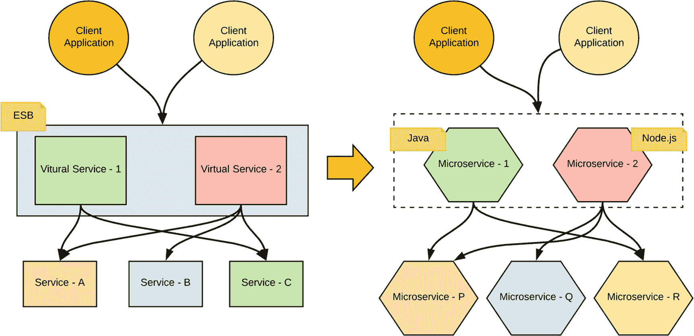
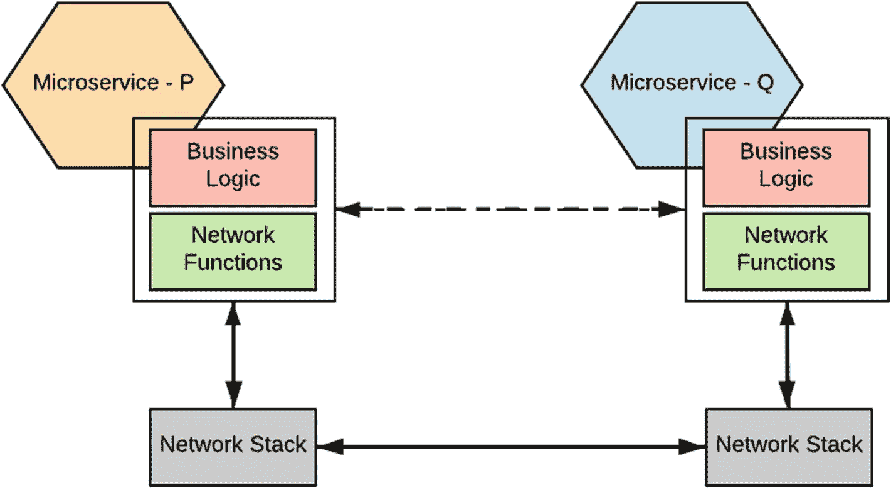
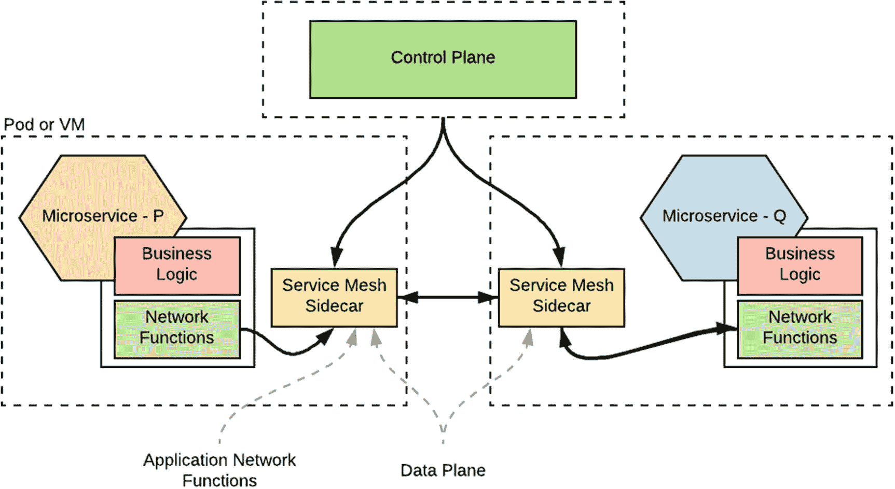
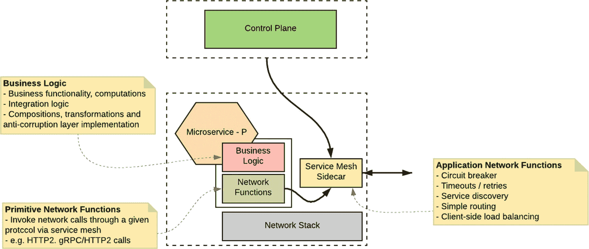
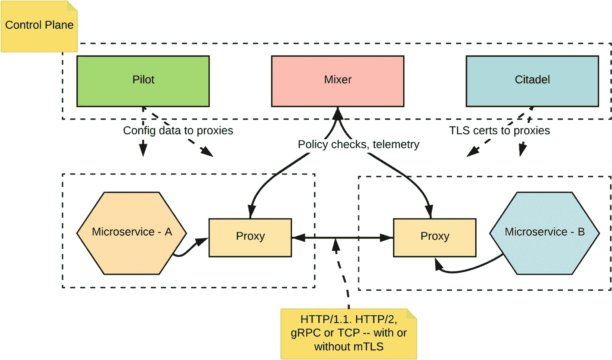
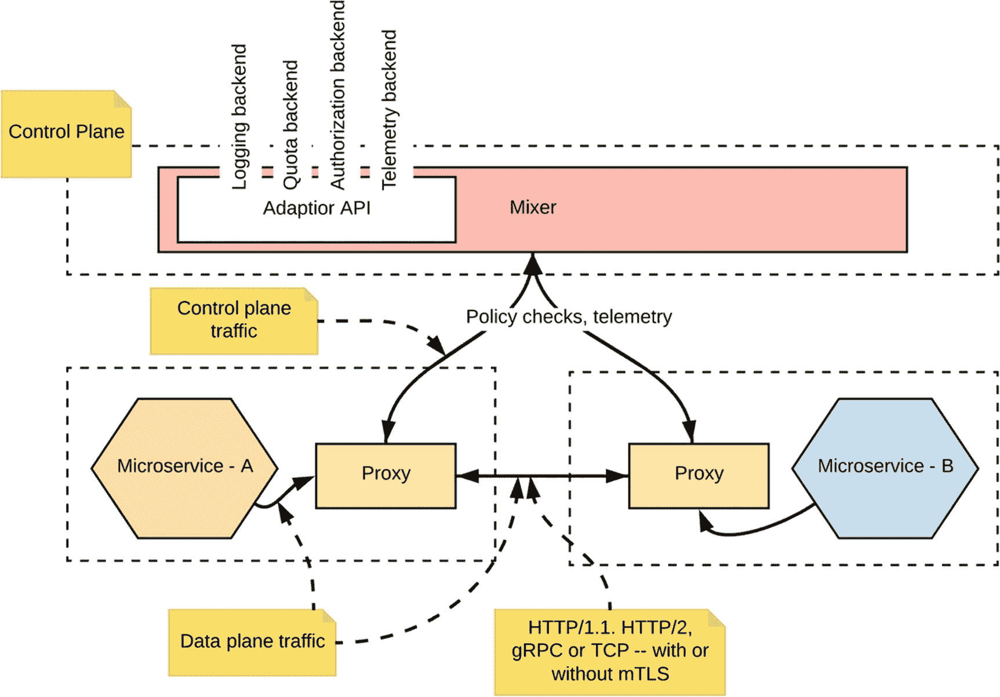
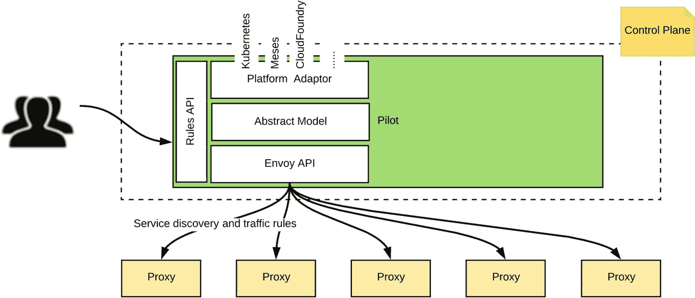
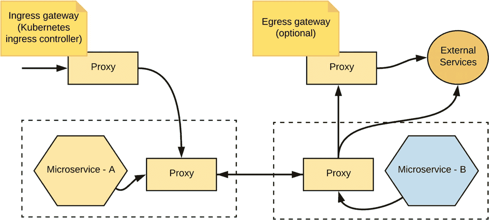
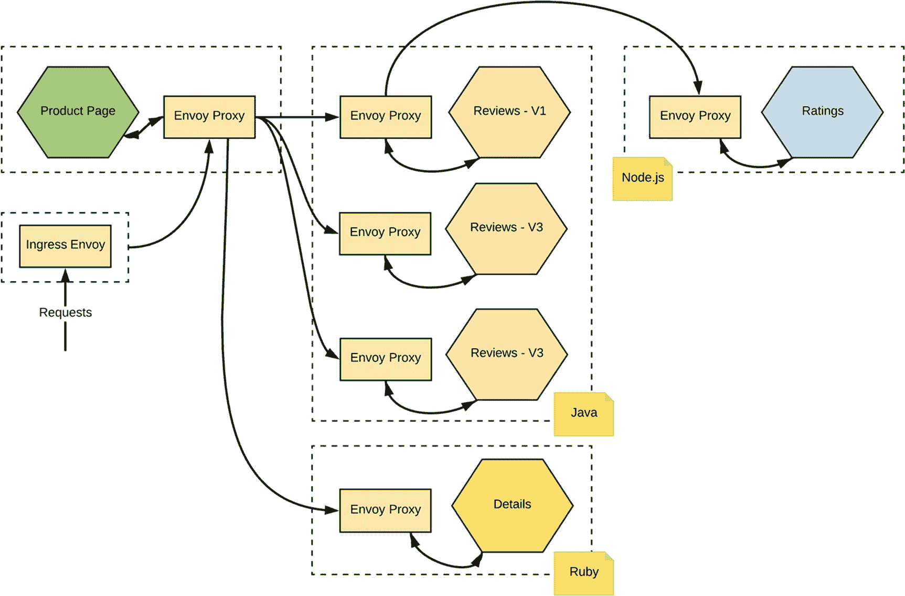
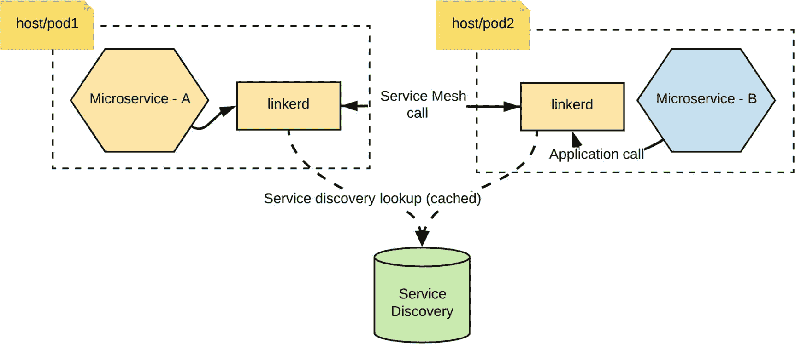

# 9. 服务网格

在第 7 章“集成微服务”中，我们讨论了微服务之间需要相互通信，而服务间通信是实现微服务架构的关键挑战之一。在传统的面向服务架构（SOA）中，集中式的企业服务总线（ESB）满足了大部分服务间通信需求。随着架构向*智能端点与哑管道微服务架构*转变，服务开发者现在必须自行处理服务间通信的所有复杂性。*服务网格*作为一种模式应运而生，旨在克服这些挑战。它通过提供一个通用的分布式层来实现这一点，该层封装了服务间通信中不属于服务业务逻辑的通用特性。

### 说明

本章中的部分概念和示例可能需要您具备 Docker 和 Kubernetes 的预备知识。如果您对这两项技术尚不熟悉，建议您先阅读第 8 章“部署和运行微服务”。

在本章中，我们将深入探讨服务网格模式背后的动机和关键概念。然后，我们将结合实际案例，讨论一些主流的服务网格实现方案。

## 为什么需要服务网格？

服务网格诞生的主要动机，源于我们在摒弃集中式 ESB 架构后开始遇到的挑战，这促使我们构建智能端点和哑管道。

与许多新兴技术一样，微服务架构周围充斥着大量炒作。大多数人认为微服务架构能解决他们在以往 SOA/ESB 架构中遇到的所有问题。然而，当我们观察现实世界中的微服务实现时，会发现集中式总线（ESB）所支持的大部分功能，现在都在微服务层面实现了。我们或多或少都在解决同一组基本问题，只是通过微服务在不同的维度上解决它们。

例如，考虑这样一个场景：你需要以弹性的方式调用多个下游服务，并将该功能作为另一个微服务暴露出来。如图 9-1 所示，使用 ESB 架构，你可以轻松利用 ESB 的内置能力来构建虚拟/复合服务，而诸如断路器、超时、服务发现等在服务间通信中非常有用的功能，ESB 已经作为开箱即用的能力提供了。



图 9-1

从 ESB 到智能端点和哑管道

当你使用微服务实现相同场景时，不再有集中的集成/ESB 层，而是一组微服务。你必须在每个微服务层面实现所有这些功能。

因此，一个与其他服务通信的微服务，同时嵌入了业务逻辑和网络通信逻辑。如图 9-2 所示，每个微服务都包含大量与网络通信相关的代码，这些代码独立于服务的业务逻辑。从应用层面来看，`microservice-P` 与 `microservice-Q` 通信（用虚线表示），而实际的通信发生在网络栈之上。



图 9-2

微服务组件与服务间通信

我们可以将每一层的关键职责定义如下：

*   *业务逻辑*：实现业务功能、计算以及服务组合/集成逻辑。
*   *网络功能*：负责服务间通信机制（通过给定协议进行基本服务调用、应用弹性和稳定性模式、服务发现以及可观测性检测）。这些网络功能构建在底层操作系统（OS）网络栈之上。

现在思考一下实现这样一个微服务所需的工作量。从头开始实现与服务间通信相关的功能是一场噩梦。你将不得不花费大量时间构建服务间通信功能，而不是专注于业务逻辑。如果你使用多种技术构建微服务，情况会更糟，因为你需要在不同语言（例如，断路器必须在 Java、Node、Python 等语言中实现）中重复相同的努力。

由于大多数服务间通信需求在所有微服务实现中都是相当通用的，我们可以考虑将所有此类任务卸载到一个不同的层，从而使服务代码保持独立。这就是*服务网格*发挥作用的地方。

## 什么是服务网格？

简而言之，服务网格是一种服务间通信基础设施。使用服务网格时，给定的微服务不会直接与其他微服务通信。相反，所有服务间的通信都将在一个名为*服务网格代理*（或*边车代理*）的软件组件之上进行。边车或服务网格代理是一个软件组件，它与服务部署在同一虚拟机或 Pod（Kubernetes）中。边车代理层被称为*数据平面*。所有这些边车代理都通过一个*控制平面*进行控制。所有与服务间通信相关的配置都在控制平面中应用。


### Sidecar 模式

Sidecar 是一种与主应用程序位于同一位置，但在其自身进程或容器中运行的软件组件，它提供一个网络接口来连接主应用，因此与编程语言无关。所有核心应用功能都作为主应用逻辑的一部分来实现，而其他与业务逻辑无关的通用横切功能则由 Sidecar 提供便利。通常，应用程序的所有入站和出站通信都通过 Sidecar 代理进行。

服务网格为一些网络功能（如弹性、服务发现等）提供了内置支持。因此，服务开发者可以更专注于业务逻辑，而大部分与网络通信相关的工作则被卸载到服务网格。例如，当你的微服务调用另一个服务时，你不再需要担心熔断问题。这已成为服务网格的一部分。

服务网格与编程语言无关。微服务到服务网格代理的通信始终通过标准协议（如 HTTP1.x/2.x、gRPC 等）进行。你可以使用任何技术编写微服务，它们仍然可以与服务网格协同工作。

随着服务网格的引入，服务交互的方式发生了变化，如图 9-3 所示。例如，`microservice-P` 不再直接与 `microservice-Q` 通信。相反，给定服务的所有入站（入口）和出站（出口）流量都通过服务网格 Sidecar。



图 9-3

使用服务网格的服务间通信

服务直接与 Sidecar 代理通信，因此它应该能够执行基本的网络功能（例如调用 HTTP 服务），但不需要处理应用级别的网络功能（如熔断器等）。

让我们进一步了解图 9-4 中所示的服务交互和职责。



图 9-4

服务网格 Sidecar 和与其并行的微服务的职责

明确服务与 Sidecar 代理之间的边界和职责非常重要。正如我们在第 7 章中讨论的，服务网格提供的某些能力也由微服务开发语言提供。在每一层实现特定能力时，我们需要谨慎。接下来，让我们详细看看每一层及其职责。

### 业务逻辑

服务实现应包含给定服务的业务功能实现。这包括与其业务功能、计算、与其他服务/系统（包括遗留系统、专有系统和 SaaS）的集成或服务组合、复杂路由逻辑、不同业务实体之间的类型映射逻辑等相关的逻辑。

### 基本网络功能

尽管我们将大部分网络功能卸载到服务网格，但给定服务必须包含与服务网格 Sidecar 代理连接所需的基本高级网络交互。因此，给定服务的实现将需要使用某种网络库（不同于 ESB 世界，你只需使用非常简单的抽象）来发起网络调用（仅向服务网格代理）。在大多数情况下，微服务开发框架嵌入了这些功能所需的网络库（例如基本的 HTTP 传输）。

### 应用网络功能

存在一些与网络紧密耦合的应用功能，例如熔断、超时、服务发现等。这些功能被明确地从服务代码/业务逻辑中分离出来，服务网格开箱即用地提供了这些功能。

大多数早期的微服务实现简单地忽略了集中式 ESB 层提供的网络功能的重要性，并在每个微服务级别从头开始实现所有这些功能。现在，他们开始意识到拥有一个类似的、作为分布式网格的共享功能的重要性。

### 控制平面

所有服务网格代理都由一个控制平面集中管理。这在支持服务网格能力（如访问控制、可观测性、服务发现等）时非常有用。你在控制平面所做的所有更改都会被推送到 Sidecar 代理。

## 服务网格的功能

正如我们之前所见，服务网格提供了一组应用网络功能，而基本网络功能（例如通过 localhost 网络调用 Sidecar）仍在微服务级别实现。对于服务网格应提供哪些功能，并没有硬性规定。然而，以下部分提到了服务网格通常提供的一些功能。

### 服务间通信的弹性

网络通信能力，如熔断、重试和超时、故障注入、故障处理、负载均衡和故障转移，都是服务网格的一部分。在使用微服务时，我们通常将这些能力作为服务逻辑的一部分来实现。有了服务网格，你将不必在服务代码中构建这些网络功能。

### 服务发现

你使用服务网格运行的服务需要通过逻辑命名方案（无硬编码的主机或端口）来发现。因此，服务网格与给定的服务发现工具协同工作，以支持服务注册和发现。大多数服务网格实现都带有开箱即用的服务发现支持能力。例如，Istio 通过底层 Kubernetes 和 etcd^(¹²⁵) 内置支持服务发现。如果你已经有像 Consul^(¹²⁶) 这样的服务发现解决方案，它也可以与服务网格集成。

### 路由

服务网格支持一些基本的路由能力，例如基于特定标头、版本等的路由。我们必须非常小心地在服务网格路由层实现什么，以确保服务网格路由逻辑中不包含任何业务逻辑。

### 可观测性

当你使用服务网格时，你的所有服务都会自动变得可观测，而无需更改任何代码。指标、监控、分布式日志记录、分布式追踪和服务可视化都是开箱即用的。由于所有流量数据都在 Sidecar 代理级别捕获，Sidecar 代理可以将这些数据发布给负责分析的相关控制平面组件，这些组件再发布到相应的可观测性工具。

### 安全性

服务网格支持服务间通信的传输层安全（TLS）和基于角色的访问控制（RBAC）。此外，一些现有的服务网格实现正在不断为服务网格实现添加更多与安全相关的能力。

### 部署

几乎所有服务网格实现都与容器和容器管理系统紧密集成。Docker 和 Kubernetes 是服务网格部署选项的事实标准。然而，在虚拟机内运行也是可行的。


### 服务间通信协议

服务网格支持多种通信协议，例如 HTTP1.x、HTTP2 和 gRPC。服务必须使用与其要代理的目标服务相同的协议与 Sidecar 通信。服务网格负责处理大部分底层通信细节，而您的服务代码则使用原始网络能力来调用 Sidecar。现在，让我们看看一些流行的服务网格实现。

## Istio

Istio^(¹²⁷) 是一个用于连接、管理和保护微服务的开放平台。它为微服务间的通信提供了一种通信基础设施，具备弹性、路由、负载均衡、服务间认证、可观测性等功能，且无需更改您的服务代码。

您只需将 Istio Sidecar 代理与您的服务一同部署，即可将服务添加到 Istio 服务网格中。正如我们之前所讨论的，Istio Sidecar 代理负责微服务之间的所有网络通信，并通过 Istio 控制平面进行配置和管理。Istio 的部署与 Kubernetes 紧密相关，但也可以部署在其他一些系统上。

### Istio 架构

图 9-5 展示了 Istio 服务网格的高层架构。Istio 包含两个逻辑组件，即数据平面和控制平面。



图 9-5

Istio 架构^(¹²⁸)

*   *数据平面*：数据平面由一组 Sidecar 代理组成，这些代理负责路由和控制微服务之间的所有网络通信。Istio 的数据平面主要由 Envoy 代理（由 Lyft 开发）构成。

*   *控制平面*：控制平面负责管理和配置 Sidecar 代理，以改变其网络通信行为。控制平面由 Pilot、Mixer 和 Citadel 组件组成。

#### Istio 代理

在其数据平面中，Istio 使用 Envoy^(¹²⁹) 代理的增强版来中介服务网格中所有服务的入站和出站流量。Envoy 是一个用 C++ 开发的高性能代理。Istio 利用了 Envoy 的许多内置功能，例如动态服务发现、负载均衡、TLS 终止、HTTP/2 和 gRPC 代理、熔断器、健康检查、基于百分比流量分割的分阶段发布、故障注入以及丰富的指标。

Envoy 作为 Sidecar 与您的微服务一起部署，并负责处理您微服务的所有入口和出口网络通信。

#### Mixer

Mixer 负责在整个服务网格中执行访问控制和使用策略，并从 Istio 代理和其他服务收集遥测数据。Istio 代理提取请求级属性，并将其发送给 Mixer 进行评估。图 9-6 展示了 Mixer 如何与其他 Istio 组件交互。



图 9-6

Istio Mixer

Mixer 允许您将服务/应用程序代码与策略决策完全解耦，从而可以将策略决策从应用层转移到配置中，由运维人员控制。应用程序代码只需与 Mixer 进行相当简单的集成，而 Mixer 则负责与后端系统进行接口交互。

Mixer 在 Istio 生态系统中提供了三个主要能力。Istio 代理 Sidecar 在逻辑上会在每个请求之前调用 Mixer 以执行前置条件检查，并在每个请求之后调用 Mixer 以报告遥测数据。Sidecar 具有本地缓存，因此大部分前置条件检查都可以通过缓存执行。此外，Sidecar 会缓冲外发的遥测数据，从而仅在不频繁的情况下才调用 Mixer。

#### Pilot

Istio 中用于流量管理的核心组件是 Pilot（见图 9-7），它负责管理和配置部署在特定 Istio 服务网格中的所有 Istio 代理实例。Pilot 允许您指定用于在 Istio 代理之间路由流量的规则，并配置故障恢复功能，例如超时、重试和熔断器。它还维护网格中所有服务的规范模型，并使用此模型通过其发现服务让 Istio 代理实例了解网格中的其他 Istio 代理实例。



图 9-7

Istio Pilot^(¹³⁰)

Pilot 维护网格中服务的规范表示，该表示独立于底层平台。Pilot 抽象了特定于平台的服务发现机制，并将其合成为符合 Envoy 数据平面 API 的任何 Sidecar 都可以使用的标准格式。

#### Citadel

Citadel 使用双向 TLS 提供强大的服务间和最终用户身份验证，并内置身份和凭据管理。它可用于升级服务网格中未加密的流量，并使运维人员能够基于服务身份而非网络控制来实施策略。

### 注意

本书的范围是介绍 Istio 作为一种服务网格实现。有关 Istio 的任何底层细节和更多信息，我们建议您查阅 Istio 文档^(¹³¹)，并推荐 Christian Posta 和 Burr Sutter 所著的《*为微服务引入 Istio 服务网格*》^(¹³²)一书。

### 使用 Istio

在本节中，我们将通过一些用例更深入地了解 Istio 的部分能力。我们仅涵盖一组选定的常用微服务场景；对于其他场景，强烈建议您参考 Istio 官方文档。

### 注意

Istio 示例严重依赖于 Docker 和 Kubernetes。因此，如果您不熟悉 Docker 或 Kubernetes，建议您阅读第 8 章。


#### 使用 Istio 运行你的服务

使用 Istio 运行微服务非常简单。如果你在 Kubernetes 上运行服务，第一步需要为你的服务创建 Docker 镜像。有了 Docker 镜像后，你需要创建 Kubernetes 工件来部署该服务。

例如，假设你想开发一个简单的 `hello` 服务，并且已经创建了 Docker 镜像和 Kubernetes 工件来部署该服务。这里展示的是该服务的通用 Kubernetes 部署工件。

例如，在下面的 Kubernetes 描述符中，你可以找到 Kubernetes 服务和部署组件的配置。此外，你还需要包含两个 Istio 特定的配置，即 `VirtualService` 和 `Gateway`。

`VirtualService` 定义了控制服务请求如何在 Istio 服务网格中路由的规则。`Gateway` 为 HTTP/TCP 流量配置负载均衡器，通常运行在网格的边缘，以启用应用程序的入站流量。

图 9-8 展示了一个简单通信场景中服务与 Sidecar 之间的请求流程。假设你使用外部客户端向 `microservice-A` 发送请求，那么你需要暴露一个 Istio 入站网关，它充当服务的外部接口。当你为 `microservice-A` 创建虚拟服务时，基于你在该虚拟服务中指定的规则，消息路由就会发生。类似地，当 `microservice-A` 调用 `microservice-B` 时，基于 `microservice-B` 的虚拟服务配置，消息路由规则将被应用（在 `microservice-A` 的 Sidecar 中）。



图 9-8

请求流程

在这个例子中，我们定义了一个网关，它在边缘暴露我们的服务，以便外部客户端可以通过负载均衡器进行调用。为我们的 `HelloWorld` 服务创建的虚拟服务简单地检查路径 `/hello` 并将其路由到该服务。

```
# Helloworld.yaml
apiVersion: v1
kind: Service
metadata:
name: helloworld
labels:
app: helloworld
spec:
type: NodePort
ports:
- port: 5000
name: http
selector:
app: helloworld

apiVersion: extensions/v1beta1
kind: Deployment
metadata:
name: helloworld-v1
spec:
replicas: 1
template:
metadata:
labels:
app: helloworld
version: v1
spec:
containers:
- name: helloworld
image: kasunindrasiri/examples-helloworld-v1
resources:
requests:
cpu: "100m"
imagePullPolicy: IfNotPresent #Always
ports:
- containerPort: 5000

apiVersion: networking.istio.io/v1alpha3
kind: Gateway
metadata:
name: helloworld-gateway
spec:
selector:
istio: ingressgateway # use istio default controller
servers:
- port:
number: 80
name: http
protocol: HTTP
hosts:
- "*"

apiVersion: networking.istio.io/v1alpha3
kind: VirtualService
metadata:
name: helloworld
spec:
hosts:
- "*"
gateways:
- helloworld-gateway
http:
- match:
- uri:
exact: /hello
route:
- destination:
host: helloworld
port:
number: 5000
```

现在你想在 Istio 上部署这个服务。为此，你需要将 Istio Sidecar 注入到你的部署中。这可以作为 Istio 安装的自动功能完成，也可以作为手动过程完成。为了正确理解其行为，我们使用手动 Sidecar 注入。

你可以使用以下命令将 Sidecar 注入到你的服务部署描述符中：

```
istioctl kube-inject -f helloworld.yaml -o helloworld-istio.yaml
```

它会修改部署描述符，并将 Istio 代理添加到你将创建的同一个 Pod 中。因此，在这种情况下，Istio 代理充当 Sidecar。Sidecar 注入完成后，你可以简单地部署修改后的部署描述符，如下所示：

```
kubectl create -f helloworld-istio.yaml
```

这就是你需要做的全部工作。现在，你可以通过 Node 端口或入站网关（如果有）访问你的服务，并且流量会流经 Istio 服务网格。（如果需要，你可以通过在 Istio 级别启用追踪来验证这一点。我们将在接下来的几节中讨论如何做到这一点。）

大多数 Istio 示例都基于 Istio 提供的官方用例^(¹³³)，以展示其功能。因此，我们将沿用相同的示例。我们在图 9-9 中展示的是部署在 Istio 上的 `BookInfo` 示例。



图 9-9

Istio 上的 BookInfo 用例

`BookInfo` 用例由四个多语言服务组成——`Product Page`、`Reviews`、`Details` 和 `Ratings`。现在让我们继续讨论这个用例的一些需求，在这些需求中我们可以利用 Istio。

### 注意

你可以按照 Istio 文档^(¹³⁴)中给出的指南尝试以下大多数 Istio 示例。

#### 使用 Istio 进行流量管理

当一个服务调用另一个服务，或者一个给定的服务暴露给外部客户端时，你可以应用 Istio 的流量管理功能，基于不同的机制来路由流量。它将流量流程与基础设施扩展解耦，让你通过 Pilot 指定流量应遵循的规则，而不是指定哪些特定的 Pod/VM 应接收流量。流量管理功能还包括用于 A/B 测试的动态请求路由、逐步发布、金丝雀发布、使用超时和重试的故障恢复、熔断器以及故障注入。

Istio 定义了四种流量管理配置资源：

*   *VirtualService* 定义了一组在访问主机时应用的流量路由规则。每个路由规则定义了特定协议流量的匹配条件。如果流量匹配，它将被发送到注册表中定义的一个命名目标服务（或其子集/版本）。流量的来源也可以在路由规则中进行匹配。这允许为特定的客户端上下文定制路由。

*   *DestinationRule* 配置了在 VirtualService 路由发生后应用于请求的一组策略。这些规则指定了负载均衡、来自 Sidecar 的连接池大小以及异常检测设置的配置，用于检测并从负载均衡池中驱逐不健康的主机。

*   *ServiceEntry* 通常用于启用对 Istio 服务网格外部服务的请求。

*   *Gateway* 为 HTTP/TCP 流量配置负载均衡器，通常运行在网格的边缘，以启用应用程序的入站流量。


#### 请求路由

让我们尝试使用 Istio 的 `BookInfo` 示例构建一个简单的请求路由场景。Istio 的 `BookInfo` 示例由四个独立的微服务组成，每个服务都有多个版本。假设我们需要应用一个路由规则，将所有流量路由到 `Ratings` 服务的 v1（版本 1）。

你可以通过应用一个虚拟服务，并为每个虚拟服务添加路由规则，将流量路由到服务的 v1 版本来实现此示例。在下面的代码片段中，我们展示了 `Ratings` 和 `Reviews` 服务的规则。同样，你需要对 `BookInfo` 示例中的所有服务执行此操作。

```
apiVersion: networking.istio.io/v1alpha3
kind: VirtualService
metadata:
name: ratings
...
spec:
hosts:
- ratings
http:
- route:
- destination:
host: ratings
subset: v1

apiVersion: networking.istio.io/v1alpha3
kind: VirtualService
metadata:
name: reviews
...
spec:
hosts:
- reviews
http:
- route:
- destination:
host: reviews
subset: v1

```

在某些场景下，你可能需要根据请求进行基于内容的路由。例如，以下 `Reviews` 服务的虚拟服务配置展示了一个基于 HTTP 标头的路由场景，它专门查找一个 HTTP 标头，并将流量路由到服务的 v2 版本。

```
apiVersion: networking.istio.io/v1alpha3
kind: VirtualService
metadata:
name: reviews
...
spec:
hosts:
- reviews
http:
- match:
- headers:
end-user:
exact: jason
route:
- destination:
host: reviews
subset: v2
- route:
- destination:
host: reviews
subset: v1
```

#### 弹性

作为弹性服务间通信技术的一部分，你可以通过 Istio Sidecar 代理调用其他服务时使用*超时*。例如，假设你想在调用 Istio `Bookinfo` 示例的 `Reviews` 服务时应用超时。那么你可以将超时配置作为为 `Reviews` 服务创建的虚拟服务的一部分包含在内。

以下配置在调用 `Reviews` 服务时设置了 0.5 秒的超时，并且调用被路由到服务的 v2 版本。

```
apiVersion: networking.istio.io/v1alpha3
kind: VirtualService
metadata:
name: reviews
spec:
hosts:
- reviews
http:
- route:
- destination:
host: reviews
subset: v2
timeout: 0.5s
```

调用特定服务的*熔断器*配置可以作为 *DestinationRule*（将在虚拟服务路由之后应用）来应用。例如，假设我们需要在调用 `Httpbin` 服务时应用熔断器配置。那么我们可以应用以下 *DestinationRule*，其中包含当并发连接和请求超过一个时打开熔断器的规则。

```
apiVersion: networking.istio.io/v1alpha3
kind: DestinationRule
metadata:
name: httpbin
spec:
host: httpbin
trafficPolicy:
connectionPool:
tcp:
maxConnections: 1
http:
http1MaxPendingRequests: 1
maxRequestsPerConnection: 1
outlierDetection:
consecutiveErrors: 1
interval: 1s
baseEjectionTime: 3m
maxEjectionPercent: 100
```

类似地，当你通过 Istio 调用服务时，还可以应用许多其他与服务弹性相关的功能。

#### 故障注入

路由规则可以指定在将 HTTP 请求转发到规则对应的请求目标时注入一个或多个故障。故障可以是延迟或中止。在以下示例中，我们对所有发往 `Ratings` 服务 v1 版本的请求注入一个 HTTP 400 响应。

```
apiVersion: networking.istio.io/v1alpha3
kind: VirtualService
metadata:
name: ratings
spec:
hosts:
- ratings
http:
- fault:
abort:
percent: 10
httpStatus: 400
route:
- destination:
host: ratings
subset: v1
```

#### 策略执行

我们在本章前面介绍了 Istio Mixer 作为 Istio 的主要组件之一，它负责策略执行和遥测数据收集。让我们看看如何利用策略执行来实现速率限制。

例如，假设你需要配置 Istio，根据原始客户端的 IP 地址对发往 `Product Page` 服务的流量进行速率限制。你将使用 `X-Forwarded-For` 请求标头作为客户端 IP 地址。

从 Istio 方面，你需要配置内存配额（`memquota`）适配器以启用速率限制（或在生产环境中使用 Redis 配额）。你可以应用 `memquota` 处理程序配置，如下所示。

```
apiVersion: config.istio.io/v1alpha2
kind: memquota
metadata:
name: handler
namespace: istio-system
spec:
quotas:
- name: requestcount.quota.istio-system
maxAmount: 500
validDuration: 1s
- dimensions:
destination: reviews
maxAmount: 1
validDuration: 5s
- dimensions:
destination: productpage
maxAmount: 2
validDuration: 5s
```

此 `memquota` 处理程序定义了三种不同的速率限制方案。如果没有匹配的覆盖规则，默认方案是每 1 秒（1s）500 个请求。第一种方案是，如果目标为 reviews，则每 5 秒（`validDuration`）1 个请求（`maxAmount`）。

第二种方案是，如果目标为 `Product Page` 服务，则每 5 秒 2 个请求。

```
apiVersion: config.istio.io/v1alpha2
kind: quota
metadata:
name: requestcount
namespace: istio-system
spec:
dimensions:
source: request.headers["x-forwarded-for"] | "unknown"
destination: destination.labels["app"] | destination.service.host | "unknown"
destinationVersion: destination.labels["version"] | "unknown"
```

配额模板定义了三个维度，`memquota` 或 `redisquota` 使用这些维度来对匹配特定属性的请求设置覆盖规则。`destination` 将被设置为 `destination.labels["app"]`、`destination.service.host` 或 `unknown` 中的第一个非空值。

```
apiVersion: config.istio.io/v1alpha2
kind: rule
metadata:
name: quota
namespace: istio-system
spec:
actions:
- handler: handler.memquota
instances:
- requestcount.quota
```

此规则告诉 Mixer 调用 `handler.memquota\handler.redisquota` 处理程序，并将使用实例 `requestcount.quota` 构建的对象传递给它。这将把配额模板中的维度映射到 `memquota` 或 `redisquota` 处理程序。

```
apiVersion: config.istio.io/v1alpha2
kind: QuotaSpec
metadata:
name: request-count
namespace: istio-system
spec:
rules:
- quotas:
- charge: "1"
quota: requestcount:
```

此 QuotaSpec 定义了你创建的 `requestcount` 配额，每次计费为 1。

```
kind: QuotaSpecBinding
metadata:
name: request-count
namespace: istio-system
spec:
quotaSpecs:
- name: request-count
namespace: istio-system
services:
- name: productpage
namespace: default
```

此 `QuotaSpecBinding` 将你创建的 `QuotaSpec` 绑定到要应用它的服务。`Product Page` 服务被显式绑定到 request-count。请注意，你必须定义命名空间，因为它与 `QuotaSpecBinding` 的命名空间不同。


#### 可观测性

使用 Istio 时，让服务具备可观测性变得异常简单。例如，假设你想为微服务应用启用分布式追踪，那么你需要在 Istio 安装中安装相应的附加组件（如 Zipkin^(¹³⁵) 或 Jaeger^(¹³⁶)）。现在，当你向微服务发送请求时，请求会经过 Sidecar 代理。这些 Sidecar 代理能够自动将追踪跨度发送到 Zipkin 或 Jaeger。

Istio 代理也能自动发送跨度。它们需要一些提示来将整个追踪链路串联起来。应用需要传播适当的 HTTP 头，这样当代理将跨度信息发送到 Zipkin 或 Jaeger 时，这些跨度才能被正确关联成一条完整的追踪链路。

类似地，可观测性的其他方面也可以在无需或仅需对代码进行极少修改的情况下得到支持。关于如何使用 Istio 让服务具备可观测性的更多细节，请参考 Istio 文档^(¹³⁷)。我们将在第 13 章“可观测性”中，结合微服务详细讨论可观测性。

#### 安全性

Istio 的安全能力仍在快速发展。在本书撰写时，Istio 提供了以下安全特性：

*   服务间的双向 TLS（mTLS）认证
*   服务的白名单和黑名单
*   基于拒绝的访问控制
*   基于角色的访问控制（RBAC）

关于这些安全用例的更多细节，请参考 Istio 文档^(¹³⁸)。

既然你已经对 Istio 有了更深入的了解，让我们来看看另一个流行的服务网格实现：Linkerd。

## Linkerd

Linkerd 是一个开源网络代理，旨在作为服务网格部署：一个用于管理、控制和监控应用内服务间通信的专用层。

Linkerd 负责处理跨服务通信中困难且易出错的部分——包括延迟感知的负载均衡、连接池、TLS、仪表化以及请求级路由。Linkerd 构建在 Netty 和 Finagle 之上。

图 9-10 展示了 Linkerd 如何作为服务网格来连接多个微服务。你可以发现它使用了与 Istio 非常相似的标准服务网格模式。



图 9-10

Linkerd 服务网格

要开始使用 Linkerd（[`https://linkerd.io/getting-started/locally/`](https://linkerd.io/getting-started/locally/)），你可以在本地机器上运行它，并在同一台机器上运行你的服务（两个运行时位于同一主机上）。运行 Linkerd 时，你可以使用以下 Yaml 配置文件来启动你的服务网格。假设你的微服务在 HTTP 端口 9999 上运行。以下配置将在 HTTP 端口 4140 上启动 Linkerd。

```
#linkerd.yaml
routers:
- protocol: http
dtab: |
/svc => /#/io.l5d.fs
servers:
- ip: 0.0.0.0
port: 4140
```

Linkerd 默认使用基于文件的服务发现机制。使用 Linkerd 自带的配置，当它需要解析服务端点时，首先查找的是 `disco/` 目录。通过此配置，Linkerd 会查找文件名与目标具体名称对应的文件，并期望这些文件包含以换行符分隔的主机端口格式地址列表。

```
head disco/*
==> disco/thrift-buffered  disco/thrift-framed  disco/web <==
127.0.0.1 9999
```

当你使用以下 URL 向 Linkerd（端口 4140）发送请求时，目标是通过查看 HTTP 主机头（即 `web`）来发现的。

```
$ curl -H "Host: web" http://localhost:4140/
```

根据之前的基于文件的服务发现配置，Linkerd 可以解析出服务 `web` 的主机和端口（9999）。

我们可以扩展相同的配置，通过使用 Linkerd 的 `failureAccrual` 配置来实现对后端微服务的弹性调用。

```
- protocol: http
label: io.l5d.consecutiveFailures
dtab: /svc => /#/io.l5d.fs/service2;
client:
failureAccrual:
kind: io.l5d.consecutiveFailures
failures: 5
backoff:
kind: constant
ms: 10000
servers:
- port: 4142
ip: 0.0.0.0
service:
responseClassifier:
kind: io.l5d.http.nonRetryable5XX
```

`failureAccrual` 在 Linkerd 配置的客户端部分下进行配置，因此任何与后端相关的故障都位于该路由上，并受客户端约束，从而实现弹性。

## 我们应该使用服务网格吗？

在本书撰写时，使用服务网格的趋势非常强劲。然而，当时服务网格的生产环境使用还很少见。因此，我们对其真正的优缺点还没有足够的了解。让我们来看看在使用服务网格时需要注意的一些关键领域。

### 优点

服务网格无疑有能力彻底改变我们开发云原生服务和应用的方式。鉴于微服务架构在服务间通信方面带来的复杂性，服务网格提供了一些有前景的优势：

*   *开发者可以更多地关注业务功能，而非服务间通信*：大多数通用功能都在微服务代码之外实现，并且是可复用的。
*   *开箱即用的可观测性*：服务通过 Sidecar 天生具备可观测性。因此，分布式追踪、日志记录、指标等无需服务开发者额外投入。
*   *对多语言服务友好*：在选择微服务实现语言时拥有更多自由。你无需担心特定语言是否支持或拥有构建网络应用功能的库。
*   *集中管理的去中心化系统*：大多数能力可以通过控制平面集中管理，并推送到去中心化的 Sidecar 运行时中。

如果你已经在企业中运行 Kubernetes，那么将服务网格引入你的架构是相当直接的。

### 缺点

*   *复杂性*：引入服务网格会显著增加给定微服务实现中的运行时实例数量。
*   *增加额外跳数*：每次服务调用都必须经过一次额外的跳转（通过服务网格 Sidecar 代理）。
*   *服务网格解决的是部分问题*：服务网格仅解决服务间通信的一部分问题，还有许多复杂问题它无法解决，例如复杂路由、转换/类型映射，以及与其他服务和系统的集成。这些问题必须由微服务的业务逻辑来解决。
*   *不成熟*：服务网格技术相对较新，尚不能宣称已完全准备好用于大规模部署的生产环境。


## 总结

在本章中，我们详细探讨了服务网格的概念及其诞生的关键原因。服务网格旨在简化服务间通信的复杂性以及服务治理的需求。使用服务网格时，开发者无需担心服务间通信以及服务的大多数其他横切关注点，例如安全性、可观测性等。每个微服务都运行着一个同址的边车代理，该代理由中央控制平面控制。边车代理通过预定义的配置进行控制，该配置由控制平面推送。Istio 是服务网格最常用的实现之一。服务网格的概念相对较新，尚未经过充分的实战检验。因此，我们需要非常清楚其优缺点。

脚注 1   2   3   4   5   6   7   8   9   10   11   12   13   14

