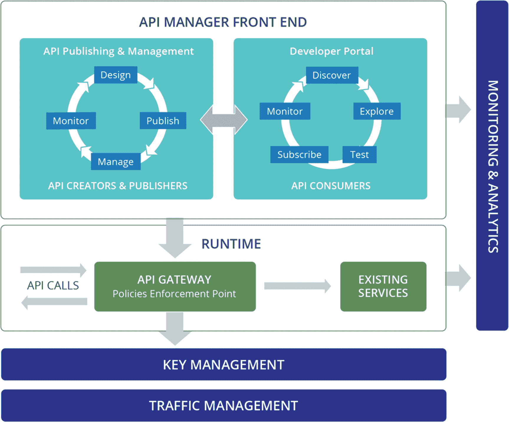
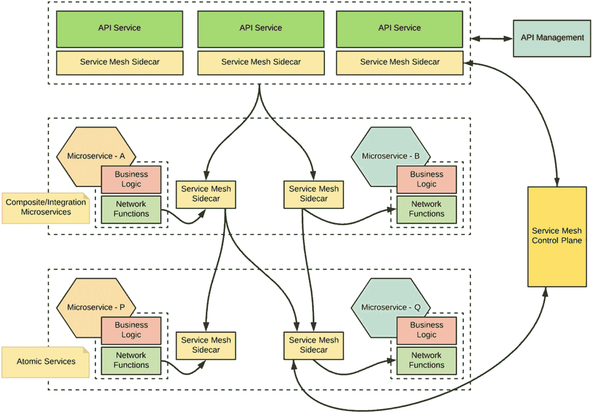
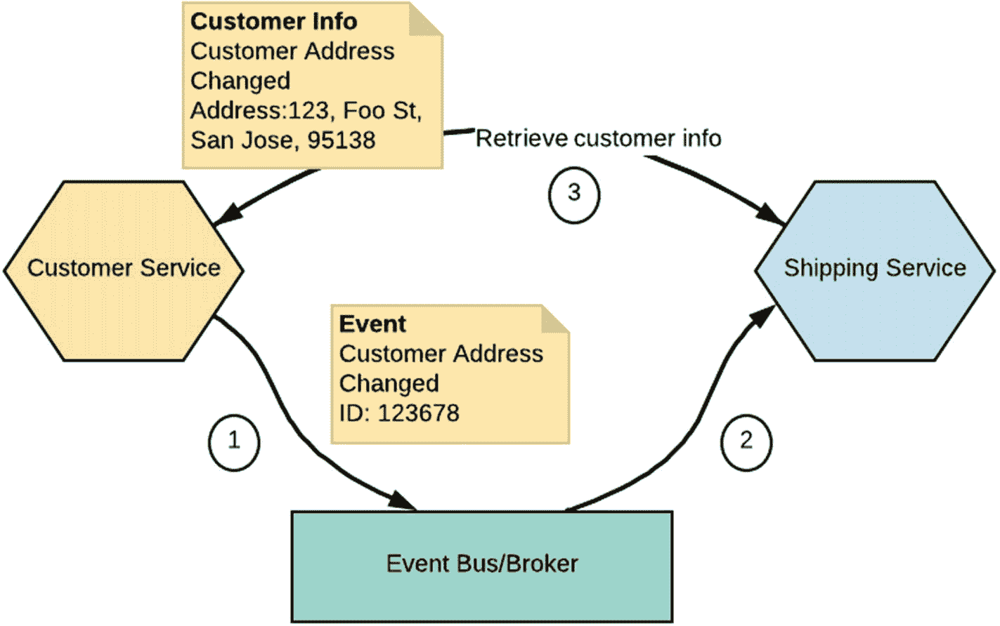
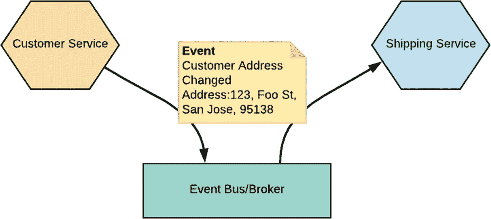
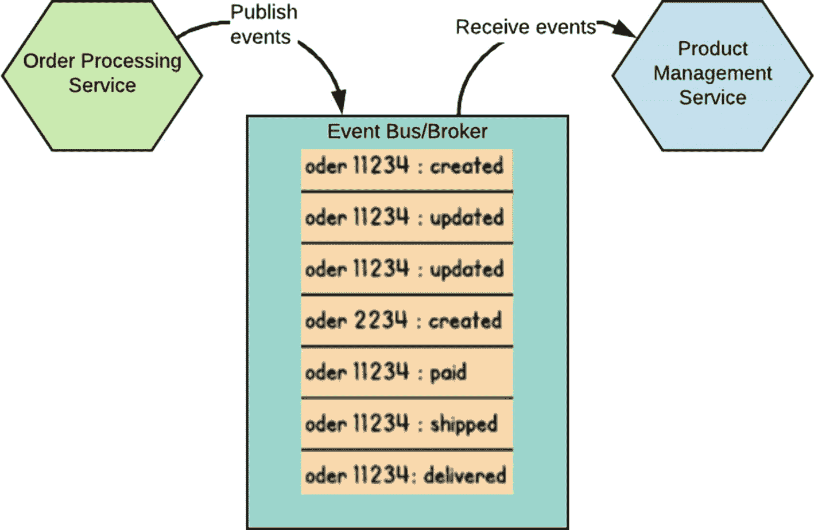
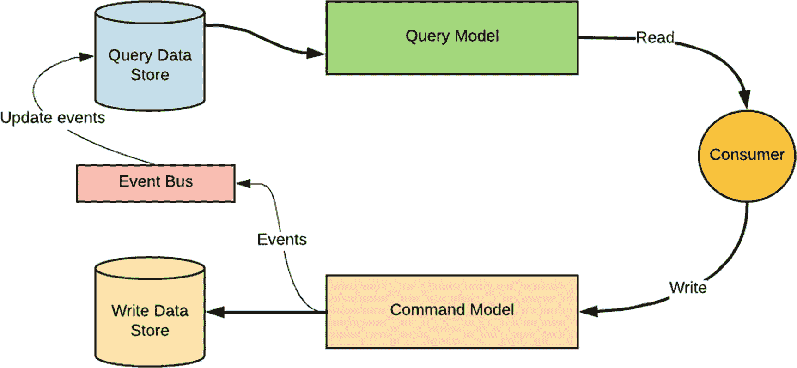
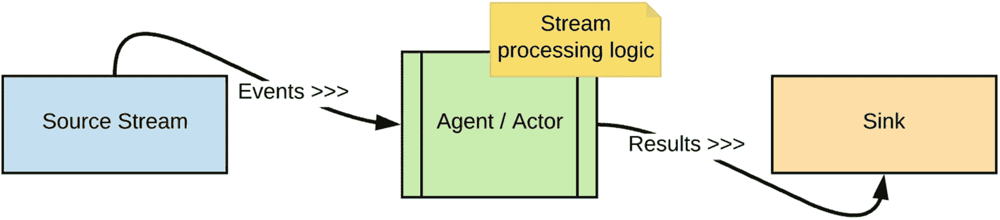
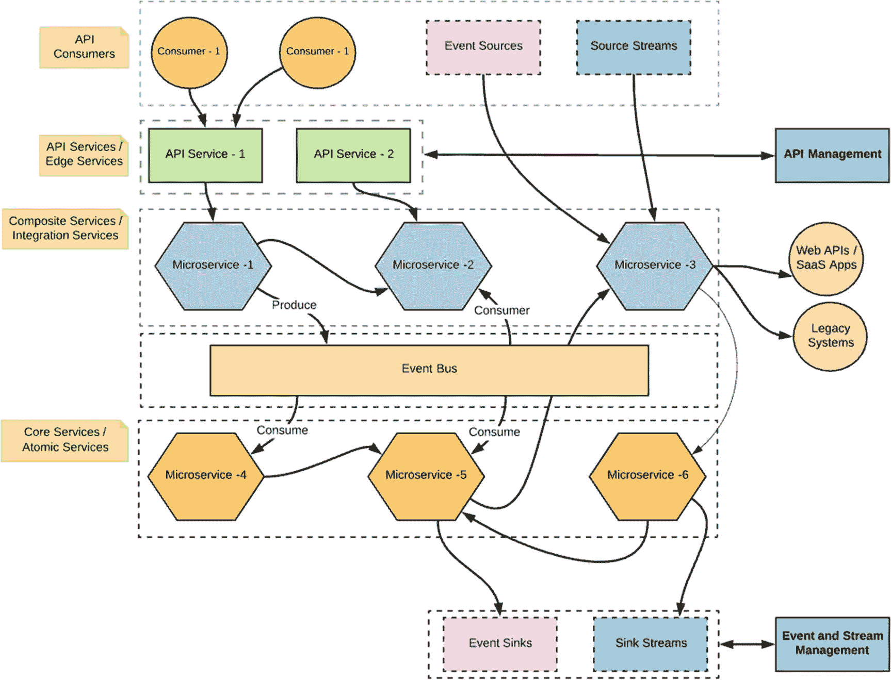

# 10. API、事件与流

在本章中，我们将重点探讨微服务如何通过 API、事件和流与外部服务、系统及数据进行连接。

正如前几章所述，你开发的任何微服务应用都必须以能够创建、管理、保护、分析和扩展这些业务能力的方式，将其暴露给消费者。因此，这些能力通常以 API 的形式暴露给消费者，并由一个通常称为 API 管理的过程进行治理。类似地，微服务也可以通过调用 API 请求来消费外部 API。API 或多或少遵循同步的请求-响应消息传递类型的通信。

微服务也可以构建在事件驱动架构之上，在这种架构中，应用之间完全解耦，并通过异步事件或消息进行通信。一个事件可以由某个服务或系统发出，并由其他服务对其进行处理。微服务必须适应各种事件驱动的通信风格，无论是内部还是外部的服务边界。

流是一个无界的事件集合，服务会持续对其进行处理。给定流的消费者服务会持续处理该流，并可以根据流处理逻辑发出结果事件。

基于微服务的应用的业务能力可以通过 API、事件或流来暴露，同时它们也可以连接并消费外部的 API、事件和流。

让我们深入探讨这些领域中的每一个，看看在构建微服务架构时如何利用它们。

## API 与 API 管理

任何你想要暴露给消费者（内部或外部）的业务能力都可以被视为一个 API。以能够创建、管理、保护、分析和扩展这些业务能力的方式暴露它们，被称为 *API 管理*。通过使用 API 管理解决方案，你可以为你的微服务启用策略和密钥验证、服务版本管理、配额管理、基本转换、授权和访问控制、可观测性、自助服务能力、评级等功能。

在 API 管理方面，有几个主要组件应该是任何 API 管理解决方案的一部分。它们是：

*   API 发布者

*   API 开发者门户/商店

*   API 网关

*   API 分析/可观测性

*   API 货币化

*   API 服务质量（安全性、限流、缓存等）

重要的是要理解，这些组件中的大多数都是通用的，并且与微服务架构没有紧密耦合。因此，将微服务作为 API 暴露与为单体系统暴露 API 几乎是相同的。（随着微服务架构的引入，你会将其中一组特定的组件进行去中心化处理。我们将在本章接下来的几节中讨论它们。）

图 10-1 展示了这些关键的 API 管理组件以及它们之间的交互方式。

图 10-1

API 管理的组件

在详细讨论每个组件的职责之前，我们还可以识别出与 API 管理相关的一些不同角色。它们是：

*   *API 创建者/API 开发者*：创建者是担任技术角色的人员，他们理解 API 的技术方面（接口、文档、版本等），并使用 API 发布者将 API 配置到 API 商店中。创建者使用 API 商店来查阅 API 用户提供的评级和反馈。创建者可以向商店添加 API，但不能管理其生命周期。

*   *API 发布者*：发布者管理整个企业或业务单元的一组 API，并控制 API 的生命周期、订阅和货币化方面。发布者还对 API 的使用模式感兴趣，并可以访问所有 API 统计数据。（在某些情况下，API 创建者和发布者的角色可能会合并为一个角色。）

*   *订阅者/应用开发者*：订阅者使用 API 商店来发现 API、阅读文档和论坛、对 API 进行评分/评论、订阅 API、获取访问令牌以及调用 API。

*   *管理员*：托管和管理 API 管理解决方案的 API 管理提供者。他/她负责在系统中创建用户角色、分配角色、管理数据库、启用安全性等。

从高层次来看，API 管理的典型执行流程始于 API 发布者层。事实上，此时你应该决定要将哪些微服务作为 API 暴露。创建好的 API 会被推送到开发者门户（API 商店）和 API 网关。消费者从 API 商店发现 API，并可以找到消费这些 API 所需的所有详细信息。当消费者调用一个 API 时，请求会直接到达 API 网关。网关负责进行服务质量验证（安全令牌验证、限流等）。

现在，让我们更仔细地审视这些组件中的每一个，并了解它们的职责。

### API 发布者/API 生命周期管理器

在开发微服务时，您需要围绕业务能力来设计它们。您可能还需要集成多个微服务并形成组合来构建它们。如果需要将此能力作为受管能力暴露给消费者，您就必须为此创建一个 API。

API 提供者或创建者负责设计、开发、发布、部署、版本管理、治理、监控可用性以及衡量性能。API 管理解决方案中的 API 发布者/生命周期管理器组件正是负责此项工作的。

API 发布者或 API 生命周期管理器允许您开发、记录、扩展和管理 API 版本。它还提供与 API 生命周期管理相关的任务，例如发布 API、货币化、分析统计数据和推广。

我们可以确定与 API 生命周期管理器的每个生命周期状态相关的一些关键步骤：

*   *开发阶段*：识别并开发应作为受管 API 暴露的业务能力。此任务可能涉及组合多个微服务并创建复合功能，以及将现有微服务作为 API 暴露。

*   *发布阶段*：一旦我们实现了 API 的功能，就需要发布该 API，以便它在 API 开发者门户/商店中可见。我们还将 SLA（服务等级协议）和其他与 QoS（服务质量）相关的功能（安全性、限流）关联到我们发布的 API。

*   *管理阶段*：管理 API 生命周期状态的 API 版本管理策略。

*   *可观测性阶段*：当消费者使用 API 时，所有与指标、链路追踪和日志相关的数据都会被 API 网关组件捕获。API 提供者应使用这些数据来增强、更改或实现其 API 消费的货币化。

### API 网关

当您从 API 发布者发布 API 时，API 定义会被推送到 API 网关组件中。API 网关负责保护、管理、扩展 API 调用。API 消费者发送的所有请求都会被 API 网关拦截。它使用处理器应用诸如限流和安全性等策略，发布用于 API 可观测性及其他 API 治理任务的数据。此外，在某些情况下，我们可能会在 API 网关层面实现多个业务功能的组合。但是，您需要谨慎对待在 API 网关层面进行的组合类型，并且必须避免第 7 章“集成微服务”中讨论的单体网关反模式。

### 注意

我们在第 7 章中讨论了单体 API 网关反模式，即在单体网关层面开发某些微服务组合。（请参阅第 7 章中“用于集成微服务的单体 API 网关”一节。）

避免这种情况的最佳方法是在您想要集成的微服务之上创建一个复合服务，然后在 API 网关处暴露该服务。如果您想在 API 网关进行组合，您的 API 网关需要具备作为微网关运行的能力，这样您部署在 API 网关的每个 API 都将拥有独立的运行时。

大多数 API 管理解决方案供应商通常将其整个解决方案称为 API 网关。您应该记住，其他组件的所有功能可能都被整合到一个单一的解决方案中。

#### API 微网关

大多数 API 网关最初都是作为单体运行时构建的。然而，随着微服务架构的出现，大多数 API 管理解决方案现在也提供微网关功能。微网关背后的关键思想是，我们开发 API 并将其独立部署在容器原生网关运行时上，该运行时由集中的 API 发布者/生命周期管理器进行管理/治理。

### 注意

当我们讨论包含 API、流和事件的微服务参考架构时，我们将进一步分析如何围绕 API 微网关概念来塑造您的整个微服务架构。

### API 商店/开发者门户

当 API 提供者通过 API 发布者发布 API 时，这些 API 会被推送到相应的 API 商店或开发者门户。API 开发者通过 API 商店自助服务、发现、评估、订阅并使用受保护、经过身份验证的 API。让我们看看与 API 商店相关的一些生命周期活动。

*   *发现阶段*：找出与 API 开发者业务能力相匹配的 API。

*   *探索阶段*：查看 API 的评分和评论，阅读文档，并试用部分功能。

*   *订阅阶段*：注册应用程序并订阅 API，获取所需的安全令牌等，以调用 API 并订阅 API 生命周期变更的通知。

*   *评估阶段*：一旦我们开始使用 API，就可以对其进行评分、评论和提供反馈。

### API 分析/可观测性

从技术和业务角度来看，API 分析或可观测性都是一个关键因素。因此，API 管理解决方案提供了各种开箱即用的 API 分析功能。这包括 API 调用指标、API 订阅者、热门 API、热门开发者、慢速/快速 API、API 调用错误、趋势 API 等。此外，追踪 API 流量的能力对于故障排除和识别瓶颈至关重要。还需要具备传统的运行时监控和日志记录能力。其他一些解决方案，如 API 货币化，则建立在 API 分析数据之上。

### API 服务质量

API 服务质量 (QoS) 包含多个方面，例如安全性、缓存、限流和其他 SLA（服务等级协议）。我们有两个专门的章节（第 11 章“微服务安全基础”和第 12 章“保护微服务安全”）涵盖了微服务安全基础，API 安全是其中的一部分。其他 QoS 方面，如缓存、限流等，使用任何 API 管理解决方案实现起来都相当直接（并且在微服务上下文中没有特殊概念）。大多数与 QoS 相关的执行都在 API 网关层面完成，并将实际的决策（例如，安全令牌验证）卸载到外部实体。

### API 货币化

API 关乎您的业务能力，您可以通过向客户/合作伙伴暴露这些能力来创收。API 管理解决方案提供开箱即用的此类能力，以便围绕您的 API 管理解决方案构建一个货币生态系统。

### 使用 OpenAPI 定义 API

为微服务设计 API 的关键思想是隐藏实现细节，仅暴露处理特定业务功能的接口。OpenAPI 规范（OAS），原名 Swagger，为 REST API 定义了一种标准的、与编程语言无关的接口描述。它允许人类和计算机无需访问源代码、额外文档或检查网络流量，就能发现并理解服务的能力。

OpenAPI 文档描述 API 的服务，并以 YAML 或 JSON 格式呈现。这些文档可以静态生成并提供，也可以从应用程序动态生成。

你可以先设计 API（契约优先），然后再实现 API（可能使用代码生成插件）；也可以先实现 API，再为你的服务推导出 OpenAPI 定义。然而，务必记住，OpenAPI 并非旨在涵盖所有可能的 RESTful 服务设计风格。你可以参考 OpenAPI 示例^(¹³⁹)来学习如何构建基于 OpenAPI 的 API 定义。

### 你的 API 查询语言：GraphQL

正如第 3 章“服务间通信”中所讨论的，GraphQL 为 API 提供了一种查询语言，这些 API 不一定基于 REST 架构。我们仍然可以在基于 GraphQL 的服务之上实现 API 管理，并将其作为托管 API 暴露。基于 GraphQL 的 API 可能比传统的 RESTful API 更强大，因为它提供了对 API 中数据的完整且易于理解的描述，赋予客户端精确获取所需数据（不多不少）的能力，使 API 更易于随时间演进，并支持强大的开发者工具。

### API 管理与服务网格

API 网关/管理解决方案与服务网格具有相似的特征，这使社区中的一些人感到困惑。为了区分 API 网关和服务网格，让我们仔细看看两者的关键特征。理解与 API 网关和服务网格管理进行交互的用户非常重要。

*   **API 管理**：与 API 管理交互的用户正在创建和管理他们希望作为 API 暴露的业务功能。
*   **服务网格管理**：与服务网格交互的用户主要负责管理微服务之间通信的非业务逻辑方面。他们或多或少地管理着服务的服务间通信基础设施。

基于这种区别，图 10-2 展示了如何将 API 管理与服务网格结合使用。

图 10-2

使用服务网格和 API 网关的服务间通信

我们在 API 网关层开发的 API/边缘服务服务于特定的业务功能。它们调用下游微服务，并可能包含一些创建多个服务组合/混搭的业务逻辑。API 服务还需要以弹性的方式调用下游服务，并应用各种稳定性模式，例如断路器、超时和负载均衡/故障转移。它们可以将这些功能卸载到服务网格。因此，每个 API 服务旁边都会运行一个服务网格边车代理。（尽管市面上大多数 API 网关解决方案都内置了这些功能，但它们仍然可以将这些功能卸载到服务网格。）由于服务网格是网络通信基础设施，它允许你从服务代码中解耦并卸载大部分应用程序网络功能，因此你将拥有一个单独的控制平面来管理这些能力。可能存在某些重叠的功能，例如给定 API 服务的可观测性，这在服务网格和 API 管理的可观测性能力中都可以获得。我们仍然可以将它们视为两个不同的东西，因为 API 管理层是为业务能力设计的，而服务网格层是为非业务逻辑的服务间通信需求设计的。另一个重要的区别是，API 管理层只管理你的 API 服务，而服务网格控制平面管理你所有的服务实例。

### 注意

API 管理和服务网格存在一些重叠的功能，但重要的是要理解这两个概念服务于根本不同的需求。

有一些 API 管理解决方案支持从同一层/组件进行 API 管理和服务网格管理。例如，Apigee 和 Istio 支持类似的架构模式。通过 Apigee 对 Istio 集成的支持，用户可以通过 Istio 的原生配置机制添加 API 管理功能，从而将 Istio 网格中的一个或多个服务暴露为 API。Apigee APIM 通过 Istio Mixer 发布 API 策略等，并在每个边车处应用这些策略。通过这种方法，我们不再使用 API 微网关，而是将所有内容卸载到边车代理。API 令牌验证、限流可以通过 APIM UI 进行管理。这种模式相对较新，还有待在实际生产用例中进行实战检验。

### 实现 API 管理

为你的微服务实现全面的 API 管理需要满足我们之前讨论的所有 API 管理方面。有不少解决方案大幅削减了 API 管理功能，并将其作为微服务的 API 网关进行推广。在选择 API 管理解决方案时，你需要谨慎，并确保它能满足你所有的 API 管理需求。此外，如果你已经完全接受了容器原生架构，那么诸如 API 网关之类的组件也必须是容器原生的（即，它们必须支持微网关架构）。

市面上有不少 API 管理解决方案，例如 Apigee、WSO2 API Manager、Kong、MuleSoft 等。我们不侧重于比较它们或推荐特定解决方案。我们希望给予读者充分的自由来评估它们并选择最合适的技术。你可以在第 10 章的示例中找到一些使用这些 API 管理解决方案构建的 API 管理用例。

## 事件

事件驱动架构（EDA）是软件应用程序中广泛使用的一种架构范式，其中给定应用程序响应一个或多个事件通知来执行某种形式的代码/逻辑。EDA 使应用程序/服务比客户端-服务器架构更加自治，在客户端-服务器架构中，发送通知的一方会等待或依赖于消费事件的消费者。

在微服务的上下文中，我们已经在异步通信风格（第 2 章，“设计微服务”）和响应式编排/编舞（第 7 章）下讨论过多种形式的 EDA。基本上，我们可以设计微服务使其在完全事件驱动的模型下运行，异步消息传递使它们更加自治。在本章中，我们将探讨微服务架构中一些常用的事件驱动模式。

### 事件通知

事件通知是 EDA 的一种常见形式，即某个服务发送事件，以通知其他服务其领域内发生的变化。通常，事件接收方必须拥有自主权来决定是否执行任务。事件本身无需携带大量数据；通常，提供一个可获取更新信息的引用就足够了。

例如，如图 10-3 所示，假设我们有两个微服务，分别名为 `Customer` 和 `Shipping`。当客户信息（例如客户地址）发生变化时，我们可以向 `Shipping` 服务发送一个事件通知。该事件本身可能不包含变更的所有细节，但会包含一个引用，指向可以获取变更相关信息的位置。如第 3 章所述，基于事件的异步通信可用于实现此类场景；我们可以使用基于队列的通信或基于主题的通信来实现。

图 10-3

事件通知

显然，大多数消息/事件代理解决方案都可以作为实现此模式的基础架构，而 Kafka、RabbitMQ 和 ActiveMQ 在该领域最为常用。

将逻辑流作为事件通知的一部分来运行是一种反模式。例如，如果你的事件发布者期望接收者在收到事件后执行某些特定任务，那么事件发布者和接收者之间就存在逻辑流。一些纯粹理论性的微服务书籍和其他资料建议，微服务的每一次集成/组合都必须使用异步事件驱动通信。这实际上意味着在你的微服务之间会存在通过事件通知运行的逻辑流。

拥有这类逻辑流并非一种实用的方法，因为它们极难管理和排查。或许，你唯一能推导出此类逻辑流的方法是通过可观测性（链路追踪）。因此，在将事件通知模式应用于需要传递命令（你期望接收者在收到事件后执行明确任务）的场景时，你需要格外谨慎。

### 事件携带状态传输

这是事件通知模式的一种细微变体。当事件被触发时，订阅者会收到包含变更数据详细信息的事件。因此，接收方服务无需访问或引用任何其他系统或服务。数据已作为事件的一部分被接收。图 10-4 展示了我们在上一节讨论的相同场景，但现在已修改为使用事件携带状态传输。

图 10-4

事件携带状态传输

这种方法的一个潜在缺点是数据会在多个服务间重复，因为所有订阅者都会收到相同的数据。其实现技术可能与事件通知类似。另一方面，它也能减少网络流量，因为在这种方法中，运输服务无需向客户服务发送请求来获取更新后的地址。

### 事件溯源

通过使用异步消息传递技术，我们可以将实体的每个状态变更事件持久化存储为一系列事件。所有这些事件都存储在事件总线或事件日志中，订阅者可以通过处理该实体上发生的事件序列来推导出该实体的状态。例如，如图 10-5 所示，`Order Processing` 服务将 `Order` 实体上发生的变化作为事件发布。诸如 `order created`、`updated`、`paid`、`shipped` 等状态变更事件会被发布到事件总线。通过事件溯源，由于我们在事件日志中拥有所有状态变更事件，多个消费者可以物化出同一数据的不同视图，并且这些消费者可以完全丢弃应用状态，然后通过在空应用上从事件日志中重新运行事件来重建状态。此外，由于事件是按顺序记录的，我们可以确定任意时间点的应用状态。如果需要重放之前执行过的事件（可能对这些事件进行了一些修改），我们也可以利用事件日志来实现。

图 10-5

事件溯源

订阅者应用和服务可以通过重放订单上发生的事件来重新创建订单的状态。例如，它可以检索所有与 `order 11234` 相关的事件，并推导出该订单的当前状态。

### 命令查询职责分离 (CQRS)

大多数传统服务或应用程序在开发时都基于这样一个假设：我们*创建*新记录、*读取*记录、*更新*现有记录，并在处理完毕后*删除*记录。这些操作被称为 CRUD（创建、读取、更新和删除）操作，并且所有这些操作都在一个通用模型之上执行。这种方法被称为*CRUD 模型*。

然而，对于微服务和现代复杂的企业需求而言，为所有操作使用一个通用数据模型并不总是可行的。例如，假设某个服务具有两个功能：一个用于从表中搜索和读取记录，另一个用于更新表中的记录。在大多数情况下，这两个功能截然不同，使用通用数据模型常常会使实现变得复杂。在这种情况下，我们可以将通用数据模型拆分为查询模型和命令模型。这就是 CQRS 背后的基本概念。

在 CQRS 中（见图 10-6），查询模型主要用于从数据存储中读取数据，而命令模型则用于管理数据存储中的记录。

这些模型可以操作同一个数据库，但通常使用专用数据库会带来显著优势。如果我们假设为每个模型使用两个专用数据库，那么就需要某种事件驱动的消息传递机制来保持数据同步。在大多数情况下，最终一致性（我们将在第 5 章详细讨论）足以满足 CQRS 场景的需求，因此，我们之前讨论过的事件驱动消息传递技术可用于构建 CQRS。

图 10-6

CQRS 涉及将数据模型一分为二，并在专用数据库上操作它们，这些数据库通过事件最终保持一致

在微服务的上下文中，我们可以认为每个查询和命令模型都是两个不同微服务的一部分。由于它们拥有专用数据库和定义明确的功能，因此它们遵循了大多数微服务数据管理技术。查询和命令模型的完全解耦允许我们为命令服务和查询服务使用两个完全不同的持久层（数据库）。例如，我们可以在查询模型中使用针对读取操作优化的数据库，同时为命令模型使用针对写入操作优化的数据库。虽然 CQRS 具有诸多优势，例如可以独立扩展和管理应用程序的读写组件，但我们只应在确实需要分离命令和查询模型时才使用它，因为它会带来与跨多个数据存储/缓存同步相同数据相关的额外复杂性。对于大多数常见用例，CRUD 模型更为简洁适用。

## 流

*流*是随时间推移可用的一系列事件/数据元素。在现代企业应用中，随时间推移产生一系列事件的情况非常普遍，许多用例都会生成连续的数据流，例如金融交易系统、天气数据、交通信息等。如果不深入探究流处理的概念，就很难界定事件驱动架构与流之间的界限。

### 流处理

接收和发送数据流并执行业务逻辑的软件组件称为*流处理器*。与传统的基于单个事件编写处理逻辑的事件驱动架构不同，流处理逻辑是针对多个事件编写的。

在微服务的上下文中，微服务的一些输入可能来自流或其他需要发布到特定流的微服务。因此，将流处理与您的服务集成在一起的能力是一个常见需求。

#### 编程式流处理

流处理可以通过编写代码来顺序处理来自源事件流的事件来实现。如图 10-7 所示，一个*参与者*或*代理*接收事件、处理事件并生成新事件。流处理器允许您为每个参与者编写逻辑，这负责处理大部分繁重任务，例如收集数据、分发到每个参与者、排序、结果收集、扩展和错误处理。

图 10-7

使用代码进行流处理

市面上有不少流处理器解决方案，包括 Apache Storm^(¹⁴⁰)、Apache Flink^(¹⁴¹) 和 Kafka Streams^(¹⁴²)，它们都基于编码方式进行流处理。

#### 流式 SQL

除了编写代码进行流处理，我们还可以使用类似 SQL 的语法来处理流。这被称为流式 SQL。使用*流式 SQL*，您无需编写代码来构建流处理用例。相反，大多数基本功能都可以抽象到流式 SQL 引擎中。

因此，流式 SQL 使我们能够以声明方式操作流数据，而无需编写代码。许多流处理解决方案，例如 Apache Flink、Kafka (KSQL)，现在都提供流式 SQL 支持。

## 结合 API、事件和流的微服务架构

一个实用的微服务架构通常构建在 API、事件和流之上。我们在第 6 章“微服务治理”中讨论了如何围绕核心服务、集成服务和 API 服务来组织服务。您可以扩展相同的模型以支持事件和流。在图 10-8 中，您可以看到我们使用 API 服务向消费者公开业务功能，并且这些 API 服务由 API 管理组件集中管理。API 服务部署在微网关节点上，这意味着每个 API 服务都有独立的运行时，但受中央 API 管理层控制。

图 10-8

结合 API、事件和流的微服务参考架构

微服务通过主动/编排模式和响应式（编排）模式进行集成，事件总线用作消息传递主干。

微服务可以从外部事件源接收事件，每个消费者服务都包含处理这些事件的业务逻辑。类似地，流处理逻辑也是消费源流的服务的一部分。它们可以使用流式 SQL 运行时实现，也可以通过编程方式处理事件流。与 API 管理不同，事件和流的消费是在服务向消费者发布事件时进行管理的。如果需要，当我们将事件或流下沉时，可以通过事件和流管理层来管理事件和流下沉服务。类似于 API 管理生态系统，我们可以构建一个事件和流管理层，从而完全管理我们微服务实现的事件下沉或流下沉（发布）通道。

## 总结

在本章中，你学习了如何将微服务作为托管 API 进行暴露。API 管理层是微服务消费者的主要入口点，你在此处将业务功能作为 API 暴露。我们讨论了 API 管理解决方案的关键组件——API 网关、API 商店/开发者门户、API 发布者/生命周期管理器、API 分析/可观测性以及 API 安全解决方案。我们明确了 API 网关与服务网格代理之间的区别，并讨论了 API 管理与服务网格如何共存。

事件驱动架构对于实现服务自治非常有用。我们讨论了事件驱动架构的常用模式——事件通知、事件状态传输、事件溯源和 CQRS。大多数事件驱动通信模式都是通过消息队列和发布者-订阅者消息传递基础设施中使用的技术来实现的。

流是事件驱动架构的一种特殊情况，其中一系列事件随时间被处理。流处理通常使用一种称为流式 SQL 的专用查询语言来完成，而某些解决方案则基于纯编码方法来处理流。

API、事件和流充当着企业微服务实现的前门。你可以通过将外部系统与内部微服务连接起来，用 API、事件和流来扩展微服务参考架构。

脚注 1   2   3   4

