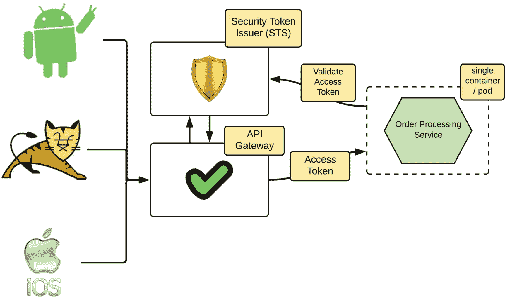
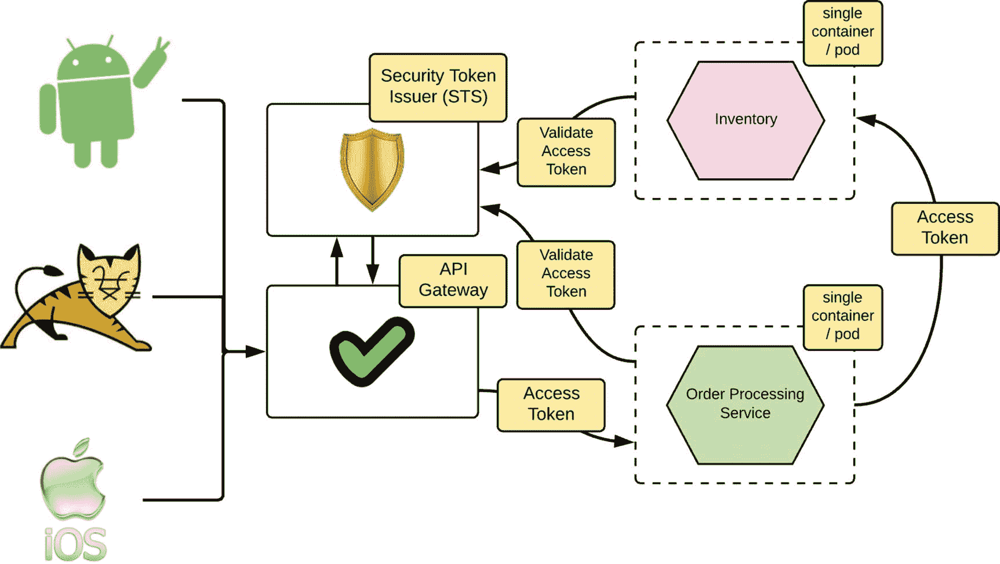
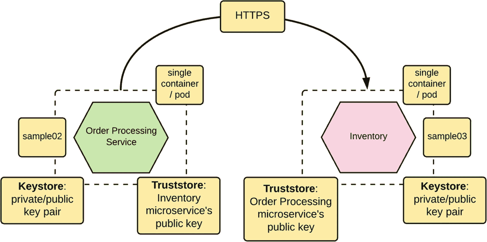

# 12. 保护微服务安全

在第 11 章“微服务安全基础”中，我们讨论了与保护微服务安全相关的通用模式和基础知识。如果您尚未阅读，我们强烈建议您先阅读该章。在本章中，我们将讨论如何使用 Spring Boot 实现微服务安全。我们将解释如何以最终用户或系统身份直接调用微服务，如何保护两个微服务之间的通信，如何进行访问控制，以及如何保护对 Actuator 端点的访问。

## 使用 OAuth 2.0 保护微服务安全

在典型的微服务部署中，OAuth 2.0 用于边缘安全（见图 12-1）。位于微服务部署前端的网关将验证 OAuth 2.0 访问令牌，并向下游微服务颁发自己的令牌。该令牌可以是内部安全令牌服务（STS）颁发的另一个 OAuth 令牌，所有下游微服务都信任该服务。如果是自包含的访问令牌（或 JSON Web 令牌），则微服务自身可以通过验证其签名来验证令牌。如果不是，则必须与安全令牌服务暴露的令牌验证端点通信。在本章的示例中，我们跳过了网关交互，接收访问令牌的微服务直接与令牌颁发者通信以验证令牌。



图 12-1

通过 API 网关访问受保护的微服务

### 启用传输层安全性（TLS）

图 12-1 中使用的 OAuth 2.0 令牌是 Bearer 令牌。Bearer 令牌就像现金。如果有人从你那里偷了十美元，没有人能阻止他或她在星巴克用偷来的钱买一杯咖啡。收银员永远不会质疑此人证明钱的所有权。同样，任何窃取 Bearer 令牌的人都可以冒充其所有者，并访问资源（或微服务）。每当我们使用 Bearer 令牌时，都必须通过安全的通信通道使用它们，因此我们需要为图 12-1 中所示的所有通信通道启用 TLS。


### 注意

要运行本章中的示例，你需要 Java 8 或更高版本、Maven 3.2 或更高版本，以及一个 Git 客户端。成功安装这些工具后，你需要克隆 Git 仓库：[`https://github.com/microservices-for-enterprise/samples.git`](https://github.com/microservices-for-enterprise/samples.git)。本章的示例位于 `ch12` 目录中。

`:\> git clone https://github.com/microservices-for-enterprise/samples.git`

要启用 TLS，首先需要创建一个公钥/私钥对。以下命令使用 Java 默认发行版自带的 `keytool` 来生成密钥对，并将其存储在 `keystore.jks` 文件中。该文件也称为密钥库，可以有多种格式。两种最流行的格式是 Java 密钥库 (JKS) 和 PKCS#12。JKS 是 Java 特有的格式，而 PKCS#12 是公钥密码标准 (PKCS) 系列标准中的一种标准。在以下命令中，我们通过 `storetype` 参数指定密钥库类型，并将其设置为 `JKS`。

```
\> keytool -genkey -alias spring -storetype JKS -keyalg RSA -keysize 2048 -keystore keystore.jks -validity 3650
```

此命令中的 `alias` 参数指定如何标识存储在密钥库中的已生成密钥。一个给定的密钥库中可以存储多个密钥，并且相应 `alias` 的值必须是唯一的。这里我们使用 `spring` 作为别名。`validity` 参数指定生成的密钥仅在 10 年（即 3650 天）内有效。`keysize` 和 `keystore` 参数分别指定生成密钥的长度和存储密钥的密钥库名称。`genkey` 选项指示 `keytool` 生成新密钥；除了 `genkey`，你也可以使用 `genkeypair` 选项。执行此命令后，系统会提示你输入密钥库密码，并要求你输入生成证书所需的数据，如下所示。

```
Enter keystore password: XXXXXXXXX
Re-enter new password: XXXXXXXXX
What is your first and last name?
[Unknown]:  foo
What is the name of your organizational unit?
[Unknown]:  bar
What is the name of your organization?
[Unknown]:  zee
What is the name of your City or Locality?
[Unknown]:  sjc
What is the name of your State or Province?
[Unknown]:  ca
What is the two-letter country code for this unit?
[Unknown]:  us
Is CN=foo, OU=bar, O=zee, L=sjc, ST=ca, C=us correct?
[no]:  yes
```

此示例中创建的证书称为自签名证书。换句话说，没有证书颁发机构 (CA)。通常在生产部署中，你要么使用公共证书颁发机构，要么使用企业级证书颁发机构来签署公共证书，这样任何信任该证书颁发机构的客户端都可以验证它。如果你使用证书来保护微服务部署中的服务间通信，则无需担心公共证书颁发机构的问题。你可以拥有自己的证书颁发机构。

### 注意

对于每个微服务，你需要创建一个唯一的密钥库以及一个密钥对。为方便起见，在本章中，我们为所有微服务使用相同的密钥库。

要为 Spring Boot 微服务启用 TLS，请将之前创建的密钥库文件 (`keystore.jks`) 复制到示例的主目录（例如 `ch12/sample01/`），并将以下内容添加到 `[SAMPLE_HOME]/src/main/resources/application.properties` 中。你从 `samples` Git 仓库下载的示例已经包含了这些值。我们使用 `springboot` 作为密钥库和私钥的密码。

```
server.port: 8443
server.ssl.key-store: keystore.jks
server.ssl.key-store-password: springboot
server.ssl.keyAlias: spring
```

要验证一切是否正常，请使用以下命令从 `ch12/sample01/` 目录启动 `TokenService` 微服务。注意打印 HTTPS 端口的行。

```
\> mvn spring-boot:run
Tomcat started on port(s): 8443 (https) with context path "
```

### **注意**

在接下来的章节中，我们假设所有示例都已配置了 TLS，并使用我们在此处创建的相同密钥库。


### 搭建 OAuth 2.0 授权服务器

授权服务器的职责是向其客户端颁发令牌，并响应来自下游微服务的验证请求。它还扮演着安全令牌服务（STS）的角色，如图 12-1 所示。目前有许多开源的 OAuth 2.0 授权服务器可供选择：WSO2 Identity Server、Keycloak、Gluu 等等。在生产环境中，你可以使用其中任意一种，但在此示例中，我们将使用 Spring Boot 搭建一个简单的 OAuth 2.0 授权服务器。它本身也是一个微服务，在开发者测试中非常实用。授权服务器对应的代码位于 `ch12/sample01` 目录下。

首先，我们来看一下 `ch12/sample01/pom.xml` 中值得关注的 Maven 依赖。这些依赖引入了一组新的注解（`@EnableAuthorizationServer` 注解和 `@EnableResourceServer` 注解），用于将 Spring Boot 应用转变为 OAuth 2.0 授权服务器。

```
org.springframework.boot
spring-boot-starter-security

org.springframework.security.oauth
spring-security-oauth2

```

`sample01/src/main/java/com/apress/ch12/sample01/TokenServiceApp.java` 类带有 `@EnableAuthorizationServer` 注解，该注解将项目转变为 OAuth 2.0 授权服务器。我们在同一个类上添加了 `@EnableResourceServer` 注解，因为它还需要充当资源服务器来验证访问令牌并返回用户信息。可以理解，这里的术语有些令人困惑，但这正是在 Spring Boot 中实现令牌验证端点（实际上是用户信息端点，它也会间接进行令牌验证）的最简单方法。当你使用自包含的访问令牌（JWT）时，则不需要此令牌验证端点。

在 Spring Boot 授权服务器中注册客户端有多种方式。本示例在代码本身中注册客户端，具体在 `sample01/src/main/java/com/apress/ch12/sample01/config/AuthorizationServerConfig.java` 文件中。`AuthorizationServerConfig` 类继承了 `AuthorizationServerConfigurerAdapter` 类以覆盖其默认行为。在此，我们将客户端 ID 设置为 `10101010`，客户端密钥设置为 `11110000`，可用的作用域值设置为 `foo` 和/或 `bar`，授权的授权类型设置为 `client_credentials`、`password` 和 `refresh_token`，并将访问令牌的有效期设置为 `60` 秒。我们在此使用的大部分术语都来自 OAuth 2.0，我们在第 11 章中已经解释过这些术语。

```
@Override
public void configure(ClientDetailsServiceConfigurer clients) throws Exception {
clients.inMemory().withClient("10101010")
.secret("11110000").scopes("foo", "bar")
.authorizedGrantTypes("client_credentials", "password",
"refresh_token")
.accessTokenValiditySeconds(60);
}
```

为了支持密码授权类型，授权服务器需要连接到一个用户存储。用户存储可以是存储用户凭据和属性的数据库或 LDAP 服务器。Spring Boot 支持与多种用户存储集成，但同样，最方便且足以满足本示例需求的是内存用户存储。以下来自 `sample01/src/main/java/com/apress/ch12/sample01/config/WebSecurityConguration.java` 文件的代码向系统添加了一个具有 `USER` 角色的用户。

```
@Override
public void configure(AuthenticationManagerBuilder auth) throws
Exception {
auth.inMemoryAuthentication()
.withUser("peter").password("peter123").roles("USER");
}
```

一旦我们在 Spring Boot 中定义了内存用户存储，我们还需要将其与 OAuth 2.0 授权流程关联起来，如下所示，代码位于 `sample01/src/main/java/com/apress/ch12/sample01/config/AuthorizationServerConfig.java`。

```
@Autowired
private AuthenticationManager authenticationManager;
@Override
public void configure(AuthorizationServerEndpointsConfigurer endpoints) throws Exception {
endpoints.authenticationManager(authenticationManager);
}
```

要启动授权服务器，请在 `ch12/sample01/` 目录下使用以下命令来启动 `TokenService` 微服务。

```
\> mvn spring-boot:run
```

要使用客户端凭据 OAuth 2.0 授权类型获取访问令牌，请使用以下命令。确保适当替换 `$CLIENTID` 和 `$CLIENTSECRET` 的值。本示例中使用的客户端 ID 和客户端密钥的硬编码值分别为 `10101010` 和 `11110000`。

```
\> curl -v -X POST --basic -u $CLIENTID:$CLIENTSECRET -H "Content-Type: application/x-www-form-urlencoded;charset=UTF-8" -k -d "grant_type=client_credentials&scope=foo" https://localhost:8443/oauth/token
{"access_token":"81aad8c4-b021-4742-93a9-e25920587c94","token_type":"bearer","expires_in":43199,"scope":"foo"}
```

### 注意

我们在 cURL 命令中使用了 `–k` 选项。由于我们使用自签名（不受信任的）证书来保护 HTTPS 端点，因此需要传递 `–k` 参数来告诉 cURL 忽略信任验证。你可以从 OAuth 2.0 6749 RFC 中找到有关此处所用参数的更多详细信息：[`https://tools.ietf.org/html/rfc6749`](https://tools.ietf.org/html/rfc6749)。

要使用密码 OAuth 2.0 授权类型获取访问令牌，请使用以下命令。确保适当替换 `$CLIENTID`、`$CLIENTSECRET`、`$USERNAME` 和 `$PASSWORD` 的值。本示例中使用的客户端 ID 和客户端密钥的硬编码值分别为 `10101010` 和 `11110000`；对于 `username` 和 `password`，我们使用了 `peter` 和 `peter123`。

```
\> curl -v -X POST --basic -u $CLIENTID:$CLIENTSECRET -H "Content-Type: application/x-www-form-urlencoded;charset=UTF-8" -k -d "grant_type=password&username=$USERNAME&password=$PASSWORD&scope=foo" https://localhost:8443/oauth/token
{"access_token":"69ff86a8-eaa2-4490-adda-6ce0f10b9f8b","token_type":"bearer","refresh_token":"ab3c797b-72e2-4a9a-a1c5-c550b2775f93","expires_in":43199,"scope":"foo"}
```


### 注意

如果你仔细观察我们为 OAuth 2.0 客户端凭证授权类型和密码授权类型获得的两种响应，你可能会注意到客户端凭证授权类型流程中没有刷新令牌。在 OAuth 2.0 中，当访问令牌过期时，刷新令牌用于获取新的访问令牌。这在用户离线且客户端应用程序无法访问其凭据以获取新访问令牌时非常有用。在这种情况下，唯一的方法是使用刷新令牌。对于客户端凭证授权类型，没有用户参与，并且它始终可以访问自己的凭据，因此它可以随时用于获取新的访问令牌。因此，不需要刷新令牌。

现在，让我们看看如何通过与授权服务器通信来验证访问令牌。资源服务器通常执行此操作。运行在资源服务器上的拦截器拦截请求，提取访问令牌，然后与授权服务器通信。我们将在下一节中看到如何配置资源服务器（另一个受 OAuth 2.0 保护的微服务），以下命令展示了如何直接与授权服务器通信以验证上一条命令中获取的访问令牌。请务必将 `$TOKEN` 值替换为相应的访问令牌。

```
\> curl -k -X POST -H "Authorization: Bearer $TOKEN" -H "Content-Type: application/json"   https://localhost:8443/user
{"details":{"remoteAddress":"0:0:0:0:0:0:0:1","sessionId":null,"tokenValue":"9f3319a1-c6c4-4487-ac3b-51e9e479b4ff","tokenType":"Bearer","decodedDetails":null},"authorities":[],"authenticated":true,"userAuthentication":null,"credentials":"","oauth2Request":{"clientId":"10101010","scope":["bar"],"requestParameters":{"grant_type":"client_credentials","scope":"bar"},"resourceIds":[],"authorities":[],"approved":true,"refresh":false,"redirectUri":null,"responseTypes":[],"extensions":{},"grantType":"client_credentials","refreshTokenRequest":null},"clientOnly":true,"principal":"10101010","name":"10101010"}
```

如果令牌有效，此命令将返回与访问令牌关联的元数据。响应是在 `sample01/src/main/java/com/apress/ch12/sample01/TokenServiceApp.java` 类的 `user()` 方法内部构建的，如下面的代码片段所示。通过 `@RequestMapping` 注解，我们将 `/user` 上下文（来自请求）映射到 `user()` 方法。

```
@RequestMapping("/user")
public Principal user(Principal user) {
return user;
}
```

### 注意

默认情况下，在没有扩展的情况下，Spring Boot 会将已颁发的令牌存储在内存中。如果在颁发令牌后重新启动服务器，然后尝试验证该令牌，将会导致错误响应。

### 使用 OAuth 2.0 保护微服务

在本节中，我们将了解如何使用 OAuth 2.0 保护 Spring Boot 微服务。在 OAuth 术语中，它被称为资源服务器。与受 OAuth 2.0 保护的 `订单处理` 微服务对应的代码位于 `ch12/sample02` 目录中。为了使用 OAuth 2.0 保护微服务，我们将 `@EnableResourceServer` 注解添加到 `sample02/src/main/java/com/apress/ch12/sample02/OrderProcessingApp.java` 类，并将 `sample02/src/main/resources/application.properties` 文件中的 `security.oauth2.resource.user-info-uri` 属性指向授权服务器的用户信息端点。以下显示了与 `sample02` 对应的 `application.properties` 文件。请注意，`security.oauth2.resource.jwt.keyUri` 属性默认被注释掉了；我们将在本章后面讨论其用法。

```
server.port=9443
server.ssl.key-store: keystore.jks
server.ssl.key-store-password: springboot
server.ssl.keyAlias: spring
security.oauth2.resource.user-info-uri=https://localhost:8443/user
#security.oauth2.resource.jwt.keyUri: https://localhost:8443/oauth/token_key
```

由于 `订单处理` 微服务通过 HTTPS 调用用户信息端点，并且我们使用自签名证书来保护授权服务器，因此此调用将导致信任验证错误。为了解决这个问题，我们需要将授权服务器的公共证书从 `ch12/sample01/keystore.jks` 导出到一个新的密钥库，并将其设置为 `订单处理` 微服务的信任库。

使用以下 `keytool` 命令导出公共证书并将其存储在 `cert.crt` 文件中。用于保护 `keystore.jks` 的密码是 `springboot`。除了使用 `export` 参数（指示 `keytool` 导出给定 `alias` 下的证书）外，您还可以使用 `exportcert` 参数。

```
\> keytool -export -keystore keystore.jks -alias spring -file cert.crt
```

现在使用以下 `keytool` 命令创建一个包含 `cert.crt` 的新信任库。这里我们使用 `authserver` 作为别名，将授权服务器的公共证书存储在 `trust-store.jks` 中，并将该信任库复制到 `ch12/sample02` 目录（默认情况下，当您从示例 Git 仓库克隆代码时，您会在相应目录下找到运行示例所需的所有密钥库和信任库）。我们也使用相同的密码 `springboot` 来保护 `trust-store.jks`。除了使用 `import` 参数（指示 `keytool` 导入给定 `alias` 下的证书）外，您还可以使用 `importcert` 参数。

```
\> keytool -import -file cert.crt -alias authserver -keystore trust-store.jks
```

我们还需要在代码中将信任库的位置及其密码设置为系统参数。您将在 `sample02/src/main/java/com/apress/ch12/sample02/OrderProcessingApp.java` 类中找到以下代码片段，用于设置系统属性。

```
static {
String path = System.getProperty("user.dir");
System.setProperty("javax.net.ssl.trustStore", path
+ File.separator + "trust-store.jks");
System.setProperty("javax.net.ssl.trustStorePassword", "springboot");
HttpsURLConnection.setDefaultHostnameVerifier(new HostnameVerifier()
{
public boolean verify(String hostname, SSLSession session) {
return true;
}
});
}
```


除了设置信任库系统属性外，这段代码片段中的最后几行代码还做了其他事情。除了信任验证之外，在与授权服务器建立 HTTPS 连接时，我们还可能遇到另一个潜在问题。当我们向服务器发起 HTTPS 调用时，客户端通常会检查服务器证书的通用名称（CN）是否与我们服务器 URL 中的主机名匹配。例如，当我们在 `user-info-url`（指向授权服务器）中使用 `localhost` 作为主机名时，授权服务器的公钥证书必须将 `localhost` 作为通用名称。否则，就会导致错误。这段代码通过重写 `verify` 函数并返回 `true` 来忽略主机名验证。理想情况下，在生产部署中，你应该使用正确的证书并避免此类变通方法。

让我们使用 `ch12/sample02/` 目录中的以下命令来启动 `Order Processing` 微服务；它将在 HTTPS 端口 9443 上启动。

```
\> mvn spring-boot:run
```

首先，让我们尝试使用以下不带有效访问令牌的 cURL 命令来调用该服务，理想情况下，这应该返回一个错误响应。

```
\> curl -k https://localhost:9443/order/11
{"error":"unauthorized","error_description":"Full authentication is required to access this resource"}
```

现在，让我们使用从 OAuth 2.0 授权服务器获取的有效访问令牌来调用同一个服务。确保 `$TOKEN` 的值被正确替换为有效的访问令牌。

```
\> curl -k -H "Authorization: Bearer $TOKEN" https://localhost:9443/order/11
{"customer_id":"101021","order_id":"11","payment_method":{"card_type":"VISA","expiration":"01/22","name":"John Doe","billing_address":"201, 1st Street, San Jose, CA"},"items":[{"code":"101","qty":1},{"code":"103","qty":5}],"shipping_address":"201, 1st Street, San Jose, CA"}
```

如果我们看到这个响应，那么我们的 OAuth 2.0 授权服务器和受 OAuth 2.0 保护的微服务就运行正常了。

## 使用自包含访问令牌（JWT）保护微服务

在第 11 章中，我们详细讨论了 JWT 及其用法。在本节中，我们将使用从我们的 OAuth 2.0 授权服务器颁发的 JWT 来访问受保护的微服务。

### 设置授权服务器以颁发 JWT

在本节中，我们将了解如何扩展我们在上一节（`ch12/sample01/`）中使用的授权服务器，以支持自包含访问令牌或 JWT。第一步是创建一个新的密钥对以及一个密钥库。此密钥用于签署从授权服务器颁发的 JWT。以下 `keytool` 命令将创建一个包含密钥对的新密钥库。

```
\> keytool -genkey -alias jwtkey -keyalg RSA -keysize 2048 -dname "CN=localhost" -keypass springboot -keystore jwt.jks -storepass springboot
```

此命令创建一个名为 `jwt.jks` 的密钥库，并使用密码 `springboot` 进行保护。我们需要将此密钥库复制到 `sample01/src/main/resources/`。要生成自包含访问令牌，我们需要在 `sample01/src/main/resources/application.properties` 文件中设置以下属性的值。

```
spring.security.oauth.jwt: true
spring.security.oauth.jwt.keystore.password: springboot
spring.security.oauth.jwt.keystore.alias: jwtkey
spring.security.oauth.jwt.keystore.name: jwt.jks
```

`spring.security.oauth.jwt` 的值默认设置为 `false`，需要将其更改为 `true` 才能颁发 JWT。其他三个属性不言自明，你需要根据创建密钥库时使用的值进行适当设置。

让我们浏览一下源代码中为支持 JWT 所做的显著更改。首先，在 `pom.xml` 文件中，我们需要添加以下依赖项，该依赖项负责构建 JWT。

```
org.springframework.security
spring-security-jwt

```

在 `sample01/src/main/java/com/apress/ch12/sample01/config/AuthorizationServerConfig.java` 类中，我们添加了以下方法，该方法负责注入有关如何从密钥库检索私钥的详细信息。此私钥用于签署 JWT。

```
@Bean
protected JwtAccessTokenConverter jwtConeverter() {
String pwd = environment.getProperty(
"spring.security.oauth.jwt.keystore.password");
String alias = environment.getProperty(
"spring.security.oauth.jwt.keystore.alias");
String keystore = environment.getProperty(
"spring.security.oauth.jwt.keystore.name");
KeyStoreKeyFactory keyStoreKeyFactory = new KeyStoreKeyFactory(
new ClassPathResource(keystore),
pwd.toCharArray());
JwtAccessTokenConverter converter = new JwtAccessTokenConverter();
converter.setKeyPair(keyStoreKeyFactory.getKeyPair(alias));
return converter;
}
```

在同一个类文件中，我们还设置了 `JwtTokenStore` 作为令牌存储。以下函数以一种方式实现，即仅当 `application.properties` 文件中的 `spring.security.oauth.jwt` 属性设置为 `true` 时，我们才将 `JwtTokenStore` 设置为令牌存储。

```
@Bean
public TokenStore tokenStore() {
String useJwt = environment.getProperty("spring.security.oauth.jwt");
if (useJwt != null && "true".equalsIgnoreCase(useJwt.trim())) {
return new JwtTokenStore(jwtConeverter());
} else {
return new InMemoryTokenStore();
}
}
```

最后，我们需要将令牌存储设置到 `AuthorizationServerEndpointsConfigurer`，这在以下函数中完成，并且同样，仅当我们想要使用 JWT 时才进行设置。

```
@Autowired
private AuthenticationManager authenticationManager;
@Override
public void configure(AuthorizationServerEndpointsConfigurer endpoints) throws Exception {
String useJwt = environment.getProperty("spring.security.oauth.jwt");
if (useJwt != null && "true".equalsIgnoreCase(useJwt.trim())) {
endpoints.tokenStore(tokenStore()).tokenEnhancer(jwtConeverter())
.authenticationManager(authenticationManager);
} else {
endpoints.authenticationManager(authenticationManager);
}
}
```

要启动授权服务器，请使用 `ch12/sample01/` 目录中的以下命令来启动 `TokenService` 微服务，该服务现在会颁发自包含访问令牌（JWT）。

```
\> mvn spring-boot:run
```

要使用客户端凭证 OAuth 2.0 授权类型获取访问令牌，请使用以下命令。确保适当替换 `$CLIENTID` 和 `$CLIENTSECRET` 的值。

```
\> curl -v -X POST --basic -u $CLIENTID:$CLIENTSECRET -H "Content-Type: application/x-www-form-urlencoded;charset=UTF-8" -k -d "grant_type=client_credentials&scope=foo" https://localhost:8443/oauth/token
```

此命令将返回一个 base64-url 编码的 JWT，以下显示了解码后的版本。

```
{ "alg": "RS256", "typ": "JWT" }
{ "scope": [ "foo" ], "exp": 1524793284, "jti": "6e55840e-886c-46b2-bef7-1a14b813dd0a", "client_id": "10101010" }
```

这里只显示了解码后的头部和负载；我们跳过了签名（它是 JWT 的第三部分）。由于我们使用了 `client_credentials` 授权类型，JWT 不包含主题或用户名。它还包含与令牌关联的作用域值。


### 使用 JWT 保护微服务

在本节中，我们将了解如何扩展上一节（`ch12/sample02/`）中使用的`订单处理`微服务，以支持自签发访问令牌或 JWT。我们只需在 `sample02/src/main/resources/application.properties` 文件中注释掉 `security.oauth2.resource.user-info-uri` 属性，并取消注释 `security.oauth2.resource.jwt.keyUri` 属性。完整的 `application.properties` 文件将如下所示。

```
#security.oauth2.resource.user-info-uri:https://localhost:8443/user
security.oauth2.resource.jwt.keyUri: https://localhost:8443/oauth/token_key
```

这里，`security.oauth2.resource.jwt.keyUri` 的值指向与私钥对应的公钥，授权服务器使用该私钥对 JWT 进行签名。这是授权服务器上的一个端点。如果你在浏览器中直接输入 `https://localhost:8443/oauth/token_key`，你将找到公钥，如下所示。资源服务器（在本例中为`订单处理`微服务）使用此密钥来验证请求中包含的 JWT 的签名。

```
{
"alg":"SHA256withRSA",
"value":"-----BEGIN PUBLIC KEY-----\nMIIBIjANBgkqhkiG9w0BAQEFAAOCAQ8AMIIBCgKCAQEA+WcBjPsrFvGOwqVJd8vpV+gNx5onTyLjYx864mtIvUxO8D4mwAaYpjXJgsre2dcXjQ03BOLJdcjY5Nc9Kclea09nhFIEJDG3obwxm9gQw5Op1TShCP30Xqf8b7I738EHDFT6qABul7itIxSrz+AqUvj9LSUKEw/cdXrJeu6b71qHd/YiElUIA0fjVwlFctbw7REbi3Sy3nWdm9yk7M3GIKka77jxw1MwIBg2klfDJgnE72fPkPi3FmaJTJA4+9sKgfniFqdMNfkyLVbOi9E3DlaoGxEit6fKTI9GR1SWX40FhhgLdTyWdu2z9RS2BOp+3d9WFMTddab8+fd4L2mYCQIDAQAB\n-----END PUBLIC KEY-----"
}
```

一旦我们从 OAuth 2.0 授权服务器获得 JWT 访问令牌，与之前一样，使用以下 cURL 命令，我们就可以访问受保护的资源。请确保将 `$TOKEN` 的值替换为有效的访问令牌。

```
\> curl -k -H "Authorization: Bearer $TOKEN" https://localhost:9443/order/11
{"customer_id":"101021","order_id":"11","payment_method":{"card_type":"VISA","expiration":"01/22","name":"John Doe","billing_address":"201, 1st Street, San Jose, CA"},"items":[{"code":"101","qty":1},{"code":"103","qty":5}],"shipping_address":"201, 1st Street, San Jose, CA"}
```

## 控制对微服务的访问

有多种方法可以控制对微服务的访问。在本节中，我们将了解如何根据与访问令牌关联的作用域和用户角色来控制对微服务中不同操作的访问。

### 基于作用域的访问控制

这里我们使用自包含访问令牌（或 JWT），首先你需要从 OAuth 2.0 授权服务器获取一个有效的 JWT。以下命令将为你获取一个作用域为 `foo` 的 JWT 访问令牌。请确保适当替换 `$CLIENTID` 和 `$CLIENTSECRET` 的值，并保持 `sample01`（即我们的授权服务器）运行。

```
\> curl -v -X POST --basic -u $CLIENTID:$CLIENTSECRET -H "Content-Type: application/x-www-form-urlencoded;charset=UTF-8" -k -d "grant_type=client_credentials&scope=foo" https://localhost:8443/oauth/token
```

要为`订单处理`微服务（`sample02`）启用基于作用域的访问控制，我们需要将 `@EnableGlobalMethodSecurity` 注解添加到 `sample02/src/main/java/com/apress/ch12/sample02/OrderProcessingApp.java` 类中，如下所示。

```
@SpringBootApplication
@EnableGlobalMethodSecurity(prePostEnabled = true)
@EnableResourceServer
public class OrderProcessingApp {
}
```

现在，让我们在方法级别使用 `@PreAuthorize` 注解来实施基于作用域的访问控制。`sample02/src/main/java/com/apress/ch12/sample02/service/OrderProcessing.java` 类中的以下方法需要 `bar` 作用域才能访问。

```
@PreAuthorize("#oauth2.hasScope('bar')")
@RequestMapping(value = "/{id}", method= RequestMethod.GET)
public ResponseEntity getOrder(@PathVariable("id") String orderId) {
}
```

让我们尝试运行以下 cURL 命令，使用之前获取的仅具有 `foo` 作用域的 JWT 访问令牌。该命令应该会返回错误，因为我们的令牌不包含所需的作用域值。

```
\> curl -k -H "Authorization: Bearer $TOKEN" https://localhost:9443/order/11
{"error":"access_denied","error_description":"Access is denied"}
```

### 基于角色的访问控制

与上一节类似，这里我们必须使用自包含访问令牌（或 JWT），首先你需要从 OAuth 2.0 授权服务器获取一个有效的 JWT。

以下 cURL 命令将使用 `password` 授权类型为你提供一个 JWT 访问令牌。请确保适当替换 `$CLIENTID`、`$CLIENTSECRET`、`$USERNAME` 和 `$PASSWORD` 的值。与基于作用域的场景不同，客户端凭证授权类型在这里不起作用，因为默认情况下，客户端没有关联角色（只有用户有关联角色）。

```
\> curl -v -X POST --basic -u $CLIENTID:$CLIENTSECRET -H "Content-Type: application/x-www-form-urlencoded;charset=UTF-8" -k -d "grant_type=password&username=$USERNAME&password=$PASSWORD&scope=foo" https://localhost:8443/oauth/token
```

要为`订单处理`微服务（`sample02`）启用基于角色的访问控制，我们需要将 `@EnableGlobalMethodSecurity` 注解添加到 `sample02/src/main/java/com/apress/ch12/sample02/OrderProcessingApp.java` 类中，如下所示（这与我们在上一节设置基于作用域的访问控制时执行的步骤相同）。

```
@SpringBootApplication
@EnableGlobalMethodSecurity(prePostEnabled = true)
@EnableResourceServer
public class OrderProcessingApp {
}
```

现在，让我们在方法级别使用 `@PreAuthorize` 注解来实施基于角色的访问控制。`sample02/src/main/java/com/apress/ch12/sample02/service/OrderProcessing.java` 类中的以下方法需要 `USER` 角色才能访问。默认情况下，我们从授权服务器将 `USER` 角色添加给了名为 `peter` 的用户。因此，颁发给他的访问令牌应该足以访问此操作。

```
@PreAuthorize("hasRole(USER)")
@RequestMapping(value = "/{id}", method= RequestMethod.GET)
public ResponseEntity getOrder(@PathVariable("id") String orderId) {
}
```

让我们尝试运行以下 cURL 命令，使用之前获取的仅具有 `foo` 作用域的 JWT 访问令牌。如果该令牌是颁发给具有 `USER` 角色的用户，则应该会返回成功响应。

```
\> curl -k -H "Authorization: Bearer $TOKEN" https://localhost:9443/order/11
```

最后，如果我们想同时根据作用域和角色来控制对某个方法的访问，我们可以对相应方法使用以下注解。

```
@PreAuthorize("#oauth2.hasScope('bar') and hasRole('USER')")
```

## 保护服务间通信

在上一节中，我们讨论了如何设置 OAuth 2.0 授权以及如何使用 OAuth 2.0 保护微服务。在本节中，我们将了解如何安全地从一个微服务调用另一个微服务。我们采用两种方法——一种基于 JWT，另一种基于 TLS 双向认证。


### 使用 JWT 保障服务间通信安全

在本节中，我们将了解如何通过传递 JWT，从另一个微服务调用受 OAuth 2.0 保护的微服务。

图 12-2 在图 12-1 的基础上引入了 `Inventory` 微服务。收到订单后，`Order Processing` 微服务会与 `Inventory` 微服务通信以更新库存。在此过程中，`Order Processing` 微服务将其获取的访问令牌传递给 `Inventory` 微服务。



图 12-2

使用 OAuth 2.0 保护服务间通信

如果我们使用自包含的（JWT）访问令牌，图 12-2 中的令牌验证步骤将会改变。在这种情况下，微服务无需向授权服务器（或安全令牌颁发者）发起验证调用。每个微服务将从授权服务器获取相应的公钥，并在本地验证 JWT 的签名。

在本示例中，我们使用 JWT 访问令牌。在前面的章节中，我们已经配置了授权服务器（`sample01`）和 `Order Processing` 微服务（`sample02`）以支持 JWT。现在，让我们看看如何设置 `Inventory` 微服务。与 `Inventory` 微服务对应的代码位于 `ch12/sample03` 目录中。其工作方式与 `sample02` 中的 `Order Processing` 微服务几乎相同。要启用 JWT 认证，请确保在 `sample03/src/main/resources/application.properties` 文件中取消以下属性的注释。

```
security.oauth2.resource.jwt.keyUri: https://localhost:8443/oauth/token_key
```

现在，我们可以从 `sample03` 目录运行以下 Maven 命令来启动 `Inventory` 微服务。该服务将在 HTTPS 端口 10443 上启动。

```
\> mvn spring-boot:run
```

要执行端到端流程，我们需要在 `Order Processing`（`sample02`）微服务处下订单。它只会与 `Inventory`（`sample03`）微服务通信。在针对 `Order Processing` 微服务运行 cURL 客户端之前，让我们先查看其与 `Inventory` 微服务通信的代码。我们使用 `OAuth2RestTemplate` 与 `Inventory` 微服务通信，它会自动传递从客户端应用程序获取的访问令牌（`Order Processing` 微服务）。相应的代码位于 `sample02/src/main/java/com/apress/ch12/sample02/client/InventoryClient.java` 文件中。`Order Processing` 微服务从客户端应用程序获取完整订单，然后从请求中提取商品列表，并通过与 `Inventory` 微服务通信来更新库存。

```
@Component
public class InventoryClient {
@Autowired
OAuth2RestTemplate restTemplate;
public void updateInventory(Item[] items) {
URI uri = URI.create("https://localhost:10443/inventory");
restTemplate.put(uri, items);
}
}
```

假设 OAuth 2.0 授权服务器（`sample01`）正在运行，让我们运行以下 cURL 命令来获取访问令牌。请确保适当替换 `$CLIENTID`、`$CLIENTSECRET`、`$USERNAME` 和 `$PASSWORD` 的值。另请注意，我们同时传递了 `foo` 和 `bar` 作为作用域值。

```
\> curl -v -X POST --basic -u $CLIENTID:$CLIENTSECRET -H "Content-Type: application/x-www-form-urlencoded;charset=UTF-8" -k -d "grant_type=password&username=$USERNAME&password=$PASSWORD&scope=foo bar" https://localhost:8443/oauth/token
```

这将生成一个 JWT 访问令牌。使用该令牌，让我们通过运行以下 cURL 命令与 `Order Processing` 微服务（`sample02`）通信来下订单。

```
curl -v  -k -H "Authorization: Bearer $TOKEN" -H "Content-Type: application/json" -d '{"customer_id":"101021","payment_method":{"card_type":"VISA","expiration":"01/22","name":"John Doe","billing_address":"201, 1st Street, San Jose, CA"},"items":[{"code":"101","qty":1},{"code":"103","qty":5}],"shipping_address":"201, 1st Street, San Jose, CA"}' https://localhost:9443/order
```

如果一切正常，我们应该会在 cURL 客户端看到 `201` HTTP 状态码，并且在运行 `Inventory` 微服务的终端上会打印出订单号。


### 使用 TLS 双向认证保护服务间通信

在本节中，我们将了解如何在 `Order Processing` 微服务和 `Inventory` 微服务之间启用 TLS 双向认证。在大多数情况下，TLS 双向认证用于实现服务器之间的身份验证，而 JWT 则用于在微服务之间传递用户上下文。

启用双向认证的一个主要要求是每个服务都应拥有自己的密钥库（`keystore.jks`）和信任库（`trust-store.jks`）。尽管两者都是密钥库，但我们特意使用“密钥库”一词来强调存储服务器私钥/公钥对的密钥库，而信任库则存储受信任服务器和客户端的公钥证书。例如，当 `Order Processing` 微服务与受 TLS 双向认证保护的 `Inventory` 微服务通信时，签署 `Order Processing` 微服务公钥的证书颁发机构的公钥证书必须存在于 `Inventory` 微服务的信任库（`sample03/trust-store.jks`）中。

由于我们在此处使用自签名证书，因此没有证书颁发机构，故直接包含公钥证书本身。作为 TLS 双向认证客户端的 `Order Processing` 微服务，在 TLS 握手期间使用其密钥库（`sample02/keystore.jks`）中的密钥进行身份验证。它还必须将签署 `Inventory` 微服务公钥的证书颁发机构的公钥证书存储在其信任库（`sample02/trust-store.jks`）中。同样，由于我们没有证书颁发机构，因此直接存储公钥证书本身。图 12-3 说明了我们在此讨论的内容。



图 12-3

为促进 TLS 双向认证而分发的证书

让我们重新审视在 `Order Processing` 微服务中设置密钥库所涉及的步骤。首先，确保我们在 `sample02/keystore.jks` 处有密钥库，在 `sample02/trust-store.jks` 处有信任库。以下与这两个密钥库相关的属性已在 `sample02/src/main/java/com/apress/ch12/sample02/OrderProcessingApp.java` 文件中正确设置。此外，我们已将 `Inventory` 微服务的公钥证书添加到 `sample02/trust-store.jks` 文件中。

```
System.setProperty("javax.net.ssl.trustStore", path + File.separator + "trust-store.jks");
System.setProperty("javax.net.ssl.trustStorePassword", "springboot")
System.setProperty("javax.net.ssl.keyStore",  path + File.separator + "keystore.jks");
System.setProperty("javax.net.ssl.keyStorePassword", "springboot");
```

一旦设置了 `javax.net.ssl.keyStore` 和 `javax.net.ssl.keyStorePassword` 系统属性，客户端会在 TLS 握手期间自动选择相应的密钥对，以响应服务器请求客户端证书的质询。

现在，让我们看看服务器端的配置。`Inventory` 微服务应将其密钥库放在 `/sample03/keystore.jks` 下，信任库放在 `sample03/trust-store.jks` 下。以下与信任库相关的属性已在 `sample03/src/main/java/com/apress/ch12/sample03/InventoryApp.java` 文件中正确设置。这里我们只设置了信任库属性。除非它充当 TLS 客户端，否则无需设置与密钥库相关的属性。

```
System.setProperty("javax.net.ssl.trustStore", path + File.separator + "trust-store.jks");
System.setProperty("javax.net.ssl.trustStorePassword", "springboot");
```

要为 `Inventory` 微服务启用 TLS 双向认证，请在 `sample03/src/main/resources/application.properties` 文件中设置以下属性。

```
server.ssl.client-auth:need
```

现在，我们可以通过使用有效的访问令牌调用 `Order Processing` 微服务来测试端到端流程。为了处理请求，`Order Processing` 微服务会与受 TLS 双向认证保护的 `Inventory` 微服务通信。

```
curl -v  -k -H "Authorization: Bearer $TOKEN" -H "Content-Type: application/json" -d '{"customer_id":"101021","payment_method":{"card_type":"VISA","expiration":"01/22","name":"John Doe","billing_address":"201, 1st Street, San Jose, CA"},"items":[{"code":"101","qty":1},{"code":"103","qty":5}],"shipping_address":"201, 1st Street, San Jose, CA"}' https://localhost:9443/order
```

## 保护 Actuator 端点

Spring Boot 通过 Actuator 提供了开箱即用的监控能力。对于任何 Spring Boot 微服务，您可以添加以下依赖项来激活 Actuator 端点。

```
org.springframework.boot
spring-boot-starter-actuator

```

一个包含此依赖项的示例微服务项目位于 `ch12/sample04`。让我们使用以下命令从 `sample04` 目录启动 `Order Processing` 微服务。该服务将在 HTTPS 端口 8443 上启动。

```
\> mvn spring-boot:run
```

由于此时我们尚未启用任何安全措施，如果运行以下 cURL 命令，它将成功返回响应。

```
\> curl -k https://localhost:8443/health
{"status":"UP"}>
```

要启用安全性，我们需要将以下依赖项添加到 `sample04/pom.xml` 文件中。

```
org.springframework.boot
spring-boot-starter-security

```

现在，取消注释 `sample04/src/main/java/com/apress/ch12/sample04/config/SecurityConfig.java` 文件中的 `@Configuration` 类级别注解。默认情况下它保持注释状态，这样 Spring Boot 就不会加载该类中覆盖的配置，我们可以尝试非安全场景。在同一个类中，以下代码片段向系统引入了一个名为 `admin` 且具有 `ACTUATOR` 角色的用户。当 Actuator 端点受到保护时，只有 `ACTUATOR` 角色中的用户才能调用这些端点。

```
@Override
public void configure(AuthenticationManagerBuilder auth) throws Exception {
auth.inMemoryAuthentication().withUser("admin")
.password("admin").roles("ACTUATOR");
}
```

现在重启服务，并使用 `admin/admin` 凭据尝试相同的 cURL 命令。

```
\> curl –k --basic -u admin:admin  https://localhost:8443/health
{"status":"UP"}
```

## 总结

在第 11 章中，我们讨论了与保护微服务相关的常见模式和基础知识。本章重点介绍了如何使用 Spring Boot 开发的微服务来构建这些模式。在下一章中，我们将讨论可观测性在微服务部署中的作用。


