# 13. 可观测性

收集数据的成本很低，但在需要时没有数据，代价可能非常高昂。2016 年 3 月，亚马逊宕机 20 分钟，预估收入损失达 375 万美元。同样在 2017 年 1 月，达美航空发生系统故障，导致超过 170 个航班取消，预估损失达 850 万美元。在这两个案例中，如果我们收集了适当级别的数据，本可以预测此类行为，或者在问题发生后通过识别根本原因迅速恢复。我们拥有的信息越多，就能做出更好的决策。

可观测性是指通过系统外部输出推断其内部状态的能力的度量^(¹⁵⁹)。这是最重要的方面之一，需要融入到任何微服务设计中。我们需要追踪每个微服务的吞吐量、成功/失败请求数、CPU、内存及其他网络资源的利用率，以及一些与业务相关的指标。在本章中，我们将讨论可观测性的必要性，日志、指标和追踪在可观测性中的作用，如何使用 Spring Cloud Sleuth、Zipkin 和 Jaeger 构建分布式追踪系统，以及可视化、监控和告警如何与 Prometheus 和 Grafana 协同工作。

## 可观测性的三大支柱

可观测性可以通过三种方式实现：*日志*、*指标*和*追踪*，它们也被称为可观测性的三大支柱。日志是关于记录事件。它可以是任何内容。每个经过微服务的事务都可以连同其他相关元数据一起记录，包括时间戳、状态（成功/失败）、发起者等。结合来自测量事件的数据可以推导出指标。例如，单位时间内处理的事务数和事务成功率/失败率就是关于微服务的指标。指标是衡量服务运行状况（好或坏）的指示。另一个例子是延迟。日志会捕获到达微服务的每个请求的时间戳以及相应的响应时间戳。这两个时间戳之间的差值就是给定请求的延迟。通过考虑一段时间内所有此类时间差，可以得出给定服务的平均延迟，这就是一个指标。在这里，延迟作为一个指标，帮助我们判断微服务是慢还是快。此外，当我们想要设置告警时，我们总是选择指标。如果我们希望在系统开始比预期慢时收到告警，我们可能可以设置一个关于延迟的告警。当平均延迟低于预设阈值时，系统将触发告警。总之，指标帮助我们识别趋势。

追踪也源自日志。它是对系统行为的一种不同视角，考虑了每个事件的顺序以及事件之间的相互影响。例如，追踪可以通过回溯到`订单处理`微服务，帮助你找到发往`计费`微服务的请求失败的根本原因。它并不总是需要跨越不同的系统；也可以只在一个系统内部。例如，如果下单需要 90 毫秒，追踪应该向我们展示延迟具体发生在哪里，以及不同组件如何导致延迟。

## 使用 Spring Cloud Sleuth 进行分布式追踪

分布式追踪有助于追踪跨越多个微服务的特定请求。由于微服务的特性，在大多数情况下，为了处理来自客户端的单个请求，会用到不止一个微服务。图 13-1 展示了在下单的单个请求过程中可能发生的微服务之间的所有交互。有些请求是直接的服务间调用，而另一些则是基于消息系统的异步调用。无论服务间通信如何发生，分布式追踪都提供了一种追踪请求的方法，该请求会跨越构建客户端响应所需的所有微服务。

分布式追踪不仅为微服务增加价值，也为任何分布式系统增加价值。每当请求在网络中经过不同的组件（例如 API 网关、企业服务总线）时，你需要有能力跨所有系统追踪它。这有助于你识别和隔离与延迟、消息丢失、吞吐量等相关的问题。

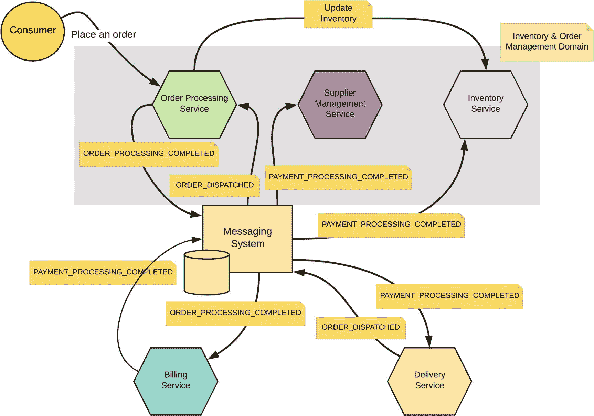

图 13-1

微服务之间的通信

### Spring Cloud Sleuth

Spring Cloud Sleuth 为 Spring 微服务实现了一个分布式追踪解决方案^(¹⁶⁰)。Sleuth 借鉴了 Dapper^(¹⁶¹) 的许多概念和术语，Dapper 是谷歌的生产级分布式系统追踪基础设施。Sleuth 中的基本工作单元称为一个*跨度*。跨度表示通信网络中两点之间执行的工作。例如，`订单处理`微服务（见图 13-1）从客户端接收订单并处理订单。然后它同步地与`库存`微服务通信，一旦收到响应，就将`ORDER_PROCESSING_COMPLETED`事件发布到消息系统。图 13-2 展示了在完整通信网络中不同点之间如何识别跨度。一旦相应的请求到达`订单处理`微服务，跨度就会获得其初始值。实际上，跨度的值是一个 64 位标识符（尽管我们在图 13-2 中使用字母来表示跨度）。在`订单处理`微服务内部记录的任何消息都将携带跨度 ID A。从`订单处理`微服务发送并由`库存`微服务接收的请求将携带跨度 ID B，而当请求在`库存`微服务内部时，它将持有跨度 ID C。

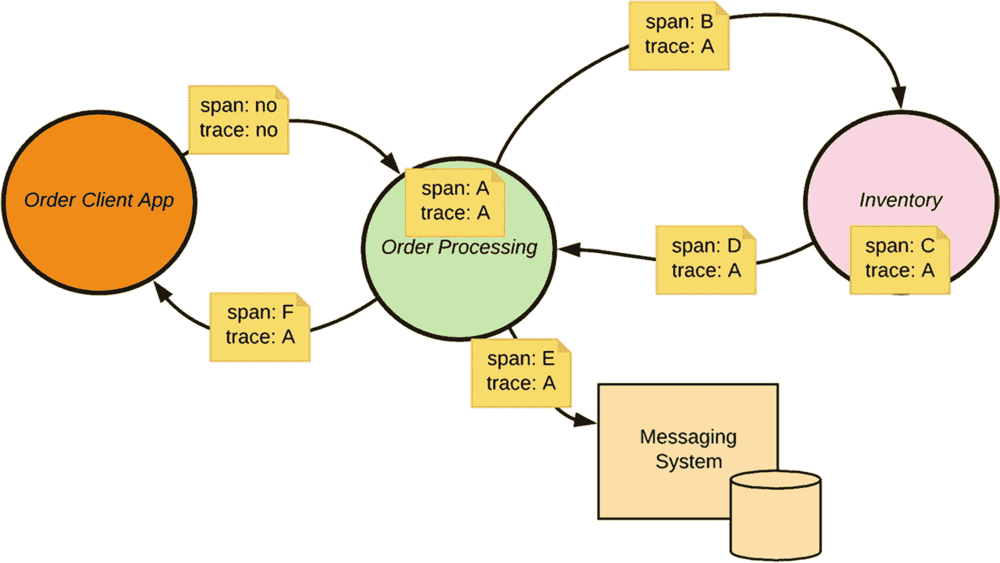

图 13-2

分布式追踪

每个跨度都有一个父跨度。例如，跨度 B 的父跨度是跨度 A，而跨度 A 的父跨度是 null。类似地，跨度 A 也是跨度 E 的父跨度。图 13-3 按父子关系排列跨度。一组形成树状结构的跨度被称为一个*追踪*。对于给定的请求，追踪的值在所有跨度中保持不变。根据图 13-2，追踪的值是 A，并且它在所有跨度中携带相同的值。追踪 ID 有助于关联微服务之间的消息。一旦来自不同微服务的所有日志都被发布到集中式追踪系统中，给定追踪 ID，我们就可以跨不同系统追踪消息。

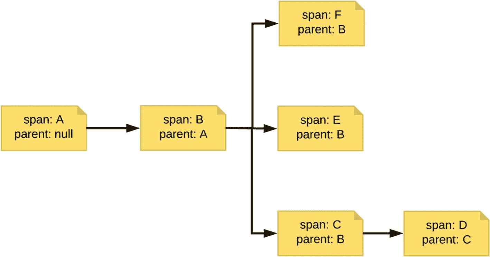

图 13-3

一组形成树状结构的跨度

让我们动手实践吧！让我们看看如何使用 Spring Cloud Sleuth 通过一组示例 Spring 微服务进行分布式追踪。

### 注意

要运行本章中的示例，你需要 Java 8 或更高版本、Maven 3.2 或更高版本以及一个 Git 客户端。成功安装这些工具后，你需要克隆 Git 仓库：[`https://github.com/microservices-for-enterprise/samples.git`](https://github.com/microservices-for-enterprise/samples.git)。本章的示例位于 `ch13` 目录中。

`:\> git clone` [`github.com/microservices-for-enterprise/samples.git`](https://github.com/microservices-for-enterprise/samples.git)


### 将 Spring Cloud Sleuth 与 Spring Boot 微服务集成

将 Sleuth 与 Spring Boot 集成非常简单。从 Git 仓库下载所有示例后，你可以在 `ch13/sample01` 目录中找到与本示例相关的源代码。

### 注意

本书不打算对 Spring Cloud Sleuth 进行全面介绍，建议需要详细了解的读者参考 Sleuth 文档，地址为：[`https://cloud.spring.io/spring-cloud-sleuth/single/spring-cloud-sleuth.html`](https://cloud.spring.io/spring-cloud-sleuth/single/spring-cloud-sleuth.html)。

让我们看看添加到 `ch13/sample01/pom.xml` 文件中的一些值得注意的 Maven 依赖项。`spring-cloud-starter-sleuth` 依赖项引入了所有与 Sleuth 相关的依赖。一旦集成到 Maven 项目中，Sleuth 的跨度（Span）和跟踪（Trace）信息将自动添加到所有日志中。Sleuth 会拦截发送到特定微服务的所有 HTTP 请求，并检查所有消息以查看是否已有跟踪信息。如果有，则会提取这些信息并将其提供给相应的微服务。此外，Sleuth 还会将跟踪信息注入到 Spring 映射诊断上下文（MDC）中，这样微服务生成的日志将自动包含跟踪数据。当 HTTP 请求从微服务发出时，Sleuth 会再次将跟踪信息注入到出站请求或响应中。

```
org.springframework.cloud
spring-cloud-starter-sleuth
2.0.0.RC1

```

让我们看看源代码（`ch13/sample01/src/main/java/com/apress/ch13/sample01/service/OrderProcessing.java`），它记录了与订单检索请求相关的数据。这里用于记录消息的日志记录 API 与 Sleuth 无关——它只是 `slf4j`^(¹⁶²) API。

```
import org.slf4j.Logger;
import org.slf4j.LoggerFactory;
@RequestMapping(value = "/{id}", method = RequestMethod.GET)
public ResponseEntity getOrder(@PathVariable("id") String orderId) {
logger.info("retrieving order:" + orderId);
Item book1 = new Item("101", 1);
Item book2 = new Item("103", 5);
PaymentMethod myvisa = new PaymentMethod("VISA", "01/22", "John Doe",
"201, 1st Street, San Jose, CA");
Order order = new Order("101021", orderId, myvisa, new Item[] { book1,
book2 },"201, 1st Street, San Jose, CA");
return ResponseEntity.ok(order);
}
```

在运行代码之前，需要在 `ch13/sample01/src/main/resources/application.properties` 文件中配置几个重要的属性。

```
spring.application.name=sample01
spring.sleuth.sampler.percentage=0.1
```

属性 `spring.application.name` 的值会作为服务名称，与跟踪 ID 和跨度 ID 一起添加到日志中。一旦 Sleuth 被集成，服务名称、跟踪 ID、跨度 ID 以及一个指示日志是否已发布到 Zipkin 的标志位，都会被附加到日志中。在下面的示例中，`sample01` 是服务名称（从属性文件中获取），`d25a633196c01c19`（第一个）是跟踪 ID，`d25a633196c01c19`（第二个）是跨度 ID，`false` 表示此日志未发布到 Zipkin。我们将在本章后面介绍 Zipkin，目前可以将其视为一个在微服务部署中捕获所有跟踪信息的服务器。

```
INFO [sample01,d25a633196c01c19,d25a633196c01c19,false] 27437 --- [nio-9000-exec-2] c.a.c.sample01.service.OrderProcessing: retrieving order:11
```

`application.properties` 文件中的 `spring.sleuth.sampler.percentage` 属性表示需要跟踪的请求百分比。默认设置为 0.1，这意味着只有 10% 的请求会被发布到 Zipkin。通过将其设置为 1.0，所有请求都会被发布。

现在，让我们看看如何运行 `Order Processing` 微服务，并使用以下 cURL 命令调用它（从 `ch13/sample01` 目录运行）。

```
\> mvn clean install
\> mvn spring-boot:run
\> curl http://localhost:9000/order/11
```

此 cURL 命令将打印订单详情，如果你查看运行 `Order Processing` 微服务的命令控制台，会发现以下日志，其中包含跟踪 ID、跨度 ID 以及其他元数据。

```
INFO [sample01,d25a633196c01c19,d25a633196c01c19,false] 27437 --- [nio-9000-exec-2] c.a.c.sample01.service.OrderProcessing: retrieving order:11
```

好吧，如果你觉得这个示例本身没什么用，我们并不感到惊讶。它除了记录日志之外什么也没做——完全没有跟踪。下一节将消除你的疑虑，并可能让你相信跟踪的价值。

### 使用 Spring Cloud Sleuth 跟踪多个微服务之间的消息

让我们将目前讨论的示例扩展到多个微服务，看看一个给定的请求是如何在整个通信网络中被跟踪的。如果你已经按照上一节的说明启动了 `Order Processing` 微服务（`sample01`），请保持其运行。除此之外，你还需要启动 `Inventory` 微服务。让我们通过从 `ch13/sample02` 目录运行以下命令来启动 `Inventory` 微服务。

```
\> mvn clean install
\> mvn spring-boot:run
```

现在，当我们运行 cURL 客户端向 `Order Processing` 微服务下订单时，它将与 `Inventory` 微服务通信以更新库存（见图 13-1）。

```
\> curl -v  -k  -H "Content-Type: application/json" -d '{"customer_id":"101021","payment_method":{"card_type":"VISA","expiration":"01/22","name":"John Doe","billing_address":"201, 1st Street, San Jose, CA"},"items":[{"code":"101","qty":1},{"code":"103","qty":5}],"shipping_address":"201, 1st Street, San Jose, CA"}' http://localhost:9000/order
```

让我们查看运行 `Order Processing` 微服务的命令控制台。它应该会打印出以下包含跟踪信息的日志。

```
INFO [sample01,76f19c035e8e1ddb,76f19c035e8e1ddb,false] 29786 --- [nio-9000-exec-1] c.a.c.sample01.service.OrderProcessing   : creating order :10dcc849-3d8d-49fb-ac58-bc5da29db003
```

运行 `Inventory` 微服务的命令控制台会打印出以下日志。

```
INFO [sample04,76f19c035e8e1ddb,be46d1595ef606a0,false] 29802 --- [io-10000-exec-1] c.a.ch13.sample02.service.Inventory      : item code 101
INFO [sample04,76f19c035e8e1ddb,be46d1595ef606a0,false] 29802 --- [io-10000-exec-1] c.a.ch13.sample02.service.Inventory      : item code 103
```

在两个微服务打印的日志中，跟踪 ID（`76f19c035e8e1ddb`）是相同的，而每个微服务都有自己的跨度 ID（`76f19c035e8e1ddb` 和 `be46d1595ef606a0`）。在下一节中，我们将看到如何将这些日志发布到 Zipkin，并可视化一个请求在多个微服务之间的完整路径。

## 使用 Zipkin 进行数据可视化和关联

Zipkin^(¹⁶³) 是一个分布式跟踪系统，有助于可视化和关联微服务之间的通信路径。它还通过收集时序数据来帮助诊断延迟问题。所有微服务都可以被配置为将日志连同跟踪信息一起发布到 Zipkin（见图 13-4）。


### 注意

对 Zipkin 的全面介绍超出了本书的范围，我们建议需要了解详情的读者参考 [`https://zipkin.io/`](https://zipkin.io/) 上的 Zipkin 文档。

使用 Docker 搭建 Zipkin 非常简单。在第 8 章“部署和运行微服务”中，我们详细讨论了 Docker，假设你的机器上已经安装并运行了 Docker，你可以通过以下命令启动一个包含 Zipkin 的 Docker 容器。如果你想在没有 Docker 的情况下尝试 Zipkin，请参考 [`https://zipkin.io/pages/quickstart.html`](https://zipkin.io/pages/quickstart.html) 上的安装指南。

```
\> docker run -d -p 9411:9411 openzipkin/zipkin
```

该命令将宿主机的 9411 端口绑定到 Docker 容器的 9411 端口。一旦 Zipkin 节点启动，你就可以从宿主机通过 `http://localhost:9411/zipkin/` 或直接使用 `http://localhost:9411` 访问其基于 Web 的控制台（见图 13-5）。下一步是更新 `Order Processing` 和 `Inventory` 微服务（来自上一节的 `sample01` 和 `sample02`）的配置，以便将日志发布到 Zipkin。如果这两个微服务正在运行，请先停止它们，然后用以下内容更新 `application.properties` 文件。你需要对这两个微服务都执行此操作。`spring.zipkin.baseUrl` 属性指定了 Zipkin 服务器的 URL。

```
spring.zipkin.baseUrl=http://localhost:9411/
```

除了在 `application.properties` 文件中设置此属性外，我们还必须在两个微服务的 `pom.xml` 文件中添加以下依赖项，以完成 Zipkin 集成。`spring-cloud-sleuth-zipkin` 依赖项负责将日志发布到 Zipkin 服务器，并且这些日志必须采用 Zipkin 能够理解的格式。

```
org.springframework.cloud
spring-cloud-sleuth-zipkin
2.0.0.RC1

```

启动 `Order Processing` 和 `Inventory` 微服务，并使用以下 cURL 命令向 `Order Processing` 微服务下订单。重复执行几次，以便在 Zipkin 中收集足够的日志。同时请记住，并非所有日志都会发送到 Zipkin——这取决于你在 `application.properties` 文件中为 `spring.sleuth.sampler.percentage` 属性设置的值。在典型的微服务部署中，数据量可能非常大，因此跟踪数据量也很大。根据你收到的请求量以及微服务所执行操作的业务关键性，你可以决定需要对多少百分比的请求进行采样或发送到 Zipkin。

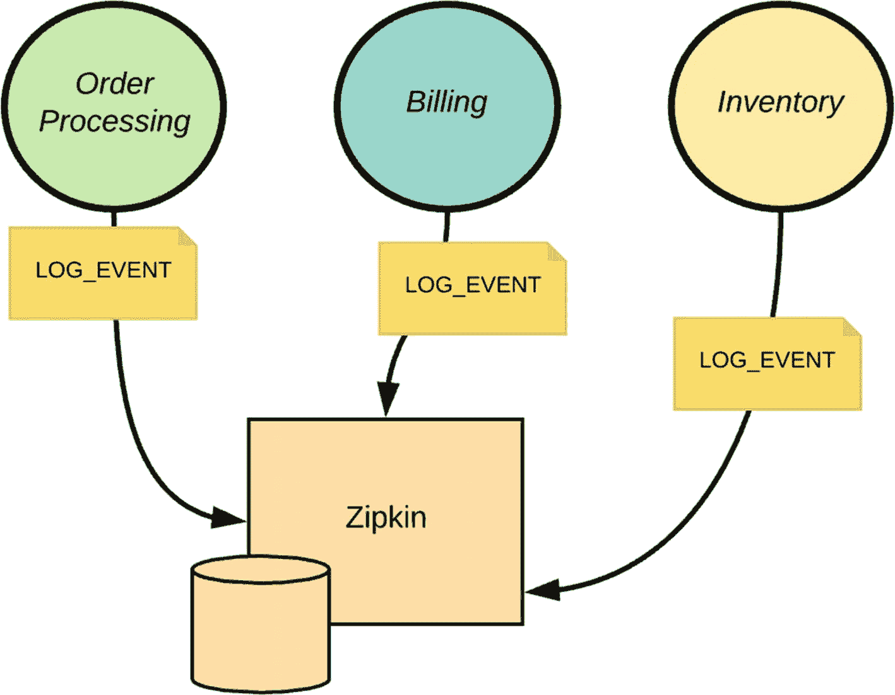

图 13-4

每个微服务都被配置为向 Zipkin 发布日志

```
\> curl -v  -k  -H "Content-Type: application/json" -d '{"customer_id":"101021","payment_method":{"card_type":"VISA","expiration":"01/22","name":"John Doe","billing_address":"201, 1st Street, San Jose, CA"},"items":[{"code":"101","qty":1},{"code":"103","qty":5}],"shipping_address":"201, 1st Street, San Jose, CA"}' http://localhost:9000/order
```

对于从每个微服务发布到 Zipkin 的跟踪数据，你会在运行每个微服务的命令控制台上看到以下日志。请注意，添加到每条日志中的跟踪信息的第四个参数指示日志是否已发布到 Zipkin，该参数设置为 `true`。

```
INFO [sample01,bf581ac0009c6e48,bf581ac0009c6e48,true] 30166 --- [nio-9000-exec-1] c.a.c.sample01.service.OrderProcessing : retrieving order:11
INFO [sample02,1a35024149ac7711,98239453fa5582ba,true] 30153 --- [io-10000-exec-7] c.a.ch04.sample04.service.Inventory : item code 101
INFO [sample02,1a35024149ac7711,98239453fa5582ba,true] 30153 --- [io-10000-exec-7] c.a.ch04.sample04.service.Inventory : item code 103
```

其底层原理是，Sleuth 对你的应用程序进行检测，以生成 Zipkin 能够理解的格式的跟踪信息。Zipkin 是数据收集器，一旦所有微服务将跟踪数据发布到 Zipkin，它就能帮助你进行分布式跟踪。要实现分布式跟踪，这两个部分缺一不可。

### 注意

Jaeger^(¹⁶⁴) 是另一个受 Zipkin 和 Dapper 启发、由 Uber 开发的开源分布式跟踪系统。

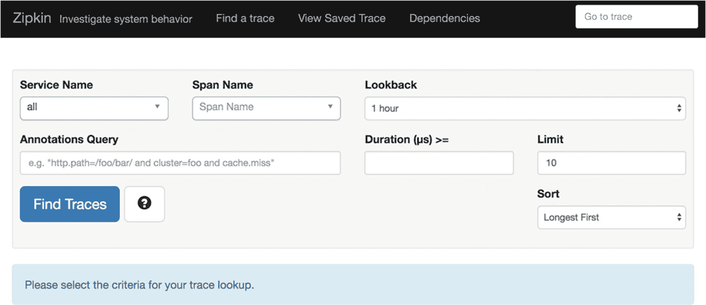

图 13-5

Zipkin 基于 Web 的控制台

现在，让我们看看如何利用已发布的跟踪信息从 Zipkin 服务器中找到一些有用的信息。在 Zipkin Web 控制台的主页上，在 `Service Name` 下拉框中，你会注意到有两个名称：`sample01` 和 `sample02`。这些是与我们的两个微服务关联的服务名称，通过在此处选择一个服务名称，你可以找到与该微服务相关的所有跟踪信息。图 13-6 显示了与 `sample01` 或 `Order Processing` 微服务相关的跟踪信息。

### 注意

Zipkin 架构由四个主要组件构成：收集器、存储、搜索和 Web UI。从应用程序（或微服务）发布的跟踪数据首先到达收集器。收集器对数据进行验证、存储和索引，以便进行查找。Zipkin 的存储是可插拔的，它原生支持 Cassandra、ElasticSearch 和 MySQL。数据被索引和存储后，Zipkin 的搜索组件提供了一个 JSON API 来与跟踪数据进行交互，该 API 主要由 Web UI 使用。

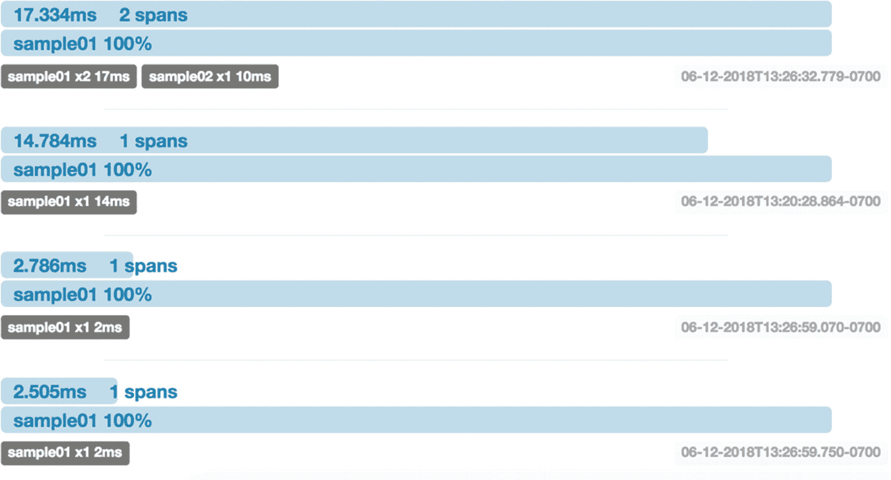

图 13-6

与 Order Processing 微服务相关的跟踪信息

Zipkin 还有另一个很好的功能，它通过分析入站和出站流量模式来为你的微服务构建依赖关系图。当我们的部署中有许多微服务时，这非常有用。无论如何，在这个特定示例中，它只是 `Order Processing`（`sample01`）和 `Inventory`（`sample02`）微服务之间的一个非常简单的图，如图 13-7 所示。


图 13-7

OrderProcessing 和 Inventory 微服务之间的依赖关系图

### 事件驱动的日志聚合架构

让我们重新审视图 13-4，这是我们将要在本节讨论内容的高级设计。这里的设计与我们第 2 章“设计微服务”（见图 2-17）中提出的设计略有不同。图 13-8 展示了根据第 2 章中日志聚合器架构的建议重新设计后的方案。

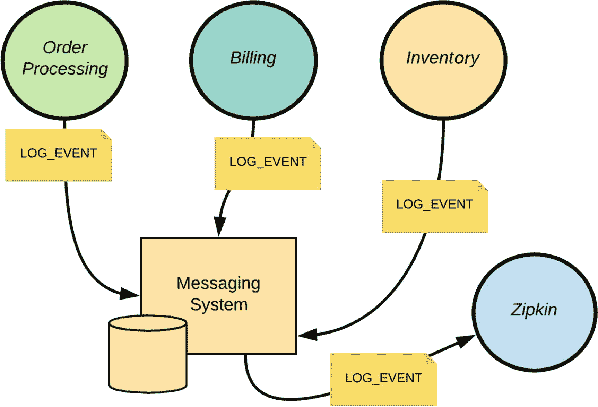

图 13-8

采用事件驱动日志聚合架构的 Zipkin

与图 13-4 不同，这里 Zipkin 服务器和微服务之间没有直接耦合。每个微服务将日志发布到消息系统（可以是 RabbitMQ 或 Kafka），然后 Zipkin 从消息系统中获取日志。这种模型的优势在于，即使 Zipkin 服务器宕机一段时间，微服务也可以独立地继续发布日志，当 Zipkin 重启后，它会从消息系统中获取所有日志。


## 开放追踪简介

当同一微服务部署中的不同微服务使用不同的追踪模块时，分布式追踪会变得相当棘手。例如，`订单处理`微服务可能使用 Sleuth 来生成跨度（span）和追踪（trace），而`库存`微服务则使用另一个模块。两者都可以将追踪数据发布到 Zipkin，但除非这两个模块共享相同的跨度和追踪定义，并尊重彼此生成的追踪数据，否则这些信息将毫无用处。这迫使开发者在所有微服务中使用相同的追踪模块，这在一定程度上违背了我们引以为傲的微服务多语言架构。*开放追踪*^(¹⁶⁵) 是一项旨在通过构建开放标准来解决此问题的倡议。它精确地定义了在开放追踪数据模型下什么是跨度，什么是追踪。

开放追踪必须跨多种编程语言工作。在撰写本文时，它为九种编程语言定义了语言级别的 API：Go、Python、JavaScript、Java、C#、Objective-C、C++、Ruby 和 PHP。这些 API 已有多种实现。由 Uber 开发的开源分布式追踪系统 Jaeger 支持开放追踪，并包含针对多种编程语言的开放追踪客户端库：Java、Go、Python、Node.js、C++ 和 C#。

### 使用 Spring Boot 微服务和 Zipkin 进行基于开放追踪的分布式追踪

Zipkin 支持开放追踪，但 Sleuth 不支持。你可以将 Sleuth 视为追踪客户端，而 Zipkin 是收集所有追踪数据的服务器。在前面章节讨论的示例中，Sleuth 被用作 Zipkin 的追踪客户端，并且它使用了 Zipkin 特定的格式，这种格式不适用于开放追踪。在本节中，我们将了解如何从与开放追踪兼容的 Spring Boot 微服务发布追踪数据。与此示例相关的源代码位于 `ch13/sample03` 目录中。

让我们看看添加到 `ch13/sample03/pom.xml` 文件中的一些值得注意的 Maven 依赖项。`opentracing-spring-cloud-starter` 和 `opentracing-spring-zipkin-starter` 依赖项引入了将兼容开放追踪的追踪信息发布到 Zipkin 所需的所有依赖项。

```
io.opentracing.contrib
opentracing-spring-cloud-starter
0.1.13

io.opentracing.contrib
opentracing-spring-zipkin-starter
0.1.1

```

假设你仍在运行上一节中的 Zipkin 节点，请将 `opentracing.zipkin.http-sender.baseUrl` 属性添加到 `application.properties` 文件中，该属性包含 Zipkin 服务器的服务器 URL。

```
opentracing.zipkin.http-sender.baseUrl=http://localhost:9411/
```

现在，让我们运行 `订单处理` 微服务，并使用以下 cURL 命令（从 `ch13/sample03` 目录运行）调用它。执行几次，并通过运行在 `http://localhost:9411/zipkin/` 的 Zipkin Web 控制台观察记录的数据。

```
\> mvn clean install
\> mvn spring-boot:run
\> curl http://localhost:9000/order/11
```

### 使用 Spring Boot 微服务和 Jaeger 进行基于开放追踪的分布式追踪

在上一节中，我们解释了如何将兼容开放追踪的追踪信息发布到 Zipkin。由于它是开放追踪，不仅仅是 Zipkin，任何其他支持开放追踪的产品都应该能够接收它。在本节中，我们将了解如何将追踪数据从 Spring Boot 微服务发布到与开放追踪兼容的 Jaeger（见图 13-9）。Jaeger 是另一个受 Zipkin 和 Dapper 启发、由 Uber 开发的开源分布式追踪系统。与此示例相关的源代码位于 `ch13/sample04` 目录中。我们可以使用以下命令启动一个 Jaeger Docker 实例，该实例将在 HTTP 端口 16686 和 UDP 端口 5775 上运行。启动后，我们可以通过 `http://localhost:16686/` 访问其 Web 控制台。

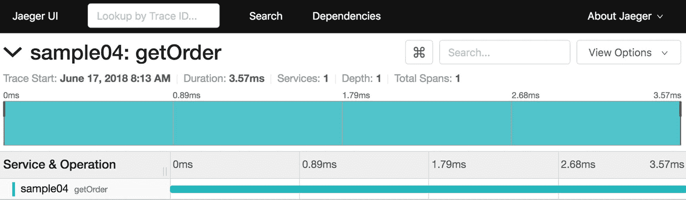

图 13-9

Jaeger Web 控制台

```
\> docker run -d -p 5775:5775/udp -p 16686:16686 jaegertracing/all-in-one:latest
```

### 注意

对 Jaeger 的全面介绍超出了本书的范围，我们建议需要详细了解的读者参考 [`https://www.jaegertracing.io/docs/`](https://www.jaegertracing.io/docs/) 上的 Jaeger 文档。

让我们看看添加到 `ch13/sample04/pom.xml` 文件中的一些值得注意的 Maven 依赖项。`opentracing-spring-cloud-starter` 和 `opentracing-spring-cloud-starter-jaeger` 依赖项引入了将兼容开放追踪的追踪信息发布到 Jaeger 所需的所有依赖项。

```
io.opentracing.contrib
opentracing-spring-cloud-starter
0.1.13

io.opentracing.contrib
opentracing-spring-cloud-starter-jaeger
0.1.13

```

从我们的 Spring Boot 微服务中，我们使用 UDP 端口 5775 连接到 Jaeger 服务器以发布追踪信息。我们需要将 `opentracing.jaeger.udp-sender.host` 和 `opentracing.jaeger.udp-sender.port` 属性添加到 `application.properties` 文件中。

```
opentracing.jaeger.udp-sender.host=localhost
opentracing.jaeger.udp-sender.port=5775
```

现在，让我们运行 `订单处理` 微服务，并使用以下 cURL 命令（从 `ch13/sample04` 目录运行）调用它。执行几次，并通过运行在 `http://localhost:16686/` 的 Jaeger Web 控制台观察记录的数据。

```
\> mvn clean install
\> mvn spring-boot:run
\> curl http://localhost:9000/order/11
```

## 使用 Prometheus 进行指标监控

Prometheus 是一个用于监控和告警的开源系统。在本节中，我们将了解如何使用 Prometheus 监控微服务部署。其工作方式是，所有微服务都将暴露自己的端点以向外部公开其指标，然后 Prometheus 将定期轮询这些端点（见图 13-10）。

### 注意

对 Prometheus 的全面介绍超出了本书的范围，我们建议需要详细了解的读者参考 [`https://prometheus.io/`](https://prometheus.io/) 上的 Prometheus 文档。

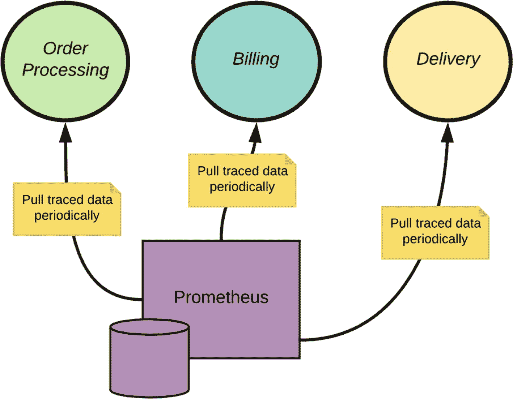

图 13-10

Prometheus 从连接的微服务拉取追踪数据


### 从 Spring Boot 微服务暴露指标

首先，让我们看看如何对 Spring Boot 微服务进行检测，以 Prometheus 能理解的格式暴露指标。与此示例相关的源代码位于 `ch13/sample05` 目录中。让我们看看添加到 `ch13/sample05/pom.xml` 文件中的一些值得注意的 Maven 依赖项。`simpleclient_spring_boot` 和 `simpleclient_hotspot` 依赖项带来了向 Prometheus 暴露指标所需的所有依赖项。`simpleclient_spring_boot` 依赖项引入了两个类级别的注解：`@EnablePrometheusEndpoint` 和 `@EnableSpringBootMetricsCollector`，它们被添加到 `ch13/sample05/OrderProcessingApp.java` 类文件中。

```
io.prometheus
artifactId>simpleclient_spring_boot
0.1.0

io.prometheus
simpleclient_hotspot
0.1.0

```

为了从 Spring Boot 应用程序中暴露指标且不启用安全性（我们可能可以使用网络级别的安全性），请将以下属性添加到 `ch13/sample05/src/main/resources/application.properties` 文件中。

```
management.security.enabled=false
```

现在一切就绪。让我们使用以下命令（从 `sample05` 目录）启动我们的 `Order Processing` 微服务。

```
\> mvn clean install
\> mvn spring-boot:run
```

服务启动后，该服务发布的指标可通过 `http://localhost:9000/prometheus` 访问。这里，9000 是你的微服务运行的端口。以下文本列出了从上述端点获取的截断输出。

```
# HELP httpsessions_max httpsessions_max
# TYPE httpsessions_max gauge
httpsessions_max -1.0
# HELP httpsessions_active httpsessions_active
# TYPE httpsessions_active gauge
httpsessions_active 0.0
# HELP mem mem
# TYPE mem gauge
mem 549365.0
# HELP mem_free mem_free
# TYPE mem_free gauge
mem_free 211808.0
# HELP processors processors
# TYPE processors gauge
processors 8.0
# HELP instance_uptime instance_uptime
# TYPE instance_uptime gauge
instance_uptime 313310.0
# HELP uptime uptime
# TYPE uptime gauge
uptime 317439.0
# HELP systemload_average systemload_average
# TYPE systemload_average gauge
systemload_average 2.13720703125
# HELP heap_committed heap_committed
# TYPE heap_committed gauge
heap_committed 481280.0
# HELP heap_init heap_init
# TYPE heap_init gauge
heap_init 262144.0
# HELP heap_used heap_used
# TYPE heap_used gauge
heap_used 269471.0
# HELP heap heap
# TYPE heap gauge
heap 3728384.0
# HELP nonheap_committed nonheap_committed
# TYPE nonheap_committed gauge
nonheap_committed 71696.0
```

### 设置 Prometheus

使用 Docker 设置 Prometheus 非常简单。首先，我们需要创建一个 `prometheus.yml` 文件，其中包含 Prometheus 将要监控的所有服务。以下示例展示了一个示例文件，其中包含了我们的 `Order Processing` 微服务（`sample05`）和 Prometheus 实例本身。一个给定的 `prometheus.yml` 文件可以有多个任务。这里，`prometheus` 任务负责监控自身（运行在 9090 端口），而 `orderprocessing` 任务被设置为每 10 秒轮询一次 10.0.0.93:9000 端点。请记住，这里我们需要使用运行 `Order Processing` 微服务的节点的 IP 地址，并且该地址必须能够从运行 Prometheus 的 Docker 实例访问。

```
scrape_configs:
- job_name: 'prometheus'
scrape_interval: 10s
static_configs:
- targets: ['localhost:9090']
- job_name: ‘orderprocessing’
scrape_interval: 10s
metrics_path: '/prometheus'
static_configs:
- targets: ['10.0.0.93:9000']
```

现在，让我们使用 `prometheus.yml` 文件启动 Prometheus Docker 实例。

```
:\> docker run -p 9090:9090 -v /path/to/prometheus.yml:/etc/prometheus/prometheus.yml prom/prometheus
```

Prometheus 节点启动后，访问 URL `http://localhost:9090/targets`，它将显示所有服务、Prometheus 监控项以及各个端点的状态（见图 13-11）。

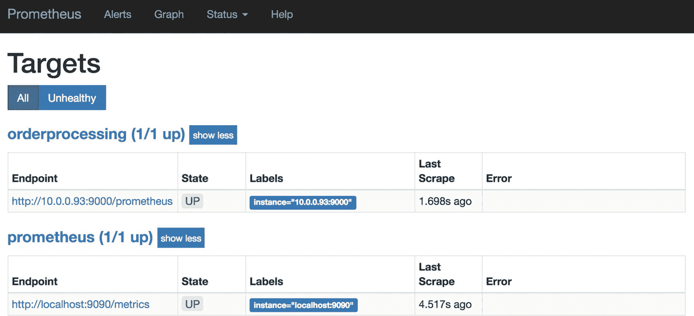

图 13-11

Prometheus 目标及各个端点的状态

### 使用 Prometheus 构建图表

现在，我们已经将 Spring Boot 微服务的所有指标发布到了 Prometheus。让我们看看如何构建图表来监控这些已发布的统计数据。

首先，访问 `http://localhost:9090/graph` 并选择你想要监控的指标。例如，我们选择了 `heap_used`。然后，当你点击“Graph”选项卡时，我们应该能够看到已用堆随时间变化的图表（见图 13-12）。这样，你可以添加任意数量的图表。

### 注意

Prometheus 于 2012 年在 SoundCloud 诞生，是一个根据 Apache 2.0 许可证发布的开源项目。它主要用 Go 语言编写，并且围绕 Prometheus 的社区在过去几年中不断壮大。2016 年，它成为第二个获得云原生计算基金会（CNCF）成员资格的项目。

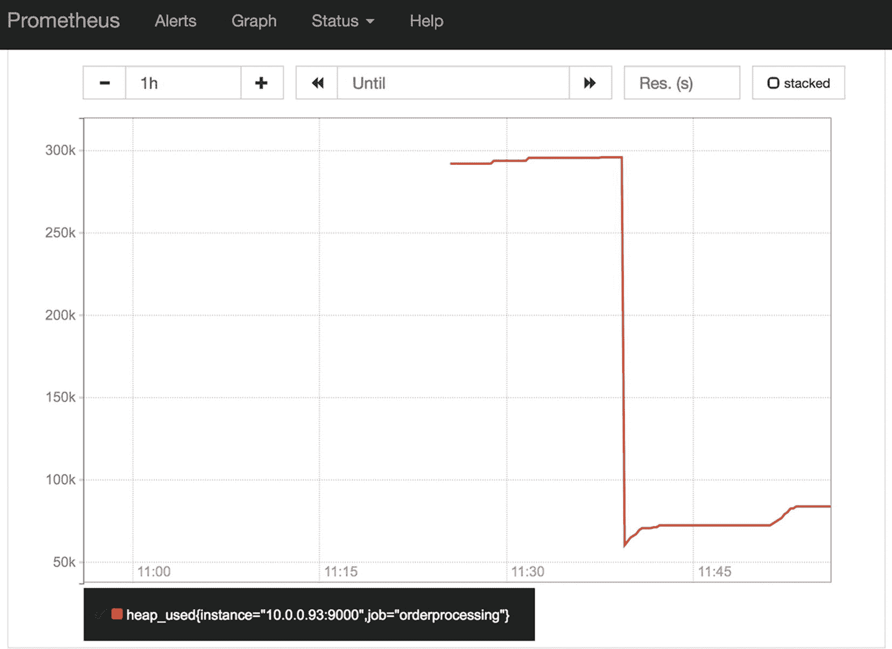

图 13-12

使用 Prometheus 监控 Spring Boot 微服务的已用堆

## 使用 Grafana 进行分析和监控

Grafana 是一个用于分析和监控的开源产品，在构建仪表盘方面比 Prometheus 更强大。事实上，建议使用 Grafana 配合 Prometheus 来构建仪表盘。Prometheus 有自己的仪表盘工具，称为 Promdash，但随着 Grafana 的进步，Prometheus 开发者放弃了它，并开始推广 Grafana。

### 注意

对 Grafana 的全面介绍超出了本书的范围，我们建议需要详细信息的读者参考 Grafana 文档，该文档可在 [`http://docs.grafana.org/`](http://docs.grafana.org/) 获取。

### 使用 Grafana 构建仪表盘

使用 Docker 设置 Grafana 非常简单。使用以下命令启动一个 Grafana Docker 实例，该实例运行在 HTTP 端口 3000 上。

```
:\> docker run -d -p 3000:3000 grafana/grafana
```

服务器启动后，你可以通过 `http://localhost:3000` 使用凭据 admin/admin 登录 Grafana 管理控制台。我们需要做的第一件事是引入一个新的数据源。Grafana 使用数据源来构建图表。点击“Add Data Source”并选择 Prometheus 作为数据源类型。给它一个名称，比如 `prometheus_ds`。除了 HTTP URL 属性外，其余保持默认即可。此 URL 应指向 Prometheus 服务器，并且该服务器必须能够从运行 Grafana 的节点访问。数据源配置如图 13-13 所示。

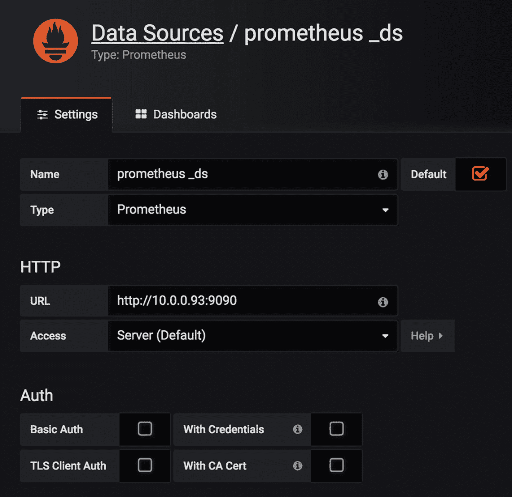

图 13-13

Grafana 数据源属性


### 注意

根据图 13-13 所示的配置，我们期望 Prometheus 端点处于开放或未受保护的状态。如果它受到保护，Grafana 支持多种安全模型，包括基本身份验证和 TLS 客户端身份验证。

现在，我们可以通过 `http://localhost:3000/dashboard/new` 创建一个新的仪表盘。选择图表，然后点击面板标题并选择“编辑”。在“指标”下，你可以选择所选数据源提供的任何指标。如图 13-14 所示，我们可以定义多个查询。这里我们选择了 `heap` 和 `heap_used`。查询定义了我们需要从 Prometheus 端点拉取的指标中选取哪些信息，图表会据此进行渲染。

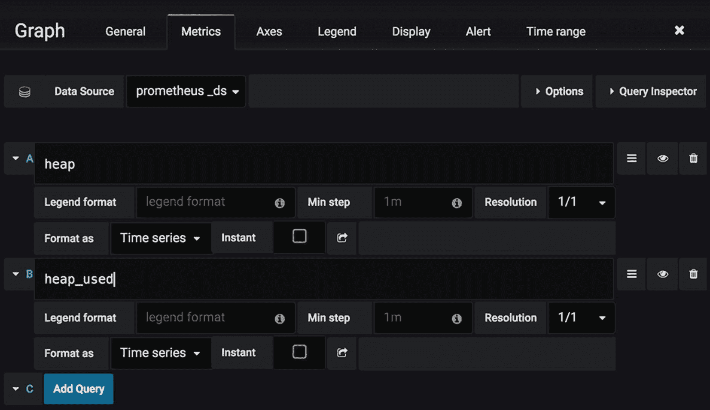

图 13-14
设置查询以使用 Grafana 构建仪表盘

完成此过程后，我们可以在 Grafana 主页的“最近查看的仪表盘”下找到刚刚创建的仪表盘。你可以点击它来查看仪表盘，其显示效果将如图 13-15 所示。

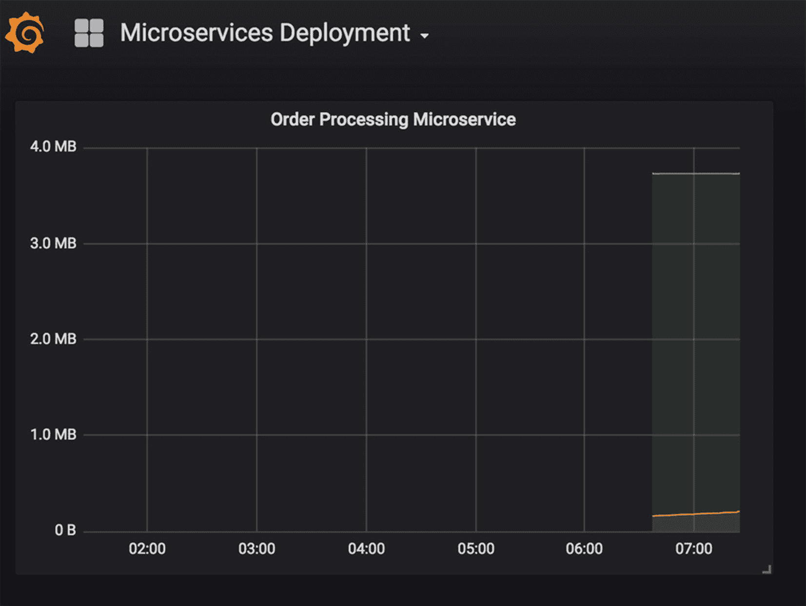

图 13-15
用于监控微服务部署的 Grafana 仪表盘

### 使用 Grafana 创建告警

Grafana 允许你创建告警并将其与图表（或仪表盘面板）关联。要为我们在上一节中创建的仪表盘创建告警，首先需要编辑图表（见图 13-16），方法是点击其标题并选择“编辑”。在“告警”下，我们可以创建一个规则，该规则规定了系统在何种条件下应触发告警（见图 13-17）。目前 Grafana 支持的唯一条件类型是查询，对于告警规则，你可以添加多个相互关联的查询（使用 `AND` 或 `OR`）。

### 注意

Grafana 的告警支持仅限于以下数据源：Graphite、Prometheus、ElasticSearch、InfluxDB、OpenTSDB、MySQL、Postgres 和 Cloudwatch。

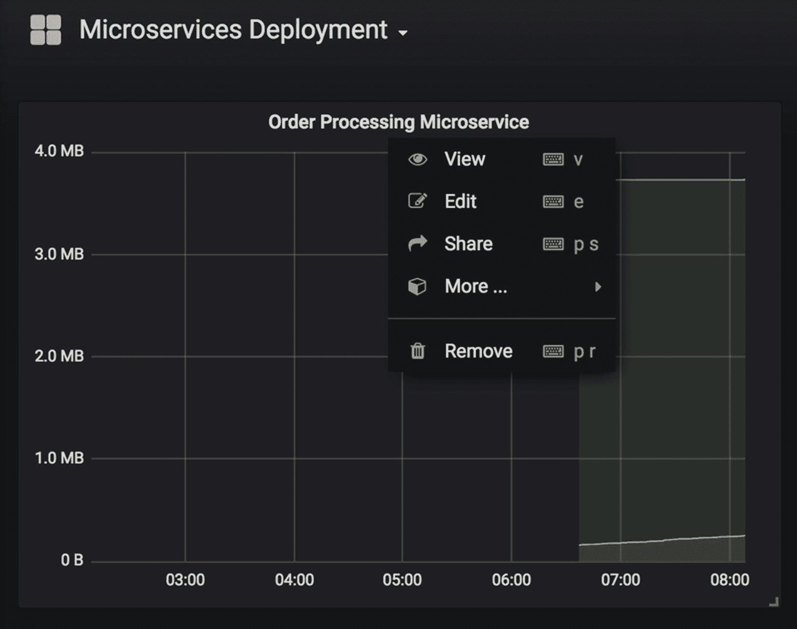

图 13-16
Grafana 仪表盘监控微服务部署

以下查询表示，当指标 A（见图 13-14，在我们的例子中是 `heap`）的最大值在接下来的五分钟内超过 3 时，触发告警。此规则每 60 秒评估一次。

```
WHEN max() OF query(A, 5m, now) IS ABOVE 3
```

除了 `max()` 函数，Grafana 还支持 `avg()`, `min()`, `sum()`, `last()`, `count()`, `median()`, `diff()`, `percent_diff()` 和 `count_non_null()`。见图 13-17。

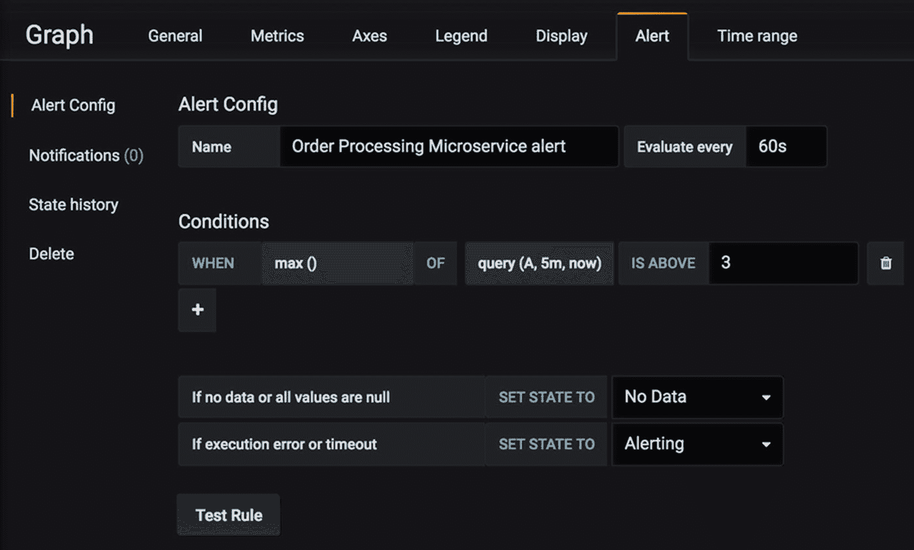

图 13-17
配置告警

设置好告警规则后，我们可以在“通知”菜单下配置当告警触发时向谁发送通知以及附带的消息（见图 13-18）。Grafana 支持多种通知渠道，包括 Email、PagerDuty、Telegram、Slack 等。

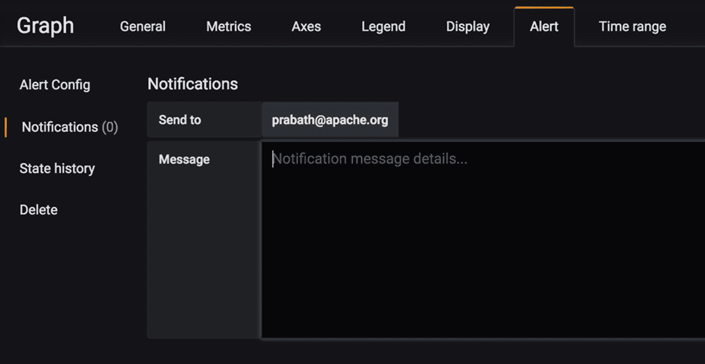

图 13-18
配置通知

## 将 Fluentd 日志收集器与 Docker 结合使用

Fluentd 是一个可扩展的数据收集工具，以守护进程方式运行。微服务可以将日志发布到 Fluentd。它拥有丰富的插件集，可以从不同来源读取不同格式的日志并解析数据。此外，它还可以格式化、聚合日志，并将其发布到第三方系统，如 Splunk、Prometheus、MongoDB、PostgreSQL、AWS S3、Kafka 等（见图 13-19）。Fluentd 架构的妙处在于它将数据源与目标系统解耦。无需更改微服务，Fluentd 即可更改日志的目标系统或添加新的目标系统。它还可以对日志消息进行内容过滤，并根据特定条件决定将日志发布到哪些系统。

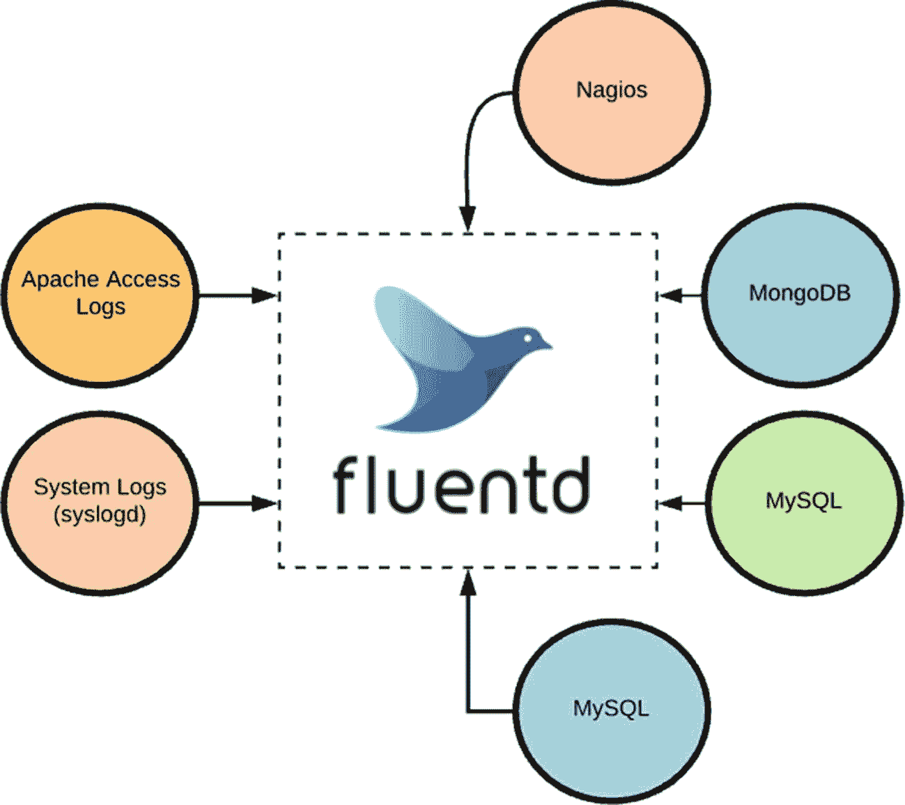

图 13-19
Fluentd 的多个输入源和目标系统

在接下来的章节中，我们将了解如何从运行在 Docker 容器中的微服务向 Fluentd 发布日志。首先，我们将设置 Fluentd，然后了解如何启动微服务并向 Fluentd 发布日志。

### 将 Fluentd 作为 Docker 容器启动

启动 Fluentd 最简单直接的方法是使用 Docker 容器。在实践中，这也是最常见的方法。在生产环境中，当所有微服务都在 Kubernetes 环境（我们在第 8 章中讨论过）中运行时，Fluentd 节点（充当守护进程）将与相应的微服务运行在同一个 Pod 中。实际上，你可以将运行 Fluentd 的容器视为微服务的边车（sidecar）（见图 13-20）。默认情况下，微服务会将日志发布到 `localhost:24224`，这是 Fluentd 通过 TCP 监听的端口。

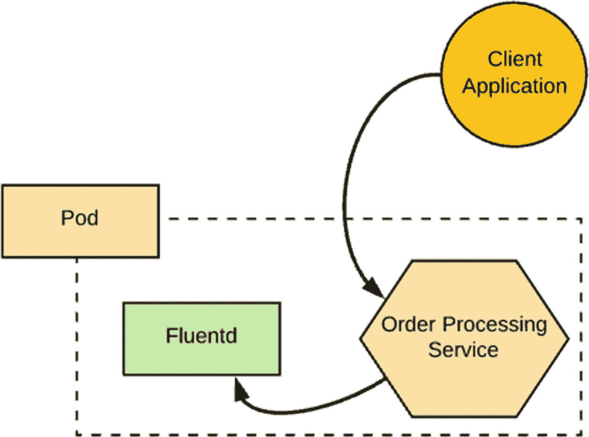

图 13-20
微服务和 Fluentd 容器运行在同一个 Pod 中

让我们使用以下命令来启动 Fluentd Docker 容器。在此之前，请确保主机文件系统的主目录下有一个名为 `data` 的目录——你也可以使用自己的目录代替 `~/data`。

```
:\> docker run -d  -p 24224:24224 -v ~/data:/fluentd/log  fluent/fluentd
```

正如我们在第 8 章中学到的，容器是不可变的。换句话说，当容器关闭时，它不会保存我们在其运行期间对其文件系统所做的任何更改。默认情况下，`Order Processing` 微服务发布到 Fluentd 的所有日志都将存储在容器文件系统的 `/fluent/log` 目录中。为了永久保存这些数据，我们需要使用 Docker 卷。使用上述命令中的 `–v` 选项，我们将主机文件系统中的 `~/data` 目录映射到容器文件系统中的 `/fluent/log` 目录。即使容器关闭，我们也应该能够在 `~/data` 目录中找到日志文件。上述命令中的 `–p` 选项将 Docker 容器的 `24224` 端口（Fluentd 默认监听的端口）映射到宿主机的 `24224` 端口。`fluent/fluentd` 是容器镜像的名称，它将从 Docker Hub 拉取。

一旦我们启动并运行了 Fluentd，我们就可以启动一个包含 `Order Processing` 微服务的 Docker 容器。


### 从 Docker 容器中的微服务向 Fluentd 发布日志

这里我们将使用贯穿全书的同一个 `Order Processing` 微服务，但不再从源代码构建，而是从 Docker Hub 拉取它。以下命令将启动一个包含 `Order Processing` 微服务的 Docker 容器（镜像名为 `prabath/sample01`）。

```
:\> docker run -d -p 9000:9000 --log-driver=fluentd prabath/sample01
```

在此命令中，我们使用了值为 `fluentd`^(¹⁶⁶) 的 `log-driver` 参数。Docker 使用此驱动程序将日志从 `stdout`^(¹⁶⁷)（默认情况下）发布到 Fluentd 守护进程（或运行 Fluentd 的容器）。微服务开发者无需在此处进行任何更改，也无需为 Fluentd 做任何特殊处理。默认情况下，`fluentd` 日志驱动程序通过 TCP 连接到 `localhost:24224`。如果我们在不同的端口上运行 Fluentd，则需要向 `docker run` 命令传递 `fluentd-address` 参数，其值指向 Fluentd 容器（例如 `fluentd-address=localhost:28444`）。

如果一切正常，一旦 `Order Processing` 服务启动，我们应该会在主机文件系统的 `~/data` 目录中看到一些日志。这是我们之前用来创建 Docker 卷的目录。

### 注意

对 Fluentd 的全面介绍超出了本书的范围。我们建议需要详细了解的读者参考 [`https://docs.fluentd.org/`](https://docs.fluentd.org/) 上的 Fluentd 文档。

### 工作原理

Fluentd 使用一个配置文件，该文件定义了输入源和输出目标。默认情况下，它位于运行 Fluentd 的容器文件系统的 `/fluentd/etc` 目录中。该文件名为 `fluent.conf`。让我们看看 `fluent.conf` 的默认内容。`source` 标签定义了数据的来源。在其下方，我们有 `forward` 和 `port` 元素，这使得 Fluentd 能够通过 TCP 在端口 24224 上接受消息。`source` 标签的职责是接受消息并将其作为事件交给 Fluentd 路由引擎。每个事件包含三个元素：标签（tag）、时间（time）和记录（record）。发送者（在我们的例子中是 fluentd 驱动程序）定义了标签的值。

### 注意

你可以在此处找到与 Fluentd Docker 镜像相关的所有配置：[`https://hub.docker.com/r/fluent/fluentd/`](https://hub.docker.com/r/fluent/fluentd/) 。它还解释了如何覆盖镜像附带的默认 Fluentd 配置文件。

```
@type  forward
@id    input1
@label @mainstream
port  24224

@type stdout

@type file
@id   output_docker1
path         /fluentd/log/docker.*.log
symlink_path /fluentd/log/docker.log
append       true
time_slice_format %Y%m%d
time_slice_wait   1m
time_format       %Y%m%dT%H%M%S%z

@type file
@id   output1
path         /fluentd/log/data.*.log
symlink_path /fluentd/log/data.log
append       true
time_slice_format %Y%m%d
time_slice_wait   10m
time_format       %Y%m%dT%H%M%S%z

```

`match` 元素将告诉 Fluentd 如何处理匹配的消息。它将每个事件中 `tag` 元素的值与 `match` 元素中定义的条件进行匹配。在我们的例子中，它会检查 `tag` 是否以单词 `docker` 开头。`match` 元素最常见的用途是定义输出目标。在上述配置中，输出被写入 `/fluentd/log` 目录（在容器中）的一个文件。如果我们想将输出发送到其他不同的系统，我们可以使用任何可用的 Fluentd 插件^(¹⁶⁸)。最后，在 `source` 元素下定义的 `label` 元素充当一个引用。例如，当执行 `match` 元素时，如果 `source` 下定义了一个 `label`，那么只有相应 `label` 下的 `match` 元素才会被执行。`label` 元素的目标是降低配置文件的复杂性。

### 注意

Logstash^(¹⁶⁹) 是著名的 ELK（ElasticSearch, Logstash, Kibana）技术栈的一部分，它提供了与 Fluentd 类似的功能。在为你的企业选择日志记录解决方案之前，我们建议评估 Fluentd 和 Logstash 的优缺点。

### 在微服务部署中使用 Fluentd

在本节中，我们将了解如何从架构上扩展这个 Fluentd 示例，使其适用于生产环境的微服务部署。正如我们所讨论的（如图 13-21 所示），每个 Kubernetes Pod（我们在第 8 章讨论过）都会有一个 Fluentd 实例运行在一个容器中。这个容器可以被视为一个边车（sidecar）。我们部署中的每个微服务都会有类似的设置。每个 Fluentd 节点可以过滤出它们需要的日志，并将其发布到另一个 Fluentd 节点，该节点可以执行日志聚合。这个 Fluentd 节点还可以决定它必须将日志发布到哪些其他目标系统。

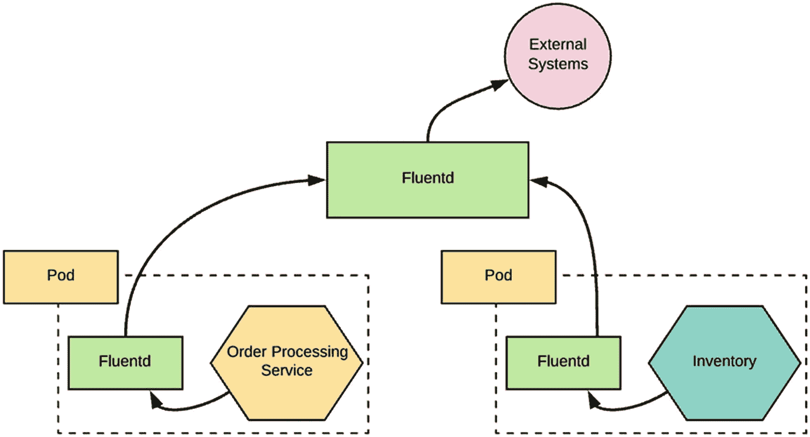

图 13-21

生产环境部署中的 Fluentd

## 总结

在本章中，我们讨论了微服务架构的一个关键方面——可观测性——以及可观测性背后的三大支柱：日志记录、指标和链路追踪。我们还讨论了分布式链路追踪，它实际上是实现可观测性最重要的推动因素。分布式链路追踪有助于追踪跨越多个系统的请求。我们使用 Spring Cloud Sleuth、Zipkin 和 Jaeger 构建了一个分布式链路追踪系统，并使用 Prometheus 和 Grafana 进行可视化、监控和告警。最后，我们讨论了如何在容器化部署中使用 Fluentd（一个可扩展的日志收集工具）。

脚注 1   2   3   4   5   6   7   8   9   10   11

### 索引

### A

访问控制授权嵌入式 PDP OPA XACML ( *参见* 可扩展访问控制标记语言 (XACML)) 主动组合/编排 管理进程 高级消息队列协议 (AMQP) 结账微服务 组件 故障条件 心跳 消息确认 消息代理 (RabbitMQ/ActiveMQ) 基于单一接收者的通信 版本 Akka Amazon Machine Image (AMI) AmqpSink 防腐层 Apache Camel Apache NiFi API 网关模式 API 管理 管理 分析/可观测性 组件 创建者 定义 网关 GraphQL 微网关 微服务架构 货币化 OpenAPI 发布者/生命周期管理器 QoS 和服务网格 商店/开发者门户 订阅者 API 服务 应用网络功能 Archaius 自动化 自治服务

### B

后端服务 Ballerina 数据格式 定义 Docker 和 Kubernetes 集成 图形语法和源代码语法 HTTP 服务 网络感知抽象 可观测性 远程端点 弹性与安全集成 舱壁 业务能力 业务逻辑 业务流程模型和符号 (BPMN)


### C

缓存 证书吊销 变更数据捕获（CDC）断路器 堡垒 客户端服务发现 命令查询职责分离（CQRS）并发 Consul 架构 DNS/HTTP 服务发现与注册 容器编排，*参见* Kubernetes 容器 Docker（*参见* Docker） foo 和 bar，localhost FreeBSD Linux cgroups 和 namespaces 持续交付（CD）持续部署 A/B 测试 蓝绿部署 金丝雀发布 持续集成（CI）控制面 康威定律 核心服务 创建、读取、更新和删除（CRUD）模型

### D

数据库日志挖掘 每个微服务一个数据库 数据组合 组合服务/客户端侧混搭 物化视图，异步事件 RDBMS 数据格式 数据管理 缓存 每个微服务一个数据库 多语言持久化 共享数据库（*参见* 共享数据库） 事务（*参见* 事务） 去中心化数据管理 去中心化治理 部署模式 每个主机多个服务 每个容器一个服务 每个主机一个服务 每个虚拟机一个服务 设计限界上下文 计费与财务 通信 客户管理 交付 设计模式 领域事件 库存与订单管理 分层架构，电子商务应用 订单处理 供应商管理 上下文映射图 DDD（*参见* 领域驱动设计（DDD）） 12 因素应用（*参见* 12 因素应用） 快速排序算法 关系模式（*参见* 关系模式） SOA 设计原则 自动化 内聚与耦合 可观测性 韧性（*参见* 韧性） 设计时治理 DestinationRule 开发者工具与框架 Dropwizard Istio JAX-RS Lagom Netflix OSS 每个主机一个服务模型 Spring Boot（*参见* Spring Boot） 遥测与可观测性 Vert.x DevOps 相关部署方法 有向无环图（DAG） 灾难恢复测试（DiRT） 可处置性 分布式 Saga 分布式事务 提交阶段 局限性，两阶段提交 Saga 投票/提交请求阶段 Docker 架构 容器 控制组与命名空间 宿主机 镜像 安装 微服务部署 Docker Hub Docker 镜像 Git 仓库 运行，Docker 容器 仓库类型 type-2 虚拟机，隔离 Docker Compose 通信 cURL 库存与订单处理 启动应用 多容器环境 订单处理 YAML 文件 Docker Hub 领域驱动设计（DDD） 业务逻辑 通信 计费 客户 交付 消息传递 订单处理 康威定律 加密货币 领域 客户管理 描述 分而治之 电子商务应用 关系模式（*参见* 关系模式） 子域 通用语言 领域特定语言（DSL） Dropwizard Akka Apache Camel Apache NiFi Ballerina（*参见* Ballerina） Go Jetty HTTP 库 Netflix Conductor Node.js Rust 和 Python Spring Integration Vert.x Zeebe

### E

企业服务总线（ESB） 集成服务（*参见* 集成服务） 智能端点和哑管道 以及 SOA Envoy 代理 Etcd Eureka 架构 客户端 集群 按区域划分 Netflix REST API 和 Java 客户端库 服务器 Spring Boot 事件驱动架构（EDA） 事件驱动微服务 和 Kafka 事件消费者（事件接收器） 事件发布者（事件源） 交互 消息代理 事件携带状态传输 EDA 微服务架构 通知 溯源 状态变更 可扩展访问控制标记语言（XACML） 集中式/远程，PDP 组件架构 参考架构 JSON 格式的请求

### F

12 因素应用 管理进程 API 后端服务 构建、发布和运行 代码库 并发 配置 文化 依赖 开发/生产环境一致性 可处置性 日志 Netflix 构建流程 端口绑定 进程 安全性 无共享架构 遥测 快速失败模式 故障容忍 故障注入 Fluentd 配置文件定义 Docker 容器 微服务部署 发布日志 第三方系统

### G

治理 Grafana 创建告警 仪表盘 数据源 监控，微服务部署 设置查询 定义 GraphQL gRPC 客户端应用 微服务间通信 定义 开发 错误处理 HTTP1.1 HTTP2 IDL 文件 服务间通信 认证 在线零售应用 产品管理服务 ProductMgt.proto Proto Buf 服务器端流式 RPC 库存微服务 订单处理 Maven pom.xml 文件 protobuf-maven-plugin 插件 协议缓冲区

### H

握手 混合组合 Hystrix

### I

不可变服务器 集成服务 主动组合/编排 防腐层 反模式 API 网关 ESB 同构技术 业务功能 容器原生与 DevOps 数据格式 Dropwizard（*参见* Dropwizard） 基于 ESB 的方法 治理 主动与被动组合的混合 网络通信抽象 被动组合/编排 需求 韧性模式（*参见* 韧性模式） 服务网格 智能端点和哑管道 Spring Boot（*参见* Spring Boot） 无状态、有状态和长时间运行的服务 绞杀者外观 接口定义语言（IDL） 服务间通信 异步通信 轻量级和哑管道 消息代理 多个接收者，Kafka 协议 单个接收者，AMQP 基础 消息格式 Avro JSON 和 XML 协议缓冲区 服务定义与契约 同步通信 *与* 异步 GraphQL gRPC 非阻塞 IO 实现 REST Thrift WebSockets Istio 架构 BookInfo 用例 堡垒 控制面 数据面 定义 部署描述符 Docker 镜像和 Kubernetes Envoy 代理 HelloWorld 服务 Mixer 可观测性 Pilot 策略执行 请求流 安全性 流量管理 DestinationRule 故障注入 网关 请求路由 韧性 ServiceEntry VirtualService VirtualService 和 Gateway

### J

Jaeger JavaScript 对象签名与加密（JOSE） JSON Web 加密（JWE） JSON Web 签名（JWS） JSON Web 令牌（JWT） base64 编码 base64url 解码 声明集 加密元素 IETF 标准 JWS 和 JWE 传输数据，相关方 信任与用户身份

### K

Kafka ActiveMQ 代理 消费者 分布式提交日志 消息 order_update 分区 price_update 生产者 产品管理服务 发布者-订阅者场景 RabbitMQ 主题 Kubectl Kubernetes 架构 部署 自动扩缩 容器组和服务 ReplicaSet 扩缩 Kubectl Minikube 包管理 容器组 通信 容器 创建 cURL 定义 边车代理 YAML 文件 ReplicaSet 服务 测试 YAML 文件 容器组 服务

### L

Lagom Linkerd 本地事务 日志挖掘 日志


### M

消息确认 消息格式 Avro、JSON 和 XML 协议缓冲区 元粒子描述 Docker 和 Kubernetes 入门指南 HTTP 服务 Maven 依赖 @Package @Runtime Spring Boot 容器化 Docker 集成 微服务 自治优势 敏捷与快速开发、业务功能 敏捷部署与可扩展性对齐、组织结构 故障隔离与可预测性 可替换性 业务能力 去中心化数据管理 描述 ESB 容错准则 责任 部署方法论 分布式数据与事务管理 服务间通信 服务治理 单体应用 API 特性 组件 在线零售应用 SOA 与 ESB 可观测性 在线零售应用 服务治理 微服务治理 API 管理/网关组件 去中心化流程 开发生命周期管理 生命周期阶段 可观测性 QoS 服务定义 服务注册与发现 客户端服务发现 Consul 消费者 Etcd 实现 Kubernetes 机制 资源 服务端服务发现 服务标识符、消息模型与接口 用例 SOA 治理 微型断路器 (MCB) Minikube 单体应用 API 特性 组件 在线零售应用与共享数据库 SOA 与 ESB 双向 TLS (mTLS) 认证

### N

Nebula Netflix 反脆弱组织 API 网关 Chaos Monkey Conductor Netflix OSS Archaius 部署 Eureka Hystrix Nebula Ribbon Spinnaker Zuul 网络通信抽象 异步通信 数据库/JDBC HTTP JMS 同步通信 Twitter Web API

### O

OAuth 2.0 actuator 端点 授权服务器 @EnableAuthorizationServer @EnableResourceServer 内存用户存储 元数据 密码授权类型 客户端注册 资源服务器 Spring Boot 应用 STS TokenService user() 方法 用户名与密码 WSO2 Identity Server、Keycloak 与 Gluu 客户端、授权服务器、资源服务器与资源所有者 访问控制 基于角色的 基于作用域的 边缘安全、API 网关 端到端通信 Flickr API 授权类型 保护微服务 协议参考与自包含令牌 自包含访问令牌 (JWT) 授权服务器 保护微服务 服务间通信 JWT TLS 双向认证 TLS 可观测性 数据收集 分布式追踪 微服务间通信 组件 Spring Cloud Sleuth ( *参见* Spring Cloud Sleuth) Fluentd ( *参见* Fluentd) Grafana ( *参见* Grafana) 日志记录 指标 Open Tracing Prometheus 追踪 Zipkin ( *参见* Zipkin) OpenAPI OpenAPI 规范 (OAS) Open Policy Agent (OPA) Open Tracing 描述 编程语言 Spring Boot 与 Jaeger 与 Zipkin

### P

策略管理点 (PAP) 策略决策点 (PDP) 属性 集中式/远程 XACML 嵌入式 XACML 不可变服务器 单体所有权 PIP 性能成本 策略执行 策略执行点 (PEP) 策略信息点 (PIP) 多语言持久化 端口绑定 原始网络函数 Prometheus 构建图表 定义 设置 Spring Boot 微服务 追踪数据、已连接的微服务

### Q

服务质量 (QoS)

### R

响应式编排/编排 关系模式 防腐层 大泥球 追随者 客户/供应商 开放主机服务 伙伴关系 发布语言 各自之道 共享内核 远程过程调用 (RPC) ReplicaSet 表述性状态转移 (REST) HTTP POST 消息 订单处理 资源 Richardson 成熟度模型 请求路由 韧性 舱壁 分布式系统 快速失败 故障 握手 让它崩溃方法 Netflix 冗余 减负 稳态 测试工具 超时 韧性模式 舱壁 断路器 分布式计算 快速失败 @HystrixCommand 负载均衡与故障转移 超时 Ribbon Richardson 成熟度模型 HTTP 动词 超媒体控制 资源 URI RESTful 微服务 POX 沼泽 基于角色的访问控制 (RBAC) 路由 运行时治理

### S

Saga BPMN 解决方案 集中式数据库 DAG 分布式事务 日志 SEC 子事务 旅行社服务 Saga 执行协调器 (SEC) Saga 日志 基于作用域的访问控制 安全基础 访问控制 ( *参见* 访问控制) API 网关模式 开发生命周期与测试自动化策略 DevOps 安全 单体 vs. 微服务 OAuth 2.0 ( *参见* OAuth 2.0) 服务网格 服务间通信 JWT ( *参见* JSON Web Token (JWT)) 同步与异步消息传递 TLS 双向认证 安全边车 优势 通信 内省端点 微服务架构 摩托车 PDP 端点 令牌端点 用户信息端点 安全令牌服务 (STS) 服务端服务发现 服务发现 服务治理 服务等级协议 (SLA) 服务网格 应用网络 函数 业务逻辑 控制平面 部署 ESB、智能端点与哑管道 服务间通信协议 起源 Istio ( *参见* Istio) 语言无关 Linkerd 管理 微服务组件与服务间通信 网络函数 可观测性 原始网络函数 优点 韧性、服务间通信 路由 安全 服务发现 服务交互与职责 服务间通信 边车 面向服务架构 (SOA) 与 ESB ( *参见* 企业服务总线 (ESB)) 治理 分层架构、电子商务应用 服务网格 ( *参见* 服务网格) 服务所有权 服务间通信 共享数据库 异步事件 数据组合 ( *参见* 数据组合) 外键 (FK) 关系与单体应用 共享表 静态数据 同步查找 记录系统 共享表 减负 短期证书 边车 单一职责原则 (SRP) 智能端点与哑管道方法 Spinnaker Spring Boot actuator 命令 配置 配置服务器 数据格式 定义 git 命令 GraphQL Hello World! 微服务 实现 网络通信抽象 数据库/JDBC HTTP JMS Twitter OAuth 2.0 ( *参见* OAuth 2.0) 可观测性 韧性模式 RESTful 服务 服务间通信 设置 Java/Maven Spring Cloud Spring Cloud Sleuth Spring Initializer Spring Cloud Sleuth 分布式追踪 多个微服务 跨度 订单处理 树状结构 Spring Boot Spring Initializer Spring Integration Spring Tool Suite (STS) 稳态模式 绞杀者外观 流式处理 定义 微服务架构 处理器 SQL Swagger

### T, U

遥测 测试工具 Thrift 超时 事务管理器 事务 ACID 属性 数据库日志挖掘 分布式、两阶段提交 事件溯源 本地、发布事件 单体应用 Saga ( *参见* Saga) 每秒事务数 (TPS) 传输层安全 (TLS) Citadel 启用 握手 双向认证 证书吊销 客户端与服务器 基于 JWT 的方法 服务间通信 短期证书 传输层安全 (TLS)

### V

Vert.x

### W, X, Y

WebSocket

### Z

Zeebe Zipkin application.properties 文件 依赖图 事件驱动 日志聚合架构 订单处理与库存微服务 发布日志 设置 追踪信息 基于 Web 的控制台 Zuul
