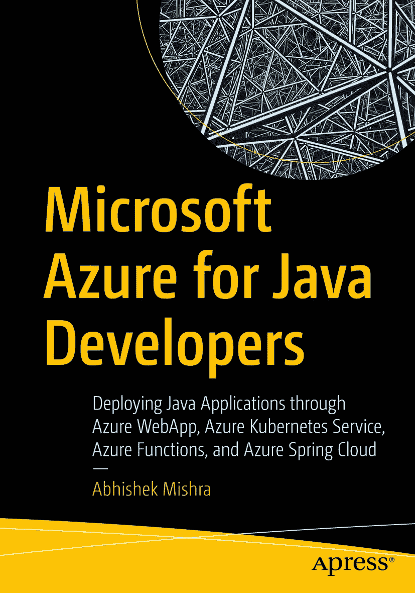

ISBN 978-1-4842-8250-2e-ISBN 978-1-4842-8251-9 [`doi.org/10.1007/978-1-4842-8251-9`](https://doi.org/10.1007/978-1-4842-8251-9) © Abhishek Mishra 2022 本作品受版权保护。所有权利均由出版商独家许可，无论涉及材料的全部或部分，具体包括翻译、重印、重用插图、朗诵、广播、以缩微胶卷或任何其他物理方式复制，以及电子改编、计算机软件的信息存储与检索传输，或使用目前已知或未来开发的类似或不同方法。本出版物中使用的一般描述性名称、注册商标名称、商标、服务标记等，即使未作明确声明，也不意味着这些名称不受相关保护性法律和法规的约束，因此可供一般使用。出版商、作者和编辑可安全地假定，本书中的建议和信息在出版之日是真实准确的。出版商、作者或编辑均不对本文所含材料或可能存在的任何错误或遗漏提供明示或暗示的担保。出版商对已出版地图和机构归属中的管辖权主张保持中立。

本 Apress 印记由注册公司 APress Media, LLC（Springer Nature 的一部分）出版。

注册公司地址为：1 New York Plaza, New York, NY 10004, U.S.A.

*谨以此书献给我始终支持我的妻子 Suruchi 和可爱的女儿 Aaria。*

引言

本书帮助您在 Azure 上构建和运行基于 Java 的应用程序。您将了解 Azure 上支持 Java 应用程序的可用服务，并通过实践演示学习如何创建这些服务并在其上运行 Java 应用程序。本书展示了如何在 Azure WebApp、Azure Kubernetes Service、Azure Functions 和 Azure Spring Cloud 中部署 Java 应用程序。此外，还涵盖了与 Graph API、Azure Storage、Azure Redis Cache 和 Azure SQL 等组件的集成。

本书面向计划构建基于 Azure 的 Java 应用程序并将其部署在 Azure 上的 Java 开发人员。开发人员应具备初步的云基础知识，以帮助他们理解 Azure 上可用的 Java 功能。开发人员无需成为 Azure 专家即可掌握本书内容，并开始使用 Azure 上可用的功能构建基于 Java 的应用程序。但是，开发人员应具备良好的 Java 编程语言和框架知识。

本书首先简要讨论云计算，并介绍 Azure 对 Java 的支持。然后，您将学习如何使用每种部署模型部署 Java 应用程序，并看到与 Java 程序员特别相关的 Azure 服务集成的示例。安全性是一个重要方面，本书展示了如何使用 Azure Active Directory 为 Java 应用程序启用身份验证和授权。

在当今市场，构建任何应用程序时实施 DevOps 策略都至关重要。本书中的示例展示了如何构建持续集成和持续部署管道，以在 Azure 上构建和部署 Java 应用程序。本书重点介绍了在 Azure 上设计和实现 Java 应用程序时应遵循的最佳实践。本书还详细阐述了如何使用 Application Insights 和 Azure Monitor 监控和调试在 Azure 上运行的 Java 应用程序。

致谢

我要感谢 Apress 给我机会编写本书。同时感谢技术审稿人、编辑以及整个 Apress 团队在此过程中给予我的支持。

关于作者 关于技术审稿人

