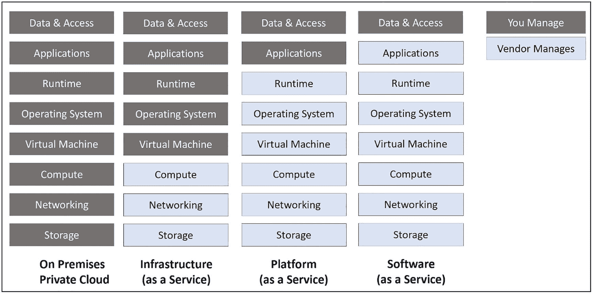
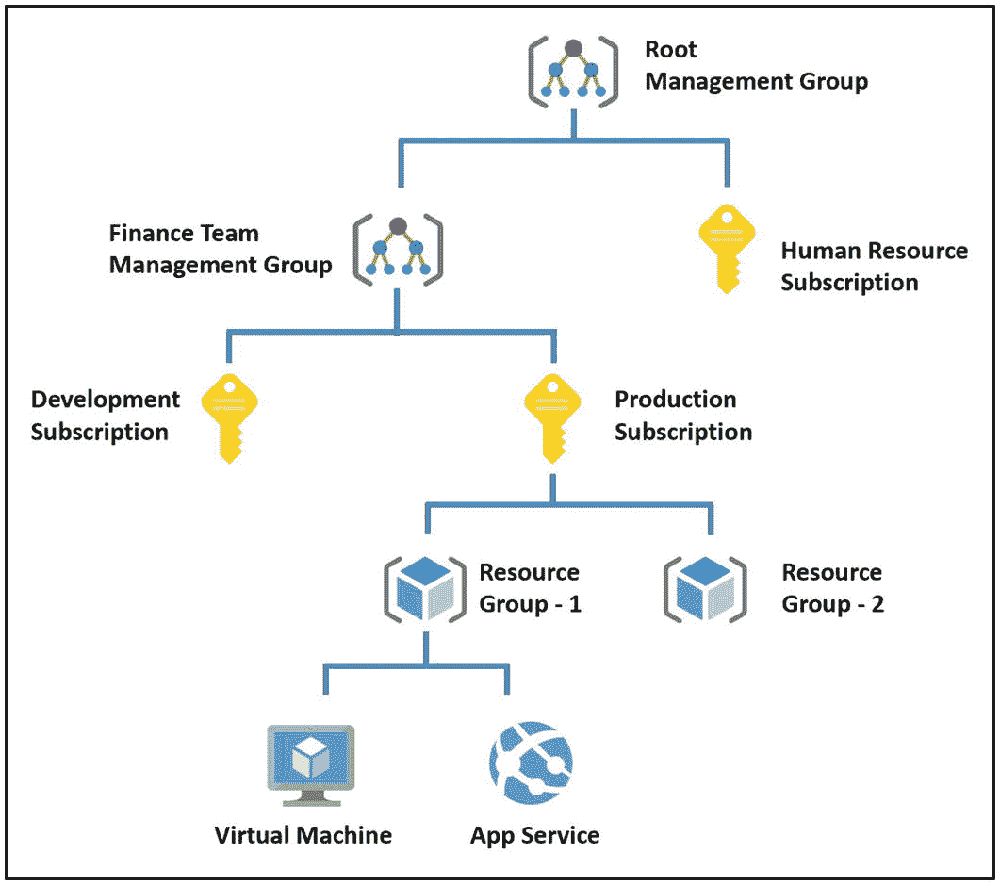

# 1.  Azure Java 开发入门

云是新一代的托管环境。所有使用前沿框架开发的现代应用程序都托管在云上。云托管有助于您节省成本并解决问题。您无需担心构建和管理托管应用程序的底层基础设施。您只需构建应用程序并将其托管在云上，从而简化开发和维护工作。Microsoft Azure、Amazon Web Services 和 Google Cloud Platform 是流行的云供应商。不过，还有许多其他供应商提供云托管服务。

许多大型企业使用 Java 构建应用程序，而 Azure 为 Java 提供了出色的支持。这些企业可以轻松地在 Azure 上运行其 Java 应用程序，并构建在 Azure 上运行的稳健的云原生 Java 解决方案。

## 结构

在本章中，我们将讨论 Azure 为 Java 开发人员提供的以下方面：

*   什么是云计算

*   Azure 简介

*   Azure 对 Java 的支持

## 目标

学习本章后，您应能获得以下知识：

*   理解 Azure 上云计算的基础知识

*   识别支持 Java 应用程序的 Azure 服务

*   识别可在 Azure 上托管的 Java 框架

## 什么是云计算

### 云计算基础

我们开发一个应用程序并将其托管在服务器上。我们购买服务器基础设施，安装操作系统，将其接入网络，并安装必要的托管软件和应用程序依赖项。然后，我们将应用程序托管在服务器上。整个过程耗时且需要投入资金来购买服务器基础设施以及应用程序运行所需的必要软件。

一旦我们托管了应用程序，就需要保持服务器和托管环境的持续运行。我们需要修复硬件故障，甚至在必要时更换硬件。我们可能还需要根据需求，不时地为操作系统和应用程序托管软件应用软件补丁。我们可能还需要硬件专家与应用程序开发人员一起执行维护活动。维护硬件会产生运营支出。此外，一旦我们购买了服务器，就必须一直使用它。如果我们计划停用该应用程序，那么可能就不再需要服务器基础设施了。由于我们已经购买了服务器，因此会被它束缚住。

为了解决这些问题，企业开始规划虚拟化托管环境。他们开始购买强大的数据中心或服务器基础设施，将底层基础设施虚拟化为多个虚拟机，并开始在这些虚拟机上托管应用程序。他们配置虚拟机来托管新应用程序，并在应用程序停用时停用虚拟机。这个过程使得托管环境可以按需提供。像亚马逊和微软这样的大型组织从这些虚拟化环境中获得灵感，开始构建云基础设施。他们开始在云基础设施上运行自己的应用程序，然后将其云服务商业化。

云计算就是租用计算服务，例如托管环境、数据库、存储等等。你可以构建自己的应用程序，从微软 Azure 或亚马逊 Web 服务等云供应商那里租用托管环境，并将你的应用程序托管在租用的托管环境中。你无需担心底层的托管基础设施，因为云供应商会对其进行管理。你只需要将应用程序部署到云供应商提供的云服务中即可。这种方法可以节省你的资本支出和运营支出。你无需购买任何服务器来托管应用程序，也无需担心保持服务器的持续运行。你只需按需从云供应商那里租用托管环境并托管你的应用程序。云供应商将维护基础设施，当你不再需要时，可以随时停用该基础设施。而且不仅仅是托管环境，你还可以根据应用程序的需求租用其他服务，如数据库、存储、网络等等。

注意

云计算就是从云供应商（如微软 Azure、亚马逊 Web 服务或谷歌云平台）那里租用云托管服务。

### 云服务类型

你可以选择从云供应商那里租用虚拟机服务，并将你的应用程序托管在虚拟机上。在托管应用程序之前，你必须安装并配置托管环境以及所有必要的应用程序依赖项。例如，假设你正在托管一个 Java 应用程序。在这种情况下，你需要安装 Java 运行时环境 (JRE) 作为托管软件以及其他必要的应用程序依赖项。你需要根据需要不时地安装操作系统和托管环境的补丁。尽管你节省了底层托管基础设施的所有权成本，但你仍然会产生一些运营支出，并且需要为维护任务规划一些专门的精力。但是，你无需担心底层基础设施的硬件故障，因为云供应商会处理这些问题。这种租用虚拟机并托管应用程序的方法称为基础设施即服务 (IaaS)。在这种托管模型中，你可以完全控制托管环境。你可以根据需要安装所有必要的应用程序依赖项并配置托管环境。将应用程序托管在虚拟机上会给你带来类似于将其托管在本地服务器上的体验。

注意

对于基础设施即服务，你可以对底层托管环境拥有更大的控制权。然而，这种云托管方法成本较高。

基础设施即服务托管选项会产生运营成本和精力。为了使流程更高效，云供应商提出了另一种有效的托管模型。在这种新模型中，云供应商将负责托管环境和底层托管基础设施的所有运营方面。作为开发人员，你需要构建你的应用程序，租用托管环境，然后托管应用程序。你无需担心创建底层基础设施或托管环境。云供应商将拥有底层基础设施、操作系统和托管软件的所有维护活动。这种方法是一种经济高效的选择，因为你无需担心购买基础设施以及维护基础设施和托管环境。你需要专注于构建应用程序并将其部署到运行在云供应商基础设施上的托管环境中。与基础设施即服务托管模型或本地服务器相比，你的应用程序将更快地准备好投入生产。但是，你对抽象的底层托管环境和基础设施没有任何控制权。

注意

对于平台即服务，你对底层托管环境没有控制权或只有最低限度的控制权。然而，这种云托管方法比基础设施即服务方法更便宜。

软件即服务是另一种可用的有趣托管选项。在这种情况下，供应商创建一个软件产品并将其托管在自己的云环境中。作为开发人员，你也可以构建一个产品并将其托管在供应商的云环境中，然后为你的最终客户提供订阅模式。客户可以为你的产品购买订阅模式，并根据你的产品订阅模式提供的年度、月度、每日或其他选项进行计费。客户将为产品配置数据和用户访问权限。他们无法访问底层基础设施和托管环境，也无法访问在云上运行的应用程序代码。微软 Office 365 或 Netflix 就是软件即服务的例子。

注意

在软件即服务中，你无法控制云基础设施、托管环境和应用程序代码。你为应用程序配置数据和访问权限。

图 1-1 总结了前面关于基础设施即服务、平台即服务和软件即服务的讨论。该图显示了这三种架构中各自的责任归属。

一张表示云托管选项的图表。

图 1-1

云托管选项

### 云部署模式

您可以选择将应用程序托管在公有云供应商上，例如亚马逊、Azure、谷歌或其他云服务商。在公有云场景下，云基础设施由公有云供应商管理，任何个人或组织都可以从公有云租用云服务。不过，您无法控制公有云中抽象化的云基础设施。组织也可以选择创建自己的私有云，该组织内的所有项目都可以使用其私有云提供的云服务。在私有云场景下，组织对云基础设施拥有更大的控制权，因为它拥有该基础设施。然而，组织在购买和搭建云基础设施时可能会产生巨额资本支出，并在维护云环境时产生运营支出。您还可以选择将应用程序及其组件部分部署在公有云上，部分部署在组织的私有云上，形成混合云模式。例如，您的应用程序前端和服务运行在公有云上，而数据库则运行在组织的私有云上。

以下是云计算的优势：

*   您无需承担基础设施的所有权和维护成本，因为云供应商负责管理基础设施。您可以预测未来的云成本，并高效规划基础设施和应用程序预算。

*   您只需单击一下，即可在几分钟内配置或取消配置云服务。如果不再需要该基础设施，您也不会被其锁定。

*   您无需花费精力为应用程序搭建基础设施，从而确保更快的上市时间。

*   您托管的应用程序具有高可用性，因为云供应商管理底层云环境，并根据您与供应商商定的服务级别协议，保证应用程序的高可用性。您还可以将应用程序的副本托管在跨多个区域的多个数据中心。这种策略可以确保即使某个数据中心或区域发生故障，您的应用程序仍然可用。

*   您的应用程序运行在由云供应商管理的可靠且容错的基础设施上，您无需担心这些应用层面的问题。

*   您的应用程序运行在高度可扩展的基础设施上。每当应用程序的传入请求增加或需要更多计算能力时，底层云环境会创建额外的基础设施来管理负载。同样，当不再需要额外的基础设施时，底层云基础设施会将其取消配置。您可以选择通过预定义所需服务实例的数量来手动扩展，也可以设置自动扩展，根据应用程序性能指标进行扩展。例如，如果传入负载增加，底层云基础设施会监控传入负载。当 CPU 利用率、内存利用率或其他性能指标达到设定的阈值时，它会自动启动额外的资源。

*   您的应用程序运行在弹性基础设施上，您可以设置扩展限制。底层基础设施不会添加或移除超出该限制的额外服务实例，这有助于您在扩展场景下控制成本。您的基础设施将在您定义的范围内进行扩展。

*   将应用程序托管在云上可以确保您的应用程序能够全球可用。领先的云供应商在全球各地都设有数据中心。只要云供应商在该区域有数据中心，您就可以将应用程序托管在任何地方。

*   您可以管理应用程序的客户延迟问题。您可以将应用程序的副本托管在靠近客户的数据中心。可用的基于云的负载均衡器在全球范围内运行，可以对托管在多个区域的应用程序进行负载均衡。这些负载均衡器会将客户请求路由到靠近客户的数据中心。

*   您的应用程序运行在由云供应商管理的高度安全的环境中。领先的云供应商已获得主要安全机构和政府对其服务的认证。如今，许多政府门户网站和应用程序都运行在云上。

## Azure 简介

Azure 是微软提供的云服务。它于 2008 年在微软的专业开发者大会上首次公布。微软于 2010 年 2 月将其云平台正式发布，并命名为 Windows Azure，随后在 2014 年更名为 Microsoft Azure。如今，Microsoft Azure 拥有 200 多种基于云的服务，可帮助您在 Azure 上构建和托管前沿解决方案。

在 Azure 上运行的应用程序可以是面向客户的简单网站、强大的数据平台、基于机器学习的复杂智能应用程序，或任何其他新一代解决方案。Azure 支持多种软件语言和框架，例如 .NET Core、Java、Python 等。Microsoft Azure 是全球领先的私营组织和政府的热门云选择。您可以轻松地在 Azure 上构建高可用、可靠、容错且安全的解决方案。您在 Azure 上的解决方案可以基于基础设施即服务模式、平台即服务模式或软件即服务模式。

Azure 提供全球基础设施，包括遍布全球的 200 多个物理数据中心。这些数据中心通过微软拥有的高可用且安全的互联网络连接。这些数据中心被分组为可用区，一个地理区域由一组可用区组成。您可以将 Azure 解决方案托管在单个可用区内的多个数据中心，使解决方案具有本地冗余；或托管在跨多个可用区的数据中心，使解决方案具有可用区冗余；或托管在跨多个区域的数据中心，使解决方案具有地理冗余。

Azure 数据中心遍布全球，您的解决方案可以托管在靠近客户群的任何地方。您可以为在 Azure 上运行的工作负载构建出色的数据备份和恢复策略，因为您可以将数据和解决方案备份到跨多个可用区或区域的数据中心。即使运行您应用程序的主可用区或区域发生故障，您在 Azure 上运行的解决方案也可以从您拥有备份的辅助可用区或区域迅速恢复并投入使用。

Azure 提供跨多个类别的广泛服务，例如计算、数据、存储、网络等。表 1-1 描述了云从业者经常使用的一些 Azure 服务。

表 1-1
一些流行的 Azure 服务

| 类别 | 服务 |
| --- | --- |
| 计算 | 虚拟机、Web 应用、函数应用、Kubernetes |
| 数据 | SQL、MySQL、Cosmos DB |
| 存储 | Blob 存储、队列存储、文件存储、Data Lake |
| 网络 | 虚拟网络、防火墙、负载均衡器 |
| 人工智能 | 认知服务、机器学习服务 |
| 物联网 | IoT 中心 |

您可以使用 Azure 门户（提供图形化直观的用户体验）或命令行工具（如 Azure CLI 或 Azure PowerShell）或这些服务公开的 REST API 来配置、删除或与您的 Azure 资源进行交互。您还可以使用 Terraform、Azure ARM 模板、Chef 或其他流行的基础设施即代码产品来构建基础设施即代码解决方案。

您创建的 Azure 资源或服务都排列在资源组内。资源组是所有资源的逻辑容器，而资源组则分组在订阅中。订阅定义了您所使用的 Azure 资源的定价模式。您需要购买一个 Azure 订阅，才能开始创建资源。订阅进一步分组到管理组中。您可以在管理组级别、订阅级别或资源组级别为资源定义管理和治理策略。一个管理组内可以包含多个管理组。但是，您不能嵌套订阅或资源组。图 1-2 展示了我们如何在资源组和订阅中对资源进行分组。

一张表示 Azure 资源分组的图表。

图 1-2

Azure 资源的分组

## Azure 对 Java 的支持

Azure 对基于 Java 的应用程序提供了出色的支持。您可以构建 Spring MVC、Spring Boot、Open Liberty 或任何其他类型的 Java 应用程序，并让这些应用程序在 Azure 上无缝运行。但是，您的 Java 应用程序应使用 Java 8 或更高版本开发。如果您有旧版 Java 应用程序，则应将其现代化，升级到 Java 8 或更高版本，然后在 Azure 上运行。

您可以选择构建 Java 应用程序并在 Linux 或 Windows 虚拟机上运行。您也可以方便地使用 Azure 市场中现成的虚拟机产品，例如 Oracle WebLogic Server。您的托管环境将与本地服务器大致相似，并且您将完全控制托管环境。您也可以选择构建应用程序并将其托管在 Azure WebApp 上。Azure WebApp 是一种平台即服务产品。无需担心底层托管基础设施和软件，您只需构建应用程序并将其托管在 Azure WebApp 上即可。您可以使用微服务模式构建现代分布式 Java 应用程序，并将应用程序作为容器托管在 Azure Kubernetes 服务中。您也可以选择在 Azure Spring Cloud 上运行应用程序。Azure Spring Cloud 是 Azure 上的 Spring Cloud 产品。您可以使用基于 Java 的 Azure Functions、Azure Logic Apps 以及 Azure 上的其他无服务器产品构建强大的无服务器应用程序。简而言之，Azure 为您的 Java 应用程序提供了广泛的可能性。

您可以将 Java 应用程序与其他流行的 Azure 服务集成，例如 Azure Active Directory、Azure Redis 缓存、Azure SQL、Azure Cosmos DB、Azure 认知服务、Azure Logic Apps 等等。这些服务将帮助您构建云原生解决方案，而无需为应用程序的缓存、数据库、内容交付、身份验证、授权或其他问题使用任何本地组件。

所有流行的 Java 编辑器（如 Eclipse、IntelliJ 和 Visual Studio Code）都支持无缝部署到 Azure。您还可以使用 Maven 或 Gradle 打包 Java 应用程序并将其部署到 Azure。您可以利用 Azure DevOps 或 Jenkins 等流行的 DevOps 工具，在 Azure 上为您的应用程序构建持续集成和持续部署。

您可以使用 Azure Monitor 和 Application Insights 监控在 Azure 上运行的 Java 应用程序。您可以将应用程序日志引入 Log Analytics 工作区，并在需要时查询这些日志。

您可以将 Java 应用程序与 Azure Active Directory 集成，并使用 OAuth 为 Java 应用程序启用身份验证和授权。Azure Active Directory 是 Azure 上广泛接受的身份管理解决方案。您可以使用 Azure Active Directory 为 Java 应用程序构建强大的企业级身份管理策略，并启用单点登录或多重身份验证等流行的身份功能。

注意

Azure 为 Java 应用程序提供原生开箱即用的支持。您的应用程序应使用 Java 8 或更高版本。

## 总结

在本章中，我们学习了云计算的基础知识。我们探讨了不同的云托管类型，例如基础设施即服务、平台即服务和软件即服务。然后，我们探讨了 Microsoft Azure 以及 Microsoft Azure 提供的 Java 支持。在下一章中，我们将学习 Azure WebApp 的基础知识，然后构建一个 Spring Boot Java 应用程序，使用 Maven 打包它，并使用基于 Maven 的 Azure 插件将其部署到 Azure WebApp。

以下是本章的关键要点：

*   云计算就是从云供应商处租用云托管服务。

*   Microsoft Azure、Amazon Web Services 和 Google Cloud Platform 是当今领先的云供应商。

*   您可以使用基础设施即服务 (IaaS) 模型、平台即服务 (PaaS) 模型或软件即服务 (SaaS) 模型将应用程序托管在云上。

*   Azure 支持无缝托管 Java 应用程序。

*   您的 Java 应用程序应使用 Java 8 或更高版本才能在 Azure 上运行。

*   您可以在虚拟机、Azure WebApp、Azure Function、Azure Kubernetes 服务或 Azure Spring Cloud 上运行 Java 应用程序。

