# 2. Java for Azure WebApp

WebApp 是一种常用的 Azure 服务。您可以构建应用程序并将其托管在 Azure WebApp 内，而无需担心托管基础设施。底层 Azure 平台负责处理所有基础设施和托管需求。WebApp 帮助您的应用程序快速上线，因为您可以在几分钟内完成配置并托管应用程序。WebApp 支持多种编程语言和框架，例如 .NET、Java、PHP、Node.js 等等。它为托管 Java 应用程序提供了出色的开箱即用支持。

在上一章中，我们学习了云计算的基础知识以及 Azure 对 Java 的支持。在本章中，我们将学习 Azure WebApp 的详细信息，然后将 Java 应用程序托管在 Azure WebApp 中。

## 结构

在本章中，我们将讨论 Java for Azure WebApp 的以下方面：

*   Azure WebApp

*   App Service 计划

*   在 Azure WebApp 上部署 Java 应用程序

*   缩放托管在 Azure WebApp 上的 Java 应用程序

## 目标

学习完本章后，您应该能够获得以下知识：

*   理解 Azure WebApp 和 App Service 计划的概念

*   在 Azure WebApp 上部署 Java 应用程序


## Azure WebApp

Azure WebApp 是 Azure 上提供的一项平台即服务（PaaS）产品。你可以构建基于 HTTP 的应用程序和服务，并将其托管在 Azure WebApp 上。你无需担心创建和管理底层托管基础设施，Azure 平台会为你处理这些事务。你只需预配服务并托管你的应用程序即可。你可以使用任何支持的语言（如 .NET、Java、Node.js、Python、PHP 和 Ruby）构建 Web 应用程序、REST API 和移动后端，并在 Azure WebApp 上运行。Azure WebApp 同时支持基于 Windows 和 Linux 的环境。你还可以使用 Docker 将应用程序容器化，并在 Azure WebApp 上运行。

Azure WebApp 具有高可用性和可伸缩性。你可以将 WebApp 配置为自动缩放，也可以手动缩放 WebApp。它拥有丰富的持续集成和持续部署支持，并能轻松与 Azure DevOps、Jenkins、Bitbucket、GitHub 甚至任何本地 Git 仓库集成。它还支持通过 FTP 部署应用程序。

你可以为 Azure WebApp 创建多个部署槽位。你的应用程序将在生产部署槽位上运行，你可以为 Azure WebApp 创建一个过渡部署槽位，并托管新开发的应用程序版本。大部分应用程序流量可以导向生产槽位，部分应用程序流量可以导向过渡槽位。最终，一旦你对新开发的应用程序有足够信心，你可以将过渡槽位中的内容与生产槽位交换，并将所有流量重定向到生产槽位。你可以使用基础设施即代码和 DevOps 解决方案来自动化此过程。

注意

你可以通过为 WebApp 预配额外的相同实例来水平缩放 Azure WebApp，或者通过更改应用服务计划来垂直缩放它。垂直缩放称为纵向扩展过程，水平缩放称为横向扩展过程。

## 应用服务计划

有些应用程序是 CPU 密集型的，有些是内存密集型的，还有一些应用程序可以在较少的计算资源上运行。每个应用程序都有其计算、基础设施需求以及其他需求，如缩放、数据存储等，Azure WebApp 通过应用服务计划来满足这些应用程序需求。应用服务计划定义了 Azure WebApp 的计算资源、缩放、部署槽位、定价层以及其他必要功能。根据应用程序需求，你可以为 WebApp 选择应用服务计划。每个 WebApp 都在一个应用服务计划上运行。你可以在一个应用服务计划上共享多个 WebApp，并在多个 WebApp 之间共享底层托管基础设施。

以下是为基于 Azure WebApp 的应用服务计划提供的定价层：

*   共享计算
*   专用计算
*   隔离

### 共享计算

共享计算提供免费或共享计划，底层托管基础设施将由运行在应用服务计划上的 WebApp 与多个客户共享。此层不提供缩放功能，但保证你的应用程序的计算隔离。你只能将此层用于开发和测试目的。

### 专用计算

使用专用计算，你将为运行在你的应用服务计划上的所有 WebApp 拥有专用的底层托管基础设施。它可以是基本、高级或标准层。高级层提供最大数量的计算资源和缩放实例，其次是标准层和基本层。保证你的应用程序的计算隔离。

### 隔离

隔离计划为你的 Azure 提供专用的虚拟网络。此层在保证计算隔离的同时，还保证了网络隔离。

## 在 Azure WebApp 上部署 Java 应用程序

让我们构建一个 Java Spring Boot 应用程序，并将其部署到 Azure WebApp 上。我们将使用 Maven 来构建应用程序并将其部署到 Azure WebApp。以下是你在开始部署步骤之前应准备好的先决条件。对于提到的工具，你可以选择最新版本或任何你习惯使用的其他版本。

*   Visual Studio Code
*   系统上安装的 Java 8 或更高版本
*   系统上安装的与已安装的 Java 版本兼容的 Maven 版本
*   应拥有一个 Azure 订阅，并具有创建资源组以及资源组内资源的权限
*   系统上安装的 Azure CLI


### 创建 Java Spring Boot 应用程序

让我们创建一个 Java Spring Boot 应用程序，并将其部署到 Azure WebApp。请访问以下 URL 来生成一个 Java Spring Boot 应用程序。

```
https://start.spring.io/
清单 2-1
Spring Initializr URL
```

将*项目*选择为 *Maven 项目*，*语言*选择为 *Java*，并选择 *Spring Boot* 版本。Spring Boot 版本更新非常频繁，您可以根据个人偏好或选择最新的可用版本。按照图 2-1 所示提供*项目元数据*。将*打包方式*选择为 JAR，*Java* 版本选择为 *11*。

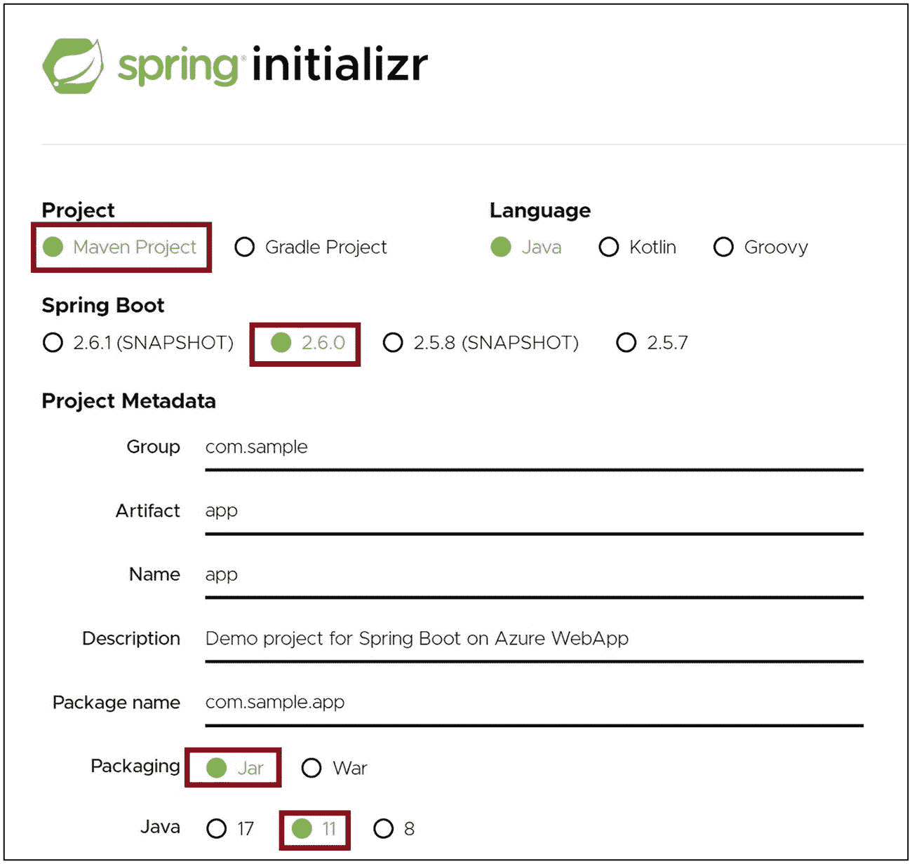

Spring Initializr 的截图。在项目、语言和 Spring Boot 下分别选择了 Maven 项目、Java 和 2.6.0 选项。项目元数据列出了以下需要输入的选项和字段：Group、Artifact、Name、Description 和 Package name。在打包方式和 Java 下分别选择并高亮显示了 Jar 和 11 选项。

图 2-1

配置 Spring Boot 项目

我们需要为应用程序添加 Spring Web 依赖项。点击图 2-2 中所示的 *ADD DEPENDENCIES* 按钮。我们将在示例应用程序中创建一个 REST API，而 Spring Web 依赖项将帮助我们创建它。

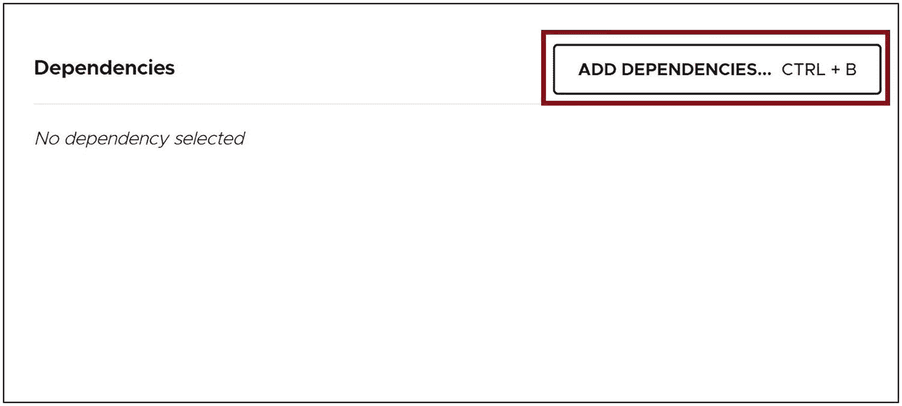

添加依赖项页面的截图。右侧的方框显示：添加依赖项，C T R L 加 B。主页面显示：未选择依赖项。

图 2-2

点击 ADD DEPENDENCIES

如图 2-3 所示，选择 *Spring Web*。

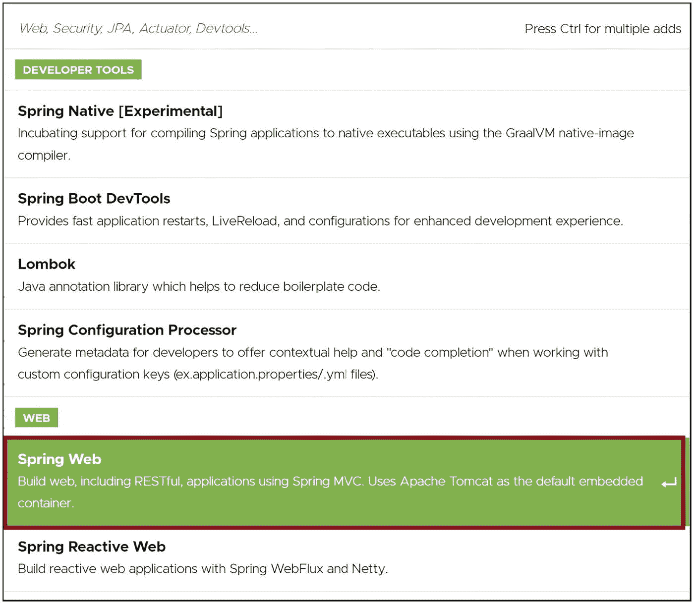

Spring Web 依赖项的截图。开发者工具列表包括 Spring Native、Spring Boot Dev Tools、Lombok 和 Spring Configuration Processor。Web 部分包括 Spring Web（已高亮显示）和 Spring Reactive Web。

图 2-3

选择 Spring Web 依赖项

点击如图 2-4 所示的 *GENERATE* 按钮。此操作将生成一个示例 Java Spring Boot 应用程序，并会下载到本地。

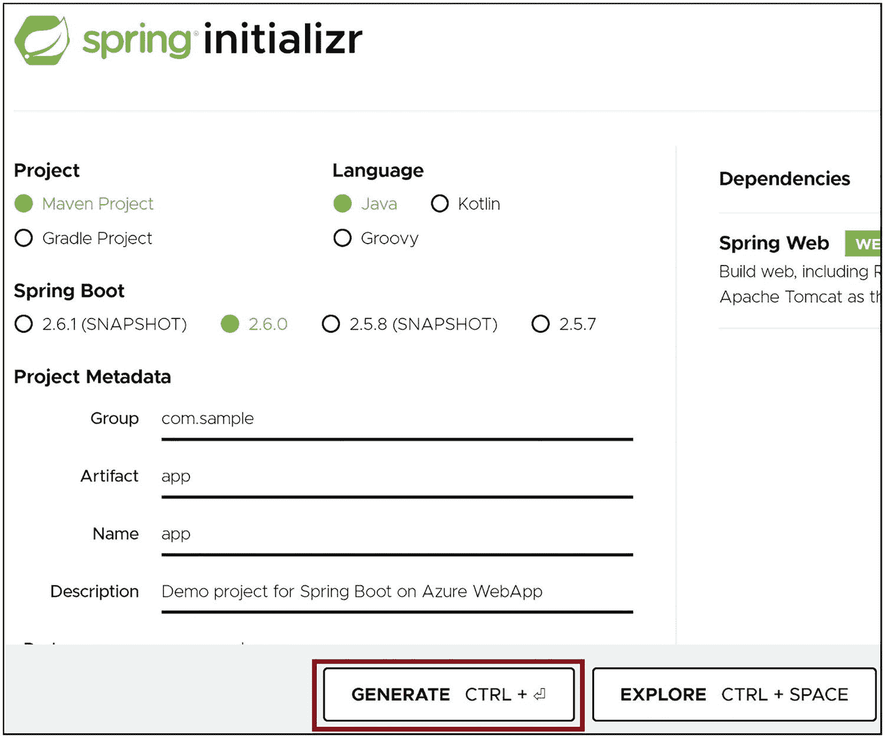

Spring Initializr 的截图。选项卡包括项目、Maven 项目、语言、Java、Spring Boot、2.6.0 和项目元数据。项目元数据包括以下选项及其对应的输入字段：Group（com.sample）、Artifact 和 Name（app）、Description（demo project）。底部有两个按钮，包括已高亮显示的 Generate C T R L 和 Explore C T R L 加空格。

图 2-4

生成 Spring Boot 项目

在 Visual Studio Code 中打开该应用程序。找到 `AppApplication.java` 文件。您可以在 `java\com\sample\app` 文件夹中找到它，如图 2-5 所示。

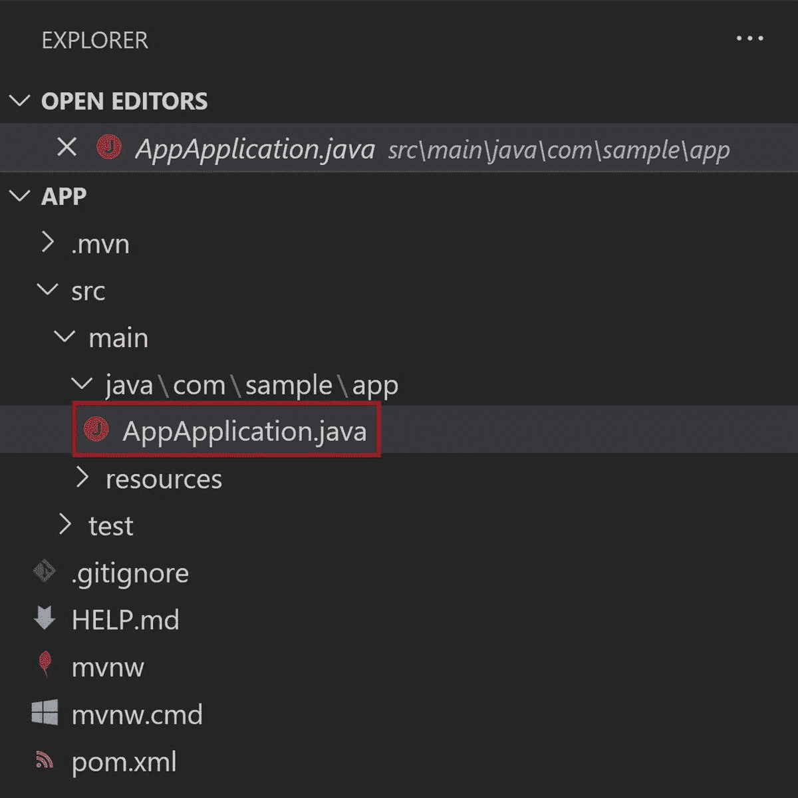

查找文件位置的页面截图。顶部的选项卡显示：资源管理器。标题为“打开的编辑器”的下拉选项卡包括 `AppApplication.java` `src/main/java/com/sample/app`。标题为“app”的下拉选项卡包括 `.mvn`、`src`、`main`、`java/com/sample/app` 以及已高亮显示的 `AppApplication.java`。

图 2-5

AppApplication.java 文件位置

将 `AppApplication.java` 文件中的代码替换为清单 2-2 中的代码。我们将 `AppApplication` 类注解为 REST 控制器，并添加一个名为 `hello` 的 REST GET API。当我们调用此 REST API 时，将得到 `Hello World` 字符串作为响应。

```
package com.sample.app;
import org.springframework.boot.SpringApplication;
import org.springframework.boot.autoconfigure.SpringBootApplication;
import org.springframework.web.bind.annotation.GetMapping;
import org.springframework.web.bind.annotation.RestController;
@SpringBootApplication
@RestController
public class AppApplication {
public static void main(String[] args) {
SpringApplication.run(AppApplication.class, args);
}
@GetMapping("/hello")
public String hello() {
return String.format("Hello World !!");
}
}
清单 2-2
AppApplication.java
```

现在，让我们打开一个新的终端窗口，并使用 Maven 构建应用程序（图 2-6）。

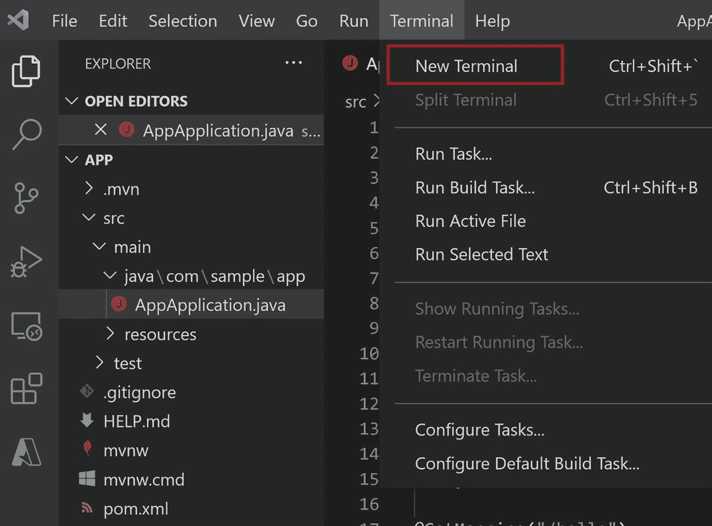

终端窗口的截图。顶部的工具栏包括文件、编辑、选择、查看、转到、运行、终端和帮助。终端包括已高亮显示的“新建终端”、“运行任务”、“运行生成任务”、“运行活动文件”、“运行选定文本”、“配置任务”和“配置默认生成任务”。左侧的选项列出了打开的编辑器，并且已选择“Application”。

图 2-6

打开一个新的终端窗口

让我们执行以下命令来构建应用程序，如清单 2-3 所示。请确保在终端中导航到包含 `pom.xml` 文件的目录。

```
mvn install
清单 2-3
构建应用程序
```

构建成功后，会创建一个包含可运行 JAR 文件的名为 `target` 的目录。导航到 `target` 目录，并在该目录中执行以下命令，如清单 2-4 所示。

```
java -jar app-0.0.1-SNAPSHOT.jar
清单 2-4
运行应用程序
```

应用程序成功启动后，在浏览器中访问以下 URL，如清单 2-5 所示。

```
http://localhost:8080/hello
清单 2-5
运行中应用程序的 URL

您可以看到来自 hello REST API 的响应，如图 2-7 所示。

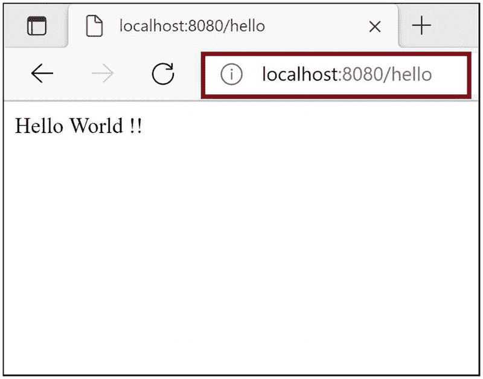

Java Spring Boot REST API 窗口的截图。顶部的栏显示：localhost:8080/hello。搜索窗口显示 localhost:8080/hello 并已高亮显示。顶部有刷新和返回按钮。主页上的文本显示：Hello world!!。

图 2-7

浏览 Java Spring Boot REST API

我们可以将此应用程序部署到 Azure。现在，让我们预配一个 Azure WebApp，以便在此 WebApp 上部署该应用程序。


### 创建 Azure WebApp

现在让我们启动一个 Azure WebApp。我们将把 Java 应用程序部署到这个 WebApp 中。使用以下链接（如清单 2-6 所示）在浏览器中转到 Azure 门户。

```
https://portal.azure.com
清单 2-6
Azure 门户的 URL
```

点击*创建资源*，如图 2-8 所示。此操作将导航到 Azure 市场，您可以在其中选择要创建的服务。


Microsoft Azure 的屏幕截图。Azure 服务包括已高亮显示的“创建资源”、“资源组”和“订阅”。顶部的搜索栏显示：“搜索资源、服务和文档 G 加斜杠”。

图 2-8

创建资源

选择 *Web 应用*，如图 2-9 所示。如果在热门产品列表中看不到 WebApp，请使用搜索栏进行搜索。

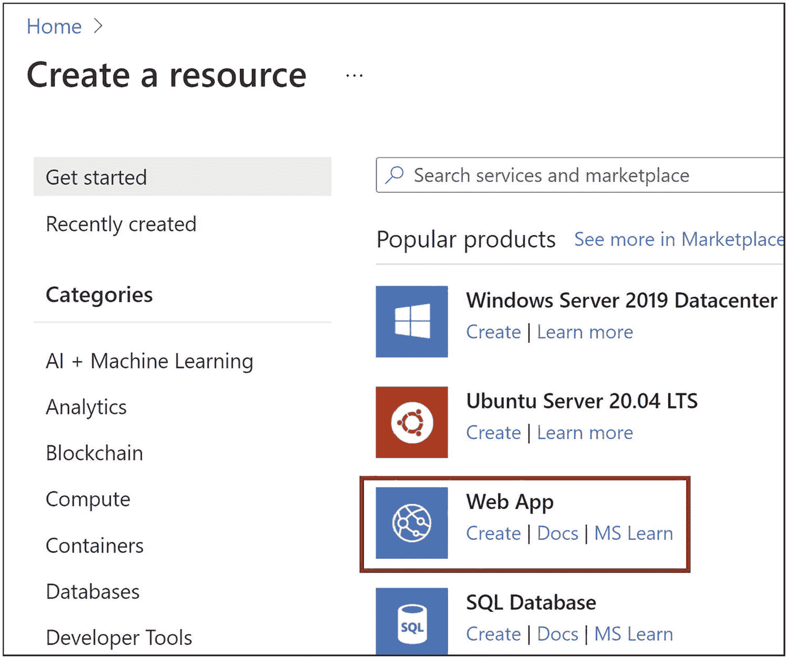

Web 应用页面的屏幕截图，其中包含创建资源的步骤。热门产品列表为：Windows Server 2019 Datacenter、Ubuntu Server 20.04 LTS、已高亮显示的 Web 应用以及 SQL 数据库。左侧的类别列出了 AI 机器学习、分析、区块链、计算、容器、数据库和开发人员工具。

图 2-9

在市场中选择 Web 应用

提供订阅、资源组和 WebApp 的名称，如图 2-10 所示。

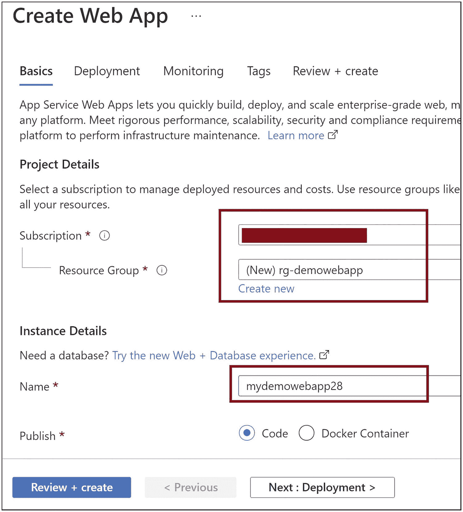

标题为“创建 Web 应用”的网页屏幕截图。顶部的选项卡是“基本信息”、“部署”、“监控”、“标签”和“查看 + 创建”。基本信息下的项目详细信息是已高亮显示的“订阅”和“资源组”。实例详细信息是“名称”（其字段框已高亮显示），“发布”选项已选择“代码”。底部的“查看并创建”按钮已被选中。

图 2-10

提供 WebApp 的基本详细信息

向下滚动并提供代码发布详细信息、区域和 App Service 计划，如图 2-11 所示。点击*查看 + 创建*。此操作将导航到验证页面。

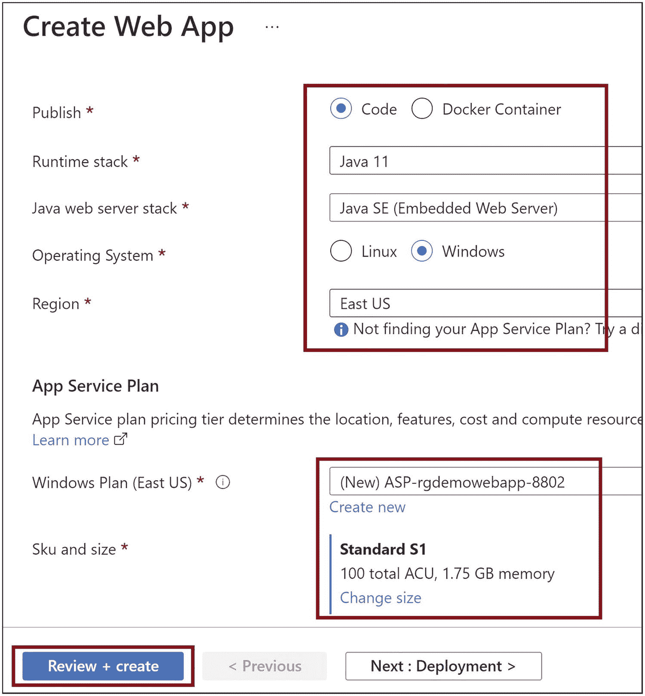

创建 Web 应用步骤的屏幕截图。步骤包括“发布”、“代码”、“运行时堆栈”、“Java 11”、“Java Web 服务器堆栈”、“操作系统”、“Windows”和“区域：美国东部”。字段框已高亮显示。App Service 计划包括“Windows 计划”和“SKU 及大小”，其各自的字段已高亮显示。底部的“查看并创建”按钮已被选中。

图 2-11

点击查看 + 创建

点击*创建*，如图 2-12 所示。此操作将启动您的 Azure WebApp。

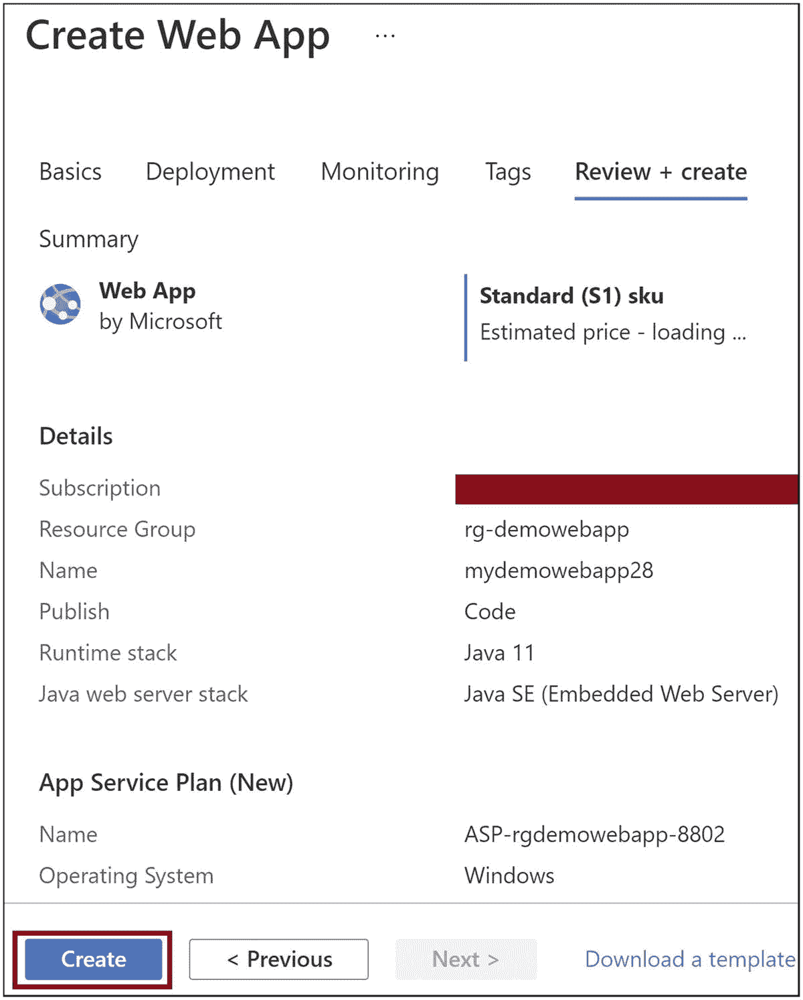

创建 Web 应用步骤的屏幕截图。顶部的选项卡是“基本信息”、“部署”、“监控”、“标签”和“查看 + 创建”。“查看 + 创建”下的摘要包括“Web 应用”和“标准 S1 SKU”。详细信息包括“订阅”（其字段已高亮显示）、“资源组”、“名称”和“发布”。App Service 计划包括“名称”和“操作系统”。“创建”选项已被选中并高亮显示。

图 2-12

点击创建

### 将应用程序部署到 Azure WebApp

我们已经开发了示例应用程序，并且也预配了一个 Azure WebApp。现在让我们使用 Maven 插件将应用程序部署到 Azure WebApp。您可能需要使用 Azure CLI 通过 `az login` 命令登录。返回 Visual Studio Code 并打开一个新的终端窗口。在终端提示符下导航到包含 `pom.xml` 文件的目录。在终端提示符下执行清单 2-7 中的命令。

```
mvn com.microsoft.azure:azure-webapp-maven-plugin:2.2.1:config
清单 2-7
Azure Maven 插件
```

系统将提示您输入选择，以选择我们之前创建的 WebApp。您也可以选择创建一个新的 WebApp，如图 2-13 所示。

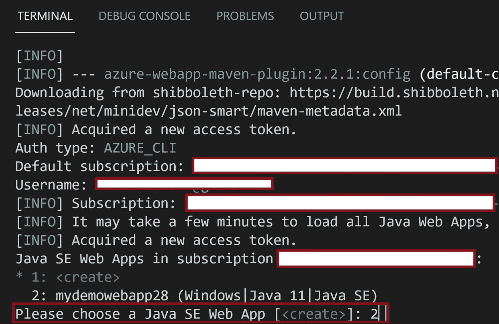

Web 应用编码的屏幕截图。顶部栏的选项卡包括“终端”、“调试控制台”、“问题”和“输出”。代码上的术语显示：“已获取新的访问令牌”、“身份验证类型”、“Azure_CLI”、“默认订阅”、“用户名”和“订阅”。底部的命令显示：“请选择一个 Java SE Web 应用”，该命令已高亮显示。

图 2-13

选择您的 WebApp

验证并确认您的选择，如图 2-14 所示。

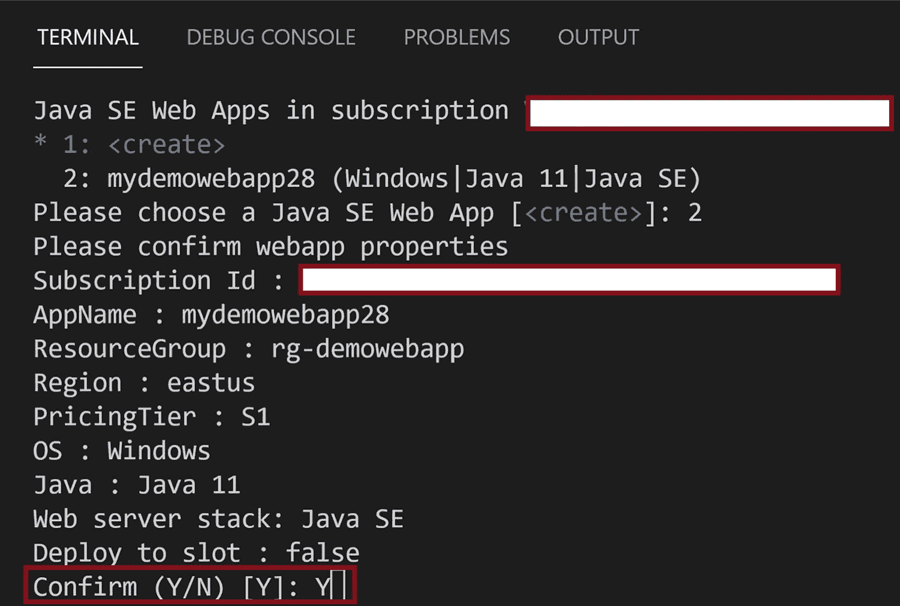

Web 应用选择编码的屏幕截图。顶部栏的选项卡包括“终端”、“调试控制台”、“问题”和“输出”。命令显示：“订阅中的 Java SE Web 应用”、“请选择一个 Java SE Web 应用”、“请确认 Web 应用属性”、“订阅 ID”、“应用名称”、“资源组”、“区域”、“定价层”和“操作系统”。最后的代码“确认 Y/N”已高亮显示。

图 2-14

确认您的选择

此命令成功完成后，*pom.xml* 文件将被修改，WebApp 详细信息将被添加到其中，如清单 2-8 所示。在执行此演示时，请使用可用的最新包和插件版本。

```

4.0.0

org.springframework.boot
spring-boot-starter-parent
2.6.0

com.sample
app
0.0.1-SNAPSHOT
app
在 Azure WebApp 上运行 Spring Boot 的演示项目

org.springframework.boot
spring-boot-starter-web

org.springframework.boot
spring-boot-starter-test
test

org.springframework.boot
spring-boot-maven-plugin

com.microsoft.azure
azure-webapp-maven-plugin
2.2.1

v2
a3759752-01d3-4b0e-ad35-71bd2faa2980
rg-demowebapp
mydemowebapp28
S1
eastus
ASP-rgdemowebapp-8802
rg-demowebapp

Windows
Java 11
Java SE

${project.basedir}/target

*.jar

清单 2-8
更新后的 pom.xml
```

现在运行以下命令来部署您的应用程序，如清单 2-9 所示。

```
mvn package azure-webapp:deploy
清单 2-9
将应用程序部署到 WebApp
```

应用程序成功部署后，您可以浏览 WebApp URL（如图 2-15 所示）并查看输出。您可以转到 Azure 门户，打开 App Service 的*概述*部分。您将在该部分找到用于导航的 URL。

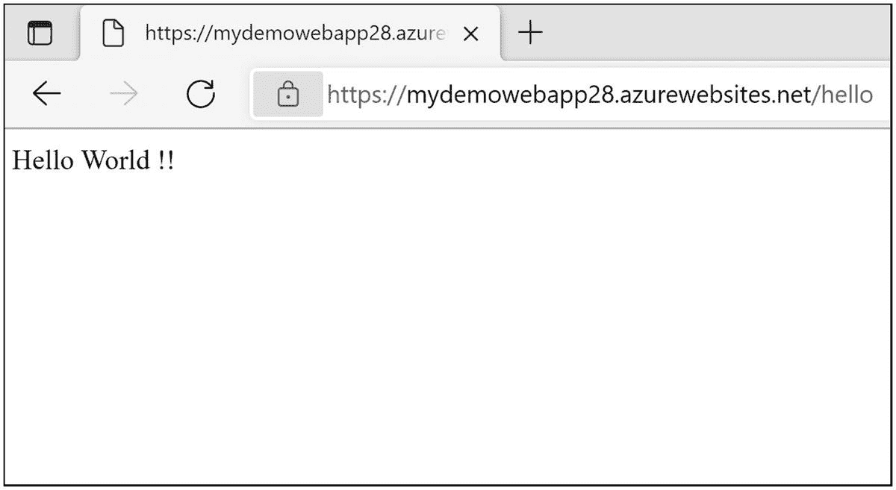

浏览器窗口的屏幕截图。顶部的栏显示：“https://my demo web app 28”。搜索窗口显示：“https://my demo web app 28.azurewebsites.net/hello”。左侧有刷新和后退按钮。主页上的文本显示：“Hello world!!”。

图 2-15

浏览器上的输出


## 在 Azure WebApp 上托管 Java 应用程序的缩放

缩放是任何应用程序的重要方面。在高峰时段，您的应用程序应能够在额外的计算资源上运行，并且一旦负载降低，它应能够释放这些额外的计算资源。对于 Azure WebApp，您可以选择垂直缩放或水平缩放。要垂直缩放 WebApp，您需要转到 Azure 门户中的 WebApp，并单击*纵向缩放（应用服务计划）*，如图 2-16 所示。您可以根据需要选择满足您需求的应用服务计划。

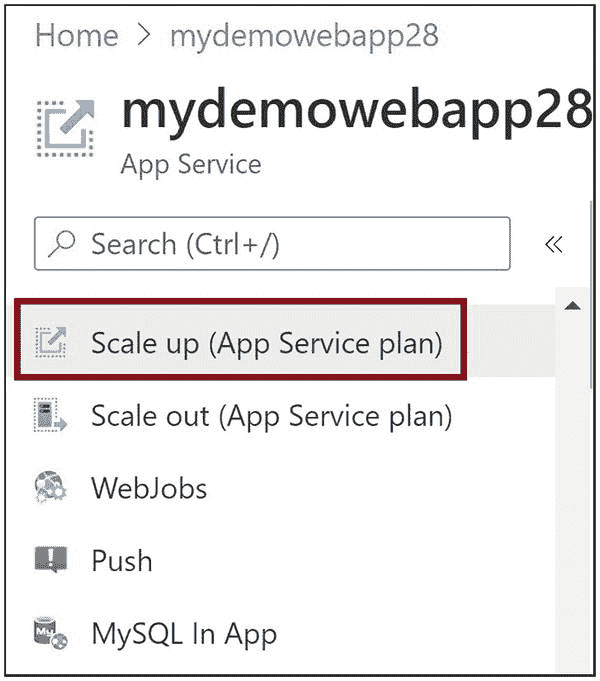

Web 应用窗口主页的屏幕截图。顶部的应用服务标题为“我的演示 Web 应用 28”。屏幕上的选项列出了“纵向缩放应用服务计划”（已高亮显示）、“横向缩放应用服务计划”、“Web 作业”、“推送”和“应用内 MySQL”。

图 2-16

纵向缩放 WebApp

然后您可以切换到另一个计划并单击*应用*，如图 2-17 所示。

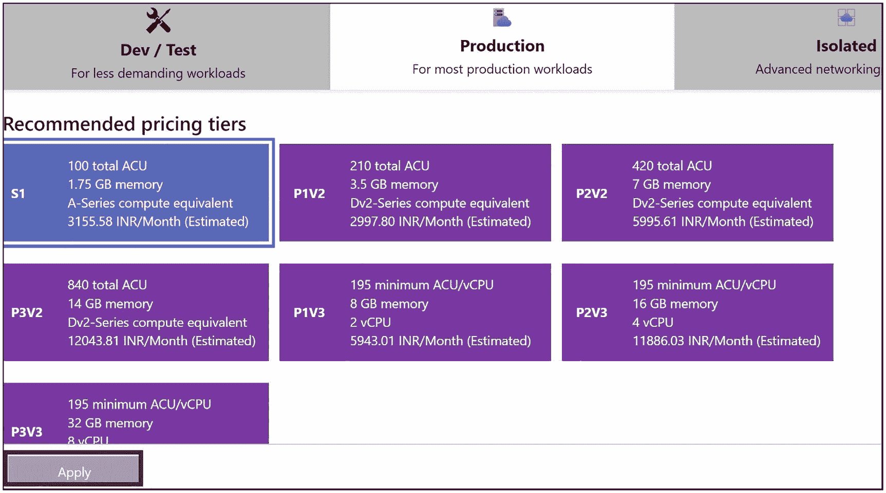

Web 应用的屏幕截图。顶部的三个选项是“开发/测试”、“生产”（已选中）和“隔离”。推荐的定价层包括 S1、P1V2、P2V2、P3V2、P1V3、P2V3 和 P3V3。“应用”按钮已高亮显示。

图 2-17

单击“应用”

您可以单击*查看其他选项*以探索更多计划，如图 2-18 所示。

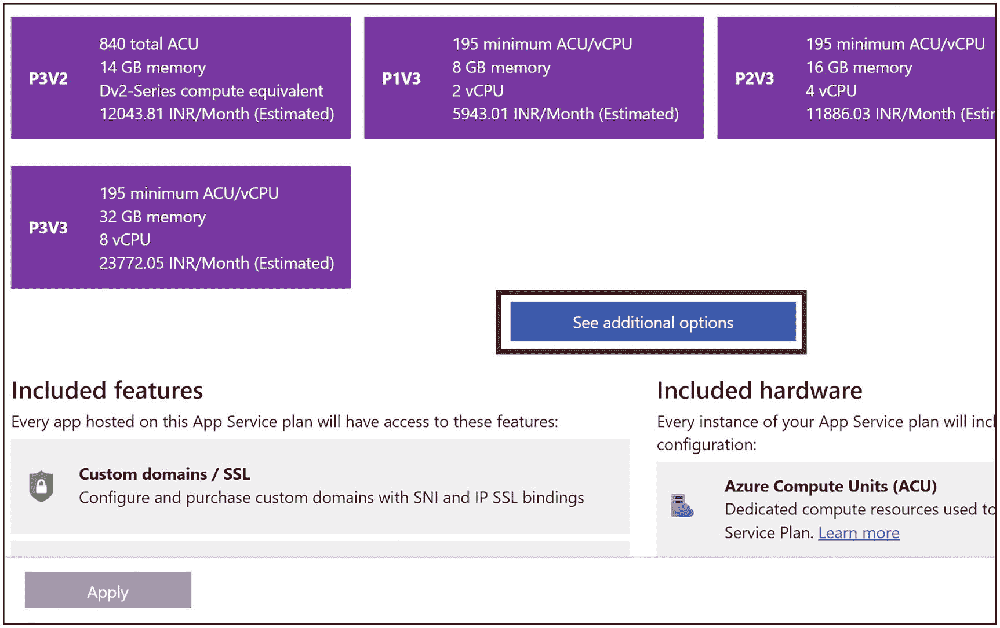

窗口的屏幕截图。推荐的定价层包括 P3V2、P1V3、P2V3 和 P3V3。标题为“查看其他选项”的按钮已选中并高亮显示。选项包括“包含的功能”和“包含的硬件”。功能包括“自定义域/SSL”，硬件包括“Azure 计算单元 (ACU)”。

图 2-18

查看其他计划

要水平缩放 WebApp，您需要转到 Azure 门户中的 WebApp，并单击*横向缩放（应用服务计划）*，如图 2-19 所示。您可以通过指定应用程序所需的实例数量来手动缩放，也可以根据自定义指标和规则（如 CPU 利用率、内存利用率和其他计算资源性能需求）自动缩放。

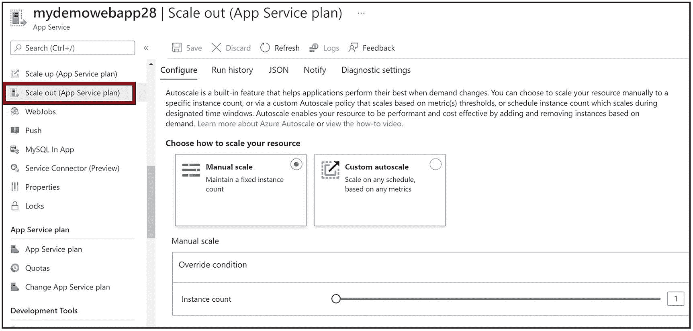

标题为“横向缩放，应用服务计划”的 Web 应用窗口屏幕截图。左侧的“横向缩放，应用服务计划”选项卡已高亮显示。应用服务计划包括“应用服务计划”、“配额”和“更改应用服务计划”。在“配置”下选择如何缩放资源，显示两个选项，包括“手动缩放”和“自定义自动缩放”。手动缩放下的实例计数滑块位于 0。

图 2-19

横向缩放 WebApp

## 总结

在本章中，我们学习了 Azure WebApp 的详细信息，然后探讨了什么是应用服务计划以及 Azure WebApp 的其他功能。我们预配了一个 Azure WebApp，然后使用 Maven 插件将 Java Spring Boot 应用程序部署到了 Azure WebApp。我们还从高层次了解了 Azure WebApp 的缩放。在下一章中，我们将学习 Azure Functions 的基础知识，然后构建一个基于 Java 的 Azure Function。

以下是本章的关键要点：

*   Azure WebApp 是 Azure 上的一种平台即服务产品。您可以构建基于 HTTP 的应用程序和服务，并将其托管在 Azure WebApp 上。

*   您无需担心创建和管理底层托管基础设施，Azure 平台会为您处理这些。

*   应用服务计划定义了 Azure WebApp 的计算资源、缩放、部署槽位、定价层和其他必要功能。

*   Azure WebApp 的应用服务计划提供以下定价层。
    *   共享计算

    *   专用计算

    *   隔离

*   您可以使用 Maven 插件将 Java Spring Boot 应用程序部署到 Azure WebApp。

# 3. 基于 Java 的 Azure Functions

Azure Functions 是 Azure 上的无服务器产品。它们最适合运行短时间执行并执行业务逻辑的代码。Azure Functions 可以用作应用程序的后台工作进程并执行后台作业。它们还可以执行从简单到高度复杂的业务逻辑，并像 API 一样被使用。Azure Functions 功能强大，可以部署基于微服务等复杂架构的现代应用程序。Azure Functions 可用于托管微服务架构中的服务。

在上一章中，我们学习了 Azure WebApp 的基础知识。然后我们开发了一个 Java Spring Boot 应用程序，并使用 Maven 插件将其部署到了 Azure WebApp。在本章中，我们将学习 Azure Functions 的详细信息，然后构建一个基于 Java 的 Azure Function。

## 结构

在本章中，我们将讨论 Java 在 Azure WebApp 中的以下方面：

*   无服务器和 Azure Functions 简介

*   Azure Functions 用例

*   托管计划

*   触发器和绑定

*   构建基于 Java 的 Azure Function

## 目标

学习完本章后，您应该能够获得以下知识：

*   理解 Azure Functions 的概念

*   构建基于 Java 的 Azure Function


## 无服务器计算与 Azure Functions 简介

如今，云上的无服务器架构正日益流行。许多现代应用（如微服务）都采用基于无服务器的云托管方式。与平台即服务和基础设施即服务托管模式相比，无服务器托管成本更低。你只需在服务执行任务时付费，如果服务处于空闲状态且未执行任何活动，则无需支付任何费用。你可以开发应用程序并将其部署到无服务器服务上，无需担心底层托管基础设施。Azure 平台将预配和管理无服务器服务运行所需的基础设施。扩展是任何应用的重要方面，无论它运行在云端还是本地。无服务器服务可以轻松自动地横向扩展，无需你进行任何配置。你无法控制无服务器服务的扩展方式。无服务器服务会感知传入的工作负载，并根据传入流量进行横向扩展。

以下是 Azure 上提供的一些流行的无服务器服务：

*   Azure Functions
*   Durable Functions
*   Azure Logic Apps
*   Azure Event Grid
*   Azure Serverless SQL
*   Azure Serverless Kubernetes Service
*   Azure Serverless Cosmos DB

Azure Functions 是 Azure 上的函数即服务产品，属于无服务器服务。你可以构建代码并将其托管在 Azure Functions 上。当 Azure Functions 执行时，你会被计费；当它们空闲时，则不会收费。Azure Function 运行的底层基础设施以及扩展方面都由底层 Azure 平台管理。Azure Functions 支持运行短时间执行的代码。但是，你可以选择合适的托管计划，让应用程序运行更长时间。表 3-1 展示了基于所选 Function 运行时的编程语言支持。在撰写本书时，目前支持四个运行时版本。

表 3-1
Azure Functions 运行时及支持的编程语言

| 编程语言 | 运行时 1.x | 运行时 2.x | 运行时 3.x | 运行时 4.x |
| --- | --- | --- | --- | --- |
| C# | .NET 4.8 | .NET Core 2.1 | .NET Core 3.1, .NET 5 | .NET 6 |
| JavaScript | Node.js 6 | Node.js 10, 8 | Node.js 14, 12, 10 | Node.js 14, 16 |
| F# | .NET 4.8 | .NET Core 2.1 | .NET Core 3.1 | .NET 6 |
| Java | 不支持 | Java 8 | Java 11, 8 | Java 11, 8 |
| PowerShell | 不支持 | PowerShell Core 6 | PowerShell 7, Core 6 | PowerShell 7 |
| Python | 不支持 | Python 3.7, 3.6 | Python 3.9, 3.8, 3.7, 3.6 | Python 3.9, 3.8 |
| Typescript | 不支持 | 支持 | 支持 | 支持 |

Azure Functions 基于 Azure WebJobs 构建。然而，Azure WebJobs 作为后台工作进程运行，并且始终与 Azure WebApp 共享应用服务计划。Azure Functions 有自己的托管计划。你也可以在同一个应用服务计划上托管多个 Azure Functions。

Azure Functions 在受到支持的触发器触发时执行。它们完成执行后进入空闲状态。Azure Functions 仅在再次被触发时才会唤醒并投入运行。

## Azure Functions 用例

以下是你可以使用 Azure Functions 的几种场景。然而，Azure Functions 可以适用于广泛的场景，帮助你构建基于云的现代无服务器应用程序。

*   你可以使用 Azure Functions 构建 n 层应用程序。你可以将业务和数据访问逻辑分解成更小的块，并将每个块托管在一个 Azure Function 中。
*   你可以在 Azure Functions 中运行后台处理作业。
*   你可以使用 Azure Functions 和 Durable Functions 构建基于工作流的应用程序，其中你可以使用 Azure Durable Functions 和 Azure Functions 来编排每个工作流步骤。
*   你可以使用 Azure Functions 构建基于微服务的应用程序。每个 Azure Function 可以托管一个业务服务。
*   你可以使用 Azure Functions 构建基于计划的应用程序，这些应用程序在特定的时间间隔、一天中的特定时间、一个月或一年中运行。
*   你可以构建通知系统，以触发 Azure Function，根据条件和事件通知最终用户或系统。
*   你可以在物联网场景中使用 Azure Functions 执行业务活动，或处理接收到的数据并将其放入存储中，或将其发送到下一组处理流程。
*   你可以在事件驱动场景中使用 Azure Functions 和 Azure Event Grid，这些函数可以被触发并执行任务。

## 托管计划

托管计划决定了 Azure Functions 运行的底层基础设施。它们决定了 Azure Functions 的扩展需求、执行间隔、虚拟网络集成以及许多其他重要方面。你可以根据计算需求（如内存使用、CPU 使用等）为 Azure Function 选择托管计划。此外，在决定所需的托管计划时，你还需要将扩展需求、执行超时和虚拟网络集成作为其他重要因素加以考虑。以下是 Azure Functions 支持的托管计划。

### 消费计划

消费计划是一个纯粹的无服务器计划。你无法控制托管和扩展基础设施。根据传入流量，它会在运行时添加额外的实例，当负载减少时，它会关闭多余的实例。此计划具有成本效益，因为你仅在 Function 执行时付费，当 Function 空闲且未执行任何任务时，你不会产生任何费用。Function 默认可以执行五分钟，你可以将其设置为最长执行十分钟。

当 Function 不执行时，它会进入睡眠或空闲状态。每当它再次被触发时，它就会投入运行并开始执行。但是，Function 在被触发后不会立即开始执行。由于 Function 需要从空闲状态唤醒并准备好服务请求，因此会存在延迟。这种延迟被称为冷启动现象，我们在使用此计划时会遇到。

### 高级计划

高级计划确保 Azure Function 的实例始终保持预热状态并准备好服务请求。这将避免冷启动现象。与消费计划一样，你无法控制 Function 的扩展方式。但是，你对 Azure Function 运行的底层基础设施拥有更大的控制权。你可以为计划选择 SKU，例如 EP1、EP2 或 EP3，并为 Function 选择计算需求。你可以配置 Azure Function 在虚拟网络中运行。使用高级计划，Azure Functions 默认可以执行 30 分钟，你可以将其配置为永不超时。

### 专用计划

专用计划与 WebApp 应用服务计划相同。使用此计划时，Azure Functions 可以持续运行，永远不会进入空闲状态。此计划将使你的 Function 像 WebApp 一样运行，并且不是无服务器计划。你可以根据 CPU 使用率、内存和其他计算需求选择应用服务计划 SKU，并且可以配置自动扩展或手动扩展，从而完全控制 Function 的扩展方式。

### 应用服务环境计划

此计划提供专用计划的所有功能。它还有助于在虚拟网络内的隔离环境中运行你的 Azure Function。你可以获得安全的网络、高扩展性和计算能力。

### Kubernetes 计划

此计划在 Azure Kubernetes 服务内部运行 Azure Functions，并帮助在 Kubernetes 集群内持续运行 Azure Functions。


## 触发器与绑定

触发器可将 Azure Functions 从空闲状态唤醒并触发其执行。Azure Functions 可由多种服务触发，这些服务触发 Azure Functions 并将待处理的数据作为有效负载触发器输入进行传递。每个 Azure Functions 只能有一个触发器。在某些场景下，你的 Azure Function 可能需要与外部服务交互。例如，它可能需要从 Azure Blob 获取数据，进行处理，然后将其放回 Azure 存储队列。当你的 Function 需要与其他 Azure 或非 Azure 服务交换数据时，绑定可以帮助你。

你无需编写大量代码即可实现触发器和绑定。你可以为 Azure Function 以声明方式创建触发器和绑定。这种声明式方法使你无需编写与 Function 代码中的其他服务交互所需的复杂代码和逻辑。触发器始终是单向的，并且是 Azure Function 的输入。绑定是双向的，可以是 Azure Function 的输入或输出。

图 3-1 演示了 Azure Function 如何使用触发器和绑定。当项目添加到 Azure Cosmos DB 时，它会触发 Azure Function。Azure Function 使用绑定与 Blob 存储交互，获取 blob 数据进行处理。它处理 blob 数据，并使用输出绑定将其发送到事件中心。

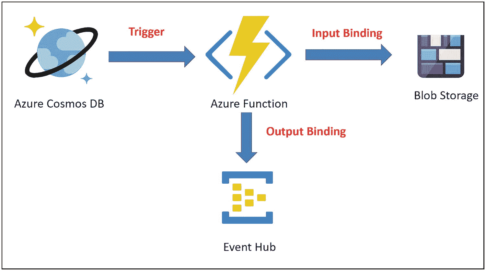

Azure Functions 中触发器和绑定的表示。

图 3-1

Azure Functions 中的触发器和绑定 以下是 Azure Functions Runtime 1.x 支持的触发器：

*   Blob 存储

*   Azure Cosmos DB

*   Event Grid

*   Event Hubs

*   HTTP 和 webhooks

*   IoT Hub

*   队列存储

*   Service Bus

*   计时器

以下是 Azure Functions Runtime 2.x 及更高版本支持的触发器：

*   Blob 存储

*   Azure Cosmos DB

*   Dapr

*   Event Grid

*   Event Hubs

*   HTTP 和 webhooks

*   IoT Hub

*   Kafka

*   队列存储

*   RabbitMQ

*   Service Bus

*   计时器

以下是 Azure Functions Runtime 1.x 支持的绑定及其支持的输入和输出方向：

*   Blob 存储（输入、输出）

*   Azure Cosmos DB（输入、输出）

*   Event Grid（输出）

*   Event Hubs（输出）

*   HTTP 和 webhooks（输出）

*   IoT Hub（输出）

*   移动应用（输入、输出）

*   通知中心（输出）

*   队列存储（输出）

*   SendGrid（输出）

*   Service Bus（输出）

*   表存储（输入、输出）

*   Twilio（输出）

以下是 Azure Functions Runtime 2.x 及更高版本支持的绑定及其支持的输入和输出方向：

*   Blob 存储（输入、输出）

*   Azure Cosmos DB（输入、输出）

*   Event Grid（输出）

*   Event Hubs（输出）

*   HTTP 和 webhooks（输出）

*   IoT Hub（输出）

*   队列存储（输出）

*   SendGrid（输出）

*   Service Bus（输出）

*   表存储（输入、输出）

*   Twilio（输出）

*   Dapr（输入、输出）

*   Kafka（输出）

*   RabbitMQ（输出）

*   SignalR（输入、输出）

你不能使用消耗计划创建 Kafka 和 RabbitMQ 触发器。Dapr 触发器适用于 Azure Kubernetes 服务。

## 构建基于 Java 的 Azure Function

让我们创建一个由 HTTP 触发器调用的 Azure Function。HTTP 触发器将帮助你通过浏览器访问 Function。我们将传递一个人的姓名作为查询字符串，然后该人的姓名将通过输出绑定保存到存储队列。

让我们创建一个存储帐户，Azure Function 将在其中创建一个队列并将该人的姓名作为消息放入其中。转到 Azure 门户，单击*创建资源*，如图 3-2 所示。


Microsoft Azure 网站的窗口。

图 3-2

创建资源

在市场（Marketplace）中搜索*存储帐户*，如图 3-3 所示。你也可以在市场中的热门服务列表中找到存储帐户。

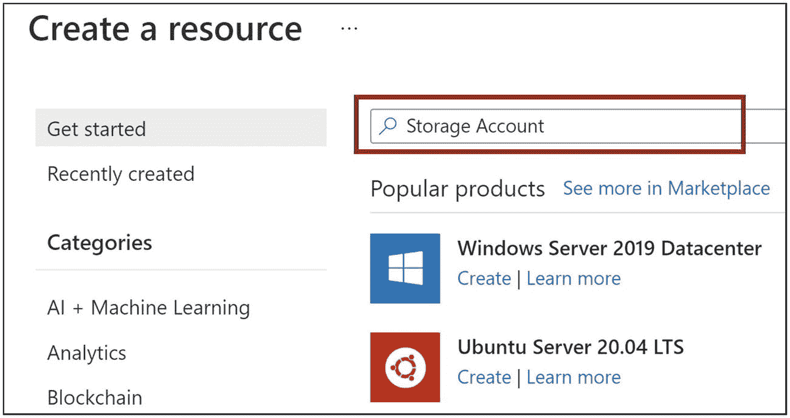

搜索存储帐户的网页截图。

图 3-3

搜索存储帐户

单击*创建*，如图 3-4 所示，开始创建存储帐户。

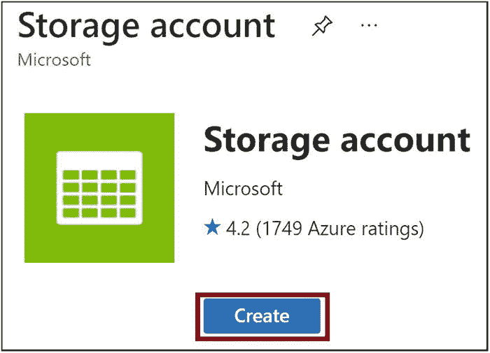

用于创建存储帐户的 Microsoft 网页截图。

图 3-4

单击创建

提供订阅详细信息、资源组详细信息、存储帐户名称和位置。单击*查看 + 创建*，如图 3-5 所示。

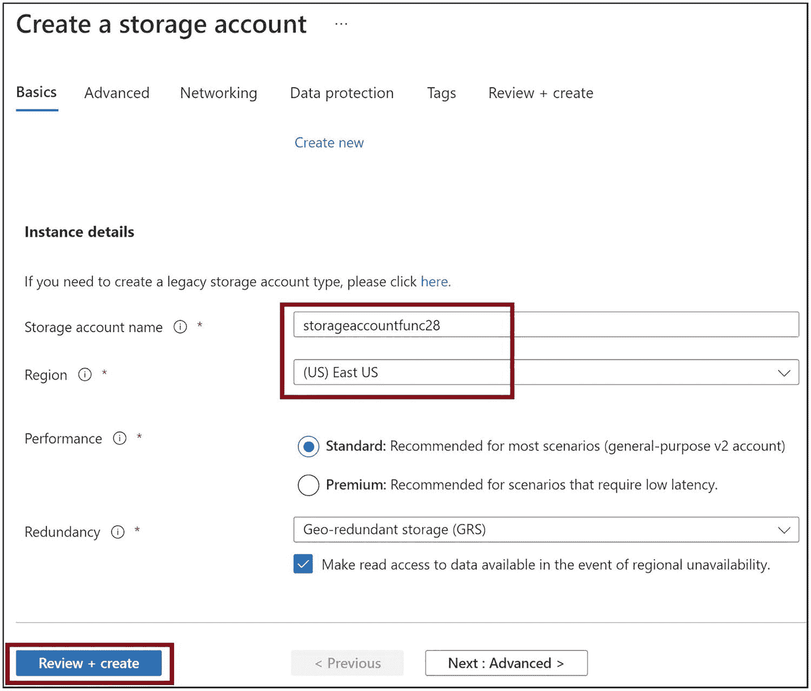

标题为“创建存储帐户”并包含实例详细信息的网页截图。

图 3-5

提供存储帐户的基本详细信息

单击*创建*，如图 3-6 所示。这将为你预配一个存储帐户。

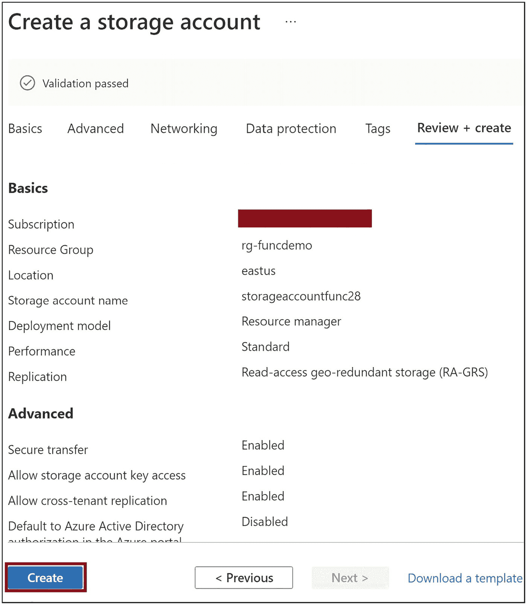

标题为“创建存储帐户”的网页截图，其中包含“基本”和“高级”标题以及一些参数。

图 3-6

单击创建

创建存储帐户后，导航到该存储帐户，转到*访问密钥*部分，如图 3-7 所示，并复制连接字符串。稍后，我们将使用此连接字符串从 Azure Function 连接到存储帐户。

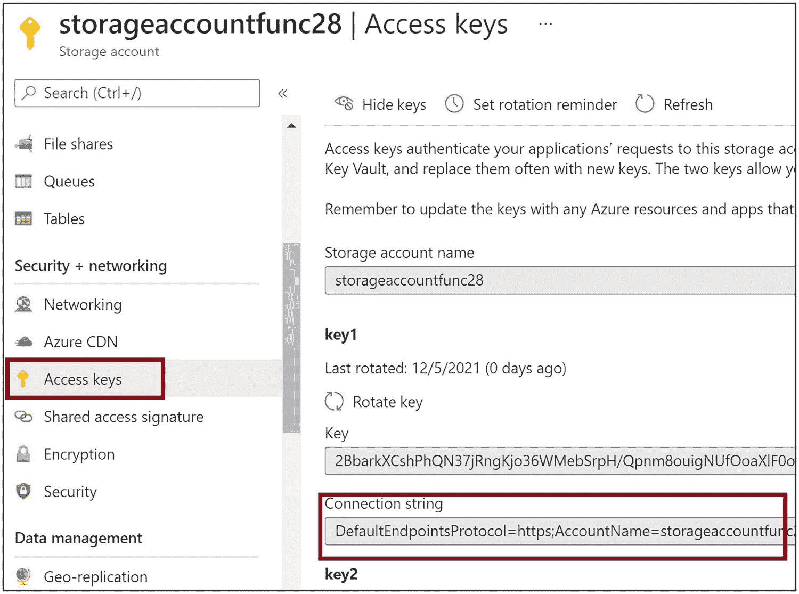

访问密钥网页的截图。

图 3-7

获取存储帐户的连接字符串

现在让我们开始使用 Maven 插件创建 Azure Function。作为先决条件，你应该已经安装了以下实用程序：

*   Azure Functions Core Tools（最新版本）

*   Java 11

*   Azure CLI

*   Visual Studio Code

*   Maven（任何与 Java 11 兼容的版本）

启动 Visual Studio Code，打开你计划工作的文件夹，并基于终端打开一个新的命令提示符。在终端中执行清单 3-1 中的以下命令。这将在本地为你创建一个 Azure Function 代码。我们将进一步修改代码。

```
mvn archetype:generate "-DarchetypeGroupId=com.microsoft.azure" "-DarchetypeArtifactId=azure-functions-archetype" "-DjavaVersion=11"
清单 3-1
生成 Azure Function 代码
```

当提示时，为你的 Java 函数提供组 ID、工件 ID、包名称和版本，最后通过按 *Y* 确认你的选择，如图 3-8 所示。

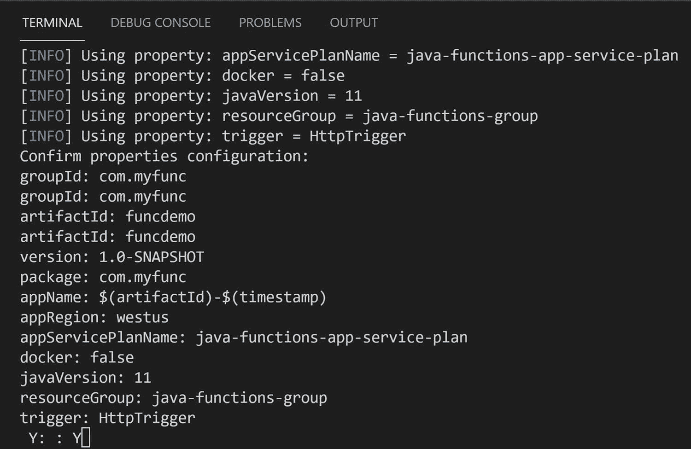

终端选项卡下用于 Maven 执行的一系列代码。

图 3-8

Maven 执行

该函数创建时带有 HTTP 触发器绑定，该绑定将从浏览器调用函数代码。让我们向存储队列添加一个输出绑定。打开 Function.java 文件，如图 3-9 所示。

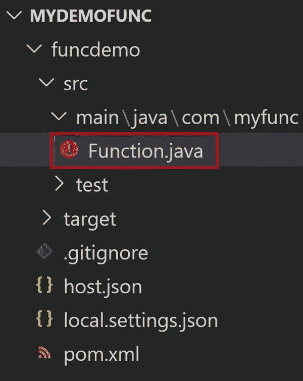

表示 Function.java 文件位置的截图。

图 3-9

Function.java 文件位置


将现有代码替换为清单 3-2 中的代码。我们添加了一个队列输出绑定，该绑定与连接字符串名称为 *AzureWebJobsStorage* 的存储帐户集成。稍后，我们将在 Azure 函数应用 *Configuration* 中设置 *AzureWebJobsStorage* 的值。可以看到，我们使用属性 *QueueOutput* 进行声明式配置来连接到存储队列，无需编写大量代码。*queuename* 参数值指定了存储帐户中的队列名称。代码行 `msg.setValue("Name received : "+name);` 将消息添加到队列中。

```
package com.myfunc;
import com.microsoft.azure.functions.ExecutionContext;
import com.microsoft.azure.functions.HttpMethod;
import com.microsoft.azure.functions.HttpRequestMessage;
import com.microsoft.azure.functions.HttpResponseMessage;
import com.microsoft.azure.functions.HttpStatus;
import com.microsoft.azure.functions.OutputBinding;
import com.microsoft.azure.functions.annotation.AuthorizationLevel;
import com.microsoft.azure.functions.annotation.FunctionName;
import com.microsoft.azure.functions.annotation.HttpTrigger;
import com.microsoft.azure.functions.annotation.QueueOutput;
import java.util.Optional;
/**
* Azure Functions with HTTP Trigger.
*/
public class Function {
/**
* This function listens at endpoint "/api/HttpExample". Two ways to invoke it using "curl" command in bash:
* 1\. curl -d "HTTP Body" {your host}/api/HttpExample
* 2\. curl "{your host}/api/HttpExample?name=HTTP%20Query"
*/
@FunctionName("HttpExample")
public HttpResponseMessage run(
@HttpTrigger(
name = "req",
methods = {HttpMethod.GET, HttpMethod.POST},
authLevel = AuthorizationLevel.ANONYMOUS)
HttpRequestMessage> request,
@QueueOutput(
name = "msg",
queueName = "outqueue",
connection = "AzureWebJobsStorage")
OutputBinding msg,
final ExecutionContext context) {
context.getLogger().info("Java HTTP trigger processed a request.");
// Parse query parameter
final String query = request.getQueryParameters().get("name");
final String name = request.getBody().orElse(query);
//Set value to the Queue.
msg.setValue("Name received : "+name);
if (name == null) {
return request.createResponseBuilder(HttpStatus.BAD_REQUEST).body("Please pass a name on the query string or in the request body").build();
} else {
return request.createResponseBuilder(HttpStatus.OK).body("Hello, " + name).build();
}
}
}
清单 3-2
Function.java
```

我们已为函数添加了一个 QueueOutput 绑定。还需要编辑测试类。打开 *FunctionTest.java* 类，并将代码替换为清单 3-3 中的代码。我们正在替换 *Function().run* 方法调用，以包含我们在参数中创建的输出绑定。

```
package com.myfunc;
import com.microsoft.azure.functions.*;
import org.mockito.invocation.InvocationOnMock;
import org.mockito.stubbing.Answer;
import java.util.*;
import java.util.logging.Logger;
import org.junit.jupiter.api.Test;
import static org.junit.jupiter.api.Assertions.*;
import static org.mockito.ArgumentMatchers.*;
import static org.mockito.Mockito.*;
/**
* Unit test for Function class.
*/
public class FunctionTest {
/**
* Unit test for HttpTriggerJava method.
*/
@Test
public void testHttpTriggerJava() throws Exception {
// Setup
@SuppressWarnings("unchecked")
final HttpRequestMessage> req = mock(HttpRequestMessage.class);
final Map queryParams = new HashMap();
queryParams.put("name", "Azure");
doReturn(queryParams).when(req).getQueryParameters();
final Optional queryBody = Optional.empty();
doReturn(queryBody).when(req).getBody();
doAnswer(new Answer() {
@Override
public HttpResponseMessage.Builder answer(InvocationOnMock invocation) {
HttpStatus status = (HttpStatus) invocation.getArguments()[0];
return new HttpResponseMessageMock.HttpResponseMessageBuilderMock().status(status);
}
}).when(req).createResponseBuilder(any(HttpStatus.class));
final ExecutionContext context = mock(ExecutionContext.class);
doReturn(Logger.getGlobal()).when(context).getLogger();
// Invoke
final OutputBinding msg = (OutputBinding)mock(OutputBinding.class);
final HttpResponseMessage ret = new Function().run(req, msg, context);
// Verify
assertEquals(ret.getStatus(), HttpStatus.OK);
}
}
清单 3-3
FunctionTest.java
```

现在让我们修改 *pom.xml* 文件。您可以选择将资源组名称、函数应用名称和函数位置替换为您选择的值，如清单 3-4 所示。我们需要确保函数应用名称是唯一的，并且没有其他 Azure 函数使用此名称。例如，您可以使用 *myfunc-demo-28*。如果 Azure 基础设施中没有人占用此名称，则不会出现任何错误，您可以使用它。

```

4.0.0
com.myfunc
funcdemo
1.0-SNAPSHOT
jar
Azure Java Functions

UTF-8

1.14.1
1.4.2
myfunc-demo-28

com.microsoft.azure.functions
azure-functions-java-library
${azure.functions.java.library.version}

org.junit.jupiter
junit-jupiter
5.4.2
test

org.mockito
mockito-core
2.23.4
test

org.apache.maven.plugins
maven-compiler-plugin
3.8.1

${java.version}
${java.version}
${project.build.sourceEncoding}

com.microsoft.azure
azure-functions-maven-plugin
${azure.functions.maven.plugin.version}

${functionAppName}

rg-myjavafunc-demo

java-functions-app-service-plan

westus

-->

-->

windows

FUNCTIONS_EXTENSION_VERSION
~3

package-functions

package

maven-clean-plugin
3.1.0

obj

清单 3-4
pom.xml
```

让我们使用以下 Maven 命令构建并打包 Azure 函数代码，如清单 3-5 所示。

```
mvn clean package
清单 3-5
构建并打包函数应用
```

使用以下 Azure CLI 命令登录到 Azure，如清单 3-6 所示。

```
az login
清单 3-6
登录到 Azure
```

选择您的订阅，如清单 3-7 所示。

```
az account set -s "Your Subscription"
清单 3-7
选择订阅
```

执行以下命令，如清单 3-8 所示。

```
mvn azure-functions:deploy
清单 3-8
将函数部署到 Azure
```

注意

在 WSL 中，Azure 登录的默认身份验证类型是 DEVICE_CODE。我们需要打开浏览器，输入设备代码，然后登录。CMD 的默认身份验证类型是 Azure CLI。如果您已登录，则无需额外登录。

如果遇到名称冲突错误，则必须将 *pom.xml* 中的 *functionAppName* 更改为唯一名称，然后再次运行 `mvn clean package` 和 `mvn azure-functions:deploy`。

构建完成后，复制函数 URL，如图 3-10 所示。稍后我们将使用此 URL 从浏览器调用 Azure 函数。


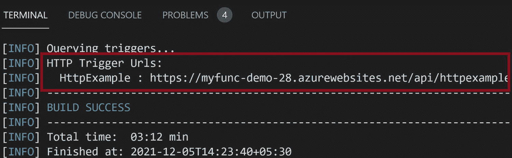

表示功能 URL 的截图。

图 3-10

功能 URL

导航到我们创建的 Azure Function。你可以在 POM 文件中提供的资源组内找到它。进入 *Configuration* 部分。你会找到 *Edit* 按钮。将该值替换为我们之前创建的存储帐户连接字符串。点击 *OK* 按钮保存该值。然后点击如图 3-11 所示的 *Save* 按钮，保存应用程序设置。

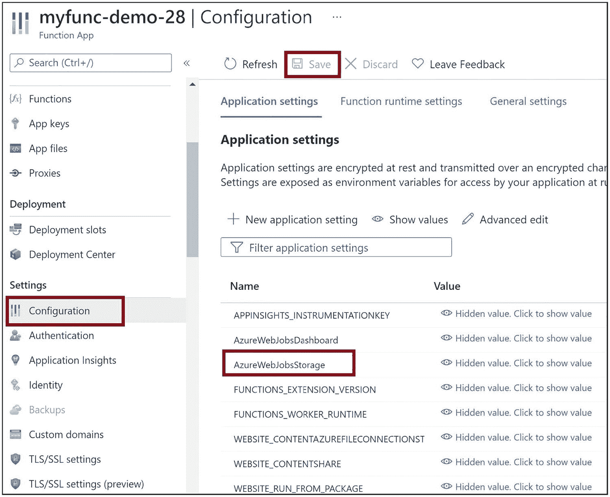

表示提供存储帐户连接字符串的截图。

图 3-11

提供存储帐户连接字符串

现在，在浏览器中使用查询字符串参数 name 调用功能 URL，如清单 3-9 所示。

```
https://myfunc-demo-28.azurewebsites.net/api/httpexample?name=Abhishek
清单 3-9
浏览功能 URL
```

转到存储帐户，查看已添加的队列项，如图 3-12 所示。

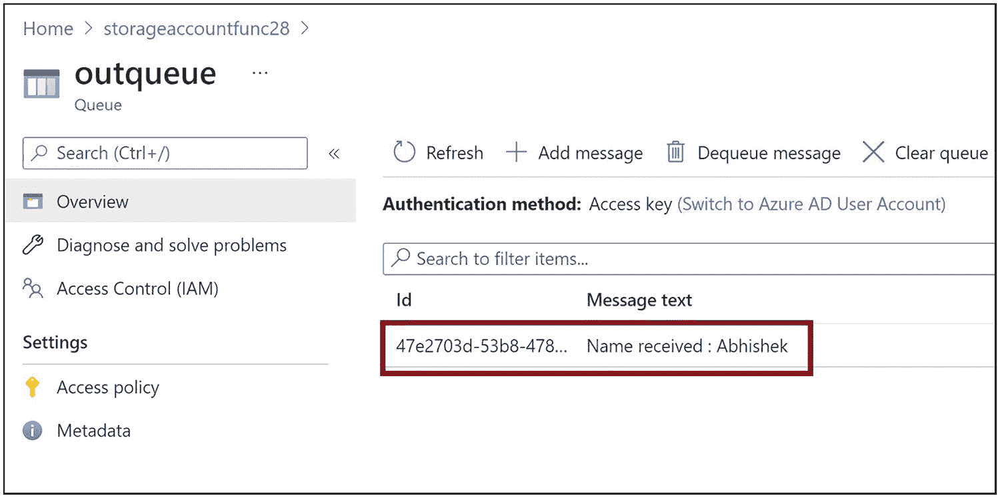

标题为“提供存储帐户连接字符串”的网页截图。

图 3-12

存储帐户队列输出

## 总结

在本章中，我们学习了 Azure Functions 的详细信息，探讨了 Azure Functions 可用的托管计划，然后学习了触发器和绑定的概念。接着，我们开发了一个 Azure Function，它通过 HTTP 触发器触发，并使用输出队列绑定将消息放入存储队列。然后，我们使用 Maven 插件将该函数部署到 Azure。在下一章中，我们将学习如何将 Java 应用程序容器化，并在 Azure Kubernetes 服务上运行它。

以下是本章的关键要点：

*   你可以在无服务器服务上构建和托管应用程序，而无需创建和管理托管基础设施。这些服务会自动扩展，无需进行任何扩展配置，并且仅在服务执行时收费。

*   Azure Functions 是 Azure 上的函数即服务 (FaaS) 产品，属于无服务器服务。

*   托管计划决定了 Azure Functions 运行的底层基础设施。它们决定了 Azure Functions 的扩展需求、执行间隔、虚拟网络集成以及许多其他重要方面。可用的托管计划包括消耗计划、高级计划、专用计划、应用服务环境计划和 Kubernetes 计划。

*   触发器将 Azure Functions 从空闲状态唤醒并开始执行。绑定帮助 Azure Function 与其他 Azure 或非 Azure 服务交换数据。你可以声明式地创建触发器和绑定，而无需编写大量代码。

# 4. 使用 Azure Kubernetes 服务将 Java 应用程序容器化

容器是当今现代化的应用程序托管选项。你可以构建应用程序，将应用程序与托管环境和应用程序依赖项一起容器化，然后将容器化镜像保存在集中式注册表中。你可以在目标环境中拉取容器化镜像，并轻松地将其作为容器运行。你可以构建一次镜像，然后在多个环境中运行，而无需设置任何托管或应用程序依赖项。一个应用程序可能由多个容器组成。例如，你可以有一个用于用户界面的容器、一个用于业务层的容器，以及另一个用于数据访问的容器。应用程序中的所有这些容器需要安全地相互通信。这些容器应始终保持运行状态以服务客户端请求。你应该轻松管理所有这些容器，并解决可用性、可靠性、可扩展性等架构问题。Kubernetes 是一个容器编排平台，可以帮助你编排和管理这些容器。它将解决我们讨论的所有横切关注点。

在上一章中，我们学习了 Azure Functions 的基础知识。然后，我们创建了一个基于 Java 的 Azure Function 并将其部署到 Azure。在本章中，我们将学习 Azure Kubernetes 服务的详细信息，然后将 Java 应用程序容器化，并在 Azure Kubernetes 服务上运行它。

## 结构

在本章中，我们将讨论使用 Azure Kubernetes 服务将 Java 应用程序容器化的以下方面：

*   容器简介

*   了解 Azure Kubernetes 服务

*   将 Java 应用程序容器化并在 Azure Kubernetes 服务上运行

## 目标

学习本章后，你应该能够获得以下知识：

*   理解 Azure Kubernetes 服务的概念

*   在 Azure Kubernetes 服务上构建并运行 Java 应用程序


## 容器简介

我们构建一个应用程序并使其可用于生产环境。为了托管该应用程序，我们购买一台托管服务器和一个操作系统，并安装托管软件以及所有必要的依赖项来运行它。一旦托管环境准备就绪，连同应用程序的依赖项一起，我们将应用程序托管在服务器上。我们最终花费了大量时间和精力来采购托管服务器并使其准备好运行应用程序。有时我们还会陷入配置托管环境和依赖项的复杂性中，这进一步导致了延迟。假设您的企业中有多个环境。在这种情况下，您将需要花费同样的精力来让应用程序在测试、验收或生产等多个环境中启动并运行。

您可以选择将应用程序托管在虚拟机上。您可以购买一台性能强大的服务器，并在该服务器上运行多个虚拟机。对于虚拟机，您需要购买一台服务器，在服务器上安装一个操作系统（称为主机操作系统），然后安装像 Hyper-V 这样的虚拟化软件。虚拟化软件将底层服务器硬件（如 CPU、RAM、磁盘和其他基础设施）虚拟化，并在服务器上运行多个虚拟机。这些虚拟机隔离运行，并拥有各自份额的虚拟化硬件基础设施。每个虚拟机都有一个操作系统，称为客户操作系统。您需要在这些虚拟机上安装像 Tomcat、IIS 或 node.js 这样的托管软件以及应用程序依赖项，然后将应用程序托管在这些虚拟机上。在这里，对于虚拟机，您需要花费精力来准备托管环境并使虚拟机准备好托管应用程序。这种应用程序托管方式与将应用程序托管在物理服务器上几乎相同。然而，您在这里获得的好处是，您可以共享底层硬件基础设施，并在虚拟机中隔离运行多个应用程序。这种方法可以为您节省成本。

容器是一种更智能的应用程序托管方式。您可以构建应用程序，将其容器化，并将其与所有必要的应用程序依赖项一起保存在容器注册表中。容器注册表存储容器镜像。Azure 容器注册表和 Docker Hub 就是容器注册表的例子。您可以选择允许所有人使用您的镜像而无需任何身份验证。对于此类场景，您需要将容器镜像存储在像 Docker Hub 这样的公共容器注册表中。您也可以使用像 Azure 容器注册表这样的私有容器注册表，并向有权访问该容器注册表的经过身份验证的用户提供您的容器镜像。

一旦您在容器注册表中有了容器镜像，您就可以获得一台带有操作系统的服务器，并安装像 containerd 或 Docker 这样的容器运行时软件。然后拉取容器镜像并在服务器上运行它。您无需配置托管环境或应用程序依赖项。容器镜像包含了应用程序依赖项、托管软件以及应用程序本身。一旦您拉取容器镜像并将其作为容器运行，您的应用程序就启动并运行了。容器运行时虚拟化底层操作系统，并将容器作为操作系统线程运行。图 4-1 展示了虚拟机与容器之间的区别。

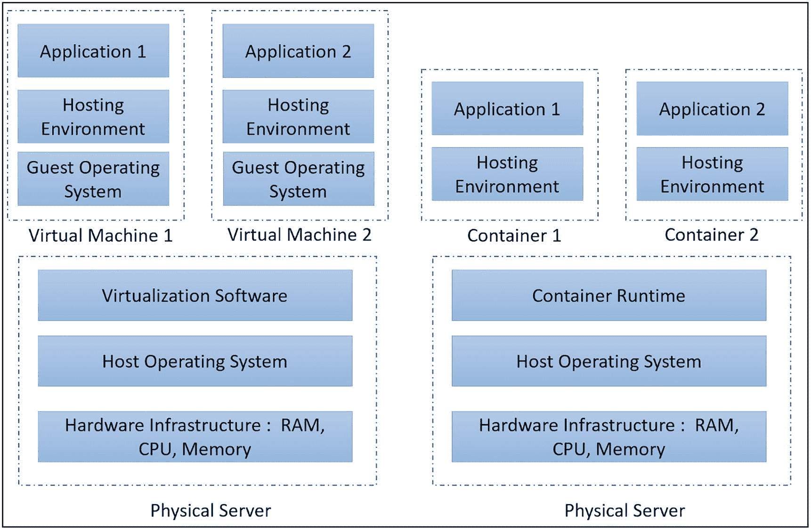

一张图展示了虚拟机和容器。

图 4-1

虚拟机和容器

注意

与虚拟机相比，容器更轻量级。对于虚拟机，您虚拟化的是底层硬件基础设施，并且虚拟机内部有一个操作系统。而对于容器，服务器操作系统被虚拟化，容器作为操作系统线程运行，无需自身拥有操作系统。

## 了解 Azure Kubernetes 服务

应用程序可能需要多个容器来托管其每个模块。让我们以一个三层松耦合应用程序为例，它有一个用户界面层、一个业务逻辑层和一个数据访问层。我们需要为用户界面层创建一个容器镜像，为业务逻辑层创建一个容器镜像，为数据访问层创建一个容器镜像。然后，我们可以将这些镜像中的每一个作为容器在生产环境中运行。设想一个场景：数据访问容器宕机了。在这种情况下，整个应用程序将宕机，因为业务层容器在没有数据访问层的情况下无法连接数据库。此外，如果应用程序的传入请求突然激增，会发生什么？我们可能需要添加更多容器来动态处理传入请求。这些容器应该能够安全地通信。应监控容器和应用程序的健康状况，以发现性能下降和故障。您必须处理所有这些关注点。

一个应用程序中可能有成千上万个容器需要管理。为了让您的工作更轻松，我们有像 Kubernetes、Docker Swarm 等容器编排器。这些编排器管理这些容器，并确保容器具有高可用性、可靠性、可扩展性、容错性和安全性。它们解决了我们讨论过的应用程序中容器的所有问题。例如，如果一个容器宕机了，编排器会立即启动另一个容器来替换宕机的容器。

Kubernetes 是谷歌提供的一个开源容器编排器。它由一个主节点（或控制平面）和多个工作节点组成。您的容器在工作节点的 Pod 内运行。在大多数情况下，虚拟机就是工作节点。如果您计划进行非常高速的扩展，那么您可以使用无服务器节点，即 Azure 容器实例。无服务器节点可以根据传入流量自动扩展，并且比虚拟机启动速度快得多。控制平面控制和管理工作节点。它决定哪个工作节点来运行 Pod，并密切监控 Pod 和工作节点。您可以将相同的容器（称为副本）作为副本集运行。例如，您可以在一个副本集中为数据访问层设置多个 Pod。如果副本集中的一个副本宕机了，其他副本仍然可以提供服务请求，直到另一个副本启动。您可以配置 Kubernetes 集群，使其在传入负载增加时自动扩展 Pod 或工作节点。

设置 Kubernetes 集群很繁琐。您可能需要花费大量精力和时间才能让 Kubernetes 集群启动并运行。控制平面是 Kubernetes 集群中最复杂的部分。像亚马逊、微软和谷歌这样的云提供商可以帮助您在几分钟内启动 Kubernetes 集群。它们在其云上提供 Kubernetes 即服务，并在启动 Kubernetes 集群和为您管理控制平面时抽象出所有必要的复杂性。您对控制平面没有控制权。底层云平台为您管理控制平面，而您可以管理工作节点和应用程序容器的部署。云上的这种 Kubernetes 服务称为托管 Kubernetes 服务。Azure Kubernetes 服务就是 Azure 上托管 Kubernetes 服务的一个例子。

注意

负载均衡器服务通过 HTTP 端口暴露您的应用程序，而节点端口则通过 30000 到 32767 之间的非标准端口暴露您的应用程序。


运行在 Pod 内的应用程序容器需要暴露给最终用户，以便他们访问应用。甚至在某些场景下，你可能希望某个 Pod 仅在集群内部暴露，供另一个 Pod 使用。这类场景可以通过在集群内运行的 Kubernetes 服务来处理。集群 IP 服务允许 Pod 进行内部通信，而负载均衡器服务和节点端口服务则允许将 Pod 暴露给最终用户。让我们回到之前讨论的三层应用示例。我们需要将用户界面层暴露给最终用户。用户界面层需要与业务逻辑层通信，而业务逻辑层则需要与数据访问层通信。业务逻辑层和数据访问层不应暴露给外部用户，其访问权限应限制在集群内部。为了解决这个场景，我们可以在用户界面层前面部署一个负载均衡器服务，从而将用户界面层暴露给最终用户。同时，可以在业务逻辑层和数据访问层前面部署集群 IP 服务，以将其通信限制在集群内部。

作为开发者，你需要将应用程序容器化并推送到容器注册表。然后，启动 Kubernetes 集群，并为该集群构建一个部署 YAML 文件。这个部署 YAML 文件将包含所有必要的详细信息，例如副本数量、服务、要在集群上运行的容器，以及应用程序容器在 Kubernetes 工作节点上运行所需的其他众多细节。接着，你将此部署文件传递给控制平面。控制平面会根据你在 YAML 文件中提供的信息，将 Pod 调度到工作节点上。这些 Pod 会从部署文件中指定的容器注册表拉取容器镜像，然后将其作为容器启动。

## 将 Java 应用程序容器化并在 Azure Kubernetes 服务上运行

让我们构建一个 Java Spring Boot 应用程序，将其容器化，推送到 Azure 容器注册表，并在 Azure Kubernetes 服务集群中运行它。我们将使用 Spring Initializr 生成 Spring Boot 应用程序，并手动创建一个 Docker 文件。

前提条件是，你需要在本地系统上安装 Docker Desktop，以便将应用程序容器化。Docker 提供了 Docker Desktop 的社区版，供你体验 Docker 产品并尝试使用 Docker 容器。你可以使用 Docker Desktop 社区版。

我们将首先创建 Azure Kubernetes 服务和 Azure 容器注册表。然后，构建应用程序，将其容器化，推送到 Azure 容器注册表，最后在 Azure Kubernetes 服务上运行应用程序容器。

### 创建 Azure 容器注册表

Azure 容器注册表是一个私有的 Docker 注册表，可以在 Azure 平台上存储容器镜像。只有拥有注册表访问权限的用户才能访问存储的镜像。它还可以存储 Helm Chart 等工件，以及其他与开放容器倡议（OCI）规范相关的工件。让我们创建一个 Azure 容器注册表。转到 Azure 门户，点击 *创建资源*，如图 4-2 所示。

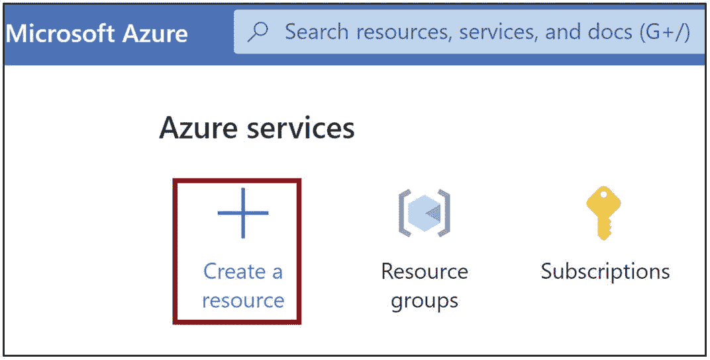

一个用于创建资源的 Microsoft Azure 窗口截图。

图 4-2

创建资源

点击 *容器* 选项卡。你将在此处看到所有与容器相关的产品，如图 4-3 所示。点击 *容器注册表*。

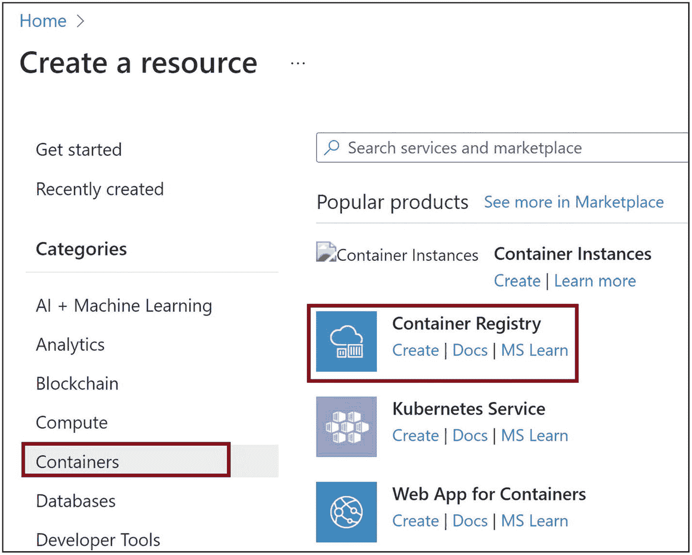

一个转到容器选项卡的窗口截图。

图 4-3

转到容器选项卡

为容器注册表提供订阅、资源组、名称、SKU 和位置。点击 *查看 + 创建*，如图 4-4 所示。

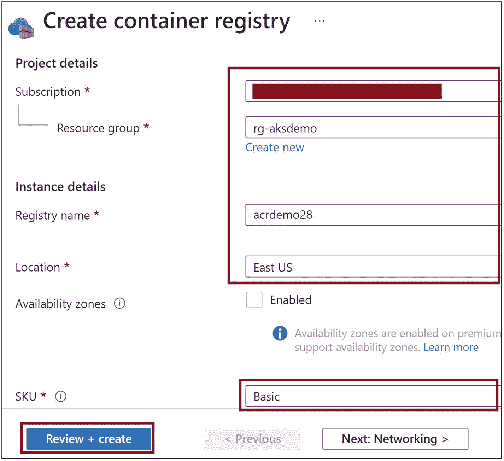

一个创建容器注册表窗口的截图。其中包含需要填写的项目详细信息，如订阅和资源组。需要填写的实例详细信息包括注册表名称、位置和 SKU。还有一个可用性区域选项卡，非必填。底部的“查看 + 创建”选项卡被高亮显示。

图 4-4

提供基本信息

点击 *创建*，如图 4-5 所示。这将为你启动一个 Azure 容器注册表。

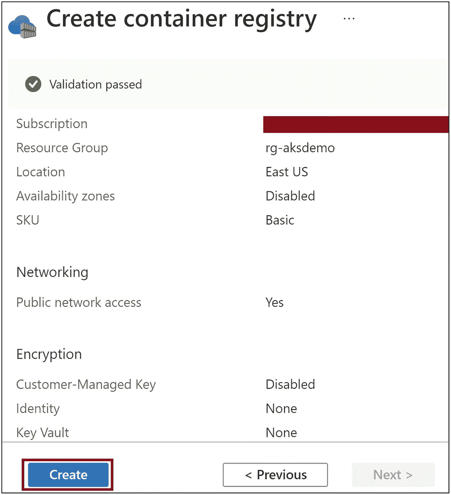

一个创建容器注册表窗口的截图，显示文本“验证已通过”。已提供订阅、资源组、位置、可用性区域、SKU 以及网络和加密详细信息。公共网络访问已启用。底部有两个选项：“创建”和“上一步”。“创建”选项卡被高亮显示。

图 4-5

点击创建

容器注册表创建完成后，转到 Azure 门户并导航到该容器注册表。点击 *访问密钥*，如图 4-6 所示。启用管理员用户。复制登录服务器、用户名和密码。稍后我们将使用这些凭据将容器镜像推送到容器注册表。

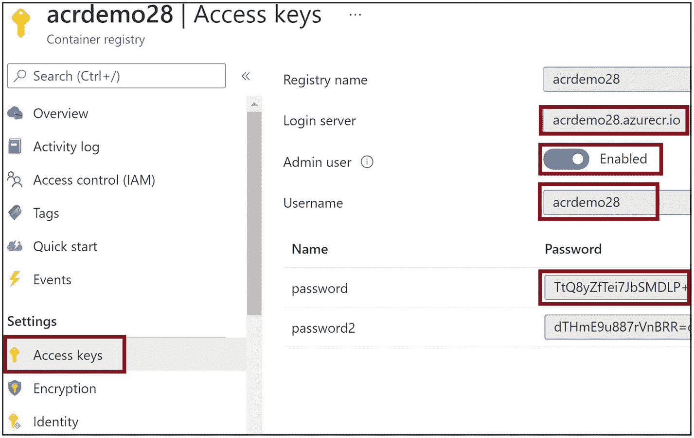

一个注册表访问密钥窗口的截图。左侧面板有访问密钥、加密和身份的设置，访问密钥选项卡被高亮显示。右侧面板包含注册表名称、登录服务器、管理员用户、用户名和密码的详细信息。管理员用户已启用，登录服务器、用户名和密码的选项卡被高亮显示。

图 4-6

访问密钥


### 创建 Azure Kubernetes 服务

现在我们来创建一个 Azure Kubernetes 服务。我们将在此 Kubernetes 集群上运行应用程序容器。前往 Azure 门户，点击*创建资源*，如图 4-7 所示。

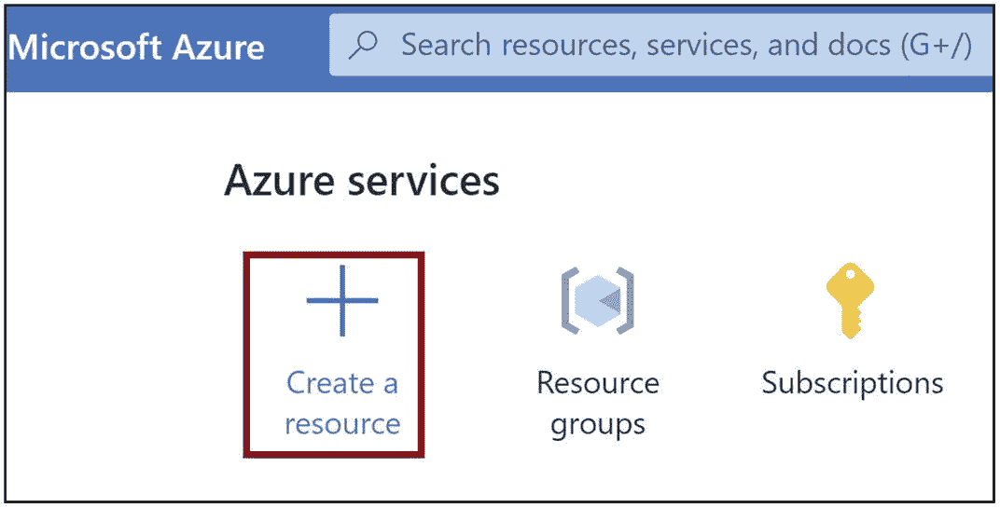

注册表访问密钥窗口的截图。左侧面板包含访问密钥、加密和身份的设置，其中访问密钥选项卡被高亮显示。右侧面板包含注册表名称、登录服务器、管理员用户、用户名和密码的详细信息。管理员用户已启用，登录服务器、用户名和密码选项卡被高亮显示。

图 4-7

创建资源

转到*容器*选项卡，点击*Kubernetes 服务*，如图 4-8 所示。

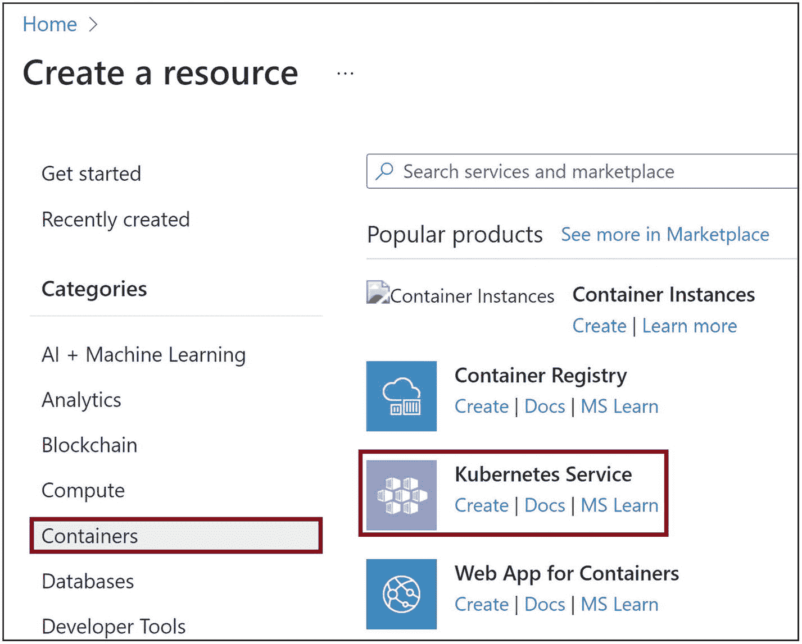

创建资源窗口的截图。它包含人工智能+机器学习、分析、区块链、计算、容器、数据库和开发工具等类别。容器选项卡被高亮显示。右侧面板包含容器实例、容器注册表、Kubernetes 服务和用于容器的 Web 应用。Kubernetes 服务被高亮显示。

图 4-8

创建 Kubernetes 服务

提供订阅、资源组和集群配置。让我们选择*开发/测试 ($)* 作为集群配置，如图 4-9 所示。这是可用的基本配置，可以为我们节省成本。

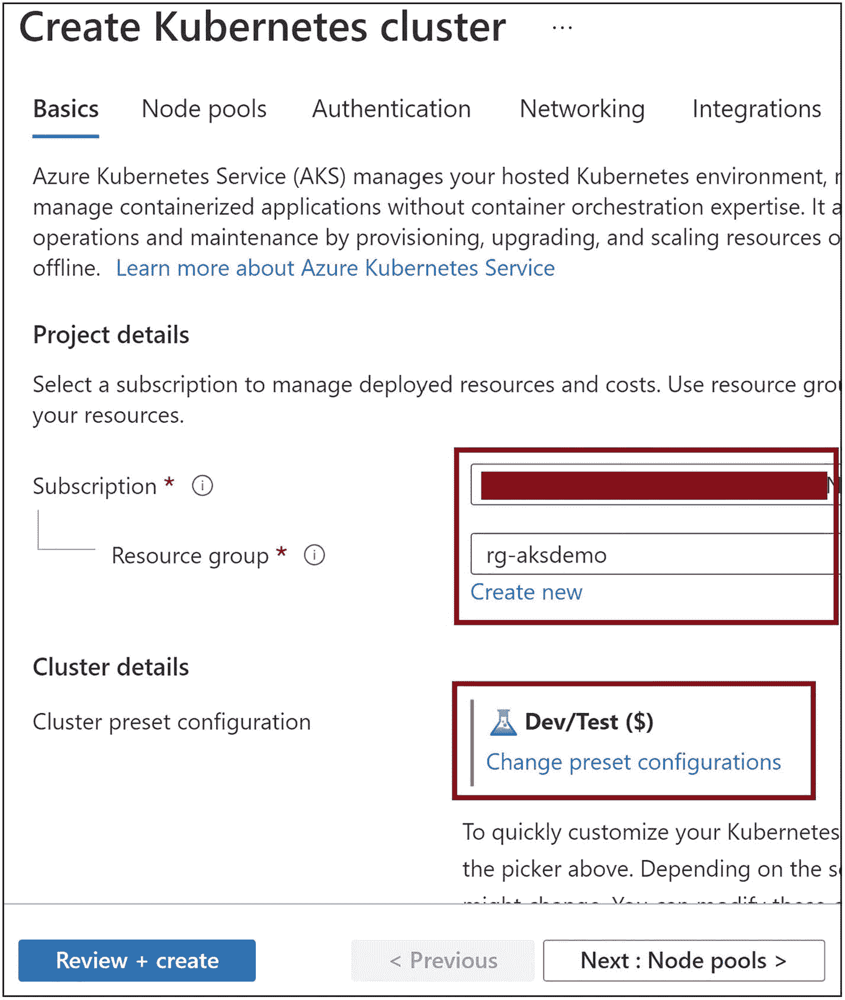

创建 Kubernetes 集群窗口的截图。它包含需要填写的项目详细信息，包括订阅和资源组。集群详细信息包括集群配置。提供了一个预设配置，可以更改。项目和集群详细信息均被高亮显示。底部有“查看+创建”和“下一步”选项卡。

图 4-9

提供基本详细信息

向下滚动并提供集群名称、区域和其他必要详细信息，如图 4-10 所示。

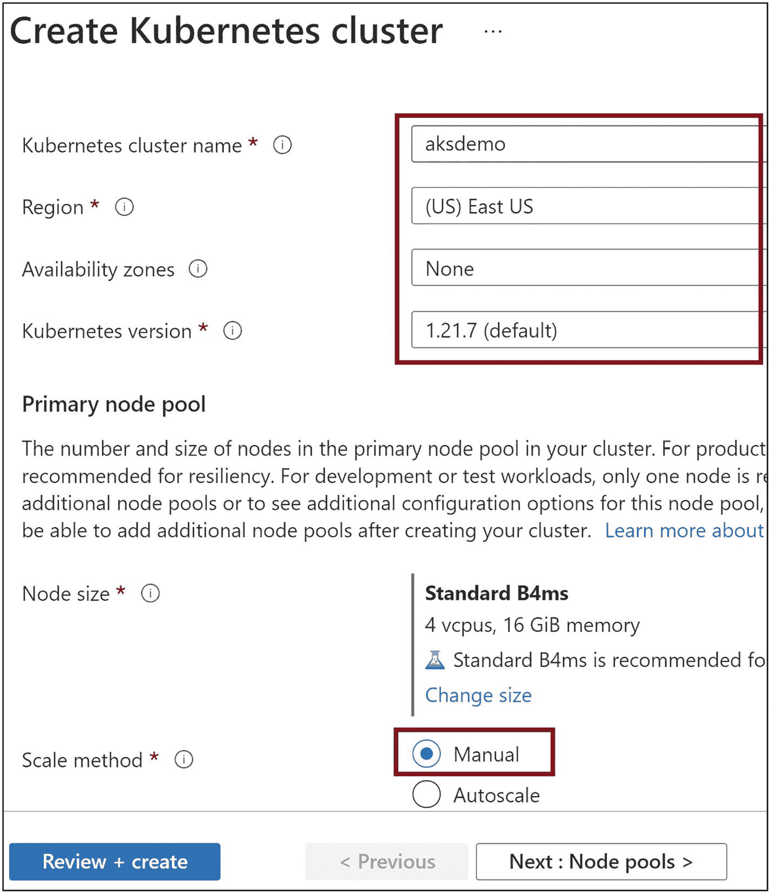

创建 Kubernetes 集群窗口的截图。它包含需要填写的项目详细信息，包括订阅和资源组。集群详细信息包括集群配置。提供了一个预设配置，可以更改。项目和集群详细信息均被高亮显示。底部有“查看+创建”和“下一步”选项卡。

图 4-10

提供集群详细信息

向下滚动并将集群中的节点数设置为 1，如图 4-11 所示。节点数越多，集群成本越高。

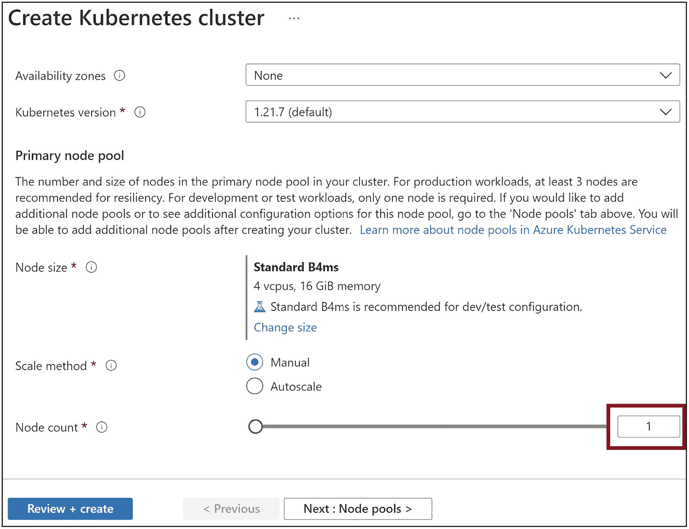

创建 Kubernetes 集群窗口的截图。它已填写可用区和 Kubernetes 版本的详细信息。下一段解释了主节点池，随后是节点大小和缩放方法的预填选项卡。节点计数选项卡需要填写为 1。底部有“查看+创建”和“下一步”选项卡。

图 4-11

提供节点数

转到*集成*选项卡。选择我们之前创建的 Azure 容器注册表。此步骤将帮助我们集成 Azure 容器注册表与 Kubernetes 集群，运行在节点内的 Pod 可以无缝地从容器注册表拉取容器镜像。您可以启用容器监控，这将帮助您获取集群的性能指标和日志。点击*查看+创建*，如图 4-12 所示。

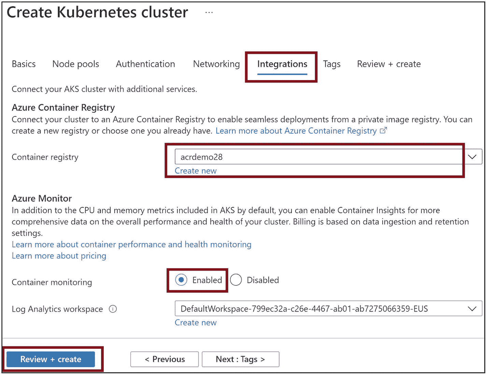

创建 Kubernetes 集群集成窗口的截图。它有一个容器注册表的下拉菜单选项卡，可以选择从菜单中选取或创建一个新的。容器监控已启用，日志分析工作区已设置。底部的“查看+创建”选项卡被高亮显示。

图 4-12

提供容器注册表集成详细信息

点击*创建*，如图 4-13 所示。这将启动 Kubernetes 集群。

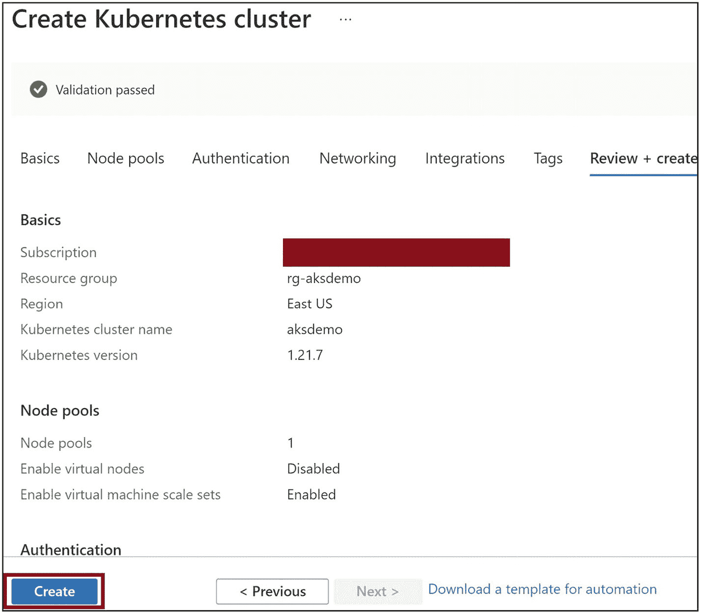

创建 Kubernetes 集群窗口的截图，显示文本“验证已通过”。提供了订阅、资源组、区域、Kubernetes 集群名称、Kubernetes 版本、节点池数量、禁用的虚拟节点和启用的虚拟机规模集的详细信息。底部的“创建”选项卡被高亮显示。

图 4-13

点击创建


### 将 Java 应用容器化

让我们使用 Spring Initializr 创建一个应用，并使用 Docker 将其容器化。访问清单 4-1 中所示的 Spring Initializr 网址。

```
https://start.spring.io/
清单 4-1
Spring Initializr 网址
```

如图 4-14 所示，为您的 Java 应用提供组名、工件 ID 和其他必要信息。

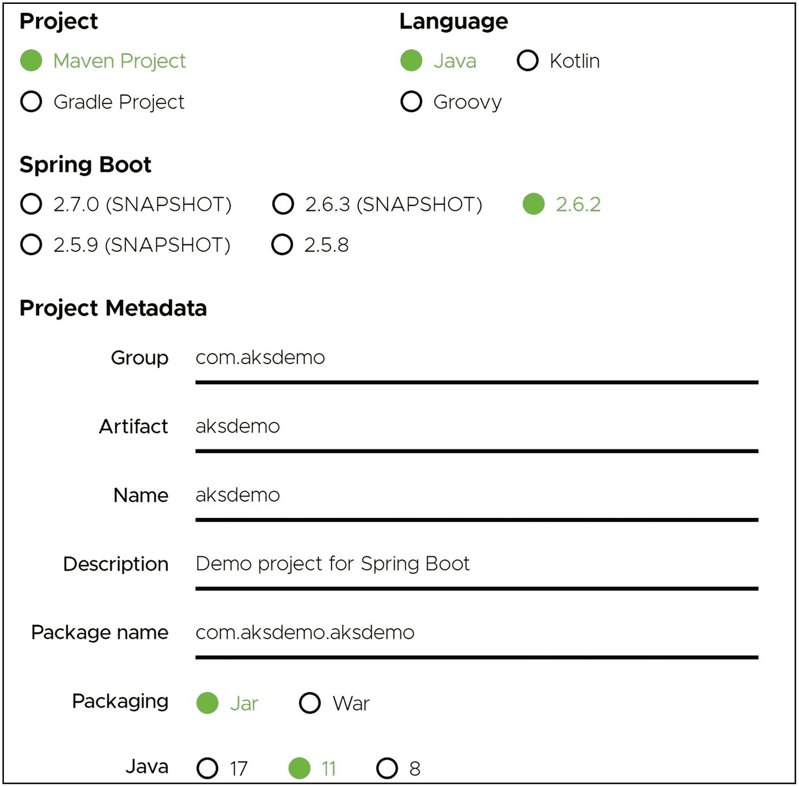

一张截图，展示如何使用 Spring Boot 2.6.2 版本，通过 Maven 项目在 Java 中创建应用。需要填写的项目元数据详情包括：组名、工件 ID、名称、描述、包名、打包文件类型（JAR）以及 Java 版本 11。

图 4-14

生成一个 Spring Boot Java 应用

如图 4-15 所示，添加 Spring Web 依赖项。生成 Java 应用项目并下载它。

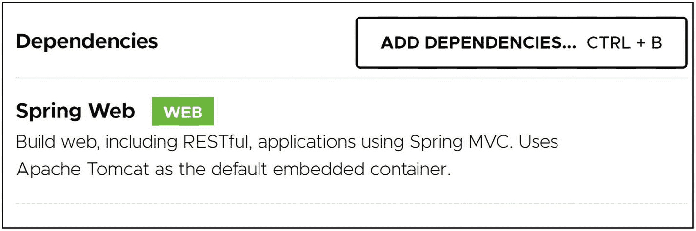

一张依赖项窗口的截图。它指示按 Control + B 添加依赖项。Spring Web 依赖项已添加到应用中。

图 4-15

添加 Spring Web 依赖项

在 Java 应用中，修改包含 main 方法的 Java 文件，如清单 4-2 所示。我们需要添加一个可通过 *hello* 路由访问的服务。该服务返回 *Hello World !!* 值。

```
package com.aksdemo.aksdemo;
import org.springframework.boot.SpringApplication;
import org.springframework.boot.autoconfigure.SpringBootApplication;
import org.springframework.web.bind.annotation.GetMapping;
import org.springframework.web.bind.annotation.RequestParam;
import org.springframework.web.bind.annotation.RestController;
@SpringBootApplication
@RestController
public class AksdemoApplication {
public static void main(String[] args) {
SpringApplication.run(AksdemoApplication.class, args);
}
@GetMapping("/hello")
public String hello() {
return String.format("Hello World !!");
}
}
清单 4-2
Java 应用代码
```

现在，让我们使用清单 4-3 中所示的命令构建应用。

```
mvn clean install
清单 4-3
构建 Java 应用
```

一旦 Maven 构建成功，我们就可以将应用容器化。JAR 文件将生成在 target 文件夹内。构建成功后会自动创建 target 文件夹。让我们使用以下代码清单创建 Docker 文件。该文件应命名为 *Dockerfile*，不带任何扩展名。请确保在应用 pom.xml 文件所在的目录中创建如清单 4-4 所示的 Docker 文件。Docker 文件使用 *openjdk:11* 作为基础镜像。它会将应用 JAR 文件复制到 /usr/app 文件夹。请确保将下面列出的 Docker 文件中的 JAR 名称替换为在 target 文件夹中为您生成的 JAR 文件的名称。然后，它将暴露端口 8080，并将应用 JAR 文件定义为入口点，以便容器启动时 JAR 文件随之启动。

```
FROM openjdk:11
COPY target/aksdemo-0.0.1-SNAPSHOT.jar /usr/app/
WORKDIR /usr/app
EXPOSE 8080
ENTRYPOINT ["java","-jar","aksdemo-0.0.1-SNAPSHOT.jar"]
清单 4-4
Dockerfile
```

现在，让我们运行清单 4-5 中所示的命令来将应用容器化。您应该在 Docker 文件所在的目录中运行此命令。

```
docker build -t aksdemo:demo .
清单 4-5
构建 Docker 镜像

现在，让我们通过运行清单 4-6 中所示的命令，验证容器镜像是否已创建，如图 4-16 所示。

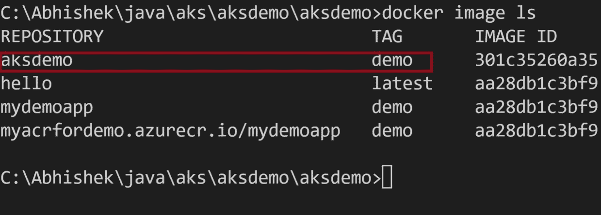

一张窗口截图，搜索栏中显示 URL：http://localhost:8080/hello。屏幕输出显示：hello world。

图 4-16

容器化镜像

```
docker image ls
清单 4-6
列出 Docker 镜像
```

让我们启动容器并检查是否可以访问应用。您可以使用清单 4-7 中所示的命令启动应用。我们将笔记本电脑上的系统端口 8080 映射到运行应用的容器的端口 8080。

```
docker run --publish 8080:8080 --detach --name aksdemo aksdemo:demo
清单 4-7
运行 Docker 容器
```

Docker 容器启动后，浏览清单 4-8 中所示的 URL，如图 4-17 所示。

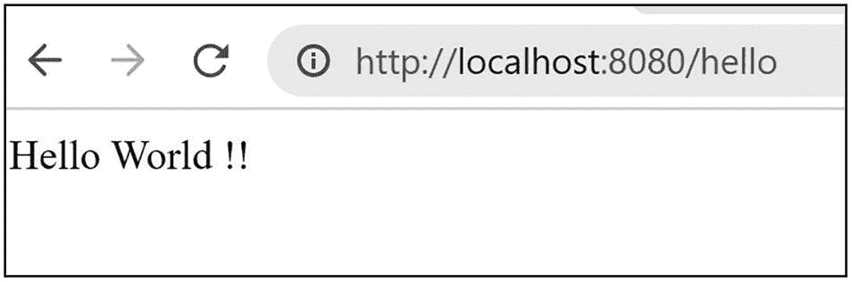

一张窗口截图，搜索栏中显示 URL：http://localhost:8080/hello。屏幕输出显示：hello world。

图 4-17

在本地执行的容器

```
http://localhost:8080/hello
清单 4-8
本地运行容器的 URL
```

现在，让我们将容器镜像推送到我们之前创建的 Azure 容器注册表。运行清单 4-9 中所示的命令以登录 Azure 容器注册表。系统会提示您输入凭据，您可以在 Azure 容器注册表的“访问密钥”部分获取这些凭据。

注意

除了使用 Docker 命令将镜像推送到 Azure 容器注册表之外，您还可以使用 Azure CLI 命令 `az acr build --registry [ACRName] --image [ImageName] .` 来构建容器镜像并将其推送到 Azure 容器注册表。与使用传统的 Docker 命令相比，这是一种更简洁的推送镜像方式。将 *[ACRName]* 替换为 Azure 容器注册表的名称，将 *[ImageName]* 替换为您需要创建的 Docker 镜像的名称。在尝试 `az acr` 命令之前，您必须使用 `az login` 命令登录到 Azure 订阅。

将 *[ACRName]* 替换为您的 Azure 容器注册表的名称。

```
docker login [ACRName].azurecr.io
清单 4-9
登录到 Azure 容器注册表
```

运行清单 4-10 中所示的命令，为容器镜像打上 Azure 容器注册表名称的标签。将 *[ACRName]* 替换为您的 Azure 容器注册表的名称。

```
docker tag aksdemo:demo [ACRName].azurecr.io/aksdemo:demo
清单 4-10
使用 Azure 容器注册表为 Docker 镜像打标签
```

将容器镜像推送到清单 4-11 中所示的容器注册表。将 *[ACRName]* 替换为您的 Azure 容器注册表的名称。

```
docker push [ACRName].azurecr.io/aksdemo:demo
清单 4-11
将 Docker 镜像推送到 Azure 容器注册表
```

镜像推送成功后，您可以在 Azure 容器注册表的 *存储库* 部分看到该镜像，如图 4-18 所示。

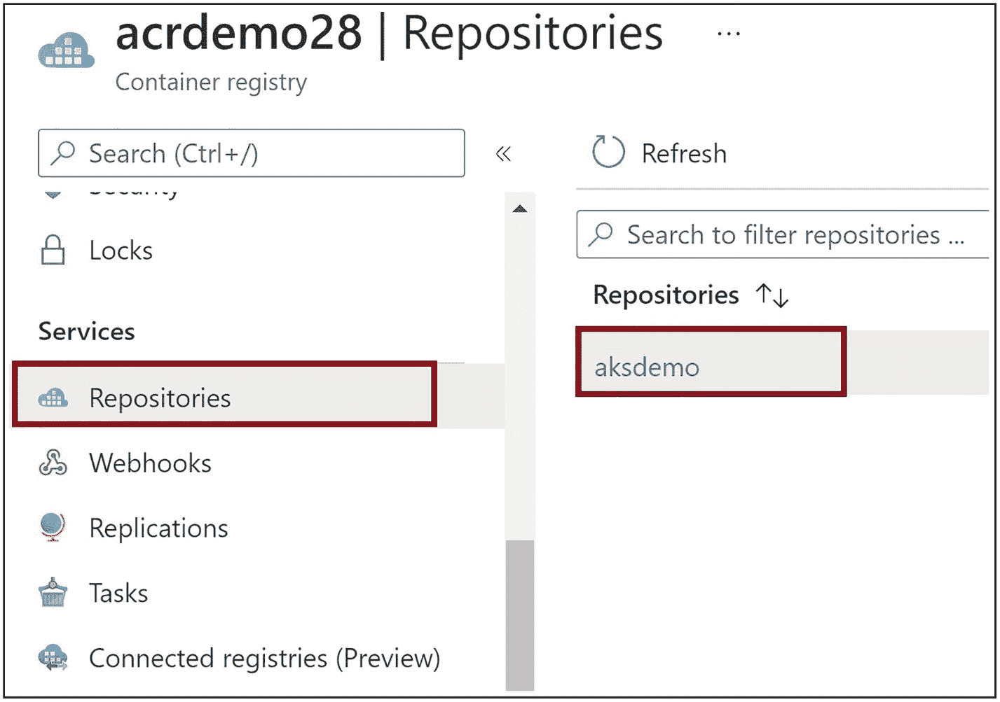

一张注册表存储库窗口的截图。左侧面板包含存储库、Webhook、复制、任务和已连接注册表等服务。右侧的存储库面板中，AKS demo 被高亮显示。

图 4-18

Azure 容器注册表中的容器镜像


### 在 Azure Kubernetes Service 上运行容器

现在，我们已经将 Java 应用容器化，并将其推送到了 Azure 容器注册表。接下来，让我们在 Azure Kubernetes Service 上运行该容器镜像。我们将使用 *Azure Cloud Shell* 来执行 *Azure CLI* 和 *kubectl* 命令，以在 Azure Kubernetes Service 上部署容器镜像。如果你打算在本地系统上尝试此操作，则需要在本机安装 Azure CLI 和 kubectl。在尝试图示步骤之前，你还必须登录到本地的 Azure 环境。使用 *Azure Cloud Shell*，你无需进行任何安装或登录 Azure 环境，可以直接使用此处图示的命令开始操作。转到 Azure 门户，点击 Azure Cloud Shell。当云 Shell 打开时，选择 *Bash* 提示符，如图 4-19 所示。

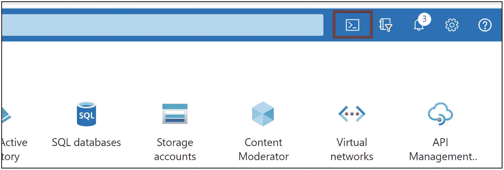

Azure Cloud Shell 窗口的截图。它有一个搜索栏，搜索栏右侧有 5 个提示符。第一个是 Bash 提示符，已被高亮显示。页面组件包括 SQL 数据库、存储帐户、内容审查器、虚拟网络和 API 管理。

图 4-19

打开 Azure Cloud Shell

我们需要在云 Shell 中本地获取凭据，并使用 Azure Kubernetes Service 进行身份验证。运行清单 4-12 中所示的命令以进行身份验证。

```
az aks get-credentials -n aksdemo -g rg-aksdemo –admin
清单 4-12
获取集群凭据
```

现在，让我们打开 *nano* 编辑器并创建 *deploy.yaml* 文件。在此 YAML 文件中，我们指定了容器镜像仓库的详细信息、副本数量、用于将 Pod 暴露到 Internet 的负载均衡器服务，以及镜像在 Pod 和负载均衡器服务上运行的端口详细信息。简而言之，我们正在定义具有三个副本和一个负载均衡器服务的 Kubernetes 部署配置，该服务将把应用程序暴露到 Internet。运行清单 4-13 中所示的命令以打开 nano 编辑器。

```
nano deploy.yaml
清单 4-13
打开 nano 编辑器
```

将清单 4-14 中所示的 YAML 粘贴到 deploy.yaml 文件中。保存 YAML 并关闭 nano 编辑器。

注意

你需要根据所使用的 Azure 容器注册表以及所创建的容器镜像的名称，在清单 4-14 中提供镜像路径。

```
apiVersion: apps/v1
kind: Deployment
metadata:
name: mydemoapp
labels:
app: mydemoapp
spec:
selector:
matchLabels:
app: mydemoapp
replicas: 3
template:
metadata:
labels:
app: mydemoapp
spec:
containers:
- name: mydemoapp
image: acrdemo28.azurecr.io/aksdemo:demo
resources:
requests:
cpu: 100m
memory: 100Mi
limits:
cpu: 200m
memory: 200Mi
ports:
- containerPort: 8080

apiVersion: v1
kind: Service
metadata:
name: mydemoappservice
spec:
type: LoadBalancer
ports:
- port: 8080
selector:
app: mydemoapp
清单 4-14
Deploy.yaml
```

运行清单 4-15 中所示的命令，以在 Azure Kubernetes Service 中部署应用程序容器镜像。

```
kubectl apply -f deploy.yaml
清单 4-15
部署到 Azure Kubernetes Service
```

我们指定了三个副本，因此集群中应该有三个 Pod 在运行。运行清单 4-16 中所示的命令以列出正在运行的 Pod，如图 4-20 所示。

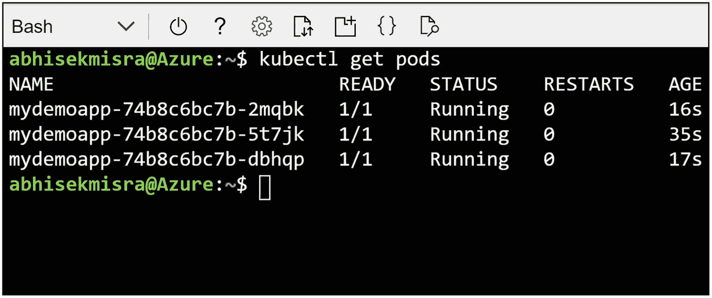

Bash 提示符运行时窗口的截图，用于输出集群中正在运行的 Pod。提供了 3 个输入，包含 5 列详细信息：镜像名称、Pod 就绪状态、运行状态、Pod 重启状态以及运行时间（秒）。

图 4-20

集群中正在运行的 Pod

```
kubectl get pods
清单 4-16
获取集群中正在运行的 Pod
```

运行清单 4-17 中所示的命令以检查负载均衡器服务。复制负载均衡器服务的外部 IP 地址，如图 4-21 所示。我们需要此 IP 地址来浏览集群上运行的应用程序。

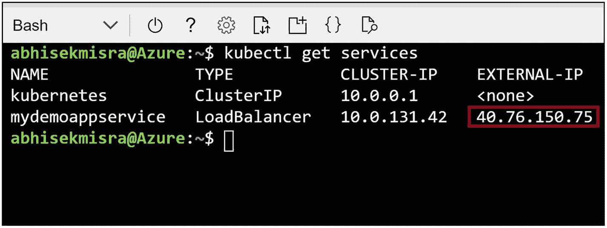

Bash 提示符运行时窗口的截图，用于负载均衡器服务。提供了 2 个输入，包含 4 列详细信息：名称、服务类型、集群 IP 和外部 IP。Kubernetes 的外部 IP 输出为 none，而 mydemoappservice 的外部 IP 被高亮显示为 40.76.150.75。

图 4-21

负载均衡器服务

```
kubectl get services
清单 4-17
获取负载均衡器服务详细信息
```

浏览外部 IP 地址，您可以看到应用程序输出，如图 4-22 所示。

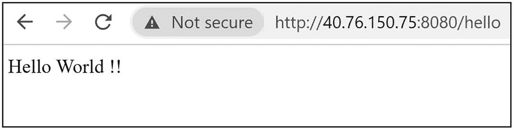

一个窗口的截图，其搜索栏中显示 URL：HTTP://40.76.150.75:8080/hello。屏幕上的输出显示：hello world。

图 4-22

浏览集群中运行的应用程序

## 总结

在本章中，我们学习了容器和 Kubernetes 的详细信息。然后，我们了解了什么是 Azure Kubernetes Service。接着，我们开发了一个 Java Spring Boot 应用程序，将其容器化为 Docker 镜像，并推送到了 Azure 容器注册表。我们拉取了该容器镜像，并在 Azure Kubernetes Service 集群上运行了它。我们探索了基本的 Docker 和 kubectl 命令，这些命令将帮助我们与 Docker 引擎和 Kubernetes 集群进行交互。在下一章中，我们将构建一个 Java 应用程序并在 Azure Spring Cloud 上运行它。

以下是本章的关键要点：

*   您可以构建应用程序，将其容器化，并连同所有必要的应用程序依赖项一起保存在容器注册表中。

*   容器注册表存储容器镜像。Azure 容器注册表和 Docker Hub 是容器注册表的示例。

*   对于容器而言，服务器的操作系统是虚拟化的，容器作为操作系统线程运行，无需为自身配备操作系统。

*   Kubernetes 是 Google 提供的一款开源容器编排工具。它由一个主节点（或控制平面）和多个工作节点组成。

*   您的容器在工作节点的 Pod 内运行。

*   Azure Kubernetes Service 是 Azure 上托管的 Kubernetes 服务。

