# 5. 在 Azure Spring Cloud 上运行 Java 应用程序

您正在构建一个基于 Spring Boot 的微服务应用程序，并将使用平台即服务模型将其托管在 Azure 上。您需要处理诸如为不同环境维护应用程序配置、与 Azure 上的平台即服务数据库集成，以及利用 Azure Redis 满足缓存需求等问题。您可能还需要集成 Application Insights 进行日志记录和监控，为您的服务配置自动缩放等等。您还需要将应用程序托管环境与 Git 仓库、Azure DevOps 管道或 Jenkins 集成。并且，您需要在不进行任何代码更改的情况下实现所有这些需求，并尽可能多地使用配置。Azure Spring Cloud 将在此处为您轻松提供帮助。

在上一章中，我们学习了 Azure Kubernetes Service 的基础知识。然后，我们创建了一个基于 Java 的应用程序，将其容器化，并部署到了 Azure Kubernetes Service 上。在本章中，我们将学习 Azure Spring Cloud 的详细信息，然后我们将预配一个 Azure Spring Cloud 服务，并将应用程序部署到该服务中。


## 结构

在本章中，我们将讨论在 Azure Spring Cloud 上部署 Java 应用的以下几个方面：

*   Azure Spring Cloud 简介

*   创建 Azure Spring Cloud 服务

*   在 Azure Spring Cloud 上部署 Java 应用

## 目标

学习完本章后，你应该能够获得以下收获：

*   理解 Azure Spring Cloud 的概念

*   在 Azure Spring Cloud 上构建并运行 Java 应用

## Azure Spring Cloud 简介

Spring Cloud 是一个基于 Java 虚拟机（`–`）的开源框架，可帮助开发者构建健壮的基于云的 Java 解决方案。你可以轻松地整合各种横切关注点，例如分布式消息传递、服务发现、负载均衡、服务注册、路由等。

Azure Spring Cloud 是一种基于平台即服务的产品。Spring Cloud 不仅适用于 Java 应用，它还可以使用 Steeltoe 托管 .NET Core 应用。你需要专注于构建应用。底层平台将负责托管需求。你需要预配服务并将应用部署到其中。

你可以使用 Spring Cloud 构建基于微服务的应用。它为管理应用配置和服务发现提供了出色的内置支持。它无需编写任何代码即可与 Azure 服务（如 Azure Active Directory、Application Insights、Azure Redis 缓存、存储帐户、Cosmos DB 以及其他 PaaS 数据库和服务）良好集成。你可以为 Azure Spring Cloud 上的应用实例定义服务绑定，并轻松地与其他 Azure 服务集成。

在 Azure Spring Cloud 上运行的应用实例可以根据扩展标准和条件使用自动配置进行扩展。它还支持手动扩展，你需要手动指定要运行的实例数量。

Azure Spring Cloud 非常适合使用 Azure DevOps、Jenkins、Maven、Gradle、Terraform 等工具的持续集成和持续部署场景。你可以集成源代码仓库（如 Azure Repos、GitHub 和 Git 仓库），并轻松采用 DevOps 方式来构建应用。

你可以使用 Azure Spring Cloud 构建企业级应用。Azure Spring Cloud 在 Azure 上的 VMware 基础设施之上运行。它为端到端的应用生命周期管理提供了出色的支持。你可以轻松地处理企业级关注点，例如监控、审计、安全性、可伸缩性、可用性等。

## 创建 Azure Spring Cloud 服务

让我们使用 Azure 门户创建一个 Azure Spring Cloud 服务。转到 Azure 门户并搜索 *azure spring apps*，如图 5-1 所示，然后在结果中单击 *Azure Spring Apps*。

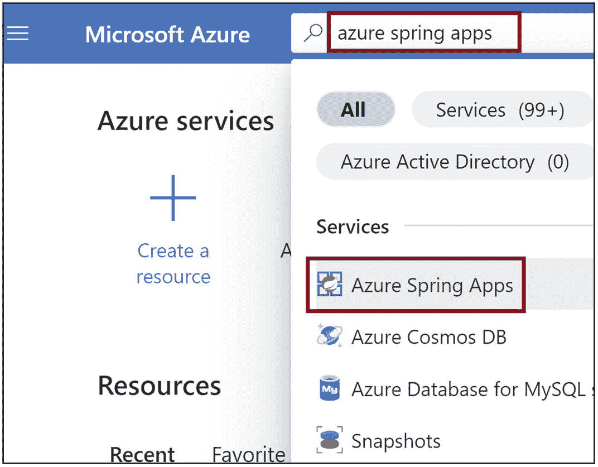

Azure 门户窗口的屏幕截图。搜索栏中有文本“Azure spring apps”，并选中了“所有”选项卡。所有搜索结果如下所示，包括 Azure Spring Apps、Azure cosmos D B、Azure database for My S Q L 和 snapshots。Azure spring apps 搜索结果被高亮显示。

图 5-1

搜索 Azure Spring Apps

单击 *创建*，如图 5-2 所示。你将导航到可以创建 Azure Spring Cloud 的屏幕。

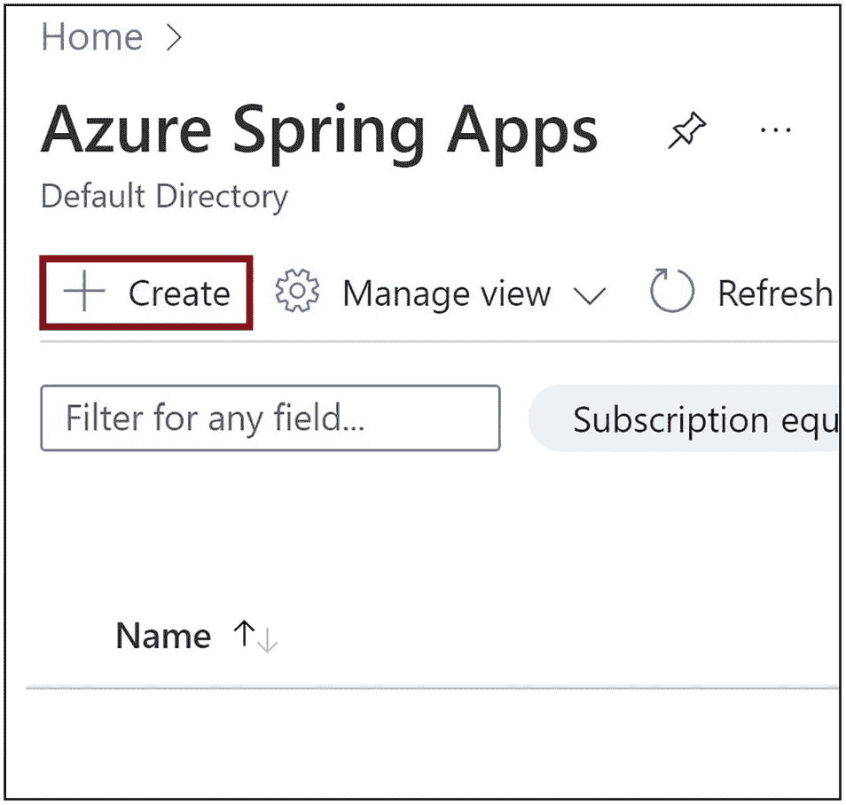

Azure spring apps 窗口的屏幕截图。它有创建、管理视图和刷新选项。“创建”选项卡被高亮显示。任何字段的筛选器均为空白。

图 5-2

单击“创建”

提供资源组名称、订阅名称、Spring Cloud 名称、位置和层级。单击 *查看 + 创建*，如图 5-3 所示。

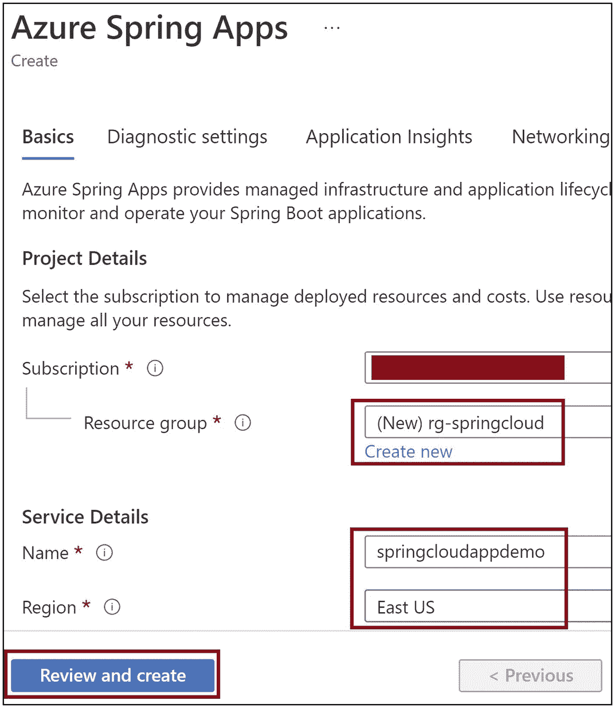

Azure Spring Apps 窗口的屏幕截图。选中了“基本信息”选项卡。项目详细信息包括选择订阅类型和创建新的资源组，这两个字段都被高亮显示。服务详细信息的第二部分需要名称和区域，这两个字段也被高亮显示。左下角有一个选项卡，显示“查看并创建”，该选项卡被高亮显示。

图 5-3

单击“查看 + 创建”

单击 *创建*，如图 5-4 所示。此操作将预配 Azure Spring Cloud。

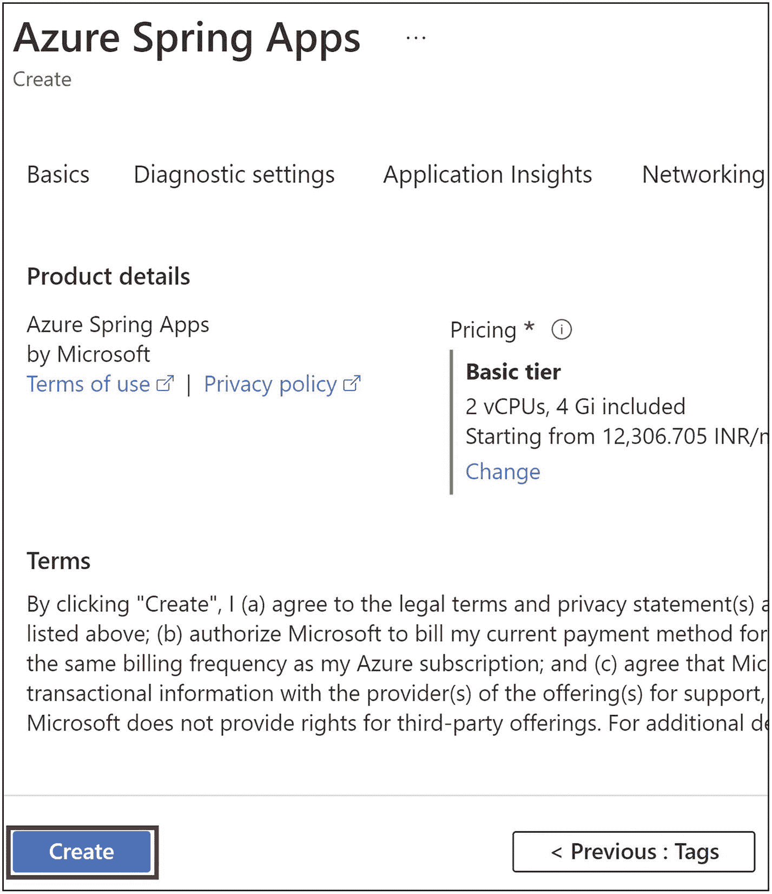

Azure Spring Apps 创建窗口的屏幕截图。它包含产品详细信息和不同条款。产品详细信息显示“Azure Spring Apps by Microsoft”。右侧显示了基本层的定价。条款在创建前有不同的协议标准。左下角有一个选项卡被高亮显示，上面写着“创建”。

图 5-4

单击“创建”

一旦 Azure Spring Cloud 服务创建完成，请在门户中导航到该服务。我们需要创建一个应用实例来部署 Spring Boot 应用。转到 *应用* 部分，然后单击 *创建应用*，如图 5-5 所示。

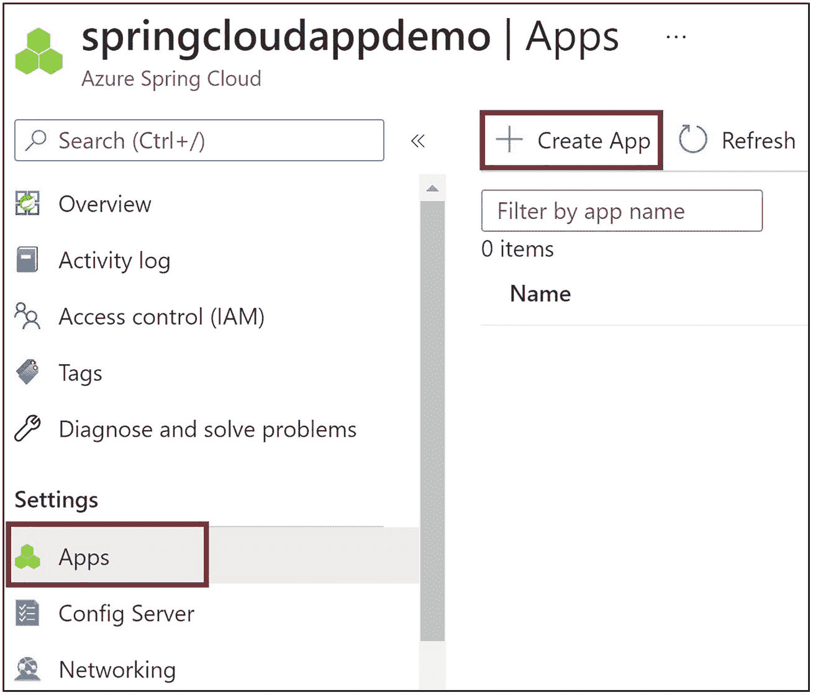

Azure Spring Cloud 主页的屏幕截图。有概述、活动日志、访问控制、标签、诊断和解决问题等部分。在“设置”下，有应用、配置服务器和网络。“应用”选项卡被高亮显示。右侧的“创建应用”选项被高亮显示。

图 5-5

单击“应用”

提供实例名称、运行时版本（Java 11）、实例计数（1）以及其他计算详细信息。单击 *创建*，如图 5-6 所示。应用实例将被创建。

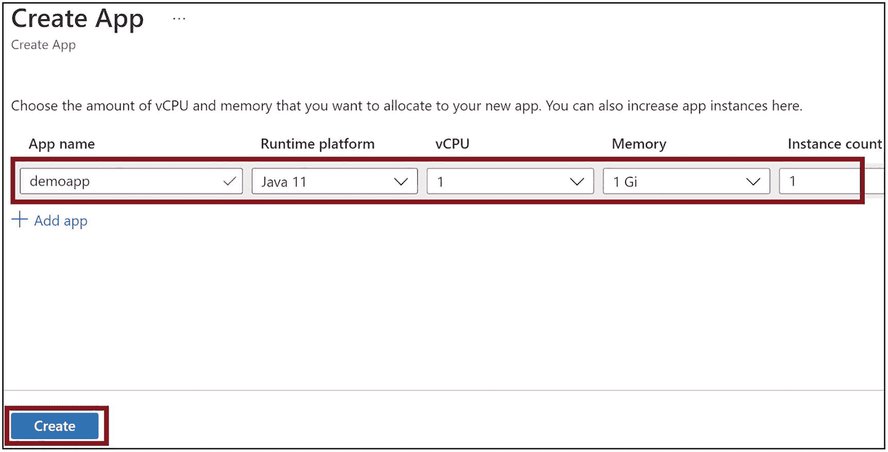

创建应用窗口的屏幕截图，包含 6 个选项卡，应用名称为 demo app，运行时平台为 java 11，虚拟 C P U 为 1，内存为 1 gibibyte，实例计数为 1。相应的字段被高亮显示。上方文字显示：“选择要分配给新应用的虚拟 C P U 和内存量。您也可以在此处增加应用实例。”左下角的“创建”按钮被高亮显示。

图 5-6

创建应用

单击我们创建的应用，如图 5-7 所示。你将导航到我们创建的应用内部。

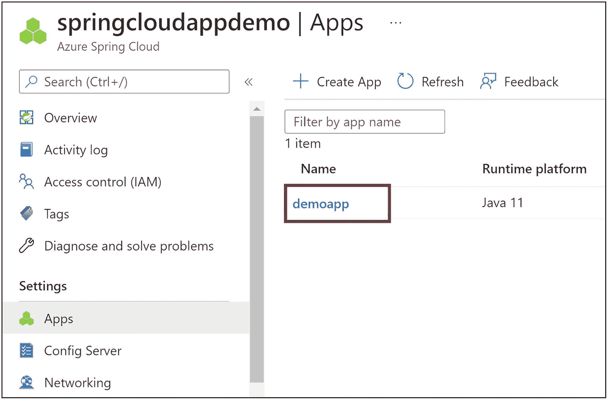


Azure Spring Cloud 主页的截图。页面包含概览、活动日志、访问控制、标签、诊断并解决问题等部分。在“设置”下，有应用、配置服务器和网络。右侧列出了 1 个名为“demo app”的应用，该应用处于高亮状态。运行时平台标记为 Java 11。

图 5-7

点击已创建的应用

我们需要使用公共 URL 访问该应用。如图 5-8 所示，点击 *分配终结点*。

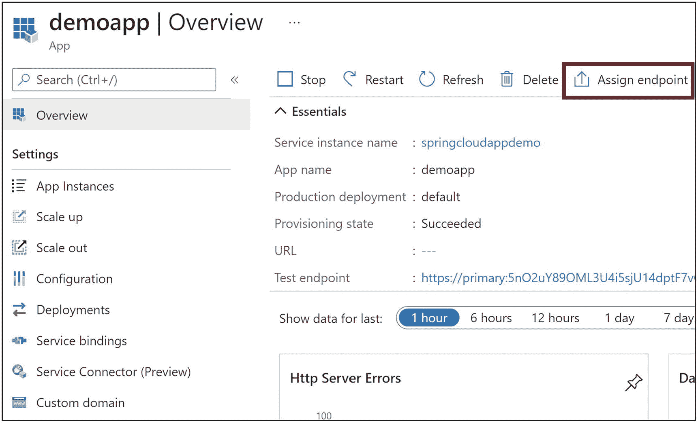

demo app 概览窗口的截图。右侧有停止、重启、刷新和分配终结点等选项卡。分配终结点处于高亮状态。右下方面板显示了服务实例名称、应用名称、生产部署（默认）、预配状态（成功）、URL 以及测试终结点（包含一个 URL）的详细信息。

图 5-8

点击分配终结点

一旦 URL 分配完成，如图 5-9 所示，点击该 URL。

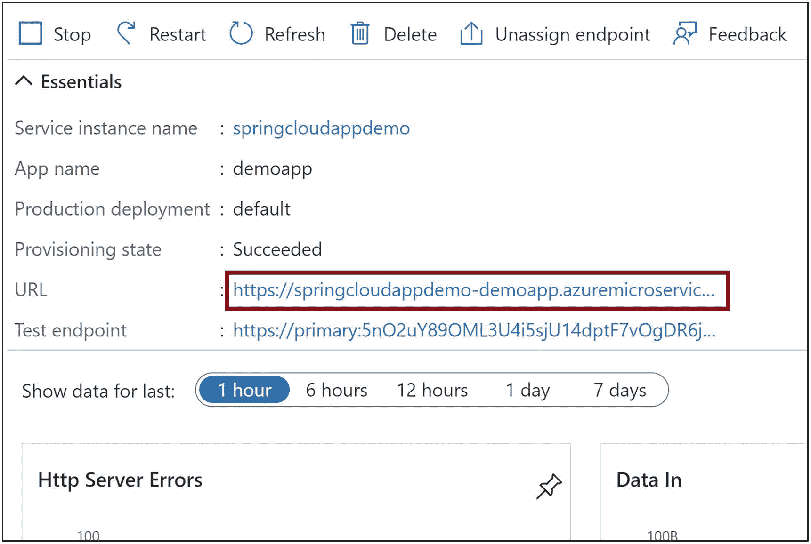

Azure Spring Cloud 窗口的截图。它显示了服务实例名称（spring cloud app demo）、应用名称（demo app）、生产部署（默认）、预配状态（成功）、URL（包含一个链接）以及测试终结点（包含另一个链接）的详细信息。URL 选项卡中的链接处于高亮状态。数据显示持续 1 小时。

图 5-9

点击 Azure Spring Cloud 公共 URL

该 URL 将提供在 Spring Cloud 服务上运行的默认应用，如图 5-10 所示。

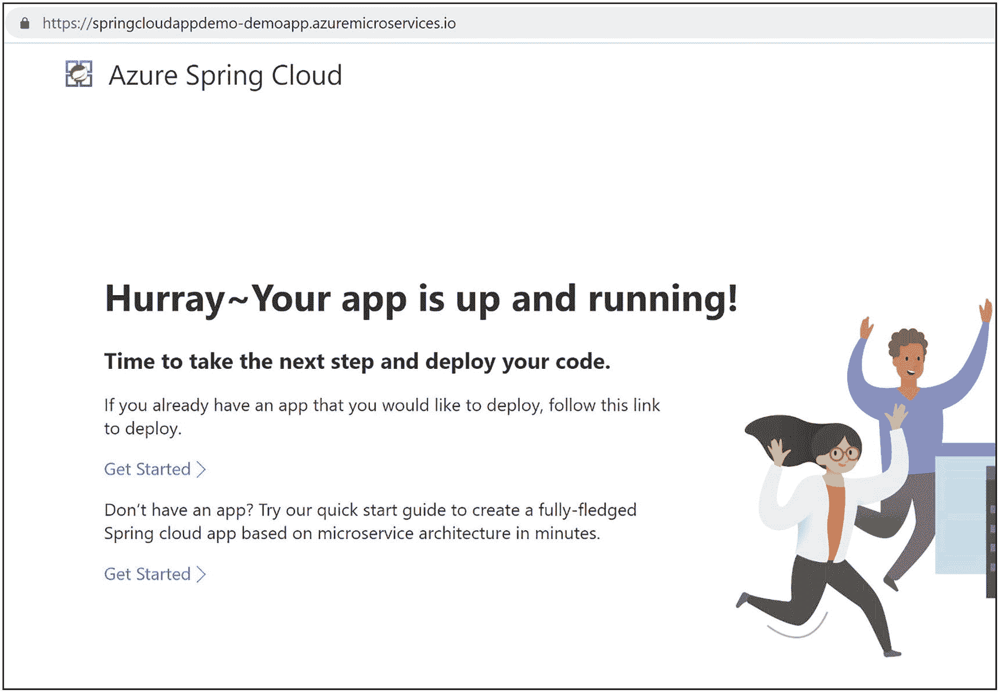

默认 demo app 页面的截图。文本显示：“恭喜，您的应用已启动并运行，是时候采取下一步并部署您的代码了。”提供了 2 个入门链接，一个用于应用已就绪的情况，另一个用于创建完整 Spring Cloud 应用的指南。文本旁边有一男一女跳舞的剪贴画。

图 5-10

应用的默认页面

## 在 Azure Spring Cloud 上部署 Java 应用程序

现在，让我们构建一个 Java Spring Boot 应用程序，并将其部署到我们之前创建的 Azure Spring Cloud 服务上。我们将使用服务绑定将 Azure Spring Cloud 服务与 Azure Redis 缓存集成，然后从 Java Spring Boot 应用程序写入 Azure Redis 缓存。我们无需在应用程序代码中为 Azure Redis 缓存集成编写任何代码或配置。

作为先决条件，您应该拥有一个 Azure Redis 缓存。我们将在第 9 章中探讨如何预配 Azure Redis 缓存。

让我们使用清单 5-1 中所示的 URL 访问 Spring Initializr。

```
https://start.spring.io/
清单 5-1
Spring Initializr URL
```

为项目提供组、工件、名称和其他基本信息。如图 5-11 所示，选择 11 作为 Java 版本，JAR 作为打包方式。

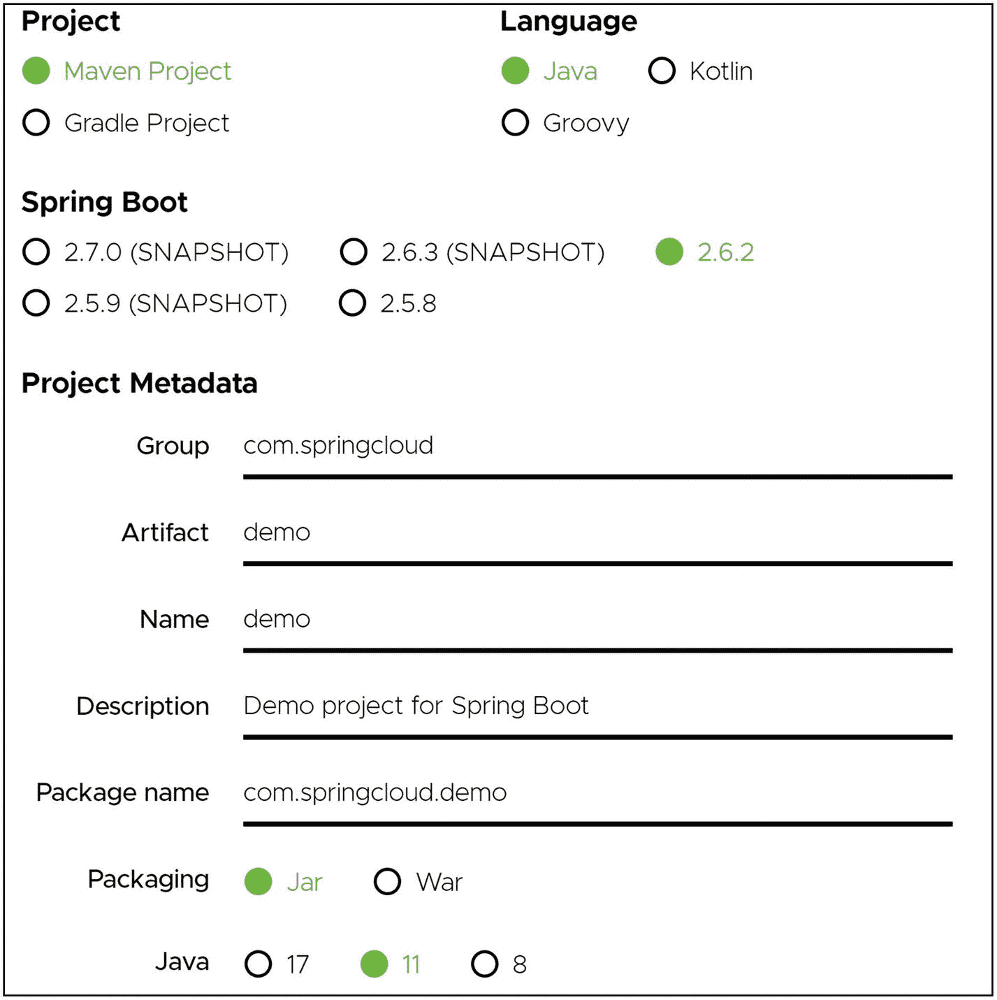

Spring Initializr 列表窗口的截图。它包含项目详细信息。项目选择为 Maven，语言设置为 Java，Spring Boot 版本为 2.6.2。项目元数据列出了组、工件、名称、描述和包名及其各自字段。在“打包”和“Java”下分别选择了 JAR 和 11。

图 5-11

提供项目详细信息

添加 *Spring Web* 和 *Spring Data Reactive Redis* 依赖项，并生成项目，如图 5-12 所示。

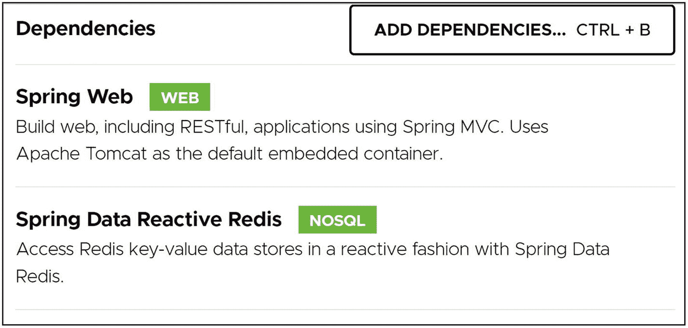

Spring Initializr 列表窗口的截图。它包含项目详细信息。项目选择为 Maven，语言设置为 Java，Spring Boot 版本为 2.6.2。项目元数据列出了组、工件、名称、描述和包名及其各自字段。在“打包”和“Java”下分别选择了 JAR 和 11。

图 5-12

添加项目依赖项

我们需要将 Azure Redis 缓存与我们创建的 Azure Spring Cloud 应用程序实例集成。转到应用程序实例，然后导航到 *服务绑定* 部分。如图 5-13 所示，点击 *创建服务绑定*。

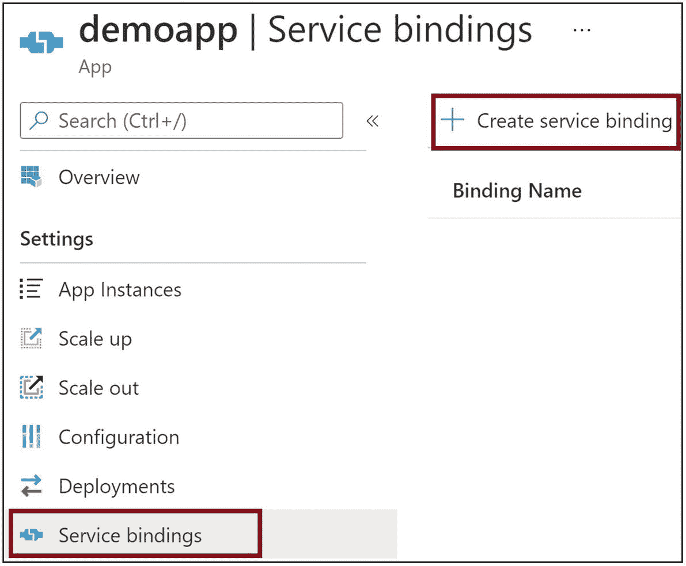

demo app 主页的截图。左侧有各种设置：应用实例、纵向扩展、横向扩展、配置、部署和服务绑定。服务绑定选项处于高亮状态。右侧有一个用于创建服务绑定的选项卡，该选项卡处于高亮状态。

图 5-13

转到服务绑定部分

为服务绑定提供必要的详细信息。我们需要为服务绑定指定一个名称，选择要绑定的 Azure Redis 缓存，并提供访问密钥。您可以按照第 9 章中提到的步骤创建 Redis 缓存。如图 5-14 所示，确保将 *使用 SSL* 选择为 *False*。我们在应用程序代码中用于与 Azure Redis 缓存配合使用的依赖项不支持 SSL。为简单起见，我们使用此依赖项。但是，还有其他可用于 Redis 缓存的依赖项支持 SSL。

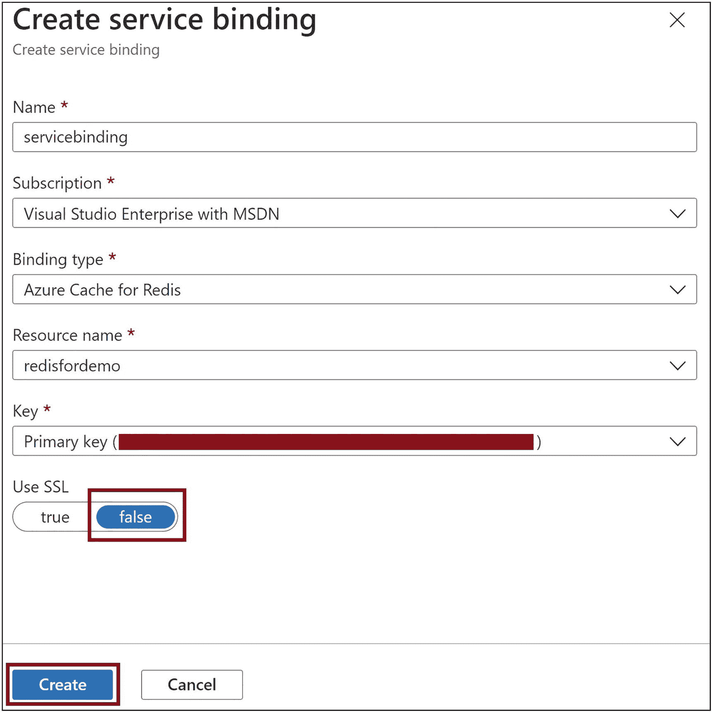

应用的创建服务绑定页面的截图。需要填写详细信息：服务绑定的名称、订阅类型（选择为包含 MSDN 的 Visual Studio Enterprise）、绑定类型（选择为 Azure Cache for Redis）、资源名称和访问密钥。SSL 指示为 false 并处于高亮状态。创建按钮处于高亮状态。

图 5-14

创建服务绑定


修改包含主函数的 Java 文件，如清单 5-2 所示。我们添加了 *hello* 方法，在该方法中，我们使用键 *helloworld* 将值 *Hello World !!!!* 写入 Azure Redis 缓存。然后我们重新读取该值，并从 API 调用中返回。

```
package com.springcloud.demo;
import org.springframework.web.bind.annotation.RequestMapping;
import org.springframework.web.bind.annotation.RestController;
import org.springframework.beans.factory.annotation.Autowired;
import org.springframework.boot.SpringApplication;
import org.springframework.boot.autoconfigure.SpringBootApplication;
import org.springframework.data.redis.core.StringRedisTemplate;
import org.springframework.data.redis.core.ValueOperations;
@SpringBootApplication
@RestController
public class DemoApplication {
@Autowired
private StringRedisTemplate template;
public static void main(String[] args) {
SpringApplication.run(DemoApplication.class, args);
}
@RequestMapping("/hello")
public String hello() {
ValueOperations ops = this.template.opsForValue();
// Add a Hello World string to your cache.
String key = "helloworld";
if (!this.template.hasKey(key)) {
ops.set(key, "Hello World !!!!");
}
return ops.get(key);
}
}
清单 5-2
写入 Azure Redis 缓存
```

执行清单 5-3 中所示的 Maven 命令，以构建并打包 JAR 文件。

```
mvn clean install
清单 5-3
使用 Maven 打包应用程序
```

执行清单 5-4 中所示的 Maven 命令，以使用 Azure Spring Cloud 配置来配置 POM 文件。我们将生成 Java 8 版本的 POM 文件，之后可以将其更改为 Java 11。

```
mvn com.microsoft.azure:azure-spring-cloud-maven-plugin:1.7.0:config
清单 5-4
使用 azure-spring-cloud-maven-plugin 配置 pom
```

当提示时选择你的订阅。提供我们之前创建的应用程序名称。确保在提示时提供必要的输入，使其成为公共应用程序，如图 5-15 所示。

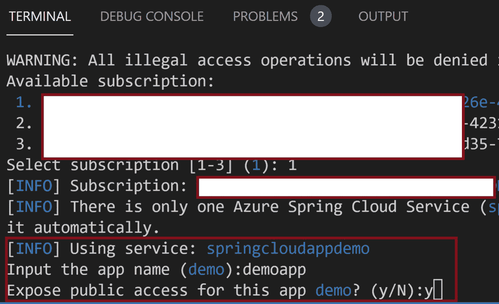

终端窗口的截图。页面列出了一组代码。代码的第一部分指示了 3 个订阅，其中第一个被选中。下一部分用于订阅名称，由于只有一个 Azure Spring Cloud 服务，因此会自动填充。第三部分指示服务名称、应用程序名称以及应用程序对公众的可访问性（标记为 y），整个部分被高亮显示。

图 5-15

更新 POM 文件以包含 Azure Spring Cloud 插件

POM 文件将更新为包含 azure-spring-cloud-maven-plugin 及其依赖项。确保在插件配置中使用了 Java 11。

执行清单 5-5 中所示的 Maven 命令，以将 JAR 文件部署到 Azure Spring Cloud。浏览器将提示你进行身份验证并登录到 Azure。

```
mvn azure-spring-cloud:deploy
清单 5-5
将应用程序部署到 Azure Spring Cloud
```

确保你已为 Azure Redis 缓存启用了非 SSL 访问，如图 5-16 所示。

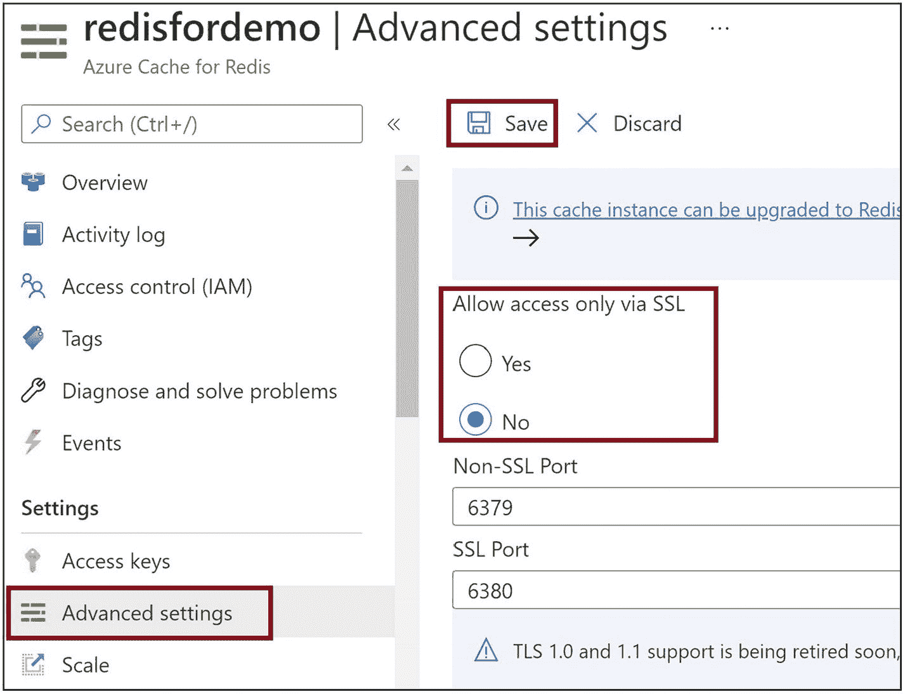

Redis 演示缓存的高级设置窗口截图。从左侧面板中，“高级设置”选项卡被高亮显示。在右侧，“仅通过 SSL 访问”被拒绝，并且设置已保存。

图 5-16

允许 Azure Redis 缓存的非 SSL 访问

部署完成后，浏览 `hello` API 的应用程序 URL，你可以在响应中看到存储在 Azure Redis 缓存中的值，如图 5-17 所示。

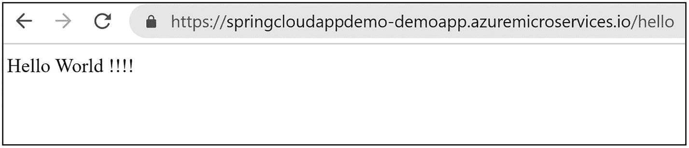

应用程序运行时窗口的截图。搜索选项卡包含 URL：https://spring-cloud-app-demo-demo-app.azuremicroservices.io/hello。屏幕上的输出显示：Hello World!!!!。

图 5-17

浏览在 Azure Spring Cloud 上运行的应用程序

## 总结

在本章中，我们学习了 Azure Spring Cloud 的详细信息。我们学习了如何使用服务绑定将其他 Azure 服务与在 Azure Spring Cloud 上运行的应用程序集成，并探讨了如何使用 Maven 命令将应用程序 JAR 部署到 Azure Spring Cloud。然后，我们开发了一个 Java Spring Boot 应用程序，并将其部署在 Azure Spring Cloud 上。在下一章中，我们将学习如何从 Java 应用程序以编程方式使用 Azure 存储。

以下是本章的关键要点：

*   Azure Spring Cloud 帮助你在 Azure 上托管 Spring Boot 应用程序，而无需更改代码。

*   它可以托管 Java 和 .NET Core 应用程序。

*   它最适合运行基于微服务的应用程序。

*   你需要专注于构建应用程序。底层平台将处理托管需求。你需要预配 Azure Spring Cloud 服务并将应用程序部署到其上。

*   使用服务绑定，你可以与其他 Azure 服务集成，而无需更改代码。

