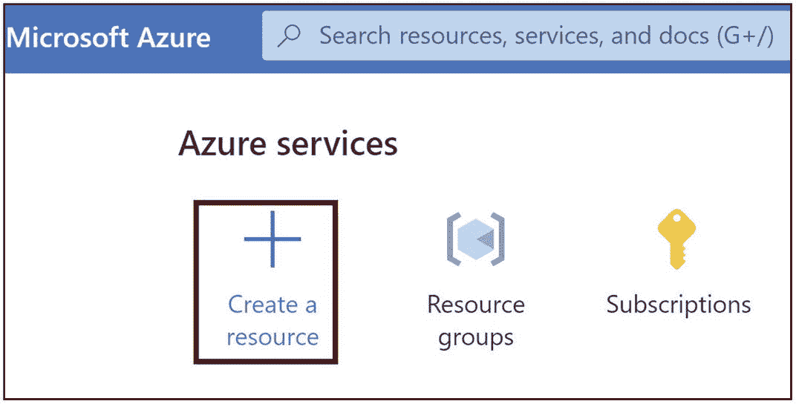
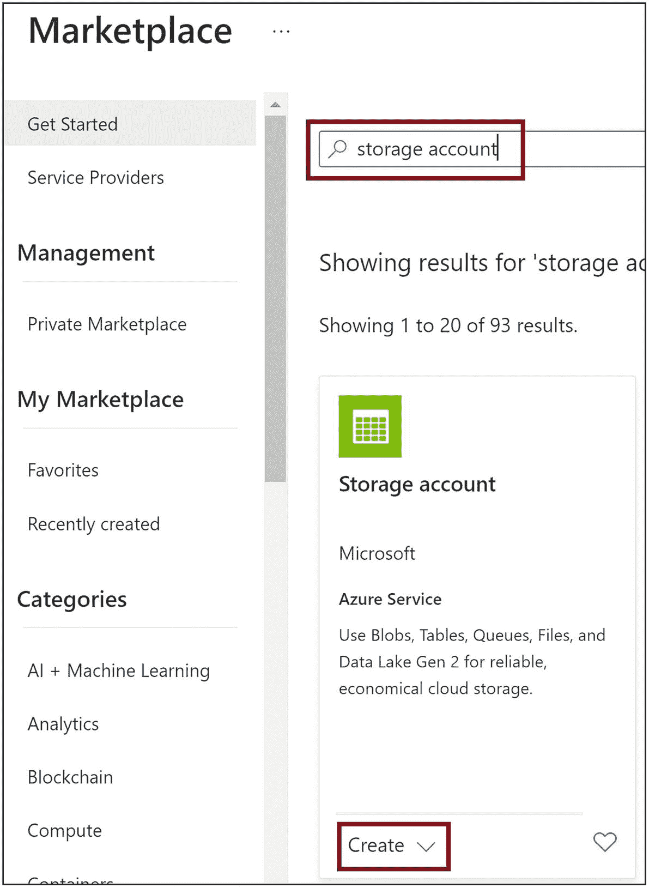
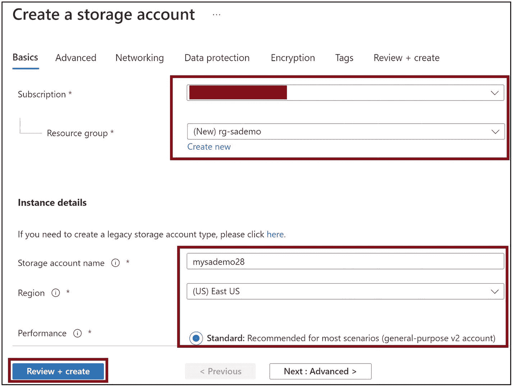
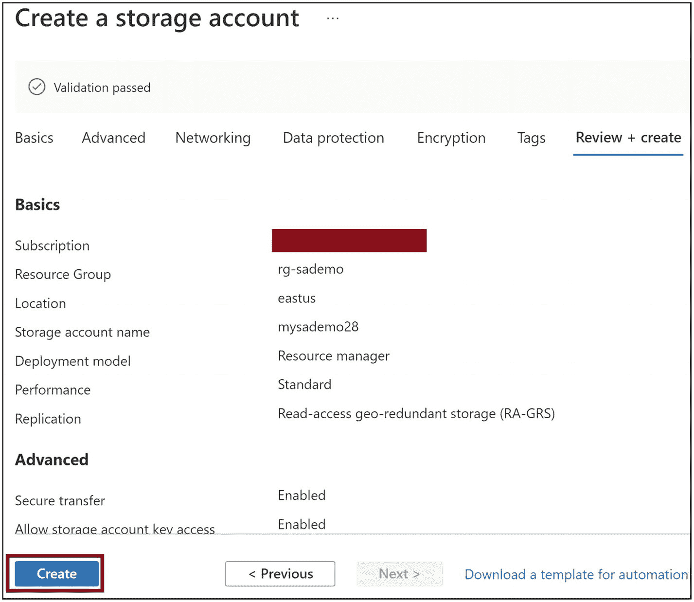
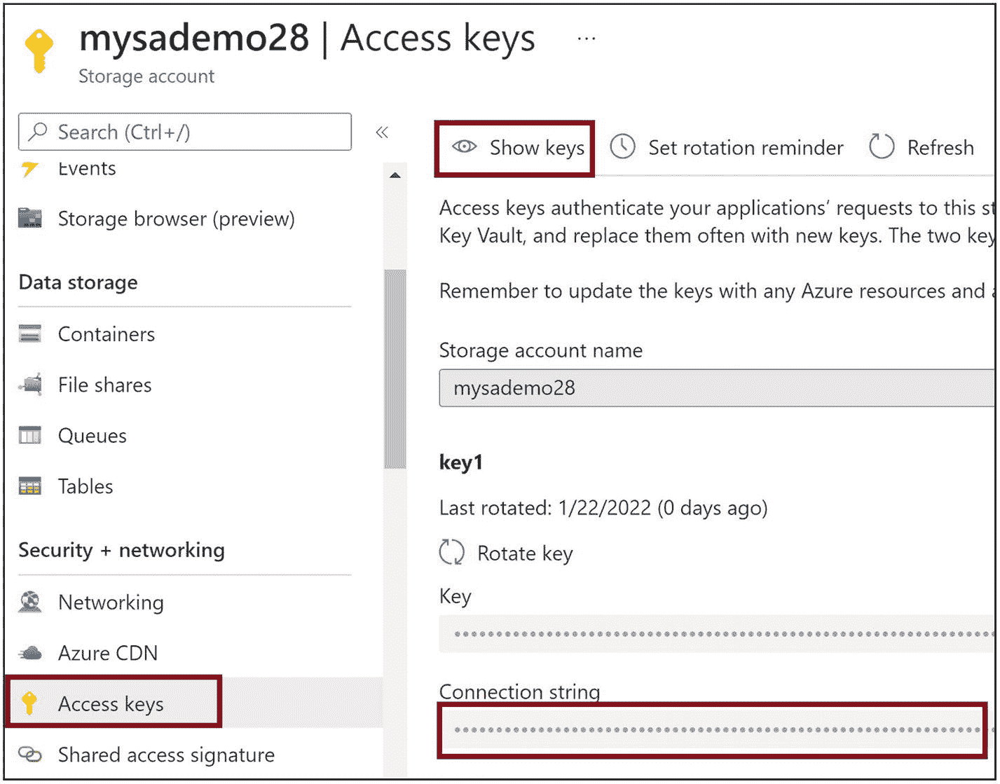
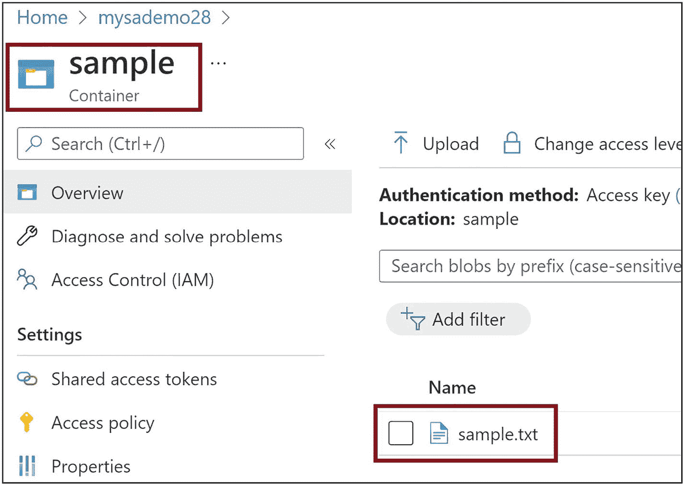
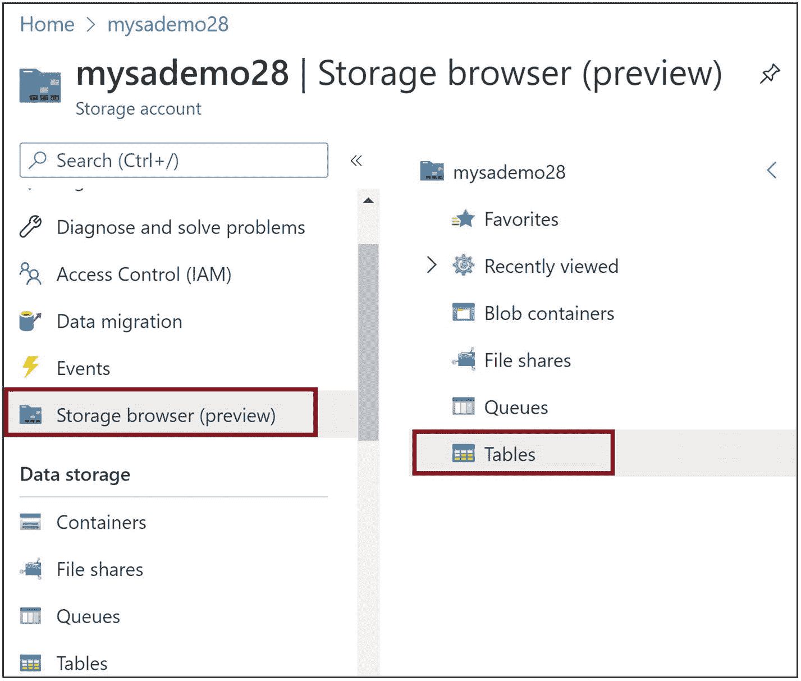
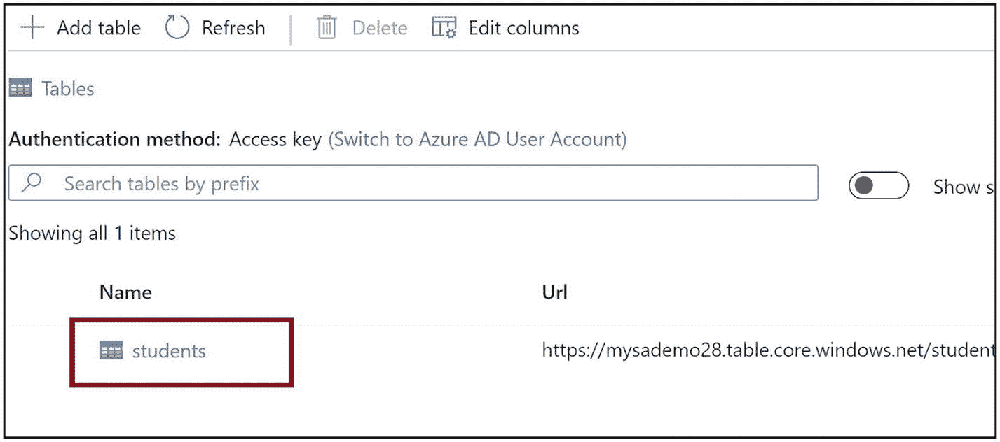
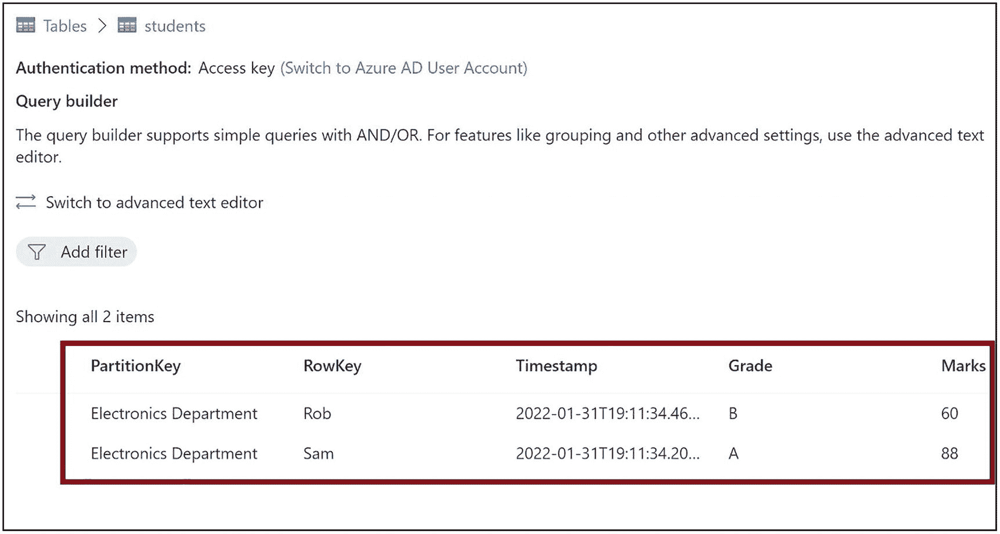

# 6. 与 Azure 存储帐户集成

你可能需要为应用程序在 Azure 中存储图像、文件和其他二进制大型对象数据。你可能还需要为应用程序实现基于队列的数据结构或半结构化表数据。对于所有这些需求，你都可以使用 Azure 存储。Microsoft 提供了可在 Java 应用程序代码中使用的包，以便与你的存储帐户进行交互。

在上一章中，我们学习了 Azure Spring Cloud 的基础知识。然后，我们创建了一个基于 Java 的应用程序，并将其托管在 Azure Spring Cloud 上。在本章中，我们将学习 Azure 存储服务的详细信息，然后我们将预配 Azure 存储，并从 Java 应用程序代码中使用 Azure 存储。

## 结构

在本章中，我们将讨论 Azure 存储服务的以下方面：

*   Azure 存储简介

*   创建 Azure 存储帐户

*   使用 Azure 存储 Blob

*   使用 Azure 存储队列

*   使用 Azure 存储表

## 目标

学习完本章后，你应该能够做到以下几点：

*   理解 Azure 存储服务的概念

*   从 Java 应用程序中使用 Azure 存储服务


## Azure 存储简介

Azure 存储是一种平台即服务（PaaS）产品，可将图像、文件和其他数据对象以 Blob 的形式存储。它提供了一个基于 SMB 的文件系统来存储文件，同时也支持 NFS，为你提供基于队列的消息数据存储，并帮助你在 Azure 环境中存储 NoSQL 表数据。它具有高可扩展性、高可用性和高安全性。以下是 Azure 存储提供的服务：

*   *Azure 容器（Blob）* 帮助你存储图像、视频、文件和其他二进制大型对象数据。你可以保存虚拟机磁盘等大型非结构化数据。

*   *Azure 文件* 提供托管的文件共享，用于保存你的文件，并可通过 SMB、NFS 或 HTTP 协议进行访问。

*   *Azure 队列* 为你的应用程序提供基于队列的消息存储。

*   *Azure 表* 帮助你存储半结构化的 NoSQL 数据。

数据复制是云上数据存储的一个重要设计方面。此机制可帮助你在灾难或中断期间恢复数据，并保持业务持续运行。Azure 存储支持以下数据复制或冗余机制：

*   *本地冗余存储 (LRS)* 帮助你在同一数据中心内存储数据的三个副本。如果该数据中心发生故障，你将无法访问数据。

*   *区域冗余存储 (ZRS)* 将数据的三个副本存储在同一区域内物理上分离的不同数据中心或存储集群中。如果一个数据中心发生故障，你仍然可以访问存储在其他数据中心的数据。但是，如果发生区域范围的中断，你将无法访问数据。

*   *异地冗余存储 (GRS)* 在主区域将数据复制三次，然后将所有复制的数据集复制到辅助区域。如果主区域发生故障，你可以从辅助区域访问数据。

*   *读取访问异地冗余存储 (RA-GRS)* 与异地冗余存储相同。但是，辅助区域中的数据是只读的。

你可以选择标准层或高级层来将数据存储在 Azure 存储上。标准层将你的数据存储在标准硬盘上，而高级层将你的数据存储在 SSD 磁盘上。高级层的性能优于标准层。以下是 Azure 上可用的存储帐户类型：

*   *通用 V1* 帐户是旧版存储服务帐户，支持 Blob、文件、队列和表服务。它仅支持标准层以及除 ZRS 之外的所有复制选项。

*   *通用 V2* 帐户支持 Blob、文件、队列和表服务。它支持标准层和高级层以及所有复制选项。

*   *Blob 存储* 帮助你存储块 Blob 和追加 Blob。它仅支持标准层以及除 ZRS 之外的所有复制选项。

*   *文件存储* 为你提供文件服务。它支持高级层以及 LRS 和 ZRS 复制选项。

*   *块 Blob* 帮助你存储块 Blob 和追加 Blob。它支持高级层以及 LRS 和 ZRS 复制选项。

注意

块 Blob 存储二进制和文本数据。页 Blob 帮助你存储大型文件，例如虚拟硬盘。追加 Blob 与块 Blob 相同，但追加操作的性能更高。

## 创建 Azure 存储帐户

让我们创建一个 Azure 存储帐户。转到图 6-1 所示的 Azure 门户，然后单击 *创建资源*。你将进入市场，如图 6-2 所示。



Microsoft Azure 网页的屏幕截图。顶部面板上有一个搜索框。屏幕显示 Azure 服务，其中包括以下选项及其图标。创建资源、资源组和订阅。创建资源被突出显示。

图 6-1

创建资源

在市场内搜索 *存储帐户*，如图 6-2 所示。然后单击 *创建*。



标题为“市场”的网页屏幕截图。左侧面板包含以下选项卡。入门、服务提供商、我的市场、管理 和 类别。突出显示的“入门”选项卡在右侧打开以下详细信息。顶部突出显示的搜索栏显示“存储帐户”。底部突出显示的“创建”选项卡。

图 6-2

搜索存储帐户

你现在将进入“创建存储帐户”对话框，如图 6-3 所示。提供订阅详细信息、资源组名称、存储帐户名称、区域和性能层，然后单击 *查看 + 创建*。



标题为“创建存储帐户”的网页屏幕截图。“基本信息”选项卡打开以下数据。订阅和资源组对应的空白字段被突出显示。保险详细信息：帐户名称、区域和性能对应的空白字段被突出显示。左下角的“查看 + 创建”选项卡被突出显示。

图 6-3

提供存储帐户基本详细信息

单击 *创建*，如图 6-4 所示。这将启动存储帐户。



标题为“创建存储帐户”的网页屏幕截图。验证已通过。“查看 + 创建”选项卡打开以下数据。基本信息：订阅、资源组、位置、帐户名称、性能和复制。高级：安全传输和允许存储帐户密钥访问。左下角的“创建”选项卡被突出显示。

图 6-4

创建存储帐户


## 使用 Azure 存储 Blob

让我们使用你喜欢的 Java 编辑器创建一个基于 Maven 的 Java 控制台应用程序，并实现创建 Blob 容器、在容器内创建 Blob，然后读取我们在容器内创建的 Blob 的逻辑。

将清单 6-1 中所示的包依赖项添加到 Java 应用程序的 POM 文件中。

```
com.azure
azure-storage-blob
12.13.0

清单 6-1
存储帐户包依赖项
```

转到 Azure 门户中的存储帐户，在“访问密钥”部分获取存储帐户的连接字符串，如图 6-5 所示。



网页标题为“访问密钥”的屏幕截图。左侧面板包含以下选项：搜索栏、存储浏览器、数据存储以及安全 + 网络。安全下的“访问密钥”选项被高亮显示。右侧，名为“显示密钥”的高亮选项卡提供了存储帐户名称、密钥和连接字符串。

图 6-5

获取访问密钥

现在转到 Java 类的 main 方法，并添加以下代码来创建一个 Blob 容器。你需要创建一个 *BlobServiceClient* 对象来帮助你处理存储帐户中的 Blob 容器。你需要使用 *listBlobContainers* 函数列出所有可用的容器，并检查你的容器是否存在。如果容器不存在，则使用 *createBlobContainer* 函数创建容器；否则，使用 *getBlobContainerClient* 函数获取对现有容器的引用。

```
String connectionString = "{提供你的连接字符串}";
String containerName = "sample";
// 从连接字符串构建 BlobServiceClient
BlobServiceClient blobClient = new BlobServiceClientBuilder().connectionString(connectionString).buildClient();
// 检查容器是否存在
// 列出所有容器，然后检查容器是否已存在
var existingContainers = blobClient.listBlobContainers();
Boolean containerExists = false;
for(BlobContainerItem containerItem : existingContainers)
{
if(containerItem.getName().equalsIgnoreCase(containerName)) {
containerExists = true;
}
}
// 如果容器不存在，则创建容器
// 如果容器存在，则获取对现有容器的引用
BlobContainerClient container;
if(!containerExists) {
// 创建容器
container = blobClient.createBlobContainer(containerName);
}
else {
// 获取对现有容器的引用
container = blobClient.getBlobContainerClient(containerName);
}
清单 6-2
创建一个容器
```

现在让我们在容器内创建一个包含一些数据的 Blob。使用 *getBlobClient* 函数为你计划上传的 Blob 创建一个引用，然后使用 upload 方法*上传*内容为 *Hello Blob !!!!* 的 Blob。代码如清单 6-3 所示。

```
//在容器内创建一个 Blob
String blobName = "sample.txt";
BlobClient blob = container.getBlobClient(blobName);
String data = "Hello Blob !!!!";
InputStream dataStream = new ByteArrayInputStream(data.getBytes(StandardCharsets.UTF_8));
blob.upload(dataStream,data.length(),true);
清单 6-3
在容器内创建一个 Blob
```

现在让我们遍历容器中的所有 Blob 并获取每个 Blob 中的数据。使用 *listBlobs* 函数获取容器内的所有 Blob。遍历所有 Blob，并使用 *getBlobClient* 函数引用该 Blob。使用 *download* 函数将 Blob 获取到输出流中，如清单 6-4 所示。

```
// 读取容器中的所有 Blob
var blobs = container.listBlobs();
// 遍历容器中的每个 Blob
for(BlobItem blobItem : blobs){
// 获取 Blob 名称
System.out.println("Blob 名称 : "+blobItem.getName());
// 读取 Blob 数据
BlobClient blobRead = container.getBlobClient(blobItem.getName());
int blobSize = (int) blobRead.getProperties().getBlobSize();
ByteArrayOutputStream outputStream = new ByteArrayOutputStream(blobSize);
blobRead.download(outputStream);
System.out.println("Blob 数据 : "+outputStream.toString());
}
清单 6-4
列出所有 Blob 并读取 Blob
```

清单 6-5 是对 Blob 容器执行操作的完整代码。

```
import com.azure.storage.blob.*;
import com.azure.storage.blob.models.*;
import java.io.*;
import java.nio.charset.StandardCharsets;
public class BlobDemo {
public static void main(String args[])
{
String connectionString = "{提供连接字符串}";
// 从连接字符串构建 BlobServiceClient
BlobServiceClient blobClient = new BlobServiceClientBuilder().connectionString(connectionString).buildClient();
// 检查容器是否存在
// 列出所有容器，然后检查容器是否已存在
var existingContainers = blobClient.listBlobContainers();
Boolean containerExists = false;
for(BlobContainerItem containerItem : existingContainers)
{
if(containerItem.getName().equalsIgnoreCase(containerName)) {
containerExists = true;
}
}
//如果容器不存在，则创建容器
// 如果容器存在，则获取对现有容器的引用
BlobContainerClient container;
if(!containerExists) {
// 创建容器
container = blobClient.createBlobContainer(containerName);
}
else {
// 获取对现有容器的引用
container = blobClient.getBlobContainerClient(containerName);
}
//在容器内创建一个 Blob
String blobName = "sample.txt";
BlobClient blob = container.getBlobClient(blobName);
String data = "Hello Blob !!!!";
InputStream dataStream = new ByteArrayInputStream(data.getBytes(StandardCharsets.UTF_8));
blob.upload(dataStream,data.length(),true);
// 读取容器中的所有 Blob
var blobs = container.listBlobs();
// 遍历容器中的每个 Blob
for(BlobItem blobItem : blobs){
// 获取 Blob 名称
System.out.println("Blob 名称 : "+blobItem.getName());
// 读取 Blob 数据
BlobClient blobRead = container.getBlobClient(blobItem.getName());
int blobSize = (int) blobRead.getProperties().getBlobSize();
ByteArrayOutputStream outputStream = new ByteArrayOutputStream(blobSize);
blobRead.download(outputStream);
System.out.println("Blob 数据 : "+outputStream.toString());
}
}
}
清单 6-5
使用 Blob 容器
```

执行项目后，你还可以在 Azure 门户中看到创建的容器和 Blob，如图 6-6 所示。



网页标题为“sample”的屏幕截图。左侧面板包含以下选项：搜索栏、概述、访问控制和设置。“概述”选项被高亮显示。右侧的详细信息包括身份验证方法、位置、按前缀搜索 Blob 以及名称。名称下附着的“sample.txt”被高亮显示。

图 6-6

已创建的容器和 Blob


## 使用 Azure 存储队列

让我们使用你喜欢的 Java 编辑器创建一个基于 Maven 的 Java 控制台应用程序，并实现创建存储队列、向队列发送消息以及从队列读取消息的逻辑。

清单 6-6 展示了一个包依赖项。将该依赖项添加到你的 Java 应用程序的 POM 文件中。

```
com.azure
azure-storage-queue
12.0.1

清单 6-6
将包依赖项添加到 POM 文件
```

我们已经从 Azure 门户复制了连接字符串。让我们进入 main 方法并添加以下代码来创建队列。我们将获取 *QueueClient* 对象，并使用 *create* 函数创建一个队列，如清单 6-7 所示。

```
String queueName = "sample-queue";
String connectionString = "{提供连接字符串}";
// 获取 QueueClient 的引用
QueueClient queueClient = new QueueClientBuilder().connectionString(connectionString).queueName(queueName).buildClient();
// 创建队列
queueClient.create();
清单 6-7
创建一个队列
```

我们使用 *sendMessage* 函数向队列添加消息，如清单 6-8 所示。

```
// 向队列添加消息
queueClient.sendMessage("我的消息已添加");
queueClient.sendMessage("我的消息已添加 01");
queueClient.sendMessage("我的消息已添加 02");
queueClient.sendMessage("我的消息已添加 04");
清单 6-8
向队列添加消息
```

我们使用 *peekMessage* 函数从队列中读取第一条消息，如清单 6-9 所示。

```
// 从队列中查看消息
var message = queueClient.peekMessage();
System.out.println("查看队列中的第一条消息："+message.getMessageText());
清单 6-9
从队列中查看消息
```

我们使用 *receiveMessages* 函数从队列中读取所有消息并删除已读取的消息，如清单 6-10 所示。

```
// 从队列中获取所有消息并将其从队列中移除
var messages = queueClient.receiveMessages(queueClient.getProperties().getApproximateMessagesCount());
for(QueueMessageItem msg:messages){
System.out.println("已添加的消息："+msg.getMessageText());
}
清单 6-10
从队列中读取所有消息
```

清单 6-11 展示了执行队列操作的完整代码。你可以检查已添加到存储队列中的项目。转到 Azure 门户中的存储帐户，点击 *存储浏览器*，然后点击 *队列*。

```
import com.azure.storage.queue.*;
import com.azure.storage.queue.models.*;
import java.io.*;
import java.nio.charset.StandardCharsets;
public class QueueDemo {
public static void main(String args[])
{
String queueName = "sample-queue";
String connectionString = "{提供连接字符串}";
// 获取 QueueClient 的引用
QueueClient queueClient = new QueueClientBuilder().connectionString(connectionString).queueName(queueName).buildClient();
// 创建队列
queueClient.create();
// 向队列添加消息
queueClient.sendMessage("我的消息已添加");
queueClient.sendMessage("我的消息已添加 01");
queueClient.sendMessage("我的消息已添加 02");
queueClient.sendMessage("我的消息已添加 04");
// 从队列中查看消息
var message = queueClient.peekMessage();
System.out.println("查看队列中的第一条消息："+message.getMessageText());
// 从队列中获取所有消息并将其从队列中移除
var messages = queueClient.receiveMessages(queueClient.getProperties().getApproximateMessagesCount());
for(QueueMessageItem msg:messages){
System.out.println("已添加的消息："+msg.getMessageText());
}
}
}
清单 6-11
使用存储队列
```

## 使用表存储

现在让我们使用表存储。我们将创建一个表，向其中添加一条记录，然后从表中检索该记录。表存储使用分区键和行键来存储数据。分区键帮助你将数据分布到多个分区。例如，如果你正在存储地理数据，你可以使用国家名称作为分区键。你可以将特定国家的数据存储在以国家名称作为分区键的分区中。行键是你在分区中存储数据的主键。

让我们在 POM 文件中添加以下包依赖项，如清单 6-12 所示。

```
com.azure
azure-data-tables
12.1.5

清单 6-12
添加依赖项
```

我们已经从 Azure 门户复制了连接字符串。让我们进入 main 方法并添加以下代码来创建表。我们将获取 *TableServiceClient* 对象，并使用 *createTableIfNotExists* 函数创建一个队列，如清单 6-13 所示。该表仅在其不存在时才会被创建。

```
String tableName="students";
String connectionString="{提供连接字符串}";
// 创建表
TableServiceClient tableServiceClient = new TableServiceClientBuilder()
.connectionString(connectionString)
.buildClient();
TableClient tableClient = tableServiceClient.createTableIfNotExists(tableName);
清单 6-13
创建表
```

我们使用数据的行键和分区键创建了 *TableEntity* 对象。然后，我们用需要插入到表中的数据填充了 *TableEntity* 对象的属性，如清单 6-14 所示。

```
// 向表添加记录
String partitionKey="电子工程系";
String rowKey="Sam";
TableEntity entity = new TableEntity(partitionKey, rowKey)
.addProperty("年龄", 22)
.addProperty("等级", "A")
.addProperty("分数", 88);
tableClient.createEntity(entity);
// 向表添加另一条记录
tableClient = tableServiceClient.getTableClient(tableName);
rowKey = "Rob";
entity = new TableEntity(partitionKey, rowKey)
.addProperty("年龄", 24)
.addProperty("等级", "B")
.addProperty("分数", 60);
tableClient.createEntity(entity);
清单 6-14
向表添加记录
```

我们可以形成一个筛选查询并获取存储在表中的数据，如清单 6-15 所示。*listEntities* 函数从表中获取数据。

```
// 检索表中的记录
tableClient = tableServiceClient.getTableClient(tableName);
String filterQuery = "PartitionKey eq '电子工程系'";
ListEntitiesOptions options = new ListEntitiesOptions().setFilter(filterQuery);
// 遍历结果集并显示。
tableClient.listEntities(options, null, null).forEach(tableEntity -> {
System.out.println(tableEntity.getPartitionKey() +
" " + tableEntity.getRowKey() +
"\t" + tableEntity.getProperty("年龄") +
"\t" + tableEntity.getProperty("等级") +
"\t" + tableEntity.getProperty("分数"));
});
清单 6-15
从表中检索记录
```

清单 6-16 展示了表操作的完整代码。


```
import com.azure.data.tables.*;
import com.azure.data.tables.models.*;
import java.io.*;
import java.nio.charset.StandardCharsets;
public class TableDemo {
public static void main(String args[])
{
String tableName="students";
String connectionString="{Provide Connection String}";
// 创建表
TableServiceClient tableServiceClient = new   TableServiceClientBuilder()
.connectionString(connectionString)
.buildClient();
TableClient tableClient = tableServiceClient.createTableIfNotExists(tableName);
// 向表中添加记录
String partitionKey="Electronics Department";
String rowKey="Sam";
TableEntity entity = new TableEntity(partitionKey, rowKey)
.addProperty("Age", 22)
.addProperty("Grade", "A")
.addProperty("Marks", 88);
tableClient.createEntity(entity);
// 向表中添加另一条记录
tableClient = tableServiceClient.getTableClient(tableName);
rowKey = "Rob";
entity = new TableEntity(partitionKey, rowKey)
.addProperty("Age", 24)
.addProperty("Grade", "B")
.addProperty("Marks", 60);
tableClient.createEntity(entity);
// 检索表中的记录
tableClient = tableServiceClient.getTableClient(tableName);
String filterQuery = "PartitionKey eq 'Electronics Department'";
ListEntitiesOptions options = new ListEntitiesOptions().setFilter(filterQuery);
// 遍历结果集并显示。
tableClient.listEntities(options, null, null).forEach(tableEntity -> {
System.out.println(tableEntity.getPartitionKey() +
" " + tableEntity.getRowKey() +
"\t" + tableEntity.getProperty("Age") +
"\t" + tableEntity.getProperty("Grade") +
"\t" + tableEntity.getProperty("Marks"));
});
}
}
清单 6-16
表操作
```

让我们检查一下添加到存储账户中的表。转到 Azure 门户中的存储账户，点击 *Storage browser*（存储浏览器），然后点击 *Tables*（表），如图 6-7 所示。



网页标题为“存储浏览器，预览”的屏幕截图。左侧面板包含以下选项：搜索栏、访问控制、高亮显示的存储浏览器预览以及数据存储。右侧“我的演示 28”下的选项包括收藏夹、最近查看和 Blob 容器。最后一个名为“表”的选项被高亮显示。

图 6-7

转到存储浏览器

你可以看到我们创建的表，如图 6-8 所示。



网页标题为“表”的屏幕截图。顶部面板包含以下选项：添加表、刷新和编辑列。页面上的其他详细信息包括身份验证方法：访问密钥、搜索栏、名称和 URL。名称中包含一个名为“students”的附件文件。该文件被高亮显示。

图 6-8

点击我们创建的表

点击我们创建的表。你可以看到我们在表中添加的数据，如图 6-9 所示。



名为“students”的文件中数据的屏幕截图。包含以下详细信息：身份验证方法、查询生成器以及切换到高级文本编辑器。底部高亮显示的表格有 5 列，标题为分区键、行键、时间戳、年级和分数。它显示了电子工程系中 Rob 和 Sam 的数据。

图 6-9

添加到表中的数据

## 总结

在本章中，我们学习了 Azure 存储的详细信息，并探讨了 Blob、队列、表和文件的概念。我们学习了如何使用 Azure 门户创建 Azure 存储。然后，我们开发了一个 Java 代码，并对队列、表和 Blob 执行了操作。在下一章中，我们将学习如何从 Java 应用程序以编程方式使用 Azure SQL 数据库。

以下是本章的关键要点：

*   Azure 容器（Blob）可帮助你存储图像、视频、文件和其他二进制大型对象数据。

*   Azure 文件提供托管的文件共享，用于保存文件，并可通过 SMB、NFS 或 HTTP 协议进行访问。

*   Azure 队列为你的应用程序提供基于队列的消息存储。

*   Azure 表可帮助你存储半结构化的 NoSQL 数据。

*   Azure 存储是一种平台即服务产品，可将图像、文件和其他数据对象存储为 Blob。它提供基于 SMB 的文件系统来存储文件，为你提供基于队列的消息数据存储，并帮助你在 Azure 环境中存储 NoSQL 表数据。

