# 7.  Java 应用程序中的 Azure SQL

应用程序使用关系数据库来存储数据。我们需要设置一个关系数据库服务器，并将应用程序数据库托管在该服务器上。Azure 提供了一个 SQL 数据库，它是一种平台即服务产品。你无需购买任何服务器基础设施或在云上创建虚拟机来安装 SQL 服务器。相反，你需要在 Azure 上预配 SQL 数据库服务并开始使用该数据库。当你不再需要该数据库时，可以停用该服务。

在上一章中，我们学习了 Azure 存储服务的概念。然后，我们创建了一个基于 Java 的应用程序，并使用了 Azure 存储服务。在本章中，我们将学习 Azure SQL 数据库服务的详细信息，然后我们将预配 Azure SQL 数据库，并从 Java 应用程序代码中使用 Azure SQL 数据库。

## 结构

在本章中，我们将讨论 Azure 存储服务的以下方面：

*   Azure SQL 数据库简介

*   创建 Azure SQL 数据库

*   使用 Azure SQL 数据库

*   保护 Azure 数据库

## 目标

学习本章后，你应该能够获得以下知识：

*   理解 Azure SQL 数据库的概念

*   从 Java 应用程序使用 Azure SQL 数据库


## Azure SQL 数据库简介

Azure 提供 Microsoft SQL、MySQL、PostgreSQL 和 MariaDB 等关系型数据库，作为平台即服务（Platform-as-a-Service）产品。Azure 平台管理这些数据库的底层服务器基础设施。您可以在几分钟内创建这些数据库并开始使用。这些数据库中存储的数据具有高度可扩展性、安全性和可用性。您可以根据计算需求和期望的性能级别来配置数据库。

底层 Azure 平台管理所有数据库活动，如备份、修补和升级。Azure SQL 数据库始终运行在 Microsoft SQL Server 引擎的最新稳定版本上。每当有新稳定版本可用时，底层平台会自动更新 SQL 数据库引擎，无需人工干预。它具有高可用性，可提供 99.99% 的可用性。

您可以选择部署一个由底层 Azure 平台完全管理的单一数据库，该数据库保证与其他数据库隔离；或者选择在弹性池中运行多个单一数据库，共享 CPU 和内存等计算资源。您可以使用基于 vCore 的购买模型来配置 SQL 数据库，根据需求预留内存量、vCore 数量和存储速度。您也可以为 SQL 数据库选择基于 DTU 的购买模型，根据需求选择 DTU 数量。Azure SQL 还提供无服务器购买模型。您只需在 SQL 数据库被使用且存在数据库事务时才需要付费。对于无服务器数据库，当没有事务时，数据库会进入空闲状态，并在有数据库事务时唤醒。

注意

DTU 代表数据库事务单位（Database Transaction Unit），是一个基于 CPU、内存和数据 I/O 性能规格组合的数字。

Azure SQL 数据库不支持 Microsoft SQL Server 的某些功能，如链接服务器、SQL 代理、SQL 数据同步、SQL 审计、Service Broker 等。如果您正在使用这些功能，将本地 SQL Server 数据库直接迁移到 Azure 可能会面临挑战。但是，在这种情况下，您可以使用 Azure SQL 托管实例，它支持 Azure 上几乎所有本地 SQL Server 企业版的功能。Azure SQL 托管实例也是 Azure 上的一种平台即服务关系型数据库产品。您可以使用 Azure SQL 托管实例获得原生虚拟网络集成，这是 Azure SQL 数据库所不支持的。然而，SQL Server Analysis Services (SSAS) 和 SQL Server Reporting Services (SSRS) 等功能不受 Azure SQL 托管实例和 Azure SQL 数据库支持。

## 创建 Azure SQL 数据库

让我们使用 Azure 门户创建一个 Azure SQL 数据库，如图 7-1 所示。转到 Azure 门户，点击 *创建资源*。我们将在数据库中创建一个表，并从 Java Spring Boot 应用程序连接到该表。

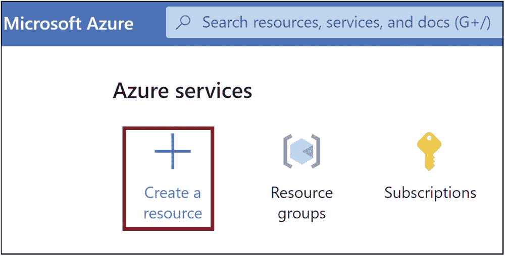

Microsoft Azure 的屏幕截图。标题“Azure 服务”下的三个选项是：创建资源、资源组和订阅。其中“创建资源”选项被高亮显示。顶部的搜索栏显示：搜索资源、服务和文档，G 加斜杠。

图 7-1

创建资源

您将被导航到 Azure 市场。点击 *数据库*，然后点击 *SQL 数据库*，如图 7-2 所示。

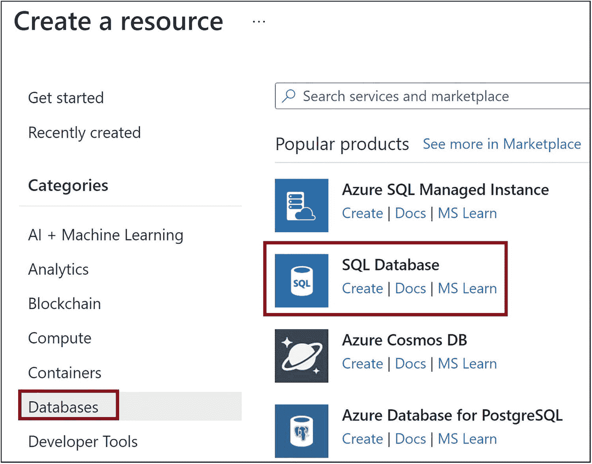

创建资源步骤的屏幕截图。步骤列为：入门、最近创建和类别。热门产品包括 Azure SQL 托管实例、SQL 数据库、Azure Cosmos DB 和 Azure Database for PostgreSQL。其中 SQL 数据库被高亮显示。类别下的“数据库”图标也被高亮显示。

图 7-2

点击 SQL 数据库

让我们提供订阅详细信息、资源组名称和数据库名称。我们需要创建一个数据库服务器，数据库将驻留在此服务器上。您可以选择重用现有数据库或创建新数据库。让我们创建一个新的。点击 *新建*，如图 7-3 所示。

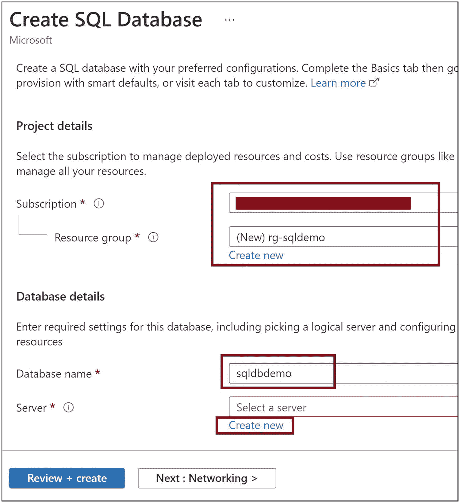

创建 SQL 数据库的屏幕截图。标题“项目详细信息”下的“订阅”和“资源组”空白列被高亮显示。标题“数据库详细信息”下的“数据库名称”和“服务器，新建”空白列被高亮显示。底部的按钮为“查看 + 创建”和“下一步：网络”。

图 7-3

提供基本信息

提供 SQL 服务器的名称和身份验证详细信息，然后点击 *确定*，如图 7-4 所示。您将被导航回“基本”选项卡。

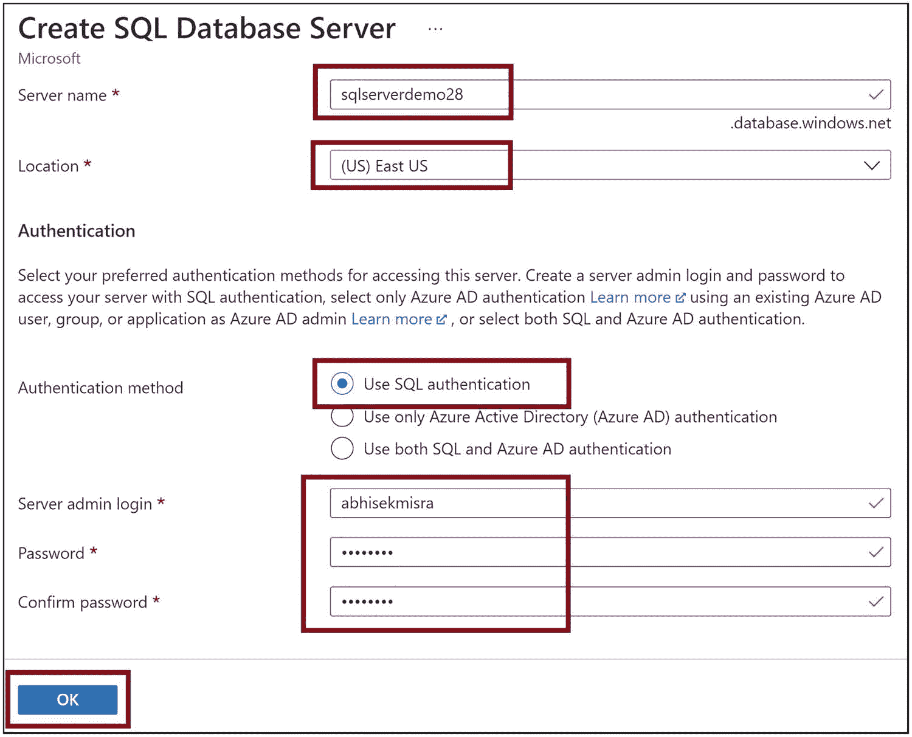

创建 SQL 数据库服务器步骤的屏幕截图。“服务器名称”和“位置”下拉列中的信息被高亮显示。同样，“身份验证方法”、“服务器管理员登录名”、“密码”和“确认密码”列中的信息也被高亮显示。底部的“确定”按钮也被高亮显示。

图 7-4

提供数据库凭据

向下滚动并根据您的需求选择正确的计算和存储要求。您将据此付费。点击 *下一步：网络* 以导航到网络选项卡，如图 7-5 所示。

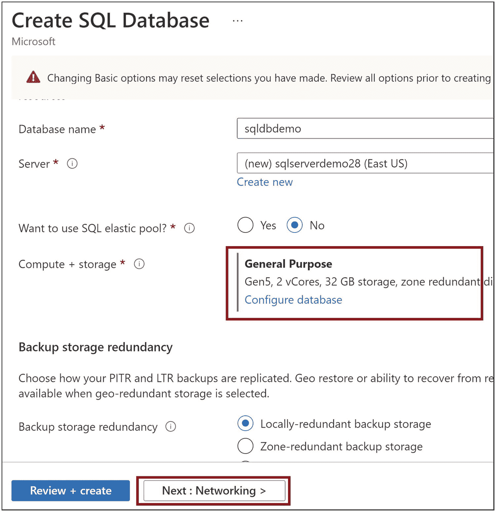

创建 SQL 数据库服务器步骤的屏幕截图。“服务器名称”和“位置”下拉列中的信息被高亮显示。同样，“身份验证方法”、“服务器管理员登录名”、“密码”和“确认密码”列中的信息也被高亮显示。底部的“确定”按钮也被高亮显示。

图 7-5

提供基本信息

在演示中，我们将通过公共互联网访问它。选择 *公共终结点*。将您笔记本电脑的 IP 地址添加到防火墙设置中，以便您可以从笔记本电脑上运行的代码访问数据库。点击 *查看 + 创建*，如图 7-6 所示。

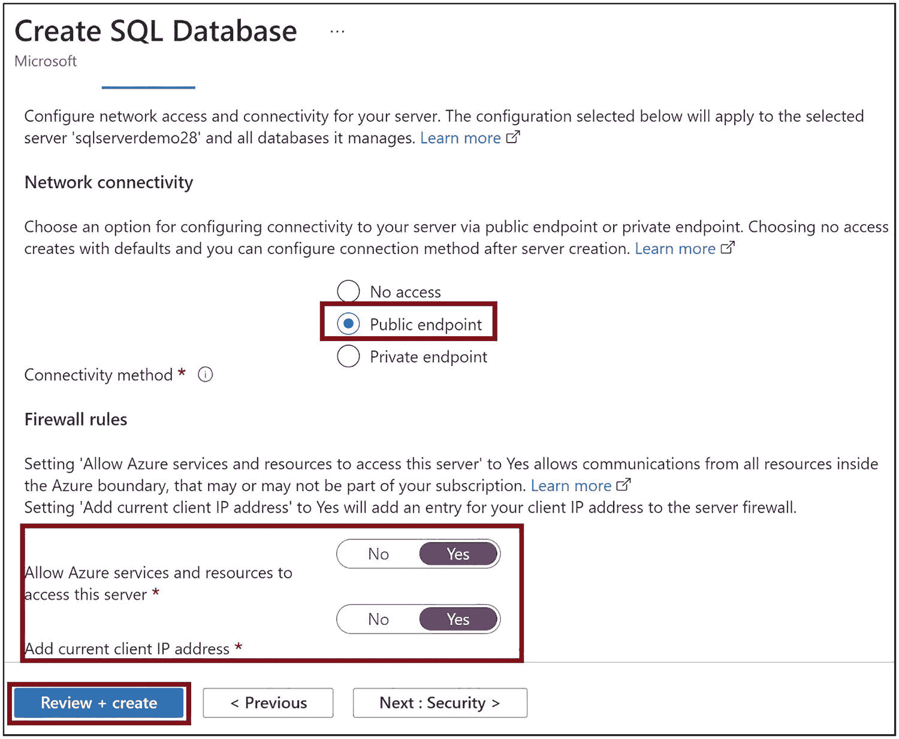

创建 SQL 数据库步骤的屏幕截图。“网络连接”下有 3 个选择按钮，包括“无访问权限”、“公共终结点”和“专用终结点”。选中的“公共终结点”按钮被高亮显示。有 2 条防火墙规则，包括“允许 Azure 服务和资源访问此服务器”和“客户端 IP 地址”。

图 7-6

点击查看 + 创建


检查配置后，点击*创建*，如图 7-7 所示。Azure SQL 数据库将被创建。

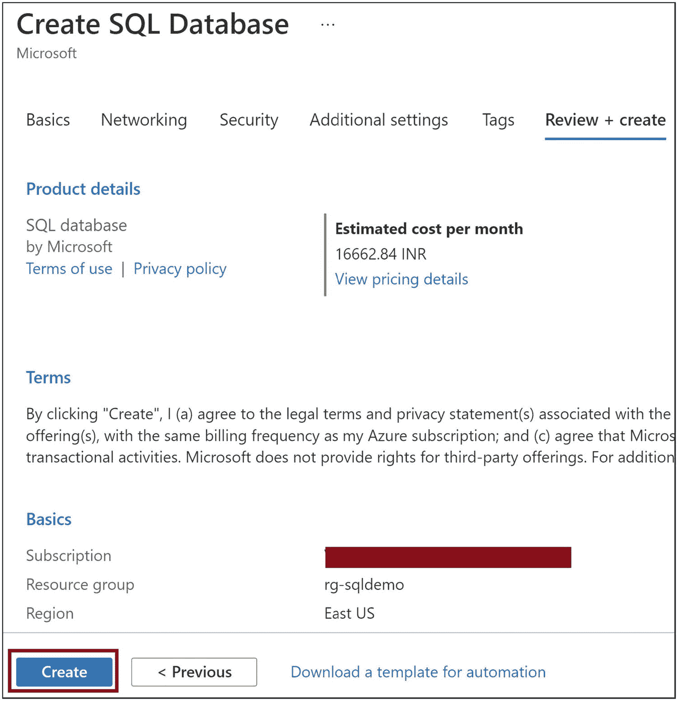

创建 SQL 数据库步骤的屏幕截图。顶部的选项卡列出了基本信息、网络、安全、其他设置、标签以及查看+创建。“查看+创建”选项卡包含产品详情（含每月预估费用）、条款以及基本信息（包括订阅、资源组和区域）。

图 7-7

点击创建

SQL 数据库创建完成后，在 Azure 门户中进入该 SQL 数据库，并点击*连接字符串*，如图 7-8 所示。复制*JDBC*的连接字符串。我们将在代码中使用它来连接数据库。

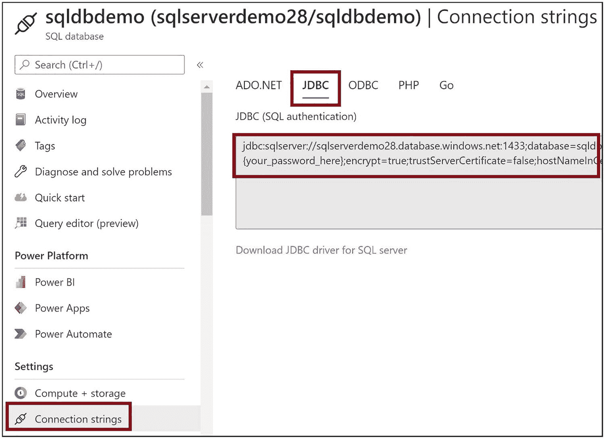

一个标题为 sqldbdemo, sqlserverdemo28/sqlbdemo 的连接字符串截图。顶部的选项卡列出了 ADO.NET、JDBC、ODBC、PHP 和 Go。JDBC 选项卡被高亮显示。左侧“设置”标题下的选项卡包括计算+存储和连接字符串。标题为“连接字符串”的选项卡被高亮显示。

图 7-8

转到连接字符串

Azure 门户提供了查询编辑器。点击*查询编辑器*，如图 7-9 所示，并提供数据库凭据。现在让我们创建一个名为*student*的表。

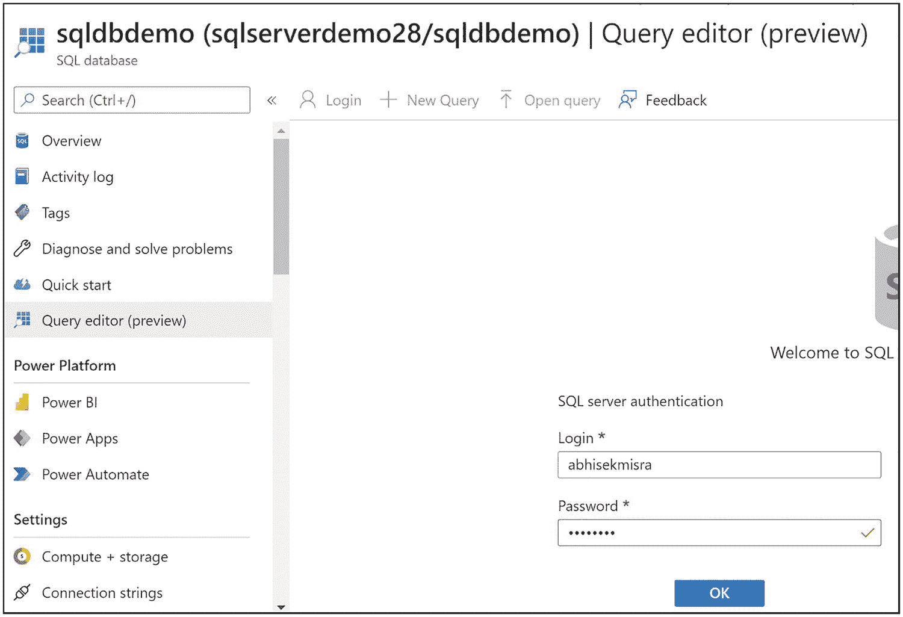

一个标题为 sqldbdemo, sqlserverdemo28/sqlbdemo 的 SQL 查询编辑器截图。顶部的选项卡是登录、新建查询、打开查询和反馈。反馈部分包括 SQL 服务器身份验证，要求输入登录名和密码。左侧的选项卡列出了活动日志、诊断并解决问题以及查询编辑器。

图 7-9

SQL 查询编辑器

在查询编辑器中执行清单 7-1 中的脚本，以创建 student 表。

```
create table student
(
roll int identity primary key,
name varchar(100),
age int,
marks int
)
清单 7-1
创建 student 表
```

## 使用 Azure SQL 数据库

让我们开发一个 Java Spring Boot 代码，该代码将向 student 表插入记录，并从 student 表中获取插入的数据。使用清单 7-2 中显示的 URL 访问 Spring Initializr 门户。

```
https://start.spring.io/
清单 7-2
Spring Initializr URL
```

提供 Maven 项目详细信息。确保选择 Java 11 作为运行时版本，如图 7-10 所示。

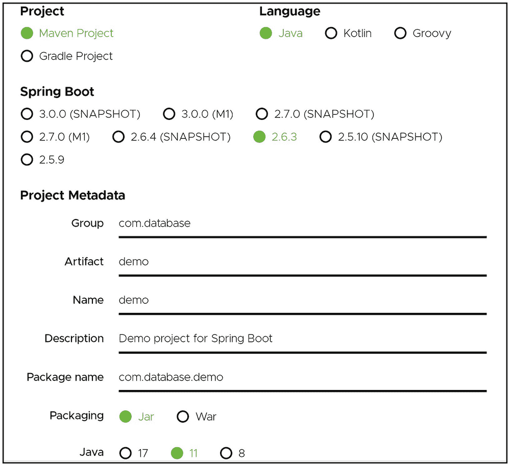

填写项目详细信息的选项截图。选项包括：项目（Maven 项目）、语言（Java）、Spring Boot（2.6.3）以及项目元数据。项目元数据列出了 Group、Artifact、名称、描述、包名、打包方式和 Java。打包方式为 Jar，Java 版本为 17。

图 7-10

提供项目详细信息

添加 Spring Web、Spring Data JDBC 和 MS SQL Server Driver 依赖项，如图 7-11 所示，并生成 Java Spring Boot 项目。

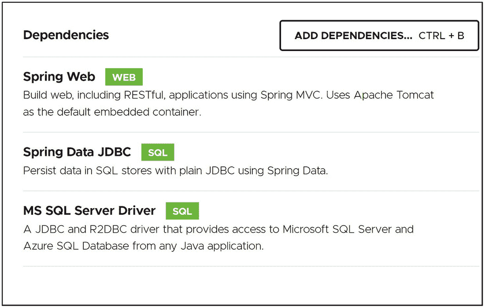

填写项目详细信息的选项截图。选项包括：项目（Maven 项目）、语言（Java）、Spring Boot（2.6.3）以及项目元数据。项目元数据列出了 Group、Artifact、名称、描述、包名、打包方式和 Java。打包方式为 Jar，Java 版本为 17。

图 7-11

添加依赖项

让我们在*DemoApplication*类所在的文件夹中创建一个*Student*类，如清单 7-3 所示。*Student*类作为*student*数据库表的领域模型。

```
package com.database.demo;
import org.springframework.data.annotation.Id;
public class Student {
public Student(){
}
public Student(String name, int age, int marks){
this.name = name;
this.age = age;
this.marks = marks;
}
@Id
private int roll;
private String name;
private int age;
private int marks;
private int getRoll()
{
return roll;
}
private void setRoll(int roll)
{
this.roll = roll;
}
public String getName() {
return name;
}
public void setName(String name) {
this.name = name;
}
public int getAge() {
return age;
}
public void setAge(int age) {
this.age = age;
}
public int getMarks() {
return marks;
}
public void setMarks(int marks) {
this.marks = marks;
}
}
清单 7-3
Student 类
```

现在，让我们在与*Student*类和*DemoApplication*类相同的文件夹中添加一个*StudentRepository*接口，如清单 7-4 所示。*StudentRepository*接口充当数据库和领域模型的仓库类。Spring Data JDBC 管理此仓库类。

```
package com.database.demo;
import org.springframework.data.repository.CrudRepository;
public interface StudentRepository extends CrudRepository {
}
清单 7-4
StudentRepository 类
```

转到*src/main/resources*文件夹中的*application.properties*文件，并添加数据库连接详细信息，如清单 7-5 所示。你可以从之前为数据库复制的连接字符串中获取连接详细信息。确保将*[database name]*替换为数据库名称，*[database server name]*替换为数据库服务器名称，*[username]*替换为你的数据库用户名，*[password]*替换为数据库密码。

```
logging.level.org.springframework.jdbc.core=DEBUG
spring.datasource.url=jdbc:sqlserver://[database server name].database.windows.net:1433;database=[database name];encrypt=true;trustServerCertificate=false;hostNameInCertificate=*.database.windows.net;loginTimeout=30;
spring.datasource.username=[username]@[database server name]
spring.datasource.password=[password]
spring.sql.init.mode=always
清单 7-5
Application.properties 文件
```


转到 *DemoApplication* Java 类，并使用 *RestController* 属性将其转换为一个 REST 控制器。添加 *createStudents* POST 方法，用于向 student 表插入一条 Student 记录，并添加一个 *getStudents* GET 方法，用于获取 *student* 表中的所有记录。代码见清单 7-6。

```
package com.database.demo;
import org.springframework.boot.SpringApplication;
import org.springframework.boot.autoconfigure.SpringBootApplication;
import org.springframework.http.HttpStatus;
import org.springframework.web.bind.annotation.*;
@SpringBootApplication
@RestController
@RequestMapping("/")
public class DemoApplication {
public static void main(String[] args) {
SpringApplication.run(DemoApplication.class, args);
}
private final StudentRepository studentRepository;
public DemoApplication(StudentRepository studentRepository) {
this.studentRepository = studentRepository;
}
@PostMapping("/")
@ResponseStatus(HttpStatus.CREATED)
public Student createStudents(@RequestBody Student student) {
return studentRepository.save(student);
}
@GetMapping("/")
public Iterable getStudents() {
return studentRepository.findAll();
}
}
清单 7-6
DemoApplication 类
```

运行应用程序。应用程序启动后，转到 Postman 工具并发送一个 POST 请求来插入一条记录。确保已添加 Content-Type 标头，如图 7-12 所示。

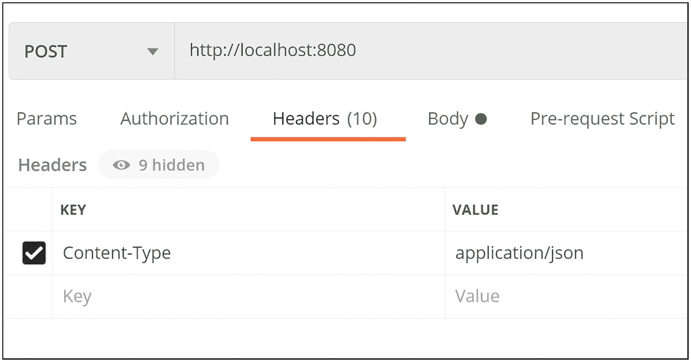

添加内容类型标头步骤的截图。顶部的栏显示：Post, http://localhost:8080。栏下方的选项卡列出了 Params、Authorization、Headers 10、Body 和 Pre-request script。Headers 包括 Key、Value；Content type、application/json。

图 7-12

添加 Content-Type 标头

注意

要构建并运行应用程序，请导航到包含 POM 文件的应用程序文件夹。运行命令 `mvn clean install` 来构建 JAR。导航到生成 JAR 文件的文件夹，并运行命令 `java -jar [jar name]` 来启动应用程序。

在 Postman 工具中发送 POST 请求，如图 7-13 所示。

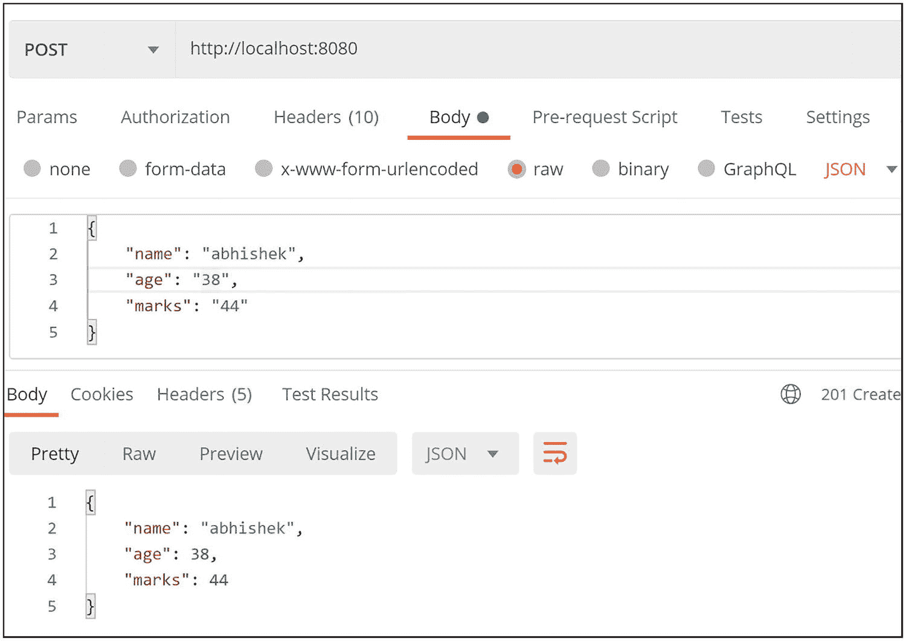

添加内容类型标头步骤的截图。顶部的栏显示：Post, http://localhost:8080。栏下方的选项卡列出了 Params、Authorization、Headers 10、Body、Pre-request script、Tests 和 Settings。Body 选项卡显示了 name、age 和 marks 的编码。

图 7-13

发送 POST 请求

转到 Azure 门户中 SQL Server 服务的查询编辑器，执行一个 select 查询，您可以看到插入的记录，如图 7-14 所示。

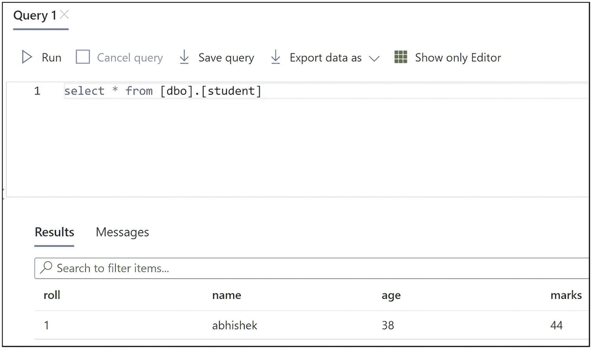

查询 1 页面的截图。顶部栏上的选项卡列出了 Run、Cancel query、Save query、Export data as 和 Show only editor。底部的选项卡列出了 Results 和 Messages。结果显示了列，包括 roll, 1；name, Abhishek；age, 38 和 marks, 44。

图 7-14

在查询编辑器中验证插入的记录

转到 Postman 工具并发送一个 GET 请求以获取所有插入的记录，如图 7-15 所示。

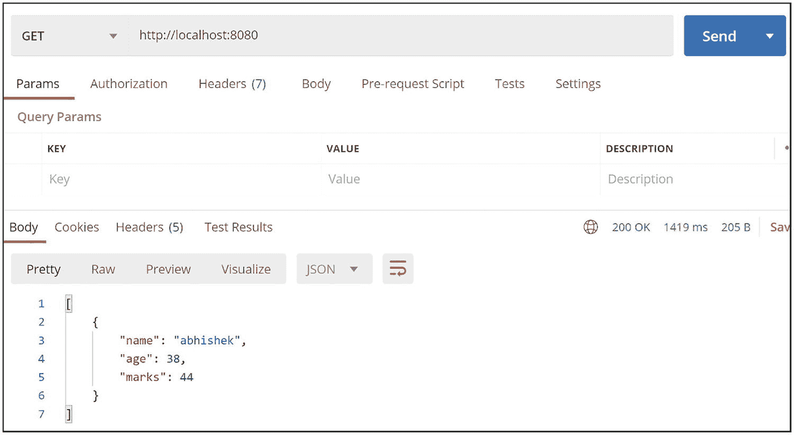

结果截图。顶部的栏显示：Get, http://localhost:8080。右上角的按钮标题为 Send。顶部栏下方的选项卡列出了 Params、Authorization、Headers 7、Body、Pre-request script、Tests 和 Settings。Params 选项卡包括查询参数。

图 7-15

获取结果

## 保护 Azure 数据库

让我们保护我们创建的 Azure 数据库。我们可以在 Azure SQL 服务器上设置防火墙，并指定谁可以访问数据库。如果需要，我们可以将数据库与虚拟网络集成，以确保数据库可以从虚拟网络内部私下访问。我们还可以有选择地允许一系列 IP 地址访问数据库。您可以通过为数据库启用 TLS 来管理传输中的数据，以确保数据通过安全通道传输。要启用防火墙，请转到 Azure 门户中 SQL 数据库的 *概述* 部分，并单击 *设置服务器防火墙*，如图 7-16 所示。

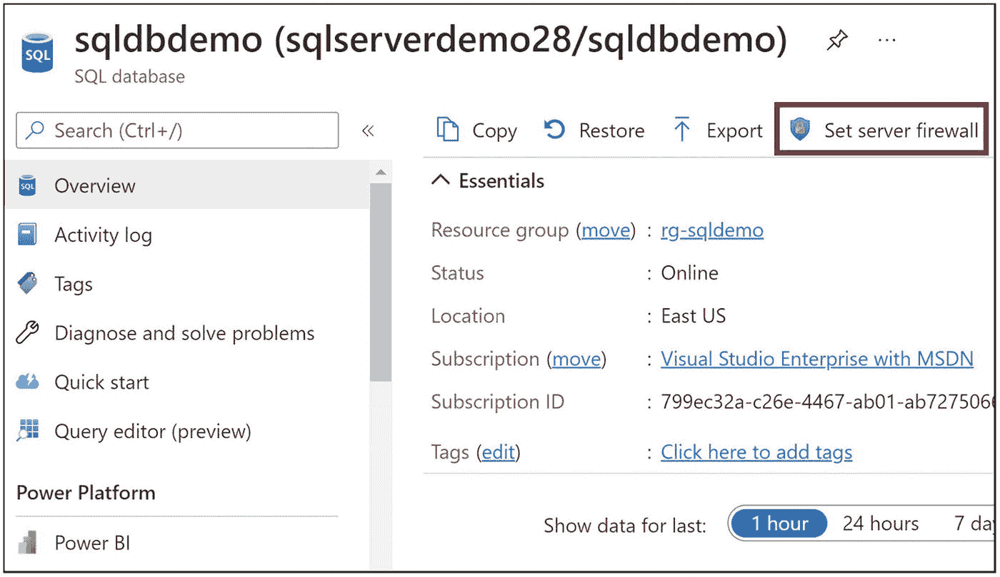

标题为 sqldbdemo, sqlserverdemo28/sqlbdemo 的服务器防火墙设置截图。设置服务器防火墙选项显示了基本信息，包括资源组、状态、位置、订阅、订阅 ID 和标签。显示数据的选项有 1 小时、24 小时和 7 天。

图 7-16

单击设置服务器防火墙

您可以管理防火墙设置，例如设置 TLS、将 IP 地址列入白名单以访问数据库等，如图 7-17 所示。

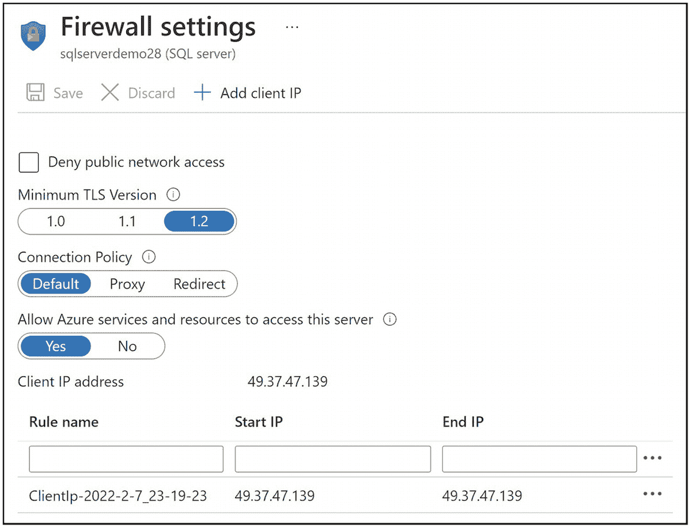

防火墙设置截图。设置选项包括：1. 最低 TLS 版本，1.0、1.1 和 1.2。2. 连接策略，默认、代理和重定向。3. 允许 Azure 服务和资源访问此服务器，是或否。4. 客户端 IP 地址，49.37.47.139。底部的空白列是规则名称、起始 IP 和结束 IP。

图 7-17

服务器防火墙

静态数据默认使用透明数据加密进行加密，如图 7-18 所示。不建议关闭此加密。

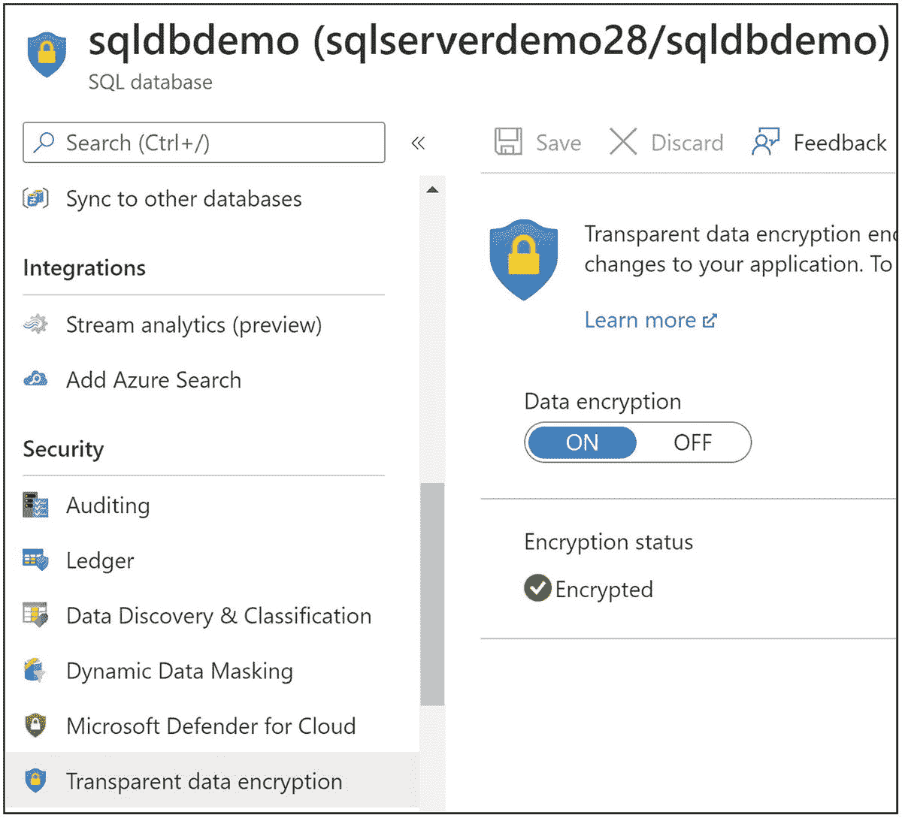

透明数据加密截图。数据加密显示开启和关闭选项。加密状态为已加密。右侧的选项卡包括同步到其他数据库、集成和安全。集成包括流分析和添加 Azure 搜索。安全包括审核、账本、数据发现与数据掩码、Microsoft Defender 和透明数据加密。

图 7-18

透明数据加密

## 总结

在本章中，我们学习了 Azure SQL 的详细信息，以及如何使用 Azure 门户创建 Azure SQL 数据库。然后，我们开发了一个 Java Spring Boot 代码，并在 Azure SQL 数据库上执行了插入和读取操作。在下一章中，我们将学习如何从 Java 应用程序以编程方式使用 Azure Cosmos DB。

以下是本章的关键要点：

*   Azure 提供关系型数据库，如 Microsoft SQL、MySQL、PostgreSQL 和 MariaDB，作为平台即服务产品。

*   您可以选择为 Azure SQL 部署一个由底层 Azure 平台完全管理并保证与其他数据库隔离的单一数据库，或者选择在共享 CPU 和内存等计算资源的弹性池上运行多个单一数据库。

*   Azure SQL 数据库不支持 Microsoft SQL Server 功能，如链接服务器、SQL 代理、SQL 数据同步、SQL 审核、服务代理等。但是，在这种情况下，您可以使用 Azure SQL 托管实例，它支持 Azure 上几乎所有本地 SQL Server 企业版的功能。


